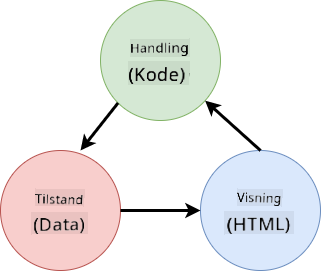

<!--
CO_OP_TRANSLATOR_METADATA:
{
  "original_hash": "4fa20c513e367e9cdd401bf49ae16e33",
  "translation_date": "2025-08-26T23:11:09+00:00",
  "source_file": "7-bank-project/4-state-management/README.md",
  "language_code": "da"
}
-->
# Byg en Bankapp Del 4: Koncepter for Tilstandshåndtering

## Quiz før Forelæsning

[Quiz før forelæsning](https://ff-quizzes.netlify.app/web/quiz/47)

### Introduktion

Når en webapplikation vokser, bliver det en udfordring at holde styr på alle dataflows. Hvilken kode henter data, hvilken side bruger det, hvor og hvornår skal det opdateres... det er nemt at ende med rodet kode, der er svær at vedligeholde. Dette gælder især, når du skal dele data mellem forskellige sider i din app, for eksempel brugerdata. Konceptet *tilstandshåndtering* har altid eksisteret i alle slags programmer, men efterhånden som webapps bliver mere komplekse, er det nu et nøglepunkt at tænke over under udviklingen.

I denne sidste del vil vi gennemgå den app, vi har bygget, for at genoverveje, hvordan tilstanden håndteres, så vi kan understøtte browseropdatering på ethvert tidspunkt og bevare data på tværs af brugersessioner.

### Forudsætninger

Du skal have gennemført [datahentning](../3-data/README.md)-delen af webappen for denne lektion. Du skal også installere [Node.js](https://nodejs.org) og [køre server-API'et](../api/README.md) lokalt, så du kan administrere kontodata.

Du kan teste, om serveren kører korrekt, ved at udføre denne kommando i en terminal:

```sh
curl http://localhost:5000/api
# -> should return "Bank API v1.0.0" as a result
```

---

## Genovervej tilstandshåndtering

I [den forrige lektion](../3-data/README.md) introducerede vi et grundlæggende koncept for tilstand i vores app med den globale `account`-variabel, som indeholder bankdata for den aktuelt loggede bruger. Men vores nuværende implementering har nogle mangler. Prøv at opdatere siden, når du er på dashboardet. Hvad sker der?

Der er 3 problemer med den nuværende kode:

- Tilstanden gemmes ikke, da en browseropdatering sender dig tilbage til login-siden.
- Der er flere funktioner, der ændrer tilstanden. Når appen vokser, kan det gøre det svært at holde styr på ændringerne, og det er nemt at glemme at opdatere én.
- Tilstanden ryddes ikke op, så når du klikker på *Log ud*, er kontodataene stadig der, selvom du er på login-siden.

Vi kunne opdatere vores kode for at tackle disse problemer ét ad gangen, men det ville skabe mere kodegentagelse og gøre appen mere kompleks og svær at vedligeholde. Eller vi kunne tage et par minutter og genoverveje vores strategi.

> Hvilke problemer prøver vi egentlig at løse her?

[Tilstandshåndtering](https://en.wikipedia.org/wiki/State_management) handler om at finde en god tilgang til at løse disse to specifikke problemer:

- Hvordan holder vi dataflows i en app forståelige?
- Hvordan holder vi tilstandsdata altid synkroniseret med brugergrænsefladen (og omvendt)?

Når du har taget hånd om disse, kan andre problemer, du måtte have, enten allerede være løst eller være blevet lettere at løse. Der er mange mulige tilgange til at løse disse problemer, men vi vil vælge en almindelig løsning, der består i **at centralisere dataene og måderne at ændre dem på**. Dataflows ville se sådan ud:



> Vi dækker ikke her den del, hvor data automatisk udløser opdatering af visningen, da det er knyttet til mere avancerede koncepter inden for [Reaktiv Programmering](https://en.wikipedia.org/wiki/Reactive_programming). Det er et godt emne at dykke ned i, hvis du er interesseret.

✅ Der findes mange biblioteker med forskellige tilgange til tilstandshåndtering, hvor [Redux](https://redux.js.org) er en populær mulighed. Tag et kig på de koncepter og mønstre, der bruges, da det ofte er en god måde at lære om potentielle problemer, du kan stå over for i store webapps, og hvordan de kan løses.

### Opgave

Vi starter med lidt refaktorering. Erstat `account`-deklarationen:

```js
let account = null;
```

Med:

```js
let state = {
  account: null
};
```

Ideen er at *centralisere* alle vores appdata i et enkelt tilstandsobjekt. Vi har kun `account` i tilstanden for nu, så det ændrer ikke meget, men det skaber en vej for fremtidige udvidelser.

Vi skal også opdatere de funktioner, der bruger det. I `register()`- og `login()`-funktionerne skal du erstatte `account = ...` med `state.account = ...`;

Øverst i `updateDashboard()`-funktionen skal du tilføje denne linje:

```js
const account = state.account;
```

Denne refaktorering i sig selv har ikke bragt mange forbedringer, men ideen var at lægge fundamentet for de næste ændringer.

## Spor dataændringer

Nu hvor vi har etableret `state`-objektet til at gemme vores data, er det næste skridt at centralisere opdateringerne. Målet er at gøre det lettere at holde styr på eventuelle ændringer og hvornår de sker.

For at undgå, at der foretages ændringer i `state`-objektet, er det også en god praksis at betragte det som [*uforanderligt*](https://en.wikipedia.org/wiki/Immutable_object), hvilket betyder, at det slet ikke kan ændres. Det betyder også, at du skal oprette et nyt tilstandsobjekt, hvis du vil ændre noget i det. Ved at gøre dette bygger du en beskyttelse mod potentielt uønskede [sideeffekter](https://en.wikipedia.org/wiki/Side_effect_(computer_science)) og åbner op for muligheder for nye funktioner i din app, som at implementere fortryd/gendan, samtidig med at det bliver lettere at fejlfinde. For eksempel kunne du logge hver ændring, der foretages i tilstanden, og holde en historik over ændringerne for at forstå kilden til en fejl.

I JavaScript kan du bruge [`Object.freeze()`](https://developer.mozilla.org/docs/Web/JavaScript/Reference/Global_Objects/Object/freeze) til at oprette en uforanderlig version af et objekt. Hvis du forsøger at foretage ændringer i et uforanderligt objekt, vil der blive rejst en undtagelse.

✅ Kender du forskellen mellem et *shallow* og et *deep* uforanderligt objekt? Du kan læse om det [her](https://developer.mozilla.org/docs/Web/JavaScript/Reference/Global_Objects/Object/freeze#What_is_shallow_freeze).

### Opgave

Lad os oprette en ny `updateState()`-funktion:

```js
function updateState(property, newData) {
  state = Object.freeze({
    ...state,
    [property]: newData
  });
}
```

I denne funktion opretter vi et nyt tilstandsobjekt og kopierer data fra den tidligere tilstand ved hjælp af [*spread (`...`) operatoren*](https://developer.mozilla.org/docs/Web/JavaScript/Reference/Operators/Spread_syntax#Spread_in_object_literals). Derefter overskriver vi en bestemt egenskab i tilstandsobjektet med de nye data ved hjælp af [bracket notation](https://developer.mozilla.org/docs/Web/JavaScript/Guide/Working_with_Objects#Objects_and_properties) `[property]` til tildeling. Til sidst låser vi objektet for at forhindre ændringer ved hjælp af `Object.freeze()`. Vi har kun `account`-egenskaben gemt i tilstanden for nu, men med denne tilgang kan du tilføje så mange egenskaber, som du har brug for i tilstanden.

Vi opdaterer også `state`-initialiseringen for at sikre, at den oprindelige tilstand også er låst:

```js
let state = Object.freeze({
  account: null
});
```

Derefter opdaterer vi `register`-funktionen ved at erstatte `state.account = result;`-tildelingen med:

```js
updateState('account', result);
```

Gør det samme med `login`-funktionen, og erstat `state.account = data;` med:

```js
updateState('account', data);
```

Vi benytter nu lejligheden til at løse problemet med, at kontodata ikke ryddes, når brugeren klikker på *Log ud*.

Opret en ny funktion `logout()`:

```js
function logout() {
  updateState('account', null);
  navigate('/login');
}
```

I `updateDashboard()` skal du erstatte omdirigeringen `return navigate('/login');` med `return logout();`

Prøv at registrere en ny konto, logge ud og logge ind igen for at kontrollere, at alt stadig fungerer korrekt.

> Tip: Du kan se alle tilstandsændringer ved at tilføje `console.log(state)` nederst i `updateState()` og åbne konsollen i din browsers udviklingsværktøjer.

## Bevar tilstanden

De fleste webapps har brug for at gemme data for at kunne fungere korrekt. Alle kritiske data gemmes normalt i en database og tilgås via et server-API, som for eksempel brugerens kontodata i vores tilfælde. Men nogle gange er det også interessant at gemme nogle data i klientappen, der kører i din browser, for at give en bedre brugeroplevelse eller forbedre indlæsningsydelsen.

Når du vil gemme data i din browser, er der nogle vigtige spørgsmål, du bør stille dig selv:

- *Er dataene følsomme?* Du bør undgå at gemme følsomme data på klienten, såsom brugeradgangskoder.
- *Hvor længe har du brug for at gemme disse data?* Planlægger du kun at tilgå disse data under den aktuelle session, eller vil du have dem gemt for evigt?

Der er flere måder at gemme information i en webapp på, afhængigt af hvad du vil opnå. For eksempel kan du bruge URL'er til at gemme en søgeforespørgsel og gøre den delbar mellem brugere. Du kan også bruge [HTTP-cookies](https://developer.mozilla.org/docs/Web/HTTP/Cookies), hvis dataene skal deles med serveren, som for eksempel [autentifikations](https://en.wikipedia.org/wiki/Authentication)-information.

En anden mulighed er at bruge en af de mange browser-API'er til at gemme data. To af dem er særligt interessante:

- [`localStorage`](https://developer.mozilla.org/docs/Web/API/Window/localStorage): en [Key/Value store](https://en.wikipedia.org/wiki/Key%E2%80%93value_database), der gør det muligt at gemme data, der er specifikke for det aktuelle websted, på tværs af forskellige sessioner. De data, der gemmes i den, udløber aldrig.
- [`sessionStorage`](https://developer.mozilla.org/docs/Web/API/Window/sessionStorage): denne fungerer på samme måde som `localStorage`, bortset fra at de data, der gemmes i den, slettes, når sessionen slutter (når browseren lukkes).

Bemærk, at begge disse API'er kun tillader at gemme [strings](https://developer.mozilla.org/docs/Web/JavaScript/Reference/Global_Objects/String). Hvis du vil gemme komplekse objekter, skal du serialisere dem til [JSON](https://developer.mozilla.org/docs/Web/JavaScript/Reference/Global_Objects/JSON)-formatet ved hjælp af [`JSON.stringify()`](https://developer.mozilla.org/docs/Web/JavaScript/Reference/Global_Objects/JSON/stringify).

✅ Hvis du vil oprette en webapp, der ikke arbejder med en server, er det også muligt at oprette en database på klienten ved hjælp af [`IndexedDB` API](https://developer.mozilla.org/docs/Web/API/IndexedDB_API). Denne er forbeholdt avancerede brugsscenarier eller hvis du har brug for at gemme betydelige mængder data, da den er mere kompleks at bruge.

### Opgave

Vi ønsker, at vores brugere forbliver logget ind, indtil de eksplicit klikker på *Log ud*-knappen, så vi bruger `localStorage` til at gemme kontodata. Først definerer vi en nøgle, som vi vil bruge til at gemme vores data.

```js
const storageKey = 'savedAccount';
```

Tilføj derefter denne linje i slutningen af `updateState()`-funktionen:

```js
localStorage.setItem(storageKey, JSON.stringify(state.account));
```

Med dette vil brugerens kontodata blive gemt og altid være opdateret, da vi tidligere centraliserede alle vores tilstandsopdateringer. Det er her, vi begynder at drage fordel af alle vores tidligere refaktoreringer 🙂.

Da dataene gemmes, skal vi også sørge for at gendanne dem, når appen indlæses. Da vi begynder at få mere initialiseringskode, kan det være en god idé at oprette en ny `init`-funktion, der også inkluderer vores tidligere kode nederst i `app.js`:

```js
function init() {
  const savedAccount = localStorage.getItem(storageKey);
  if (savedAccount) {
    updateState('account', JSON.parse(savedAccount));
  }

  // Our previous initialization code
  window.onpopstate = () => updateRoute();
  updateRoute();
}

init();
```

Her henter vi de gemte data, og hvis der er nogen, opdaterer vi tilstanden i overensstemmelse hermed. Det er vigtigt at gøre dette *før* opdatering af ruten, da der kan være kode, der afhænger af tilstanden under sideopdateringen.

Vi kan også gøre *Dashboard*-siden til vores applikations standardside, da vi nu gemmer kontodataene. Hvis der ikke findes data, sørger dashboardet for at omdirigere til *Login*-siden alligevel. I `updateRoute()` skal du erstatte fallbacken `return navigate('/login');` med `return navigate('/dashboard');`.

Log nu ind i appen og prøv at opdatere siden. Du bør forblive på dashboardet. Med den opdatering har vi taget hånd om alle vores oprindelige problemer...

## Opdater dataene

...Men vi har måske også skabt et nyt. Ups!

Gå til dashboardet ved hjælp af `test`-kontoen, og kør derefter denne kommando i en terminal for at oprette en ny transaktion:

```sh
curl --request POST \
     --header "Content-Type: application/json" \
     --data "{ \"date\": \"2020-07-24\", \"object\": \"Bought book\", \"amount\": -20 }" \
     http://localhost:5000/api/accounts/test/transactions
```

Prøv at opdatere dashboard-siden i browseren nu. Hvad sker der? Ser du den nye transaktion?

Tilstanden gemmes på ubestemt tid takket være `localStorage`, men det betyder også, at den aldrig opdateres, før du logger ud af appen og logger ind igen!

En mulig strategi for at løse det er at genindlæse kontodataene, hver gang dashboardet indlæses, for at undgå forældede data.

### Opgave

Opret en ny funktion `updateAccountData`:

```js
async function updateAccountData() {
  const account = state.account;
  if (!account) {
    return logout();
  }

  const data = await getAccount(account.user);
  if (data.error) {
    return logout();
  }

  updateState('account', data);
}
```

Denne metode tjekker, at vi i øjeblikket er logget ind, og genindlæser derefter kontodataene fra serveren.

Opret en anden funktion kaldet `refresh`:

```js
async function refresh() {
  await updateAccountData();
  updateDashboard();
}
```

Denne opdaterer kontodataene og tager sig derefter af at opdatere HTML'en på dashboard-siden. Det er den, vi skal kalde, når dashboard-ruten indlæses. Opdater rutedefinitionen med:

```js
const routes = {
  '/login': { templateId: 'login' },
  '/dashboard': { templateId: 'dashboard', init: refresh }
};
```

Prøv at genindlæse dashboardet nu, det bør vise de opdaterede kontodata.

---

## 🚀 Udfordring

Nu hvor vi genindlæser kontodataene, hver gang dashboardet indlæses, tror du så, at vi stadig har brug for at gemme *alle kontodata*?

Prøv at arbejde sammen om at ændre, hvad der gemmes og indlæses fra `localStorage`, så det kun inkluderer det, der absolut er nødvendigt for, at appen fungerer.

## Quiz efter Forelæsning
[Quiz efter forelæsning](https://ff-quizzes.netlify.app/web/quiz/48)

## Opgave

[Implementer dialogen "Tilføj transaktion"](assignment.md)

Her er et eksempel på resultatet efter at have fuldført opgaven:


---

**Ansvarsfraskrivelse**:  
Dette dokument er blevet oversat ved hjælp af AI-oversættelsestjenesten [Co-op Translator](https://github.com/Azure/co-op-translator). Selvom vi bestræber os på nøjagtighed, skal du være opmærksom på, at automatiserede oversættelser kan indeholde fejl eller unøjagtigheder. Det originale dokument på dets oprindelige sprog bør betragtes som den autoritative kilde. For kritisk information anbefales professionel menneskelig oversættelse. Vi er ikke ansvarlige for eventuelle misforståelser eller fejltolkninger, der måtte opstå som følge af brugen af denne oversættelse.