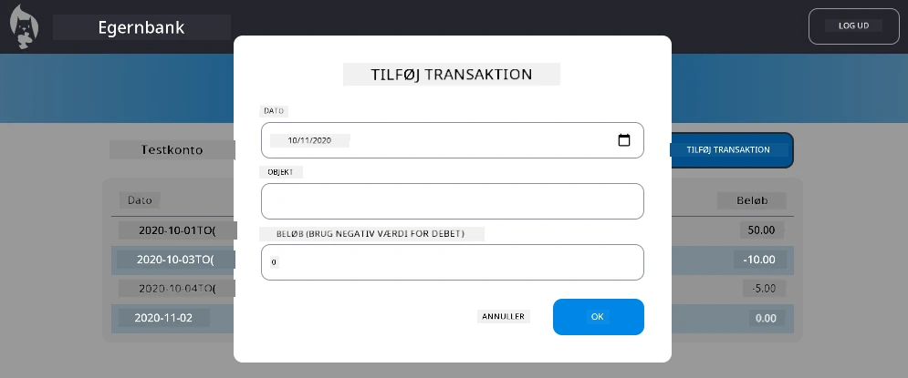

# Implementer "Tilføj Transaktion" Dialog

## Oversigt

Din bankapp har nu en solid tilstandshåndtering og datalagring, men mangler en afgørende funktion, som rigtige bankapps har brug for: muligheden for, at brugere kan tilføje deres egne transaktioner. I denne opgave skal du implementere en komplet "Tilføj Transaktion" dialog, der integreres problemfrit med dit eksisterende tilstandshåndteringssystem.

Denne opgave samler alt, hvad du har lært i de fire banklektioner: HTML-templating, formularhåndtering, API-integration og tilstandshåndtering.

## Læringsmål

Ved at fuldføre denne opgave vil du:
- **Oprette** en brugervenlig dialoggrænseflade til dataindtastning
- **Implementere** tilgængeligt formulardesign med understøttelse af tastatur og skærmlæser
- **Integrere** nye funktioner med dit eksisterende tilstandshåndteringssystem
- **Øve** API-kommunikation og fejlhåndtering
- **Anvende** moderne webudviklingsmønstre på en funktion fra den virkelige verden

## Instruktioner

### Trin 1: Tilføj Transaktion-knap

**Opret** en "Tilføj Transaktion"-knap på din dashboard-side, som brugerne nemt kan finde og få adgang til.

**Krav:**
- **Placér** knappen et logisk sted på dashboardet
- **Brug** tydelig, handlingsorienteret knaptekst
- **Design** knappen, så den matcher dit eksisterende UI-design
- **Sørg for**, at knappen er tastaturtilgængelig

### Trin 2: Implementering af dialog

Vælg en af disse to tilgange til implementering af din dialog:

**Mulighed A: Separat side**
- **Opret** en ny HTML-skabelon til transaktionsformularen
- **Tilføj** en ny rute til dit routingsystem
- **Implementer** navigation til og fra formularsiden

**Mulighed B: Modal dialog (anbefales)**
- **Brug** JavaScript til at vise/skjule dialogen uden at forlade dashboardet
- **Implementer** ved hjælp af [`hidden`-egenskaben](https://developer.mozilla.org/docs/Web/HTML/Global_attributes/hidden) eller CSS-klasser
- **Skab** en glidende brugeroplevelse med korrekt fokusstyring

### Trin 3: Implementering af tilgængelighed

**Sørg for**, at din dialog opfylder [tilgængelighedsstandarder for modale dialoger](https://developer.paciellogroup.com/blog/2018/06/the-current-state-of-modal-dialog-accessibility/):

**Tastaturnavigation:**
- **Understøt** Escape-tasten til at lukke dialogen
- **Fang** fokus inden for dialogen, når den er åben
- **Returnér** fokus til udløserknappen, når den er lukket

**Skærmlæserunderstøttelse:**
- **Tilføj** passende ARIA-labels og roller
- **Informer** skærmlæsere om åbning/lukning af dialogen
- **Giv** klare formularfeltetiketter og fejlmeddelelser

### Trin 4: Oprettelse af formular

**Design** en HTML-formular, der indsamler transaktionsdata:

**Påkrævede felter:**
- **Dato**: Hvornår transaktionen fandt sted
- **Beskrivelse**: Hvad transaktionen var til
- **Beløb**: Transaktionsværdi (positiv for indkomst, negativ for udgifter)

**Formularfunktioner:**
- **Valider** brugerinput før indsendelse
- **Giv** klare fejlmeddelelser for ugyldige data
- **Inkluder** nyttig pladsholdertekst og etiketter
- **Design** konsistent med dit eksisterende design

### Trin 5: API-integration

**Forbind** din formular til backend-API'et:

**Implementeringstrin:**
- **Gennemgå** [server-API-specifikationerne](../api/README.md) for det korrekte endpoint og dataformat
- **Opret** JSON-data fra dine formularinput
- **Send** dataene til API'et med passende fejlhåndtering
- **Vis** succes-/fejlmeddelelser til brugeren
- **Håndter** netværksfejl på en hensigtsmæssig måde

### Trin 6: Integration af tilstandshåndtering

**Opdater** dit dashboard med den nye transaktion:

**Integrationskrav:**
- **Opdater** kontodata efter vellykket tilføjelse af transaktion
- **Opdater** dashboardvisningen uden at kræve en sideopdatering
- **Sørg for**, at den nye transaktion vises med det samme
- **Oprethold** korrekt tilstandskonsistens gennem hele processen

## Tekniske specifikationer

**API Endpoint Detaljer:**
Se [server-API-dokumentationen](../api/README.md) for:
- Påkrævet JSON-format for transaktionsdata
- HTTP-metode og endpoint-URL
- Forventet svarformat
- Fejlhåndtering af svar

**Forventet resultat:**
Efter at have fuldført denne opgave, bør din bankapp have en fuldt funktionel "Tilføj Transaktion"-funktion, der ser professionel ud og fungerer perfekt:

## Test af din implementering

**Funktionel test:**
1. **Bekræft**, at "Tilføj Transaktion"-knappen er tydeligt synlig og tilgængelig
2. **Test**, at dialogen åbner og lukker korrekt
3. **Bekræft**, at formularvalidering fungerer for alle påkrævede felter
4. **Kontrollér**, at vellykkede transaktioner vises med det samme på dashboardet
5. **Sørg for**, at fejlhåndtering fungerer for ugyldige data og netværksproblemer

**Tilgængelighedstest:**
1. **Navigér** gennem hele flowet ved kun at bruge tastaturet
2. **Test** med en skærmlæser for at sikre korrekte meddelelser
3. **Bekræft**, at fokusstyring fungerer korrekt
4. **Kontrollér**, at alle formularfelter har passende etiketter

## Evalueringsrubrik

| Kriterier | Fremragende | Tilstrækkelig | Kræver forbedring |
| --------- | ----------- | ------------- | ----------------- |
| **Funktionalitet** | "Tilføj transaktion"-funktionen fungerer fejlfrit med fremragende brugeroplevelse og følger alle bedste praksis fra lektionerne | "Tilføj transaktion"-funktionen fungerer korrekt, men følger muligvis ikke nogle bedste praksis eller har mindre brugervenlighedsproblemer | "Tilføj transaktion"-funktionen fungerer delvist eller har betydelige brugervenlighedsproblemer |
| **Kodekvalitet** | Koden er velorganiseret, følger etablerede mønstre, inkluderer korrekt fejlhåndtering og integreres problemfrit med eksisterende tilstandshåndtering | Koden fungerer, men kan have nogle organisatoriske problemer eller inkonsekvente mønstre med den eksisterende kodebase | Koden har betydelige strukturelle problemer eller integreres ikke godt med eksisterende mønstre |
| **Tilgængelighed** | Fuld understøttelse af tastaturnavigation, skærmlæserkompatibilitet og følger WCAG-retningslinjer med fremragende fokusstyring | Grundlæggende tilgængelighedsfunktioner implementeret, men kan mangle nogle tastaturnavigations- eller skærmlæserfunktioner | Begrænsede eller ingen tilgængelighedsovervejelser implementeret |
| **Brugeroplevelse** | Intuitiv, poleret grænseflade med klar feedback, glidende interaktioner og professionelt udseende | God brugeroplevelse med mindre områder til forbedring i feedback eller visuelt design | Dårlig brugeroplevelse med forvirrende grænseflade eller mangel på brugerfeedback |

## Yderligere udfordringer (valgfrit)

Når du har fuldført de grundlæggende krav, kan du overveje disse forbedringer:

**Udvidede funktioner:**
- **Tilføj** transaktionskategorier (mad, transport, underholdning osv.)
- **Implementer** inputvalidering med realtidsfeedback
- **Opret** tastaturgenveje til avancerede brugere
- **Tilføj** funktioner til redigering og sletning af transaktioner

**Avanceret integration:**
- **Implementer** fortrydelsesfunktionalitet for nyligt tilføjede transaktioner
- **Tilføj** bulkimport af transaktioner fra CSV-filer
- **Opret** søge- og filtreringsfunktioner for transaktioner
- **Implementer** dataeksportfunktionalitet

Disse valgfrie funktioner vil hjælpe dig med at øve mere avancerede webudviklingskoncepter og skabe en mere komplet bankapplikation!

---

**Ansvarsfraskrivelse**:  
Dette dokument er blevet oversat ved hjælp af AI-oversættelsestjenesten [Co-op Translator](https://github.com/Azure/co-op-translator). Selvom vi bestræber os på nøjagtighed, skal du være opmærksom på, at automatiserede oversættelser kan indeholde fejl eller unøjagtigheder. Det originale dokument på dets oprindelige sprog bør betragtes som den autoritative kilde. For kritisk information anbefales professionel menneskelig oversættelse. Vi er ikke ansvarlige for eventuelle misforståelser eller fejltolkninger, der opstår som følge af brugen af denne oversættelse.