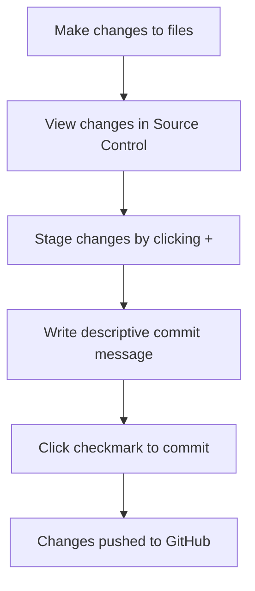

<!--
CO_OP_TRANSLATOR_METADATA:
{
  "original_hash": "cfd4a15974168ca426d50c67682ab9d4",
  "translation_date": "2025-10-23T21:54:24+00:00",
  "source_file": "8-code-editor/1-using-a-code-editor/README.md",
  "language_code": "da"
}
-->
# Brug af en kodeeditor: Mestering af VSCode.dev

Kan du huske i *The Matrix*, da Neo skulle tilslutte sig en enorm computerterminal for at få adgang til den digitale verden? Nutidens webudviklingsværktøjer er det stik modsatte – utroligt kraftfulde funktioner tilgængelige hvor som helst. VSCode.dev er en browserbaseret kodeeditor, der bringer professionelle udviklingsværktøjer til enhver enhed med internetforbindelse.

Ligesom trykpressen gjorde bøger tilgængelige for alle, ikke kun munke i klostre, demokratiserer VSCode.dev kodning. Du kan arbejde på projekter fra en bibliotekskomputer, et skolelaboratorium eller hvor som helst, du har adgang til en browser. Ingen installationer, ingen "jeg har brug for min specifikke opsætning"-begrænsninger.

Ved slutningen af denne lektion vil du forstå, hvordan du navigerer i VSCode.dev, åbner GitHub-repositorier direkte i din browser og bruger Git til versionskontrol – færdigheder, som professionelle udviklere stoler på dagligt.

## Hvad du vil lære

Når vi har gennemgået dette sammen, vil du kunne:

- Navigere i VSCode.dev som om det var dit andet hjem – finde alt, hvad du har brug for, uden at fare vild
- Åbne ethvert GitHub-repository i din browser og begynde at redigere med det samme (det her er ret magisk!)
- Bruge Git til at spore dine ændringer og gemme dine fremskridt som en professionel
- Forbedre din editor med udvidelser, der gør kodning hurtigere og sjovere
- Oprette og organisere projektfiler med selvtillid

## Hvad du skal bruge

Kravene er enkle:

- En gratis [GitHub-konto](https://github.com) (vi guider dig gennem oprettelsen, hvis det er nødvendigt)
- Grundlæggende kendskab til webbrowser
- Lektionen "GitHub Basics" giver nyttig baggrund, selvom det ikke er essentielt

> 💡 **Ny på GitHub?** Det er gratis at oprette en konto og tager kun få minutter. Ligesom et lånerkort til biblioteket giver dig adgang til bøger verden over, åbner en GitHub-konto dørene til kode-repositorier på internettet.

## Hvorfor webbaserede kodeeditorer er vigtige

Før internettet kunne forskere på forskellige universiteter ikke nemt dele forskning. Så kom ARPANET i 1960'erne, som forbandt computere over afstande. Webbaserede kodeeditorer følger samme princip – de gør kraftfulde værktøjer tilgængelige uanset din fysiske placering eller enhed.

En kodeeditor fungerer som dit udviklingsarbejdsområde, hvor du skriver, redigerer og organiserer kodefiler. I modsætning til simple teksteditorer tilbyder professionelle kodeeditorer syntaksfremhævning, fejldetektion og projektstyringsfunktioner.

VSCode.dev bringer disse funktioner til din browser:

**Fordele ved webbaseret redigering:**

| Funktion | Beskrivelse | Praktisk fordel |
|----------|-------------|-----------------|
| **Platformuafhængighed** | Fungerer på enhver enhed med en browser | Arbejd problemfrit fra forskellige computere |
| **Ingen installation nødvendig** | Adgang via en web-URL | Omgå softwareinstallationsbegrænsninger |
| **Automatiske opdateringer** | Kører altid den nyeste version | Få adgang til nye funktioner uden manuelle opdateringer |
| **Repository-integration** | Direkte forbindelse til GitHub | Rediger kode uden lokal filhåndtering |

**Praktiske implikationer:**
- Arbejd kontinuitet på tværs af forskellige miljøer
- Konsistent grænseflade uanset operativsystem
- Øjeblikkelige samarbejdsmuligheder
- Reducerede krav til lokal lagring

## Udforskning af VSCode.dev

Ligesom Marie Curies laboratorium indeholdt sofistikeret udstyr i et relativt enkelt rum, pakker VSCode.dev professionelle udviklingsværktøjer ind i en browsergrænseflade. Denne webapplikation tilbyder samme kernefunktionalitet som desktop-kodeeditorer.

Start med at navigere til [vscode.dev](https://vscode.dev) i din browser. Grænsefladen indlæses uden downloads eller systeminstallationer – en direkte anvendelse af cloud computing-principper.

### Tilslutning af din GitHub-konto

Ligesom Alexander Graham Bells telefon forbandt fjerne steder, forbinder tilknytning af din GitHub-konto VSCode.dev med dine kode-repositorier. Når du bliver bedt om at logge ind med GitHub, anbefales det at acceptere denne forbindelse.

**GitHub-integration giver:**
- Direkte adgang til dine repositorier inden for editoren
- Synkroniserede indstillinger og udvidelser på tværs af enheder
- Strømlinet gemmearbejdsgang til GitHub
- Personlig udviklingsmiljø

### Lær dit nye arbejdsområde at kende

Når alt er indlæst, vil du se et smukt rent arbejdsområde, der er designet til at holde dig fokuseret på det, der betyder noget – din kode!

**Her er din rundtur i nabolaget:**
- **Aktivitetslinje** (den stribe til venstre): Din hovednavigation med Explorer 📁, Søg 🔍, Versionskontrol 🌿, Udvidelser 🧩 og Indstillinger ⚙️
- **Sidebar** (panelet ved siden af): Ændres for at vise dig relevant info baseret på, hvad du har valgt
- **Editorområde** (det store rum i midten): Her sker magien – dit primære kodningsområde

**Tag et øjeblik til at udforske:**
- Klik rundt på ikonerne i aktivitetslinjen og se, hvad hver enkelt gør
- Bemærk, hvordan sidepanelet opdateres for at vise forskellig information – ret smart, ikke?
- Explorer-visningen (📁) er sandsynligvis der, hvor du vil bruge mest tid, så bliv komfortabel med den

## Åbning af GitHub-repositorier

Før internettet var forskere nødt til fysisk at rejse til biblioteker for at få adgang til dokumenter. GitHub-repositorier fungerer på samme måde – de er samlinger af kode, der er gemt eksternt. VSCode.dev eliminerer det traditionelle trin med at downloade repositorier til din lokale maskine, før du redigerer.

Denne funktion gør det muligt at få øjeblikkelig adgang til ethvert offentligt repository for visning, redigering eller bidrag. Her er to metoder til at åbne repositorier:

### Metode 1: Den klik-og-peg måde

Dette er perfekt, når du starter fra bunden i VSCode.dev og vil åbne et specifikt repository. Det er ligetil og brugervenligt:

**Sådan gør du:**

1. Gå til [vscode.dev](https://vscode.dev), hvis du ikke allerede er der
2. Find knappen "Open Remote Repository" på velkomstskærmen og klik på den

   

3. Indsæt en hvilken som helst GitHub-repository-URL (prøv denne: `https://github.com/microsoft/Web-Dev-For-Beginners`)
4. Tryk på Enter og se magien ske!

**Pro tip - Genvejen til Command Palette:**

Vil du føle dig som en kodningsmester? Prøv denne tastaturgenvej: Ctrl+Shift+P (eller Cmd+Shift+P på Mac) for at åbne Command Palette:

**Command Palette er som en søgemaskine for alt, hvad du kan gøre:**
- Skriv "open remote", og den finder repository-åbneren for dig
- Den husker repositorier, du har åbnet for nylig (super praktisk!)
- Når du vænner dig til den, vil du føle, at du koder med lynets hast
- Det er i bund og grund VSCode.dev's version af "Hey Siri, men for kodning"

### Metode 2: URL-modifikationsteknik

Ligesom hvordan HTTP og HTTPS bruger forskellige protokoller, mens de bevarer samme domænestruktur, bruger VSCode.dev et URL-mønster, der afspejler GitHubs adresseringssystem. Enhver GitHub-repository-URL kan ændres til at åbne direkte i VSCode.dev.

**URL-transformation mønster:**

| Repositorytype | GitHub URL | VSCode.dev URL |
|----------------|------------|----------------|
| **Offentligt repository** | `github.com/microsoft/Web-Dev-For-Beginners` | `vscode.dev/github/microsoft/Web-Dev-For-Beginners` |
| **Personligt projekt** | `github.com/dit-brugernavn/min-projekt` | `vscode.dev/github/dit-brugernavn/min-projekt` |
| **Ethvert tilgængeligt repo** | `github.com/deres-brugernavn/fantastisk-repo` | `vscode.dev/github/deres-brugernavn/fantastisk-repo` |

**Implementering:**
- Erstat `github.com` med `vscode.dev/github`
- Bevar alle andre URL-komponenter uændret
- Fungerer med ethvert offentligt tilgængeligt repository
- Giver øjeblikkelig adgang til redigering

> 💡 **Livsændrende tip**: Bogmærk VSCode.dev-versionerne af dine yndlingsrepositorier. Jeg har bogmærker som "Rediger min portefølje" og "Ret dokumentation", der tager mig direkte til redigeringstilstand!

**Hvilken metode skal du bruge?**
- **Grænseflademetoden**: God, når du udforsker eller ikke kan huske de præcise repository-navne
- **URL-tricket**: Perfekt til lynhurtig adgang, når du ved præcis, hvor du skal hen

## Arbejde med filer og projekter

Nu hvor du har åbnet et repository, lad os begynde at bygge! VSCode.dev giver dig alt, hvad du behøver for at oprette, redigere og organisere dine kodefiler. Tænk på det som dit digitale værksted – hvert værktøj er lige der, hvor du har brug for det.

Lad os dykke ned i de daglige opgaver, der vil udgøre størstedelen af din kodningsarbejdsgang.

### Oprettelse af nye filer

Ligesom organisering af tegninger på en arkitekts kontor følger filoprettelse i VSCode.dev en struktureret tilgang. Systemet understøtter alle standard webudviklingsfiltyper.

**Filoprettelsesproces:**

1. Naviger til den ønskede mappe i Explorer-sidepanelet
2. Hold musen over mappenavnet for at afsløre ikonet "Ny fil" (📄+)
3. Indtast filnavnet inklusive den passende filtype (`style.css`, `script.js`, `index.html`)
4. Tryk på Enter for at oprette filen

**Navngivningskonventioner:**
- Brug beskrivende navne, der angiver filens formål
- Inkluder filtyper for korrekt syntaksfremhævning
- Følg konsistente navngivningsmønstre i hele projektet
- Brug små bogstaver og bindestreger i stedet for mellemrum

### Redigering og gemning af filer

Her begynder det sjove! VSCode.dev's editor er fyldt med nyttige funktioner, der gør kodning glat og intuitiv. Det er som at have en virkelig smart skriveassistent, men for kode.

**Din redigeringsarbejdsgang:**

1. Klik på en hvilken som helst fil i Explorer for at åbne den i hovedområdet
2. Begynd at skrive og se, hvordan VSCode.dev hjælper dig med farver, forslag og fejlspotting
3. Gem dit arbejde med Ctrl+S (Windows/Linux) eller Cmd+S (Mac) – selvom det også gemmer automatisk!

**De seje ting, der sker, mens du koder:**
- Din kode bliver smukt farvekodet, så den er nem at læse
- VSCode.dev foreslår fuldførelser, mens du skriver (som autokorrektur, men meget smartere)
- Den fanger tastefejl og fejl, før du overhovedet gemmer
- Du kan have flere filer åbne i faner, ligesom i en browser
- Alt gemmes automatisk i baggrunden

> ⚠️ **Hurtigt tip**: Selvom auto-save har din ryg, er det stadig en god vane at trykke på Ctrl+S eller Cmd+S. Det gemmer alt med det samme og aktiverer nogle ekstra nyttige funktioner som fejlkontrol.

### Versionskontrol med Git

Ligesom arkæologer skaber detaljerede optegnelser over udgravningslag, sporer Git ændringer i din kode over tid. Dette system bevarer projektets historie og giver dig mulighed for at vende tilbage til tidligere versioner, når det er nødvendigt. VSCode.dev inkluderer integreret Git-funktionalitet.

**Source Control-grænseflade:**

1. Få adgang til Source Control-panelet via 🌿-ikonet i aktivitetslinjen
2. Ændrede filer vises i sektionen "Changes"
3. Farvekodning angiver ændringstyper: grøn for tilføjelser, rød for sletninger

**Gem dit arbejde (commit-arbejdsgang):**

**Her er din trin-for-trin proces:**
- Klik på "+"-ikonet ved siden af de filer, du vil gemme (dette "stager" dem)
- Dobbelttjek, at du er tilfreds med alle dine staged ændringer
- Skriv en kort note, der forklarer, hvad du gjorde (dette er din "commit-besked")
- Klik på checkmark-knappen for at gemme alt til GitHub
- Hvis du fortryder noget, giver fortrydelsesikonet dig mulighed for at kassere ændringer

**Skriv gode commit-beskeder (det er lettere, end du tror!):**
- Beskriv bare, hvad du gjorde, som "Tilføj kontaktformular" eller "Ret ødelagt navigation"
- Hold det kort og præcist – tænk tweet-længde, ikke essay
- Start med handlingsord som "Tilføj", "Ret", "Opdater" eller "Fjern"
- **Gode eksempler**: "Tilføj responsiv navigationsmenu", "Ret mobil layoutproblemer", "Opdater farver for bedre tilgængelighed"

> 💡 **Hurtig navigationstip**: Brug hamburger-menuen (☰) øverst til venstre for at hoppe tilbage til dit GitHub-repository og se dine committed ændringer online. Det er som en portal mellem dit redigeringsmiljø og dit projekts hjem på GitHub!

## Forbedring af funktionalitet med udvidelser

Ligesom en håndværkers værksted indeholder specialværktøjer til forskellige opgaver, kan VSCode.dev tilpasses med udvidelser, der tilføjer specifikke funktioner. Disse community-udviklede plugins adresserer almindelige udviklingsbehov som kodeformatering, live preview og forbedret Git-integration.

Udvidelsesmarkedet huser tusindvis af gratis værktøjer skabt af udviklere verden over. Hver udvidelse løser specifikke arbejdsgangsudfordringer, hvilket giver dig mulighed for at bygge et personligt udviklingsmiljø, der passer til dine specifikke behov og præferencer.

### Find dine perfekte udvidelser

Udvidelsesmarkedet er virkelig godt organiseret, så du ikke farer vild, når du leder efter det, du har brug for. Det er designet til at hjælpe dig med at finde både specifikke værktøjer og spændende ting, du ikke engang vidste eksisterede!

**Sådan kommer du til markedet:**

1. Klik på Udvidelsesikonet (🧩) i aktivitetslinjen
2. Gennemse eller søg efter noget specifikt
3. Klik på alt, der ser interessant ud, for at lære mere om det

**Hvad du vil se derinde:**

| Sektion | Hvad er der indeni | Hvorfor det er nyttigt |
|---------|---------------------|------------------------|
| **Installeret** | Udvidelser, du allerede har tilføjet | Dit personlige kodningsværktøjssæt |
| **Populær** | Favoritter blandt udviklere | Hvad de fleste udviklere sværger til |
| **Anbefalet** | Smarte forslag til dit projekt | VSCode.dev's nyttige anbefalinger |

**Hvad gør browsing nemt:**
- Hver udvidelse viser bedømmelser, antal downloads og anmeldelser fra rigtige brugere
- Du får skærmbilleder og klare beskrivelser af, hvad hver enkelt gør
- Alt er tydeligt markeret med kompatibilitetsinformation
- Lignende udvidelser foreslås, så du kan sammenligne muligheder

### Installation af udvidelser (Det er super nemt!)

At tilføje nye funktioner til din editor er lige så enkelt som at klikke på en knap. Udvidelser installeres på få sekunder og begynder at fungere med det samme – ingen genstart, ingen ventetid.

**Sådan gør du:**

1. Søg efter det, du har brug for (prøv at søge efter "live server" eller "prettier")
2. Klik på en, der ser interessant ud, for at se flere detaljer
3. Læs om, hvad den gør, og tjek bedømmelserne
4. Tryk på den blå "Installér"-knap, og så er du færdig!

**Hvad sker der bag kulisserne:**
- Udvidelsen downloades og konfigureres automatisk
- Nye funktioner vises straks i din grænseflade
- Alt begynder at fungere med det samme (seriøst, det går så hurtigt!)
- Hvis du er logget ind, synkroniseres udvidelsen til alle dine enheder

**Nogle udvidelser, jeg vil anbefale at starte med:**
- **Live Server**: Se din hjemmeside opdatere i realtid, mens du koder (denne er magisk!)
- **Prettier**: Gør din kode automatisk ren og professionel
- **Auto Rename Tag**: Ændr én HTML-tag, og dens partner opdateres også
- **Bracket Pair Colorizer**: Farvekoder dine parenteser, så du aldrig farer vild
- **GitLens**: Forbedrer dine Git-funktioner med masser af nyttige oplysninger

### Tilpasning af dine udvidelser

De fleste udvidelser har indstillinger, du kan justere, så de fungerer præcis, som du ønsker. Tænk på det som at justere sædet og spejlene i en bil – alle har deres præferencer!

**Sådan justerer du udvidelsesindstillinger:**

1. Find din installerede udvidelse i Udvidelsespanelet
2. Kig efter det lille tandhjulsikon (⚙️) ved siden af dens navn, og klik på det
3. Vælg "Udvidelsesindstillinger" fra dropdown-menuen
4. Juster indstillingerne, indtil de passer perfekt til din arbejdsgang

**Almindelige ting, du måske vil justere:**
- Hvordan din kode bliver formateret (tabs vs mellemrum, linjelængde osv.)
- Hvilke tastaturgenveje der udløser forskellige handlinger
- Hvilke filtyper udvidelsen skal fungere med
- Tænd/sluk specifikke funktioner for at holde tingene overskuelige

### Organisering af dine udvidelser

Når du opdager flere spændende udvidelser, vil du gerne holde din samling ryddelig og velfungerende. VSCode.dev gør det virkelig nemt at administrere.

**Dine muligheder for udvidelsesadministration:**

| Hvad du kan gøre | Hvornår det er nyttigt | Pro Tip |
|--------|---------|----------|
| **Deaktiver** | Teste om en udvidelse forårsager problemer | Bedre end at afinstallere, hvis du måske vil have den tilbage |
| **Afinstaller** | Fjerne udvidelser, du ikke har brug for | Holder dit miljø rent og hurtigt |
| **Opdater** | Få de nyeste funktioner og fejlrettelser | Sker normalt automatisk, men det er værd at tjekke |

**Sådan administrerer jeg mine udvidelser:**
- Hver tredje måned gennemgår jeg, hvad jeg har installeret, og fjerner alt, jeg ikke bruger
- Jeg holder udvidelser opdateret, så jeg får de nyeste forbedringer og sikkerhedsrettelser
- Hvis noget virker langsomt, deaktiverer jeg midlertidigt udvidelser for at se, om en af dem er årsagen
- Jeg læser opdateringsnoterne, når udvidelser får større opdateringer – nogle gange er der spændende nye funktioner!

> ⚠️ **Ydelsestip**: Udvidelser er fantastiske, men for mange kan gøre tingene langsomme. Fokuser på dem, der virkelig gør dit liv lettere, og vær ikke bange for at afinstallere dem, du aldrig bruger.

## GitHub Copilot Agent Challenge 🚀

Ligesom den strukturerede tilgang NASA bruger til rumfartsmissioner, involverer denne udfordring systematisk anvendelse af VSCode.dev-færdigheder i en komplet arbejdsgang.

**Mål:** Demonstrer færdigheder med VSCode.dev ved at etablere en omfattende webudviklingsarbejdsgang.

**Projektkrav:** Brug Agent mode assistance til at fuldføre disse opgaver:
1. Fork en eksisterende repository eller opret en ny
2. Etabler en funktionel projektstruktur med HTML-, CSS- og JavaScript-filer
3. Installer og konfigurer tre udvidelser, der forbedrer udviklingen
4. Øv versionskontrol med beskrivende commit-beskeder
5. Eksperimentér med oprettelse og ændring af feature branches
6. Dokumentér processen og læringer i en README.md-fil

Denne øvelse samler alle VSCode.dev-koncepterne i en praktisk arbejdsgang, der kan anvendes på fremtidige udviklingsprojekter.

Læs mere om [agent mode](https://code.visualstudio.com/blogs/2025/02/24/introducing-copilot-agent-mode) her.

## Opgave

Tid til at teste disse færdigheder i praksis! Jeg har et praktisk projekt, der lader dig øve alt, vi har dækket: [Opret et CV-websted ved hjælp af VSCode.dev](./assignment.md)

Denne opgave guider dig gennem opbygningen af et professionelt CV-websted helt i din browser. Du vil bruge alle de VSCode.dev-funktioner, vi har udforsket, og når du er færdig, har du både et flot websted og solid selvtillid i din nye arbejdsgang.

## Fortsæt med at udforske og udvikle dine færdigheder

Du har nu et solidt fundament, men der er så meget mere spændende at opdage! Her er nogle ressourcer og idéer til at tage dine VSCode.dev-færdigheder til det næste niveau:

**Officielle dokumenter, der er værd at bogmærke:**
- [VSCode Web Dokumentation](https://code.visualstudio.com/docs/editor/vscode-web?WT.mc_id=academic-0000-alfredodeza) – Den komplette guide til browserbaseret redigering
- [GitHub Codespaces](https://docs.github.com/en/codespaces) – Når du vil have endnu mere kraft i skyen

**Spændende funktioner at eksperimentere med næste gang:**
- **Tastaturgenveje**: Lær de tastkombinationer, der får dig til at føle dig som en kode-ninja
- **Arbejdsområder**: Opsæt forskellige miljøer til forskellige typer projekter
- **Multi-root Workspaces**: Arbejd på flere repositories samtidig (super praktisk!)
- **Terminalintegration**: Få adgang til kommandolinjeværktøjer direkte i din browser

**Idéer til øvelse:**
- Deltag i nogle open-source-projekter og bidrag ved hjælp af VSCode.dev – det er en fantastisk måde at give tilbage!
- Prøv forskellige udvidelser for at finde din perfekte opsætning
- Opret projektskabeloner til de typer af websteder, du oftest bygger
- Øv Git-arbejdsgange som branching og merging – disse færdigheder er guld værd i teamprojekter

---

**Du har mestret browserbaseret udvikling!** 🎉 Ligesom opfindelsen af bærbare instrumenter gjorde det muligt for forskere at udføre forskning på fjerntliggende steder, gør VSCode.dev professionel kodning mulig fra enhver internetforbundet enhed.

Disse færdigheder afspejler aktuelle industripraksisser – mange professionelle udviklere bruger cloud-baserede udviklingsmiljøer for deres fleksibilitet og tilgængelighed. Du har lært en arbejdsgang, der skalerer fra individuelle projekter til store team-samarbejder.

Anvend disse teknikker på dit næste udviklingsprojekt! 🚀

---

**Ansvarsfraskrivelse**:  
Dette dokument er blevet oversat ved hjælp af AI-oversættelsestjenesten [Co-op Translator](https://github.com/Azure/co-op-translator). Selvom vi bestræber os på nøjagtighed, skal det bemærkes, at automatiserede oversættelser kan indeholde fejl eller unøjagtigheder. Det originale dokument på dets oprindelige sprog bør betragtes som den autoritative kilde. For kritisk information anbefales professionel menneskelig oversættelse. Vi er ikke ansvarlige for eventuelle misforståelser eller fejltolkninger, der opstår som følge af brugen af denne oversættelse.