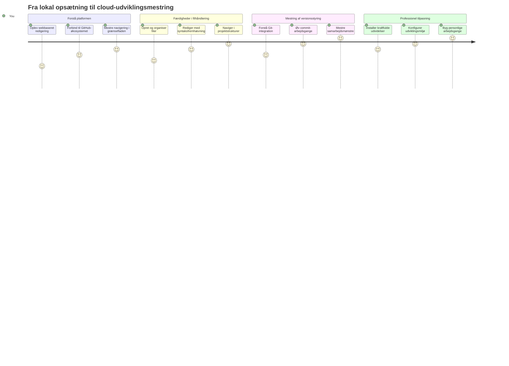
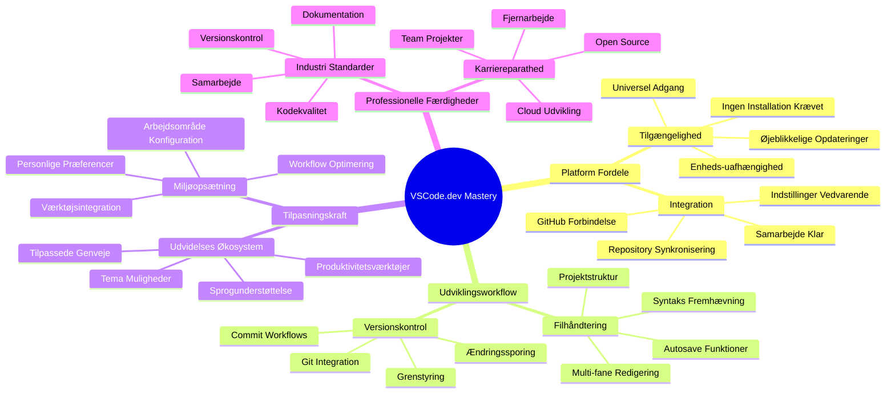
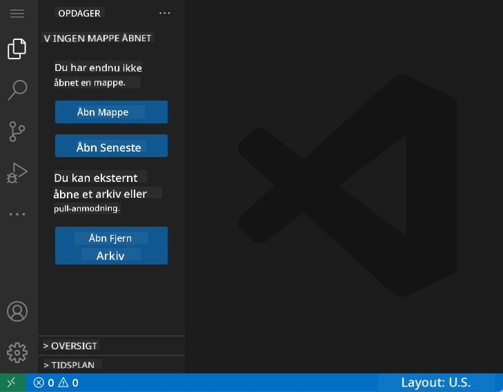
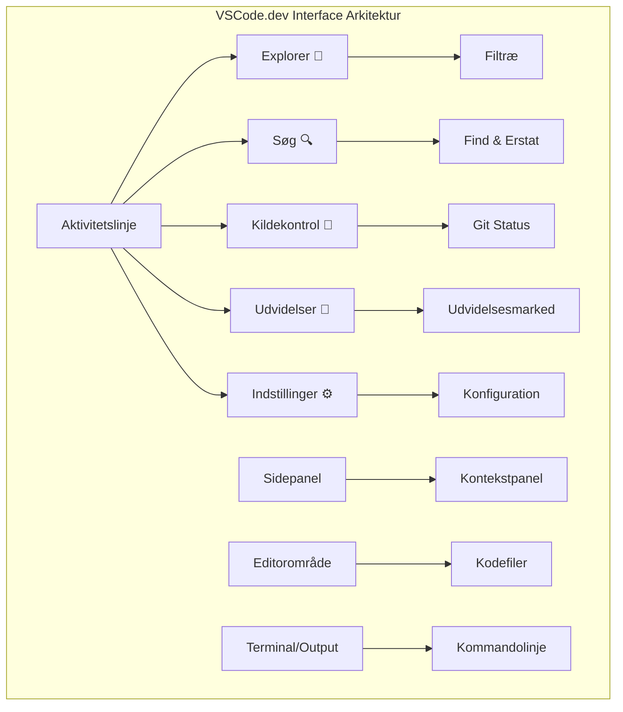
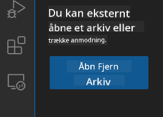
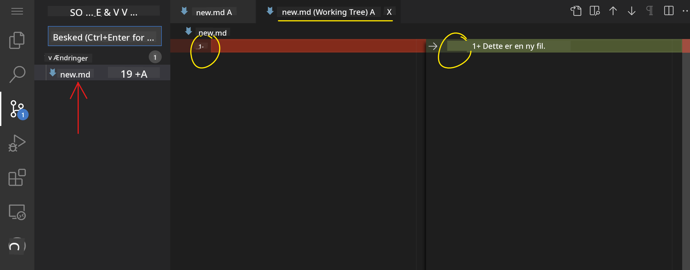
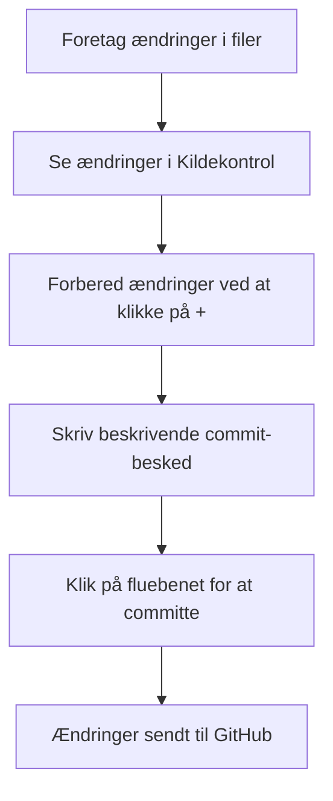
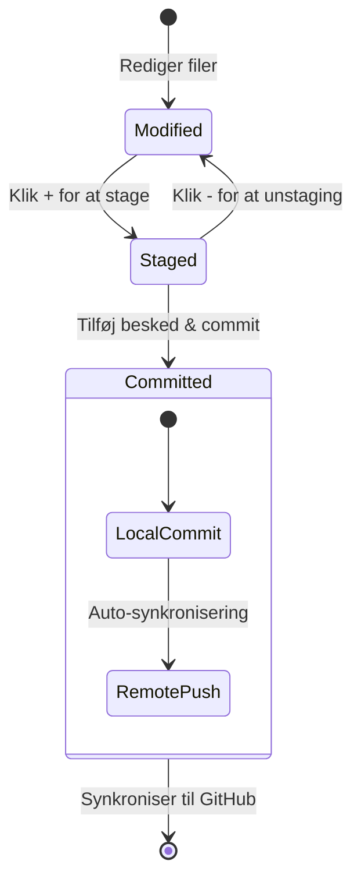
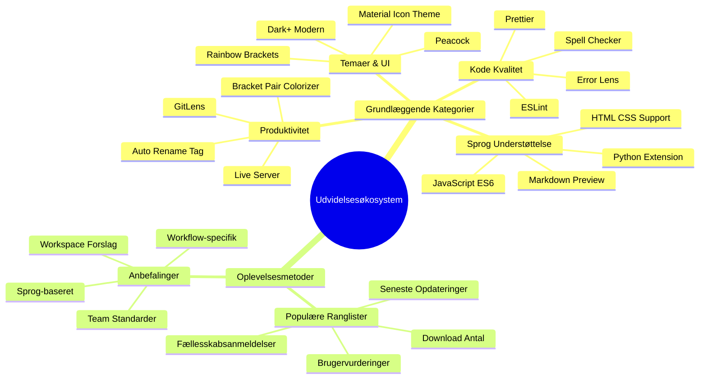
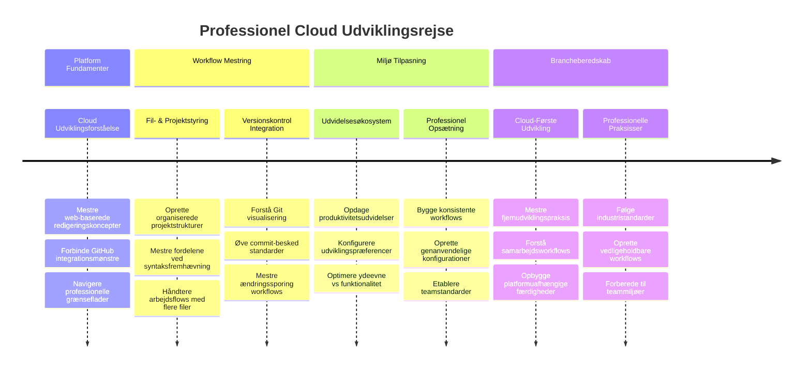

<!--
CO_OP_TRANSLATOR_METADATA:
{
  "original_hash": "a9a3bcc037a447e2d8994d99e871cd9f",
  "translation_date": "2026-01-06T23:34:50+00:00",
  "source_file": "8-code-editor/1-using-a-code-editor/README.md",
  "language_code": "da"
}
-->
# Brug af en kodeeditor: Mestring af VSCode.dev

Kan du huske i *The Matrix*, da Neo skulle tilslutte sig en kæmpe computerterminal for at få adgang til den digitale verden? Nutidens webudviklingsværktøjer er det modsatte – utroligt kraftfulde muligheder, der er tilgængelige fra hvor som helst. VSCode.dev er en browserbaseret kodeeditor, der bringer professionelle udviklingsværktøjer til enhver enhed med internetforbindelse.

Ligesom bogtrykkerkunsten gjorde bøger tilgængelige for alle, ikke kun skrivere i klostre, demokratiserer VSCode.dev kodning. Du kan arbejde på projekter fra en bibliotekscomputer, et skollaboratorium eller hvor som helst, du har browseradgang. Ingen installationer, ingen "jeg har brug for min specifikke opsætning"-begrænsninger.

Ved slutningen af denne lektion vil du forstå, hvordan du navigerer i VSCode.dev, åbner GitHub-repositorier direkte i din browser og bruger Git til versionskontrol – alle færdigheder, som professionelle udviklere dagligt er afhængige af.

## ⚡ Hvad du kan gøre på de næste 5 minutter

**Hurtigstart for travle udviklere**


- **Minut 1**: Gå til [vscode.dev](https://vscode.dev) - ingen installation nødvendig
- **Minut 2**: Log ind med GitHub for at forbinde dine repositories
- **Minut 3**: Prøv URL-tricket: skift `github.com` til `vscode.dev/github` i enhver repo-URL
- **Minut 4**: Opret en ny fil og se, hvordan syntaksfremhævning virker automatisk
- **Minut 5**: Foretag en ændring og commit den via panelet Kildekontrol

**Hurtig test-URL**:
```
# Transform this:
github.com/microsoft/Web-Dev-For-Beginners

# Into this:
vscode.dev/github/microsoft/Web-Dev-For-Beginners
```

**Hvorfor det er vigtigt**: På 5 minutter vil du opleve friheden ved at kode overalt med professionelle værktøjer. Dette repræsenterer fremtidens udvikling – tilgængelig, kraftfuld og øjeblikkelig.

## 🗺️ Din læringsrejse gennem cloud-baseret udvikling


**Dit destinationsmål**: Ved slutningen af denne lektion vil du have mestret et professionelt cloud-udviklingsmiljø, der fungerer fra enhver enhed, så du kan kode med de samme værktøjer, som udviklere i store tech-virksomheder bruger.

## Hvad du vil lære

Efter at vi har gennemgået dette sammen, vil du kunne:

- Navigere i VSCode.dev som var det dit andet hjem – finde alt, du har brug for uden at gå tabt
- Åbne ethvert GitHub-repositorium i din browser og begynde at redigere med det samme (det her er ret magisk!)
- Bruge Git til at spore dine ændringer og gemme dit fremskridt som en professionel
- Boost din editor med extensions, der gør kodning hurtigere og sjovere
- Oprette og organisere projektfiler med selvtillid

## Hvad du skal bruge

Kravene er ligetil:

- En gratis [GitHub-konto](https://github.com) (vi guider dig gennem oprettelsen, hvis nødvendigt)
- Grundlæggende kendskab til webbrowsere
- GitHub Basics-lektionen giver nyttig baggrund, men er ikke nødvendig

> 💡 **Ny til GitHub?** Oprettelse af en konto er gratis og tager minutter. Ligesom et bibliotekskort giver dig adgang til bøger verden over, åbner en GitHub-konto dørene til kode repositories på internettet.

## 🧠 Overblik over cloud-udviklingsøkosystemet


**Kerneprincip**: Cloud-baserede udviklingsmiljøer repræsenterer fremtiden for kodning – de tilbyder professionelle værktøjer, der er tilgængelige, samarbejdsorienterede og platformuafhængige.

## Hvorfor webbaserede kodeeditorer er vigtige

Før internettet kunne forskere på forskellige universiteter ikke nemt dele forskning. Så kom ARPANET i 1960’erne, som forbandt computere på tværs af afstande. Webbaserede kodeeditorer følger samme princip – at gøre kraftfulde værktøjer tilgængelige uanset din fysiske placering eller enhed.

En kodeeditor fungerer som dit udviklingsarbejdsrum, hvor du skriver, redigerer og organiserer kodefiler. I modsætning til simple teksteditorer tilbyder professionelle kodeeditorer syntaksfremhævning, fejldetektion og projektstyringsfunktioner.

VSCode.dev bringer disse muligheder til din browser:

**Fordele ved webbaseret redigering:**

| Funktion | Beskrivelse | Praktisk fordel |
|---------|-------------|----------------|
| **Platform-uafhængighed** | Kører på enhver enhed med en browser | Arbejd problemfrit fra forskellige computere |
| **Ingen installation nødvendig** | Adgang via en web-URL | Omgå softwareinstallationsbegrænsninger |
| **Automatiske opdateringer** | Kører altid den nyeste version | Få nye funktioner uden manuel opdatering |
| **Repository-integration** | Direkte forbindelse til GitHub | Rediger kode uden lokal filhåndtering |

**Praktiske implikationer:**
- Arbejdsfortsættelse på tværs af forskellige miljøer
- Konsistent interface uanset operativsystem
- Øjeblikkelige samarbejdsmuligheder
- Reduceret krav til lokal lagring

## Udforskning af VSCode.dev

Ligesom Marie Curies laboratorium indeholdt sofistikeret udstyr på et relativt enkelt sted, pakker VSCode.dev professionelle udviklingsværktøjer ind i en browsergrænseflade. Denne webapplikation tilbyder den samme kernefunktionalitet som desktop kodeeditorer.

Begynd ved at gå til [vscode.dev](https://vscode.dev) i din browser. Interfacet indlæses uden downloads eller systeminstallationer – en direkte anvendelse af cloud computing-principper.

### Forbind din GitHub-konto

Ligesom Alexander Graham Bells telefon forbandt fjerne steder, forbinder det at linke din GitHub-konto VSCode.dev med dine kode repositories. Når du bliver bedt om at logge på med GitHub, anbefales det at acceptere denne forbindelse.

**GitHub-integration giver:**
- Direkte adgang til dine repositories i editoren
- Synkroniserede indstillinger og extensions på tværs af enheder
- Strømlinet gemmearbejdsgang til GitHub
- Personligt udviklingsmiljø

### Lær dit nye arbejdsområde at kende

Når alt er indlæst, vil du se et smukt rent arbejdsområde designet til at holde dig fokuseret på det, der betyder noget – din kode!



**Her er din rundvisning i nabolaget:**
- **Aktivitetslinje** (den stribe til venstre): Din primære navigation med Explorer 📁, Søg 🔍, Kildekontrol 🌿, Extensions 🧩 og Indstillinger ⚙️
- **Sidebar** (panelet ved siden af): Skifter for at vise relevant info baseret på hvad du har valgt
- **Editorområde** (det store område i midten): Her sker magien – dit primære kodningsområde

**Tag et øjeblik til at udforske:**
- Klik på ikonerne i Aktivitetslinjen og se, hvad hver gør
- Bemærk hvordan sidepanelet opdateres til at vise forskellig information – ret fedt, ikke?
- Explorer-visningen (📁) er nok hvor du vil bruge mest tid, så bliv godt tilpas med den


## Åbning af GitHub-repositorier

Før internettet skulle forskere fysisk rejse til biblioteker for at få adgang til dokumenter. GitHub-repositorier fungerer på samme måde – de er samlinger af kode, der er lagret eksternt. VSCode.dev eliminerer det traditionelle trin med at downloade repositories til din lokale maskine før redigering.

Denne funktion muliggør øjeblikkelig adgang til ethvert offentligt repository til visning, redigering eller bidrag. Her er to metoder til at åbne repositories:

### Metode 1: Peg-og-klik-metoden

Den er perfekt, når du starter frisk i VSCode.dev og vil åbne et specifikt repository. Den er ligetil og begyndervenlig:

**Sådan gør du:**

1. Gå til [vscode.dev](https://vscode.dev), hvis du ikke allerede er der
2. Find knappen "Open Remote Repository" på velkomstskærmen og klik på den

   

3. Indsæt en hvilken som helst GitHub repository URL (prøv denne: `https://github.com/microsoft/Web-Dev-For-Beginners`)
4. Tryk Enter og se magien ske!

**Pro tip - Genvej til Kommandopalletten:**

Vil du føle dig som en kode-troldmand? Prøv denne tastaturgenvej: Ctrl+Shift+P (eller Cmd+Shift+P på Mac) for at åbne Kommandopalletten:


**Kommandopalletten er som en søgemaskine til alt, hvad du kan gøre:**
- Skriv "open remote" og den finder repository-åbneren for dig
- Den husker repositories, du har åbnet for nylig (super praktisk!)
- Når du bliver vant til den, vil du føle, du koder lynhurtigt
- Det er grundlæggende VSCode.dev's version af "Hey Siri, men til kodning"

### Metode 2: URL-ændringsteknikken

Ligesom HTTP og HTTPS bruger forskellige protokoller, men bevarer samme domænestruktur, bruger VSCode.dev et URL-mønster, der spejler GitHubs adresseringssystem. Enhver GitHub-repository-URL kan ændres, så den åbnes direkte i VSCode.dev.

**URL-omdannelsesmønster:**

| Repository-type | GitHub-URL | VSCode.dev-URL |
|----------------|---------------------|----------------|
| **Offentligt repository** | `github.com/microsoft/Web-Dev-For-Beginners` | `vscode.dev/github/microsoft/Web-Dev-For-Beginners` |
| **Personligt projekt** | `github.com/your-username/my-project` | `vscode.dev/github/your-username/my-project` |
| **Ethvert tilgængeligt repo** | `github.com/their-username/awesome-repo` | `vscode.dev/github/their-username/awesome-repo` |

**Implementering:**
- Erstat `github.com` med `vscode.dev/github`
- Bevar alle øvrige URL-komponenter uændrede
- Virker med ethvert offentligt tilgængeligt repository
- Giver øjeblikkelig redigeringsadgang

> 💡 **Livsændrende tip**: Bogmærk VSCode.dev-versionerne af dine yndlingsrepositories. Jeg har bogmærker som "Edit My Portfolio" og "Fix Documentation", som tager mig direkte til redigeringstilstand!

**Hvilken metode skal du bruge?**
- **Interface-metoden**: God, når du udforsker eller ikke kan huske præcise repository-navne
- **URL-tricket**: Perfekt til lynhurtig adgang, når du ved præcis, hvor du skal hen

### 🎯 Pædagogisk check-in: Adgang til cloud-udvikling

**Pause og refleksion**: Du har netop lært to måder at få adgang til koderepositorier via en webbrowser. Det repræsenterer et fundamentalt skift i, hvordan udvikling fungerer.

**Hurtig selvevaluering**:
- Kan du forklare, hvorfor webbaseret redigering eliminerer den traditionelle "opsætning af udviklingsmiljø"?
- Hvilke fordele giver URL-ændringsteknikken i forhold til lokal git-kloning?
- Hvordan ændrer denne tilgang måden, du måske bidrager til open source-projekter på?

**Virkelighedsforbindelse**: Store virksomheder som GitHub, GitLab og Replit har bygget deres udviklingsplatforme omkring disse cloud-first-principper. Du lærer de samme arbejdsgange, som professionelle udviklingsteams verden over bruger.

**Udfordrende spørgsmål**: Hvordan kan cloud-baseret udvikling ændre måden, kodning undervises på i skoler? Overvej enhedskrav, softwarehåndtering og muligheder for samarbejde.

## Arbejde med filer og projekter

Nu hvor du har et repository åbent, lad os begynde at bygge! VSCode.dev giver dig alt, hvad du behøver for at oprette, redigere og organisere dine kodefiler. Tænk på det som dit digitale værksted – hvert værktøj er lige, hvor du har brug for det.

Lad os dykke ned i de daglige opgaver, der vil udgøre størstedelen af din kodningsarbejdsgang.

### Oprettelse af nye filer

Ligesom at organisere blåtryk på en arkitekts kontor følger filoprettelse i VSCode.dev en struktureret fremgangsmåde. Systemet understøtter alle standardfiltyper til webudvikling.

**Filoprettelsesproces:**

1. Naviger til den ønskede mappe i Explorer sidepanelet
2. Hold musen over mappenavnet for at afsløre "Ny fil"-ikonet (📄+)
3. Indtast filnavnet inklusive den korrekte filendelse (`style.css`, `script.js`, `index.html`)
4. Tryk Enter for at oprette filen


**Navngivningskonventioner:**
- Brug beskrivende navne, der angiver filens formål
- Inkluder filendelser for korrekt syntaksfremhævning
- Følg konsistente navngivningsmønstre på tværs af projekter
- Brug små bogstaver og bindestreger i stedet for mellemrum

### Redigering og gemning af filer

Her begynder det sjove! VSCode.dev’s editor er fyldt med hjælpsomme funktioner, der får kodning til at føles glat og intuitiv. Det er som at have en virkelig klog skriveassistent, men til kode.

**Din redigeringsarbejdsgang:**

1. Klik på en fil i Explorer for at åbne den i hovedområdet
2. Begynd at skrive og se, hvordan VSCode.dev hjælper dig med farver, forslag og fejlregistrering
3. Gem dit arbejde med Ctrl+S (Windows/Linux) eller Cmd+S (Mac) – selvom det også autosaves!


**De seje ting, der sker under kodning:**
- Din kode bliver smukt farvekodet, så den er nem at læse
- VSCode.dev foreslår færdiggørelser, mens du skriver (ligesom autokorrektion, men meget smartere)
- Den fanger tastefejl og fejl, før du overhovedet gemmer
- Du kan have flere filer åbne i faner, ligesom i en browser
- Alt gemmes automatisk i baggrunden

> ⚠️ **Hurtigt tip**: Selvom autosave sørger for dit rygdækning, er det stadig god vane at trykke Ctrl+S eller Cmd+S. Det gemmer alt med det samme og udløser ekstra nyttige funktioner som fejltjek.

### Versionskontrol med Git

Ligesom arkæologer laver detaljerede optegnelser over udgravningslag, sporer Git ændringer i din kode over tid. Systemet bevarer projektets historie og gør det muligt at rulle tilbage til tidligere versioner, når det er nødvendigt. VSCode.dev inkluderer integreret Git-funktionalitet.

**Kildekontrolinterface:**

1. Åbn panelet Kildekontrol via 🌿-ikonet i Aktivitetslinjen
2. Ændrede filer vises i sektionen "Ændringer"
3. Farvekodning angiver ændringstyper: grøn for tilføjelser, rød for sletninger



**Gem dit arbejde (commit-arbejdsgang):**



**Her er din trin-for-trin proces:**  
- Klik på "+"-ikonet ved siden af filer, du vil gemme (dette "stager" dem)
- Dobbelttjek, at du er tilfreds med alle dine iscenesatte ændringer
- Skriv en kort note, der forklarer, hvad du har gjort (det er din "commit-besked")
- Klik på flueben-knappen for at gemme alt til GitHub
- Hvis du ombestemmer dig, kan fortryd-ikonet lade dig kassere ændringer

**At skrive gode commit-beskeder (det er nemmere, end du tror!):**
- Beskriv blot, hvad du har gjort, som "Tilføj kontaktformular" eller "Ret ødelagt navigation"
- Hold det kort og godt – tænk tweet-længde, ikke essay
- Start med handlingsord som "Tilføj", "Ret", "Opdater" eller "Fjern"
- **Gode eksempler**: "Tilføj responsivt navigationsmenu", "Ret mobil-layoutfejl", "Opdater farver for bedre tilgængelighed"

> 💡 **Hurtig navigations-tip**: Brug hamburger-menuen (☰) øverst til venstre for hurtigt at springe tilbage til dit GitHub-repositorium og se dine committed ændringer online. Det er som en portal mellem dit redigeringsmiljø og dit projekts hjem på GitHub!

## Forbedring af funktionalitet med udvidelser

Ligesom en håndværkers værksted indeholder specialiserede værktøjer til forskellige opgaver, kan VSCode.dev tilpasses med udvidelser, der tilføjer specifikke funktioner. Disse plugins udviklet af fællesskabet løser almindelige udviklingsbehov som kodeformatering, live preview og forbedret Git-integration.

Udvidelsesmarkedspladsen rummer tusindvis af gratis værktøjer skabt af udviklere verden over. Hver udvidelse løser særlige workflow-udfordringer og giver dig mulighed for at bygge et personligt udviklingsmiljø, der passer til dine specifikke behov og præferencer.


### Find dine perfekte udvidelser

Udvidelsesmarkedspladsen er virkelig godt organiseret, så du ikke mister overblikket, når du leder efter, hvad du har brug for. Den er designet til at hjælpe dig med at opdage både specifikke værktøjer og spændende ting, du måske ikke engang vidste eksisterede!

**Sådan kommer du til markedspladsen:**

1. Klik på Udvidelses-ikonet (🧩) i Aktivitetslinjen
2. Gå på opdagelse eller søg efter noget specifikt
3. Klik på alt, der ser interessant ud for at lære mere om det


**Det vil du se derinde:**

| Sektion | Hvad den indeholder | Hvorfor det er nyttigt |
|----------|---------|----------|
| **Installerede** | Udvidelser du allerede har tilføjet | Dit personlige kodningsværktøjssæt |
| **Populære** | Favoritterne blandt brugerne | Hvad de fleste udviklere sværger til |
| **Anbefalede** | Smarte forslag til dit projekt | VSCode.devs hjælpsomme anbefalinger |

**Det, der gør browsing nemt:**
- Hver udvidelse viser vurderinger, antal downloads og ægte brugeranmeldelser
- Du får screenshots og klare beskrivelser af, hvad hver enkelt gør
- Alt er tydeligt markeret med kompatibilitetsinfo
- Lignende udvidelser foreslås, så du kan sammenligne muligheder

### Installation af udvidelser (det er super nemt!)

At tilføje nye kræfter til din editor er så simpelt som at klikke på en knap. Udvidelser installeres på få sekunder og virker med det samme – ingen genstart, ingen ventetid.

**Sådan gør du:**

1. Søg efter det, du vil have (prøv at søge på "live server" eller "prettier")
2. Klik på en, der ser god ud, for at se flere detaljer
3. Læs om, hvad den gør, og tjek vurderingerne
4. Tryk på den blå "Installér"-knap, og så er du færdig!


**Hvad der sker bag kulisserne:**
- Udvidelsen downloader og sættes op automatisk
- Nye funktioner dukker straks op i din grænseflade
- Alt begynder at fungere med det samme (seriøst, det er så hurtigt!)
- Hvis du er logget ind, synkroniserer udvidelsen til alle dine enheder

**Nogle udvidelser, jeg vil anbefale at starte med:**
- **Live Server**: Se dit website opdatere i realtid, mens du koder (den er magisk!)
- **Prettier**: Gør din kode ren og professionel automatisk
- **Auto Rename Tag**: Ændr et HTML-tag, og dets partner opdateres også
- **Bracket Pair Colorizer**: Farvekoder dine parenteser, så du aldrig farer vild
- **GitLens**: Forstærker dine Git-funktioner med masser af nyttige oplysninger

### Tilpasning af dine udvidelser

De fleste udvidelser kommer med indstillinger, som du kan justere, så de fungerer præcis, som du vil have det. Tænk på det som at justere sædet og spejlene i en bil – alle har deres præferencer!

**Sådan tilpasser du udvidelsesindstillinger:**

1. Find din installerede udvidelse i Udvidelses-panelet
2. Kig efter det lille tandhjulsikon (⚙️) ved siden af dens navn og klik på det
3. Vælg "Extension Settings" i dropdown-menuen
4. Juster ting, indtil det passer perfekt til dit workflow


**Almindelige ting, du måske vil justere:**
- Hvordan din kode formateres (tabs vs mellemrum, linjelængde osv.)
- Hvilke tastaturgenveje der udløser forskellige handlinger
- Hvilke filtyper udvidelsen skal arbejde med
- Slå specifikke funktioner til eller fra for at holde tingene ryddelige

### Organisering af dine udvidelser

Efterhånden som du opdager flere spændende udvidelser, vil du gerne holde din samling pæn og kørende problemfrit. VSCode.dev gør det virkelig nemt at administrere.

**Dine muligheder for udvidelsesadministration:**

| Hvad du kan gøre | Hvornår det er nyttigt | Pro-tip |
|--------|---------|----------|
| **Deaktiver** | Når du tester, om en udvidelse skaber problemer | Bedre end at afinstallere, hvis du måske vil have den tilbage igen |
| **Afinstaller** | Fjerne udvidelser, du ikke har brug for | Holder dit miljø rent og hurtigt |
| **Opdater** | Få de nyeste funktioner og fejlrettelser | Sker normalt automatisk, men det er værd at tjekke |

**Sådan plejer jeg at administrere udvidelser:**
- Hver par måneder går jeg igennem, hvad jeg har installeret og fjerner det, jeg ikke bruger
- Jeg holder udvidelser opdateret, så jeg får de nyeste forbedringer og sikkerhedsrettelser
- Hvis noget virker langsomt, deaktiverer jeg midlertidigt udvidelser for at se, om en af dem er synderen
- Jeg læser opdateringsnoterne, når udvidelser får større opdateringer – nogle gange er der fede nye funktioner!

> ⚠️ **Performance-tip**: Udvidelser er fantastiske, men for mange kan gøre systemet langsomt. Fokuser på dem, der virkelig gør dit liv nemmere, og vær ikke bange for at afinstallere dem, du aldrig bruger.

### 🎯 Pædagogisk status: Tilpasning af udviklingsmiljø

**Forståelse af arkitektur**: Du har lært at tilpasse et professionelt udviklingsmiljø ved hjælp af udvidelser skabt af fællesskabet. Dette afspejler, hvordan store udviklingsteams bygger standardiserede værktøjskæder.

**Nøglebegreber mestret**:
- **Opdagelse af udvidelser**: Find værktøjer, der løser specifikke udviklingsudfordringer
- **Konfiguration af miljø**: Tilpas værktøjer til personlige eller teampræferencer
- **Optimering af ydeevne**: Balancering mellem funktionalitet og systemets ydeevne
- **Fællesskabssamarbejde**: Udnyttelse af værktøjer skabt af det globale udviklerfællesskab

**Industriel forbindelse**: Udvidelsesøkosystemer driver store udviklingsplatforme som VS Code, Chrome DevTools og moderne IDE’er. At forstå, hvordan man vurderer, installerer og konfigurerer udvidelser, er essentielt for professionelle udviklings-workflows.

**Refleksionsspørgsmål**: Hvordan vil du gribe opbygningen af et standardiseret udviklingsmiljø an for et team på 10 udviklere? Overvej konsistens, performance og individuelle præferencer.

## 📈 Din tidslinje for mestring af cloud-udvikling


**🎓 Uddannelsesmilepæl**: Du har med succes mestret cloud-baseret udvikling ved hjælp af de samme værktøjer og workflows, som professionelle udviklere i store tech-virksomheder bruger. Disse færdigheder repræsenterer fremtiden for softwareudvikling.

**🔄 Næste niveau evner**:
- Klar til at udforske avancerede cloud-udviklingsplatforme (Codespaces, GitPod)
- Forberedt på at arbejde i distribuerede udviklingsteams
- Udstyret til at bidrage til open source-projekter globalt
- Fundament lagt for moderne DevOps og kontinuerlig integration praksis

## GitHub Copilot Agent Udfordring 🚀

Ligesom den strukturerede tilgang NASA bruger til rummissioner, indebærer denne udfordring systematisk anvendelse af VSCode.dev-færdigheder i et komplet workflow-scenarie.

**Mål:** Demonstrer færdigheder med VSCode.dev ved at etablere et omfattende webudviklingsworkflow.

**Projektkrav:** Brug agent-tilstand assistenten til at fuldføre disse opgaver:
1. Fork et eksisterende repository eller opret et nyt
2. Etablér en funktionel projektstruktur med HTML-, CSS- og JavaScript-filer
3. Installer og konfigurer tre udviklingsforbedrende udvidelser
4. Øv versionsstyring med beskrivende commit-beskeder
5. Eksperimenter med oprettelse og ændring af feature-branches
6. Dokumenter processen og læringen i en README.md-fil

Denne øvelse samler alle VSCode.dev-konceptet i et praktisk workflow, der kan anvendes i fremtidige udviklingsprojekter.

Lær mere om [agent-tilstand](https://code.visualstudio.com/blogs/2025/02/24/introducing-copilot-agent-mode) her.

## Opgave

Tid til at teste disse færdigheder i praksis! Jeg har et hands-on projekt, som lader dig øve alt, vi har gennemgået: [Lav et CV-website med VSCode.dev](./assignment.md)

Denne opgave guider dig igennem at bygge et professionelt CV-website helt i din browser. Du vil bruge alle de VSCode.dev-funktioner, vi har udforsket, og til slut har du både et flot website og stærk tillid til dit nye workflow.

## Bliv ved med at udforske og udvikle dine færdigheder

Du har nu et solidt fundament, men der er så meget mere fedt at opdage! Her er nogle ressourcer og idéer til at tage dine VSCode.dev-færdigheder til næste niveau:

**Officielle dokumenter, du bør bogmærke:**
- [VSCode Web Dokumentation](https://code.visualstudio.com/docs/editor/vscode-web?WT.mc_id=academic-0000-alfredodeza) – Den komplette guide til browserbaseret redigering
- [GitHub Codespaces](https://docs.github.com/en/codespaces) – Når du vil have endnu mere kraft i skyen

**Seje funktioner at eksperimentere med næste gang:**
- **Tastaturgenveje**: Lær de tastekombinationer, der får dig til at føle dig som en kodningsninja
- **Workspace-indstillinger**: Opsæt forskellige miljøer til forskellige typer projekter
- **Multi-root Workspaces**: Arbejd på flere repositories samtidig (super praktisk!)
- **Terminalintegration**: Få adgang til kommandolinjeværktøjer direkte i din browser

**Idéer til øvelse:**
- Hop med på nogle open source-projekter og bidrag med VSCode.dev – det er en god måde at give tilbage på!
- Prøv forskellige udvidelser for at finde dit perfekte setup
- Opret projekt-skabeloner til de typer sites, du bygger mest
- Øv Git-workflows som branching og merging – disse færdigheder er guld værd i teamprojekter

---

**Du har mestret browser-baseret udvikling!** 🎉 Ligesom opfindelsen af bærbare instrumenter gjorde det muligt for videnskabsfolk at lave research i fjerne områder, muliggør VSCode.dev professionel kodning fra enhver enhed med internetforbindelse.

Disse færdigheder afspejler nutidens industripraksis – mange professionelle udviklere bruger cloudbaserede udviklingsmiljøer for deres fleksibilitet og tilgængelighed. Du har lært et workflow, der skalerer fra individuelle projekter til store teamsamarbejder.

Anvend disse teknikker på dit næste udviklingsprojekt! 🚀

---

<!-- CO-OP TRANSLATOR DISCLAIMER START -->
**Ansvarsfraskrivelse**:
Dette dokument er blevet oversat ved hjælp af AI-oversættelsestjenesten [Co-op Translator](https://github.com/Azure/co-op-translator). Selvom vi bestræber os på nøjagtighed, skal du være opmærksom på, at automatiserede oversættelser kan indeholde fejl eller unøjagtigheder. Det oprindelige dokument på dets modersmål bør betragtes som den autoritative kilde. For kritiske oplysninger anbefales professionel menneskelig oversættelse. Vi påtager os ikke ansvar for eventuelle misforståelser eller fejltolkninger, der opstår som følge af brugen af denne oversættelse.
<!-- CO-OP TRANSLATOR DISCLAIMER END -->