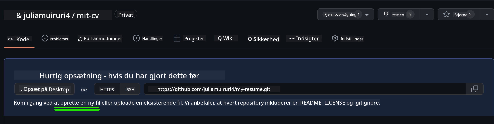

<!--
CO_OP_TRANSLATOR_METADATA:
{
  "original_hash": "effe56ba51c38d7bdfad1ea38288666b",
  "translation_date": "2025-10-23T21:55:05+00:00",
  "source_file": "8-code-editor/1-using-a-code-editor/assignment.md",
  "language_code": "da"
}
-->
# Opret en CV-hjemmeside med VSCode.dev

Forbedr dine karrieremuligheder ved at bygge en professionel CV-hjemmeside, der præsenterer dine færdigheder og erfaringer i et interaktivt og moderne format. I stedet for at sende traditionelle PDF'er, kan du give rekrutteringsfolk en elegant, responsiv hjemmeside, der både viser dine kvalifikationer og dine evner inden for webudvikling.

Denne praktiske opgave giver dig mulighed for at anvende alle dine VSCode.dev-færdigheder, mens du skaber noget, der virkelig kan gavne din karriere. Du vil opleve hele webudviklingsprocessen – fra oprettelse af repository til lancering – alt sammen direkte i din browser.

Når du har fuldført dette projekt, vil du have en professionel online tilstedeværelse, som nemt kan deles med potentielle arbejdsgivere, opdateres i takt med at dine færdigheder udvikler sig, og tilpasses til din personlige stil. Det er præcis den slags praktiske projekt, der demonstrerer virkelige webudviklingsfærdigheder.

## Læringsmål

Efter at have fuldført denne opgave vil du kunne:

- **Oprette** og administrere et komplet webudviklingsprojekt ved hjælp af VSCode.dev
- **Strukturere** en professionel hjemmeside med semantiske HTML-elementer
- **Style** responsive layouts med moderne CSS-teknikker
- **Implementere** interaktive funktioner med grundlæggende webteknologier
- **Lancer** en live hjemmeside, der kan tilgås via en delbar URL
- **Demonstrere** bedste praksis for versionskontrol gennem hele udviklingsprocessen

## Forudsætninger

Før du starter denne opgave, skal du sikre dig, at du har:

- En GitHub-konto (opret en på [github.com](https://github.com/) hvis nødvendigt)
- Gennemført VSCode.dev-lektionen om navigation i grænsefladen og grundlæggende operationer
- Grundlæggende forståelse af HTML-struktur og CSS-styling

## Projektopsætning og oprettelse af repository

Lad os starte med at oprette fundamentet for dit projekt. Denne proces afspejler virkelige udviklingsarbejdsgange, hvor projekter begynder med korrekt initialisering af repository og planlægning af struktur.

### Trin 1: Opret dit GitHub-repository

Oprettelse af et dedikeret repository sikrer, at dit projekt er korrekt organiseret og versionskontrolleret fra starten.

1. **Naviger** til [GitHub.com](https://github.com) og log ind på din konto
2. **Klik** på den grønne "New"-knap eller "+"-ikonet i øverste højre hjørne
3. **Navngiv** dit repository `my-resume` (eller vælg et personligt navn som `john-smith-resume`)
4. **Tilføj** en kort beskrivelse: "Professionel CV-hjemmeside bygget med HTML og CSS"
5. **Vælg** "Public" for at gøre dit CV tilgængeligt for potentielle arbejdsgivere
6. **Marker** "Add a README file" for at oprette en indledende projektbeskrivelse
7. **Klik** på "Create repository" for at afslutte opsætningen

> 💡 **Tip til navngivning af repository**: Brug beskrivende, professionelle navne, der tydeligt angiver projektets formål. Dette hjælper, når du deler med arbejdsgivere eller under porteføljeanmeldelser.

### Trin 2: Initialiser projektstruktur

Da VSCode.dev kræver mindst én fil for at åbne et repository, opretter vi vores hoved-HTML-fil direkte på GitHub, før vi skifter til webeditoren.

1. **Klik** på "creating a new file"-linket i dit nye repository
2. **Skriv** `index.html` som filnavn
3. **Tilføj** denne indledende HTML-struktur:

```html
<!DOCTYPE html>
<html lang="en">
<head>
    <meta charset="UTF-8">
    <meta name="viewport" content="width=device-width, initial-scale=1.0">
    <title>Your Name - Professional Resume</title>
</head>
<body>
    <h1>Your Name</h1>
    <p>Professional Resume Website</p>
</body>
</html>
```

4. **Skriv** en commit-besked: "Tilføj indledende HTML-struktur"
5. **Klik** på "Commit new file" for at gemme dine ændringer



**Dette opnår den indledende opsætning:**
- **Etablerer** korrekt HTML5-dokumentstruktur med semantiske elementer
- **Inkluderer** viewport meta-tag for kompatibilitet med responsivt design
- **Sætter** en beskrivende sidetitel, der vises i browserfaner
- **Skaber** fundamentet for professionel indholdsorganisation

## Arbejde i VSCode.dev

Nu hvor fundamentet for dit repository er etableret, lad os skifte til VSCode.dev for det primære udviklingsarbejde. Denne webbaserede editor giver alle de værktøjer, der er nødvendige for professionel webudvikling.

### Trin 3: Åbn dit projekt i VSCode.dev

1. **Naviger** til [vscode.dev](https://vscode.dev) i en ny browserfane
2. **Klik** på "Open Remote Repository" på velkomstskærmen
3. **Kopier** din repository-URL fra GitHub og indsæt den i inputfeltet

   Format: `https://github.com/your-username/my-resume`
   
   *Erstat `your-username` med dit faktiske GitHub-brugernavn*

4. **Tryk** Enter for at indlæse dit projekt

✅ **Succesindikator**: Du bør se dine projektfiler i Explorer-sidepanelet og `index.html` tilgængelig for redigering i hovededitorområdet.


**Hvad du vil se i grænsefladen:**
- **Explorer-sidepanel**: **Viser** dine repository-filer og mappestruktur
- **Editorområde**: **Viser** indholdet af valgte filer til redigering
- **Aktivitetslinje**: **Giver** adgang til funktioner som Source Control og Extensions
- **Statuslinje**: **Angiver** forbindelsesstatus og information om den aktuelle gren

### Trin 4: Opbyg dit CV-indhold

Erstat pladsholderindholdet i `index.html` med en omfattende CV-struktur. Denne HTML giver fundamentet for en professionel præsentation af dine kvalifikationer.

<details>
<summary><b>Komplet HTML CV-struktur</b></summary>

```html
<!DOCTYPE html>
<html lang="en">
<head>
    <meta charset="UTF-8">
    <meta name="viewport" content="width=device-width, initial-scale=1.0">
    <link href="style.css" rel="stylesheet">
    <link rel="stylesheet" href="https://cdnjs.cloudflare.com/ajax/libs/font-awesome/5.15.4/css/all.min.css">
    <title>Your Name - Professional Resume</title>
</head>
<body>
    <header id="header">
        <h1>Your Full Name</h1>
        <hr>
        <p class="role">Your Professional Title</p>
        <hr>
    </header>
    
    <main>
        <article id="mainLeft">
            <section>
                <h2>CONTACT</h2>
                <p>
                    <i class="fa fa-envelope" aria-hidden="true"></i>
                    <a href="mailto:your.email@domain.com">your.email@domain.com</a>
                </p>
                <p>
                    <i class="fab fa-github" aria-hidden="true"></i>
                    <a href="https://github.com/your-username">github.com/your-username</a>
                </p>
                <p>
                    <i class="fab fa-linkedin" aria-hidden="true"></i>
                    <a href="https://linkedin.com/in/your-profile">linkedin.com/in/your-profile</a>
                </p>
            </section>
            
            <section>
                <h2>SKILLS</h2>
                <ul>
                    <li>HTML5 & CSS3</li>
                    <li>JavaScript (ES6+)</li>
                    <li>Responsive Web Design</li>
                    <li>Version Control (Git)</li>
                    <li>Problem Solving</li>
                </ul>
            </section>
            
            <section>
                <h2>EDUCATION</h2>
                <h3>Your Degree or Certification</h3>
                <p>Institution Name</p>
                <p>Start Date - End Date</p>
            </section>
        </article>
        
        <article id="mainRight">
            <section>
                <h2>ABOUT</h2>
                <p>Write a compelling summary that highlights your passion for web development, key achievements, and career goals. This section should give employers insight into your personality and professional approach.</p>
            </section>
            
            <section>
                <h2>WORK EXPERIENCE</h2>
                <div class="job">
                    <h3>Job Title</h3>
                    <p class="company">Company Name | Start Date – End Date</p>
                    <ul>
                        <li>Describe a key accomplishment or responsibility</li>
                        <li>Highlight specific skills or technologies used</li>
                        <li>Quantify impact where possible (e.g., "Improved efficiency by 25%")</li>
                    </ul>
                </div>
                
                <div class="job">
                    <h3>Previous Job Title</h3>
                    <p class="company">Previous Company | Start Date – End Date</p>
                    <ul>
                        <li>Focus on transferable skills and achievements</li>
                        <li>Demonstrate growth and learning progression</li>
                        <li>Include any leadership or collaboration experiences</li>
                    </ul>
                </div>
            </section>
            
            <section>
                <h2>PROJECTS</h2>
                <div class="project">
                    <h3>Project Name</h3>
                    <p>Brief description of what the project accomplishes and technologies used.</p>
                    <a href="#" target="_blank">View Project</a>
                </div>
            </section>
        </article>
    </main>
</body>
</html>
```
</details>

**Retningslinjer for tilpasning:**
- **Erstat** al pladsholdertekst med dine faktiske oplysninger
- **Tilpas** sektioner baseret på dit erfaringsniveau og din karrierefokus
- **Tilføj** eller fjern sektioner efter behov (f.eks. Certificeringer, Frivilligt arbejde, Sprog)
- **Inkluder** links til dine faktiske profiler og projekter

### Trin 5: Opret understøttende filer

Professionelle hjemmesider kræver organiserede filstrukturer. Opret CSS-stylesheetet og konfigurationsfilerne, der er nødvendige for et komplet projekt.

1. **Hold musen over** navnet på din projektmappe i Explorer-sidepanelet
2. **Klik** på "New File"-ikonet (📄+) der vises
3. **Opret** disse filer én ad gangen:
   - `style.css` (til styling og layout)
   - `codeswing.json` (til konfigurationsfilen for preview-udvidelsen)

**Oprettelse af CSS-filen (`style.css`):**

<details>
<summary><b>Professionel CSS-styling</b></summary>

```css
/* Modern Resume Styling */
body {
    font-family: 'Segoe UI', Tahoma, Geneva, Verdana, sans-serif;
    font-size: 16px;
    line-height: 1.6;
    max-width: 960px;
    margin: 0 auto;
    padding: 20px;
    color: #333;
    background-color: #f9f9f9;
}

/* Header Styling */
header {
    text-align: center;
    margin-bottom: 3em;
    padding: 2em;
    background: linear-gradient(135deg, #667eea 0%, #764ba2 100%);
    color: white;
    border-radius: 10px;
    box-shadow: 0 4px 6px rgba(0, 0, 0, 0.1);
}

h1 {
    font-size: 3em;
    letter-spacing: 0.1em;
    margin-bottom: 0.2em;
    font-weight: 300;
}

.role {
    font-size: 1.3em;
    font-weight: 300;
    margin: 1em 0;
}

/* Main Content Layout */
main {
    display: grid;
    grid-template-columns: 35% 65%;
    gap: 3em;
    margin-top: 3em;
    background: white;
    padding: 2em;
    border-radius: 10px;
    box-shadow: 0 2px 10px rgba(0, 0, 0, 0.1);
}

/* Typography */
h2 {
    font-size: 1.4em;
    font-weight: 600;
    margin-bottom: 1em;
    color: #667eea;
    border-bottom: 2px solid #667eea;
    padding-bottom: 0.3em;
}

h3 {
    font-size: 1.1em;
    font-weight: 600;
    margin-bottom: 0.5em;
    color: #444;
}

/* Section Styling */
section {
    margin-bottom: 2.5em;
}

#mainLeft {
    border-right: 1px solid #e0e0e0;
    padding-right: 2em;
}

/* Contact Links */
section a {
    color: #667eea;
    text-decoration: none;
    transition: color 0.3s ease;
}

section a:hover {
    color: #764ba2;
    text-decoration: underline;
}

/* Icons */
i {
    margin-right: 0.8em;
    width: 20px;
    text-align: center;
    color: #667eea;
}

/* Lists */
ul {
    list-style: none;
    padding-left: 0;
}

li {
    margin: 0.5em 0;
    padding: 0.3em 0;
    position: relative;
}

li:before {
    content: "▸";
    color: #667eea;
    margin-right: 0.5em;
}

/* Work Experience */
.job, .project {
    margin-bottom: 2em;
    padding-bottom: 1.5em;
    border-bottom: 1px solid #f0f0f0;
}

.company {
    font-style: italic;
    color: #666;
    margin-bottom: 0.5em;
}

/* Responsive Design */
@media (max-width: 768px) {
    main {
        grid-template-columns: 1fr;
        gap: 2em;
    }
    
    #mainLeft {
        border-right: none;
        border-bottom: 1px solid #e0e0e0;
        padding-right: 0;
        padding-bottom: 2em;
    }
    
    h1 {
        font-size: 2.2em;
    }
    
    body {
        padding: 10px;
    }
}

/* Print Styles */
@media print {
    body {
        background: white;
        color: black;
        font-size: 12pt;
    }
    
    header {
        background: none;
        color: black;
        box-shadow: none;
    }
    
    main {
        box-shadow: none;
    }
}
```
</details>

**Oprettelse af konfigurationsfilen (`codeswing.json`):**

```json
{
    "scripts": [],
    "styles": []
}
```

**Forstå CSS-funktionerne:**
- **Bruger** CSS Grid til responsiv, professionel layoutstruktur
- **Implementerer** moderne farveskemaer med gradientoverskrifter
- **Inkluderer** hover-effekter og glidende overgange for interaktivitet
- **Tilbyder** responsivt design, der fungerer på alle enhedsstørrelser
- **Tilføjer** printvenlige stilarter til PDF-generering

### Trin 6: Installer og konfigurer udvidelser

Udvidelser forbedrer din udviklingsoplevelse ved at give live preview-muligheder og forbedrede arbejdsgangsværktøjer. CodeSwing-udvidelsen er særligt nyttig til webudviklingsprojekter.

**Installation af CodeSwing-udvidelsen:**

1. **Klik** på Extensions-ikonet (🧩) i aktivitetslinjen
2. **Søg** efter "CodeSwing" i søgefeltet i marketplace
3. **Vælg** CodeSwing-udvidelsen fra søgeresultaterne
4. **Klik** på den blå "Install"-knap


**Hvad CodeSwing tilbyder:**
- **Muliggør** live preview af din hjemmeside, mens du redigerer
- **Viser** ændringer i realtid uden manuel opdatering
- **Understøtter** flere filtyper, herunder HTML, CSS og JavaScript
- **Tilbyder** en integreret udviklingsmiljøoplevelse

**Umiddelbare resultater efter installation:**
Når CodeSwing er installeret, vil du se et live preview af din CV-hjemmeside vises i editoren. Dette giver dig mulighed for at se præcis, hvordan din side ser ud, mens du foretager ændringer.


**Forstå den forbedrede grænseflade:**
- **Split view**: **Viser** din kode på den ene side og live preview på den anden
- **Realtidsopdateringer**: **Reflekterer** ændringer med det samme, mens du skriver
- **Interaktivt preview**: **Giver** dig mulighed for at teste links og interaktioner
- **Mobilsimulering**: **Tilbyder** testmuligheder for responsivt design

### Trin 7: Versionskontrol og offentliggørelse

Nu hvor din CV-hjemmeside er færdig, skal du bruge Git til at gemme dit arbejde og gøre det tilgængeligt online.

**Commit dine ændringer:**

1. **Klik** på Source Control-ikonet (🌿) i aktivitetslinjen
2. **Gennemgå** alle de filer, du har oprettet og ændret i sektionen "Changes"
3. **Stage** dine ændringer ved at klikke på "+"-ikonet ved siden af hver fil
4. **Skriv** en beskrivende commit-besked, såsom:
   - "Tilføj komplet CV-hjemmeside med responsivt design"
   - "Implementer professionel styling og indholdsstruktur"
5. **Klik** på fluebenet (✓) for at committe og pushe dine ændringer

**Eksempler på effektive commit-beskeder:**
- "Tilføj professionelt CV-indhold og styling"
- "Implementer responsivt design for mobilkompatibilitet"
- "Opdater kontaktinformation og projektlinks"

> 💡 **Professionelt tip**: Gode commit-beskeder hjælper med at spore udviklingen af dit projekt og demonstrerer opmærksomhed på detaljer – kvaliteter, som arbejdsgivere værdsætter.

**Adgang til din offentliggjorte side:**
Når du har committed, kan du vende tilbage til dit GitHub-repository ved hjælp af hamburger-menuen (☰) i øverste venstre hjørne. Din CV-hjemmeside er nu versionskontrolleret og klar til lancering eller deling.

## Resultater og næste skridt

**Tillykke! 🎉** Du har med succes oprettet en professionel CV-hjemmeside ved hjælp af VSCode.dev. Dit projekt demonstrerer:
**Tekniske færdigheder demonstreret:**
- **Repository-håndtering**: Oprettelse og organisering af en komplet projektstruktur
- **Webudvikling**: Opbygning af en responsiv hjemmeside med moderne HTML5 og CSS3
- **Versionskontrol**: Implementering af korrekt Git-arbejdsgang med meningsfulde commits
- **Værktøjsfærdigheder**: Effektiv brug af VSCode.dev's grænseflade og udvidelsessystem

**Opnåede professionelle resultater:**
- **Online tilstedeværelse**: En delbar URL, der viser dine kvalifikationer
- **Moderne format**: Et interaktivt alternativ til traditionelle PDF-CV'er
- **Demonstrerbare færdigheder**: Konkrete beviser på dine webudviklingsevner
- **Nem opdatering**: Et fundament, du løbende kan forbedre og tilpasse

### Muligheder for lancering

For at gøre dit CV tilgængeligt for arbejdsgivere kan du overveje disse hostingmuligheder:

**GitHub Pages (Anbefales):**
1. Gå til dine repository-indstillinger på GitHub
2. Rul ned til sektionen "Pages"
3. Vælg "Deploy from a branch" og vælg "main"
4. Din side vil være tilgængelig på `https://your-username.github.io/my-resume`

**Alternative platforme:**
- **Netlify**: Automatisk lancering med brugerdefinerede domæner
- **Vercel**: Hurtig lancering med moderne hostingfunktioner
- **GitHub Codespaces**: Udviklingsmiljø med indbygget preview

### Forslag til forbedringer

Fortsæt med at udvikle dine færdigheder ved at tilføje disse funktioner:

**Tekniske forbedringer:**
- **JavaScript-interaktivitet**: Tilføj glidende scrolling eller interaktive elementer
- **Dark mode toggle**: Implementer tema-skift for brugerpræference
- **Kontaktformular**: Muliggør direkte kommunikation fra potentielle arbejdsgivere
- **SEO-optimering**: Tilføj meta-tags og strukturerede data for bedre søgevisibilitet

**Indholdsmæssige forbedringer:**
- **Projektportefølje**: Link til GitHub-repositories og live-demonstrationer
- **Visualisering af færdigheder**: Opret søjlediagrammer eller færdighedsvurderingssystemer
- **Anbefalinger**: Inkluder anbefalinger fra kolleger eller undervisere
- **Blogintegration**: Tilføj en blogsektion for at vise din læringsrejse

## GitHub Copilot Agent Challenge 🚀

Brug Agent-tilstand til at fuldføre følgende udfordring:

**Beskrivelse:** Forbedr din CV-hjemmeside med avancerede funktioner, der demonstrerer professionelle webudviklingsevner og moderne designprincipper.

**Opgave:** Byg videre på din eksisterende CV-hjemmeside og implementer disse avancerede funktioner:
1. Tilføj en mørk/lys tema-skift med glidende overgange
2. Opret en interaktiv færdighedssektion med animerede søjlediagrammer
3. Implementer en kontaktformular med validering
4. Tilføj en projektportefølje-sektion med hover-effekter og modal popups
5. Inkluder en blogsektion med mindst 3 eksempler på indlæg om din læringsrejse
6. Optimer til SEO med korrekte meta-tags, strukturerede data og ydeevne
7. Lancér den forbedrede side ved hjælp af GitHub Pages eller Netlify
8. Dokumentér alle nye funktioner i din README.md med skærmbilleder

Din forbedrede hjemmeside skal demonstrere mestring af moderne webudviklingspraksis, herunder responsivt design, JavaScript-interaktivitet og professionelle lanceringarbejdsgange.

## Udvidelse af udfordringen

Klar til at tage dine færdigheder endnu længere? Prøv disse avancerede udfordringer:

**📱 Mobil-først redesign:** Genopbyg din side med en mobil-først tilgang ved hjælp af CSS Grid og Flexbox

**🔍 SEO-optimering:** Implementer omfattende SEO, herunder meta-tags, strukturerede data og ydeevneoptimering

**🌐 Flersproget support:** Tilføj internationaliseringsfunktioner for at understøtte flere sprog

**📊 Analyseintegration:** Tilføj Google Analytics for at spore besøgendes engagement og optimere dit indhold

**🚀 Ydeevneoptimering:** Opnå perfekte Lighthouse-scores i alle kategorier

## Gennemgang og selvstudie

Udvid din viden med disse ressourcer:

**Avancerede VSCode.dev-funktioner:**
- [VSCode.dev Dokumentation](https://code.visualstudio.com/docs/editor/vscode-web?WT.mc_id=academic-0000-alfredodeza) - Komplet guide til webbaseret redigering
- [GitHub Codespaces](https://docs.github.com/en/codespaces) - Cloud-udviklingsmiljøer

**Bedste praksis for webudvikling:**
- **Responsivt design**: Studér CSS Grid og Flexbox for moderne layouts
- **Tilgængelighed**: Lær WCAG-retningslinjer for inkluderende webdesign
- **Ydeevne**: Udforsk værktøjer som Lighthouse til optimering
- **SEO**: Forstå grundlæggende principper for søgemaskineoptimering

**Professionel Udvikling:**
- **Portfolioopbygning**: Skab ekstra projekter for at fremvise forskellige færdigheder
- **Open Source**: Bidrag til eksisterende projekter for at få erfaring med samarbejde
- **Netværk**: Del din CV-hjemmeside i udviklerfællesskaber for feedback
- **Kontinuerlig Læring**: Hold dig opdateret med trends og teknologier inden for webudvikling

---

**Dine Næste Skridt:** Del din CV-hjemmeside med venner, familie eller mentorer for feedback. Brug deres forslag til at iterere og forbedre dit design. Husk, dette projekt er ikke bare et CV – det er en demonstration af din udvikling som webudvikler!

---

**Ansvarsfraskrivelse**:  
Dette dokument er blevet oversat ved hjælp af AI-oversættelsestjenesten [Co-op Translator](https://github.com/Azure/co-op-translator). Selvom vi bestræber os på nøjagtighed, skal du være opmærksom på, at automatiserede oversættelser kan indeholde fejl eller unøjagtigheder. Det originale dokument på dets oprindelige sprog bør betragtes som den autoritative kilde. For kritisk information anbefales professionel menneskelig oversættelse. Vi er ikke ansvarlige for eventuelle misforståelser eller fejltolkninger, der opstår som følge af brugen af denne oversættelse.