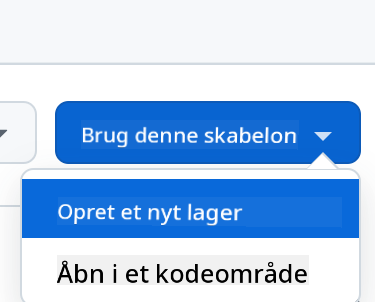
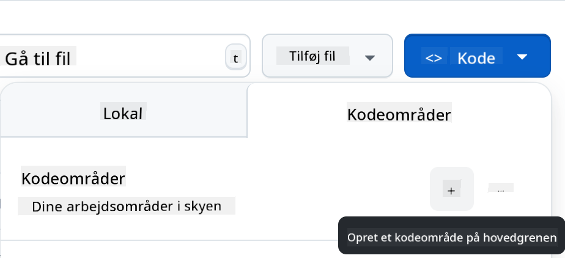

<!--
CO_OP_TRANSLATOR_METADATA:
{
  "original_hash": "002304ffe0059e55b33e2ee5283788ad",
  "translation_date": "2025-09-01T15:31:50+00:00",
  "source_file": "9-chat-project/README.md",
  "language_code": "da"
}
-->
# Chatprojekt

Dette chatprojekt viser, hvordan man bygger en Chat Assistent ved hjælp af GitHub Models.

Her er, hvordan det færdige projekt ser ud:

<div>
  
</div>

Lidt kontekst: At bygge chatassistenter ved hjælp af generativ AI er en fantastisk måde at begynde at lære om AI. Det, du vil lære, er at integrere generativ AI i en webapp gennem denne lektion. Lad os komme i gang.

## Forbindelse til generativ AI

Til backend bruger vi GitHub Models. Det er en fantastisk tjeneste, der giver dig mulighed for at bruge AI gratis. Gå til dens playground og hent kode, der svarer til det valgte backend-sprog. Her er, hvordan det ser ud på [GitHub Models Playground](https://github.com/marketplace/models/azure-openai/gpt-4o-mini/playground)

<div>
  
</div>

Som nævnt skal du vælge fanen "Code" og din valgte runtime.

<div>
  
</div>

### Brug af Python

I dette tilfælde vælger vi Python, hvilket betyder, at vi vælger denne kode:

```python
"""Run this model in Python

> pip install openai
"""
import os
from openai import OpenAI

# To authenticate with the model you will need to generate a personal access token (PAT) in your GitHub settings. 
# Create your PAT token by following instructions here: https://docs.github.com/en/authentication/keeping-your-account-and-data-secure/managing-your-personal-access-tokens
client = OpenAI(
    base_url="https://models.github.ai/inference",
    api_key=os.environ["GITHUB_TOKEN"],
)

response = client.chat.completions.create(
    messages=[
        {
            "role": "system",
            "content": "",
        },
        {
            "role": "user",
            "content": "What is the capital of France?",
        }
    ],
    model="openai/gpt-4o-mini",
    temperature=1,
    max_tokens=4096,
    top_p=1
)

print(response.choices[0].message.content)
```

Lad os rydde op i denne kode, så den er genanvendelig:

```python
def call_llm(prompt: str, system_message: str):
    response = client.chat.completions.create(
        messages=[
            {
                "role": "system",
                "content": system_message,
            },
            {
                "role": "user",
                "content": prompt,
            }
        ],
        model="openai/gpt-4o-mini",
        temperature=1,
        max_tokens=4096,
        top_p=1
    )

    return response.choices[0].message.content
```

Med denne funktion `call_llm` kan vi nu tage en prompt og en systemprompt, og funktionen returnerer resultatet.

### Tilpas AI Assistent

Hvis du vil tilpasse AI-assistenten, kan du specificere, hvordan du vil have den til at opføre sig ved at udfylde systemprompten som følger:

```python
call_llm("Tell me about you", "You're Albert Einstein, you only know of things in the time you were alive")
```

## Eksponér det via en Web API

Fantastisk, vi har AI-delen klar, lad os se, hvordan vi kan integrere det i en Web API. Til Web API vælger vi Flask, men enhver webframework burde fungere. Lad os se koden for det:

### Brug af Python

```python
# api.py
from flask import Flask, request, jsonify
from llm import call_llm
from flask_cors import CORS

app = Flask(__name__)
CORS(app)   # *   example.com

@app.route("/", methods=["GET"])
def index():
    return "Welcome to this API. Call POST /hello with 'message': 'my message' as JSON payload"


@app.route("/hello", methods=["POST"])
def hello():
    # get message from request body  { "message": "do this taks for me" }
    data = request.get_json()
    message = data.get("message", "")

    response = call_llm(message, "You are a helpful assistant.")
    return jsonify({
        "response": response
    })

if __name__ == "__main__":
    app.run(host="0.0.0.0", port=5000)
```

Her opretter vi en Flask API og definerer en standardroute "/" og "/chat". Sidstnævnte er beregnet til at blive brugt af vores frontend til at sende spørgsmål til den.

For at integrere *llm.py* skal vi gøre følgende:

- Importere funktionen `call_llm`:

   ```python
   from llm import call_llm
   from flask import Flask, request
   ```

- Kalde den fra "/chat"-routen:

   ```python
   @app.route("/hello", methods=["POST"])
   def hello():
      # get message from request body  { "message": "do this taks for me" }
      data = request.get_json()
      message = data.get("message", "")

      response = call_llm(message, "You are a helpful assistant.")
      return jsonify({
         "response": response
      })
   ```

   Her parser vi den indkommende anmodning for at hente `message`-egenskaben fra JSON-bodyen. Derefter kalder vi LLM med dette kald:

   ```python
   response = call_llm(message, "You are a helpful assistant")

   # return the response as JSON
   return jsonify({
      "response": response 
   })
   ```

Fantastisk, nu har vi gjort, hvad der er nødvendigt.

## Konfigurer Cors

Vi bør nævne, at vi opsætter noget som CORS, cross-origin resource sharing. Det betyder, at fordi vores backend og frontend vil køre på forskellige porte, skal vi tillade frontenden at kalde ind i backenden.

### Brug af Python

Der er et stykke kode i *api.py*, der opsætter dette:

```python
from flask_cors import CORS

app = Flask(__name__)
CORS(app)   # *   example.com
```

Lige nu er det opsat til at tillade "*", hvilket er alle oprindelser, og det er lidt usikkert. Vi bør begrænse det, når vi går i produktion.

## Kør dit projekt

For at køre dit projekt skal du først starte din backend og derefter din frontend.

### Brug af Python

Ok, så vi har *llm.py* og *api.py*, hvordan kan vi få dette til at fungere med en backend? Der er to ting, vi skal gøre:

- Installere afhængigheder:

   ```sh
   cd backend
   python -m venv venv
   source ./venv/bin/activate

   pip install openai flask flask-cors openai
   ```

- Starte API'en

   ```sh
   python api.py
   ```

   Hvis du er i Codespaces, skal du gå til Ports i den nederste del af editoren, højreklikke på det og klikke på "Port Visibility" og vælge "Public".

### Arbejd på en frontend

Nu hvor vi har en API oppe og køre, lad os oprette en frontend til dette. En helt basal frontend, som vi vil forbedre trinvis. I en *frontend*-mappe skal du oprette følgende:

```text
backend/
frontend/
index.html
app.js
styles.css
```

Lad os starte med **index.html**:

```html
<html>
    <head>
        <link rel="stylesheet" href="styles.css">
    </head>
    <body>
      <form>
        <textarea id="messages"></textarea>
        <input id="input" type="text" />
        <button type="submit" id="sendBtn">Send</button>  
      </form>  
      <script src="app.js" />
    </body>
</html>    
```

Ovenstående er det absolut minimum, du har brug for for at understøtte et chatvindue, da det består af en textarea, hvor beskeder vil blive vist, et inputfelt til at skrive beskeden og en knap til at sende din besked til backenden. Lad os se på JavaScript næste i *app.js*

**app.js**

```js
// app.js

(function(){
  // 1. set up elements  
  const messages = document.getElementById("messages");
  const form = document.getElementById("form");
  const input = document.getElementById("input");

  const BASE_URL = "change this";
  const API_ENDPOINT = `${BASE_URL}/hello`;

  // 2. create a function that talks to our backend
  async function callApi(text) {
    const response = await fetch(API_ENDPOINT, {
      method: "POST",
      headers: { "Content-Type": "application/json" },
      body: JSON.stringify({ message: text })
    });
    let json = await response.json();
    return json.response;
  }

  // 3. add response to our textarea
  function appendMessage(text, role) {
    const el = document.createElement("div");
    el.className = `message ${role}`;
    el.innerHTML = text;
    messages.appendChild(el);
  }

  // 4. listen to submit events
  form.addEventListener("submit", async(e) => {
    e.preventDefault();
   // someone clicked the button in the form
   
   // get input
   const text = input.value.trim();

   appendMessage(text, "user")

   // reset it
   input.value = '';

   const reply = await callApi(text);

   // add to messages
   appendMessage(reply, "assistant");

  })
})();
```

Lad os gennemgå koden sektion for sektion:

- 1) Her får vi en reference til alle vores elementer, som vi vil referere til senere i koden.
- 2) I denne sektion opretter vi en funktion, der bruger den indbyggede `fetch`-metode til at kalde vores backend.
- 3) `appendMessage` hjælper med at tilføje svar samt det, du som bruger skriver.
- 4) Her lytter vi til submit-eventet, og vi ender med at læse inputfeltet, placere brugerens besked i tekstområdet, kalde API'en og vise svaret i tekstområdet.

Lad os se på styling næste. Her kan du virkelig gå amok og få det til at se ud, som du vil, men her er nogle forslag:

**styles.css**

```
.message {
    background: #222;
    box-shadow: 0 0 0 10px orange;
    padding: 10px:
    margin: 5px;
}

.message.user {
    background: blue;
}

.message.assistant {
    background: grey;
} 
```

Med disse tre klasser vil du style beskeder forskelligt afhængigt af, om de kommer fra assistenten eller dig som bruger. Hvis du vil inspireres, kan du tjekke `solution/frontend/styles.css`-mappen.

### Ændring af Base Url

Der var én ting, vi ikke satte, og det var `BASE_URL`. Dette er ikke kendt, før din backend er startet. For at sætte det:

- Hvis du kører API'en lokalt, skal det sættes til noget som `http://localhost:5000`.
- Hvis det kører i Codespaces, skal det se ud som "[name]app.github.dev".

## Opgave

Opret din egen mappe *project* med indhold som følger:

```text
project/
  frontend/
    index.html
    app.js
    styles.css
  backend/
    ...
```

Kopier indholdet fra det, der blev instrueret ovenfor, men føl dig fri til at tilpasse det efter din smag.

## Løsning

[Løsning](./solution/README.md)

## Bonus

Prøv at ændre personligheden af AI-assistenten.

### For Python

Når du kalder `call_llm` i *api.py*, kan du ændre det andet argument til det, du ønsker, for eksempel:

```python
call_llm(message, "You are Captain Picard")
```

### Frontend

Ændr også CSS og tekst efter din smag, så lav ændringer i *index.html* og *styles.css*.

## Opsummering

Fantastisk, du har lært fra bunden, hvordan man opretter en personlig assistent ved hjælp af AI. Vi har gjort det ved hjælp af GitHub Models, en backend i Python og en frontend i HTML, CSS og JavaScript.

## Opsætning med Codespaces

- Naviger til: [Web Dev For Beginners repo](https://github.com/microsoft/Web-Dev-For-Beginners)
- Opret fra en skabelon (sørg for, at du er logget ind på GitHub) i øverste højre hjørne:

    

- Når du er i dit repo, skal du oprette en Codespace:

    

    Dette skulle starte et miljø, du nu kan arbejde med.

---

**Ansvarsfraskrivelse**:  
Dette dokument er blevet oversat ved hjælp af AI-oversættelsestjenesten [Co-op Translator](https://github.com/Azure/co-op-translator). Selvom vi bestræber os på at sikre nøjagtighed, skal du være opmærksom på, at automatiserede oversættelser kan indeholde fejl eller unøjagtigheder. Det originale dokument på dets oprindelige sprog bør betragtes som den autoritative kilde. For kritisk information anbefales professionel menneskelig oversættelse. Vi påtager os ikke ansvar for eventuelle misforståelser eller fejltolkninger, der måtte opstå som følge af brugen af denne oversættelse.