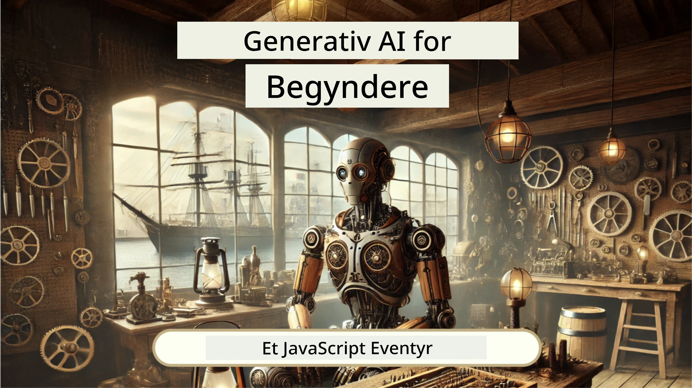
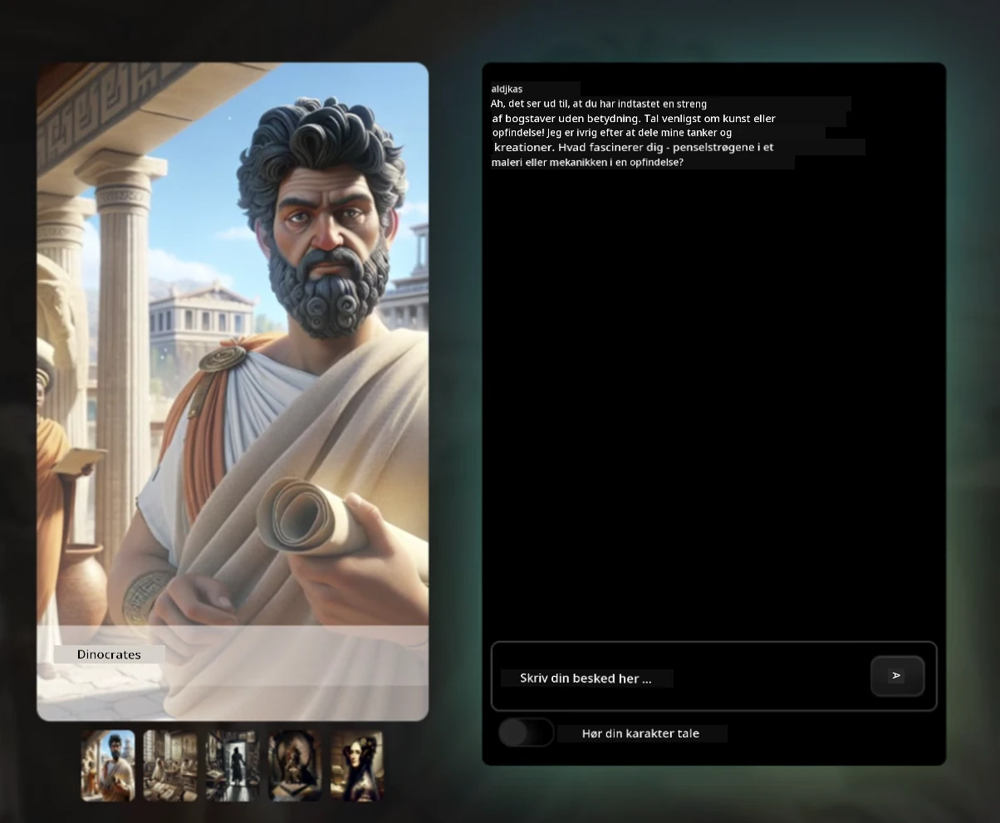
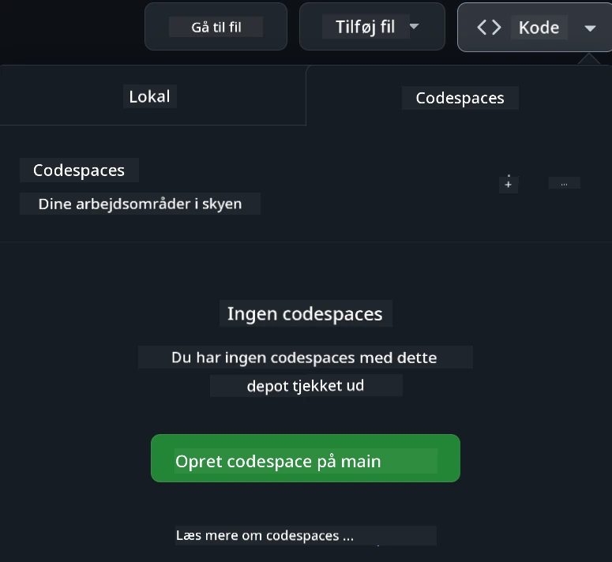

<!--
CO_OP_TRANSLATOR_METADATA:
{
  "original_hash": "fea3a0fceb8ad86fd640c09cf63a2aac",
  "translation_date": "2026-01-06T23:20:14+00:00",
  "source_file": "README.md",
  "language_code": "da"
}
-->
[](https://github.com/microsoft/Web-Dev-For-Beginners/blob/master/LICENSE)
[](https://GitHub.com/microsoft/Web-Dev-For-Beginners/graphs/contributors/)
[](https://GitHub.com/microsoft/Web-Dev-For-Beginners/issues/)
[](https://GitHub.com/microsoft/Web-Dev-For-Beginners/pulls/)
[](http://makeapullrequest.com)

[](https://GitHub.com/microsoft/Web-Dev-For-Beginners/watchers/)
[](https://GitHub.com/microsoft/Web-Dev-For-Beginners/network/)
[](https://GitHub.com/microsoft/Web-Dev-For-Beginners/stargazers/)

[](https://discord.gg/nTYy5BXMWG)

# Webudvikling for begyndere - Et læseplan

Lær det grundlæggende i webudvikling med vores 12-ugers omfattende kursus af Microsoft Cloud Advocates. Hver af de 24 lektioner dykker ned i JavaScript, CSS og HTML gennem praktiske projekter som terrarier, browserudvidelser og rumspil. Deltag i quizzer, diskussioner og praktiske opgaver. Forbedr dine færdigheder og optimer din viden med vores effektive projektbaserede undervisningsmetode. Start din kodningsrejse i dag!

Deltag i Azure AI Foundry Discord-fællesskabet

[](https://discord.gg/nTYy5BXMWG)

Følg disse trin for at komme i gang med at bruge disse ressourcer:
1. **Fork Repository**: Klik på [](https://GitHub.com/microsoft/Web-Dev-For-Beginners/fork)
2. **Klon Repository**:   `git clone https://github.com/microsoft/Web-Dev-For-Beginners.git`
3. [**Deltag i Azure AI Foundry Discord og mød eksperter og medudviklere**](https://discord.com/invite/ByRwuEEgH4)

### 🌐 Flersproget support

#### Understøttet via GitHub Action (Automatiseret & Altid Opdateret)

<!-- CO-OP TRANSLATOR LANGUAGES TABLE START -->
[Arabic](../ar/README.md) | [Bengali](../bn/README.md) | [Bulgarian](../bg/README.md) | [Burmese (Myanmar)](../my/README.md) | [Chinese (Simplified)](../zh/README.md) | [Chinese (Traditional, Hong Kong)](../hk/README.md) | [Chinese (Traditional, Macau)](../mo/README.md) | [Chinese (Traditional, Taiwan)](../tw/README.md) | [Croatian](../hr/README.md) | [Czech](../cs/README.md) | [Danish](./README.md) | [Dutch](../nl/README.md) | [Estonian](../et/README.md) | [Finnish](../fi/README.md) | [French](../fr/README.md) | [German](../de/README.md) | [Greek](../el/README.md) | [Hebrew](../he/README.md) | [Hindi](../hi/README.md) | [Hungarian](../hu/README.md) | [Indonesian](../id/README.md) | [Italian](../it/README.md) | [Japanese](../ja/README.md) | [Kannada](../kn/README.md) | [Korean](../ko/README.md) | [Lithuanian](../lt/README.md) | [Malay](../ms/README.md) | [Malayalam](../ml/README.md) | [Marathi](../mr/README.md) | [Nepali](../ne/README.md) | [Nigerian Pidgin](../pcm/README.md) | [Norwegian](../no/README.md) | [Persian (Farsi)](../fa/README.md) | [Polish](../pl/README.md) | [Portuguese (Brazil)](../br/README.md) | [Portuguese (Portugal)](../pt/README.md) | [Punjabi (Gurmukhi)](../pa/README.md) | [Romanian](../ro/README.md) | [Russian](../ru/README.md) | [Serbian (Cyrillic)](../sr/README.md) | [Slovak](../sk/README.md) | [Slovenian](../sl/README.md) | [Spanish](../es/README.md) | [Swahili](../sw/README.md) | [Swedish](../sv/README.md) | [Tagalog (Filipino)](../tl/README.md) | [Tamil](../ta/README.md) | [Telugu](../te/README.md) | [Thai](../th/README.md) | [Turkish](../tr/README.md) | [Ukrainian](../uk/README.md) | [Urdu](../ur/README.md) | [Vietnamese](../vi/README.md)

> **Foretrækker du at klone lokalt?**

> Dette repository inkluderer 50+ sprogoversættelser, som markant øger downloadstørrelsen. For at klone uden oversættelser, brug sparse checkout:
> ```bash
> git clone --filter=blob:none --sparse https://github.com/microsoft/Web-Dev-For-Beginners.git
> cd Web-Dev-For-Beginners
> git sparse-checkout set --no-cone '/*' '!translations' '!translated_images'
> ```
> Dette giver dig alt, hvad du behøver for at gennemføre kurset med en meget hurtigere download.
<!-- CO-OP TRANSLATOR LANGUAGES TABLE END -->

**Hvis du ønsker yderligere oversættelser, er understøttede sprog listet [her](https://github.com/Azure/co-op-translator/blob/main/getting_started/supported-languages.md)**

[](https://open.vscode.dev/microsoft/Web-Dev-For-Beginners)

#### 🧑‍🎓 _Er du studerende?_

Besøg [**Student Hub-siden**](https://docs.microsoft.com/learn/student-hub/?WT.mc_id=academic-77807-sagibbon) hvor du vil finde begynderguider, studentepakker og endda måder at få en gratis certifikatkupon på. Dette er siden, du vil bogmærke og tjekke fra tid til anden, da vi månedligt udskifter indhold.

### 📣 Meddelelse - Nye GitHub Copilot Agent-udfordringer til at gennemføre!

Ny udfordring tilføjet, kig efter "GitHub Copilot Agent Challenge 🚀" i de fleste kapitler. Det er en ny udfordring, du skal gennemføre ved brug af GitHub Copilot og Agent-tilstand. Hvis du ikke har brugt Agent-tilstand før, kan den ikke kun generere tekst, men også oprette og redigere filer, køre kommandoer og mere.

### 📣 Meddelelse - _Nyt projekt at bygge med Generativ AI_

Nyt AI-assistentprojekt lige tilføjet, tjek det ud [projekt](./9-chat-project/README.md)

### 📣 Meddelelse - _Ny læseplan_ om Generativ AI for JavaScript er netop udgivet

Gå ikke glip af vores nye Generativ AI-læseplan!

Besøg [https://aka.ms/genai-js-course](https://aka.ms/genai-js-course) for at komme i gang!



- Lektioner der dækker alt fra grundlæggende til RAG.
- Interager med historiske personer ved hjælp af GenAI og vores ledsagerapp.
- Sjov og engagerende fortælling, du kommer til at tidsrejse!




Hver lektion inkluderer en opgave, en vidensprøve og en udfordring, der guider dig gennem læring af emner som:
- Prompting og prompt engineering
- Tekst- og billedapp-generation
- Søg-apps

Besøg [https://aka.ms/genai-js-course](https://aka.ms/genai-js-course) for at komme i gang!


## 🌱 Kom godt i gang

> **Lærere**, vi har [inkluderet nogle forslag](for-teachers.md) til, hvordan dette læseplan kan bruges. Vi vil meget gerne have din feedback [i vores diskussionsforum](https://github.com/microsoft/Web-Dev-For-Beginners/discussions/categories/teacher-corner)!

**[Elever](https://aka.ms/student-page/?WT.mc_id=academic-77807-sagibbon)**, for hver lektion start med en quiz før forelæsningen og fortsæt med at læse forelæsningsmaterialet, gennemføre de forskellige aktiviteter og tjek din forståelse med quizzen efter forelæsningen.

For at forbedre din læringsoplevelse, forbind dig med dine medstuderende for at arbejde på projekterne sammen! Diskussioner opfordres i vores [diskussionsforum](https://github.com/microsoft/Web-Dev-For-Beginners/discussions) hvor vores team af moderatorer vil være tilgængelige for at besvare dine spørgsmål.

For at udvide din uddannelse anbefaler vi kraftigt at udforske [Microsoft Learn](https://learn.microsoft.com/users/wirelesslife/collections/p1ddcy5jwy0jkm?WT.mc_id=academic-77807-sagibbon) for yderligere studiematerialer.

### 📋 Opsæt dit miljø

Dette læseplan har et udviklingsmiljø klar til brug! Når du kommer i gang, kan du vælge at køre læseplanen i en [Codespace](https://github.com/features/codespaces/) (_et browserbaseret miljø uden behov for installation_), eller lokalt på din computer ved brug af en teksteditor som [Visual Studio Code](https://code.visualstudio.com/?WT.mc_id=academic-77807-sagibbon).

#### Opret dit repository
For at du nemt kan gemme dit arbejde, anbefales det at du opretter en egen kopi af dette repository. Det kan du gøre ved at klikke på knappen **Use this template** øverst på siden. Det vil oprette et nyt repository på din GitHub-konto med en kopi af læseplanen.

Følg disse trin:
1. **Fork Repository**: Klik på "Fork" knappen øverst til højre på denne side.
2. **Klon Repository**:   `git clone https://github.com/microsoft/Web-Dev-For-Beginners.git`

#### Kør læseplanen i en Codespace

I din kopi af dette repository som du har oprettet, klik på **Code** knappen og vælg **Open with Codespaces**. Det vil oprette en ny Codespace til dig at arbejde i.



#### Kør læseplanen lokalt på din computer

For at køre dette læseplan lokalt på din computer skal du bruge en teksteditor, en browser og et kommandolinjeværktøj. Vores første lektion, [Introduktion til programmeringssprog og værktøjer](../../1-getting-started-lessons/1-intro-to-programming-languages), vil guide dig gennem forskellige muligheder for hver af disse værktøjer, så du kan vælge det, der passer bedst til dig.

Vi anbefaler at bruge [Visual Studio Code](https://code.visualstudio.com/?WT.mc_id=academic-77807-sagibbon) som editor, der også har et indbygget [Terminal](https://code.visualstudio.com/docs/terminal/basics/?WT.mc_id=academic-77807-sagibbon). Du kan downloade Visual Studio Code [her](https://code.visualstudio.com/?WT.mc_id=academic-77807-sagibbon).


1. Klon dit repository til din computer. Det kan du gøre ved at klikke på **Code** knappen og kopiere URL’en:

    [CodeSpace](./images/createcodespace.png)
    Åbn derefter [Terminal](https://code.visualstudio.com/docs/terminal/basics/?WT.mc_id=academic-77807-sagibbon) i [Visual Studio Code](https://code.visualstudio.com/?WT.mc_id=academic-77807-sagibbon) og kør følgende kommando, hvor du udskifter `<your-repository-url>` med den URL, du netop har kopieret:

    ```bash 
    git clone <your-repository-url>
    ```

2. Åbn mappen i Visual Studio Code. Det kan du gøre ved at klikke på **File** > **Open Folder** og vælge den mappe, du netop har klonet.


>  Anbefalede Visual Studio Code-udvidelser:
>
> * [Live Server](https://marketplace.visualstudio.com/items?itemName=ritwickdey.LiveServer&WT.mc_id=academic-77807-sagibbon) - til at forhåndsvise HTML-sider inden for Visual Studio Code
> * [Copilot](https://marketplace.visualstudio.com/items?itemName=GitHub.copilot&WT.mc_id=academic-77807-sagibbon) - hjælper dig med at skrive kode hurtigere

## 📂 Hver lektion inkluderer:

- valgfri sketchnote
- valgfri supplerende video
- quiz som opvarmning før lektionen
- skreven lektion
- for projektbaserede lektioner, trin-for-trin vejledninger til at bygge projektet
- videnskontroller
- en udfordring
- supplerende læsning
- opgave
- [quiz efter lektionen](https://ff-quizzes.netlify.app/web/)

> **En note om quizzer**: Alle quizzer er indeholdt i Quiz-app mappen, i alt 48 quizzer med tre spørgsmål hver. De er tilgængelige [her](https://ff-quizzes.netlify.app/web/) quiz appen kan køres lokalt eller deployes til Azure; følg instruktionerne i `quiz-app` mappen.

## 🗃️ Lektioner

|     |                       Projektnavn                       |                            Koncepter undervist                             | Læringsmål                                                                                                                 |                                                         Linket lektion                                                          |         Forfatter          |
| :-: | :----------------------------------------------------: | :-----------------------------------------------------------------------: | -------------------------------------------------------------------------------------------------------------------------- | :-----------------------------------------------------------------------------------------------------------------------------: | :-----------------------: |
| 01  |                     Kom godt i gang                    |           Introduktion til programmering og værktøjer                     | Lær de grundlæggende elementer bag de fleste programmeringssprog og om software, der hjælper professionelle udviklere      | [Introduktion til programmeringssprog og værktøjer](./1-getting-started-lessons/1-intro-to-programming-languages/README.md) |         Jasmine           |
| 02  |                     Kom godt i gang                    |             Grundlæggende GitHub, inkl. arbejde med et team               | Hvordan man bruger GitHub i sit projekt, og hvordan man samarbejder med andre om en kodebase                                 |                            [Introduktion til GitHub](./1-getting-started-lessons/2-github-basics/README.md)                      |          Floor            |
| 03  |                     Kom godt i gang                    |                             Tilgængelighed                                | Lær det grundlæggende om webtilgængelighed                                                                                  |                       [Grundlæggende tilgængelighed](./1-getting-started-lessons/3-accessibility/README.md)                      |       Christopher         |
| 04  |                        JS Basics                       |                         JavaScript-datatyper                             | Det grundlæggende om JavaScript-datatyper                                                                                   |                                      [Datatyper](./2-js-basics/1-data-types/README.md)                                           |         Jasmine           |
| 05  |                        JS Basics                       |                         Funktioner og metoder                            | Lær om funktioner og metoder til at styre en applikations logik                                                             |                             [Funktioner og metoder](./2-js-basics/2-functions-methods/README.md)                                  | Jasmine og Christopher    |
| 06  |                        JS Basics                       |                        Beslutningstagning med JS                        | Lær hvordan man skaber betingelser i sin kode ved brug af beslutningstagning                                                |                                  [Beslutningstagning](./2-js-basics/3-making-decisions/README.md)                               |         Jasmine           |
| 07  |                        JS Basics                       |                            Arrays og løkker                             | Arbejd med data ved brug af arrays og løkker i JavaScript                                                                   |                                    [Arrays og løkker](./2-js-basics/4-arrays-loops/README.md)                                   |         Jasmine           |
| 08  |       [Terrarium](./3-terrarium/solution/README.md)   |                            HTML i praksis                              | Byg HTML’en til at skabe et online terrarium med fokus på at bygge et layout                                               |                                [Introduktion til HTML](./3-terrarium/1-intro-to-html/README.md)                                  |           Jen             |
| 09  |       [Terrarium](./3-terrarium/solution/README.md)   |                            CSS i praksis                               | Byg CSS’en til at style det online terrarium med fokus på CSS’s grundlæggende, inkl. at gøre siden responsiv                |                                 [Introduktion til CSS](./3-terrarium/2-intro-to-css/README.md)                                 |           Jen             |
| 10  |            [Terrarium](./3-terrarium/solution/README.md)  |                 JavaScript closures, DOM-manipulation                    | Byg JavaScript’en til at gøre terrariet funktionelt som et drag/drop interface med fokus på closures og DOM-manipulation     |                  [JavaScript closures, DOM-manipulation](./3-terrarium/3-intro-to-DOM-and-closures/README.md)                  |           Jen             |
| 11  |          [Typing Game](./4-typing-game/solution/README.md) |                          Byg et skrive-spil                             | Lær hvordan man bruger tastaturhændelser til at styre logikken i din JavaScript-app                                           |                              [Begivenhedsdrevet programmering](./4-typing-game/typing-game/README.md)                            |       Christopher         |
| 12  | [Green Browser Extension](./5-browser-extension/solution/README.md) |                         Arbejde med browsere                           | Lær hvordan browsere fungerer, deres historie og hvordan man skaber de første elementer af en browserudvidelse               |                             [Om browsere](./5-browser-extension/1-about-browsers/README.md)                                      |           Jen             |
| 13  | [Green Browser Extension](./5-browser-extension/solution/README.md) | Byg en formular, kald et API og gem variabler i lokal lagring          | Byg JavaScript-elementerne i din browserudvidelse for at kalde et API vha. variabler gemt i lokal lagring                     |              [API’er, formularer og lokal lagring](./5-browser-extension/2-forms-browsers-local-storage/README.md)              |           Jen             |
| 14  | [Green Browser Extension](./5-browser-extension/solution/README.md) |          Baggrundsprocesser i browseren, webperformance                 | Brug browserens baggrundsprocesser til at styre udvidelsens ikon; lær om webperformance og optimeringer                       |                [Baggrundsopgaver og performance](./5-browser-extension/3-background-tasks-and-performance/README.md)             |           Jen             |
| 15  |           [Space Game](./6-space-game/solution/README.md)           |             Mere avanceret spiludvikling med JavaScript               | Lær om arv ved brug af både klasser og komposition og Pub/Sub-mønsteret som forberedelse til at bygge et spil                 |                           [Introduktion til avanceret spiludvikling](./6-space-game/1-introduction/README.md)                   |          Chris            |
| 16  |           [Space Game](./6-space-game/solution/README.md)           |                           Tegning på canvas                            | Lær om Canvas API’et, der bruges til at tegne elementer på en skærm                                                          |                               [Tegning på canvas](./6-space-game/2-drawing-to-canvas/README.md)                                |          Chris            |
| 17  |           [Space Game](./6-space-game/solution/README.md)           |                   Flyt elementer rundt på skærmen                     | Opdag hvordan elementer kan bevæge sig vha. kartesiske koordinater og Canvas API’et                                           |                            [Flyt elementer rundt](./6-space-game/3-moving-elements-around/README.md)                            |          Chris            |
| 18  |           [Space Game](./6-space-game/solution/README.md)           |                          Kollisiondetektion                           | Få elementer til at kollidere og reagere på hinanden ved brug af tastetryk og indfør en cooldown-funktion for spillets ydeevne |                              [Kollisiondetektion](./6-space-game/4-collision-detection/README.md)                              |          Chris            |
| 19  |           [Space Game](./6-space-game/solution/README.md)           |                             Hold styr på point                           | Udfør matematiske beregninger baseret på spillets status og ydeevne                                                          |                                    [Hold styr på point](./6-space-game/5-keeping-score/README.md)                                 |          Chris            |
| 20  |           [Space Game](./6-space-game/solution/README.md)           |                     Afslut og genstart spillet                         | Lær om at afslutte og genstarte spillet, inklusiv oprydning af ressourcer og nulstilling af variabelværdier                   |                               [Afslutningsbetingelsen](./6-space-game/6-end-condition/README.md)                                |          Chris            |
| 21  |         [Banking App](./7-bank-project/solution/README.md)          |                 HTML-skabeloner og ruter i en webapp                   | Lær hvordan man skaber arkitekturen for et multipage-websted ved brug af routing og HTML-skabeloner                          |                            [HTML-skabeloner og ruter](./7-bank-project/1-template-route/README.md)                             |          Yohan            |
| 22  |         [Banking App](./7-bank-project/solution/README.md)          |                  Byg en login- og registreringsformular               | Lær om at bygge formularer og håndtere valideringsrutiner                                                                     |                                           [Formularer](./7-bank-project/2-forms/README.md)                                     |          Yohan            |
| 23  |         [Banking App](./7-bank-project/solution/README.md)          |                   Metoder til at hente og bruge data                   | Hvordan data flyder ind og ud af din app, hvordan man henter, gemmer og bortskaffer det                                       |                                            [Data](./7-bank-project/3-data/README.md)                                            |          Yohan            |
| 24  |         [Banking App](./7-bank-project/solution/README.md)          |                      Begreber inden for tilstandsstyring               | Lær hvordan din app bevarer tilstand, og hvordan det styres programmatisk                                                    |                                [Tilstandsstyring](./7-bank-project/4-state-management/README.md)                                |          Yohan            |
| 25 | [Browser/VScode Code](../../8-code-editor) | Arbejde med VScode | Lær hvordan man bruger en kodeeditor | [Brug af VScode Code Editor](./8-code-editor/1-using-a-code-editor/README.md) | Chris |
| 26 | [AI Assistants](./9-chat-project/README.md) | Arbejde med AI | Lær hvordan du bygger din egen AI-assistent | [AI Assistant projekt](./9-chat-project/README.md) | Chris |

## 🏫 Pædagogik

Vores pensum er designet med to nøglepædagogiske principper for øje:
* projektbaseret læring
* hyppige quizzer

Programmet underviser i grundlæggende JavaScript, HTML og CSS samt de nyeste værktøjer og teknikker, som nutidens webudviklere bruger. Studerende får mulighed for at opnå praktisk erfaring ved at bygge et skrive-spil, et virtuelt terrarium, en miljøvenlig browserudvidelse, et rum-invader stil spil og en bankapp til virksomheder. Ved slutningen af serien vil studerende have opnået solid forståelse for webudvikling.

> 🎓 Du kan tage de første par lektioner i dette pensum som en [læringssti](https://docs.microsoft.com/learn/paths/web-development-101/?WT.mc_id=academic-77807-sagibbon) på Microsoft Learn!

Ved at sikre, at indholdet knytter sig til projekter, bliver processen mere engagerende for eleverne, og fastholdelsen af koncepter vil blive forbedret. Vi har også skrevet flere startlektioner i JavaScript-basics for at introducere koncepter, parret med en video fra "[Beginners Series to: JavaScript](https://channel9.msdn.com/Series/Beginners-Series-to-JavaScript/?WT.mc_id=academic-77807-sagibbon)" samlingen af videotutorials, hvor nogle af forfatterne har bidraget til dette pensum.

Derudover sætter en quiz med lav indsats før en lektion elevens intention mod at lære et emne, mens en anden quiz efter lektion sikrer yderligere fastholdelse. Dette pensum er designet til at være fleksibelt og sjovt og kan gennemføres helt eller delvist. Projekterne starter småt og bliver gradvist mere komplekse i løbet af den 12-ugers cyklus.

Selvom vi bevidst har undgået at indføre JavaScript-rammeværk for at koncentrere os om de grundlæggende færdigheder, der er nødvendige som webudvikler, før man tager et rammeværk i brug, vil et godt næste skridt efter at have gennemført dette pensum være at lære om Node.js via en anden samling videoer: "[Beginner Series to: Node.js](https://channel9.msdn.com/Series/Beginners-Series-to-Nodejs/?WT.mc_id=academic-77807-sagibbon)".

> Besøg vores [Adfærdskodeks](CODE_OF_CONDUCT.md) og [Bidrag](CONTRIBUTING.md) retningslinjer. Vi sætter pris på din konstruktive feedback!


## 🧭 Offline adgang

Du kan køre denne dokumentation offline ved at bruge [Docsify](https://docsify.js.org/#/). Fork dette repo, [installer Docsify](https://docsify.js.org/#/quickstart) på din lokale maskine, og skriv derefter `docsify serve` i rodmappen af dette repo. Webstedet vil blive serveret på port 3000 på din lokale computer: `localhost:3000`.

## 📘 PDF

En PDF med alle lektionerne kan findes [her](https://microsoft.github.io/Web-Dev-For-Beginners/pdf/readme.pdf).


## 🎒 Andre kurser
Vores team producerer andre kurser! Se dem her:

<!-- CO-OP TRANSLATOR OTHER COURSES START -->
### LangChain
[](https://aka.ms/langchain4j-for-beginners)
[](https://aka.ms/langchainjs-for-beginners?WT.mc_id=m365-94501-dwahlin)

---

### Azure / Edge / MCP / Agenter
[](https://github.com/microsoft/AZD-for-beginners?WT.mc_id=academic-105485-koreyst)
[](https://github.com/microsoft/edgeai-for-beginners?WT.mc_id=academic-105485-koreyst)
[](https://github.com/microsoft/mcp-for-beginners?WT.mc_id=academic-105485-koreyst)
[](https://github.com/microsoft/ai-agents-for-beginners?WT.mc_id=academic-105485-koreyst)

---
 
### Generativ AI Serie
[](https://github.com/microsoft/generative-ai-for-beginners?WT.mc_id=academic-105485-koreyst)
[-9333EA?style=for-the-badge&labelColor=E5E7EB&color=9333EA)](https://github.com/microsoft/Generative-AI-for-beginners-dotnet?WT.mc_id=academic-105485-koreyst)
[-C084FC?style=for-the-badge&labelColor=E5E7EB&color=C084FC)](https://github.com/microsoft/generative-ai-for-beginners-java?WT.mc_id=academic-105485-koreyst)
[-E879F9?style=for-the-badge&labelColor=E5E7EB&color=E879F9)](https://github.com/microsoft/generative-ai-with-javascript?WT.mc_id=academic-105485-koreyst)

---
 
### Kernelæring
[](https://aka.ms/ml-beginners?WT.mc_id=academic-105485-koreyst)
[](https://aka.ms/datascience-beginners?WT.mc_id=academic-105485-koreyst)
[](https://aka.ms/ai-beginners?WT.mc_id=academic-105485-koreyst)
[](https://github.com/microsoft/Security-101?WT.mc_id=academic-96948-sayoung)
[](https://aka.ms/webdev-beginners?WT.mc_id=academic-105485-koreyst)
[](https://aka.ms/iot-beginners?WT.mc_id=academic-105485-koreyst)
[](https://github.com/microsoft/xr-development-for-beginners?WT.mc_id=academic-105485-koreyst)

---
 
### Copilot Serie
[](https://aka.ms/GitHubCopilotAI?WT.mc_id=academic-105485-koreyst)
[](https://github.com/microsoft/mastering-github-copilot-for-dotnet-csharp-developers?WT.mc_id=academic-105485-koreyst)
[](https://github.com/microsoft/CopilotAdventures?WT.mc_id=academic-105485-koreyst)
<!-- CO-OP TRANSLATOR OTHER COURSES END -->

## Få hjælp

Hvis du sidder fast eller har spørgsmål om at bygge AI-apps. Deltag med andre elever og erfarne udviklere i diskussioner om MCP. Det er et støttende fællesskab, hvor spørgsmål er velkomne, og viden deles frit.

[](https://discord.gg/nTYy5BXMWG)

Hvis du har produktfeedback eller fejl under udviklingen, besøg:

[](https://aka.ms/foundry/forum)

## Licens

Dette repository er licenseret under MIT-licensen. Se [LICENSE](../../LICENSE)-filen for mere information.

---

<!-- CO-OP TRANSLATOR DISCLAIMER START -->
**Ansvarsfraskrivelse**:
Dette dokument er blevet oversat ved hjælp af AI-oversættelsestjenesten [Co-op Translator](https://github.com/Azure/co-op-translator). Selvom vi stræber efter nøjagtighed, bedes du være opmærksom på, at automatiserede oversættelser kan indeholde fejl eller unøjagtigheder. Det oprindelige dokument på dets modersmål bør betragtes som den autoritative kilde. For kritiske oplysninger anbefales professionel menneskelig oversættelse. Vi påtager os intet ansvar for misforståelser eller fejltolkninger, der opstår som følge af brugen af denne oversættelse.
<!-- CO-OP TRANSLATOR DISCLAIMER END -->