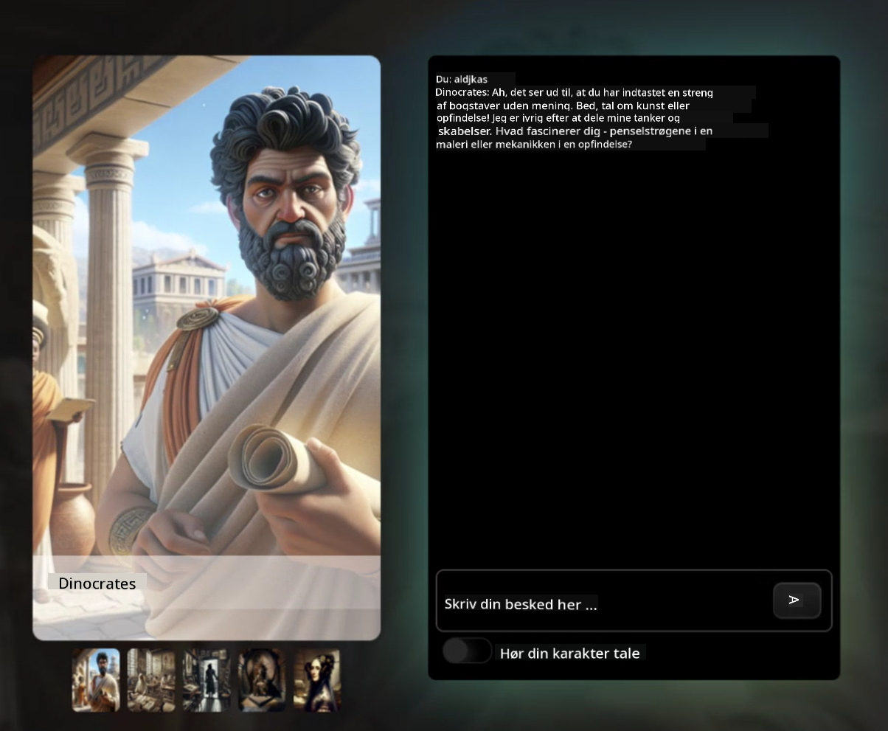

<!--
CO_OP_TRANSLATOR_METADATA:
{
  "original_hash": "8b9d0562ea649b6012d1a67acc630681",
  "translation_date": "2025-10-24T08:54:28+00:00",
  "source_file": "README.md",
  "language_code": "da"
}
-->
[](https://github.com/microsoft/Web-Dev-For-Beginners/blob/master/LICENSE)
[](https://GitHub.com/microsoft/Web-Dev-For-Beginners/graphs/contributors/)
[](https://GitHub.com/microsoft/Web-Dev-For-Beginners/issues/)
[](https://GitHub.com/microsoft/Web-Dev-For-Beginners/pulls/)
[](http://makeapullrequest.com)

[](https://GitHub.com/microsoft/Web-Dev-For-Beginners/watchers/)
[](https://GitHub.com/microsoft/Web-Dev-For-Beginners/network/)
[](https://GitHub.com/microsoft/Web-Dev-For-Beginners/stargazers/)

[](https://discord.gg/zxKYvhSnVp?WT.mc_id=academic-000002-leestott)

# Webudvikling for begyndere - Et kursus

Lær det grundlæggende i webudvikling med vores 12-ugers omfattende kursus fra Microsoft Cloud Advocates. Hver af de 24 lektioner dykker ned i JavaScript, CSS og HTML gennem praktiske projekter som terrarier, browserudvidelser og rumspil. Deltag i quizzer, diskussioner og praktiske opgaver. Forbedr dine færdigheder og optimer din viden med vores effektive projektbaserede undervisningsmetode. Start din koderejse i dag!

Deltag i Azure AI Foundry Discord-fællesskabet

[](https://discord.com/invite/ByRwuEEgH4)

Følg disse trin for at komme i gang med at bruge ressourcerne:
1. **Fork repository**: Klik på [](https://GitHub.com/microsoft/Web-Dev-For-Beginners/fork)
2. **Clone repository**:   `git clone https://github.com/microsoft/Web-Dev-For-Beginners.git`
3. [**Deltag i Azure AI Foundry Discord og mød eksperter og andre udviklere**](https://discord.com/invite/ByRwuEEgH4)

### 🌐 Flersproget support

#### Understøttet via GitHub Action (Automatisk & Altid opdateret)

[Arabic](../ar/README.md) | [Bengali](../bn/README.md) | [Bulgarian](../bg/README.md) | [Burmese (Myanmar)](../my/README.md) | [Chinese (Simplified)](../zh/README.md) | [Chinese (Traditional, Hong Kong)](../hk/README.md) | [Chinese (Traditional, Macau)](../mo/README.md) | [Chinese (Traditional, Taiwan)](../tw/README.md) | [Croatian](../hr/README.md) | [Czech](../cs/README.md) | [Danish](./README.md) | [Dutch](../nl/README.md) | [Estonian](../et/README.md) | [Finnish](../fi/README.md) | [French](../fr/README.md) | [German](../de/README.md) | [Greek](../el/README.md) | [Hebrew](../he/README.md) | [Hindi](../hi/README.md) | [Hungarian](../hu/README.md) | [Indonesian](../id/README.md) | [Italian](../it/README.md) | [Japanese](../ja/README.md) | [Korean](../ko/README.md) | [Lithuanian](../lt/README.md) | [Malay](../ms/README.md) | [Marathi](../mr/README.md) | [Nepali](../ne/README.md) | [Norwegian](../no/README.md) | [Persian (Farsi)](../fa/README.md) | [Polish](../pl/README.md) | [Portuguese (Brazil)](../br/README.md) | [Portuguese (Portugal)](../pt/README.md) | [Punjabi (Gurmukhi)](../pa/README.md) | [Romanian](../ro/README.md) | [Russian](../ru/README.md) | [Serbian (Cyrillic)](../sr/README.md) | [Slovak](../sk/README.md) | [Slovenian](../sl/README.md) | [Spanish](../es/README.md) | [Swahili](../sw/README.md) | [Swedish](../sv/README.md) | [Tagalog (Filipino)](../tl/README.md) | [Tamil](../ta/README.md) | [Thai](../th/README.md) | [Turkish](../tr/README.md) | [Ukrainian](../uk/README.md) | [Urdu](../ur/README.md) | [Vietnamese](../vi/README.md)

**Hvis du ønsker yderligere oversættelser, er understøttede sprog listet [her](https://github.com/Azure/co-op-translator/blob/main/getting_started/supported-languages.md)**

[](https://open.vscode.dev/microsoft/Web-Dev-For-Beginners)

#### 🧑‍🎓 _Er du studerende?_

Besøg [**Student Hub-siden**](https://docs.microsoft.com/learn/student-hub/?WT.mc_id=academic-77807-sagibbon), hvor du finder ressourcer for begyndere, studenterpakker og endda måder at få en gratis certifikatvoucher. Dette er siden, du vil bogmærke og tjekke fra tid til anden, da vi skifter indhold månedligt.

### 📣 Meddelelse - Nye GitHub Copilot Agent mode-udfordringer at fuldføre!

Ny udfordring tilføjet, kig efter "GitHub Copilot Agent Challenge 🚀" i de fleste kapitler. Det er en ny udfordring for dig at fuldføre ved hjælp af GitHub Copilot og Agent mode. Hvis du ikke har brugt Agent mode før, er det i stand til ikke kun at generere tekst, men kan også oprette og redigere filer, køre kommandoer og mere.

### 📣 Meddelelse - _Nyt projekt at bygge ved hjælp af Generativ AI_

Nyt AI-assistentprojekt lige tilføjet, tjek det ud [projekt](./09-chat-project/README.md)

### 📣 Meddelelse - _Nyt pensum_ om Generativ AI for JavaScript er netop blevet udgivet

Gå ikke glip af vores nye pensum om Generativ AI!

Besøg [https://aka.ms/genai-js-course](https://aka.ms/genai-js-course) for at komme i gang!


- Lektioner, der dækker alt fra grundlæggende til RAG.
- Interager med historiske figurer ved hjælp af GenAI og vores ledsager-app.
- Sjov og engagerende fortælling, du vil rejse i tiden!



Hver lektion inkluderer en opgave, en videnstest og en udfordring, der guider dig i at lære emner som:
- Prompting og prompt engineering
- Tekst- og billedapp-generering
- Søgeapps

Besøg [https://aka.ms/genai-js-course](../../[https:/aka.ms/genai-js-course) for at komme i gang!


## 🌱 Kom godt i gang

> **Lærere**, vi har [inkluderet nogle forslag](for-teachers.md) til, hvordan man kan bruge dette pensum. Vi vil meget gerne høre din feedback [i vores diskussionsforum](https://github.com/microsoft/Web-Dev-For-Beginners/discussions/categories/teacher-corner)!

**[Lærende](https://aka.ms/student-page/?WT.mc_id=academic-77807-sagibbon)**, for hver lektion, start med en quiz før lektionen og fortsæt med at læse undervisningsmaterialet, fuldføre de forskellige aktiviteter og tjek din forståelse med quizzen efter lektionen.

For at forbedre din læringsoplevelse, forbind med dine medstuderende for at arbejde på projekterne sammen! Diskussioner opfordres i vores [diskussionsforum](https://github.com/microsoft/Web-Dev-For-Beginners/discussions), hvor vores team af moderatorer vil være tilgængelige for at besvare dine spørgsmål.

For at udvide din uddannelse anbefaler vi stærkt at udforske [Microsoft Learn](https://learn.microsoft.com/users/wirelesslife/collections/p1ddcy5jwy0jkm?WT.mc_id=academic-77807-sagibbon) for yderligere studiematerialer.

### 📋 Opsætning af dit miljø

Dette pensum har et udviklingsmiljø klar til brug! Når du begynder, kan du vælge at køre pensum i en [Codespace](https://github.com/features/codespaces/) (_et browserbaseret miljø, hvor ingen installationer er nødvendige_), eller lokalt på din computer ved hjælp af en teksteditor som [Visual Studio Code](https://code.visualstudio.com/?WT.mc_id=academic-77807-sagibbon).

#### Opret dit repository
For at du nemt kan gemme dit arbejde, anbefales det, at du opretter din egen kopi af dette repository. Du kan gøre dette ved at klikke på knappen **Use this template** øverst på siden. Dette vil oprette et nyt repository i din GitHub-konto med en kopi af pensum.

Følg disse trin:
1. **Fork repository**: Klik på "Fork"-knappen øverst til højre på denne side.
2. **Clone repository**:   `git clone https://github.com/microsoft/Web-Dev-For-Beginners.git`

#### Kør pensum i en Codespace

I din kopi af dette repository, som du har oprettet, klik på **Code**-knappen og vælg **Open with Codespaces**. Dette vil oprette en ny Codespace, som du kan arbejde i.


#### Kør pensum lokalt på din computer

For at køre dette pensum lokalt på din computer, skal du bruge en teksteditor, en browser og et kommandolinjeværktøj. Vores første lektion, [Introduktion til programmeringssprog og værktøjer](../../1-getting-started-lessons/1-intro-to-programming-languages), vil guide dig gennem forskellige muligheder for hvert af disse værktøjer, så du kan vælge det, der passer bedst til dig.

Vores anbefaling er at bruge [Visual Studio Code](https://code.visualstudio.com/?WT.mc_id=academic-77807-sagibbon) som din editor, som også har en indbygget [Terminal](https://code.visualstudio.com/docs/terminal/basics/?WT.mc_id=academic-77807-sagibbon). Du kan downloade Visual Studio Code [her](https://code.visualstudio.com/?WT.mc_id=academic-77807-sagibbon).

1. Klon dit repository til din computer. Du kan gøre dette ved at klikke på **Code**-knappen og kopiere URL'en:

    [CodeSpace](./images/createcodespace.png)

    Derefter åbner du [Terminal](https://code.visualstudio.com/docs/terminal/basics/?WT.mc_id=academic-77807-sagibbon) i [Visual Studio Code](https://code.visualstudio.com/?WT.mc_id=academic-77807-sagibbon) og kører følgende kommando, hvor `<your-repository-url>` erstattes med den URL, du lige har kopieret:

    ```bash 
    git clone <your-repository-url>
    ```

2. Åbn mappen i Visual Studio Code. Du kan gøre dette ved at klikke på **File** > **Open Folder** og vælge den mappe, du lige har klonet.


>  Anbefalede Visual Studio Code-udvidelser:
>
> * [Live Server](https://marketplace.visualstudio.com/items?itemName=ritwickdey.LiveServer&WT.mc_id=academic-77807-sagibbon) - for at forhåndsvise HTML-sider i Visual Studio Code
> * [Copilot](https://marketplace.visualstudio.com/items?itemName=GitHub.copilot&WT.mc_id=academic-77807-sagibbon) - for at hjælpe dig med at skrive kode hurtigere

## 📂 Hver lektion inkluderer:

- valgfri sketchnote
- valgfri supplerende video
- opvarmningsquiz før lektionen
- skriftlig lektion
- for projektbaserede lektioner, trin-for-trin vejledninger til at bygge projektet
- videnschecks
- en udfordring
- supplerende læsning
- opgave
- [quiz efter lektionen](https://ff-quizzes.netlify.app/web/)

> **En note om quizzer**: Alle quizzer findes i Quiz-app-mappen, i alt 48 quizzer med tre spørgsmål hver. De er tilgængelige [her](https://ff-quizzes.netlify.app/web/), og quiz-appen kan køres lokalt eller implementeres på Azure; følg instruktionerne i `quiz-app`-mappen.

## 🗃️ Lektioner

|     |                       Projekt Navn                        |                            Underviste Koncepter                            | Læringsmål                                                                                                                         |                                                         Linket Lektion                                                          |         Forfatter         |
| :-: | :------------------------------------------------------: | :--------------------------------------------------------------------: | ----------------------------------------------------------------------------------------------------------------------------------- | :----------------------------------------------------------------------------------------------------------------------------: | :---------------------: |
| 01  |                     Kom godt i gang                      |           Introduktion til programmering og værktøjer til faget           | Lær de grundlæggende principper bag de fleste programmeringssprog og om software, der hjælper professionelle udviklere med deres arbejde | [Introduktion til programmeringssprog og værktøjer til faget](./1-getting-started-lessons/1-intro-to-programming-languages/README.md) |         Jasmine         |
| 02  |                     Kom godt i gang                      |             Grundlæggende om GitHub, herunder arbejde i et team             | Hvordan man bruger GitHub i dit projekt, og hvordan man samarbejder med andre om en kodebase                                        |                            [Introduktion til GitHub](./1-getting-started-lessons/2-github-basics/README.md)                             |          Floor          |
| 03  |                     Kom godt i gang                      |                             Tilgængelighed                              | Lær det grundlæggende om webtilgængelighed                                                                                          |                       [Grundlæggende om tilgængelighed](./1-getting-started-lessons/3-accessibility/README.md)                       |       Christopher       |
| 04  |                        JS Grundlæggende                         |                         JavaScript Datatyper                          | Det grundlæggende om JavaScript datatyper                                                                                           |                                       [Datatyper](./2-js-basics/1-data-types/README.md)                                        |         Jasmine         |
| 05  |                        JS Grundlæggende                         |                         Funktioner og metoder                          | Lær om funktioner og metoder til at styre en applikations logikflow                                                                 |                              [Funktioner og metoder](./2-js-basics/2-functions-methods/README.md)                               | Jasmine og Christopher |
| 06  |                        JS Grundlæggende                         |                        At træffe beslutninger med JS                        | Lær hvordan man skaber betingelser i din kode ved hjælp af beslutningsmetoder                                                       |                                 [At træffe beslutninger](./2-js-basics/3-making-decisions/README.md)                                  |         Jasmine         |
| 07  |                        JS Grundlæggende                         |                            Arrays og loops                            | Arbejd med data ved hjælp af arrays og loops i JavaScript                                                                           |                                   [Arrays og loops](./2-js-basics/4-arrays-loops/README.md)                                    |         Jasmine         |
| 08  |       [Terrarium](./3-terrarium/solution/README.md)       |                            HTML i praksis                            | Byg HTML for at skabe et online terrarium med fokus på at opbygge et layout                                                         |                                 [Introduktion til HTML](./3-terrarium/1-intro-to-html/README.md)                                 |           Jen           |
| 09  |       [Terrarium](./3-terrarium/solution/README.md)       |                            CSS i praksis                             | Byg CSS for at style det online terrarium med fokus på det grundlæggende i CSS, herunder at gøre siden responsiv                    |                                  [Introduktion til CSS](./3-terrarium/2-intro-to-css/README.md)                                  |           Jen           |
| 10  |            [Terrarium](./3-terrarium/solution/README.md)            |                 JavaScript Closures, DOM-manipulation                  | Byg JavaScript for at få terrariet til at fungere som en drag/drop-grænseflade med fokus på closures og DOM-manipulation            |                  [JavaScript Closures, DOM-manipulation](./3-terrarium/3-intro-to-DOM-and-closures/README.md)                   |           Jen           |
| 11  |          [Typing Game](./4-typing-game/solution/README.md)          |                          Byg et tastaturspil                           | Lær hvordan man bruger tastaturbegivenheder til at styre logikken i din JavaScript-app                                              |                                [Event-drevet programmering](./4-typing-game/typing-game/README.md)                                |       Christopher       |
| 12  | [Green Browser Extension](./5-browser-extension/solution/README.md) |                         Arbejde med browsere                          | Lær hvordan browsere fungerer, deres historie, og hvordan man opbygger de første elementer i en browserudvidelse                   |                               [Om browsere](./5-browser-extension/1-about-browsers/README.md)                                |           Jen           |
| 13  | [Green Browser Extension](./5-browser-extension/solution/README.md) | Bygning af en formular, kald af en API og lagring af variabler i lokal storage | Byg JavaScript-elementerne i din browserudvidelse for at kalde en API ved hjælp af variabler, der er gemt i lokal storage           |                [APIs, formularer og lokal storage](./5-browser-extension/2-forms-browsers-local-storage/README.md)                 |           Jen           |
| 14  | [Green Browser Extension](./5-browser-extension/solution/README.md) |          Baggrundsprocesser i browseren, webydelse          | Brug browserens baggrundsprocesser til at administrere udvidelsens ikon; lær om webydelse og nogle optimeringer                     |             [Baggrundsopgaver og ydeevne](./5-browser-extension/3-background-tasks-and-performance/README.md)              |           Jen           |
| 15  |           [Space Game](./6-space-game/solution/README.md)           |             Mere avanceret spiludvikling med JavaScript             | Lær om arv ved hjælp af både klasser og komposition samt Pub/Sub-mønsteret som forberedelse til at bygge et spil                   |                      [Introduktion til avanceret spiludvikling](./6-space-game/1-introduction/README.md)                       |          Chris          |
| 16  |           [Space Game](./6-space-game/solution/README.md)           |                           Tegning på canvas                            | Lær om Canvas API, der bruges til at tegne elementer på en skærm                                                                     |                                [Tegning på canvas](./6-space-game/2-drawing-to-canvas/README.md)                                |          Chris          |
| 17  |           [Space Game](./6-space-game/solution/README.md)           |                   Flytte elementer rundt på skærmen                    | Opdag hvordan elementer kan få bevægelse ved hjælp af kartesiske koordinater og Canvas API                                          |                           [Flytte elementer rundt](./6-space-game/3-moving-elements-around/README.md)                           |          Chris          |
| 18  |           [Space Game](./6-space-game/solution/README.md)           |                          Kollisionsdetektion                           | Få elementer til at kollidere og reagere på hinanden ved hjælp af tastetryk og tilføj en cooldown-funktion for at sikre spillets ydeevne |                              [Kollisionsdetektion](./6-space-game/4-collision-detection/README.md)                              |          Chris          |
| 19  |           [Space Game](./6-space-game/solution/README.md)           |                             Holde styr på point                              | Udfør matematiske beregninger baseret på spillets status og ydeevne                                                                 |                                    [Holde styr på point](./6-space-game/5-keeping-score/README.md)                                    |          Chris          |
| 20  |           [Space Game](./6-space-game/solution/README.md)           |                     Afslutte og genstarte spillet                     | Lær om at afslutte og genstarte spillet, herunder oprydning af aktiver og nulstilling af variabelværdier                            |                                [Afslutningsbetingelse](./6-space-game/6-end-condition/README.md)                                 |          Chris          |
| 21  |         [Banking App](./7-bank-project/solution/README.md)          |                 HTML-skabeloner og ruter i en webapp                 | Lær hvordan man opretter strukturen for en multipages hjemmesides arkitektur ved hjælp af routing og HTML-skabeloner               |                            [HTML-skabeloner og ruter](./7-bank-project/1-template-route/README.md)                             |          Yohan          |
| 22  |         [Banking App](./7-bank-project/solution/README.md)          |                  Byg en login- og registreringsformular                   | Lær om at bygge formularer og håndtere valideringsrutiner                                                                            |                                           [Formularer](./7-bank-project/2-forms/README.md)                                           |          Yohan          |
| 23  |         [Banking App](./7-bank-project/solution/README.md)          |                   Metoder til at hente og bruge data                   | Hvordan data flyder ind og ud af din app, hvordan man henter det, gemmer det og bortskaffer det                                      |                                            [Data](./7-bank-project/3-data/README.md)                                            |          Yohan          |
| 24  |         [Banking App](./7-bank-project/solution/README.md)          |                      Koncepter for tilstandsadministration                      | Lær hvordan din app bevarer tilstand, og hvordan man administrerer det programmæssigt                                               |                                [Tilstandsadministration](./7-bank-project/4-state-management/README.md)                                |          Yohan          |
| 25 | [Browser/VScode Code](../../8-code-editor) | Arbejde med VScode | Lær hvordan man bruger en kodeeditor | [Brug VScode Code Editor](./8-code-editor/1-using-a-code-editor/README.md) | Chris |
| 26 | [AI Assistants](./9-chat-project/README.md) | Arbejde med AI | Lær hvordan man bygger sin egen AI-assistent | [AI Assistent projekt](./9-chat-project/README.md) | Chris |

## 🏫 Pædagogik

Vores pensum er designet med to centrale pædagogiske principper i tankerne:
* projektbaseret læring
* hyppige quizzer

Programmet underviser i grundlæggende JavaScript, HTML og CSS samt de nyeste værktøjer og teknikker, som nutidens webudviklere bruger. Studerende får mulighed for at opbygge praktisk erfaring ved at bygge et tastaturspil, et virtuelt terrarium, en miljøvenlig browserudvidelse, et spil i stil med Space Invaders og en bankapp til virksomheder. Ved afslutningen af serien vil de studerende have opnået en solid forståelse af webudvikling.

> 🎓 Du kan tage de første par lektioner i dette pensum som en [Learn Path](https://docs.microsoft.com/learn/paths/web-development-101/?WT.mc_id=academic-77807-sagibbon) på Microsoft Learn!

Ved at sikre, at indholdet er i overensstemmelse med projekter, bliver processen mere engagerende for de studerende, og begreberne vil blive bedre fastholdt. Vi har også skrevet flere introduktionslektioner i JavaScript-grundlæggende for at introducere begreber, parret med en video fra "[Beginners Series to: JavaScript](https://channel9.msdn.com/Series/Beginners-Series-to-JavaScript/?WT.mc_id=academic-77807-sagibbon)" samlingen af videotutorials, hvor nogle af forfatterne har bidraget til dette pensum.

Derudover sætter en lav-stress quiz før en klasse intentionen hos den studerende mod at lære et emne, mens en anden quiz efter klassen sikrer yderligere fastholdelse. Dette pensum er designet til at være fleksibelt og sjovt og kan tages helt eller delvist. Projekterne starter små og bliver gradvist mere komplekse ved slutningen af den 12-ugers cyklus.

Mens vi bevidst har undgået at introducere JavaScript-frameworks for at koncentrere os om de grundlæggende færdigheder, der er nødvendige som webudvikler, før vi adopterer et framework, ville et godt næste skridt efter at have gennemført dette pensum være at lære om Node.js via en anden samling af videoer: "[Beginner Series to: Node.js](https://channel9.msdn.com/Series/Beginners-Series-to-Nodejs/?WT.mc_id=academic-77807-sagibbon)".

> Besøg vores [Code of Conduct](CODE_OF_CONDUCT.md) og [Contributing](CONTRIBUTING.md) retningslinjer. Vi værdsætter din konstruktive feedback!


## 🧭 Offline adgang

Du kan køre denne dokumentation offline ved hjælp af [Docsify](https://docsify.js.org/#/). Fork denne repo, [installer Docsify](https://docsify.js.org/#/quickstart) på din lokale maskine, og skriv derefter `docsify serve` i rodmappen af denne repo. Hjemmesiden vil blive serveret på port 3000 på din localhost: `localhost:3000`.

## 📘 PDF

En PDF af alle lektionerne kan findes [her](https://microsoft.github.io/Web-Dev-For-Beginners/pdf/readme.pdf).


## 🎒 Andre kurser

Vores team producerer andre kurser! Tjek:

<!-- CO-OP TRANSLATOR OTHER COURSES START -->
### Azure / Edge / MCP / Agents
[](https://github.com/microsoft/AZD-for-beginners?WT.mc_id=academic-105485-koreyst)
[](https://github.com/microsoft/edgeai-for-beginners?WT.mc_id=academic-105485-koreyst)  
[](https://github.com/microsoft/mcp-for-beginners?WT.mc_id=academic-105485-koreyst)  
[](https://github.com/microsoft/ai-agents-for-beginners?WT.mc_id=academic-105485-koreyst)  

---

### Generativ AI-serie  
[](https://github.com/microsoft/generative-ai-for-beginners?WT.mc_id=academic-105485-koreyst)  
[-9333EA?style=for-the-badge&labelColor=E5E7EB&color=9333EA)](https://github.com/microsoft/Generative-AI-for-beginners-dotnet?WT.mc_id=academic-105485-koreyst)  
[-C084FC?style=for-the-badge&labelColor=E5E7EB&color=C084FC)](https://github.com/microsoft/generative-ai-for-beginners-java?WT.mc_id=academic-105485-koreyst)  
[-E879F9?style=for-the-badge&labelColor=E5E7EB&color=E879F9)](https://github.com/microsoft/generative-ai-with-javascript?WT.mc_id=academic-105485-koreyst)  

---

### Grundlæggende læring  
[](https://aka.ms/ml-beginners?WT.mc_id=academic-105485-koreyst)  
[](https://aka.ms/datascience-beginners?WT.mc_id=academic-105485-koreyst)  
[](https://aka.ms/ai-beginners?WT.mc_id=academic-105485-koreyst)  
[](https://github.com/microsoft/Security-101?WT.mc_id=academic-96948-sayoung)  
[](https://aka.ms/webdev-beginners?WT.mc_id=academic-105485-koreyst)  
[](https://aka.ms/iot-beginners?WT.mc_id=academic-105485-koreyst)  
[](https://github.com/microsoft/xr-development-for-beginners?WT.mc_id=academic-105485-koreyst)  

---

### Copilot-serie  
[](https://aka.ms/GitHubCopilotAI?WT.mc_id=academic-105485-koreyst)  
[](https://github.com/microsoft/mastering-github-copilot-for-dotnet-csharp-developers?WT.mc_id=academic-105485-koreyst)  
[](https://github.com/microsoft/CopilotAdventures?WT.mc_id=academic-105485-koreyst)  
<!-- CO-OP TRANSLATOR OTHER COURSES END -->

## Få hjælp  

Hvis du sidder fast eller har spørgsmål om at bygge AI-apps, kan du deltage i:  

[](https://aka.ms/foundry/discord)  

Hvis du har produktfeedback eller støder på fejl under udviklingen, besøg:  

[](https://aka.ms/foundry/forum)  

## Licens  

Dette repository er licenseret under MIT-licensen. Se [LICENSE](../../LICENSE)-filen for mere information.  

---

**Ansvarsfraskrivelse**:  
Dette dokument er blevet oversat ved hjælp af AI-oversættelsestjenesten [Co-op Translator](https://github.com/Azure/co-op-translator). Selvom vi bestræber os på nøjagtighed, skal du være opmærksom på, at automatiserede oversættelser kan indeholde fejl eller unøjagtigheder. Det originale dokument på dets oprindelige sprog bør betragtes som den autoritative kilde. For kritisk information anbefales professionel menneskelig oversættelse. Vi er ikke ansvarlige for eventuelle misforståelser eller fejltolkninger, der opstår som følge af brugen af denne oversættelse.