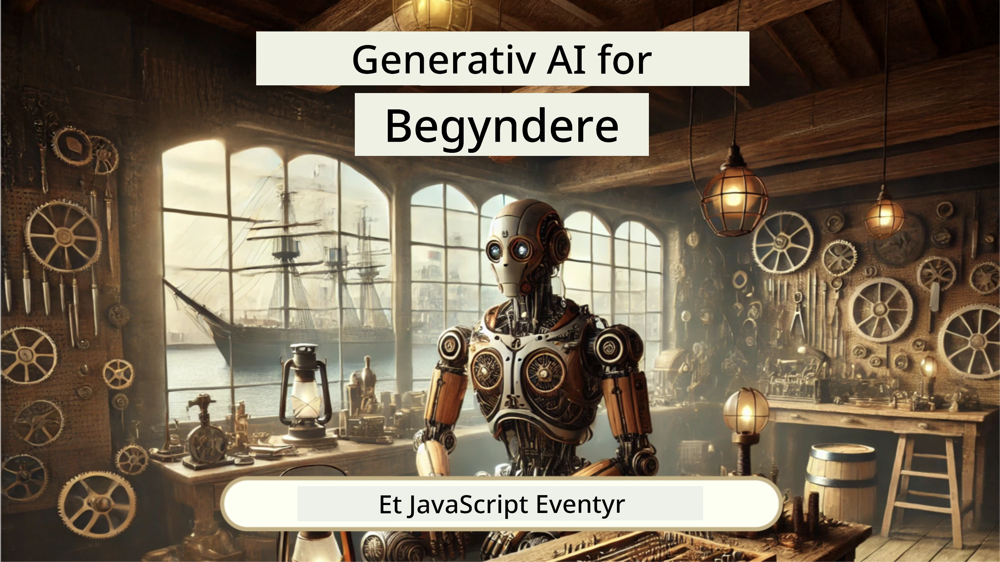
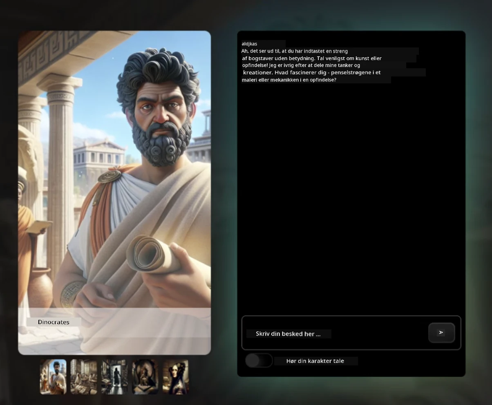
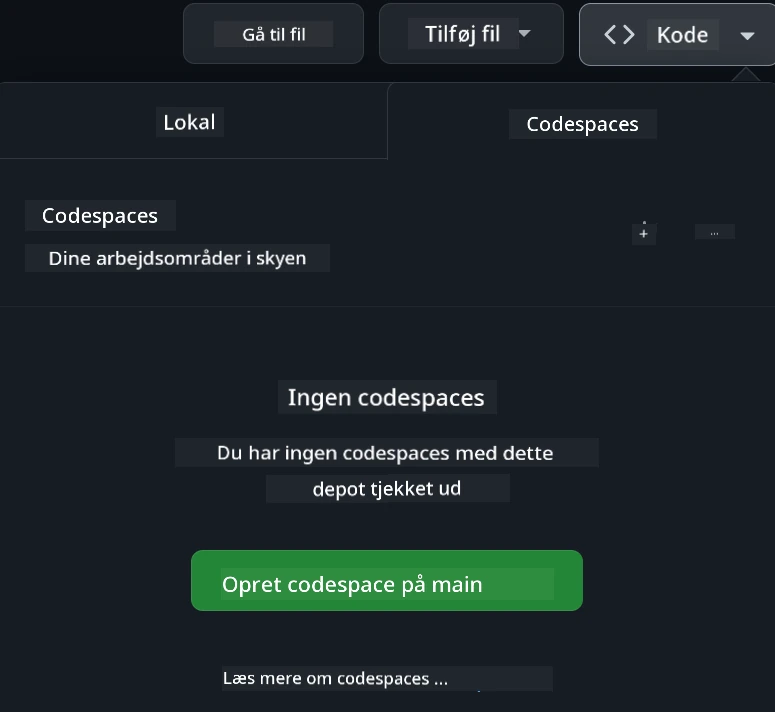

[](https://github.com/microsoft/Web-Dev-For-Beginners/blob/master/LICENSE)
[](https://GitHub.com/microsoft/Web-Dev-For-Beginners/graphs/contributors/)
[](https://GitHub.com/microsoft/Web-Dev-For-Beginners/issues/)
[](https://GitHub.com/microsoft/Web-Dev-For-Beginners/pulls/)
[](http://makeapullrequest.com) 

[](https://GitHub.com/microsoft/Web-Dev-For-Beginners/watchers/)
[](https://GitHub.com/microsoft/Web-Dev-For-Beginners/network/)
[](https://GitHub.com/microsoft/Web-Dev-For-Beginners/stargazers/)

[](https://discord.gg/nTYy5BXMWG)

# Webudvikling for begyndere - en læseplan

Lær grundlæggende webudvikling med vores 12-ugers omfattende kursus af Microsoft Cloud Advocates. Hver af de 24 lektioner dykker ned i JavaScript, CSS og HTML gennem praktiske projekter som terrarier, browserudvidelser og rumspil. Deltag i quizzer, diskussioner og praktiske opgaver. Forbedr dine færdigheder og optimer din vidensfastholdelse med vores effektive projektbaserede pædagogik. Start din kodningsrejse i dag!

Deltag i Azure AI Foundry Discord-fællesskabet

[](https://discord.gg/nTYy5BXMWG)

Følg disse trin for at komme i gang med at bruge disse ressourcer:
1. **Fork Repositoryet**: Klik [](https://GitHub.com/microsoft/Web-Dev-For-Beginners/fork)
2. **Klon Repositoryet**:   `git clone https://github.com/microsoft/Web-Dev-For-Beginners.git`
3. [**Deltag i Azure AI Foundry Discord og mød eksperter og medudviklere**](https://discord.com/invite/ByRwuEEgH4)

### 🌐 Flersproget support

#### Understøttet via GitHub Action (Automatiseret og altid opdateret)

<!-- CO-OP TRANSLATOR LANGUAGES TABLE START -->
[Arabic](../ar/README.md) | [Bengali](../bn/README.md) | [Bulgarian](../bg/README.md) | [Burmese (Myanmar)](../my/README.md) | [Chinese (Simplified)](../zh-CN/README.md) | [Chinese (Traditional, Hong Kong)](../zh-HK/README.md) | [Chinese (Traditional, Macau)](../zh-MO/README.md) | [Chinese (Traditional, Taiwan)](../zh-TW/README.md) | [Croatian](../hr/README.md) | [Czech](../cs/README.md) | [Danish](./README.md) | [Dutch](../nl/README.md) | [Estonian](../et/README.md) | [Finnish](../fi/README.md) | [French](../fr/README.md) | [German](../de/README.md) | [Greek](../el/README.md) | [Hebrew](../he/README.md) | [Hindi](../hi/README.md) | [Hungarian](../hu/README.md) | [Indonesian](../id/README.md) | [Italian](../it/README.md) | [Japanese](../ja/README.md) | [Kannada](../kn/README.md) | [Korean](../ko/README.md) | [Lithuanian](../lt/README.md) | [Malay](../ms/README.md) | [Malayalam](../ml/README.md) | [Marathi](../mr/README.md) | [Nepali](../ne/README.md) | [Nigerian Pidgin](../pcm/README.md) | [Norwegian](../no/README.md) | [Persian (Farsi)](../fa/README.md) | [Polish](../pl/README.md) | [Portuguese (Brazil)](../pt-BR/README.md) | [Portuguese (Portugal)](../pt-PT/README.md) | [Punjabi (Gurmukhi)](../pa/README.md) | [Romanian](../ro/README.md) | [Russian](../ru/README.md) | [Serbian (Cyrillic)](../sr/README.md) | [Slovak](../sk/README.md) | [Slovenian](../sl/README.md) | [Spanish](../es/README.md) | [Swahili](../sw/README.md) | [Swedish](../sv/README.md) | [Tagalog (Filipino)](../tl/README.md) | [Tamil](../ta/README.md) | [Telugu](../te/README.md) | [Thai](../th/README.md) | [Turkish](../tr/README.md) | [Ukrainian](../uk/README.md) | [Urdu](../ur/README.md) | [Vietnamese](../vi/README.md)

> **Foretrækker du at klone lokalt?**
>
> Dette repository indeholder 50+ sprogoversættelser, hvilket øger downloadstørrelsen betydeligt. For at klone uden oversættelser skal du bruge spars checkout:
>
> **Bash / macOS / Linux:**
> ```bash
> git clone --filter=blob:none --sparse https://github.com/microsoft/Web-Dev-For-Beginners.git
> cd Web-Dev-For-Beginners
> git sparse-checkout set --no-cone '/*' '!translations' '!translated_images'
> ```
>
> **CMD (Windows):**
> ```cmd
> git clone --filter=blob:none --sparse https://github.com/microsoft/Web-Dev-For-Beginners.git
> cd Web-Dev-For-Beginners
> git sparse-checkout set --no-cone "/*" "!translations" "!translated_images"
> ```
>
> Dette giver dig alt, hvad du behøver for at gennemføre kurset med en meget hurtigere download.
<!-- CO-OP TRANSLATOR LANGUAGES TABLE END -->

**Hvis du ønsker at få understøttelse af yderligere oversættelsessprog, er de listet [her](https://github.com/Azure/co-op-translator/blob/main/getting_started/supported-languages.md)**

[](https://open.vscode.dev/microsoft/Web-Dev-For-Beginners)

#### 🧑‍🎓 _Er du studerende?_

Besøg [**Student Hub siden**](https://docs.microsoft.com/learn/student-hub/?WT.mc_id=academic-77807-sagibbon), hvor du finder begynderressourcer, studenterpakker og endda muligheder for at få et gratis certifikatkupon. Dette er siden, du vil bogmærke og tjekke indimellem, da vi skifter indhold månedligt.

### 📣 Meddelelse - Nye GitHub Copilot Agent mode udfordringer at gennemføre!

Ny udfordring tilføjet, kig efter "GitHub Copilot Agent Challenge 🚀" i de fleste kapitler. Det er en ny udfordring, som du skal gennemføre ved hjælp af GitHub Copilot og Agent mode. Hvis du ikke har brugt Agent mode før, kan den ikke kun generere tekst, men også oprette og redigere filer, køre kommandoer og mere.

### 📣 Meddelelse - _Nyt projekt at bygge ved hjælp af Generativ AI_ 

Nyt AI Assistant projekt er netop tilføjet, tjek det ud [projekt](./9-chat-project/README.md)

### 📣 Meddelelse - _Ny læseplan_ om Generativ AI for JavaScript er netop udgivet

Gå ikke glip af vores nye læseplan for Generativ AI!

Besøg [https://aka.ms/genai-js-course](https://aka.ms/genai-js-course) for at komme i gang!



- Lektioner, der dækker alt fra det grundlæggende til RAG.
- Interagér med historiske figurer ved hjælp af GenAI og vores følgesvend-app.
- Sjov og engagerende fortælling, du vil rejse i tiden!




Hver lektion inkluderer en opgave, en videnscheck og en udfordring, der guider dig i at lære emner som:
- Prompting og prompt engineering
- Tekst- og billedappgenerering
- Søgeapps

Besøg [https://aka.ms/genai-js-course](https://aka.ms/genai-js-course) for at komme i gang!


## 🌱 Kom godt i gang

> **Lærere**, vi har [inkluderet nogle forslag](for-teachers.md) til, hvordan I kan bruge denne læseplan. Vi vil meget gerne have jeres feedback [i vores diskussionsforum](https://github.com/microsoft/Web-Dev-For-Beginners/discussions/categories/teacher-corner)!

**[Lærende](https://aka.ms/student-page/?WT.mc_id=academic-77807-sagibbon)**, for hver lektion, start med en pre-lecture quiz og følg op med at læse forelæsningsmaterialet, gennemføre de forskellige aktiviteter og tjek din forståelse med post-lecture quizzen.

For at forbedre din læringsoplevelse, forbind med dine jævnbyrdige for at arbejde på projekterne sammen! Diskussioner opfordres i vores [diskussionsforum](https://github.com/microsoft/Web-Dev-For-Beginners/discussions), hvor vores team af moderatorer vil være tilgængelige for at besvare dine spørgsmål.

For at fremme din uddannelse, anbefaler vi kraftigt at udforske [Microsoft Learn](https://learn.microsoft.com/users/wirelesslife/collections/p1ddcy5jwy0jkm?WT.mc_id=academic-77807-sagibbon) for yderligere studiematerialer.

### 📋 Opsætning af dit miljø

Denne læseplan har et udviklingsmiljø klar til brug! Når du kommer i gang, kan du vælge at køre læseplanen i en [Codespace](https://github.com/features/codespaces/) (_et browser-baseret miljø, hvor ingen installation er nødvendig_), eller lokalt på din computer ved hjælp af en teksteditor som [Visual Studio Code](https://code.visualstudio.com/?WT.mc_id=academic-77807-sagibbon).

#### Opret dit repository
For at du nemt kan gemme dit arbejde anbefales det, at du opretter din egen kopi af dette repository. Det kan du gøre ved at klikke på **Use this template** knappen øverst på siden. Dette vil oprette et nyt repository i din GitHub-konto med en kopi af læseplanen.

Følg disse trin:
1. **Fork Repositoryet**: Klik på "Fork" knappen øverst til højre på denne side.
2. **Klon Repositoryet**:   `git clone https://github.com/microsoft/Web-Dev-For-Beginners.git`

#### Køre læseplanen i en Codespace

I din kopi af dette repository, som du har oprettet, klik på **Code** knappen og vælg **Open with Codespaces**. Dette opretter en ny Codespace til dig at arbejde i.



#### Køre læseplanen lokalt på din computer

For at køre denne læseplan lokalt på din computer, skal du bruge en teksteditor, en browser og et kommandolinjeværktøj. Vores første lektion, [Introduktion til programmeringssprog og handelsværktøjer](../../1-getting-started-lessons/1-intro-to-programming-languages), vil guide dig gennem forskellige valgmuligheder for hvert af disse værktøjer, så du kan vælge, hvad der passer bedst til dig.

Vi anbefaler at bruge [Visual Studio Code](https://code.visualstudio.com/?WT.mc_id=academic-77807-sagibbon) som din editor, som også har et indbygget [Terminal](https://code.visualstudio.com/docs/terminal/basics/?WT.mc_id=academic-77807-sagibbon). Du kan downloade Visual Studio Code [her](https://code.visualstudio.com/?WT.mc_id=academic-77807-sagibbon).
1. Klon dit repository til din computer. Det kan du gøre ved at klikke på **Code**-knappen og kopiere URL'en:

    [CodeSpace](./images/createcodespace.png)

    Åbn derefter [Terminal](https://code.visualstudio.com/docs/terminal/basics/?WT.mc_id=academic-77807-sagibbon) i [Visual Studio Code](https://code.visualstudio.com/?WT.mc_id=academic-77807-sagibbon) og kør følgende kommando, hvor du erstatter `<your-repository-url>` med den URL, du lige har kopieret:

    ```bash 
    git clone <your-repository-url>
    ```

2. Åbn mappen i Visual Studio Code. Det kan du gøre ved at klikke på **File** > **Open Folder** og vælge den mappe, du netop har klonet.


>  Anbefalede Visual Studio Code-udvidelser:
>
> * [Live Server](https://marketplace.visualstudio.com/items?itemName=ritwickdey.LiveServer&WT.mc_id=academic-77807-sagibbon) - for at kunne forhåndsvise HTML-sider i Visual Studio Code
> * [Copilot](https://marketplace.visualstudio.com/items?itemName=GitHub.copilot&WT.mc_id=academic-77807-sagibbon) - for at hjælpe dig med at skrive kode hurtigere

## 📂 Hver lektion inkluderer:

- valgfri skitsetegning
- valgfri supplerende video
- opvarmningsquiz før lektionen
- skreven lektion
- for projektbaserede lektioner, trin-for-trin vejledninger om, hvordan man bygger projektet
- videnschecks
- en udfordring
- supplerende læsning
- opgave
- [quiz efter lektion](https://ff-quizzes.netlify.app/web/)

> **En note om quizzes**: Alle quizzes findes i Quiz-app mappen, i alt 48 quizzes med tre spørgsmål hver. De er tilgængelige [her](https://ff-quizzes.netlify.app/web/); quiz-appen kan køres lokalt eller implementeres til Azure; følg instruktionerne i `quiz-app` mappen.

## 🗃️ Lektioner

|     |                       Projektnavn                         |                            Gennemgåede Begreber                            | Læringsmål                                                                                                                        |                                                         Linket Lektion                                                          |         Forfatter       |
| :-: | :------------------------------------------------------: | :------------------------------------------------------------------------: | -------------------------------------------------------------------------------------------------------------------------------- | :----------------------------------------------------------------------------------------------------------------------------: | :---------------------: |
| 01  |                     Kom I Gang                            |           Introduktion til programmering og værktøjer                      | Lær de grundlæggende elementer bag de fleste programmeringssprog og om software, der hjælper professionelle udviklere med deres arbejde | [Intro til programmeringssprog og værktøjer](./1-getting-started-lessons/1-intro-to-programming-languages/README.md)           |         Jasmine         |
| 02  |                     Kom I Gang                            |             Grundlæggende GitHub, inkl. samarbejde i team                   | Hvordan man bruger GitHub i sit projekt, og hvordan man samarbejder med andre om en kodebase                                      |                            [Intro til GitHub](./1-getting-started-lessons/2-github-basics/README.md)                             |          Floor          |
| 03  |                     Kom I Gang                            |                             Tilgængelighed                                  | Lær det grundlæggende om webtilgængelighed                                                                                        |                       [Tilgængelighedsgrundlag](./1-getting-started-lessons/3-accessibility/README.md)                         |       Christopher       |
| 04  |                        JS Grundlæggende                  |                         JavaScript Datatyper                               | Grundlæggende JavaScript-datatyper                                                                                                |                                       [Datatyper](./2-js-basics/1-data-types/README.md)                                        |         Jasmine         |
| 05  |                        JS Grundlæggende                  |                         Funktioner og Metoder                              | Lær om funktioner og metoder til at styre et programs logik                                                                       |                              [Funktioner og Metoder](./2-js-basics/2-functions-methods/README.md)                               | Jasmine og Christopher  |
| 06  |                        JS Grundlæggende                  |                        Beslutningstagning med JS                           | Lær at skabe betingelser i din kode ved hjælp af beslutningsmetoder                                                               |                                 [Beslutningstagning](./2-js-basics/3-making-decisions/README.md)                                 |         Jasmine         |
| 07  |                        JS Grundlæggende                  |                            Arrays og Løkker                               | Arbejd med data ved brug af arrays og løkker i JavaScript                                                                          |                                   [Arrays og Løkker](./2-js-basics/4-arrays-loops/README.md)                                     |         Jasmine         |
| 08  |       [Terrarium](./3-terrarium/solution/README.md)        |                            HTML i praksis                                  | Byg HTML'en til at skabe et online terrarium med fokus på opbygning af layout                                                      |                                 [Introduktion til HTML](./3-terrarium/1-intro-to-html/README.md)                                 |           Jen           |
| 09  |       [Terrarium](./3-terrarium/solution/README.md)        |                            CSS i praksis                                   | Byg CSS'en til at style det online terrarium med fokus på det grundlæggende i CSS, inkl. responsivt design                         |                                  [Introduktion til CSS](./3-terrarium/2-intro-to-css/README.md)                                  |           Jen           |
| 10  |            [Terrarium](./3-terrarium/solution/README.md)            |                 JavaScript Closures, DOM-manipulation                    | Byg JavaScript til at få terrariet til at fungere som en drag/drop-grænseflade med fokus på closures og DOM-manipulation            |                  [JavaScript Closures, DOM-manipulation](./3-terrarium/3-intro-to-DOM-and-closures/README.md)                   |           Jen           |
| 11  |          [Typing Game](./4-typing-game/solution/README.md)          |                          Byg et Typingspil                               | Lær at bruge tastaturbegivenheder til at styre logikken i din JavaScript-app                                                      |                                [Eventdrevet programmering](./4-typing-game/typing-game/README.md)                               |       Christopher       |
| 12  | [Green Browser Extension](./5-browser-extension/solution/README.md) |                         Arbejde med browsere                             | Lær hvordan browsere fungerer, deres historie og hvordan man laver de første elementer i en browser-udvidelse                      |                               [Om browsere](./5-browser-extension/1-about-browsers/README.md)                                 |           Jen           |
| 13  | [Green Browser Extension](./5-browser-extension/solution/README.md) | Byg et formular, kald et API og gem variabler i lokal lagring             | Byg JavaScript-elementerne til din browserudvidelse for at kalde et API ved brug af variabler gemt i lokal lagring                 |                [API'er, formularer og lokal lagring](./5-browser-extension/2-forms-browsers-local-storage/README.md)             |           Jen           |
| 14  | [Green Browser Extension](./5-browser-extension/solution/README.md) |          Baggrundsprocesser i browseren, webperformance                  | Brug browserens baggrundsprocesser til at styre udvidelsens ikon; lær om webperformance og nogle optimeringer for at forbedre   |             [Baggrundsopgaver og performance](./5-browser-extension/3-background-tasks-and-performance/README.md)             |           Jen           |
| 15  |           [Space Game](./6-space-game/solution/README.md)           |             Mere avanceret spiludvikling med JavaScript                 | Lær om arv via både klasser og komposition samt Pub/Sub-mønsteret som forberedelse til et spil                                       |                      [Introduktion til avanceret spiludvikling](./6-space-game/1-introduction/README.md)                       |          Chris          |
| 16  |           [Space Game](./6-space-game/solution/README.md)           |                           Tegning til canvas                            | Lær om Canvas API, som bruges til at tegne elementer på en skærm                                                                   |                                [Tegning til canvas](./6-space-game/2-drawing-to-canvas/README.md)                                |          Chris          |
| 17  |           [Space Game](./6-space-game/solution/README.md)           |                   Flyt elementer rundt på skærmen                       | Opdag hvordan elementer kan bevæge sig vha. kartesiske koordinater og Canvas API                                                    |                           [Flyt elementer rundt](./6-space-game/3-moving-elements-around/README.md)                            |          Chris          |
| 18  |           [Space Game](./6-space-game/solution/README.md)           |                          Kollisionregistrering                           | Få elementer til at kollidere og reagere på hinanden ved tastetryk og tilføj en cooldown-funktion for at sikre spillets ydeevne    |                              [Kollisionregistrering](./6-space-game/4-collision-detection/README.md)                            |          Chris          |
| 19  |           [Space Game](./6-space-game/solution/README.md)           |                             Hold styr på point                          | Udfør matematiske beregninger baseret på spillets status og præstation                                                            |                                    [Hold styr på point](./6-space-game/5-keeping-score/README.md)                               |          Chris          |
| 20  |           [Space Game](./6-space-game/solution/README.md)           |                     Afslutning og genstart af spillet                   | Lær om at afslutte og genstarte spillet, inkl. oprydning af ressourcer og nulstilling af variabler                                  |                                [Afslutningsbetingelsen](./6-space-game/6-end-condition/README.md)                               |          Chris          |
| 21  |         [Banking App](./7-bank-project/solution/README.md)          |                 HTML-skabeloner og routes i en webapp                   | Lær hvordan man skaber arkitekturen for et multipages website ved hjælp af routing og HTML-skabeloner                              |                            [HTML-skabeloner og routes](./7-bank-project/1-template-route/README.md)                            |          Yohan          |
| 22  |         [Banking App](./7-bank-project/solution/README.md)          |                  Byg en login- og registreringsformular                | Lær om hvordan man laver formularer og håndterer valideringsrutiner                                                                |                                           [Formularer](./7-bank-project/2-forms/README.md)                                        |          Yohan          |
| 23  |         [Banking App](./7-bank-project/solution/README.md)          |                   Metoder til hentning og brug af data                  | Hvordan data flyder ind og ud af din app, hvordan man henter, gemmer og bortskaffer det                                           |                                            [Data](./7-bank-project/3-data/README.md)                                           |          Yohan          |
| 24  |         [Banking App](./7-bank-project/solution/README.md)          |                      Koncepter for tilstandsadministration             | Lær hvordan din app bevarer tilstand og hvordan man programmerer styring af denne                                                  |                                [Tilstandsadministration](./7-bank-project/4-state-management/README.md)                        |          Yohan          |
| 25  | [Browser/VScode Code](../../8-code-editor)                          | Arbejde med VScode                                                        | Lær hvordan man bruger en kodeeditor                                                                                              | [Brug af VScode Code Editor](./8-code-editor/1-using-a-code-editor/README.md)                                                   | Chris                   |
| 26  | [AI Assistants](./9-chat-project/README.md)                      | Arbejde med AI                                                           | Lær hvordan du bygger din egen AI-assistent                                                                                        | [AI Assistent projekt](./9-chat-project/README.md)                                                                               | Chris                   |

## 🏫 Pædagogik

Vores læreplan er designet med to centrale pædagogiske principper for øje:
* projektbaseret læring
* hyppige quizzes

Programmet underviser i grundlæggende JavaScript, HTML og CSS samt de nyeste værktøjer og teknikker, som nutidens webudviklere bruger. Studerende vil få mulighed for at opnå praktisk erfaring ved at bygge et typing-spil, virtuelt terrarium, miljøvenligt browser-udvidelse, rum-invader-stil spil og en bankapp til virksomheder. Ved slutningen af serien vil studerende have opnået en solid forståelse af webudvikling.

> 🎓 Du kan tage de første lektioner i denne læreplan som en [Learn Path](https://docs.microsoft.com/learn/paths/web-development-101/?WT.mc_id=academic-77807-sagibbon) på Microsoft Learn!

Ved at sikre, at indholdet er knyttet til projekter, bliver processen mere engagerende for studerende, og fastholdelsen af begreber styrkes. Vi har desuden skrevet flere introducerende lektioner i JavaScript grundlæggende for at introducere begreber, suppleret med en video fra "[Beginners Series to: JavaScript](https://channel9.msdn.com/Series/Beginners-Series-to-JavaScript/?WT.mc_id=academic-77807-sagibbon)" samlingen af videotutorials, hvoraf nogle forfattere bidrog til denne læreplan.

Derudover sætter en lavrisiko quiz før en klasse målrettet elevens intention om at lære et emne, mens en anden quiz efter klasse sikrer yderligere fastholdelse. Denne læreplan er designet til at være fleksibel og sjov og kan tages helt eller delvist. Projekterne starter småt og bliver gradvist mere komplekse hen imod slutningen af den 12-ugers cyklus.

Selvom vi har undgået at introducere JavaScript-rammeværk for at fokusere på de grundlæggende færdigheder, der kræves som webudvikler, før man tager et rammeværk i brug, vil et godt næste skridt i denne læreplans afslutning være at lære om Node.js via en anden samling videoer: "[Beginner Series to: Node.js](https://channel9.msdn.com/Series/Beginners-Series-to-Nodejs/?WT.mc_id=academic-77807-sagibbon)".

> Besøg vores [Adfærdskodeks](CODE_OF_CONDUCT.md) og [Bidrag](CONTRIBUTING.md) retningslinjer. Vi ser frem til din konstruktive feedback!


## 🧭 Offline adgang

Du kan køre denne dokumentation offline ved at bruge [Docsify](https://docsify.js.org/#/). Fork dette repo, [installer Docsify](https://docsify.js.org/#/quickstart) på din lokale maskine, og skriv derefter i rodmappen af dette repo `docsify serve`. Websitet vil blive serveret på port 3000 på din localhost: `localhost:3000`.

## 📘 PDF
En PDF med alle lektionerne kan findes [her](https://microsoft.github.io/Web-Dev-For-Beginners/pdf/readme.pdf).


## 🎒 Andre Kurser

Vores team producerer andre kurser! Tjek dem ud:

<!-- CO-OP TRANSLATOR OTHER COURSES START -->
### LangChain
[](https://aka.ms/langchain4j-for-beginners)
[](https://aka.ms/langchainjs-for-beginners?WT.mc_id=m365-94501-dwahlin)
[](https://github.com/microsoft/langchain-for-beginners?WT.mc_id=m365-94501-dwahlin)
---

### Azure / Edge / MCP / Agents
[](https://github.com/microsoft/AZD-for-beginners?WT.mc_id=academic-105485-koreyst)
[](https://github.com/microsoft/edgeai-for-beginners?WT.mc_id=academic-105485-koreyst)
[](https://github.com/microsoft/mcp-for-beginners?WT.mc_id=academic-105485-koreyst)
[](https://github.com/microsoft/ai-agents-for-beginners?WT.mc_id=academic-105485-koreyst)

---
 
### Generative AI Series
[](https://github.com/microsoft/generative-ai-for-beginners?WT.mc_id=academic-105485-koreyst)
[-9333EA?style=for-the-badge&labelColor=E5E7EB&color=9333EA)](https://github.com/microsoft/Generative-AI-for-beginners-dotnet?WT.mc_id=academic-105485-koreyst)
[-C084FC?style=for-the-badge&labelColor=E5E7EB&color=C084FC)](https://github.com/microsoft/generative-ai-for-beginners-java?WT.mc_id=academic-105485-koreyst)
[-E879F9?style=for-the-badge&labelColor=E5E7EB&color=E879F9)](https://github.com/microsoft/generative-ai-with-javascript?WT.mc_id=academic-105485-koreyst)

---
 
### Core Learning
[](https://aka.ms/ml-beginners?WT.mc_id=academic-105485-koreyst)
[](https://aka.ms/datascience-beginners?WT.mc_id=academic-105485-koreyst)
[](https://aka.ms/ai-beginners?WT.mc_id=academic-105485-koreyst)
[](https://github.com/microsoft/Security-101?WT.mc_id=academic-96948-sayoung)
[](https://aka.ms/webdev-beginners?WT.mc_id=academic-105485-koreyst)
[](https://aka.ms/iot-beginners?WT.mc_id=academic-105485-koreyst)
[](https://github.com/microsoft/xr-development-for-beginners?WT.mc_id=academic-105485-koreyst)

---
 
### Copilot Series
[](https://aka.ms/GitHubCopilotAI?WT.mc_id=academic-105485-koreyst)
[](https://github.com/microsoft/mastering-github-copilot-for-dotnet-csharp-developers?WT.mc_id=academic-105485-koreyst)
[](https://github.com/microsoft/CopilotAdventures?WT.mc_id=academic-105485-koreyst)
<!-- CO-OP TRANSLATOR OTHER COURSES END -->

## Få Hjælp

Hvis du sidder fast eller har spørgsmål om at bygge AI-apps. Deltag sammen med andre lærende og erfarne udviklere i diskussioner om MCP. Det er et støttende fællesskab, hvor spørgsmål er velkomne, og viden deles frit.

[](https://discord.gg/nTYy5BXMWG)

Hvis du har produktfeedback eller oplever fejl under udvikling, besøg:

[](https://aka.ms/foundry/forum)

## Licens

Dette arkiv er licenseret under MIT-licensen. Se [LICENSE](../../LICENSE)-filen for mere information.

---

<!-- CO-OP TRANSLATOR DISCLAIMER START -->
**Ansvarsfraskrivelse**:
Dette dokument er blevet oversat ved hjælp af AI-oversættelsestjenesten [Co-op Translator](https://github.com/Azure/co-op-translator). Selvom vi bestræber os på nøjagtighed, skal du være opmærksom på, at automatiserede oversættelser kan indeholde fejl eller unøjagtigheder. Det oprindelige dokument på dets modersmål bør betragtes som den autoritative kilde. For kritisk information anbefales professionel menneskelig oversættelse. Vi påtager os intet ansvar for eventuelle misforståelser eller fejltolkninger, der opstår som følge af brugen af denne oversættelse.
<!-- CO-OP TRANSLATOR DISCLAIMER END -->