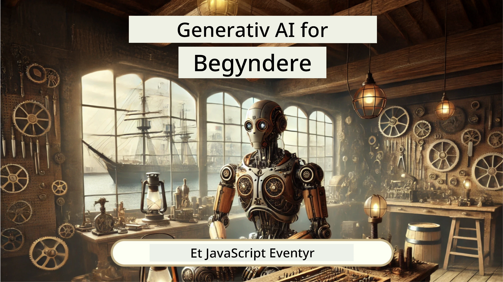
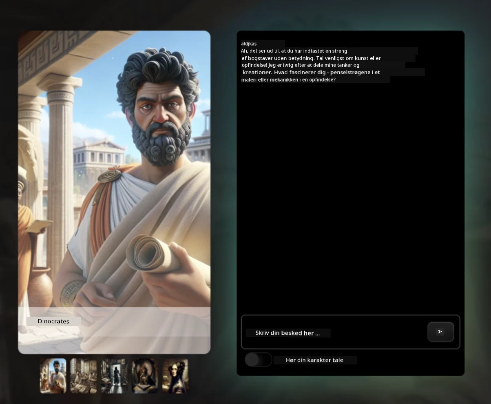
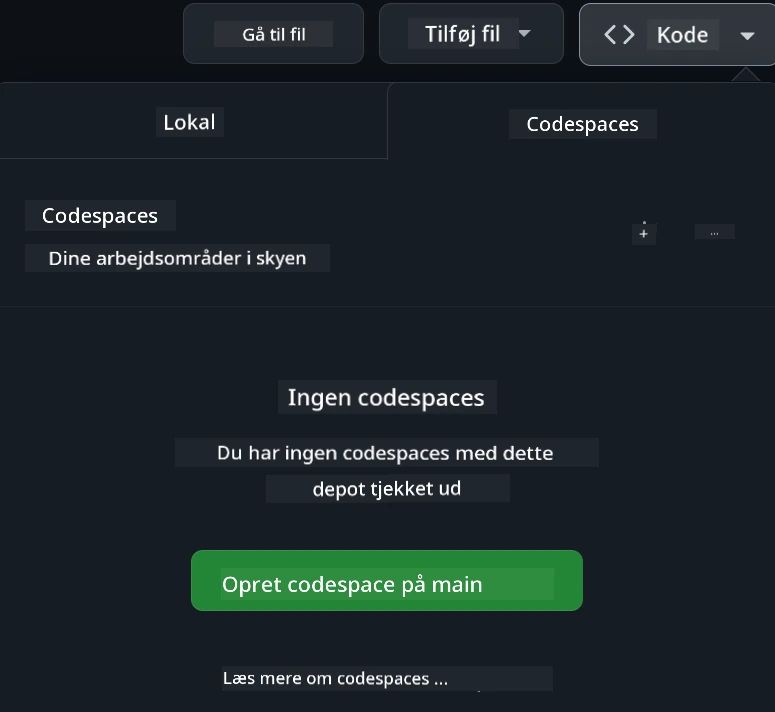

[](https://github.com/microsoft/Web-Dev-For-Beginners/blob/master/LICENSE)
[](https://GitHub.com/microsoft/Web-Dev-For-Beginners/graphs/contributors/)
[](https://GitHub.com/microsoft/Web-Dev-For-Beginners/issues/)
[](https://GitHub.com/microsoft/Web-Dev-For-Beginners/pulls/)
[](http://makeapullrequest.com) 

[](https://GitHub.com/microsoft/Web-Dev-For-Beginners/watchers/)
[](https://GitHub.com/microsoft/Web-Dev-For-Beginners/network/)
[](https://GitHub.com/microsoft/Web-Dev-For-Beginners/stargazers/)

[](https://discord.gg/nTYy5BXMWG)

# Webudvikling for Begyndere - En Læreplan

Lær det grundlæggende inden for webudvikling med vores 12-ugers omfattende kursus af Microsoft Cloud Advocates. Hver af de 24 lektioner dykker ned i JavaScript, CSS og HTML gennem praktiske projekter som terrarier, browserudvidelser og rumspil. Deltag i quizzer, diskussioner og praktiske opgaver. Forbedr dine færdigheder og optimer din vidensindlæring med vores effektive projektbaserede pædagogik. Start din kodningsrejse i dag!

Deltag i Azure AI Foundry Discord og mød eksperter og andre udviklere.

[](https://discord.gg/nTYy5BXMWG)

Følg disse trin for at komme i gang med at bruge disse ressourcer:
1. **Fork Repoet**: Klik på [](https://GitHub.com/microsoft/Web-Dev-For-Beginners/fork)
2. **Klon Repoet**:   `git clone https://github.com/microsoft/Web-Dev-For-Beginners.git`
3. [**Deltag i Azure AI Foundry Discord og mød eksperter og andre udviklere**](https://discord.com/invite/ByRwuEEgH4)

### 🌐 Understøttelse af flere sprog

#### Understøttet via GitHub Action (Automatisk & Altid Opdateret)

<!-- CO-OP TRANSLATOR LANGUAGES TABLE START -->
[Arabic](../ar/README.md) | [Bengali](../bn/README.md) | [Bulgarian](../bg/README.md) | [Burmese (Myanmar)](../my/README.md) | [Chinese (Simplified)](../zh-CN/README.md) | [Chinese (Traditional, Hong Kong)](../zh-HK/README.md) | [Chinese (Traditional, Macau)](../zh-MO/README.md) | [Chinese (Traditional, Taiwan)](../zh-TW/README.md) | [Croatian](../hr/README.md) | [Czech](../cs/README.md) | [Danish](./README.md) | [Dutch](../nl/README.md) | [Estonian](../et/README.md) | [Finnish](../fi/README.md) | [French](../fr/README.md) | [German](../de/README.md) | [Greek](../el/README.md) | [Hebrew](../he/README.md) | [Hindi](../hi/README.md) | [Hungarian](../hu/README.md) | [Indonesian](../id/README.md) | [Italian](../it/README.md) | [Japanese](../ja/README.md) | [Kannada](../kn/README.md) | [Khmer](../km/README.md) | [Korean](../ko/README.md) | [Lithuanian](../lt/README.md) | [Malay](../ms/README.md) | [Malayalam](../ml/README.md) | [Marathi](../mr/README.md) | [Nepali](../ne/README.md) | [Nigerian Pidgin](../pcm/README.md) | [Norwegian](../no/README.md) | [Persian (Farsi)](../fa/README.md) | [Polish](../pl/README.md) | [Portuguese (Brazil)](../pt-BR/README.md) | [Portuguese (Portugal)](../pt-PT/README.md) | [Punjabi (Gurmukhi)](../pa/README.md) | [Romanian](../ro/README.md) | [Russian](../ru/README.md) | [Serbian (Cyrillic)](../sr/README.md) | [Slovak](../sk/README.md) | [Slovenian](../sl/README.md) | [Spanish](../es/README.md) | [Swahili](../sw/README.md) | [Swedish](../sv/README.md) | [Tagalog (Filipino)](../tl/README.md) | [Tamil](../ta/README.md) | [Telugu](../te/README.md) | [Thai](../th/README.md) | [Turkish](../tr/README.md) | [Ukrainian](../uk/README.md) | [Urdu](../ur/README.md) | [Vietnamese](../vi/README.md)

> **Foretrækker du at klone lokalt?**
>
> Dette repository inkluderer 50+ sprogoversættelser, hvilket betydeligt øger download-størrelsen. For at klone uden oversættelser, brug spars checkout:
>
> **Bash / macOS / Linux:**
> ```bash
> git clone --filter=blob:none --sparse https://github.com/microsoft/Web-Dev-For-Beginners.git
> cd Web-Dev-For-Beginners
> git sparse-checkout set --no-cone '/*' '!translations' '!translated_images'
> ```
>
> **CMD (Windows):**
> ```cmd
> git clone --filter=blob:none --sparse https://github.com/microsoft/Web-Dev-For-Beginners.git
> cd Web-Dev-For-Beginners
> git sparse-checkout set --no-cone "/*" "!translations" "!translated_images"
> ```
>
> Dette giver dig alt, hvad du behøver for at gennemføre kurset med en meget hurtigere download.
<!-- CO-OP TRANSLATOR LANGUAGES TABLE END -->

**Hvis du ønsker yderligere oversættelser, er de understøttede sprog listet her. [her](https://github.com/Azure/co-op-translator/blob/main/getting_started/supported-languages.md)**

[](https://open.vscode.dev/microsoft/Web-Dev-For-Beginners)

#### 🧑‍🎓 _Er du studerende?_

Besøg [**Student Hub siden**](https://docs.microsoft.com/learn/student-hub/?WT.mc_id=academic-77807-sagibbon), hvor du vil finde begynderressourcer, studenterpakker og endda måder at få et gratis certifikat-voucher. Dette er siden, du vil bogmærke og tjekke fra tid til anden, da vi skifter indhold månedligt.

### 📣 Meddelelse - Nye GitHub Copilot Agent mode udfordringer at gennemføre!

Ny udfordring tilføjet, se efter "GitHub Copilot Agent Challenge 🚀" i de fleste kapitler. Det er en ny udfordring for dig at gennemføre ved brug af GitHub Copilot og Agent mode. Hvis du ikke har brugt Agent mode før, kan den ikke bare generere tekst, men også skabe og redigere filer, køre kommandoer med mere.

### 📣 Meddelelse - _Nyt projekt at bygge med Generativ AI_

Nyt AI Assistentprojekt lige tilføjet, tjek det ud [projekt](./9-chat-project/README.md)

### 📣 Meddelelse - _Ny læreplan_ om Generativ AI for JavaScript er netop udgivet

Gå ikke glip af vores nye Generative AI læreplan!

Besøg [https://aka.ms/genai-js-course](https://aka.ms/genai-js-course) for at komme i gang!



- Lektioner som dækker alt fra grundlæggende til RAG.
- Interager med historiske personer ved hjælp af GenAI og vores companion-app.
- Sjov og engagerende fortælling, du kommer til at rejse i tiden!




Hver lektion inkluderer en opgave at gennemføre, en videnscheck og en udfordring for at guide dig i at lære emner som:
- Prompting og prompt engineering
- Tekst- og billedapp-generering
- Søgeapps

Besøg [https://aka.ms/genai-js-course](https://aka.ms/genai-js-course) for at komme i gang!


## 🌱 Kom godt i gang

> **Lærere**, vi har [inkluderet nogle forslag](for-teachers.md) til, hvordan du kan bruge denne læreplan. Vi vil meget gerne have din feedback [i vores diskussionsforum](https://github.com/microsoft/Web-Dev-For-Beginners/discussions/categories/teacher-corner)!

**[Lærende](https://aka.ms/student-page/?WT.mc_id=academic-77807-sagibbon)**, for hver lektion, start med en pre-forelæsningsquiz og følg op med at læse forelæsningsmaterialet, udfør de forskellige aktiviteter og tjek din forståelse med post-forelæsningsquizzen.

For at forbedre din læringsoplevelse, forbind med dine jævnaldrende for at arbejde sammen på projekterne! Diskussioner opfordres i vores [diskussionsforum](https://github.com/microsoft/Web-Dev-For-Beginners/discussions), hvor vores team af moderatorer vil være tilgængelige for at besvare dine spørgsmål.

For at fremme din uddannelse anbefaler vi stærkt at udforske [Microsoft Learn](https://learn.microsoft.com/users/wirelesslife/collections/p1ddcy5jwy0jkm?WT.mc_id=academic-77807-sagibbon) for yderligere studiematerialer.

### 📋 Opsæt dit miljø

Denne læreplan har et udviklingsmiljø klar til brug! Når du går i gang, kan du vælge at køre læreplanen i en [Codespace](https://github.com/features/codespaces/) (_et browser-baseret, ingen installation nødvendig miljø_), eller lokalt på din computer ved at bruge en teksteditor som [Visual Studio Code](https://code.visualstudio.com/?WT.mc_id=academic-77807-sagibbon).

#### Opret dit repository
For at du nemt kan gemme dit arbejde, anbefales det, at du opretter din egen kopi af dette repository. Det kan du gøre ved at klikke på knappen **Use this template** øverst på siden. Dette opretter et nyt repository på din GitHub konto med en kopi af læreplanen.

Følg disse trin:
1. **Fork Repoet**: Klik på "Fork" knappen øverst til højre på denne side.
2. **Klon Repoet**:   `git clone https://github.com/microsoft/Web-Dev-For-Beginners.git`

#### Kør læreplanen i en Codespace

I din kopi af dette repository, som du har oprettet, klik på **Code** knappen og vælg **Open with Codespaces**. Dette vil oprette en ny Codespace for dig at arbejde i.



#### Kør læreplanen lokalt på din computer

For at køre denne læreplan lokalt på din computer, skal du bruge en teksteditor, en browser og et kommandolinjeværktøj. Vores første lektion, [Introduktion til programmeringssprog og værktøjer](../../1-getting-started-lessons/1-intro-to-programming-languages), vil guide dig igennem forskellige muligheder for hver af disse værktøjer, så du kan vælge det, der fungerer bedst for dig.

Vores anbefaling er at bruge [Visual Studio Code](https://code.visualstudio.com/?WT.mc_id=academic-77807-sagibbon) som din editor, som også har en indbygget [Terminal](https://code.visualstudio.com/docs/terminal/basics/?WT.mc_id=academic-77807-sagibbon). Du kan downloade Visual Studio Code [her](https://code.visualstudio.com/?WT.mc_id=academic-77807-sagibbon).
1. Klon dit repository til din computer. Du kan gøre dette ved at klikke på **Code**-knappen og kopiere URL'en:

    [CodeSpace](./images/createcodespace.png)

    Åbn derefter [Terminal](https://code.visualstudio.com/docs/terminal/basics/?WT.mc_id=academic-77807-sagibbon) i [Visual Studio Code](https://code.visualstudio.com/?WT.mc_id=academic-77807-sagibbon) og kør følgende kommando, hvor du udskifter `<your-repository-url>` med den URL, du lige har kopieret:

    ```bash 
    git clone <your-repository-url>
    ```

2. Åbn mappen i Visual Studio Code. Du kan gøre dette ved at klikke **File** > **Open Folder** og vælge den mappe, du lige har klonet.


>  Anbefalede Visual Studio Code-udvidelser:
>
> * [Live Server](https://marketplace.visualstudio.com/items?itemName=ritwickdey.LiveServer&WT.mc_id=academic-77807-sagibbon) - til at forhåndsvise HTML-sider i Visual Studio Code
> * [Copilot](https://marketplace.visualstudio.com/items?itemName=GitHub.copilot&WT.mc_id=academic-77807-sagibbon) - til at hjælpe dig med at skrive kode hurtigere

## 📂 Hver lektion inkluderer:

- valgfri sketchnote
- valgfri supplerende video
- quiz som opvarmning før lektionen
- skreven lektion
- for projektbaserede lektioner, trin-for-trin guider til, hvordan man bygger projektet
- videnscheck
- en udfordring
- supplerende læsning
- opgave
- [quiz efter lektionen](https://ff-quizzes.netlify.app/web/)

> **En note om quizzer**: Alle quizzer findes i Quiz-app mappen, i alt 48 quizzer med tre spørgsmål hver. De er tilgængelige [her](https://ff-quizzes.netlify.app/web/); quiz-appen kan køre lokalt eller implementeres til Azure; følg instruktionerne i `quiz-app` mappen.

## 🗃️ Lektioner

|     |                       Projektnavn                       |                            Undervisede begreber                             | Læringsmål                                                                                                                 |                                                         Link til lektion                                                          |         Forfatter          |
| :-: | :------------------------------------------------------: | :--------------------------------------------------------------------: | ----------------------------------------------------------------------------------------------------------------------------------- | :----------------------------------------------------------------------------------------------------------------------------: | :---------------------: |
| 01  |                     Kom godt i gang                      |           Introduktion til programmering og værktøjer           | Lær de grundlæggende principper bag de fleste programmeringssprog og om software, der hjælper professionelle udviklere med deres arbejde | [Intro til programmeringssprog og værktøjer](./1-getting-started-lessons/1-intro-to-programming-languages/README.md) |         Jasmine         |
| 02  |                     Kom godt i gang                      |             Grundlæggende GitHub, inkluderer samarbejde             | Hvordan du bruger GitHub i dit projekt, og hvordan du samarbejder med andre om en kodebase                                                    |                            [Intro til GitHub](./1-getting-started-lessons/2-github-basics/README.md)                             |          Floor          |
| 03  |                     Kom godt i gang                      |                             Tilgængelighed                              | Lær det grundlæggende om webtilgængelighed                                                                                               |                       [Grundlæggende tilgængelighed](./1-getting-started-lessons/3-accessibility/README.md)                       |       Christopher       |
| 04  |                        JS Basics                         |                         JavaScript datatyper                          | Grundlæggende JavaScript-datatyper                                                                                                 |                                       [Datatyper](./2-js-basics/1-data-types/README.md)                                        |         Jasmine         |
| 05  |                        JS Basics                         |                         Funktioner og metoder                          | Lær om funktioner og metoder til at styre en applikations logik                                                             |                              [Funktioner og metoder](./2-js-basics/2-functions-methods/README.md)                               | Jasmine og Christopher |
| 06  |                        JS Basics                         |                        Beslutningstagning med JS                        | Lær hvordan du opretter betingelser i din kode ved hjælp af beslutningstagning                                                           |                                 [Beslutningstagning](./2-js-basics/3-making-decisions/README.md)                                  |         Jasmine         |
| 07  |                        JS Basics                         |                            Arrays og loops                            | Arbejd med data ved hjælp af arrays og loops i JavaScript                                                                                 |                                   [Arrays og loops](./2-js-basics/4-arrays-loops/README.md)                                    |         Jasmine         |
| 08  |       [Terrarium](./3-terrarium/solution/README.md)       |                            HTML i praksis                            | Byg HTML’en til at skabe et online terrarium med fokus på layout                                                         |                                 [Introduktion til HTML](./3-terrarium/1-intro-to-html/README.md)                                 |           Jen           |
| 09  |       [Terrarium](./3-terrarium/solution/README.md)       |                            CSS i praksis                             | Byg CSS’en til at style det online terrarium med fokus på det grundlæggende CSS inklusive at gøre siden responsiv                     |                                  [Introduktion til CSS](./3-terrarium/2-intro-to-css/README.md)                                  |           Jen           |
| 10  |            [Terrarium](./3-terrarium/solution/README.md)            |                 JavaScript closures, DOM-manipulation                  | Byg JavaScript’en til at gøre terrariet funktionelt som en træk og slip-grænseflade med fokus på closures og DOM-manipulation             |                  [JavaScript closures, DOM-manipulation](./3-terrarium/3-intro-to-DOM-and-closures/README.md)                   |           Jen           |
| 11  |          [Typing Game](./4-typing-game/solution/README.md)          |                          Byg et typespil                           | Lær hvordan du bruger tastaturhændelser til at drive logikken i din JavaScript-app                                                          |                                [Event-Driven Programming](./4-typing-game/typing-game/README.md)                                |       Christopher       |
| 12  | [Green Browser Extension](./5-browser-extension/solution/README.md) |                         Arbejde med browsere                          | Lær hvordan browsere fungerer, deres historie, og hvordan man skitserer de første elementer i en browserudvidelse                               |                               [Om browsere](./5-browser-extension/1-about-browsers/README.md)                                |           Jen           |
| 13  | [Green Browser Extension](./5-browser-extension/solution/README.md) | Byg et form, kald et API og gem variabler i lokal lagerplads | Byg JavaScript-elementerne i din browserudvidelse til at kalde et API ved brug af variabler gemt i lokal lagerplads                      |                [API'er, formularer og lokal lagring](./5-browser-extension/2-forms-browsers-local-storage/README.md)                 |           Jen           |
| 14  | [Green Browser Extension](./5-browser-extension/solution/README.md) |          Baggrundsprocesser i browseren, webperformance          | Brug browserens baggrundsprocesser til at styre udvidelsens ikon; lær om webperformance og nogle optimeringer for at forbedre   |             [Baggrundsopgaver og performance](./5-browser-extension/3-background-tasks-and-performance/README.md)              |           Jen           |
| 15  |           [Space Game](./6-space-game/solution/README.md)           |             Mere avanceret spiludvikling med JavaScript             | Lær om arv ved brug af både klasser og sammensætning samt Pub/Sub-mønsteret, som forberedelse til at bygge et spil              |                      [Introduktion til avanceret spiludvikling](./6-space-game/1-introduction/README.md)                       |          Chris          |
| 16  |           [Space Game](./6-space-game/solution/README.md)           |                           Tegning til canvas                            | Lær om Canvas API, som bruges til at tegne elementer på en skærm                                                                       |                                [Tegning til Canvas](./6-space-game/2-drawing-to-canvas/README.md)                                |          Chris          |
| 17  |           [Space Game](./6-space-game/solution/README.md)           |                   Flyt elementer rundt på skærmen                    | Opdag hvordan elementer kan få bevægelse ved hjælp af kartesiske koordinater og Canvas API                                            |                           [Flyt elementer rundt](./6-space-game/3-moving-elements-around/README.md)                           |          Chris          |
| 18  |           [Space Game](./6-space-game/solution/README.md)           |                          Kollisiondetektion                           | Få elementer til at kollidere og reagere på hinanden via tastetryk og tilføj en cooldown-funktion for at sikre spillets ydeevne    |                              [Kollisiondetektion](./6-space-game/4-collision-detection/README.md)                              |          Chris          |
| 19  |           [Space Game](./6-space-game/solution/README.md)           |                             Hold styr på point                              | Udfør matematiske beregninger baseret på spillets tilstand og performance                                                                |                                    [Pointtælling](./6-space-game/5-keeping-score/README.md)                                    |          Chris          |
| 20  |           [Space Game](./6-space-game/solution/README.md)           |                     Afslutning og genstart af spillet                     | Lær om hvordan man afslutter og genstarter spillet, inklusive oprydning af assets og nulstilling af variabler                              |                                [Afslutningsbetingelsen](./6-space-game/6-end-condition/README.md)                                 |          Chris          |
| 21  |         [Banking App](./7-bank-project/solution/README.md)          |                 HTML-skabeloner og ruter i en webapp                 | Lær hvordan man skaber grundstrukturen til en multipage websides arkitektur ved brug af routing og HTML-skabeloner                             |                            [HTML-skabeloner og ruter](./7-bank-project/1-template-route/README.md)                             |          Yohan          |
| 22  |         [Banking App](./7-bank-project/solution/README.md)          |                  Byg en login- og registreringsformular                   | Lær om at bygge formularer og håndtere valideringsrutiner                                                                          |                                           [Formularer](./7-bank-project/2-forms/README.md)                                           |          Yohan          |
| 23  |         [Banking App](./7-bank-project/solution/README.md)          |                   Metoder til at hente og bruge data                   | Hvordan data flyder ind og ud af din app, hvordan man henter, gemmer og bortskaffer den                                                 |                                            [Data](./7-bank-project/3-data/README.md)                                            |          Yohan          |
| 24  |         [Banking App](./7-bank-project/solution/README.md)          |                      Begreber i state management                      | Lær hvordan din app opretholder tilstand og administrerer den programmæssigt                                                              |                                [State Management](./7-bank-project/4-state-management/README.md)                                |          Yohan          |
| 25 | [Browser/VScode Code](../../8-code-editor) | Arbejde med VScode | Lær hvordan man bruger en kodeeditor| [Brug VScode Code Editor](./8-code-editor/1-using-a-code-editor/README.md) | Chris |
| 26 | [AI Assistants](./9-chat-project/README.md) | Arbejde med AI | Lær hvordan du bygger din egen AI-assistent | [AI-assistent projekt](./9-chat-project/README.md) | Chris |

## 🏫 Pædagogik

Vores pensum er designet med to centrale pædagogiske principper i tankerne:
* projektbaseret læring
* hyppige quizzer

Programmet underviser i grundlæggende JavaScript, HTML og CSS samt de nyeste værktøjer og teknikker, der anvendes af nutidens webudviklere. Studerende får mulighed for praktisk erfaring ved at bygge et typespil, virtuelt terrarium, miljøvenlig browserudvidelse, space-invader-stil spil og en bankapp til virksomheder. Ved afslutningen af serien vil de studerende have opnået en solid forståelse af webudvikling.

> 🎓 Du kan tage de første lektioner i dette pensum som en [Læringssti](https://docs.microsoft.com/learn/paths/web-development-101/?WT.mc_id=academic-77807-sagibbon) på Microsoft Learn!

Ved at sikre, at indholdet stemmer overens med projekter, bliver processen mere engagerende for de studerende, og fastholdelsen af begreber vil blive forbedret. Vi skrev også flere startlektioner i JavaScript-begreber for at introducere koncepter, parret med en video fra "[Beginners Series to: JavaScript](https://channel9.msdn.com/Series/Beginners-Series-to-JavaScript/?WT.mc_id=academic-77807-sagibbon)" samlingen af videotutorials, hvor nogle af forfatterne bidrog til dette pensum.

Desuden sætter en lavrisiko-quiz før en lektion elevens intention mod at lære et emne, mens en anden quiz efter lektionen sikrer yderligere fastholdelse. Dette pensum er designet til at være fleksibelt og sjovt og kan tages helt eller delvist. Projekterne starter småt og bliver gradvist mere komplekse ved slutningen af den 12-ugers cyklus.

Selvom vi bevidst har undgået at introducere JavaScript-rammeværk for at fokusere på de grundlæggende færdigheder, der er nødvendige som webudvikler, før man går videre til et rammeværk, vil et godt næste skridt for at fuldføre dette pensum være at lære om Node.js via en anden samling videoer: "[Beginner Series to: Node.js](https://channel9.msdn.com/Series/Beginners-Series-to-Nodejs/?WT.mc_id=academic-77807-sagibbon)".

> Besøg vores [Code of Conduct](CODE_OF_CONDUCT.md) og [Contributing](CONTRIBUTING.md) retningslinjer. Vi ser frem til din konstruktive feedback!


## 🧭 Offline adgang

Du kan køre denne dokumentation offline ved at bruge [Docsify](https://docsify.js.org/#/). Fork dette repo, [installer Docsify](https://docsify.js.org/#/quickstart) på din lokale maskine, og skriv derefter i rodmappen i dette repo `docsify serve`. Hjemmesiden vil blive serveret på port 3000 på din localhost: `localhost:3000`.

## 📘 PDF
En PDF med alle lektionerne kan findes [her](https://microsoft.github.io/Web-Dev-For-Beginners/pdf/readme.pdf).


## 🎒 Andre kurser

Vores team producerer andre kurser! Tjek dem ud:

<!-- CO-OP TRANSLATOR OTHER COURSES START -->
### LangChain
[](https://aka.ms/langchain4j-for-beginners)
[](https://aka.ms/langchainjs-for-beginners?WT.mc_id=m365-94501-dwahlin)
[](https://github.com/microsoft/langchain-for-beginners?WT.mc_id=m365-94501-dwahlin)
---

### Azure / Edge / MCP / Agents
[](https://github.com/microsoft/AZD-for-beginners?WT.mc_id=academic-105485-koreyst)
[](https://github.com/microsoft/edgeai-for-beginners?WT.mc_id=academic-105485-koreyst)
[](https://github.com/microsoft/mcp-for-beginners?WT.mc_id=academic-105485-koreyst)
[](https://github.com/microsoft/ai-agents-for-beginners?WT.mc_id=academic-105485-koreyst)

---
 
### Generative AI Serie
[](https://github.com/microsoft/generative-ai-for-beginners?WT.mc_id=academic-105485-koreyst)
[-9333EA?style=for-the-badge&labelColor=E5E7EB&color=9333EA)](https://github.com/microsoft/Generative-AI-for-beginners-dotnet?WT.mc_id=academic-105485-koreyst)
[-C084FC?style=for-the-badge&labelColor=E5E7EB&color=C084FC)](https://github.com/microsoft/generative-ai-for-beginners-java?WT.mc_id=academic-105485-koreyst)
[-E879F9?style=for-the-badge&labelColor=E5E7EB&color=E879F9)](https://github.com/microsoft/generative-ai-with-javascript?WT.mc_id=academic-105485-koreyst)

---
 
### Kerne Læring
[](https://aka.ms/ml-beginners?WT.mc_id=academic-105485-koreyst)
[](https://aka.ms/datascience-beginners?WT.mc_id=academic-105485-koreyst)
[](https://aka.ms/ai-beginners?WT.mc_id=academic-105485-koreyst)
[](https://github.com/microsoft/Security-101?WT.mc_id=academic-96948-sayoung)
[](https://aka.ms/webdev-beginners?WT.mc_id=academic-105485-koreyst)
[](https://aka.ms/iot-beginners?WT.mc_id=academic-105485-koreyst)
[](https://github.com/microsoft/xr-development-for-beginners?WT.mc_id=academic-105485-koreyst)

---
 
### Copilot Serie
[](https://aka.ms/GitHubCopilotAI?WT.mc_id=academic-105485-koreyst)
[](https://github.com/microsoft/mastering-github-copilot-for-dotnet-csharp-developers?WT.mc_id=academic-105485-koreyst)
[](https://github.com/microsoft/CopilotAdventures?WT.mc_id=academic-105485-koreyst)
<!-- CO-OP TRANSLATOR OTHER COURSES END -->

## Få hjælp

Hvis du sidder fast eller har spørgsmål om at bygge AI-apps. Deltag sammen med andre elever og erfarne udviklere i diskussioner om MCP. Det er et støttende fællesskab, hvor spørgsmål er velkomne, og viden deles frit.

[](https://discord.gg/nTYy5BXMWG)

Hvis du har produktfeedback eller oplever fejl under udvikling, besøg:

[](https://aka.ms/foundry/forum)

## Licens

Dette repository er licenseret under MIT-licensen. Se [LICENSE](../../LICENSE) filen for mere information.

---

<!-- CO-OP TRANSLATOR DISCLAIMER START -->
**Ansvarsfraskrivelse**:  
Dette dokument er blevet oversat ved hjælp af AI-oversættelsestjenesten [Co-op Translator](https://github.com/Azure/co-op-translator). Selvom vi bestræber os på nøjagtighed, bedes du være opmærksom på, at automatiserede oversættelser kan indeholde fejl eller unøjagtigheder. Det oprindelige dokument på dets modersmål bør betragtes som den autoritative kilde. For kritisk information anbefales professionel menneskelig oversættelse. Vi påtager os ikke ansvar for eventuelle misforståelser eller fejltolkninger, der opstår ved brug af denne oversættelse.
<!-- CO-OP TRANSLATOR DISCLAIMER END -->