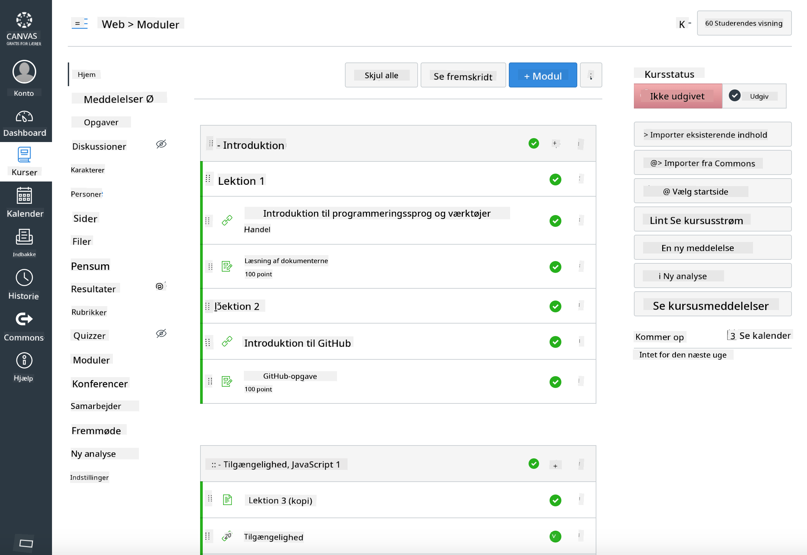

<!--
CO_OP_TRANSLATOR_METADATA:
{
  "original_hash": "75cb51f7ca9ea0b097ef4a1287e9290c",
  "translation_date": "2025-08-26T21:24:52+00:00",
  "source_file": "for-teachers.md",
  "language_code": "da"
}
-->
## For undervisere

Vil du bruge dette pensum i dit klasseværelse? Du er meget velkommen til det!

Faktisk kan du bruge det direkte på GitHub ved at bruge GitHub Classroom.

For at gøre det, skal du forgrene dette repo. Du skal oprette et repo for hver lektion, så du bliver nødt til at udtrække hver mappe til et separat repo. På den måde kan [GitHub Classroom](https://classroom.github.com/classrooms) håndtere hver lektion individuelt.

Disse [fulde instruktioner](https://github.blog/2020-03-18-set-up-your-digital-classroom-with-github-classroom/) giver dig en idé om, hvordan du opsætter dit klasseværelse.

## Brug i Moodle, Canvas eller Blackboard

Dette pensum fungerer godt i disse Learning Management Systems! Brug [Moodle-uploadfilen](../../../../../../../teaching-files/webdev-moodle.mbz) for det fulde indhold, eller prøv [Common Cartridge-filen](../../../../../../../teaching-files/webdev-common-cartridge.imscc), som indeholder noget af indholdet. Moodle Cloud understøtter ikke fulde Common Cartridge-eksporter, så det er bedre at bruge Moodle-downloadfilen, som kan uploades til Canvas. Fortæl os gerne, hvordan vi kan forbedre denne oplevelse.

> Pensum i et Moodle-klasseværelse

> Pensum i Canvas

## Brug af repoet som det er

Hvis du ønsker at bruge dette repo, som det er, uden at bruge GitHub Classroom, kan det også lade sig gøre. Du skal blot kommunikere med dine elever om, hvilken lektion de skal arbejde med.

I et onlineformat (Zoom, Teams eller andre) kan du oprette breakout-rum til quizzerne og vejlede eleverne, så de er klar til at lære. Derefter kan du invitere eleverne til quizzerne og få dem til at indsende deres svar som 'issues' på et bestemt tidspunkt. Du kan gøre det samme med opgaver, hvis du ønsker, at eleverne skal arbejde sammen i det åbne.

Hvis du foretrækker et mere privat format, kan du bede dine elever om at forgrene pensum, lektion for lektion, til deres egne private GitHub-repos og give dig adgang. Derefter kan de gennemføre quizzer og opgaver privat og indsende dem til dig via issues på dit klasseværelsesrepo.

Der er mange måder at få dette til at fungere i et online klasseværelsesformat. Fortæl os gerne, hvad der fungerer bedst for dig!

## Giv os din feedback!

Vi ønsker at gøre dette pensum brugbart for dig og dine elever. Kontakt os på [Teacher corner](https://github.com/microsoft/Web-Dev-For-Beginners/discussions/categories/teacher-corner) og opret en [**ny issue**](https://github.com/microsoft/Web-Dev-For-Beginners/issues/new/choose) for eventuelle ønsker, fejl og feedback.

---

**Ansvarsfraskrivelse**:  
Dette dokument er blevet oversat ved hjælp af AI-oversættelsestjenesten [Co-op Translator](https://github.com/Azure/co-op-translator). Selvom vi bestræber os på nøjagtighed, skal du være opmærksom på, at automatiserede oversættelser kan indeholde fejl eller unøjagtigheder. Det originale dokument på dets oprindelige sprog bør betragtes som den autoritative kilde. For kritisk information anbefales professionel menneskelig oversættelse. Vi er ikke ansvarlige for eventuelle misforståelser eller fejltolkninger, der opstår som følge af brugen af denne oversættelse.