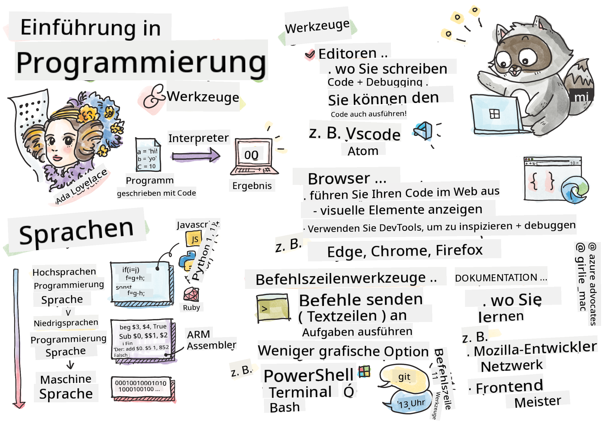

<!--
CO_OP_TRANSLATOR_METADATA:
{
  "original_hash": "2dcbb9259dee4f20a4f08d9a1aa2bd4c",
  "translation_date": "2025-08-29T14:18:15+00:00",
  "source_file": "1-getting-started-lessons/1-intro-to-programming-languages/README.md",
  "language_code": "de"
}
-->
# Einführung in Programmiersprachen und Werkzeuge des Handwerks

Diese Lektion behandelt die Grundlagen von Programmiersprachen. Die hier behandelten Themen gelten für die meisten modernen Programmiersprachen. Im Abschnitt "Werkzeuge des Handwerks" lernst du nützliche Software kennen, die dir als Entwickler hilft.


> Sketchnote von [Tomomi Imura](https://twitter.com/girlie_mac)

## Quiz vor der Vorlesung
[Quiz vor der Vorlesung](https://forms.office.com/r/dru4TE0U9n?origin=lprLink)

## Einführung

In dieser Lektion behandeln wir:

- Was ist Programmierung?
- Arten von Programmiersprachen
- Grundelemente eines Programms
- Nützliche Software und Tools für professionelle Entwickler

> Du kannst diese Lektion auf [Microsoft Learn](https://docs.microsoft.com/learn/modules/web-development-101/introduction-programming/?WT.mc_id=academic-77807-sagibbon) absolvieren!

## Was ist Programmierung?

Programmierung (auch bekannt als Codierung) ist der Prozess des Schreibens von Anweisungen für ein Gerät wie einen Computer oder ein mobiles Gerät. Wir schreiben diese Anweisungen mit einer Programmiersprache, die dann vom Gerät interpretiert wird. Diese Anweisungen können verschiedene Namen haben, aber *Programm*, *Computerprogramm*, *Anwendung (App)* und *ausführbare Datei* sind einige gängige Begriffe.

Ein *Programm* kann alles sein, was mit Code geschrieben wurde; Websites, Spiele und Handy-Apps sind Programme. Obwohl es möglich ist, ein Programm ohne Code zu erstellen, wird die zugrunde liegende Logik vom Gerät interpretiert, und diese Logik wurde höchstwahrscheinlich mit Code geschrieben. Ein Programm, das *läuft* oder *ausgeführt* wird, führt Anweisungen aus. Das Gerät, mit dem du diese Lektion liest, führt ein Programm aus, um sie auf deinem Bildschirm anzuzeigen.

✅ Recherchiere ein wenig: Wer gilt als der erste Computerprogrammierer der Welt?

## Programmiersprachen

Programmiersprachen ermöglichen es Entwicklern, Anweisungen für ein Gerät zu schreiben. Geräte können nur Binärdaten (1en und 0en) verstehen, und für *die meisten* Entwickler ist das keine sehr effiziente Art der Kommunikation. Programmiersprachen sind das Mittel der Kommunikation zwischen Menschen und Computern.

Programmiersprachen gibt es in verschiedenen Formaten und sie können unterschiedliche Zwecke erfüllen. Zum Beispiel wird JavaScript hauptsächlich für Webanwendungen verwendet, während Bash hauptsächlich für Betriebssysteme genutzt wird.

*Low-Level-Sprachen* erfordern in der Regel weniger Schritte als *High-Level-Sprachen*, damit ein Gerät Anweisungen interpretieren kann. Was High-Level-Sprachen jedoch beliebt macht, ist ihre Lesbarkeit und Unterstützung. JavaScript wird als High-Level-Sprache angesehen.

Der folgende Code zeigt den Unterschied zwischen einer High-Level-Sprache wie JavaScript und einer Low-Level-Sprache wie ARM-Assembler-Code.

```javascript
let number = 10
let n1 = 0, n2 = 1, nextTerm;

for (let i = 1; i <= number; i++) {
    console.log(n1);
    nextTerm = n1 + n2;
    n1 = n2;
    n2 = nextTerm;
}
```

```c
 area ascen,code,readonly
 entry
 code32
 adr r0,thumb+1
 bx r0
 code16
thumb
 mov r0,#00
 sub r0,r0,#01
 mov r1,#01
 mov r4,#10
 ldr r2,=0x40000000
back add r0,r1
 str r0,[r2]
 add r2,#04
 mov r3,r0
 mov r0,r1
 mov r1,r3
 sub r4,#01
 cmp r4,#00
 bne back
 end
```

Glaub es oder nicht, *sie tun beide dasselbe*: Sie geben eine Fibonacci-Sequenz bis 10 aus.

✅ Eine Fibonacci-Sequenz wird [definiert](https://en.wikipedia.org/wiki/Fibonacci_number) als eine Reihe von Zahlen, bei der jede Zahl die Summe der beiden vorhergehenden ist, beginnend mit 0 und 1. Die ersten 10 Zahlen der Fibonacci-Sequenz sind 0, 1, 1, 2, 3, 5, 8, 13, 21 und 34.

## Elemente eines Programms

Eine einzelne Anweisung in einem Programm wird als *Statement* bezeichnet und hat normalerweise ein Zeichen oder einen Zeilenabstand, der markiert, wo die Anweisung endet oder *terminiert*. Wie ein Programm terminiert, variiert je nach Sprache.

Anweisungen in einem Programm können von Daten abhängen, die von einem Benutzer oder anderswo bereitgestellt werden, um Anweisungen auszuführen. Daten können beeinflussen, wie ein Programm sich verhält, daher bieten Programmiersprachen eine Möglichkeit, Daten vorübergehend zu speichern, damit sie später verwendet werden können. Diese werden als *Variablen* bezeichnet. Variablen sind Anweisungen, die ein Gerät anweisen, Daten in seinem Speicher zu speichern. Variablen in Programmen sind ähnlich wie Variablen in der Algebra, bei denen sie einen eindeutigen Namen haben und ihr Wert sich im Laufe der Zeit ändern kann.

Es besteht die Möglichkeit, dass einige Anweisungen von einem Gerät nicht ausgeführt werden. Dies geschieht normalerweise absichtlich, wenn es vom Entwickler geschrieben wurde, oder versehentlich, wenn ein unerwarteter Fehler auftritt. Diese Art der Kontrolle über eine Anwendung macht sie robuster und wartungsfreundlicher. Typischerweise treten diese Änderungen in der Kontrolle auf, wenn bestimmte Bedingungen erfüllt sind. Eine gängige Anweisung, die in der modernen Programmierung verwendet wird, um zu steuern, wie ein Programm läuft, ist die `if..else`-Anweisung.

✅ Du wirst mehr über diese Art von Anweisung in den folgenden Lektionen lernen.

## Werkzeuge des Handwerks

[](https://youtube.com/watch?v=69WJeXGBdxg "Werkzeuge des Handwerks")

> 🎥 Klicke auf das Bild oben für ein Video über Tools

In diesem Abschnitt lernst du einige Software kennen, die du als nützlich empfinden könntest, wenn du deine professionelle Entwicklerreise beginnst.

Eine **Entwicklungsumgebung** ist eine einzigartige Sammlung von Tools und Funktionen, die ein Entwickler häufig beim Schreiben von Software verwendet. Einige dieser Tools wurden für die spezifischen Bedürfnisse eines Entwicklers angepasst und können sich im Laufe der Zeit ändern, wenn sich die Prioritäten des Entwicklers in der Arbeit, bei persönlichen Projekten oder bei der Verwendung einer anderen Programmiersprache ändern. Entwicklungsumgebungen sind so einzigartig wie die Entwickler, die sie nutzen.

### Editoren

Eines der wichtigsten Werkzeuge für die Softwareentwicklung ist der Editor. Editoren sind der Ort, an dem du deinen Code schreibst und manchmal auch ausführst.

Entwickler verlassen sich aus mehreren Gründen auf Editoren:

- *Debugging* hilft, Fehler und Probleme aufzudecken, indem der Code Zeile für Zeile durchgegangen wird. Einige Editoren haben Debugging-Funktionen; sie können angepasst und für bestimmte Programmiersprachen hinzugefügt werden.
- *Syntax-Hervorhebung* fügt Farben und Textformatierungen zum Code hinzu, wodurch er leichter lesbar wird. Die meisten Editoren erlauben eine angepasste Syntax-Hervorhebung.
- *Erweiterungen und Integrationen* sind spezialisierte Tools für Entwickler, von Entwicklern. Diese Tools sind nicht in den Basiseditor integriert. Zum Beispiel dokumentieren viele Entwickler ihren Code, um zu erklären, wie er funktioniert. Sie könnten eine Rechtschreibprüfungserweiterung installieren, um Tippfehler in der Dokumentation zu finden. Die meisten Erweiterungen sind für die Verwendung in einem bestimmten Editor gedacht, und die meisten Editoren bieten eine Möglichkeit, nach verfügbaren Erweiterungen zu suchen.
- *Anpassung* ermöglicht es Entwicklern, eine einzigartige Entwicklungsumgebung zu schaffen, die ihren Bedürfnissen entspricht. Die meisten Editoren sind extrem anpassbar und erlauben es Entwicklern möglicherweise auch, benutzerdefinierte Erweiterungen zu erstellen.

#### Beliebte Editoren und Webentwicklungs-Erweiterungen

- [Visual Studio Code](https://code.visualstudio.com/?WT.mc_id=academic-77807-sagibbon)
  - [Code Spell Checker](https://marketplace.visualstudio.com/items?itemName=streetsidesoftware.code-spell-checker)
  - [Live Share](https://marketplace.visualstudio.com/items?itemName=MS-vsliveshare.vsliveshare)
  - [Prettier - Code formatter](https://marketplace.visualstudio.com/items?itemName=esbenp.prettier-vscode)
- [Atom](https://atom.io/)
  - [spell-check](https://atom.io/packages/spell-check)
  - [teletype](https://atom.io/packages/teletype)
  - [atom-beautify](https://atom.io/packages/atom-beautify)
  
- [Sublimetext](https://www.sublimetext.com/)
  - [emmet](https://emmet.io/)
  - [SublimeLinter](http://www.sublimelinter.com/en/stable/)

### Browser

Ein weiteres wichtiges Werkzeug ist der Browser. Webentwickler verlassen sich auf den Browser, um zu sehen, wie ihr Code im Web ausgeführt wird. Er wird auch verwendet, um die visuellen Elemente einer Webseite anzuzeigen, die im Editor geschrieben wurden, wie HTML.

Viele Browser verfügen über *Entwicklertools* (DevTools), die eine Reihe hilfreicher Funktionen und Informationen enthalten, um Entwicklern zu helfen, wichtige Informationen über ihre Anwendung zu sammeln und zu erfassen. Zum Beispiel: Wenn eine Webseite Fehler hat, ist es manchmal hilfreich zu wissen, wann sie aufgetreten sind. DevTools in einem Browser können so konfiguriert werden, dass diese Informationen erfasst werden.

#### Beliebte Browser und DevTools

- [Edge](https://docs.microsoft.com/microsoft-edge/devtools-guide-chromium/?WT.mc_id=academic-77807-sagibbon)
- [Chrome](https://developers.google.com/web/tools/chrome-devtools/)
- [Firefox](https://developer.mozilla.org/docs/Tools)

### Kommandozeilen-Tools

Einige Entwickler bevorzugen eine weniger grafische Ansicht für ihre täglichen Aufgaben und verlassen sich auf die Kommandozeile, um dies zu erreichen. Das Schreiben von Code erfordert eine erhebliche Menge an Tippen, und einige Entwickler bevorzugen es, ihren Arbeitsfluss auf der Tastatur nicht zu unterbrechen. Sie verwenden Tastenkombinationen, um zwischen Desktop-Fenstern zu wechseln, an verschiedenen Dateien zu arbeiten und Tools zu verwenden. Die meisten Aufgaben können mit einer Maus erledigt werden, aber ein Vorteil der Kommandozeile ist, dass vieles mit Kommandozeilen-Tools erledigt werden kann, ohne zwischen Maus und Tastatur wechseln zu müssen. Ein weiterer Vorteil der Kommandozeile ist, dass sie konfigurierbar ist und du eine benutzerdefinierte Konfiguration speichern, später ändern und auf andere Entwicklungsmaschinen importieren kannst. Da Entwicklungsumgebungen so einzigartig für jeden Entwickler sind, vermeiden einige die Kommandozeile, andere verlassen sich vollständig darauf, und wieder andere bevorzugen eine Mischung aus beidem.

### Beliebte Kommandozeilen-Optionen

Die Optionen für die Kommandozeile unterscheiden sich je nach Betriebssystem.

*💻 = ist vorinstalliert auf dem Betriebssystem.*

#### Windows

- [Powershell](https://docs.microsoft.com/powershell/scripting/overview?view=powershell-7/?WT.mc_id=academic-77807-sagibbon) 💻
- [Command Line](https://docs.microsoft.com/windows-server/administration/windows-commands/windows-commands/?WT.mc_id=academic-77807-sagibbon) (auch bekannt als CMD) 💻
- [Windows Terminal](https://docs.microsoft.com/windows/terminal/?WT.mc_id=academic-77807-sagibbon)
- [mintty](https://mintty.github.io/)
  
#### MacOS

- [Terminal](https://support.apple.com/guide/terminal/open-or-quit-terminal-apd5265185d-f365-44cb-8b09-71a064a42125/mac) 💻
- [iTerm](https://iterm2.com/)
- [Powershell](https://docs.microsoft.com/powershell/scripting/install/installing-powershell-core-on-macos?view=powershell-7/?WT.mc_id=academic-77807-sagibbon)

#### Linux

- [Bash](https://www.gnu.org/software/bash/manual/html_node/index.html) 💻
- [KDE Konsole](https://docs.kde.org/trunk5/en/konsole/konsole/index.html)
- [Powershell](https://docs.microsoft.com/powershell/scripting/install/installing-powershell-core-on-linux?view=powershell-7/?WT.mc_id=academic-77807-sagibbon)

#### Beliebte Kommandozeilen-Tools

- [Git](https://git-scm.com/) (💻 auf den meisten Betriebssystemen)
- [NPM](https://www.npmjs.com/)
- [Yarn](https://classic.yarnpkg.com/en/docs/cli/)

### Dokumentation

Wenn ein Entwickler etwas Neues lernen möchte, wendet er sich höchstwahrscheinlich an die Dokumentation, um zu erfahren, wie man es benutzt. Entwickler verlassen sich oft auf Dokumentationen, um sich durch die richtige Nutzung von Tools und Sprachen zu führen und auch um ein tieferes Verständnis dafür zu gewinnen, wie sie funktionieren.

#### Beliebte Dokumentationen zur Webentwicklung

- [Mozilla Developer Network (MDN)](https://developer.mozilla.org/docs/Web), von Mozilla, den Herausgebern des [Firefox](https://www.mozilla.org/firefox/) Browsers
- [Frontend Masters](https://frontendmasters.com/learn/)
- [Web.dev](https://web.dev), von Google, den Herausgebern von [Chrome](https://www.google.com/chrome/)
- [Microsofts eigene Entwicklerdokumentation](https://docs.microsoft.com/microsoft-edge/#microsoft-edge-for-developers), für [Microsoft Edge](https://www.microsoft.com/edge)
- [W3 Schools](https://www.w3schools.com/where_to_start.asp)

✅ Recherchiere: Jetzt, da du die Grundlagen der Umgebung eines Webentwicklers kennst, vergleiche und kontrastiere sie mit der Umgebung eines Webdesigners.

---

## 🚀 Herausforderung

Vergleiche einige Programmiersprachen. Was sind einige der einzigartigen Merkmale von JavaScript im Vergleich zu Java? Wie sieht es mit COBOL im Vergleich zu Go aus?

## Quiz nach der Vorlesung
[Quiz nach der Vorlesung](https://ff-quizzes.netlify.app/web/)

## Überprüfung & Selbststudium

Studier ein wenig über die verschiedenen Sprachen, die einem Programmierer zur Verfügung stehen. Versuche, eine Zeile in einer Sprache zu schreiben und sie dann in zwei anderen neu zu schreiben. Was hast du gelernt?

## Aufgabe

[Die Dokumentation lesen](assignment.md)

---

**Haftungsausschluss**:  
Dieses Dokument wurde mit dem KI-Übersetzungsdienst [Co-op Translator](https://github.com/Azure/co-op-translator) übersetzt. Obwohl wir uns um Genauigkeit bemühen, beachten Sie bitte, dass automatisierte Übersetzungen Fehler oder Ungenauigkeiten enthalten können. Das Originaldokument in seiner ursprünglichen Sprache sollte als maßgebliche Quelle betrachtet werden. Für kritische Informationen wird eine professionelle menschliche Übersetzung empfohlen. Wir übernehmen keine Haftung für Missverständnisse oder Fehlinterpretationen, die sich aus der Nutzung dieser Übersetzung ergeben.