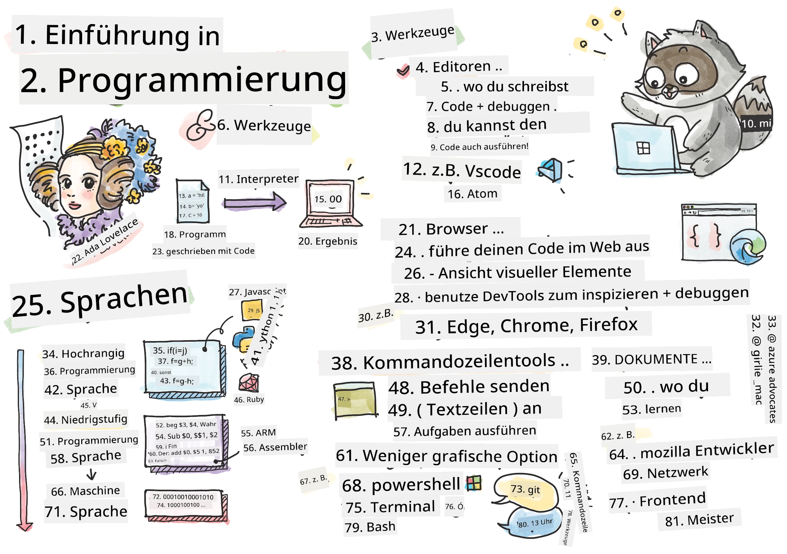
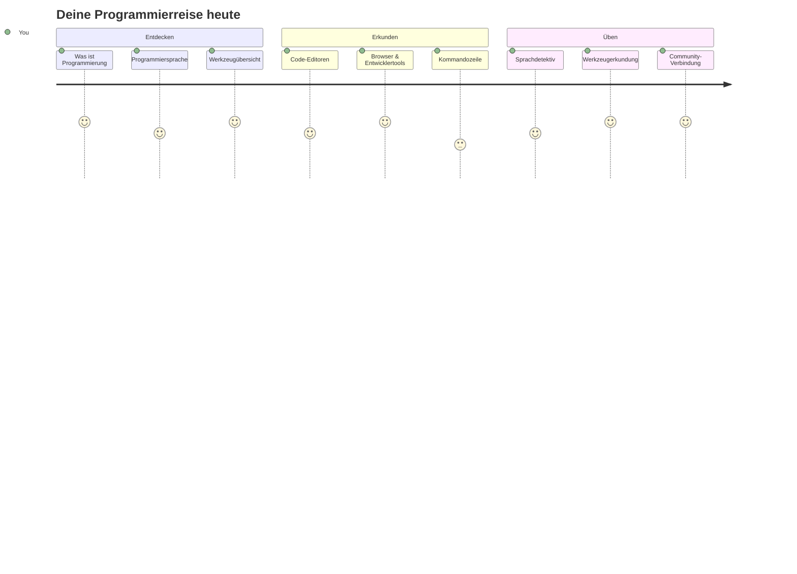
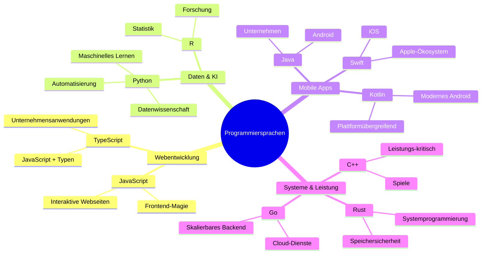
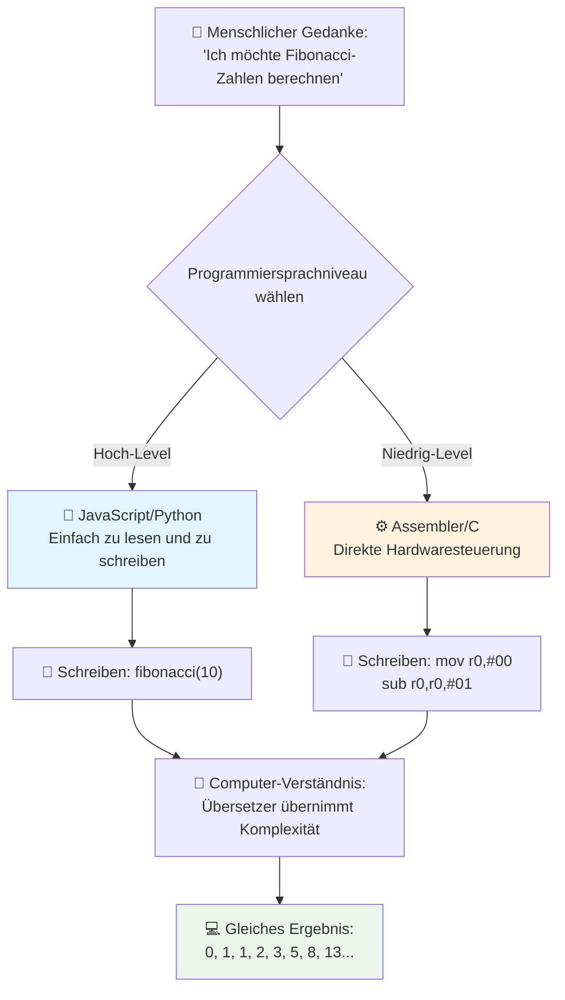
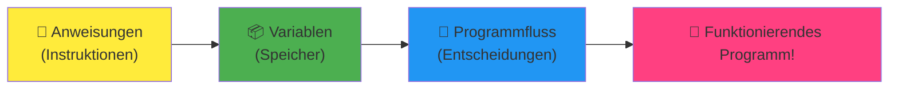
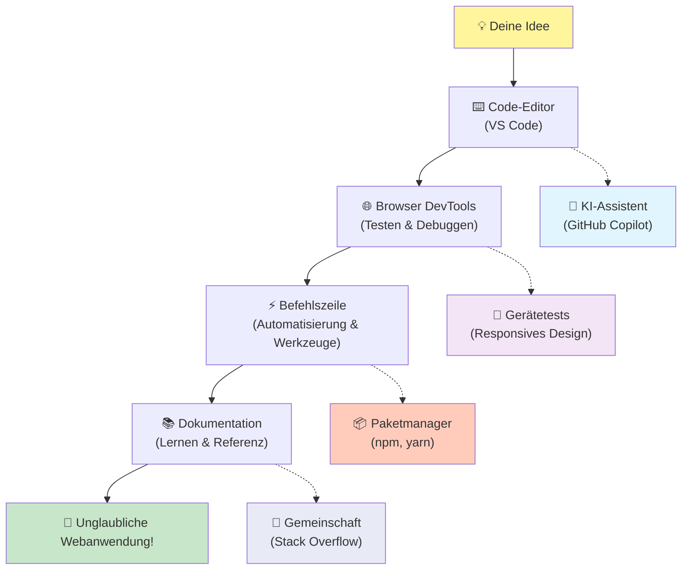
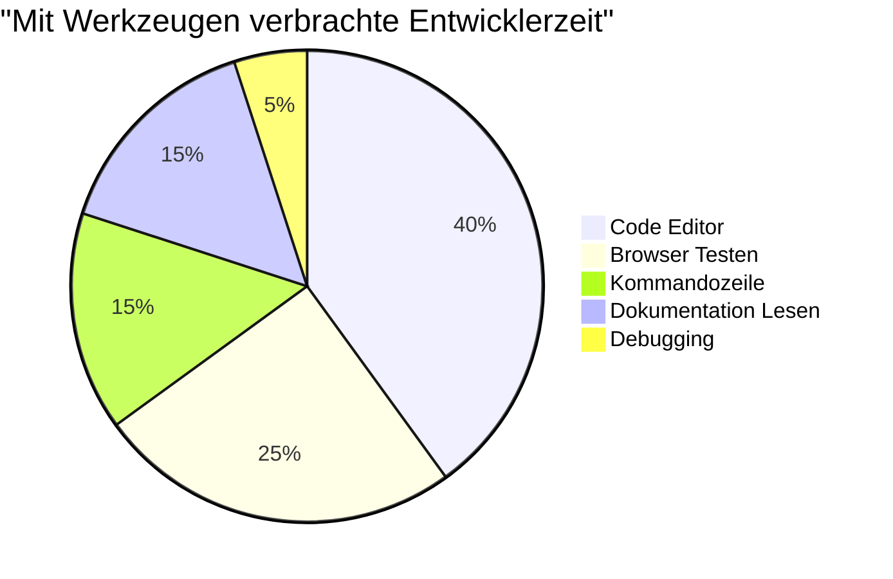
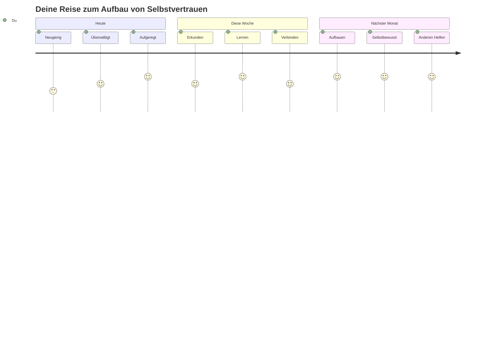

<!--
CO_OP_TRANSLATOR_METADATA:
{
  "original_hash": "d45ddcc54eb9232a76d08328b09d792e",
  "translation_date": "2026-01-06T09:24:35+00:00",
  "source_file": "1-getting-started-lessons/1-intro-to-programming-languages/README.md",
  "language_code": "de"
}
-->
# Einführung in Programmiersprachen und moderne Entwickler-Tools

Hey du, zukünftiger Entwickler! 👋 Darf ich dir etwas erzählen, das mir jeden einzelnen Tag eine Gänsehaut bereitet? Du bist kurz davor zu entdecken, dass Programmieren nicht nur etwas mit Computern zu tun hat – es geht darum, echte Superkräfte zu besitzen, um deine wildesten Ideen zum Leben zu erwecken!

Du kennst diesen Moment, wenn du deine Lieblings-App benutzt und alles einfach perfekt zusammenpasst? Wenn du auf einen Knopf tippst und etwas absolut Magisches passiert, das dich denken lässt: „Wow, wie haben die DAS gemacht?“ Nun, jemand wie du – wahrscheinlich gerade in seinem Lieblingscafé um 2 Uhr morgens mit dem dritten Espresso – hat den Code geschrieben, der diese Magie erschaffen hat. Und hier kommt das, was dir den Kopf sprengen wird: Am Ende dieser Lektion wirst du nicht nur verstehen, wie sie es gemacht haben, sondern du wirst es kaum erwarten können, es selbst auszuprobieren!

Schau mal, ich kann total nachvollziehen, wenn Programmieren gerade einschüchternd wirkt. Als ich angefangen habe, dachte ich ehrlich, man müsse ein Mathegenie sein oder seit fünf Jahren programmieren. Aber weißt du, was meine Sichtweise komplett verändert hat? Programmieren ist genau so, wie eine neue Sprache zu lernen. Man fängt mit „Hallo“ und „Danke“ an, dann bestellt man Kaffee, und ehe man sich versieht, führt man tiefgründige philosophische Gespräche! Nur in diesem Fall sprechen wir mit Computern, und weißt du was? Sie sind die geduldigsten Gesprächspartner, die du je haben wirst – sie richten sich nie nach deinen Fehlern und freuen sich immer darauf, es nochmal zu versuchen!

Heute werden wir die unglaublichen Werkzeuge erkunden, die moderne Webentwicklung nicht nur möglich, sondern richtig süchtig machend machen. Ich spreche von genau denselben Editoren, Browsern und Workflows, die Entwickler bei Netflix, Spotify und deinem Lieblings-Indie-App-Studio jeden einzelnen Tag verwenden. Und hier kommt der Teil, der dich einen Freudentanz machen lässt: Die meisten dieser professionellen, industrieweiten Werkzeuge sind komplett kostenlos!


> Sketchnote von [Tomomi Imura](https://twitter.com/girlie_mac)


## Lass uns sehen, was du schon weißt!

Bevor wir in den Spaß eintauchen, bin ich neugierig – was weißt du schon über diese Programmierwelt? Und hör zu, wenn du diese Fragen siehst und denkst: „Ich habe buchstäblich keinen Schimmer von irgendwas“, dann ist das nicht nur okay, das ist perfekt! Das bedeutet, du bist genau am richtigen Ort. Denk an dieses Quiz wie an das Aufwärmen vor einem Workout – wir bereiten nur die Gehirnmuskeln vor!

[Mach das Pre-Lesson-Quiz](https://forms.office.com/r/dru4TE0U9n?origin=lprLink)


## Das Abenteuer, auf das wir uns gemeinsam begeben

Okay, ich bin wirklich voller Vorfreude, was wir heute erkunden werden! Im Ernst, ich wünschte, ich könnte dein Gesicht sehen, wenn einige dieser Konzepte Klick machen. Hier ist die unglaubliche Reise, auf die wir uns begeben:

- **Was Programmieren eigentlich ist (und warum es das coolste überhaupt ist!)** – Wir werden entdecken, wie Code buchstäblich die unsichtbare Magie ist, die alles um dich herum antreibt, vom Wecker, der irgendwie weiß, dass Montagmorgen ist, bis hin zum Algorithmus, der deine Netflix-Empfehlungen perfekt kuratiert
- **Programmiersprachen und ihre erstaunlichen Persönlichkeiten** – Stell dir vor, du gehst auf eine Party, bei der jede Person ganz andere Superkräfte und Problemlösungsmethoden hat. So ist die Welt der Programmiersprachen, und du wirst es lieben, sie kennenzulernen!
- **Die grundlegenden Bausteine, die digitale Magie möglich machen** – Stell sie dir als das ultimative kreative LEGO-Set vor. Sobald du verstehst, wie diese Teile zusammenpassen, wirst du erkennen, dass du buchstäblich alles bauen kannst, was deine Fantasie träumt
- **Professionelle Werkzeuge, die dir das Gefühl geben, gerade einen Zauberstab in die Hand gelegt bekommen zu haben** – Ich übertreibe nicht – diese Tools lassen dich wirklich fühlen, als hättest du Superkräfte, und das Beste? Es sind genau dieselben, die die Profis verwenden!

> 💡 **Hier ist das Wichtigste:** Versuch heute nicht einmal, alles auswendig zu lernen! Im Moment sollst du nur das Feuer der Begeisterung spüren, was alles möglich ist. Die Details bleiben ganz natürlich hängen, während wir zusammen üben – so funktioniert echtes Lernen!

> Du kannst diese Lektion auch auf [Microsoft Learn](https://docs.microsoft.com/learn/modules/web-development-101/introduction-programming/?WT.mc_id=academic-77807-sagibbon) machen!

## Was genau *ist* eigentlich Programmieren?

Okay, packen wir die Millionen-Dollar-Frage an: Was ist Programmieren wirklich?

Ich erzähle dir eine Geschichte, die meine Sicht darauf komplett verändert hat. Letzte Woche habe ich versucht, meiner Mutter zu erklären, wie man unsere neue Smart-TV-Fernbedienung benutzt. Ich ertappte mich dabei zu sagen: „Drück den roten Knopf, aber nicht den großen roten Knopf, den kleinen roten Knopf links... nein, deine andere linke Seite... okay, jetzt halt ihn zwei Sekunden gedrückt, nicht eine, nicht drei...“ Kommt dir das bekannt vor? 😅

Das ist Programmieren! Es ist die Kunst, unglaublich detaillierte, Schritt-für-Schritt-Anweisungen zu geben für etwas, das sehr mächtig ist, aber alles perfekt erklärt bekommen muss. Nur dass du hier nicht deiner Mutter erklärst (die fragen könnte: „Welcher rote Knopf?!“), sondern einem Computer (der genau das macht, was du sagst – auch wenn das, was du gesagt hast, nicht ganz das ist, was du meintest).

Was mich umgehauen hat, als ich das zum ersten Mal gelernt habe: Computer sind im Grunde genommen ziemlich simpel. Sie verstehen buchstäblich nur zwei Dinge – 1 und 0, was im Grunde „ja“ und „nein“ oder „an“ und „aus“ bedeutet. Das war’s! Aber hier wird es magisch – wir müssen nicht in 1en und 0en sprechen, als wären wir in der Matrix. Hier kommen **Programmiersprachen** ins Spiel. Sie sind wie der beste Übersetzer der Welt, der deine vollkommen normalen menschlichen Gedanken in Computersprache übersetzt.

Und hier ist das, was mir jeden Morgen echte Gänsehaut bereitet: Buchstäblich *alles* Digitale in deinem Leben begann mit jemandem genau wie dir, wahrscheinlich im Schlafanzug mit einer Tasse Kaffee, der Code auf seinem Laptop tippte. Dieser Instagram-Filter, der dich makellos aussehen lässt? Jemand hat den Code dafür geschrieben. Die Empfehlung, die dich zu deinem neuen Lieblingssong geführt hat? Ein Entwickler hat diesen Algorithmus gebaut. Die App, die dir hilft, die Rechnung fürs Abendessen mit Freunden zu teilen? Jep, jemand dachte: „Das ist nervig, das kann ich bestimmt reparieren“ – und dann hat er es getan!

Wenn du programmieren lernst, lernst du nicht nur eine neue Fähigkeit – du wirst Teil dieser unglaublichen Community von Problemlösern, die ihre Tage damit verbringen zu denken: „Was, wenn ich etwas bauen könnte, das jemanden den Tag nur ein bisschen besser macht?“ Mal ehrlich, gibt es was Cooleres?

✅ **Spaß-Fakt-Suche**: Hier ist etwas super Cooles zum Nachschlagen, wenn du mal Zeit hast – wer war deiner Meinung nach die weltweit erste Computerprogrammiererin? Ich gebe dir einen Tipp: Es ist vielleicht nicht die Person, die du erwartest! Die Geschichte dahinter ist absolut faszinierend und zeigt, dass Programmieren schon immer um kreatives Problemlösen und Querdenken ging.

### 🧠 **Kurzer Check: Wie fühlst du dich?**

**Nimm dir einen Moment zum Nachdenken:**
- Macht dir der Gedanke „Anweisungen an Computer geben“ jetzt Sinn?
- Fallen dir tägliche Aufgaben ein, die du gerne mit Programmierung automatisieren würdest?
- Welche Fragen gehen dir gerade zum Thema Programmieren durch den Kopf?

> **Denk daran:** Es ist total normal, wenn dir einige Konzepte gerade noch etwas verwirrend vorkommen. Programmieren zu lernen ist wie eine neue Sprache lernen – das Gehirn braucht Zeit, um neue Verbindungen zu knüpfen. Du machst das super!

## Programmiersprachen sind wie verschiedene Zaubergeschmäcker

Okay, das klingt jetzt vielleicht komisch, aber bleib dran – Programmiersprachen sind wie verschiedene Musikrichtungen. Überleg mal: Es gibt Jazz, der weich und improvisierend ist, Rock, der kraftvoll und direkt ist, Klassik, die elegant und strukturiert ist, und Hip-Hop, der kreativ und ausdrucksstark ist. Jede Stilrichtung hat ihre eigene Atmosphäre, ihre eigene Community von leidenschaftlichen Fans, und jede ist perfekt für verschiedene Stimmungen und Anlässe.

Programmiersprachen funktionieren genau so! Du würdest nicht dieselbe Sprache verwenden, um ein lustiges Mobile-Spiel zu bauen, wie du sie nutzen würdest, um riesige Datenmengen zum Klima zu verarbeiten – genauso wenig würdest du Death Metal im Yoga-Kurs hören (naja, die meisten Yoga-Kurse jedenfalls! 😄).

Aber hier kommt das, was mich jedes Mal umhaut, wenn ich drüber nachdenke: Diese Sprachen sind wie der geduldigste, brillanteste Dolmetscher der Welt, der direkt neben dir sitzt. Du kannst deine Ideen auf eine Weise ausdrücken, die deinem menschlichen Gehirn natürlich vorkommt, und sie erledigen all die unglaublich komplexe Arbeit, das in die 1en und 0en zu übersetzen, die Computer tatsächlich sprechen. Es ist wie ein Freund, der perfekt zweisprachig ist in „menschlicher Kreativität“ und „Computerlogik“ – und nie müde wird, nie Kaffeepausen braucht und dich auch nicht beurteilt, wenn du dieselbe Frage zweimal stellst!

### Beliebte Programmiersprachen und ihre Anwendungsgebiete


| Sprache  | Am besten geeignet für                  | Warum sie beliebt ist                        |
|----------|--------------------------------------|---------------------------------------------|
| **JavaScript** | Webentwicklung, Benutzeroberflächen | Läuft in Browsern und ermöglicht interaktive Websites |
| **Python** | Datenwissenschaft, Automatisierung, KI | Leicht zu lesen und zu lernen, mächtige Bibliotheken |
| **Java** | Unternehmensanwendungen, Android-Apps | Plattformunabhängig, robust für große Systeme |
| **C#** | Windows-Anwendungen, Spieleentwicklung | Starke Unterstützung im Microsoft-Ökosystem |
| **Go** | Cloud-Services, Backend-Systeme      | Schnell, einfach, für moderne IT konzipiert |

### Hochsprachen vs. Maschinensprachen

Okay, das war ehrlich gesagt das Konzept, das mein Gehirn ursprünglich zerschmettert hat, als ich angefangen habe. Deshalb teile ich die Analogie, die das endlich für mich erklärt hat – und ich hoffe sehr, dass sie auch dir hilft!

Stell dir vor, du bist in einem Land, dessen Sprache du nicht sprichst und brauchst dringend eine Toilette (wir waren doch alle schon mal dort, oder? 😅):

- **Low-Level-Programmierung** ist wie das Erlernen des lokalen Dialekts so gut, dass du mit der Großmutter, die an der Ecke Obst verkauft, plaudern kannst – mit kulturellen Anspielungen, Slang und Insider-Witzen, die nur jemand versteht, der dort aufgewachsen ist. Super beeindruckend und unglaublich effizient... wenn du fließend bist! Aber ziemlich überwältigend, wenn du einfach nur eine Toilette finden willst.

- **High-Level-Programmierung** ist wie dieser fantastische lokale Freund, der dich einfach versteht. Du kannst auf Englisch sagen „Ich muss dringend zur Toilette“ und er macht die ganze kulturelle Übersetzung und gibt dir eine Wegbeschreibung, die für dein nicht-lokales Gehirn völlig Sinn macht.

In Programmierbegriffen heißt das:
- **Low-Level-Sprachen** (wie Assembly oder C) erlauben dir unglaublich detaillierte Gespräche mit der tatsächlichen Hardware des Computers, aber du musst wie eine Maschine denken, was... naja, sagen wir mal, ein großer mentaler Sprung ist!
- **High-Level-Sprachen** (wie JavaScript, Python oder C#) erlauben dir, wie ein Mensch zu denken, während sie den ganzen Maschinencode hinter den Kulissen erledigen. Plus: Sie haben unglaublich einladende Communities voller Leute, die sich daran erinnern, wie es war, neu zu sein, und wirklich helfen wollen!

Rate mal, womit ich dir empfehle zu starten? 😉 Hochsprachen sind wie Stützräder, die du eigentlich nie abnehmen willst, weil sie das ganze Erlebnis viel angenehmer machen!


### Lass mich dir zeigen, warum Hochsprachen viel freundlicher sind

Okay, gleich zeige ich dir etwas, das perfekt demonstriert, warum ich mich in Hochsprachen verliebt habe. Aber zuerst – ich brauche dein Versprechen. Wenn du das erste Code-Beispiel siehst, gerate nicht in Panik! Es soll einschüchternd aussehen. Genau das ist der Punkt!

Wir werden dieselbe Aufgabe in zwei komplett unterschiedlichen Stilen ansehen. Beide erstellen eine sogenannte Fibonacci-Folge – ein wunderschönes mathematisches Muster, bei dem jede Zahl die Summe der beiden vorherigen ist: 0, 1, 1, 2, 3, 5, 8, 13... (Spaßfakt: Dieses Muster findest du buchstäblich überall in der Natur – Sonnenblumensamen-Spiralen, Tannenzapfenmuster, sogar wie Galaxien entstehen!)

Bereit, den Unterschied zu sehen? Los geht’s!

**Hochsprache (JavaScript) – menschenfreundlich:**

```javascript
// Schritt 1: Grundlegende Fibonacci-Einrichtung
const fibonacciCount = 10;
let current = 0;
let next = 1;

console.log('Fibonacci sequence:');
```

**Das macht dieser Code:**
- **Deklariert** eine Konstante, um festzulegen, wie viele Fibonacci-Zahlen wir generieren wollen
- **Initialisiert** zwei Variablen, um die aktuelle und nächste Zahl in der Folge zu verfolgen
- **Setzt** die Anfangswerte (0 und 1), die das Fibonacci-Muster definieren
- **Zeigt** eine Überschrift an, um die Ausgabe zu kennzeichnen

```javascript
// Schritt 2: Erzeuge die Sequenz mit einer Schleife
for (let i = 0; i < fibonacciCount; i++) {
  console.log(`Position ${i + 1}: ${current}`);
  
  // Berechne die nächste Zahl in der Sequenz
  const sum = current + next;
  current = next;
  next = sum;
}
```

**So läuft das hier ab:**
- **Schleife** über jede Position in unserer Folge mit einer `for`-Schleife
- **Zeigt** jede Zahl mit ihrer Position unter Verwendung von Template Literal Formatierung an
- **Berechnet** die nächste Fibonacci-Zahl durch Addition der aktuellen und nächsten Werte
- **Aktualisiert** unsere Tracking-Variablen für die nächste Iteration

```javascript
// Schritt 3: Moderner funktionaler Ansatz
const generateFibonacci = (count) => {
  const sequence = [0, 1];
  
  for (let i = 2; i < count; i++) {
    sequence[i] = sequence[i - 1] + sequence[i - 2];
  }
  
  return sequence;
};

// Anwendungsbeispiel
const fibSequence = generateFibonacci(10);
console.log(fibSequence);
```

**Oben haben wir:**
- **Eine wiederverwendbare Funktion** mit moderner Pfeilfunktion-Syntax erstellt
- **Ein Array gebaut**, um die gesamte Folge zu speichern statt einzelnen Ausgabezeilen
- **Array-Indizierung verwendet**, um jede neue Zahl aus vorherigen Werten zu berechnen
- **Die komplette Folge zurückgegeben**, um sie flexibel an anderen Stellen zu nutzen

**Niedrigsprache (ARM Assembly) – computerfreundlich:**

```assembly
 area ascen,code,readonly
 entry
 code32
 adr r0,thumb+1
 bx r0
 code16
thumb
 mov r0,#00
 sub r0,r0,#01
 mov r1,#01
 mov r4,#10
 ldr r2,=0x40000000
back add r0,r1
 str r0,[r2]
 add r2,#04
 mov r3,r0
 mov r0,r1
 mov r1,r3
 sub r4,#01
 cmp r4,#00
 bne back
 end
```

Beachte, wie die JavaScript-Version fast wie englische Anweisungen liest, während die Assembly-Version kryptische Befehle nutzt, die direkt den Prozessor des Computers steuern. Beide lösen exakt dieselbe Aufgabe, aber die Hochsprache ist für Menschen viel leichter zu verstehen, zu schreiben und zu pflegen.

**Wichtige Unterschiede, die dir auffallen werden:**
- **Lesbarkeit**: JavaScript verwendet beschreibende Namen wie `fibonacciCount`, während Assembly kryptische Bezeichnungen wie `r0`, `r1` nutzt
- **Kommentare**: Hochrangige Sprachen fördern erklärende Kommentare, die den Code selbstdokumentierend machen
- **Struktur**: Der logische Ablauf von JavaScript entspricht der Art, wie Menschen Schritt für Schritt über Probleme nachdenken
- **Wartung**: Das Aktualisieren der JavaScript-Version für verschiedene Anforderungen ist einfach und klar

✅ **Über die Fibonacci-Folge**: Dieses absolut wunderschöne Zahlenmuster (bei dem jede Zahl der Summe der beiden vorhergehenden entspricht: 0, 1, 1, 2, 3, 5, 8...) taucht buchstäblich *überall* in der Natur auf! Du findest es in Sonnenblumenwirbeln, Tannenzapfenmustern, der Art, wie Nautilus-Schalen sich wölben, und sogar darin, wie Baumzweige wachsen. Es ist ziemlich verblüffend, wie Mathematik und Programmierung uns helfen können, die Muster zu verstehen und nachzubilden, die die Natur nutzt, um Schönheit zu erschaffen!


## Die Bausteine, die die Magie möglich machen

Also, jetzt wo du gesehen hast, wie Programmiersprachen in Aktion aussehen, lass uns die grundlegenden Bausteine anschauen, aus denen buchstäblich jedes jemals geschriebene Programm besteht. Denk daran wie an die wichtigsten Zutaten in deinem Lieblingsrezept – sobald du verstehst, was jede einzelne tut, wirst du in fast jeder Sprache Code lesen und schreiben können!

Das ist ein bisschen wie die Grammatik des Programmierens lernen. Erinnerst du dich noch aus der Schule, als du über Substantive, Verben und Satzbau gelernt hast? Programmieren hat seine eigene Grammatikversion, und ehrlich gesagt ist sie viel logischer und nachsichtiger als die englische Grammatik je war! 😄

### Anweisungen: Die Schritt-für-Schritt-Anleitungen

Fangen wir mit **Anweisungen** an – sie sind wie einzelne Sätze in einem Gespräch mit deinem Computer. Jede Anweisung sagt dem Computer, genau eine Sache zu tun, ähnlich wie Wegbeschreibungen: „Hier links abbiegen“, „An der roten Ampel stoppen“, „Auf diesem Parkplatz parken“.

Was ich an Anweisungen liebe, ist wie lesbar sie meistens sind. Schau dir das an:

```javascript
// Grundlegende Anweisungen, die einzelne Aktionen ausführen
const userName = "Alex";                    
console.log("Hello, world!");              
const sum = 5 + 3;                         
```

**Das macht dieser Code:**
- **Deklariert** eine konstante Variable, um den Namen eines Benutzers zu speichern
- **Zeigt** eine Begrüßungsnachricht in der Konsolenausgabe an
- **Berechnet** und speichert das Ergebnis einer mathematischen Operation

```javascript
// Anweisungen, die mit Webseiten interagieren
document.title = "My Awesome Website";      
document.body.style.backgroundColor = "lightblue";
```

**Schritt für Schritt passiert hier:**
- **Ändert** den Titel der Webseite, der im Browser-Tab erscheint
- **Verändert** die Hintergrundfarbe des gesamten Seitenkörpers

### Variablen: Das Speichersystem deines Programms

Okay, **Variablen** sind ehrlich gesagt eines meiner absoluten Lieblingskonzepte zum Lehren, weil sie so sehr wie Dinge sind, die du jeden Tag benutzt!

Denk mal an dein Telefonbuch. Du merkst dir nicht die Telefonnummern aller Leute – stattdessen speicherst du „Mama“, „Beste Freundin“ oder „Pizza-Lieferdienst, der bis 2 Uhr nachts liefert“ und lässt dein Telefon die tatsächlichen Nummern merken. Variablen funktionieren genauso! Sie sind wie beschriftete Behälter, in denen dein Programm Informationen speichern und später mit einem aussagekräftigen Namen abrufen kann.

Das Coole ist: Variablen können sich ändern, während dein Programm läuft (daher der Name „Variable“ – siehst du, was die da gemacht haben?). So wie du den Kontakt für den Pizza-Lieferdienst updatest, wenn du einen noch besseren findest, können Variablen aktualisiert werden, wenn dein Programm neue Informationen lernt oder sich die Situation ändert!

Ich zeige dir, wie wunderschön einfach das sein kann:

```javascript
// Schritt 1: Erstellen von Basisvariablen
const siteName = "Weather Dashboard";        
let currentWeather = "sunny";               
let temperature = 75;                       
let isRaining = false;                      
```

**Was diese Konzepte bedeuten:**
- **Speichere** unveränderliche Werte in `const` Variablen (wie Name der Webseite)
- **Benutze** `let` für Werte, die sich im Programmverlauf ändern können
- **Weise zu** unterschiedliche Datentypen zu: Strings (Text), Zahlen und Booleans (wahr/falsch)
- **Wähle** beschreibende Namen, die erklären, was jede Variable enthält

```javascript
// Schritt 2: Arbeiten mit Objekten, um verwandte Daten zu gruppieren
const weatherData = {                       
  location: "San Francisco",
  humidity: 65,
  windSpeed: 12
};
```

**Oben haben wir:**
- **Ein Objekt erstellt**, um zusammengehörige Wetterinformationen zu gruppieren
- **Mehrere Datenstücke unter einem Variablennamen organisiert**
- **Schlüssel-Wert-Paare verwendet**, um jede Information klar zu beschriften

```javascript
// Schritt 3: Verwendung und Aktualisierung von Variablen
console.log(`${siteName}: Today is ${currentWeather} and ${temperature}°F`);
console.log(`Wind speed: ${weatherData.windSpeed} mph`);

// Aktualisierung veränderbarer Variablen
currentWeather = "cloudy";                  
temperature = 68;                          
```

**Hier verstehen wir jeden Teil:**
- **Zeige** Informationen mit Template-Literalen und `${}`-Syntax an
- **Greife auf Objekt-Eigenschaften zu** mit Punktnotation (`weatherData.windSpeed`)
- **Aktualisiere** mit `let` deklarierte Variablen, um sich ändernde Bedingungen darzustellen
- **Kombiniere** mehrere Variablen, um sinnvolle Nachrichten zu erzeugen

```javascript
// Schritt 4: Modernes Destructuring für saubereren Code
const { location, humidity } = weatherData; 
console.log(`${location} humidity: ${humidity}%`);
```

**Was du wissen musst:**
- **Extrahiere** spezifische Eigenschaften aus Objekten mit Destrukturierungszuweisung
- **Erstelle** automatisch neue Variablen mit den gleichen Namen wie die Objektschlüssel
- **Vereinfache** den Code, indem du sich wiederholende Punktnotation vermeidest

### Steuerung des Programmflusses: Deinem Programm beibringen, zu denken

Okay, hier wird Programmieren wirklich verblüffend! **Kontrollfluss** bedeutet im Grunde, deinem Programm beizubringen, wie es kluge Entscheidungen trifft, genau wie du das jeden Tag ganz selbstverständlich tust.

Stell dir vor: Heute Morgen hast du bestimmt gedacht: „Wenn es regnet, nehme ich einen Regenschirm. Wenn es kalt ist, ziehe ich eine Jacke an. Wenn ich spät dran bin, überspringe ich das Frühstück und hole mir unterwegs Kaffee.“ Dein Gehirn folgt dieser Wenn-Dann-Logik dutzende Male jeden Tag ganz automatisch!

Das ist es, was Programme intelligent und lebendig wirken lässt, statt nur einem langweiligen, vorhersehbaren Drehbuch zu folgen. Sie können eine Situation betrachten, auswerten, was passiert, und angemessen reagieren. Es ist, als hätten sie ein Gehirn, das sich anpasst und Entscheidungen treffen kann!

Willst du sehen, wie schön das funktioniert? Ich zeige es dir:

```javascript
// Schritt 1: Grundlegende bedingte Logik
const userAge = 17;

if (userAge >= 18) {
  console.log("You can vote!");
} else {
  const yearsToWait = 18 - userAge;
  console.log(`You'll be able to vote in ${yearsToWait} year(s).`);
}
```

**Das macht dieser Code:**
- **Überprüft**, ob das Alter des Benutzers für die Wahlberechtigung ausreicht
- **Führt** verschiedene Codeblöcke basierend aufs Ergebnis der Bedingung aus
- **Berechnet** und zeigt an, wie lange es noch bis zur Wahlberechtigung dauert, falls unter 18
- **Gibt** für jeden Fall spezifisches, hilfreiches Feedback

```javascript
// Schritt 2: Mehrere Bedingungen mit logischen Operatoren
const userAge = 17;
const hasPermission = true;

if (userAge >= 18 && hasPermission) {
  console.log("Access granted: You can enter the venue.");
} else if (userAge >= 16) {
  console.log("You need parent permission to enter.");
} else {
  console.log("Sorry, you must be at least 16 years old.");
}
```

**Was hier passiert, im Detail:**
- **Kombiniert** mehrere Bedingungen mit dem `&&` (und) Operator
- **Erstellt** eine Hierarchie von Bedingungen mit `else if` für mehrere Szenarien
- **Behandelt** alle möglichen Fälle mit einer abschließenden `else`-Anweisung
- **Gibt** klares, umsetzbares Feedback für jede Situation

```javascript
// Schritt 3: Kurzform der Bedingung mit ternärem Operator
const votingStatus = userAge >= 18 ? "Can vote" : "Cannot vote yet";
console.log(`Status: ${votingStatus}`);
```

**Merke dir:**
- **Verwende** den ternären Operator (`? :`) für einfache Zwei-Optionen-Bedingungen
- **Schreibe** zuerst die Bedingung, dann `?`, dann Ergebnis, wenn wahr, dann `:`, dann Ergebnis, wenn falsch
- **Wende** dieses Muster an, wenn du Werte auf Basis von Bedingungen zuweisen willst

```javascript
// Schritt 4: Umgang mit mehreren speziellen Fällen
const dayOfWeek = "Tuesday";

switch (dayOfWeek) {
  case "Monday":
  case "Tuesday":
  case "Wednesday":
  case "Thursday":
  case "Friday":
    console.log("It's a weekday - time to work!");
    break;
  case "Saturday":
  case "Sunday":
    console.log("It's the weekend - time to relax!");
    break;
  default:
    console.log("Invalid day of the week");
}
```

**Dieser Code macht Folgendes:**
- **Vergleicht** den Variablenwert mit mehreren spezifischen Fällen
- **Gruppiert** ähnliche Fälle zusammen (Wochentage vs. Wochenenden)
- **Führt** den passenden Codeblock aus, wenn ein Treffer vorliegt
- **Beinhaltet** einen `default`-Fall für unerwartete Werte
- **Verwendet** `break`-Anweisungen, um zu verhindern, dass der Code in den nächsten Fall weiterläuft

> 💡 **Echtes Beispiel**: Stell dir Kontrollfluss wie das geduldigste GPS der Welt vor, das dir Anweisungen gibt. Es könnte sagen: „Wenn auf der Hauptstraße Verkehr ist, nimm die Autobahn. Wenn die Autobahn gesperrt ist, versuche die landschaftlich schöne Route.“ Programme verwenden genau dieselbe Art bedingter Logik, um intelligent auf verschiedene Situationen zu reagieren und immer das beste Nutzererlebnis zu bieten.

### 🎯 **Konzept-Check: Baustein-Meisterschaft**

**Mal sehen, wie du mit den Grundlagen zurechtkommst:**
- Kannst du den Unterschied zwischen einer Variable und einer Anweisung mit eigenen Worten erklären?
- Denk an ein Beispiel aus der echten Welt, in dem du eine Wenn-Dann-Entscheidung treffen würdest (wie in unserem Wahl-Beispiel)
- Was hat dich an der Programmierlogik am meisten überrascht?

**Schneller Selbstvertrauens-Aufbau:**

✅ **Was als Nächstes kommt**: Wir werden absolut viel Spaß haben, diese Konzepte immer weiter zu vertiefen, während wir diese unglaubliche Reise zusammen fortsetzen! Konzentriere dich jetzt einfach darauf, die Vorfreude auf all die erstaunlichen Möglichkeiten zu spüren, die vor dir liegen. Die speziellen Fähigkeiten und Techniken wirst du ganz natürlich lernen, wenn wir zusammen üben – ich verspreche, das macht viel mehr Spaß, als du vielleicht denkst!

## Werkzeuge des Handwerks

Okay, hier werde ich ehrlich so aufgeregt, dass ich mich kaum beherrschen kann! 🚀 Wir werden jetzt über die unglaublichen Werkzeuge sprechen, die dir das Gefühl geben werden, als hättest du gerade die Schlüssel zu einem digitalen Raumschiff bekommen.

Kennst du das, wenn ein Koch diese perfekt ausbalancierten Messer hat, die sich wie eine Verlängerung seiner Hände anfühlen? Oder wenn ein Musiker eine Gitarre hat, die zu singen scheint, sobald er sie berührt? Entwickler haben ihre eigene Version solcher magischen Werkzeuge, und hier kommt etwas, das dich absolut umhauen wird – die meisten davon sind komplett kostenlos!

Ich hüpfe praktisch auf meinem Stuhl, weil ich es kaum erwarten kann, diese mit dir zu teilen, denn sie haben die Art revolutioniert, wie wir Software entwickeln. Wir sprechen von KI-gestützten Code-Assistenten, die dir beim Schreiben deines Codes helfen können (kein Scherz!), Cloud-Umgebungen, in denen du ganze Anwendungen von buchstäblich überall mit WLAN bauen kannst, und Debugging-Tools, die so ausgefeilt sind, dass sie wie Röntgenblick für deine Programme sind.

Und hier kommt der Teil, der mir immer noch eine Gänsehaut macht: Das sind keine „Anfänger-Werkzeuge“, die du irgendwann überholst. Das sind genau die gleichen professionellen Werkzeuge, die Entwickler bei Google, Netflix und dem Indie-App-Studio, das du liebst, gerade jetzt verwenden. Du wirst dich wie ein Profi fühlen, wenn du sie benutzt!


### Code-Editoren und IDEs: Deine neuen digitalen besten Freunde

Lass uns über Code-Editoren sprechen – die werden wirklich bald zu deinen Lieblingsplätzen zum Abhängen! Stell dir vor, es ist dein persönliches Programmier-Heiligtum, wo du die meiste Zeit verbringen wirst, um deine digitalen Kreationen zu gestalten und zu perfektionieren.

Aber das Wahre Wunder an modernen Editoren ist: Sie sind nicht nur schicke Texteditoren. Sie sind wie der brillanteste, unterstützendste Programmier-Mentor, der 24/7 direkt neben dir sitzt. Sie fangen deine Tippfehler ab, bevor du sie überhaupt bemerkst, schlagen Verbesserungen vor, die dich wie ein Genie aussehen lassen, helfen dir zu verstehen, was jeder Codeabschnitt macht, und manche können sogar vorhersagen, was du als Nächstes tippen willst, und bieten an, deine Gedanken zu vervollständigen!

Ich erinnere mich daran, wie ich das erste Mal Autovervollständigung entdeckt habe – ich hatte wirklich das Gefühl, in der Zukunft zu leben. Du beginnst etwas zu tippen und dein Editor sagt: „Hey, wolltest du diese Funktion nutzen, die genau das macht, was du brauchst?“ Es ist, als hättest du einen Gedankenleser als Programmierkumpel!

**Was macht diese Editoren so unglaublich?**

Moderne Code-Editoren bieten eine beeindruckende Reihe von Funktionen, die deine Produktivität steigern:

| Funktion | Was sie macht | Warum sie hilft |
|---------|--------------|--------------|
| **Syntaxhervorhebung** | Färbt verschiedene Teile deines Codes ein | Macht Code lesbarer und Fehler leichter erkennbar |
| **Autovervollständigung** | Schlägt Code beim Tippen vor | Beschleunigt das Programmieren und reduziert Tippfehler |
| **Debugging-Tools** | Helfen dir Fehler zu finden und zu beheben | Spart Stunden bei der Fehlersuche |
| **Erweiterungen** | Fügen spezielle Features hinzu | Passe deinen Editor an jede Technologie an |
| **KI-Assistenten** | Schlagen Code und Erklärungen vor | Beschleunigen das Lernen und die Produktivität |

> 🎥 **Video-Ressource**: Möchtest du diese Werkzeuge in Aktion sehen? Schau dir dieses [Tools of the Trade Video](https://youtube.com/watch?v=69WJeXGBdxg) für einen umfassenden Überblick an.

#### Empfohlene Editoren für Webentwicklung

**[Visual Studio Code](https://code.visualstudio.com/?WT.mc_id=academic-77807-sagibbon)** (kostenlos)
- Am beliebtesten bei Webentwicklern
- Ausgezeichnetes Erweiterungs-Ökosystem
- Eingebautes Terminal und Git-Integration
- **Must-Have-Erweiterungen**:
  - [GitHub Copilot](https://marketplace.visualstudio.com/items?itemName=GitHub.copilot) – KI-gestützte Codevorschläge
  - [Live Share](https://marketplace.visualstudio.com/items?itemName=MS-vsliveshare.vsliveshare) – Echtzeit-Zusammenarbeit
  - [Prettier](https://marketplace.visualstudio.com/items?itemName=esbenp.prettier-vscode) – Automatische Codeformatierung
  - [Code Spell Checker](https://marketplace.visualstudio.com/items?itemName=streetsidesoftware.code-spell-checker) – Rechtschreibprüfung im Code

**[JetBrains WebStorm](https://www.jetbrains.com/webstorm/)** (kostenpflichtig, kostenlos für Studenten)
- Fortgeschrittene Debugging- und Testtools
- Intelligente Codevervollständigung
- Integrierte Versionskontrolle

**Cloud-basierte IDEs** (verschiedene Preise)
- [GitHub Codespaces](https://github.com/features/codespaces) – Volles VS Code im Browser
- [Replit](https://replit.com/) – Super zum Lernen und Teilen von Code
- [StackBlitz](https://stackblitz.com/) – Sofortige Full-Stack-Webentwicklung

> 💡 **Einstiegstipp**: Fang mit Visual Studio Code an – es ist kostenlos, in der Branche weit verbreitet und hat eine riesige Community, die hilfreiche Tutorials und Erweiterungen erstellt.


### Webbrowser: Dein geheimes Entwicklungslabor

Bereite dich darauf vor, völlig begeistert zu sein! Du weißt, wie du Browser benutzt, um durch soziale Medien zu scrollen und Videos anzusehen? Nun, es stellt sich heraus, dass sie die ganze Zeit diesen unglaublichen geheimen Entwickler-Laborraum versteckt hatten, nur darauf wartend, dass du ihn entdeckst!

Jedes Mal, wenn du mit der rechten Maustaste auf eine Webseite klickst und „Element untersuchen“ wählst, öffnest du eine verborgene Welt von Entwicklerwerkzeugen, die ehrlich gesagt mächtiger sind als manche teure Software, für die ich früher hunderte Euro bezahlt habe. Es ist, als würdest du entdecken, dass deine ganz normale Küche hinter einer geheimen Tür ein Labor für Profiköche versteckt!
Als mir zum ersten Mal jemand die Browser-DevTools gezeigt hat, habe ich etwa drei Stunden damit verbracht, einfach nur herumzuklicken und zu denken: "WARTEN, DAS KANN DAS AUCH?!" Du kannst wirklich jede Website in Echtzeit bearbeiten, genau sehen, wie schnell alles lädt, testen, wie deine Seite auf verschiedenen Geräten aussieht, und sogar JavaScript wie ein echter Profi debuggen. Das ist absolut verblüffend!

**Deshalb sind Browser dein geheimer Trumpf:**

Wenn du eine Website oder Webanwendung erstellst, musst du sehen, wie sie in der realen Welt aussieht und sich verhält. Browser zeigen nicht nur deine Arbeit an, sondern liefern auch detailliertes Feedback zu Leistung, Zugänglichkeit und möglichen Problemen.

#### Browser-Entwicklertools (DevTools)

Moderne Browser enthalten umfassende Entwicklungspakete:

| Tool-Kategorie | Was es macht | Beispielanwendung |
|---------------|--------------|------------------|
| **Element-Inspektor** | HTML/CSS in Echtzeit ansehen und bearbeiten | Styling anpassen, um sofortige Ergebnisse zu sehen |
| **Konsole** | Fehlermeldungen ansehen und JavaScript testen | Probleme debuggen und mit Code experimentieren |
| **Netzwerk-Monitor** | Nachverfolgen, wie Ressourcen geladen werden | Leistung und Ladezeiten optimieren |
| **Zugänglichkeits-Prüfer** | Inklusives Design testen | Sicherstellen, dass deine Seite für alle Nutzer funktioniert |
| **Geräte-Simulator** | Vorschau auf verschiedenen Bildschirmgrößen | Responsives Design ohne mehrere Geräte testen |

#### Empfohlene Browser für die Entwicklung

- **[Chrome](https://developers.google.com/web/tools/chrome-devtools/)** – Industriestandard DevTools mit umfangreicher Dokumentation
- **[Firefox](https://developer.mozilla.org/docs/Tools)** – Hervorragende CSS Grid- und Zugänglichkeits-Tools
- **[Edge](https://docs.microsoft.com/microsoft-edge/devtools-guide-chromium/?WT.mc_id=academic-77807-sagibbon)** – Aufbau auf Chromium mit Microsofts Entwicklerressourcen

> ⚠️ **Wichtiger Test-Tipp**: Teste deine Websites immer in mehreren Browsern! Was in Chrome perfekt funktioniert, kann in Safari oder Firefox anders aussehen. Professionelle Entwickler testen in allen großen Browsern, um konsistente Nutzererfahrungen zu gewährleisten.


### Kommandozeilen-Tools: Dein Tor zu Entwickler-Superkräften

Okay, jetzt mal ehrlich zum Thema Kommandozeile, denn ich will, dass du das von jemandem hörst, der es wirklich versteht. Als ich sie zum ersten Mal sah – nur dieser furchteinflößende schwarze Bildschirm mit blinkendem Text – dachte ich buchstäblich: „Nee, auf keinen Fall! Das sieht aus wie aus einem Hackerfilm der 1980er, und ich bin auf keinen Fall schlau genug dafür!“ 😅

Aber hier ist, was ich mir damals gewünscht hätte, dass mir jemand sagt, und was ich dir jetzt sage: Die Kommandozeile ist nicht gruselig – sie ist tatsächlich wie ein direktes Gespräch mit deinem Computer. Stell sie dir vor wie den Unterschied zwischen Essen über eine schicke App mit Bildern und Menüs zu bestellen (was nett und einfach ist) und deinem Lieblingsrestaurant vor Ort, wo der Koch genau weiß, was du magst, und dir etwas Perfektes zaubert, nur weil du sagst „Überrasche mich mit etwas Großartigem.“

Die Kommandozeile ist der Ort, an dem Entwickler sich wie absolute Zauberer fühlen. Du tippst ein paar scheinbar magische Worte ein (okay, es sind nur Befehle, aber sie fühlen sich magisch an!), drückst Enter und BOOM – du hast komplette Projektstrukturen erstellt, leistungsstarke Werkzeuge aus der ganzen Welt installiert oder deine App ins Internet für Millionen von Menschen gestellt. Wenn du diesen ersten Vorgeschmack auf diese Macht hast, ist das ehrlich gesagt ziemlich süchtig machend!

**Warum die Kommandozeile dein Lieblingswerkzeug wird:**

Während grafische Oberflächen für viele Aufgaben großartig sind, glänzt die Kommandozeile bei Automatisierung, Präzision und Geschwindigkeit. Viele Entwicklungswerkzeuge funktionieren hauptsächlich über Kommandozeilen-Schnittstellen, und das effiziente Lernen ihrer Nutzung kann deine Produktivität dramatisch steigern.

```bash
# Schritt 1: Erstellen und navigieren Sie zum Projektverzeichnis
mkdir my-awesome-website
cd my-awesome-website
```

**Das macht dieser Code:**
- **Ein neues Verzeichnis namens "my-awesome-website"** für dein Projekt erstellen
- **Ins neu erstellte Verzeichnis wechseln,** um mit der Arbeit zu beginnen

```bash
# Schritt 2: Projekt mit package.json initialisieren
npm init -y

# Moderne Entwicklungstools installieren
npm install --save-dev vite prettier eslint
npm install --save-dev @eslint/js
```

**Schritt für Schritt passiert Folgendes:**
- **Initialisierung** eines neuen Node.js-Projekts mit Standardeinstellungen via `npm init -y`
- **Installation** von Vite als modernes Build-Tool für schnelle Entwicklung und Produktions-Builds
- **Hinzufügen** von Prettier für automatische Code-Formatierung und ESLint für Code-Qualitätsprüfungen
- **Verwendung** des `--save-dev` Flags, um diese als reine Entwicklungsabhängigkeiten zu markieren

```bash
# Schritt 3: Projektstruktur und Dateien erstellen
mkdir src assets
echo '<!DOCTYPE html><html><head><title>My Site</title></head><body><h1>Hello World</h1></body></html>' > index.html

# Entwicklungsserver starten
npx vite
```

**Oben haben wir:**
- **Unser Projekt organisiert,** indem wir separate Ordner für Quellcode und Assets erstellt haben
- **Eine einfache HTML-Datei** mit korrekter Dokumentstruktur generiert
- **Den Vite-Entwicklungsserver gestartet** für Live Reloading und Hot Module Replacement

#### Unverzichtbare Kommandozeilen-Tools für Webentwicklung

| Tool | Zweck | Warum du es brauchst |
|------|---------|-----------------|
| **[Git](https://git-scm.com/)** | Versionskontrolle | Änderungen nachverfolgen, mit anderen zusammenarbeiten, Arbeit sichern |
| **[Node.js & npm](https://nodejs.org/)** | JavaScript-Laufzeit & Paketverwaltung | JavaScript außerhalb des Browsers ausführen, moderne Entwicklungswerkzeuge installieren |
| **[Vite](https://vitejs.dev/)** | Build-Tool & Entwicklungsserver | Blitzschnelle Entwicklung mit Hot Module Replacement |
| **[ESLint](https://eslint.org/)** | Code-Qualität | Automatisch Probleme im JavaScript finden und beheben |
| **[Prettier](https://prettier.io/)** | Code-Formatierung | Deinen Code einheitlich formatiert und lesbar halten |

#### Plattform-spezifische Optionen

**Windows:**
- **[Windows Terminal](https://docs.microsoft.com/windows/terminal/?WT.mc_id=academic-77807-sagibbon)** – Moderner, funktionsreicher Terminal
- **[PowerShell](https://docs.microsoft.com/powershell/?WT.mc_id=academic-77807-sagibbon)** 💻 – Leistungsstarke Skriptumgebung
- **[Eingabeaufforderung (Command Prompt)](https://docs.microsoft.com/windows-server/administration/windows-commands/?WT.mc_id=academic-77807-sagibbon)** 💻 – Traditionelle Windows-Kommandozeile

**macOS:**
- **[Terminal](https://support.apple.com/guide/terminal/)** 💻 – Eingebaute Terminal-Anwendung
- **[iTerm2](https://iterm2.com/)** – Erweiterter Terminal mit erweiterten Funktionen

**Linux:**
- **[Bash](https://www.gnu.org/software/bash/)** 💻 – Standard-Linux-Shell
- **[KDE Konsole](https://docs.kde.org/trunk5/en/konsole/konsole/index.html)** – Fortgeschrittener Terminal-Emulator

> 💻 = Vorinstalliert im Betriebssystem

> 🎯 **Lernpfad**: Beginne mit grundlegenden Befehlen wie `cd` (Verzeichnis wechseln), `ls` oder `dir` (Dateien auflisten) und `mkdir` (Ordner erstellen). Übe mit modernen Workflow-Befehlen wie `npm install`, `git status` und `code .` (öffnet das aktuelle Verzeichnis in VS Code). Mit zunehmendem Komfort wirst du automatisch fortgeschrittenere Befehle und Automatisierungstechniken lernen.


### Dokumentation: Dein immer verfügbarer Lernmentor

Okay, ich verrate dir ein kleines Geheimnis, das dich als Anfänger wirklich erleichtern wird: Selbst die erfahrensten Entwickler verbringen einen riesigen Teil ihrer Zeit mit dem Lesen von Dokumentation. Und das liegt nicht daran, dass sie nicht wissen, was sie tun – es ist tatsächlich ein Zeichen von Weisheit!

Denk an Dokumentation wie an den Zugang zu den geduldigsten, wissendsten Lehrern der Welt, die jederzeit verfügbar sind. Bei einem Problem um 2 Uhr nachts? Dokumentation ist da mit einer warmen virtuellen Umarmung und genau der Antwort, die du brauchst. Du willst etwas über ein cooles neues Feature lernen, über das alle sprechen? Dokumentation unterstützt dich mit Schritt-für-Schritt-Beispielen. Du versuchst zu verstehen, warum etwas so funktioniert, wie es tut? Genau, die Dokumentation erklärt es dir auf eine Art, die endlich Sinn macht!

Etwas, das meine Perspektive komplett verändert hat: Die Welt der Webentwicklung bewegt sich unglaublich schnell, und niemand (wirklich niemand!) behält alles im Kopf. Ich habe Senior-Entwickler mit über 15 Jahren Erfahrung gesehen, die grundlegende Syntax nachschlagen, und weißt du was? Das ist nicht peinlich – das ist schlau! Es geht nicht darum, ein perfektes Gedächtnis zu haben; es geht darum, zu wissen, wo man verlässliche Antworten schnell findet und wie man sie anwendet.

**Hier passiert die eigentliche Magie:**

Professionelle Entwickler verbringen einen bedeutenden Teil ihrer Zeit mit dem Lesen von Dokumentation – nicht weil sie nicht wissen, was sie tun, sondern weil der Webentwicklungsbereich sich so schnell entwickelt, dass es kontinuierliches Lernen braucht, um auf dem Laufenden zu bleiben. Gute Dokumentation hilft dir zu verstehen, nicht nur *wie* man etwas benutzt, sondern *warum* und *wann*.

#### Unverzichtbare Dokumentationsressourcen

**[Mozilla Developer Network (MDN)](https://developer.mozilla.org/docs/Web)**
- Der Goldstandard für Webtechnologie-Dokumentation
- Umfassende Leitfäden für HTML, CSS und JavaScript
- Beinhaltet Informationen zur Browser-Kompatibilität
- Enthält praxisnahe Beispiele und interaktive Demos

**[Web.dev](https://web.dev)** (von Google)
- Moderne Best Practices der Webentwicklung
- Leitfäden zur Performance-Optimierung
- Prinzipien für Zugänglichkeit und inklusives Design
- Fallstudien aus echten Projekten

**[Microsoft Developer Documentation](https://docs.microsoft.com/microsoft-edge/#microsoft-edge-for-developers)**
- Ressourcen zur Entwicklung für den Edge-Browser
- Progressive Web-App-Anleitungen
- Einblicke in plattformübergreifende Entwicklung

**[Frontend Masters Learning Paths](https://frontendmasters.com/learn/)**
- Strukturierte Lerncurricula
- Videokurse von Branchenexperten
- Praxisnahe Programmierübungen

> 📚 **Lernstrategie**: Versuche nicht, Dokumentation auswendig zu lernen – lerne vielmehr, wie du sie effizient navigierst. Lege häufig genutzte Referenzen als Lesezeichen an und übe die Suchfunktionen, um gezielt Informationen schnell zu finden.

### 🔧 **Tool-Beherrschungs-Check: Was spricht dich an?**

**Nimm dir einen Moment und überlege:**
- Welches Tool möchtest du als erstes ausprobieren? (Es gibt keine falsche Antwort!)
- Fühlt sich die Kommandozeile noch einschüchternd an oder bist du neugierig?
- Kannst du dir vorstellen, mit den Browser-DevTools hinter die Kulissen deiner Lieblingswebsites zu schauen?


> **Interessanter Einblick**: Die meisten Entwickler verbringen etwa 40 % ihrer Zeit im Code-Editor, aber schau mal, wie viel Zeit fürs Testen, Lernen und Problemlösen draufgeht. Programmieren ist nicht nur Code schreiben – es geht darum, Erlebnisse zu gestalten!

✅ **Zum Nachdenken**: Hier ist etwas Interessantes – wie denkst du, unterscheiden sich die Werkzeuge zum Erstellen von Websites (Entwicklung) von denen, die das Aussehen gestalten (Design)? Es ist wie der Unterschied zwischen einem Architekten, der ein schönes Haus entwirft, und dem Bauunternehmer, der es tatsächlich baut. Beides ist wichtig, aber sie brauchen unterschiedliche Werkzeugkästen! Diese Denkweise wird dir wirklich helfen, das große Ganze zu sehen, wie Websites lebendig werden.

## GitHub Copilot Agent Challenge 🚀

Nutze den Agentenmodus, um die folgende Herausforderung zu meistern:

**Beschreibung:** Erkunde die Funktionen eines modernen Code-Editors oder einer IDE und zeige, wie sie deinen Arbeitsfluss als Webentwickler verbessern können.

**Anweisung:** Wähle einen Code-Editor oder eine IDE (wie Visual Studio Code, WebStorm oder eine cloudbasierte IDE). Liste drei Funktionen oder Erweiterungen auf, die dir helfen, Code effizienter zu schreiben, zu debuggen oder zu verwalten. Gib für jede eine kurze Erklärung, wie sie deinen Workflow unterstützt.

---

## 🚀 Herausforderung

**Bereit für deinen ersten Fall, Detektiv?**

Jetzt, wo du diese tolle Grundlage hast, wartet ein Abenteuer auf dich, das dir zeigt, wie unglaublich vielfältig und faszinierend die Programmierwelt wirklich ist. Und keine Sorge – es geht noch nicht darum, Code zu schreiben, also kein Stress! Stell dir vor, du bist ein Programmiersprachen-Detektiv bei deinem allerersten spannenden Fall!

**Deine Mission, solltest du sie annehmen:**
1. **Werde ein Sprachentdecker:** Wähle drei Programmiersprachen aus völlig unterschiedlichen Welten – vielleicht eine zum Erstellen von Websites, eine für mobile Apps und eine für die Datenverarbeitung in der Wissenschaft. Finde Beispiele für dieselbe einfache Aufgabe, geschrieben in jeder Sprache. Ich verspreche dir, du wirst erstaunt sein, wie unterschiedlich sie aussehen können, obwohl sie das Gleiche tun!

2. **Ergründe ihre Ursprungsgeschichten:** Was macht jede Sprache besonders? Ein cooler Fakt – jede einzelne Programmiersprache wurde erstellt, weil jemand dachte: „Weißt du was? Es muss einen besseren Weg geben, dieses spezielle Problem zu lösen.“ Kannst du herausfinden, welche Probleme das waren? Einige dieser Geschichten sind wirklich faszinierend!

3. **Lerne die Communities kennen:** Schau dir an, wie einladend und leidenschaftlich die Community jeder Sprache ist. Manche haben Millionen Entwickler, die Wissen teilen und sich gegenseitig helfen, andere sind kleiner, aber unglaublich eng verbunden und unterstützend. Du wirst die verschiedenen Persönlichkeiten dieser Communities lieben!

4. **Folge deinem Bauchgefühl:** Welche Sprache fühlt sich gerade am zugänglichsten für dich an? Mach dir keinen Stress mit der „perfekten“ Wahl – hör einfach auf dein Bauchgefühl! Es gibt wirklich keine falsche Antwort, und du kannst später immer weitere Sprachen erkunden.

**Bonus-Detektivarbeit:** Finde heraus, welche großen Websites oder Apps mit jeder Sprache gebaut sind. Ich garantiere dir, du wirst überrascht sein, zu erfahren, was Instagram, Netflix oder dieses mobile Spiel antreibt, das du einfach nicht mehr aus der Hand legen kannst!

> 💡 **Denke daran:** Du versuchst heute nicht, Experte in einer dieser Sprachen zu werden. Du lernst erstmal nur die Nachbarschaft kennen, bevor du dich entscheidest, wo du dich niederlassen willst. Nimm dir Zeit, hab Spaß dabei und lass dich von deiner Neugier leiten!

## Lass uns feiern, was du entdeckt hast!

Wow, du hast heute so viele unglaubliche Informationen aufgenommen! Ich freue mich wirklich darauf zu sehen, wie viel von dieser großartigen Reise bei dir hängen geblieben ist. Und denk daran – das ist kein Test, bei dem du alles perfekt machen musst. Das ist eher eine Feier all der coolen Dinge, die du über diese faszinierende Welt gelernt hast, in die du bald eintauchst!

[Mach das Quiz nach der Lektion](https://ff-quizzes.netlify.app/web/)
## Überprüfung & Selbststudium

**Nimm dir Zeit, um zu erkunden und dabei Spaß zu haben!**

Du hast heute viel geschafft, und darauf kannst du stolz sein! Jetzt kommt der spaßige Teil – die Themen zu erforschen, die deine Neugier geweckt haben. Denk daran, das ist keine Hausaufgabe – es ist ein Abenteuer!

**Tauche tiefer ein in das, was dich begeistert:**

**Arbeite praktisch mit Programmiersprachen:**
- Besuche die offiziellen Webseiten von 2-3 Sprachen, die deine Aufmerksamkeit erregt haben. Jede hat ihre eigene Persönlichkeit und Geschichte!
- Probiere einige Online-Coding-Playgrounds wie [CodePen](https://codepen.io/), [JSFiddle](https://jsfiddle.net/) oder [Replit](https://replit.com/). Hab keine Angst zu experimentieren – du kannst nichts kaputt machen!
- Lies darüber, wie deine Lieblingssprache entstanden ist. Wirklich, einige dieser Ursprungsgeschichten sind faszinierend und helfen dir zu verstehen, warum Sprachen so funktionieren, wie sie es tun.

**Mache dich vertraut mit deinen neuen Werkzeugen:**
- Lade Visual Studio Code herunter, falls du es noch nicht getan hast – es ist kostenlos und du wirst es lieben!
- Verbringe ein paar Minuten beim Stöbern im Extensions-Marktplatz. Es ist wie ein App-Store für deinen Code-Editor!
- Öffne die Entwicklerwerkzeuge deines Browsers und klicke einfach mal herum. Mach dir keine Sorgen, alles zu verstehen – lerne einfach, was dort ist.

**Tritt der Community bei:**
- Folge einigen Entwickler-Communities auf [Dev.to](https://dev.to/), [Stack Overflow](https://stackoverflow.com/) oder [GitHub](https://github.com/). Die Programmier-Community ist für Neulinge unglaublich einladend!
- Schau dir einige anfängerfreundliche Coding-Videos auf YouTube an. Es gibt so viele großartige Creators, die sich daran erinnern, wie es ist, neu anzufangen.
- Ziehe in Erwägung, lokalen Meetups oder Online-Communities beizutreten. Vertrau mir, Entwickler helfen gerne Neulingen!

> 🎯 **Hör zu, das ist, was du dir merken sollst**: Du musst über Nacht kein Programmiergenie werden! Im Moment lernst du einfach diese erstaunliche neue Welt kennen, der du bald angehören wirst. Nimm dir Zeit, genieße die Reise, und denk daran – jeder Entwickler, den du bewunderst, saß einmal genau dort, wo du jetzt sitzt, voller Vorfreude und vielleicht ein wenig überwältigt. Das ist ganz normal und bedeutet, dass du es richtig machst!


## Aufgabe

[Reading the Docs](assignment.md)

> 💡 **Ein kleiner Anstoß für deine Aufgabe**: Ich würde mich sehr freuen, wenn du einige Tools entdeckst, die wir noch nicht behandelt haben! Überspringe die Editoren, Browser und Kommandozeilen-Tools, über die wir schon gesprochen haben – da draußen gibt es ein ganzes unglaubliches Universum an großartigen Entwicklungstools, die nur darauf warten, entdeckt zu werden. Suche nach solchen, die aktiv gepflegt werden und lebendige, hilfsbereite Communities haben (diese haben meist die besten Tutorials und die unterstützendsten Menschen, wenn du mal festhängst und eine freundliche Hand brauchst).

---

## 🚀 Deine Programmierreise-Zeitleiste

### ⚡ **Was du in den nächsten 5 Minuten tun kannst**
- [ ] Lesezeichen für 2-3 Webseiten von Programmiersprachen setzen, die dich angesprochen haben
- [ ] Visual Studio Code herunterladen, falls noch nicht geschehen
- [ ] Die DevTools deines Browsers (F12) öffnen und auf irgendeiner Webseite herumklicken
- [ ] Einer Programmier-Community beitreten (Dev.to, Reddit r/webdev oder Stack Overflow)

### ⏰ **Was du in dieser Stunde schaffen kannst**
- [ ] Das Quiz nach der Lektion abschließen und deine Antworten reflektieren
- [ ] VS Code mit der GitHub Copilot-Erweiterung einrichten
- [ ] Ein "Hello World"-Beispiel online in 2 verschiedenen Programmiersprachen ausprobieren
- [ ] Ein "Day in the Life of a Developer"-Video auf YouTube anschauen
- [ ] Mit deiner Programmier-Sprachdetektivarbeit beginnen (aus der Challenge)

### 📅 **Dein einwöchiges Abenteuer**
- [ ] Die Aufgabe abschließen und 3 neue Entwicklungstools erkunden
- [ ] 5 Entwickler oder Programmier-Accounts in sozialen Medien folgen
- [ ] Versuche, etwas Kleines in CodePen oder Replit zu bauen (auch nur "Hallo, [Dein Name]!")
- [ ] Einen Entwicklerblogpost über jemandes Programmierreise lesen
- [ ] An einem virtuellen Meetup teilnehmen oder einen Programmier-Vortrag anschauen
- [ ] Mit deinem gewählten Sprachlernprogramm online starten

### 🗓️ **Deine einmonatige Transformation**
- [ ] Dein erstes kleines Projekt bauen (auch eine einfache Webseite zählt!)
- [ ] Zu einem Open-Source-Projekt beitragen (fang mit Dokumentationskorrekturen an)
- [ ] Jemanden mentorieren, der gerade erst mit dem Programmieren beginnt
- [ ] Deine Entwickler-Portfolio-Webseite erstellen
- [ ] Dich mit lokalen Entwickler-Communities oder Lerngruppen verbinden
- [ ] Deinen nächsten Lern-Meilenstein planen

### 🎯 **Abschließende Reflexion**

**Bevor du weitermachst, nimm dir einen Moment zum Feiern:**
- Was hat dich heute am Programmieren besonders begeistert?
- Welches Tool oder Konzept möchtest du als Erstes erforschen?
- Wie fühlst du dich beim Start dieser Programmierreise?
- Welche Frage würdest du einem Entwickler gerade gerne stellen?


> 🌟 **Denk daran**: Jeder Experte war einmal Anfänger. Jeder erfahrene Entwickler hat sich genau so gefühlt wie du jetzt – begeistert, vielleicht ein wenig überwältigt und auf jeden Fall neugierig, was möglich ist. Du bist in großartiger Gesellschaft, und diese Reise wird unglaublich sein. Willkommen in der wundervollen Welt des Programmierens! 🎉

---

<!-- CO-OP TRANSLATOR DISCLAIMER START -->
**Haftungsausschluss**:  
Dieses Dokument wurde mit dem KI-Übersetzungsdienst [Co-op Translator](https://github.com/Azure/co-op-translator) übersetzt. Obwohl wir uns um Genauigkeit bemühen, kann nicht ausgeschlossen werden, dass automatisierte Übersetzungen Fehler oder Ungenauigkeiten enthalten. Das Originaldokument in der jeweiligen Originalsprache gilt als maßgebliche Quelle. Für wichtige Informationen wird eine professionelle menschliche Übersetzung empfohlen. Wir übernehmen keine Haftung für Missverständnisse oder Fehlinterpretationen, die durch die Nutzung dieser Übersetzung entstehen.
<!-- CO-OP TRANSLATOR DISCLAIMER END -->