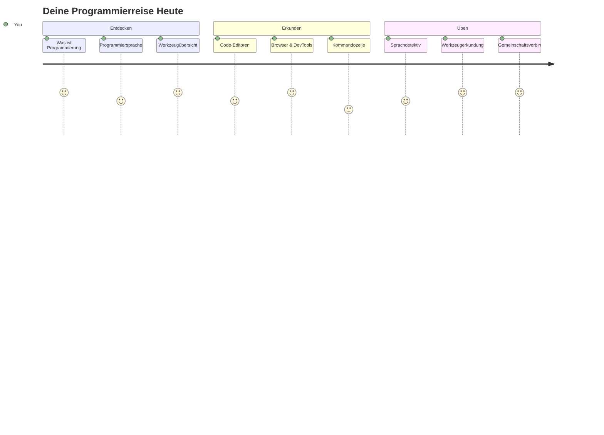
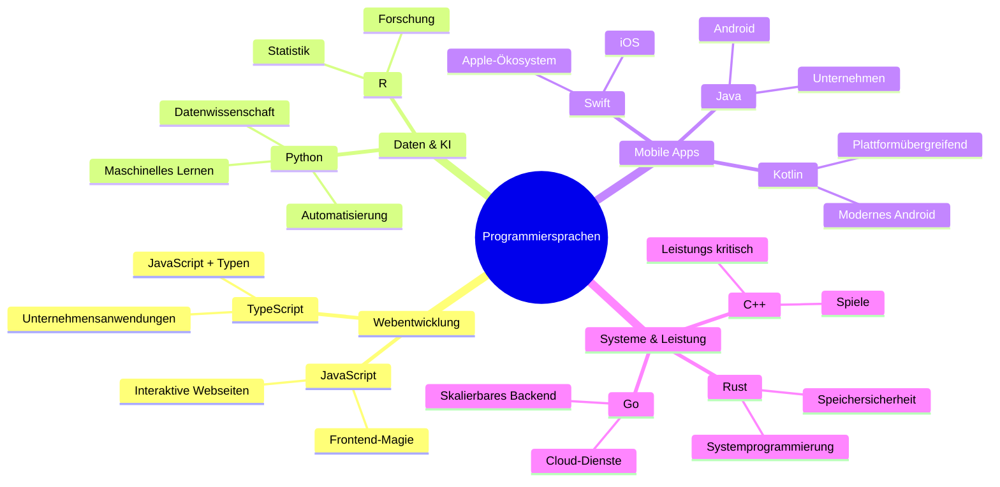
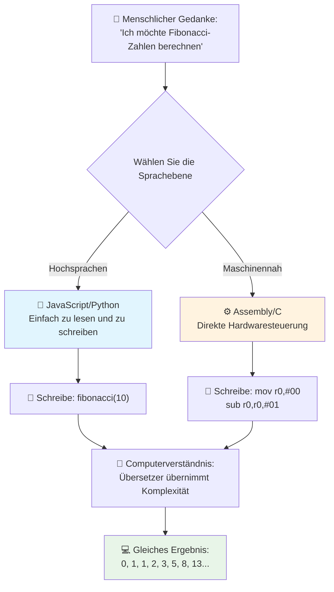
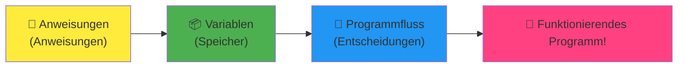
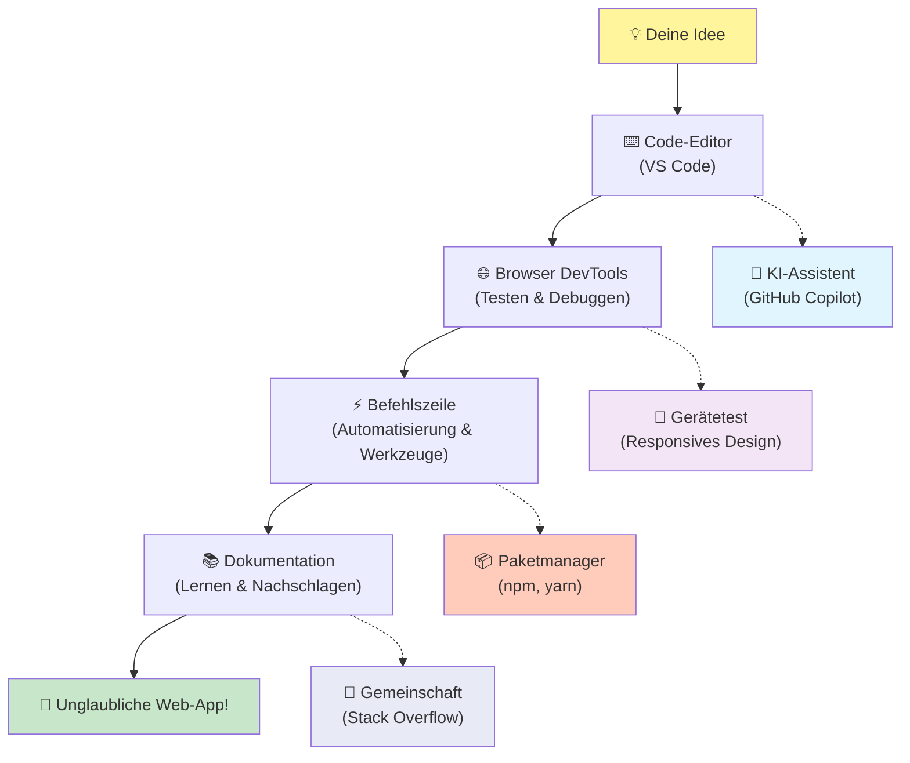
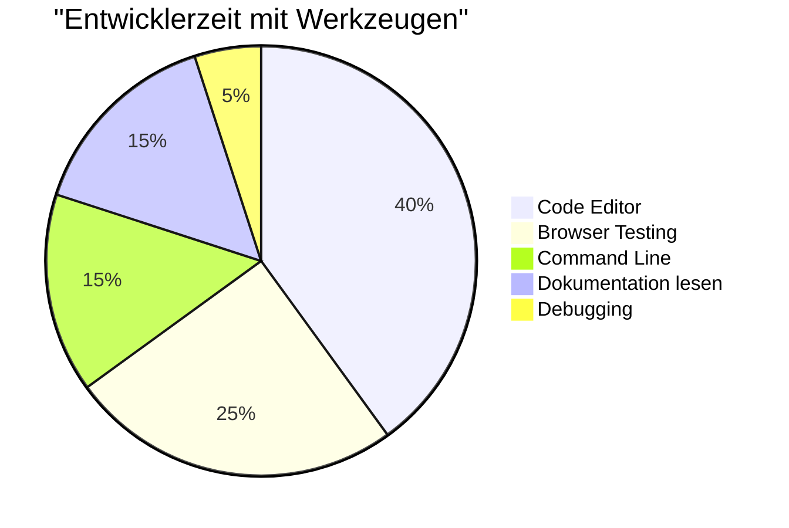
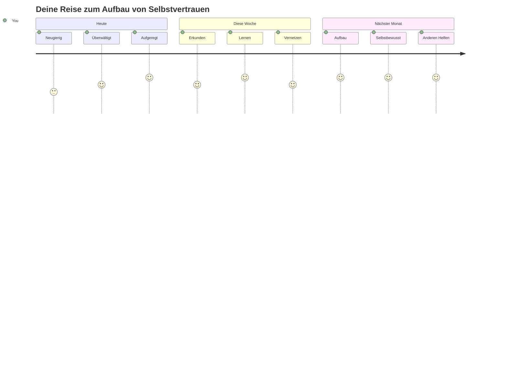

# Einführung in Programmiersprachen und moderne Entwicklerwerkzeuge

Hallo, zukünftiger Entwickler! 👋 Darf ich dir etwas erzählen, das mir jeden einzelnen Tag eine Gänsehaut bereitet? Du wirst gleich entdecken, dass Programmieren nicht nur etwas mit Computern zu tun hat – es sind tatsächlich Superkräfte, mit denen du deine wildesten Ideen zum Leben erwecken kannst!

Kennst du diesen Moment, wenn du deine Lieblings-App benutzt und einfach alles perfekt zusammenpasst? Wenn du auf einen Button tippst und etwas absolut Magisches passiert, das dich denken lässt: „Wow, wie haben sie das gemacht?“ Nun, genau jemand wie du – wahrscheinlich gerade in seinem Lieblingscafé um 2 Uhr morgens bei seinem dritten Espresso – hat den Code geschrieben, der diese Magie erschaffen hat. Und jetzt kommt das, was dich umhauen wird: Am Ende dieser Lektion wirst du nicht nur verstehen, wie sie das gemacht haben, sondern du wirst es selbst ausprobieren wollen!

Hör zu, ich verstehe total, wenn Programmieren im Moment einschüchternd wirkt. Als ich anfing, dachte ich ehrlich, man müsse entweder ein Mathegenie sein oder seit seinem fünften Lebensjahr programmieren. Aber weißt du, was meine Perspektive komplett verändert hat? Programmieren ist genau so, wie eine neue Sprache lernen. Du beginnst mit „Hallo“ und „Danke“, arbeitest dich hoch bis zum Kaffeebestellen, und ehe du dich versiehst, führst du tiefgründige philosophische Gespräche! Nur dass du in diesem Fall mit Computern sprichst, und ganz ehrlich? Die sind die geduldigsten Gesprächspartner, die du je haben wirst – sie beurteilen deine Fehler nie und freuen sich immer, es nochmal zu versuchen!

Heute erkunden wir die unglaublichen Werkzeuge, die moderne Webentwicklung nicht nur möglich machen, sondern richtig süchtig. Ich rede von genau den gleichen Editoren, Browsern und Workflows, die Entwickler bei Netflix, Spotify und deinem liebsten Indie-App-Studio jeden Tag nutzen. Und jetzt kommt der Teil, der dich vor Freude tanzen lässt: Die meisten dieser professionellen, branchenüblichen Tools sind komplett kostenlos!


> Sketchnote von [Tomomi Imura](https://twitter.com/girlie_mac)


```mermaid
journey
    title Deine Programmierreise Heute
    section Entdecken
      Was ist Programmierung: 5: You
      Programmiersprachen: 4: You
      Werkzeugübersicht: 5: You
    section Erkunden
      Code-Editoren: 4: You
      Browser & DevTools: 5: You
      Kommandozeile: 3: You
    section Üben
      Sprachdetektiv: 4: You
      Werkzeugerkundung: 5: You
      Gemeinschaftsverbindung: 5: You
```
## Schauen wir mal, was du schon weißt!

Bevor wir in den Spaß starten, interessiert mich: Was weißt du schon über diese Programmierwelt? Und hör zu, falls du dir jetzt denkst „Ich habe tatsächlich keinen Schimmer von alledem“, ist das nicht nur okay, sondern perfekt! Das bedeutet, du bist genau richtig hier. Betrachte dieses Quiz wie das Dehnen vor dem Workout – wir wärmen nur diese Denkmuskeln auf!

[Mach das Pre-Lesson-Quiz](https://ff-quizzes.netlify.app/web/)

## Das Abenteuer, auf das wir uns gemeinsam begeben

Okay, ich freue mich wirklich riesig auf das, was wir heute entdecken werden! Ehrlich, ich wünschte, ich könnte dein Gesicht sehen, wenn dir mancher dieser Konzepte „klick“ macht. Das ist die unglaubliche Reise, auf die wir gemeinsam gehen:

- **Was Programmieren eigentlich ist (und warum es das coolste überhaupt ist!)** – Wir werden entdecken, wie Code buchstäblich die unsichtbare Magie ist, die alles um dich herum antreibt, von dem Wecker, der irgendwie weiß, dass Montagmorgen ist, bis zum Algorithmus, der deine Netflix-Empfehlungen perfekt kuratiert
- **Programmiersprachen und ihre fantastischen Persönlichkeiten** – Stell dir vor, du betrittst eine Party, bei der jede Person ganz unterschiedliche Superkräfte und Lösungswege hat. So ist die Welt der Programmiersprachen, und du wirst sie lieben lernen!
- **Die grundlegenden Bausteine, die digitale Magie ermöglichen** – Denk daran wie das ultimative kreative LEGO-Set. Sobald du verstehst, wie diese Teile zusammenpassen, wirst du merken, dass du buchstäblich alles bauen kannst, was deine Fantasie träumen lässt
- **Professionelle Werkzeuge, die dir das Gefühl geben, gerade einen Zauberstab in die Hand bekommen zu haben** – Ich übertreibe nicht – diese Tools werden dich wirklich wie einen Superhelden fühlen lassen, und das Beste? Es sind genau die, die Profis nutzen!

> 💡 **Hier ist die Sache**: Versuch nicht heute alles auswendig zu lernen! Im Moment will ich nur, dass du diesen Funken Aufregung spürst, was möglich ist. Die Details wirst du automatisch mit der Zeit lernen – so funktioniert echtes Lernen!

> Du kannst diese Lektion auch auf [Microsoft Learn](https://learn.microsoft.com/en-us/learn/modules/web-development-101/introduction-programming/?WT.mc_id=academic-77807-sagibbon) machen!

## Was genau *ist* eigentlich Programmieren?

Okay, jetzt die Millionen-Dollar-Frage: Was ist Programmieren wirklich?

Ich erzähle dir eine Geschichte, die meine Sichtweise komplett verändert hat. Letzte Woche wollte ich meiner Mutter erklären, wie man unsere neue Smart-TV-Fernbedienung benutzt. Ich ertappte mich dabei, Dinge zu sagen wie „Drück den roten Knopf, aber nicht den großen roten Knopf, den kleinen roten Knopf links… nein, dein anderes links… okay, jetzt halt ihn zwei Sekunden gedrückt, nicht eins, nicht drei…“ Kommt dir das bekannt vor? 😅

Das ist Programmieren! Es ist die Kunst, extrem detaillierte Schritt-für-Schritt-Anweisungen zu geben an etwas, das sehr mächtig ist, aber alles perfekt erklärt bekommen muss. Nur dass du nicht deiner Mutter erklärst (die fragen könnte „Welchen roten Knopf?!“), sondern einem Computer (der genau das tut, was du sagst, auch wenn das nicht genau das war, was du meintest).

Was mich total beeindruckt hat, als ich das zum ersten Mal verstanden habe: Computer sind eigentlich ziemlich einfach in ihrem Kern. Sie verstehen buchstäblich nur zwei Dinge – 1 und 0, was im Grunde nur „Ja“ und „Nein“ oder „An“ und „Aus“ bedeutet. Das war’s! Aber hier wird es magisch – wir müssen nicht in 1en und 0en reden wie in der Matrix. Dafür gibt es **Programmiersprachen**. Die sind wie der beste Übersetzer der Welt, der deine ganz normalen menschlichen Gedanken in Computersprache übersetzt.

Und hier ist etwas, das mir morgens immer noch echte Gänsehaut bereitet: Buchstäblich *alles* Digitale in deinem Leben hat irgendwann mit jemandem angefangen, der genau so war wie du, wahrscheinlich im Pyjama mit einer Tasse Kaffee, der Code auf seinem Laptop getippt hat. Dieser Instagram-Filter, der dich makellos aussehen lässt? Jemand hat den programmiert. Die Empfehlung, die dich zu deinem neuen Lieblingslied geführt hat? Ein Entwickler hat diesen Algorithmus gebaut. Die App, mit der du Rechnungen mit Freunden teilst? Ja, jemand hat gedacht „Das nervt, ich könnte das wohl lösen“ und dann... hat er es getan!

Wenn du programmierst, lernst du nicht nur eine neue Fähigkeit – du wirst Teil dieser unglaublichen Community von Problemlösern, die ihre Tage damit verbringen, zu denken: „Was wäre, wenn ich etwas bauen könnte, das jemandem den Tag ein kleines bisschen besser macht?“ Gibt es ehrlich etwas Cooleres?

✅ **Spaß-Fakt-Suche**: Hier ist etwas super Cooles, das du dir anschauen kannst, wenn du mal eine freie Minute hast – Wer war wohl der erste Computerprogrammierer der Welt? Ich gebe dir einen Tipp: Es ist vielleicht nicht die Person, die du erwartest! Die Geschichte hinter dieser Person ist faszinierend und zeigt, dass Programmieren immer schon kreatives Problemlösen und unkonventionelles Denken war.

### 🧠 **Gefühls-Check: Wie fühlst du dich?**

**Nimm dir einen Moment:**
- Macht die Idee von „Anweisungen an Computer geben“ jetzt für dich Sinn?
- Kannst du dir eine tägliche Aufgabe vorstellen, die du gerne mit Programmieren automatisieren würdest?
- Welche Fragen schwirren dir so im Kopf durch diesen Programmierkram?

> **Erinnere dich:** Es ist total normal, wenn manche Konzepte im Moment noch verschwommen sind. Programmieren zu lernen ist wie eine neue Sprache lernen – dein Gehirn braucht Zeit, um die neuronalen Verbindungen zu schaffen. Du machst das großartig!

## Programmiersprachen sind wie verschiedene Geschmacksrichtungen von Magie

Okay, das klingt jetzt komisch, aber bleib dran – Programmiersprachen sind wie verschiedene Musikrichtungen. Denk mal drüber nach: Es gibt Jazz, der smooth und improvisiert ist, Rock, kraftvoll und direkt, Klassik, elegant und strukturiert, und Hip-Hop, kreativ und expressiv. Jede Stilrichtung hat ihre eigene Stimmung, ihre leidenschaftliche Fangemeinde und ist für unterschiedliche Stimmungen und Anlässe perfekt.

Programmiersprachen funktionieren genau so! Du würdest nicht dieselbe Sprache benutzen, um ein lustiges Mobile Game zu machen, wie um riesige Klima-Datenmengen zu verarbeiten, genau so wenig wie du Death Metal beim Yoga hören würdest (naja, bei den meisten Yogakursen jedenfalls! 😄).

Aber was mich jedes Mal echt umhaut: Diese Sprachen sind wie der geduldigste und brillante Dolmetscher, der direkt neben dir sitzt. Du kannst deine Ideen so ausdrücken, dass es deinem menschlichen Gehirn natürlich vorkommt, und sie übernehmen die unglaublich komplexe Übersetzung in die 1en und 0en, die Computer tatsächlich sprechen. Es ist wie ein Freund, der perfekt „menschliche Kreativität“ und „Computerlogik“ beherrscht – und der nie müde wird, keine Kaffeepausen braucht und dich nie dafür verurteilt, dieselbe Frage zweimal zu stellen!

### Beliebte Programmiersprachen und ihre Einsatzbereiche


```mermaid
mindmap
  root((Programmiersprachen))
    Webentwicklung
      JavaScript
        Frontend-Magie
        Interaktive Webseiten
      TypeScript
        JavaScript + Typen
        Unternehmensanwendungen
    Daten & KI
      Python
        Datenwissenschaft
        Maschinelles Lernen
        Automatisierung
      R
        Statistik
        Forschung
    Mobile Apps
      Java
        Android
        Unternehmen
      Swift
        iOS
        Apple-Ökosystem
      Kotlin
        Modernes Android
        Plattformübergreifend
    Systeme & Leistung
      C++
        Spiele
        Leistungs kritisch
      Rust
        Speichersicherheit
        Systemprogrammierung
      Go
        Cloud-Dienste
        Skalierbares Backend
```
| Sprache | Am besten geeignet für | Warum es beliebt ist |
|----------|----------|------------------|
| **JavaScript** | Webentwicklung, Benutzeroberflächen | Läuft in Browsern und treibt interaktive Webseiten an |
| **Python** | Datenwissenschaft, Automatisierung, KI | Einfach zu lesen und zu lernen, leistungsstarke Bibliotheken |
| **Java** | Unternehmensanwendungen, Android-Apps | Plattformunabhängig, robust für große Systeme |
| **C#** | Windows-Anwendungen, Spieleentwicklung | Starke Unterstützung im Microsoft-Ökosystem |
| **Go** | Cloud Services, Backend-Systeme | Schnell, einfach, für moderne IT entwickelt |

### Hochsprachen vs. Maschinensprachen

Okay, das war ehrlich gesagt das Konzept, das mich anfangs echt überfordert hat, deshalb teile ich dir die Analogie, die es für mich klick machen ließ – und ich hoffe, sie hilft dir auch!

Stell dir vor, du bist in einem Land, dessen Sprache du nicht sprichst, und musst dringend eine Toilette finden (wir waren doch alle schon mal dort, oder? 😅):

- **Low-level Programmierung** ist, als würdest du den lokalen Dialekt so gut lernen, dass du mit der Großmutter am Obststand plaudern kannst, inklusive kultureller Referenzen, regionalem Slang und Insiderwitzen, die nur jemand versteht, der dort aufgewachsen ist. Super beeindruckend und sehr effizient... wenn du zufällig fließend bist! Aber ziemlich überwältigend, wenn du nur eine Toilette suchst.

- **High-level Programmierung** ist wie dieser wunderbare lokale Freund, der dich einfach versteht. Du sagst „Ich muss dringend eine Toilette finden“ auf einfachem Englisch, und er kümmert sich um alle kulturellen Übersetzungen und gibt dir eine Wegbeschreibung, die für dein nicht-lokales Gehirn total Sinn macht.

In Programmierbegriffen:
- **Low-level Sprachen** (wie Assembly oder C) erlauben es dir, extrem detaillierte Unterhaltungen mit der Hardware des Computers zu führen, aber du musst wie eine Maschine denken, was... naja, eine ziemlich große Umstellung ist!
- **High-level Sprachen** (wie JavaScript, Python oder C#) erlauben es dir, wie ein Mensch zu denken, während sie die Maschinensprache hinter den Kulissen übernehmen. Außerdem gibt es riesige, einladende Communities voller Leute, die sich daran erinnern, wie es war, neu zu sein, und die dir wirklich helfen wollen!

Rate mal, mit welchen ich empfehle zu starten? 😉 Hochsprachen sind wie Stützräder, die du nie wirklich abmachen willst, weil sie das ganze Erlebnis einfach so viel angenehmer machen!


```mermaid
flowchart TB
    A["👤 Menschlicher Gedanke:<br/>'Ich möchte Fibonacci-Zahlen berechnen'"] --> B{Wählen Sie die Sprachebene}
    
    B -->|Hochsprachen| C["🌟 JavaScript/Python<br/>Einfach zu lesen und zu schreiben"]
    B -->|Maschinennah| D["⚙️ Assembly/C<br/>Direkte Hardwaresteuerung"]
    
    C --> E["📝 Schreibe: fibonacci(10)"]
    D --> F["📝 Schreibe: mov r0,#00<br/>sub r0,r0,#01"]
    
    E --> G["🤖 Computerverständnis:<br/>Übersetzer übernimmt Komplexität"]
    F --> G
    
    G --> H["💻 Gleiches Ergebnis:<br/>0, 1, 1, 2, 3, 5, 8, 13..."]
    
    style C fill:#e1f5fe
    style D fill:#fff3e0
    style H fill:#e8f5e8
```
### Ich zeige dir, warum Hochsprachen viel freundlicher sind

Okay, ich zeige dir jetzt etwas, das perfekt zeigt, warum ich mich in Hochsprachen verliebt habe, aber zuerst – ich brauche dein Versprechen. Wenn du das erste Codebeispiel siehst, gerate nicht in Panik! Es soll einschüchternd aussehen. Genau das will ich zeigen!

Wir betrachten dieselbe Aufgabe in zwei völlig unterschiedlichen Stilen. Beide erzeugen die sogenannte Fibonacci-Folge – ein wunderschönes mathematisches Muster, bei dem jede Zahl die Summe der beiden vorherigen ist: 0, 1, 1, 2, 3, 5, 8, 13... (Fun Fact: Dieses Muster findet sich buchstäblich überall in der Natur – Sonnenblumenkerne in Spiralen, Zapfenmuster, sogar wie Galaxien entstehen!)

Bereit, den Unterschied zu sehen? Los geht’s!

**Hochsprache (JavaScript) – Menschlich verständlich:**

```javascript
// Schritt 1: Grundlegende Fibonacci-Einrichtung
const fibonacciCount = 10;
let current = 0;
let next = 1;

console.log('Fibonacci sequence:');
```

**Das macht dieser Code:**
- **Deklariert** eine Konstante, die festlegt, wie viele Fibonacci-Zahlen wir erzeugen wollen
- **Initialisiert** zwei Variablen, um die aktuelle und die nächste Zahl der Folge zu verfolgen
- **Setzt** die Startwerte (0 und 1), die das Fibonacci-Muster definieren
- **Zeigt** eine Überschrift an, um unsere Ausgabe zu kennzeichnen

```javascript
// Schritt 2: Erzeuge die Sequenz mit einer Schleife
for (let i = 0; i < fibonacciCount; i++) {
  console.log(`Position ${i + 1}: ${current}`);
  
  // Berechne die nächste Zahl in der Sequenz
  const sum = current + next;
  current = next;
  next = sum;
}
```

**So entsteht das hier:**
- **Schleifen** wir durch jede Position in unserer Folge mit einer `for`-Schleife
- **Geben** wir jede Zahl mit ihrer Position formatiert aus
- **Berechnen** wir die nächste Fibonacci-Zahl durch Addition der aktuellen und nächsten Werte
- **Aktualisieren** wir unsere Variablen, um zur nächsten Iteration weiterzugehen

```javascript
// Schritt 3: Moderner funktionaler Ansatz
const generateFibonacci = (count) => {
  const sequence = [0, 1];
  
  for (let i = 2; i < count; i++) {
    sequence[i] = sequence[i - 1] + sequence[i - 2];
  }
  
  return sequence;
};

// Anwendungsbeispiel
const fibSequence = generateFibonacci(10);
console.log(fibSequence);
```

**Oben haben wir:**
- **Eine wiederverwendbare Funktion** mit moderner Pfeilfunktion-Syntax erstellt
- **Ein Array gebaut,** um die komplette Folge zu speichern anstatt sie einzeln auszugeben
- **Array-Indizes genutzt,** um jede neue Zahl aus vorherigen Werten zu berechnen
- **Die vollständige Folge zurückgegeben,** damit wir sie flexibel anderswo nutzen können

**Niedrigsprache (ARM Assembly) – Computer-freundlich:**

```assembly
 area ascen,code,readonly
 entry
 code32
 adr r0,thumb+1
 bx r0
 code16
thumb
 mov r0,#00
 sub r0,r0,#01
 mov r1,#01
 mov r4,#10
 ldr r2,=0x40000000
back add r0,r1
 str r0,[r2]
 add r2,#04
 mov r3,r0
 mov r0,r1
 mov r1,r3
 sub r4,#01
 cmp r4,#00
 bne back
 end
```

Beachte, wie die JavaScript-Version fast wie englische Anweisungen liest, während die Assembly-Version kryptische Befehle nutzt, die direkt den Prozessor steuern. Beide erledigen exakt dieselbe Aufgabe, aber die Hochsprache ist für Menschen viel leichter zu verstehen, zu schreiben und zu warten.

**Wesentliche Unterschiede, die dir auffallen werden:**
- **Lesbarkeit**: JavaScript verwendet beschreibende Namen wie `fibonacciCount`, während Assembly kryptische Bezeichnungen wie `r0`, `r1` nutzt  
- **Kommentare**: Hochsprachen ermutigen zu erklärenden Kommentaren, die den Code selbstdokumentierend machen  
- **Struktur**: Der logische Ablauf von JavaScript entspricht, wie Menschen Schritt-für-Schritt über Probleme nachdenken  
- **Wartung**: Das Aktualisieren der JavaScript-Version für verschiedene Anforderungen ist unkompliziert und klar  

✅ **Über die Fibonacci-Folge**: Dieses absolut wunderschöne Zahlenmuster (bei dem jede Zahl die Summe der beiden vorherigen ist: 0, 1, 1, 2, 3, 5, 8 ...) findet sich buchstäblich *überall* in der Natur! Du findest es in Sonnenblumen-Spiralen, Tannenzapfen-Mustern, der Form von Nautilus-Schalen und sogar im Wachstum von Baumzweigen. Es ist ziemlich verblüffend, wie Mathematik und Code uns helfen können, die Muster zu verstehen und nachzubilden, die die Natur nutzt, um Schönheit zu erschaffen!

## Die Bausteine, die die Magie möglich machen

Okay, jetzt, wo du gesehen hast, wie Programmiersprachen in Aktion aussehen, lass uns die grundlegenden Bausteine zerlegen, aus denen buchstäblich jedes jemals geschriebene Programm besteht. Denk an sie als die wesentlichen Zutaten in deinem Lieblingsrezept – wenn du verstehst, was jede einzelne bewirkt, kannst du Code in so gut wie jeder Sprache lesen und schreiben!

Das ist ein bisschen so, als würdest du die Grammatik des Programmierens lernen. Erinnerst du dich noch aus der Schule, als du Nomen, Verben und wie man Sätze bildet gelernt hast? Programmieren hat seine eigene Grammatik, und ehrlich gesagt ist sie viel logischer und nachsichtiger als die englische Grammatik! 😄

### Anweisungen: Die Schritt-für-Schritt-Anleitungen

Fangen wir mit **Anweisungen (Statements)** an – das sind einzelne Sätze in einer Konversation mit deinem Computer. Jede Anweisung sagt dem Computer, genau eine Sache zu tun, ähnlich wie Wegbeschreibungen: „Hier links abbiegen“, „An der roten Ampel anhalten“, „Auf diesem Parkplatz parken“.

Was ich an Anweisungen liebe, ist, wie meist gut lesbar sie sind. Schau dir das an:

```javascript
// Grundlegende Anweisungen, die einzelne Aktionen ausführen
const userName = "Alex";                    
console.log("Hello, world!");              
const sum = 5 + 3;                         
```
  
**Das macht dieser Code:**  
- **Deklariert** eine Konstantenvariable, um den Namen eines Nutzers zu speichern  
- **Zeigt** eine Begrüßungsnachricht in der Konsole an  
- **Berechnet** und speichert das Ergebnis einer mathematischen Operation  

```javascript
// Anweisungen, die mit Webseiten interagieren
document.title = "My Awesome Website";      
document.body.style.backgroundColor = "lightblue";
```
  
**Schritt für Schritt passiert Folgendes:**  
- **Ändert** den Titel der Webseite, der im Browser-Tab angezeigt wird  
- **Verändert** die Hintergrundfarbe des gesamten Seitenkörpers  

### Variablen: Das Speichersystem deines Programms

Okay, **Variablen** sind ehrlich gesagt eines meiner absoluten Lieblingsthemen zum Erklären, weil sie so sehr wie Dinge funktionieren, die du jeden Tag benutzt!

Denk mal an dein Telefon-Adressbuch. Du merkst dir nicht jede Telefonnummer – stattdessen speicherst du „Mama“, „Beste Freundin“ oder „Pizzalieferdienst bis 2 Uhr morgens“ und dein Telefon merkt sich die echten Nummern. Variablen funktionieren genau so! Sie sind wie beschriftete Behälter, in denen dein Programm Informationen speichern und später über einen sinnvollen Namen wiederfinden kann.

Das Coole daran: Variablen können sich ändern, während dein Programm läuft (daher der Name „Variable“ – merkst du, was sie gemacht haben?). Genauso wie du den Pizzalieferdienst-Kontakt aktualisierst, wenn du einen besseren gefunden hast, können Variablen aktualisiert werden, wenn dein Programm neue Informationen lernt oder sich Situationen ändern!

Ich zeige dir mal, wie einfach das sein kann:

```javascript
// Schritt 1: Erstellen von Basisvariablen
const siteName = "Weather Dashboard";        
let currentWeather = "sunny";               
let temperature = 75;                       
let isRaining = false;                      
```
  
**Verstehen dieser Konzepte:**  
- **Speichere** unveränderliche Werte in `const`-Variablen (wie den Site-Namen)  
- **Nutze** `let` für Werte, die sich im Programm ändern können  
- **Weise** verschiedene Datentypen zu: Strings (Text), Zahlen und Booleans (wahr/falsch)  
- **Wähle** beschreibende Namen, die erklären, was jede Variable enthält  

```javascript
// Schritt 2: Arbeiten mit Objekten, um verwandte Daten zu gruppieren
const weatherData = {                       
  location: "San Francisco",
  humidity: 65,
  windSpeed: 12
};
```
  
**Oben haben wir:**  
- **Ein Objekt erstellt**, um zusammengehörige Wetterinformationen zu gruppieren  
- **Mehrere Datenstücke** unter einem Variablennamen organisiert  
- **Schlüssel-Wert-Paare verwendet**, um jede Information klar zu beschriften  

```javascript
// Schritt 3: Verwendung und Aktualisierung von Variablen
console.log(`${siteName}: Today is ${currentWeather} and ${temperature}°F`);
console.log(`Wind speed: ${weatherData.windSpeed} mph`);

// Aktualisierung veränderbarer Variablen
currentWeather = "cloudy";                  
temperature = 68;                          
```
  
**Schauen wir uns die einzelnen Teile an:**  
- **Zeige** Informationen mit Template-Literals und der `${}`-Syntax an  
- **Greife zu** auf Objekteigenschaften mit Punktnotation (`weatherData.windSpeed`)  
- **Aktualisiere** mit `let` deklarierte Variablen, um veränderte Bedingungen widerzuspiegeln  
- **Kombiniere** mehrere Variablen, um sinnvolle Nachrichten zu erstellen  

```javascript
// Schritt 4: Modernes Destructuring für saubereren Code
const { location, humidity } = weatherData; 
console.log(`${location} humidity: ${humidity}%`);
```
  
**Das musst du wissen:**  
- **Extrahiere** bestimmte Eigenschaften aus Objekten mit Destructuring Assignment  
- **Erzeuge** automatisch neue Variablen mit den gleichen Namen wie die Objekt-Schlüssel  
- **Vereinfache** den Code durch Vermeidung mehrfacher Punktnotation  

### Kontrollfluss: Deinem Programm beibringen zu denken

Das hier ist der Teil, an dem Programmieren absolut verblüffend wird! **Kontrollfluss** bedeutet im Grunde, deinem Programm beizubringen, wie es intelligente Entscheidungen treffen kann, genau wie du es jeden Tag ganz automatisch machst.

Stell dir vor: Heute Morgen hast du wahrscheinlich etwa gedacht: „Wenn es regnet, nehme ich einen Regenschirm mit. Wenn es kalt ist, ziehe ich eine Jacke an. Wenn ich spät dran bin, überspringe ich das Frühstück und nehme unterwegs einen Kaffee.“ Dein Gehirn folgt ganz natürlich dieser Wenn-Dann-Logik dutzende Male am Tag!

Das macht Programme intelligent und lebendig, anstatt dass sie nur einem langweiligen, vorhersehbaren Skript folgen. Sie können eine Situation anschauen, bewerten, was los ist, und angemessen reagieren. Es ist fast so, als würdest du deinem Programm ein Gehirn geben, das sich anpassen und Entscheidungen treffen kann!

Willst du sehen, wie genial das funktioniert? Ich zeige es dir:

```javascript
// Schritt 1: Grundlegende bedingte Logik
const userAge = 17;

if (userAge >= 18) {
  console.log("You can vote!");
} else {
  const yearsToWait = 18 - userAge;
  console.log(`You'll be able to vote in ${yearsToWait} year(s).`);
}
```
  
**Das macht dieser Code:**  
- **Prüft**, ob das Alter des Nutzers die Wahlberechtigung erfüllt  
- **Führt** verschiedene Codeblöcke je nach Bedingungsergebnis aus  
- **Berechnet** und zeigt an, wie lange es bis zur Wahlberechtigung dauert, falls unter 18  
- **Gibt** spezifisches, hilfreiches Feedback für jedes Szenario  

```javascript
// Schritt 2: Mehrere Bedingungen mit logischen Operatoren
const userAge = 17;
const hasPermission = true;

if (userAge >= 18 && hasPermission) {
  console.log("Access granted: You can enter the venue.");
} else if (userAge >= 16) {
  console.log("You need parent permission to enter.");
} else {
  console.log("Sorry, you must be at least 16 years old.");
}
```
  
**Das passiert hier im Detail:**  
- **Verknüpft** mehrere Bedingungen mit dem `&&` (und)-Operator  
- **Erstellt** eine Hierarchie von Bedingungen mit `else if` für verschiedene Szenarien  
- **Erfasst** alle möglichen Fälle mit einem abschließenden `else`  
- **Gibt** klar verständliches, hilfreiches Feedback für jede Situation  

```javascript
// Schritt 3: Prägnante Bedingung mit ternärem Operator
const votingStatus = userAge >= 18 ? "Can vote" : "Cannot vote yet";
console.log(`Status: ${votingStatus}`);
```
  
**Das solltest du dir merken:**  
- **Nutze** den ternären Operator (`? :`) für einfache Zwei-Option-Bedingungen  
- **Schreibe** zuerst die Bedingung, dann `?`, dann die wahre Ausgabe, dann `:`, dann die falsche Ausgabe  
- **Verwende** dieses Muster, wenn du Werte basierend auf Bedingungen zuweisen willst  

```javascript
// Schritt 4: Umgang mit mehreren spezifischen Fällen
const dayOfWeek = "Tuesday";

switch (dayOfWeek) {
  case "Monday":
  case "Tuesday":
  case "Wednesday":
  case "Thursday":
  case "Friday":
    console.log("It's a weekday - time to work!");
    break;
  case "Saturday":
  case "Sunday":
    console.log("It's the weekend - time to relax!");
    break;
  default:
    console.log("Invalid day of the week");
}
```
  
**Dieser Code macht Folgendes:**  
- **Vergleicht** den Variablenwert mit mehreren spezifischen Fällen  
- **Fasst** ähnliche Fälle zusammen (Werktage vs. Wochenenden)  
- **Führt** den passenden Codeblock aus, wenn eine Übereinstimmung gefunden wird  
- **Beinhaltet** einen `default`-Fall für unerwartete Werte  
- **Verwendet** `break`-Anweisungen, um zu verhindern, dass der Code in weitere Fälle läuft  

> 💡 **Alltagsvergleich**: Stell dir den Kontrollfluss wie das geduldigste GPS der Welt vor, das dir Anweisungen gibt. Es sagt: „Wenn auf der Hauptstraße Stau ist, nimm lieber die Autobahn. Wenn Baustellen die Autobahn blockieren, versuch die malerische Strecke.“ Programme nutzen genau diese Art von bedingter Logik, um intelligent auf verschiedene Situationen zu reagieren und Nutzern immer die beste Erfahrung zu bieten.

### 🎯 **Konzept-Check: Bausteine meistern**

**Lass uns mal schauen, wie es mit den Grundlagen steht:**  
- Kannst du in deinen eigenen Worten den Unterschied zwischen einer Variable und einer Anweisung erklären?  
- Denk an ein Beispiel aus dem echten Leben, in dem du eine Wenn-Dann-Entscheidung treffen würdest (wie bei unserem Wahlrecht-Beispiel)  
- Was hat dich an der Programmierlogik am meisten überrascht?  

**Kleiner Selbstvertrauens-Kick:**  

```mermaid
flowchart LR
    A["📝 Anweisungen<br/>(Anweisungen)"] --> B["📦 Variablen<br/>(Speicher)"] --> C["🔀 Programmfluss<br/>(Entscheidungen)"] --> D["🎉 Funktionierendes Programm!"]
    
    style A fill:#ffeb3b
    style B fill:#4caf50
    style C fill:#2196f3
    style D fill:#ff4081
```  
✅ **Was als Nächstes kommt:** Wir werden richtig viel Spaß haben, wenn wir diese Konzepte weiter vertiefen und gemeinsam diese unglaubliche Reise fortsetzen! Konzentriere dich erstmal darauf, dich auf all die fantastischen Möglichkeiten zu freuen, die vor dir liegen. Die speziellen Fähigkeiten und Techniken werden sich ganz natürlich festigen, wenn wir gemeinsam üben – ich verspreche, das wird viel mehr Spaß machen, als du erwartest!

## Werkzeuge des Fachs

Okay, ehrlich gesagt bekomme ich hier richtig Gänsehaut vor Aufregung! 🚀 Wir sprechen jetzt über die unglaublichen Werkzeuge, mit denen du dich fühlen wirst, als hättest du gerade die Schlüssel zu einem digitalen Raumschiff in die Hand bekommen.

Du kennst doch sicher diese perfekt ausgewogenen Messer, die ein Koch hat und die sich fast wie eine Verlängerung der eigenen Hände anfühlen? Oder den Musiker, der eine Gitarre besitzt, die förmlich zu singen beginnt, sobald er sie berührt? Entwickler haben ihre ganz eigene Version dieser magischen Werkzeuge, und das, was dich umhauen wird – die meisten davon sind absolut kostenlos!

Ich freue mich so sehr, dir das zu zeigen, denn diese Tools haben die Softwareentwicklung komplett revolutioniert. Wir reden von KI-gestützten Programmierassistenten, die deinen Code schreiben helfen können (ernsthaft!), Cloud-Entwicklungsumgebungen, in denen du ganze Apps von überall mit WLAN bauen kannst, und so ausgefeilten Debuggern, dass sie beinahe als Röntgenblick für deine Programme gelten könnten.

Und hier kommt der Teil, der mir immer noch eine Gänsehaut macht: Das sind keine „Anfänger-Werkzeuge“, mit denen du schnell rauswächst. Das sind exakt die gleichen professionellen Tools, die Entwickler bei Google, Netflix und dem Indie-App-Studio, das du liebst, gerade in diesem Moment benutzen. Du wirst dich fühlen wie ein absoluter Profi!


```mermaid
graph TD
    A["💡 Deine Idee"] --> B["⌨️ Code-Editor<br/>(VS Code)"] 
    B --> C["🌐 Browser DevTools<br/>(Testen & Debuggen)"]
    C --> D["⚡ Befehlszeile<br/>(Automatisierung & Werkzeuge)"]
    D --> E["📚 Dokumentation<br/>(Lernen & Nachschlagen)"]
    E --> F["🚀 Unglaubliche Web-App!"]
    
    B -.-> G["🤖 KI-Assistent<br/>(GitHub Copilot)"]
    C -.-> H["📱 Gerätetest<br/>(Responsives Design)"]
    D -.-> I["📦 Paketmanager<br/>(npm, yarn)"]
    E -.-> J["👥 Gemeinschaft<br/>(Stack Overflow)"]
    
    style A fill:#fff59d
    style F fill:#c8e6c9
    style G fill:#e1f5fe
    style H fill:#f3e5f5
    style I fill:#ffccbc
    style J fill:#e8eaf6
```  
### Code-Editoren und IDEs: Deine neuen digitalen besten Freunde

Lass uns über Code-Editoren sprechen – die werden wirklich bald zu deinen Lieblingsorten zum Abhängen! Stell sie dir als deinen persönlichen Code-Sanctuary vor, in dem du die meiste Zeit damit verbringst, deine digitalen Kreationen zu erschaffen und zu perfektionieren.

Aber das absolut Magische an modernen Editoren ist: Sie sind nicht einfach nur schicke Texteditoren. Sie sind wie der brillanteste, unterstützendste Programmier-Mentor, der rund um die Uhr neben dir sitzt. Sie fangen Tippfehler ab, bevor du sie überhaupt bemerkst, schlagen Verbesserungen vor, die dich zum Genie machen, helfen dir zu verstehen, was jeder Codeabschnitt tut, und manche von ihnen können sogar antizipieren, was du gleich tippen willst und bieten dir an, deine Gedanken fertigzuschreiben!

Ich erinnere mich noch, als ich zum ersten Mal Auto-Completion entdeckt habe – ich hatte das Gefühl, in der Zukunft zu leben. Du fängst an zu tippen, und dein Editor sagt: „Hey, wolltest du nicht diese Funktion, die genau das macht, was du brauchst?“ Es ist fast wie ein Gedankenleser als dein Coding-Buddy!

**Was macht diese Editoren so unglaublich?**

Moderne Code-Editoren bieten eine beeindruckende Anzahl an Funktionen, die deine Produktivität steigern:

| Funktion | Was es macht | Warum es hilft |
|---------|--------------|--------------|
| **Syntax-Hervorhebung** | Färbt verschiedene Teile deines Codes | Macht den Code leichter lesbar und Fehler sichtbar |
| **Auto-Vervollständigung** | Schlägt Code während des Tippens vor | Beschleunigt das Programmieren und reduziert Tippfehler |
| **Debugging-Tools** | Hilft Fehler zu finden und zu beheben | Spart Stunden an Fehlersuche |
| **Erweiterungen** | Fügen spezialisierte Funktionen hinzu | Passe deinen Editor für jede Technologie an |
| **KI-Assistenten** | Schlagen Code und Erklärungen vor | Beschleunigen Lernen und Produktivität |

> 🎥 **Video-Ressource**: Willst du diese Werkzeuge in Aktion sehen? Schau dir dieses [Tools of the Trade Video](https://youtube.com/watch?v=69WJeXGBdxg) für einen umfassenden Überblick an.

#### Empfohlene Editoren für Webentwicklung

**[Visual Studio Code](https://code.visualstudio.com/?WT.mc_id=academic-77807-sagibbon)** (Kostenlos)  
- Bei Webentwicklern am beliebtesten  
- Hervorragendes Erweiterungs-Ökosystem  
- Integriertes Terminal und Git  
- **Unverzichtbare Erweiterungen**:  
  - [GitHub Copilot](https://marketplace.visualstudio.com/items?itemName=GitHub.copilot) – KI-gestützte Codevorschläge  
  - [Live Share](https://marketplace.visualstudio.com/items?itemName=MS-vsliveshare.vsliveshare) – Echtzeit-Zusammenarbeit  
  - [Prettier](https://marketplace.visualstudio.com/items?itemName=esbenp.prettier-vscode) – Automatisches Codeformatieren  
  - [Code Spell Checker](https://marketplace.visualstudio.com/items?itemName=streetsidesoftware.code-spell-checker) – Fängt Tippfehler im Code auf  

**[JetBrains WebStorm](https://www.jetbrains.com/webstorm/)** (Bezahlt, kostenlos für Studierende)  
- Fortgeschrittene Debugging- und Testwerkzeuge  
- Intelligente Code-Vervollständigung  
- Integrierte Versionskontrolle  

**Cloud-basierte IDEs** (Verschiedene Preise)  
- [GitHub Codespaces](https://github.com/features/codespaces) – Vollständiges VS Code im Browser  
- [Replit](https://replit.com/) – Ideal zum Lernen und Teilen von Code  
- [StackBlitz](https://stackblitz.com/) – Sofortige Full-Stack-Webentwicklung  

> 💡 **Einstiegstipp**: Starte mit Visual Studio Code – es ist kostenlos, in der Branche weit verbreitet und hat eine riesige Community, die hilfreiche Tutorials und Erweiterungen erstellt.


### Webbrowser: Dein geheimes Entwicklungslabor

Okay, mach dich bereit, total überrascht zu werden! Du nutzt Browser ja bisher, um durch Social Media zu scrollen und Videos zu schauen, richtig? Dabei haben sie die ganze Zeit ein unglaubliches geheimes Entwicklerlabor versteckt – und warten nur darauf, dass du es entdeckst!

Jedes Mal, wenn du mit der rechten Maustaste auf eine Webseite klickst und „Element untersuchen“ wählst, öffnest du eine verborgene Welt von Entwicklerwerkzeugen, die ehrlicherweise mächtiger sind als manche teure Software, für die ich früher hunderte von Euro bezahlt habe. Es ist, als würdest du entdecken, dass deine ganz normale Küche hinter einer geheimen Klappe ein Profi-Küchenlabor beherbergt!
Als mir zum ersten Mal jemand die Browser-DevTools zeigte, verbrachte ich etwa drei Stunden damit, einfach nur herumzuklicken und zu denken: „WARTEN, DAS KANN ER AUCH?!“ Du kannst buchstäblich jede Website in Echtzeit bearbeiten, genau sehen, wie schnell alles lädt, testen, wie deine Seite auf verschiedenen Geräten aussieht, und sogar JavaScript wie ein echter Profi debuggen. Es ist absolut faszinierend!

**Darum sind Browser deine Geheimwaffe:**

Wenn du eine Website oder Webanwendung erstellst, musst du sehen, wie sie in der realen Welt aussieht und sich verhält. Browser zeigen nicht nur dein Werk an, sondern liefern auch detailliertes Feedback zur Performance, Zugänglichkeit und zu potenziellen Problemen.

#### Browser Developer Tools (DevTools)

Moderne Browser beinhalten umfangreiche Entwicklungstools:

| Toolkategorie | Was es macht | Beispielanwendung |
|---------------|--------------|-------------------|
| **Element-Inspektor** | HTML/CSS in Echtzeit ansehen und editieren | Stil anpassen und sofortige Ergebnisse sehen |
| **Konsole** | Fehlermeldungen ansehen und JavaScript testen | Probleme debuggen und mit Code experimentieren |
| **Netzwerkmonitor** | Nachverfolgen, wie Ressourcen geladen werden | Performance und Ladezeiten optimieren |
| **Zugänglichkeitsprüfer** | Auf inklusive Gestaltung testen | Sicherstellen, dass deine Seite für alle Nutzer funktioniert |
| **Gerätesimulator** | Vorschau auf verschiedenen Bildschirmgrößen | Responsive Design ohne mehrere Geräte testen |

#### Empfohlene Browser für die Entwicklung

- **[Chrome](https://developers.google.com/web/tools/chrome-devtools/)** – Industriestandard DevTools mit umfangreicher Dokumentation
- **[Firefox](https://developer.mozilla.org/docs/Tools)** – Hervorragende CSS Grid- und Zugänglichkeitswerkzeuge
- **[Edge](https://docs.microsoft.com/microsoft-edge/devtools-guide-chromium/?WT.mc_id=academic-77807-sagibbon)** – Auf Chromium basierend mit Microsofts Entwicklerressourcen

> ⚠️ **Wichtiger Test-Tipp**: Teste deine Websites immer in mehreren Browsern! Was in Chrome perfekt funktioniert, kann in Safari oder Firefox anders aussehen. Professionelle Entwickler testen in allen wichtigen Browsern, um eine konsistente Nutzererfahrung sicherzustellen.


### Kommandozeilen-Tools: Dein Zugang zu Entwickler-Superkräften

Okay, lass uns ganz ehrlich sein über die Kommandozeile, denn ich möchte, dass du das von jemandem hörst, der es wirklich versteht. Als ich sie zum ersten Mal sah – nur dieser beängstigende schwarze Bildschirm mit blinkendem Text – dachte ich buchstäblich: „Nein, auf keinen Fall! Das sieht aus wie aus einem Hacker-Film der 80er, und ich bin definitiv nicht klug genug dafür!“ 😅

Aber hier ist, was ich mir damals gewünscht hätte, dass mir jemand sagt, und was ich dir gerade jetzt erzähle: Die Kommandozeile ist nicht beängstigend – sie ist eigentlich wie ein direkter Dialog mit deinem Computer. Stell es dir vor wie der Unterschied zwischen Essen über eine schicke App mit Bildern und Menüs zu bestellen (was nett und einfach ist) und deinem Lieblingsrestaurant vor Ort, wo der Koch genau weiß, was du magst und etwas Perfektes zaubert, wenn du sagst: „Überrasche mich mit etwas Tollem.“

Die Kommandozeile ist der Ort, an dem Entwickler sich wie absolute Zauberer fühlen. Du tippst ein paar scheinbar magische Wörter (okay, es sind Befehle, aber sie fühlen sich magisch an!), drückst Enter und BOOM – du hast ganze Projektstrukturen erstellt, mächtige Tools aus der ganzen Welt installiert oder deine App ins Internet gestellt, damit Millionen sie sehen können. Wenn du einmal diese Macht gespürt hast, wird es ehrlich gesagt ziemlich süchtig machen!

**Darum wird die Kommandozeile dein Lieblingstool sein:**

Während grafische Oberflächen für viele Aufgaben großartig sind, glänzt die Kommandozeile bei Automatisierung, Präzision und Geschwindigkeit. Viele Entwicklungstools arbeiten hauptsächlich über Kommandozeilenschnittstellen, und sie effizient zu nutzen, kann deine Produktivität drastisch steigern.

```bash
# Schritt 1: Erstellen und navigieren Sie zum Projektverzeichnis
mkdir my-awesome-website
cd my-awesome-website
```

**Das macht dieser Code:**
- **Erstellt** ein neues Verzeichnis namens „my-awesome-website“ für dein Projekt
- **Wechselt** in das neu erstellte Verzeichnis, um die Arbeit zu beginnen

```bash
# Schritt 2: Projekt mit package.json initialisieren
npm init -y

# Moderne Entwicklungstools installieren
npm install --save-dev vite prettier eslint
npm install --save-dev @eslint/js
```

**Schritt für Schritt passiert Folgendes:**
- **Initialisiert** ein neues Node.js-Projekt mit den Standard-Einstellungen via `npm init -y`
- **Installiert** Vite als modernes Build-Tool für schnelle Entwicklung und Produktions-Builds
- **Fügt hinzu** Prettier für automatische Code-Formatierung und ESLint für Code-Qualitätsprüfungen
- **Verwendet** den `--save-dev`-Schalter, um diese als reine Entwicklungsabhängigkeiten zu markieren

```bash
# Schritt 3: Erstellen Sie die Projektstruktur und Dateien
mkdir src assets
echo '<!DOCTYPE html><html><head><title>My Site</title></head><body><h1>Hello World</h1></body></html>' > index.html

# Entwicklungsserver starten
npx vite
```

**Oben haben wir:**
- **Organisiert** unser Projekt durch separate Ordner für Quellcode und Assets
- **Generiert** eine einfache HTML-Datei mit korrektem Dokumentaufbau
- **Gestartet** den Vite-Entwicklungsserver für Live-Reloading und Hot-Module-Replacement

#### Unverzichtbare Kommandozeilentools für Webentwicklung

| Tool | Zweck | Warum du es brauchst |
|------|---------|-----------------|
| **[Git](https://git-scm.com/)** | Versionskontrolle | Änderungen verfolgen, mit anderen zusammenarbeiten, Backup erstellen |
| **[Node.js & npm](https://nodejs.org/)** | JavaScript-Laufzeit & Paketverwaltung | JavaScript außerhalb von Browsern ausführen, moderne Entwicklungstools installieren |
| **[Vite](https://vitejs.dev/)** | Build-Tool & Dev-Server | Sehr schnelle Entwicklung mit Hot-Module-Replacement |
| **[ESLint](https://eslint.org/)** | Codequalität | Probleme im JavaScript automatisch finden und beheben |
| **[Prettier](https://prettier.io/)** | Codeformatierung | Deinen Code durchgängig formatiert und lesbar halten |

#### Plattform-spezifische Optionen

**Windows:**
- **[Windows Terminal](https://docs.microsoft.com/windows/terminal/?WT.mc_id=academic-77807-sagibbon)** – Moderner, funktionsreicher Terminal
- **[PowerShell](https://docs.microsoft.com/powershell/?WT.mc_id=academic-77807-sagibbon)** 💻 – Leistungsfähige Skriptumgebung
- **[Eingabeaufforderung](https://docs.microsoft.com/windows-server/administration/windows-commands/?WT.mc_id=academic-77807-sagibbon)** 💻 – Traditionelle Windows-Kommandozeile

**macOS:**
- **[Terminal](https://support.apple.com/guide/terminal/)** 💻 – Eingebautes Terminalprogramm
- **[iTerm2](https://iterm2.com/)** – Erweitertes Terminal mit zusätzlichen Features

**Linux:**
- **[Bash](https://www.gnu.org/software/bash/)** 💻 – Standard-Linux-Shell
- **[KDE Konsole](https://docs.kde.org/trunk5/en/konsole/konsole/index.html)** – Fortgeschrittener Terminal-Emulator

> 💻 = Vorinstalliert im Betriebssystem

> 🎯 **Lernpfad**: Starte mit Basisbefehlen wie `cd` (Verzeichnis wechseln), `ls` oder `dir` (Dateien auflisten) und `mkdir` (Ordner erstellen). Übe moderne Workflow-Befehle wie `npm install`, `git status` und `code .` (öffnet das aktuelle Verzeichnis in VS Code). Je sicherer du wirst, desto mehr wirst du fortgeschrittene Befehle und Automatisierungstechniken kennenlernen.


### Dokumentation: Dein jederzeit verfügbarer Lernmentor

Okay, ich teile ein kleines Geheimnis, das dich viel entspannter macht, Anfänger zu sein: Selbst die erfahrensten Entwickler verbringen einen großen Teil ihrer Zeit mit Lesen von Dokumentationen. Und das nicht, weil sie keine Ahnung haben – sondern es ist tatsächlich ein Zeichen von Weisheit!

Sieh Dokumentation wie den Zugang zu den geduldigsten und kenntnisreichsten Lehrern der Welt, die 24/7 für dich da sind. Stehst du um 2 Uhr nachts vor einem Problem? Die Dokumentation ist da mit einer warmen virtuellen Umarmung und genau der Antwort, die du brauchst. Willst du eine coole neue Funktion lernen, über die alle sprechen? Die Dokumentation steht dir mit Schritt-für-Schritt-Beispielen zur Seite. Versucht du zu verstehen, warum etwas so funktioniert, wie es funktioniert? Genau, die Dokumentation erklärt dir alles, bis es endlich klick macht!

Hier ist etwas, was meine Perspektive komplett verändert hat: Die Webentwicklung bewegt sich unglaublich schnell, und niemand (wirklich niemand!) behält alles im Kopf. Ich habe Senior Entwickler mit 15+ Jahren Erfahrung gesehen, wie sie grundlegende Syntax nachgeschlagen haben, und weißt du was? Das ist nicht peinlich – das ist schlau! Es geht nicht um perfektes Gedächtnis, sondern darum zu wissen, wo du verlässliche Antworten schnell findest und wie du sie anwendest.

**Hier passiert die wahre Magie:**

Professionelle Entwickler verbringen viel Zeit mit Dokumentation – nicht weil sie keine Ahnung hätten, sondern weil die Webentwicklung sich so schnell verändert, dass kontinuierliches Lernen nötig ist. Gute Dokumentation hilft dir nicht nur zu verstehen, *wie* man etwas benutzt, sondern auch *warum* und *wann*.

#### Unverzichtbare Dokumentationsressourcen

**[Mozilla Developer Network (MDN)](https://developer.mozilla.org/docs/Web)**
- Goldstandard für Webtechnologie-Dokumentationen
- Umfassende Anleitungen zu HTML, CSS und JavaScript
- Enthält Browserkompatibilitätsinformationen
- Beinhaltet praktische Beispiele und interaktive Demos

**[Web.dev](https://web.dev)** (von Google)
- Moderne Best Practices der Webentwicklung
- Leitfäden zur Performance-Optimierung
- Zugänglichkeits- und inklusive Designprinzipien
- Fallstudien aus echten Projekten

**[Microsoft Developer Documentation](https://docs.microsoft.com/microsoft-edge/#microsoft-edge-for-developers)**
- Ressourcen für die Entwicklung mit Edge Browser
- Progressive Web App-Anleitungen
- Einblicke in plattformübergreifende Entwicklung

**[Frontend Masters Learning Paths](https://frontendmasters.com/learn/)**
- Strukturierte Lerncurricula
- Videokurse von Branchenexperten
- Praktische Programmierübungen

> 📚 **Lernstrategie**: Versuche nicht, Dokumentation auswendig zu lernen – sondern lerne, sie effizient zu navigieren. Lege dir Lesezeichen für häufig genutzte Referenzen an und übe, die Suchfunktion zu nutzen, um schnell spezifische Informationen zu finden.

### 🔧 **Tool-Mastery-Check: Was spricht dich am meisten an?**

**Nimm dir einen Moment und überlege:**
- Welches Tool möchtest du zuerst ausprobieren? (Es gibt kein falsches Ergebnis!)
- Fühlst du dich von der Kommandozeile noch eingeschüchtert, oder bist du neugierig geworden?
- Kannst du dir vorstellen, Browser-DevTools zu nutzen, um hinter die Kulissen deiner Lieblingswebsites zu blicken?


```mermaid
pie title "Entwicklerzeit mit Werkzeugen"
    "Code Editor" : 40
    "Browser Testing" : 25
    "Command Line" : 15
    "Dokumentation lesen" : 15
    "Debugging" : 5
```
> **Interessante Erkenntnis**: Die meisten Entwickler verbringen etwa 40 % ihrer Zeit im Code-Editor, aber achte mal darauf, wie viel Zeit fürs Testen, Lernen und Problemlösen draufgeht. Programmieren ist nicht nur Code schreiben – es geht darum, Erlebnisse zu schaffen!

✅ **Denk mal drüber nach**: Hier eine interessante Frage – wie denkst du, unterscheiden sich Tools für die Entwicklung von Webseiten von denen zum Design der Optik? Es ist wie der Unterschied zwischen einem Architekten, der ein schönes Haus plant, und dem Bauunternehmer, der es tatsächlich baut. Beides ist wichtig, aber sie brauchen unterschiedliche Werkzeugkästen! Diese Denkweise hilft dir wirklich, das große Ganze zu sehen, wie Websites entstehen.

## GitHub Copilot Agent Herausforderung 🚀

Nutze den Agent-Modus, um folgende Herausforderung zu meistern:

**Beschreibung:** Erkunde die Funktionen eines modernen Code-Editors oder einer IDE und zeige, wie er deinen Workflow als Webentwickler verbessern kann.

**Aufgabe:** Wähle einen Code-Editor oder eine IDE (z. B. Visual Studio Code, WebStorm oder eine Cloud-basierte IDE). Liste drei Features oder Erweiterungen auf, die dir helfen, Code effizienter zu schreiben, zu debuggen oder zu verwalten. Erläutere für jedes kurz, wie es deinen Workflow unterstützt.

---

## 🚀 Herausforderung

**Also, Detektiv, bereit für deinen ersten Fall?**

Jetzt, wo du diese tolle Grundlage hast, habe ich ein Abenteuer für dich, das dir zeigt, wie unglaublich vielfältig und faszinierend die Programmierwelt wirklich ist. Und hör zu – es geht hier noch nicht ums Programmieren, also kein Druck! Denk an dich wie an einen Programmier-Sprachdetektiv bei deinem allerersten spannenden Fall!

**Deine Mission, falls du sie annimmst:**
1. **Werde Sprachentdecker**: Wähle drei Programmiersprachen aus völlig unterschiedlichen Welten – vielleicht eine, die Websites baut, eine, die mobile Apps erstellt, und eine, die Daten für Wissenschaftler auswertet. Finde Beispiele für die gleiche einfache Aufgabe, jeweils in jeder Sprache geschrieben. Ich verspreche dir, du wirst absolut erstaunt sein, wie unterschiedlich sie aussehen, obwohl sie genau dasselbe machen!

2. **Entdecke ihre Ursprungsgeschichten**: Was macht jede Sprache besonders? Hier ein cooler Fakt – jede Programmiersprache wurde geschaffen, weil jemand dachte: „Weißt du was? Es muss einen besseren Weg geben, genau dieses Problem zu lösen.“ Kannst du herausfinden, welche Probleme das waren? Einige dieser Geschichten sind wirklich faszinierend!

3. **Lerne die Communities kennen**: Sieh dir an, wie willkommen heißend und leidenschaftlich die Community jeder Sprache ist. Manche haben Millionen von Entwicklern, die Wissen teilen und einander helfen, andere sind kleiner aber sehr eng verbunden und unterstützend. Du wirst die verschiedenen Persönlichkeiten dieser Communities lieben!

4. **Vertrau deinem Bauchgefühl**: Welche Sprache wirkt gerade am zugänglichsten für dich? Mach dir keinen Stress wegen der „perfekten“ Wahl – hör einfach auf dein Gefühl! Es gibt ehrlich gesagt keine falsche Antwort, und du kannst später immer andere erkunden.

**Bonus-Detektivarbeit**: Finde heraus, welche großen Websites oder Apps mit jeder Sprache gebaut wurden. Ich garantiere dir, du wirst schockiert sein, was Instagram, Netflix oder dein Lieblings-Mobilspiel antreibt!

> 💡 **Denke daran**: Du musst heute kein Experte in irgendeiner dieser Sprachen werden. Du lernst nur die Nachbarschaft kennen, bevor du entscheidest, wo du dich niederlassen möchtest. Nimm dir Zeit, hab Spaß dabei und lass deine Neugier leiten!

## Lass uns feiern, was du entdeckt hast!

Heilige Makrele, du hast heute so viele unglaubliche Informationen aufgenommen! Ich freue mich wirklich darauf zu sehen, wie viel von dieser fantastischen Reise bei dir hängen geblieben ist. Und denk daran – das ist kein Test, bei dem du alles perfekt machen musst. Das ist eher eine Feier von all den coolen Dingen, die du über diese faszinierende Welt gelernt hast, in die du eintauchst!

[Mach das Quiz nach der Lektion](https://ff-quizzes.netlify.app/web/)

## Rückblick & Selbststudium

**Nimm dir Zeit, um zu erkunden und Spaß zu haben!**
Du hast heute eine Menge geschafft, und darauf kannst du wirklich stolz sein! Jetzt kommt der spaßige Teil – das Erkunden der Themen, die deine Neugier geweckt haben. Denk daran, das ist keine Hausaufgabe – es ist ein Abenteuer!

**Tauche tiefer ein in das, was dich begeistert:**

**Werde praktisch mit Programmiersprachen:**
- Besuche die offiziellen Webseiten von 2-3 Sprachen, die deine Aufmerksamkeit erregt haben. Jede hat ihre eigene Persönlichkeit und Geschichte!
- Probiere einige Online-Coding-Spielplätze wie [CodePen](https://codepen.io/), [JSFiddle](https://jsfiddle.net/), oder [Replit](https://replit.com/) aus. Hab keine Angst zu experimentieren – du kannst nichts kaputt machen!
- Lies darüber, wie deine Lieblingssprache entstanden ist. Ehrlich, einige dieser Ursprungsgeschichten sind faszinierend und helfen dir zu verstehen, warum Sprachen so funktionieren, wie sie es tun.

**Werde vertraut mit deinen neuen Werkzeugen:**
- Lade Visual Studio Code herunter, falls du das noch nicht getan hast – es ist kostenlos und du wirst es lieben!
- Verbringe ein paar Minuten damit, im Extensions-Marktplatz zu stöbern. Es ist wie ein App-Store für deinen Code-Editor!
- Öffne die Entwicklertools deines Browsers und klicke dich einfach mal durch. Mach dir keine Sorgen, alles zu verstehen – gewöhne dich einfach an das, was dort ist.

**Tritt der Community bei:**
- Folge einigen Entwickler-Communities auf [Dev.to](https://dev.to/), [Stack Overflow](https://stackoverflow.com/), oder [GitHub](https://github.com/). Die Programmier-Community ist unglaublich offen und freundlich zu Neulingen!
- Schaue dir anfängerfreundliche Programmier-Videos auf YouTube an. Es gibt so viele großartige Creator, die sich daran erinnern, wie es ist, am Anfang zu stehen.
- Ziehe in Betracht, lokalen Meetups oder Online-Communities beizutreten. Vertrau mir, Entwickler lieben es, Neulingen zu helfen!

> 🎯 **Merk dir Folgendes**: Von dir wird nicht erwartet, dass du über Nacht zum Programmier-Profi wirst! Im Moment lernst du gerade einfach nur diese erstaunliche neue Welt kennen, deren Teil du bald sein wirst. Nimm dir Zeit, genieße die Reise und denk daran – jeder Entwickler, den du bewunderst, saß einmal genau da, wo du jetzt sitzt, fühlte sich aufgeregt und vielleicht ein bisschen überfordert. Das ist völlig normal und zeigt, dass du auf dem richtigen Weg bist!


## Aufgabe

[Reading the Docs](assignment.md)

> 💡 **Ein kleiner Anstoß für deine Aufgabe**: Ich würde es sehr lieben, wenn du einige Tools entdeckst, die wir noch nicht behandelt haben! Überspring die Editoren, Browser und Kommandozeilen-Tools, über die wir schon gesprochen haben – da draußen gibt es eine ganze unglaubliche Welt erstaunlicher Entwicklungstools, die nur darauf warten, entdeckt zu werden. Suche nach solchen, die aktiv gepflegt werden und lebendige, hilfsbereite Communities haben (diese bieten meist die besten Tutorials und die unterstützendsten Menschen, wenn du irgendwann mal feststeckst und eine helfende Hand brauchst).

---

## 🚀 Dein Programmier-Reiseplan

### ⚡ **Was du in den nächsten 5 Minuten tun kannst**
- [ ] Lesezeichen für 2-3 Webseiten von Programmiersprachen setzen, die dein Interesse geweckt haben
- [ ] Visual Studio Code herunterladen, falls noch nicht geschehen
- [ ] Die DevTools (F12) deines Browsers öffnen und auf irgendeiner Webseite herumklicken
- [ ] Einer Programmierer-Community beitreten (Dev.to, Reddit r/webdev oder Stack Overflow)

### ⏰ **Was du in dieser Stunde schaffen kannst**
- [ ] Das Quiz nach der Lektion absolvieren und deine Antworten reflektieren
- [ ] VS Code mit der GitHub Copilot-Erweiterung einrichten
- [ ] Ein "Hello World"-Beispiel in 2 unterschiedlichen Programmiersprachen online ausprobieren
- [ ] Ein "Day in the Life of a Developer"-Video auf YouTube ansehen
- [ ] Mit deiner Programmiersprachen-Detektivarbeit beginnen (aus der Challenge)

### 📅 **Dein einwöchiges Abenteuer**
- [ ] Die Aufgabe abschließen und 3 neue Entwicklungstools erkunden
- [ ] 5 Entwickler oder Programmier-Accounts in sozialen Medien folgen
- [ ] Versuche, etwas Kleines in CodePen oder Replit zu bauen (selbst „Hello, [Dein Name]!“ zählt)
- [ ] Einen Entwickler-Blogbeitrag über die Programmierreise von jemandem lesen
- [ ] An einem virtuellen Meetup teilnehmen oder einen Programmier-Vortrag anschauen
- [ ] Beginne, deine gewählte Sprache mit Online-Tutorials zu lernen

### 🗓️ **Deine einmonatige Transformation**
- [ ] Baue dein erstes kleines Projekt (selbst eine einfache Webseite zählt!)
- [ ] Trage zu einem Open-Source-Projekt bei (fang mit Dokumentationskorrekturen an)
- [ ] Mentoriere jemanden, der gerade erst mit dem Programmieren anfängt
- [ ] Erstelle deine Entwickler-Portfolio-Webseite
- [ ] Vernetze dich mit lokalen Entwickler-Communities oder Lerngruppen
- [ ] Fang an, deinen nächsten Lern-Meilenstein zu planen

### 🎯 **Abschließende Reflexion**

**Bevor du weitermachst, nimm dir einen Moment zum Feiern:**
- Was hat dich heute beim Programmieren besonders begeistert?
- Welches Tool oder Konzept möchtest du zuerst erkunden?
- Wie fühlst du dich bei dem Start deiner Programmierreise?
- Welche Frage würdest du einem Entwickler gerade jetzt gern stellen?


```mermaid
journey
    title Deine Reise zum Aufbau von Selbstvertrauen
    section Heute
      Neugierig: 3: You
      Überwältigt: 4: You
      Aufgeregt: 5: You
    section Diese Woche
      Erkunden: 4: You
      Lernen: 5: You
      Vernetzen: 4: You
    section Nächster Monat
      Aufbau: 5: You
      Selbstbewusst: 5: You
      Anderen Helfen: 5: You
```
> 🌟 **Denk daran**: Jeder Experte war einmal Anfänger. Jeder Senior-Entwickler hat sich genau so gefühlt wie du jetzt – aufgeregt, vielleicht etwas überfordert und definitiv neugierig, was alles möglich ist. Du bist in großartiger Gesellschaft, und diese Reise wird unglaublich sein. Willkommen in der wundervollen Welt des Programmierens! 🎉

---

<!-- CO-OP TRANSLATOR DISCLAIMER START -->
**Haftungsausschluss**:  
Dieses Dokument wurde mithilfe des KI-Übersetzungsdienstes [Co-op Translator](https://github.com/Azure/co-op-translator) übersetzt. Obwohl wir uns um Genauigkeit bemühen, bitten wir zu beachten, dass automatisierte Übersetzungen Fehler oder Ungenauigkeiten enthalten können. Das Originaldokument in seiner Ursprungssprache ist als maßgebliche Quelle zu betrachten. Für kritische Informationen wird eine professionelle menschliche Übersetzung empfohlen. Wir übernehmen keine Haftung für Missverständnisse oder Fehlinterpretationen, die durch die Verwendung dieser Übersetzung entstehen.
<!-- CO-OP TRANSLATOR DISCLAIMER END -->