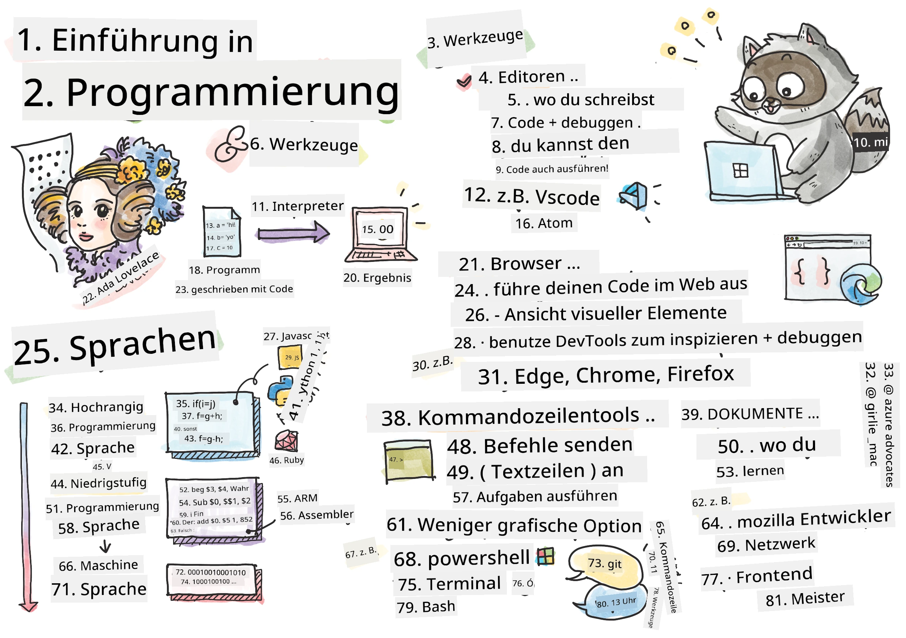
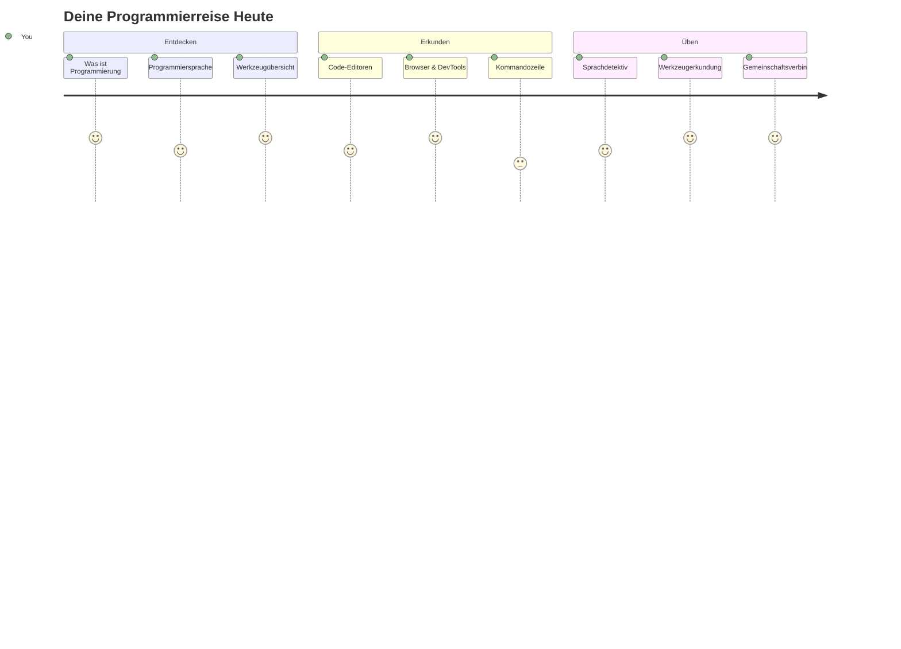
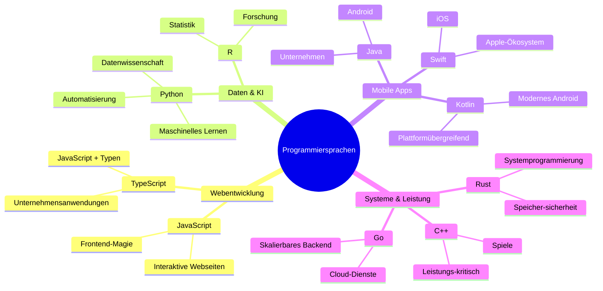
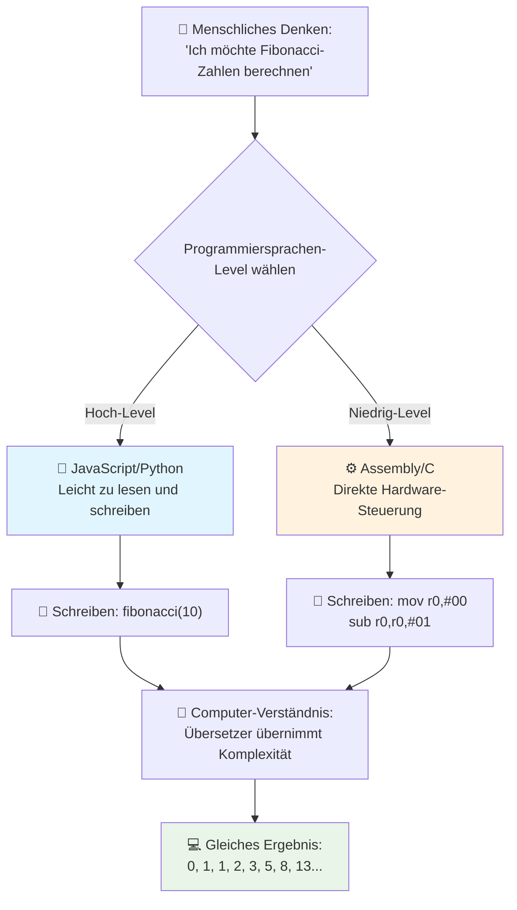
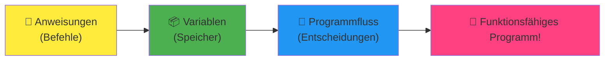
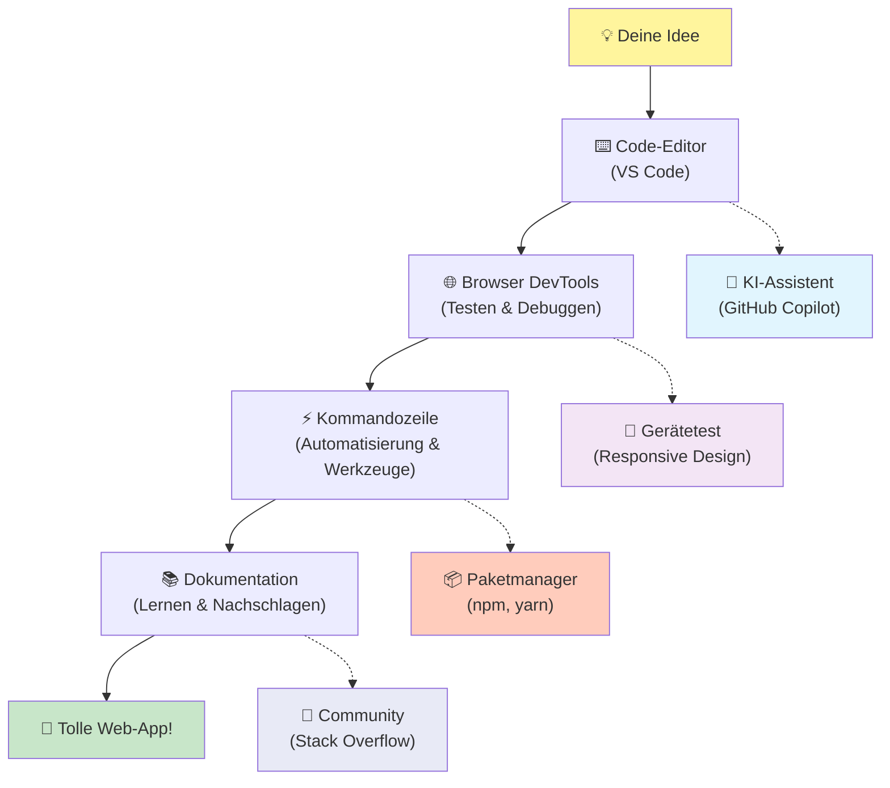
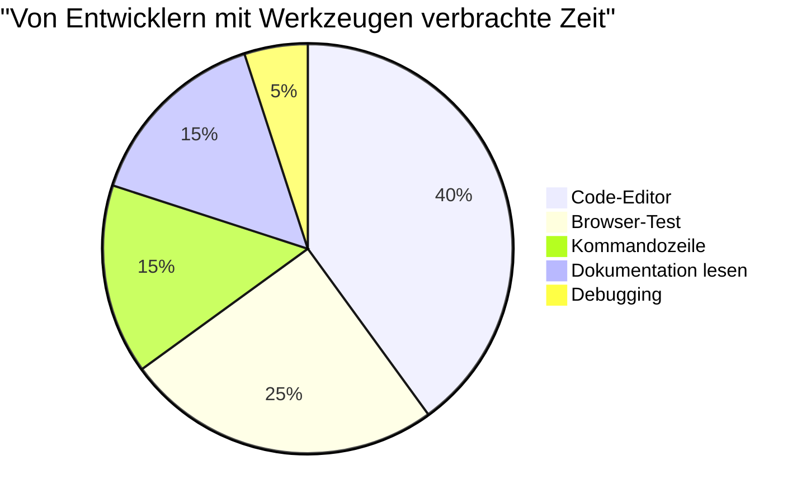

# Einführung in Programmiersprachen und moderne Entwicklerwerkzeuge
 
Hallo du zukünftiger Entwickler! 👋 Darf ich dir etwas erzählen, das mir jeden Tag aufs Neue Gänsehaut bereitet? Du wirst gleich entdecken, dass Programmieren nicht nur etwas mit Computern zu tun hat – es ist, als hätte man echte Superkräfte, um seine kühnsten Ideen zum Leben zu erwecken!

Kennst du diesen Moment, wenn du deine Lieblings-App benutzt und einfach alles perfekt zusammenpasst? Wenn du auf einen Knopf tippst und etwas absolut Magisches passiert, das dich denken lässt: „Wow, wie haben die das eigentlich gemacht?“ Nun, jemand genau wie du – wahrscheinlich gerade um 2 Uhr morgens in seinem Lieblingscafé mit dem dritten Espresso – hat den Code geschrieben, der diese Magie erschaffen hat. Und jetzt kommt etwas, das dir den Kopf sprengen wird: Am Ende dieser Lektion wirst du nicht nur verstehen, wie sie das gemacht haben, sondern du wirst es selbst ausprobieren wollen!

Schau, ich verstehe total, wenn dir Programmieren jetzt noch einschüchternd vorkommt. Als ich angefangen habe, dachte ich ehrlich, man müsse ein Mathe-Genie sein oder seit fünf Jahren coden. Aber dann hat sich meine Sicht komplett geändert: Programmieren ist genau wie das Lernen einer neuen Sprache. Du fängst mit „Hallo“ und „Danke“ an, dann lernst du, einen Kaffee zu bestellen, und bevor du es merkst, führst du tiefgründige philosophische Gespräche! Nur dass du in diesem Fall Gespräche mit Computern führst, und ehrlich? Sie sind die geduldigsten Gesprächspartner, die es gibt – sie verurteilen deine Fehler nie und sind immer bereit, es nochmal zu versuchen!

Heute werden wir die unglaublichen Werkzeuge erkunden, die moderne Webentwicklung nicht nur möglich, sondern richtig süchtig machend machen. Ich spreche von genau denselben Editoren, Browsern und Arbeitsabläufen, die Entwickler bei Netflix, Spotify und deinem Lieblings-Indie-App-Studio jeden Tag benutzen. Und jetzt kommt das, was dich einen Freudentanz machen lässt: Die meisten dieser professionellen, branchenüblichen Werkzeuge sind komplett kostenlos!


> Sketchnote von [Tomomi Imura](https://twitter.com/girlie_mac)


```mermaid
journey
    title Deine Programmierreise Heute
    section Entdecken
      Was ist Programmierung: 5: You
      Programmiersprachen: 4: You
      Werkzeugübersicht: 5: You
    section Erkunden
      Code-Editoren: 4: You
      Browser & DevTools: 5: You
      Kommandozeile: 3: You
    section Üben
      Sprachdetektiv: 4: You
      Werkzeugerkundung: 5: You
      Gemeinschaftsverbindung: 5: You
```
## Mal sehen, was du schon weißt!

Bevor wir in den Spaß eintauchen, bin ich neugierig – was weißt du schon über diese Programmierwelt? Und hör zu, wenn du diese Fragen liest und denkst: „Ich habe wirklich keine Ahnung von dem Ganzen,“ dann ist das nicht nur okay, das ist perfekt! Das bedeutet, du bist genau am richtigen Ort. Sieh dieses Quiz wie ein Aufwärmen vor dem Training – wir dehnen gerade unsere Denkmuskeln!

[Nimm am Pre-Lesson-Quiz teil](https://ff-quizzes.netlify.app/web/)


## Das Abenteuer, das wir zusammen erleben werden

Okay, ich bin wirklich total aufgeregt, was wir heute alles entdecken werden! Ehrlich, ich wünschte, ich könnte dein Gesicht sehen, wenn dir manche dieser Konzepte klar werden. Hier ist die unglaubliche Reise, die wir gemeinsam antreten:

- **Was Programmieren eigentlich ist (und warum es das coolste überhaupt ist!)** – Wir werden entdecken, wie Code buchstäblich die unsichtbare Magie ist, die alles um dich herum antreibt, von deinem Wecker, der irgendwie weiß, dass Montagmorgen ist, bis hin zu dem Algorithmus, der deine Netflix-Empfehlungen perfekt trifft
- **Programmiersprachen und ihre großartigen Persönlichkeiten** – Stell dir vor, du kommst zu einer Party, bei der jede Person ganz unterschiedliche Superkräfte und Lösungswege hat. So ist die Welt der Programmiersprachen, und du wirst es lieben, sie kennenzulernen!
- **Die grundlegenden Bausteine, die digitale Magie möglich machen** – Stell dir das als das ultimative kreative LEGO-Set vor. Wenn du weißt, wie diese Teile zusammenpassen, wirst du erkennen, dass du buchstäblich alles bauen kannst, was deine Fantasie sich ausdenkt
- **Professionelle Werkzeuge, die dich fühlen lassen, als hättest du gerade einen Zauberstab bekommen** – Ich übertreibe nicht – diese Werkzeuge geben dir wirklich das Gefühl, Superkräfte zu haben, und das Beste? Es sind dieselben, die die Profis benutzen!

> 💡 **Hier das Wichtigste**: Versuch heute nicht alles auswendig zu lernen! Im Moment möchte ich nur, dass du dieses Funken von Begeisterung spürst, was alles möglich ist. Die Details setzen sich ganz von selbst fest, wenn wir zusammen üben – so funktioniert echtes Lernen!

> Du kannst diese Lektion auch auf [Microsoft Learn](https://learn.microsoft.com/en-us/learn/modules/web-development-101/introduction-programming/?WT.mc_id=academic-77807-sagibbon) machen!

## Also, was genau *ist* Programmieren eigentlich?

Okay, wir gehen die eine Million-Dollar-Frage an: Was ist Programmieren wirklich?

Ich erzähle dir eine Geschichte, die meine Sichtweise komplett verändert hat. Letzte Woche habe ich meiner Mutter erklärt, wie man unsere neue Smart-TV-Fernbedienung benutzt. Ich ertappte mich dabei, Dinge zu sagen wie: „Drück den roten Knopf, aber nicht den großen roten Knopf, den kleinen roten links... nein, dein anderes links... okay, jetzt halte ihn zwei Sekunden, nicht eine, nicht drei...“ Kommt dir das bekannt vor? 😅

Das ist Programmieren! Es ist die Kunst, unglaublich detaillierte Schritt-für-Schritt-Anweisungen zu geben – an etwas, das sehr mächtig ist, aber jede Kleinigkeit genau erklärt bekommen muss. Nur dass du nicht deiner Mutter erklärst (die fragen kann: „Welcher rote Knopf?!“), sondern einem Computer (der genau das macht, was du sagst, auch wenn das nicht ganz das war, was du meintest).

Das, was bei mir für Gänsehaut sorgte, als ich das zum ersten Mal verstanden habe: Computer sind im Kern eigentlich ziemlich einfach. Sie verstehen buchstäblich nur zwei Dinge – 1 und 0, was so viel bedeutet wie „ja“ und „nein“ oder „an“ und „aus“. Und das war’s! Aber hier wird es magisch – wir müssen nicht in 1en und 0en sprechen, als wären wir in "The Matrix". Hier kommen **Programmiersprachen** ins Spiel. Sie sind wie der weltbeste Übersetzer, der deine ganz normalen menschlichen Gedanken nimmt und sie in Computersprache umwandelt.

Und das, was mir jeden Morgen wieder echte Gänsehaut bereitet: buchstäblich *alles* Digitale in deinem Leben hat mit jemandem angefangen, der genau wie du war, wahrscheinlich im Schlafanzug, mit einer Tasse Kaffee, und der gerade Code auf seinem Laptop getippt hat. Dieser Instagram-Filter, der dich makellos aussehen lässt? Jemand hat den Code dafür geschrieben. Die Empfehlung, die dich zu deinem neuen Lieblingssong geführt hat? Ein Entwickler hat diesen Algorithmus gebaut. Die App, mit der du die Rechnung beim Abendessen mit Freunden aufteilst? Ja, jemand hat gedacht: „Das nervt, das kann ich besser machen“ – und dann... hat er es getan!

Wenn du programmieren lernst, nimmst du nicht nur eine neue Fähigkeit auf – du wirst Teil einer unglaublichen Community von Problemlösern, die ihren Tag damit verbringen, zu denken: „Was wäre, wenn ich etwas bauen könnte, das jemandes Tag ein bisschen besser macht?“ Ehrlich, gibt es etwas Cooleres?

✅ **Spaßige Fakten-Suche**: Hier ist etwas super Cooles, das du dir anschauen kannst, wenn du einen Moment Zeit hast – Wer war wohl der erste Computerprogrammierer der Welt? Ich gebe dir einen Tipp: Es ist wahrscheinlich nicht die Person, die du erwartest! Die Geschichte dieser Person ist absolut faszinierend und zeigt, dass Programmieren schon immer kreatives Problemlösen und Querdenken war.

### 🧠 **Check-in: Wie fühlst du dich?**

**Nimm dir einen Moment zum Nachdenken:**
- Macht die Idee, „Anweisungen an Computer zu geben“, jetzt Sinn für dich?
- Kannst du dir eine tägliche Aufgabe vorstellen, die du mit Programmieren automatisieren möchtest?
- Welche Fragen kommen dir gerade in den Sinn beim Thema Programmieren?

> **Denk daran**: Es ist völlig normal, wenn einige Konzepte gerade noch unklar sind. Programmieren lernen ist wie eine neue Sprache lernen – es braucht Zeit, bis das Gehirn diese neuen Verbindungen aufbaut. Du machst das super!

## Programmiersprachen sind wie verschiedene Geschmacksrichtungen von Magie

Okay, das wird jetzt komisch klingen, aber bleib dran – Programmiersprachen sind wie verschiedene Musikrichtungen. Denk mal drüber nach: Du hast Jazz, der geschmeidig und improvisiert ist, Rock, der kraftvoll und direkt ist, Klassik, die elegant und strukturiert ist, und Hip-Hop, der kreativ und ausdrucksstark ist. Jeder Stil hat seine eigene Stimmung, seine eigene Community begeisterter Fans, und jede passt zu unterschiedlichen Stimmungen und Anlässen.

Programmiersprachen funktionieren genau so! Du würdest nicht dieselbe Sprache benutzen, um ein spaßiges Handyspiel zu bauen, wie du sie für die Verarbeitung riesiger Klimadatenmengen nutzen würdest – so wie du nicht Death Metal zum Yoga hören würdest (naja, bei den meisten Yogakursen jedenfalls! 😄).

Aber hier kommt das, was mich jedes Mal umhaut, wenn ich darüber nachdenke: Diese Sprachen sind wie der geduldigste, brillanteste Dolmetscher der Welt, der direkt neben dir sitzt. Du kannst deine Ideen so ausdrücken, wie es deinem menschlichen Gehirn natürlich erscheint, und sie übernehmen die unglaublich komplexe Arbeit, das in die 1en und 0en umzusetzen, die Computer tatsächlich sprechen. Es ist, als hättest du einen Freund, der perfekt „menschliche Kreativität“ und „Computersprache“ beherrscht – und der wird nie müde, braucht keine Kaffeepausen und verurteilt dich nie, wenn du dieselbe Frage zweimal stellst!

### Beliebte Programmiersprachen und ihre Einsatzgebiete


```mermaid
mindmap
  root((Programmiersprachen))
    Webentwicklung
      JavaScript
        Frontend-Magie
        Interaktive Webseiten
      TypeScript
        JavaScript + Typen
        Unternehmensanwendungen
    Daten & KI
      Python
        Datenwissenschaft
        Maschinelles Lernen
        Automatisierung
      R
        Statistik
        Forschung
    Mobile Apps
      Java
        Android
        Unternehmen
      Swift
        iOS
        Apple-Ökosystem
      Kotlin
        Modernes Android
        Plattformübergreifend
    Systeme & Leistung
      C++
        Spiele
        Leistungs-kritisch
      Rust
        Speicher-sicherheit
        Systemprogrammierung
      Go
        Cloud-Dienste
        Skalierbares Backend
```
| Sprache | Am besten geeignet für | Warum sie beliebt ist |
|----------|-----------------------|---------------------|
| **JavaScript** | Webentwicklung, Benutzeroberflächen | Läuft in Browsern und macht interaktive Websites möglich |
| **Python** | Datenwissenschaft, Automatisierung, KI | Einfach zu lesen und zu lernen, mächtige Bibliotheken |
| **Java** | Unternehmensanwendungen, Android-Apps | Plattformunabhängig, robust für große Systeme |
| **C#** | Windows-Anwendungen, Spieleentwicklung | Starke Unterstützung im Microsoft-Ökosystem |
| **Go** | Cloud-Dienste, Backend-Systeme | Schnell, einfach, für modernes Computing entwickelt |

### Hochsprachen vs. Maschinennah

Okay, das war ehrlich gesagt das Konzept, das mich am Anfang völlig verwirrt hat. Ich werde dir jetzt die Analogie erzählen, die mir endlich geholfen hat – ich hoffe, sie hilft dir auch!

Stell dir vor, du bist in einem Land, dessen Sprache du nicht sprichst, und du musst dringend die nächste Toilette finden (das kennen wir doch alle, oder? 😅):

- **Maschinennahe Programmierung** ist, als würdest du den lokalen Dialekt so gut lernen, dass du mit der Großmutter am Obststand auf der Ecke sprichst – mit kulturellen Anspielungen, lokalem Slang und Insider-Witzen, die nur jemand versteht, der dort aufgewachsen ist. Super beeindruckend und unglaublich effizient ... wenn du zufällig fließend bist! Aber ziemlich überwältigend, wenn du eigentlich nur eine Toilette suchst.

- **Hochsprachen** sind wie dieser wunderbare lokale Freund, der dich einfach versteht. Du sagst einfach auf Englisch: „Ich muss dringend auf die Toilette,“ und er übersetzt alles kulturell und gibt dir Wegbeschreibungen, die deinem nicht-lokalen Gehirn vollkommen Sinn machen.

In Programmierbegriffen:
- **Maschinennahe Sprachen** (wie Assembly oder C) lassen dich extrem detailliert mit der Hardware des Computers sprechen, aber du musst wie eine Maschine denken, was... naja, sagen wir mal, ein ziemlich großer mentaler Wandel ist!
- **Hochsprachen** (wie JavaScript, Python oder C#) lassen dich wie ein Mensch denken, während sie hinter den Kulissen die Maschinensprache übernehmen. Außerdem haben sie unglaublich freundliche Communities mit Leuten, die sich daran erinnern, wie es ist, neu zu sein, und die dir echt helfen wollen!

Rate mal, mit welchen ich vorschlagen werde, dass du anfängst? 😉 Hochsprachen sind wie Stützräder, die du eigentlich nie abnehmen willst, weil sie das Ganze so viel angenehmer machen!


```mermaid
flowchart TB
    A["👤 Menschliches Denken:<br/>'Ich möchte Fibonacci-Zahlen berechnen'"] --> B{Programmiersprachen-Level wählen}
    
    B -->|Hoch-Level| C["🌟 JavaScript/Python<br/>Leicht zu lesen und schreiben"]
    B -->|Niedrig-Level| D["⚙️ Assembly/C<br/>Direkte Hardware-Steuerung"]
    
    C --> E["📝 Schreiben: fibonacci(10)"]
    D --> F["📝 Schreiben: mov r0,#00<br/>sub r0,r0,#01"]
    
    E --> G["🤖 Computer-Verständnis:<br/>Übersetzer übernimmt Komplexität"]
    F --> G
    
    G --> H["💻 Gleiches Ergebnis:<br/>0, 1, 1, 2, 3, 5, 8, 13..."]
    
    style C fill:#e1f5fe
    style D fill:#fff3e0
    style H fill:#e8f5e8
```
### Ich zeige dir, warum Hochsprachen viel freundlicher sind

Okay, ich zeige dir gleich etwas, das perfekt demonstriert, warum ich mich in Hochsprachen verliebt habe. Aber vorher – versprich mir eins: Wenn du das erste Codebeispiel siehst, gerate nicht in Panik! Es soll einschüchternd aussehen. Genau das will ich zeigen!

Wir schauen uns dieselbe Aufgabe in zwei komplett verschiedenen Stilen an. Beide erzeugen die sogenannte Fibonacci-Folge – das ist ein wunderschönes mathematisches Muster, bei dem jede Zahl die Summe der beiden vorherigen ist: 0, 1, 1, 2, 3, 5, 8, 13... (Fun Fact: Dieses Muster findest du buchstäblich überall in der Natur – Sonnenblumenkerne, Tannenzapfenmuster, sogar wie Galaxien sich formen!)

Bereit, den Unterschied zu sehen? Los geht’s!

**Hochsprache (JavaScript) – menschenfreundlich:**

```javascript
// Schritt 1: Grundlegende Fibonacci-Einrichtung
const fibonacciCount = 10;
let current = 0;
let next = 1;

console.log('Fibonacci sequence:');
```

**Das macht dieser Code:**
- **Deklariert** eine Konstante, die angibt, wie viele Fibonacci-Zahlen generiert werden sollen
- **Initialisiert** zwei Variablen, um die aktuelle und die nächste Zahl der Folge zu verfolgen
- **Setzt** die Startwerte (0 und 1), die das Fibonacci-Muster definieren
- **Zeigt** eine Kopfzeile zur Kennzeichnung unserer Ausgabe an

```javascript
// Schritt 2: Erzeuge die Sequenz mit einer Schleife
for (let i = 0; i < fibonacciCount; i++) {
  console.log(`Position ${i + 1}: ${current}`);
  
  // Berechne die nächste Zahl in der Sequenz
  const sum = current + next;
  current = next;
  next = sum;
}
```

**So funktioniert das im Detail:**
- **Schleife** durch jede Position der Folge mit einer `for`-Schleife
- **Zeigt** jede Zahl mit ihrer Position mithilfe von Template Literals an
- **Berechnet** die nächste Fibonacci-Zahl durch Addition der aktuellen und nächsten Werte
- **Aktualisiert** die Variablen, um zur nächsten Iteration überzugehen

```javascript
// Schritt 3: Moderner funktionaler Ansatz
const generateFibonacci = (count) => {
  const sequence = [0, 1];
  
  for (let i = 2; i < count; i++) {
    sequence[i] = sequence[i - 1] + sequence[i - 2];
  }
  
  return sequence;
};

// Anwendungsbeispiel
const fibSequence = generateFibonacci(10);
console.log(fibSequence);
```

**Oben haben wir:**
- **Eine wiederverwendbare Funktion** mit moderner Arrow Function Syntax erstellt
- **Ein Array gebaut,** um die komplette Folge statt einzeln auszugeben, zu speichern
- **Array-Indizierung benutzt,** um jede neue Zahl aus den vorherigen Werten zu berechnen
- **Die komplette Folge zurückgegeben,** damit wir sie flexibel an anderen Stellen im Programm nutzen können

**Maschinennahe Sprache (ARM Assembly) – computerfreundlich:**

```assembly
 area ascen,code,readonly
 entry
 code32
 adr r0,thumb+1
 bx r0
 code16
thumb
 mov r0,#00
 sub r0,r0,#01
 mov r1,#01
 mov r4,#10
 ldr r2,=0x40000000
back add r0,r1
 str r0,[r2]
 add r2,#04
 mov r3,r0
 mov r0,r1
 mov r1,r3
 sub r4,#01
 cmp r4,#00
 bne back
 end
```

Auffällig ist, wie die JavaScript-Version fast wie englische Anweisungen liest, während die Assembly-Version kryptische Befehle verwendet, die direkt den Prozessor des Computers steuern. Beide erledigen exakt dieselbe Aufgabe, aber die Hochsprache ist für Menschen viel leichter zu verstehen, zu schreiben und zu pflegen.

**Wesentliche Unterschiede, die du bemerken wirst:**
- **Lesbarkeit**: JavaScript verwendet beschreibende Namen wie `fibonacciCount`, während Assembly kryptische Bezeichnungen wie `r0`, `r1` nutzt
- **Kommentare**: Hochsprachen fördern erklärende Kommentare, die den Code selbstdokumentierend machen
- **Struktur**: JavaScripts logischer Ablauf entspricht der Art, wie Menschen Probleme Schritt für Schritt denken
- **Wartung**: Die Aktualisierung der JavaScript-Version für unterschiedliche Anforderungen ist unkompliziert und klar

✅ **Über die Fibonacci-Folge**: Dieses absolut wunderschöne Zahlenmuster (bei dem jede Zahl der Summe der beiden vorherigen entspricht: 0, 1, 1, 2, 3, 5, 8...) taucht buchstäblich *überall* in der Natur auf! Du findest es in Sonnenblumenspiralen, Tannenzapfenmustern, der Art, wie Nautilus-Schalen sich winden, und sogar darin, wie sich Baumzweige entwickeln. Es ist ziemlich beeindruckend, wie Mathematik und Code uns helfen können, die Muster zu verstehen und nachzubilden, mit denen die Natur Schönheit erschafft!


## Die Bausteine, die die Magie Wirklichkeit werden lassen

Okay, jetzt wo du gesehen hast, wie Programmiersprachen in Aktion aussehen, lass uns die grundlegenden Bestandteile zerlegen, aus denen buchstäblich jedes jemals geschriebene Programm besteht. Denk daran wie an die wesentlichen Zutaten in deinem Lieblingsrezept – wenn du verstehst, was jede einzelne tut, wirst du in der Lage sein, Code in so gut wie jeder Sprache zu lesen und zu schreiben!

Das ist so ähnlich wie die Grammatik des Programmierens zu lernen. Erinnerst du dich noch aus der Schule, als du Nomen, Verben und Satzbau gelernt hast? Programmieren hat seine eigene Version von Grammatik, und ehrlich gesagt ist sie viel logischer und nachsichtiger als die englische Grammatik jemals war! 😄

### Anweisungen: Schritt-für-Schritt-Anleitungen

Beginnen wir mit **Statements** – sie sind wie einzelne Sätze in einem Gespräch mit deinem Computer. Jede Anweisung sagt dem Computer, genau eine bestimmte Sache zu tun, ähnlich wie Wegbeschreibungen: „Hier links abbiegen“, „An der Ampel anhalten“, „Auf diesem Parkplatz parken“.

Was ich an Statements liebe, ist, wie lesbar sie meist sind. Schau dir das an:

```javascript
// Grundlegende Anweisungen, die einzelne Aktionen ausführen
const userName = "Alex";                    
console.log("Hello, world!");              
const sum = 5 + 3;                         
```

**Das macht dieser Code:**
- **Deklariert** eine konstante Variable, um den Namen eines Benutzers zu speichern
- **Gibt** eine Begrüßungsmeldung auf der Konsole aus
- **Berechnet** und speichert das Ergebnis einer mathematischen Operation

```javascript
// Anweisungen, die mit Webseiten interagieren
document.title = "My Awesome Website";      
document.body.style.backgroundColor = "lightblue";
```

**Schritt für Schritt passiert Folgendes:**
- **Ändert** den Titel der Webseite, der im Browser-Tab angezeigt wird
- **Verändert** die Hintergrundfarbe des gesamten Seitenkörpers

### Variablen: Das Speicher-System deines Programms

Okay, **Variablen** sind ehrlich gesagt eines meiner absoluten Lieblingskonzepte zu vermitteln, weil sie so sehr wie Dinge funktionieren, die du jeden Tag benutzt!

Denk mal kurz an dein Telefonbuch. Du merkst dir nicht jede Telefonnummer – stattdessen speicherst du „Mama“, „Bester Freund“ oder „Pizzaservice, der bis 2 Uhr nachts liefert“ und lässt dein Telefon sich die tatsächlichen Nummern merken. Variablen funktionieren genau so! Sie sind wie beschriftete Behälter, in denen dein Programm Informationen speichern und später mit einem Namen abrufen kann, der tatsächlich Sinn ergibt.

Das wirklich Coole: Variablen können sich ändern, während dein Programm läuft (daher der Name „variabel“ – hast du das gesehen?). So wie du den Kontakt zum Pizzaservice aktualisieren kannst, wenn du einen besseren findest, können Variablen aktualisiert werden, wenn dein Programm neue Informationen erfährt oder sich die Situation ändert!

Ich zeige dir, wie schön einfach das sein kann:

```javascript
// Schritt 1: Erstellen grundlegender Variablen
const siteName = "Weather Dashboard";        
let currentWeather = "sunny";               
let temperature = 75;                       
let isRaining = false;                      
```

**Diese Konzepte verstehen:**
- **Speichere** unveränderliche Werte in `const`-Variablen (wie den Namen der Webseite)
- **Verwende** `let` für Werte, die sich während des Programms ändern können
- **Weise zu** verschiedene Datentypen zu: Strings (Text), Zahlen und Booleans (wahr/falsch)
- **Wähle** beschreibende Namen, die erklären, was jede Variable enthält

```javascript
// Schritt 2: Arbeiten mit Objekten, um zusammengehörige Daten zu gruppieren
const weatherData = {                       
  location: "San Francisco",
  humidity: 65,
  windSpeed: 12
};
```

**Im oberen Beispiel haben wir:**
- **Ein Objekt erstellt**, um zusammengehörige Wetterinformationen zu gruppieren
- **Mehrere Datenstücke** unter einem Variablennamen organisiert
- **Schlüssel-Wert-Paare verwendet**, um jede Information klar zu beschriften

```javascript
// Schritt 3: Verwendung und Aktualisierung von Variablen
console.log(`${siteName}: Today is ${currentWeather} and ${temperature}°F`);
console.log(`Wind speed: ${weatherData.windSpeed} mph`);

// Aktualisierung änderbarer Variablen
currentWeather = "cloudy";                  
temperature = 68;                          
```

**Schauen wir uns jeden Teil an:**
- **Gib** Informationen mit Template Literals und der `${}`-Syntax aus
- **Greife** auf Eigenschaften von Objekten über Punktnotation zu (`weatherData.windSpeed`)
- **Aktualisiere** Variablen, die mit `let` deklariert wurden, um sich ändernde Bedingungen widerzuspiegeln
- **Kombiniere** mehrere Variablen, um aussagekräftige Nachrichten zu erstellen

```javascript
// Schritt 4: Modernes Destructuring für saubereren Code
const { location, humidity } = weatherData; 
console.log(`${location} humidity: ${humidity}%`);
```

**Das solltest du wissen:**
- **Extrahiere** spezifische Eigenschaften von Objekten mit Destructuring Assignment
- **Erstelle** automatisch neue Variablen mit genau den gleichen Namen wie Objektschlüssel
- **Vereinfache** Code, indem du Wiederholungen der Punktnotation vermeidest

### Steuerung des Programmflusses: Deinem Programm das Denken beibringen

Okay, hier wird Programmieren absolut beeindruckend! **Control Flow** ist im Grunde genommen, deinem Programm beizubringen, wie es kluge Entscheidungen trifft – genau so, wie du es jeden Tag tust, ohne darüber nachzudenken.

Stell dir vor: Heute Morgen hast du bestimmt so gedacht: „Wenn es regnet, nehme ich einen Regenschirm. Wenn es kalt ist, ziehe ich eine Jacke an. Wenn ich spät dran bin, überspringe ich das Frühstück und hole unterwegs einen Kaffee.“ Dein Hirn folgt natürlich genau dieser Wenn-Dann-Logik dutzende Male am Tag!

Genau das lässt Programme intelligent und lebendig wirken, anstatt einfach nur einem langweiligen, vorhersehbaren Skript zu folgen. Sie können sich eine Situation anschauen, bewerten, was passiert, und entsprechend reagieren. Es ist, als würdest du deinem Programm ein Gehirn geben, das sich anpassen und Entscheidungen treffen kann!

Willst du sehen, wie schön das funktioniert? Hier:

```javascript
// Schritt 1: Grundlegende bedingte Logik
const userAge = 17;

if (userAge >= 18) {
  console.log("You can vote!");
} else {
  const yearsToWait = 18 - userAge;
  console.log(`You'll be able to vote in ${yearsToWait} year(s).`);
}
```

**Dieser Code macht Folgendes:**
- **Prüft**, ob das Alter des Benutzers die Wahlberechtigung erfüllt
- **Führt** je nach Bedingung unterschiedliche Code-Blöcke aus
- **Berechnet** und zeigt an, wie lange es noch bis zur Wahlberechtigung dauert, falls unter 18
- **Gibt** spezifisches, hilfreiches Feedback für jedes Szenario

```javascript
// Schritt 2: Mehrere Bedingungen mit logischen Operatoren
const userAge = 17;
const hasPermission = true;

if (userAge >= 18 && hasPermission) {
  console.log("Access granted: You can enter the venue.");
} else if (userAge >= 16) {
  console.log("You need parent permission to enter.");
} else {
  console.log("Sorry, you must be at least 16 years old.");
}
```

**Das passiert hier im Detail:**
- **Kombiniere** mehrere Bedingungen mit dem `&&` (und) Operator
- **Erstelle** eine Bedingungshierarchie mit `else if` für mehrere Szenarien
- **Behandle** alle möglichen Fälle mit einem abschließenden `else`-Statement
- **Gib** klare, handlungsorientierte Rückmeldungen für jede Situation

```javascript
// Schritt 3: Prägnante Bedingung mit ternärem Operator
const votingStatus = userAge >= 18 ? "Can vote" : "Cannot vote yet";
console.log(`Status: ${votingStatus}`);
```

**Das solltest du dir merken:**
- **Nutze** den ternären Operator (`? :`) für einfache Zwei-Optionen-Entscheidungen
- **Schreibe** zuerst die Bedingung, dann `?`, dann das Ergebnis, wenn wahr, dann `:`, dann das Ergebnis, wenn falsch
- **Wende** dieses Muster an, wenn du Werte aufgrund von Bedingungen zuweisen musst

```javascript
// Schritt 4: Umgang mit mehreren spezifischen Fällen
const dayOfWeek = "Tuesday";

switch (dayOfWeek) {
  case "Monday":
  case "Tuesday":
  case "Wednesday":
  case "Thursday":
  case "Friday":
    console.log("It's a weekday - time to work!");
    break;
  case "Saturday":
  case "Sunday":
    console.log("It's the weekend - time to relax!");
    break;
  default:
    console.log("Invalid day of the week");
}
```

**Dieser Code bewirkt:**
- **Vergleiche** den Variablenwert mit mehreren spezifischen Fällen
- **Gruppiere** ähnliche Fälle (Wochentage vs. Wochenende)
- **Führe** den passenden Codeblock aus, sobald eine Übereinstimmung vorliegt
- **Enthält** einen `default`-Fall, um unerwartete Werte zu behandeln
- **Verwende** `break`-Statements, um das Weiterschalten zum nächsten Fall zu verhindern

> 💡 **Analogie aus dem echten Leben**: Denk an Control Flow wie an das geduldigste Navi der Welt, das dir Anweisungen gibt. Es könnte sagen: „Wenn auf der Hauptstraße Stau ist, nimm lieber die Autobahn. Wenn dort eine Baustelle ist, versuche die landschaftlich schönere Route.“ Programme verwenden genau diese Art von bedingter Logik, um intelligent auf unterschiedliche Situationen zu reagieren und den Nutzern stets das bestmögliche Erlebnis zu bieten.

### 🎯 **Concept Check: Beherrschung der Bausteine**

**Mal sehen, wie gut du die Grundlagen verstanden hast:**
- Kannst du den Unterschied zwischen einer Variable und einer Anweisung mit eigenen Worten erklären?
- Denk an ein reales Szenario, in dem du eine Wenn-Dann-Entscheidung treffen würdest (wie unser Beispiel mit der Wahlberechtigung)
- Was hat dich an der Programmierlogik am meisten überrascht?

**Schneller Selbstvertrauens-Booster:**

```mermaid
flowchart LR
    A["📝 Anweisungen<br/>(Befehle)"] --> B["📦 Variablen<br/>(Speicher)"] --> C["🔀 Programmfluss<br/>(Entscheidungen)"] --> D["🎉 Funktionsfähiges Programm!"]
    
    style A fill:#ffeb3b
    style B fill:#4caf50
    style C fill:#2196f3
    style D fill:#ff4081
```
✅ **Was als Nächstes kommt**: Wir werden richtig viel Spaß haben und tiefer in diese Konzepte eintauchen, während wir gemeinsam diese unglaubliche Reise fortsetzen! Im Moment konzentriere dich einfach darauf, diese Aufregung über all die erstaunlichen Möglichkeiten, die vor dir liegen, zu spüren. Die genauen Fähigkeiten und Techniken werden ganz natürlich mit der Übung kommen – ich verspreche dir, das wird viel mehr Spaß machen, als du vielleicht denkst!

## Werkzeuge des Handwerks

Okay, hier werde ich ehrlich so aufgeregt, dass ich mich kaum zurückhalten kann! 🚀 Wir werden gerade über die unglaublichen Werkzeuge sprechen, die dir das Gefühl geben, als hättest du gerade die Schlüssel zu einem digitalen Raumschiff bekommen.

Weißt du, wie ein Koch diese perfekt ausbalancierten Messer hat, die sich wie eine Verlängerung seiner Hände anfühlen? Oder wie ein Musiker diese eine Gitarre hat, die zu singen scheint, sobald er sie berührt? Nun, Entwickler haben ihre eigene Version dieser magischen Werkzeuge, und hier kommt etwas, das dir den Verstand sprengen wird – die meisten davon sind völlig kostenlos!

Ich bin praktisch auf meinem Stuhl hin und her gehüpft, weil ich sie mit dir teilen will, denn sie haben komplett revolutioniert, wie wir Software bauen. Wir reden von KI-gestützten Codierassistenten, die dir beim Schreiben deines Codes helfen können (kein Scherz!), Cloud-Umgebungen, in denen du ganze Anwendungen von buchstäblich überall mit WLAN bauen kannst, und Debugging-Werkzeugen, die so ausgeklügelt sind, als hättest du Röntgenblick für deine Programme.

Und das hier ist der Teil, der mir immer noch Gänsehaut macht: Das sind keine „Anfängerwerkzeuge“, die du schnell hinter dir lässt. Das sind genau die gleichen professionellen Tools, die Entwickler bei Google, Netflix und dem Indie-App-Studio, das du liebst, gerade in diesem Moment einsetzen. Du wirst dich wie ein richtiger Profi fühlen, wenn du sie benutzt!


```mermaid
graph TD
    A["💡 Deine Idee"] --> B["⌨️ Code-Editor<br/>(VS Code)"] 
    B --> C["🌐 Browser DevTools<br/>(Testen & Debuggen)"]
    C --> D["⚡ Kommandozeile<br/>(Automatisierung & Werkzeuge)"]
    D --> E["📚 Dokumentation<br/>(Lernen & Nachschlagen)"]
    E --> F["🚀 Tolle Web-App!"]
    
    B -.-> G["🤖 KI-Assistent<br/>(GitHub Copilot)"]
    C -.-> H["📱 Gerätetest<br/>(Responsive Design)"]
    D -.-> I["📦 Paketmanager<br/>(npm, yarn)"]
    E -.-> J["👥 Community<br/>(Stack Overflow)"]
    
    style A fill:#fff59d
    style F fill:#c8e6c9
    style G fill:#e1f5fe
    style H fill:#f3e5f5
    style I fill:#ffccbc
    style J fill:#e8eaf6
```
### Code-Editoren und IDEs: Deine neuen digitalen besten Freunde

Lass uns über Code-Editoren reden – die werden wirklich bald zu deinen Lieblingsplätzen zum Abhängen! Stell sie dir als deinen persönlichen Programmier-Rückzugsort vor, an dem du die meiste Zeit damit verbringst, deine digitalen Kreationen zu erschaffen und zu perfektionieren.

Aber hier ist das absolut Magische an modernen Editoren: Sie sind nicht einfach nur schicke Texteditoren. Sie sind wie der brillanteste, unterstützendste Mentor beim Programmieren, der 24/7 direkt neben dir sitzt. Sie fangen deine Tippfehler ab, bevor du sie überhaupt bemerkst, schlagen Verbesserungen vor, die dich wie ein Genie aussehen lassen, helfen dir zu verstehen, was jeder Codeabschnitt macht, und manche können sogar vorhersagen, was du gerade tippen willst und bieten an, deine Gedanken zu vervollständigen!

Ich erinnere mich noch, als ich die Autovervollständigung das erste Mal entdeckt habe – ich hatte das Gefühl, in der Zukunft zu leben. Du fängst an etwas zu tippen, und dein Editor sagt: „Hey, meintest du diese Funktion, die genau das tut, was du brauchst?“ Es ist, als hättest du einen Gedankenleser als Programmierbuddy!

**Was macht diese Editoren so unglaublich?**

Moderne Code-Editoren bieten eine beeindruckende Bandbreite an Funktionen, die deine Produktivität steigern:

| Funktion | Was sie macht | Warum sie hilft |
|---------|--------------|--------------|
| **Syntaxhervorhebung** | Färbt verschiedene Teile deines Codes | Macht Code leichter lesbar und Fehler schneller auffindbar |
| **Autovervollständigung** | Schlägt Code vor, während du tippst | Beschleunigt das Programmieren und reduziert Tippfehler |
| **Debugging-Werkzeuge** | Hilft dir, Fehler zu finden und zu beheben | Spart Stunden bei der Fehlersuche |
| **Erweiterungen** | Fügt spezialisierte Funktionen hinzu | Passe deinen Editor für jede Technologie an |
| **KI-Assistenten** | Schlagen Code und Erklärungen vor | Beschleunigt Lernen und Produktivität |

> 🎥 **Video-Ressource**: Willst du diese Tools in Aktion sehen? Schau dir dieses [Tools of the Trade Video](https://youtube.com/watch?v=69WJeXGBdxg) für eine umfassende Übersicht an.

#### Empfohlene Editoren für Webentwicklung

**[Visual Studio Code](https://code.visualstudio.com/?WT.mc_id=academic-77807-sagibbon)** (Kostenlos)
- Am beliebtesten bei Webentwicklern
- Hervorragendes Ökosystem von Erweiterungen
- Eingebautes Terminal und Git-Integration
- **Must-have-Erweiterungen**:
  - [GitHub Copilot](https://marketplace.visualstudio.com/items?itemName=GitHub.copilot) - KI-gestützte Codevorschläge
  - [Live Share](https://marketplace.visualstudio.com/items?itemName=MS-vsliveshare.vsliveshare) - Echtzeit-Zusammenarbeit
  - [Prettier](https://marketplace.visualstudio.com/items?itemName=esbenp.prettier-vscode) - Automatisches Codeformatieren
  - [Code Spell Checker](https://marketplace.visualstudio.com/items?itemName=streetsidesoftware.code-spell-checker) - Fängt Tippfehler in deinem Code auf

**[JetBrains WebStorm](https://www.jetbrains.com/webstorm/)** (Kostenpflichtig, kostenlos für Studierende)
- Fortschrittliche Debug- und Test-Werkzeuge
- Intelligente Codevervollständigung
- Eingebaute Versionskontrolle

**Cloud-basierte IDEs** (Verschiedene Preismodelle)
- [GitHub Codespaces](https://github.com/features/codespaces) - Vollständiges VS Code im Browser
- [Replit](https://replit.com/) - Perfekt zum Lernen und Teilen von Code
- [StackBlitz](https://stackblitz.com/) - Sofortige Full-Stack-Webentwicklung

> 💡 **Einstiegstipp**: Fang mit Visual Studio Code an – es ist kostenlos, in der Branche weit verbreitet und hat eine riesige Community, die hilfreiche Tutorials und Erweiterungen erstellt.


### Webbrowser: Dein geheimes Entwicklerlabor

Okay, mach dich darauf gefasst, völlig begeistert zu sein! Du hast Browser bisher benutzt, um durch Social Media zu scrollen und Videos zu schauen? Nun, es stellt sich heraus, dass sie all die Zeit ein unglaublich geheimes Entwicklerlabor versteckt hielten, nur darauf wartend, von dir entdeckt zu werden!

Jedes Mal, wenn du auf einer Webseite rechtsklickst und „Element untersuchen“ auswählst, öffnest du eine verborgene Welt von Entwicklerwerkzeugen, die ehrlich gesagt mächtiger sind als manche teure Software, für die ich früher hunderte von Euros bezahlt habe. Es ist, als würdest du entdecken, dass deine ganz normale Küche hinter einer geheimen Tür ein Labor eines Profikochs verbirgt!
Das erste Mal, als mir jemand die Browser-DevTools zeigte, habe ich ungefähr drei Stunden damit verbracht, einfach nur herumzuklicken und zu sagen: „WARTEN, DAS KANN ER AUCH?!“ Du kannst buchstäblich jede Website in Echtzeit bearbeiten, genau sehen, wie schnell alles lädt, testen, wie deine Seite auf verschiedenen Geräten aussieht, und sogar JavaScript debuggen wie ein absoluter Profi. Es ist wirklich umwerfend!

**Deshalb sind Browser dein geheimer Trumpf:**

Wenn du eine Website oder Webanwendung erstellst, musst du sehen, wie sie in der Praxis aussieht und sich verhält. Browser zeigen nicht nur deine Arbeit an, sondern liefern auch detailliertes Feedback über Performance, Barrierefreiheit und mögliche Probleme.

#### Browser Developer Tools (DevTools)

Moderne Browser enthalten umfassende Entwicklungssuiten:

| Tool-Kategorie | Was es tut | Beispielanwendung |
|---------------|--------------|------------------|
| **Element-Inspektor** | HTML/CSS in Echtzeit ansehen und bearbeiten | Stil anpassen, um sofortige Ergebnisse zu sehen |
| **Konsole** | Fehlermeldungen anzeigen und JavaScript testen | Probleme debuggen und mit Code experimentieren |
| **Netzwerk-Monitor** | Nachverfolgen, wie Ressourcen geladen werden | Performance und Ladezeiten optimieren |
| **Barrierefreiheitsprüfer** | Eingeschlossene Gestaltung testen | Sicherstellen, dass deine Seite für alle Nutzer funktioniert |
| **Gerätesimulator** | Vorschau auf verschiedenen Bildschirmgrößen | Responsives Design ohne mehrere Geräte testen |

#### Empfohlene Browser für die Entwicklung

- **[Chrome](https://developers.google.com/web/tools/chrome-devtools/)** – Branchenstandard DevTools mit umfangreicher Dokumentation
- **[Firefox](https://developer.mozilla.org/docs/Tools)** – Ausgezeichnete CSS Grid- und Barrierefreiheitswerkzeuge
- **[Edge](https://docs.microsoft.com/microsoft-edge/devtools-guide-chromium/?WT.mc_id=academic-77807-sagibbon)** – Basierend auf Chromium mit Microsofts Entwicklerressourcen

> ⚠️ **Wichtiger Test-Tipp**: Teste deine Websites immer in mehreren Browsern! Was in Chrome perfekt funktioniert, kann in Safari oder Firefox anders aussehen. Professionelle Entwickler testen in allen wichtigen Browsern, um konsistente Nutzererfahrungen zu gewährleisten.


### Kommandozeilen-Tools: Dein Zugang zu Entwickler-Superkräften

Okay, lass uns mal einen ganz ehrlichen Moment über die Kommandozeile haben, denn ich will, dass du das von jemandem hörst, der es wirklich versteht. Als ich sie zum ersten Mal sah – nur diesen schrecklichen schwarzen Bildschirm mit blinkendem Text – dachte ich buchstäblich: „Nein, auf keinen Fall! Das sieht aus wie aus einem Hackerfilm der 1980er, und ich bin bestimmt nicht schlau genug dafür!“ 😅

Aber hier ist, was ich damals gerne gesagt bekommen hätte und was ich dir jetzt sage: Die Kommandozeile ist nicht beängstigend – sie ist tatsächlich wie ein direktes Gespräch mit deinem Computer. Stell es dir vor wie den Unterschied zwischen Essen über eine schicke App mit Bildern und Menüs zu bestellen (was nett und einfach ist) und in dein Lieblingslokal zu gehen, wo der Koch genau weiß, was du magst, und dir etwas Perfektes zaubert, nur weil du „Überrasche mich mit etwas Tollem“ sagst.

Die Kommandozeile ist der Ort, an dem Entwickler sich wie absolute Zauberer fühlen. Du tippst ein paar scheinbar magische Worte (okay, es sind nur Befehle, aber sie fühlen sich magisch an!), drückst Enter, und BOOM – du hast ganze Projektstrukturen erstellt, leistungsstarke Tools aus aller Welt installiert oder deine App online für Millionen Zuschauer bereitgestellt. Sobald du den ersten Geschmack dieser Macht erhältst, ist es ehrlich gesagt ziemlich süchtig machend!

**Darum wird die Kommandozeile dein Lieblingswerkzeug sein:**

Während grafische Schnittstellen für viele Aufgaben großartig sind, glänzt die Kommandozeile bei Automatisierung, Präzision und Geschwindigkeit. Viele Entwicklungstools funktionieren hauptsächlich über Kommandozeilen-Schnittstellen, und sie effizient zu nutzen, kann deine Produktivität enorm steigern.

```bash
# Schritt 1: Erstellen und navigieren Sie zum Projektverzeichnis
mkdir my-awesome-website
cd my-awesome-website
```
  
**Das macht dieser Code:**
- **Erstelle** ein neues Verzeichnis namens "my-awesome-website" für dein Projekt
- **Wechsle** in das neu erstellte Verzeichnis, um mit der Arbeit zu beginnen

```bash
# Schritt 2: Projekt mit package.json initialisieren
npm init -y

# Moderne Entwicklungstools installieren
npm install --save-dev vite prettier eslint
npm install --save-dev @eslint/js
```
  
**Schritt für Schritt passiert Folgendes:**
- **Initialisiere** ein neues Node.js-Projekt mit Standardeinstellungen via `npm init -y`
- **Installiere** Vite als modernes Build-Tool für schnelle Entwicklung und Produktions-Builds
- **Füge hinzu** Prettier für automatische Code-Formatierung und ESLint für Code-Qualitätsprüfungen
- **Verwende** den `--save-dev`-Schalter, um diese als Entwicklungsabhängigkeiten zu markieren

```bash
# Schritt 3: Projektstruktur und Dateien erstellen
mkdir src assets
echo '<!DOCTYPE html><html><head><title>My Site</title></head><body><h1>Hello World</h1></body></html>' > index.html

# Entwicklungsserver starten
npx vite
```
  
**Oben haben wir:**
- **Organisiert** unser Projekt durch separate Ordner für Quellcode und Assets
- **Generiert** eine einfache HTML-Datei mit korrekter Dokumentstruktur
- **Gestartet** den Vite Development Server für Live Reloading und Hot Module Replacement

#### Essenzielle Kommandozeilen-Tools für Webentwicklung

| Tool | Zweck | Warum du es brauchst |
|------|---------|-----------------|
| **[Git](https://git-scm.com/)** | Versionskontrolle | Änderungen verfolgen, mit anderen zusammenarbeiten, Backup machen |
| **[Node.js & npm](https://nodejs.org/)** | JavaScript-Laufzeit & Paketmanagement | JavaScript außerhalb des Browsers ausführen, moderne Entwicklungstools installieren |
| **[Vite](https://vitejs.dev/)** | Build-Tool & Dev-Server | Blitzschnelle Entwicklung mit Hot Module Replacement |
| **[ESLint](https://eslint.org/)** | Code-Qualität | Automatisch Probleme im JavaScript finden und beheben |
| **[Prettier](https://prettier.io/)** | Code-Formatierung | Deinen Code konsistent formatiert und lesbar halten |

#### Plattform-spezifische Optionen

**Windows:**  
- **[Windows Terminal](https://docs.microsoft.com/windows/terminal/?WT.mc_id=academic-77807-sagibbon)** – Modernes, funktionsreiches Terminal  
- **[PowerShell](https://docs.microsoft.com/powershell/?WT.mc_id=academic-77807-sagibbon)** 💻 – Leistungsstarke Skriptumgebung  
- **[Eingabeaufforderung](https://learn.microsoft.com/windows-server/administration/windows-commands/windows-commands)** 💻 – Traditionelle Windows-Kommandozeile

**macOS:**  
- **[Terminal](https://support.apple.com/guide/terminal/)** 💻 – Eingebautes Terminal  
- **[iTerm2](https://iterm2.com/)** – Erweitertes Terminal mit zusätzlichen Features

**Linux:**  
- **[Bash](https://www.gnu.org/software/bash/)** 💻 – Standard Linux-Shell  
- **[KDE Konsole](https://docs.kde.org/trunk5/en/konsole/konsole/index.html)** – Fortgeschrittener Terminal-Emulator

> 💻 = Vorinstalliert im Betriebssystem

> 🎯 **Lernpfad**: Beginne mit Grundbefehlen wie `cd` (Verzeichnis wechseln), `ls` oder `dir` (Dateien auflisten) und `mkdir` (Ordner erstellen). Übe mit modernen Workflow-Befehlen wie `npm install`, `git status` und `code .` (aktuelles Verzeichnis im VS Code öffnen). Mit der Zeit wirst du automatisch fortgeschrittene Befehle und Automatisierungstechniken erlernen.


### Dokumentation: Dein immer verfügbarer Lernmentor

Okay, ich verrate dir ein kleines Geheimnis, das dir als Anfänger wirklich hilft: Selbst die erfahrensten Entwickler verbringen einen großen Teil ihrer Zeit mit dem Lesen von Dokumentationen. Und das nicht, weil sie nicht wissen, was sie tun – es ist eigentlich ein Zeichen von Weisheit!

Betrachte Dokumentation wie den Zugang zu den geduldigsten, fachkundigsten Lehrern der Welt, die rund um die Uhr erreichbar sind. Hängst du um 2 Uhr morgens an einem Problem fest? Die Dokumentation ist da mit einer virtuellen Umarmung und genau der Antwort, die du brauchst. Willst du etwas über eine coole neue Funktion lernen, von der alle sprechen? Die Dokumentation unterstützt dich mit Schritt-für-Schritt-Beispielen. Versuchst du zu verstehen, warum etwas so funktioniert, wie es funktioniert? Richtig geraten – die Dokumentation erklärt es so, dass es endlich klick macht!

Etwas, das meine Sichtweise komplett verändert hat: Die Webentwicklung verändert sich unglaublich schnell, und niemand (ich meine wirklich niemand!) hat alles auswendig gelernt. Ich habe Senior-Entwickler mit über 15 Jahren Erfahrung gesehen, wie sie grundlegende Syntax nachschlagen, und weißt du was? Das ist nicht peinlich – das ist schlau! Es geht nicht darum, ein perfektes Gedächtnis zu haben, sondern zu wissen, wo du verlässliche Antworten schnell findest und wie du sie anwendest.

**Hier passiert die echte Magie:**

Professionelle Entwickler verbringen einen bedeutenden Teil ihrer Zeit mit dem Lesen von Dokumentationen – nicht, weil sie nichts wissen, sondern weil die Webentwicklung sich so schnell weiterentwickelt, dass man kontinuierlich dazulernen muss. Gute Dokumentation hilft dir, nicht nur zu verstehen, *wie* man etwas verwendet, sondern auch *warum* und *wann*.

#### Essenzielle Dokumentationsressourcen

**[Mozilla Developer Network (MDN)](https://developer.mozilla.org/docs/Web)**  
- Der Goldstandard für Webtechnologie-Dokumentation  
- Umfassende Anleitungen zu HTML, CSS und JavaScript  
- Enthält Informationen zur Browserkompatibilität  
- Praktische Beispiele und interaktive Demos

**[Web.dev](https://web.dev)** (von Google)  
- Moderne Best Practices für Webentwicklung  
- Leitfäden zur Performance-Optimierung  
- Prinzipien zu Barrierefreiheit und inklusivem Design  
- Fallstudien aus echten Projekten

**[Microsoft Developer Documentation](https://docs.microsoft.com/microsoft-edge/#microsoft-edge-for-developers)**  
- Entwicklungsressourcen für den Edge-Browser  
- Progressive Web App-Anleitungen  
- Erkenntnisse zur plattformübergreifenden Entwicklung

**[Frontend Masters Learning Paths](https://frontendmasters.com/learn/)**  
- Strukturierte Lerncurricula  
- Videokurse von Branchenexperten  
- Praktische Programmierübungen

> 📚 **Lernstrategie**: Versuche nicht, Dokumentationen auswendig zu lernen – lerne vielmehr, wie du sie effizient navigierst. Speichere oft genutzte Referenzen als Lesezeichen und übe, Suchfunktionen zu verwenden, um schnell spezifische Informationen zu finden.

### 🔧 **Tool-Mastery-Check: Was spricht dich an?**

**Nimm dir einen Moment zum Nachdenken:**  
- Welches Tool möchtest du als Erstes ausprobieren? (Es gibt keine falsche Antwort!)  
- Fühlt sich die Kommandozeile immer noch einschüchternd an, oder bist du neugierig darauf?  
- Kannst du dir vorstellen, Browser-DevTools zu verwenden, um einen Blick hinter den Vorhang deiner Lieblings-Websites zu werfen?


```mermaid
pie title "Von Entwicklern mit Werkzeugen verbrachte Zeit"
    "Code-Editor" : 40
    "Browser-Test" : 25
    "Kommandozeile" : 15
    "Dokumentation lesen" : 15
    "Debugging" : 5
```  
> **Interessante Erkenntnis**: Die meisten Entwickler verbringen etwa 40 % ihrer Zeit im Code-Editor, aber achte mal darauf, wie viel Zeit fürs Testen, Lernen und Problemlösen draufgeht. Programmieren ist nicht nur Code schreiben – es geht darum, Erlebnisse zu gestalten!

✅ **Denkanstoß**: Hier noch etwas Interessantes zum Nachdenken – wie denkst du, unterscheiden sich Werkzeuge zum Erstellen von Websites (Entwicklung) von denen zum Gestalten ihres Aussehens (Design)? Es ist wie der Unterschied zwischen einem Architekten, der ein schönes Haus entwirft, und dem Bauunternehmer, der es tatsächlich baut. Beides ist wichtig, aber sie brauchen verschiedene Werkzeugkästen! Solches Denken hilft dir wirklich, das große Ganze zu sehen, wie Websites zum Leben erweckt werden.

## GitHub Copilot Agent Challenge 🚀

Benutze den Agent-Modus, um folgende Herausforderung zu lösen:

**Beschreibung:** Erkunde die Funktionen eines modernen Code-Editors oder einer IDE und zeige, wie sie deinen Workflow als Webentwickler verbessern kann.

**Aufgabe:** Wähle einen Code-Editor oder eine IDE (z. B. Visual Studio Code, WebStorm oder eine cloudbasierte IDE). Liste drei Funktionen oder Erweiterungen auf, die dir helfen, Code effizienter zu schreiben, zu debuggen oder zu warten. Erkläre jeweils kurz, wie sie deinen Workflow verbessern.

---

## 🚀 Herausforderung

**Alles klar, Detektiv, bereit für deinen ersten Fall?**

Jetzt, wo du diese großartige Grundlage hast, wartet ein Abenteuer, das dir zeigt, wie unglaublich vielfältig und faszinierend die Programmierwelt wirklich ist. Und hör zu – es geht hier noch nicht ums Programmieren, also kein Druck! Du bist ein Detektiv für Programmiersprachen auf deinem allerersten spannenden Fall!

**Deine Mission, solltest du sie annehmen:**  
1. **Sprach-Explorer werden**: Wähle drei Programmiersprachen aus komplett unterschiedlichen Bereichen – vielleicht eine für Webseiten, eine für mobile Apps und eine, die Daten für Wissenschaftler verarbeitet. Finde Beispiele derselben einfachen Aufgabe in allen drei Sprachen. Ich verspreche, du wirst total erstaunt sein, wie unterschiedlich sie aussehen können und trotzdem exakt dasselbe tun!  
2. **Ihre Ursprungsgeschichten entdecken**: Was macht jede Sprache besonders? Hier ein cooler Fakt: Jede einzelne Programmiersprache wurde geschaffen, weil jemand dachte: „Weißt du was? Es muss eine bessere Lösung für dieses spezielle Problem geben.“ Kannst du herausfinden, welche Probleme das waren? Manche Geschichten sind wirklich faszinierend!  
3. **Lerne die Communities kennen**: Schau dir an, wie einladend und leidenschaftlich jede Sprach-Community ist. Manche haben Millionen Entwickler, die Wissen teilen und sich helfen, andere sind kleiner, aber unglaublich eng verbunden und unterstützend. Du wirst lieben, die verschiedenen Persönlichkeiten dieser Communities zu sehen!  
4. **Folge deinem Bauchgefühl**: Welche Sprache fühlt sich gerade für dich am zugänglichsten an? Mach dir keinen Stress mit einer „perfekten“ Wahl – hör einfach auf dein Gefühl! Es gibt wirklich keine falsche Antwort hier, und später kannst du immer noch andere ausprobieren.

**Bonus-Detektivarbeit:** Finde heraus, welche großen Websites oder Apps mit jeder Sprache gebaut wurden. Ich garantiere dir, du wirst schockiert sein, mit welcher Sprache Instagram, Netflix oder dein Lieblings-Handyspiel funktionieren!

> 💡 **Denk daran**: Heute willst du kein Experte für irgendeine Sprache werden. Du lernst nur die Nachbarschaft kennen, bevor du entscheidest, wo du dein „Geschäft“ aufmachen willst. Nimm dir Zeit, hab Spaß, und lass dich von deiner Neugier leiten!

## Lass uns feiern, was du entdeckt hast!

Heiliger Strohsack, du hast heute so viel unglaubliche Informationen aufgenommen! Ich freue mich wirklich darauf zu sehen, wie viel von dieser fantastischen Reise bei dir hängen geblieben ist. Und denk daran – das hier ist kein Test, bei dem du alles perfekt machen musst. Es ist eher eine Feier all der coolen Dinge, die du über diese faszinierende Welt gelernt hast, in die du bald eintauchst!

[Mach das Quiz nach der Lektion](https://ff-quizzes.netlify.app/web/)

## Rückblick & Selbststudium

**Nimm dir Zeit zum Erkunden und hab Spaß dabei!**
Du hast heute schon viel gelernt, und darauf kannst du stolz sein! Jetzt kommt der spaßige Teil – die Themen zu erkunden, die deine Neugier geweckt haben. Denk daran, das hier ist keine Hausaufgabe – es ist ein Abenteuer!

**Tauche tiefer ein in das, was dich begeistert:**

**Probier Programmier­sprachen praktisch aus:**
- Besuche die offiziellen Webseiten von 2-3 Sprachen, die dich interessiert haben. Jede hat ihre eigene Persönlichkeit und Geschichte!
- Probiere Online-Coding-Spielplätze wie [CodePen](https://codepen.io/), [JSFiddle](https://jsfiddle.net/) oder [Replit](https://replit.com/) aus. Hab keine Angst zu experimentieren – kaputt machen kannst du nichts!
- Lies darüber, wie deine Lieblingssprache entstanden ist. Ehrlich, manche dieser Entstehungsgeschichten sind faszinierend und helfen dir zu verstehen, warum Sprachen so funktionieren, wie sie es tun.

**Mach dich mit deinen neuen Werkzeugen vertraut:**
- Lade Visual Studio Code herunter, falls du es noch nicht gemacht hast – es ist kostenlos und du wirst es lieben!
- Verbringe ein paar Minuten im Extensions-Marktplatz. Das ist wie ein App-Store für deinen Code-Editor!
- Öffne die Entwickler-Tools deines Browsers und klick dich einfach mal durch. Kein Stress, alles zu verstehen – mach dich einfach mit dem Verfügbaren vertraut.

**Tritt der Community bei:**
- Folge ein paar Entwickler-Communities auf [Dev.to](https://dev.to/), [Stack Overflow](https://stackoverflow.com/) oder [GitHub](https://github.com/). Die Programmier-Community heißt Neulinge wirklich herzlich willkommen!
- Schau dir ein paar anfängerfreundliche Coding-Videos auf YouTube an. Es gibt so viele großartige Creator, die sich daran erinnern, wie es war, ganz am Anfang zu stehen.
- Überlege, ob du an lokalen Treffen oder Online-Communities teilnimmst. Glaub mir, Entwickler helfen Neulingen gerne!

> 🎯 **Hör zu, das sollst du dir merken**: Du musst nicht über Nacht zum Programmier-Wunderkind werden! Im Moment lernst du einfach nur diese erstaunliche neue Welt kennen, zu der du bald gehören wirst. Nimm dir Zeit, genieße die Reise und denk daran – jeder einzelne Entwickler, den du bewunderst, saß irgendwann genau dort, wo du jetzt bist, fühlte sich aufgeregt und vielleicht ein wenig überwältigt. Das ist ganz normal und bedeutet, dass du auf dem richtigen Weg bist!


## Aufgabe

[Reading the Docs](assignment.md)

> 💡 **Ein kleiner Anstoß für deine Aufgabe**: Ich würde mich total freuen, wenn du einige Tools erkundest, die wir noch nicht behandelt haben! Überspring die Editoren, Browser und Kommandozeilen-Tools, über die wir schon gesprochen haben – da draußen gibt es eine ganze unglaubliche Welt voller toller Entwicklungstools, die nur darauf warten, entdeckt zu werden. Such dir welche aus, die aktiv gepflegt werden und lebendige, hilfsbereite Communities haben (die bieten meist die besten Tutorials und die freundlichsten Leute, wenn du mal feststeckst und eine helfende Hand brauchst).

---

## 🚀 Dein Zeitplan für die Programmier-Reise

### ⚡ **Was du in den nächsten 5 Minuten tun kannst**
- [ ] 2-3 Webseiten von Programmiersprachen, die dich interessieren, als Lesezeichen speichern
- [ ] Visual Studio Code herunterladen, falls noch nicht geschehen
- [ ] Die DevTools deines Browsers (F12) öffnen und auf beliebigen Webseiten herumklicken
- [ ] Einer Programmier-Community beitreten (Dev.to, Reddit r/webdev oder Stack Overflow)

### ⏰ **Was du in dieser Stunde schaffen kannst**
- [ ] Das Quiz nach der Lektion abschließen und deine Antworten reflektieren
- [ ] VS Code mit der GitHub Copilot-Erweiterung einrichten
- [ ] Ein „Hello World“-Beispiel in 2 verschiedenen Programmiersprachen online ausprobieren
- [ ] Ein Video „Ein Tag im Leben eines Entwicklers“ auf YouTube ansehen
- [ ] Mit der „Programmiersprachen-Detektivarbeit“ (aus der Challenge) beginnen

### 📅 **Dein Abenteuer für die ganze Woche**
- [ ] Die Aufgabe abschließen und 3 neue Entwicklungstools erkunden
- [ ] 5 Entwickler oder Programmier-Accounts in sozialen Medien folgen
- [ ] Etwas Kleines in CodePen oder Replit bauen (auch nur „Hallo, [Dein Name]!“)
- [ ] Einen Entwickler-Blogbeitrag über die Programmierreise von jemandem lesen
- [ ] An einem virtuellen Meetup teilnehmen oder einen Programmier-Vortrag schauen
- [ ] Deine gewählte Sprache mit Online-Tutorials lernen

### 🗓️ **Deine Veränderung im Laufe des Monats**
- [ ] Dein erstes kleines Projekt bauen (auch eine einfache Webseite zählt!)
- [ ] Zu einem Open-Source-Projekt beitragen (zuerst mit Dokumentationskorrekturen)
- [ ] Jemanden betreuen, der gerade erst mit dem Programmieren anfängt
- [ ] Deine Entwickler-Portfolio-Webseite erstellen
- [ ] Kontakt zu lokalen Entwickler-Communities oder Lerngruppen aufnehmen
- [ ] Deinen nächsten Lern-Meilenstein planen

### 🎯 **Abschließende Reflexion**

**Bevor du weitermachst, nimm dir einen Moment zum Feiern:**
- Was hat dich heute am Programmieren am meisten begeistert?
- Welches Tool oder Konzept möchtest du zuerst erkunden?
- Wie fühlst du dich beim Start dieser Programmierreise?
- Welche Frage möchtest du gerade einem Entwickler stellen?


```mermaid
journey
    title Deine Reise zum Aufbau von Selbstvertrauen
    section Heute
      Neugierig: 3: Du
      Überwältigt: 4: Du
      Aufgeregt: 5: Du
    section Diese Woche
      Erkunden: 4: Du
      Lernen: 5: Du
      Vernetzen: 4: Du
    section Nächster Monat
      Aufbauen: 5: Du
      Selbstbewusst: 5: Du
      Anderen Helfen: 5: Du
```
> 🌟 **Denk daran**: Jeder Experte war einmal Anfänger. Jeder Senior-Entwickler hat sich genau so gefühlt wie du jetzt – aufgeregt, vielleicht ein bisschen überwältigt und auf jeden Fall neugierig, was möglich ist. Du bist in großartiger Gesellschaft, und diese Reise wird unglaublich. Willkommen in der wunderbaren Welt des Programmierens! 🎉

---

<!-- CO-OP TRANSLATOR DISCLAIMER START -->
**Haftungsausschluss**:  
Dieses Dokument wurde mit dem KI-Übersetzungsdienst [Co-op Translator](https://github.com/Azure/co-op-translator) übersetzt. Obwohl wir uns um Genauigkeit bemühen, kann die automatisierte Übersetzung Fehler oder Ungenauigkeiten enthalten. Das Originaldokument in der Originalsprache ist als maßgebliche Quelle zu betrachten. Für wichtige Informationen wird eine professionelle, menschliche Übersetzung empfohlen. Wir übernehmen keine Haftung für Missverständnisse oder Fehlinterpretationen, die durch die Nutzung dieser Übersetzung entstehen.
<!-- CO-OP TRANSLATOR DISCLAIMER END -->