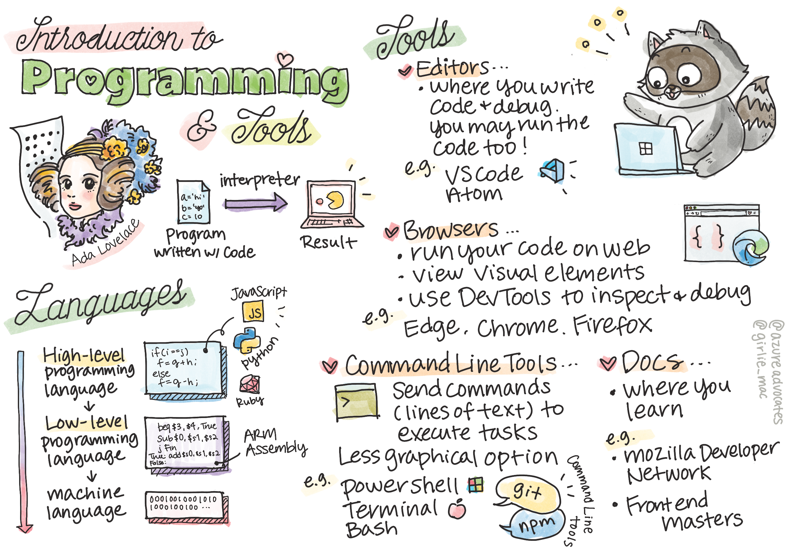

<!--
CO_OP_TRANSLATOR_METADATA:
{
  "original_hash": "2581528206a2a01c3a0b9c88e039b7bc",
  "translation_date": "2025-10-03T08:31:00+00:00",
  "source_file": "1-getting-started-lessons/1-intro-to-programming-languages/README.md",
  "language_code": "de"
}
-->
# Einführung in Programmiersprachen und Werkzeuge des Handwerks

Diese Lektion behandelt die Grundlagen von Programmiersprachen. Die hier behandelten Themen gelten für die meisten modernen Programmiersprachen. Im Abschnitt "Werkzeuge des Handwerks" lernen Sie nützliche Software kennen, die Ihnen als Entwickler hilft.


> Sketchnote von [Tomomi Imura](https://twitter.com/girlie_mac)

## Quiz vor der Vorlesung
[Quiz vor der Vorlesung](https://forms.office.com/r/dru4TE0U9n?origin=lprLink)

## Einführung

In dieser Lektion behandeln wir:

- Was ist Programmierung?
- Arten von Programmiersprachen
- Grundelemente eines Programms
- Nützliche Software und Werkzeuge für professionelle Entwickler

> Sie können diese Lektion auf [Microsoft Learn](https://docs.microsoft.com/learn/modules/web-development-101/introduction-programming/?WT.mc_id=academic-77807-sagibbon) absolvieren!

## Was ist Programmierung?

Programmierung (auch bekannt als Codierung) ist der Prozess des Schreibens von Anweisungen für ein Gerät wie einen Computer oder ein mobiles Gerät. Wir schreiben diese Anweisungen mit einer Programmiersprache, die dann vom Gerät interpretiert wird. Diese Anweisungen können verschiedene Namen haben, aber *Programm*, *Computerprogramm*, *Anwendung (App)* und *ausführbare Datei* sind einige gängige Begriffe.

Ein *Programm* kann alles sein, was mit Code geschrieben wurde; Websites, Spiele und Handy-Apps sind Programme. Obwohl es möglich ist, ein Programm ohne Code zu erstellen, wird die zugrunde liegende Logik vom Gerät interpretiert, und diese Logik wurde höchstwahrscheinlich mit Code geschrieben. Ein Programm, das *läuft* oder *Code ausführt*, führt Anweisungen aus. Das Gerät, mit dem Sie diese Lektion lesen, führt ein Programm aus, um sie auf Ihrem Bildschirm anzuzeigen.

✅ Machen Sie ein wenig Recherche: Wer gilt als der erste Computerprogrammierer der Welt?

## Programmiersprachen

Programmiersprachen ermöglichen es Entwicklern, Anweisungen für ein Gerät zu schreiben. Geräte können nur Binärdaten (1en und 0en) verstehen, und für *die meisten* Entwickler ist das keine sehr effiziente Art der Kommunikation. Programmiersprachen sind das Mittel der Kommunikation zwischen Menschen und Computern.

Programmiersprachen gibt es in verschiedenen Formaten und sie können unterschiedliche Zwecke erfüllen. Zum Beispiel wird JavaScript hauptsächlich für Webanwendungen verwendet, während Bash hauptsächlich für Betriebssysteme eingesetzt wird.

*Low-Level-Sprachen* erfordern in der Regel weniger Schritte als *High-Level-Sprachen*, damit ein Gerät Anweisungen interpretieren kann. Was High-Level-Sprachen jedoch beliebt macht, ist ihre Lesbarkeit und Unterstützung. JavaScript gilt als High-Level-Sprache.

Der folgende Code zeigt den Unterschied zwischen einer High-Level-Sprache (JavaScript) und einer Low-Level-Sprache (ARM-Assembler-Code).

```javascript
let number = 10
let n1 = 0, n2 = 1, nextTerm;

for (let i = 1; i <= number; i++) {
    console.log(n1);
    nextTerm = n1 + n2;
    n1 = n2;
    n2 = nextTerm;
}
```

```c
 area ascen,code,readonly
 entry
 code32
 adr r0,thumb+1
 bx r0
 code16
thumb
 mov r0,#00
 sub r0,r0,#01
 mov r1,#01
 mov r4,#10
 ldr r2,=0x40000000
back add r0,r1
 str r0,[r2]
 add r2,#04
 mov r3,r0
 mov r0,r1
 mov r1,r3
 sub r4,#01
 cmp r4,#00
 bne back
 end
```

Glauben Sie es oder nicht, *sie tun beide dasselbe*: Sie drucken eine Fibonacci-Sequenz bis 10.

✅ Eine Fibonacci-Sequenz wird [definiert](https://en.wikipedia.org/wiki/Fibonacci_number) als eine Reihe von Zahlen, bei der jede Zahl die Summe der beiden vorhergehenden ist, beginnend mit 0 und 1. Die ersten 10 Zahlen der Fibonacci-Sequenz sind 0, 1, 1, 2, 3, 5, 8, 13, 21 und 34.

## Elemente eines Programms

Eine einzelne Anweisung in einem Programm wird als *Statement* bezeichnet und hat normalerweise ein Zeichen oder einen Zeilenabstand, der markiert, wo die Anweisung endet oder *terminiert*. Wie ein Programm terminiert, variiert je nach Sprache.

Anweisungen in einem Programm können von Daten abhängen, die von einem Benutzer oder anderswo bereitgestellt werden, um Anweisungen auszuführen. Daten können beeinflussen, wie ein Programm funktioniert, daher bieten Programmiersprachen eine Möglichkeit, Daten vorübergehend zu speichern, damit sie später verwendet werden können. Diese werden *Variablen* genannt. Variablen sind Anweisungen, die ein Gerät anweisen, Daten in seinem Speicher zu speichern. Variablen in Programmen sind ähnlich wie Variablen in der Algebra, da sie einen eindeutigen Namen haben und sich ihr Wert im Laufe der Zeit ändern kann.

Es besteht die Möglichkeit, dass einige Anweisungen von einem Gerät nicht ausgeführt werden. Dies geschieht normalerweise absichtlich, wenn es vom Entwickler geschrieben wurde, oder versehentlich, wenn ein unerwarteter Fehler auftritt. Diese Art der Kontrolle über eine Anwendung macht sie robuster und wartungsfreundlicher. Typischerweise treten diese Änderungen in der Kontrolle auf, wenn bestimmte Bedingungen erfüllt sind. Eine gängige Anweisung, die in der modernen Programmierung verwendet wird, um zu steuern, wie ein Programm läuft, ist die `if..else`-Anweisung.

✅ Sie werden mehr über diese Art von Anweisung in den folgenden Lektionen lernen.

## Werkzeuge des Handwerks

[](https://youtube.com/watch?v=69WJeXGBdxg "Werkzeuge des Handwerks")

> 🎥 Klicken Sie auf das Bild oben für ein Video über Werkzeuge

In diesem Abschnitt lernen Sie einige Software kennen, die Sie als nützlich empfinden könnten, wenn Sie Ihre professionelle Entwicklerreise beginnen.

Eine **Entwicklungsumgebung** ist eine einzigartige Sammlung von Werkzeugen und Funktionen, die ein Entwickler häufig beim Schreiben von Software verwendet. Einige dieser Werkzeuge wurden für die spezifischen Bedürfnisse eines Entwicklers angepasst und können sich im Laufe der Zeit ändern, wenn dieser Entwickler seine Prioritäten in der Arbeit, bei persönlichen Projekten oder beim Wechsel zu einer anderen Programmiersprache ändert. Entwicklungsumgebungen sind so einzigartig wie die Entwickler, die sie nutzen.

### Editoren

Eines der wichtigsten Werkzeuge für die Softwareentwicklung ist der Editor. Editoren sind der Ort, an dem Sie Ihren Code schreiben und manchmal auch ausführen.

Entwickler verlassen sich aus mehreren Gründen auf Editoren:

- *Debugging* hilft, Fehler und Probleme aufzudecken, indem der Code Zeile für Zeile durchgegangen wird. Einige Editoren verfügen über Debugging-Funktionen; sie können angepasst und für bestimmte Programmiersprachen hinzugefügt werden.
- *Syntax-Hervorhebung* fügt Farben und Textformatierungen zum Code hinzu, wodurch er leichter lesbar wird. Die meisten Editoren erlauben eine benutzerdefinierte Syntax-Hervorhebung.
- *Erweiterungen und Integrationen* sind spezialisierte Werkzeuge für Entwickler, von Entwicklern. Diese Werkzeuge sind nicht im Basis-Editor enthalten. Zum Beispiel dokumentieren viele Entwickler ihren Code, um zu erklären, wie er funktioniert. Sie könnten eine Rechtschreibprüfungserweiterung installieren, um Tippfehler in der Dokumentation zu finden. Die meisten Erweiterungen sind für die Verwendung in einem bestimmten Editor gedacht, und die meisten Editoren bieten eine Möglichkeit, nach verfügbaren Erweiterungen zu suchen.
- *Anpassung* ermöglicht es Entwicklern, eine einzigartige Entwicklungsumgebung zu schaffen, die ihren Bedürfnissen entspricht. Die meisten Editoren sind extrem anpassbar und erlauben es Entwicklern möglicherweise auch, benutzerdefinierte Erweiterungen zu erstellen.

#### Beliebte Editoren und Webentwicklungs-Erweiterungen

- [Visual Studio Code](https://code.visualstudio.com/?WT.mc_id=academic-77807-sagibbon)
  - [Code Spell Checker](https://marketplace.visualstudio.com/items?itemName=streetsidesoftware.code-spell-checker)
  - [Live Share](https://marketplace.visualstudio.com/items?itemName=MS-vsliveshare.vsliveshare)
  - [Prettier - Code formatter](https://marketplace.visualstudio.com/items?itemName=esbenp.prettier-vscode)
- [Atom](https://atom.io/)
  - [spell-check](https://atom.io/packages/spell-check)
  - [teletype](https://atom.io/packages/teletype)
  - [atom-beautify](https://atom.io/packages/atom-beautify)
  
- [Sublimetext](https://www.sublimetext.com/)
  - [emmet](https://emmet.io/)
  - [SublimeLinter](http://www.sublimelinter.com/en/stable/)

### Browser

Ein weiteres wichtiges Werkzeug ist der Browser. Webentwickler verlassen sich auf den Browser, um zu sehen, wie ihr Code im Web ausgeführt wird. Er wird auch verwendet, um die visuellen Elemente einer Webseite anzuzeigen, die im Editor geschrieben wurden, wie HTML.

Viele Browser verfügen über *Entwicklerwerkzeuge* (DevTools), die eine Reihe hilfreicher Funktionen und Informationen enthalten, um Entwicklern zu helfen, wichtige Informationen über ihre Anwendung zu sammeln und zu erfassen. Zum Beispiel: Wenn eine Webseite Fehler hat, ist es manchmal hilfreich zu wissen, wann sie aufgetreten sind. DevTools in einem Browser können so konfiguriert werden, dass diese Informationen erfasst werden.

#### Beliebte Browser und DevTools

- [Edge](https://docs.microsoft.com/microsoft-edge/devtools-guide-chromium/?WT.mc_id=academic-77807-sagibbon)
- [Chrome](https://developers.google.com/web/tools/chrome-devtools/)
- [Firefox](https://developer.mozilla.org/docs/Tools)

### Kommandozeilen-Werkzeuge

Einige Entwickler bevorzugen eine weniger grafische Ansicht für ihre täglichen Aufgaben und verlassen sich auf die Kommandozeile, um dies zu erreichen. Das Schreiben von Code erfordert eine erhebliche Menge an Tippen, und einige Entwickler bevorzugen es, ihren Arbeitsfluss auf der Tastatur nicht zu unterbrechen. Sie verwenden Tastenkombinationen, um zwischen Desktop-Fenstern zu wechseln, an verschiedenen Dateien zu arbeiten und Werkzeuge zu nutzen. Die meisten Aufgaben können mit einer Maus erledigt werden, aber ein Vorteil der Kommandozeile ist, dass vieles mit Kommandozeilen-Werkzeugen erledigt werden kann, ohne zwischen Maus und Tastatur wechseln zu müssen. Ein weiterer Vorteil der Kommandozeile ist, dass sie konfigurierbar ist und Sie eine benutzerdefinierte Konfiguration speichern, später ändern und auf andere Entwicklungsmaschinen importieren können. Da Entwicklungsumgebungen so einzigartig für jeden Entwickler sind, vermeiden einige die Kommandozeile, andere verlassen sich vollständig darauf, und wieder andere bevorzugen eine Mischung aus beidem.

### Beliebte Kommandozeilen-Optionen

Die Optionen für die Kommandozeile unterscheiden sich je nach Betriebssystem.

*💻 = ist vorinstalliert auf dem Betriebssystem.*

#### Windows

- [Powershell](https://docs.microsoft.com/powershell/scripting/overview?view=powershell-7/?WT.mc_id=academic-77807-sagibbon) 💻
- [Command Line](https://docs.microsoft.com/windows-server/administration/windows-commands/windows-commands/?WT.mc_id=academic-77807-sagibbon) (auch bekannt als CMD) 💻
- [Windows Terminal](https://docs.microsoft.com/windows/terminal/?WT.mc_id=academic-77807-sagibbon)
- [mintty](https://mintty.github.io/)
  
#### MacOS

- [Terminal](https://support.apple.com/guide/terminal/open-or-quit-terminal-apd5265185d-f365-44cb-8b09-71a064a42125/mac) 💻
- [iTerm](https://iterm2.com/)
- [Powershell](https://docs.microsoft.com/powershell/scripting/install/installing-powershell-core-on-macos?view=powershell-7/?WT.mc_id=academic-77807-sagibbon)

#### Linux

- [Bash](https://www.gnu.org/software/bash/manual/html_node/index.html) 💻
- [KDE Konsole](https://docs.kde.org/trunk5/en/konsole/konsole/index.html)
- [Powershell](https://docs.microsoft.com/powershell/scripting/install/installing-powershell-core-on-linux?view=powershell-7/?WT.mc_id=academic-77807-sagibbon)

#### Beliebte Kommandozeilen-Werkzeuge

- [Git](https://git-scm.com/) (💻 auf den meisten Betriebssystemen)
- [NPM](https://www.npmjs.com/)
- [Yarn](https://classic.yarnpkg.com/en/docs/cli/)

### Dokumentation

Wenn ein Entwickler etwas Neues lernen möchte, wird er sich höchstwahrscheinlich an die Dokumentation wenden, um zu erfahren, wie man es benutzt. Entwickler verlassen sich oft auf Dokumentationen, um sich durch die richtige Verwendung von Werkzeugen und Sprachen zu führen und auch, um ein tieferes Verständnis dafür zu gewinnen, wie sie funktionieren.

#### Beliebte Dokumentationen zur Webentwicklung

- [Mozilla Developer Network (MDN)](https://developer.mozilla.org/docs/Web), von Mozilla, den Herausgebern des [Firefox](https://www.mozilla.org/firefox/) Browsers
- [Frontend Masters](https://frontendmasters.com/learn/)
- [Web.dev](https://web.dev), von Google, den Herausgebern von [Chrome](https://www.google.com/chrome/)
- [Microsofts eigene Entwicklerdokumentation](https://docs.microsoft.com/microsoft-edge/#microsoft-edge-for-developers), für [Microsoft Edge](https://www.microsoft.com/edge)
- [W3 Schools](https://www.w3schools.com/where_to_start.asp)

✅ Machen Sie etwas Recherche: Jetzt, da Sie die Grundlagen der Umgebung eines Webentwicklers kennen, vergleichen und kontrastieren Sie diese mit der Umgebung eines Webdesigners.

---

## 🚀 Herausforderung

Vergleichen Sie einige Programmiersprachen. Was sind einige der einzigartigen Merkmale von JavaScript im Vergleich zu Java? Wie sieht es mit COBOL im Vergleich zu Go aus?

## Quiz nach der Vorlesung
[Quiz nach der Vorlesung](https://ff-quizzes.netlify.app/web/)

## Überprüfung & Selbststudium

Studieren Sie ein wenig über die verschiedenen Sprachen, die einem Programmierer zur Verfügung stehen. Versuchen Sie, eine Zeile in einer Sprache zu schreiben und sie dann in zwei anderen neu zu schreiben. Was haben Sie gelernt?

## Aufgabe

[Dokumentation lesen](assignment.md)

> Hinweis: Wählen Sie für Ihre Aufgabe keine Editoren, Browser oder Kommandozeilen-Werkzeuge aus, die bereits oben aufgeführt sind.

---

**Haftungsausschluss**:  
Dieses Dokument wurde mit dem KI-Übersetzungsdienst [Co-op Translator](https://github.com/Azure/co-op-translator) übersetzt. Obwohl wir uns um Genauigkeit bemühen, beachten Sie bitte, dass automatisierte Übersetzungen Fehler oder Ungenauigkeiten enthalten können. Das Originaldokument in seiner ursprünglichen Sprache sollte als maßgebliche Quelle betrachtet werden. Für kritische Informationen wird eine professionelle menschliche Übersetzung empfohlen. Wir übernehmen keine Haftung für Missverständnisse oder Fehlinterpretationen, die sich aus der Nutzung dieser Übersetzung ergeben.