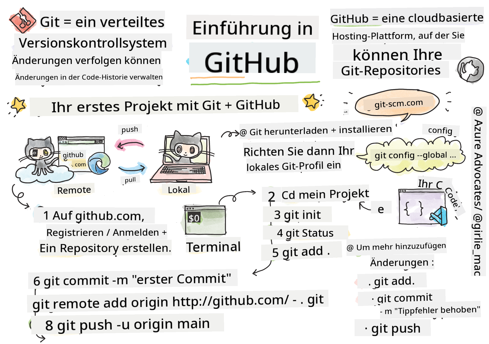
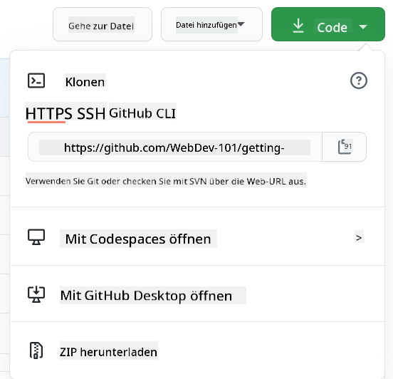

<!--
CO_OP_TRANSLATOR_METADATA:
{
  "original_hash": "ea65b75e488aa33a3cc5cb1c6c3f047a",
  "translation_date": "2025-10-03T13:36:51+00:00",
  "source_file": "1-getting-started-lessons/2-github-basics/README.md",
  "language_code": "de"
}
-->
# Einführung in GitHub

Diese Lektion behandelt die Grundlagen von GitHub, einer Plattform zum Hosten und Verwalten von Änderungen an deinem Code.


> Sketchnote von [Tomomi Imura](https://twitter.com/girlie_mac)

## Quiz vor der Vorlesung
[Quiz vor der Vorlesung](https://ff-quizzes.netlify.app)

## Einführung

In dieser Lektion behandeln wir:

- das Nachverfolgen der Arbeit, die du auf deinem Rechner machst
- das Arbeiten an Projekten mit anderen
- wie man zu Open-Source-Software beiträgt

### Voraussetzungen

Bevor du beginnst, überprüfe, ob Git installiert ist. Gib im Terminal ein:  
`git --version`

Falls Git nicht installiert ist, [lade Git herunter](https://git-scm.com/downloads). Richte anschließend dein lokales Git-Profil im Terminal ein:
* `git config --global user.name "dein-name"`
* `git config --global user.email "deine-email"`

Um zu überprüfen, ob Git bereits konfiguriert ist, kannst du eingeben:  
`git config --list`

Du benötigst außerdem ein GitHub-Konto, einen Code-Editor (wie Visual Studio Code) und musst dein Terminal (oder: Eingabeaufforderung) öffnen.

Navigiere zu [github.com](https://github.com/) und erstelle ein Konto, falls du noch keines hast, oder melde dich an und fülle dein Profil aus.

✅ GitHub ist nicht das einzige Code-Repository der Welt; es gibt andere, aber GitHub ist das bekannteste.

### Vorbereitung

Du benötigst sowohl einen Ordner mit einem Codeprojekt auf deinem lokalen Rechner (Laptop oder PC) als auch ein öffentliches Repository auf GitHub, das als Beispiel dafür dient, wie man zu den Projekten anderer beiträgt.

---

## Codeverwaltung

Angenommen, du hast einen Ordner lokal mit einem Codeprojekt und möchtest deinen Fortschritt mit Git, dem Versionskontrollsystem, nachverfolgen. Manche Leute vergleichen die Nutzung von Git mit dem Schreiben eines Liebesbriefs an dein zukünftiges Ich. Wenn du deine Commit-Nachrichten Tage, Wochen oder Monate später liest, kannst du dich daran erinnern, warum du eine Entscheidung getroffen hast, oder eine Änderung "rückgängig machen" – vorausgesetzt, du schreibst gute "Commit-Nachrichten".

### Aufgabe: Ein Repository erstellen und Code committen  

> Schau dir das Video an  
> 
> [](https://www.youtube.com/watch?v=9R31OUPpxU4)

1. **Repository auf GitHub erstellen**. Auf GitHub.com, im Reiter "Repositories" oder in der Navigationsleiste oben rechts, finde den Button **neues Repository**.

   1. Gib deinem Repository (Ordner) einen Namen.
   1. Wähle **Repository erstellen**.

1. **Zu deinem Arbeitsordner navigieren**. Wechsle in deinem Terminal zu dem Ordner (auch als Verzeichnis bekannt), den du nachverfolgen möchtest. Gib ein:

   ```bash
   cd [name of your folder]
   ```

1. **Ein Git-Repository initialisieren**. Gib in deinem Projekt ein:

   ```bash
   git init
   ```

1. **Status überprüfen**. Um den Status deines Repositorys zu überprüfen, gib ein:

   ```bash
   git status
   ```

   Die Ausgabe könnte etwa so aussehen:

   ```output
   Changes not staged for commit:
   (use "git add <file>..." to update what will be committed)
   (use "git checkout -- <file>..." to discard changes in working directory)

        modified:   file.txt
        modified:   file2.txt
   ```

   Normalerweise zeigt dir der Befehl `git status` Dinge wie, welche Dateien bereit sind, im Repository _gespeichert_ zu werden, oder welche Änderungen darauf vorgenommen wurden, die du möglicherweise beibehalten möchtest.

1. **Alle Dateien zum Nachverfolgen hinzufügen**  
   Dies wird auch als "Staging" von Dateien oder das Hinzufügen von Dateien zum Staging-Bereich bezeichnet.

   ```bash
   git add .
   ```

   Das Argument `git add` plus `.` zeigt an, dass alle deine Dateien und Änderungen nachverfolgt werden sollen.

1. **Ausgewählte Dateien zum Nachverfolgen hinzufügen**

   ```bash
   git add [file or folder name]
   ```

   Dies hilft uns, nur ausgewählte Dateien zum Staging-Bereich hinzuzufügen, wenn wir nicht alle Dateien auf einmal committen möchten.

1. **Alle Dateien aus dem Staging-Bereich entfernen**

   ```bash
   git reset
   ```

   Dieser Befehl hilft uns, alle Dateien auf einmal aus dem Staging-Bereich zu entfernen.

1. **Eine bestimmte Datei aus dem Staging-Bereich entfernen**

   ```bash
   git reset [file or folder name]
   ```

   Dieser Befehl hilft uns, nur eine bestimmte Datei aus dem Staging-Bereich zu entfernen, die wir nicht für den nächsten Commit einbeziehen möchten.

1. **Deine Arbeit speichern**. An diesem Punkt hast du die Dateien in einen sogenannten _Staging-Bereich_ hinzugefügt, einen Ort, an dem Git deine Dateien nachverfolgt. Um die Änderung dauerhaft zu machen, musst du die Dateien _committen_. Dazu erstellst du einen _Commit_ mit dem Befehl `git commit`. Ein _Commit_ stellt einen Speicherpunkt in der Historie deines Repositorys dar. Gib Folgendes ein, um einen _Commit_ zu erstellen:

   ```bash
   git commit -m "first commit"
   ```

   Dies commitet alle deine Dateien und fügt die Nachricht "erster Commit" hinzu. Für zukünftige Commit-Nachrichten solltest du eine detailliertere Beschreibung verwenden, um zu vermitteln, welche Art von Änderung du vorgenommen hast.

1. **Dein lokales Git-Repository mit GitHub verbinden**. Ein Git-Repository ist auf deinem Rechner nützlich, aber irgendwann möchtest du ein Backup deiner Dateien irgendwo haben und andere Leute einladen, mit dir an deinem Repository zu arbeiten. Ein großartiger Ort dafür ist GitHub. Wir haben bereits ein Repository auf GitHub erstellt, daher müssen wir nur unser lokales Git-Repository mit GitHub verbinden. Der Befehl `git remote add` erledigt genau das. Gib den folgenden Befehl ein:

   > Hinweis: Bevor du den Befehl eingibst, gehe zu deiner GitHub-Repository-Seite, um die Repository-URL zu finden. Du wirst sie im folgenden Befehl verwenden. Ersetze ```https://github.com/username/repository_name.git``` durch deine GitHub-URL.

   ```bash
   git remote add origin https://github.com/username/repository_name.git
   ```

   Dies erstellt eine _Remote-Verbindung_, genannt "origin", die auf das GitHub-Repository zeigt, das du zuvor erstellt hast.

1. **Lokale Dateien an GitHub senden**. Bisher hast du eine _Verbindung_ zwischen dem lokalen Repository und dem GitHub-Repository hergestellt. Senden wir diese Dateien an GitHub mit dem folgenden Befehl `git push`, wie folgt:  
   
   > Hinweis: Dein Branch-Name könnte standardmäßig anders als ```main``` sein.

   ```bash
   git push -u origin main
   ```

   Dies sendet deine Commits in deinem "main"-Branch an GitHub. Das Festlegen des `upstream`-Branches einschließlich `-u` im Befehl stellt eine Verbindung zwischen deinem lokalen Branch und dem Remote-Branch her, sodass du in Zukunft einfach `git push` oder `git pull` verwenden kannst, ohne den Branch-Namen anzugeben. Git wird automatisch den `upstream`-Branch verwenden, und du musst den Branch-Namen in zukünftigen Befehlen nicht explizit angeben.

2. **Weitere Änderungen hinzufügen**. Wenn du weiterhin Änderungen vornehmen und diese an GitHub senden möchtest, musst du nur die folgenden drei Befehle verwenden:

   ```bash
   git add .
   git commit -m "type your commit message here"
   git push
   ```

   > Tipp: Du möchtest möglicherweise auch eine `.gitignore`-Datei verwenden, um zu verhindern, dass Dateien, die du nicht nachverfolgen möchtest, auf GitHub angezeigt werden – wie die Notizdatei, die du im selben Ordner speicherst, die aber keinen Platz in einem öffentlichen Repository hat. Du kannst Vorlagen für `.gitignore`-Dateien unter [.gitignore templates](https://github.com/github/gitignore) finden.

#### Commit-Nachrichten

Eine großartige Git-Commit-Betreffzeile vervollständigt den folgenden Satz:  
Wenn angewendet, wird dieser Commit <deine Betreffzeile hier>

Für den Betreff verwende die imperative Gegenwartsform: "ändern" statt "geändert" oder "ändert".  
Wie im Betreff, verwende auch im optionalen Textkörper die imperative Gegenwartsform. Der Textkörper sollte die Motivation für die Änderung enthalten und diese mit dem vorherigen Verhalten kontrastieren. Du erklärst das `Warum`, nicht das `Wie`.

✅ Nimm dir ein paar Minuten Zeit, um auf GitHub zu surfen. Kannst du eine wirklich großartige Commit-Nachricht finden? Kannst du eine sehr minimalistische finden? Welche Informationen denkst du, sind am wichtigsten und nützlich, um in einer Commit-Nachricht vermittelt zu werden?

### Aufgabe: Zusammenarbeit

Der Hauptgrund, Dinge auf GitHub zu stellen, war, die Zusammenarbeit mit anderen Entwicklern zu ermöglichen.

## Arbeiten an Projekten mit anderen

> Schau dir das Video an  
>
> [](https://www.youtube.com/watch?v=bFCM-PC3cu8)

In deinem Repository navigiere zu `Insights > Community`, um zu sehen, wie dein Projekt im Vergleich zu den empfohlenen Community-Standards abschneidet.

   Hier sind einige Dinge, die dein GitHub-Repository verbessern können:
   - **Beschreibung**. Hast du eine Beschreibung für dein Projekt hinzugefügt?
   - **README**. Hast du ein README hinzugefügt? GitHub bietet Anleitungen zum Schreiben eines [README](https://docs.github.com/articles/about-readmes/?WT.mc_id=academic-77807-sagibbon).
   - **Richtlinien für Beiträge**. Hat dein Projekt [Richtlinien für Beiträge](https://docs.github.com/articles/setting-guidelines-for-repository-contributors/?WT.mc_id=academic-77807-sagibbon)?
   - **Verhaltenskodex**. Einen [Verhaltenskodex](https://docs.github.com/articles/adding-a-code-of-conduct-to-your-project/),
   - **Lizenz**. Vielleicht am wichtigsten, eine [Lizenz](https://docs.github.com/articles/adding-a-license-to-a-repository/)?

All diese Ressourcen werden neuen Teammitgliedern beim Einstieg helfen. Und das sind typischerweise die Dinge, die neue Mitwirkende sich ansehen, bevor sie überhaupt deinen Code betrachten, um herauszufinden, ob dein Projekt der richtige Ort für sie ist, um ihre Zeit zu investieren.

✅ README-Dateien, obwohl sie Zeit in Anspruch nehmen, werden oft von beschäftigten Maintainer vernachlässigt. Kannst du ein Beispiel für eine besonders beschreibende README-Datei finden? Hinweis: Es gibt einige [Tools, um gute READMEs zu erstellen](https://www.makeareadme.com/), die du ausprobieren könntest.

### Aufgabe: Code zusammenführen

Beitragsdokumente helfen Menschen, zum Projekt beizutragen. Sie erklären, welche Arten von Beiträgen du suchst und wie der Prozess funktioniert. Mitwirkende müssen eine Reihe von Schritten durchlaufen, um zu deinem Repository auf GitHub beitragen zu können:

1. **Dein Repository forken**. Du wirst wahrscheinlich möchten, dass Leute dein Projekt _forken_. Forken bedeutet, eine Kopie deines Repositorys auf ihrem GitHub-Profil zu erstellen.
1. **Klonen**. Von dort aus werden sie das Projekt auf ihren lokalen Rechner klonen.
1. **Einen Branch erstellen**. Du wirst sie bitten, einen _Branch_ für ihre Arbeit zu erstellen.
1. **Änderungen auf einen Bereich konzentrieren**. Bitte Mitwirkende, ihre Beiträge auf eine Sache gleichzeitig zu konzentrieren – so ist die Wahrscheinlichkeit höher, dass du ihre Arbeit _zusammenführen_ kannst. Stell dir vor, sie schreiben einen Bugfix, fügen eine neue Funktion hinzu und aktualisieren mehrere Tests – was, wenn du nur 2 von 3 oder 1 von 3 Änderungen implementieren möchtest oder kannst?

✅ Stell dir eine Situation vor, in der Branches besonders wichtig sind, um guten Code zu schreiben und zu veröffentlichen. Welche Anwendungsfälle fallen dir ein?

> Hinweis: Sei die Veränderung, die du in der Welt sehen möchtest, und erstelle auch Branches für deine eigene Arbeit. Alle Commits, die du machst, werden auf dem Branch gemacht, auf dem du gerade "ausgecheckt" bist. Verwende `git status`, um zu sehen, welcher Branch das ist.

Gehen wir einen Workflow für Mitwirkende durch. Angenommen, der Mitwirkende hat das Repository bereits _geforkt_ und _geklont_, sodass er ein Git-Repository hat, das auf seinem lokalen Rechner bereit ist, bearbeitet zu werden:

1. **Einen Branch erstellen**. Verwende den Befehl `git branch`, um einen Branch zu erstellen, der die Änderungen enthält, die sie beitragen möchten:

   ```bash
   git branch [branch-name]
   ```

1. **Zum Arbeitsbranch wechseln**. Wechsle zum angegebenen Branch und aktualisiere das Arbeitsverzeichnis mit `git switch`:

   ```bash
   git switch [branch-name]
   ```

1. **Arbeiten durchführen**. An diesem Punkt möchtest du deine Änderungen hinzufügen. Vergiss nicht, Git darüber zu informieren, mit den folgenden Befehlen:

   ```bash
   git add .
   git commit -m "my changes"
   ```

   Stelle sicher, dass du deinem Commit einen guten Namen gibst, sowohl für dich als auch für den Maintainer des Repositorys, dem du hilfst.

1. **Deine Arbeit mit dem `main`-Branch kombinieren**. Irgendwann bist du mit deiner Arbeit fertig und möchtest deine Arbeit mit der des `main`-Branches kombinieren. Der `main`-Branch könnte sich inzwischen geändert haben, also stelle sicher, dass du ihn zuerst auf den neuesten Stand bringst, mit den folgenden Befehlen:

   ```bash
   git switch main
   git pull
   ```

   An diesem Punkt möchtest du sicherstellen, dass alle _Konflikte_, Situationen, in denen Git die Änderungen nicht einfach _kombinieren_ kann, in deinem Arbeitsbranch auftreten. Führe daher die folgenden Befehle aus:

   ```bash
   git switch [branch_name]
   git merge main
   ```

   Der Befehl `git merge main` bringt alle Änderungen von `main` in deinen Branch. Hoffentlich kannst du einfach weitermachen. Falls nicht, wird dir VS Code zeigen, wo Git _verwirrt_ ist, und du änderst die betroffenen Dateien, um anzugeben, welcher Inhalt am genauesten ist.

   Um zu einem anderen Branch zu wechseln, verwende den modernen Befehl `git switch`:
   ```bash
   git switch [branch_name]


1. **Deine Arbeit an GitHub senden**. Deine Arbeit an GitHub zu senden bedeutet zwei Dinge: Deinen Branch an dein Repository zu pushen und dann einen PR (Pull Request) zu öffnen.

   ```bash
   git push --set-upstream origin [branch-name]
   ```

   Der obige Befehl erstellt den Branch in deinem geforkten Repository.
1. **Einen PR öffnen**. Als Nächstes möchtest du einen PR öffnen. Dazu navigierst du zum geforkten Repository auf GitHub. Dort siehst du eine Anzeige, die dich fragt, ob du einen neuen PR erstellen möchtest. Du klickst darauf und gelangst zu einer Oberfläche, in der du den Titel der Commit-Nachricht ändern und eine passendere Beschreibung hinzufügen kannst. Nun sieht der Maintainer des Repos, das du geforkt hast, diesen PR und _Daumen drücken_, dass er deinen PR schätzt und _merged_. Du bist jetzt ein Contributor, yay :)

1. **Aufräumen**. Es gilt als gute Praxis, nach dem erfolgreichen Mergen eines PRs _aufzuräumen_. Du solltest sowohl deinen lokalen Branch als auch den Branch, den du zu GitHub gepusht hast, bereinigen. Lösche ihn zunächst lokal mit folgendem Befehl:

   ```bash
   git branch -d [branch-name]
   ```

   Gehe anschließend zur GitHub-Seite des geforkten Repos und entferne den Remote-Branch, den du gerade gepusht hast.

`Pull request` scheint ein seltsamer Begriff zu sein, da du eigentlich deine Änderungen in das Projekt pushen möchtest. Aber der Maintainer (Projektbesitzer) oder das Kernteam muss deine Änderungen prüfen, bevor sie mit dem "main"-Branch des Projekts zusammengeführt werden. Du bittest also tatsächlich um eine Entscheidung über die Änderung von einem Maintainer.

Ein Pull Request ist der Ort, an dem die Unterschiede, die auf einem Branch eingeführt wurden, verglichen und diskutiert werden können – mit Reviews, Kommentaren, integrierten Tests und mehr. Ein guter Pull Request folgt ungefähr denselben Regeln wie eine Commit-Nachricht. Du kannst auf ein Issue im Issue-Tracker verweisen, wenn deine Arbeit beispielsweise ein Problem löst. Dies geschieht mit einem `#`, gefolgt von der Nummer des Issues. Zum Beispiel `#97`.

🤞Daumen drücken, dass alle Checks erfolgreich sind und die Projektbesitzer deine Änderungen ins Projekt mergen🤞

Aktualisiere deinen aktuellen lokalen Arbeitsbranch mit allen neuen Commits vom entsprechenden Remote-Branch auf GitHub:

`git pull`

## Wie man zu Open Source beiträgt

Zunächst suchen wir ein Repository (oder **Repo**) auf GitHub, das dich interessiert und zu dem du eine Änderung beitragen möchtest. Du solltest dessen Inhalte auf deinen Rechner kopieren.

✅ Eine gute Möglichkeit, 'anfängerfreundliche' Repos zu finden, ist [die Suche nach dem Tag 'good-first-issue'](https://github.blog/2020-01-22-browse-good-first-issues-to-start-contributing-to-open-source/).



Es gibt mehrere Möglichkeiten, Code zu kopieren. Eine davon ist, die Inhalte des Repositories zu "klonen", entweder über HTTPS, SSH oder mit der GitHub CLI (Command Line Interface).

Öffne dein Terminal und klone das Repository wie folgt:
`git clone https://github.com/ProjectURL`

Um am Projekt zu arbeiten, wechsle in den richtigen Ordner:
`cd ProjectURL`

Du kannst das gesamte Projekt auch mit [Codespaces](https://github.com/features/codespaces), GitHubs eingebettetem Code-Editor / Cloud-Entwicklungsumgebung, oder [GitHub Desktop](https://desktop.github.com/) öffnen.

Alternativ kannst du den Code in einem gezippten Ordner herunterladen.

### Ein paar weitere interessante Dinge über GitHub

Du kannst jedes öffentliche Repository auf GitHub mit einem Stern markieren, beobachten und/oder "forken". Deine mit Stern markierten Repositories findest du im Dropdown-Menü oben rechts. Es ist wie ein Lesezeichen, aber für Code.

Projekte haben einen Issue-Tracker, meistens auf GitHub im Tab "Issues", es sei denn, es wird anders angegeben. Dort diskutieren Menschen über Probleme, die mit dem Projekt zusammenhängen. Im Tab "Pull Requests" diskutieren und überprüfen Menschen Änderungen, die gerade in Arbeit sind.

Projekte können auch Diskussionen in Foren, Mailinglisten oder Chat-Kanälen wie Slack, Discord oder IRC haben.

✅ Schau dich in deinem neuen GitHub-Repo um und probiere ein paar Dinge aus, wie das Bearbeiten von Einstellungen, das Hinzufügen von Informationen zu deinem Repo und das Erstellen eines Projekts (z. B. eines Kanban-Boards). Es gibt viel zu entdecken!

---

## 🚀 Herausforderung 

Arbeite mit einem Freund zusammen an euren jeweiligen Codes. Erstellt gemeinsam ein Projekt, forkt Code, erstellt Branches und merged Änderungen.

## Quiz nach der Vorlesung
[Quiz nach der Vorlesung](https://ff-quizzes.netlify.app/web/en/)

## Überprüfung & Selbststudium

Lies mehr über [das Beitragen zu Open-Source-Software](https://opensource.guide/how-to-contribute/#how-to-submit-a-contribution).

[Git-Spickzettel](https://training.github.com/downloads/github-git-cheat-sheet/).

Üben, üben, üben. GitHub bietet großartige Lernpfade über [skills.github.com](https://skills.github.com):

- [Erste Woche auf GitHub](https://skills.github.com/#first-week-on-github)

Dort findest du auch fortgeschrittene Kurse.

## Aufgabe 

Absolviere [den Kurs "Erste Woche auf GitHub"](https://skills.github.com/#first-week-on-github)

---

**Haftungsausschluss**:  
Dieses Dokument wurde mit dem KI-Übersetzungsdienst [Co-op Translator](https://github.com/Azure/co-op-translator) übersetzt. Obwohl wir uns um Genauigkeit bemühen, beachten Sie bitte, dass automatisierte Übersetzungen Fehler oder Ungenauigkeiten enthalten können. Das Originaldokument in seiner ursprünglichen Sprache sollte als maßgebliche Quelle betrachtet werden. Für kritische Informationen wird eine professionelle menschliche Übersetzung empfohlen. Wir übernehmen keine Haftung für Missverständnisse oder Fehlinterpretationen, die sich aus der Nutzung dieser Übersetzung ergeben.