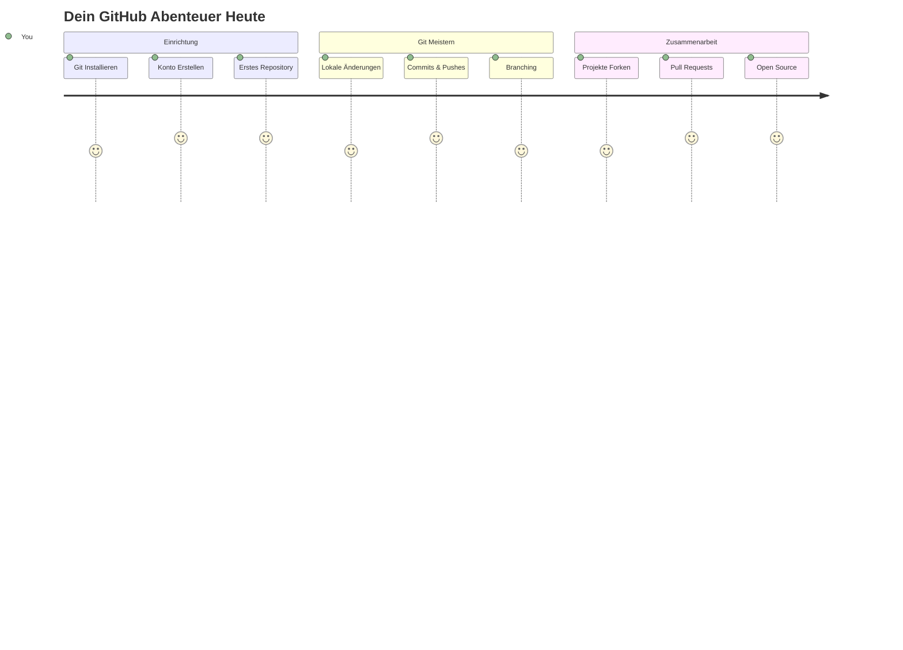
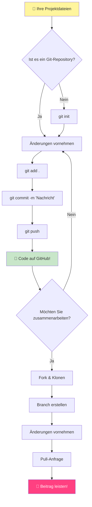
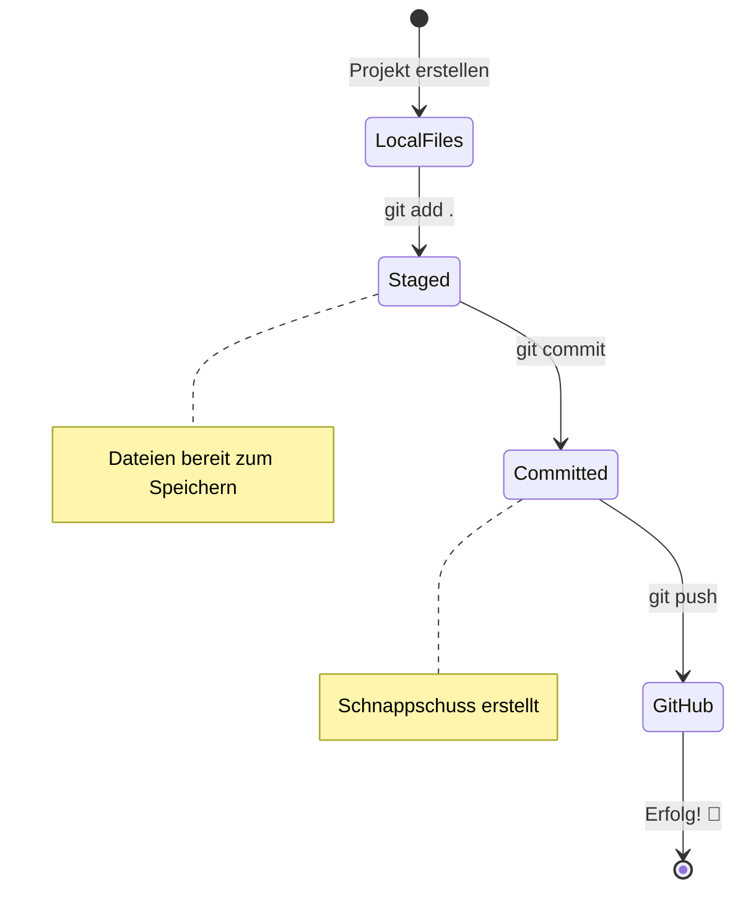
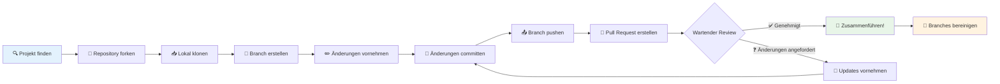
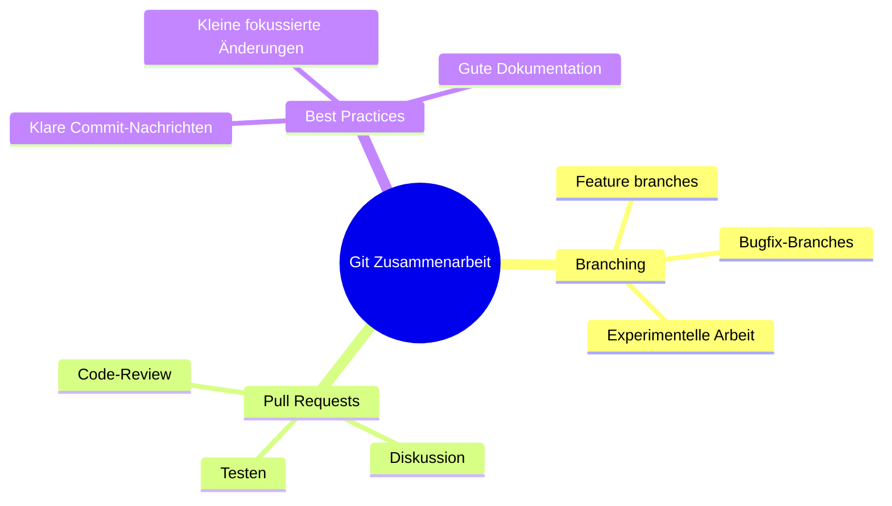
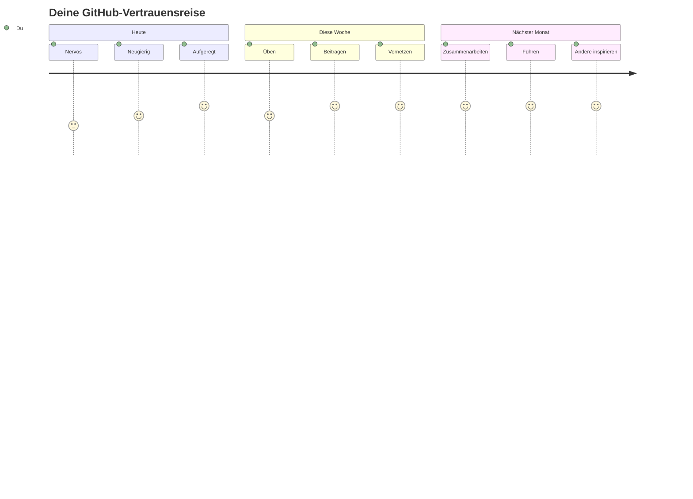

<!--
CO_OP_TRANSLATOR_METADATA:
{
  "original_hash": "5c383cc2cc23bb164b06417d1c107a44",
  "translation_date": "2026-01-06T09:28:19+00:00",
  "source_file": "1-getting-started-lessons/2-github-basics/README.md",
  "language_code": "de"
}
-->
# Einführung in GitHub

Hallo zukünftige*r Entwickler*in! 👋 Bereit, dich Millionen von Programmierenden weltweit anzuschließen? Ich freue mich wirklich, dir GitHub vorzustellen – denk daran als die Social-Media-Plattform für Programmierer, nur dass wir hier statt Fotos von unserem Mittagessen Code teilen und gemeinsam unglaubliche Dinge bauen!

Was mich absolut umhaut: Jede App auf deinem Handy, jede Website, die du besuchst, und die meisten Tools, die du lernen wirst zu nutzen, wurden von Entwickler*innen-Teams erstellt, die auf Plattformen wie GitHub zusammenarbeiten. Die Musik-App, die du liebst? Jemand wie du hat dazu beigetragen. Das Spiel, das du nicht aus der Hand legen kannst? Ja, wahrscheinlich mit GitHub-Kollaboration gebaut. Und jetzt wirst DU lernen, wie du Teil dieser großartigen Community wirst!

Ich weiß, das fühlt sich am Anfang vielleicht nach viel an – ich erinnere mich noch daran, wie ich meine erste GitHub-Seite angeschaut habe und dachte „Was zum Teufel bedeutet das alles?“ Aber hier ist die Sache: Jede*r Entwickler*in hat genau dort angefangen, wo du jetzt bist. Am Ende dieser Lektion wirst du dein eigenes GitHub-Repository haben (denk daran als deine persönliche Projekt-Vitrine in der Cloud), und du wirst wissen, wie du deine Arbeit speicherst, mit anderen teilst und sogar zu Projekten beiträgst, die Millionen von Menschen verwenden.

Wir werden diese Reise zusammen gehen, Schritt für Schritt. Kein Stress, kein Druck – nur du, ich und ein paar wirklich coole Tools, die deine neuen besten Freunde werden!


> Sketchnote von [Tomomi Imura](https://twitter.com/girlie_mac)


## Vor-Lektüre-Quiz
[Vor-Lektüre-Quiz](https://ff-quizzes.netlify.app)

## Einführung

Bevor wir in den wirklich spannenden Teil eintauchen, bereiten wir deinen Computer für etwas GitHub-Zauberei vor! Denk daran wie das Organisieren deiner Kunstmaterialien, bevor du ein Meisterwerk erschaffst – mit den richtigen Werkzeugen läuft alles viel reibungsloser und macht viel mehr Spaß.

Ich führe dich persönlich durch jeden Einrichtungsschritt, und ich verspreche, dass es bei weitem nicht so einschüchternd ist, wie es auf den ersten Blick aussieht. Wenn dir etwas auf Anhieb nicht klar ist, ist das völlig normal! Ich erinnere mich daran, wie ich meine erste Entwicklungsumgebung eingerichtet habe und mich fühlte, als würde ich alte Hieroglyphen lesen versuchen. Jede*r Entwickler*in stand genau dort, wo du jetzt bist, und hat sich gefragt, ob sie oder er es richtig macht. Spoiler: Wenn du hier lernst, machst du es schon richtig! 🌟

In dieser Lektion behandeln wir:

- wie du deine Arbeit auf deinem Rechner verfolgst
- wie du an Projekten mit anderen zusammenarbeitest
- wie du zu Open-Source-Software beiträgst

### Voraussetzungen

Lass uns deinen Computer für etwas GitHub-Zauberei bereit machen! Keine Sorge – diese Einrichtung musst du nur einmal machen, dann bist du für deine gesamte Programmierreise gerüstet.

Also, fangen wir mit dem Fundament an! Zuerst müssen wir überprüfen, ob Git bereits auf deinem Rechner installiert ist. Git ist im Grunde wie ein superkluger Assistent, der sich jede einzelne Änderung an deinem Code merkt – viel besser, als hysterisch alle zwei Sekunden Strg+S zu drücken (wir alle kennen das!).

Schauen wir nach, ob Git schon installiert ist, indem du diesen magischen Befehl im Terminal eingibst:
`git --version`

Wenn Git noch nicht installiert ist, kein Problem! Geh einfach auf [download Git](https://git-scm.com/downloads) und lade es herunter. Sobald es installiert ist, müssen wir Git richtig vorstellen:

> 💡 **Erste Einrichtung**: Diese Befehle sagen Git, wer du bist. Diese Informationen werden bei jedem Commit, den du machst, angehängt, also wähle einen Namen und eine E-Mail, die du öffentlich teilen möchtest.

```bash
git config --global user.name "your-name"
git config --global user.email "your-email"
```

Um zu überprüfen, ob Git schon konfiguriert ist, kannst du eingeben:
```bash
git config --list
```

Du brauchst außerdem ein GitHub-Konto, einen Code-Editor (wie Visual Studio Code) und du musst dein Terminal (oder die Eingabeaufforderung) öffnen.

Navigiere zu [github.com](https://github.com/) und erstelle einen Account, falls du noch keinen hast, oder melde dich an und vervollständige dein Profil.

💡 **Moderner Tipp**: Überlege, [SSH-Schlüssel](https://docs.github.com/en/authentication/connecting-to-github-with-ssh) einzurichten oder die [GitHub CLI](https://cli.github.com/) für eine einfachere Authentifizierung ohne Passwörter zu verwenden.

✅ GitHub ist nicht das einzige Code-Repository auf der Welt; es gibt andere – aber GitHub ist das bekannteste.

### Vorbereitung

Du brauchst sowohl einen Ordner mit einem Code-Projekt auf deinem lokalen Rechner (Laptop oder PC) als auch ein öffentliches Repository auf GitHub, das als Beispiel dient, wie man zu den Projekten anderer beiträgt.

### Deinen Code sicher halten

Lass uns kurz über Sicherheit sprechen – keine Sorge, wir werden dich nicht mit gruseligen Details überfordern! Denk an diese Sicherheitspraktiken wie das Abschließen deines Autos oder Hauses. Es sind einfache Gewohnheiten, die zur zweiten Natur werden und deine harte Arbeit schützen.

Wir zeigen dir von Anfang an die modernen und sicheren Wege, mit GitHub zu arbeiten. So entwickelst du gute Gewohnheiten, die dich während deiner gesamten Programmierkarriere begleiten.

Beim Arbeiten mit GitHub ist es wichtig, Sicherheitsbest Practices zu befolgen:

| Sicherheitsbereich | Best Practice | Warum es wichtig ist |
|--------------------|---------------|---------------------|
| **Authentifizierung** | Verwende SSH-Schlüssel oder Personal Access Tokens | Passwörter sind weniger sicher und werden ersetzt |
| **Zwei-Faktor-Authentifizierung** | Aktiviere 2FA für dein GitHub-Konto | Fügt eine zusätzliche Schutzschicht hinzu |
| **Repository-Sicherheit** | Niemals sensible Informationen commiten | API-Schlüssel und Passwörter gehören nicht in öffentliche Repos |
| **Abhängigkeitsmanagement** | Aktiviere Dependabot für Updates | Hält deine Abhängigkeiten sicher und aktuell |

> ⚠️ **Wichtige Sicherheits-Erinnerung**: Niemals API-Schlüssel, Passwörter oder andere sensible Daten in einem Repository abspeichern. Nutze Umgebungsvariablen und `.gitignore`-Dateien, um sensible Daten zu schützen.

**Moderne Authentifizierungs-Einrichtung:**

```bash
# SSH-Schlüssel generieren (moderner ed25519-Algorithmus)
ssh-keygen -t ed25519 -C "your_email@example.com"

# Git für die Verwendung von SSH einrichten
git remote set-url origin git@github.com:username/repository.git
```

> 💡 **Profi-Tipp**: SSH-Schlüssel ersparen dir das wiederholte Eingeben von Passwörtern und sind sicherer als traditionelle Authentifizierungsmethoden.

---

## Verwalt deinen Code wie ein Profi

Okay, HIER wird es wirklich spannend! 🎉 Wir lernen jetzt, wie du deinen Code wie die Profis verfolgst und verwaltest, und ehrlich gesagt ist das einer meiner Lieblingsteile, weil es so einen enormen Unterschied macht.

Stell dir vor: Du schreibst eine fantastische Geschichte und möchtest jeden Entwurf, jede brillante Änderung und jeden „Moment, in dem ich dachte: Genie!“ festhalten. Genau das macht Git für deinen Code! Es ist wie ein unglaubliches Zeitreiseführungs-Notizbuch, das ALLES speichert – jeden Tastendruck, jede Änderung, jeden „Ups, jetzt ist alles kaputt“-Moment, den du sofort rückgängig machen kannst.

Ich will ehrlich sein – das kann am Anfang überwältigend wirken. Als ich angefangen habe, dachte ich: „Warum kann ich meine Dateien nicht einfach normal speichern?“ Aber glaub mir: Sobald Git für dich klick macht (und das wird es!), hast du diesen Aha-Moment, in dem du denkst: „Wie habe ich jemals ohne das programmiert?“ Es ist, als würdest du entdecken, dass du fliegen kannst, obwohl du dein Leben lang nur gelaufen bist!

Angenommen, du hast lokal einen Ordner mit einem Codeprojekt und möchtest deinen Fortschritt mit Git verfolgen – dem Versionskontrollsystem. Manche vergleichen Git mit einem Liebesbrief an dein zukünftiges Ich. Wenn du deine Commit-Nachrichten Tage, Wochen oder Monate später liest, kannst du dich erinnern, warum du eine Entscheidung getroffen hast oder Änderungen zurücknehmen („rollbacken“) – vorausgesetzt, du schreibst gute Commit-Nachrichten.


### Aufgabe: Erstelle dein erstes Repository!

> 🎯 **Deine Mission (und ich freue mich so für dich!)**: Wir erstellen zusammen dein allererstes GitHub-Repository! Wenn wir fertig sind, hast du deine kleine eigene Ecke im Internet, wo dein Code wohnt, und du hast deinen ersten „Commit“ gemacht (das ist Entwickler*innen-Sprache dafür, deine Arbeit auf eine wirklich clevere Weise zu speichern).
>
> Das ist wirklich ein besonderer Moment – du bist kurz davor, offiziell Teil der globalen Entwickler-Community zu werden! Ich erinnere mich noch an den Nervenkitzel, als ich mein erstes Repo erstellt habe und dachte „Wow, das mache ich wirklich!“

Lass uns gemeinsam dieses Abenteuer Schritt für Schritt durchgehen. Nimm dir Zeit bei jedem Schritt – es gibt keinen Preis fürs Hetzen, und ich verspreche dir, jeder Schritt wird Sinn machen. Denk dran, jede*r Programmier-Superstar, den du bewunderst, saß genau dort, wo du jetzt bist, und war kurz davor, sein erstes Repository zu erstellen. Wie cool ist das?

> Sieh dir das Video an
> 
> [](https://www.youtube.com/watch?v=9R31OUPpxU4)

**Lass es uns zusammen machen:**

1. **Erstelle dein Repository auf GitHub**. Geh zu GitHub.com und suche den hellgrünen **New**-Button (oder das **+**-Zeichen oben rechts). Klick drauf und wähle **New repository**.

   So geht's:
   1. Gib deinem Repository einen Namen – mach ihn aussagekräftig für dich!
   1. Füge eine Beschreibung hinzu, wenn du möchtest (das hilft anderen, dein Projekt zu verstehen)
   1. Entscheide, ob es öffentlich (für alle sichtbar) oder privat (nur für dich) sein soll
   1. Ich empfehle, das Kästchen für eine README-Datei anzuklicken – das ist wie die Titelseite deines Projekts
   1. Klick auf **Create repository** und feier – du hast gerade dein erstes Repo erstellt! 🎉

2. **Navigiere zu deinem Projektordner**. Öffne jetzt dein Terminal (keine Angst, es ist gar nicht so furchteinflößend!). Wir müssen dem Computer sagen, wo deine Projektdateien sind. Gib diesen Befehl ein:

   ```bash
   cd [name of your folder]
   ```

   **Was wir hier tun:**
   - Wir sagen dem Computer quasi „Hey, geh zu meinem Projektordner“
   - Das ist wie ein Ordner auf deinem Desktop zu öffnen, nur mit Textbefehlen
   - Ersetze `[name of your folder]` durch den tatsächlichen Namen deines Projektordners

3. **Mach deinen Ordner zum Git-Repository**. Hier passiert die Magie! Tippe:

   ```bash
   git init
   ```

   **Das ist gerade passiert (cool, oder?):**
   - Git hat gerade einen versteckten `.git`-Ordner in deinem Projekt erstellt – du siehst ihn nicht, aber er ist da!
   - Dein normaler Ordner ist jetzt ein „Repository“, das jede Änderung, die du machst, verfolgen kann
   - Denk daran wie Superkräfte für deinen Ordner, der sich alles merken kann

4. **Schau dir an, was Git sagt**. Mal sehen, was Git momentan über dein Projekt denkt:

   ```bash
   git status
   ```

   **So verstehst du, was Git dir mitteilt:**
   
   Du könntest etwas sehen, das so aussieht:

   ```output
   Changes not staged for commit:
   (use "git add <file>..." to update what will be committed)
   (use "git restore <file>..." to discard changes in working directory)

        modified:   file.txt
        modified:   file2.txt
   ```

   **Keine Panik! Das bedeutet das:**
   - Dateien in **rot** sind Dateien, die geändert wurden, aber noch nicht zum Speichern bereit sind
   - Dateien in **grün** (wenn du sie siehst) sind bereit zum Speichern
   - Git hilft dir, indem es genau sagt, was du als Nächstes tun kannst

   > 💡 **Profi-Tipp**: Der Befehl `git status` ist dein bester Freund! Nutze ihn jederzeit, wenn du nicht weiterweißt. Es ist wie zu fragen: „Hey Git, wie sieht's gerade aus?“

5. **Mach deine Dateien bereit zum Speichern** (das nennt man „staging“):

   ```bash
   git add .
   ```

   **Was wir gerade gemacht haben:**
   - Wir haben Git gesagt: „Ich möchte ALLE meine Dateien im nächsten Speichervorgang einschließen“
   - Der `.` bedeutet „alles in diesem Ordner“
   - Jetzt sind deine Dateien „gestaged“ und bereit fürs nächste Speichern

   **Möchtest du selektiver sein?** Du kannst auch nur bestimmte Dateien hinzufügen:

   ```bash
   git add [file or folder name]
   ```

   **Warum möchtest du das tun?**
   - Manchmal willst du zusammenhängende Änderungen gruppiert speichern
   - Es hilft dir, deine Arbeit in logische Abschnitte zu unterteilen
   - So versteht man leichter, was wann geändert wurde

   **Hast du es dir anders überlegt?** Kein Problem! Du kannst Dateien so aus dem Staging entfernen:

   ```bash
   # Alles aus dem Staging-Bereich entfernen
   git reset
   
   # Nur eine Datei aus dem Staging-Bereich entfernen
   git reset [file name]
   ```

   Keine Sorge – das löscht deine Arbeit nicht, es nimmt die Dateien nur aus dem „bereit zum Speichern“-Bereich heraus.

6. **Speichere deine Arbeit dauerhaft** (das ist dein erster Commit!):

   ```bash
   git commit -m "first commit"
   ```

   **🎉 Glückwunsch! Du hast gerade deinen ersten Commit gemacht!**
   
   **Was gerade passiert ist:**
   - Git hat einen „Snapshot“ von allen gestagten Dateien zu genau diesem Zeitpunkt erstellt
   - Deine Commit-Nachricht „first commit“ erklärt, worum es bei diesem Speicherpunkt geht
   - Git hat diesem Snapshot eine einzigartige ID gegeben, damit du ihn immer wiederfinden kannst
   - Du hast offiziell angefangen, den Verlauf deines Projekts zu verfolgen!

   > 💡 **Zukünftige Commit-Nachrichten**: Sei bei den nächsten Commits beschreibender! Statt „updated stuff“ probier „Kontaktformular zur Startseite hinzugefügt“ oder „Fehler im Navigationsmenü behoben“. Dein zukünftiges Ich wird es dir danken!

7. **Verbinde dein lokales Projekt mit GitHub**. Im Moment existiert dein Projekt nur auf deinem Rechner. Lass es uns mit deinem GitHub-Repository verbinden, damit du es mit der Welt teilen kannst!

   Geh zuerst auf deine GitHub-Repository-Seite und kopiere die URL. Dann komm hierher zurück und gib ein:

   ```bash
   git remote add origin https://github.com/username/repository_name.git
   ```
   
   (Ersetze die URL durch deine tatsächliche Repository-URL!)

   **Was wir gerade gemacht haben:**
   - Wir haben eine Verbindung zwischen deinem lokalen Projekt und deinem GitHub-Repository hergestellt
   - „Origin“ ist nur ein Spitzname für dein GitHub-Repository – es ist wie das Hinzufügen eines Kontakts auf deinem Telefon
   - Jetzt weiß dein lokales Git, wohin dein Code gesendet wird, wenn du ihn teilen möchtest

   💡 **Einfachere Methode**: Wenn du GitHub CLI installiert hast, kannst du das mit einem einzigen Befehl machen:
   ```bash
   gh repo create my-repo --public --push --source=.
   ```

8. **Sende deinen Code zu GitHub** (der große Moment!):

   ```bash
   git push -u origin main
   ```

   **🚀 Das ist es! Du lädst deinen Code auf GitHub hoch!**
   
   **Was gerade passiert:**
   - Deine Commits reisen von deinem Computer zu GitHub
   - Das `-u` Flag richtet eine dauerhafte Verbindung ein, damit zukünftige Pushes einfacher sind
   - „main“ ist der Name deines Hauptbranches (wie der Hauptordner)
   - Danach kannst du für zukünftige Uploads einfach `git push` eingeben!

   💡 **Kurzer Hinweis**: Wenn dein Branch anders heißt (z. B. „master“), benutze stattdessen diesen Namen. Du kannst das mit `git branch --show-current` überprüfen.

9. **Dein neuer täglicher Coding-Rhythmus** (jetzt wird es süchtig machend!):

   Ab jetzt hast du einen einfachen dreischrittigen Tanz, wenn du Änderungen an deinem Projekt machst:

   ```bash
   git add .
   git commit -m "describe what you changed"
   git push
   ```

   **Das wird dein Coding-Herzschlag:**
   - Mach einige tolle Änderungen an deinem Code ✨
   - Stage sie mit `git add` („Hey Git, achte auf diese Änderungen!“)
   - Sichere sie mit `git commit` und einer beschreibenden Nachricht (dein zukünftiges Ich wird es dir danken!)
   - Teile sie mit der Welt mittels `git push` 🚀
   - Wiederhole das Ganze – ehrlich, das wird so natürlich wie Atmen!

   Ich liebe diesen Workflow, weil es sich anfühlt, als hättest du mehrere Speicherpunkte in einem Videospiel. Hast du eine Änderung gemacht, die dir gefällt? Commit sie! Willst du etwas Riskantes ausprobieren? Kein Problem – du kannst immer zum letzten Commit zurückgehen, wenn etwas schiefgeht!

   > 💡 **Tipp**: Du möchtest vielleicht auch eine `.gitignore`-Datei verwenden, um zu verhindern, dass Dateien, die du nicht verfolgen willst, auf GitHub landen – zum Beispiel eine Notizdatei, die du im gleichen Ordner speicherst, die aber nichts in einem öffentlichen Repository zu suchen hat. Du findest Vorlagen für `.gitignore`-Dateien bei [.gitignore templates](https://github.com/github/gitignore) oder kannst eine mit [gitignore.io](https://www.toptal.com/developers/gitignore) erstellen.

### 🧠 **Erster Repository-Check-in: Wie hat sich das angefühlt?**

**Nimm dir einen Moment zum Feiern und Nachdenken:**
- Wie hat es sich angefühlt, deinen Code zum ersten Mal auf GitHub zu sehen?
- Welcher Schritt war am verwirrendsten und welcher überraschend einfach?
- Kannst du den Unterschied zwischen `git add`, `git commit` und `git push` mit deinen eigenen Worten erklären?


> **Denke daran**: Selbst erfahrene Entwickler vergessen manchmal die genauen Befehle. Damit dieser Workflow in Muskelgedächtnis übergeht, braucht es Übung – du machst das prima!

#### Moderne Git-Workflows

Ziehe in Betracht, diese modernen Praktiken zu übernehmen:

- **Conventional Commits**: Verwende ein standardisiertes Commit-Nachrichtenformat wie `feat:`, `fix:`, `docs:`, etc. Mehr dazu auf [conventionalcommits.org](https://www.conventionalcommits.org/)
- **Atomare Commits**: Mache jeden Commit zu einer einzelnen logischen Änderung
- **Häufige Commits**: Committe oft mit beschreibenden Nachrichten, statt selten und groß

#### Commit-Nachrichten

Eine großartige Betreffzeile für Git-Commits vervollständigt folgenden Satz:  
Wenn angewendet, wird dieser Commit <deine Betreffzeile hier>.

Verwende für den Betreff den Imperativ im Präsens: „change“ nicht „changed“ oder „changes“.  
Wie im Betreff, verwende auch im (optionalem) Textkörper den Imperativ im Präsens. Der Textkörper sollte die Motivation für die Änderung erklären und diese im Gegensatz zum vorherigen Verhalten setzen. Du erklärst das „Warum“, nicht das „Wie“.

✅ Nimm dir ein paar Minuten Zeit, um auf GitHub zu stöbern. Kannst du eine wirklich gute Commit-Nachricht finden? Eine besonders minimalistische? Welche Informationen sind deiner Meinung nach am wichtigsten und nützlichsten in einer Commit-Nachricht?

## Zusammenarbeit mit Anderen (Der spaßige Teil!)

Halt deinen Hut fest, denn HIER wird GitHub absolut magisch! 🪄 Du hast gelernt, deinen eigenen Code zu verwalten, aber jetzt tauchen wir in meinen absoluten Lieblingsteil ein – die Zusammenarbeit mit großartigen Menschen aus der ganzen Welt.

Stell dir vor: Du wachst morgen auf und siehst, dass jemand in Tokio deinen Code verbessert hat, während du geschlafen hast. Dann behebt jemand in Berlin einen Bug, bei dem du feststeckst. Am Nachmittag fügt ein Entwickler in São Paulo ein Feature hinzu, an das du nie gedacht hast. Das ist keine Science-Fiction – das ist einfach Dienstag im GitHub-Universum!

Was mich richtig begeistert, ist, dass die Kollaborationsfähigkeiten, die du gleich lernst, genau DIESE Workflows sind, die Teams bei Google, Microsoft und deinen Lieblings-Startups jeden Tag nutzen. Du lernst nicht nur ein cooles Tool – du lernst die geheime Sprache, mit der die gesamte Softwarewelt zusammenarbeitet.

Ehrlich, wenn du erst einmal den Kick erlebst, wenn jemand deinen ersten Pull Request merged, wirst du verstehen, warum Entwickler so leidenschaftlich für Open Source sind. Es ist, als wäre man Teil des weltweit größten, kreativsten Teamprojekts!

> Schau dir das Video an
>
> [](https://www.youtube.com/watch?v=bFCM-PC3cu8)

Der Hauptgrund, Dinge auf GitHub zu setzen, war, die Zusammenarbeit mit anderen Entwicklern zu ermöglichen.


Gehe in deinem Repository zu `Insights > Community`, um zu sehen, wie dein Projekt im Vergleich zu empfohlenen Community-Standards dasteht.

Möchtest du dein Repository professionell und einladend wirken lassen? Gehe zu deinem Repository und klicke auf `Insights > Community`. Dieses tolle Feature zeigt dir, wie dein Projekt im Vergleich zu dem dasteht, was die GitHub-Community als „gute Repository-Praktiken“ betrachtet.

> 🎯 **Lass dein Projekt glänzen**: Ein gut organisiertes Repository mit guter Dokumentation ist wie ein sauberer, einladender Ladeneingang. Es zeigt, dass dir deine Arbeit wichtig ist und motiviert andere zum Mitmachen!

**Das macht ein Repository großartig:**

| Was hinzufügen | Warum es wichtig ist | Was es für dich bewirkt |
|----------------|---------------------|------------------------|
| **Beschreibung** | Der erste Eindruck zählt! | Leute wissen sofort, was dein Projekt macht |
| **README** | Die Vorderseite deines Projekts | Wie ein freundlicher Reiseleiter für neue Besucher |
| **Richtlinien zum Mitwirken** | Zeigt, dass du Hilfe willkommen heißt | Leute wissen genau, wie sie dir helfen können |
| **Verhaltenskodex** | Schafft einen freundlichen Raum | Jeder fühlt sich willkommen, teilzunehmen |
| **Lizenz** | Rechtliche Klarheit | Andere wissen, wie sie deinen Code nutzen dürfen |
| **Sicherheitsrichtlinie** | Zeigt, dass du verantwortungsbewusst bist | Demonstriert professionelle Praktiken |

> 💡 **Profi-Tipp**: GitHub stellt Vorlagen für all diese Dateien bereit. Wenn du ein neues Repository erstellst, kannst du die Kästchen ankreuzen, um diese Dateien automatisch zu generieren.

**Moderne GitHub-Features zum Erkunden:**

🤖 **Automatisierung & CI/CD:**  
- **GitHub Actions** für automatisiertes Testen und Deployment  
- **Dependabot** für automatische Aktualisierung von Abhängigkeiten

💬 **Community & Projektmanagement:**  
- **GitHub Discussions** für Community-Gespräche jenseits von Issues  
- **GitHub Projects** für Kanban-ähnliches Projektmanagement  
- **Branch-Schutzregeln** zur Durchsetzung von Code-Qualitätsstandards

All diese Ressourcen helfen besonders beim Onboarding neuer Teammitglieder. Und genau das sind in der Regel die Dinge, die neue Mitwirkende sich anschauen, bevor sie sich überhaupt deinen Code ansehen, um herauszufinden, ob dein Projekt der richtige Ort für ihre Zeit ist.

✅ README-Dateien dauern oft etwas, werden von vielbeschäftigten Maintainers aber oft vernachlässigt. Kannst du ein besonders ausführliches Beispiel finden? Hinweis: Es gibt einige [Tools, um gute READMEs zu erstellen](https://www.makeareadme.com/), die du ausprobieren kannst.

### Aufgabe: Mische etwas Code zusammen

Contributing-Dokumente helfen Leuten, zum Projekt beizutragen. Sie erklären, welche Arten von Beiträgen du suchst und wie der Prozess funktioniert. Mitwirkende müssen eine Reihe von Schritten durchlaufen, um zu deinem Repo auf GitHub beitragen zu können:

1. **Dein Repo forken**: Wahrscheinlich möchtest du, dass Leute dein Projekt _forken_. Forken bedeutet, eine Kopie deines Repositories in ihrem eigenen GitHub Profil zu erstellen.  
1. **Clonen**: Von dort klonen sie das Projekt auf ihren lokalen Rechner.  
1. **Einen Branch erstellen**: Du solltest sie bitten, für ihre Arbeit einen _Branch_ zu erstellen.  
1. **Konzentriere ihre Änderung auf ein Gebiet**: Bitte die Mitwirkenden, ihre Beiträge jeweils auf ein Thema zu konzentrieren – so ist die Chance höher, dass du ihre Arbeit _merge'n_ kannst. Stell dir vor, sie schreiben einen Bugfix, fügen ein neues Feature hinzu und aktualisieren mehrere Tests – was, wenn du nur 2 von 3 oder 1 von 3 Änderungen umsetzen willst oder kannst?

✅ Stell dir eine Situation vor, in der Branches besonders kritisch sind, um guten Code zu schreiben und auszuliefern. Welche Anwendungsfälle fallen dir ein?

> Denk daran, sei die Veränderung, die du in der Welt sehen willst, und erstelle auch für deine eigene Arbeit Branches. Alle Commits machst du auf dem Branch, auf dem du gerade „ausgecheckt“ bist. Benutze `git status`, um zu sehen, welcher das ist.

Lass uns einen Contributor-Workflow durchgehen. Angenommen, der Mitwirkende hat das Repo bereits _geforkt_ und _geclont_, sodass er ein Git-Repo auf seinem lokalen Rechner hat, an dem er arbeiten kann:

1. **Einen Branch erstellen**: Benutze den Befehl `git branch`, um einen Branch zu erstellen, der die Änderungen enthalten wird, die sie beitragen wollen:

   ```bash
   git branch [branch-name]
   ```

   > 💡 **Moderner Ansatz**: Du kannst auch mit einem Befehl den neuen Branch erstellen und zu ihm wechseln:
   ```bash
   git switch -c [branch-name]
   ```

1. **Zum Arbeitsbranch wechseln**: Wechsle zum angegebenen Branch und aktualisiere das Arbeitsverzeichnis mit `git switch`:

   ```bash
   git switch [branch-name]
   ```

   > 💡 **Moderner Hinweis**: `git switch` ist der moderne Ersatz für `git checkout`, wenn du Branches wechselst. Es ist klarer und sicherer für Anfänger.

1. **Arbeit ausführen**: Jetzt willst du deine Änderungen hinzufügen. Vergiss nicht, Git mit den folgenden Befehlen davon zu erzählen:

   ```bash
   git add .
   git commit -m "my changes"
   ```

   > ⚠️ **Commit-Nachrichtenqualität**: Achte darauf, deinem Commit einen guten Namen zu geben – sowohl für dich als auch für den Maintainer des Repos, bei dem du mithilfst. Sei spezifisch, was du geändert hast!

1. **Deine Arbeit mit dem `main`-Branch kombinieren**: Irgendwann bist du fertig mit der Arbeit und möchtest deine Änderungen mit denen des `main`-Branches zusammenführen. Der `main`-Branch könnte sich in der Zwischenzeit geändert haben, also stelle zuerst sicher, dass er auf dem neuesten Stand ist, mit den folgenden Befehlen:

   ```bash
   git switch main
   git pull
   ```

   An diesem Punkt willst du sicherstellen, dass jegliche _Konflikte_ – Situationen, in denen Git die Änderungen nicht einfach _kombinieren_ kann – in deinem Arbeitsbranch auftreten. Deshalb führe die folgenden Befehle aus:

   ```bash
   git switch [branch_name]
   git merge main
   ```

   Der Befehl `git merge main` holt alle Änderungen von `main` in deinen Branch. Hoffentlich kannst du einfach weitermachen. Wenn nicht, zeigt dir VS Code an, wo Git _verwirrt_ ist, und du änderst die betroffenen Dateien so, dass klar ist, welcher Inhalt der genaueste ist.

   💡 **Moderne Alternative**: Ziehe `git rebase` für eine sauberere Historie in Betracht:
   ```bash
   git rebase main
   ```
   Dabei werden deine Commits oben auf dem neuesten `main`-Branch abgespielt und eine lineare Historie erstellt.

1. **Deine Arbeit zu GitHub schicken**: Deine Arbeit zu GitHub zu schicken bedeutet zwei Dinge: Deinen Branch zu deinem Repo pushen und dann einen PR, Pull Request, öffnen.

   ```bash
   git push --set-upstream origin [branch-name]
   ```

   Der obige Befehl erstellt den Branch in deinem geforkten Repo.

### 🤝 **Zusammenarbeits-Check: Bereit, mit anderen zu arbeiten?**

**Schauen wir mal, wie du zur Zusammenarbeit stehst:**
- Macht der Gedanke an Forks und Pull Requests für dich jetzt Sinn?
- Was möchtest du am Arbeiten mit Branches noch mehr üben?
- Wie wohl fühlst du dich dabei, zu einem fremden Projekt beizutragen?


> **Zuversicht schütteln**: Jeder Entwickler, den du bewunderst, war irgendwann aufgeregt bei seinem ersten Pull Request. Die GitHub-Community ist unglaublich freundlich zu Neulingen!

1. **Einen PR öffnen**: Danach willst du einen PR öffnen. Das machst du, indem du zum geforkten Repo auf GitHub navigierst. Dort siehst du eine Anzeige, die fragt, ob du einen neuen PR erstellen willst. Du klickst das an und wirst zu einer Oberfläche geführt, in der du Commit-Nachricht-Titel ändern und eine passendere Beschreibung hinzufügen kannst. Jetzt sieht der Maintainer des Repos, das du geforkt hast, diesen PR und _Daumen drücken_, er schätzt deinen PR und _merge't_ ihn. Du bist jetzt ein Contributor, hurra :)

   💡 **Moderner Tipp**: Du kannst PRs auch mit der GitHub CLI erstellen:
   ```bash
   gh pr create --title "Your PR title" --body "Description of changes"
   ```

   🔧 **Best Practices für PRs**:
   - Verlinke zu verwandten Issues mit Keywords wie „Fixes #123“
   - Füge Screenshots für UI-Änderungen hinzu
   - Bitte um bestimmte Reviewer
   - Nutze Draft-PRs für Arbeiten in Bearbeitung
   - Sorge dafür, dass alle CI-Prüfungen vor dem Review bestanden sind
1. **Aufräumen**. Es wird als gute Praxis angesehen, nach dem erfolgreichen Mergen eines PR aufzuräumen. Du möchtest sowohl deinen lokalen Branch als auch den Branch, den du auf GitHub gepusht hast, bereinigen. Lösche ihn zuerst lokal mit dem folgenden Befehl:

   ```bash
   git branch -d [branch-name]
   ```

   Stelle sicher, dass du danach auf die GitHub-Seite des geforkten Repositories gehst und den Remote-Branch entfernst, den du gerade dorthin gepusht hast.

`Pull Request` klingt nach einem seltsamen Begriff, denn eigentlich willst du deine Änderungen ins Projekt pushen. Aber der Maintainer (Projektinhaber) oder das Kernteam muss deine Änderungen erst prüfen, bevor sie mit dem "main"-Branch des Projektes zusammengeführt werden. Du bittest also eigentlich um eine Änderungsentscheidung von einem Maintainer.

Ein Pull Request ist der Ort, um die Unterschiede eines Branches zu vergleichen und zu diskutieren, mit Reviews, Kommentaren, integrierten Tests und mehr. Ein guter Pull Request folgt ungefähr den gleichen Regeln wie eine Commit-Nachricht. Du kannst einen Bezug auf ein Issue im Issue-Tracker hinzufügen, wenn deine Arbeit beispielsweise ein Problem behebt. Das wird mit einem `#` gefolgt von der Nummer deines Issues gemacht. Zum Beispiel `#97`.

🤞Daumen drücken, dass alle Checks erfolgreich sind und der Projektinhaber/de die Änderungen ins Projekt mergen🤞

Aktualisiere deinen aktuellen lokalen Arbeitsbranch mit allen neuen Commits vom entsprechenden Remote-Branch auf GitHub:

`git pull`

## Beitrag zu Open Source (Deine Chance, einen Unterschied zu machen!)

Bist du bereit für etwas, das dir absolut den Verstand rauben wird? 🤯 Lass uns über Beiträge zu Open-Source-Projekten sprechen – und allein beim Gedanken daran bekomme ich Gänsehaut!

Das ist deine Chance, Teil von etwas wirklich Außergewöhnlichem zu werden. Stell dir vor, du verbesserst die Tools, die Millionen von Entwicklern täglich nutzen, oder behebst einen Fehler in einer App, die deine Freunde lieben. Das ist kein Traum – das ist es, worum es bei Open-Source-Beiträgen geht!

Was mir dabei jedes Mal eine Gänsehaut beschert: Jedes einzelne Tool, das du gerade lernst – dein Code-Editor, die Frameworks, die wir erkunden, sogar der Browser, in dem du das liest – hat genau so angefangen, dass jemand wie du seinen allerersten Beitrag geleistet hat. Dieser brillante Entwickler, der deine Lieblings-VS-Code-Erweiterung gebaut hat? Der war einmal ein Anfänger, der mit zitternden Händen auf "Create Pull Request" geklickt hat, genau wie du es gleich tun wirst.

Und das Schönste daran ist: Die Open-Source-Community ist wie die größte Gruppenumarmung im Internet. Die meisten Projekte suchen aktiv nach Neulingen und haben Issues mit dem Label "good first issue" speziell für Leute wie dich! Maintainer freuen sich wirklich, wenn sie neue Mitwirkende sehen, weil sie sich an ihre eigenen ersten Schritte erinnern.

```mermaid
flowchart TD
    A[🔍 GitHub erkunden] --> B[🏷️ Finde "gutes erstes Issue"]
    B --> C[📖 Beitragsrichtlinien lesen]
    C --> D[🍴 Repository forken]
    D --> E[💻 Lokale Umgebung einrichten]
    E --> F[🌿 Feature-Branch erstellen]
    F --> G[✨ Beitrag erstellen]
    G --> H[🧪 Änderungen testen]
    H --> I[📝 Klaren Commit schreiben]
    I --> J[📤 Push & PR erstellen]
    J --> K[💬 Feedback bearbeiten]
    K --> L[🎉 Zusammengeführt! Du bist ein Beitragender!]
    L --> M[🌟 Nächstes Issue finden]
    
    style A fill:#e1f5fe
    style L fill:#c8e6c9
    style M fill:#fff59d
```
Du lernst hier nicht nur Programmieren – du bereitest dich darauf vor, einer globalen Familie von Machern beizutreten, die jeden Tag aufwachen und denken: "Wie können wir die digitale Welt ein bisschen besser machen?" Willkommen im Club! 🌟

Finde zunächst ein Repository (oder **Repo**) auf GitHub, das dich interessiert und zu dem du gerne eine Änderung beitragen möchtest. Du wirst dessen Inhalte auf deinen Rechner kopieren wollen.

✅ Eine gute Möglichkeit, 'anfängerfreundliche' Repos zu finden, ist die [Suche nach dem Label 'good-first-issue'](https://github.blog/2020-01-22-browse-good-first-issues-to-start-contributing-to-open-source/).


Es gibt verschiedene Wege, um Code zu kopieren. Eine Möglichkeit ist, die Inhalte des Repositories zu "klonen", per HTTPS, SSH oder mit der GitHub CLI (Command Line Interface).

Öffne dein Terminal und klone das Repository so:
```bash
# Verwendung von HTTPS
git clone https://github.com/ProjectURL

# Verwendung von SSH (erfordert SSH-Schlüssel-Einrichtung)
git clone git@github.com:username/repository.git

# Verwendung der GitHub CLI
gh repo clone username/repository
```

Um am Projekt zu arbeiten, wechsle in den richtigen Ordner:
`cd ProjectURL`

Du kannst das gesamte Projekt auch öffnen mit:
- **[GitHub Codespaces](https://github.com/features/codespaces)** – GitHubs Cloud-Entwicklungsumgebung mit VS Code im Browser
- **[GitHub Desktop](https://desktop.github.com/)** – Eine GUI-Anwendung für Git-Operationen
- **[GitHub.dev](https://github.dev)** – Drücke die `.`-Taste bei jedem GitHub-Repo, um VS Code im Browser zu öffnen
- **VS Code** mit der GitHub Pull Requests-Erweiterung

Zuletzt kannst du den Code auch in einem gezippten Ordner herunterladen.

### Ein paar weitere interessante Dinge über GitHub

Du kannst jedes öffentliche Repository auf GitHub mit einem Stern versehen, beobachten und/oder "forken". Deine mit einem Stern markierten Repositories findest du im Dropdown-Menü oben rechts. Es ist wie ein Lesezeichen, aber für Code.

Projekte haben meist einen Issue-Tracker, meistens auf GitHub unter dem Tab "Issues", sofern nicht anders angegeben, wo Menschen über projektbezogene Probleme diskutieren. Im Tab "Pull Requests" werden Änderungen besprochen und überprüft, die gerade in Arbeit sind.

Projekte können auch Diskussionen in Foren, Mailinglisten oder Chat-Kanälen wie Slack, Discord oder IRC führen.

🔧 **Moderne GitHub-Funktionen**:
- **GitHub Discussions** – Eingebautes Forum für Community-Gespräche
- **GitHub Sponsors** – Finanzielle Unterstützung für Maintainer
- **Security-Tab** – Sicherheitsberichte und Warnhinweise
- **Actions-Tab** – Automatisierte Workflows und CI/CD-Pipelines
- **Insights-Tab** – Analysen zu Mitwirkenden, Commits und Projektgesundheit
- **Projects-Tab** – GitHubs integrierte Projektmanagement-Tools

✅ Schau dich in deinem neuen GitHub-Repo um und probiere ein paar Sachen aus, wie Einstellungen ändern, Informationen zu deinem Repo hinzufügen, ein Projekt (z. B. einen Kanban-Board) erstellen und GitHub Actions für Automatisierung einrichten. Du kannst viel machen!

---

## 🚀 Herausforderung 

Okay, jetzt ist es Zeit, deine glänzenden neuen GitHub-Superkräfte auf die Probe zu stellen! 🚀 Hier ist eine Herausforderung, die dich alles auf die zufriedenstellendste Weise verstehen lässt:

Schnapp dir einen Freund (oder das Familienmitglied, das immer fragt, was du mit dem ganzen "Computerzeug" machst) und starte gemeinsam ein kollaboratives Programmierabenteuer! Hier passiert die wahre Magie – erstell ein Projekt, lass sie es forken, Branches erstellen und Änderungen zusammenführen, wie die Profis, die ihr werdet.

Ich lüge nicht – ihr werdet wahrscheinlich irgendwann lachen (besonders, wenn ihr beide versucht, dieselbe Zeile zu ändern), euch vielleicht verwirrt am Kopf kratzen, aber ihr werdet definitiv diese großartigen "Aha!"-Momente haben, die das ganze Lernen lohnenswert machen. Außerdem gibt es etwas Besonderes daran, den ersten erfolgreichen Merge mit jemand anderem zu teilen – es ist wie eine kleine Feier dafür, wie weit du gekommen bist!

Hast du noch keinen Programmierbuddy? Kein Problem! Die GitHub-Community ist voll von unglaublich freundlichen Menschen, die sich daran erinnern, wie es war, neu zu sein. Suche nach Repositories mit "good first issue"-Labels – sie sagen im Grunde: "Hey Anfänger, komm und lerne mit uns!" Wie genial ist das?

## Nach-Vorlesungs-Quiz
[Nach-Vorlesungs-Quiz](https://ff-quizzes.netlify.app/web/en/)

## Rückblick & Weitermachen

Puh! 🎉 Schau dich an – du hast gerade die GitHub-Grundlagen wie ein absoluter Champion gemeistert! Wenn dein Gehirn sich gerade etwas voll anfühlt, ist das völlig normal und ehrlich gesagt ein gutes Zeichen. Du hast gerade Werkzeuge gelernt, mit denen ich Wochen gebraucht habe, um mich wohl zu fühlen, als ich angefangen habe.

Git und GitHub sind unglaublich mächtig (wirklich mächtig), und jeder Entwickler, den ich kenne – auch die, die jetzt wie Zauberer wirken – musste üben und sich etwas verirren, bevor alles klick gemacht hat. Dass du diese Lektion geschafft hast, zeigt, dass du schon auf dem Weg bist, einige der wichtigsten Werkzeuge im Entwickler-Werkzeugkasten zu meistern.

Hier sind ein paar absolut fantastische Ressourcen, die dir beim Üben helfen und dich noch besser machen:

- [Beitrag zu Open-Source-Software Anleitung](https://opensource.guide/how-to-contribute/#how-to-submit-a-contribution) – Dein Fahrplan, um einen Unterschied zu machen
- [Git Spickzettel](https://training.github.com/downloads/github-git-cheat-sheet/) – Habe dies griffbereit für schnelle Nachschläge!

Und denk dran: Übung macht Fortschritt, nicht Perfektion! Je mehr du Git und GitHub benutzt, desto natürlicher wird es. GitHub hat einige erstaunliche interaktive Kurse erstellt, die dir erlauben, in einer sicheren Umgebung zu üben:

- [Einführung in GitHub](https://github.com/skills/introduction-to-github)
- [Kommunikation mit Markdown](https://github.com/skills/communicate-using-markdown)
- [GitHub Pages](https://github.com/skills/github-pages)
- [Konflikte beim Mergen verwalten](https://github.com/skills/resolve-merge-conflicts)

**Lust auf mehr Abenteuer? Schau dir diese modernen Tools an:**
- [GitHub CLI Dokumentation](https://cli.github.com/manual/) – Für den Fall, dass du dich wie ein Kommandozeilen-Zauberer fühlen willst
- [GitHub Codespaces Dokumentation](https://docs.github.com/en/codespaces) – Programmieren in der Cloud!
- [GitHub Actions Dokumentation](https://docs.github.com/en/actions) – Automatisiere alles
- [Best Practices für Git](https://www.atlassian.com/git/tutorials/comparing-workflows) – Verbessere deinen Workflow

## GitHub Copilot Agent Herausforderung 🚀

Nutze den Agent-Modus, um die folgende Herausforderung zu meistern:

**Beschreibung:** Erstelle ein kollaboratives Webentwicklungsprojekt, das den kompletten GitHub-Workflow demonstriert, den du in dieser Lektion gelernt hast. Diese Herausforderung hilft dir, die Erstellung von Repositories, Kollaborationsfunktionen und moderne Git-Workflows in einem realen Szenario zu üben.

**Aufgabe:** Erstelle ein neues öffentliches GitHub-Repository für ein einfaches Projekt "Web Development Resources". Das Repository sollte eine gut strukturierte README.md-Datei beinhalten, die nützliche Webentwicklungstools und Ressourcen nach Kategorien (HTML, CSS, JavaScript usw.) auflistet. Richte das Repository mit angemessenen Community-Standards ein, einschließlich Lizenz, Beitragsrichtlinien und Verhaltenskodex. Erstelle mindestens zwei Feature-Branches: einen zum Hinzufügen von CSS-Ressourcen und einen weiteren für JavaScript-Ressourcen. Führe Commits in jedem Branch mit beschreibenden Commit-Nachrichten durch und erstelle anschließend Pull Requests, um die Änderungen zurück in main zu mergen. Aktiviere GitHub-Funktionen wie Issues, Discussions und richte einen einfachen GitHub Actions-Workflow für automatisierte Prüfungen ein.

## Aufgabe

Deine Mission, falls du sie annimmst: Schließe den [Einführung in GitHub](https://github.com/skills/introduction-to-github)-Kurs auf GitHub Skills ab. Dieser interaktive Kurs lässt dich alles, was du gelernt hast, in einer sicheren, geführten Umgebung üben. Außerdem bekommst du ein cooles Abzeichen, wenn du fertig bist! 🏅

**Bereit für weitere Herausforderungen?**
- Richte die SSH-Authentifizierung für dein GitHub-Konto ein (keine Passwörter mehr!)
- Probiere GitHub CLI für deine täglichen Git-Operationen aus
- Erstelle ein Repository mit einem GitHub Actions Workflow
- Erkunde GitHub Codespaces, indem du dieses Repository in einem cloudbasierten Editor öffnest

---

## 🚀 Dein Zeitplan für GitHub-Meisterschaft

### ⚡ **Was du in den nächsten 5 Minuten tun kannst**
- [ ] Dieses Repository und 3 weitere interessante Projekte mit einem Stern markieren
- [ ] Zwei-Faktor-Authentifizierung für dein GitHub-Konto einrichten
- [ ] Ein einfaches README für dein erstes Repository erstellen
- [ ] 5 Entwickler folgen, deren Arbeit dich inspiriert

### 🎯 **Was du in dieser Stunde erreichen kannst**
- [ ] Das Nach-Lektion-Quiz abschließen und deine GitHub-Reise reflektieren
- [ ] SSH-Schlüssel für passwortfreie GitHub-Authentifizierung einrichten
- [ ] Deinen ersten bedeutungsvollen Commit mit einer großartigen Commit-Nachricht erstellen
- [ ] GitHubs "Explore"-Tab erkunden, um angesagte Projekte zu entdecken
- [ ] Übe, ein Repository zu forken und eine kleine Änderung vorzunehmen

### 📅 **Dein GitHub-Abenteuer über eine Woche**
- [ ] Die GitHub Skills Kurse (Einführung in GitHub, Markdown) abschließen
- [ ] Deinen ersten Pull Request für ein Open-Source-Projekt stellen
- [ ] Eine GitHub Pages Seite einrichten, um deine Arbeit zu präsentieren
- [ ] An GitHub Discussions zu Projekten teilnehmen, die dich interessieren
- [ ] Ein Repository mit angemessenen Community-Standards erstellen (README, Lizenz, etc.)
- [ ] GitHub Codespaces für cloudbasiertes Entwickeln ausprobieren

### 🌟 **Deine Verwandlung in einem Monat**
- [ ] Beiträge zu 3 verschiedenen Open-Source-Projekten leisten
- [ ] Jemanden neuem auf GitHub als Mentor helfen (gib es weiter!)
- [ ] Automatisierte Workflows mit GitHub Actions einrichten
- [ ] Ein Portfolio aufbauen, das deine GitHub-Beiträge zeigt
- [ ] An Hacktoberfest oder ähnlichen Community-Events teilnehmen
- [ ] Maintainer eines eigenen Projekts werden, zu dem andere beitragen

### 🎓 **Letzter GitHub-Meisterschafts-Check-in**

**Feiere, wie weit du gekommen bist:**
- Was gefällt dir am besten an der Nutzung von GitHub?
- Welche Kollaborationsfunktion begeistert dich am meisten?
- Wie sicher fühlst du dich, jetzt zu Open Source beizutragen?
- Bei welchem Projekt willst du als Erstes mitmachen?


> 🌍 **Willkommen in der globalen Entwickler-Community!** Du hast jetzt die Werkzeuge, um mit Millionen von Entwicklern weltweit zusammenzuarbeiten. Dein erster Beitrag mag klein erscheinen, aber denk daran – jedes große Open-Source-Projekt begann damit, dass jemand seinen allerersten Commit gemacht hat. Die Frage ist nicht, ob du Einfluss haben wirst, sondern welches großartige Projekt zuerst von deiner einzigartigen Perspektive profitiert! 🚀

Denk daran: Jeder Experte war einmal ein Anfänger. Du schaffst das! 💪

---

<!-- CO-OP TRANSLATOR DISCLAIMER START -->
**Haftungsausschluss**:
Dieses Dokument wurde mit dem KI-Übersetzungsdienst [Co-op Translator](https://github.com/Azure/co-op-translator) übersetzt. Obwohl wir uns um Genauigkeit bemühen, beachten Sie bitte, dass automatisierte Übersetzungen Fehler oder Ungenauigkeiten enthalten können. Das Originaldokument in seiner Ursprungssprache gilt als maßgebliche Quelle. Für wichtige Informationen wird eine professionelle menschliche Übersetzung empfohlen. Wir übernehmen keine Haftung für Missverständnisse oder Fehlinterpretationen, die sich aus der Verwendung dieser Übersetzung ergeben.
<!-- CO-OP TRANSLATOR DISCLAIMER END -->