<!--
CO_OP_TRANSLATOR_METADATA:
{
  "original_hash": "7f2c48e04754724123ea100a822765e5",
  "translation_date": "2026-01-06T09:20:12+00:00",
  "source_file": "1-getting-started-lessons/3-accessibility/README.md",
  "language_code": "de"
}
-->
# Erstellen barrierefreier Webseiten


> Sketchnote von [Tomomi Imura](https://twitter.com/girlie_mac)

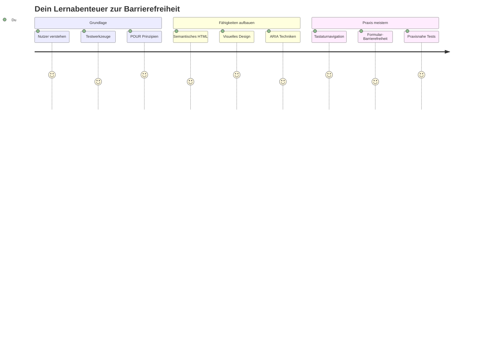
## Quiz vor der Vorlesung
[Quiz vor der Vorlesung](https://ff-quizzes.netlify.app/web/)

> Die Stärke des Webs liegt in seiner Universalität. Zugang für alle, unabhängig von Behinderung, ist ein wesentlicher Aspekt.
>
> \- Sir Timothy Berners-Lee, W3C-Direktor und Erfinder des World Wide Web

Hier ist etwas, das Sie vielleicht überraschen wird: Wenn Sie barrierefreie Websites erstellen, helfen Sie nicht nur Menschen mit Behinderungen – Sie machen das Web tatsächlich für alle besser!

Ist Ihnen schon mal aufgefallen, wie Bordsteinabsenkungen an Straßenecken ursprünglich für Rollstühle gedacht waren, aber jetzt auch Menschen mit Kinderwagen, Lieferanten mit Sackkarren, Reisenden mit Rollenreisetaschen und Radfahrern helfen? Genau so funktioniert barrierefreies Webdesign – Lösungen, die einer Gruppe helfen, kommen oft allen zugute. Ziemlich cool, oder?

In dieser Lektion werden wir erkunden, wie man Webseiten erstellt, die wirklich für alle funktionieren, egal wie sie das Web nutzen. Sie entdecken praktische Techniken, die bereits in Webstandards integriert sind, probieren Testwerkzeuge aus und sehen, wie Barrierefreiheit Ihre Seiten für alle Benutzer benutzerfreundlicher macht.

Am Ende dieser Lektion werden Sie das Vertrauen haben, Barrierefreiheit zu einem natürlichen Teil Ihres Entwicklungs-Workflows zu machen. Bereit zu entdecken, wie durchdachte Designentscheidungen das Web für Milliarden von Nutzern öffnen können? Los geht’s!

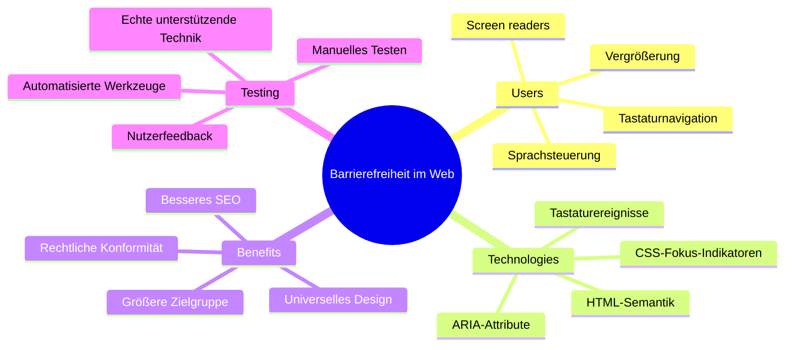
> Sie können diese Lektion auch auf [Microsoft Learn](https://docs.microsoft.com/learn/modules/web-development-101/accessibility/?WT.mc_id=academic-77807-sagibbon) absolvieren!

## Verstehen von assistiven Technologien

Bevor wir ins Programmieren einsteigen, nehmen wir uns einen Moment Zeit, um zu verstehen, wie Menschen mit unterschiedlichen Fähigkeiten das Web tatsächlich erleben. Das ist nicht nur Theorie – das Verständnis dieser realen Navigationsmuster macht Sie zu einem viel besseren Entwickler!

Assistive Technologien sind ziemlich erstaunliche Werkzeuge, die Menschen mit Behinderungen helfen, mit Webseiten auf überraschende Weise zu interagieren. Sobald Sie verstanden haben, wie diese Technologien funktionieren, wird das Erstellen barrierefreier Web-Erlebnisse viel intuitiver. Es ist, als würden Sie lernen, Ihren Code mit den Augen eines anderen zu sehen.

### Bildschirmleser

[Screen Reader](https://de.wikipedia.org/wiki/Bildschirmleser) sind ziemlich ausgeklügelte Technologien, die digitalen Text in Sprache oder Braille-Ausgabe umwandeln. Während sie hauptsächlich von Menschen mit Sehbehinderungen verwendet werden, sind sie auch sehr hilfreich für Nutzer mit Lernschwächen wie Legasthenie.

Ich stelle mir einen Screen Reader gerne als einen sehr klugen Erzähler vor, der Ihnen ein Buch vorliest. Er liest Inhalte in logischer Reihenfolge vor, kündigt interaktive Elemente wie „Schaltfläche“ oder „Link“ an und bietet Tastenkürzel, um schnell auf der Seite zu navigieren. Aber hier ist der Knackpunkt – Screen Reader können ihre Magie nur entfalten, wenn wir Webseiten mit korrekter Struktur und sinnvollem Inhalt bauen. Hier kommen Sie als Entwickler ins Spiel!

**Beliebte Screen Reader auf verschiedenen Plattformen:**
- **Windows**: [NVDA](https://www.nvaccess.org/about-nvda/) (kostenlos und am weitesten verbreitet), [JAWS](https://webaim.org/articles/jaws/), [Narrator](https://support.microsoft.com/windows/complete-guide-to-narrator-e4397a0d-ef4f-b386-d8ae-c172f109bdb1/?WT.mc_id=academic-77807-sagibbon) (eingebaut)
- **macOS/iOS**: [VoiceOver](https://support.apple.com/guide/voiceover/welcome/10) (eingebaut und sehr leistungsfähig)
- **Android**: [TalkBack](https://support.google.com/accessibility/android/answer/6283677) (eingebaut)
- **Linux**: [Orca](https://wiki.gnome.org/Projects/Orca) (kostenlos und Open Source)

**Wie Screen Reader durch Webinhalte navigieren:**

Screen Reader bieten verschiedene Navigationsmethoden, die das Surfen für erfahrene Nutzer effizient machen:
- **Sequenzielles Lesen**: Liest Inhalte von oben nach unten, wie ein Buch
- **Landmarken-Navigation**: Springt zwischen Seitenabschnitten (Kopfzeile, Navigation, Hauptbereich, Fußzeile)
- **Überschriften-Navigation**: Überspringt zwischen Überschriften, um die Seitenstruktur zu verstehen
- **Linklisten**: Erstellt eine Liste aller Links für schnellen Zugriff
- **Formular-Steuerung**: Navigiert direkt zwischen Eingabefeldern und Schaltflächen

> 💡 **Das hat mich umgehauen**: 68 % der Screen Reader-Nutzer navigieren hauptsächlich über Überschriften ([WebAIM Survey](https://webaim.org/projects/screenreadersurvey9/#finding)). Das bedeutet, Ihre Überschriftenstruktur ist wie eine Landkarte für Nutzer – wenn Sie sie richtig machen, helfen Sie den Menschen buchstäblich, sich schneller in Ihren Inhalten zurechtzufinden!

### Aufbau Ihres Test-Workflows

Hier eine gute Nachricht – effektives Accessibility-Testing muss nicht überwältigend sein! Sie sollten automatisierte Werkzeuge (sie finden hervorragend offensichtliche Probleme) mit praktischem Testen kombinieren. Hier ist ein systematischer Ansatz, mit dem ich die meisten Probleme finde, ohne den ganzen Tag zu verlieren:

**Unverzichtbarer manueller Test-Workflow:**

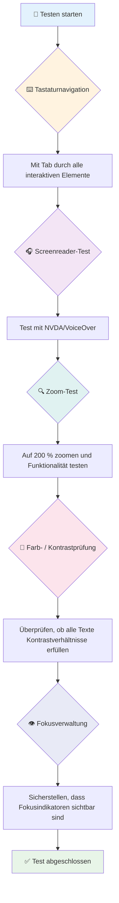
**Schritt-für-Schritt-Testcheckliste:**
1. **Tastaturnavigation**: Nur Tab, Shift+Tab, Enter, Leertaste und Pfeiltasten verwenden
2. **Screen Reader-Test**: NVDA, VoiceOver oder Narrator aktivieren und mit geschlossenen Augen navigieren
3. **Zoom-Test**: Test bei 200 % und 400 % Zoom durchführen
4. **Farbkontrastprüfung**: Alle Texte und UI-Komponenten überprüfen
5. **Fokusindikator-Test**: Sicherstellen, dass alle interaktiven Elemente sichtbare Fokuszustände haben

✅ **Beginnen Sie mit Lighthouse**: Öffnen Sie die DevTools Ihres Browsers, führen Sie ein Lighthouse-Barrierefreiheit-Audit durch und nutzen Sie die Ergebnisse, um Ihre manuellen Testbereiche zu bestimmen.

### Zoom- und Vergrößerungswerkzeuge

Sie wissen, wie Sie auf Ihrem Telefon manchmal zum Vergrößern kneifen, wenn der Text zu klein ist, oder im grellen Sonnenlicht auf Ihren Laptopbildschirm squinten? Viele Nutzer verlassen sich täglich auf Vergrößerungswerkzeuge, um Inhalte lesbar zu machen. Dazu gehören Menschen mit Sehschwäche, ältere Erwachsene und jeder, der schon einmal versucht hat, eine Webseite im Freien zu lesen.

Moderne Zoomtechnologien gehen über das bloße Vergrößern hinaus. Wenn Sie verstehen, wie diese Werkzeuge funktionieren, können Sie responsive Designs erstellen, die bei jeder Vergrößerungsstufe funktional und attraktiv bleiben.

**Moderne Zoommöglichkeiten im Browser:**
- **Seitenskalierung**: Skaliert alle Inhalte proportional (Text, Bilder, Layout) – dies ist die bevorzugte Methode
- **Nur Text-Zoom**: Erhöht die Schriftgröße bei gleichbleibendem ursprünglichen Layout
- **Pinch-to-Zoom**: Mobile Geste zur temporären Vergrößerung
- **Browserunterstützung**: Alle modernen Browser unterstützen Zoom bis zu 500 % ohne Funktionseinschränkungen

**Spezialisierte Vergrößerungssoftware:**
- **Windows**: [Bildschirm-Lupe](https://support.microsoft.com/windows/use-magnifier-to-make-things-on-the-screen-easier-to-see-414948ba-8b1c-d3bd-8615-0e5e32204198) (eingebaut), [ZoomText](https://www.freedomscientific.com/training/zoomtext/getting-started/)
- **macOS/iOS**: [Zoom](https://www.apple.com/accessibility/mac/vision/) (eingebaut mit erweiterten Funktionen)

> ⚠️ **Designüberlegung**: WCAG fordert, dass Inhalte auch bei 200 % Zoom funktional bleiben. Bei diesem Maßstab sollte horizontales Scrollen minimal sein, und alle interaktiven Elemente müssen erreichbar bleiben.

✅ **Testen Sie Ihr responsives Design**: Zoomen Sie Ihren Browser auf 200 % und 400 %. Passt sich Ihr Layout elegant an? Können Sie weiterhin alle Funktionen ohne übermäßiges Scrollen nutzen?

## Moderne Werkzeuge zum Barrierefreiheitstest

Jetzt, wo Sie verstehen, wie Menschen mit assistiven Technologien im Web navigieren, sehen wir uns die Werkzeuge an, die Ihnen helfen, barrierefreie Webseiten zu bauen und zu testen.

Man kann sagen: Automatisierte Tools sind großartig, um offensichtliche Fehler zu finden (z. B. fehlender Alt-Text), während praktisches Testen sicherstellt, dass Ihre Seite sich in der realen Welt gut anfühlt. Gemeinsam geben sie Ihnen das Vertrauen, dass Ihre Websites für alle funktionieren.

### Farbkontrastprüfung

Eine gute Nachricht: Farbkontrast ist eines der häufigsten Barrierefreiheitsprobleme, aber auch eines der leichtesten zu beheben. Guter Kontrast hilft jedem – von Nutzern mit Sehbehinderungen bis zu Menschen, die am Strand versuchen, ihr Handy zu lesen.

**WCAG-Kontrastanforderungen:**

| Texttyp | WCAG AA (Minimum) | WCAG AAA (Erweitert) |
|---------|-------------------|---------------------|
| **Normaler Text** (unter 18pt) | Kontrastverhältnis 4,5:1 | Kontrastverhältnis 7:1 |
| **Großer Text** (18pt+ oder 14pt+ fett) | Kontrastverhältnis 3:1 | Kontrastverhältnis 4,5:1 |
| **UI-Komponenten** (Buttons, Formularrahmen) | Kontrastverhältnis 3:1 | Kontrastverhältnis 3:1 |

**Unverzichtbare Testwerkzeuge:**
- [Colour Contrast Analyser](https://www.tpgi.com/color-contrast-checker/) – Desktop-App mit Farbwähler
- [WebAIM Contrast Checker](https://webaim.org/resources/contrastchecker/) – Web-basiert mit sofortigem Feedback
- [Stark](https://www.getstark.co/) – Design-Plugin für Figma, Sketch, Adobe XD
- [Accessible Colors](https://accessible-colors.com/) – Barrierefreie Farbpaletten finden

✅ **Bessere Farbpaletten erstellen**: Beginnen Sie mit Ihren Markenfarben und verwenden Sie Kontrastprüfer, um barrierefreie Variationen zu erstellen. Dokumentieren Sie diese als barrierefreie Farb-Tokens Ihres Designsystems.

### Umfassende Accessibility-Audits

Die effektivsten Accessibility-Tests kombinieren mehrere Methoden. Kein Werkzeug findet alles, daher sorgt eine Test-Routine mit verschiedenen Ansätzen für umfassende Abdeckung.

**Browserbasierte Tests (eingebaut in DevTools):**
- **Chrome/Edge**: Lighthouse Accessibility-Audit + Accessibility-Panel
- **Firefox**: Accessibility Inspector mit detaillierter Baumansicht
- **Safari**: Audit-Tab im Web Inspector mit VoiceOver-Simulation

**Professionelle Test-Erweiterungen:**
- [axe DevTools](https://www.deque.com/axe/devtools/) – Industriestandard automatisierte Tests
- [WAVE](https://wave.webaim.org/extension/) – Visuelles Feedback mit Fehlerhighlighting
- [Accessibility Insights](https://accessibilityinsights.io/) – Microsofts umfassende Testsuite

**Kommandozeilen- und CI/CD-Integration:**
- [axe-core](https://github.com/dequelabs/axe-core) – JavaScript-Bibliothek für automatisierte Tests
- [Pa11y](https://pa11y.org/) – Kommandozeilen-Tool für Accessibility-Tests
- [Lighthouse CI](https://github.com/GoogleChrome/lighthouse-ci) – Automatisiertes Accessibility-Scoring

> 🎯 **Testziel**: Streben Sie als Basiswert eine Lighthouse Accessibility Bewertung von 95+ an. Denken Sie daran, dass automatisierte Tools nur etwa 30-40 % der Barrierefreiheitsprobleme erkennen – manuelles Testen bleibt unerlässlich!

### 🧠 **Testfähigkeiten-Check: Bereit, Probleme zu finden?**

**Mal sehen, wie Sie zum Barrierefreiheitstest stehen:**
- Welche Testmethode erscheint Ihnen gerade am zugänglichsten?
- Können Sie sich vorstellen, einen ganzen Tag nur mit Tastaturnavigation zu verbringen?
- Was ist eine Barriere, die Sie persönlich online erlebt haben?

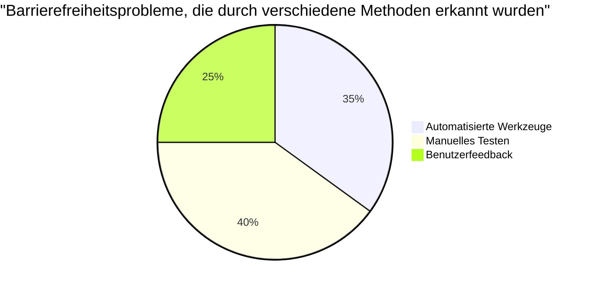
> **Selbstvertrauen stärken**: Professionelle Barrierefreiheitstester verwenden genau diese Kombination von Methoden. Sie lernen branchenübliche Praktiken!

## Barrierefreiheit von Anfang an bauen

Der Schlüssel zum Erfolg bei Barrierefreiheit ist, sie von Tag eins an in das Fundament einzubauen. Ich weiß, es ist verlockend zu denken „Barrierefreiheit füge ich später hinzu“, aber das ist, als würde man versuchen, eine Rampe an ein Haus anzubauen, das schon fertig ist. Möglich? Ja. Einfach? Nicht wirklich.

Denken Sie an Barrierefreiheit wie an die Planung eines Hauses – es ist viel leichter, Rollstuhlgängigkeit in die ursprünglichen Architekturpläne einzubeziehen, als später alles umzubauen.

### Die POUR-Prinzipien: Ihr Barrierefreiheits-Fundament

Die Web Content Accessibility Guidelines (WCAG) basieren auf vier grundlegenden Prinzipien, die das Akronym POUR bilden. Keine Sorge – das sind keine trockenen akademischen Konzepte! Es sind praktische Richtlinien, um Inhalte zu gestalten, die für alle funktionieren.

Wenn Sie POUR erstmal verinnerlicht haben, werden Entscheidungen zur Barrierefreiheit viel intuitiver. Es ist wie eine mentale Checkliste, die Ihre Designentscheidungen steuert. Lassen Sie uns das aufschlüsseln:

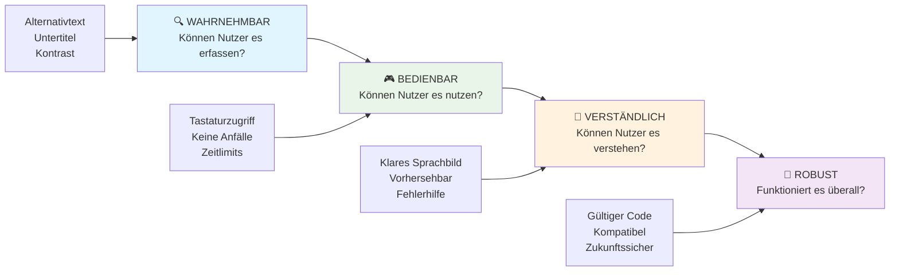
**🔍 Wahrnehmbar**: Informationen müssen so dargestellt werden, dass Nutzer sie mit ihren verfügbaren Sinnen wahrnehmen können

- Bieten Sie Textalternativen für Nicht-Text-Inhalte (Bilder, Videos, Audio)
- Sorgen Sie für ausreichend Farbkontrast bei allen Texten und UI-Komponenten
- Stellen Sie Untertitel und Transkripte für Multimedia bereit
- Gestalten Sie Inhalte so, dass sie auch bei einer Vergrößerung auf 200 % funktional bleiben
- Verwenden Sie mehrere sinnliche Merkmale (nicht nur Farbe), um Informationen zu vermitteln

**🎮 Bedienbar**: Alle Bedienelemente müssen über verfügbare Eingabemethoden bedienbar sein

- Machen Sie alle Funktionen über Tastaturnavigation zugänglich
- Geben Sie Nutzern ausreichend Zeit zum Lesen und Interagieren
- Vermeiden Sie Inhalte, die Anfälle oder vestibuläre Störungen auslösen können
- Helfen Sie Nutzern, sich mit klarer Struktur und Landmarken effizient zurechtzufinden
- Stellen Sie sicher, dass interaktive Elemente ausreichend große Zielbereiche haben (mindestens 44px)

**📖 Verständlich**: Informationen und Bedienung der Benutzeroberfläche müssen klar und nachvollziehbar sein

- Verwenden Sie klare, einfache Sprache, die zu Ihrer Zielgruppe passt
- Sorgen Sie dafür, dass Inhalte vorhersehbar und konsistent erscheinen und funktionieren
- Geben Sie klare Anweisungen und Fehlermeldungen bei Benutzereingaben
- Helfen Sie Nutzern, Fehler in Formularen zu erkennen und zu korrigieren
- Organisieren Sie Inhalte mit logischer Lesereihenfolge und Informationshierarchie

**💪 Robust**: Inhalte müssen zuverlässig mit verschiedenen Technologien und assistiven Geräten funktionieren

- **Verwenden Sie gültiges, semantisches HTML als Grundlage**
- **Sichern Sie Kompatibilität mit aktuellen und zukünftigen assistiven Technologien**
- **Befolgen Sie Webstandards und Best Practices für Markup**
- **Testen Sie verschiedene Browser, Geräte und Hilfsmittel**
- **Strukturieren Sie Inhalte so, dass sie elegant abgebaut werden, wenn erweiterte Funktionen nicht unterstützt werden**

### 🎯 **POUR-Prinzipien-Check: Nachhaltig verankern**

**Kurze Reflexion über die Grundlagen:**
- Fallen Ihnen Website-Funktionen ein, die gegen jedes der POUR-Prinzipien verstoßen?
- Welches Prinzip erscheint Ihnen als Entwickler am natürlichsten?
- Wie könnten diese Prinzipien das Design für alle verbessern, nicht nur für Nutzer mit Behinderungen?

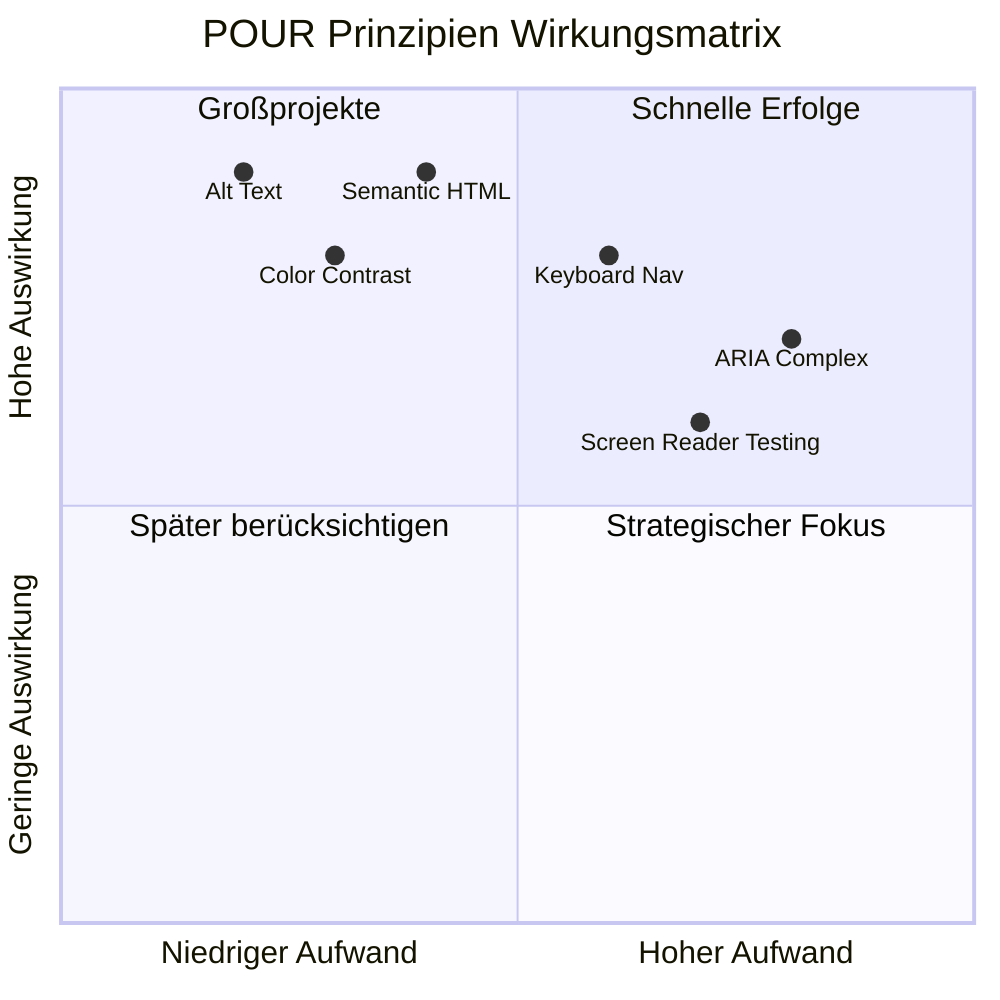
> **Merken**: Beginnen Sie mit Verbesserungen mit hoher Wirkung und geringem Aufwand. Semantisches HTML und Alt-Texte bieten den größten Barrierefreiheitsschub bei minimalem Aufwand!

## Erstellung eines zugänglichen visuellen Designs

Gutes visuelles Design und Barrierefreiheit gehen Hand in Hand. Wenn Sie mit Blick auf Barrierefreiheit entwerfen, stellen Sie oft fest, dass diese Einschränkungen zu saubereren, eleganteren Lösungen führen, die allen Nutzern zugutekommen.

Lassen Sie uns erkunden, wie man visuell ansprechende Designs erstellt, die für alle funktionieren, unabhängig von deren Sehfähigkeit oder den Bedingungen, unter denen sie Ihre Inhalte betrachten.

### Farb- und visuelle Barrierefreiheitsstrategien

Farbe ist ein mächtiges Kommunikationsmittel, sollte aber niemals die einzige Möglichkeit sein, wichtige Informationen zu vermitteln. Design jenseits von Farbe erzeugt robustere, inklusivere Erfahrungen, die in mehr Situationen funktionieren.

**Design für Unterschiede im Farbsehen:**

Ungefähr 8 % der Männer und 0,5 % der Frauen haben eine Form von Farbsehstörung (oft "Farbenblindheit" genannt). Die häufigsten Typen sind:
- **Deuteranopie**: Schwierigkeit, Rot und Grün zu unterscheiden
- **Protanopie**: Rot erscheint gedimmt
- **Tritanopie**: Schwierigkeit mit Blau und Gelb (selten)

**Inklusive Farbstrategien:**

```css
/* ❌ Bad: Using only color to indicate status */
.error { color: red; }
.success { color: green; }

/* ✅ Good: Color plus icons and context */
.error {
  color: #d32f2f;
  border-left: 4px solid #d32f2f;
}
.error::before {
  content: "⚠️";
  margin-right: 8px;
}

.success {
  color: #2e7d32;
  border-left: 4px solid #2e7d32;
}
.success::before {
  content: "✅";
  margin-right: 8px;
}
```

**Über grundlegende Kontrastanforderungen hinaus:**
- Testen Sie Ihre Farbauswahl mit Simulatoren für Farbenblindheit
- Verwenden Sie Muster, Texturen oder Formen zusätzlich zur Farbkennzeichnung
- Sorgen Sie dafür, dass interaktive Zustände auch ohne Farbe unterscheidbar bleiben
- Berücksichtigen Sie, wie Ihr Design im Hochkontrastmodus aussieht

✅ **Testen Sie Ihre Farbzugänglichkeit**: Verwenden Sie Tools wie [Coblis](https://www.color-blindness.com/coblis-color-blindness-simulator/), um zu sehen, wie Ihre Seite für Nutzer mit verschiedenen Farbsehtypen erscheint.

### Fokusindikatoren und Interaktionsdesign

Fokusindikatoren sind das digitale Äquivalent eines Cursors — sie zeigen Tastaturnutzern, wo sie sich auf der Seite befinden. Gut gestaltete Fokusindikatoren verbessern die Erfahrung für alle, indem sie Interaktionen klar und vorhersehbar machen.

**Moderne Best Practices für Fokusindikatoren:**

```css
/* Enhanced focus styles that work across browsers */
button:focus-visible {
  outline: 2px solid #0066cc;
  outline-offset: 2px;
  box-shadow: 0 0 0 4px rgba(0, 102, 204, 0.25);
}

/* Remove focus outline for mouse users, preserve for keyboard users */
button:focus:not(:focus-visible) {
  outline: none;
}

/* Focus-within for complex components */
.card:focus-within {
  box-shadow: 0 0 0 3px rgba(74, 144, 164, 0.5);
  border-color: #4A90A4;
}

/* Ensure focus indicators meet contrast requirements */
.custom-focus:focus-visible {
  outline: 3px solid #ffffff;
  outline-offset: 2px;
  box-shadow: 0 0 0 6px #000000;
}
```

**Anforderungen an Fokusindikatoren:**
- **Sichtbarkeit**: Muss mindestens ein Kontrastverhältnis von 3:1 zu umliegenden Elementen haben
- **Breite**: Mindestens 2 px Dicke um das gesamte Element
- **Beständigkeit**: Soll sichtbar bleiben, bis der Fokus woanders hingeht
- **Unterscheidbarkeit**: Muss sich visuell von anderen UI-Zuständen unterscheiden

> 💡 **Design-Tipp**: Hervorragende Fokusindikatoren verwenden oft eine Kombination aus Kontur, Box-Schatten und Farbwechseln, um die Sichtbarkeit über verschiedene Hintergründe und Kontexte hinweg zu gewährleisten.

✅ **Auditieren Sie Fokusindikatoren**: Navigieren Sie per Tab durch Ihre Webseite und notieren Sie, welche Elemente klare Fokusindikatoren aufweisen. Gibt es welche, die schwer zu erkennen oder ganz fehlend sind?

### Semantisches HTML: Die Grundlage der Barrierefreiheit

Semantisches HTML ist wie ein GPS-System für Hilfstechnologien auf Ihrer Website. Wenn Sie die richtigen HTML-Elemente für ihren vorgesehenen Zweck verwenden, liefern Sie Screenreadern, Tastaturen und anderen Tools eine detaillierte Karte, die Nutzern hilft, sich effektiv zu orientieren.

Hier eine Analogie, die bei mir voll eingeschlagen hat: Semantisches HTML ist der Unterschied zwischen einer gut organisierten Bibliothek mit klaren Kategorien und hilfreichen Schildern und einem Lagerhaus, in dem Bücher zufällig verteilt sind. Beide Orte enthalten dieselben Bücher, aber in welchem würden Sie lieber etwas suchen? Genau!

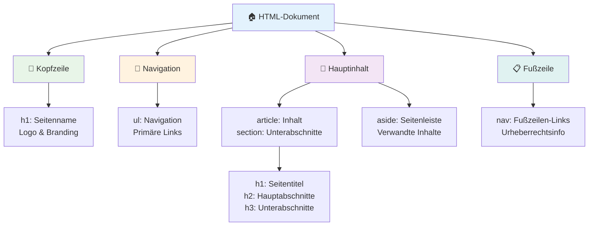
**Bausteine einer barrierefreien Seitenstruktur:**

```html
<!-- Landmark elements provide page navigation structure -->
<header>
  <h1>Your Site Name</h1>
  <nav aria-label="Main navigation">
    <ul>
      <li><a href="/home">Home</a></li>
      <li><a href="/about">About</a></li>
      <li><a href="/services">Services</a></li>
    </ul>
  </nav>
</header>

<main>
  <article>
    <header>
      <h1>Article Title</h1>
      <p>Published on <time datetime="2024-10-14">October 14, 2024</time></p>
    </header>
    
    <section>
      <h2>First Section</h2>
      <p>Content that relates to this section...</p>
    </section>
    
    <section>
      <h2>Second Section</h2>
      <p>More related content...</p>
    </section>
  </article>
  
  <aside>
    <h2>Related Links</h2>
    <nav aria-label="Related articles">
      <ul>
        <li><a href="/related-1">First related article</a></li>
        <li><a href="/related-2">Second related article</a></li>
      </ul>
    </nav>
  </aside>
</main>

<footer>
  <p>&copy; 2024 Your Site Name. All rights reserved.</p>
  <nav aria-label="Footer links">
    <ul>
      <li><a href="/privacy">Privacy Policy</a></li>
      <li><a href="/contact">Contact Us</a></li>
    </ul>
  </nav>
</footer>
```

**Warum semantisches HTML die Barrierefreiheit transformiert:**

| Semantisches Element | Zweck | Vorteil für Screenreader |
|---------------------|--------|-------------------------|
| `<header>` | Seiten- oder Abschnittskopf | "Banner-Landmarke" – schnelle Navigation zum Seitenanfang |
| `<nav>` | Navigationslinks | "Navigations-Landmarke" – Liste der Navigationsbereiche |
| `<main>` | Primärer Seiteninhalt | "Haupt-Landmarke" – direkte Sprungmöglichkeit zum Inhalt |
| `<article>` | Eigenständiger Inhalt | Markiert Artikelgrenzen |
| `<section>` | Thematisch gruppierte Inhalte | Stellt Inhaltsstruktur bereit |
| `<aside>` | Verwandte Sidebar-Inhalte | "Ergänzende Landmarke" |
| `<footer>` | Seiten- oder Abschnittsfuß | "Contentinfo-Landmarke" |

**Screenreader-Superkräfte mit semantischem HTML:**
- **Landmark-Navigation**: Sofortiges Springen zwischen wichtigen Seitenabschnitten
- **Überschriften-Gliederung**: Generiert inhaltsverzeichnisartige Übersicht basierend auf Überschriften
- **Elementlisten**: Erstellt Listen aller Links, Buttons oder Formularelemente
- **Kontextbewusstsein**: Versteht Beziehungen zwischen Inhaltsabschnitten

> 🎯 **Schnelltest**: Versuchen Sie, Ihre Seite mit einem Screenreader und Landmark-Shortcuts zu navigieren (D für Landmark, H für Überschrift, K für Link in NVDA/JAWS). Macht die Navigation Sinn?

### 🏗️ **Semantisches HTML - Meisterschaftscheck: Starke Grundlagen aufbauen**

**Bewerten wir Ihr semantisches Verständnis:**
- Können Sie Landmarken auf einer Webseite nur anhand des HTML bestimmen?
- Wie würden Sie einem Freund den Unterschied zwischen `<section>` und `<div>` erklären?
- Was würden Sie als erstes überprüfen, wenn ein Screenreader-Nutzer Navigationsprobleme meldet?

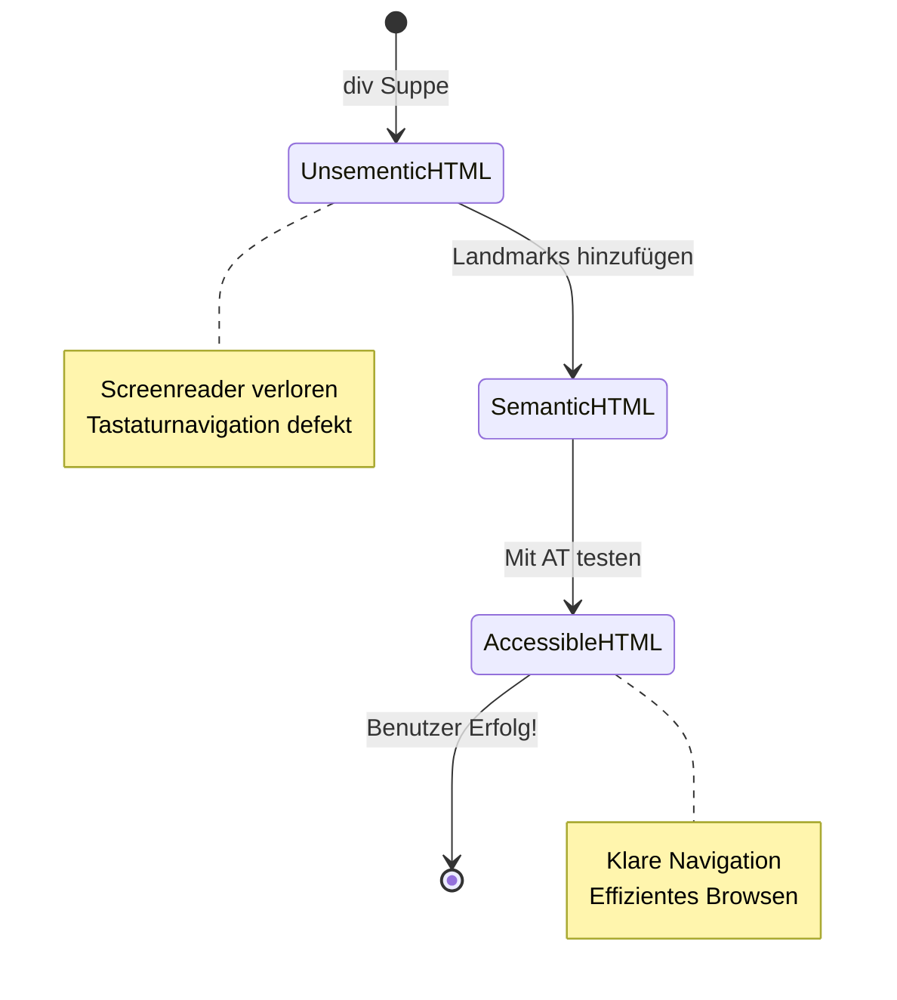
> **Profi-Tipp**: Gutes semantisches HTML löst etwa 70 % der Barrierefreiheitsprobleme automatisch. Beherrschen Sie diese Grundlage und Sie sind auf einem guten Weg!

✅ **Prüfen Sie Ihre semantische Struktur**: Verwenden Sie das Accessibility-Panel der DevTools Ihres Browsers, um den Accessibility-Baum anzusehen und zu prüfen, ob Ihr Markup eine logische Struktur erzeugt.

### Überschriftenhierarchie: Eine logische Inhaltsübersicht schaffen

Überschriften sind für barrierefreie Inhalte absolut entscheidend — sie sind wie die Wirbelsäule, die alles zusammenhält. Screenreader-Nutzer verlassen sich stark auf Überschriften, um Inhalte zu verstehen und zu navigieren. Es ist, als würden Sie Ihrem Text ein Inhaltsverzeichnis geben.

**Hier die goldene Regel für Überschriften:**
Überspringen Sie niemals Ebenen. Gehen Sie immer logisch von `<h1>` zu `<h2>` zu `<h3>` usw. Erinnern Sie sich noch, wie man in der Schule Gliederungen gemacht hat? Es ist genau dasselbe Prinzip—Sie würden nicht von "I. Hauptpunkt" direkt zu "C. Unterunterpunkt" springen, ohne einen "A. Unterpunkt" dazwischen, oder?

**Beispiel für perfekte Überschriftenstruktur:**

```html
<!-- ✅ Excellent: Logical, hierarchical progression -->
<main>
  <h1>Complete Guide to Web Accessibility</h1>
  
  <section>
    <h2>Understanding Screen Readers</h2>
    <p>Introduction to screen reader technology...</p>
    
    <h3>Popular Screen Reader Software</h3>
    <p>NVDA, JAWS, and VoiceOver comparison...</p>
    
    <h3>Testing with Screen Readers</h3>
    <p>Step-by-step testing instructions...</p>
  </section>
  
  <section>
    <h2>Color and Contrast Guidelines</h2>
    <p>Designing with sufficient contrast...</p>
    
    <h3>WCAG Contrast Requirements</h3>
    <p>Understanding the different contrast levels...</p>
    
    <h3>Testing Tools and Techniques</h3>
    <p>Tools for verifying contrast ratios...</p>
  </section>
</main>
```

```html
<!-- ❌ Problematic: Skipping levels, inconsistent structure -->
<h1>Page Title</h1>
<h3>Subsection</h3> <!-- Skipped h2 -->
<h2>This should come before h3</h2>
<h1>Another main heading?</h1> <!-- Multiple h1s -->
```

**Best Practices für Überschriften:**
- **Ein `<h1>` pro Seite**: Üblicherweise der Hauptseitentitel oder primäre Inhaltstitel
- **Logische Reihenfolge**: Niemals Ebenen überspringen (h1 → h2 → h3, nicht h1 → h3)
- **Beschreibungskraft**: Machen Sie Überschriften aussagekräftig, auch wenn sie aus dem Kontext gelesen werden
- **Visuelles Styling mit CSS**: Nutzen Sie CSS für das Aussehen, HTML-Ebenen für die Struktur

**Statistiken zur Screenreader-Navigation:**
- 68 % der Screenreader-Nutzer navigieren über Überschriften ([WebAIM Survey](https://webaim.org/projects/screenreadersurvey9/#finding))
- Nutzer erwarten eine logische Überschriftenübersicht
- Überschriften sind der schnellste Weg, Seitenstruktur zu verstehen

> 💡 **Profi-Tipp**: Verwenden Sie Browser-Erweiterungen wie „HeadingsMap“, um Ihre Überschriftenstruktur zu visualisieren. Sie sollte wie ein gut organisiertes Inhaltsverzeichnis gelesen werden.

✅ **Testen Sie Ihre Überschriftenstruktur**: Nutzen Sie die Überschriftennavigation eines Screenreaders (H-Taste in NVDA), um Ihre Überschriften abzuspringen. Erzählt die Reihenfolge logisch den Inhalt Ihrer Seite?

### Fortgeschrittene Techniken der visuellen Barrierefreiheit

Über die Grundlagen von Kontrast und Farbe hinaus gibt es ausgeklügelte Techniken, die wirklich inklusive visuelle Erfahrungen ermöglichen. Diese Methoden sorgen dafür, dass Ihre Inhalte unter verschiedenen Betrachtungsbedingungen und mit Hilfstechnologien funktionieren.

**Wesentliche Strategien für visuelle Kommunikation:**

- **Multimodales Feedback**: Kombination aus visuellen, textuellen und manchmal auditiven Hinweisen
- **Progressive Offenlegung**: Informationen in verdaulichen Portionen präsentieren
- **Konsistente Interaktionsmuster**: Vertraute UI-Konventionen verwenden
- **Responsives Typography**: Text auf verschiedenen Geräten angemessen skalieren
- **Lade- und Fehlerzustände**: Klare Rückmeldungen für alle Nutzeraktionen geben

**CSS-Dienstprogramme für verbesserte Barrierefreiheit:**

```css
/* Screen reader only text - visually hidden but accessible */
.sr-only {
  position: absolute;
  width: 1px;
  height: 1px;
  padding: 0;
  margin: -1px;
  overflow: hidden;
  clip: rect(0, 0, 0, 0);
  white-space: nowrap;
  border: 0;
}

/* Skip link for keyboard navigation */
.skip-link {
  position: absolute;
  top: -40px;
  left: 6px;
  background: #000000;
  color: #ffffff;
  padding: 8px 16px;
  text-decoration: none;
  border-radius: 4px;
  font-weight: bold;
  transition: top 0.3s ease;
  z-index: 1000;
}

.skip-link:focus {
  top: 6px;
}

/* Reduced motion respect */
@media (prefers-reduced-motion: reduce) {
  .skip-link {
    transition: none;
  }
  
  * {
    animation-duration: 0.01ms !important;
    animation-iteration-count: 1 !important;
    transition-duration: 0.01ms !important;
  }
}

/* High contrast mode support */
@media (prefers-contrast: high) {
  .button {
    border: 2px solid;
  }
}
```

> 🎯 **Barrierefreiheitsmuster**: Der „Skip Link“ ist für Tastaturnutzer essenziell. Er sollte das erste fokussierbare Element auf Ihrer Seite sein und direkt zum Hauptinhalt springen.

✅ **Implementieren Sie Skip Navigation**: Fügen Sie Skip-Links auf Ihre Seiten ein und testen Sie sie, indem Sie direkt nach dem Laden der Seite die Tab-Taste drücken. Sie sollten erscheinen und Ihnen ermöglichen, zum Hauptinhalt zu springen.

## Sinnvollen Link-Text gestalten

Links sind im Grunde die Autobahnen des Webs, aber schlecht geschriebener Linktext ist wie Verkehrsschilder, die nur „Ort“ statt „Stadtzentrum Chicago“ sagen. Nicht besonders hilfreich, oder?

Etwas, das mich total verblüfft hat, als ich es zum ersten Mal lernte: Screenreader können alle Links einer Seite extrahieren und als eine große Liste darstellen. Stellen Sie sich vor, jemand übergibt Ihnen ein Verzeichnis aller Links auf Ihrer Seite. Würde jeder einzelne Link ohne Kontext Sinn ergeben? Das ist der Test, den Ihr Linktext bestehen muss!

### Link-Navigationsmuster verstehen

Screenreader bieten mächtige Link-Navigationsfunktionen, die auf gut geschriebenem Linktext basieren:

**Methoden der Link-Navigation:**
- **Sequenzielles Lesen**: Links werden im Kontext als Teil des Inhaltsflusses gelesen
- **Linklisten-Generierung**: Alle Links der Seite kompiliert in einem durchsuchbaren Verzeichnis
- **Schnellnavigation**: Springen zwischen Links mit Tastenkombinationen (K in NVDA)
- **Suchfunktion**: Finden Sie bestimmte Links durch Eingabe von Teiltexten

**Warum Kontext wichtig ist:**
Wenn Screenreader-Nutzer eine Linkliste erzeugen, sehen sie etwa Folgendes:
- „Bericht herunterladen“
- „Mehr erfahren“
- „Hier klicken“
- „Datenschutzrichtlinie“
- „Hier klicken“

Nur zwei dieser Links bieten nützliche Informationen, wenn sie aus dem Kontext gelesen werden!

> 📊 **Nutzerwirkung**: Screenreader-Nutzer scannen Linklisten, um Seiteninhalte schnell zu verstehen. Generischer Linktext zwingt sie dazu, zu jedem Linkkontext zurückzukehren, was ihr Surferlebnis deutlich verlangsamt.

### Häufige Fehler bei Linktext, die vermieden werden sollten

Zu verstehen, was nicht funktioniert, hilft Ihnen, Barrierefreiheitsprobleme in bestehenden Inhalten zu erkennen und zu beheben.

**❌ Generischer Linktext ohne Kontext:**

```html
<!-- Meaningless when read from a link list -->
<p>Our sustainability efforts are detailed in our recent report. 
   <a href="/sustainability-2024.pdf">Click here</a> to view it.</p>

<!-- Repeated generic text throughout the page -->
<div class="article-card">
  <h3>Web Accessibility Guide</h3>
  <p>Learn the fundamentals...</p>
  <a href="/accessibility-guide">Read more</a>
</div>
<div class="article-card">
  <h3>Color Contrast Tips</h3>
  <p>Improve your design...</p>
  <a href="/color-contrast">Read more</a>
</div>

<!-- URLs as link text (difficult for screen readers to announce) -->
<p>Visit https://www.w3.org/WAI/WCAG21/quickref/ for WCAG guidelines.</p>

<!-- Vague action words -->
<a href="/contact">Go</a> | <a href="/about">See</a> | <a href="/help">View</a>
```

**Warum diese Muster versagen:**
- **„Hier klicken“** sagt Nutzern nichts über das Ziel
- **„Mehr lesen“** mehrfach wiederholt sorgt für Verwirrung
- **Unformatierte URLs** sind schwer für Screenreader auszusprechen
- **Einzelne Wörter** wie „Los“ oder „Sehen“ fehlen beschreibenden Kontext

### Hervorragenden Linktext schreiben

Beschreibender Linktext nützt allen – Nutzer mit Sehsinn können Links schneller erfassen, Screenreader-Nutzer verstehen Ziele sofort.

**✅ Beispiele für klare und beschreibende Linktexte:**

```html
<!-- Descriptive text that explains the destination -->
<p>Our comprehensive <a href="/sustainability-2024.pdf">2024 sustainability report (PDF, 2.1MB)</a> details our environmental initiatives.</p>

<!-- Specific, unique link text for each card -->
<div class="article-card">
  <h3>Web Accessibility Guide</h3>
  <p>Learn the fundamentals of inclusive design...</p>
  <a href="/accessibility-guide">Read our complete web accessibility guide</a>
</div>
<div class="article-card">
  <h3>Color Contrast Tips</h3>
  <p>Improve your design with better color choices...</p>
  <a href="/color-contrast">Explore color contrast best practices</a>
</div>

<!-- Meaningful text instead of raw URLs -->
<p>The <a href="https://www.w3.org/WAI/WCAG21/quickref/">WCAG 2.1 Quick Reference guide</a> provides comprehensive accessibility guidelines.</p>

<!-- Descriptive action links -->
<a href="/contact">Contact our support team</a> | 
<a href="/about">About our company</a> | 
<a href="/help">Get help with your account</a>
```

**Best Practices für Linktexte:**
- **Seien Sie spezifisch**: „Quartalsbericht herunterladen“ statt „Herunterladen“
- **Dateityp und Größe angeben**: „(PDF, 1,2 MB)“ bei herunterladbaren Dateien
- **Angeben, wenn Links extern öffnen**: „(öffnet in neuem Fenster)“, wenn passend
- **Aktive Sprache nutzen**: „Kontaktieren Sie uns“ statt „Kontaktseite“
- **Kurz halten**: Streben Sie 2–8 Wörter an, wenn möglich

### Fortgeschrittene Zugänglichkeitsmuster für Links

Manchmal erfordern visuelle Designvorgaben oder technische Anforderungen spezielle Lösungen. Hier sind ausgeklügelte Techniken für häufig herausfordernde Szenarien:

**ARIA für erweiterten Kontext verwenden:**

```html
<!-- When button text must be short but needs more context -->
<a href="/report.pdf" 
   aria-label="Download 2024 annual financial report, PDF format, 2.3MB">
  Download Report
</a>

<!-- When the full context comes from surrounding content -->
<h3 id="sustainability-heading">Sustainability Initiative</h3>
<p>Our efforts to reduce environmental impact...</p>
<a href="/sustainability-details" 
   aria-labelledby="sustainability-heading"
   aria-describedby="sustainability-summary">
  Learn more
</a>
<p id="sustainability-summary">Detailed breakdown of our 2024 environmental goals and achievements</p>
```

**Dateitypen und externe Ziele kennzeichnen:**

```html
<!-- Method 1: Include information in visible link text -->
<a href="/annual-report.pdf">
  Download our 2024 annual report (PDF, 2.3MB)
</a>

<!-- Method 2: Use screen reader-only text for file details -->
<a href="/annual-report.pdf">
  Download our 2024 annual report
  <span class="sr-only">(PDF format, 2.3MB)</span>
</a>

<!-- Method 3: External link indication -->
<a href="https://example.com" 
   target="_blank" 
   aria-describedby="external-link-warning">
  Visit external resource
</a>
<span id="external-link-warning" class="sr-only">
  (opens in new window)
</span>

<!-- Method 4: Using CSS for visual indicators -->
<a href="https://example.com" class="external-link">
  External resource
</a>
```

```css
/* Visual indicator for external links */
.external-link::after {
  content: " ↗";
  font-size: 0.8em;
  color: #666;
}

/* Screen reader announcement for external links */
.external-link::before {
  content: "External link: ";
  position: absolute;
  left: -10000px;
  width: 1px;
  height: 1px;
  overflow: hidden;
}
```

> ⚠️ **Wichtig**: Wenn Sie `target="_blank"` verwenden, informieren Sie Nutzer immer darüber, dass der Link in einem neuen Fenster oder Tab geöffnet wird. Unerwartete Navigationswechsel können verwirrend sein.

✅ **Testen Sie den Kontext Ihrer Links**: Nutzen Sie die Entwicklerwerkzeuge Ihres Browsers, um eine Liste aller Links auf Ihrer Seite zu generieren. Verstehen Sie den Zweck jedes Links ohne umgebenden Kontext?

## ARIA: HTML-Barrierefreiheit aufladen

[Accessible Rich Internet Applications (ARIA)](https://developer.mozilla.org/docs/Web/Accessibility/ARIA) ist wie ein universeller Übersetzer zwischen Ihren komplexen Webanwendungen und Hilfstechnologien. Wenn HTML allein nicht alles ausdrücken kann, was Ihre interaktiven Komponenten tun, springt ARIA ein, um diese Lücken zu füllen.

Ich stelle mir ARIA gerne als hilfreiche Anmerkungen im HTML vor — ähnlich wie Regieanweisungen in einem Theaterstück, die Schauspielern helfen, ihre Rollen und Beziehungen zu verstehen.

**Hier die wichtigste Regel zu ARIA**: Verwenden Sie zuerst semantisches HTML und fügen Sie ARIA nur unterstützend hinzu. Betrachten Sie ARIA als Gewürz und nicht als Hauptgericht. Es soll Ihre HTML-Struktur klarer machen und verbessern, sie niemals ersetzen. Stellen Sie diese Grundlage zuerst richtig auf!

### Strategische ARIA-Implementierung

ARIA ist mächtig, aber mit Macht kommt Verantwortung. Falsche ARIA-Anwendungen können die Barrierefreiheit verschlechtern. Hier erfahren Sie, wann und wie Sie es effektiv einsetzen:

**✅ Verwenden Sie ARIA, wenn:**
- Sie benutzerdefinierte interaktive Widgets bauen (Akkordeons, Tabs, Karussells)
- Dynamische Inhalte erstellt werden, die sich ohne Seitenneu-Laden ändern
- Zusätzlicher Kontext für komplexe UI-Beziehungen benötigt wird
- Ladezustände oder Live-Updates angezeigt werden
- App-ähnliche Oberflächen mit benutzerdefinierten Steuerelementen erstellt werden

**❌ Vermeiden Sie ARIA, wenn:**
- Standard-HTML-Elemente die nötige Semantik schon liefern
- Sie unsicher sind, wie es korrekt implementiert wird
- Es Informationen dupliziert, die semantisches HTML schon bereitstellt
- Sie nicht mit realen Hilfstechnologien getestet haben

> 🎯 **ARIA-Goldene Regel**: „Ändern Sie die Semantik nur, wenn es unbedingt nötig ist, sichern Sie immer Tastaturzugänglichkeit und testen Sie mit echten Hilfstechnologien.“
**Die fünf ARIA-Kategorien:**

1. **Rollen**: Was ist dieses Element? (`button`, `tab`, `dialog`)
2. **Eigenschaften**: Was sind seine Merkmale? (`aria-required`, `aria-haspopup`)
3. **Zustände**: Wie ist sein aktueller Zustand? (`aria-expanded`, `aria-checked`)
4. **Landmarks**: Wo befindet es sich in der Seitenstruktur? (`banner`, `navigation`, `main`)
5. **Live-Regionen**: Wie sollten Änderungen angekündigt werden? (`aria-live`, `aria-atomic`)

### Wesentliche ARIA-Muster für moderne Web-Apps

Diese Muster lösen die häufigsten Barrierefreiheitsherausforderungen in interaktiven Webanwendungen:

**Elemente benennen und beschreiben:**

```html
<!-- aria-label: Provides accessible name when visible text isn't sufficient -->
<button aria-label="Close newsletter subscription dialog">×</button>

<!-- aria-labelledby: References existing text as the accessible name -->
<section aria-labelledby="news-heading">
  <h2 id="news-heading">Latest News</h2>
  <!-- news content -->
</section>

<!-- aria-describedby: Links to additional descriptive text -->
<input type="password" 
       aria-describedby="pwd-requirements pwd-strength"
       required>
<div id="pwd-requirements">
  Password must contain at least 8 characters, including uppercase, lowercase, and numbers.
</div>
<div id="pwd-strength" aria-live="polite">
  <!-- Dynamic password strength indicator -->
</div>
```

**Live-Regionen für dynamische Inhalte:**

```html
<!-- Polite announcements (don't interrupt current speech) -->
<div aria-live="polite" id="status-updates">
  <!-- Status messages appear here -->
</div>

<!-- Assertive announcements (interrupt and announce immediately) -->
<div aria-live="assertive" id="urgent-alerts">
  <!-- Error messages and critical alerts -->
</div>

<!-- Loading states with live regions -->
<button id="submit-btn" aria-describedby="loading-status">
  Submit Application
</button>
<div id="loading-status" aria-live="polite" aria-atomic="true">
  <!-- "Processing your application..." appears here -->
</div>
```

**Beispiel für ein interaktives Widget (Akkordeon):**

```html
<div class="accordion">
  <h3>
    <button aria-expanded="false" 
            aria-controls="panel-1" 
            id="accordion-trigger-1"
            class="accordion-trigger">
      Accessibility Guidelines
    </button>
  </h3>
  <div id="panel-1" 
       role="region"
       aria-labelledby="accordion-trigger-1" 
       hidden>
    <p>WCAG 2.1 provides comprehensive guidelines...</p>
  </div>
</div>
```

```javascript
// JavaScript zur Verwaltung des Akkordeonzustands
function toggleAccordion(trigger) {
  const panel = document.getElementById(trigger.getAttribute('aria-controls'));
  const isExpanded = trigger.getAttribute('aria-expanded') === 'true';
  
  // Zustände umschalten
  trigger.setAttribute('aria-expanded', !isExpanded);
  panel.hidden = isExpanded;
  
  // Änderung für Screenreader ankündigen
  const status = document.getElementById('status-updates');
  status.textContent = isExpanded ? 'Section collapsed' : 'Section expanded';
}
```

### Beste Praktiken zur ARIA-Implementierung

ARIA ist mächtig, erfordert aber sorgfältige Implementierung. Das Befolgen dieser Richtlinien stellt sicher, dass Ihre ARIA die Barrierefreiheit verbessert, statt sie zu behindern:

**🛡️ Grundprinzipien:**

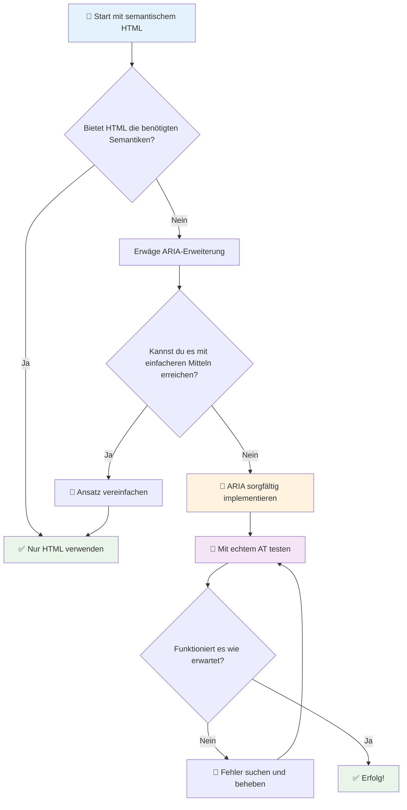
1. **Zuerst semantisches HTML**: Bevorzugen Sie stets `<button>` gegenüber `<div role="button">`
2. **Semantik nicht brechen**: Überschreiben Sie niemals die Bedeutung bestehenden HTML (vermeiden Sie `<h1 role="button">`)
3. **Tastaturzugänglichkeit erhalten**: Alle interaktiven ARIA-Elemente müssen vollständig per Tastatur bedienbar sein
4. **Mit echten Nutzern testen**: ARIA-Unterstützung variiert stark zwischen verschiedenen unterstützenden Technologien
5. **Einfach anfangen**: Komplexe ARIA-Implementierungen sind anfälliger für Fehler

**🔍 Testablauf:**

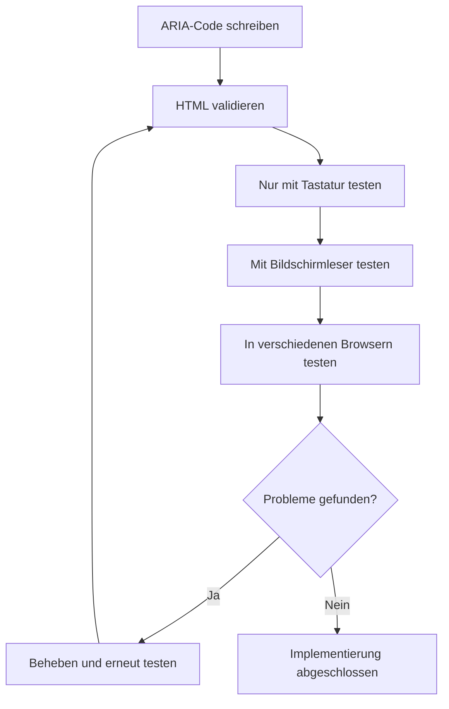
**🚫 Häufige ARIA-Fehler vermeiden:**

- **Widersprüchliche Informationen**: Nicht die HTML-Semantik widersprechen
- **Übermäßige Beschriftung**: Zu viele ARIA-Informationen überfordern Nutzer
- **Statische ARIA**: Das Aktualisieren von ARIA-Zuständen bei Inhaltsänderungen vergessen
- **Ungetestete Implementierungen**: ARIA, das in der Theorie funktioniert, aber in der Praxis versagt
- **Fehlende Tastaturunterstützung**: ARIA-Rollen ohne entsprechende Tastaturbedienung

> 💡 **Testressourcen**: Verwenden Sie Tools wie [accessibility-checker](https://www.npmjs.com/package/accessibility-checker) für automatisierte ARIA-Validierung, testen Sie aber immer auch mit echten Screenreadern für das vollständige Erlebnis.

### 🎭 **ARIA-Fähigkeiten-Test: Bereit für komplexe Interaktionen?**

**Bewerten Sie Ihr ARIA-Verständnis:**
- Wann würden Sie ARIA gegenüber semantischem HTML wählen? (Tipp: fast nie!)
- Können Sie erklären, warum `<div role="button">` meist schlechter als `<button>` ist?
- Was ist das Wichtigste, das man beim ARIA-Testing beachten muss?

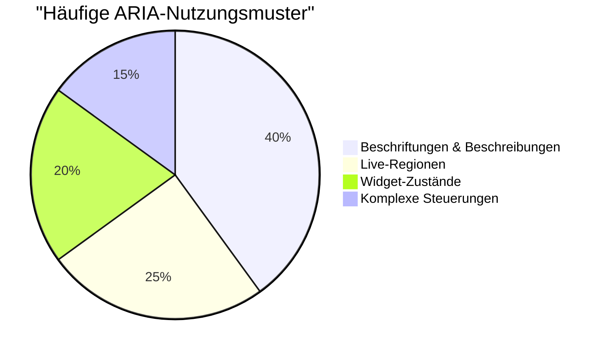
> **Wichtige Erkenntnis**: Die meisten ARIA-Anwendungen dienen zum Benennen und Beschreiben von Elementen. Komplexe Widget-Muster sind viel seltener als man denkt!

✅ **Von Experten lernen**: Studieren Sie den [ARIA Authoring Practices Guide](https://w3c.github.io/aria-practices/) für bewährte Muster und Implementationen komplexer interaktiver Widgets.

## Bilder und Medien zugänglich machen

Visuelle und auditive Inhalte sind wesentliche Bestandteile moderner Web-Erlebnisse, können aber Barrieren schaffen, wenn sie nicht durchdacht umgesetzt werden. Ziel ist es, sicherzustellen, dass Informationen und emotionale Wirkung Ihrer Medien jeden Nutzer erreichen. Sobald man den Dreh raus hat, wird es zur Routine.

Verschiedene Medientypen brauchen unterschiedliche Barrierefreiheitsansätze. Es ist wie beim Kochen – man behandelt einen zarten Fisch nicht wie ein kräftiges Steak. Diese Unterschiede zu verstehen hilft Ihnen, für jede Situation die richtige Lösung zu wählen.

### Strategische Bildzugänglichkeit

Jedes Bild auf Ihrer Website erfüllt einen Zweck. Die Kenntnis dieses Zwecks hilft Ihnen, bessere Alternativtexte zu schreiben und inklusivere Erlebnisse zu schaffen.

**Die vier Bildtypen und ihre Alt-Text-Strategien:**

**Informative Bilder** – vermitteln wichtige Informationen:  
```html

```

**Dekorative Bilder** – rein visuell ohne Informationswert:  
```html

```

**Funktionale Bilder** – dienen als Schaltflächen oder Steuerungen:  
```html
<button>
  
</button>
```

**Komplexe Bilder** – Diagramme, Grafiken, Infografiken:  
```html

<div id="chart-description">
  <p>Detailed description: Sales data shows a steady increase across all quarters...</p>
</div>
```

### Barrierefreiheit bei Video und Audio

**Videoanforderungen:**  
- **Untertitel**: Textversion gesprochener Inhalte und Soundeffekte  
- **Audiodeskriptionen**: Beschreibung visueller Elemente für blinde Nutzer  
- **Transkripte**: Vollständige Textfassung aller Audio- und visuellen Inhalte  

```html
<video controls>
  <source src="video.mp4" type="video/mp4">
  <track kind="captions" src="captions.vtt" srclang="en" label="English">
  <track kind="descriptions" src="descriptions.vtt" srclang="en" label="Audio descriptions">
</video>
```

**Audioanforderungen:**  
- **Transkripte**: Textfassung aller gesprochenen Inhalte  
- **Visuelle Indikatoren**: Für reine Audioinhalte visuelle Hinweise bereitstellen  

### Moderne Bildtechniken

**CSS für dekorative Bilder verwenden:**  
```css
.hero-section {
  background-image: url('decorative-hero.jpg');
  /* Decorative images in CSS don't need alt text */
}
```

**Responsives Bild mit Barrierefreiheit:**  
```html
<picture>
  <source media="(min-width: 800px)" srcset="large-chart.png">
  <source media="(min-width: 400px)" srcset="medium-chart.png">
  
</picture>
```

✅ **Bildzugänglichkeit testen**: Nutzen Sie einen Screenreader, um eine Seite mit Bildern zu navigieren. Erhalten Sie ausreichend Informationen, um den Inhalt zu verstehen?

## Tastaturnavigation und Fokusmanagement

Viele Nutzer navigieren vollständig mit der Tastatur. Dazu gehören Menschen mit motorischen Einschränkungen, Power-User, die Tastaturen schneller als Mäuse finden, und jeder, dessen Maus nicht funktioniert. Sicherzustellen, dass Ihre Seite gut per Tastatur bedienbar ist, ist essentiell und macht die Seite oft auch für alle nutzer effizienter.

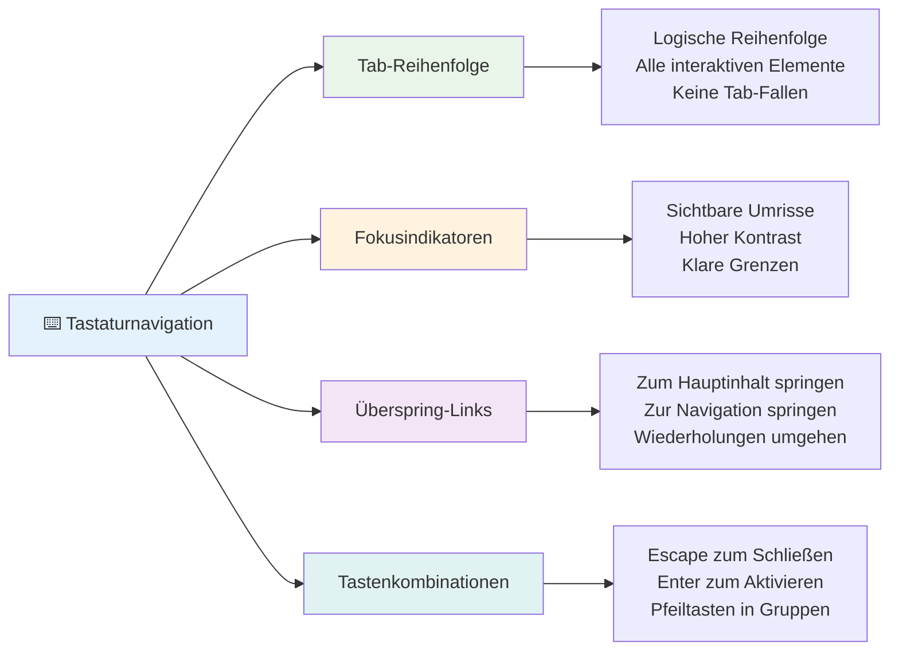
### Wesentliche Tastaturnavigationsmuster

**Standard-Tastaturbedienung:**  
- **Tab**: Fokus vorwärts durch interaktive Elemente bewegen  
- **Shift + Tab**: Fokus rückwärts bewegen  
- **Enter**: Buttons und Links aktivieren  
- **Leertaste**: Buttons aktivieren, Checkboxen markieren  
- **Pfeiltasten**: Navigation innerhalb von Komponenten-Gruppen (Radio-Buttons, Menüs)  
- **Escape**: Modale Fenster, Dropdowns schließen oder Vorgänge abbrechen  

### Besten Praktiken beim Fokusmanagement

**Sichtbare Fokusindikatoren:**  
```css
/* Ensure focus is always visible */
button:focus-visible {
  outline: 2px solid #4A90A4;
  outline-offset: 2px;
}

/* Custom focus styles for different components */
.card:focus-within {
  box-shadow: 0 0 0 3px rgba(74, 144, 164, 0.5);
}
```

**Skip-Links für effizientes Navigieren:**  
```html
<a href="#main-content" class="skip-link">Skip to main content</a>
<a href="#navigation" class="skip-link">Skip to navigation</a>

<nav id="navigation">
  <!-- navigation content -->
</nav>
<main id="main-content">
  <!-- main content -->
</main>
```

**Korrekte Tab-Reihenfolge:**  
```html
<!-- Use semantic HTML for natural tab order -->
<form>
  <label for="name">Name:</label>
  <input type="text" id="name" tabindex="0">
  
  <label for="email">Email:</label>
  <input type="email" id="email" tabindex="0">
  
  <button type="submit" tabindex="0">Submit</button>
</form>
```

### Fokusfalle in Modalen

Beim Öffnen modaler Dialoge soll der Fokus innerhalb des Modals eingeschlossen sein:

```javascript
// Moderne Fokusfalle-Implementierung
function trapFocus(element) {
  const focusableElements = element.querySelectorAll(
    'button, [href], input, select, textarea, [tabindex]:not([tabindex="-1"])'
  );
  
  const firstElement = focusableElements[0];
  const lastElement = focusableElements[focusableElements.length - 1];

  element.addEventListener('keydown', (e) => {
    if (e.key === 'Tab') {
      if (e.shiftKey && document.activeElement === firstElement) {
        e.preventDefault();
        lastElement.focus();
      } else if (!e.shiftKey && document.activeElement === lastElement) {
        e.preventDefault();
        firstElement.focus();
      }
    }
    
    if (e.key === 'Escape') {
      closeModal();
    }
  });
  
  // Fokus auf das erste Element setzen, wenn das Modal geöffnet wird
  firstElement.focus();
}
```

✅ **Tastaturnavigation testen**: Versuchen Sie, Ihre Website nur mit der Tab-Taste zu bedienen. Erreichen Sie alle interaktiven Elemente? Ist die Fokusreihenfolge logisch? Sind Fokusindikatoren klar sichtbar?

## Barrierefreiheit bei Formularen

Formulare sind entscheidend für die Nutzerinteraktion und benötigen besondere Aufmerksamkeit hinsichtlich der Zugänglichkeit.

### Label und Formularsteuerung zuordnen

**Jeder Formularelement benötigt ein Label:**  
```html
<!-- Explicit labeling (preferred) -->
<label for="username">Username:</label>
<input type="text" id="username" name="username" required>

<!-- Implicit labeling -->
<label>
  Password:
  <input type="password" name="password" required>
</label>

<!-- Using aria-label when visual label isn't desired -->
<input type="search" aria-label="Search products" placeholder="Search...">
```

### Fehlerbehandlung und Validierung

**Barrierefreie Fehlermeldungen:**  
```html
<label for="email">Email Address:</label>
<input type="email" id="email" name="email" 
       aria-describedby="email-error" 
       aria-invalid="true" required>
<div id="email-error" role="alert">
  Please enter a valid email address
</div>
```

**Best Practices der Formularvalidierung:**  
- Verwenden Sie `aria-invalid` zur Kennzeichnung ungültiger Felder  
- Bieten Sie klare, spezifische Fehlermeldungen  
- Nutzen Sie `role="alert"` für wichtige Fehlermeldungen  
- Zeigen Sie Fehler unmittelbar und bei Formularabsendung an  

### Fieldsets und Gruppierung

**Verwandte Formularelemente gruppieren:**  
```html
<fieldset>
  <legend>Shipping Address</legend>
  <label for="street">Street Address:</label>
  <input type="text" id="street" name="street">
  
  <label for="city">City:</label>
  <input type="text" id="city" name="city">
</fieldset>

<fieldset>
  <legend>Preferred Contact Method</legend>
  <input type="radio" id="contact-email" name="contact" value="email">
  <label for="contact-email">Email</label>
  
  <input type="radio" id="contact-phone" name="contact" value="phone">
  <label for="contact-phone">Phone</label>
</fieldset>
```

## Ihre Barrierefreiheitsreise: Wichtige Erkenntnisse

Herzlichen Glückwunsch! Sie haben soeben das grundlegende Wissen erworben, um wirklich inklusive Web-Erlebnisse zu gestalten. Das ist ziemlich spannend! Barrierefreiheit im Web ist nicht nur das Abhaken von Compliance-Punkten – es bedeutet, die vielfältigen Arten zu erkennen, wie Menschen digitale Inhalte nutzen, und für diese großartige Komplexität zu gestalten.

Sie sind jetzt Teil einer wachsenden Entwicklergemeinschaft, die versteht, dass gutes Design für alle funktioniert. Willkommen im Club!

**🎯 Ihr Barrierefreiheits-Werkzeugkasten beinhaltet jetzt:**

| Grundprinzip | Umsetzung | Wirkung |
|--------------|-----------|---------|
| **Semantische HTML-Grundlage** | Richtige HTML-Elemente zweckgemäß verwenden | Screenreader navigieren effizient, Tastaturen funktionieren automatisch |
| **Inklusives visuelles Design** | Ausreichender Kontrast, sinnvolle Farbwahl, sichtbare Fokusindikatoren | Klar für alle bei jeder Beleuchtungssituation |
| **Beschreibende Inhalte** | Bedeutungsvolle Linktexte, Alt-Texte, Überschriften | Benutzer verstehen Inhalte auch ohne visuelle Kontextinformation |
| **Tastaturzugänglichkeit** | Tab-Reihenfolge, Tastaturkürzel, Fokusmanagement | Motorische Barrierefreiheit und Effizienz für Power-User |
| **ARIA-Erweiterung** | Strategischer Einsatz zur Schließung semantischer Lücken | Komplexe Anwendungen arbeiten mit assistiven Technologien |
| **Umfassende Tests** | Automatisierte Tools + manuelle Überprüfung + Tests mit echten Nutzern | Fehler erkennen, bevor sie Nutzer beeinträchtigen |

**🚀 Ihre nächsten Schritte:**

1. **Barrierefreiheit in Ihren Workflow einbauen**: Machen Sie Tests zum natürlichen Bestandteil Ihres Entwicklungsprozesses  
2. **Von echten Nutzern lernen**: Holen Sie Feedback von Menschen, die assistive Technologien nutzen  
3. **Aktuell bleiben**: Barrierefreiheitstechniken entwickeln sich mit neuen Technologien und Standards weiter  
4. **Für Inklusion eintreten**: Teilen Sie Ihr Wissen und machen Sie Barrierefreiheit zur Teampriorität  

> 💡 **Denken Sie daran**: Barrieren führen oft zu innovativen, eleganten Lösungen, die allen zugutekommen. Bordsteinkantenabsenkungen, Untertitel und Sprachsteuerung begannen als Barrierefreiheitsmerkmale und wurden zum Mainstream-Verbesserungen.

**Der geschäftliche Nutzen ist glasklar**: Barrierefreie Webseiten erreichen mehr Nutzer, ranken besser in Suchmaschinen, haben niedrigere Wartungskosten und vermeiden rechtliche Risiken. Aber ehrlich? Der eigentliche Grund, sich um Barrierefreiheit zu kümmern, ist viel tiefer. Barrierefreie Webseiten verkörpern die besten Werte des Webs – Offenheit, Inklusivität und die Idee, dass jeder gleichberechtigten Zugang zu Informationen verdient.

Sie sind jetzt gerüstet, das inklusive Web der Zukunft zu gestalten. Jede barrierefreie Seite, die Sie erstellen, macht das Internet für alle einladender. Das ist ziemlich großartig, wenn man darüber nachdenkt!

## Zusätzliche Ressourcen

Setzen Sie Ihre Barrierefreiheitsschulung fort mit diesen wichtigen Ressourcen:

**📚 Offizielle Standards und Richtlinien:**  
- [WCAG 2.1 Richtlinien](https://www.w3.org/WAI/WCAG21/quickref/) – Der offizielle Barrierefreiheitsstandard mit Schnellübersicht  
- [ARIA Authoring Practices Guide](https://w3c.github.io/aria-practices/) – Umfangreiche Muster für interaktive Widgets  
- [WebAIM Richtlinien](https://webaim.org/) – Praktische, anfängerfreundliche Barrierefreiheitsanleitungen  

**🛠️ Tools und Testressourcen:**  
- [axe DevTools](https://www.deque.com/axe/devtools/) – Branchenübliche Barrierefreiheitstestsoftware  
- [A11y Project Checklist](https://www.a11yproject.com/checklist/) – Schritt-für-Schritt-Verifikation der Barrierefreiheit  
- [Accessibility Insights](https://accessibilityinsights.io/) – Microsofts umfassende Testsuite  
- [Color Oracle](https://colororacle.org/) – Farbschwächesimulator für Design-Tests  

**🎓 Lernen und Gemeinschaft:**  
- [WebAIM Screen Reader Survey](https://webaim.org/projects/screenreadersurvey9/) – Präferenzen und Verhalten echter Nutzer  
- [Inclusive Components](https://inclusive-components.design/) – Moderne barrierefreie Komponenten-Muster  
- [A11y Coffee](https://a11y.coffee/) – Schnelle Tipps und Einblicke zu Barrierefreiheit  
- [Web Accessibility Initiative (WAI)](https://www.w3.org/WAI/) – Umfangreiche Barrierefreiheitsressourcen des W3C  

**🎥 Praxisnahes Lernen:**  
- [Accessibility Developer Guide](https://www.accessibility-developer-guide.com/) – Praktische Implementierungsanleitungen  
- [Deque University](https://dequeuniversity.com/) – Professionelle Barrierefreiheitskurse  

## GitHub Copilot Agent Challenge 🚀

Verwenden Sie den Agent-Modus, um folgende Herausforderung zu lösen:

**Beschreibung:** Erstellen Sie eine barrierefreie modale Dialog-Komponente, die korrektes Fokusmanagement, ARIA-Attribute und Tastaturnavigationsmuster demonstriert.

**Aufgabe:** Bauen Sie eine vollständige modale Dialog-Komponente mit HTML, CSS und JavaScript, die Folgendes umfasst: korrektes Fokuseinschluss, ESC-Taste zum Schließen, Klick außen zum Schließen, ARIA-Attribute für Screenreader und sichtbare Fokusindikatoren. Das Modal soll ein Formular mit korrekten Labels und Fehlerbehandlung enthalten. Stellen Sie sicher, dass die Komponente die WCAG 2.1 AA-Standards erfüllt.


## 🚀 Herausforderung

Nehmen Sie dieses HTML und schreiben Sie es so barrierefrei wie möglich um, basierend auf den erlernten Strategien.

```html
<!DOCTYPE html>
<html lang="en">
  <head>
    <meta charset="UTF-8">
    <meta name="viewport" content="width=device-width, initial-scale=1.0">
    <title>Turtle Ipsum - The World's Premier Turtle Fan Club</title>
    <link href='../assets/style.css' rel='stylesheet' type='text/css'>
  </head>
  <body>
    <header class="site-header">
      <h1 class="site-title">Turtle Ipsum</h1>
      <p class="site-subtitle">The World's Premier Turtle Fan Club</p>
    </header>
    
    <nav class="main-nav" aria-label="Main navigation">
      <h2 class="nav-header">Resources</h2>
      <ul class="nav-list">
        <li><a href="https://www.youtube.com/watch?v=CMNry4PE93Y">"I like turtles" video</a></li>
        <li><a href="https://en.wikipedia.org/wiki/Turtle">Basic turtle information</a></li>
        <li><a href="https://en.wikipedia.org/wiki/Turtles_(chocolate)">Chocolate turtles candy</a></li>
      </ul>
    </nav>
    
    <main class="main-content">
      <article>
        <h1>Welcome to Turtle Ipsum</h1>
        <p class="intro">
          <a href="/about">Learn more about our turtle community</a> and discover fascinating facts about these amazing creatures.
        </p>
        <p class="article-text">
          Turtle ipsum dolor sit amet, consectetur adipiscing elit, sed do eiusmod tempor incididunt ut labore et dolore magna aliqua. Ut enim ad minim veniam, quis nostrud exercitation ullamco laboris nisi ut aliquip ex ea commodo consequat. Duis aute irure dolor in reprehenderit in voluptate velit esse cillum dolore eu fugiat nulla pariatur. Excepteur sint occaecat cupidatat non proident, sunt in culpa qui officia deserunt mollit anim id est laborum.
        </p>
      </article>
    </main>
    
    <footer class="footer">
      <section class="newsletter-signup">
        <h2>Stay Updated</h2>
        <button type="button" onclick="showNewsletterForm()">Sign up for turtle news</button>
      </section>
      
      <nav class="footer-nav" aria-label="Footer navigation">
        <h2>Site Pages</h2>
        <ul>
          <li><a href="../">Home</a></li>
          <li><a href="../semantic">Semantic HTML example</a></li>
        </ul>
      </nav>
      
      <p class="footer-copyright">&copy; 2024 Instrument. All rights reserved.</p>
    </footer>
  </body>
</html>
```

**Wesentliche Verbesserungen:**  
- Korrekte semantische HTML-Struktur hinzugefügt  
- Überschriften-Hierarchie korrigiert (einzelnes h1, logische Reihenfolge)  
- Bedeutungsvolle Linktexte anstelle von "hier klicken" eingefügt  
- Korrekte ARIA-Labels für Navigation ergänzt  
- Lang-Attribut und passende Meta-Tags hinzugefügt  
- Button-Element für interaktive Elemente verwendet  
- Footer-Inhalte mit passenden Landmarks strukturiert  

## Nachvorlesungs-Quiz  
[Nachvorlesungs-Quiz](https://ff-quizzes.netlify.app/web/en/)

## Wiederholung & Selbststudium

Viele Regierungen haben Gesetze zu Barrierefreiheitsanforderungen. Informieren Sie sich über die Barrierefreiheitsgesetze in Ihrem Heimatland. Was ist abgedeckt, was nicht? Ein Beispiel ist [diese Regierungs-Webseite](https://accessibility.blog.gov.uk/).

## Aufgabe
 
[Analysiere eine nicht barrierefreie Webseite](assignment.md)

Credits: [Turtle Ipsum](https://github.com/Instrument/semantic-html-sample) von Instrument

---

## 🚀 Ihr Zeitplan zur Barrierefreiheit-Beherrschung

### ⚡ **Was Sie in den nächsten 5 Minuten tun können**
- [ ] Installation der axe DevTools-Erweiterung in Ihrem Browser  
- [ ] Führen Sie ein Lighthouse-Barrierefreiheit-Audit auf Ihrer Lieblingswebseite durch  
- [ ] Navigieren Sie eine beliebige Webseite nur mit der Tab-Taste  
- [ ] Testen Sie den integrierten Screenreader Ihres Browsers (Narrator/VoiceOver)  

### 🎯 **Was Sie in dieser Stunde schaffen können**
- [ ] Nehmen Sie am Nach-Lektion-Quiz teil und reflektieren Sie Ihre Barrierefreiheits-Erkenntnisse  
- [ ] Üben Sie, für 10 verschiedene Bilder aussagekräftige Alt-Texte zu schreiben  
- [ ] Prüfen Sie die Überschriftenstruktur einer Webseite mit der HeadingsMap-Erweiterung  
- [ ] Beheben Sie im Challenge-HTML gefundene Barrierefreiheitsprobleme  
- [ ] Testen Sie den Farbkontrast Ihres aktuellen Projekts mit dem Tool von WebAIM  

### 📅 **Ihr barrierefreier Wochenplan**
- [ ] Bearbeiten Sie die Aufgabe zur Analyse einer nicht barrierefreien Webseite  
- [ ] Richten Sie Ihre Entwicklungsumgebung mit Barrierefreiheitstest-Tools ein  

- [ ] Übe die Tastaturnavigation auf 5 verschiedenen komplexen Websites
- [ ] Baue ein einfaches Formular mit korrekten Labels, Fehlerbehandlung und ARIA
- [ ] Tritt einer Barrierefreiheits-Community bei (A11y Slack, WebAIM-Forum)
- [ ] Beobachte echte Nutzer mit Behinderungen, wie sie Websites navigieren (YouTube hat großartige Beispiele)

### 🌟 **Deine einmonatige Transformation**
- [ ] Integriere Barrierefreiheits-Tests in deinen Entwicklungs-Workflow
- [ ] Trage zu einem Open-Source-Projekt bei, indem du Barrierefreiheitsprobleme behebst
- [ ] Führe Usability-Tests mit jemandem durch, der assistive Technologien verwendet
- [ ] Erstelle eine barrierefreie Komponentenbibliothek für dein Team
- [ ] Setze dich in deinem Arbeitsplatz oder deiner Community für Barrierefreiheit ein
- [ ] Betreue jemanden, der neu in Barrierefreiheitskonzepte einsteigt

### 🏆 **Abschließender Check-in des Barrierefreiheits-Champions**

**Feiere deine Reise zur Barrierefreiheit:**
- Was ist das Überraschendste, das du darüber gelernt hast, wie Menschen das Web nutzen?
- Welches Barrierefreiheitsprinzip spricht dich am meisten in deinem Entwicklungsstil an?
- Wie hat das Lernen über Barrierefreiheit deine Sicht auf Design verändert?
- Welche erste Barrierefreiheitsverbesserung möchtest du an einem echten Projekt vornehmen?

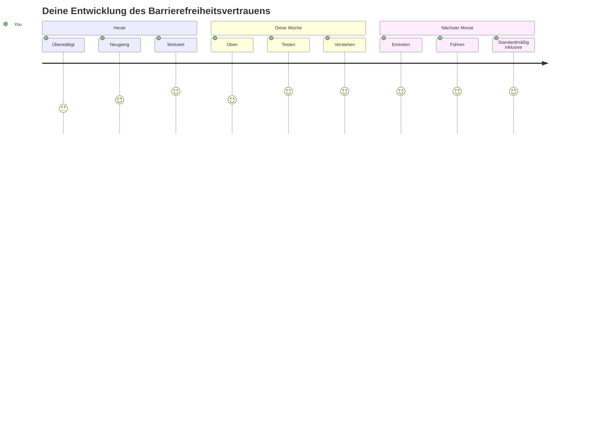
> 🌍 **Du bist jetzt ein Barrierefreiheits-Champion!** Du verstehst, dass großartige Web-Erlebnisse für alle funktionieren, unabhängig davon, wie sie auf das Web zugreifen. Jede barrierefreie Funktion, die du erstellst, macht das Internet inklusiver. Das Web braucht Entwickler wie dich, die Barrierefreiheit nicht als Einschränkung, sondern als Chance sehen, bessere Erlebnisse für alle Nutzer zu schaffen. Willkommen in der Bewegung! 🎉

---

<!-- CO-OP TRANSLATOR DISCLAIMER START -->
**Haftungsausschluss**:  
Dieses Dokument wurde mit dem KI-Übersetzungsdienst [Co-op Translator](https://github.com/Azure/co-op-translator) übersetzt. Obwohl wir bemüht sind, eine genaue Übersetzung zu gewährleisten, können automatisierte Übersetzungen Fehler oder Ungenauigkeiten enthalten. Das Originaldokument in seiner Ursprungssprache gilt als maßgebliche Quelle. Für wichtige Informationen wird eine professionelle menschliche Übersetzung empfohlen. Wir übernehmen keine Haftung für Missverständnisse oder Fehlinterpretationen, die durch die Verwendung dieser Übersetzung entstehen.
<!-- CO-OP TRANSLATOR DISCLAIMER END -->