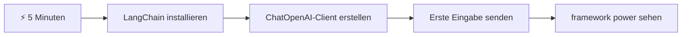
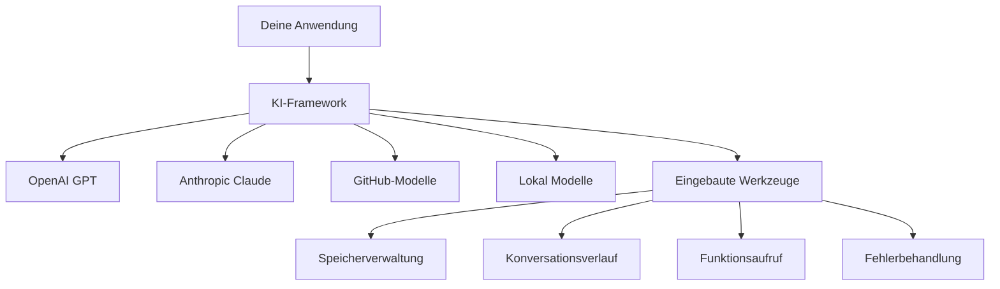
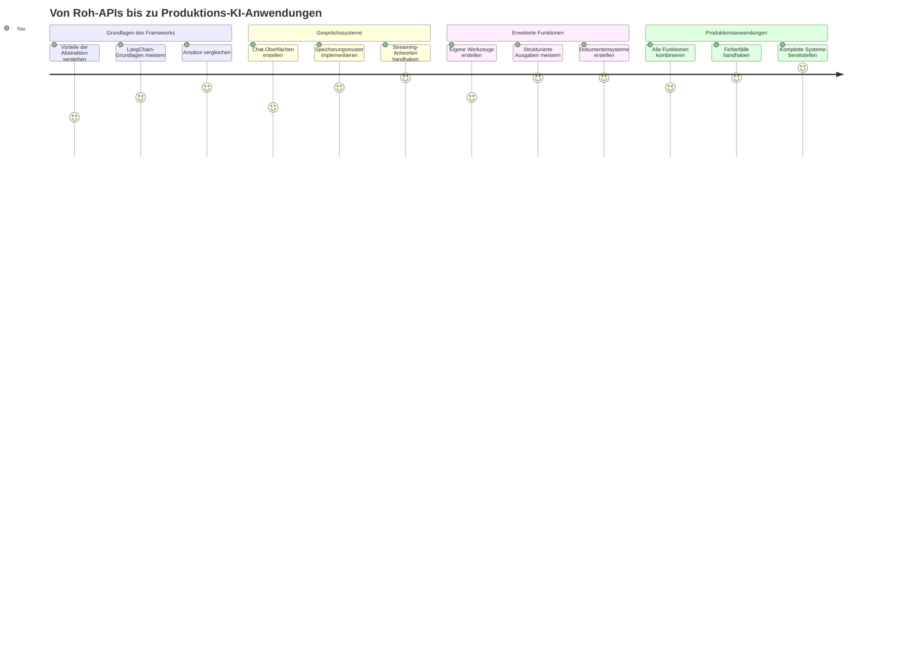
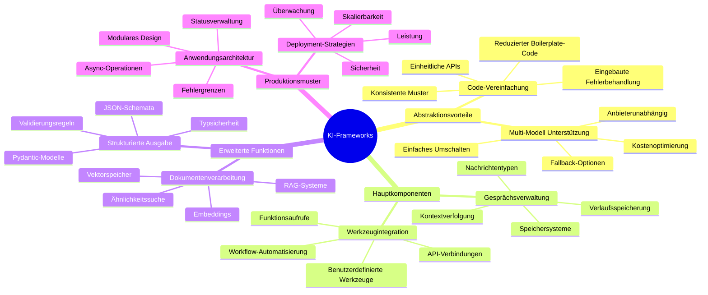
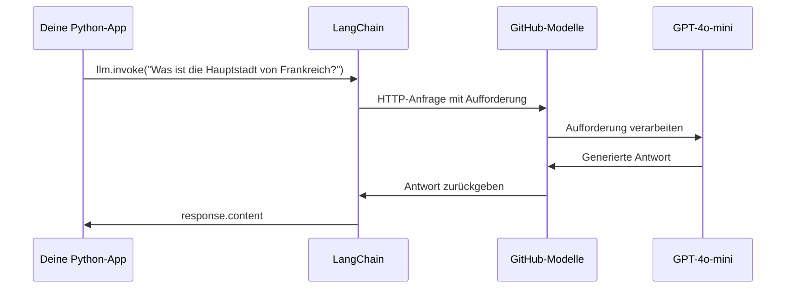
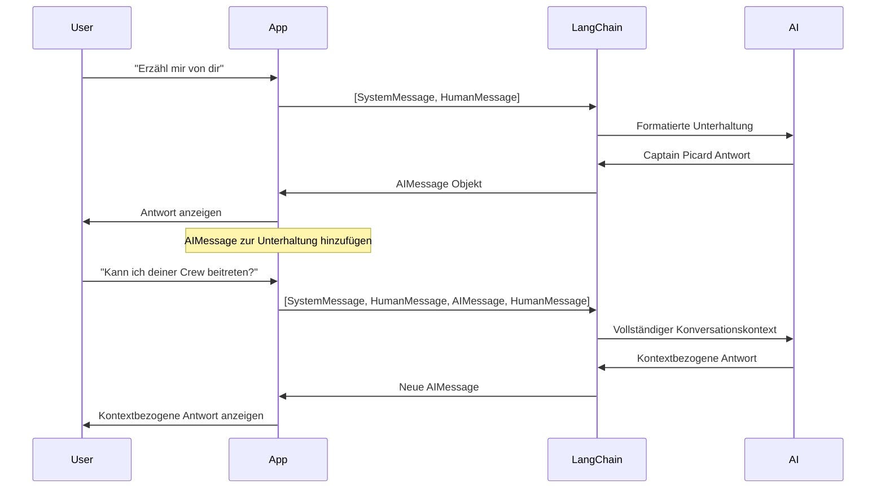
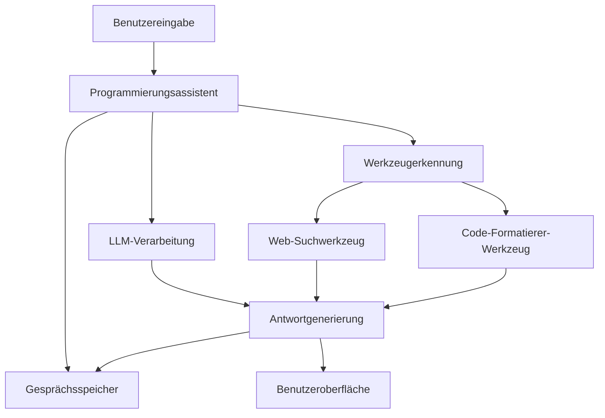
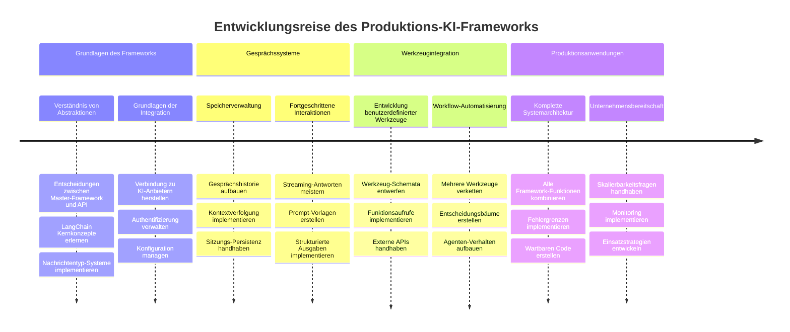
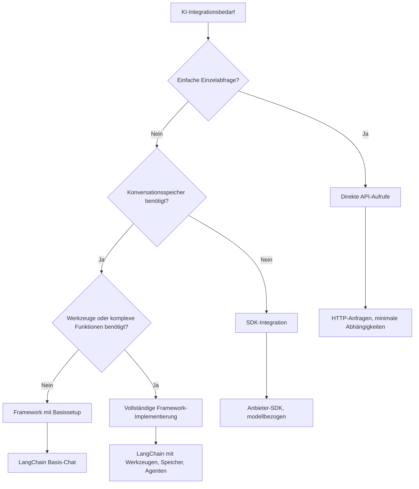

# KI-Framework

Hast du dich jemals überwältigt gefühlt, wenn du versucht hast, KI-Anwendungen von Grund auf neu zu erstellen? Du bist nicht allein! KI-Frameworks sind wie ein Schweizer Taschenmesser für die KI-Entwicklung – sie sind leistungsstarke Werkzeuge, die dir Zeit und Nerven sparen können, wenn du intelligente Anwendungen baust. Stell dir ein KI-Framework wie eine gut organisierte Bibliothek vor: Es stellt vorgefertigte Komponenten, standardisierte APIs und clevere Abstraktionen bereit, sodass du dich auf das Lösen von Problemen konzentrieren kannst, anstatt dich mit Implementierungsdetails herumzuschlagen.

In dieser Lektion werden wir erkunden, wie Frameworks wie LangChain komplexe KI-Integrationsaufgaben in sauberen, lesbaren Code verwandeln können. Du wirst entdecken, wie du reale Herausforderungen meisterst, wie das Verfolgen von Unterhaltungen, das Implementieren von Tool-Aufrufen und das Jonglieren mit verschiedenen KI-Modellen über eine einheitliche Schnittstelle.

Bis wir fertig sind, wirst du wissen, wann du Frameworks statt roher API-Aufrufe verwenden solltest, wie du deren Abstraktionen effektiv nutzt und wie du KI-Anwendungen baust, die bereit für den echten Einsatz sind. Lass uns entdecken, was KI-Frameworks für deine Projekte tun können.

## ⚡ Was du in den nächsten 5 Minuten tun kannst

**Schnellstart-Pfad für vielbeschäftigte Entwickler**


- **Minute 1**: Installiere LangChain: `pip install langchain langchain-openai`
- **Minute 2**: Richte dein GitHub-Token ein und importiere den ChatOpenAI-Client
- **Minute 3**: Erstelle eine einfache Unterhaltung mit System- und Nutzer-Nachrichten
- **Minute 4**: Füge ein einfaches Tool hinzu (wie eine Additionsfunktion) und sieh dir den AI-Tool-Aufruf an
- **Minute 5**: Erlebe den Unterschied zwischen rohen API-Aufrufen und Framework-Abstraktionen

**Schnelltest-Code**:
```python
from langchain_openai import ChatOpenAI
from langchain_core.messages import SystemMessage, HumanMessage

llm = ChatOpenAI(
    api_key=os.environ["GITHUB_TOKEN"],
    base_url="https://models.github.ai/inference",
    model="openai/gpt-4o-mini"
)

response = llm.invoke([
    SystemMessage(content="You are a helpful coding assistant"),
    HumanMessage(content="Explain Python functions briefly")
])
print(response.content)
```

**Warum das wichtig ist**: Innerhalb von 5 Minuten erlebst du, wie KI-Frameworks komplexe KI-Integration in einfache Methodenaufrufe verwandeln. Das ist die Grundlage, die produktive KI-Anwendungen antreibt.

## Warum ein Framework wählen?

Du bist also bereit, eine KI-App zu bauen – großartig! Aber hier ist die Sache: Du hast mehrere verschiedene Wege, und jeder hat seine Vor- und Nachteile. Es ist ein bisschen so, als würdest du zwischen Gehen, Radfahren oder Autofahren wählen – alle bringen dich ans Ziel, aber das Erlebnis (und der Aufwand) ist völlig unterschiedlich.

Lass uns die drei Hauptwege betrachten, wie du KI in deine Projekte integrieren kannst:

| Ansatz | Vorteile | Am besten geeignet für | Überlegungen |
|----------|------------|----------|--------------|
| **Direkte HTTP-Anfragen** | Volle Kontrolle, keine Abhängigkeiten | Einfache Anfragen, Grundlagen lernen | Ausführlicherer Code, manuelle Fehlerbehandlung |
| **SDK-Integration** | Weniger Boilerplate, modell-spezifische Optimierungen | Anwendungen mit nur einem Modell | Auf bestimmte Anbieter beschränkt |
| **KI-Frameworks** | Einheitliche API, eingebaute Abstraktionen | Multi-Modell-Anwendungen, komplexe Workflows | Lernkurve, potenzielle Überabstraktion |

### Praxisnahe Vorteile von Frameworks


**Warum Frameworks wichtig sind:**
- **Vereinheitlicht** mehrere KI-Anbieter unter einer Schnittstelle
- **Handhabt** Konversationsspeicher automatisch
- **Bietet** vorgefertigte Tools für gängige Aufgaben wie Einbettungen und Funktionsaufrufe
- **Verwaltet** Fehlerbehandlung und Wiederholungslogik
- **Verwandelt** komplexe Workflows in lesbare Methodenaufrufe

> 💡 **Profi-Tipp**: Nutze Frameworks, wenn du zwischen verschiedenen KI-Modellen wechselst oder komplexe Features wie Agenten, Speicher oder Tool-Aufrufe baust. Bleibe bei direkten APIs, wenn du Grundlagen lernst oder einfache, fokussierte Anwendungen erstellst.

**Fazit**: Ähnlich wie bei der Wahl zwischen speziellen Werkzeugen eines Handwerkers und einer kompletten Werkstatt geht es darum, das richtige Werkzeug für die Aufgabe zu wählen. Frameworks bieten Vorteile bei komplexen, funktionsreichen Anwendungen, während direkte APIs bei einfachen Anwendungsfällen gut funktionieren.

## 🗺️ Deine Lernreise zum Meister von KI-Frameworks


**Dein Lernziel**: Am Ende dieser Lektion wirst du die Entwicklung mit KI-Frameworks gemeistert haben und in der Lage sein, anspruchsvolle, produktionsreife KI-Anwendungen zu erstellen, die mit kommerziellen KI-Assistenten mithalten.

## Einführung

In dieser Lektion lernen wir:

- Ein gängiges KI-Framework zu verwenden.
- Häufige Probleme wie Chat-Konversationen, Tool-Nutzung, Speicher und Kontext anzugehen.
- Das zu nutzen, um KI-Apps zu bauen.

## 🧠 Ökosystem der KI-Framework-Entwicklung


**Kernprinzip**: KI-Frameworks abstrahieren Komplexität und bieten dabei leistungsstarke Abstraktionen für Konversationsmanagement, Tool-Integration und Dokumentenverarbeitung, die es Entwicklern ermöglichen, anspruchsvolle KI-Anwendungen mit sauberem, wartbarem Code zu erstellen.

## Dein erster KI-Prompt

Fangen wir mit den Grundlagen an, indem wir deine erste KI-Anwendung erstellen, die eine Frage sendet und eine Antwort zurückerhält. Wie Archimedes, der im Bad das Prinzip der Verdrängung entdeckte, führen manchmal die einfachsten Beobachtungen zu den mächtigsten Einsichten – und Frameworks machen diese Einsichten zugänglich.

### LangChain mit GitHub-Modellen einrichten

Wir verwenden LangChain, um eine Verbindung zu GitHub Models herzustellen, was ziemlich cool ist, weil du so freien Zugriff auf verschiedene KI-Modelle bekommst. Das Beste daran? Du brauchst nur ein paar einfache Konfigurationsparameter, um loszulegen:

```python
from langchain_openai import ChatOpenAI
import os

llm = ChatOpenAI(
    api_key=os.environ["GITHUB_TOKEN"],
    base_url="https://models.github.ai/inference",
    model="openai/gpt-4o-mini",
)

# Senden Sie eine einfache Eingabeaufforderung
response = llm.invoke("What's the capital of France?")
print(response.content)
```

**Was hier passiert:**
- **Erstellt** einen LangChain-Client mit der Klasse `ChatOpenAI` – dein Tor zur KI!
- **Konfiguriert** die Verbindung zu GitHub Models mit deinem Authentifizierungstoken
- **Legt fest**, welches KI-Modell verwendet wird (`gpt-4o-mini`) – das ist wie die Wahl deines KI-Assistenten
- **Sendet** deine Frage mittels der Methode `invoke()` – hier passiert die Magie
- **Extrahiert** und zeigt die Antwort an – voilà, du chattest mit KI!

> 🔧 **Einrichtungshinweis**: Wenn du GitHub Codespaces benutzt, hast du Glück – das `GITHUB_TOKEN` ist bereits für dich eingerichtet! Arbeitet du lokal? Kein Problem, du musst lediglich einen persönlichen Zugriffstoken mit den richtigen Berechtigungen erstellen.

**Erwartete Ausgabe:**
```text
The capital of France is Paris.
```


## Aufbau konversationaler KI

Das erste Beispiel zeigt die Grundlagen, aber es ist nur ein einzelner Austausch – du stellst eine Frage, bekommst eine Antwort, und das war’s. In realen Anwendungen möchtest du, dass deine KI sich daran erinnert, was ihr besprochen habt, genau wie Watson und Holmes ihre Ermittlungsunterhaltungen im Laufe der Zeit aufbauten.

Hier wird LangChain besonders nützlich. Es bietet verschiedene Nachrichtentypen, die helfen, Unterhaltungen zu strukturieren und deiner KI eine Persönlichkeit zu verleihen. Du wirst Chat-Erlebnisse bauen, die Kontext und Charakter aufrechterhalten.

### Verstehen der Nachrichtentypen

Denk an diese Nachrichtentypen wie verschieden „Hüte“, die Teilnehmer in einem Gespräch tragen. LangChain verwendet unterschiedliche Nachrichtentypen, um nachzuvollziehen, wer was sagt:

| Nachrichtentyp | Zweck | Beispielanwendung |
|--------------|---------|------------------|
| `SystemMessage` | Definiert KI-Persönlichkeit und Verhalten | „Du bist ein hilfreicher Coding-Assistent“ |
| `HumanMessage` | Repräsentiert Nutzereingaben | „Erkläre, wie Funktionen funktionieren“ |
| `AIMessage` | Speichert KI-Antworten | Vorherige KI-Antworten im Gespräch |

### Deine erste Unterhaltung erstellen

Lass uns eine Unterhaltung erstellen, in der unsere KI eine bestimmte Rolle annimmt. Sie soll Captain Picard verkörpern – eine Figur, bekannt für diplomatische Weisheit und Führung:

```python
messages = [
    SystemMessage(content="You are Captain Picard of the Starship Enterprise"),
    HumanMessage(content="Tell me about you"),
]
```

**Was diese Unterhaltungseinrichtung bewirkt:**
- **Legt** die Rolle und Persönlichkeit der KI über `SystemMessage` fest
- **Gibt** die erste Nutzeranfrage über `HumanMessage` vor
- **Schafft** eine Grundlage für mehrstufige Gespräche

Der vollständige Code für dieses Beispiel sieht folgendermaßen aus:

```python
from langchain_core.messages import HumanMessage, SystemMessage
from langchain_openai import ChatOpenAI
import os

llm = ChatOpenAI(
    api_key=os.environ["GITHUB_TOKEN"],
    base_url="https://models.github.ai/inference",
    model="openai/gpt-4o-mini",
)

messages = [
    SystemMessage(content="You are Captain Picard of the Starship Enterprise"),
    HumanMessage(content="Tell me about you"),
]


# funktioniert
response  = llm.invoke(messages)
print(response.content)
```

Du solltest ein Ergebnis ähnlich dem folgenden sehen:

```text
I am Captain Jean-Luc Picard, the commanding officer of the USS Enterprise (NCC-1701-D), a starship in the United Federation of Planets. My primary mission is to explore new worlds, seek out new life and new civilizations, and boldly go where no one has gone before. 

I believe in the importance of diplomacy, reason, and the pursuit of knowledge. My crew is diverse and skilled, and we often face challenges that test our resolve, ethics, and ingenuity. Throughout my career, I have encountered numerous species, grappled with complex moral dilemmas, and have consistently sought peaceful solutions to conflicts.

I hold the ideals of the Federation close to my heart, believing in the importance of cooperation, understanding, and respect for all sentient beings. My experiences have shaped my leadership style, and I strive to be a thoughtful and just captain. How may I assist you further?
```

Um die Gesprächskontinuität zu wahren (anstatt den Kontext bei jeder Nachricht zurückzusetzen), musst du die Antworten weiterhin zu deiner Nachrichtenliste hinzufügen. So wie mündliche Traditionen Geschichten über Generationen bewahren, baut dieser Ansatz ein dauerhaftes Gedächtnis auf:

```python
from langchain_core.messages import HumanMessage, SystemMessage
from langchain_openai import ChatOpenAI
import os

llm = ChatOpenAI(
    api_key=os.environ["GITHUB_TOKEN"],
    base_url="https://models.github.ai/inference",
    model="openai/gpt-4o-mini",
)

messages = [
    SystemMessage(content="You are Captain Picard of the Starship Enterprise"),
    HumanMessage(content="Tell me about you"),
]


# funktioniert
response  = llm.invoke(messages)

print(response.content)

print("---- Next ----")

messages.append(response)
messages.append(HumanMessage(content="Now that I know about you, I'm Chris, can I be in your crew?"))

response  = llm.invoke(messages)

print(response.content)

```

Ziemlich genial, oder? Hier rufen wir das LLM zweimal auf – zuerst nur mit unseren anfänglichen zwei Nachrichten, dann nochmals mit dem gesamten Gesprächsverlauf. Es ist, als würde die KI wirklich unserem Chat folgen!

Wenn du diesen Code ausführst, erhältst du eine zweite Antwort, die in etwa so klingt:

```text
Welcome aboard, Chris! It's always a pleasure to meet those who share a passion for exploration and discovery. While I cannot formally offer you a position on the Enterprise right now, I encourage you to pursue your aspirations. We are always in need of talented individuals with diverse skills and backgrounds. 

If you are interested in space exploration, consider education and training in the sciences, engineering, or diplomacy. The values of curiosity, resilience, and teamwork are crucial in Starfleet. Should you ever find yourself on a starship, remember to uphold the principles of the Federation: peace, understanding, and respect for all beings. Your journey can lead you to remarkable adventures, whether in the stars or on the ground. Engage!
```


Das nehme ich mal als ein Vielleicht ;)

## Streaming-Antworten

Ist dir schon mal aufgefallen, wie ChatGPT seine Antworten quasi „in Echtzeit tippt“? Das ist Streaming in Aktion. Wie einen erfahrenen Kalligraphen zu beobachten, der Buchstabe für Buchstabe schreibt, statt dass der Text sofort erscheint – Streaming lässt die Interaktion natürlicher wirken und liefert sofortiges Feedback.

### Streaming mit LangChain umsetzen

```python
from langchain_openai import ChatOpenAI
import os

llm = ChatOpenAI(
    api_key=os.environ["GITHUB_TOKEN"],
    base_url="https://models.github.ai/inference",
    model="openai/gpt-4o-mini",
    streaming=True
)

# Die Antwort streamen
for chunk in llm.stream("Write a short story about a robot learning to code"):
    print(chunk.content, end="", flush=True)
```

**Warum Streaming großartig ist:**
- **Zeigt** Inhalte während der Erstellung – kein unangenehmes Warten mehr!
- **Lässt** Nutzer spüren, dass etwas tatsächlich geschieht
- **Wirkt** schneller, selbst wenn es technisch nicht so ist
- **Ermöglicht** Nutzern, schon mit dem Lesen zu beginnen, während die KI noch „denkt“

> 💡 **Benutzererfahrungstipp**: Streaming ist besonders toll bei längeren Antworten wie Code-Erklärungen, kreativem Schreiben oder detaillierten Tutorials. Deine Nutzer werden es lieben, Fortschritte zu sehen, statt auf einem leeren Bildschirm zu warten!

### 🎯 Pädagogischer Check-in: Vorteile der Framework-Abstraktionen

**Pause und Nachdenken**: Du hast gerade die Kraft von KI-Framework-Abstraktionen erlebt. Vergleiche, was du gelernt hast, mit rohen API-Aufrufen aus früheren Lektionen.

**Kurze Selbstbewertung**:
- Kannst du erklären, wie LangChain das Konversationsmanagement im Vergleich zur manuellen Nachrichtenverfolgung vereinfacht?
- Was ist der Unterschied zwischen den Methoden `invoke()` und `stream()`, und wann würdest du welche verwenden?
- Wie verbessert das Nachrichtentyp-System des Frameworks die Code-Organisation?

**Bezug zur Praxis**: Die Abstraktionsmuster, die du gelernt hast (Nachrichtentypen, Streaming-Schnittstellen, Konversationsspeicher), werden in allen großen KI-Anwendungen verwendet – von der ChatGPT-Oberfläche bis zur Code-Unterstützung von GitHub Copilot. Du meisterst genau die architektonischen Muster, die von professionellen KI-Entwicklungsteams verwendet werden.

**Herausforderungsfrage**: Wie würdest du eine Framework-Abstraktion entwerfen, um verschiedene KI-Modell-Anbieter (OpenAI, Anthropic, Google) mit nur einer Schnittstelle zu verwalten? Überlege dir Vor- und Nachteile.

## Prompt-Vorlagen

Prompt-Vorlagen funktionieren wie rhetorische Strukturen in der klassischen Rhetorik – denk daran, wie Cicero seine Redemuster für unterschiedliche Zuhörer anpasste, dabei aber den gleichen überzeugenden Rahmen beibehielt. Sie ermöglichen es dir, wiederverwendbare Prompts zu erstellen, bei denen du verschiedene Informationsstücke austauschen kannst, ohne alles neu schreiben zu müssen. Sobald die Vorlage eingerichtet ist, füllst du einfach die Variablen mit den gewünschten Werten.

### Wiederverwendbare Prompts erstellen

```python
from langchain_core.prompts import ChatPromptTemplate

# Definieren Sie eine Vorlage für Codeerklärungen
template = ChatPromptTemplate.from_messages([
    ("system", "You are an expert programming instructor. Explain concepts clearly with examples."),
    ("human", "Explain {concept} in {language} with a practical example for {skill_level} developers")
])

# Verwenden Sie die Vorlage mit verschiedenen Werten
questions = [
    {"concept": "functions", "language": "JavaScript", "skill_level": "beginner"},
    {"concept": "classes", "language": "Python", "skill_level": "intermediate"},
    {"concept": "async/await", "language": "JavaScript", "skill_level": "advanced"}
]

for question in questions:
    prompt = template.format_messages(**question)
    response = llm.invoke(prompt)
    print(f"Topic: {question['concept']}\n{response.content}\n---\n")
```

**Warum du Vorlagen lieben wirst:**
- **Halten** deine Prompts konsistent über deine gesamte App
- **Kein** unübersichtliches String-Verketten mehr – nur noch saubere, einfache Variablen
- **Deine KI** verhält sich vorhersehbar, weil die Struktur gleich bleibt
- **Updates** sind ein Kinderspiel – Vorlage einmal ändern, und überall ist es aktualisiert

## Strukturierte Ausgabe

Kennst du das Frustgefühl, wenn du versuchen musst, unstrukturierte KI-Antworten zu parsen? Strukturierte Ausgabe ist wie das Lehren deiner KI, der systematischen Herangehensweise von Linné bei der biologischen Klassifikation zu folgen – organisiert, vorhersehbar und einfach handhabbar. Du kannst JSON, bestimmte Datenstrukturen oder jedes gewünschte Format anfordern.

### Ausgabe-Schemata definieren

```python
from langchain_core.prompts import ChatPromptTemplate
from langchain_core.output_parsers import JsonOutputParser
from pydantic import BaseModel, Field

class CodeReview(BaseModel):
    score: int = Field(description="Code quality score from 1-10")
    strengths: list[str] = Field(description="List of code strengths")
    improvements: list[str] = Field(description="List of suggested improvements")
    overall_feedback: str = Field(description="Summary feedback")

# Parser einrichten
parser = JsonOutputParser(pydantic_object=CodeReview)

# Eingabeaufforderung mit Formatierungsanweisungen erstellen
prompt = ChatPromptTemplate.from_messages([
    ("system", "You are a code reviewer. {format_instructions}"),
    ("human", "Review this code: {code}")
])

# Die Eingabeaufforderung mit Anweisungen formatieren
chain = prompt | llm | parser

# Strukturierte Antwort erhalten
code_sample = """
def calculate_average(numbers):
    return sum(numbers) / len(numbers)
"""

result = chain.invoke({
    "code": code_sample,
    "format_instructions": parser.get_format_instructions()
})

print(f"Score: {result['score']}")
print(f"Strengths: {', '.join(result['strengths'])}")
```

**Warum strukturierte Ausgabe ein Game-Changer ist:**
- **Kein** Rätselraten mehr, in welchem Format die Antwort kommt – es ist jedes Mal konsistent
- **Lässt** sich direkt in deine Datenbanken und APIs einbinden, ohne Zusatzaufwand
- **Fängt** merkwürdige KI-Antworten ab, bevor sie deine App zerstören
- **Macht** deinen Code sauberer, weil du genau weißt, womit du arbeitest

## Tool-Aufrufe

Jetzt kommen wir zu einem der mächtigsten Features: Tools. Damit gibst du deiner KI praktische Fähigkeiten über reine Konversation hinaus. So wie mittelalterliche Zünfte spezialisierte Werkzeuge für bestimmte Gewerke entwickelten, kannst du deine KI mit gezielten Instrumenten ausstatten. Du beschreibst, welche Tools verfügbar sind, und wenn jemand etwas anfragt, das passt, kann deine KI aktiv werden.

### Verwendung in Python

Lass uns einige Tools wie folgt hinzufügen:

```python
from typing_extensions import Annotated, TypedDict

class add(TypedDict):
    """Add two integers."""

    # Annotationen müssen den Typ haben und können optional einen Standardwert und eine Beschreibung enthalten (in dieser Reihenfolge).
    a: Annotated[int, ..., "First integer"]
    b: Annotated[int, ..., "Second integer"]

tools = [add]

functions = {
    "add": lambda a, b: a + b
}
```

Was passiert hier? Wir erstellen eine Blaupause für ein Tool namens `add`. Indem wir von `TypedDict` erben und diese schicken `Annotated`-Typen für `a` und `b` verwenden, geben wir dem LLM ein klares Bild davon, was das Tool macht und was es braucht. Das `functions`-Dictionary ist wie unser Werkzeugkasten – es sagt unserem Code genau, was zu tun ist, wenn die KI beschließt, ein bestimmtes Tool zu verwenden.

Als nächstes sehen wir, wie wir das LLM mit diesem Tool aufrufen:

```python
llm = ChatOpenAI(
    api_key=os.environ["GITHUB_TOKEN"],
    base_url="https://models.github.ai/inference",
    model="openai/gpt-4o-mini",
)

llm_with_tools = llm.bind_tools(tools)
```

Hier rufen wir `bind_tools` mit unserem `tools`-Array auf, und dadurch weiß das LLM `llm_with_tools` jetzt über dieses Tool Bescheid.

Um dieses neue LLM zu verwenden, können wir folgenden Code schreiben:

```python
query = "What is 3 + 12?"

res = llm_with_tools.invoke(query)
if(res.tool_calls):
    for tool in res.tool_calls:
        print("TOOL CALL: ", functions[tool["name"]](../../../10-ai-framework-project/**tool["args"]))
print("CONTENT: ",res.content)
```

Jetzt, wo wir `invoke` auf diesem neuen llm aufrufen, das Tools hat, ist möglicherweise das Property `tool_calls` gefüllt. Falls ja, hat jedes identifizierte Tool eine `name`- und `args`-Eigenschaft, die angibt, welches Tool aufgerufen werden soll und mit welchen Argumenten. Der vollständige Code sieht so aus:

```python
from langchain_core.messages import HumanMessage, SystemMessage
from langchain_openai import ChatOpenAI
import os
from typing_extensions import Annotated, TypedDict

class add(TypedDict):
    """Add two integers."""

    # Annotationen müssen den Typ haben und können optional einen Standardwert und eine Beschreibung enthalten (in dieser Reihenfolge).
    a: Annotated[int, ..., "First integer"]
    b: Annotated[int, ..., "Second integer"]

tools = [add]

functions = {
    "add": lambda a, b: a + b
}

llm = ChatOpenAI(
    api_key=os.environ["GITHUB_TOKEN"],
    base_url="https://models.github.ai/inference",
    model="openai/gpt-4o-mini",
)

llm_with_tools = llm.bind_tools(tools)

query = "What is 3 + 12?"

res = llm_with_tools.invoke(query)
if(res.tool_calls):
    for tool in res.tool_calls:
        print("TOOL CALL: ", functions[tool["name"]](../../../10-ai-framework-project/**tool["args"]))
print("CONTENT: ",res.content)
```

Wenn du diesen Code ausführst, solltest du eine Ausgabe ähnlich dieser sehen:

```text
TOOL CALL:  15
CONTENT: 
```

Die KI hat die Anfrage „Was ist 3 + 12“ geprüft und erkannt, dass dies eine Aufgabe für das `add`-Tool ist. Wie ein erfahrener Bibliothekar, der je nach Art der Frage weiß, welche Referenz er zurate ziehen muss, hat die KI dies anhand des Namens, der Beschreibung und der Feldspezifikationen des Tools bestimmt. Das Ergebnis von 15 stammt aus der Ausführung des Tools durch unser `functions`-Dictionary:

```python
print("TOOL CALL: ", functions[tool["name"]](../../../10-ai-framework-project/**tool["args"]))
```

### Ein interessanteres Tool, das eine Web-API aufruft


Zahlen hinzufügen veranschaulicht das Konzept, aber reale Werkzeuge führen typischerweise komplexere Operationen aus, wie das Aufrufen von Web-APIs. Erweitern wir unser Beispiel, sodass die KI Inhalte aus dem Internet abruft – ähnlich wie Telegrafisten früher entfernte Orte verbanden:

```python
class joke(TypedDict):
    """Tell a joke."""

    # Annotationen müssen den Typ haben und können optional einen Standardwert und eine Beschreibung (in dieser Reihenfolge) enthalten.
    category: Annotated[str, ..., "The joke category"]

def get_joke(category: str) -> str:
    response = requests.get(f"https://api.chucknorris.io/jokes/random?category={category}", headers={"Accept": "application/json"})
    if response.status_code == 200:
        return response.json().get("value", f"Here's a {category} joke!")
    return f"Here's a {category} joke!"

functions = {
    "add": lambda a, b: a + b,
    "joke": lambda category: get_joke(category)
}

query = "Tell me a joke about animals"

# der Rest des Codes ist gleich
```

Wenn du diesen Code nun ausführst, erhältst du eine Antwort, die etwa Folgendes sagt:

```text
TOOL CALL:  Chuck Norris once rode a nine foot grizzly bear through an automatic car wash, instead of taking a shower.
CONTENT:  
```

```mermaid
flowchart TD
    A[Benutzeranfrage: "Erzähle mir einen Witz über Tiere"] --> B[LangChain Analyse]
    B --> C{Werkzeug verfügbar?}
    C -->|Ja| D[Witz-Werkzeug auswählen]
    C -->|Nein| E[Direkte Antwort generieren]
    
    D --> F[Parameter extrahieren]
    F --> G[Rufe Witz(category="animals") auf]
    G --> H[API-Anfrage an chucknorris.io]
    H --> I[Witzinhalt zurückgeben]
    I --> J[Benutzer anzeigen]
    
    E --> K[KI-generierte Antwort]
    K --> J
    
    subgraph "Werkzeug-Definitionsebene"
        L[TypedDict Schema]
        M[Funktionsimplementierung]
        N[Parameterüberprüfung]
    end
    
    D --> L
    F --> N
    G --> M
```
Hier ist der komplette Code:

```python
from langchain_openai import ChatOpenAI
import requests
import os
from typing_extensions import Annotated, TypedDict

class add(TypedDict):
    """Add two integers."""

    # Anmerkungen müssen den Typ haben und können optional einen Standardwert und eine Beschreibung enthalten (in dieser Reihenfolge).
    a: Annotated[int, ..., "First integer"]
    b: Annotated[int, ..., "Second integer"]

class joke(TypedDict):
    """Tell a joke."""

    # Anmerkungen müssen den Typ haben und können optional einen Standardwert und eine Beschreibung enthalten (in dieser Reihenfolge).
    category: Annotated[str, ..., "The joke category"]

tools = [add, joke]

def get_joke(category: str) -> str:
    response = requests.get(f"https://api.chucknorris.io/jokes/random?category={category}", headers={"Accept": "application/json"})
    if response.status_code == 200:
        return response.json().get("value", f"Here's a {category} joke!")
    return f"Here's a {category} joke!"

functions = {
    "add": lambda a, b: a + b,
    "joke": lambda category: get_joke(category)
}

llm = ChatOpenAI(
    api_key=os.environ["GITHUB_TOKEN"],
    base_url="https://models.github.ai/inference",
    model="openai/gpt-4o-mini",
)

llm_with_tools = llm.bind_tools(tools)

query = "Tell me a joke about animals"

res = llm_with_tools.invoke(query)
if(res.tool_calls):
    for tool in res.tool_calls:
        # print("TOOL AUFRUF: ", tool)
        print("TOOL CALL: ", functions[tool["name"]](../../../10-ai-framework-project/**tool["args"]))
print("CONTENT: ",res.content)
```

## Embeddings und Dokumentenverarbeitung

Embeddings stellen eine der elegantesten Lösungen in der modernen KI dar. Stell dir vor, du könntest jeden beliebigen Text in numerische Koordinaten umwandeln, die dessen Bedeutung erfassen. Genau das machen Embeddings – sie transformieren Text in Punkte in einem mehrdimensionalen Raum, in dem sich ähnliche Konzepte gruppieren. Es ist wie ein Koordinatensystem für Ideen, das an die Art erinnert, wie Mendelejew das Periodensystem nach atomaren Eigenschaften organisierte.

### Embeddings erstellen und verwenden

```python
from langchain_openai import OpenAIEmbeddings
from langchain_community.vectorstores import FAISS
from langchain_community.document_loaders import TextLoader
from langchain.text_splitter import CharacterTextSplitter

# Einbettungen initialisieren
embeddings = OpenAIEmbeddings(
    api_key=os.environ["GITHUB_TOKEN"],
    base_url="https://models.github.ai/inference",
    model="text-embedding-3-small"
)

# Dokumente laden und aufteilen
loader = TextLoader("documentation.txt")
documents = loader.load()

text_splitter = CharacterTextSplitter(chunk_size=1000, chunk_overlap=0)
texts = text_splitter.split_documents(documents)

# Vektorenspeicher erstellen
vectorstore = FAISS.from_documents(texts, embeddings)

# Ähnlichkeitssuche durchführen
query = "How do I handle user authentication?"
similar_docs = vectorstore.similarity_search(query, k=3)

for doc in similar_docs:
    print(f"Relevant content: {doc.page_content[:200]}...")
```

### Dokumentenladefunktionen für verschiedene Formate

```python
from langchain_community.document_loaders import (
    PyPDFLoader,
    CSVLoader,
    JSONLoader,
    WebBaseLoader
)

# Verschiedene Dokumenttypen laden
pdf_loader = PyPDFLoader("manual.pdf")
csv_loader = CSVLoader("data.csv")
json_loader = JSONLoader("config.json")
web_loader = WebBaseLoader("https://example.com/docs")

# Alle Dokumente verarbeiten
all_documents = []
for loader in [pdf_loader, csv_loader, json_loader, web_loader]:
    docs = loader.load()
    all_documents.extend(docs)
```

**Was du mit Embeddings machen kannst:**
- **Suchfunktionen** erstellen, die wirklich verstehen, was du meinst, nicht nur Stichwortübereinstimmungen
- **KI entwickeln**, die Fragen zu deinen Dokumenten beantworten kann
- **Empfehlungssysteme bauen**, die wirklich relevante Inhalte vorschlagen
- **Inhalte automatisch** organisieren und kategorisieren

```mermaid
flowchart LR
    A[Dokumente] --> B[Textteiler]
    B --> C[Erstelle Einbettungen]
    C --> D[Vektorspeicher]
    
    E[Benutzeranfrage] --> F[Anfrage-Einbettung]
    F --> G[Ähnlichkeitssuche]
    G --> D
    D --> H[Relevante Dokumente]
    H --> I[KI-Antwort]
    
    subgraph "Vektorraum"
        J[Dokument A: [0.1, 0.8, 0.3...]]
        K[Dokument B: [0.2, 0.7, 0.4...]]
        L[Anfrage: [0.15, 0.75, 0.35...]]
    end
    
    C --> J
    C --> K
    F --> L
    G --> J
    G --> K
```
## Aufbau einer vollständigen KI-Anwendung

Jetzt integrieren wir alles, was du gelernt hast, in eine umfassende Anwendung – einen Programmierassistenten, der Fragen beantworten, Werkzeuge nutzen und sich an Gespräche erinnern kann. So wie die Druckerpresse bestehende Technologien (bewegliche Lettern, Tinte, Papier und Druck) zu etwas Transformativem verband, kombinieren wir unsere KI-Komponenten zu einer praktikablen und nützlichen Anwendung.

### Beispiel für eine vollständige Anwendung

```python
from langchain_openai import ChatOpenAI, OpenAIEmbeddings
from langchain_core.prompts import ChatPromptTemplate
from langchain_core.messages import HumanMessage, SystemMessage, AIMessage
from langchain_community.vectorstores import FAISS
from typing_extensions import Annotated, TypedDict
import os
import requests

class CodingAssistant:
    def __init__(self):
        self.llm = ChatOpenAI(
            api_key=os.environ["GITHUB_TOKEN"],
            base_url="https://models.github.ai/inference",
            model="openai/gpt-4o-mini"
        )
        
        self.conversation_history = [
            SystemMessage(content="""You are an expert coding assistant. 
            Help users learn programming concepts, debug code, and write better software.
            Use tools when needed and maintain a helpful, encouraging tone.""")
        ]
        
        # Werkzeuge definieren
        self.setup_tools()
    
    def setup_tools(self):
        class web_search(TypedDict):
            """Search for programming documentation or examples."""
            query: Annotated[str, "Search query for programming help"]
        
        class code_formatter(TypedDict):
            """Format and validate code snippets."""
            code: Annotated[str, "Code to format"]
            language: Annotated[str, "Programming language"]
        
        self.tools = [web_search, code_formatter]
        self.llm_with_tools = self.llm.bind_tools(self.tools)
    
    def chat(self, user_input: str):
        # Benutzeranfrage zum Gespräch hinzufügen
        self.conversation_history.append(HumanMessage(content=user_input))
        
        # KI-Antwort erhalten
        response = self.llm_with_tools.invoke(self.conversation_history)
        
        # Werkzeugaufrufe bearbeiten, falls vorhanden
        if response.tool_calls:
            for tool_call in response.tool_calls:
                tool_result = self.execute_tool(tool_call)
                print(f"🔧 Tool used: {tool_call['name']}")
                print(f"📊 Result: {tool_result}")
        
        # KI-Antwort zum Gespräch hinzufügen
        self.conversation_history.append(response)
        
        return response.content
    
    def execute_tool(self, tool_call):
        tool_name = tool_call['name']
        args = tool_call['args']
        
        if tool_name == 'web_search':
            return f"Found documentation for: {args['query']}"
        elif tool_name == 'code_formatter':
            return f"Formatted {args['language']} code: {args['code'][:50]}..."
        
        return "Tool execution completed"

# Anwendungsbeispiel
assistant = CodingAssistant()

print("🤖 Coding Assistant Ready! Type 'quit' to exit.\n")

while True:
    user_input = input("You: ")
    if user_input.lower() == 'quit':
        break
    
    response = assistant.chat(user_input)
    print(f"🤖 Assistant: {response}\n")
```

**Anwendungsarchitektur:**


**Wesentliche Funktionen, die wir implementiert haben:**
- **Merkt sich** dein gesamtes Gespräch für Kontextverständnis
- **Führt Aktionen aus** durch Werkzeugaufrufe, nicht nur über Gespräche
- **Folgt** vorhersehbaren Interaktionsmustern
- **Handhabt** Fehler und komplexe Arbeitsabläufe automatisch

### 🎯 Pädagogische Zwischenprüfung: Produktions-KI-Architektur

**Architekturverständnis**: Du hast eine vollständige KI-Anwendung gebaut, die Gesprächsverwaltung, Werkzeugaufrufe und strukturierte Arbeitsabläufe kombiniert. Das repräsentiert die Entwicklung von KI-Anwendungen auf Produktionsniveau.

**Beherrschte Kernkonzepte**:
- **Klassenbasierte Architektur**: Organisierte, wartbare KI-Anwendungsstruktur
- **Werkzeugintegration**: Eigene Funktionalität über Gespräche hinaus
- **Speichermanagement**: Persistenter Gesprächskontext
- **Fehlerbehandlung**: Robustes Anwendungsverhalten

**Branchenbezug**: Die Architekturmuster, die du implementiert hast (Gesprächsklassen, Werkzeugsysteme, Speichermanagement), sind dieselben Muster, die in Unternehmens-KI-Anwendungen wie dem AI-Assistenten von Slack, GitHub Copilot und Microsoft Copilot verwendet werden. Du baust mit professionellem Architekturdenken.

**Reflexionsfrage**: Wie würdest du diese Anwendung erweitern, um mehrere Benutzer, persistente Speicherung oder Integration mit externen Datenbanken zu unterstützen? Denk an Skalierbarkeit und Herausforderungen im Statusmanagement.

## Aufgabe: Baue deinen eigenen KI-gestützten Lernassistenten

**Ziel**: Erstelle eine KI-Anwendung, die Studierenden beim Lernen von Programmiersprachen hilft, indem sie Erklärungen, Codebeispiele und interaktive Quiz bereitstellt.

### Anforderungen

**Kernfunktionen (Pflicht):**
1. **Konversationelle Schnittstelle**: Implementiere ein Chatsystem, das den Kontext mehrerer Fragen beibehält
2. **Bildungswerkzeuge**: Erstelle mindestens zwei Werkzeuge zur Unterstützung des Lernens:
   - Code-Erklärer
   - Quizgenerator für Konzepte
3. **Personalisierte Lernunterstützung**: Nutze Systemnachrichten, um Antworten an unterschiedliche Kenntnisstände anzupassen
4. **Antwortformatierung**: Implementiere strukturiertes Format für Quizfragen

### Implementierungsschritte

**Schritt 1: Umgebung einrichten**
```bash
pip install langchain langchain-openai
```

**Schritt 2: Grundlegende Chatfunktionalität**
- Erstelle eine `StudyAssistant`-Klasse
- Implementiere Gesprächsspeicher
- Füge Persönlichkeitseinstellungen für Lernunterstützung hinzu

**Schritt 3: Füge Bildungswerkzeuge hinzu**
- **Code-Erklärer**: Erklärt Codeschritte verständlich
- **Quizgenerator**: Erstellt Fragen zu Programmierkonzepten
- **Fortschrittsverfolgung**: Verfolgt behandelte Themen

**Schritt 4: Erweiterte Funktionen (Optional)**
- Implementiere Streaming-Antworten für bessere Nutzererfahrung
- Füge Dokumentenladen hinzu, um Kursmaterial einzubinden
- Erstelle Embeddings für inhaltsbasierte Suche

### Bewertungskriterien

| Funktion | Ausgezeichnet (4) | Gut (3) | Zufriedenstellend (2) | Verbesserungswürdig (1) |
|----------|-------------------|---------|-----------------------|-------------------------|
| **Gesprächsverlauf** | Natürliche, kontextbewusste Antworten | Gute Kontextbeibehaltung | Grundlegende Konversation | Kein Gedächtnis zwischen den Austauschen |
| **Werkzeugintegration** | Mehrere hilfreiche Werkzeuge nahtlos integriert | 2+ Werkzeuge korrekt implementiert | 1-2 einfache Werkzeuge | Werkzeuge nicht funktionsfähig |
| **Codequalität** | Sauber, gut dokumentiert, Fehlerbehandlung | Gute Struktur, teils Dokumentation | Grundfunktionalität | Schlechte Struktur, keine Fehlerbehandlung |
| **Bildungswert** | Wirklich hilfsreich fürs Lernen, adaptiv | Gute Lernunterstützung | Grundlegende Erklärungen | Eingeschränkter pädagogischer Nutzen |

### Beispielhafte Code-Struktur

```python
class StudyAssistant:
    def __init__(self, skill_level="beginner"):
        # Initialisiere LLM, Werkzeuge und Gesprächsspeicher
        pass
    
    def explain_code(self, code, language):
        # Werkzeug: Erkläre, wie der Code funktioniert
        pass
    
    def generate_quiz(self, topic, difficulty):
        # Werkzeug: Erstelle Übungsfragen
        pass
    
    def chat(self, user_input):
        # Haupt-Gesprächsschnittstelle
        pass

# Beispielverwendung
assistant = StudyAssistant(skill_level="intermediate")
response = assistant.chat("Explain how Python functions work")
```

**Bonus-Herausforderungen:**
- Sprach-Ein- und Ausgabefähigkeiten hinzufügen
- Webinterface mit Streamlit oder Flask implementieren
- Wissensdatenbank aus Kursmaterial mit Embeddings erstellen
- Fortschrittsverfolgung und personalisierte Lernpfade hinzufügen

## 📈 Deine Timeline zum Meister der KI-Framework-Entwicklung


**🎓 Abschlussmeilenstein**: Du hast erfolgreich die Entwicklung von KI-Frameworks gemeistert und nutzt dabei dieselben Werkzeuge und Muster, die moderne KI-Anwendungen antreiben. Diese Fähigkeiten repräsentieren den neuesten Stand der KI-Anwendungsentwicklung und bereiten dich auf den Bau von Unternehmenslösungen vor.

**🔄 Nächste Stufe Fähigkeiten**:
- Bereit, fortgeschrittene KI-Architekturen (Agenten, Multiagentensysteme) zu erkunden
- Bereit, RAG-Systeme mit Vektor-Datenbanken zu bauen
- Ausgestattet, multimodale KI-Anwendungen zu erstellen
- Fundament gelegt für Skalierung und Optimierung von KI-Anwendungen

## Zusammenfassung

🎉 Du hast nun die Grundlagen der KI-Framework-Entwicklung gemeistert und gelernt, wie man mit LangChain anspruchsvolle KI-Anwendungen baut. Wie nach einer umfassenden Ausbildung hast du einen großen Werkzeugkasten an Fähigkeiten erlangt. Lass uns zusammenfassen, was du erreicht hast.

### Was du gelernt hast

**Kernkonzepte des Frameworks:**
- **Framework-Vorteile**: Wann Frameworks API-Aufrufen vorzuziehen sind
- **LangChain Grundlagen**: Einrichtung und Konfiguration von KI-Modellanbindungen
- **Nachrichtentypen**: Verwendung von `SystemMessage`, `HumanMessage` und `AIMessage` für strukturierte Konversationen

**Erweiterte Funktionen:**
- **Werkzeugaufrufe**: Erstellung und Integration eigener Werkzeuge für erweiterte KI-Fähigkeiten
- **Gesprächsspeicher**: Kontextbewahrung über mehrere Gesprächsrunden hinweg
- **Streaming-Antworten**: Echtzeit-Ausgabe von Antworten
- **Prompt-Vorlagen**: Wiederverwendbare, dynamische Prompts bauen
- **Strukturierte Ausgabe**: Konsistente, parsbare KI-Antworten sicherstellen
- **Embeddings**: Semantische Suche und Dokumentenverarbeitung schaffen

**Praktische Anwendungen:**
- **Aufbau kompletter Apps**: Kombination mehrerer Funktionen zu produktionsreifen Anwendungen
- **Fehlerbehandlung**: Robustes Fehlermanagement und Validierung implementieren
- **Werkzeugintegration**: Eigene Werkzeuge erstellen, die KI erweitern

### Zentrale Erkenntnisse

> 🎯 **Merke**: KI-Frameworks wie LangChain sind im Grunde deine Komplexitätsverstecker und feature-reichen besten Freunde. Sie sind perfekt, wenn du Gesprächsspeicher, Werkzeugaufrufe oder die Arbeit mit mehreren KI-Modellen brauchst, ohne den Überblick zu verlieren.

**Entscheidungsrahmen für KI-Integration:**


### Wie geht es weiter?

**Starte jetzt mit dem Bauen:**
- Nutze diese Konzepte, um etwas zu erstellen, das DICH begeistert!
- Experimentiere mit verschiedenen KI-Modellen über LangChain – wie auf einem Spielplatz für KI-Modelle
- Erstelle Werkzeuge, die echte Probleme in deiner Arbeit oder deinen Projekten lösen

**Bereit für die nächste Stufe?**
- **KI-Agenten**: Baue KI-Systeme, die komplexe Aufgaben selbstständig planen und ausführen können
- **RAG (Retrieval-Augmented Generation)**: Kombiniere KI mit eigenen Wissensdatenbanken für leistungsstarke Anwendungen
- **Multimodale KI**: Arbeite mit Text, Bildern und Audio zusammen – die Möglichkeiten sind unbegrenzt!
- **Produktionseinführung**: Lerne, wie du deine KI-Apps skalierst und im Realbetrieb überwachst

**Tritt der Community bei:**
- Die LangChain-Community ist fantastisch, um auf dem neuesten Stand zu bleiben und Best Practices zu lernen
- GitHub Models gibt dir Zugang zu modernsten KI-Fähigkeiten – ideal zum Experimentieren
- Übe mit verschiedenen Anwendungsfällen – jedes Projekt bringt dir etwas Neues bei

Du hast jetzt das Wissen, um intelligente, konversationelle Anwendungen zu bauen, die Menschen helfen, echte Probleme zu lösen. Wie die Handwerker der Renaissance, die künstlerische Vision mit technischem Können verbanden, kannst du jetzt KI-Fähigkeiten mit praktischer Anwendung vereinen. Die Frage ist: Was wirst du erschaffen? 🚀

## GitHub Copilot Agent Challenge 🚀

Nutze den Agent-Modus, um die folgende Herausforderung zu lösen:

**Beschreibung:** Baue einen fortschrittlichen KI-gestützten Code-Review-Assistenten, der mehrere LangChain-Funktionen kombiniert, darunter Werkzeugaufrufe, strukturierte Ausgabe und Gesprächsspeicher, um umfassendes Feedback zu Codeeinreichungen zu geben.

**Aufgabe:** Erstelle eine `CodeReviewAssistant`-Klasse, die implementiert:
1. Ein Werkzeug zur Analyse der Codekomplexität und Verbesserungsvorschlägen
2. Ein Werkzeug zur Prüfung von Code anhand bester Praktiken
3. Strukturierte Ausgabe mit Pydantic-Modellen für ein konsistentes Review-Format
4. Gesprächsspeicher, um Review-Sitzungen zu verfolgen
5. Eine Hauptchat-Schnittstelle, die Codeeinreichungen verarbeiten und detailliertes, umsetzbares Feedback geben kann

Der Assistent soll Code in mehreren Programmiersprachen bewerten, den Kontext über mehrere Codeeinreichungen in einer Sitzung behalten und sowohl Zusammenfassungsnoten als auch detaillierte Verbesserungsvorschläge liefern.

Mehr Informationen zum [Agent-Modus](https://code.visualstudio.com/blogs/2025/02/24/introducing-copilot-agent-mode) findest du hier.

---

<!-- CO-OP TRANSLATOR DISCLAIMER START -->
**Haftungsausschluss**:  
Dieses Dokument wurde mithilfe des KI-Übersetzungsdienstes [Co-op Translator](https://github.com/Azure/co-op-translator) übersetzt. Obwohl wir bemüht sind, Genauigkeit zu gewährleisten, weisen wir darauf hin, dass automatisierte Übersetzungen Fehler oder Ungenauigkeiten enthalten können. Das Originaldokument in seiner Ausgangssprache ist als maßgebliche Quelle zu betrachten. Für kritische Informationen wird eine professionelle menschliche Übersetzung empfohlen. Wir übernehmen keine Haftung für Missverständnisse oder Fehlinterpretationen, die durch die Nutzung dieser Übersetzung entstehen.
<!-- CO-OP TRANSLATOR DISCLAIMER END -->