<!--
CO_OP_TRANSLATOR_METADATA:
{
  "original_hash": "672b0bb6e8b431075f3bdb7130590d2d",
  "translation_date": "2026-01-06T08:28:46+00:00",
  "source_file": "2-js-basics/1-data-types/README.md",
  "language_code": "de"
}
-->
# JavaScript Grundlagen: Datentypen


> Sketchnote von [Tomomi Imura](https://twitter.com/girlie_mac)

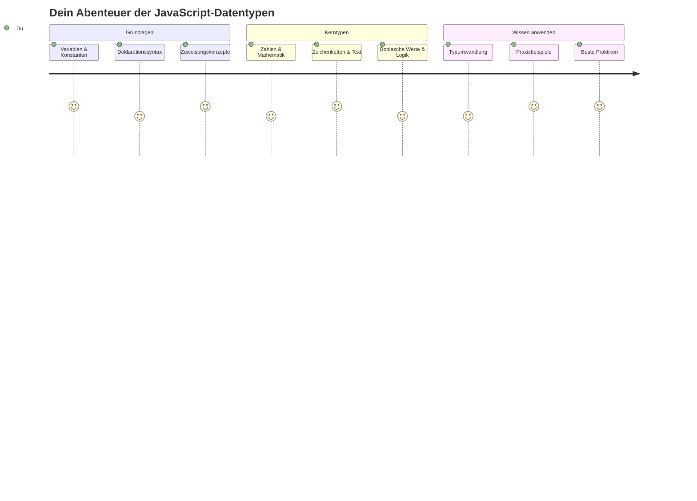
Datentypen sind eines der grundlegenden Konzepte in JavaScript, auf das du in jedem Programm stößt, das du schreibst. Denk an Datentypen wie das Ablagesystem, das antike Bibliothekare in Alexandria benutzten – sie hatten spezielle Plätze für Schriftrollen mit Poesie, Mathematik und historischen Aufzeichnungen. JavaScript organisiert Informationen auf ähnliche Weise mit verschiedenen Kategorien für unterschiedliche Arten von Daten.

In dieser Lektion erkunden wir die Kern-Datentypen, die JavaScript zum Laufen bringen. Du lernst, wie man mit Zahlen, Text, Wahr/Falsch-Werten umgeht und verstehst, warum die Wahl des richtigen Typs für deine Programme essenziell ist. Diese Konzepte mögen zunächst abstrakt erscheinen, aber mit Übung werden sie zur zweiten Natur.

Das Verständnis von Datentypen wird alles andere in JavaScript viel klarer machen. So wie Architekten unterschiedliche Baustoffe verstehen müssen, bevor sie eine Kathedrale bauen, werden diese Grundlagen alles unterstützen, was du in Zukunft baust.

## Quiz vor der Vorlesung
[Quiz vor der Vorlesung](https://ff-quizzes.netlify.app/web/)

Diese Lektion behandelt die Grundlagen von JavaScript, der Sprache, die Interaktivität im Web bereitstellt.

> Du kannst diese Lektion auch auf [Microsoft Learn](https://docs.microsoft.com/learn/modules/web-development-101-variables/?WT.mc_id=academic-77807-sagibbon) absolvieren!

[](https://youtube.com/watch?v=JNIXfGiDWM8 "Variablen in JavaScript")

[](https://youtube.com/watch?v=AWfA95eLdq8 "Datentypen in JavaScript")

> 🎥 Klicke auf die Bilder oben für Videos über Variablen und Datentypen

Fangen wir mit Variablen und den Datentypen an, die sie befüllen!

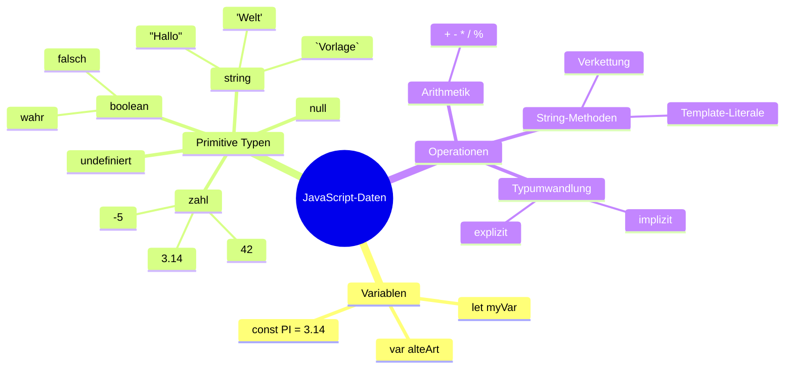
## Variablen

Variablen sind grundlegende Bausteine in der Programmierung. Wie beschriftete Gläser, die mittelalterliche Alchemisten zur Aufbewahrung verschiedener Substanzen nutzten, erlauben Variablen es dir, Informationen zu speichern und ihnen einen beschreibenden Namen zu geben, damit du später darauf zugreifen kannst. Möchtest du das Alter einer Person speichern? Bewahre es in einer Variablen namens `age` auf. Willst du den Namen eines Nutzers verfolgen? Speichere ihn in der Variablen `userName`.

Wir konzentrieren uns auf den modernen Ansatz zur Variablenerstellung in JavaScript. Die hier gelernten Techniken repräsentieren jahrelange Sprachentwicklung und Best Practices der Programmiergemeinschaft.

Die Erstellung und **Deklaration** einer Variable hat folgende Syntax **[Schlüsselwort] [Name]**. Sie besteht aus zwei Teilen:

- **Schlüsselwort**. Verwende `let` für Variablen, die sich ändern können, oder `const` für Werte, die gleich bleiben.
- **Der Variablenname**, ein beschreibender Name, den du selbst auswählst.

✅ Das Schlüsselwort `let` wurde mit ES6 eingeführt und verleiht deiner Variablen einen sogenannten _Block-Scope_. Es wird empfohlen, `let` oder `const` anstelle des älteren `var`-Schlüsselworts zu verwenden. Wir werden uns in zukünftigen Teilen intensiver mit Block-Scopes befassen.

### Aufgabe – Arbeiten mit Variablen

1. **Deklariere eine Variable.** Fangen wir damit an, unsere erste Variable zu erstellen:

    ```javascript
    let myVariable;
    ```

   **Was dies bewirkt:**
   - Es sagt JavaScript, einen Speicherort namens `myVariable` zu erstellen
   - JavaScript reserviert Speicherplatz für diese Variable
   - Die Variable hat aktuell keinen Wert (undefined)

2. **Gib ihr einen Wert.** Jetzt setzen wir etwas in unsere Variable:

    ```javascript
    myVariable = 123;
    ```

   **Wie Zuweisung funktioniert:**
   - Der `=` Operator weist den Wert 123 unserer Variable zu
   - Die Variable enthält jetzt diesen Wert statt undefined
   - Du kannst diesen Wert im Code mit `myVariable` referenzieren

   > Hinweis: Das `=` in dieser Lektion bedeutet, dass wir den „Zuweisungsoperator“ verwenden, um einen Wert einer Variable zuzuweisen. Es bezeichnet keine Gleichheit.

3. **Mach es gleich richtig.** Kombinieren wir diese beiden Schritte:

    ```javascript
    let myVariable = 123;
    ```

    **Dieser Ansatz ist effizienter:**
    - Du deklarierst die Variable und weist gleich einen Wert zu
    - Das ist die Standardpraxis unter Entwicklern
    - Es verkürzt den Code bei gleichbleibender Klarheit

4. **Ändere deine Meinung.** Was, wenn wir eine andere Zahl speichern wollen?

   ```javascript
   myVariable = 321;
   ```

   **Verständnis von Neu-Zuweisung:**
   - Die Variable enthält jetzt 321 statt 123
   - Der vorherige Wert wird ersetzt – Variablen speichern immer nur einen Wert
   - Diese Änderbarkeit ist das Hauptmerkmal von Variablen, die mit `let` deklariert wurden

   ✅ Probiere es aus! Du kannst JavaScript direkt im Browser schreiben. Öffne die Entwicklertools in deinem Browser. Im Konsolenfenster findest du eine Eingabeaufforderung; tippe `let myVariable = 123`, drücke Enter, und gib dann `myVariable` ein. Was passiert? Diese Konzepte wirst du in späteren Lektionen noch besser verstehen.

### 🧠 **Variablen Meisterschafts-Check: Wohlfühlen mit Variablen**

**Sehen wir nach, wie es dir mit Variablen geht:**
- Kannst du den Unterschied zwischen Deklaration und Zuweisung einer Variable erklären?
- Was passiert, wenn du versuchst, eine Variable zu verwenden, bevor du sie deklarierst?
- Wann würdest du `let` anstelle von `const` für eine Variable wählen?

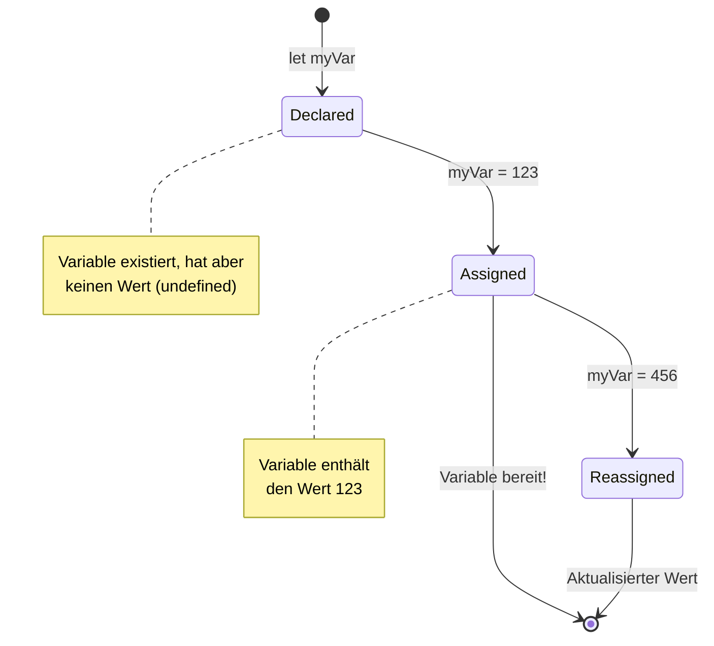
> **Kurzer Tipp**: Denk an Variablen wie beschriftete Aufbewahrungsboxen. Du erstellst die Box (`let`), legst etwas hinein (`=`) und kannst später den Inhalt austauschen, falls nötig!

## Konstanten

Manchmal musst du Informationen speichern, die sich während der Programmausführung niemals ändern sollten. Denk an Konstanten wie die mathematischen Prinzipien, die Euklid im antiken Griechenland formulierte – einmal bewiesen und dokumentiert, blieben sie für immer unverändert.

Konstanten funktionieren ähnlich wie Variablen, aber mit einer wichtigen Einschränkung: Sobald du ihnen einen Wert gegeben hast, kann dieser nicht mehr geändert werden. Diese Unveränderlichkeit schützt vor versehentlichen Änderungen kritischer Werte in deinem Programm.

Die Deklaration und Initialisierung einer Konstante folgt den gleichen Konzepten wie bei einer Variable, mit Ausnahme des Schlüsselworts `const`. Konstanten werden üblicherweise in Großbuchstaben benannt.

```javascript
const MY_VARIABLE = 123;
```

**Das macht dieser Code:**
- **Erstellt** eine Konstante namens `MY_VARIABLE` mit dem Wert 123
- **Verwendet** Großschreibweise als Namenskonvention für Konstanten
- **Verhindert** jegliche zukünftigen Änderungen dieses Werts

Konstanten haben zwei Hauptregeln:

- **Sie müssen sofort einen Wert bekommen** – leere Konstanten sind nicht erlaubt!
- **Du kannst diesen Wert niemals ändern** – JavaScript wirft einen Fehler, wenn du es versuchst. Sieh dir an, was ich meine:

   **Einfacher Wert** – Das Folgende ist NICHT erlaubt:
   
      ```javascript
      const PI = 3;
      PI = 4; // nicht erlaubt
      ```

   **Was du dir merken musst:**
   - **Versuche, eine Konstante neu zuzuweisen, führen zu einem Fehler**
   - **Schützt** wichtige Werte vor versehentlichen Änderungen
   - **Gewährleistet**, dass der Wert im Programm immer gleich bleibt
 
   **Objektreferenz ist geschützt** – Das Folgende ist NICHT erlaubt:
   
      ```javascript
      const obj = { a: 3 };
      obj = { b: 5 } // nicht erlaubt
      ```

   **Verständnis dieser Konzepte:**
   - **Verhindert** das Ersetzen des gesamten Objekts durch ein neues
   - **Schützt** die Referenz auf das ursprüngliche Objekt
   - **Erhält** die Identität des Objekts im Speicher

    **Objektwert ist nicht geschützt** – Das Folgende ist ERLAUBT:
    
      ```javascript
      const obj = { a: 3 };
      obj.a = 5;  // erlaubt
      ```

      **Erläuterung was hier passiert:**
      - **Ändert** den Eigenschaftswert innerhalb des Objekts
      - **Behält** dieselbe Objekt-Referenz bei
      - **Zeigt**, dass der Inhalt eines Objekts geändert werden kann, während die Referenz unverändert bleibt

   > Hinweis: `const` bedeutet, dass die Referenz gegen Neu-Zuweisung geschützt ist. Der Wert ist aber nicht _unveränderlich_ und kann sich ändern, besonders wenn es sich um komplexe Konstrukte wie Objekte handelt.

## Datentypen

JavaScript organisiert Informationen in unterschiedliche Kategorien, sogenannte Datentypen. Dieses Konzept spiegelt wider, wie antike Gelehrte Wissen kategorisierten – Aristoteles unterschied verschiedene Arten des Denkens, da logische Prinzipien nicht einheitlich auf Poesie, Mathematik und Naturphilosophie angewendet werden können.

Datentypen sind wichtig, weil verschiedene Operationen mit unterschiedlichen Arten von Informationen arbeiten. So wie du nicht mit dem Namen einer Person rechnen oder eine mathematische Gleichung alphabetisch ordnen kannst, benötigt JavaScript für jede Operation den passenden Datentyp. Dieses Verständnis verhindert Fehler und macht deinen Code zuverlässiger.

Variablen können viele verschiedene Wertetypen speichern, wie Zahlen oder Text. Diese verschiedenen Arten von Werten werden als **Datentypen** bezeichnet. Datentypen sind ein wichtiger Teil der Softwareentwicklung, weil sie Entwicklern helfen zu entscheiden, wie Code geschrieben und ausgeführt wird. Außerdem haben manche Datentypen einzigartige Eigenschaften, mit denen sich zusätzliche Informationen aus einem Wert extrahieren oder transformieren lassen.

✅ Datentypen werden auch als JavaScript-Datenprimitiven bezeichnet, da sie die grundlegenden Datentypen sind, die von der Sprache bereitgestellt werden. Es gibt 7 primitive Datentypen: string, number, bigint, boolean, undefined, null und symbol. Nimm dir einen Moment Zeit, um dir vorzustellen, wofür jeder dieser Primitiven stehen könnte. Was ist ein `zebra`? Wie sieht `0` aus? `true`?

### Zahlen

Zahlen sind der einfachste Datentyp in JavaScript. Egal, ob du ganze Zahlen wie 42, Dezimalzahlen wie 3.14 oder negative Zahlen wie -5 verwendest, JavaScript behandelt sie einheitlich.

Erinnerst du dich an unsere Variable von früher? Die 123, die wir gespeichert haben, war tatsächlich vom Typ Zahl:

```javascript
let myVariable = 123;
```

**Wesentliche Merkmale:**
- JavaScript erkennt numerische Werte automatisch
- Du kannst mit diesen Variablen mathematische Operationen durchführen
- Es ist keine explizite Typdeklaration nötig

Variablen können alle Arten von Zahlen speichern, einschließlich Dezimalzahlen und negative Werte. Zahlen können auch mit arithmetischen Operatoren verwendet werden, die im [nächsten Abschnitt](../../../../2-js-basics/1-data-types) behandelt werden.

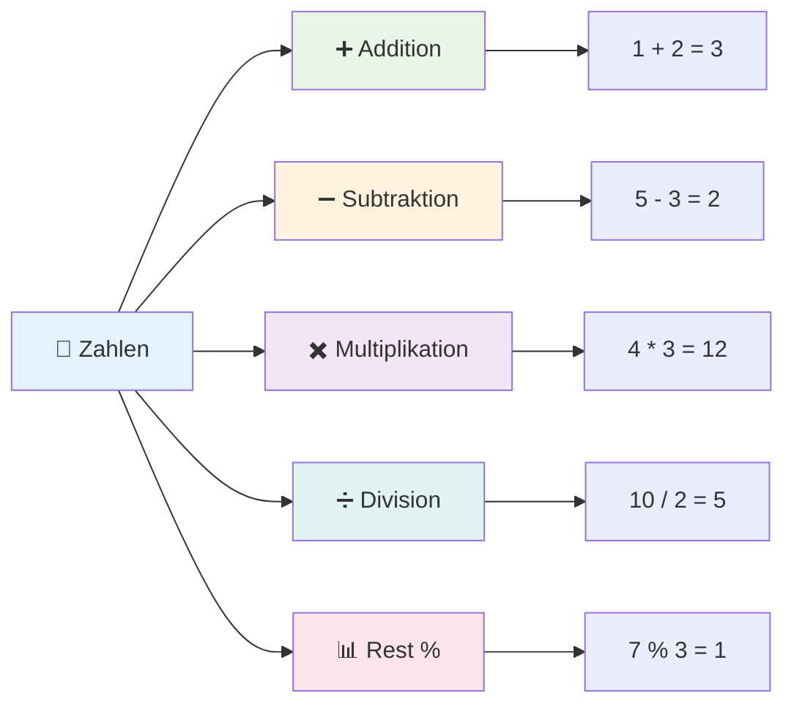
### Arithmetische Operatoren

Arithmetische Operatoren ermöglichen es dir, mathematische Berechnungen in JavaScript durchzuführen. Diese Operatoren folgen denselben Prinzipien, die Mathematiker seit Jahrhunderten verwenden – dieselben Symbole, die in den Werken von Gelehrten wie Al-Chwarizmi auftauchten, der die algebraische Notation entwickelte.

Die Operatoren funktionieren so, wie man es aus der traditionellen Mathematik erwartet: Plus für Addition, Minus für Subtraktion, und so weiter.

Es gibt mehrere Operatoren, die du bei arithmetischen Funktionen nutzen kannst, einige davon sind hier aufgelistet:

| Symbol | Beschreibung                                                              | Beispiel                          |
| ------ | ------------------------------------------------------------------------ | -------------------------------- |
| `+`    | **Addition**: Berechnet die Summe zweier Zahlen                          | `1 + 2 //erwartete Antwort ist 3`   |
| `-`    | **Subtraktion**: Berechnet die Differenz zweier Zahlen                   | `1 - 2 //erwartete Antwort ist -1`  |
| `*`    | **Multiplikation**: Berechnet das Produkt zweier Zahlen                  | `1 * 2 //erwartete Antwort ist 2`   |
| `/`    | **Division**: Berechnet den Quotienten zweier Zahlen                     | `1 / 2 //erwartete Antwort ist 0.5` |
| `%`    | **Restwert**: Berechnet den Rest der Division zweier Zahlen              | `1 % 2 //erwartete Antwort ist 1`   |

✅ Probiere es aus! Versuche eine arithmetische Operation in der Konsole deines Browsers. Überraschen dich die Ergebnisse?

### 🧮 **Mathe-Fähigkeiten Check: Berechnen mit Selbstvertrauen**

**Teste dein Verständnis arithmetischer Operatoren:**
- Was ist der Unterschied zwischen `/` (Division) und `%` (Rest)?
- Kannst du vorhersagen, was `10 % 3` ergibt? (Tipp: es ist nicht 3,33...)
- Warum könnte der Rest-Operator in der Programmierung nützlich sein?

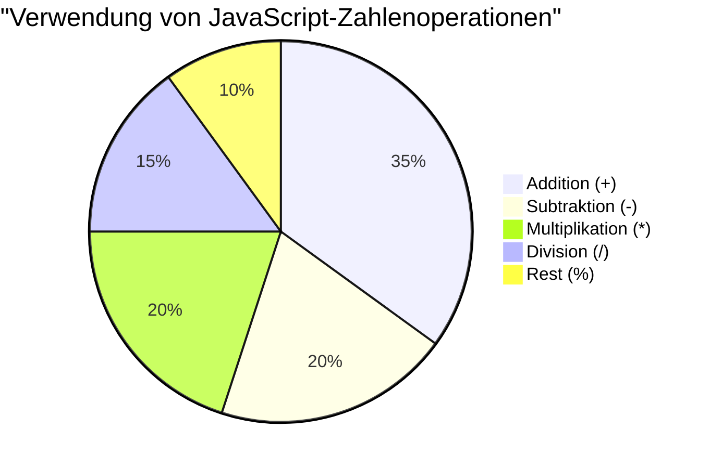
> **Praktischer Tipp**: Der Restwert-Operator (%) ist super hilfreich, um zu prüfen, ob Zahlen gerade oder ungerade sind, Muster zu erstellen oder durch Arrays zu zyklieren!

### Strings

In JavaScript werden Textdaten als Strings dargestellt. Der Begriff „String“ kommt aus dem Konzept von aneinandergereihten Zeichen, ähnlich wie mittelalterliche Schreiber in Klöstern Buchstaben aneinanderfügten, um Wörter und Sätze zu bilden.

Strings sind grundlegend für die Webentwicklung. Jeder Text, der auf einer Webseite angezeigt wird – Benutzernamen, Beschriftungen von Schaltflächen, Fehlermeldungen, Inhalte – wird als String verarbeitet. Das Verständnis von Strings ist essenziell für die Erstellung funktionaler Benutzeroberflächen.

Strings sind Zeichenketten, die zwischen einfachen oder doppelten Anführungszeichen stehen.

```javascript
'This is a string'
"This is also a string"
let myString = 'This is a string value stored in a variable';
```

**Verständnis dieser Konzepte:**
- **Verwendet** entweder einfache `'` oder doppelte `"` Anführungszeichen zur Definition von Strings
- **Speichert** Textdaten, die Buchstaben, Zahlen und Symbole enthalten können
- **Weist** Stringwerte Variablen für eine spätere Verwendung zu
- **Erfordert** Anführungszeichen, um Text von Variablennamen zu unterscheiden

Denke daran, Anführungszeichen zu setzen, wenn du einen String schreibst, sonst nimmt JavaScript an, dass es sich um einen Variablennamen handelt.

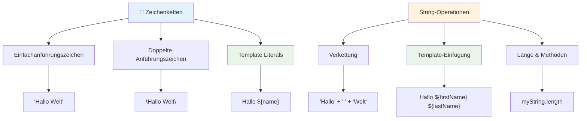
### Strings formatieren

Die String-Manipulation ermöglicht dir, Textelemente zu kombinieren, Variablen einzubauen und dynamischen Inhalt zu erzeugen, der auf den Zustand des Programms reagiert. Mit dieser Technik kannst du Texte programmatisch zusammensetzen.

Oft musst du mehrere Strings zusammenfügen – dieser Vorgang wird Konkatenation genannt.
Um zwei oder mehr Zeichenketten zu **konkatenieren** oder zusammenzufügen, verwenden Sie den `+`-Operator.

```javascript
let myString1 = "Hello";
let myString2 = "World";

myString1 + myString2 + "!"; //HalloWelt!
myString1 + " " + myString2 + "!"; //Hallo Welt!
myString1 + ", " + myString2 + "!"; //Hallo, Welt!
```

**Schritt für Schritt passiert Folgendes:**
- **Kombiniert** mehrere Zeichenketten mit dem `+`-Operator
- **Fügt** im ersten Beispiel Zeichenketten direkt ohne Leerzeichen zusammen
- **Fügt** Leerzeichen `" "` zwischen die Zeichenketten für bessere Lesbarkeit ein
- **Setzt** Satzzeichen wie Kommas ein, um eine korrekte Formatierung zu erreichen

✅ Warum ist in JavaScript `1 + 1 = 2`, aber `'1' + '1' = 11`? Denken Sie darüber nach. Wie sieht es mit `'1' + 1` aus?

**Template-Literale** sind eine weitere Möglichkeit, Zeichenketten zu formatieren, wobei statt Anführungszeichen der Backtick verwendet wird. Alles, was kein einfacher Text ist, muss in Platzhalter `${ }` eingefügt werden. Dies umfasst auch Variablen, die Zeichenketten sein können.

```javascript
let myString1 = "Hello";
let myString2 = "World";

`${myString1} ${myString2}!` //Hallo Welt!
`${myString1}, ${myString2}!` //Hallo, Welt!
```

**Lassen Sie uns jeden Teil verstehen:**
- **Verwendet** Backticks `` ` `` statt regulärer Anführungszeichen, um Template-Literale zu erstellen
- **Bettet** Variablen direkt mit der `${}`-Platzhalter-Syntax ein
- **Erhält** Leerzeichen und Formatierung genau so, wie sie geschrieben sind
- **Bietet** eine sauberere Möglichkeit, komplexe Zeichenketten mit Variablen zu erstellen

Beide Methoden können Ihre Formatierungsziele erreichen, aber Template-Literale respektieren alle Leerzeichen und Zeilenumbrüche.

✅ Wann würden Sie ein Template-Literal anstelle einer einfachen Zeichenkette verwenden?

### 🔤 **Zeichenketten-Meisterschaftscheck: Textmanipulations-Selbstvertrauen**

**Bewerten Sie Ihre Zeichenketten-Fähigkeiten:**
- Können Sie erklären, warum `'1' + '1'` `'11'` ergibt und nicht `2`?
- Welche Zeichenketten-Methode finden Sie lesbarer: Konkatenation oder Template-Literale?
- Was passiert, wenn Sie die Anführungszeichen um eine Zeichenkette vergessen?

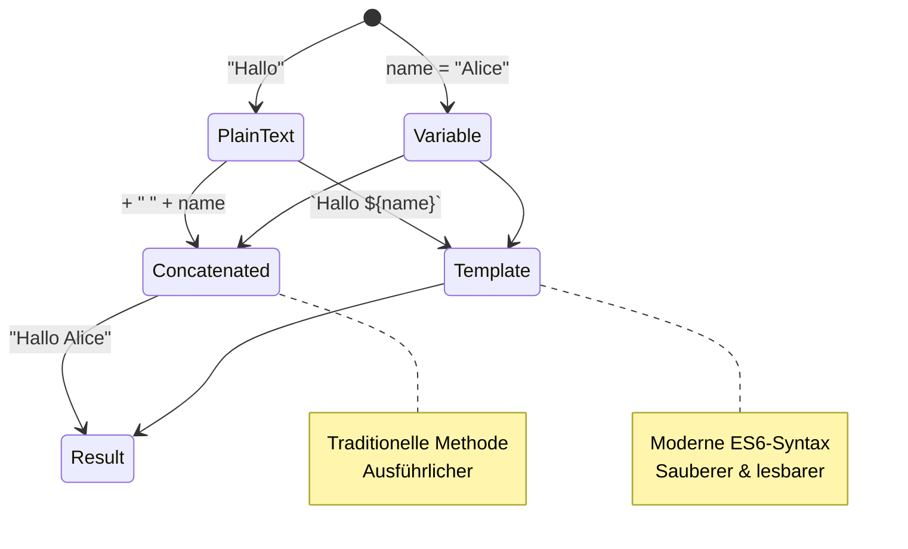
> **Profi-Tipp**: Template-Literale werden allgemein für komplexe Zeichenketten bevorzugt, da sie lesbarer sind und mehrzeilige Zeichenketten wunderschön handhaben!

### Booleans

Booleans repräsentieren die einfachste Form von Daten: Sie können nur einen von zwei Werten halten – `true` oder `false`. Dieses Binärlogiksystem stammt von George Boole, einem Mathematiker des 19. Jahrhunderts, der die Boole'sche Algebra entwickelte.

Trotz ihrer Einfachheit sind Booleans für die Programmlogik unverzichtbar. Sie ermöglichen es Ihrem Code, Entscheidungen basierend auf Bedingungen zu treffen – ob ein Benutzer angemeldet ist, ob ein Button geklickt wurde oder ob bestimmte Kriterien erfüllt sind.

Booleans können nur zwei Werte annehmen: `true` oder `false`. Booleans helfen dabei zu entscheiden, welche Codezeilen ausgeführt werden, wenn bestimmte Bedingungen erfüllt sind. In vielen Fällen unterstützen [Operatoren](../../../../2-js-basics/1-data-types) die Festlegung des Wertes eines Booleans und Sie werden oft Variablen sehen und schreiben, die mit einem Operator initialisiert oder deren Werte aktualisiert werden.

```javascript
let myTrueBool = true;
let myFalseBool = false;
```

**Oben haben wir:**
- **Eine Variable erstellt, die den Boolean-Wert `true` speichert**
- **Zeigt, wie der Boolean-Wert `false` gespeichert wird**
- **Die exakten Schlüsselwörter `true` und `false` verwendet (keine Anführungszeichen nötig)**
- **Diese Variablen für die Verwendung in bedingten Anweisungen vorbereitet**

✅ Eine Variable kann als 'truthy' angesehen werden, wenn sie zu dem Boolean `true` evaluiert. Interessanterweise sind in JavaScript [alle Werte truthy, sofern sie nicht als falsy definiert sind](https://developer.mozilla.org/docs/Glossary/Truthy).

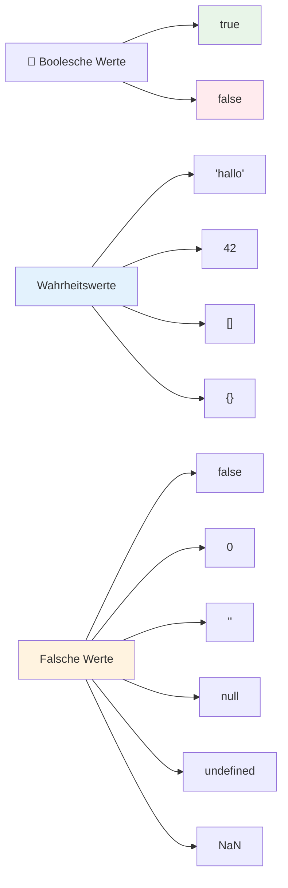
### 🎯 **Boolean-Logik Check: Entscheidungsfindungskompetenz**

**Testen Sie Ihr Verständnis von Booleans:**
- Warum glauben Sie, hat JavaScript neben `true` und `false` noch „truthy“ und „falsy“-Werte?
- Können Sie vorhersagen, welche dieser Werte falsy sind: `0`, `"0"`, `[]`, `"false"`?
- Wie können Booleans nützlich sein, um den Programmfluss zu steuern?

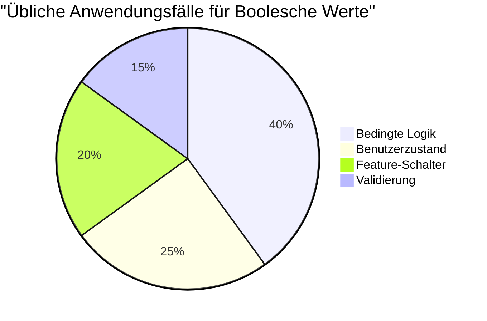
> **Merken Sie sich:** In JavaScript sind nur 6 Werte falsy: `false`, `0`, `""`, `null`, `undefined` und `NaN`. Alles andere ist truthy!

---

## 📊 **Zusammenfassung Ihres Werkzeugkastens für Datentypen**

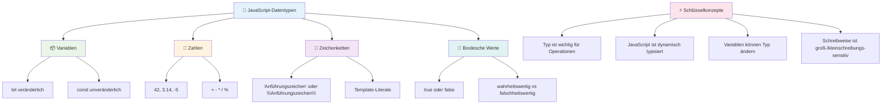
## GitHub Copilot Agent Challenge 🚀

Verwenden Sie den Agent-Modus, um die folgende Herausforderung zu meistern:

**Beschreibung:** Erstellen Sie einen persönlichen Informationsmanager, der alle in dieser Lektion gelernten JavaScript-Datentypen demonstriert und realweltliche Datenszenarien verarbeitet.

**Aufgabe:** Schreiben Sie ein JavaScript-Programm, das ein Benutzerprofilobjekt mit folgendem Inhalt erstellt: Name einer Person (String), Alter (Number), Studentenstatus (Boolean), Lieblingsfarben als Array und ein Adressobjekt mit Straße, Stadt und Postleitzahl. Fügen Sie Funktionen hinzu, um die Profildaten anzuzeigen und einzelne Felder zu aktualisieren. Demonstrieren Sie Zeichenketten-Konkatenation, Template-Literale, arithmetische Operationen mit dem Alter und Boolean-Logik für den Studentenstatus.

Erfahren Sie mehr über den [Agent-Modus](https://code.visualstudio.com/blogs/2025/02/24/introducing-copilot-agent-mode).

## 🚀 Herausforderung

JavaScript hat einige Verhaltensweisen, die Entwickler überraschen können. Hier ein klassisches Beispiel: Geben Sie das Folgende in Ihrer Browser-Konsole ein: `let age = 1; let Age = 2; age == Age` und beobachten Sie das Ergebnis. Es gibt `false` zurück – können Sie bestimmen, warum?

Dies ist nur eines von vielen JavaScript-Verhalten, die es zu verstehen gilt. Vertrautheit mit diesen Besonderheiten hilft Ihnen, zuverlässiger zu programmieren und Fehler besser zu beheben.

## Post-Lecture Quiz
[Post-Lecture Quiz](https://ff-quizzes.netlify.app)

## Überprüfung & Selbststudium

Schauen Sie sich [diese Liste mit JavaScript-Übungen](https://css-tricks.com/snippets/javascript/) an und probieren Sie eine aus. Was haben Sie gelernt?

## Aufgabe

[Datentypen Übung](assignment.md)

## 🚀 Ihre JavaScript-Datentyp-Meisterschafts-Zeitleiste

### ⚡ **Was Sie in den nächsten 5 Minuten tun können**
- [ ] Öffnen Sie Ihre Browser-Konsole und erstellen Sie 3 Variablen mit unterschiedlichen Datentypen
- [ ] Versuchen Sie die Herausforderung: `let age = 1; let Age = 2; age == Age` und finden Sie heraus, warum es false ist
- [ ] Üben Sie die Zeichenketten-Konkatenation mit Ihrem Namen und Ihrer Lieblingszahl
- [ ] Testen Sie, was passiert, wenn Sie eine Zahl einer Zeichenkette hinzufügen

### 🎯 **Was Sie in dieser Stunde erreichen können**
- [ ] Machen Sie das Post-Lesson-Quiz und überprüfen Sie verwirrende Konzepte
- [ ] Erstellen Sie einen Mini-Rechner, der zwei Zahlen addiert, subtrahiert, multipliziert und dividiert
- [ ] Bauen Sie einen einfachen Namensformatierer mit Template-Literalen
- [ ] Erkunden Sie die Unterschiede zwischen den Vergleichsoperatoren `==` und `===`
- [ ] Üben Sie das Konvertieren zwischen verschiedenen Datentypen

### 📅 **Ihre wöchentliche JavaScript-Basis**
- [ ] Schließen Sie die Aufgabe mit Selbstvertrauen und Kreativität ab
- [ ] Erstellen Sie ein persönliches Profilobjekt unter Verwendung aller gelernten Datentypen
- [ ] Üben Sie mit [JavaScript-Übungen von CSS-Tricks](https://css-tricks.com/snippets/javascript/)
- [ ] Erstellen Sie einen einfachen Formularvalidierer mit Boolean-Logik
- [ ] Experimentieren Sie mit Array- und Objekt-Datentypen (Vorschau kommender Lektionen)
- [ ] Treten Sie einer JavaScript-Community bei und stellen Sie Fragen zu Datentypen

### 🌟 **Ihre monatliche Transformation**
- [ ] Integrieren Sie Datentypwissen in größere Programmierprojekte
- [ ] Verstehen Sie, wann und warum Sie jeden Datentyp in realen Anwendungen verwenden
- [ ] Helfen Sie anderen Anfängern, die JavaScript-Grundlagen zu verstehen
- [ ] Erstellen Sie eine kleine Anwendung, die verschiedene Arten von Benutzerdaten verwaltet
- [ ] Erkunden Sie fortgeschrittene Datentypkonzepte wie Typumwandlung und strikte Gleichheit
- [ ] Tragen Sie zur Open-Source-JavaScript-Projekten mit Dokumentationsverbesserungen bei

### 🧠 **Abschließender Datentypen-Meisterschafts-Check-in**

**Feiern Sie Ihre JavaScript-Basis:**
- Welcher Datentyp hat Sie am meisten durch sein Verhalten überrascht?
- Wie sicher fühlen Sie sich, wenn Sie Variablen vs. Konstanten einem Freund erklären?
- Was war das Interessanteste, das Sie über das Typsystem von JavaScript entdeckt haben?
- Welche reale Anwendung können Sie sich vorstellen, die Sie mit diesen Grundlagen bauen können?

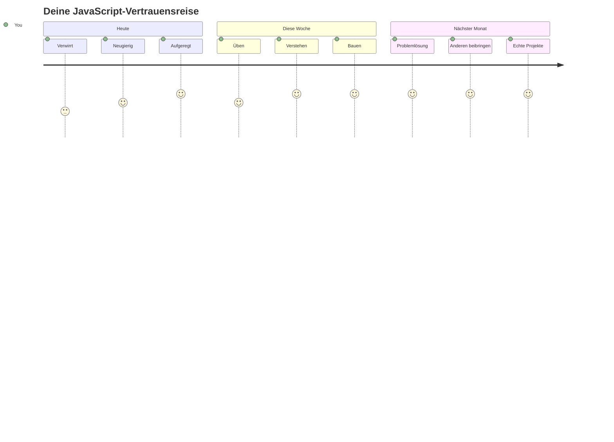
> 💡 **Sie haben das Fundament gelegt!** Datentypen zu verstehen ist wie das Alphabet lernen, bevor man Geschichten schreibt. Jedes JavaScript-Programm, das Sie jemals schreiben werden, verwendet diese fundamentalen Konzepte. Sie haben jetzt die Bausteine, um interaktive Webseiten, dynamische Anwendungen zu erstellen und reale Probleme mit Code zu lösen. Willkommen in der wundervollen Welt von JavaScript! 🎉

---

<!-- CO-OP TRANSLATOR DISCLAIMER START -->
**Haftungsausschluss**:  
Dieses Dokument wurde mit dem KI-Übersetzungsdienst [Co-op Translator](https://github.com/Azure/co-op-translator) übersetzt. Obwohl wir auf Genauigkeit achten, weisen wir darauf hin, dass automatisierte Übersetzungen Fehler oder Ungenauigkeiten enthalten können. Das Originaldokument in seiner Ursprungssprache ist als maßgebliche Quelle anzusehen. Für kritische Informationen wird eine professionelle menschliche Übersetzung empfohlen. Wir übernehmen keine Haftung für Missverständnisse oder Fehlinterpretationen, die durch die Nutzung dieser Übersetzung entstehen.
<!-- CO-OP TRANSLATOR DISCLAIMER END -->