# JavaScript-Grundlagen: Methoden und Funktionen

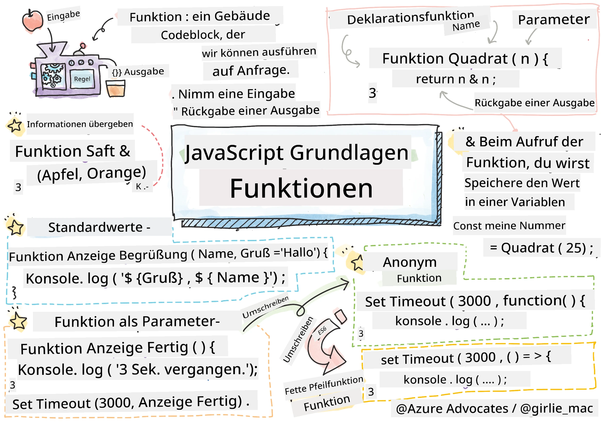  
> Sketchnote von [Tomomi Imura](https://twitter.com/girlie_mac)

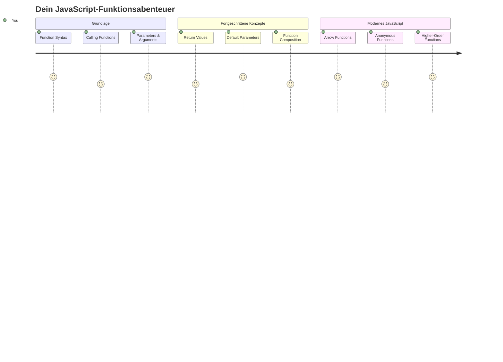
## Vor-Vorlesungs-Quiz  
[Vor-Vorlesungs-Quiz](https://ff-quizzes.netlify.app)

Den gleichen Code immer wieder zu schreiben, ist eine der häufigsten Frustrationen beim Programmieren. Funktionen lösen dieses Problem, indem sie dir erlauben, Code in wiederverwendbare Blöcke zu verpacken. Denk an Funktionen wie die standardisierten Teile, die Henry Fords Fließband revolutionierten – sobald du eine zuverlässige Komponente erstellt hast, kannst du sie überall verwenden, ohne sie neu bauen zu müssen.

Funktionen ermöglichen es dir, Codeabschnitte zu bündeln, sodass du sie im gesamten Programm wiederverwenden kannst. Anstatt dieselbe Logik überall zu kopieren und einzufügen, kannst du eine Funktion einmal erstellen und sie bei Bedarf aufrufen. Dieser Ansatz hält deinen Code organisiert und macht Aktualisierungen viel einfacher.

In dieser Lektion lernst du, wie du eigene Funktionen erstellst, Informationen an sie übergibst und nützliche Ergebnisse zurückbekommst. Du entdeckst den Unterschied zwischen Funktionen und Methoden, lernst moderne Syntaxansätze kennen und siehst, wie Funktionen mit anderen Funktionen zusammenarbeiten können. Wir bauen diese Konzepte Schritt für Schritt auf.

[](https://youtube.com/watch?v=XgKsD6Zwvlc "Methods and Functions")

> 🎥 Klicke oben auf das Bild für ein Video über Methoden und Funktionen.

> Du kannst diese Lektion auf [Microsoft Learn](https://docs.microsoft.com/learn/modules/web-development-101-functions/?WT.mc_id=academic-77807-sagibbon) absolvieren!

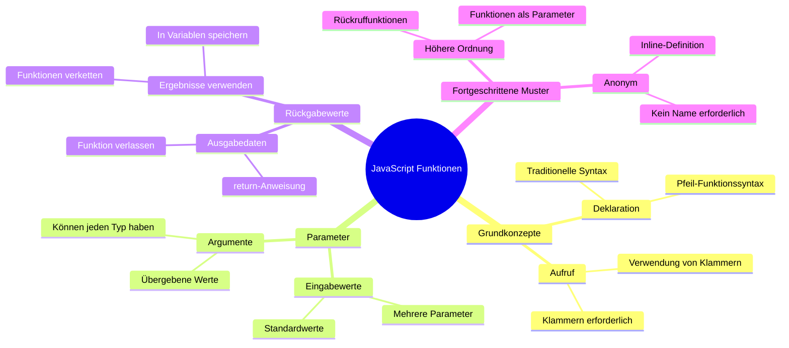
## Funktionen

Eine Funktion ist ein eigenständiger Codeblock, der eine bestimmte Aufgabe ausführt. Sie kapselt Logik ein, die du bei Bedarf ausführen kannst.

Anstatt denselben Code mehrfach im Programm zu schreiben, kannst du ihn in einer Funktion verpacken und diese Funktion immer dann aufrufen, wenn du sie brauchst. Dieser Ansatz hält deinen Code sauber und erleichtert Updates erheblich. Stell dir vor, du müsstest Logik ändern, die über 20 verschiedene Stellen in deinem Code verstreut ist – das wäre sehr aufwändig.

Es ist wichtig, deinen Funktionen beschreibende Namen zu geben. Eine gut benannte Funktion kommuniziert ihren Zweck klar – wenn du `cancelTimer()` siehst, verstehst du sofort, was sie macht, genau wie ein klar beschrifteter Knopf dir genau sagt, was passiert, wenn du ihn klickst.

## Eine Funktion erstellen und aufrufen

Schauen wir uns an, wie man eine Funktion erstellt. Die Syntax folgt einem einheitlichen Muster:

```javascript
function nameOfFunction() { // Funktionsdefinition
 // Funktionsdefinition/-körper
}
```
  
Schauen wir uns das genauer an:  
- Das Schlüsselwort `function` sagt JavaScript: "Hey, ich erstelle eine Funktion!"  
- `nameOfFunction` ist der Platz, wo du deiner Funktion einen beschreibenden Namen gibst  
- Die runden Klammern `()` sind der Ort, um Parameter hinzuzufügen (dazu gleich mehr)  
- Die geschweiften Klammern `{}` enthalten den eigentlichen Code, der ausgeführt wird, wenn du die Funktion aufrufst  

Lasst uns eine einfache Begrüßungsfunktion erstellen, um das in Aktion zu sehen:

```javascript
function displayGreeting() {
  console.log('Hello, world!');
}
```
  
Diese Funktion gibt "Hello, world!" in der Konsole aus. Sobald du sie definiert hast, kannst du sie so oft aufrufen, wie du möchtest.

Um deine Funktion auszuführen (oder „aufzurufen“), schreibst du ihren Namen gefolgt von runden Klammern. JavaScript erlaubt dir, deine Funktion vor oder nach dem Aufruf zu definieren – die JavaScript-Engine kümmert sich um die Ausführungsreihenfolge.

```javascript
// unsere Funktion aufrufen
displayGreeting();
```
  
Wenn du diese Zeile ausführst, wird der gesamte Code innerhalb deiner Funktion `displayGreeting` ausgeführt und zeigt „Hello, world!“ in der Browser-Konsole an. Du kannst diese Funktion mehrfach aufrufen.

### 🧠 **Grundlagenprüfung Funktionen: Deine ersten Funktionen bauen**

**Wie fühlst du dich bei den Grundlagen zu Funktionen?**  
- Kannst du erklären, warum wir geschweifte Klammern `{}` in Funktionsdefinitionen verwenden?  
- Was passiert, wenn du `displayGreeting` ohne die Klammern schreibst?  
- Warum möchtest du dieselbe Funktion vielleicht mehrfach aufrufen?  

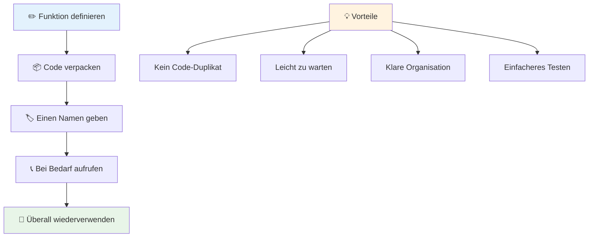
> **Hinweis:** Du hast bisher in den Lektionen **Methoden** verwendet. `console.log()` ist eine Methode – im Grunde eine Funktion, die zum `console`-Objekt gehört. Der Hauptunterschied ist, dass Methoden an Objekte gebunden sind, während Funktionen eigenständig sind. Viele Entwickler verwenden diese Begriffe im Alltag oft synonym.

### Best Practices für Funktionen

Hier sind einige Tipps, die dir helfen, tolle Funktionen zu schreiben:

- Gib deinen Funktionen klare, beschreibende Namen – dein zukünftiges Ich wird es dir danken!  
- Verwende **camelCasing** für mehrteilige Namen (wie `calculateTotal` statt `calculate_total`)  
- Halte jede Funktion fokussiert auf eine Aufgabe, die sie gut erledigen soll

## Informationen an eine Funktion übergeben

Unsere Funktion `displayGreeting` ist eingeschränkt – sie kann nur „Hello, world!“ für alle anzeigen. Parameter erlauben es uns, Funktionen flexibler und nützlicher zu machen.

**Parameter** fungieren wie Platzhalter, in die du bei jedem Funktionsaufruf unterschiedliche Werte einfügen kannst. So kann dieselbe Funktion mit verschiedenen Informationen arbeiten.

Du listest Parameter in den runden Klammern bei der Funktionsdefinition auf, und trennst mehrere Parameter mit Kommas:

```javascript
function name(param, param2, param3) {

}
```
  
Jeder Parameter funktioniert wie ein Platzhalter – wenn jemand deine Funktion aufruft, gibt er tatsächliche Werte an, die an diese Stellen eingesetzt werden.

Aktualisieren wir unsere Begrüßungsfunktion, damit sie den Namen einer Person entgegennimmt:

```javascript
function displayGreeting(name) {
  const message = `Hello, ${name}!`;
  console.log(message);
}
```
  
Beachte, wie wir Backticks (`` ` ``) und `${}` verwenden, um den Namen direkt in unsere Nachricht einzufügen – das nennt man template literal und ist eine sehr praktische Methode, um Strings mit Variablen zu bauen.

Nun können wir der Funktion bei jedem Aufruf einen Namen übergeben:

```javascript
displayGreeting('Christopher');
// zeigt "Hallo, Christopher!" an, wenn ausgeführt
```
  
JavaScript nimmt den String `'Christopher'`, weist ihn dem Parameter `name` zu und erzeugt die personalisierte Nachricht „Hello, Christopher!“

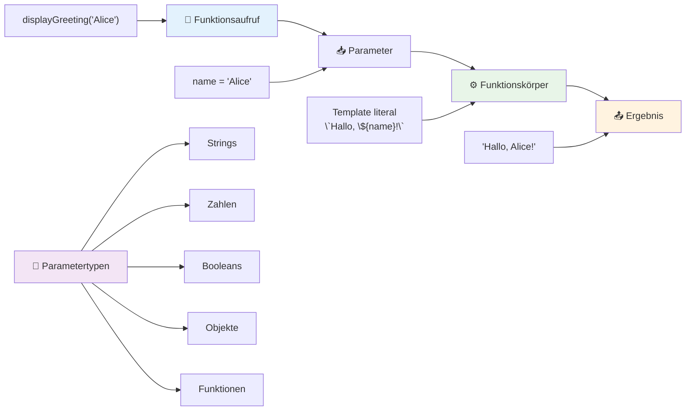
## Standardwerte

Was, wenn wir einige Parameter optional machen wollen? Hier helfen Standardwerte!

Nehmen wir an, wir wollen es ermöglichen, den Begrüßungswort individuell anzupassen, aber falls keiner was angibt, verwenden wir als Standard „Hello“. Du kannst Standardwerte festlegen, indem du das Gleichheitszeichen benutzt, genau wie bei Variablen:

```javascript
function displayGreeting(name, salutation='Hello') {
  console.log(`${salutation}, ${name}`);
}
```
  
Hier ist `name` weiterhin erforderlich, aber `salutation` hat als Backup den Wert `'Hello'`, falls niemand eine andere Begrüßung angibt.

Jetzt können wir diese Funktion auf zwei Arten aufrufen:

```javascript
displayGreeting('Christopher');
// zeigt "Hallo, Christopher" an

displayGreeting('Christopher', 'Hi');
// zeigt "Hi, Christopher" an
```
  
Beim ersten Aufruf verwendet JavaScript den Standardwert „Hello“, weil wir keine Begrüßung angegeben haben. Beim zweiten Aufruf wird stattdessen unser eigenes „Hi“ verwendet. Diese Flexibilität macht Funktionen an unterschiedliche Situationen anpassbar.

### 🎛️ **Parameterprüfung: Funktionen flexibel machen**

**Teste dein Verständnis von Parametern:**  
- Was ist der Unterschied zwischen einem Parameter und einem Argument?  
- Warum sind Standardwerte in der realen Programmierung nützlich?  
- Kannst du vorhersagen, was passiert, wenn du mehr Argumente übergibst als Parameter definiert sind?  

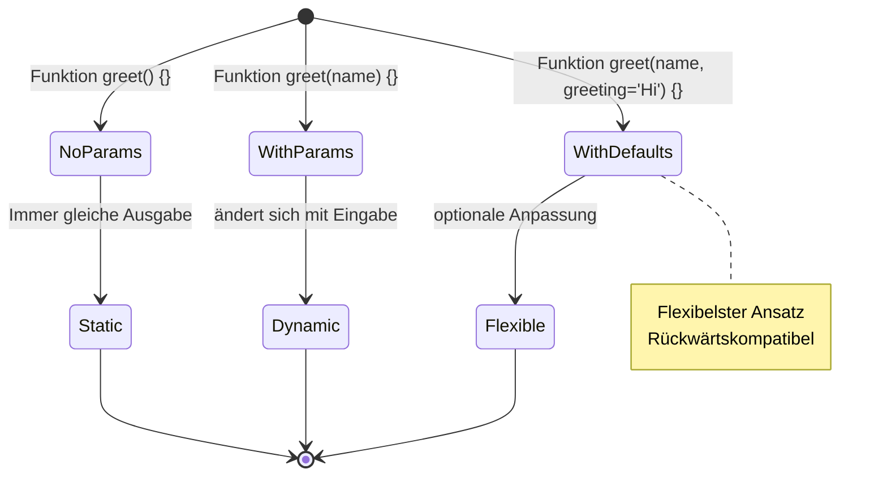
> **Profi-Tipp**: Standardparameter machen deine Funktionen benutzerfreundlicher. Nutzer können schnell mit sinnvollen Standardwerten starten und bei Bedarf anpassen!

## Rückgabewerte

Bisher haben unsere Funktionen nur Nachrichten in der Konsole ausgegeben, aber was, wenn eine Funktion etwas berechnen und das Ergebnis zurückgeben soll?

Dafür gibt es **Rückgabewerte**. Statt einfach nur etwas anzuzeigen, kann eine Funktion dir einen Wert zurückgeben, den du in einer Variablen speichern oder an anderer Stelle im Code verwenden kannst.

Um einen Wert zurückzugeben, verwendest du das Schlüsselwort `return` gefolgt von dem Wert, den du zurückgeben möchtest:

```javascript
return myVariable;
```
  
Wichtig: Wenn eine Funktion auf eine `return`-Anweisung trifft, hört sie sofort auf zu laufen und sendet den Wert zurück an den Aufrufer.

Passen wir unsere Begrüßungsfunktion so an, dass sie die Nachricht zurückgibt anstatt sie auszugeben:

```javascript
function createGreetingMessage(name) {
  const message = `Hello, ${name}`;
  return message;
}
```
  
Jetzt erzeugt die Funktion die Nachricht und gibt sie zurück, anstatt sie auszugeben.

Um den Rückgabewert zu verwenden, können wir ihn in einer Variablen speichern – wie jeden anderen Wert auch:

```javascript
const greetingMessage = createGreetingMessage('Christopher');
```
  
Jetzt enthält `greetingMessage` „Hello, Christopher“ und wir können diese Nachricht überall im Code verwenden – um sie auf einer Webseite anzuzeigen, in eine E-Mail einzufügen oder an eine andere Funktion zu übergeben.

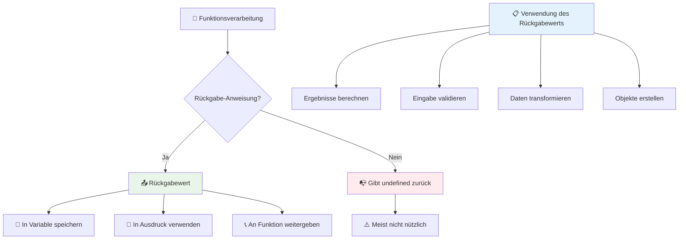
### 🔄 **Rückgabewerte testen: Ergebnisse zurückbekommen**

**Bewerte dein Verständnis von Rückgabewerten:**  
- Was passiert mit Code nach einer `return`-Anweisung in einer Funktion?  
- Warum ist das Zurückgeben von Werten oft besser als nur die Ausgabe in die Konsole?  
- Kann eine Funktion verschiedene Werttypen zurückgeben (String, Zahl, Boolean)?  

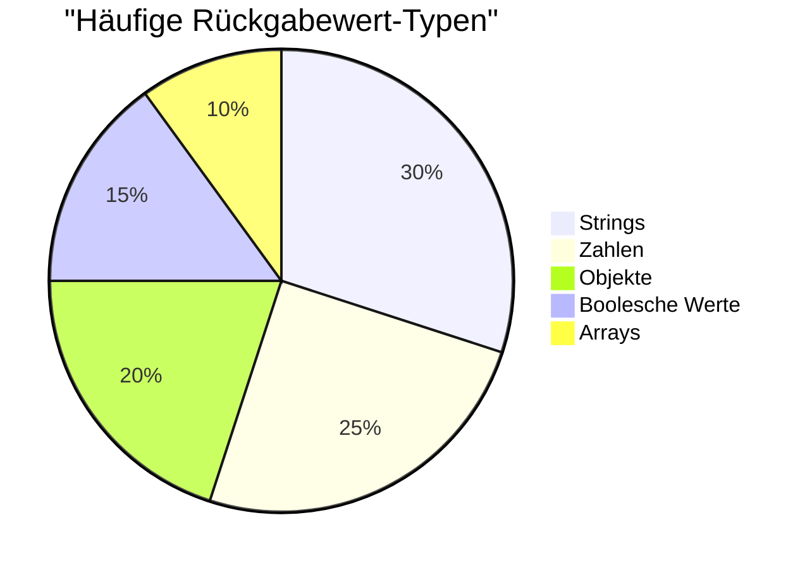
> **Wichtiger Punkt**: Funktionen, die Werte zurückgeben, sind vielseitiger, weil der Aufrufer entscheiden kann, was mit dem Ergebnis passiert. Das macht deinen Code modularer und wiederverwendbarer!

## Funktionen als Parameter für Funktionen

Funktionen können als Parameter an andere Funktionen übergeben werden. Dieses Konzept mag anfangs kompliziert erscheinen, ist aber eine mächtige Eigenschaft, die flexible Programmiermuster ermöglicht.

Dieses Muster ist sehr verbreitet, wenn du sagen willst „wenn etwas passiert, mach dies andere“. Zum Beispiel „wenn der Timer fertig ist, führe diesen Code aus“ oder „wenn der Nutzer den Button klickt, rufe diese Funktion auf“.

Schauen wir uns `setTimeout` an, eine eingebaute Funktion, die nach einer bestimmten Zeit etwas Code ausführt. Wir müssen ihr sagen, welchen Code sie ausführen soll – da ist das Übergeben einer Funktion genau richtig!

Probier diesen Code aus – nach 3 Sekunden erscheint eine Nachricht:

```javascript
function displayDone() {
  console.log('3 seconds has elapsed');
}
// Zeitgeberwert ist in Millisekunden
setTimeout(displayDone, 3000);
```
  
Beachte, dass wir `displayDone` (ohne Klammern) an `setTimeout` übergeben. Wir rufen die Funktion nicht selbst auf – wir übergeben sie an `setTimeout` und sagen „ruf das in 3 Sekunden auf“.

### Anonyme Funktionen

Manchmal brauchst du eine Funktion nur für eine Sache und möchtest ihr keinen Namen geben. Überleg mal: Wenn du eine Funktion nur einmal nutzt, warum solltest du deinen Code mit einem extra Namen überfrachten?

JavaScript erlaubt dir, **anonyme Funktionen** zu erstellen – Funktionen ohne Namen, die du genau dort definierst, wo du sie brauchst.

So kann man unser Timer-Beispiel mit einer anonymen Funktion schreiben:

```javascript
setTimeout(function() {
  console.log('3 seconds has elapsed');
}, 3000);
```
  
Das erzielt dasselbe Ergebnis, aber die Funktion wird direkt im Aufruf von `setTimeout` definiert, sodass keine separate Funktionsdeklaration nötig ist.

### Fat Arrow Functions

Modernes JavaScript hat eine noch kürzere Art, Funktionen zu schreiben, die sogenannten **Arrow Functions**. Sie nutzen `=>` (was wie ein Pfeil aussieht – clever, oder?) und sind bei Entwicklern sehr beliebt.

Arrow Functions sparen dir das Schlüsselwort `function` und machen den Code kürzer und klarer.

Hier unser Timer-Beispiel mit einer Arrow Function:

```javascript
setTimeout(() => {
  console.log('3 seconds has elapsed');
}, 3000);
```
  
Die `()` sind der Platz für Parameter (hier leer), dann folgt der Pfeil `=>` und schließlich der Funktionskörper in geschweiften Klammern. Das bietet dieselbe Funktionalität mit kompakter Syntax.

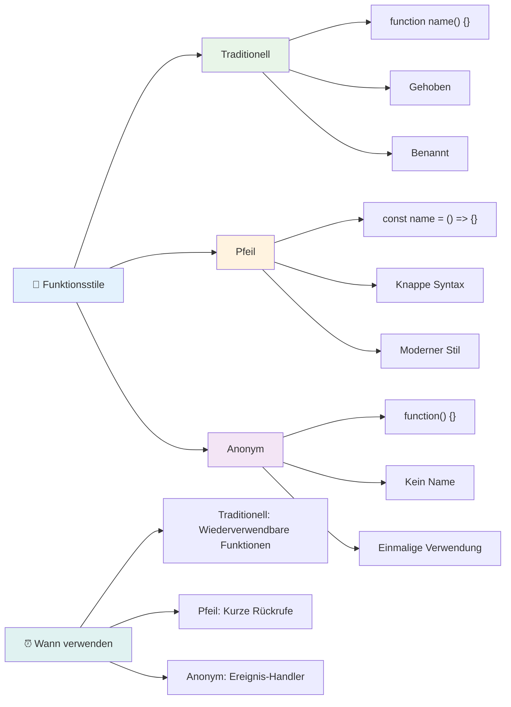
### Wann welchen Ansatz verwenden

Wann solltest du welchen Ansatz wählen? Eine praktische Faustregel: Wenn du die Funktion mehrfach brauchst, gib ihr einen Namen und definiere sie separat. Für einen einmaligen Einsatz kannst du eine anonyme Funktion nutzen. Sowohl Arrow Functions als auch die traditionelle Syntax sind gültige Optionen, wobei Arrow Functions in modernen JavaScript-Codebasen häufiger verwendet werden.

### 🎨 **Funktionsstile testen: Die richtige Syntax wählen**

**Teste dein Syntaxwissen:**  
- Wann würdest du Arrow Functions gegenüber traditioneller Funktionssyntax bevorzugen?  
- Was ist der Hauptvorteil von anonymen Funktionen?  
- Kannst du dir eine Situation vorstellen, in der eine benannte Funktion besser als eine anonyme ist?  

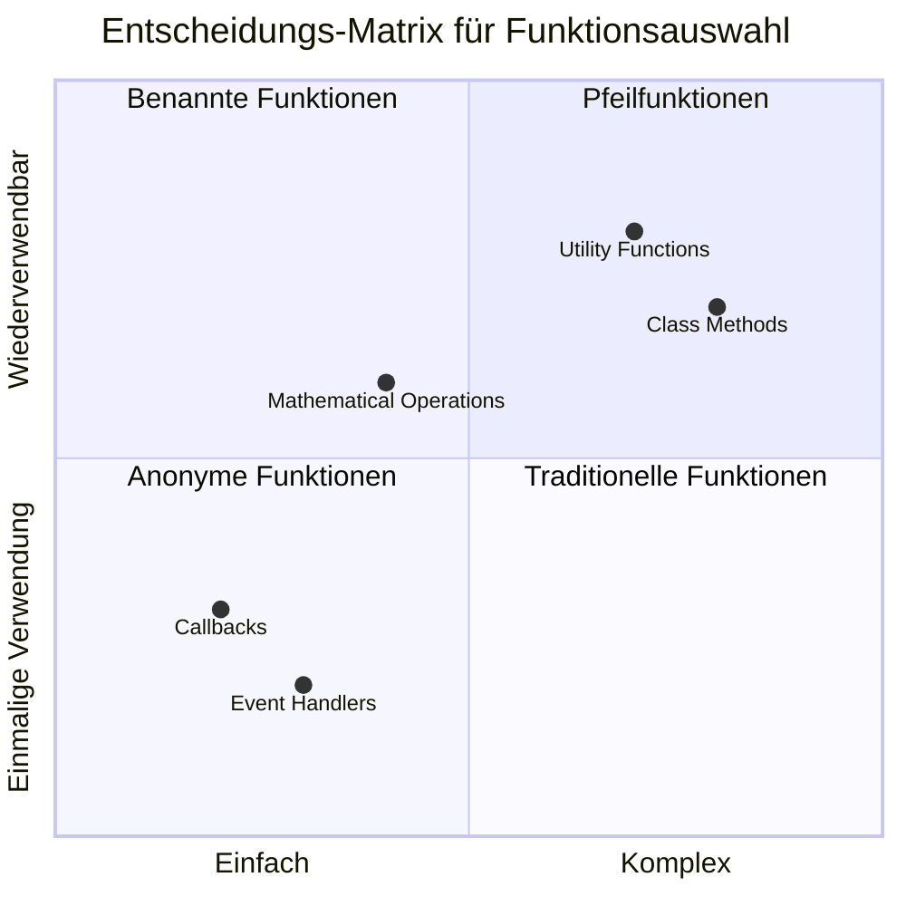
> **Moderner Trend**: Arrow Functions werden für viele Entwickler zur Standardwahl wegen ihrer kurzen Syntax, aber traditionelle Funktionen haben weiterhin ihre Berechtigung!

---

## 🚀 Herausforderung

Kannst du in einem Satz den Unterschied zwischen Funktionen und Methoden beschreiben? Versuch es mal!

## GitHub Copilot Agent Challenge 🚀

Nutze den Agent-Modus, um folgende Herausforderung zu lösen:

**Beschreibung:** Erstelle eine Hilfsbibliothek mit mathematischen Funktionen, die verschiedene in dieser Lektion behandelte Funktionenkonzepte demonstriert, einschließlich Parameter, Standardwerte, Rückgabewerte und Arrow Functions.

**Aufgabe:** Erstelle eine JavaScript-Datei namens `mathUtils.js` mit folgenden Funktionen:  
1. Eine Funktion `add`, die zwei Parameter nimmt und deren Summe zurückgibt  
2. Eine Funktion `multiply` mit Standardwerten für Parameter (zweiter Parameter standardmäßig 1)  
3. Eine Arrow Function `square`, die eine Zahl nimmt und deren Quadrat zurückgibt  
4. Eine Funktion `calculate`, die eine andere Funktion als Parameter sowie zwei Zahlen akzeptiert und dann die Funktion auf diese Zahlen anwendet  
5. Demonstriere den Aufruf jeder Funktion mit passenden Testfällen  

Mehr Infos zum [Agent-Modus](https://code.visualstudio.com/blogs/2025/02/24/introducing-copilot-agent-mode) findest du hier.

## Nach-Vorlesungs-Quiz  
[Nach-Vorlesungs-Quiz](https://ff-quizzes.netlify.app)

## Wiederholung & Selbststudium

Es lohnt sich, [noch etwas mehr über Arrow Functions zu lesen](https://developer.mozilla.org/docs/Web/JavaScript/Reference/Functions/Arrow_functions), da sie immer häufiger in Codebasen verwendet werden. Übe, eine Funktion zu schreiben und dann mit dieser Syntax neu zu formulieren.

## Aufgabe

[Fun with Functions](assignment.md)

---

## 🧰 **Dein JavaScript Funktions-Werkzeugkasten Übersicht**

```mermaid
graph TD
    A["🎯 JavaScript Funktionen"] --> B["📋 Funktionsdeklaration"]
    A --> C["📥 Parameter"]
    A --> D["📤 Rückgabewerte"]
    A --> E["🎨 Moderne Syntax"]
    
    B --> B1["function name() {}"]
    B --> B2["Beschreibende Benennung"]
    B --> B3["Wiederverwendbare Codeblöcke"]
    
    C --> C1["Eingabedaten"]
    C --> C2["Standardwerte"]
    C --> C3["Mehrere Parameter"]
    
    D --> D1["return-Anweisung"]
    D --> D2["Funktion beenden"]
    D --> D3["Daten zurückgeben"]
    
    E --> E1["Arrow-Funktionen: () =>"]
    E --> E2["Anonyme Funktionen"]
    E --> E3["Higher-order Funktionen"]
    
    F["⚡ Hauptvorteile"] --> F1["Wiederverwendbarkeit des Codes"]
    F --> F2["Bessere Organisation"]
    F --> F3["Einfacheres Testen"]
    F --> F4["Modulares Design"]
    
    style A fill:#e3f2fd
    style B fill:#e8f5e8
    style C fill:#fff3e0
    style D fill:#f3e5f5
    style E fill:#e0f2f1
    style F fill:#fce4ec
```  
---

## 🚀 Deine Mastery-Zeitleiste für JavaScript-Funktionen

### ⚡ **Was du in den nächsten 5 Minuten tun kannst**
- [ ] Schreibe eine einfache Funktion, die deine Lieblingszahl zurückgibt  
- [ ] Erstelle eine Funktion mit zwei Parametern, die diese zusammenaddiert  
- [ ] Versuche, eine traditionelle Funktion in Pfeilfunktionssyntax umzuwandeln
- [ ] Übe die Herausforderung: Erkläre den Unterschied zwischen Funktionen und Methoden

### 🎯 **Was du in dieser Stunde erreichen kannst**
- [ ] Beende das Quiz nach der Lektion und überprüfe alle verwirrenden Konzepte
- [ ] Erstelle die Mathe-Utility-Bibliothek aus der GitHub Copilot-Herausforderung
- [ ] Erstelle eine Funktion, die eine andere Funktion als Parameter verwendet
- [ ] Übe das Schreiben von Funktionen mit Standardparametern
- [ ] Experimentiere mit Template-Literalen in Rückgabewerten von Funktionen

### 📅 **Dein einwöchiges Funktions-Meisterprogramm**
- [ ] Schließe die Aufgabe "Spaß mit Funktionen" kreativ ab
- [ ] Refaktoriere wiederholten Code, den du geschrieben hast, in wiederverwendbare Funktionen
- [ ] Baue einen kleinen Taschenrechner, der nur Funktionen verwendet (keine globalen Variablen)
- [ ] Übe Pfeilfunktionen mit Array-Methoden wie `map()` und `filter()`
- [ ] Erstelle eine Sammlung von Hilfsfunktionen für häufige Aufgaben
- [ ] Studiere Higher-Order-Funktionen und Konzepte des funktionalen Programmierens

### 🌟 **Deine einmonatige Transformation**
- [ ] Beherrsche fortgeschrittene Funktionskonzepte wie Closures und Scope
- [ ] Baue ein Projekt, das stark auf Funktionskomposition setzt
- [ ] Trage zur Open Source bei, indem du Funktionsdokumentationen verbesserst
- [ ] Bringe jemandem anderes Funktionen und verschiedene Syntaxstile bei
- [ ] Erkunde Paradigmen des funktionalen Programmierens in JavaScript
- [ ] Erstelle eine persönliche Bibliothek wiederverwendbarer Funktionen für zukünftige Projekte

### 🏆 **Finaler Funktions-Champion Check-in**

**Feiere dein Funktions-Meistersein:**
- Welche Funktion hast du bisher als am nützlichsten empfunden?
- Wie hat das Lernen über Funktionen deine Denkweise zur Codeorganisation verändert?
- Welche Funktionssyntax bevorzugst du und warum?
- Welches realweltliche Problem würdest du durch das Schreiben einer Funktion lösen?

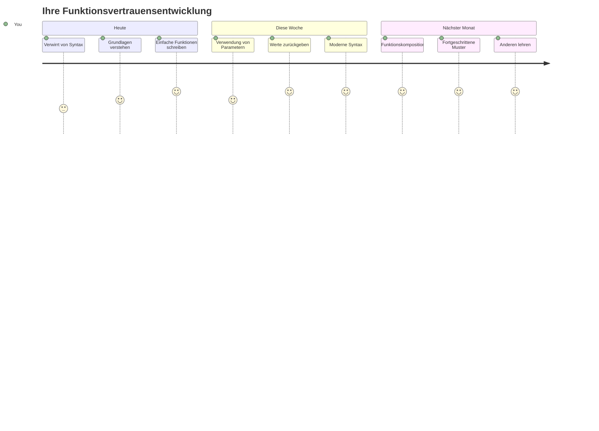
> 🎉 **Du hast eines der mächtigsten Konzepte der Programmierung gemeistert!** Funktionen sind die Bausteine größerer Programme. Jede Anwendung, die du jemals bauen wirst, nutzt Funktionen, um Code zu organisieren, wiederzuverwenden und zu strukturieren. Du verstehst jetzt, wie man Logik in wiederverwendbare Komponenten verpackt, was dich zu einem effizienteren und effektiveren Programmierer macht. Willkommen in der Welt des modularen Programmierens! 🚀

---

<!-- CO-OP TRANSLATOR DISCLAIMER START -->
**Haftungsausschluss**:  
Dieses Dokument wurde mit dem KI-Übersetzungsdienst [Co-op Translator](https://github.com/Azure/co-op-translator) übersetzt. Obwohl wir Genauigkeit anstreben, möchten wir darauf hinweisen, dass automatisierte Übersetzungen Fehler oder Ungenauigkeiten enthalten können. Das Originaldokument in seiner Ursprungssprache ist als maßgebliche Quelle zu betrachten. Für wichtige Informationen wird eine professionelle menschliche Übersetzung empfohlen. Wir übernehmen keine Haftung für Missverständnisse oder Fehlinterpretationen, die aus der Verwendung dieser Übersetzung entstehen.
<!-- CO-OP TRANSLATOR DISCLAIMER END -->