# JavaScript-Grundlagen: Treffen von Entscheidungen

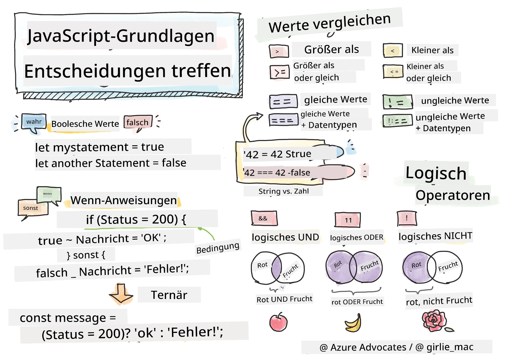

> Sketchnote von [Tomomi Imura](https://twitter.com/girlie_mac)

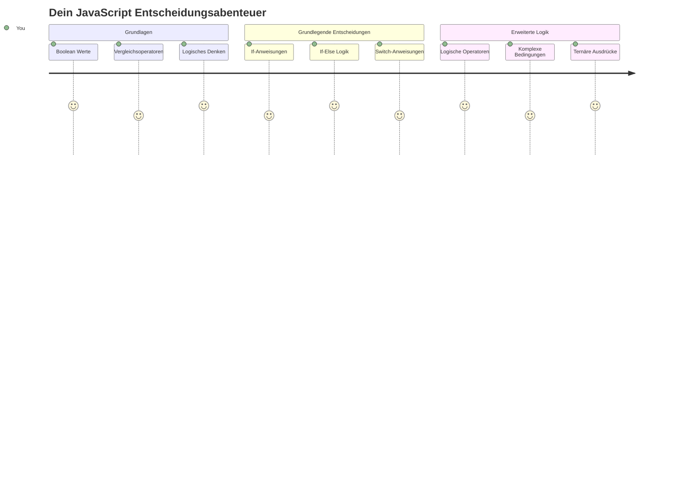
Hast du dich jemals gefragt, wie Anwendungen kluge Entscheidungen treffen? Zum Beispiel, wie ein Navigationssystem die schnellste Route wählt oder wie ein Thermostat entscheidet, wann die Heizung eingeschaltet wird? Dies ist das grundlegende Konzept des Entscheidens in der Programmierung.

So wie Charles Babbages Analytical Engine entwickelt wurde, um basierend auf Bedingungen unterschiedliche Operationen auszuführen, müssen moderne JavaScript-Programme Entscheidungen basierend auf verschiedenen Umständen treffen. Diese Fähigkeit zu verzweigen und Entscheidungen zu treffen, verwandelt statischen Code in reaktionsfähige, intelligente Anwendungen.

In dieser Lektion lernst du, wie du bedingte Logik in deinen Programmen implementierst. Wir werden bedingte Anweisungen, Vergleichsoperatoren und logische Ausdrücke erkunden, die es deinem Code ermöglichen, Situationen zu bewerten und angemessen zu reagieren.

## Vor der Vorlesung Quiz

[Vor der Vorlesung Quiz](https://ff-quizzes.netlify.app/web/quiz/11)

Die Fähigkeit, Entscheidungen zu treffen und den Programmfluss zu steuern, ist ein grundlegender Aspekt der Programmierung. Dieser Abschnitt behandelt, wie du den Ausführungspfad deiner JavaScript-Programme mit Boolean-Werten und bedingter Logik kontrollierst.

[](https://youtube.com/watch?v=SxTp8j-fMMY "Entscheidungen treffen")

> 🎥 Klicke auf das Bild oben für ein Video über das Treffen von Entscheidungen.

> Du kannst diese Lektion auf [Microsoft Learn](https://docs.microsoft.com/learn/modules/web-development-101-if-else/?WT.mc_id=academic-77807-sagibbon) absolvieren!

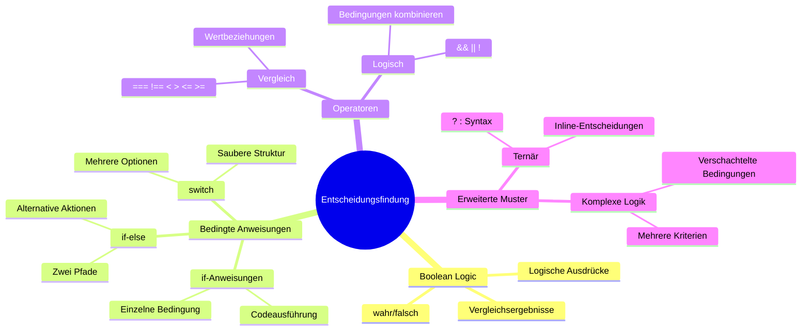
## Eine kurze Wiederholung der Booleans

Bevor wir uns dem Treffen von Entscheidungen widmen, lass uns die Boolean-Werte aus unserer vorherigen Lektion noch einmal betrachten. Benannt nach dem Mathematiker George Boole, repräsentieren diese Werte binäre Zustände – entweder `true` oder `false`. Es gibt keine Zweideutigkeit, keinen Mittelweg.

Diese binären Werte bilden die Grundlage aller rechnerischen Logik. Jede Entscheidung, die dein Programm trifft, reduziert sich letztlich auf eine Boolean-Auswertung.

Boolean-Variablen zu erstellen ist einfach:

```javascript
let myTrueBool = true;
let myFalseBool = false;
```

Dies erstellt zwei Variablen mit expliziten Boolean-Werten.

✅ Booleans sind nach dem englischen Mathematiker, Philosophen und Logiker George Boole (1815–1864) benannt.

## Vergleichsoperatoren und Booleans

In der Praxis wirst du selten Boolean-Werte manuell setzen. Stattdessen erzeugst du sie, indem du Bedingungen bewertest: „Ist diese Zahl größer als jene?“ oder „Sind diese Werte gleich?“

Vergleichsoperatoren ermöglichen diese Auswertungen. Sie vergleichen Werte und geben als Ergebnis einen Boolean zurück, der von der Beziehung zwischen den Operanden abhängt.

| Symbol | Beschreibung                                                                                                                                                   | Beispiel            |
| ------ | ------------------------------------------------------------------------------------------------------------------------------------------------------------- | ------------------ |
| `<`    | **Kleiner als**: Vergleicht zwei Werte und gibt den Boolean-Wert `true` zurück, wenn der Wert links kleiner ist als der rechts                             | `5 < 6 // true`    |
| `<=`   | **Kleiner gleich**: Vergleicht zwei Werte und gibt den Boolean-Wert `true` zurück, wenn der Wert links kleiner oder gleich dem rechts ist                   | `5 <= 6 // true`   |
| `>`    | **Größer als**: Vergleicht zwei Werte und gibt den Boolean-Wert `true` zurück, wenn der Wert links größer ist als der rechts                              | `5 > 6 // false`   |
| `>=`   | **Größer gleich**: Vergleicht zwei Werte und gibt den Boolean-Wert `true` zurück, wenn der Wert links größer oder gleich dem rechts ist                    | `5 >= 6 // false`  |
| `===`  | **Strikte Gleichheit**: Vergleicht zwei Werte und gibt den Boolean-Wert `true` zurück, wenn beide Werte gleich und vom selben Datentyp sind               | `5 === 6 // false` |
| `!==`  | **Ungleichheit**: Vergleicht zwei Werte und gibt das Gegenteil des Ergebnisses eines strikten Gleichheitsoperators zurück                                   | `5 !== 6 // true`  |

✅ Prüfe dein Wissen, indem du einige Vergleiche in der Konsole deines Browsers eingibst. Überrascht dich ein Ergebnis?

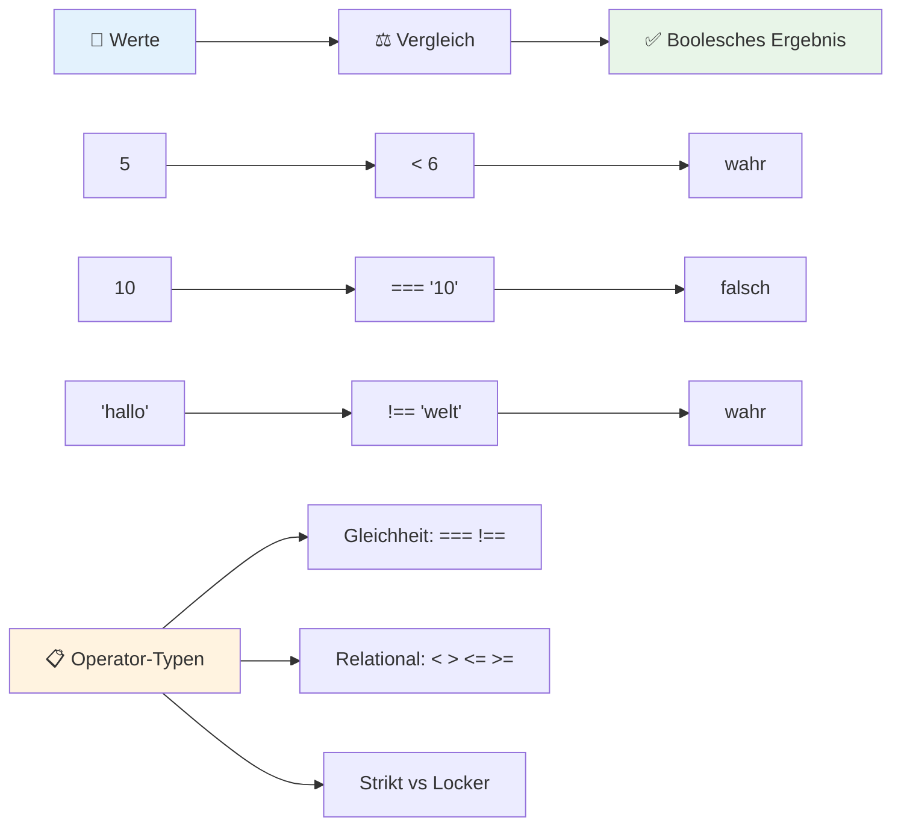
### 🧠 **Vergleichsbeherrschung: Verständnis der Boolean-Logik**

**Teste dein Verständnis von Vergleichen:**
- Warum denkst du, dass `===` (strikte Gleichheit) allgemein `==` (lose Gleichheit) vorgezogen wird?
- Kannst du vorhersagen, was `5 === '5'` zurückgibt? Und `5 == '5'`?
- Was ist der Unterschied zwischen `!==` und `!=`?

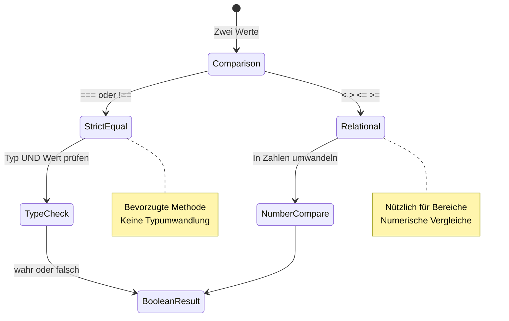
> **Profi-Tipp**: Verwende immer `===` und `!==` für Gleichheitsprüfungen, es sei denn, du benötigst speziell Typumwandlung. Dies verhindert unerwartetes Verhalten!

## If-Anweisung

Die `if`-Anweisung ist wie eine Frage in deinem Code: „Wenn diese Bedingung wahr ist, dann führe das hier aus.“ Sie ist wohl das wichtigste Werkzeug, das du zum Treffen von Entscheidungen in JavaScript verwendest.

So funktioniert sie:

```javascript
if (condition) {
  // Bedingung ist wahr. Der Code in diesem Block wird ausgeführt.
}
```

Die Bedingung steht in den Klammern, und wenn sie `true` ist, führt JavaScript den Code im geschweiften Block aus. Wenn sie `false` ist, überspringt JavaScript diesen Block einfach.

Du wirst oft Vergleichsoperatoren verwenden, um solche Bedingungen zu erzeugen. Hier ein praktisches Beispiel:

```javascript
let currentMoney = 1000;
let laptopPrice = 800;

if (currentMoney >= laptopPrice) {
  // Die Bedingung ist wahr. Der Code in diesem Block wird ausgeführt.
  console.log("Getting a new laptop!");
}
```

Da `1000 >= 800` zu `true` ausgewertet wird, wird der Code im Block ausgeführt und „Getting a new laptop!“ in der Konsole angezeigt.

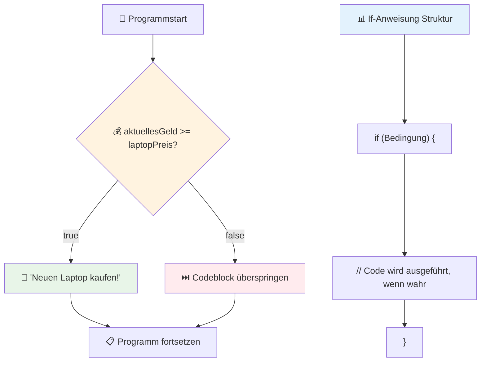
## If..Else-Anweisung

Aber was, wenn dein Programm etwas anderes machen soll, wenn die Bedingung falsch ist? Hier kommt `else` ins Spiel – eine Art Backup-Plan.

Die `else`-Anweisung gibt dir die Möglichkeit zu sagen: „Wenn diese Bedingung nicht wahr ist, mach stattdessen das hier.“

```javascript
let currentMoney = 500;
let laptopPrice = 800;

if (currentMoney >= laptopPrice) {
  // Die Bedingung ist wahr. Der Code in diesem Block wird ausgeführt.
  console.log("Getting a new laptop!");
} else {
  // Die Bedingung ist falsch. Der Code in diesem Block wird ausgeführt.
  console.log("Can't afford a new laptop, yet!");
}
```

Da `500 >= 800` `false` ist, überspringt JavaScript den ersten Block und führt stattdessen den `else`-Block aus. Du wirst „Can't afford a new laptop, yet!“ in der Konsole sehen.

✅ Teste dein Verständnis dieses Codes und des folgenden Codes, indem du sie in einer Browser-Konsole ausführst. Ändere die Werte der Variablen currentMoney und laptopPrice, um die ausgegebenen `console.log()`-Meldungen zu ändern.

### 🎯 **If-Else Logiktest: Verzweigungspfade**

**Bewerte dein Verständnis bedingter Logik:**
- Was passiert, wenn `currentMoney` genau `laptopPrice` entspricht?
- Kannst du dir ein reales Szenario vorstellen, in dem If-Else-Logik nützlich ist?
- Wie könntest du das erweitern, um mehrere Preisbereiche abzudecken?

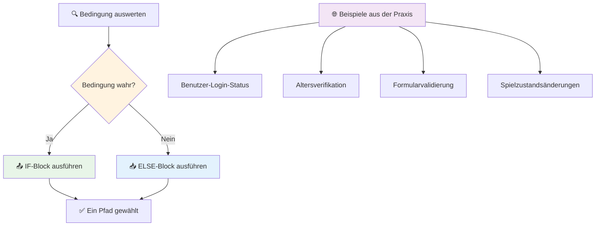
> **Wichtige Einsicht**: If-else stellt sicher, dass genau ein Pfad eingeschlagen wird. So hat dein Programm immer eine Antwort auf jede Bedingung!

## Switch-Anweisung

Manchmal musst du einen Wert mit mehreren Optionen vergleichen. Zwar könnte man mehrere `if..else`-Statements aneinanderreihen, doch das wird schnell unübersichtlich. Die `switch`-Anweisung bietet eine sauberere Struktur für den Umgang mit mehreren diskreten Werten.

Das Konzept ähnelt den mechanischen Vermittlungssystemen, die in frühen Telefonzentralen verwendet wurden – ein Eingabewert bestimmt den spezifischen Ausführungspfad.

```javascript
switch (expression) {
  case x:
    // Codeblock
    break;
  case y:
    // Codeblock
    break;
  default:
    // Codeblock
}
```

So ist sie aufgebaut:
- JavaScript wertet den Ausdruck einmal aus
- Es durchsucht jeden `case` nach einer Übereinstimmung
- Findet es eine Übereinstimmung, wird der entsprechende Codeblock ausgeführt
- `break` sagt JavaScript, dass es stoppen und den switch verlassen soll
- Wenn keine Fälle passen, wird der `default`-Block ausgeführt (wenn vorhanden)

```javascript
// Programm unter Verwendung der switch-Anweisung für den Wochentag
let dayNumber = 2;
let dayName;

switch (dayNumber) {
  case 1:
    dayName = "Monday";
    break;
  case 2:
    dayName = "Tuesday";
    break;
  case 3:
    dayName = "Wednesday";
    break;
  default:
    dayName = "Unknown day";
    break;
}
console.log(`Today is ${dayName}`);
```

In diesem Beispiel sieht JavaScript, dass `dayNumber` gleich `2` ist, findet `case 2` und setzt `dayName` auf „Tuesday“. Danach wird der switch verlassen. Das Ergebnis? „Today is Tuesday“ wird in der Konsole ausgegeben.

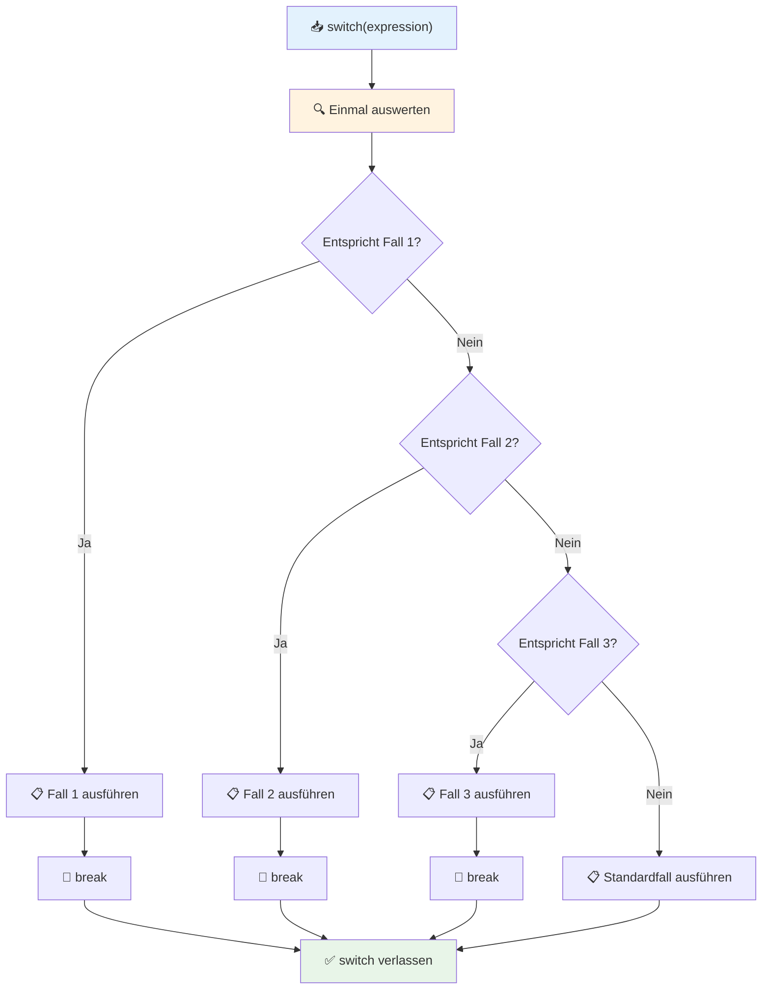
✅ Teste dein Verständnis dieses Codes und des folgenden Codes, indem du sie in einer Browser-Konsole ausführst. Ändere den Wert der Variablen a, um die zurückgegebene `console.log()` zu verändern.

### 🔄 **Switch-Anweisung Beherrschung: Mehrere Optionen**

**Teste dein Verständnis von switch:**
- Was passiert, wenn du eine `break`-Anweisung vergisst?
- Wann solltest du `switch` statt mehrerer `if-else`-Statements verwenden?
- Warum ist der `default`-Fall nützlich, auch wenn du denkst, alle Möglichkeiten abgedeckt zu haben?

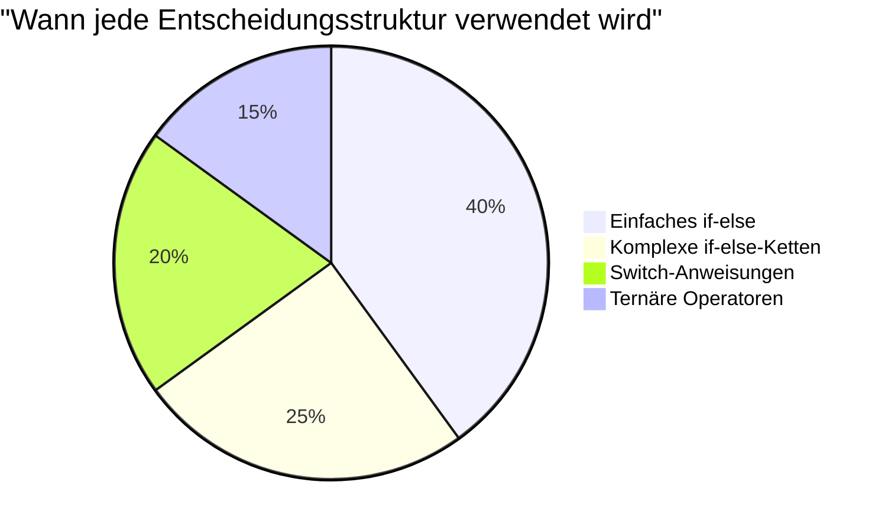
> **Beste Praxis**: Verwende `switch`, wenn du eine Variable gegen mehrere spezifische Werte vergleichst. Nutze `if-else` für Bereichsprüfungen oder komplexe Bedingungen!

## Logische Operatoren und Booleans

Komplexe Entscheidungen erfordern oft, dass mehrere Bedingungen gleichzeitig bewertet werden. So wie Boolesche Algebra es Mathematikern erlaubt, logische Ausdrücke zu kombinieren, stellt die Programmierung logische Operatoren bereit, um mehrere Boolean-Bedingungen zu verknüpfen.

Diese Operatoren ermöglichen ausgefeilte bedingte Logik, indem sie einfache true/false-Auswertungen kombinieren.

| Symbol | Beschreibung                                                                                     | Beispiel                                                                 |
| ------ | ----------------------------------------------------------------------------------------------- | ----------------------------------------------------------------------- |
| `&&`   | **Logisches UND**: Vergleicht zwei Boolean-Ausdrücke. Gibt nur `true` zurück, wenn beide wahr sind | `(5 > 3) && (5 < 10) // Beide Seiten sind true. Gibt true zurück` |
| `\|\|` | **Logisches ODER**: Vergleicht zwei Boolean-Ausdrücke. Gibt `true` zurück, wenn mindestens eine Seite wahr ist | `(5 > 10) \|\| (5 < 10) // Eine Seite ist false, die andere true. Gibt true zurück` |
| `!`    | **Logisches NICHT**: Kehrt den Wert eines Boolean-Ausdrucks um                                    | `!(5 > 10) // 5 ist nicht größer als 10, also macht "!" daraus true`         |

Diese Operatoren erlauben es dir, Bedingungen auf nützliche Weise zu kombinieren:
- UND (`&&`) bedeutet, beide Bedingungen müssen wahr sein
- ODER (`||`) bedeutet, mindestens eine Bedingung muss wahr sein  
- NICHT (`!`) kehrt true in false (und umgekehrt) um

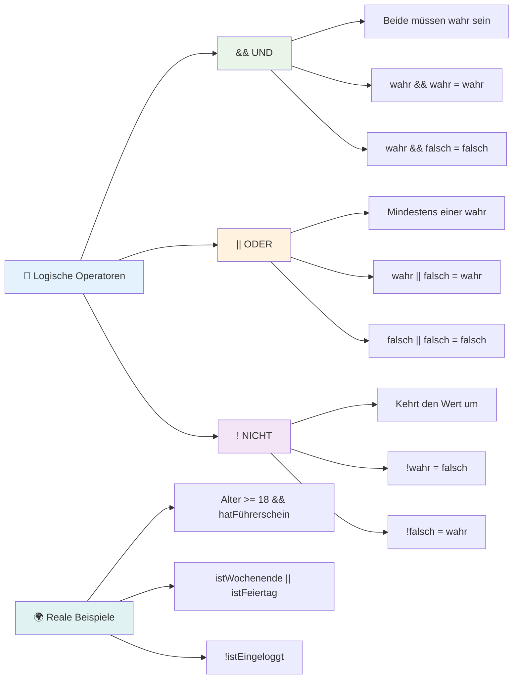
## Bedingungen und Entscheidungen mit logischen Operatoren

Sieh dir diese logischen Operatoren mit einem realistischeren Beispiel an:

```javascript
let currentMoney = 600;
let laptopPrice = 800;
let laptopDiscountPrice = laptopPrice - (laptopPrice * 0.2); // Laptop-Preis mit 20 Prozent Rabatt

if (currentMoney >= laptopPrice || currentMoney >= laptopDiscountPrice) {
  // Bedingung ist wahr. Code in diesem Block wird ausgeführt.
  console.log("Getting a new laptop!");
} else {
  // Bedingung ist falsch. Code in diesem Block wird ausgeführt.
  console.log("Can't afford a new laptop, yet!");
}
```

In diesem Beispiel: Wir berechnen einen 20%-Rabattpreis (640), prüfen dann, ob unsere verfügbaren Mittel entweder den vollen Preis ODER den rabattierten Preis abdecken. Da 600 dem Schwellenwert 640 entspricht, wertet die Bedingung zu true aus.

### 🧮 **Logische Operatoren Test: Bedingungen kombinieren**

**Teste dein Verständnis der logischen Operatoren:**
- Was passiert im Ausdruck `A && B`, wenn A falsch ist? Wird B überhaupt ausgewertet?
- Kannst du dir eine Situation vorstellen, in der du alle drei Operatoren (&&, ||, !) zusammen benötigst?
- Was ist der Unterschied zwischen `!user.isActive` und `user.isActive !== true`?

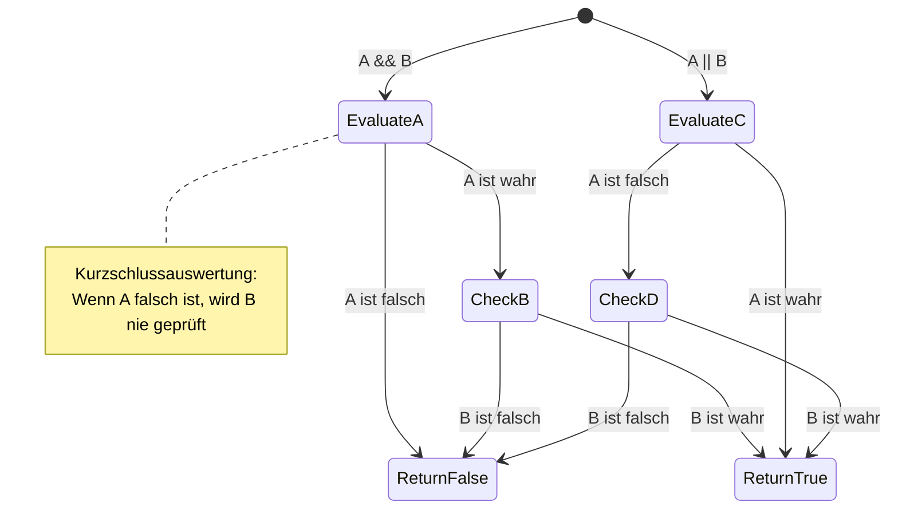
> **Performance-Tipp**: JavaScript verwendet eine „Kurzschlussauswertung“ – in `A && B` wird B nicht ausgewertet, wenn A falsch ist. Nutze das zu deinem Vorteil!

### Negationsoperator

Manchmal ist es einfacher zu fragen, wann etwas NICHT wahr ist. Anstatt zu fragen „Ist der Benutzer eingeloggt?“, möchtest du vielleicht fragen „Ist der Benutzer NICHT eingeloggt?“ Der Ausrufezeichen-Operator (`!`) kehrt die Logik für dich um.

```javascript
if (!condition) {
  // wird ausgeführt, wenn die Bedingung falsch ist
} else {
  // wird ausgeführt, wenn die Bedingung wahr ist
}
```

Der `!`-Operator ist wie „das Gegenteil von…“ – wenn etwas `true` ist, macht `!` daraus `false` und umgekehrt.

### Ternäre Ausdrücke

Für einfache bedingte Zuweisungen bietet JavaScript den **ternären Operator**. Diese kompakte Syntax erlaubt es dir, einen bedingten Ausdruck in einer einzigen Zeile zu schreiben, nützlich wenn du basierend auf einer Bedingung einen von zwei Werten zuweisen willst.

```javascript
let variable = condition ? returnThisIfTrue : returnThisIfFalse;
```

Es liest sich wie eine Frage: „Ist diese Bedingung wahr? Wenn ja, benutze diesen Wert. Wenn nein, benutze jenen Wert.“

Hier ein greifbareres Beispiel:

```javascript
let firstNumber = 20;
let secondNumber = 10;
let biggestNumber = firstNumber > secondNumber ? firstNumber : secondNumber;
```

✅ Nimm dir eine Minute und lese diesen Code mehrmals. Verstehst du, wie diese Operatoren funktionieren?

Diese Zeile sagt: „Ist `firstNumber` größer als `secondNumber`? Wenn ja, setze `firstNumber` in `biggestNumber`. Wenn nein, setze `secondNumber` in `biggestNumber`.“

Der ternäre Operator ist nur eine kürzere Form der traditionellen `if..else`-Anweisung:

```javascript
let biggestNumber;
if (firstNumber > secondNumber) {
  biggestNumber = firstNumber;
} else {
  biggestNumber = secondNumber;
}
```

Beide Ansätze erzeugen identische Ergebnisse. Der ternäre Operator ist kompakter, während die traditionelle if-else-Struktur bei komplexen Bedingungen vielleicht besser lesbar ist.

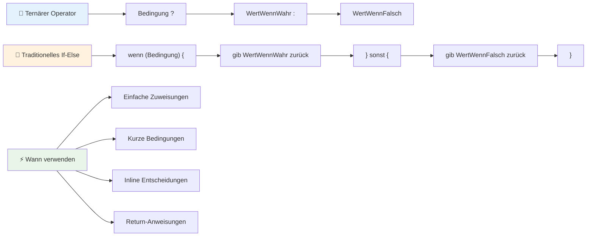
---


## 🚀 Herausforderung

Erstelle ein Programm, das zuerst mit logischen Operatoren geschrieben ist und schreibe es dann mit einem ternären Ausdruck um. Welche Syntax bevorzugst du?

---

## GitHub Copilot Agent Challenge 🚀

Nutze den Agentenmodus, um die folgende Herausforderung zu meistern:

**Beschreibung:** Erstelle einen umfassenden Notenrechner, der mehrere Konzepte des Entscheidens aus dieser Lektion zeigt, einschließlich if-else-Anweisungen, switch-Anweisungen, logischen Operatoren und ternären Ausdrücken.

**Anforderung:** Schreibe ein JavaScript-Programm, das die numerische Punktzahl eines Schülers (0-100) entgegennimmt und anhand folgender Kriterien die Buchstabennote bestimmt:
- A: 90-100
- B: 80-89  
- C: 70-79
- D: 60-69
- F: Unter 60

Anforderungen:
1. Verwende eine if-else-Anweisung, um die Buchstabennote zu bestimmen
2. Verwenden Sie logische Operatoren, um zu prüfen, ob der Schüler bestanden hat (Note >= 60) UND Auszeichnungen erhalten hat (Note >= 90)  
3. Verwenden Sie eine switch-Anweisung, um für jede Buchstabennote spezifisches Feedback zu geben  
4. Verwenden Sie einen ternären Operator, um festzustellen, ob der Schüler für den nächsten Kurs berechtigt ist (Note >= 70)  
5. Fügen Sie eine Eingabevalidierung hinzu, um sicherzustellen, dass die Punktzahl zwischen 0 und 100 liegt  

Testen Sie Ihr Programm mit verschiedenen Noten, einschließlich Grenzfällen wie 59, 60, 89, 90 und ungültigen Eingaben.  

Erfahren Sie mehr über den [Agentenmodus](https://code.visualstudio.com/blogs/2025/02/24/introducing-copilot-agent-mode) hier.


## Post-Vorlesungs-Quiz

[Post-Vorlesungs-Quiz](https://ff-quizzes.netlify.app/web/quiz/12)

## Rückblick & Selbststudium

Lesen Sie mehr über die vielen für den Benutzer verfügbaren Operatoren [auf MDN](https://developer.mozilla.org/docs/Web/JavaScript/Reference/Operators).

Gehen Sie Joshs Comeaus wunderbare [Operatoren-Übersicht](https://joshwcomeau.com/operator-lookup/) durch!

## Aufgabe

[Operatoren](assignment.md)

---

## 🧠 **Zusammenfassung Ihres Entscheidungstools**

```mermaid
graph TD
    A["🎯 JavaScript Entscheidungen"] --> B["🔍 Boolesche Logik"]
    A --> C["📊 Bedingte Anweisungen"]
    A --> D["🔗 Logische Operatoren"]
    A --> E["⚡ Erweiterte Muster"]
    
    B --> B1["true/false Werte"]
    B --> B2["Vergleichsoperatoren"]
    B --> B3["Wahrheitskonzepte"]
    
    C --> C1["if-Anweisungen"]
    C --> C2["if-else-Ketten"]
    C --> C3["switch-Anweisungen"]
    
    D --> D1["&& (UND)"]
    D --> D2["|| (ODER)"]
    D --> D3["! (NICHT)"]
    
    E --> E1["Ternärer Operator"]
    E --> E2["Kurzschluss-Auswertung"]
    E --> E3["Komplexe Bedingungen"]
    
    F["💡 Schlüsselfaktoren"] --> F1["Klare lesbare Bedingungen"]
    F --> F2["Konsistenter Vergleichsstil"]
    F --> F3["Korrekte Operatorrangfolge"]
    F --> F4["Effiziente Auswertungsreihenfolge"]
    
    style A fill:#e3f2fd
    style B fill:#e8f5e8
    style C fill:#fff3e0
    style D fill:#f3e5f5
    style E fill:#e0f2f1
    style F fill:#fce4ec
```
---

## 🚀 Ihre Zeitachse zur Beherrschung der Entscheidungsfindung in JavaScript

### ⚡ **Was Sie in den nächsten 5 Minuten tun können**
- [ ] Üben Sie Vergleichsoperatoren in Ihrer Browser-Konsole
- [ ] Schreiben Sie eine einfache if-else-Anweisung, die Ihr Alter prüft
- [ ] Probieren Sie die Herausforderung: Schreiben Sie eine if-else-Anweisung mit einem ternären Operator um
- [ ] Testen Sie, was mit verschiedenen "truthy" und "falsy" Werten passiert

### 🎯 **Was Sie in dieser Stunde erreichen können**
- [ ] Absolvieren Sie das Post-Lektion-Quiz und überprüfen Sie verwirrende Konzepte
- [ ] Bauen Sie den umfassenden Notenrechner aus der GitHub Copilot-Herausforderung
- [ ] Erstellen Sie einen einfachen Entscheidungsbaum für ein reales Szenario (z. B. Entscheidung zur Kleidung)
- [ ] Üben Sie die Kombination mehrerer Bedingungen mit logischen Operatoren
- [ ] Experimentieren Sie mit switch-Anweisungen für verschiedene Anwendungsfälle

### 📅 **Ihre einwöchige Logik-Meisterschaft**
- [ ] Schließen Sie die Operatoren-Aufgabe mit kreativen Beispielen ab
- [ ] Erstellen Sie eine Mini-Quiz-Anwendung unter Verwendung verschiedener bedingter Strukturen
- [ ] Erstellen Sie einen Formular-Validator, der mehrere Eingabebedingungen prüft
- [ ] Üben Sie Joshs Comeaus [Operatoren-Übungen](https://joshwcomeau.com/operator-lookup/)
- [ ] Refaktorieren Sie bestehenden Code, um passendere bedingte Strukturen zu verwenden
- [ ] Studieren Sie Kurzschlussauswertung und Performance-Auswirkungen

### 🌟 **Ihre einmonatige Transformation**
- [ ] Meistern Sie komplexe verschachtelte Bedingungen und erhalten Sie die Lesbarkeit des Codes
- [ ] Bauen Sie eine Anwendung mit ausgefeilter Entscheidungslogik
- [ ] Tragen Sie zur Open Source bei, indem Sie die bedingte Logik in bestehenden Projekten verbessern
- [ ] Bringen Sie jemand anderem verschiedene bedingte Strukturen und deren Einsatz näher
- [ ] Erkunden Sie funktionale Programmieransätze zur bedingten Logik
- [ ] Erstellen Sie eine persönliche Referenzanleitung für Best Practices bei Bedingungen

### 🏆 **Abschluss-Check-in des Entscheidungs-Champions**

**Feiern Sie Ihre Beherrschung des logischen Denkens:**  
- Was ist die komplexeste Entscheidungslogik, die Sie erfolgreich implementiert haben?  
- Welche bedingte Struktur fühlt sich für Sie am natürlichsten an und warum?  
- Wie hat das Lernen über logische Operatoren Ihren Problemlösungsansatz verändert?  
- Welche reale Anwendung würde von ausgefeilter Entscheidungslogik profitieren?

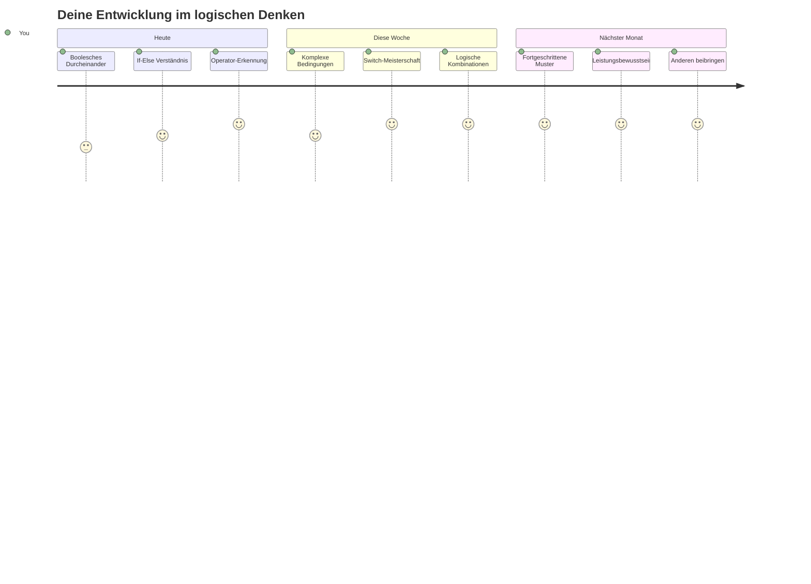
> 🧠 **Sie haben die Kunst der digitalen Entscheidungsfindung gemeistert!** Jede interaktive Anwendung basiert auf bedingter Logik, um intelligent auf Nutzeraktionen und sich ändernde Bedingungen zu reagieren. Sie verstehen nun, wie Sie Ihre Programme zum Nachdenken, Bewerten und zur Auswahl geeigneter Antworten bringen. Dieses logische Fundament wird jede dynamische Anwendung antreiben, die Sie bauen! 🎉

---

<!-- CO-OP TRANSLATOR DISCLAIMER START -->
**Haftungsausschluss**:  
Dieses Dokument wurde mithilfe des KI-Übersetzungsdienstes [Co-op Translator](https://github.com/Azure/co-op-translator) übersetzt. Obwohl wir auf Genauigkeit achten, kann es bei automatischen Übersetzungen zu Fehlern oder Ungenauigkeiten kommen. Das Originaldokument in seiner ursprünglichen Sprache gilt als maßgebliche Quelle. Für wichtige Informationen wird eine professionelle menschliche Übersetzung empfohlen. Wir übernehmen keine Haftung für Missverständnisse oder Fehlinterpretationen, die aus der Nutzung dieser Übersetzung entstehen.
<!-- CO-OP TRANSLATOR DISCLAIMER END -->