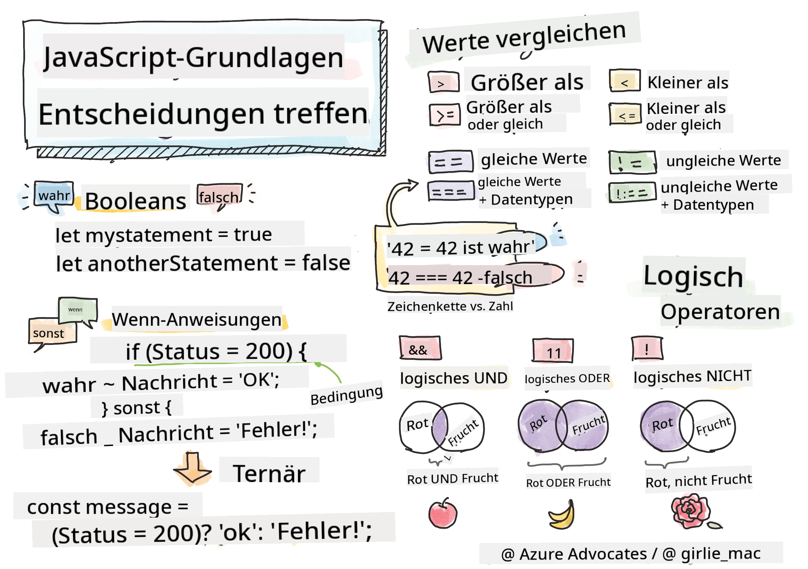

<!--
CO_OP_TRANSLATOR_METADATA:
{
  "original_hash": "f7009631b73556168ca435120a231c98",
  "translation_date": "2025-08-29T14:13:36+00:00",
  "source_file": "2-js-basics/3-making-decisions/README.md",
  "language_code": "de"
}
-->
# JavaScript-Grundlagen: Entscheidungen treffen



> Sketchnote von [Tomomi Imura](https://twitter.com/girlie_mac)

## Quiz vor der Vorlesung

[Quiz vor der Vorlesung](https://ff-quizzes.netlify.app/web/quiz/11)

Entscheidungen zu treffen und die Reihenfolge zu steuern, in der dein Code ausgeführt wird, macht deinen Code wiederverwendbar und robust. In diesem Abschnitt geht es um die Syntax zur Steuerung des Datenflusses in JavaScript und deren Bedeutung im Zusammenhang mit Booleschen Datentypen.

[](https://youtube.com/watch?v=SxTp8j-fMMY "Entscheidungen treffen")

> 🎥 Klicke auf das Bild oben, um ein Video über das Treffen von Entscheidungen anzusehen.

> Du kannst diese Lektion auf [Microsoft Learn](https://docs.microsoft.com/learn/modules/web-development-101-if-else/?WT.mc_id=academic-77807-sagibbon) absolvieren!

## Ein kurzer Rückblick auf Boolesche Werte

Boolesche Werte können nur zwei Zustände haben: `true` oder `false`. Sie helfen dabei, Entscheidungen zu treffen, welche Codezeilen ausgeführt werden sollen, wenn bestimmte Bedingungen erfüllt sind.

Setze deinen Booleschen Wert auf true oder false wie folgt:

`let myTrueBool = true`  
`let myFalseBool = false`

✅ Boolesche Werte sind benannt nach dem englischen Mathematiker, Philosophen und Logiker George Boole (1815–1864).

## Vergleichsoperatoren und Boolesche Werte

Operatoren werden verwendet, um Bedingungen zu bewerten, indem sie Vergleiche anstellen, die einen Booleschen Wert erzeugen. Die folgende Liste zeigt häufig verwendete Operatoren.

| Symbol | Beschreibung                                                                                                                                                   | Beispiel           |
| ------ | ------------------------------------------------------------------------------------------------------------------------------------------------------------- | ------------------ |
| `<`    | **Kleiner als**: Vergleicht zwei Werte und gibt den Booleschen Wert `true` zurück, wenn der Wert auf der linken Seite kleiner als der auf der rechten Seite ist | `5 < 6 // true`    |
| `<=`   | **Kleiner oder gleich**: Vergleicht zwei Werte und gibt den Booleschen Wert `true` zurück, wenn der Wert auf der linken Seite kleiner oder gleich dem auf der rechten Seite ist | `5 <= 6 // true`   |
| `>`    | **Größer als**: Vergleicht zwei Werte und gibt den Booleschen Wert `true` zurück, wenn der Wert auf der linken Seite größer als der auf der rechten Seite ist   | `5 > 6 // false`   |
| `>=`   | **Größer oder gleich**: Vergleicht zwei Werte und gibt den Booleschen Wert `true` zurück, wenn der Wert auf der linken Seite größer oder gleich dem auf der rechten Seite ist | `5 >= 6 // false`  |
| `===`  | **Strikte Gleichheit**: Vergleicht zwei Werte und gibt den Booleschen Wert `true` zurück, wenn die Werte auf der rechten und linken Seite gleich sind UND denselben Datentyp haben | `5 === 6 // false` |
| `!==`  | **Ungleichheit**: Vergleicht zwei Werte und gibt den entgegengesetzten Booleschen Wert zurück, den ein strikter Gleichheitsoperator zurückgeben würde           | `5 !== 6 // true`  |

✅ Überprüfe dein Wissen, indem du einige Vergleiche in der Konsole deines Browsers schreibst. Gibt es Ergebnisse, die dich überraschen?

## If-Anweisung

Die If-Anweisung führt den Code zwischen ihren Blöcken aus, wenn die Bedingung wahr ist.

```javascript
if (condition) {
  //Condition is true. Code in this block will run.
}
```

Logische Operatoren werden oft verwendet, um die Bedingung zu bilden.

```javascript
let currentMoney;
let laptopPrice;

if (currentMoney >= laptopPrice) {
  //Condition is true. Code in this block will run.
  console.log("Getting a new laptop!");
}
```

## If..Else-Anweisung

Die `else`-Anweisung führt den Code zwischen ihren Blöcken aus, wenn die Bedingung falsch ist. Sie ist optional bei einer `if`-Anweisung.

```javascript
let currentMoney;
let laptopPrice;

if (currentMoney >= laptopPrice) {
  //Condition is true. Code in this block will run.
  console.log("Getting a new laptop!");
} else {
  //Condition is false. Code in this block will run.
  console.log("Can't afford a new laptop, yet!");
}
```

✅ Teste dein Verständnis dieses Codes und des folgenden Codes, indem du ihn in einer Browser-Konsole ausführst. Ändere die Werte der Variablen `currentMoney` und `laptopPrice`, um die Ausgabe von `console.log()` zu ändern.

## Switch-Anweisung

Die `switch`-Anweisung wird verwendet, um verschiedene Aktionen basierend auf unterschiedlichen Bedingungen auszuführen. Verwende die `switch`-Anweisung, um einen von vielen Codeblöcken auszuwählen, die ausgeführt werden sollen.

```javascript
switch (expression) {
  case x:
    // code block
    break;
  case y:
    // code block
    break;
  default:
  // code block
}
```

```javascript
// program using switch statement
let a = 2;

switch (a) {
  case 1:
    a = "one";
    break;
  case 2:
    a = "two";
    break;
  default:
    a = "not found";
    break;
}
console.log(`The value is ${a}`);
```

✅ Teste dein Verständnis dieses Codes und des folgenden Codes, indem du ihn in einer Browser-Konsole ausführst. Ändere die Werte der Variablen `a`, um die Ausgabe von `console.log()` zu ändern.

## Logische Operatoren und Boolesche Werte

Entscheidungen können mehr als einen Vergleich erfordern und können mit logischen Operatoren verknüpft werden, um einen Booleschen Wert zu erzeugen.

| Symbol | Beschreibung                                                                                     | Beispiel                                                                 |
| ------ | ----------------------------------------------------------------------------------------------- | ----------------------------------------------------------------------- |
| `&&`   | **Logisches UND**: Vergleicht zwei Boolesche Ausdrücke. Gibt `true` **nur** zurück, wenn beide Seiten wahr sind | `(5 > 6) && (5 < 6 ) //Eine Seite ist falsch, die andere ist wahr. Gibt false zurück` |
| `\|\|` | **Logisches ODER**: Vergleicht zwei Boolesche Ausdrücke. Gibt `true` zurück, wenn mindestens eine Seite wahr ist | `(5 > 6) \|\| (5 < 6) //Eine Seite ist falsch, die andere ist wahr. Gibt true zurück` |
| `!`    | **Logisches NICHT**: Gibt den entgegengesetzten Wert eines Booleschen Ausdrucks zurück            | `!(5 > 6) // 5 ist nicht größer als 6, aber "!" gibt true zurück`       |

## Bedingungen und Entscheidungen mit logischen Operatoren

Logische Operatoren können verwendet werden, um Bedingungen in If..Else-Anweisungen zu bilden.

```javascript
let currentMoney;
let laptopPrice;
let laptopDiscountPrice = laptopPrice - laptopPrice * 0.2; //Laptop price at 20 percent off

if (currentMoney >= laptopPrice || currentMoney >= laptopDiscountPrice) {
  //Condition is true. Code in this block will run.
  console.log("Getting a new laptop!");
} else {
  //Condition is true. Code in this block will run.
  console.log("Can't afford a new laptop, yet!");
}
```

### Negationsoperator

Du hast bisher gesehen, wie du eine `if...else`-Anweisung verwenden kannst, um bedingte Logik zu erstellen. Alles, was in ein `if` kommt, muss zu true oder false ausgewertet werden. Mit dem `!`-Operator kannst du den Ausdruck _negieren_. Das würde so aussehen:

```javascript
if (!condition) {
  // runs if condition is false
} else {
  // runs if condition is true
}
```

### Ternäre Ausdrücke

`if...else` ist nicht die einzige Möglichkeit, Entscheidungslogik auszudrücken. Du kannst auch einen sogenannten ternären Operator verwenden. Die Syntax sieht so aus:

```javascript
let variable = condition ? <return this if true> : <return this if false>
```

Hier ist ein greifbareres Beispiel:

```javascript
let firstNumber = 20;
let secondNumber = 10;
let biggestNumber = firstNumber > secondNumber ? firstNumber : secondNumber;
```

✅ Nimm dir eine Minute Zeit, um diesen Code ein paar Mal zu lesen. Verstehst du, wie diese Operatoren funktionieren?

Das obige Beispiel besagt:

- Wenn `firstNumber` größer als `secondNumber` ist,  
- dann weise `firstNumber` der Variablen `biggestNumber` zu,  
- andernfalls weise `secondNumber` zu.

Der ternäre Ausdruck ist nur eine kompakte Art, den folgenden Code zu schreiben:

```javascript
let biggestNumber;
if (firstNumber > secondNumber) {
  biggestNumber = firstNumber;
} else {
  biggestNumber = secondNumber;
}
```

---

## 🚀 Herausforderung

Erstelle ein Programm, das zuerst mit logischen Operatoren geschrieben wird und dann mit einem ternären Ausdruck umgeschrieben wird. Welche Syntax bevorzugst du?

---

## Quiz nach der Vorlesung

[Quiz nach der Vorlesung](https://ff-quizzes.netlify.app/web/quiz/12)

## Wiederholung & Selbststudium

Lies mehr über die vielen verfügbaren Operatoren [auf MDN](https://developer.mozilla.org/docs/Web/JavaScript/Reference/Operators).

Schau dir Josh Comeaus großartige [Operator-Übersicht](https://joshwcomeau.com/operator-lookup/) an!

## Aufgabe

[Operatoren](assignment.md)

---

**Haftungsausschluss**:  
Dieses Dokument wurde mithilfe des KI-Übersetzungsdienstes [Co-op Translator](https://github.com/Azure/co-op-translator) übersetzt. Obwohl wir uns um Genauigkeit bemühen, weisen wir darauf hin, dass automatisierte Übersetzungen Fehler oder Ungenauigkeiten enthalten können. Das Originaldokument in seiner ursprünglichen Sprache sollte als maßgebliche Quelle betrachtet werden. Für kritische Informationen wird eine professionelle menschliche Übersetzung empfohlen. Wir übernehmen keine Haftung für Missverständnisse oder Fehlinterpretationen, die sich aus der Nutzung dieser Übersetzung ergeben.