# JavaScript Grundlagen: Arrays und Schleifen

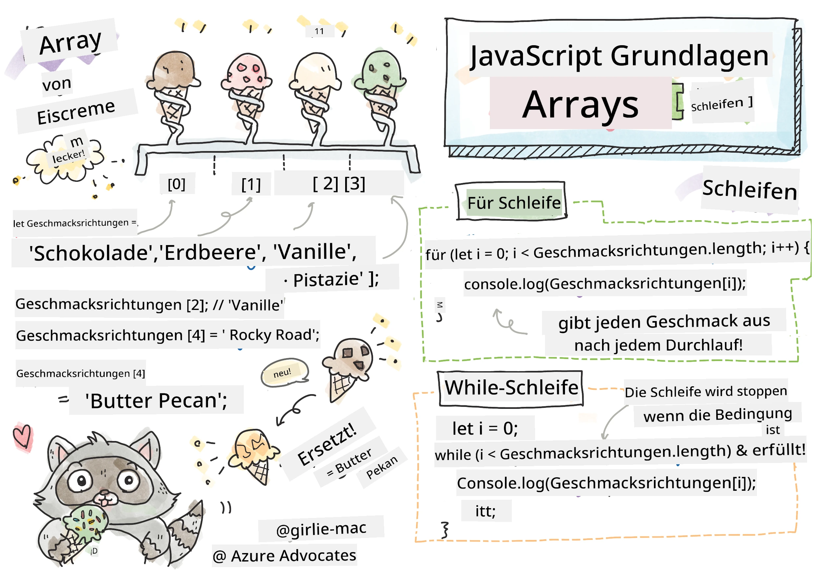
> Sketchnote von [Tomomi Imura](https://twitter.com/girlie_mac)

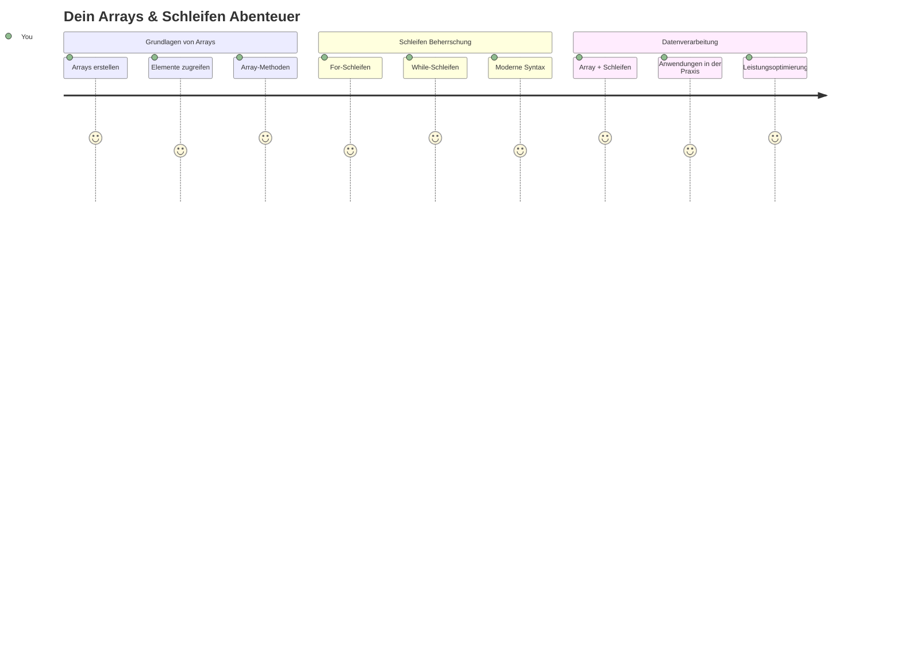
## Vor-Vorlesungs-Quiz
[Vor-Vorlesungs-Quiz](https://ff-quizzes.netlify.app/web/quiz/13)

Haben Sie sich schon einmal gefragt, wie Websites die Artikel im Warenkorb verfolgen oder Ihre Freundesliste anzeigen? Genau hier kommen Arrays und Schleifen ins Spiel. Arrays sind wie digitale Behälter, die mehrere Informationsstücke aufnehmen, während Schleifen es Ihnen ermöglichen, all diese Daten effizient ohne sich wiederholenden Code zu verarbeiten.

Gemeinsam bilden diese beiden Konzepte die Grundlage für den Umgang mit Informationen in Ihren Programmen. Sie lernen, von der manuellen Auflistung jeden einzelnen Schritts zu klugem, effizientem Code überzugehen, der Hunderte oder sogar Tausende von Elementen schnell verarbeiten kann.

Am Ende dieser Lektion werden Sie verstehen, wie man komplexe Datenaufgaben mit nur wenigen Zeilen Code bewältigen kann. Lassen Sie uns diese wesentlichen Programmierkonzepte erkunden.

[](https://youtube.com/watch?v=1U4qTyq02Xw "Arrays")

[](https://www.youtube.com/watch?v=Eeh7pxtTZ3k "Schleifen")

> 🎥 Klicken Sie auf die obigen Bilder für Videos über Arrays und Schleifen.

> Sie können diese Lektion auf [Microsoft Learn](https://docs.microsoft.com/learn/modules/web-development-101-arrays/?WT.mc_id=academic-77807-sagibbon) absolvieren!

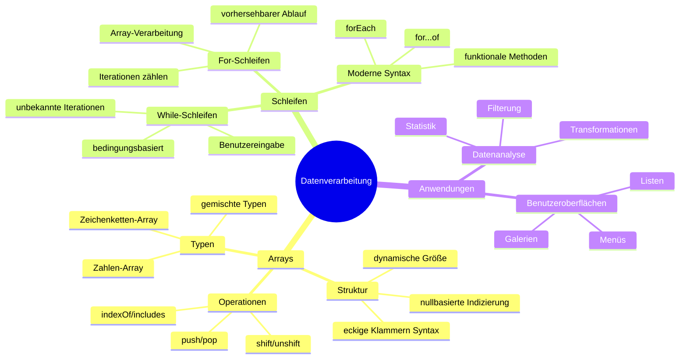
## Arrays

Denken Sie an Arrays wie an einen digitalen Aktenschrank - statt ein Dokument pro Schublade zu speichern, können Sie mehrere verwandte Elemente in einem einzigen strukturierten Behälter organisieren. In Programmierbegriffen ermöglichen Arrays es, mehrere Informationsstücke in einem organisierten Paket zu speichern.

Egal ob Sie eine Fotogalerie erstellen, eine To-Do-Liste verwalten oder Highscores in einem Spiel verfolgen, Arrays bilden die Grundlage für die Datenorganisation. Schauen wir uns an, wie sie funktionieren.

✅ Arrays sind überall um uns herum! Können Sie an ein reales Beispiel eines Arrays denken, wie z.B. ein Solarpanel-Array?

### Arrays erstellen

Ein Array zu erstellen ist super einfach – verwenden Sie einfach eckige Klammern!

```javascript
// Leeres Array - wie ein leerer Einkaufswagen, der auf Artikel wartet
const myArray = [];
```

**Was passiert hier?**
Sie haben gerade einen leeren Behälter mit diesen eckigen Klammern `[]` erstellt. Denken Sie daran wie ein leeres Bücherregal – es ist bereit, die Bücher, die Sie dort organisieren möchten, aufzunehmen.

Sie können Ihr Array auch von Anfang an mit Anfangswerten füllen:

```javascript
// Die Geschmacksrichtungen in Ihrem Eisgeschäft
const iceCreamFlavors = ["Chocolate", "Strawberry", "Vanilla", "Pistachio", "Rocky Road"];

// Profilinformationen eines Benutzers (Mischung verschiedener Datentypen)
const userData = ["John", 25, true, "developer"];

// Testergebnisse für Ihren Lieblingskurs
const scores = [95, 87, 92, 78, 85];
```

**Coole Dinge zu beachten:**
- Sie können Text, Zahlen oder sogar Wahr/Falsch-Werte im gleichen Array speichern
- Trennen Sie einfach jedes Element mit einem Komma – ganz einfach!
- Arrays sind perfekt, um zusammengehörige Informationen zusammenzuhalten

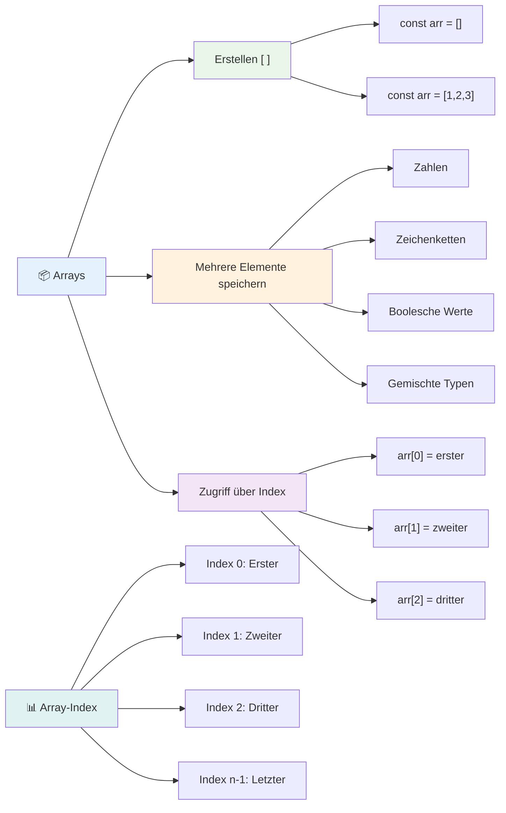
### Array-Indizierung

Hier ist etwas, das auf den ersten Blick ungewöhnlich erscheinen mag: Arrays nummerieren ihre Elemente ab 0, nicht ab 1. Diese Null-basierte Indizierung hat ihren Ursprung darin, wie Computerspeicher funktioniert – sie ist eine Programmierkonvention seit den frühen Tagen von Programmiersprachen wie C. Jeder Platz im Array erhält eine eigene Adressnummer, den **Index**.

| Index | Wert | Beschreibung |
|-------|-------|-------------|
| 0 | "Schokolade" | Erstes Element |
| 1 | "Erdbeere" | Zweites Element |
| 2 | "Vanille" | Drittes Element |
| 3 | "Pistazie" | Viertes Element |
| 4 | "Rocky Road" | Fünftes Element |

✅ Überraschend, dass Arrays bei Index 0 starten? In einigen Programmiersprachen beginnen Indizes bei 1. Es gibt eine interessante Geschichte dazu, die Sie auf [Wikipedia nachlesen](https://en.wikipedia.org/wiki/Zero-based_numbering) können.

**Zugriff auf Array-Elemente:**

```javascript
const iceCreamFlavors = ["Chocolate", "Strawberry", "Vanilla", "Pistachio", "Rocky Road"];

// Zugriff auf einzelne Elemente mit eckiger Klammernotation
console.log(iceCreamFlavors[0]); // "Schokolade" - erstes Element
console.log(iceCreamFlavors[2]); // "Vanille" - drittes Element
console.log(iceCreamFlavors[4]); // "Rocky Road" - letztes Element
```

**Den Ablauf hier erklärt:**
- **Verwendet** eckige Klammern mit der Indexnummer, um auf Elemente zuzugreifen
- **Gibt** den Wert zurück, der an dieser spezifischen Position im Array gespeichert ist
- **Beginnt** bei 0 zu zählen, somit hat das erste Element den Index 0

**Ändern von Array-Elementen:**

```javascript
// Ändere einen bestehenden Wert
iceCreamFlavors[4] = "Butter Pecan";
console.log(iceCreamFlavors[4]); // "Butter Pecan"

// Füge ein neues Element am Ende hinzu
iceCreamFlavors[5] = "Cookie Dough";
console.log(iceCreamFlavors[5]); // "Cookie Dough"
```

**Im obigen Beispiel haben wir:**
- **Das Element** an Index 4 von "Rocky Road" zu "Butter Pecan" geändert
- **Ein neues Element** "Cookie Dough" an Index 5 hinzugefügt
- **Die Array-Länge** automatisch erweitert, wenn Elemente außerhalb der aktuellen Grenzen hinzugefügt werden

### Array-Länge und häufige Methoden

Arrays bringen eingebaute Eigenschaften und Methoden mit, die das Arbeiten mit Daten wesentlich erleichtern.

**Array-Länge ermitteln:**

```javascript
const iceCreamFlavors = ["Chocolate", "Strawberry", "Vanilla", "Pistachio", "Rocky Road"];
console.log(iceCreamFlavors.length); // 5

// Die Länge wird automatisch aktualisiert, wenn sich das Array ändert
iceCreamFlavors.push("Mint Chip");
console.log(iceCreamFlavors.length); // 6
```

**Wichtig zu merken:**
- **Gibt** die Gesamtanzahl der Elemente im Array zurück
- **Aktualisiert** sich automatisch, wenn Elemente hinzugefügt oder entfernt werden
- **Bietet** eine dynamische Zählung, nützlich für Schleifen und Validierung

**Essentielle Array-Methoden:**

```javascript
const fruits = ["apple", "banana", "orange"];

// Elemente hinzufügen
fruits.push("grape");           // Fügt am Ende hinzu: ["Apfel", "Banane", "Orange", "Traube"]
fruits.unshift("strawberry");   // Fügt am Anfang hinzu: ["Erdbeere", "Apfel", "Banane", "Orange", "Traube"]

// Elemente entfernen
const lastFruit = fruits.pop();        // Entfernt und gibt "Traube" zurück
const firstFruit = fruits.shift();     // Entfernt und gibt "Erdbeere" zurück

// Elemente finden
const index = fruits.indexOf("banana"); // Gibt 1 zurück (Position der "Banane")
const hasApple = fruits.includes("apple"); // Gibt wahr zurück
```

**Diese Methoden verstehen:**
- **Fügt** Elemente mit `push()` (Ende) und `unshift()` (Anfang) hinzu
- **Entfernt** Elemente mit `pop()` (Ende) und `shift()` (Anfang)
- **Findet** Elemente mit `indexOf()` und prüft Existenz mit `includes()`
- **Gibt** nützliche Werte zurück wie entfernte Elemente oder Positionsindizes

✅ Probieren Sie es selbst! Verwenden Sie die Konsole Ihres Browsers, um ein eigenes Array zu erstellen und zu manipulieren.

### 🧠 **Array-Grundlagen-Check: Organisieren Sie Ihre Daten**

**Testen Sie Ihr Verständnis von Arrays:**
- Warum glauben Sie, dass Arrays bei 0 statt bei 1 zu zählen beginnen?
- Was passiert, wenn Sie versuchen, einen Index zuzugreifen, der nicht existiert (z.B. `arr[100]` in einem 5-Element-Array)?
- Können Sie drei reale Anwendungsszenarien nennen, in denen Arrays nützlich sind?

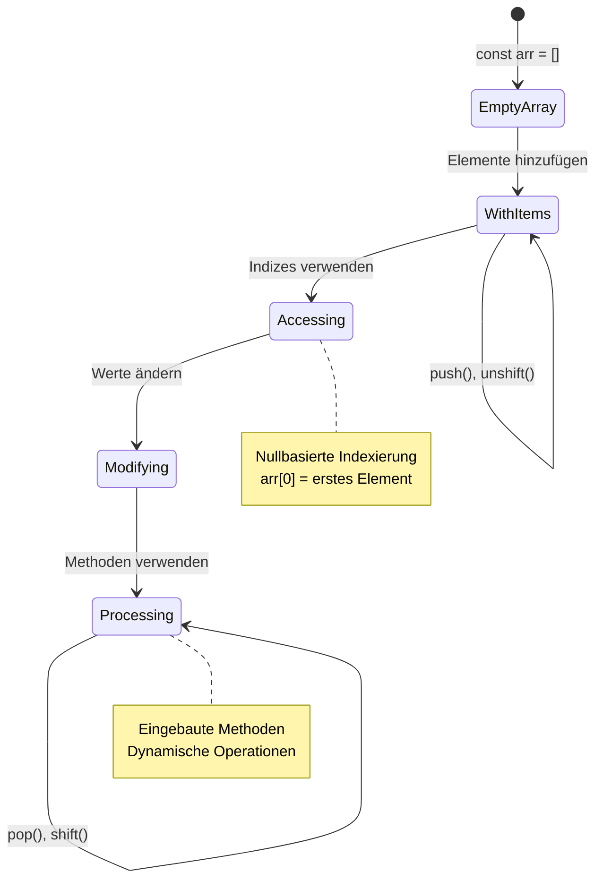
> **Praxisbezug:** Arrays sind überall in der Programmierung! Social-Media-Feeds, Einkaufswagen, Fotogalerien, Wiedergabelisten – hinter den Kulissen sind sie alle Arrays!

## Schleifen

Denken Sie an die berühmte Strafe aus Charles Dickens’ Romanen, bei der Schüler wiederholt Sätze auf eine Tafel schreiben mussten. Stellen Sie sich vor, Sie könnten einfach jemandem sagen „Schreibe diesen Satz 100 Mal“ und es würde automatisch erledigt werden. Genau das tun Schleifen für Ihren Code.

Schleifen sind wie ein unermüdlicher Assistent, der Aufgaben fehlerfrei wiederholen kann. Egal ob Sie jedes Element in einem Warenkorb prüfen oder alle Fotos in einem Album anzeigen müssen – Schleifen erledigen die Wiederholung effizient.

JavaScript bietet mehrere Arten von Schleifen zur Auswahl. Lassen Sie uns jede untersuchen und verstehen, wann man sie einsetzt.

```mermaid
flowchart TD
    A["🔄 Schleifentypen"] --> B["For-Schleife"]
    A --> C["While-Schleife"]
    A --> D["For...of-Schleife"]
    A --> E["forEach-Methode"]
    
    B --> B1["Bekannte Iterationen"]
    B --> B2["Zählerbasiert"]
    B --> B3["for(init; Bedingung; Inkrement)"]
    
    C --> C1["Unbekannte Iterationen"]
    C --> C2["Bedingungsbasiert"]
    C --> C3["while(Bedingung)"]
    
    D --> D1["Modern ES6+"]
    D --> D2["Array-Iteration"]
    D --> D3["for(Element von array)"]
    
    E --> E1["Funktionaler Stil"]
    E --> E2["Array-Methode"]
    E --> E3["array.forEach(rückruf)"]
    
    F["⏰ Wann verwenden"] --> F1["For: Zählen, Indizes"]
    F --> F2["While: Benutzereingabe, Suche"]
    F --> F3["For...of: Einfache Iteration"]
    F --> F4["forEach: Funktionale Programmierung"]
    
    style A fill:#e3f2fd
    style B fill:#e8f5e8
    style C fill:#fff3e0
    style D fill:#f3e5f5
    style E fill:#e0f2f1
    style F fill:#fce4ec
```
### For-Schleife

Die `for`-Schleife ist wie ein Timer – Sie wissen genau, wie oft etwas passieren soll. Sie ist super organisiert und vorhersehbar, was sie perfekt macht, wenn Sie mit Arrays arbeiten oder Dinge zählen müssen.

**Aufbau einer For-Schleife:**

| Komponente | Zweck | Beispiel |
|-----------|---------|----------|
| **Initialisierung** | Startpunkt setzen | `let i = 0` |
| **Bedingung** | Wann fortfahren | `i < 10` |
| **Inkrement** | Wie aktualisieren | `i++` |

```javascript
// Zählen von 0 bis 9
for (let i = 0; i < 10; i++) {
  console.log(`Count: ${i}`);
}

// Praktischeres Beispiel: Verarbeitung von Punkten
const testScores = [85, 92, 78, 96, 88];
for (let i = 0; i < testScores.length; i++) {
  console.log(`Student ${i + 1}: ${testScores[i]}%`);
}
```

**Schritt für Schritt, das passiert hier:**
- **Initialisiert** die Zählvariable `i` mit 0 am Anfang
- **Prüft** vor jeder Iteration die Bedingung `i < 10`
- **Führt** den Codeblock aus, wenn die Bedingung wahr ist
- **Erhöht** `i` nach jeder Iteration um 1 mit `i++`
- **Stoppt**, wenn die Bedingung falsch wird (wenn `i` 10 erreicht)

✅ Führen Sie diesen Code in der Browser-Konsole aus. Was passiert, wenn Sie kleine Änderungen an Zähler, Bedingung oder Iterationsausdruck vornehmen? Können Sie ihn rückwärts laufen lassen und einen Countdown erstellen?

### 🗓️ **For-Schleifen-Mastery-Check: Kontrollierte Wiederholung**

**Überprüfen Sie Ihr Verständnis der for-Schleife:**
- Was sind die drei Teile einer for-Schleife und was macht jeder Teil?
- Wie können Sie ein Array rückwärts durchlaufen?
- Was passiert, wenn Sie die Inkrementierung (`i++`) vergessen?

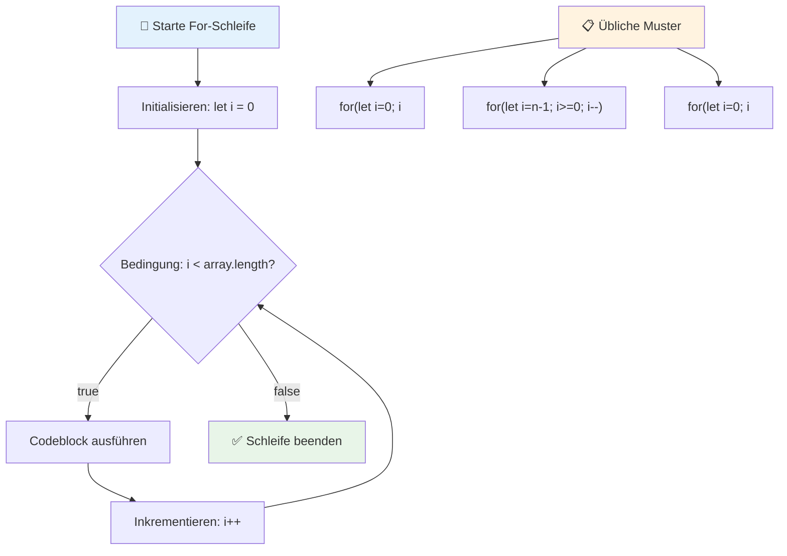
> **Schleifenweisheit:** For-Schleifen sind perfekt, wenn Sie genau wissen, wie oft Sie etwas wiederholen müssen. Sie sind die gebräuchlichste Wahl bei der Verarbeitung von Arrays!

### While-Schleife

Die `while`-Schleife ist wie „mach weiter, bis...“ – Sie wissen vielleicht nicht genau, wie oft sie läuft, aber Sie wissen, wann sie aufhören soll. Sie ist perfekt, um z.B. Benutzereingaben zu erfragen, bis der Benutzer liefert, was Sie brauchen, oder Daten zu durchsuchen, bis Sie gefunden haben, was Sie suchen.

**Merkmale der While-Schleife:**
- **Führt** aus, solange die Bedingung wahr ist
- **Erfordert** manuelle Verwaltung von Zählvariablen
- **Prüft** die Bedingung vor jeder Iteration
- **Risiko** von Endlosschleifen, wenn die Bedingung nie falsch wird

```javascript
// Einfaches Zählbeispiel
let i = 0;
while (i < 10) {
  console.log(`While count: ${i}`);
  i++; // Nicht vergessen zu inkrementieren!
}

// Praktischeres Beispiel: Verarbeitung von Benutzereingaben
let userInput = "";
let attempts = 0;
const maxAttempts = 3;

while (userInput !== "quit" && attempts < maxAttempts) {
  userInput = prompt(`Enter 'quit' to exit (attempt ${attempts + 1}):`);
  attempts++;
}

if (attempts >= maxAttempts) {
  console.log("Maximum attempts reached!");
}
```

**Verstehen Sie diese Beispiele:**
- **Verwaltet** die Zählvariable `i` manuell im Schleifenkörper
- **Erhöht** den Zähler, um Endlosschleifen zu verhindern
- **Demonstriert** den praktischen Einsatz mit Benutzereingabe und Limitierung der Versuche
- **Enthält** Sicherheitsmechanismen, um endlose Ausführungen zu vermeiden

### ♾️ **While-Schleifen-Weisheits-Check: Bedingungsbasierte Wiederholung**

**Testen Sie Ihr Verständnis der while-Schleife:**
- Was ist die größte Gefahr bei der Verwendung von while-Schleifen?
- Wann würden Sie eine while-Schleife einer for-Schleife vorziehen?
- Wie kann man Endlosschleifen verhindern?

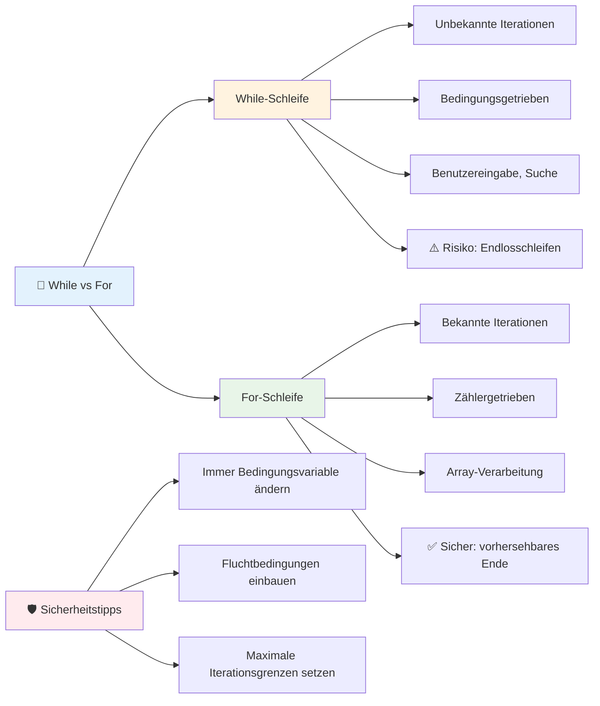
> **Sicherheit zuerst:** While-Schleifen sind mächtig, benötigen aber sorgfältiges Bedingungsmanagement. Stellen Sie immer sicher, dass Ihre Schleifenbedingung irgendwann falsch wird!

### Moderne Alternativen zu Schleifen

JavaScript bietet moderne Schleifensyntax, die Ihren Code lesbarer und weniger fehleranfällig macht.

**For...of-Schleife (ES6+):**

```javascript
const colors = ["red", "green", "blue", "yellow"];

// Moderner Ansatz - sauberer und sicherer
for (const color of colors) {
  console.log(`Color: ${color}`);
}

// Vergleich mit traditioneller for-Schleife
for (let i = 0; i < colors.length; i++) {
  console.log(`Color: ${colors[i]}`);
}
```

**Wichtige Vorteile von for...of:**
- **Eliminiert** die Indexverwaltung und potenzielle Off-by-One-Fehler
- **Bietet** direkten Zugriff auf Array-Elemente
- **Verbessert** die Lesbarkeit und reduziert Syntaxkomplexität

**forEach-Methode:**

```javascript
const prices = [9.99, 15.50, 22.75, 8.25];

// Verwendung von forEach für einen funktionalen Programmierstil
prices.forEach((price, index) => {
  console.log(`Item ${index + 1}: $${price.toFixed(2)}`);
});

// forEach mit Pfeilfunktionen für einfache Operationen
prices.forEach(price => console.log(`Price: $${price}`));
```

**Was Sie über forEach wissen sollten:**
- **Führt** eine Funktion für jedes Array-Element aus
- **Bietet** sowohl Elementwert als auch Index als Parameter
- **Kann** nicht vorzeitig abgebrochen werden (im Gegensatz zu traditionellen Schleifen)
- **Gibt** undefined zurück (erstellt kein neues Array)

✅ Warum würden Sie eine for-Schleife anstelle einer while-Schleife wählen? 17.000 Nutzer auf StackOverflow hatten dieselbe Frage, und einige Meinungen [könnten für Sie interessant sein](https://stackoverflow.com/questions/39969145/while-loops-vs-for-loops-in-javascript).

### 🎨 **Moderner Schleifen-Syntax-Check: ES6+ annehmen**

**Bewerten Sie Ihr modernes JavaScript-Verständnis:**
- Was sind die Vorteile von `for...of` gegenüber traditionellen for-Schleifen?
- Wann würden Sie trotzdem traditionelle for-Schleifen bevorzugen?
- Was ist der Unterschied zwischen `forEach` und `map`?


> **Moderner Trend:** ES6+ Syntax wie `for...of` und `forEach` wird die bevorzugte Methode für Array-Iteration, weil sie sauberer und weniger fehleranfällig ist!

## Schleifen und Arrays

Kombinieren Sie Arrays mit Schleifen, schaffen Sie leistungsstarke Möglichkeiten zur Datenverarbeitung. Dieses Paar ist grundlegend für viele Programmieraufgaben, vom Anzeigen von Listen bis zur Berechnung von Statistiken.

**Traditionelle Array-Verarbeitung:**

```javascript
const iceCreamFlavors = ["Chocolate", "Strawberry", "Vanilla", "Pistachio", "Rocky Road"];

// Klassische for-Schleifen-Methode
for (let i = 0; i < iceCreamFlavors.length; i++) {
  console.log(`Flavor ${i + 1}: ${iceCreamFlavors[i]}`);
}

// Moderne for...of-Methode
for (const flavor of iceCreamFlavors) {
  console.log(`Available flavor: ${flavor}`);
}
```

**So funktioniert dieser Ansatz:**
- **Verwendet** die Array-Länge, um die Schleifengrenze zu bestimmen
- **Greift** auf Elemente per Index in traditionellen for-Schleifen zu
- **Bietet** direkten Elementzugriff in for...of-Schleifen
- **Verarbeitet** jedes Array-Element genau einmal

**Praktisches Beispiel zur Datenverarbeitung:**

```javascript
const studentGrades = [85, 92, 78, 96, 88, 73, 89];
let total = 0;
let highestGrade = studentGrades[0];
let lowestGrade = studentGrades[0];

// Verarbeite alle Noten mit einer einzigen Schleife
for (let i = 0; i < studentGrades.length; i++) {
  const grade = studentGrades[i];
  total += grade;
  
  if (grade > highestGrade) {
    highestGrade = grade;
  }
  
  if (grade < lowestGrade) {
    lowestGrade = grade;
  }
}

const average = total / studentGrades.length;
console.log(`Average: ${average.toFixed(1)}`);
console.log(`Highest: ${highestGrade}`);
console.log(`Lowest: ${lowestGrade}`);
```

**So funktioniert dieser Code:**
- **Initialisiert** Variablen zur Verfolgung von Summe und Extremen
- **Verarbeitet** jede Note in einer einzigen effizienten Schleife
- **Summiert** zur Berechnung des Durchschnitts
- **Verfolgt** höchste und niedrigste Werte während der Iteration
- **Berechnet** abschließende Statistiken nach Schleifenende

✅ Experimentieren Sie mit dem Durchlaufen eines eigenen Arrays in der Konsole Ihres Browsers.

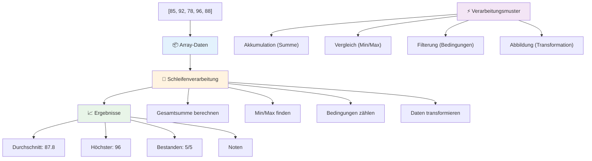
---

## GitHub Copilot Agent Challenge 🚀

Verwenden Sie den Agentenmodus, um die folgende Herausforderung zu lösen:

**Beschreibung:** Erstellen Sie eine umfassende Datenverarbeitungsfunktion, die Arrays und Schleifen kombiniert, um einen Datensatz zu analysieren und aussagekräftige Erkenntnisse zu generieren.

**Aufgabe:** Erstellen Sie eine Funktion namens `analyzeGrades`, die ein Array von Studenten-Notenobjekten (jedes mit den Eigenschaften name und score) entgegennimmt und ein Objekt mit Statistiken zurückgibt, darunter höchste Punktzahl, niedrigste Punktzahl, Durchschnittspunktzahl, Anzahl der Studenten, die bestanden haben (Punktzahl >= 70), und ein Array der Namen der Studenten, die über dem Durchschnitt liegen. Verwenden Sie in Ihrer Lösung mindestens zwei verschiedene Schleifentypen.

Erfahren Sie mehr über den [Agentenmodus](https://code.visualstudio.com/blogs/2025/02/24/introducing-copilot-agent-mode).

## 🚀 Herausforderung
JavaScript bietet mehrere moderne Array-Methoden, die traditionelle Schleifen für bestimmte Aufgaben ersetzen können. Erkunde [forEach](https://developer.mozilla.org/docs/Web/JavaScript/Reference/Global_Objects/Array/forEach), [for-of](https://developer.mozilla.org/docs/Web/JavaScript/Reference/Statements/for...of), [map](https://developer.mozilla.org/docs/Web/JavaScript/Reference/Global_Objects/Array/map), [filter](https://developer.mozilla.org/docs/Web/JavaScript/Reference/Global_Objects/Array/filter) und [reduce](https://developer.mozilla.org/docs/Web/JavaScript/Reference/Global_Objects/Array/reduce).

**Deine Herausforderung:** Überarbeite das Beispiel der Schülernoten mit mindestens drei verschiedenen Array-Methoden. Achte darauf, wie viel sauberer und lesbarer der Code mit modernem JavaScript-Syntax wird.

## Quiz nach der Vorlesung
[Quiz nach der Vorlesung](https://ff-quizzes.netlify.app/web/quiz/14)


## Wiederholung & Selbststudium

Arrays in JavaScript haben viele Methoden, die extrem nützlich für die Datenmanipulation sind. [Lies diese Methoden nach](https://developer.mozilla.org/docs/Web/JavaScript/Reference/Global_Objects/Array) und probiere einige davon aus (wie push, pop, slice und splice) an einem selbst erstellten Array.

## Aufgabe

[Loop an Array](assignment.md)

---

## 📊 **Deine Zusammenfassung zum Arrays- & Loops-Werkzeugkasten**

```mermaid
graph TD
    A["🎯 Arrays & Schleifen Beherrschung"] --> B["📦 Array Grundlagen"]
    A --> C["🔄 Schleifentypen"]
    A --> D["🔗 Datenverarbeitung"]
    A --> E["🎨 Moderne Techniken"]
    
    B --> B1["Erstellung: [ ]"]
    B --> B2["Indexierung: arr[0]"]
    B --> B3["Methoden: push, pop"]
    B --> B4["Eigenschaften: length"]
    
    C --> C1["For: Bekannte Iterationen"]
    C --> C2["While: Bedingungsbasiert"]
    C --> C3["For...of: Direkter Zugriff"]
    C --> C4["forEach: Funktional"]
    
    D --> D1["Berechnung von Statistiken"]
    D --> D2["Datenumwandlung"]
    D --> D3["Filtern & Suchen"]
    D --> D4["Echtzeitverarbeitung"]
    
    E --> E1["Pfeilfunktionen"]
    E --> E2["Methodenverkettung"]
    E --> E3["Destrukturierung"]
    E --> E4["Template-Strings"]
    
    F["💡 Hauptvorteile"] --> F1["Effiziente Datenverarbeitung"]
    F --> F2["Reduzierte Code-Wiederholung"]
    F --> F3["Skalierbare Lösungen"]
    F --> F4["Sauberere Syntax"]
    
    style A fill:#e3f2fd
    style B fill:#e8f5e8
    style C fill:#fff3e0
    style D fill:#f3e5f5
    style E fill:#e0f2f1
    style F fill:#fce4ec
```
---

## 🚀 Deine Timeline zur Arrays- & Loops-Meisterschaft

### ⚡ **Das kannst du in den nächsten 5 Minuten tun**
- [ ] Erstelle ein Array deiner Lieblingsfilme und greife auf spezifische Elemente zu
- [ ] Schreibe eine for-Schleife, die von 1 bis 10 zählt
- [ ] Probiere die Herausforderung mit modernen Array-Methoden aus der Lektion
- [ ] Übe Array-Indexierung in deiner Browser-Konsole

### 🎯 **Das kannst du in dieser Stunde erreichen**
- [ ] Beende das Quiz nach der Lektion und wiederhole schwierige Konzepte
- [ ] Baue den umfassenden Notenanalysator aus der GitHub Copilot-Herausforderung
- [ ] Erstelle einen einfachen Warenkorb, der Artikel hinzufügt und entfernt
- [ ] Übe das Konvertieren zwischen verschiedenen Schleifentypen
- [ ] Experimentiere mit Array-Methoden wie `push`, `pop`, `slice` und `splice`

### 📅 **Deine einwöchige Reise zur Datenverarbeitung**
- [ ] Beende die Aufgabe „Loop an Array“ mit kreativen Erweiterungen
- [ ] Erstelle eine To-Do-Liste-App mit Arrays und Schleifen
- [ ] Baue einen einfachen Statistikrechner für numerische Daten
- [ ] Übe mit [MDN Array-Methoden](https://developer.mozilla.org/docs/Web/JavaScript/Reference/Global_Objects/Array)
- [ ] Baue eine Fotogalerie- oder Musik-Playlist-Oberfläche
- [ ] Erkunde funktionale Programmierung mit `map`, `filter` und `reduce`

### 🌟 **Deine einmonatige Transformation**
- [ ] Meistere fortgeschrittene Array-Operationen und Performance-Optimierung
- [ ] Baue ein vollständiges Dashboard zur Datenvisualisierung
- [ ] Trage zu Open-Source-Projekten im Bereich Datenverarbeitung bei
- [ ] Bringe jemand anderem Arrays und Schleifen mit praktischen Beispielen bei
- [ ] Erstelle eine persönliche Bibliothek wiederverwendbarer Datenverarbeitungsfunktionen
- [ ] Erkunde Algorithmen und Datenstrukturen, die auf Arrays basieren

### 🏆 **Endgültiger Check-in für Datenverarbeitungs-Champions**

**Feiere deine Arrays- und Schleifen-Meisterschaft:**
- Was ist die nützlichste Array-Operation, die du für reale Anwendungen gelernt hast?
- Welcher Schleifentyp fühlt sich für dich am natürlichsten an und warum?
- Wie hat das Verständnis von Arrays und Schleifen deinen Umgang mit der Organisation von Daten verändert?
- Welche komplexe Datenverarbeitungsaufgabe möchtest du als nächstes angehen?

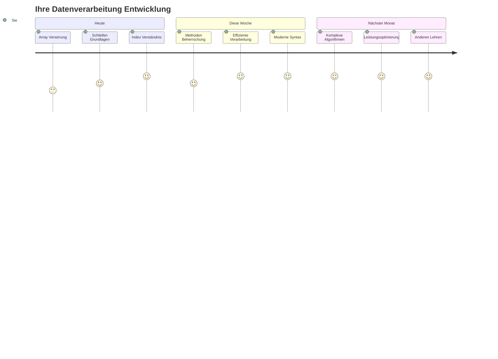
> 📦 **Du hast die Macht der Datenorganisation und -verarbeitung freigeschaltet!** Arrays und Schleifen sind die Grundlage fast jeder Anwendung, die du je bauen wirst. Von einfachen Listen bis zu komplexer Datenanalyse hast du jetzt die Werkzeuge, um Informationen effizient und elegant zu handhaben. Jede dynamische Website, jede mobile App und jede datengetriebene Anwendung beruht auf diesen grundlegenden Konzepten. Willkommen in der Welt der skalierbaren Datenverarbeitung! 🎉

---

<!-- CO-OP TRANSLATOR DISCLAIMER START -->
**Haftungsausschluss**:  
Dieses Dokument wurde mit dem KI-Übersetzungsdienst [Co-op Translator](https://github.com/Azure/co-op-translator) übersetzt. Obwohl wir um Genauigkeit bemüht sind, beachten Sie bitte, dass automatisierte Übersetzungen Fehler oder Ungenauigkeiten enthalten können. Das Originaldokument in seiner Ursprungssprache ist als maßgebliche Quelle zu betrachten. Bei wichtigen Informationen wird eine professionelle menschliche Übersetzung empfohlen. Für Missverständnisse oder Fehlinterpretationen, die durch die Nutzung dieser Übersetzung entstehen, übernehmen wir keine Haftung.
<!-- CO-OP TRANSLATOR DISCLAIMER END -->