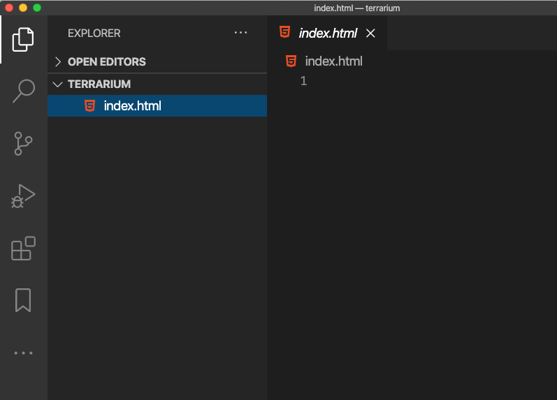

<!--
CO_OP_TRANSLATOR_METADATA:
{
  "original_hash": "89f7f9f800ce7c9f149e98baaae8491a",
  "translation_date": "2025-08-29T14:14:47+00:00",
  "source_file": "3-terrarium/1-intro-to-html/README.md",
  "language_code": "de"
}
-->
# Terrarium-Projekt Teil 1: Einführung in HTML


> Sketchnote von [Tomomi Imura](https://twitter.com/girlie_mac)

## Quiz vor der Lektion

[Quiz vor der Lektion](https://ff-quizzes.netlify.app/web/quiz/15)


> Schau dir das Video an

> 
> [](https://www.youtube.com/watch?v=1TvxJKBzhyQ)

### Einführung

HTML, oder HyperText Markup Language, ist das 'Skelett' des Webs. Wenn CSS dein HTML 'anzieht' und JavaScript es zum Leben erweckt, dann ist HTML der Körper deiner Webanwendung. Die Syntax von HTML spiegelt diese Idee sogar wider, da sie Tags wie "head", "body" und "footer" enthält.

In dieser Lektion werden wir HTML verwenden, um das 'Skelett' der Benutzeroberfläche unseres virtuellen Terrariums zu gestalten. Es wird einen Titel und drei Spalten haben: eine rechte und eine linke Spalte, in denen die verschiebbaren Pflanzen leben, und einen zentralen Bereich, der das eigentliche glasähnliche Terrarium sein wird. Am Ende dieser Lektion wirst du die Pflanzen in den Spalten sehen können, aber die Benutzeroberfläche wird noch etwas seltsam aussehen; keine Sorge, im nächsten Abschnitt wirst du CSS-Stile hinzufügen, um die Benutzeroberfläche ansprechender zu gestalten.

### Aufgabe

Erstelle auf deinem Computer einen Ordner namens 'terrarium' und darin eine Datei namens 'index.html'. Du kannst dies in Visual Studio Code tun, nachdem du deinen Terrarium-Ordner erstellt hast, indem du ein neues VS Code-Fenster öffnest, auf 'Ordner öffnen' klickst und zu deinem neuen Ordner navigierst. Klicke auf die kleine 'Datei'-Schaltfläche im Explorer-Bereich und erstelle die neue Datei:



Oder

Verwende diese Befehle in deinem Git Bash:
* `mkdir terrarium`
* `cd terrarium`
* `touch index.html`
* `code index.html` oder `nano index.html`

> index.html-Dateien zeigen einem Browser an, dass es sich um die Standarddatei in einem Ordner handelt; URLs wie `https://anysite.com/test` könnten mit einer Ordnerstruktur erstellt werden, die einen Ordner namens `test` mit `index.html` darin enthält; `index.html` muss nicht in der URL angezeigt werden.

---

## Der DocType und html-Tags

Die erste Zeile einer HTML-Datei ist ihr DocType. Es ist etwas überraschend, dass diese Zeile ganz oben in der Datei stehen muss, aber sie teilt älteren Browsern mit, dass die Seite im Standardmodus gerendert werden soll, gemäß der aktuellen HTML-Spezifikation.

> Tipp: In VS Code kannst du über einen Tag fahren, um Informationen über dessen Verwendung aus den MDN-Referenzleitfäden zu erhalten.

Die zweite Zeile sollte der öffnende `<html>`-Tag sein, gefolgt von seinem schließenden Tag `</html>`. Diese Tags sind die Wurzelelemente deiner Benutzeroberfläche.

### Aufgabe

Füge diese Zeilen oben in deiner `index.html`-Datei hinzu:

```HTML
<!DOCTYPE html>
<html></html>
```

✅ Es gibt einige verschiedene Modi, die durch das Festlegen des DocType mit einer Abfragezeichenfolge bestimmt werden können: [Quirks Mode und Standards Mode](https://developer.mozilla.org/docs/Web/HTML/Quirks_Mode_and_Standards_Mode). Diese Modi dienten der Unterstützung wirklich alter Browser, die heutzutage normalerweise nicht mehr verwendet werden (Netscape Navigator 4 und Internet Explorer 5). Du kannst bei der Standard-DocType-Deklaration bleiben.

---

## Der 'head'-Bereich des Dokuments

Der 'head'-Bereich des HTML-Dokuments enthält wichtige Informationen über deine Webseite, auch bekannt als [Metadaten](https://developer.mozilla.org/docs/Web/HTML/Element/meta). In unserem Fall teilen wir dem Webserver, an den diese Seite gesendet wird, diese vier Dinge mit:

-   den Titel der Seite
-   Seiten-Metadaten einschließlich:
    -   des 'Zeichensatzes', der angibt, welche Zeichenkodierung auf der Seite verwendet wird
    -   Browserinformationen, einschließlich `x-ua-compatible`, das angibt, dass der IE=edge-Browser unterstützt wird
    -   Informationen darüber, wie sich der Viewport beim Laden verhalten soll. Das Festlegen des Viewports auf eine anfängliche Skalierung von 1 steuert die Zoomstufe, wenn die Seite zum ersten Mal geladen wird.

### Aufgabe

Füge einen 'head'-Block zu deinem Dokument zwischen den öffnenden und schließenden `<html>`-Tags hinzu.

```html
<head>
	<title>Welcome to my Virtual Terrarium</title>
	<meta charset="utf-8" />
	<meta http-equiv="X-UA-Compatible" content="IE=edge" />
	<meta name="viewport" content="width=device-width, initial-scale=1" />
</head>
```

✅ Was würde passieren, wenn du einen Viewport-Meta-Tag wie diesen festlegst: `<meta name="viewport" content="width=600">`? Lies mehr über den [Viewport](https://developer.mozilla.org/docs/Web/HTML/Viewport_meta_tag).

---

## Der `body`-Bereich des Dokuments

### HTML-Tags

In HTML fügst du Tags zu deiner .html-Datei hinzu, um Elemente einer Webseite zu erstellen. Jedes Tag hat normalerweise ein öffnendes und ein schließendes Tag, wie dieses: `<p>hello</p>`, um einen Absatz anzuzeigen. Erstelle den Körper deiner Benutzeroberfläche, indem du ein Paar `<body>`-Tags innerhalb des `<html>`-Tag-Paares hinzufügst; dein Markup sieht jetzt so aus:

### Aufgabe

```html
<!DOCTYPE html>
<html>
	<head>
		<title>Welcome to my Virtual Terrarium</title>
		<meta charset="utf-8" />
		<meta http-equiv="X-UA-Compatible" content="IE=edge" />
		<meta name="viewport" content="width=device-width, initial-scale=1" />
	</head>
	<body></body>
</html>
```

Jetzt kannst du anfangen, deine Seite zu erstellen. Normalerweise verwendest du `<div>`-Tags, um die separaten Elemente auf einer Seite zu erstellen. Wir werden eine Reihe von `<div>`-Elementen erstellen, die Bilder enthalten.

### Bilder

Ein HTML-Tag, das kein schließendes Tag benötigt, ist das ``-Tag, da es ein `src`-Element hat, das alle Informationen enthält, die die Seite benötigt, um das Element zu rendern.

Erstelle einen Ordner in deiner App namens `images` und füge darin alle Bilder aus dem [Quellcode-Ordner](../../../../3-terrarium/solution/images) hinzu; (es gibt 14 Bilder von Pflanzen).

### Aufgabe

Füge diese Pflanzenbilder in zwei Spalten zwischen den `<body></body>`-Tags ein:

```html
<div id="page">
	<div id="left-container" class="container">
		<div class="plant-holder">
			
		</div>
		<div class="plant-holder">
			
		</div>
		<div class="plant-holder">
			
		</div>
		<div class="plant-holder">
			
		</div>
		<div class="plant-holder">
			
		</div>
		<div class="plant-holder">
			
		</div>
		<div class="plant-holder">
			
		</div>
	</div>
	<div id="right-container" class="container">
		<div class="plant-holder">
			
		</div>
		<div class="plant-holder">
			
		</div>
		<div class="plant-holder">
			
		</div>
		<div class="plant-holder">
			
		</div>
		<div class="plant-holder">
			
		</div>
		<div class="plant-holder">
			
		</div>
		<div class="plant-holder">
			
		</div>
	</div>
</div>
```

> Hinweis: Spans vs. Divs. Divs werden als 'Block'-Elemente betrachtet, und Spans als 'Inline'-Elemente. Was würde passieren, wenn du diese Divs in Spans umwandelst?

Mit diesem Markup erscheinen die Pflanzen jetzt auf dem Bildschirm. Es sieht ziemlich schlecht aus, da sie noch nicht mit CSS gestylt sind, und das werden wir in der nächsten Lektion tun.

Jedes Bild hat Alt-Text, der angezeigt wird, auch wenn du ein Bild nicht sehen oder rendern kannst. Dies ist ein wichtiges Attribut für Barrierefreiheit. Erfahre mehr über Barrierefreiheit in zukünftigen Lektionen; für jetzt denke daran, dass das Alt-Attribut alternative Informationen für ein Bild bereitstellt, falls ein Benutzer aus irgendeinem Grund das Bild nicht sehen kann (aufgrund einer langsamen Verbindung, eines Fehlers im src-Attribut oder wenn der Benutzer einen Screenreader verwendet).

✅ Hast du bemerkt, dass jedes Bild denselben Alt-Tag hat? Ist das eine gute Praxis? Warum oder warum nicht? Kannst du diesen Code verbessern?

---

## Semantisches Markup

Im Allgemeinen ist es vorzuziehen, sinnvolle 'Semantik' zu verwenden, wenn man HTML schreibt. Was bedeutet das? Es bedeutet, dass du HTML-Tags verwendest, um die Art von Daten oder Interaktionen darzustellen, für die sie entworfen wurden. Zum Beispiel sollte der Haupttiteltext auf einer Seite ein `<h1>`-Tag verwenden.

Füge die folgende Zeile direkt unter deinem öffnenden `<body>`-Tag hinzu:

```html
<h1>My Terrarium</h1>
```

Die Verwendung von semantischem Markup, wie das Verwenden von `<h1>` für Überschriften und `<ul>` für ungeordnete Listen, hilft Screenreadern, sich durch eine Seite zu navigieren. Im Allgemeinen sollten Schaltflächen als `<button>` geschrieben werden und Listen als `<li>`. Während es _möglich_ ist, speziell gestylte `<span>`-Elemente mit Klick-Handlern zu verwenden, um Schaltflächen zu imitieren, ist es besser für Benutzer mit Behinderungen, Technologien zu verwenden, um zu bestimmen, wo sich eine Schaltfläche auf einer Seite befindet, und mit ihr zu interagieren, wenn das Element als Schaltfläche erscheint. Aus diesem Grund solltest du so oft wie möglich semantisches Markup verwenden.

✅ Schau dir einen Screenreader an und [wie er mit einer Webseite interagiert](https://www.youtube.com/watch?v=OUDV1gqs9GA). Kannst du sehen, warum nicht-semantisches Markup den Benutzer frustrieren könnte?

## Das Terrarium

Der letzte Teil dieser Benutzeroberfläche besteht darin, Markup zu erstellen, das gestylt wird, um ein Terrarium zu erstellen.

### Aufgabe:

Füge dieses Markup über dem letzten `</div>`-Tag hinzu:

```html
<div id="terrarium">
	<div class="jar-top"></div>
	<div class="jar-walls">
		<div class="jar-glossy-long"></div>
		<div class="jar-glossy-short"></div>
	</div>
	<div class="dirt"></div>
	<div class="jar-bottom"></div>
</div>
```

✅ Auch wenn du dieses Markup auf dem Bildschirm hinzugefügt hast, siehst du absolut nichts. Warum?

---

## 🚀 Herausforderung

Es gibt einige interessante 'ältere' Tags in HTML, die immer noch Spaß machen, obwohl du keine veralteten Tags wie [diese Tags](https://developer.mozilla.org/docs/Web/HTML/Element#Obsolete_and_deprecated_elements) in deinem Markup verwenden solltest. Kannst du das alte `<marquee>`-Tag verwenden, um den h1-Titel horizontal scrollen zu lassen? (Falls du es tust, vergiss nicht, es danach zu entfernen.)

## Quiz nach der Lektion

[Quiz nach der Lektion](https://ff-quizzes.netlify.app/web/quiz/16)

## Überprüfung & Selbststudium

HTML ist das 'bewährte' Bausteinsystem, das dazu beigetragen hat, das Web zu dem zu machen, was es heute ist. Erfahre ein wenig über seine Geschichte, indem du einige alte und neue Tags studierst. Kannst du herausfinden, warum einige Tags veraltet und andere hinzugefügt wurden? Welche Tags könnten in Zukunft eingeführt werden?

Erfahre mehr über das Erstellen von Websites für das Web und mobile Geräte bei [Microsoft Learn](https://docs.microsoft.com/learn/modules/build-simple-website/?WT.mc_id=academic-77807-sagibbon).

## Aufgabe

[Übe dein HTML: Erstelle ein Blog-Mockup](assignment.md)

---

**Haftungsausschluss**:  
Dieses Dokument wurde mit dem KI-Übersetzungsdienst [Co-op Translator](https://github.com/Azure/co-op-translator) übersetzt. Obwohl wir uns um Genauigkeit bemühen, weisen wir darauf hin, dass automatisierte Übersetzungen Fehler oder Ungenauigkeiten enthalten können. Das Originaldokument in seiner ursprünglichen Sprache sollte als maßgebliche Quelle betrachtet werden. Für kritische Informationen wird eine professionelle menschliche Übersetzung empfohlen. Wir übernehmen keine Haftung für Missverständnisse oder Fehlinterpretationen, die aus der Nutzung dieser Übersetzung entstehen.