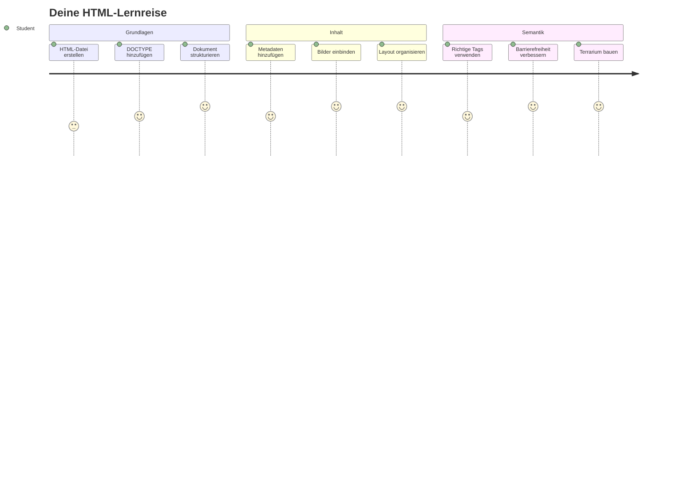
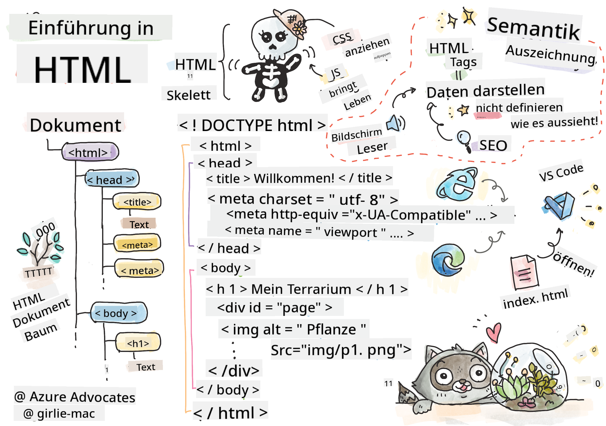
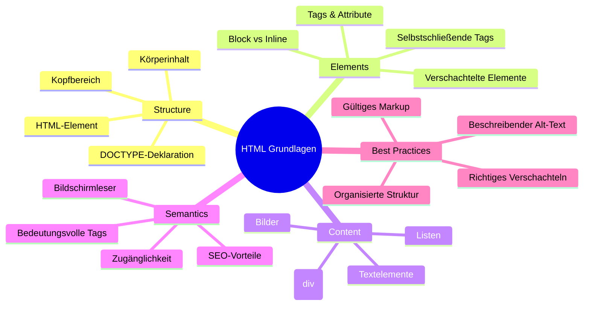
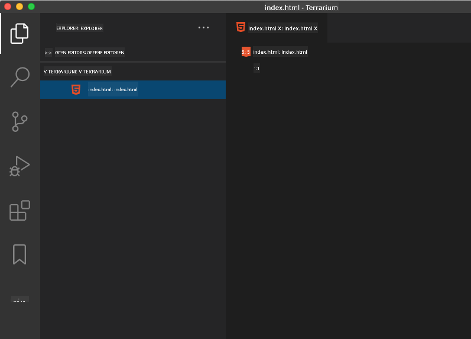
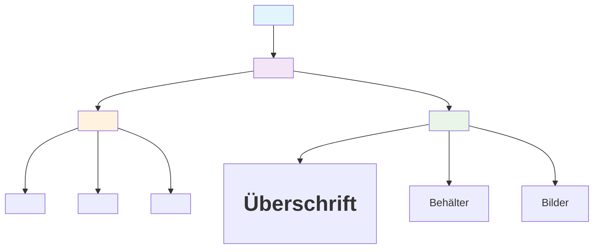
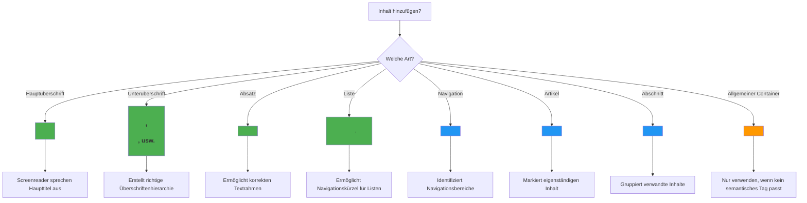
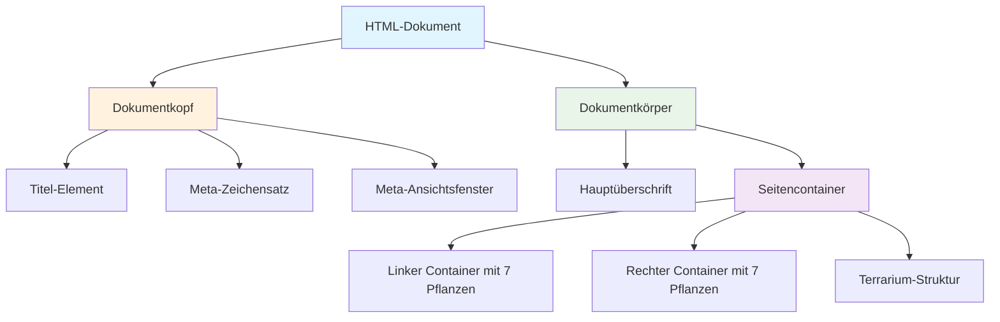
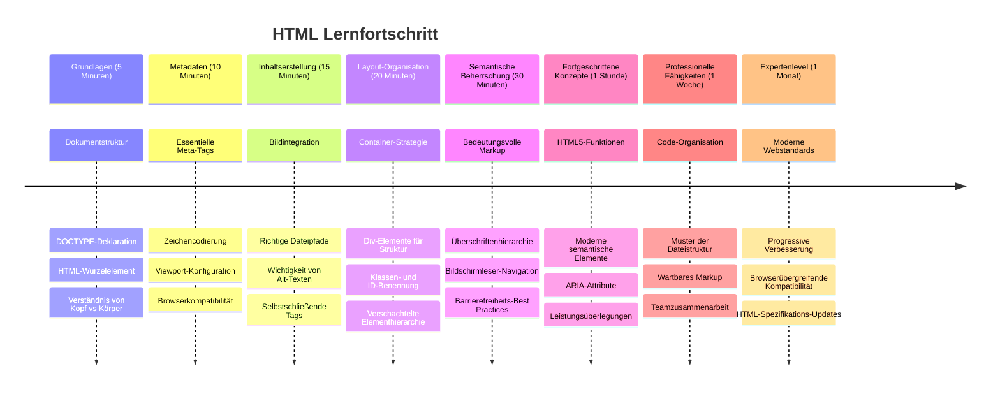

<!--
CO_OP_TRANSLATOR_METADATA:
{
  "original_hash": "3fcfa99c4897e051b558b5eaf1e8cc74",
  "translation_date": "2026-01-06T09:12:38+00:00",
  "source_file": "3-terrarium/1-intro-to-html/README.md",
  "language_code": "de"
}
-->
# Terrarium-Projekt Teil 1: Einführung in HTML



> Sketchnote von [Tomomi Imura](https://twitter.com/girlie_mac)

HTML, oder HyperText Markup Language, ist die Grundlage jeder Website, die du je besucht hast. Betrachte HTML als das Skelett, das Webseiten Struktur verleiht – es definiert, wo Inhalte platziert werden, wie sie organisiert sind und was jeder Abschnitt repräsentiert. Während CSS später dein HTML mit Farben und Layouts „einkleidet“ und JavaScript es mit Interaktivität zum Leben erweckt, liefert HTML die wesentliche Struktur, die alles andere möglich macht.

In dieser Lektion erstellst du die HTML-Struktur für eine virtuelle Terrarien-Oberfläche. Dieses praktische Projekt vermittelt dir grundlegende HTML-Konzepte, während du etwas optisch ansprechendes baust. Du lernst, Inhalte mit semantischen Elementen zu organisieren, mit Bildern zu arbeiten und die Grundlage für eine interaktive Webanwendung zu schaffen.

Am Ende dieser Lektion hast du eine funktionierende HTML-Seite, die Pflanzenbilder in organisierten Spalten anzeigt, bereit zum Stylen in der nächsten Lektion. Mach dir keine Sorgen, wenn es am Anfang einfach aussieht – genau so soll HTML sein, bevor CSS das visuelle Finish hinzufügt.


## Pre-Lecture Quiz

[Pre-Lecture Quiz](https://ff-quizzes.netlify.app/web/quiz/15)

> 📺 **Anschauen und Lernen**: Sieh dir diese hilfreiche Videoübersicht an
> 
> [](https://www.youtube.com/watch?v=1TvxJKBzhyQ)

## Einrichten deines Projekts

Bevor wir in den HTML-Code eintauchen, richten wir einen passenden Arbeitsbereich für dein Terrarium-Projekt ein. Eine gut organisierte Verzeichnisstruktur von Anfang an zu erstellen, ist eine wichtige Gewohnheit, die dir während deiner gesamten Webentwicklungsreise zugutekommt.

### Aufgabe: Erstelle deine Projektstruktur

Du legst einen dedizierten Ordner für dein Terrarium-Projekt an und fügst deine erste HTML-Datei hinzu. Hier sind zwei Ansätze, die du nutzen kannst:

**Option 1: Mit Visual Studio Code**
1. Öffne Visual Studio Code
2. Klicke auf „Datei“ → „Ordner öffnen“ oder nutze `Strg+K, Strg+O` (Windows/Linux) bzw. `Cmd+K, Cmd+O` (Mac)
3. Erstelle einen neuen Ordner namens `terrarium` und wähle ihn aus
4. Klicke im Explorer-Bereich auf das Symbol „Neue Datei“
5. Benenne deine Datei `index.html`



**Option 2: Mit Terminal-Befehlen**
```bash
mkdir terrarium
cd terrarium
touch index.html
code index.html
```

**Das bewirken diese Befehle:**
- **Erstellt** einen neuen Ordner namens `terrarium` für dein Projekt
- **Navigiert** in den terrarium-Ordner
- **Erstellt** eine leere Datei `index.html`
- **Öffnet** die Datei in Visual Studio Code zur Bearbeitung

> 💡 **Pro Tipp**: Der Dateiname `index.html` hat in der Webentwicklung eine besondere Bedeutung. Wenn jemand eine Website besucht, suchen Browser automatisch nach `index.html` als Standardseite. Das bedeutet, eine URL wie `https://mysite.com/projects/` zeigt automatisch die `index.html` Datei im Ordner `projects`, ohne dass der Dateiname in der URL stehen muss.

## Verständnis der HTML-Dokumentstruktur

Jedes HTML-Dokument folgt einer bestimmten Struktur, die Browser benötigen, um es richtig darzustellen. Stell dir diese Struktur wie einen formellen Brief vor – sie enthält erforderliche Elemente in einer bestimmten Reihenfolge, die dem Empfänger (hier dem Browser) helfen, den Inhalt korrekt zu verarbeiten.


Fangen wir damit an, die essenzielle Grundlage hinzuzufügen, die jeder HTML-Dokument benötigt.

### Die DOCTYPE-Deklaration und das Wurzel-Element

Die ersten beiden Zeilen jeder HTML-Datei dienen als „Einleitung“ des Dokuments für den Browser:

```html
<!DOCTYPE html>
<html></html>
```

**Was dieser Code bewirkt:**
- **Deklariert** den Dokumenttyp als HTML5 mit `<!DOCTYPE html>`
- **Erstellt** das Wurzel-Element `<html>`, das den gesamten Seiteninhalt enthält
- **Legt** moderne Web-Standards für korrekte Browserdarstellung fest
- **Sorgt** für eine konsistente Anzeige über unterschiedliche Browser und Geräte hinweg

> 💡 **VS Code Tipp**: Fahre in VS Code mit der Maus über ein beliebiges HTML-Tag, um hilfreiche Informationen von MDN Web Docs zu sehen, inklusive Anwendungsbeispielen und Browserkompatibilität.

> 📚 **Mehr erfahren**: Die DOCTYPE-Deklaration verhindert, dass Browser in den „Quirks Mode“ wechseln, der zur Unterstützung sehr alter Websites genutzt wurde. Moderne Webentwicklung nutzt die einfache Deklaration `<!DOCTYPE html>`, um eine [standards-konforme Darstellung](https://developer.mozilla.org/docs/Web/HTML/Quirks_Mode_and_Standards_Mode) sicherzustellen.

### 🔄 **Pädagogischer Check-in**
**Pause und Nachdenken**: Bevor du weitermachst, stelle sicher, dass du verstehst:
- ✅ Warum jedes HTML-Dokument eine DOCTYPE-Deklaration benötigt
- ✅ Was das `<html>` Wurzelelement enthält
- ✅ Wie diese Struktur Browsern hilft, Seiten korrekt darzustellen

**Schnell-Selbsttest**: Kannst du mit eigenen Worten erklären, was „standards-konforme Darstellung“ bedeutet?

## Hinzufügen essenzieller Metadaten zum Dokument

Der `<head>` Bereich eines HTML-Dokuments enthält wichtige Informationen, die Browser und Suchmaschinen brauchen, die Besucher aber nicht direkt auf der Seite sehen. Denk an ihn als die „Hinter den Kulissen“-Information, die deiner Webseite hilft, richtig zu funktionieren und auf verschiedenen Geräten und Plattformen korrekt zu erscheinen.

Diese Metadaten sagen dem Browser, wie er deine Seite anzeigen soll, welche Zeichencodierung zu verwenden ist und wie verschiedene Bildschirmgrößen behandelt werden – alles entscheidend für professionelle, zugängliche Webseiten.

### Aufgabe: Füge den Dokument-Kopf hinzu

Füge diesen `<head>`-Abschnitt zwischen deine öffnenden und schließenden `<html>`-Tags ein:

```html
<head>
	<title>Welcome to my Virtual Terrarium</title>
	<meta charset="utf-8" />
	<meta http-equiv="X-UA-Compatible" content="IE=edge" />
	<meta name="viewport" content="width=device-width, initial-scale=1" />
</head>
```

**Was jedes Element bewirkt:**
- **Setzt** den Seitentitel, der in Browser-Tabs und Suchergebnissen erscheint
- **Legt** die UTF-8-Zeichencodierung für korrekte Anzeige weltweit fest
- **Sorgt** für Kompatibilität mit modernen Versionen des Internet Explorers
- **Konfiguriert** ein responsives Design, indem die Viewport-Breite an das Gerät angepasst wird
- **Steuert** den Anfangs-Zoom, damit Inhalte in natürlicher Größe angezeigt werden

> 🤔 **Denk mal nach**: Was würde passieren, wenn du ein Viewport-Meta-Tag wie dieses setzt: `<meta name="viewport" content="width=600">`? Das würde die Seite immer auf 600 Pixel Breite festlegen und das responsive Design zerstören! Erfahre mehr über [die richtige Viewport-Konfiguration](https://developer.mozilla.org/docs/Web/HTML/Viewport_meta_tag).

## Aufbau des Dokument-Inhaltsbereichs

Das `<body>`-Element enthält den gesamten sichtbaren Inhalt deiner Webseite – alles, was Nutzer sehen und womit sie interagieren. Während der `<head>` Bereich dem Browser Anweisungen gab, enthält der `<body>` Bereich den eigentlichen Inhalt: Text, Bilder, Schaltflächen und weitere Elemente, die deine Benutzeroberfläche bilden.

Fügen wir die Body-Struktur hinzu und verstehen, wie HTML-Tags zusammenwirken, um sinnvollen Inhalt zu erzeugen.

### Verstehen der HTML-Tag-Struktur

HTML verwendet gepaarte Tags, um Elemente zu definieren. Die meisten Tags besitzen einen Öffnungs-Tag, z. B. `<p>`, und einen Schließ-Tag, z. B. `</p>`, mit dem Inhalt dazwischen: `<p>Hallo Welt!</p>`. Dadurch wird ein Absatz-Element mit dem Text „Hallo Welt!“ erzeugt.

### Aufgabe: Füge das Body-Element hinzu

Aktualisiere deine HTML-Datei, sodass das `<body>` Element enthalten ist:

```html
<!DOCTYPE html>
<html>
	<head>
		<title>Welcome to my Virtual Terrarium</title>
		<meta charset="utf-8" />
		<meta http-equiv="X-UA-Compatible" content="IE=edge" />
		<meta name="viewport" content="width=device-width, initial-scale=1" />
	</head>
	<body></body>
</html>
```

**Das bietet diese komplette Struktur:**
- **Legt** die grundlegende HTML5-Dokumentbasis fest
- **Beinhaltet** wichtige Metadaten für korrekte Browserdarstellung
- **Erstellt** einen leeren Body, bereit für sichtbare Inhalte
- **Folgt** modernen Webentwicklungsbest-practices

Jetzt bist du bereit, die sichtbaren Elemente deines Terrariums hinzuzufügen. Wir verwenden `<div>` Elemente als Container, um verschiedene Inhaltsabschnitte zu organisieren, und `` Tags, um die Pflanzenbilder darzustellen.

### Arbeiten mit Bildern und Layout-Containern

Bilder sind in HTML speziell, weil sie „selbstschließende“ Tags verwenden. Im Gegensatz zu Elementen wie `<p></p>`, die Inhalte umschließen, enthält das `` Tag alle nötigen Informationen innerhalb des Tags selbst über Attribute wie `src` für den Pfad zur Bilddatei und `alt` für die Barrierefreiheit.

Bevor du Bilder ins HTML einfügst, musst du deine Projektdateien richtig organisieren, indem du einen Bilderordner anlegst und die Pflanzen-Grafiken hinzufügst.

**Zuerst deine Bilder einrichten:**
1. Lege einen Ordner `images` im terrarium-Projektordner an
2. Lade die Pflanzenbilder aus dem [Lösungsordner](../../../../3-terrarium/solution/images) herunter (insgesamt 14 Bilder)
3. Kopiere alle Pflanzenbilder in deinen neuen `images`-Ordner

### Aufgabe: Erstelle das Pflanzen-Anzeige-Layout

Füge jetzt die Pflanzenbilder, organisiert in zwei Spalten, zwischen deine `<body></body>`-Tags ein:

```html
<div id="page">
	<div id="left-container" class="container">
		<div class="plant-holder">
			
		</div>
		<div class="plant-holder">
			
		</div>
		<div class="plant-holder">
			
		</div>
		<div class="plant-holder">
			
		</div>
		<div class="plant-holder">
			
		</div>
		<div class="plant-holder">
			
		</div>
		<div class="plant-holder">
			
		</div>
	</div>
	<div id="right-container" class="container">
		<div class="plant-holder">
			
		</div>
		<div class="plant-holder">
			
		</div>
		<div class="plant-holder">
			
		</div>
		<div class="plant-holder">
			
		</div>
		<div class="plant-holder">
			
		</div>
		<div class="plant-holder">
			
		</div>
		<div class="plant-holder">
			
		</div>
	</div>
</div>
```

**Schritt für Schritt, was dieser Code macht:**
- **Erstellt** einen Hauptseiten-Container mit `id="page"`, der alle Inhalte hält
- **Legt** zwei Spalten-Container an: `left-container` und `right-container`
- **Organisiert** 7 Pflanzen in der linken und 7 Pflanzen in der rechten Spalte
- **Verpackt** jedes Pflanzenbild in einen `plant-holder`-Div für individuelle Positionierung
- **Verwendet** konsistente Klassennamen für CSS-Styling in der nächsten Lektion
- **Vergibt** einzigartige IDs für jedes Pflanzenbild zur späteren JavaScript-Interaktion
- **Bezieht** sich korrekt auf die Dateien im images-Ordner

> 🤔 **Überlege mal**: Alle Bilder haben derzeit denselben alt-Text „plant“. Das ist für Barrierefreiheit nicht ideal. Screenreader-Nutzer würden 14 Mal „plant“ hören, ohne zu wissen, welche Pflanze jedes Bild zeigt. Kannst du dir bessere, aussagekräftigere alt-Texte für jedes Bild vorstellen?

> 📝 **HTML-Element-Typen**: `<div>` Elemente sind „Block-Level“ und nehmen volle Breite ein, während `<span>` Elemente „Inline“ sind und nur so breit wie nötig. Was glaubst du, würde passieren, wenn du alle `<div>` Tags hier durch `<span>` Tags ersetzen würdest?

### 🔄 **Pädagogischer Check-in**
**Struktur-Verständnis**: Nimm dir einen Moment, um deine HTML-Struktur zu überprüfen:
- ✅ Kannst du die Hauptcontainer deiner Layout-Struktur benennen?
- ✅ Verstehst du, warum jedes Bild eine eindeutige ID hat?
- ✅ Wie würdest du die Funktion der `plant-holder`-Divs beschreiben?

**Visuelle Prüfung**: Öffne deine HTML-Datei im Browser. Du solltest folgendes sehen:
- Eine einfache Liste von Pflanzenbildern
- Bilder organisiert in zwei Spalten
- Ein schlichtes, ungestyltes Layout

**Merke**: Dieses einfache Aussehen ist genau das, was HTML vor dem Styling durch CSS ausmachen sollte!

Mit diesem Markup erscheinen die Pflanzen auf dem Bildschirm, sehen aber noch nicht poliert aus – dafür ist CSS in der nächsten Lektion verantwortlich! Du hast jetzt eine solide HTML-Basis, die deine Inhalte gut organisiert und Zugänglichkeitsbest-Practices folgt.

## Semantisches HTML für Barrierefreiheit verwenden

Semantisches HTML bedeutet, HTML-Elemente aufgrund ihrer Bedeutung und Funktion auszuwählen, nicht nur nach ihrem Aussehen. Wenn du semantische Auszeichnung verwendest, kommunizierst du die Struktur und Bedeutung deiner Inhalte an Browser, Suchmaschinen und unterstützende Technologien wie Screenreader.


Dieser Ansatz macht deine Websites zugänglicher für Nutzer mit Beeinträchtigungen und hilft Suchmaschinen, deine Inhalte besser zu verstehen. Es ist ein grundlegendes Prinzip moderner Webentwicklung, das bessere Erlebnisse für alle schafft.

### Einen semantischen Seitentitel hinzufügen

Fügen wir deiner Terrarien-Seite eine passende Überschrift hinzu. Setze diese Zeile direkt nach deinem öffnenden `<body>`-Tag ein:

```html
<h1>My Terrarium</h1>
```

**Warum semantische Auszeichnung wichtig ist:**
- **Hilft** Screenreadern, sich auf der Seite zurechtzufinden und die Struktur zu verstehen
- **Verbessert** Suchmaschinenoptimierung (SEO) durch klare Inhalts-Hierarchie
- **Erhöht** Barrierefreiheit für Nutzer mit Sehbehinderung oder kognitiven Einschränkungen
- **Schafft** bessere Nutzererfahrungen auf allen Geräten und Plattformen
- **Folgt** Webstandards und Best-Practices für professionelle Entwicklung

**Beispiele für semantische vs. nicht-semantische Wahl:**

| Zweck | ✅ Semantische Wahl | ❌ Nicht-semantische Wahl |
|-------|-------------------|--------------------------|
| Hauptüberschrift | `<h1>Titel</h1>` | `<div class="big-text">Titel</div>` |
| Navigation | `<nav><ul><li></li></ul></nav>` | `<div class="menu"><div></div></div>` |
| Schaltfläche | `<button>Klick mich</button>` | `<span onclick="...">Klick mich</span>` |
| Artikel-Inhalt | `<article><p></p></article>` | `<div class="content"><div></div></div>` |

> 🎥 **Sieh es in Aktion**: Sieh dir an, [wie Screenreader mit Webseiten interagieren](https://www.youtube.com/watch?v=OUDV1gqs9GA), um zu verstehen, warum semantisches Markup für Barrierefreiheit entscheidend ist. Beachte, wie richtige HTML-Struktur Nutzern effiziente Navigation ermöglicht.

## Den Terrarien-Container erstellen

Fügen wir jetzt die HTML-Struktur für das Terrarium selbst hinzu – den Glasbehälter, in den die Pflanzen später gesetzt werden. Dieser Abschnitt zeigt ein wichtiges Konzept: HTML liefert Struktur, aber ohne CSS-Styling sind diese Elemente noch nicht sichtbar.

Das Terrarium-Markup verwendet beschreibende Klassennamen, die das CSS-Styling in der nächsten Lektion intuitiv und wartbar machen.

### Aufgabe: Füge die Terrarium-Struktur hinzu

Füge dieses Markup oberhalb des letzten `</div>`-Tags (vor dem schließenden Tag des Seitencontainers) ein:

```html
<div id="terrarium">
	<div class="jar-top"></div>
	<div class="jar-walls">
		<div class="jar-glossy-long"></div>
		<div class="jar-glossy-short"></div>
	</div>
	<div class="dirt"></div>
	<div class="jar-bottom"></div>
</div>
```

**Diese Terrarium-Struktur bedeutet:**
- **Erstellt** einen Haupt-Terrariencontainer mit einer eindeutigen ID für das Styling
- **Definiert** separate Elemente für jede visuelle Komponente (oben, Wände, Erde, unten)
- **Beinhaltet** verschachtelte Elemente für Glasreflexionseffekte (glänzende Elemente)
- **Verwendet** beschreibende Klassennamen, die klar den Zweck jedes Elements anzeigen
- **Bereitet** die Struktur für CSS-Styling vor, das das Aussehen eines Glasterrariums erzeugt

> 🤔 **Etwas bemerkt?**: Obwohl du dieses Markup hinzugefügt hast, siehst du auf der Seite nichts Neues! Das veranschaulicht perfekt, wie HTML die Struktur bereitstellt, während CSS für das Aussehen sorgt. Diese `<div>`-Elemente existieren, haben aber noch keine visuelle Gestaltung – das folgt in der nächsten Lektion!


### 🔄 **Pädagogische Überprüfung**
**Beherrschung der HTML-Struktur**: Bevor du weitermachst, stelle sicher, dass du:
- ✅ Den Unterschied zwischen HTML-Struktur und optischem Erscheinungsbild erklären kannst
- ✅ Semantische vs. nicht-sematische HTML-Elemente identifizieren kannst
- ✅ Beschreiben kannst, wie korrektes Markup die Barrierefreiheit unterstützt
- ✅ Die vollständige Dokumentstruktur erkennen kannst

**Teste dein Verständnis**: Öffne deine HTML-Datei in einem Browser mit deaktiviertem JavaScript und ohne CSS. So siehst du die reine semantische Struktur, die du erstellt hast!

---

## GitHub Copilot Agent Herausforderung

Verwende den Agent-Modus, um folgende Herausforderung zu meistern:

**Beschreibung:** Erstelle eine semantische HTML-Struktur für einen Pflanzenpflegeleitfaden-Abschnitt, der zum Terrarium-Projekt hinzugefügt werden kann.

**Aufgabe:** Erstelle einen semantischen HTML-Abschnitt mit einer Hauptüberschrift "Pflanzenpflege-Leitfaden", drei Unterabschnitten mit den Überschriften "Bewässerung", "Lichtanforderungen" und "Bodenpflege", die jeweils einen Absatz mit Informationen zur Pflanzenpflege enthalten. Verwende korrekte semantische HTML-Tags wie `<section>`, `<h2>`, `<h3>` und `<p>`, um den Inhalt angemessen zu strukturieren.

Erfahre mehr über den [Agent-Modus](https://code.visualstudio.com/blogs/2025/02/24/introducing-copilot-agent-mode) hier.

## Erkunde die HTML-Geschichte Herausforderung

**Lerne über die Entwicklung des Webs**

HTML hat sich seit der Erfindung des ersten Webbrowsers durch Tim Berners-Lee am CERN im Jahr 1990 stark weiterentwickelt. Einige ältere Tags wie `<marquee>` sind inzwischen veraltet, da sie nicht gut mit modernen Barrierefreiheitsstandards und Prinzipien des responsiven Designs funktionieren.

**Führe dieses Experiment durch:**
1. Umschließe deinen `<h1>`-Titel vorübergehend mit einem `<marquee>`-Tag: `<marquee><h1>Mein Terrarium</h1></marquee>`
2. Öffne deine Seite im Browser und beobachte den Scroll-Effekt
3. Überlege, warum dieses Tag veraltet ist (Tipp: Denke an Benutzerfreundlichkeit und Barrierefreiheit)
4. Entferne das `<marquee>`-Tag und kehre zum semantischen Markup zurück

**Reflexionsfragen:**
- Wie könnte ein scrollender Titel Nutzer mit Sehbehinderungen oder Bewegungsempfindlichkeit beeinflussen?
- Welche modernen CSS-Techniken könnten ähnlich visuelle Effekte zugänglicher erzeugen?
- Warum ist es wichtig, aktuelle Webstandards anstelle veralteter Elemente zu verwenden?

Erkunde mehr über [veraltete und nicht mehr empfohlene HTML-Elemente](https://developer.mozilla.org/docs/Web/HTML/Element#Obsolete_and_deprecated_elements), um zu verstehen, wie sich Webstandards entwickeln, um die Benutzererfahrung zu verbessern.


## Nachvorlesungs-Quiz

[Nachvorlesungs-Quiz](https://ff-quizzes.netlify.app/web/quiz/16)

## Rückblick & Selbststudium

**Vertiefe dein HTML-Wissen**

HTML bildet seit über 30 Jahren die Basis des Webs und hat sich von einer einfachen Dokumentauszeichnungssprache zu einer ausgefeilten Plattform zur Erstellung interaktiver Anwendungen entwickelt. Das Verständnis dieser Entwicklung hilft dir, moderne Webstandards wertzuschätzen und bessere Entwicklungsentscheidungen zu treffen.

**Empfohlene Lernpfade:**

1. **HTML-Geschichte und Evolution**
   - Erforsche den Zeitstrahl von HTML 1.0 bis HTML5
   - Erkunde, warum bestimmte Tags veraltet sind (Barrierefreiheit, Mobile-Freundlichkeit, Wartbarkeit)
   - Informiere dich über neue HTML-Features und Vorschläge

2. **Tiefgehendes semantisches HTML**
   - Studiere die vollständige Liste der [HTML5 semantischen Elemente](https://developer.mozilla.org/docs/Web/HTML/Element)
   - Übe, wann `<article>`, `<section>`, `<aside>` und `<main>` verwendet werden sollten
   - Lerne über ARIA-Attribute für verbesserte Barrierefreiheit

3. **Moderne Webentwicklung**
   - Erkunde [responsive Webseiten erstellen](https://docs.microsoft.com/learn/modules/build-simple-website/?WT.mc_id=academic-77807-sagibbon) bei Microsoft Learn
   - Verstehe, wie HTML mit CSS und JavaScript zusammenarbeitet
   - Lerne Best Practices für Web-Performance und SEO kennen

**Reflexionsfragen:**
- Welche veralteten HTML-Tags hast du entdeckt und warum wurden sie entfernt?
- Welche neuen HTML-Features werden für zukünftige Versionen vorgeschlagen?
- Wie trägt semantisches HTML zu Barrierefreiheit und SEO bei?

### ⚡ **Was du in den nächsten 5 Minuten tun kannst**
- [ ] Öffne DevTools (F12) und inspiziere die HTML-Struktur deiner Lieblingswebseite
- [ ] Erstelle eine einfache HTML-Datei mit Grundtags: `<h1>`, `<p>` und ``
- [ ] Validere dein HTML mit dem W3C HTML Validator online
- [ ] Versuche, einen Kommentar in dein HTML mit `<!-- Kommentar -->` einzufügen

### 🎯 **Was du in dieser Stunde erreichen kannst**
- [ ] Schließe das Nachvorlesungs-Quiz ab und wiederhole semantische HTML-Konzepte
- [ ] Baue eine einfache Webseite über dich selbst mit korrekter HTML-Struktur
- [ ] Experimentiere mit verschiedenen Überschriftenebenen und Textformatierungstags
- [ ] Füge Bilder und Links hinzu, um Multimedia-Integration zu üben
- [ ] Recherchiere HTML5-Features, die du noch nicht ausprobiert hast

### 📅 **Deine einwöchige HTML-Reise**
- [ ] Schließe die Terrarium-Projektaufgabe mit semantischem Markup ab
- [ ] Erstelle eine barrierefreie Webseite mit ARIA-Labels und Rollen
- [ ] Übe die Erstellung von Formularen mit verschiedenen Eingabetypen
- [ ] Erforsche HTML5 APIs wie localStorage oder Geolocation
- [ ] Studiere responsive HTML-Muster und Mobile-First-Design
- [ ] Überprüfe den HTML-Code anderer Entwickler auf Best Practices

### 🌟 **Deine einmonatige Web-Grundlage**
- [ ] Baue eine Portfolio-Webseite, die deine HTML-Kompetenz zeigt
- [ ] Lerne HTML-Templating mit einem Framework wie Handlebars
- [ ] Trage zur Open-Source-Community bei, indem du HTML-Dokumentationen verbesserst
- [ ] Meistere fortgeschrittene HTML-Konzepte wie benutzerdefinierte Elemente
- [ ] Integriere HTML mit CSS-Frameworks und JavaScript-Bibliotheken
- [ ] Betreue andere beim Erlernen von HTML-Grundlagen

## 🎯 Dein HTML-Mastery-Zeitplan


### 🛠️ Deine HTML-Toolkit-Zusammenfassung

Nach Abschluss dieser Lektion hast du jetzt:
- **Dokumentstruktur**: Vollständige HTML5-Grundlage mit korrektem DOCTYPE
- **Semantisches Markup**: Sinnvolle Tags, die Barrierefreiheit und SEO verbessern
- **Bildintegration**: Richtige Dateiorganisation und Alt-Text-Praktiken
- **Layout-Container**: Strategischer Einsatz von div-Elementen mit beschreibenden Klassennamen
- **Barrierefreiheitsbewusstsein**: Verständnis der Navigation mit Screenreadern
- **Moderne Standards**: Aktuelle HTML5-Praktiken und Wissen über veraltete Tags
- **Projektgrundlage**: Solide Basis für CSS-Styling und JavaScript-Interaktivität

**Nächste Schritte**: Deine HTML-Struktur ist bereit für CSS-Styling! Die semantische Basis, die du aufgebaut hast, wird die nächste Lektion deutlich erleichtern.


## Aufgabe

[Übe dein HTML: Baue ein Blog-Mockup](assignment.md)

---

<!-- CO-OP TRANSLATOR DISCLAIMER START -->
**Haftungsausschluss**:  
Dieses Dokument wurde mit dem KI-Übersetzungsdienst [Co-op Translator](https://github.com/Azure/co-op-translator) übersetzt. Obwohl wir uns um Genauigkeit bemühen, beachten Sie bitte, dass automatisierte Übersetzungen Fehler oder Ungenauigkeiten enthalten können. Das Originaldokument in seiner Ursprungssprache gilt als maßgebliche Quelle. Für wichtige Informationen wird eine professionelle menschliche Übersetzung empfohlen. Wir übernehmen keine Haftung für Missverständnisse oder Fehlinterpretationen, die sich aus der Nutzung dieser Übersetzung ergeben.
<!-- CO-OP TRANSLATOR DISCLAIMER END -->