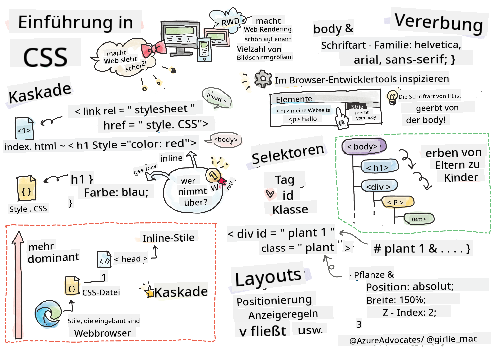
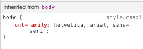

<!--
CO_OP_TRANSLATOR_METADATA:
{
  "original_hash": "acb5ae00cde004304296bb97da8ff4c3",
  "translation_date": "2025-08-29T14:15:18+00:00",
  "source_file": "3-terrarium/2-intro-to-css/README.md",
  "language_code": "de"
}
-->
# Terrarium-Projekt Teil 2: Einführung in CSS


> Sketchnote von [Tomomi Imura](https://twitter.com/girlie_mac)

## Quiz vor der Vorlesung

[Quiz vor der Vorlesung](https://ff-quizzes.netlify.app/web/quiz/17)

### Einführung

CSS, oder Cascading Style Sheets, löst ein wichtiges Problem der Webentwicklung: Wie man eine Website ansprechend gestaltet. Das Styling deiner Apps macht sie benutzerfreundlicher und optisch ansprechender; außerdem kannst du mit CSS ein Responsive Web Design (RWD) erstellen – so sehen deine Apps auf jedem Bildschirm gut aus, unabhängig von der Größe. CSS ist nicht nur dafür da, deine App schön aussehen zu lassen; die Spezifikation umfasst auch Animationen und Transformationen, die komplexe Interaktionen für deine Apps ermöglichen können. Die CSS-Arbeitsgruppe hilft dabei, aktuelle CSS-Spezifikationen zu pflegen; du kannst ihre Arbeit auf der [Website des World Wide Web Consortiums](https://www.w3.org/Style/CSS/members) verfolgen.

> Hinweis: CSS ist eine Sprache, die sich wie alles im Web weiterentwickelt, und nicht alle Browser unterstützen neuere Teile der Spezifikation. Überprüfe deine Implementierungen immer auf [CanIUse.com](https://caniuse.com).

In dieser Lektion werden wir unserem Online-Terrarium Styles hinzufügen und mehr über verschiedene CSS-Konzepte lernen: die Kaskade, Vererbung, die Verwendung von Selektoren, Positionierung und die Nutzung von CSS für Layouts. Dabei werden wir das Terrarium layouten und das eigentliche Terrarium erstellen.

### Voraussetzung

Du solltest das HTML für dein Terrarium erstellt und bereit zum Stylen haben.

> Schau dir das Video an

> 
> [](https://www.youtube.com/watch?v=6yIdOIV9p1I)

### Aufgabe

Erstelle in deinem Terrarium-Ordner eine neue Datei namens `style.css`. Importiere diese Datei im `<head>`-Bereich:

```html
<link rel="stylesheet" href="./style.css" />
```

---

## Die Kaskade

Cascading Style Sheets beinhalten die Idee, dass Styles „kaskadieren“, sodass die Anwendung eines Styles durch seine Priorität gesteuert wird. Styles, die von einem Website-Autor festgelegt werden, haben Vorrang vor denen, die von einem Browser festgelegt werden. Inline-Styles haben Vorrang vor denen, die in einem externen Stylesheet festgelegt sind.

### Aufgabe

Füge deinem `<h1>`-Tag den Inline-Style „color: red“ hinzu:

```HTML
<h1 style="color: red">My Terrarium</h1>
```

Füge dann den folgenden Code zu deiner `style.css`-Datei hinzu:

```CSS
h1 {
 color: blue;
}
```

✅ Welche Farbe wird in deiner Web-App angezeigt? Warum? Kannst du eine Möglichkeit finden, Styles zu überschreiben? Wann würdest du das tun oder warum nicht?

---

## Vererbung

Styles werden von einem übergeordneten Element an ein untergeordnetes Element vererbt, sodass verschachtelte Elemente die Styles ihrer Eltern übernehmen.

### Aufgabe

Setze die Schriftart des Body auf eine bestimmte Schriftart und überprüfe die Schriftart eines verschachtelten Elements:

```CSS
body {
	font-family: helvetica, arial, sans-serif;
}
```

Öffne die Konsole deines Browsers im Tab „Elemente“ und beobachte die Schriftart des H1. Es erbt seine Schriftart vom Body, wie im Browser angegeben:



✅ Kannst du einen verschachtelten Style dazu bringen, eine andere Eigenschaft zu erben?

---

## CSS-Selektoren

### Tags

Bisher hat deine `style.css`-Datei nur wenige Tags gestylt, und die App sieht ziemlich seltsam aus:

```CSS
body {
	font-family: helvetica, arial, sans-serif;
}

h1 {
	color: #3a241d;
	text-align: center;
}
```

Diese Art, ein Tag zu stylen, gibt dir Kontrolle über einzigartige Elemente, aber du musst die Styles vieler Pflanzen in deinem Terrarium kontrollieren. Dafür musst du CSS-Selektoren nutzen.

### IDs

Füge etwas Style hinzu, um die linken und rechten Container zu layouten. Da es nur einen linken und einen rechten Container gibt, erhalten sie IDs im Markup. Um sie zu stylen, verwende `#`:

```CSS
#left-container {
	background-color: #eee;
	width: 15%;
	left: 0px;
	top: 0px;
	position: absolute;
	height: 100%;
	padding: 10px;
}

#right-container {
	background-color: #eee;
	width: 15%;
	right: 0px;
	top: 0px;
	position: absolute;
	height: 100%;
	padding: 10px;
}
```

Hier hast du diese Container mit absoluter Positionierung ganz links und rechts auf dem Bildschirm platziert und Prozentsätze für ihre Breite verwendet, damit sie auch auf kleinen mobilen Bildschirmen skalieren können.

✅ Dieser Code ist ziemlich wiederholt und somit nicht „DRY“ (Don't Repeat Yourself); kannst du eine bessere Möglichkeit finden, diese IDs zu stylen, vielleicht mit einer ID und einer Klasse? Du müsstest das Markup ändern und das CSS refaktorisieren:

```html
<div id="left-container" class="container"></div>
```

### Klassen

Im obigen Beispiel hast du zwei einzigartige Elemente auf dem Bildschirm gestylt. Wenn du möchtest, dass Styles auf viele Elemente auf dem Bildschirm angewendet werden, kannst du CSS-Klassen verwenden. Mach das, um die Pflanzen in den linken und rechten Containern zu layouten.

Beachte, dass jede Pflanze im HTML-Markup eine Kombination aus IDs und Klassen hat. Die IDs werden hier von dem JavaScript verwendet, das du später hinzufügen wirst, um die Platzierung der Terrariumpflanzen zu manipulieren. Die Klassen hingegen geben allen Pflanzen einen bestimmten Style.

```html
<div class="plant-holder">
	
</div>
```

Füge den folgenden Code zu deiner `style.css`-Datei hinzu:

```CSS
.plant-holder {
	position: relative;
	height: 13%;
	left: -10px;
}

.plant {
	position: absolute;
	max-width: 150%;
	max-height: 150%;
	z-index: 2;
}
```

Bemerkenswert in diesem Ausschnitt ist die Mischung aus relativer und absoluter Positionierung, die wir im nächsten Abschnitt behandeln werden. Schau dir an, wie die Höhen durch Prozentsätze gehandhabt werden:

Du setzt die Höhe des Pflanzenhalters auf 13 %, eine gute Zahl, um sicherzustellen, dass alle Pflanzen in jedem vertikalen Container angezeigt werden, ohne dass gescrollt werden muss.

Du verschiebst den Pflanzenhalter nach links, damit die Pflanzen besser in ihrem Container zentriert sind. Die Bilder haben einen großen transparenten Hintergrund, um sie besser verschiebbar zu machen, und müssen nach links verschoben werden, um besser auf den Bildschirm zu passen.

Dann erhält die Pflanze selbst eine maximale Breite von 150 %. Dadurch kann sie sich verkleinern, wenn der Browser verkleinert wird. Probiere aus, deinen Browser zu verkleinern; die Pflanzen bleiben in ihren Containern, passen sich aber der Größe an.

Ebenfalls bemerkenswert ist die Verwendung von z-index, das die relative Höhe eines Elements steuert (damit die Pflanzen auf dem Container sitzen und so aussehen, als ob sie im Terrarium sitzen).

✅ Warum brauchst du sowohl einen Pflanzenhalter- als auch einen Pflanzen-CSS-Selektor?

## CSS-Positionierung

Das Mischen von Positions-Eigenschaften (es gibt statische, relative, feste, absolute und klebrige Positionen) kann etwas knifflig sein, aber wenn es richtig gemacht wird, gibt es dir gute Kontrolle über die Elemente auf deinen Seiten.

Absolut positionierte Elemente werden relativ zu ihren nächstgelegenen positionierten Vorfahren positioniert, und wenn es keine gibt, werden sie relativ zum Dokumentkörper positioniert.

Relativ positionierte Elemente werden basierend auf den CSS-Anweisungen positioniert, um ihre Platzierung von ihrer ursprünglichen Position weg anzupassen.

In unserem Beispiel ist der `plant-holder` ein relativ positioniertes Element, das innerhalb eines absolut positionierten Containers positioniert ist. Das resultierende Verhalten ist, dass die Seitenleisten-Container links und rechts fixiert sind und der Pflanzenhalter verschachtelt ist, sich innerhalb der Seitenleisten anpasst und Platz für die Pflanzen schafft, die in einer vertikalen Reihe platziert werden.

> Die `plant` selbst hat ebenfalls eine absolute Positionierung, die notwendig ist, um sie verschiebbar zu machen, wie du in der nächsten Lektion entdecken wirst.

✅ Experimentiere damit, die Positionierungsarten der Seitencontainer und des Pflanzenhalters zu wechseln. Was passiert?

## CSS-Layouts

Jetzt wirst du das Gelernte nutzen, um das Terrarium selbst zu erstellen, alles mit CSS!

Style zuerst die `.terrarium`-div-Kinder als abgerundetes Rechteck mit CSS:

```CSS
.jar-walls {
	height: 80%;
	width: 60%;
	background: #d1e1df;
	border-radius: 1rem;
	position: absolute;
	bottom: 0.5%;
	left: 20%;
	opacity: 0.5;
	z-index: 1;
}

.jar-top {
	width: 50%;
	height: 5%;
	background: #d1e1df;
	position: absolute;
	bottom: 80.5%;
	left: 25%;
	opacity: 0.7;
	z-index: 1;
}

.jar-bottom {
	width: 50%;
	height: 1%;
	background: #d1e1df;
	position: absolute;
	bottom: 0%;
	left: 25%;
	opacity: 0.7;
}

.dirt {
	width: 60%;
	height: 5%;
	background: #3a241d;
	position: absolute;
	border-radius: 0 0 1rem 1rem;
	bottom: 1%;
	left: 20%;
	opacity: 0.7;
	z-index: -1;
}
```

Beachte die Verwendung von Prozentsätzen hier. Wenn du deinen Browser verkleinerst, kannst du sehen, wie sich das Glas ebenfalls verkleinert. Beachte auch die Breiten- und Höhenprozentsätze für die Glaselemente und wie jedes Element absolut in der Mitte positioniert ist, am unteren Rand des Viewports fixiert.

Wir verwenden auch `rem` für die border-radius, eine schriftbezogene Länge. Lies mehr über diese Art der relativen Messung in der [CSS-Spezifikation](https://www.w3.org/TR/css-values-3/#font-relative-lengths).

✅ Versuche, die Farben und die Opazität des Glases im Vergleich zu denen der Erde zu ändern. Was passiert? Warum?

---

## 🚀 Herausforderung

Füge einen „Blasen“-Glanz in den unteren linken Bereich des Glases hinzu, um es glasähnlicher aussehen zu lassen. Du wirst die `.jar-glossy-long` und `.jar-glossy-short` stylen, um wie ein reflektierter Glanz auszusehen. So würde es aussehen:


Um das Quiz nach der Vorlesung abzuschließen, gehe durch dieses Lernmodul: [Style your HTML app with CSS](https://docs.microsoft.com/learn/modules/build-simple-website/4-css-basics/?WT.mc_id=academic-77807-sagibbon)

## Quiz nach der Vorlesung

[Quiz nach der Vorlesung](https://ff-quizzes.netlify.app/web/quiz/18)

## Überprüfung & Selbststudium

CSS scheint täuschend einfach zu sein, aber es gibt viele Herausforderungen, wenn man versucht, eine App perfekt für alle Browser und Bildschirmgrößen zu stylen. CSS-Grid und Flexbox sind Werkzeuge, die entwickelt wurden, um die Aufgabe etwas strukturierter und zuverlässiger zu machen. Lerne diese Werkzeuge kennen, indem du [Flexbox Froggy](https://flexboxfroggy.com/) und [Grid Garden](https://codepip.com/games/grid-garden/) spielst.

## Aufgabe

[CSS Refactoring](assignment.md)

---

**Haftungsausschluss**:  
Dieses Dokument wurde mithilfe des KI-Übersetzungsdienstes [Co-op Translator](https://github.com/Azure/co-op-translator) übersetzt. Obwohl wir uns um Genauigkeit bemühen, weisen wir darauf hin, dass automatisierte Übersetzungen Fehler oder Ungenauigkeiten enthalten können. Das Originaldokument in seiner ursprünglichen Sprache sollte als maßgebliche Quelle betrachtet werden. Für kritische Informationen wird eine professionelle menschliche Übersetzung empfohlen. Wir übernehmen keine Haftung für Missverständnisse oder Fehlinterpretationen, die aus der Nutzung dieser Übersetzung entstehen.