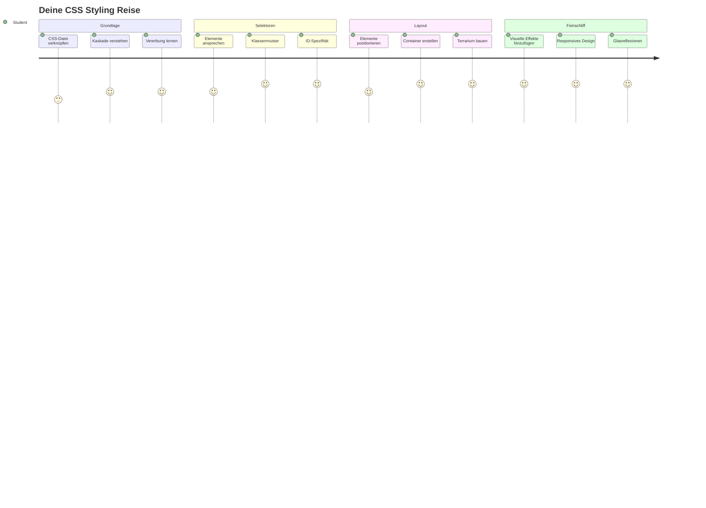
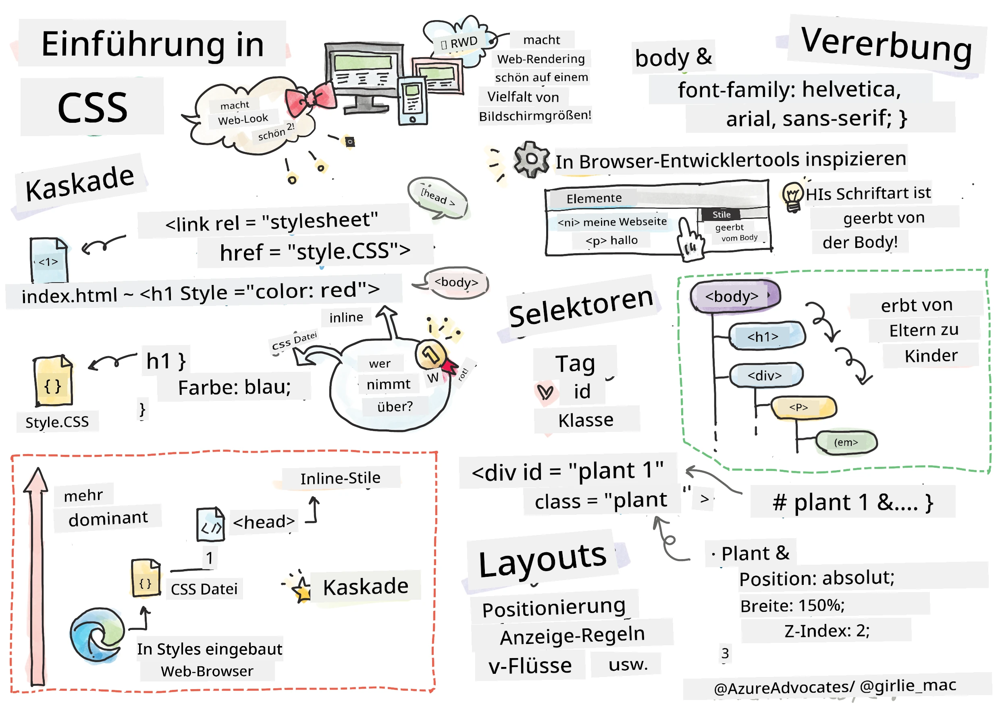
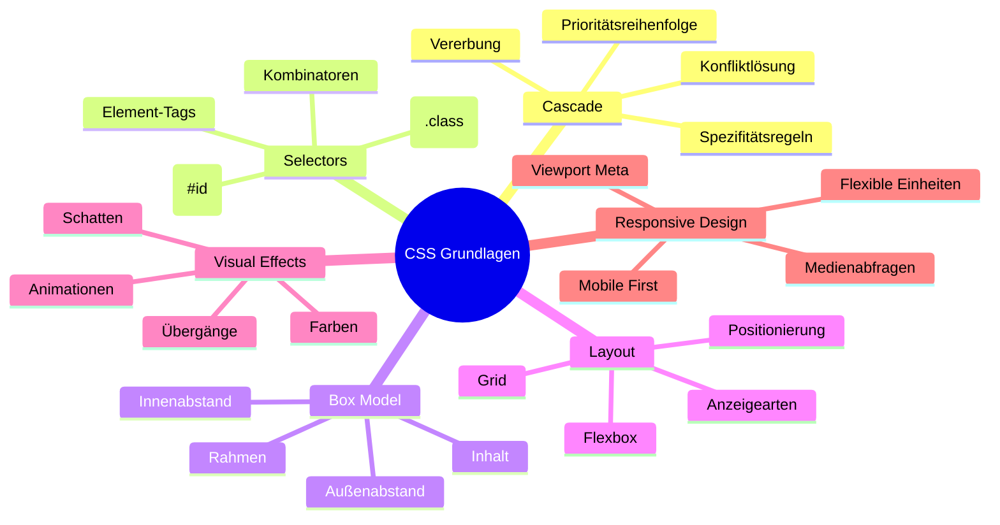
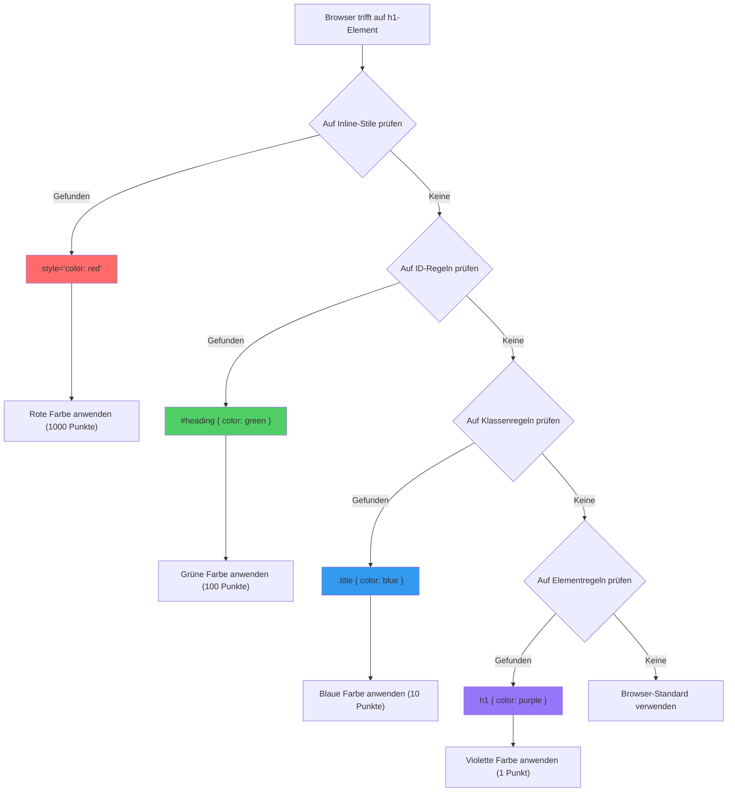
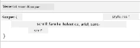
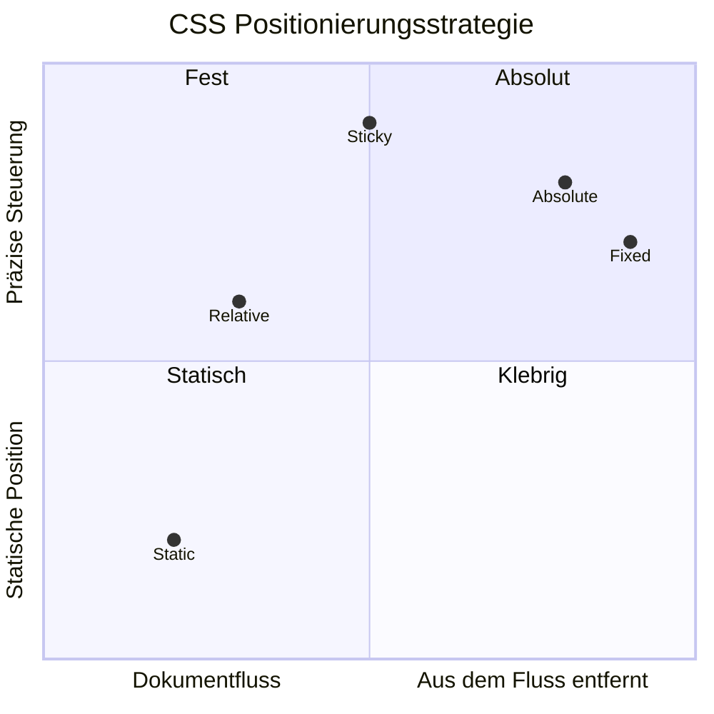
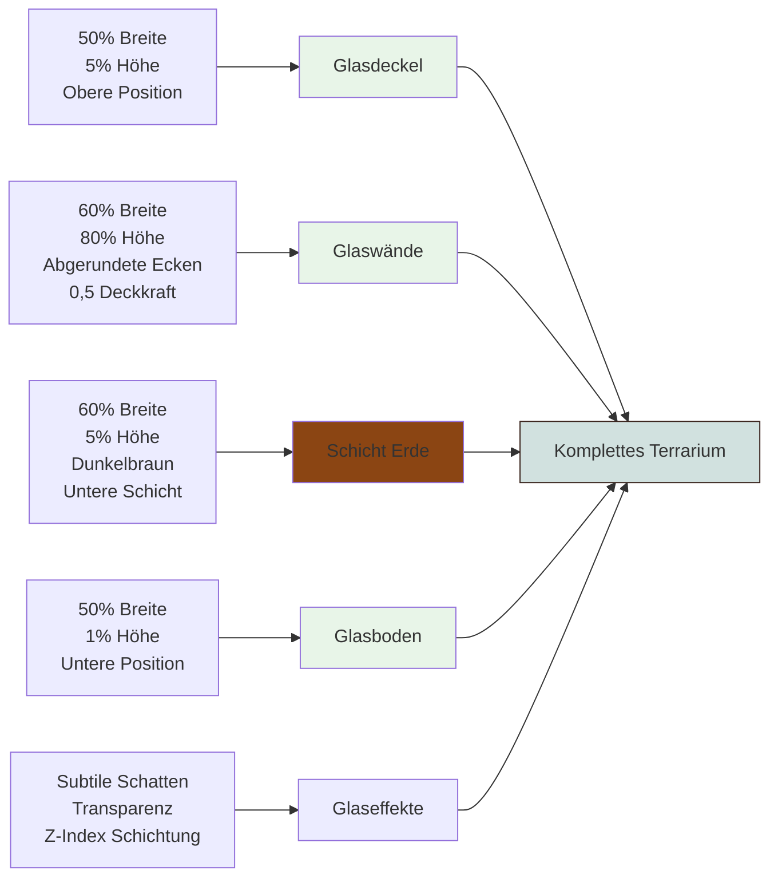
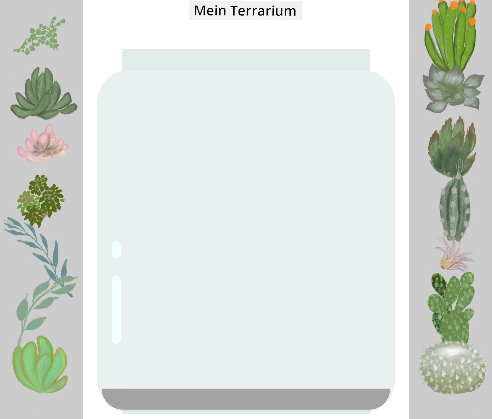
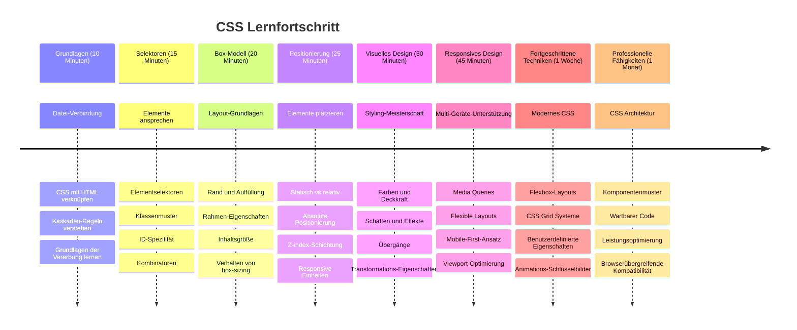

<!--
CO_OP_TRANSLATOR_METADATA:
{
  "original_hash": "e39f3a4e3bcccf94639e3af1248f8a4d",
  "translation_date": "2026-01-06T09:17:42+00:00",
  "source_file": "3-terrarium/2-intro-to-css/README.md",
  "language_code": "de"
}
-->
# Terrarium-Projekt Teil 2: Einführung in CSS



> Sketchnote von [Tomomi Imura](https://twitter.com/girlie_mac)

Erinnere dich daran, wie dein HTML-Terrarium ziemlich einfach aussah? CSS ist der Bereich, in dem wir diese schlichte Struktur in etwas Visuell Ansprechendes verwandeln.

Wenn HTML wie das Bauen des Rahmens eines Hauses ist, dann ist CSS all das, was dafür sorgt, dass es sich wie ein Zuhause anfühlt – die Farben der Wände, die Anordnung der Möbel, die Beleuchtung und wie die Räume zusammenfließen. Denk daran, wie das Schloss von Versailles als einfache Jagdhütte begann, aber durch sorgfältige Beachtung von Dekoration und Layout zu einem der prächtigsten Gebäude der Welt wurde.

Heute verwandeln wir dein Terrarium von funktional zu ansprechend. Du wirst lernen, wie man Elemente präzise positioniert, Layouts an verschiedene Bildschirmgrößen anpasst und die visuelle Attraktivität schafft, die Websites spannend macht.

Am Ende dieser Lektion wirst du sehen, wie strategisches CSS-Styling dein Projekt drastisch verbessern kann. Lass uns deinem Terrarium etwas Stil hinzufügen.


## Vorlesungsquiz

[Vorlesungsquiz](https://ff-quizzes.netlify.app/web/quiz/17)

## Einstieg in CSS

CSS wird oft nur als „Dinge hübsch machen“ betrachtet, dient aber einem viel größeren Zweck. CSS ist wie der Regisseur eines Films – du kontrollierst nicht nur, wie alles aussieht, sondern auch, wie es sich bewegt, auf Interaktionen reagiert und sich an verschiedene Situationen anpasst.

Modernes CSS ist erstaunlich leistungsfähig. Du kannst Code schreiben, der Layouts automatisch für Telefone, Tablets und Desktop-Computer anpasst. Du kannst flüssige Animationen erstellen, die die Aufmerksamkeit der Benutzer gezielt lenken. Die Ergebnisse können sehr beeindruckend sein, wenn alles zusammenpasst.

> 💡 **Profi-Tipp**: CSS entwickelt sich ständig weiter mit neuen Features und Möglichkeiten. Überprüfe immer [CanIUse.com](https://caniuse.com), um die Browser-Unterstützung für neuere CSS-Features zu prüfen, bevor du sie in Produktionsprojekten einsetzt.

**Das werden wir in dieser Lektion erreichen:**
- **Erstellen** ein komplettes visuelles Design für dein Terrarium mit modernen CSS-Techniken
- **Erforschen** grundlegende Konzepte wie Kaskade, Vererbung und CSS-Selektoren
- **Implementieren** responsive Positionierungs- und Layoutstrategien
- **Bauen** den Terrarium-Container mit CSS-Formen und -Styling

### Voraussetzungen

Du solltest die HTML-Struktur deines Terrariums aus der vorherigen Lektion abgeschlossen haben und bereit sein, sie zu stylen.

> 📺 **Video-Ressource**: Schau dir dieses hilfreiche Video-Tutorial an
>
> [](https://www.youtube.com/watch?v=6yIdOIV9p1I)

### Einrichtung deiner CSS-Datei

Bevor wir mit dem Styling beginnen können, müssen wir CSS mit unserem HTML verbinden. Diese Verbindung sagt dem Browser, wo er die Style-Anweisungen für unser Terrarium findet.

Erstelle in deinem Terrarium-Ordner eine neue Datei namens `style.css` und verlinke sie dann im `<head>`-Bereich deines HTML-Dokuments:

```html
<link rel="stylesheet" href="./style.css" />
```

**Das macht dieser Code:**
- **Erstellt** eine Verbindung zwischen deiner HTML- und CSS-Datei
- **Sagt** dem Browser, die Styles aus `style.css` zu laden und anzuwenden
- **Verwendet** das Attribut `rel="stylesheet"`, um anzugeben, dass es sich um eine CSS-Datei handelt
- **Referenziert** den Dateipfad mit `href="./style.css"`

## Das Verständnis der CSS-Kaskade

Hast du dich schon mal gefragt, warum CSS „Cascading Style Sheets“ heißt? Styles fließen wie ein Wasserfall nach unten, und manchmal widersprechen sie sich.

Denk an militärische Befehlshierarchien – ein Generalbefehl könnte sagen „alle Truppen tragen grün“, aber ein spezieller Befehl für deine Einheit lautet „tragt für die Zeremonie Blaumäntel“. Die genauere Anweisung hat Vorrang. CSS folgt einer ähnlichen Logik, und das Verständnis dieser Hierarchie erleichtert das Debugging erheblich.

### Experiment mit der Kaskaden-Priorität

Lass uns die Kaskade in Aktion sehen, indem wir einen Stilkonflikt erzeugen. Füge zuerst einen Inline-Stil zu deinem `<h1>`-Tag hinzu:

```html
<h1 style="color: red">My Terrarium</h1>
```

**Das macht dieser Code:**
- **Wendet** eine rote Farbe direkt auf das `<h1>`-Element mit Inline-Stil an
- **Verwendet** das `style`-Attribut, um CSS direkt im HTML einzubetten
- **Erstellt** die höchstmögliche Priorität für diese spezifische Elementregel

Füge anschließend diese Regel zu deiner Datei `style.css` hinzu:

```css
h1 {
  color: blue;
}
```

**Oben haben wir:**
- **Definiert** eine CSS-Regel, die alle `<h1>`-Elemente anspricht
- **Setzt** die Textfarbe mit einem externen Stylesheet auf Blau
- **Erstellt** eine Regel mit niedrigerer Priorität im Vergleich zu Inline-Stilen

✅ **Wissenscheck**: Welche Farbe wird in deiner Web-App angezeigt? Warum gewinnt diese Farbe? Kannst du dir Situationen vorstellen, in denen du Stile überschreiben möchtest?


> 💡 **Prioritätsreihenfolge in CSS (von höchster zu niedrigster):**
> 1. **Inline-Stile** (style-Attribut)
> 2. **IDs** (#myId)
> 3. **Klassen** (.myClass) und Attribute
> 4. **Element-Selektoren** (h1, div, p)
> 5. **Browser-Standards**

## CSS-Vererbung in Aktion

CSS-Vererbung funktioniert wie Genetik – Elemente erben bestimmte Eigenschaften von ihren Elternelementen. Wenn du die Schriftfamilie auf dem Body-Element setzt, verwenden alle darin enthaltenen Texte automatisch dieselbe Schriftart. Das ist ähnlich wie beim markanten Kinn der Habsburger, das über Generationen geklärt weitergegeben wurde, ohne für jede einzelne Person explizit definiert zu werden.

Aber nicht alles wird vererbt. Textstile wie Schriftarten und Farben werden vererbt, aber Layout-Eigenschaften wie Abstände und Rahmen nicht. So wie Kinder körperliche Merkmale erben können, aber nicht die Modevorlieben ihrer Eltern.

### Beobachtung der Schriftvererbung

Lass uns die Vererbung in Aktion sehen, indem wir eine Schriftfamilie auf dem `<body>`-Element festlegen:

```css
body {
  font-family: 'Segoe UI', Tahoma, Geneva, Verdana, sans-serif;
}
```

**Was hier passiert:**
- **Setzt** die Schriftfamilie für die gesamte Seite, indem es das `<body>`-Element auswählt
- **Verwendet** einen Font-Stack mit Fallback-Optionen für bessere Browser-Kompatibilität
- **Wendet** moderne Systemschriften an, die auf verschiedenen Betriebssystemen gut aussehen
- **Sorgt** dafür, dass alle Kindelemente diese Schriftart erben, sofern sie nicht speziell überschrieben werden

Öffne die Entwickler-Tools deines Browsers (F12), gehe zum Tab „Elemente“ und inspiziere dein `<h1>`-Element. Du wirst sehen, dass es die Schriftfamilie vom Body erbt:



✅ **Experimentierzeit**: Versuche andere vererbbare Eigenschaften auf dem `<body>` wie `color`, `line-height` oder `text-align` zu setzen. Was passiert mit deiner Überschrift und anderen Elementen?

> 📝 **Vererbbare Eigenschaften sind z.B.:** `color`, `font-family`, `font-size`, `line-height`, `text-align`, `visibility`
>
> **Nicht vererbbare Eigenschaften sind z.B.:** `margin`, `padding`, `border`, `width`, `height`, `position`

### 🔄 **Pädagogische Kontrolle**
**CSS-Grundlagen verstehen**: Bevor wir zu Selektoren wechseln, solltest du in der Lage sein:
- ✅ Den Unterschied zwischen Kaskade und Vererbung zu erklären
- ✅ Vorherzusagen, welcher Stil bei einem Spezifitätskonflikt gewinnt
- ✅ Zu erkennen, welche Eigenschaften von Elternelementen vererbt werden
- ✅ CSS-Dateien korrekt mit HTML zu verbinden

**Kurzer Test**: Wenn du diese Stile hast, welche Farbe bekommt ein `<h1>` innerhalb eines `<div class="special">`?
```css
div { color: blue; }
.special { color: green; }
h1 { color: red; }
```
*Antwort: Rot (Elementselektor zielt direkt auf h1 ab)*

## CSS-Selektoren meistern

CSS-Selektoren sind dein Werkzeug, um bestimmte Elemente gezielt zu stylen. Sie funktionieren wie genaue Wegbeschreibungen – statt „das Haus“ zu sagen, sagst du „das blaue Haus mit der roten Tür in der Ahornstraße“.

CSS bietet verschiedene Wege, spezifisch zu sein, und den passenden Selektor auszuwählen ist wie das richtige Werkzeug für die Aufgabe zu wählen. Manchmal willst du jede Tür in der Nachbarschaft stylen, manchmal nur eine ganz bestimmte.

### Element-Selektoren (Tags)

Element-Selektoren sprechen HTML-Elemente über ihren Tag-Namen an. Sie sind perfekt, um Basis-Styles zu setzen, die allgemein auf deiner Seite gelten:

```css
body {
  font-family: 'Segoe UI', Tahoma, Geneva, Verdana, sans-serif;
  margin: 0;
  padding: 0;
}

h1 {
  color: #3a241d;
  text-align: center;
  font-size: 2.5rem;
  margin-bottom: 1rem;
}
```

**Was diese Styles bewirken:**
- **Setzt** konsistente Typografie auf der gesamten Seite mit dem `body`-Selektor
- **Entfernt** Standard-Margen und -Padding der Browser für bessere Kontrolle
- **Stylt** alle Überschriften mit Farbe, Ausrichtung und Abstand
- **Verwendet** `rem`-Einheiten für skalierbare, zugängliche Font-Größen

Während Element-Selektoren gut für allgemeines Styling sind, werden spezifischere Selektoren nötig, um einzelne Komponenten wie die Pflanzen in deinem Terrarium zu stylen.

### ID-Selektoren für einzelne Elemente

ID-Selektoren benutzen das `#`-Symbol und zielen auf Elemente mit eindeutigen `id`-Attributen ab. Da IDs auf einer Seite einzigartig sein müssen, eignen sie sich perfekt, um einzelne, spezielle Elemente wie unsere linke und rechte Pflanzenbox zu stylen.

Lass uns das Styling für die Seitencontainer unseres Terrariums erstellen, in denen die Pflanzen leben werden:

```css
#left-container {
  background-color: #f5f5f5;
  width: 15%;
  left: 0;
  top: 0;
  position: absolute;
  height: 100vh;
  padding: 1rem;
  box-sizing: border-box;
}

#right-container {
  background-color: #f5f5f5;
  width: 15%;
  right: 0;
  top: 0;
  position: absolute;
  height: 100vh;
  padding: 1rem;
  box-sizing: border-box;
}
```

**Das erreicht dieser Code:**
- **Positioniert** Container ganz links und rechts am Rand mit `absolute` Positionierung
- **Verwendet** `vh` (Viewport-Höhe) Einheiten für eine responsive Höhe, die sich an die Bildschirmgröße anpasst
- **Setzt** `box-sizing: border-box`, damit Padding in der Gesamtbreite mitgerechnet wird
- **Entfernt** unnötige `px`-Einheiten bei Nullwerten für saubereren Code
- **Legt** eine dezente Hintergrundfarbe fest, die angenehmer als grelles Grau ist

✅ **Code-Qualitäts-Herausforderung**: Achte darauf, dass dieses CSS das DRY-Prinzip (Don't Repeat Yourself) verletzt. Kannst du es mit einer Kombination aus ID und Klasse refaktorieren?

**Verbesserter Ansatz:**
```html
<div id="left-container" class="container"></div>
<div id="right-container" class="container"></div>
```

```css
.container {
  background-color: #f5f5f5;
  width: 15%;
  top: 0;
  position: absolute;
  height: 100vh;
  padding: 1rem;
  box-sizing: border-box;
}

#left-container {
  left: 0;
}

#right-container {
  right: 0;
}
```

### Klassen-Selektoren für wiederverwendbare Styles

Klassen-Selektoren benutzen das `.`-Symbol und sind perfekt, wenn du die gleichen Styles auf mehrere Elemente anwenden willst. Im Gegensatz zu IDs sind Klassen mehrfach verwendbar, was sie ideal für konsistente Styling-Muster macht.

In unserem Terrarium braucht jede Pflanze ein ähnliches Styling, aber auch individuelle Positionierung. Wir verwenden eine Kombination aus Klassen für gemeinsame Styles und IDs für die einzigartige Platzierung.

**Hier ist die HTML-Struktur für jede Pflanze:**
```html
<div class="plant-holder">
  
</div>
```

**Wichtige Elemente erklärt:**
- **Verwendet** `class="plant-holder"` für einheitliches Container-Styling aller Pflanzen
- **Setzt** `class="plant"` für gemeinsames Bild-Styling und Verhalten
- **Enthält** eindeutige `id="plant1"` für individuelle Positionierung und JavaScript-Interaktion
- **Bietet** beschreibenden Alt-Text für Screenreader-Zugänglichkeit

Füge nun diese Styles zu deiner `style.css`-Datei hinzu:

```css
.plant-holder {
  position: relative;
  height: 13%;
  left: -0.6rem;
}

.plant {
  position: absolute;
  max-width: 150%;
  max-height: 150%;
  z-index: 2;
  transition: transform 0.3s ease;
}

.plant:hover {
  transform: scale(1.05);
}
```

**Analyse dieser Styles:**
- **Erstellt** relative Positionierung für den Pflanzenhalter, um einen Positionskontext zu etablieren
- **Setzt** jeden Pflanzenhalter auf 13% Höhe, damit alle Pflanzen vertikal ohne Scrollen passen
- **Verschiebt** die Halter leicht nach links, um die Pflanzen besser im Container zu zentrieren
- **Erlaubt** das responsive Skalieren der Pflanzen mit `max-width` und `max-height`
- **Verwendet** `z-index`, um Pflanzen über anderen Elementen im Terrarium zu platzieren
- **Fügt** einen dezenten Hover-Effekt mit CSS-Übergängen für bessere Benutzerinteraktion hinzu

✅ **Kritisches Nachdenken**: Warum brauchen wir sowohl `.plant-holder` als auch `.plant`-Selektoren? Was würde passieren, wenn wir nur einen von beiden verwenden würden?

> 💡 **Designmuster**: Der Container (`.plant-holder`) steuert Layout und Positionierung, während der Inhalt (`.plant`) Aussehen und Skalierung steuert. Diese Trennung macht den Code wartbarer und flexibler.

## CSS-Positionierung verstehen

CSS-Positionierung ist wie der Regisseur einer Bühnenaufführung – du bestimmst, wo jeder Schauspieler steht und wie er sich auf der Bühne bewegt. Manche Schauspieler folgen dem Standardaufbau, andere benötigen spezielle Positionierungen für dramatische Effekte.

Wenn du Positionierung verstehst, werden viele Layout-Herausforderungen handhabbar. Brauchst du eine Navigationsleiste, die beim Scrollen am oberen Rand bleibt? Positionierung regelt das. Willst du ein Tooltip, das an einer bestimmten Stelle erscheint? Das ist auch Positionierung.

### Die fünf Positionswerte


| Positionswert | Verhalten | Anwendungsfall |
|---------------|-----------|----------------|
| `static` | Standardfluss, ignoriert top/left/right/bottom | Normales Dokument-Layout |
| `relative` | Positioniert relativ zu seiner normalen Position | Kleine Anpassungen, Schaffen eines Positionierungskontexts |
| `absolute` | Positioniert relativ zum nächsten positionierten Vorfahren | Präzise Platzierung, Überlagerungen |
| `fixed` | Positioniert relativ zum Viewport | Navigationsleisten, schwebende Elemente |
| `sticky` | Wechselt je nach Scroll-Verhalten zwischen relativ und fixed | Kopfzeilen, die beim Scrollen kleben bleiben |

### Positionierung in unserem Terrarium

Unser Terrarium verwendet eine strategische Kombination von Positionierungsarten, um das gewünschte Layout zu schaffen:

```css
/* Container positioning */
.container {
  position: absolute; /* Removes from normal flow */
  /* ... other styles ... */
}

/* Plant holder positioning */
.plant-holder {
  position: relative; /* Creates positioning context */
  /* ... other styles ... */
}

/* Plant positioning */
.plant {
  position: absolute; /* Allows precise placement within holder */
  /* ... other styles ... */
}
```

**Die Positionierungsstrategie verstehen:**
- **Absolute Container** sind aus dem normalen Dokumentfluss entfernt und an Bildschirmrändern befestigt
- **Relative Pflanzenhalter** schaffen einen Positionskontext, bleiben aber im Dokumentfluss
- **Absolute Pflanzen** können innerhalb ihrer relativen Container präzise positioniert werden
- **Diese Kombination** erlaubt es, Pflanzen vertikal zu stapeln und trotzdem individuell zu positionieren

> 🎯 **Warum ist das wichtig?** Die `plant`-Elemente brauchen absolute Positionierung, um im nächsten Schritt per Drag & Drop verschiebbar zu sein. Absolute Positionierung nimmt sie aus dem normalen Layoutfluss heraus und ermöglicht so die Drag-and-Drop-Interaktionen.

✅ **Experimentierzeit**: Ändere die Positionswerte und beobachte die Ergebnisse:
- Was passiert, wenn du `.container` von `absolute` auf `relative` änderst?
- Wie ändert sich das Layout, wenn `.plant-holder` statt `relative` die Position `absolute` verwendet?
- Was passiert, wenn du die `.plant`-Positionierung auf `relative` umstellst?

### 🔄 **Pädagogischer Check-in**
**CSS-Positionierungsbeherrschung**: Halte inne und überprüfe dein Verständnis:
- ✅ Kannst du erklären, warum Pflanzen absolute Positionierung für Drag-and-Drop benötigen?
- ✅ Verstehst du, wie relative Container einen Positionierungskontext schaffen?
- ✅ Warum verwenden die Seitencontainer absolute Positionierung?
- ✅ Was würde passieren, wenn du Positionsdeklarationen komplett entfernen würdest?

**Realwelt-Verbindung**: Denke darüber nach, wie CSS-Positionierung die reale Layout-Welt widerspiegelt:
- **Static**: Bücher im Regal (natürliche Reihenfolge)
- **Relative**: Ein Buch leicht verschieben, aber an seinem Platz behalten
- **Absolute**: Ein Lesezeichen auf einer bestimmten Seite platzieren
- **Fixed**: Eine Haftnotiz, die beim Umblättern sichtbar bleibt

## Das Terrarium mit CSS bauen

Jetzt bauen wir ein Glasgefäß nur mit CSS – keine Bilder oder Grafiksoftware nötig.

Realistisch wirkendes Glas, Schatten und Tiefeneffekte mit Positionierung und Transparenz zu erzeugen, zeigt die visuellen Möglichkeiten von CSS. Diese Technik ähnelt, wie Architekten der Bauhaus-Bewegung einfache geometrische Formen nutzten, um komplexe, schöne Strukturen zu erschaffen. Sobald du diese Prinzipien verstehst, erkennst du die CSS-Techniken hinter vielen Webdesigns.


### Die Bestandteile des Glasgefäßes erstellen

Lass uns das Terrariumglas Stück für Stück bauen. Jeder Teil verwendet absolute Positionierung und prozentuale Größen für ein responsives Design:

```css
.jar-walls {
  height: 80%;
  width: 60%;
  background: #d1e1df;
  border-radius: 1rem;
  position: absolute;
  bottom: 0.5%;
  left: 20%;
  opacity: 0.5;
  z-index: 1;
  box-shadow: inset 0 0 2rem rgba(0, 0, 0, 0.1);
}

.jar-top {
  width: 50%;
  height: 5%;
  background: #d1e1df;
  position: absolute;
  bottom: 80.5%;
  left: 25%;
  opacity: 0.7;
  z-index: 1;
  border-radius: 0.5rem 0.5rem 0 0;
}

.jar-bottom {
  width: 50%;
  height: 1%;
  background: #d1e1df;
  position: absolute;
  bottom: 0;
  left: 25%;
  opacity: 0.7;
  border-radius: 0 0 0.5rem 0.5rem;
}

.dirt {
  width: 60%;
  height: 5%;
  background: #3a241d;
  position: absolute;
  border-radius: 0 0 1rem 1rem;
  bottom: 1%;
  left: 20%;
  opacity: 0.7;
  z-index: -1;
}
```

**Das Terrarium-Konstrukt verstehen:**
- **Verwendet** prozentuale Maße für responsive Skalierung auf allen Bildschirmgrößen
- **Positioniert** Elemente absolut, um sie exakt zu stapeln und auszurichten
- **Setzt** unterschiedliche Opazitätswerte ein, um den Glaseffekt zu erzeugen
- **Implementiert** `z-index` Schichtung, damit Pflanzen innerhalb des Glases erscheinen
- **Fügt** subtile Box-Schattierungen und elegante border-radius für realistischeres Aussehen hinzu

### Responsives Design mit Prozentangaben

Beachte, dass alle Maße in Prozent statt festen Pixelwerten angegeben sind:

**Warum das wichtig ist:**
- **Sorgt dafür**, dass das Terrarium auf jeder Bildschirmgröße proportional skaliert
- **Erhält** die visuellen Beziehungen zwischen den Glasbauteilen
- **Bietet** eine konsistente Darstellung von mobilen Geräten bis zu großen Monitoren
- **Ermöglicht**, dass sich das Design anpasst, ohne das Layout zu zerstören

### CSS-Einheiten in der Praxis

Wir verwenden `rem`-Einheiten für border-radius, die relativ zur Root-Schriftgröße skalieren. Das schafft zugänglichere Designs, die Benutzervorgaben für Schriftgrößen berücksichtigen. Erfahre mehr über [CSS-relative Einheiten](https://www.w3.org/TR/css-values-3/#font-relative-lengths) in der offiziellen Spezifikation.

✅ **Visuelles Experimentieren**: Probiere aus, diese Werte zu ändern und beobachte die Effekte:
- Ändere die Deckkraft des Glases von 0.5 auf 0.8 – wie beeinflusst das das Erscheinungsbild des Glases?
- Passe die Schmutzfarbe von `#3a241d` auf `#8B4513` an – welche optische Wirkung hat das?
- Verändere den `z-index` des Schmutzes auf 2 – was passiert mit der Schichtung?

### 🔄 **Pädagogischer Check-in**
**CSS-Visuelles Design verstehen**: Überprüfe dein Verständnis zum visuellen CSS:
- ✅ Wie erzeugen prozentuale Maße ein responsives Design?
- ✅ Warum erzeugt Opazität den Glaseffekt der Transparenz?
- ✅ Welche Rolle spielt der z-index bei der Schichtung von Elementen?
- ✅ Wie formen border-radius-Werte die Glasform?

**Designprinzipien**: Beachte, wie wir komplexe Visuals aus einfachen Formen aufbauen:
1. **Rechtecke** → **Abgerundete Rechtecke** → **Glasbauteile**
2. **Flächige Farben** → **Deckkraft** → **Glaseffekt**
3. **Einzelne Elemente** → **Geschichtete Komposition** → **3D-Eindruck**

---

## GitHub Copilot Agent Challenge 🚀

Nutze den Agent-Modus, um die folgende Challenge zu erfüllen:

**Beschreibung:** Erstelle eine CSS-Animation, die die Terrarienpflanzen sanft hin und her wiegen lässt und so einen natürlichen Windhauch simuliert. So übst du CSS-Animationen, Transformationen und Keyframes und verbesserst die visuelle Attraktivität deines Terrariums.

**Vorgabe:** Füge CSS-Keyframe-Animationen hinzu, damit die Pflanzen im Terrarium sanft von links nach rechts schwingen. Erstelle eine Schwing-Animation, die jede Pflanze leicht (2-3 Grad) links und rechts dreht, mit einer Dauer von 3-4 Sekunden. Wende sie auf die `.plant`-Klasse an. Stelle sicher, dass die Animation unendlich wiedergibt und eine Easing-Funktion für natürliche Bewegung hat.

Erfahre mehr über den [Agent-Modus](https://code.visualstudio.com/blogs/2025/02/24/introducing-copilot-agent-mode) hier.

## 🚀 Challenge: Glasreflexe hinzufügen

Bereit, dein Terrarium mit realistischen Glasreflexen aufzuwerten? Diese Technik verleiht dem Design Tiefe und Realismus.

Du erzeugst subtile Highlights, die simulieren, wie Licht auf Glasflächen reflektiert wird. Dieser Ansatz ähnelt Renaissance-Malern wie Jan van Eyck, die Licht und Reflexion nutzten, um gemaltes Glas dreidimensional wirken zu lassen. Hier ist dein Ziel:



**Deine Aufgabe:**
- **Erstelle** dezente weiße oder hellfarbige ovale Formen für die Glasreflexe
- **Positioniere** sie strategisch an der linken Seite des Glases
- **Wende** passende Opazitäts- und Unschärfeeffekte an für realistische Lichtreflexion
- **Nutze** `border-radius`, um organische, blasenähnliche Formen zu gestalten
- **Experimentiere** mit Farbverläufen oder Box-Shadows für erhöhten Realismus

## Quiz nach der Vorlesung

[Quiz nach Vorlesung](https://ff-quizzes.netlify.app/web/quiz/18)

## Erweitere dein CSS-Wissen

CSS kann anfangs komplex wirken, aber das Verständnis dieser Kernkonzepte legt eine solide Basis für fortgeschrittene Techniken.

**Deine nächsten CSS-Themen:**
- **Flexbox** – vereinfacht Ausrichtung und Verteilung von Elementen
- **CSS Grid** – bietet mächtige Werkzeuge für komplexe Layouts
- **CSS-Variablen** – verringern Wiederholungen und erhöhen Wartbarkeit
- **Responsives Design** – sorgt dafür, dass Websites auf allen Bildschirmgrößen funktionieren

### Interaktive Lernressourcen

Übe diese Konzepte mit spannenden, interaktiven Spielen:
- 🐸 [Flexbox Froggy](https://flexboxfroggy.com/) – Meistere Flexbox durch lustige Herausforderungen
- 🌱 [Grid Garden](https://codepip.com/games/grid-garden/) – Lerne CSS Grid, indem du virtuelle Möhren anbaust
- 🎯 [CSS Battle](https://cssbattle.dev/) – Teste deine CSS-Fähigkeiten mit Coding-Challenges

### Weiterführendes Lernen

Für umfassende CSS-Grundlagen absolviere dieses Microsoft Learn Modul: [Gestalte deine HTML-App mit CSS](https://docs.microsoft.com/learn/modules/build-simple-website/4-css-basics/?WT.mc_id=academic-77807-sagibbon)

### ⚡ **Was du in den nächsten 5 Minuten tun kannst**
- [ ] Öffne DevTools und inspiziere CSS-Stile auf jeder Website im Elements-Panel
- [ ] Erstelle eine einfache CSS-Datei und binde sie in eine HTML-Seite ein
- [ ] Probiere Farbänderungen mit verschiedenen Methoden: Hex, RGB und benannte Farben
- [ ] Übe das Box-Modell, indem du Padding und Margin zu einem div hinzufügst

### 🎯 **Was du in dieser Stunde erreichen kannst**
- [ ] Absolviere das Post-Lesson-Quiz und wiederhole CSS-Grundlagen
- [ ] Style deine HTML-Seite mit Schriftarten, Farben und Abständen
- [ ] Erstelle ein einfaches Layout mit Flexbox oder Grid
- [ ] Experimentiere mit CSS-Transitions für sanfte Effekte
- [ ] Übe responsives Design mit Media Queries

### 📅 **Dein einwöchiges CSS-Abenteuer**
- [ ] Erledige die Terrarium-Styling-Aufgabe mit kreativem Flair
- [ ] Meistere CSS Grid durch den Bau eines Fotogalerie-Layouts
- [ ] Lerne CSS-Animationen, um deine Designs lebendig zu machen
- [ ] Erkunde CSS-Präprozessoren wie Sass oder Less
- [ ] Studiere Designprinzipien und wende sie auf CSS an
- [ ] Analysiere und rekreiere interessante Designs, die du online findest

### 🌟 **Deine einmonatige Design-Meisterschaft**
- [ ] Baue ein komplettes responsives Website-Designsystem
- [ ] Lerne CSS-in-JS oder Utility-First-Frameworks wie Tailwind
- [ ] Trage zu Open-Source-Projekten mit CSS-Verbesserungen bei
- [ ] Meistere fortgeschrittene CSS-Konzepte wie Custom Properties und Containment
- [ ] Erstelle wiederverwendbare Komponentenbibliotheken mit modularen CSS
- [ ] Unterstütze andere beim CSS-Lernen und teile Designwissen

## 🎯 Deine CSS-Meisterschafts-Timeline


### 🛠️ Deine CSS-Werkzeug-Zusammenfassung

Nach Abschluss dieser Lektion hast du:
- **Verständnis des Kaskadierungssystems**: Wie Stile vererbt und überschrieben werden
- **Beherrschung von Selektoren**: Präzises Ansprechen von Elementen, Klassen und IDs
- **Positionierungsfähigkeiten**: Strategisches Platzieren und Schichten von Elementen
- **Visuelles Design**: Erzeugen von Glaseffekten, Schatten und Transparenz
- **Responsive Techniken**: Prozentbasierte Layouts, die sich an jeden Bildschirm anpassen
- **Code-Organisation**: Saubere, wartbare CSS-Struktur
- **Moderne Praktiken**: Einsatz relativer Einheiten und barrierefreier Designmuster

**Nächste Schritte**: Dein Terrarium hat jetzt Struktur (HTML) und Stil (CSS). Die Abschlusslektion fügt Interaktivität mit JavaScript hinzu!

## Aufgabe

[CSS Refactoring](assignment.md)

---

<!-- CO-OP TRANSLATOR DISCLAIMER START -->
**Haftungsausschluss**:  
Dieses Dokument wurde mit dem KI-Übersetzungsdienst [Co-op Translator](https://github.com/Azure/co-op-translator) übersetzt. Obwohl wir auf Genauigkeit achten, beachten Sie bitte, dass automatisierte Übersetzungen Fehler oder Ungenauigkeiten enthalten können. Das Originaldokument in der Ausgangssprache ist als maßgebliche Quelle zu betrachten. Für wichtige Informationen wird eine professionelle menschliche Übersetzung empfohlen. Wir übernehmen keine Haftung für Missverständnisse oder Fehlinterpretationen, die aus der Verwendung dieser Übersetzung entstehen.
<!-- CO-OP TRANSLATOR DISCLAIMER END -->