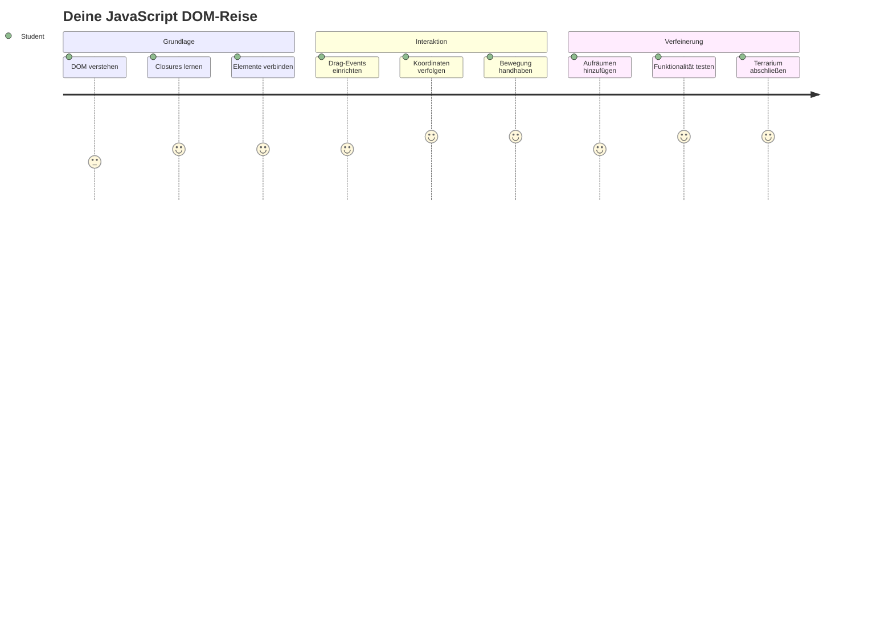
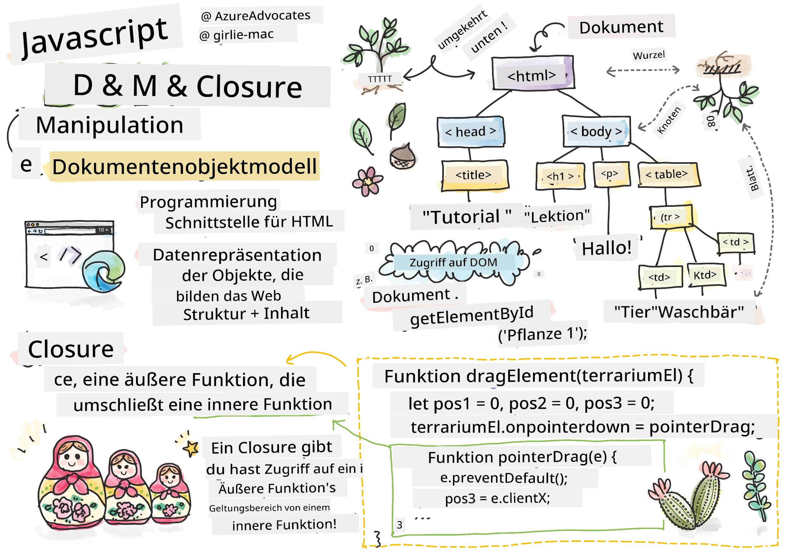
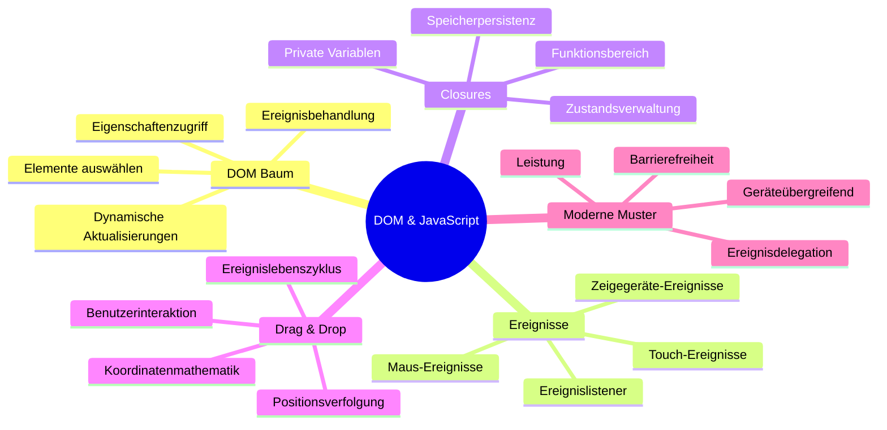
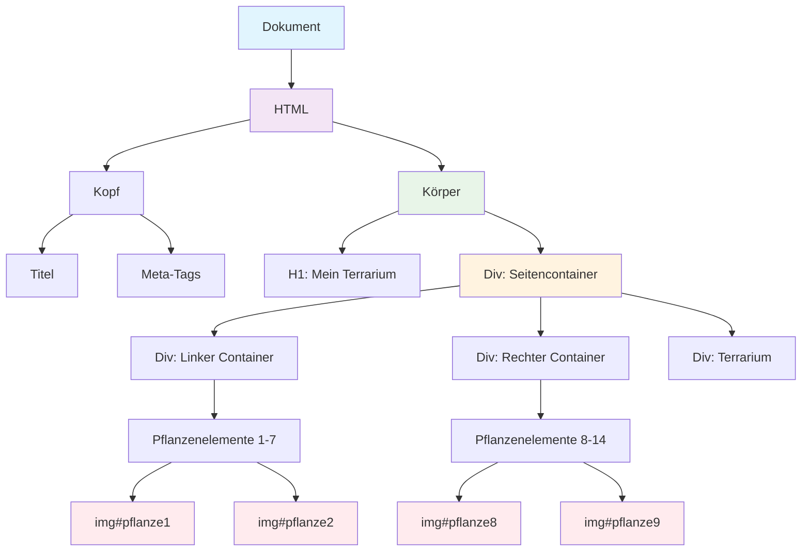
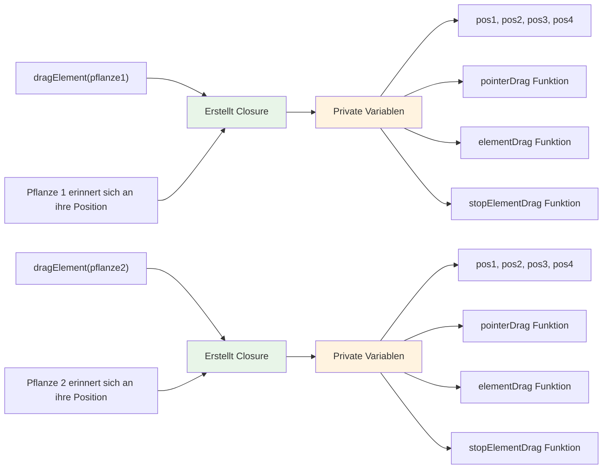
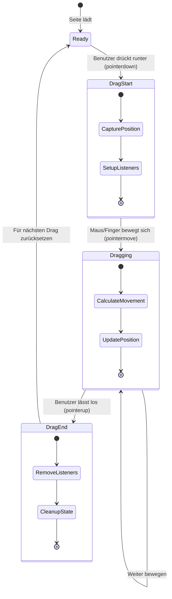
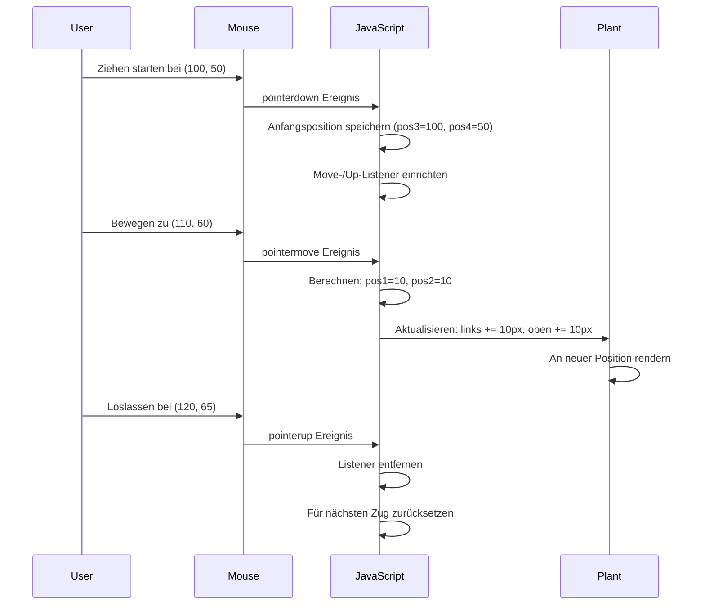
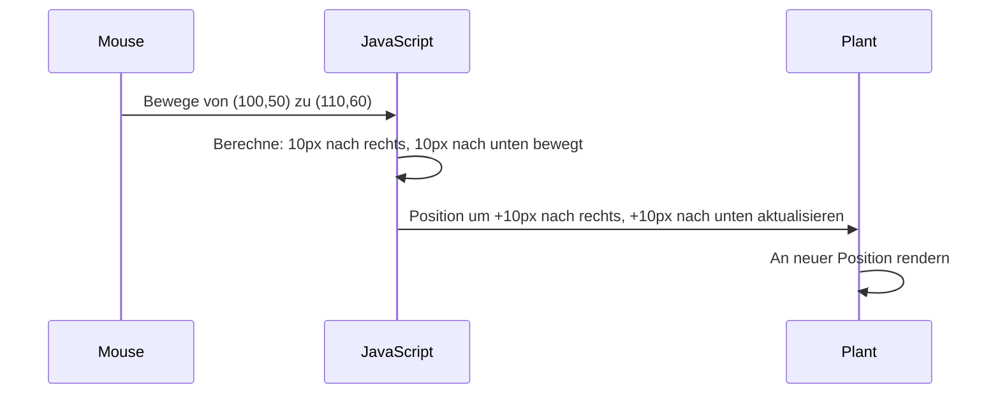
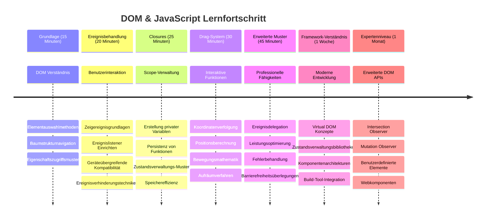

<!--
CO_OP_TRANSLATOR_METADATA:
{
  "original_hash": "973e48ad87d67bf5bb819746c9f8e302",
  "translation_date": "2026-01-06T09:14:48+00:00",
  "source_file": "3-terrarium/3-intro-to-DOM-and-closures/README.md",
  "language_code": "de"
}
-->
# Terrarium Projekt Teil 3: DOM-Manipulation und JavaScript Closures



> Sketchnote von [Tomomi Imura](https://twitter.com/girlie_mac)

Willkommen zu einem der faszinierendsten Aspekte der Webentwicklung – Dinge interaktiv zu machen! Das Document Object Model (DOM) ist wie eine Brücke zwischen deinem HTML und JavaScript, und heute werden wir es nutzen, um dein Terrarium zum Leben zu erwecken. Als Tim Berners-Lee den ersten Webbrowser entwickelte, stellte er sich ein Web vor, in dem Dokumente dynamisch und interaktiv sein könnten – das DOM macht diese Vision möglich.

Wir werden auch JavaScript-Closures erkunden, die zunächst einschüchternd klingen mögen. Stell dir Closures als „Gedächtnistaschen“ vor, in denen deine Funktionen wichtige Informationen behalten können. Es ist, als hätte jede Pflanze in deinem Terrarium ihre eigene Datenakte, um ihre Position zu verfolgen. Am Ende dieser Lektion wirst du verstehen, wie natürlich und nützlich sie sind.

Hier ist, was wir bauen: ein Terrarium, in dem Benutzer Pflanzen überall hinziehen und ablegen können, wo sie wollen. Du lernst die DOM-Manipulationstechniken, die alles antreiben, von Drag-and-Drop-Datei-Uploads bis hin zu interaktiven Spielen. Lass uns dein Terrarium zum Leben erwecken.


## Vor der Vorlesung: Quiz

[Vorder-Vorlesung-Quiz](https://ff-quizzes.netlify.app/web/quiz/19)

## Das DOM verstehen: Dein Tor zu interaktiven Webseiten

Das Document Object Model (DOM) ist die Art und Weise, wie JavaScript mit deinen HTML-Elementen kommuniziert. Wenn dein Browser eine HTML-Seite lädt, erstellt er eine strukturierte Darstellung dieser Seite im Speicher – das ist das DOM. Du kannst es dir wie einen Stammbaum vorstellen, bei dem jedes HTML-Element ein Familienmitglied ist, auf das JavaScript zugreifen, es ändern oder umordnen kann.

DOM-Manipulation verwandelt statische Seiten in interaktive Websites. Jedes Mal, wenn du siehst, wie sich ein Button bei Hover-Farbe ändert, Inhalte sich ohne Seitenaktualisierung aktualisieren oder Elemente, die du herumziehen kannst, ist das DOM-Manipulation in Aktion.




> Eine Darstellung des DOM und des HTML-Markups, das darauf verweist. Von [Olfa Nasraoui](https://www.researchgate.net/publication/221417012_Profile-Based_Focused_Crawler_for_Social_Media-Sharing_Websites)

**Das macht das DOM so mächtig:**
- **Bietet** eine strukturierte Möglichkeit, auf jedes Element deiner Seite zuzugreifen
- **Ermöglicht** dynamische Inhaltsaktualisierungen ohne Seiten-Neuladen
- **Erlaubt** Echtzeit-Reaktionen auf Benutzerinteraktionen wie Klicks und Ziehen
- **Schafft** die Grundlage für moderne interaktive Webanwendungen

## JavaScript-Closures: Organisierten, kraftvollen Code schaffen

Ein [JavaScript Closure](https://developer.mozilla.org/docs/Web/JavaScript/Closures) ist, als würdest du einer Funktion ihren eigenen privaten Arbeitsbereich mit persistentem Gedächtnis geben. Betrachte, wie Darwins Finken auf den Galápagos-Inseln jeweils spezialisierte Schnäbel entwickelten, basierend auf ihrer spezifischen Umgebung – Closures wirken ähnlich, indem sie spezialisierte Funktionen schaffen, die ihren spezifischen Kontext „erinnern“, selbst nachdem ihre Elternfunktion beendet ist.

In unserem Terrarium helfen Closures jeder Pflanze, ihre eigene Position unabhängig zu behalten. Dieses Muster taucht in professioneller JavaScript-Entwicklung immer wieder auf und ist ein wertvolles Konzept zum Verstehen.


> 💡 **Closures verstehen**: Closures sind ein bedeutendes Thema in JavaScript, und viele Entwickler nutzen sie jahrelang, bevor sie alle theoretischen Aspekte vollständig verstehen. Heute konzentrieren wir uns auf die praktische Anwendung – du wirst sehen, wie Closures ganz natürlich entstehen, während wir unsere interaktiven Funktionen bauen. Das Verständnis wird sich vertiefen, wenn du siehst, wie sie echte Probleme lösen.


> Eine Darstellung des DOM und des HTML-Markups, das darauf verweist. Von [Olfa Nasraoui](https://www.researchgate.net/publication/221417012_Profile-Based_Focused_Crawler_for_Social_Media-Sharing_Websites)

In dieser Lektion schließen wir unser interaktives Terrarium-Projekt ab, indem wir das JavaScript schreiben, das es dem Benutzer erlaubt, die Pflanzen auf der Seite zu manipulieren.

## Bevor wir beginnen: Vorbereitung für den Erfolg

Du benötigst deine HTML- und CSS-Dateien aus den vorherigen Terrarium-Lektionen – wir werden jetzt dieses statische Design interaktiv machen. Wenn du zum ersten Mal dabei bist, solltest du diese Lektionen zuerst absolvieren, da sie wichtigen Kontext bieten.

Hier ist, was wir bauen:
- **Sanftes Drag-and-Drop** für alle Terrarium-Pflanzen
- **Koordinaten-Verfolgung**, damit Pflanzen ihre Positionen behalten
- **Eine vollständige interaktive Schnittstelle** mit vanilla JavaScript
- **Sauberer, organisierter Code** mithilfe von Closure-Patterns

## Dein JavaScript-Datei einrichten

Lass uns die JavaScript-Datei erstellen, die dein Terrarium interaktiv macht.

**Schritt 1: Erstelle deine Skript-Datei**

Erstelle im Terrarium-Ordner eine neue Datei namens `script.js`.

**Schritt 2: Verknüpfe das JavaScript mit deinem HTML**

Füge diesen Skript-Tag im `<head>`-Bereich deiner `index.html`-Datei ein:

```html
<script src="./script.js" defer></script>
```

**Warum das `defer`-Attribut wichtig ist:**
- **Sorgt dafür**, dass dein JavaScript wartet, bis das gesamte HTML geladen ist
- **Verhindert** Fehler, bei denen JavaScript Elemente sucht, die noch nicht bereit sind
- **Garantiert**, dass alle Pflanzenelemente für Interaktionen verfügbar sind
- **Bietet** bessere Leistung als das Platzieren von Skripten am Seitenende

> ⚠️ **Wichtiger Hinweis**: Das `defer`-Attribut verhindert häufige Timing-Probleme. Ohne es könnte JavaScript versuchen, auf HTML-Elemente zuzugreifen, bevor sie geladen sind, was Fehler verursacht.

---

## JavaScript mit deinen HTML-Elementen verbinden

Bevor wir Elemente zum Ziehen machen können, muss JavaScript sie im DOM finden. Denk daran wie an ein Bibliothekskatalogsystem – wenn du die Katalognummer hast, findest du genau das Buch, das du brauchst, und kannst auf alle Inhalte zugreifen.

Wir werden die Methode `document.getElementById()` verwenden, um diese Verbindungen herzustellen. Das ist wie ein präzises Ablagesystem – du gibst eine ID an, und es findet genau das HTML-Element, das du brauchst.

### Zieh-Funktionalität für alle Pflanzen aktivieren

Füge diesen Code deiner `script.js` Datei hinzu:

```javascript
// Ziehen-Funktionalität für alle 14 Pflanzen aktivieren
dragElement(document.getElementById('plant1'));
dragElement(document.getElementById('plant2'));
dragElement(document.getElementById('plant3'));
dragElement(document.getElementById('plant4'));
dragElement(document.getElementById('plant5'));
dragElement(document.getElementById('plant6'));
dragElement(document.getElementById('plant7'));
dragElement(document.getElementById('plant8'));
dragElement(document.getElementById('plant9'));
dragElement(document.getElementById('plant10'));
dragElement(document.getElementById('plant11'));
dragElement(document.getElementById('plant12'));
dragElement(document.getElementById('plant13'));
dragElement(document.getElementById('plant14'));
```

**Das erreicht dieser Code:**
- **Findet** jedes Pflanzenelement im DOM mit seiner einzigartigen ID
- **Holt** eine JavaScript-Referenz zu jedem HTML-Element
- **Übergibt** jedes Element an eine `dragElement`-Funktion (die wir als Nächstes erstellen)
- **Bereitet** jede Pflanze für Drag-and-Drop-Interaktionen vor
- **Verbindet** deine HTML-Struktur mit JavaScript-Funktionalität

> 🎯 **Warum IDs statt Klassen verwenden?** IDs bieten einzigartige Bezeichner für spezifische Elemente, während CSS-Klassen für das Stylen von Gruppen gedacht sind. Wenn JavaScript einzelne Elemente manipulieren muss, bieten IDs Präzision und bessere Performance.

> 💡 **Profi-Tipp**: Beachte, wie wir `dragElement()` für jede Pflanze einzeln aufrufen. Dieser Ansatz stellt sicher, dass jede Pflanze ihr eigenes unabhängiges Ziehverhalten bekommt, was für eine flüssige Benutzerinteraktion essentiell ist.

### 🔄 **Pädagogischer Check-in**
**DOM-Verbindung verstehen**: Bevor du zur Zieh-Funktionalität übergehst, überprüfe, ob du:
- ✅ Erklären kannst, wie `document.getElementById()` HTML-Elemente findet
- ✅ Verstehst, warum wir für jede Pflanze einzigartige IDs verwenden
- ✅ Den Zweck des `defer`-Attributs bei Skripten beschreiben kannst
- ✅ Erkennst, wie JavaScript und HTML durch das DOM verbunden sind

**Kurzer Selbsttest**: Was würde passieren, wenn zwei Elemente dieselbe ID hätten? Warum liefert `getElementById()` nur ein Element zurück?
*Antwort: IDs sollten einzigartig sein; sind sie doppelt vergeben, wird nur das erste Element zurückgegeben*

---

## Eine Closure für das Ziehen erstellen

Nun erstellen wir das Herzstück unserer Zieh-Funktionalität: eine Closure, die das Ziehverhalten jeder Pflanze verwaltet. Diese Closure enthält mehrere innere Funktionen, die zusammenarbeiten, um Mausbewegungen zu verfolgen und die Elementpositionen zu aktualisieren.

Closures sind perfekt für diese Aufgabe, weil sie „private“ Variablen erschaffen, die zwischen Funktionsaufrufen bestehen bleiben. So erhält jede Pflanze ihr eigenes, unabhängiges Koordinatensystem.

### Closures mit einem einfachen Beispiel verstehen

Ich zeige dir Closures mit einem einfachen Beispiel, das das Konzept veranschaulicht:

```javascript
function createCounter() {
    let count = 0; // Das ist wie eine private Variable
    
    function increment() {
        count++; // Die innere Funktion erinnert sich an die äußere Variable
        return count;
    }
    
    return increment; // Wir geben die innere Funktion zurück
}

const myCounter = createCounter();
console.log(myCounter()); // 1
console.log(myCounter()); // 2
```

**Das passiert in diesem Closure-Pattern:**
- **Erstellt** eine private Variable `count`, die nur in dieser Closure existiert
- **Die innere Funktion** kann auf diese äußere Variable zugreifen und sie verändern (das Closure-Prinzip)
- **Wenn wir die innere Funktion zurückgeben**, behält sie die Verbindung zu diesen privaten Daten
- **Auch nachdem** `createCounter()` fertig ist, bleibt `count` erhalten und merkt sich seinen Wert

### Warum Closures perfekt für Zieh-Funktionalität sind

Für unser Terrarium muss jede Pflanze ihre aktuellen Positionskoordinaten speichern. Closures bieten dafür die perfekte Lösung:

**Wichtige Vorteile für unser Projekt:**
- **Behält** private Positionsvariablen für jede Pflanze unabhängig voneinander
- **Speichert** Koordinatendaten zwischen Zieh-Ereignissen
- **Verhindert** Konflikte zwischen Variablen verschiedener Ziehelemente
- **Schafft** sauberen, organisierten Code

> 🎯 **Lernziel**: Du musst nicht jetzt alles über Closures meistern. Konzentriere dich darauf zu sehen, wie sie uns helfen, Code zu organisieren und den Status für unsere Zieh-Funktionen zu verwalten.


### Die dragElement Funktion erstellen

Jetzt bauen wir die Hauptfunktion, die die gesamte Zieh-Logik handhabt. Füge diese Funktion unter deine Pflanzenelement-Deklarationen ein:

```javascript
function dragElement(terrariumElement) {
    // Initialisiere Variablen zur Positionsverfolgung
    let pos1 = 0,  // Vorherige Maus X-Position
        pos2 = 0,  // Vorherige Maus Y-Position
        pos3 = 0,  // Aktuelle Maus X-Position
        pos4 = 0;  // Aktuelle Maus Y-Position
    
    // Richte den anfänglichen Drag-Ereignis-Listener ein
    terrariumElement.onpointerdown = pointerDrag;
}
```

**Das Koordinatensystem verstehen:**
- **`pos1` und `pos2`**: Speichern den Unterschied zwischen der alten und neuen Mausposition
- **`pos3` und `pos4`**: Verfolgen die aktuellen Mauskoordinaten
- **`terrariumElement`**: Das spezifische Pflanzenelement, das wir ziehbar machen
- **`onpointerdown`**: Das Ereignis, das ausgelöst wird, wenn der Benutzer das Ziehen startet

**So funktioniert das Closure-Pattern:**
- **Erstellt** private Positionsvariablen für jedes Pflanzenelement
- **Behält** diese Variablen während des gesamten Zieh-Vorgangs
- **Sorgt dafür**, dass jede Pflanze ihre eigenen Koordinaten unabhängig verfolgt
- **Bietet** eine saubere Schnittstelle über die `dragElement`-Funktion

### Warum Pointer-Events verwenden?

Du fragst dich vielleicht, warum wir `onpointerdown` anstelle des bekannteren `onclick` verwenden. Hier die Gründe:

| Ereignistyp | Am besten geeignet für | Der Haken |
|-------------|-----------------------|-----------|
| `onclick` | Einfache Button-Klicks | Kann Ziehen nicht verarbeiten (nur Klicks und Loslassen) |
| `onpointerdown` | Sowohl Maus als auch Touch | Neuer, aber heutzutage gut unterstützt |
| `onmousedown` | Nur Desktop-Maus | Schließt mobile Nutzer aus |

**Warum Pointer-Events perfekt für unser Projekt sind:**
- **Funktioniert einwandfrei**, egal ob Maus, Finger oder Stylus
- **Fühlt sich gleich an** auf Laptop, Tablet oder Handy
- **Handhabt** die tatsächliche Zieh-Bewegung (nicht nur Klick und fertig)
- **Schafft** ein flüssiges Erlebnis, das Nutzer von modernen Web-Apps erwarten

> 💡 **Zukunftssicher**: Pointer-Events sind der moderne Weg, Benutzerinteraktionen zu handhaben. Statt separaten Code für Maus und Touch zu schreiben, bekommst du beides kostenlos. Ziemlich praktisch, oder?

### 🔄 **Pädagogischer Check-in**
**Events verstehen**: Halte kurz inne und prüfe dein Verständnis:
- ✅ Warum nutzen wir Pointer-Events statt nur Maus-Events?
- ✅ Wie bleiben Closure-Variablen zwischen Funktionsaufrufen erhalten?
- ✅ Welche Rolle spielt `preventDefault()` für sanftes Ziehen?
- ✅ Warum hängen wir Listener ans Dokument und nicht an einzelne Elemente?

**Praxisbezug**: Denk an Drag-and-Drop-Schnittstellen, die du täglich nutzt:
- **Datei-Uploads**: Dateien in ein Browserfenster ziehen
- **Kanban-Boards**: Aufgaben zwischen Spalten verschieben
- **Galerien**: Fotos neu anordnen
- **Mobile Interfaces**: Wischen und Ziehen auf Touchscreens

---

## Die pointerDrag Funktion: Der Start eines Ziehvorgangs

Wenn ein Benutzer auf eine Pflanze drückt (per Mausklick oder Fingertipp), springt die `pointerDrag`-Funktion in Aktion. Sie erfasst die initialen Koordinaten und richtet das Ziehsystem ein.

Füge diese Funktion in dein `dragElement`-Closure ein, direkt nach der Zeile `terrariumElement.onpointerdown = pointerDrag;`:

```javascript
function pointerDrag(e) {
    // Verhindere das Standardverhalten des Browsers (wie Textauswahl)
    e.preventDefault();
    
    // Erfasse die anfängliche Maus-/Berührungsposition
    pos3 = e.clientX;  // X-Koordinate, an der das Ziehen begann
    pos4 = e.clientY;  // Y-Koordinate, an der das Ziehen begann
    
    // Richte Ereignis-Listener für den Ziehvorgang ein
    document.onpointermove = elementDrag;
    document.onpointerup = stopElementDrag;
}
```

**Schritt für Schritt, das passiert:**
- **Verhindert** Standard-Browserverhalten, das das Ziehen stören könnte
- **Erfasst** die genauen Koordinaten, an denen der Benutzer das Ziehen begonnen hat
- **Richtet** Event-Listener für die laufende Ziehbewegung ein
- **Bereitet** das System vor, Maus/Finger-Bewegungen im gesamten Dokument zu verfolgen

### Verstehen, warum Events verhindert werden

Die Zeile `e.preventDefault()` ist entscheidend für sanftes Ziehen:

**Ohne diese Verhinderung könnten Browser:**
- **Text auswählen**, wenn man über die Seite zieht
- **Kontextmenüs auslösen** bei Rechtsklick-Ziehen
- **Unser Ziehverhalten stören**
- **Visuelle Artefakte während des Ziehens erzeugen**

> 🔍 **Experiment**: Nach Abschluss dieser Lektion versuche, `e.preventDefault()` zu entfernen und beobachte, wie sich das Ziehen verändert. Du wirst schnell verstehen, warum diese Zeile notwendig ist!

### Koordinaten-Tracking-System

Die Eigenschaften `e.clientX` und `e.clientY` geben uns genaue Maus-/Touch-Koordinaten:

| Eigenschaft | Was sie misst | Anwendungsfall |
|-------------|---------------|----------------|
| `clientX` | Horizontale Position relativ zum Viewport | Zurückverfolgung der Links-rechts-Bewegung |
| `clientY` | Vertikale Position relativ zum Viewport | Zurückverfolgung der Auf-Ab-Bewegung |
**Verständnis dieser Koordinaten:**
- **Bietet** pixelgenaue Positionsinformationen
- **Aktualisiert** sich in Echtzeit, während der Benutzer den Zeiger bewegt
- **Bleibt** konsistent über verschiedene Bildschirmgrößen und Zoomstufen hinweg
- **Ermöglicht** flüssige, reaktionsschnelle Zieh-Interaktionen

### Einrichten von Dokumentweiten Ereignis-Listenern

Beachte, wie wir die Move- und Stop-Ereignisse am gesamten `document` anhängen, nicht nur am Pflanzen-Element:

```javascript
document.onpointermove = elementDrag;
document.onpointerup = stopElementDrag;
```

**Warum am Dokument anhängen:**
- **Setzt die Verfolgung fort**, auch wenn die Maus das Pflanzen-Element verlässt
- **Verhindert** Unterbrechungen beim Ziehen, wenn der Benutzer sich schnell bewegt
- **Bietet** flüssiges Ziehen über den gesamten Bildschirm hinweg
- **Behandelt** Randfälle, bei denen sich der Cursor außerhalb des Browserfensters bewegt

> ⚡ **Leistungshinweis**: Wir entfernen diese dokumentweiten Listener, sobald das Ziehen endet, um Speicherlecks und Leistungsprobleme zu vermeiden.

## Das Ziehsystem vervollständigen: Bewegung und Aufräumen

Jetzt fügen wir die beiden verbleibenden Funktionen hinzu, die die eigentliche Ziehbewegung behandeln und das Aufräumen, wenn das Ziehen endet. Diese Funktionen arbeiten zusammen, um eine flüssige, reaktionsschnelle Pflanzenbewegung in deinem Terrarium zu erzeugen.

### Die Funktion elementDrag: Verfolgung der Bewegung

Füge die Funktion `elementDrag` direkt nach der schließenden geschweiften Klammer von `pointerDrag` hinzu:

```javascript
function elementDrag(e) {
    // Berechne die seit dem letzten Ereignis zurückgelegte Strecke
    pos1 = pos3 - e.clientX;  // Horizontal zurückgelegte Strecke
    pos2 = pos4 - e.clientY;  // Vertikal zurückgelegte Strecke
    
    // Aktualisiere die aktuelle Positionsverfolgung
    pos3 = e.clientX;  // Neue aktuelle X-Position
    pos4 = e.clientY;  // Neue aktuelle Y-Position
    
    // Wende die Bewegung auf die Position des Elements an
    terrariumElement.style.top = (terrariumElement.offsetTop - pos2) + 'px';
    terrariumElement.style.left = (terrariumElement.offsetLeft - pos1) + 'px';
}
```

**Verständnis der Koordinatenmathematik:**
- **`pos1` und `pos2`**: Berechnen, wie weit sich die Maus seit dem letzten Update bewegt hat
- **`pos3` und `pos4`**: Speichern die aktuelle Mausposition für die nächste Berechnung
- **`offsetTop` und `offsetLeft`**: Ermitteln die aktuelle Position des Elements auf der Seite
- **Subtraktionslogik**: Bewegt das Element um genau die Menge, wie sich die Maus bewegt hat


**Hier die Aufschlüsselung der Bewegungsberechnung:**
1. **Misst** die Differenz zwischen alter und neuer Mausposition
2. **Berechnet**, wie weit das Element basierend auf der Mausbewegung bewegt wird
3. **Aktualisiert** die CSS-Positionswerte des Elements in Echtzeit
4. **Speichert** die neue Position als Grundlage für die nächste Berechnung

### Visuelle Darstellung der Mathematik


### Die Funktion stopElementDrag: Aufräumen

Füge die Aufräumfunktion nach der schließenden geschweiften Klammer von `elementDrag` hinzu:

```javascript
function stopElementDrag() {
    // Entfernen Sie die Ereignis-Listener auf Dokumentebene
    document.onpointerup = null;
    document.onpointermove = null;
}
```

**Warum Aufräumen wichtig ist:**
- **Verhindert** Speicherlecks durch verbliebene Ereignis-Listener
- **Stoppt** das Ziehverhalten, wenn der Benutzer die Pflanze loslässt
- **Ermöglicht**, dass andere Elemente unabhängig gezogen werden können
- **Setzt** das System für die nächste Zieh-Operation zurück

**Was ohne Aufräumen passiert:**
- Ereignislistener laufen weiter, auch nachdem das Ziehen endet
- Leistung verschlechtert sich mit zunehmender Anzahl ungenutzter Listener
- Unerwartetes Verhalten beim Interagieren mit anderen Elementen
- Browserressourcen werden durch unnötige Ereignisverarbeitung verschwendet

### Verständnis der CSS-Positions-Eigenschaften

Unser Ziehsystem manipuliert zwei wichtige CSS-Eigenschaften:

| Eigenschaft | Was sie steuert | Wie wir sie verwenden |
|-------------|-----------------|-----------------------|
| `top`       | Abstand vom oberen Rand | Vertikale Positionierung während des Ziehens |
| `left`      | Abstand vom linken Rand | Horizontale Positionierung während des Ziehens |

**Wichtige Erkenntnisse zu offset-Eigenschaften:**
- **`offsetTop`**: Aktueller Abstand vom oberen Rand des positionierten Elternelements
- **`offsetLeft`**: Aktueller Abstand vom linken Rand des positionierten Elternelements
- **Positionierungskontext**: Diese Werte beziehen sich auf den nächstgelegenen positionierten Vorfahren
- **Aktualisierungen in Echtzeit**: Ändert sich sofort, wenn wir die CSS-Eigenschaften anpassen

> 🎯 **Designphilosophie**: Dieses Ziehsystem ist bewusst flexibel gestaltet – es gibt keine "Drop-Zonen" oder Einschränkungen. Nutzer können Pflanzen überall platzieren und haben so vollständige kreative Kontrolle über ihr Terrarium-Design.

## Alles zusammenführen: Dein komplettes Ziehsystem

Herzlichen Glückwunsch! Du hast gerade ein ausgeklügeltes Drag-and-Drop-System mit reinem JavaScript erstellt. Deine vollständige Funktion `dragElement` enthält nun eine mächtige Closure, die verwaltet:

**Was deine Closure erreicht:**
- **Pflegt** private Positionsvariablen für jede Pflanze unabhängig voneinander
- **Behandelt** den kompletten Zieh-Lebenszyklus von Anfang bis Ende
- **Bietet** flüssige, reaktionsschnelle Bewegung auf dem gesamten Bildschirm
- **Räumt** Ressourcen ordentlich auf, um Speicherlecks zu verhindern
- **Schafft** eine intuitive, kreative Oberfläche für das Terrarium-Design

### Teste dein interaktives Terrarium

Teste jetzt dein interaktives Terrarium! Öffne deine `index.html` Datei in einem Webbrowser und probiere die Funktion aus:

1. **Klicke und halte** eine beliebige Pflanze, um das Ziehen zu starten
2. **Bewege deine Maus oder deinen Finger** und beobachte, wie die Pflanze sanft folgt
3. **Lasse los**, um die Pflanze an der neuen Position abzulegen
4. **Experimentiere** mit unterschiedlichen Anordnungen, um die Oberfläche zu erkunden

🥇 **Erfolgserlebnis**: Du hast eine voll interaktive Webanwendung mit Kernkonzepten erstellt, die professionelle Entwickler täglich verwenden. Dieses Drag-and-Drop nutzt die gleichen Prinzipien wie Datei-Uploads, Kanban-Boards und viele andere interaktive Oberflächen.

### 🔄 **Pädagogischer Check-in**
**Vollständiges Systemverständnis**: Überprüfe dein Wissen über das komplette Ziehsystem:
- ✅ Wie pflegen Closures unabhängige Zustände für jede Pflanze?
- ✅ Warum ist die Koordinatenberechnung für eine flüssige Bewegung notwendig?
- ✅ Was würde passieren, wenn wir vergessen würden, Ereignislistener aufzuräumen?
- ✅ Wie skaliert dieses Muster zu komplexeren Interaktionen?

**Reflexion zur Code-Qualität**: Überprüfe deine vollständige Lösung:
- **Modulares Design**: Jede Pflanze bekommt eine eigene Instanz der Closure
- **Ereigniseffizienz**: Saubere Einrichtung und Aufräumung der Listener
- **Geräteübergreifende Unterstützung**: Funktioniert auf Desktop und Mobilgeräten
- **Leistungsbewusstsein**: Keine Speicherlecks oder redundante Berechnungen


---

## GitHub Copilot Agent Challenge 🚀

Nutze den Agent-Modus, um die folgende Herausforderung zu lösen:

**Beschreibung:** Erweitere das Terrarium-Projekt um eine Reset-Funktion, die alle Pflanzen mit sanften Animationen an ihre ursprünglichen Positionen zurücksetzt.

**Aufgabe:** Erstelle einen Reset-Button, der beim Klicken alle Pflanzen mithilfe von CSS-Transitions animiert zurück zu ihren ursprünglichen Sidebar-Positionen bringt. Die Funktion soll die Originalpositionen speichern, wenn die Seite geladen wird, und die Pflanzen beim Drücken des Reset-Buttons innerhalb von 1 Sekunde sanft zurückbewegen.

Mehr zum [Agent-Modus](https://code.visualstudio.com/blogs/2025/02/24/introducing-copilot-agent-mode) erfährst du hier.

## 🚀 Zusätzliche Herausforderung: Erweitere deine Fähigkeiten

Bereit, dein Terrarium auf die nächste Stufe zu bringen? Versuche diese Erweiterungen umzusetzen:

**Kreative Erweiterungen:**
- **Doppelklick** auf eine Pflanze, um sie nach vorne zu holen (z-Index-Manipulation)
- **Füge visuelles Feedback hinzu**, z. B. ein dezentes Leuchten beim Überfahren der Pflanzen
- **Implementiere Begrenzungen**, damit Pflanzen nicht außerhalb des Terrariums gezogen werden können
- **Erstelle eine Speicherfunktion**, die Pflanzenpositionen mit localStorage speichert
- **Füge Soundeffekte hinzu** beim Aufnehmen und Ablegen der Pflanzen

> 💡 **Lerngelegenheit**: Jede dieser Herausforderungen vermittelt dir neue Aspekte von DOM-Manipulation, Ereignisverarbeitung und Nutzererlebnis-Design.

## Post-Lecture Quiz

[Post-Vorlesungs-Quiz](https://ff-quizzes.netlify.app/web/quiz/20)

## Review & Selbststudium: Vertiefe dein Verständnis

Du hast die Grundlagen der DOM-Manipulation und Closures gemeistert, aber es gibt immer mehr zu entdecken! Hier sind einige Wege, dein Wissen und deine Fähigkeiten zu erweitern.

### Alternative Drag-and-Drop-Ansätze

Wir haben Pointer Events für maximale Flexibilität genutzt, aber die Webentwicklung bietet mehrere Wege:

| Ansatz | Am besten für | Lernwert |
|--------|---------------|----------|
| [HTML Drag and Drop API](https://developer.mozilla.org/docs/Web/API/HTML_Drag_and_Drop_API) | Datei-Uploads, formale Zieh-Zonen | Verständnis nativer Browserfähigkeiten |
| [Touch Events](https://developer.mozilla.org/docs/Web/API/Touch_events) | Mobile-spezifische Interaktionen | Mobile-first-Entwicklungsmuster |
| CSS `transform` Eigenschaften | Fließende Animationen | Leistungstechniken zur Optimierung |

### Fortgeschrittene DOM-Manipulationsthemen

**Nächste Schritte in deiner Lernreise:**
- **Event Delegation**: Effiziente Ereignisbehandlung für viele Elemente
- **Intersection Observer**: Erkennen, wenn Elemente in den Viewport eintreten/verlassen
- **Mutation Observer**: Beobachtung von Änderungen in der DOM-Struktur
- **Web Components**: Erstellen wiederverwendbarer, gekapselter UI-Elemente
- **Virtual DOM Konzepte**: Verständnis, wie Frameworks DOM-Updates optimieren

### Wesentliche Ressourcen für kontinuierliches Lernen

**Technische Dokumentationen:**
- [MDN Pointer Events Guide](https://developer.mozilla.org/docs/Web/API/Pointer_events) – Umfassende Pointer-Event-Referenz
- [W3C Pointer Events Spezifikation](https://www.w3.org/TR/pointerevents1/) – Offizielle Standards
- [JavaScript Closures Deep Dive](https://developer.mozilla.org/docs/Web/JavaScript/Closures) – Fortgeschrittene Closure-Patterns

**Browser-Kompatibilität:**
- [CanIUse.com](https://caniuse.com/) – Prüfe Feature-Unterstützung in Browsern
- [MDN Browser Compatibility Data](https://github.com/mdn/browser-compat-data) – Detaillierte Kompatibilitätsinformationen

**Übungsmöglichkeiten:**
- **Baue** ein Puzzle-Spiel mit ähnlichen Zieh-Mechaniken
- **Erstelle** ein Kanban-Board mit Drag-and-Drop Aufgabenverwaltung
- **Gestalte** eine Bildergalerie mit draggablen Fotoanordnungen
- **Teste** Touch-Gesten für mobile Interfaces

> 🎯 **Lernstrategie**: Der beste Weg, diese Konzepte zu festigen, ist durch praktische Anwendung. Baue verschiedene Zieh-Interfaces – jedes Projekt vermittelt dir Neues über Nutzerinteraktion und DOM-Manipulation.

### ⚡ **Was du in den nächsten 5 Minuten tun kannst**
- [ ] Öffne die DevTools deines Browsers und tippe `document.querySelector('body')` in der Konsole ein
- [ ] Versuche, den Text einer Webseite mit `innerHTML` oder `textContent` zu ändern
- [ ] Füge einem beliebigen Button oder Link auf einer Webseite ein Klick-Ereignis hinzu
- [ ] Untersuche die DOM-Baumstruktur mit dem Elements-Panel

### 🎯 **Was du in dieser Stunde erreichen kannst**
- [ ] Beende das Post-Lecture Quiz und wiederhole DOM-Manipulationskonzepte
- [ ] Erstelle eine interaktive Webseite, die auf Klicks reagiert
- [ ] Übe Ereignisbehandlung mit verschiedenen Ereignistypen (Klick, Mouseover, Tastendruck)
- [ ] Baue eine einfache To-Do-Liste oder einen Zähler mit DOM-Manipulation
- [ ] Erkunde die Beziehung zwischen HTML-Elementen und JavaScript-Objekten

### 📅 **Deine einwöchige JavaScript-Reise**
- [ ] Komplettiere das interaktive Terrarium-Projekt mit Drag-and-Drop-Funktionalität
- [ ] Meistere Event Delegation für effiziente Ereignisbehandlung
- [ ] Lerne über Event Loop und asynchrones JavaScript
- [ ] Übe Closures durch den Aufbau von Modulen mit privatem Zustand
- [ ] Erkunde moderne DOM-APIs wie Intersection Observer
- [ ] Baue interaktive Komponenten ohne Frameworks

### 🌟 **Deine einmonatige JavaScript-Meisterschaft**
- [ ] Erstelle eine komplexe Single-Page-Anwendung mit Vanilla JavaScript
- [ ] Lerne moderne Frameworks (React, Vue oder Angular) und vergleiche sie mit Vanilla DOM
- [ ] Trage zu Open-Source-JavaScript-Projekten bei
- [ ] Meistere fortgeschrittene Konzepte wie Web Components und Custom Elements
- [ ] Baue performante Webanwendungen mit optimalen DOM-Mustern
- [ ] Lehre andere über DOM-Manipulation und JavaScript-Grundlagen

## 🎯 Deine JavaScript-DOM-Meisterschafts-Timeline


### 🛠️ Zusammenfassung deines JavaScript-Werkzeugkastens

Nach Abschluss dieser Lektion verfügst du über:
- **DOM-Meisterschaft**: Element-Auswahl, Eigenschaftsmanipulation und Baumnavigation
- **Ereignis-Expertise**: Geräteübergreifende Interaktionssteuerung mit Pointer Events
- **Closure-Verständnis**: Private Zustandshaltung und Persistenz von Funktionen
- **Interaktive Systeme**: Komplette Umsetzung von Drag-and-Drop von Grund auf
- **Leistungsbewusstsein**: Sauberes Aufräumen von Events und Speicherverwaltung
- **Moderne Muster**: Code-Organisations-Techniken aus der professionellen Entwicklung
- **Nutzererlebnis**: Intuitive, reaktionsschnelle Oberflächen gestalten

**Erworbene professionelle Fähigkeiten**: Du hast Features gebaut mit den gleichen Techniken wie:
- **Trello/Kanban Boards**: Karten ziehen zwischen Spalten
- **Datei-Upload-Systeme**: Drag-and-Drop Datei-Handling
- **Bildergalerien**: Fotoanordnungs-Interfaces
- **Mobile Apps**: Touch-basierte Interaktionsmuster

**Nächste Stufe**: Du bist bereit, moderne Frameworks wie React, Vue oder Angular zu erkunden, die auf diesen grundlegenden DOM-Manipulationskonzepten aufbauen!

## Aufgabe

[Arbeite etwas mehr mit dem DOM](assignment.md)

---

<!-- CO-OP TRANSLATOR DISCLAIMER START -->
**Haftungsausschluss**:  
Dieses Dokument wurde mit dem KI-Übersetzungsdienst [Co-op Translator](https://github.com/Azure/co-op-translator) übersetzt. Obwohl wir auf Genauigkeit achten, können automatisierte Übersetzungen Fehler oder Ungenauigkeiten enthalten. Das Originaldokument in der Ursprungssprache ist als maßgebliche Quelle zu betrachten. Für wichtige Informationen wird eine professionelle menschliche Übersetzung empfohlen. Wir übernehmen keine Haftung für Missverständnisse oder Fehlinterpretationen, die durch die Nutzung dieser Übersetzung entstehen.
<!-- CO-OP TRANSLATOR DISCLAIMER END -->