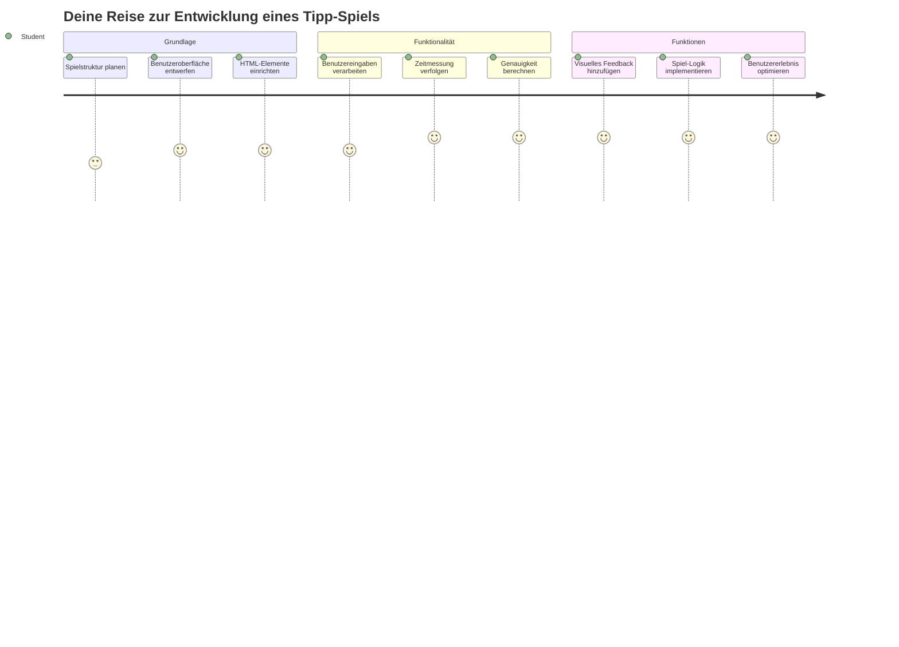
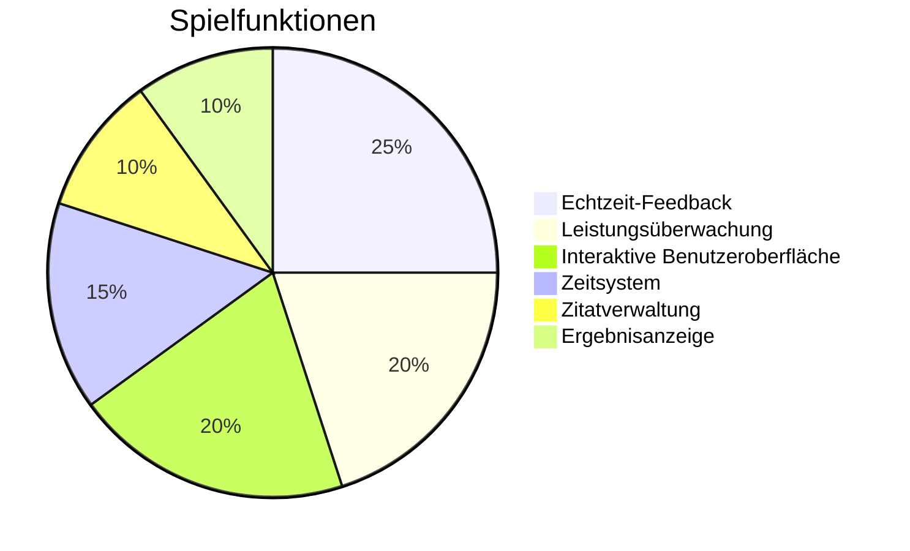
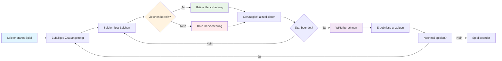
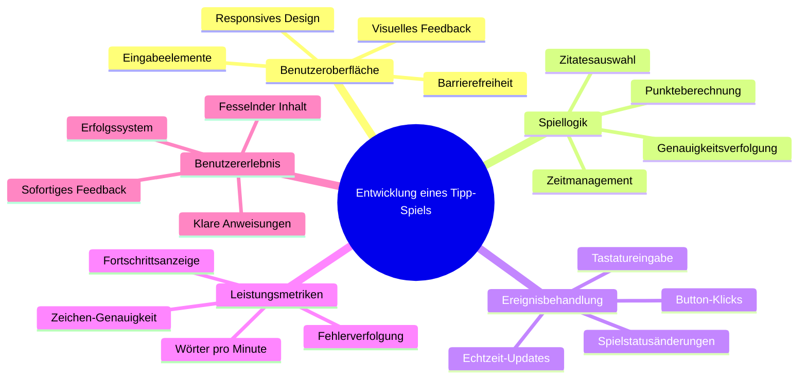
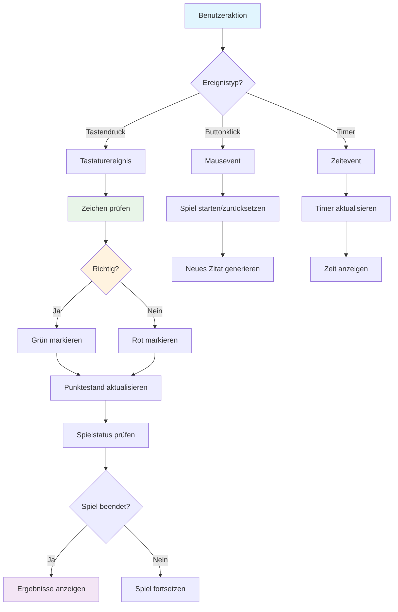
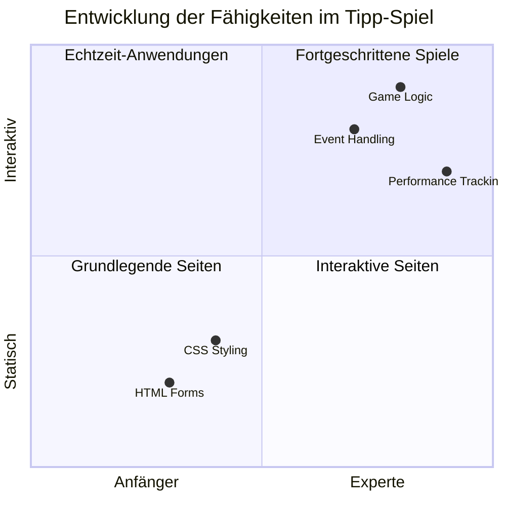
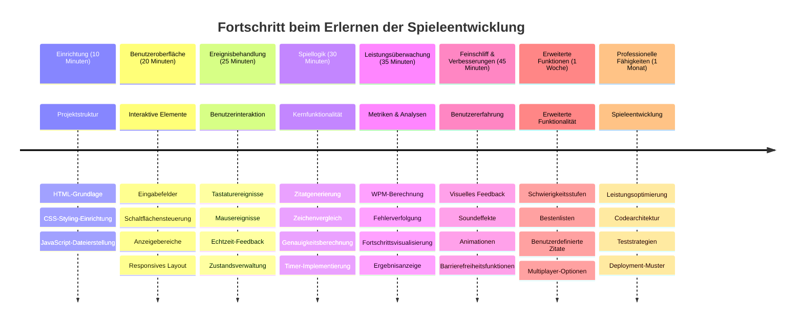

# Ereignisgesteuerte Programmierung - Baue ein Tipp-Spiel

## Einführung

Hier ist etwas, das jeder Entwickler weiß, aber selten darüber spricht: schnell tippen ist eine Superkraft! 🚀 Denk mal darüber nach – je schneller du deine Ideen vom Gehirn in deinen Code-Editor bringst, desto mehr kann deine Kreativität fließen. Es ist wie eine direkte Verbindung zwischen deinen Gedanken und dem Bildschirm.

Willst du wissen, eine der besten Methoden, um diese Fähigkeit zu verbessern? Du hast es erraten – wir werden ein Spiel bauen!

> Lass uns gemeinsam ein großartiges Tipp-Spiel erstellen!

Bereit, all die JavaScript-, HTML- und CSS-Fähigkeiten, die du gelernt hast, anzuwenden? Wir werden ein Tipp-Spiel bauen, das dich mit zufälligen Zitaten des legendären Detektivs [Sherlock Holmes](https://en.wikipedia.org/wiki/Sherlock_Holmes) herausfordert. Das Spiel wird messen, wie schnell und genau du tippen kannst – und glaub mir, es macht süchtig, mehr als du vielleicht denkst!

## Was du wissen solltest

Bevor wir loslegen, stelle sicher, dass du mit diesen Konzepten vertraut bist (keine Sorge, falls du eine kurze Auffrischung brauchst – wir waren alle schon mal dort!):

- Text-Eingabefelder und Button-Steuerelemente erstellen
- CSS und Stil-Setzung mit Klassen
- JavaScript-Grundlagen
  - Ein Array erstellen
  - Eine Zufallszahl erzeugen
  - Die aktuelle Zeit ermitteln

Wenn dir eines davon etwas eingerostet vorkommt, ist das völlig in Ordnung! Manchmal ist die beste Methode, Wissen zu festigen, in ein Projekt zu springen und die Dinge unterwegs zu lernen.

### 🔄 **Pädagogischer Check-in**
**Grundlagenüberprüfung**: Bevor du mit der Entwicklung beginnst, stelle sicher, dass du verstehst:
- ✅ Wie HTML-Formulare und Eingabeelemente funktionieren
- ✅ CSS-Klassen und dynamische Gestaltung
- ✅ JavaScript Event Listener und Event Handler
- ✅ Array-Manipulation und zufällige Auswahl
- ✅ Zeitmessung und Berechnungen

**Kurzer Selbsttest**: Kannst du erklären, wie diese Konzepte in einem interaktiven Spiel zusammenwirken?
- **Events** werden ausgelöst, wenn Nutzer mit Elementen interagieren
- **Handler** verarbeiten diese Events und aktualisieren den Spielstatus
- **CSS** liefert visuelles Feedback für Benutzeraktionen
- **Timing** ermöglicht Leistungsbewertung und Spielfortschritt

## Lass uns das Ding bauen!

[Ein Tipp-Spiel mit ereignisgesteuerter Programmierung erstellen](./typing-game/README.md)

### ⚡ **Was du in den nächsten 5 Minuten tun kannst**
- [ ] Öffne deine Browser-Konsole und versuche, Tastaturereignisse mit `addEventListener` zu hören
- [ ] Erstelle eine einfache HTML-Seite mit einem Eingabefeld und teste die Tipp-Erkennung
- [ ] Übe Zeichenkettenmanipulation, indem du getippten Text mit dem Zieltext vergleichst
- [ ] Experimentiere mit `setTimeout`, um Timing-Funktionen zu verstehen

### 🎯 **Was du in dieser Stunde erreichen kannst**
- [ ] Beende das Quiz nach der Lektion und verstehe ereignisgesteuerte Programmierung
- [ ] Baue eine Grundversion des Tipp-Spiels mit Wortvalidierung
- [ ] Füge visuelles Feedback für korrektes und inkorrektes Tippen hinzu
- [ ] Implementiere ein einfaches Punktesystem basierend auf Geschwindigkeit und Genauigkeit
- [ ] Style dein Spiel mit CSS, um es optisch ansprechend zu machen

### 📅 **Deine einwöchige Spieleentwicklung**
- [ ] Komplettiere das vollständige Tipp-Spiel mit allen Features und Feinschliff
- [ ] Füge Schwierigkeitsgrade mit variierender Wortkomplexität hinzu
- [ ] Implementiere die Nutzerstatistik (WPM, Genauigkeit über die Zeit)
- [ ] Erstelle Soundeffekte und Animationen für ein besseres Nutzererlebnis
- [ ] Mache dein Spiel mobiloptimiert für Touch-Geräte
- [ ] Teile dein Spiel online und sammle Feedback von Nutzern

### 🌟 **Deine monatelange interaktive Entwicklung**
- [ ] Baue mehrere Spiele, die verschiedene Interaktionsmuster erforschen
- [ ] Lerne über Spielschleifen, Zustandsmanagement und Performance-Optimierung
- [ ] Trage zu Open-Source-Spielentwicklungsprojekten bei
- [ ] Meistere fortgeschrittene Timing-Konzepte und flüssige Animationen
- [ ] Erstelle ein Portfolio mit verschiedenen interaktiven Anwendungen
- [ ] Betreue andere, die sich für Spieleentwicklung und Nutzerinteraktion interessieren

## 🎯 Deine Meister-Instantz-Zeitlinie für das Tipp-Spiel

### 🛠️ Deine Zusammenfassung des Spieleentwicklungs-Toolkits

Nach Abschluss dieses Projekts hast du gemeistert:
- **Ereignisgesteuerte Programmierung**: Reaktive Benutzeroberflächen, die auf Eingaben reagieren
- **Echtzeit-Feedback**: Sofortige visuelle und Leistungs-Updates
- **Leistungsmessung**: Präzise Zeit- und Punktesysteme
- **Spielzustandsverwaltung**: Kontrolle des Anwendungsablaufs und des Nutzererlebnisses
- **Interaktives Design**: Schaffen fesselnder, süchtig machender Nutzererlebnisse
- **Moderne Web-APIs**: Nutzung von Browserfunktionen für reiche Interaktionen
- **Barrierefreiheits-Patterns**: Inklusives Design für alle Nutzer

**Anwendungen in der Praxis**: Diese Fähigkeiten sind direkt anwendbar auf:
- **Webanwendungen**: Jede interaktive Oberfläche oder Dashboard
- **Bildungssoftware**: Lernplattformen und Fähigkeitsbewertungstools
- **Produktivitätstools**: Texteditoren, IDEs und Kollaborationssoftware
- **Gaming-Industrie**: Browser-Spiele und interaktive Unterhaltung
- **Mobile Entwicklung**: Touch-basierte Oberflächen und Gestensteuerung

**Auf zum nächsten Level**: Du bist bereit, fortgeschrittene Spiele-Frameworks, Echtzeit-Multiplayer-Systeme oder komplexe interaktive Anwendungen zu erforschen!

## Credits

Geschrieben mit ♥️ von [Christopher Harrison](http://www.twitter.com/geektrainer)

---

<!-- CO-OP TRANSLATOR DISCLAIMER START -->
**Haftungsausschluss**:  
Dieses Dokument wurde mithilfe des KI-Übersetzungsdienstes [Co-op Translator](https://github.com/Azure/co-op-translator) übersetzt. Obwohl wir uns um Genauigkeit bemühen, beachten Sie bitte, dass automatisierte Übersetzungen Fehler oder Ungenauigkeiten enthalten können. Das Originaldokument in seiner Ursprungssprache gilt als maßgebliche Quelle. Für wichtige Informationen wird eine professionelle menschliche Übersetzung empfohlen. Wir übernehmen keine Haftung für Missverständnisse oder Fehlinterpretationen, die aus der Nutzung dieser Übersetzung entstehen.
<!-- CO-OP TRANSLATOR DISCLAIMER END -->