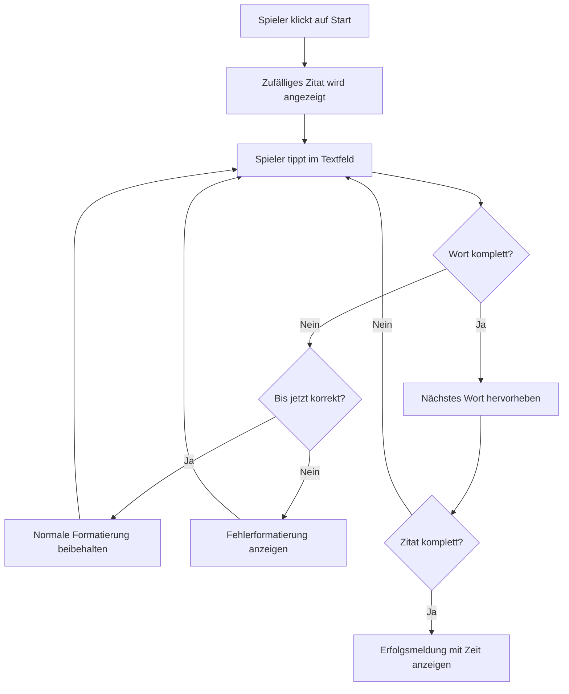
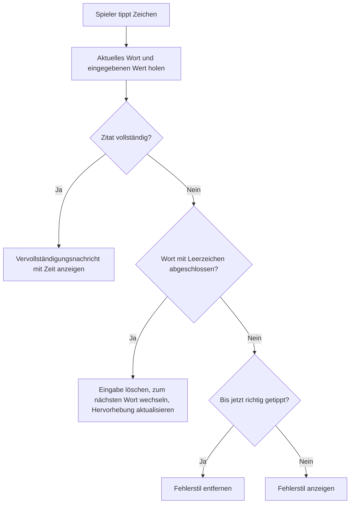
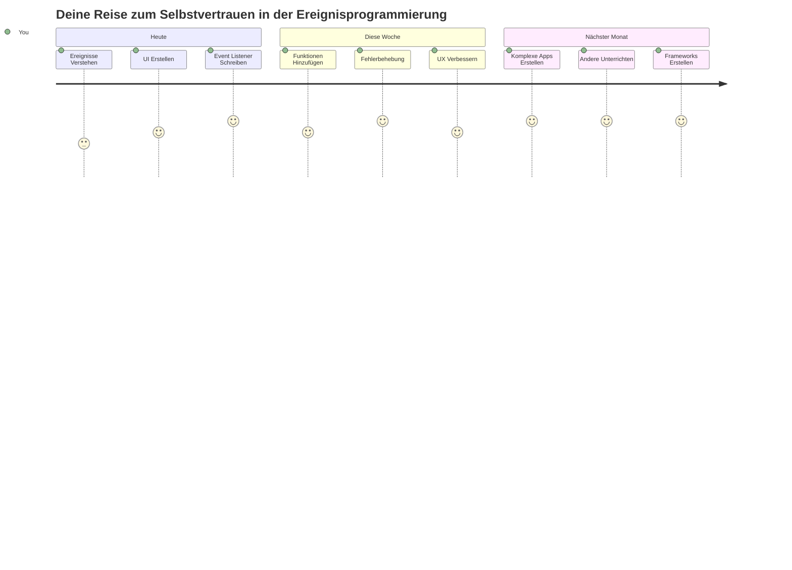

<!--
CO_OP_TRANSLATOR_METADATA:
{
  "original_hash": "da8bc72041a2bb3826a54654ee1a8844",
  "translation_date": "2026-01-06T09:10:27+00:00",
  "source_file": "4-typing-game/typing-game/README.md",
  "language_code": "de"
}
-->
# Erstellung eines Spiels mit Events

Haben Sie sich schon einmal gefragt, wie Websites wissen, wann Sie einen Button anklicken oder in ein Textfeld tippen? Das ist die Magie der ereignisgesteuerten Programmierung! Was gibt es Besseres, um diese wichtige Fähigkeit zu erlernen, als etwas Nützliches zu bauen – ein Tippgeschwindigkeitsspiel, das auf jeden Tastendruck reagiert, den Sie machen.

Sie werden aus erster Hand sehen, wie Webbrowser mit Ihrem JavaScript-Code „kommunizieren“. Jedes Mal, wenn Sie klicken, tippen oder Ihre Maus bewegen, sendet der Browser kleine Nachrichten (wir nennen sie Events) an Ihren Code, und Sie entscheiden, wie darauf reagiert wird!

Wenn wir fertig sind, haben Sie ein echtes Tippspiel gebaut, das Ihre Geschwindigkeit und Genauigkeit verfolgt. Noch wichtiger ist, dass Sie die grundlegenden Konzepte verstehen, die jede interaktive Website antreiben, die Sie je genutzt haben. Los geht's!

## Quiz vor der Vorlesung

[Quiz vor der Vorlesung](https://ff-quizzes.netlify.app/web/quiz/21)

## Ereignisgesteuerte Programmierung

Denken Sie an Ihre Lieblings-App oder -Website – was lässt sie lebendig und reaktionsfähig erscheinen? Es geht darum, wie sie auf Ihre Aktionen reagiert! Jeder Tipp, Klick, Wisch oder Tastendruck erzeugt ein sogenanntes „Event“, und hier geschieht die wahre Magie der Webentwicklung.

Das macht Programmierung fürs Web so spannend: Wir wissen nie, wann jemand auf den Button klickt oder anfängt, in ein Textfeld zu tippen. Sie könnten sofort klicken, fünf Minuten warten oder vielleicht überhaupt nie klicken! Diese Unvorhersehbarkeit bedeutet, dass wir anders über die Programmierung nachdenken müssen.

Statt Code zu schreiben, der von oben nach unten wie ein Rezept durchläuft, schreiben wir Code, der geduldig wartet, bis etwas passiert. Das ist ähnlich wie bei Telegraphenbetreibern im 19. Jahrhundert, die neben ihren Maschinen saßen und im Moment einer Nachricht durch den Draht reagierten.

Was genau ist ein „Event“? Kurz gesagt, es ist etwas, das passiert! Wenn Sie einen Button klicken – das ist ein Event. Wenn Sie einen Buchstaben tippen – das ist ein Event. Wenn Sie Ihre Maus bewegen – das ist ein weiteres Event.

Ereignisgesteuerte Programmierung ermöglicht es uns, unseren Code so einzurichten, dass er zuhört und reagiert. Wir erstellen spezielle Funktionen, sogenannte **Event Listener**, die geduldig auf bestimmte Ereignisse warten und dann sofort aktiv werden.

Stellen Sie sich Event Listener vor wie eine Klingel für Ihren Code. Sie richten die Klingel ein (`addEventListener()`), sagen ihr, auf welchen Ton sie hören soll (z. B. 'click' oder 'keypress'), und bestimmen dann, was passieren soll, wenn diese klingelt (Ihre eigene Funktion).

**So funktionieren Event Listener:**
- **Hören** auf bestimmte Benutzeraktionen wie Klicks, Tastendrücke oder Mausbewegungen
- **Führen** Ihren individuellen Code aus, wenn das angegebene Event eintritt
- **Reagieren** sofort auf Benutzereingaben und sorgen so für ein nahtloses Erlebnis
- **Verarbeiten** mehrere Events am selben Element mit verschiedenen Listenern

> **HINWEIS:** Es gibt viele Möglichkeiten, Event Listener zu erstellen. Sie können anonyme Funktionen verwenden oder benannte Funktionen erstellen. Sie können verschiedene Kürzel verwenden, wie das Setzen der `click`-Eigenschaft oder die Nutzung von `addEventListener()`. In unserem Beispiel konzentrieren wir uns auf `addEventListener()` und anonyme Funktionen, da dies wahrscheinlich die gängigste Technik unter Webentwicklern ist. Außerdem ist sie sehr flexibel, weil `addEventListener()` für alle Events funktioniert und der Eventname als Parameter angegeben wird.

### Gängige Events

Obwohl Webbrowser dutzende verschiedene Events bieten, auf die man hören kann, verlassen sich die meisten interaktiven Anwendungen nur auf eine kleine Anzahl essentieller Events. Wenn Sie diese Kern-Events verstehen, haben Sie die Grundlage, um komplexe Nutzerinteraktionen zu bauen.

Es gibt [Dutzende von Events](https://developer.mozilla.org/docs/Web/Events), auf die Sie beim Erstellen einer Anwendung hören können. Grundsätzlich erzeugt jede Benutzeraktion auf einer Seite ein Event, was Ihnen viel Macht gibt, um das Nutzererlebnis zu gestalten. Glücklicherweise benötigen die meisten Anwendungen nur eine kleine Auswahl an Events. Hier sind einige gebräuchliche (einschließlich der zwei, die wir für unser Spiel verwenden):

| Event | Beschreibung | Häufige Anwendungsfälle |
|-------|--------------|-------------------------|
| `click` | Der Benutzer hat irgendwo geklickt | Buttons, Links, interaktive Elemente |
| `contextmenu` | Der Benutzer hat die rechte Maustaste gedrückt | Benutzerdefinierte Kontextmenüs |
| `select` | Der Benutzer hat Text markiert | Textbearbeitung, Kopiervorgänge |
| `input` | Der Benutzer hat Text eingegeben | Formularvalidierung, Echtzeit-Suche |

**Wichtiges zu diesen Event-Typen:**
- **Werden ausgelöst**, wenn Benutzer mit bestimmten Elementen auf Ihrer Seite interagieren
- **Liefern** detaillierte Informationen über die Aktion des Benutzers über Event-Objekte
- **Ermöglichen**, reaktive und interaktive Webanwendungen zu erstellen
- **Funktionieren** einheitlich in verschiedenen Browsern und auf unterschiedlichen Geräten

## Erstellung des Spiels

Jetzt, wo Sie verstehen, wie Events funktionieren, setzen wir dieses Wissen in die Praxis um, indem wir etwas Nützliches bauen. Wir erstellen ein Tippgeschwindigkeitsspiel, das Event-Handling demonstriert und Ihnen hilft, eine wichtige Entwickler-Fähigkeit zu entwickeln.

Wir bauen ein Spiel, um zu erforschen, wie Events in JavaScript funktionieren. Unser Spiel testet die Tippfähigkeit eines Spielers – eine der am meisten unterschätzten Fertigkeiten, die jeder Entwickler haben sollte. Fun Fact: Das QWERTY-Tastaturlayout, das wir heute verwenden, wurde tatsächlich in den 1870ern für Schreibmaschinen entworfen – und gute Tippfähigkeiten sind für Programmierer heute genauso wertvoll! Der allgemeine Ablauf des Spiels sieht folgendermaßen aus:


**So funktioniert unser Spiel:**
- **Startet**, wenn der Spieler den Startknopf klickt, und zeigt ein zufälliges Zitat an
- **Verfolgt** den Tippfortschritt des Spielers Wort für Wort in Echtzeit
- **Hebt hervor**, welches Wort gerade zu tippen ist, um den Fokus des Spielers zu lenken
- **Gibt** sofort visuelles Feedback bei Tippfehlern
- **Berechnet** und zeigt die Gesamtzeit an, wenn das Zitat vollständig getippt wurde

Lassen Sie uns unser Spiel bauen und mehr über Events lernen!

### Dateistruktur

Bevor wir mit dem Programmieren beginnen, bringen wir Ordnung ins Projekt! Eine saubere Dateistruktur von Anfang an erspart später Kopfzerbrechen und macht Ihr Projekt professioneller. 😊

Wir halten es einfach mit nur drei Dateien: `index.html` für unsere Seitenstruktur, `script.js` für die gesamte Spiellogik und `style.css`, damit alles gut aussieht. Das ist das klassische Trio, das die meisten Webseiten antreibt!

**Erstellen Sie einen neuen Ordner für Ihre Arbeit, indem Sie eine Konsole oder ein Terminal öffnen und folgenden Befehl ausführen:**

```bash
# Linux oder macOS
mkdir typing-game && cd typing-game

# Windows
md typing-game && cd typing-game
```

**Diese Befehle bewirken:**
- **Erstellen** ein neues Verzeichnis namens `typing-game` für Ihre Projektdateien
- **Wechseln** automatisch in das neu erstellte Verzeichnis
- **Richten ein** sauberes Arbeitsumfeld für die Spieleentwicklung ein

**Öffnen Sie Visual Studio Code:**

```bash
code .
```

**Dieser Befehl:**
- **Startet** Visual Studio Code im aktuellen Verzeichnis
- **Öffnet** Ihren Projektordner im Editor
- **Bietet** Zugriff auf alle Entwicklungswerkzeuge, die Sie benötigen

**Fügen Sie im Order mit Visual Studio Code drei Dateien mit den folgenden Namen hinzu:**
- `index.html` – Enthält die Struktur und den Inhalt Ihres Spiels
- `script.js` – Verarbeitet die gesamte Spiellogik und die Event Listener
- `style.css` – Legt das visuelle Erscheinungsbild und das Styling fest

## Erstellen der Benutzeroberfläche

Jetzt bauen wir die Bühne, auf der das gesamte Spielgeschehen stattfinden wird! Denken Sie daran wie an das Design eines Kontrollpults für ein Raumschiff – wir müssen sicherstellen, dass alles, was unsere Spieler brauchen, genau da ist, wo sie es erwarten.

Lassen Sie uns überlegen, was unser Spiel wirklich benötigt. Wenn Sie ein Tippspiel spielen, was möchten Sie auf dem Bildschirm sehen? Hier ist, was wir brauchen:

| UI-Element | Zweck | HTML-Element |
|------------|-------|--------------|
| Anzeige des Zitats | Zeigt den zu tippenden Text | `<p>` mit `id="quote"` |
| Nachrichtenbereich | Zeigt Status- und Erfolgsmeldungen | `<p>` mit `id="message"` |
| Texteingabe | Wo die Spieler das Zitat tippen | `<input>` mit `id="typed-value"` |
| Startknopf | Startet das Spiel | `<button>` mit `id="start"` |

**Verständnis der UI-Struktur:**
- **Organisiert** Inhalte logisch von oben nach unten
- **Vergibt** eindeutige IDs, um die Elemente per JavaScript anzusprechen
- **Bietet** klare visuelle Hierarchie für bessere Nutzererfahrung
- **Verwendet** semantische HTML-Elemente für Barrierefreiheit

Jedes dieser Elemente benötigt eine ID, damit wir in unserem JavaScript damit arbeiten können. Außerdem fügen wir Verweise auf die CSS- und JavaScript-Dateien hinzu, die wir erstellen werden.

Erstellen Sie eine neue Datei namens `index.html`. Fügen Sie folgenden HTML-Code hinzu:

```html
<!-- inside index.html -->
<html>
<head>
  <title>Typing game</title>
  <link rel="stylesheet" href="style.css">
</head>
<body>
  <h1>Typing game!</h1>
  <p>Practice your typing skills with a quote from Sherlock Holmes. Click **start** to begin!</p>
  <p id="quote"></p> <!-- This will display our quote -->
  <p id="message"></p> <!-- This will display any status messages -->
  <div>
    <input type="text" aria-label="current word" id="typed-value" /> <!-- The textbox for typing -->
    <button type="button" id="start">Start</button> <!-- To start the game -->
  </div>
  <script src="script.js"></script>
</body>
</html>
```

**Diese HTML-Struktur bewirkt:**
- **Verlinkt** das CSS-Stylesheet im `<head>` für das Styling
- **Erstellt** eine klare Überschrift und Anleitung für die Nutzer
- **Legt** Platzhalter-Absätze mit spezifischen IDs für dynamische Inhalte an
- **Enthält** ein Eingabefeld mit Zugänglichkeitsattributen
- **Stellt** einen Startknopf bereit, um das Spiel zu starten
- **Lädt** die JavaScript-Datei am Ende für optimale Performance

### Anwendung starten

Ihr Programm während der Entwicklung häufig zu testen hilft, Probleme früh zu erkennen und Fortschritte in Echtzeit zu sehen. Live Server ist ein unbezahlbares Tool, das Ihren Browser automatisch aktualisiert, sobald Sie Dateien speichern, und so die Entwicklung viel effizienter macht.

Es ist immer am besten, iterativ zu entwickeln, um zu sehen, wie alles aussieht. Lassen Sie uns unsere Anwendung starten. Es gibt eine wunderbare Erweiterung für Visual Studio Code namens [Live Server](https://marketplace.visualstudio.com/items?itemName=ritwickdey.LiveServer&WT.mc_id=academic-77807-sagibbon), die Ihre Anwendung lokal hostet und den Browser bei jedem Speichern automatisch aktualisiert.

**Installieren Sie [Live Server](https://marketplace.visualstudio.com/items?itemName=ritwickdey.LiveServer&WT.mc_id=academic-77807-sagibbon) über den Link und klicken Sie auf Installieren:**

**Während der Installation passiert Folgendes:**
- **Fordert** Ihren Browser auf, Visual Studio Code zu öffnen
- **Führt** Sie durch den Installationsprozess der Erweiterung
- **Erfordert möglicherweise** einen Neustart von Visual Studio Code

**Nach der Installation öffnen Sie in Visual Studio Code mit Strg-Shift-P (oder Cmd-Shift-P) die Kommando-Palette:**

**Zur Kommando-Palette:**
- **Bietet** schnellen Zugriff auf alle VS Code-Befehle
- **Durchsucht** Befehle während der Eingabe
- **Bietet** Tastaturkürzel für schnellere Entwicklung

**Geben Sie „Live Server: Open with Live Server“ ein:**

**Live Server macht Folgendes:**
- **Startet** einen lokalen Entwicklungsserver für Ihr Projekt
- **Aktualisiert** den Browser automatisch, wenn Sie Dateien speichern
- **Serviert** Ihre Dateien über eine lokale URL (typischerweise `localhost:5500`)

**Öffnen Sie einen Browser und navigieren Sie zu `https://localhost:5500`:**

Sie sollten nun die von Ihnen erstellte Seite sehen! Fügen wir etwas Funktionalität hinzu.

## CSS hinzufügen

Jetzt sorgen wir dafür, dass alles gut aussieht! Visuelles Feedback ist seit den frühen Tagen der Computertechnik entscheidend für Benutzeroberflächen. In den 1980ern entdeckten Forscher, dass sofortiges visuelles Feedback die Benutzerleistung dramatisch verbessert und Fehler reduziert. Genau das wollen wir schaffen.

Unser Spiel muss glasklar machen, was passiert. Spieler sollen sofort wissen, welches Wort sie tippen sollen, und tippen sie falsch, sollen sie das sofort sehen. Erstellen wir ein einfaches, aber effektives Styling:

Erstellen Sie eine neue Datei namens `style.css` und fügen Sie folgenden Code ein.

```css
/* inside style.css */
.highlight {
  background-color: yellow;
}

.error {
  background-color: lightcoral;
  border: red;
}
```

**Diese CSS-Klassen bewirken:**
- **Heben** das aktuelle Wort mit einem gelben Hintergrund hervor für klare visuelle Orientierung
- **Signalisieren** Tippfehler mit einem hellroten Hintergrund
- **Bieten** sofortiges Feedback, ohne den Tippfluss zu unterbrechen
- **Verwenden** Kontrastfarben für Barrierefreiheit und klare visuelle Kommunikation

✅ Beim CSS können Sie die Seite nach Belieben gestalten. Nehmen Sie sich Zeit und machen Sie die Seite ansprechender:

- Wählen Sie eine andere Schriftart
- Farblich gestalten Sie die Überschriften
- Ändern Sie die Größe von Elementen

## JavaScript

Jetzt wird es interessant! 🎉 Wir haben unsere HTML-Struktur und das CSS-Styling, aber unser Spiel ist im Moment wie ein schönes Auto ohne Motor. JavaScript wird dieser Motor sein – es lässt alles tatsächlich funktionieren und auf die Aktionen der Spieler reagieren.

Hier wird Ihre Kreation lebendig. Wir gehen Schritt für Schritt vor, damit nichts überwältigend wirkt:

| Schritt | Zweck | Was Sie lernen |
|---------|-------|----------------|
| [Die Konstanten erstellen](../../../../4-typing-game/typing-game) | Zitate und DOM-Referenzen einrichten | Variablenverwaltung und DOM-Auswahl |
| [Event Listener zum Spielenstart](../../../../4-typing-game/typing-game) | Spielinitialisierung behandeln | Ereignisbehandlung und UI-Updates |
| [Event Listener zum Tippen](../../../../4-typing-game/typing-game) | Benutzereingaben in Echtzeit verarbeiten | Eingabevalidierung und dynamisches Feedback |

**Dieser strukturierte Ansatz hilft Ihnen:**
- **Ihren Code** in logische, überschaubare Abschnitte zu gliedern
- **Funktionalität** schrittweise aufzubauen und Fehler leichter zu finden
- **Verstehen,** wie verschiedene Teile Ihrer Anwendung zusammenarbeiten
- **Wiederverwendbare Muster** für zukünftige Projekte zu schaffen

Erstellen Sie zunächst eine neue Datei namens `script.js`.

### Konstanten hinzufügen

Bevor wir loslegen, sammeln wir all unsere Ressourcen! Wie bei der NASA-Missionskontrolle, die vor dem Start alle Überwachungssysteme bereitstellt, ist es viel leichter, wenn Sie alles vorbereitet haben. So ersparen wir uns das spätere Suchen und vermeiden Tippfehler.

Das müssen wir zuerst einrichten:

| Datentyp | Zweck | Beispiel |
|----------|-------|----------|
| Array von Zitaten | Speichert alle möglichen Zitate für das Spiel | `['Zitat 1', 'Zitat 2', ...]` |
| Wort-Array | Zerlegt das aktuelle Zitat in einzelne Wörter | `['Wenn', 'du', 'hast', ...]` |
| Wortindex | Verfolgt, welches Wort der Spieler gerade tippt | `0, 1, 2, 3...` |
| Startzeit | Berechnet die verstrichene Zeit für die Punktewertung | `Date.now()` |

**Wir benötigen außerdem Referenzen zu unseren UI-Elementen:**
| Element | ID | Zweck |
|---------|----|---------|
| Texteingabe | `typed-value` | Wo die Spieler tippen |
| Zitat-Anzeige | `quote` | Zeigt das zu tippende Zitat an |
| Nachrichtenbereich | `message` | Zeigt Status-Updates an |

```javascript
// innerhalb von script.js
// alle unsere Zitate
const quotes = [
    'When you have eliminated the impossible, whatever remains, however improbable, must be the truth.',
    'There is nothing more deceptive than an obvious fact.',
    'I ought to know by this time that when a fact appears to be opposed to a long train of deductions it invariably proves to be capable of bearing some other interpretation.',
    'I never make exceptions. An exception disproves the rule.',
    'What one man can invent another can discover.',
    'Nothing clears up a case so much as stating it to another person.',
    'Education never ends, Watson. It is a series of lessons, with the greatest for the last.',
];
// speichere die Liste der Wörter und den Index des Wortes, das der Spieler gerade tippt
let words = [];
let wordIndex = 0;
// die Startzeit
let startTime = Date.now();
// Seitenelemente
const quoteElement = document.getElementById('quote');
const messageElement = document.getElementById('message');
const typedValueElement = document.getElementById('typed-value');
```

**Was dieser Setup-Code bewirkt:**
- **Speichert** ein Array von Sherlock-Holmes-Zitaten mit `const`, da die Zitate sich nicht ändern
- **Initialisiert** Tracking-Variablen mit `let`, da sich diese Werte während des Spiels ändern
- **Erfasst** Referenzen zu DOM-Elementen mit `document.getElementById()` für effizienten Zugriff
- **Legt** die Grundlage für die gesamte Spielfunktionalität mit klaren, beschreibenden Variablennamen
- **Organisiert** zusammengehörige Daten und Elemente logisch für einfachere Codepflege

✅ Füge weitere Zitate zu deinem Spiel hinzu

> 💡 **Tipp vom Profi**: Wir können die Elemente jederzeit im Code mit `document.getElementById()` abrufen. Weil wir diese Elemente regelmäßig referenzieren, vermeiden wir Tippfehler bei String-Literalen durch Verwendung von Konstanten. Frameworks wie [Vue.js](https://vuejs.org/) oder [React](https://reactjs.org/) können dir helfen, deinen Code besser zu zentralisieren.
>
**Darum funktioniert dieser Ansatz so gut:**
- **Verhindert** Rechtschreibfehler bei mehrfacher Elementreferenzierung
- **Verbessert** die Code-Lesbarkeit durch beschreibende Konstantennamen
- **Ermöglicht** bessere IDE-Unterstützung mit Autovervollständigung und Fehlerprüfungen
- **Erleichtert** Refactoring falls sich Element-IDs später ändern

Nimm dir eine Minute, um ein Video über `const`, `let` und `var` anzuschauen

[](https://youtube.com/watch?v=JNIXfGiDWM8 "Arten von Variablen")

> 🎥 Klicke auf das Bild oben für ein Video über Variablen.

### Start-Logik hinzufügen

Hier fügt sich alles zusammen! 🚀 Du wirst gleich deinen ersten echten Event-Listener schreiben, und es ist ziemlich befriedigend, zu sehen, wie dein Code auf einen Button-Klick reagiert.

Denk daran: Irgendwo da draußen wird ein Spieler den „Start“-Button klicken, und dein Code muss darauf vorbereitet sein. Wir wissen nicht, wann er klickt – vielleicht sofort, vielleicht nach einer Kaffeepause – aber wenn er klickt, erwacht dein Spiel zum Leben.

Wenn der Nutzer auf `start` klickt, müssen wir ein Zitat auswählen, die Benutzeroberfläche vorbereiten und das Tracking für das aktuelle Wort und die Zeit starten. Unten findest du den JavaScript-Code, den du hinzufügen musst; wir besprechen ihn direkt nach dem Skriptblock.

```javascript
// am Ende von script.js
document.getElementById('start').addEventListener('click', () => {
  // ein Zitat holen
  const quoteIndex = Math.floor(Math.random() * quotes.length);
  const quote = quotes[quoteIndex];
  // Das Zitat in ein Array von Wörtern umwandeln
  words = quote.split(' ');
  // Den Wortindex für die Nachverfolgung zurücksetzen
  wordIndex = 0;

  // UI-Aktualisierungen
  // Ein Array von Span-Elementen erstellen, um eine Klasse setzen zu können
  const spanWords = words.map(function(word) { return `<span>${word} </span>`});
  // In String umwandeln und als innerHTML in der Zitat-Anzeige setzen
  quoteElement.innerHTML = spanWords.join('');
  // Das erste Wort hervorheben
  quoteElement.childNodes[0].className = 'highlight';
  // Alle vorherigen Nachrichten löschen
  messageElement.innerText = '';

  // Das Textfeld einrichten
  // Das Textfeld leeren
  typedValueElement.value = '';
  // Fokus setzen
  typedValueElement.focus();
  // Den Ereignishandler setzen

  // Den Timer starten
  startTime = new Date().getTime();
});
```

**Lass uns den Code in logische Abschnitte aufteilen:**

**📊 Wort-Verfolgung einrichten:**
- **Wählt** ein zufälliges Zitat mit `Math.floor()` und `Math.random()` für Vielfalt aus
- **Zerlegt** das Zitat in ein Array einzelner Wörter mit `split(' ')`
- **Setzt** den `wordIndex` zurück auf 0, da die Spieler mit dem ersten Wort beginnen
- **Bereitet** den Spielzustand für eine neue Runde vor

**🎨 UI-Setup und Anzeige:**
- **Erstellt** ein Array von `<span>`-Elementen, die jedes Wort einzeln für Styling umschließen
- **Fügt** die Spans zu einem String zusammen für effizientes DOM-Update
- **Hebt** das erste Wort durch Hinzufügen der CSS-Klasse `highlight` hervor
- **Löscht** frühere Spielmeldungen für eine saubere Anzeige

**⌨️ Texteingabe vorbereiten:**
- **Löscht** eventuell vorhandenen Text im Eingabefeld
- **Setzt den Fokus** auf die Textbox, sodass die Spieler sofort tippen können
- **Bereitet** den Eingabebereich für die neue Spielsession vor

**⏱️ Timer starten:**
- **Erfasst** den aktuellen Zeitstempel mit `new Date().getTime()`
- **Ermöglicht** genaue Berechnung der Tippgeschwindigkeit und Gesamtzeit
- **Startet** das Performance-Tracking für die Spielsitzung

### Tipplogik hinzufügen

Hier kommen wir zum Kern unseres Spiels! Keine Sorge, wenn das momentan viel erscheint – wir gehen jeden Teil Schritt für Schritt durch, und am Ende wirst du sehen, wie logisch alles ist.

Was wir hier bauen, ist ziemlich ausgereift: Jedes Mal, wenn jemand einen Buchstaben tippt, prüft unser Code, was getippt wurde, gibt Feedback und entscheidet, wie es weitergeht. Ähnlich wie frühe Textverarbeitungsprogramme wie WordStar in den 1970er-Jahren Tippenden in Echtzeit Rückmeldung gaben.

```javascript
// am Ende von script.js
typedValueElement.addEventListener('input', () => {
  // Das aktuelle Wort holen
  const currentWord = words[wordIndex];
  // den aktuellen Wert holen
  const typedValue = typedValueElement.value;

  if (typedValue === currentWord && wordIndex === words.length - 1) {
    // Satzende
    // Erfolg anzeigen
    const elapsedTime = new Date().getTime() - startTime;
    const message = `CONGRATULATIONS! You finished in ${elapsedTime / 1000} seconds.`;
    messageElement.innerText = message;
  } else if (typedValue.endsWith(' ') && typedValue.trim() === currentWord) {
    // Wortende
    // clear das typedValueElement für das neue Wort
    typedValueElement.value = '';
    // zum nächsten Wort wechseln
    wordIndex++;
    // den Klassennamen für alle Elemente im Zitat zurücksetzen
    for (const wordElement of quoteElement.childNodes) {
      wordElement.className = '';
    }
    // das neue Wort hervorheben
    quoteElement.childNodes[wordIndex].className = 'highlight';
  } else if (currentWord.startsWith(typedValue)) {
    // derzeit korrekt
    // das nächste Wort hervorheben
    typedValueElement.className = '';
  } else {
    // Fehlerzustand
    typedValueElement.className = 'error';
  }
});
```

**Verständnis der Tipplogik:**

Diese Funktion nutzt eine „Wasserfall“-Methode, die Bedingungen vom Spezifischsten zum Allgemeinsten prüft. Lass uns jede Situation ansehen:


**🏁 Zitat vollständig (Szenario 1):**
- **Prüft**, ob der getippte Wert mit dem aktuellen Wort übereinstimmt UND wir beim letzten Wort sind
- **Berechnet** die verstrichene Zeit, indem sie die Startzeit von der aktuellen Zeit subtrahiert
- **Wandelt** Millisekunden in Sekunden um, indem sie durch 1.000 teilt
- **Zeigt** eine Glückwunschnachricht mit der Abschlusszeit an

**✅ Wort vollständig (Szenario 2):**
- **Erkennt** Wortabschluss, wenn die Eingabe mit einem Leerzeichen endet
- **Validiert**, dass die getrimmte Eingabe genau mit dem aktuellen Wort übereinstimmt
- **Löscht** das Eingabefeld für das nächste Wort
- **Springt** zum nächsten Wort, indem `wordIndex` erhöht wird
- **Aktualisiert** die visuelle Hervorhebung, indem alle Klassen entfernt und das neue Wort hervorgehoben wird

**📝 Tippvorgang (Szenario 3):**
- **Prüft**, ob das aktuelle Wort mit dem bereits getippten Text beginnt
- **Entfernt** Fehlermarkierungen, um zu zeigen, dass die Eingabe korrekt ist
- **Erlaubt** das weitere Tippen ohne Unterbrechung

**❌ Fehlerzustand (Szenario 4):**
- **Tritt ein**, wenn der getippte Text nicht mit dem erwarteten Wortanfang übereinstimmt
- **Fügt** eine Fehler-CSS-Klasse hinzu, um sofortiges visuelles Feedback zu geben
- **Hilft** den Spielern, Fehler schnell zu erkennen und zu korrigieren

## Teste deine Anwendung

Schau mal, was du erreicht hast! 🎉 Du hast gerade ein richtiges funktionierendes Tipp-Spiel von Grund auf mit ereignisgesteuerter Programmierung gebaut. Nimm dir einen Moment, das zu würdigen – das ist keine Kleinigkeit!

Jetzt folgt die Testphase! Funktioniert alles wie erwartet? Haben wir etwas vergessen? Falls etwas nicht sofort perfekt funktioniert, ist das absolut normal. Auch erfahrene Entwickler finden regelmäßig Bugs im Code. Das gehört zum Entwicklungsprozess dazu!

Klicke auf `start` und fang an zu tippen! Es sollte ungefähr so aussehen wie die Animation, die wir zuvor gesehen haben.


**Was du in deiner Anwendung testen solltest:**
- **Prüft**, ob ein Klick auf Start ein zufälliges Zitat anzeigt
- **Bestätigt**, dass das Tippen das aktuelle Wort korrekt hervorhebt
- **Überprüft**, dass bei falscher Eingabe eine Fehler-Formatierung erscheint
- **Stellt sicher**, dass das Abschließen von Wörtern die Hervorhebung richtig weiterbewegt
- **Testet**, dass das Beenden des Zitats die Abschlussmeldung mit Zeitangabe zeigt

**Häufige Debugging-Tipps:**
- **Sieh** dir die Browser-Konsole (F12) auf JavaScript-Fehler an
- **Vergewissere dich**, dass alle Dateinamen exakt übereinstimmen (Groß-/Kleinschreibung beachten)
- **Stelle sicher**, dass Live Server läuft und korrekt aktualisiert
- **Teste** verschiedene Zitate, um die Zufallsauswahl zu prüfen

---

## GitHub Copilot Agent Challenge 🎮

Nutze den Agentenmodus, um die folgende Herausforderung zu meistern:

**Beschreibung:** Erweitere das Tipp-Spiel durch ein Schwierigkeitssystem, das das Spiel basierend auf Spielerleistung anpasst. Diese Challenge hilft dir, fortgeschrittene Ereignisbehandlung, Datenanalyse und dynamische UI-Updates zu üben.

**Aufgabe:** Erstelle ein Schwierigkeitseinstellungssystem für das Tipp-Spiel, das:
1. Die Tippgeschwindigkeit des Spielers (Wörter pro Minute) und die Genauigkeitsrate verfolgt
2. Automatisch zwischen drei Schwierigkeitsgraden umschaltet: Einfach (einfache Zitate), Mittel (aktuelle Zitate), Schwer (komplexe Zitate mit Interpunktion)
3. Den aktuellen Schwierigkeitsgrad und Spielerstatistiken in der UI anzeigt
4. Einen Streak-Zähler implementiert, der die Schwierigkeit nach 3 aufeinanderfolgenden guten Leistungen erhöht
5. Visuelles Feedback (Farben, Animationen) zur Anzeige von Schwierigkeitsänderungen hinzufügt

Füge die notwendigen HTML-Elemente, CSS-Stile und JavaScript-Funktionen hinzu, um diese Funktion zu implementieren. Beinhaltet außerdem eine ordentliche Fehlerbehandlung und gewährleistet Barrierefreiheit mit geeigneten ARIA-Labels.

Mehr über den [Agentenmodus](https://code.visualstudio.com/blogs/2025/02/24/introducing-copilot-agent-mode) erfährst du hier.

## 🚀 Challenge

Bereit, dein Tipp-Spiel auf die nächste Stufe zu heben? Versuche diese erweiterten Features zu implementieren, um dein Verständnis von Ereignisbehandlung und DOM-Manipulation zu vertiefen:

**Füge mehr Funktionalität hinzu:**

| Funktion | Beschreibung | Fähigkeiten, die du übst |
|---------|-------------|--------------------------|
| **Eingabesteuerung** | Deaktiviert den `input`-Eventlistener bei Abschluss und aktiviert ihn neu beim Button-Klick | Ereignisverwaltung und Zustandssteuerung |
| **UI-Zustandsverwaltung** | Deaktiviert die Textbox, wenn der Spieler das Zitat fertig getippt hat | Manipulation von DOM-Eigenschaften |
| **Modaler Dialog** | Zeigt ein modales Dialogfenster mit Erfolgsmeldung an | Erweiterte UI-Muster und Barrierefreiheit |
| **Highscore-System** | Speichert Highscores mit `localStorage` | Browser-Speicher APIs und Datenpersistenz |

**Implementierungstipps:**
- **Recherchiere** `localStorage.setItem()` und `localStorage.getItem()` für dauerhafte Speicherung
- **Übe** das dynamische Hinzufügen und Entfernen von Event-Listenern
- **Erkunde** HTML-Dialog-Elemente oder CSS-Modalmuster
- **Berücksichtige** Barrierefreiheit beim Deaktivieren und Aktivieren von Formularelementen

## Nach-Vorlesung-Quiz

[Nach-Vorlesung-Quiz](https://ff-quizzes.netlify.app/web/quiz/22)

---

## 🚀 Dein Meilensteinplan für das Tipp-Spiel

### ⚡ **Was du in den nächsten 5 Minuten machen kannst**
- [ ] Teste dein Tipp-Spiel mit verschiedenen Zitaten für reibungslosen Ablauf
- [ ] Experimentiere mit CSS-Stilen – ändere Hervorhebungs- und Fehlerfarben
- [ ] Öffne die DevTools deines Browsers (F12) und beobachte die Konsole beim Spielen
- [ ] Fordere dich selbst heraus, ein Zitat so schnell wie möglich zu tippen

### ⏰ **Was du diese Stunde erreichen kannst**
- [ ] Füge der Zitat-Array weitere Zitate hinzu (z.B. aus deinen Lieblingsbüchern oder Filmen)
- [ ] Implementiere das localStorage-Highscore-System aus dem Challenge-Abschnitt
- [ ] Erstelle einen Wörter-pro-Minute-Rechner, der nach jedem Spiel anzeigt
- [ ] Füge Soundeffekte für korrektes Tippen, Fehler und Abschluss hinzu

### 📅 **Dein Abenteuer über die Woche**
- [ ] Baue eine Mehrspieler-Version, in der Freunde gegeneinander antreten können
- [ ] Erstelle verschiedene Schwierigkeitsstufen mit unterschiedlicher Zitatanforderung
- [ ] Füge eine Fortschrittsanzeige hinzu, die zeigt, wie viel vom Zitat getippt wurde
- [ ] Implementiere Benutzerkonten mit persönlichem Statistik-Tracking
- [ ] Designe individuelle Themes und lass Nutzer ihre bevorzugte Gestaltung wählen

### 🗓️ **Deine Monats-Transformation**
- [ ] Erstelle einen Tippkurs mit Lektionen, die schrittweise richtige Fingerplatzierung lehren
- [ ] Baue Analysen, die zeigen, welche Buchstaben oder Wörter am meisten Fehler verursachen
- [ ] Füge Unterstützung für verschiedene Sprachen und Tastatur-Layouts hinzu
- [ ] Integriere Bildungs-APIs, um Zitate aus Literaturdatenbanken zu ziehen
- [ ] Veröffentliche dein erweitertes Tipp-Spiel für andere zum Spielen und Genießen

### 🎯 **Abschließende Reflexion**

**Bevor du weitermachst, nimm dir einen Moment zum Feiern:**
- Was war der befriedigendste Moment beim Erstellen dieses Spiels?
- Wie fühlst du dich jetzt bezüglich ereignisgesteuerter Programmierung im Vergleich zu deinem Start?
- Welches Feature möchtest du unbedingt hinzufügen, um das Spiel einzigartig zu machen?
- Wie könntest du die Konzepte der Ereignisbehandlung auf andere Projekte anwenden?


> 🌟 **Denke daran**: Du hast gerade eines der Kernkonzepte gemeistert, das jede interaktive Webseite und Anwendung antreibt. Ereignisgesteuerte Programmierung macht das Web lebendig und reaktionsschnell. Immer wenn du ein Dropdown-Menü siehst, ein Formular, das während des Tippens validiert, oder ein Spiel, das auf Klicks reagiert – jetzt verstehst du die Magie dahinter. Du lernst nicht nur zu programmieren – du lernst, Erlebnisse zu schaffen, die intuitiv und fesselnd sind! 🎉

---

## Nachlesen & Selbststudium

Lies dich in [alle verfügbaren Events](https://developer.mozilla.org/docs/Web/Events) für Webentwickler ein und überlege, in welchen Szenarien du welche einsetzen würdest.

## Aufgabe

[Erstelle ein neues Keyboard-Spiel](assignment.md)

---

<!-- CO-OP TRANSLATOR DISCLAIMER START -->
**Haftungsausschluss**:  
Dieses Dokument wurde mit dem KI-Übersetzungsdienst [Co-op Translator](https://github.com/Azure/co-op-translator) übersetzt. Obwohl wir uns um Genauigkeit bemühen, beachten Sie bitte, dass automatische Übersetzungen Fehler oder Ungenauigkeiten enthalten können. Das Originaldokument in der jeweiligen Originalsprache gilt als maßgebliche Quelle. Für wichtige Informationen wird eine professionelle menschliche Übersetzung empfohlen. Wir übernehmen keine Haftung für Missverständnisse oder Fehlinterpretationen, die aus der Nutzung dieser Übersetzung entstehen.
<!-- CO-OP TRANSLATOR DISCLAIMER END -->