<!--
CO_OP_TRANSLATOR_METADATA:
{
  "original_hash": "00aa85715e1efd4930c17a23e3012e69",
  "translation_date": "2026-01-06T08:56:06+00:00",
  "source_file": "5-browser-extension/1-about-browsers/README.md",
  "language_code": "de"
}
-->
# Browser-Erweiterungsprojekt Teil 1: Alles über Browser

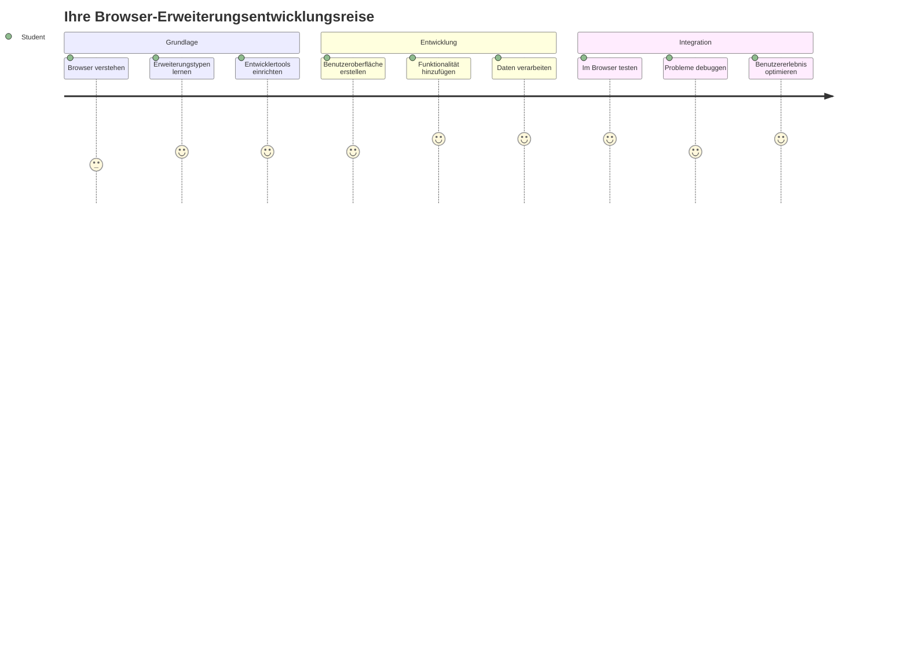
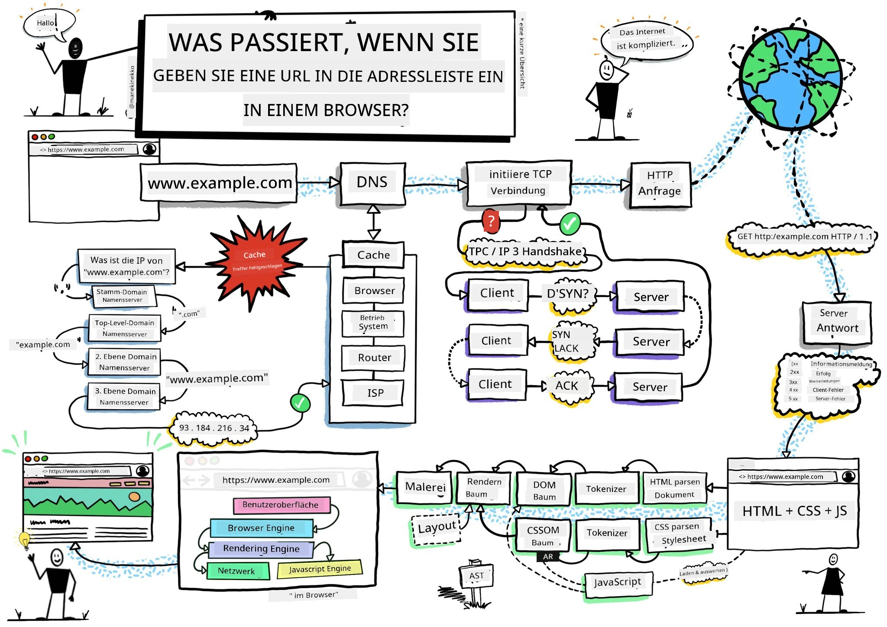
> Sketchnote von [Wassim Chegham](https://dev.to/wassimchegham/ever-wondered-what-happens-when-you-type-in-a-url-in-an-address-bar-in-a-browser-3dob)

## Pre-Lecture Quiz

[Pre-Lecture-Quiz](https://ff-quizzes.netlify.app/web/quiz/23)

### Einführung

Browser-Erweiterungen sind Mini-Anwendungen, die Ihr Surferlebnis im Web verbessern. Ähnlich der ursprünglichen Vision von Tim Berners-Lee für ein interaktives Web erweitern Erweiterungen die Fähigkeiten des Browsers über das einfache Anzeigen von Dokumenten hinaus. Von Passwortmanagern, die Ihre Konten sicher halten, bis zu Farbwählern, die Designern helfen, perfekte Farbtöne zu erfassen, lösen Erweiterungen alltägliche Herausforderungen beim Surfen.

Bevor wir Ihre erste Erweiterung bauen, verstehen wir, wie Browser funktionieren. Genauso wie Alexander Graham Bell die Schallübertragung verstehen musste, bevor er das Telefon erfand, hilft es Ihnen, Browser-Grundlagen zu kennen, um Erweiterungen zu entwickeln, die nahtlos mit bestehenden Browsersystemen zusammenarbeiten.

Am Ende dieser Lektion verstehen Sie die Browser-Architektur und haben begonnen, Ihre erste Erweiterung zu bauen.

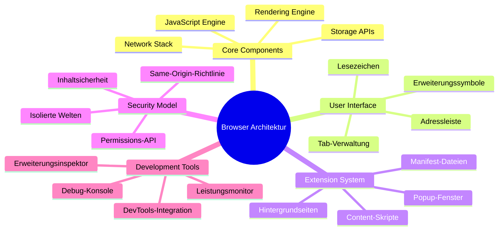
## Verständnis von Webbrowsern

Ein Webbrowser ist im Wesentlichen ein ausgeklügelter Dokumenten-Interpreter. Wenn Sie "google.com" in die Adressleiste eingeben, führt der Browser eine komplexe Reihe von Operationen aus – fordert Inhalte von Servern weltweit an, analysiert und rendert diesen Code dann in die interaktiven Webseiten, die Sie sehen.

Dieser Prozess spiegelt wider, wie der erste Webbrowser, WorldWideWeb, von Tim Berners-Lee 1990 entworfen wurde, um vernetzte Dokumente für alle zugänglich zu machen.

✅ **Ein wenig Geschichte**: Der erste Browser hieß 'WorldWideWeb' und wurde 1990 von Sir Timothy Berners-Lee geschaffen.

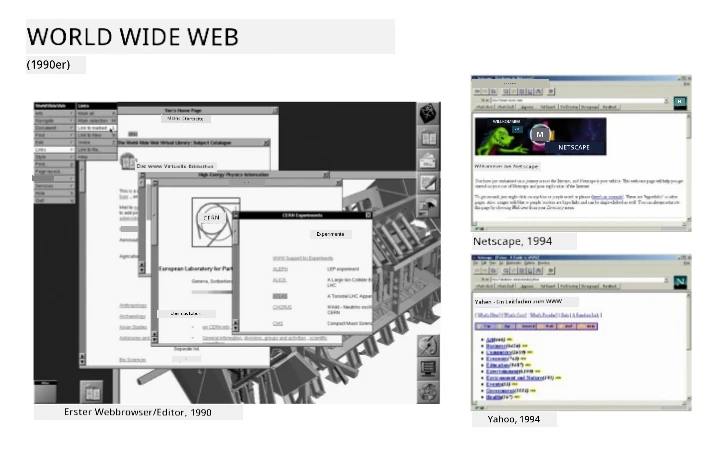
> Einige frühe Browser, via [Karen McGrane](https://www.slideshare.net/KMcGrane/week-4-ixd-history-personal-computing)

### Wie Browser Webinhalte verarbeiten

Der Prozess zwischen der Eingabe einer URL und dem Anzeigen einer Webseite umfasst mehrere koordinierte Schritte, die innerhalb von Sekunden ablaufen:

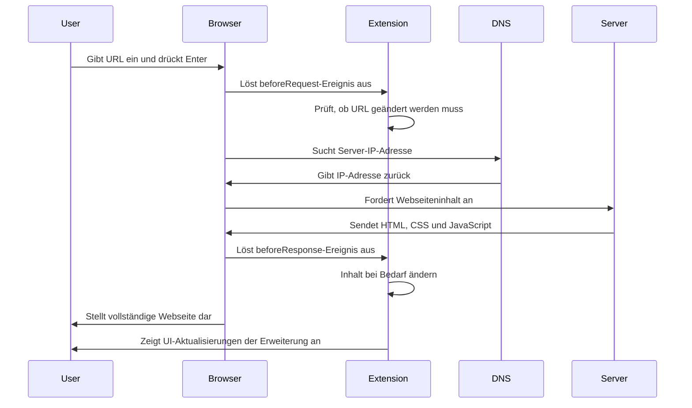
**Folgendes wird durch diesen Prozess erreicht:**
- **Übersetzt** die für Menschen lesbare URL durch DNS-Lookup in eine Server-IP-Adresse
- **Stellt her** eine sichere Verbindung zum Webserver mit HTTP- oder HTTPS-Protokollen
- **Fordert an** den spezifischen Webseitentext vom Server an
- **Empfängt** HTML-Markup, CSS-Stile und JavaScript-Code vom Server
- **Rendert** alle Inhalte zu der interaktiven Webseite, die Sie sehen

### Kernfunktionen von Browsern

Moderne Browser bieten zahlreiche Funktionen, die Entwickler von Erweiterungen nutzen können:

| Funktion | Zweck | Möglichkeiten für Erweiterungen |
|---------|---------|------------------------|
| **Rendering Engine** | Zeigt HTML, CSS und JavaScript an | Inhaltsänderungen, Stil-Injektion |
| **JavaScript Engine** | Führt JavaScript-Code aus | Eigene Skripte, API-Interaktionen |
| **Lokaler Speicher** | Speichert Daten lokal | Benutzereinstellungen, zwischengespeicherte Daten |
| **Netzwerk-Stack** | Verarbeitet Web-Anfragen | Anfragenüberwachung, Datenanalyse |
| **Sicherheitsmodell** | Schutz der Nutzer vor bösartigem Inhalt | Inhaltsfilterung, Sicherheitsverbesserungen |

**Diese Features zu verstehen hilft Ihnen:**
- **Zu erkennen**, wo Ihre Erweiterung den größten Mehrwert liefert
- **Die richtigen Browser-APIs** für die Funktionalität Ihrer Erweiterung auszuwählen
- **Erweiterungen zu entwerfen**, die effizient mit Browsersystemen arbeiten
- **Sicherzustellen**, dass Ihre Erweiterung Browser-Sicherheitsrichtlinien einhält

### Überlegungen zur Cross-Browser-Entwicklung

Unterschiedliche Browser implementieren Standards mit kleinen Abweichungen, ähnlich wie verschiedene Programmiersprachen denselben Algorithmus unterschiedlich behandeln können. Chrome, Firefox und Safari haben jeweils eigene Eigenschaften, die Entwickler bei der Erweiterungsentwicklung berücksichtigen müssen.

> 💡 **Profi-Tipp**: Nutzen Sie [caniuse.com](https://www.caniuse.com), um zu prüfen, welche Webtechnologien in verschiedenen Browsern unterstützt werden. Das ist unschätzbar bei der Planung Ihrer Erweiterungsfunktionen!

**Wichtige Punkte bei der Erweiterungsentwicklung:**
- **Testen** Sie Ihre Erweiterung in Chrome, Firefox und Edge
- **Passen** Sie sich unterschiedlichen Browser-APIs und Manifest-Formaten an
- **Berücksichtigen** Sie verschiedene Leistungsmerkmale und Einschränkungen
- **Bieten** Sie Fallbacks für browser-spezifische Funktionen an, die eventuell nicht verfügbar sind

✅ **Analytics-Einblick**: Sie können herausfinden, welche Browser Ihre Nutzer bevorzugen, indem Sie Analytics-Pakete in Ihre Web-Entwicklungsprojekte integrieren. Diese Daten helfen Ihnen, zu priorisieren, welche Browser Sie zuerst unterstützen sollten.

## Verständnis von Browser-Erweiterungen

Browsererweiterungen lösen häufige Herausforderungen beim Surfen, indem sie Funktionen direkt zur Browseroberfläche hinzufügen. Anstatt separate Anwendungen oder komplexe Workflows zu benötigen, bieten Erweiterungen sofortigen Zugriff auf Werkzeuge und Funktionen.

Dieses Konzept spiegelt wider, wie frühe Computerpioniere wie Douglas Engelbart die Erweiterung menschlicher Fähigkeiten durch Technologie vorstellten – Erweiterungen ergänzen die Grundfunktionen Ihres Browsers.

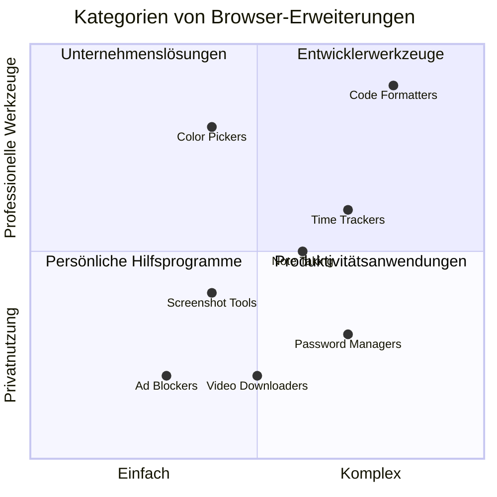
**Beliebte Erweiterungskategorien und deren Vorteile:**
- **Produktivitätstools**: Aufgabenmanager, Notiz-Apps und Zeitmesser, die helfen, organisiert zu bleiben
- **Sicherheitsverbesserungen**: Passwortmanager, Werbeblocker und Datenschutztools, die Ihre Daten schützen
- **Entwicklertools**: Code-Formatierer, Farbwähler und Debugging-Werkzeuge, die Entwicklung beschleunigen
- **Inhaltsverbesserungen**: Lesemodi, Video-Downloader und Screenshot-Tools, die das Surferlebnis verbessern

✅ **Reflexionsfrage**: Was sind Ihre Lieblings-Browsererweiterungen? Welche spezifischen Aufgaben erfüllen sie und wie verbessern sie Ihr Surferlebnis?

### 🔄 **Pädagogische Kontrollfrage**
**Verständnis der Browser-Architektur**: Bevor Sie zur Erweiterungsentwicklung übergehen, stellen Sie sicher, dass Sie:
- ✅ Erklären können, wie Browser Webanfragen verarbeiten und Inhalte rendern
- ✅ Die Hauptkomponenten der Browser-Architektur identifizieren
- ✅ Verstehen, wie Erweiterungen mit Browserfunktionalität integriert werden
- ✅ Das Sicherheitsmodell, das Nutzer schützt, erkennen

**Schnelltest für sich selbst**: Können Sie den Weg von der URL-Eingabe bis zur Anzeige der Webseite nachverfolgen?
1. **DNS-Lookup** wandelt URL in IP-Adresse um
2. **HTTP-Anfrage** holt Inhalte vom Server
3. **Parsing** verarbeitet HTML, CSS und JavaScript
4. **Rendering** zeigt die endgültige Webseite an
5. **Erweiterungen** können Inhalte an mehreren Stellen verändern

## Installation und Verwaltung von Erweiterungen

Das Verständnis des Installationsprozesses von Erweiterungen hilft Ihnen, die Nutzererfahrung beim Installieren Ihrer Erweiterung besser zu verstehen. Der Installationsprozess ist bei modernen Browsern standardisiert, mit geringfügigen Unterschieden im Interface-Design.

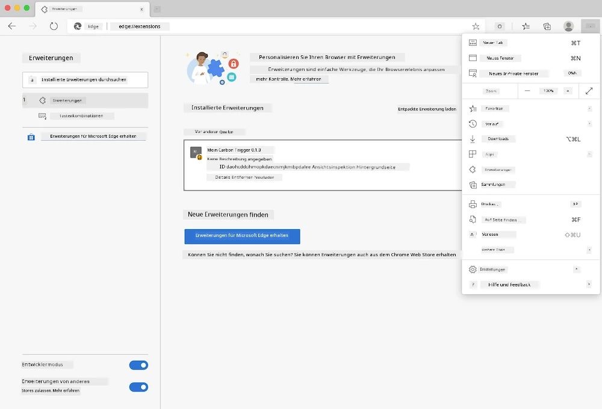

> **Wichtig**: Aktivieren Sie beim Testen eigener Erweiterungen unbedingt den Entwicklermodus und erlauben Sie Erweiterungen aus anderen Stores.

### Entwicklungs-Erweiterungsinstallationsprozess

Wenn Sie eigene Erweiterungen entwickeln und testen, folgen Sie diesem Ablauf:

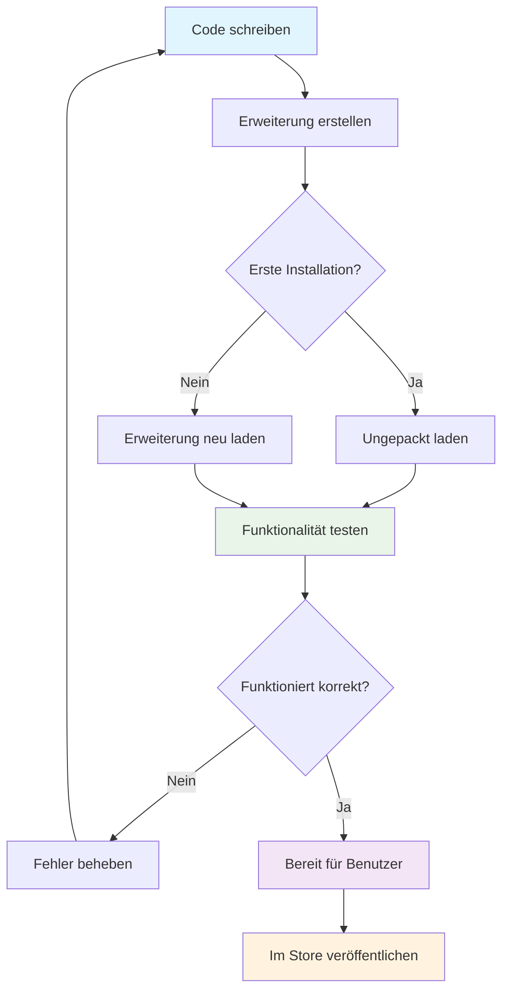
```bash
# Schritt 1: Erstellen Sie Ihre Erweiterung
npm run build
```

**Was dieser Befehl bewirkt:**
- **Kompiliert** Ihren Quellcode in browserbereite Dateien
- **Bündelt** JavaScript-Module in optimierte Pakete
- **Erstellt** die finalen Erweiterungsdateien im `/dist`-Ordner
- **Bereitet** Ihre Erweiterung zur Installation und zum Testen vor

**Schritt 2: Navigieren Sie zu Browser-Erweiterungen**
1. **Öffnen** Sie die Verwaltungsseite für Browser-Erweiterungen
2. **Klicken** Sie auf die Schaltfläche "Einstellungen und mehr" (das `...`-Symbol) oben rechts
3. **Wählen** Sie "Erweiterungen" aus dem Dropdown-Menü aus

**Schritt 3: Laden Sie Ihre Erweiterung**
- **Bei neuen Installationen**: Wählen Sie `unverpackt laden` und wählen Sie Ihren `/dist`-Ordner aus
- **Bei Updates**: Klicken Sie auf `neu laden` neben Ihrer bereits installierten Erweiterung
- **Für Tests**: Aktivieren Sie den "Entwicklermodus", um zusätzliche Debugging-Funktionen zu erhalten

### Produktive Erweiterungsinstallation

> ✅ **Hinweis**: Diese Entwicklungsanweisungen gelten speziell für selbst entwickelte Erweiterungen. Um veröffentlichte Erweiterungen zu installieren, besuchen Sie offizielle Browser-Erweiterungs-Stores wie den [Microsoft Edge Add-ons Store](https://microsoftedge.microsoft.com/addons/Microsoft-Edge-Extensions-Home).

**Verständnis des Unterschieds:**
- **Entwicklungsinstallationen** erlauben das Testen unveröffentlichter Erweiterungen während der Entwicklung
- **Store-Installationen** bieten geprüfte, veröffentlichte Erweiterungen mit automatischen Updates
- **Sideloading** ermöglicht die Installation von Erweiterungen außerhalb offizieller Stores (erfordert Entwicklermodus)

## Bau Ihrer Carbon Footprint Erweiterung

Wir erstellen eine Browser-Erweiterung, die den CO2-Fußabdruck des Energieverbrauchs Ihrer Region anzeigt. Dieses Projekt demonstriert wesentliche Konzepte der Erweiterungsentwicklung und schafft ein praktisches Werkzeug für Umweltbewusstsein.

Dieser Ansatz folgt dem Prinzip des „Lernens durch Tun“, das sich seit den Bildungstheorien John Deweys bewährt hat – technische Fähigkeiten kombiniert mit sinnvollen realweltlichen Anwendungen.

### Projektanforderungen

Bevor Sie mit der Entwicklung beginnen, sammeln wir die benötigten Ressourcen und Abhängigkeiten:

**Benötigter API-Zugang:**
- **[CO2 Signal API-Schlüssel](https://www.co2signal.com/)**: Geben Sie Ihre E-Mail-Adresse ein, um einen kostenlosen API-Schlüssel zu erhalten
- **[Regionscode](http://api.electricitymap.org/v3/zones)**: Finden Sie Ihren Regionscode mit der [Electricity Map](https://www.electricitymap.org/map) (zum Beispiel verwendet Boston 'US-NEISO')

**Entwicklungswerkzeuge:**
- **[Node.js und NPM](https://www.npmjs.com)**: Paketverwaltungstool zur Installation von Projektabhängigkeiten
- **[Starter-Code](../../../../5-browser-extension/start)**: Laden Sie den `start`-Ordner herunter, um mit der Entwicklung zu beginnen

✅ **Mehr lernen**: Verbessern Sie Ihre Paketverwaltungsfähigkeiten mit diesem [umfassenden Learn-Modul](https://docs.microsoft.com/learn/modules/create-nodejs-project-dependencies/?WT.mc_id=academic-77807-sagibbon)

### Verständnis der Projektstruktur

Das Verständnis der Projektstruktur hilft, die Entwicklungsarbeit effizient zu organisieren. So wie die Bibliothek von Alexandria für einfachen Wissenszugriff organisiert war, macht eine gut strukturierte Codebasis die Entwicklung effizienter:

```
project-root/
├── dist/                    # Built extension files
│   ├── manifest.json        # Extension configuration
│   ├── index.html           # User interface markup
│   ├── background.js        # Background script functionality
│   └── main.js              # Compiled JavaScript bundle
├── src/                     # Source development files
│   └── index.js             # Your main JavaScript code
├── package.json             # Project dependencies and scripts
└── webpack.config.js        # Build configuration
```

**Analyse, was jede Datei leistet:**
- **`manifest.json`**: **Definiert** Metadaten, Berechtigungen und Einstiegspunkte der Erweiterung
- **`index.html`**: **Erstellt** die Benutzeroberfläche, die erscheint, wenn Nutzer Ihre Erweiterung anklicken
- **`background.js`**: **Verwaltet** Hintergrundaufgaben und Browser-Eventlistener
- **`main.js`**: **Enthält** das finale gebündelte JavaScript nach dem Build-Prozess
- **`src/index.js`**: **Beinhaltet** Ihren Hauptentwicklungscode, der in `main.js` kompiliert wird

> 💡 **Organisationstipp**: Bewahren Sie Ihren API-Schlüssel und Regionscode in einer sicheren Notiz auf, um sie während der Entwicklung leicht zu referenzieren. Diese Werte benötigen Sie zum Testen der Erweiterungsfunktionalität.

✅ **Sicherheitshinweis**: Speichern Sie API-Schlüssel oder sensible Zugangsdaten niemals im Code-Repository. Wir zeigen Ihnen, wie Sie diese sicher handhaben.

## Erstellen der Erweiterungsoberfläche

Jetzt bauen wir die Benutzeroberflächen-Komponenten. Die Erweiterung nutzt einen zweistufigen Ansatz: einen Konfigurationsbildschirm für die Ersteinrichtung und einen Ergebnisbildschirm für die Datenanzeige.

Dies folgt dem Prinzip der progressiven Offenbarung, das seit den Anfängen der Computerinteraktion genutzt wird – Informationen und Optionen werden logisch sequenziert präsentiert, um Nutzer nicht zu überfordern.

### Überblick über Erweiterungsansichten

**Setup-Ansicht** – Ersteinrichtung für Nutzer:
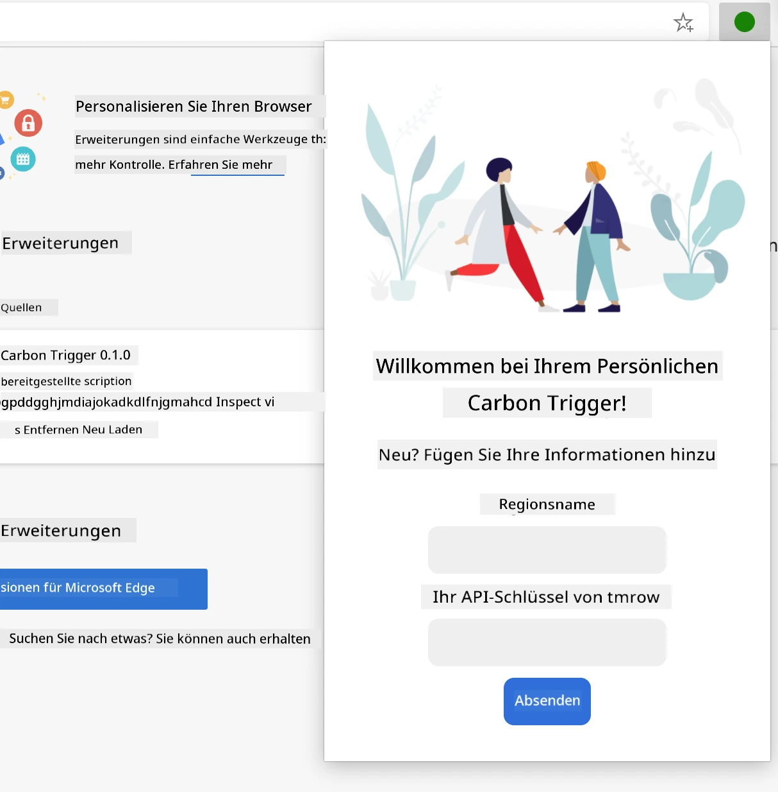

**Ergebnis-Ansicht** – Anzeige der CO2-Fußabdruckdaten:
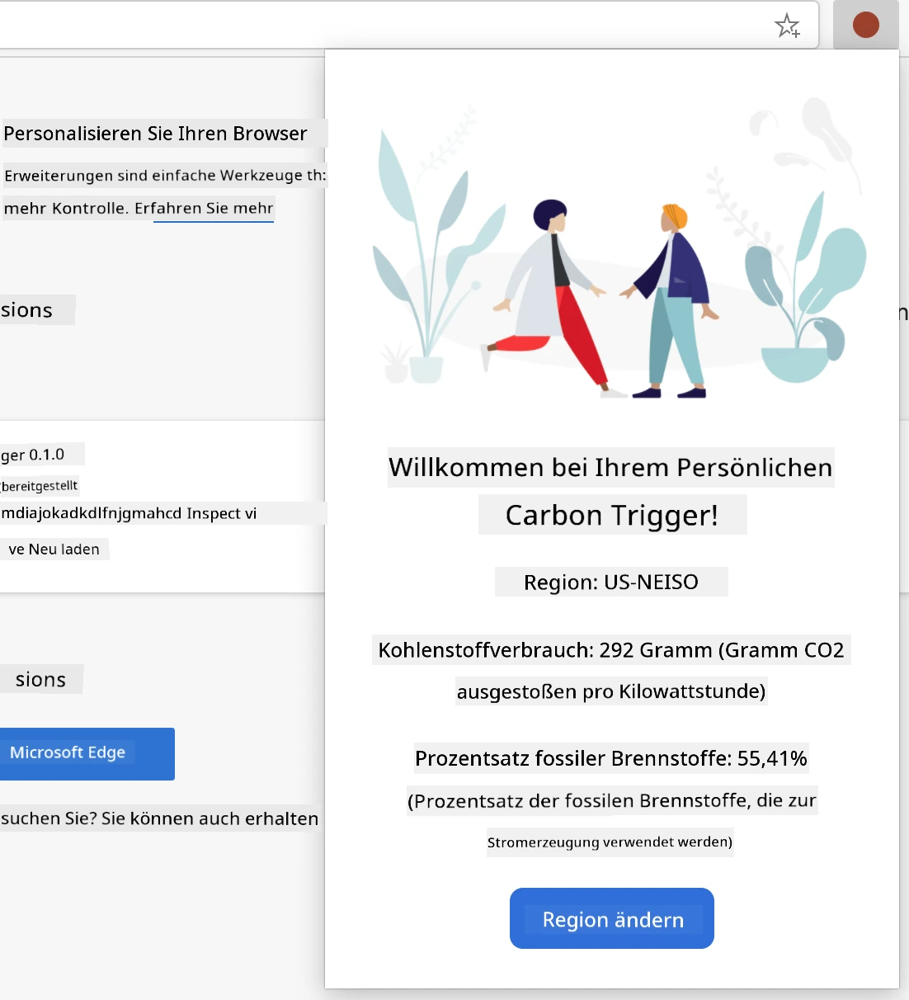

### Aufbau des Konfigurationsformulars

Das Setup-Formular sammelt beim ersten Gebrauch Konfigurationsdaten. Nach der Einrichtung bleiben diese Informationen im Browser-Speicher für spätere Sitzungen erhalten.

Fügen Sie in der Datei `/dist/index.html` diese Formularstruktur hinzu:

```html
<form class="form-data" autocomplete="on">
    <div>
        <h2>New? Add your Information</h2>
    </div>
    <div>
        <label for="region">Region Name</label>
        <input type="text" id="region" required class="region-name" />
    </div>
    <div>
        <label for="api">Your API Key from tmrow</label>
        <input type="text" id="api" required class="api-key" />
    </div>
    <button class="search-btn">Submit</button>
</form>
```

**Was dieses Formular leistet:**
- **Erstellt** eine semantische Formularstruktur mit korrekten Labels und Eingaben
- **Ermöglicht** Browser-Autovervollständigung für bessere Nutzererfahrung
- **Erfordert** das Ausfüllen beider Felder vor dem Absenden durch das `required`-Attribut
- **Organisiert** die Eingaben mit beschreibenden Klassennamen für einfaches Styling und JavaScript-Zugriff
- **Bietet** klare Anweisungen für Nutzer, die die Erweiterung erstmals einrichten

### Aufbau der Ergebnisanzeige

Erstellen Sie nun den Bereich, der die CO2-Fußabdruckdaten anzeigt. Fügen Sie dieses HTML unter dem Formular hinzu:

```html
<div class="result">
    <div class="loading">loading...</div>
    <div class="errors"></div>
    <div class="data"></div>
    <div class="result-container">
        <p><strong>Region: </strong><span class="my-region"></span></p>
        <p><strong>Carbon Usage: </strong><span class="carbon-usage"></span></p>
        <p><strong>Fossil Fuel Percentage: </strong><span class="fossil-fuel"></span></p>
    </div>
    <button class="clear-btn">Change region</button>
</div>
```

**Aufgliederung, was diese Struktur bereitstellt:**
- **`loading`**: **Zeigt** eine Lademeldung, während API-Daten abgerufen werden
- **`errors`**: **Zeigt** Fehlermeldungen, falls API-Anfragen fehlschlagen oder Daten ungültig sind
- **`data`**: **Beinhaltet** Rohdaten für Debugging-Zwecke während der Entwicklung
- **`result-container`**: **Präsentiert** formatierte CO2-Fußabdruckinformationen an Nutzer
- **`clear-btn`**: **Ermöglicht** Nutzern den Wechsel der Region und erneute Konfiguration der Erweiterung

### Einrichtung des Build-Prozesses

Installieren Sie nun die Projektabhängigkeiten und testen Sie den Build-Prozess:

```bash
npm install
```

**Was dieser Installationsprozess bewirkt:**
- **Lädt** Webpack und andere Entwicklungsabhängigkeiten aus der `package.json` herunter
- **Konfiguriert** die Build-Toolchain für das Kompilieren modernen JavaScripts
- **Bereitet** die Entwicklungsumgebung für Erweiterungsbau und -test vor
- **Ermöglicht** Code-Bündelung, Optimierung und Cross-Browser-Kompatibilität

> 💡 **Build-Prozess-Einblick**: Webpack bündelt Ihren Quellcode von `/src/index.js` in `/dist/main.js`. Dieser Prozess optimiert Ihren Code für die Produktion und gewährleistet Browser-Kompatibilität.

### Testen Ihres Fortschritts

An diesem Punkt können Sie Ihre Erweiterung testen:
1. **Führe** den Build-Befehl aus, um deinen Code zu kompilieren  
2. **Lade** die Erweiterung im Entwicklermodus in deinen Browser  
3. **Überprüfe**, ob das Formular korrekt angezeigt wird und professionell aussieht  
4. **Kontrolliere**, ob alle Formularelemente richtig ausgerichtet und funktional sind  

**Was du erreicht hast:**  
- **Erstellt** die grundlegende HTML-Struktur für deine Erweiterung  
- **Entwickelt** sowohl Konfigurations- als auch Ergebnis-Interfaces mit korrektem semantischem Markup  
- **Eingerichtet** einen modernen Entwicklungs-Workflow mit branchenüblichen Werkzeugen  
- **Vorbereitet** die Grundlage für die Integration interaktiver JavaScript-Funktionalität  

### 🔄 **Pädagogische Zwischenkontrolle**  
**Fortschritt bei der Erweiterungsentwicklung**: Überprüfe dein Verständnis, bevor du weitermachst:  
- ✅ Kannst du den Zweck jeder Datei in der Projektstruktur erklären?  
- ✅ Verstehst du, wie der Build-Prozess deinen Quellcode transformiert?  
- ✅ Warum trennen wir Konfiguration und Ergebnisse in verschiedene UI-Bereiche?  
- ✅ Wie unterstützt die Formularstruktur sowohl Benutzerfreundlichkeit als auch Zugänglichkeit?  

**Verständnis des Entwicklungs-Workflows**: Du solltest jetzt in der Lage sein:  
1. **HTML und CSS** für deine Erweiterungsoberfläche zu verändern  
2. Den Build-Befehl auszuführen, um deine Änderungen zu kompilieren  
3. Die Erweiterung in deinem Browser neu zu laden, um Updates zu testen  
4. Fehler mit den Entwickler-Tools des Browsers zu debuggen  

Du hast die erste Phase der Entwicklung von Browser-Erweiterungen abgeschlossen. So wie die Gebrüder Wright erst die Aerodynamik verstehen mussten, bevor sie fliegen konnten, bereitet dich dieses Grundlagenwissen darauf vor, komplexere interaktive Funktionen in der nächsten Lektion zu bauen.  

## GitHub Copilot Agent Herausforderung 🚀  

Nutze den Agent-Modus, um die folgende Herausforderung zu lösen:  

**Beschreibung:** Verbessere die Browser-Erweiterung, indem du Formularvalidierungen und Benutzerfeedback-Funktionen hinzufügst, um die Benutzererfahrung bei der Eingabe von API-Schlüsseln und Regionscodes zu verbessern.  

**Aufgabe:** Erstelle JavaScript-Validierungsfunktionen, die prüfen, ob das API-Schlüsselfeld mindestens 20 Zeichen enthält und ob der Regionscode dem korrekten Format entspricht (z. B. 'US-NEISO'). Füge visuelles Feedback hinzu, indem du die Eingabefelder bei gültigen Eingaben grün und bei ungültigen rot einfärbst. Ergänze außerdem eine Umschaltfunktion, um den API-Schlüssel aus Sicherheitsgründen ein- oder auszublenden.  

Erfahre mehr über den [Agent-Modus](https://code.visualstudio.com/blogs/2025/02/24/introducing-copilot-agent-mode).  

## 🚀 Herausforderung  

Sieh dir einen Browser-Erweiterungsstore an und installiere eine Erweiterung in deinem Browser. Du kannst ihre Dateien auf interessante Weise untersuchen. Was entdeckst du?  

## Test nach der Vorlesung  

[Test nach der Vorlesung](https://ff-quizzes.netlify.app/web/quiz/24)  

## Rückblick & Selbststudium  

In dieser Lektion hast du etwas über die Geschichte des Webbrowsers gelernt; nutze die Gelegenheit, mehr über die Vision der Erfinder des World Wide Web zu erfahren, indem du weiter über seine Geschichte liest. Einige nützliche Seiten sind:  

[Die Geschichte der Webbrowser](https://www.mozilla.org/firefox/browsers/browser-history/)  

[Geschichte des Webs](https://webfoundation.org/about/vision/history-of-the-web/)  

[Ein Interview mit Tim Berners-Lee](https://www.theguardian.com/technology/2019/mar/12/tim-berners-lee-on-30-years-of-the-web-if-we-dream-a-little-we-can-get-the-web-we-want)  

### ⚡ **Was du in den nächsten 5 Minuten tun kannst**  
- [ ] Öffne die Seite für Chrome/Edge-Erweiterungen (chrome://extensions) und erkunde, was du installiert hast  
- [ ] Sieh dir den Netzwerk-Tab der Entwickler-Tools an, während du eine Webseite lädst  
- [ ] Versuche, den Seitenquelltext (Strg+U) anzusehen, um die HTML-Struktur zu sehen  
- [ ] Untersuche ein beliebiges Elemente der Webseite und ändere dessen CSS in den Entwickler-Tools  

### 🎯 **Was du in dieser Stunde erreichen kannst**  
- [ ] Den Test nach der Lektion absolvieren und Browser-Grundlagen verstehen  
- [ ] Eine einfache manifest.json-Datei für eine Browser-Erweiterung erstellen  
- [ ] Eine einfache "Hello World"-Erweiterung bauen, die ein Popup zeigt  
- [ ] Das Laden deiner Erweiterung im Entwicklermodus testen  
- [ ] Die Dokumentation zur Browser-Erweiterung deines Zielbrowsers erkunden  

### 📅 **Deine einwöchige Extension-Reise**  
- [ ] Eine funktionale Browser-Erweiterung mit echtem Nutzen fertigstellen  
- [ ] Über Content-Scripts, Hintergrund-Skripte und Popup-Interaktionen lernen  
- [ ] Browser-APIs wie Storage, Tabs und Messaging meistern  
- [ ] Benutzerfreundliche Interfaces für deine Erweiterung entwerfen  
- [ ] Deine Erweiterung auf verschiedenen Websites und Szenarien testen  
- [ ] Deine Erweiterung im Browser-Erweiterungsstore veröffentlichen  

### 🌟 **Deine einmonatige Browser-Entwicklung**  
- [ ] Mehrere Erweiterungen bauen, die unterschiedliche Nutzerprobleme lösen  
- [ ] Fortgeschrittene Browser-APIs und Sicherheitspraktiken lernen  
- [ ] Zu Open-Source-Browser-Erweiterungsprojekten beitragen  
- [ ] Kompatibilität über verschiedene Browser hinweg und Progressive Enhancement meistern  
- [ ] Entwicklungstools und Vorlagen für Erweiterungen erstellen  
- [ ] Zum Experten für Browser-Erweiterungen werden, der anderen Entwicklern hilft  

## 🎯 Dein Zeitplan für Browser-Erweiterungs-Expertise  

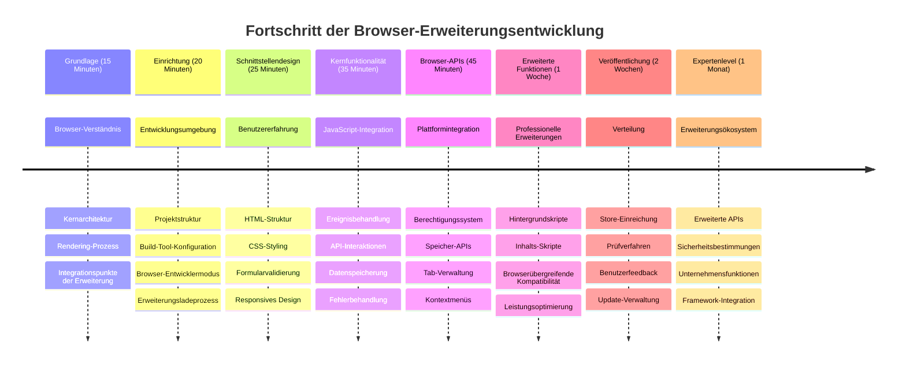
### 🛠️ Zusammenfassung deines Extension-Entwicklungs-Toolkits  

Nach Abschluss dieser Lektion verfügst du nun über:  
- **Kenntnisse der Browser-Architektur**: Verständnis von Rendering-Engines, Sicherheitsmodellen und Erweiterungsintegration  
- **Entwicklungsumgebung**: Moderner Toolchain mit Webpack, NPM und Debugging-Möglichkeiten  
- **UI/UX-Grundlagen**: Semantische HTML-Struktur mit progressiven Offenlegungsmustern  
- **Sicherheitsbewusstsein**: Verständnis von Browser-Berechtigungen und sicheren Entwicklungspraktiken  
- **Browserübergreifende Konzepte**: Wissen zu Kompatibilitätsaspekten und Testmethoden  
- **API-Integration**: Grundlagen für die Arbeit mit externen Datenquellen  
- **Professioneller Workflow**: Branchenübliche Entwicklungs- und Testverfahren  

**Praxisanwendungen**: Diese Fähigkeiten sind direkt anwendbar auf:  
- **Webentwicklung**: Single-Page-Anwendungen und progressive Web-Apps  
- **Desktop-Anwendungen**: Electron und webbasierte Desktop-Software  
- **Mobile Entwicklung**: Hybride Apps und webbasierte mobile Lösungen  
- **Enterprise-Tools**: Interne Produktivitätsanwendungen und Workflow-Automatisierung  
- **Open Source**: Beitrag zu Browser-Erweiterungsprojekten und Web-Standards  

**Nächste Stufe**: Du bist bereit, interaktive Funktionalität hinzuzufügen, mit Browser-APIs zu arbeiten und Erweiterungen zu erstellen, die echte Nutzerprobleme lösen!  

## Aufgabe  

[Stilisiere deine Erweiterung neu](assignment.md)

---

<!-- CO-OP TRANSLATOR DISCLAIMER START -->
**Haftungsausschluss**:  
Dieses Dokument wurde mit dem KI-Übersetzungsdienst [Co-op Translator](https://github.com/Azure/co-op-translator) übersetzt. Obwohl wir uns um Genauigkeit bemühen, beachten Sie bitte, dass automatisierte Übersetzungen Fehler oder Ungenauigkeiten enthalten können. Das Originaldokument in seiner Originalsprache gilt als maßgebliche Quelle. Bei wichtigen Informationen wird eine professionelle menschliche Übersetzung empfohlen. Für Missverständnisse oder Fehlinterpretationen, die aus der Nutzung dieser Übersetzung entstehen, übernehmen wir keine Haftung.
<!-- CO-OP TRANSLATOR DISCLAIMER END -->