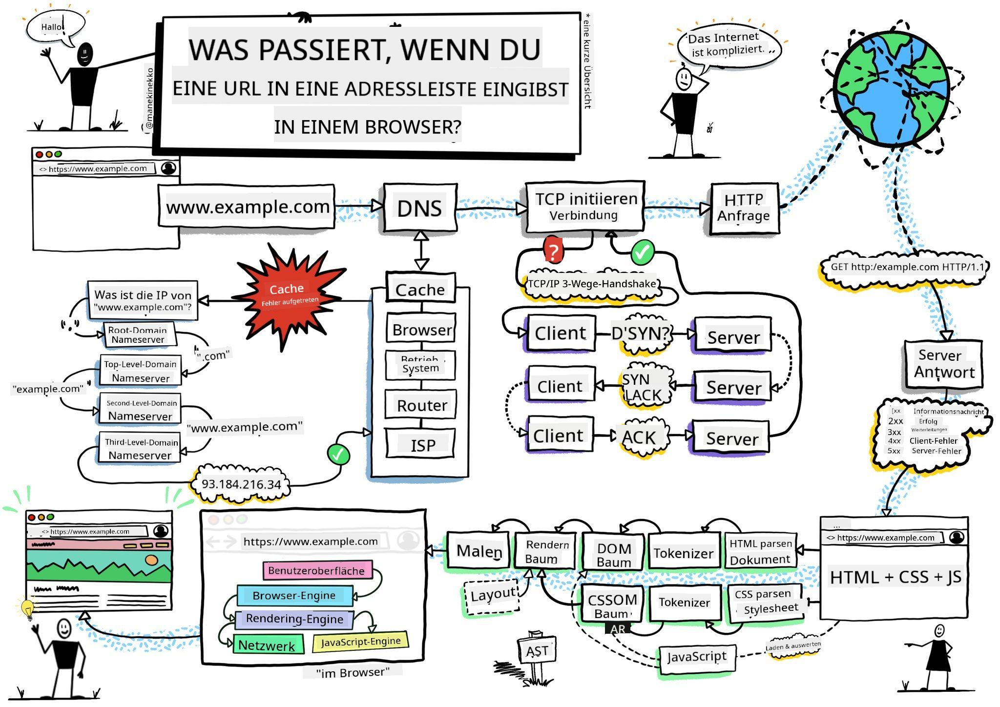
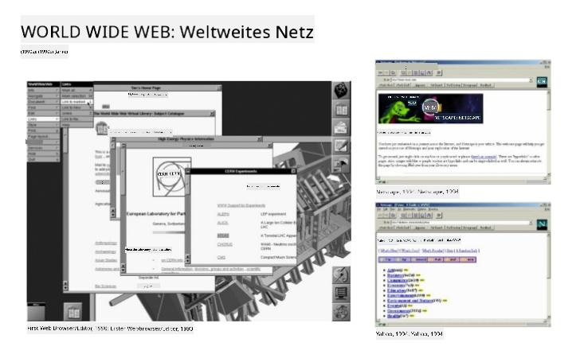
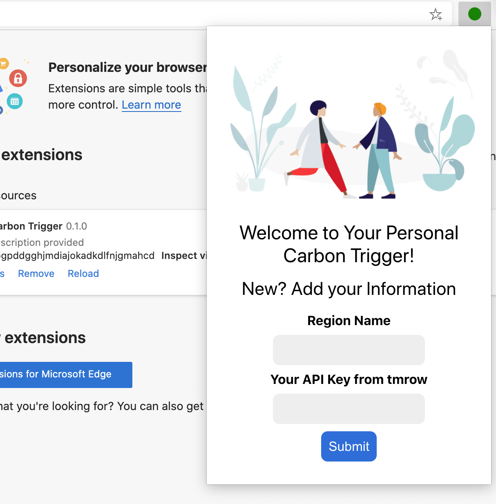
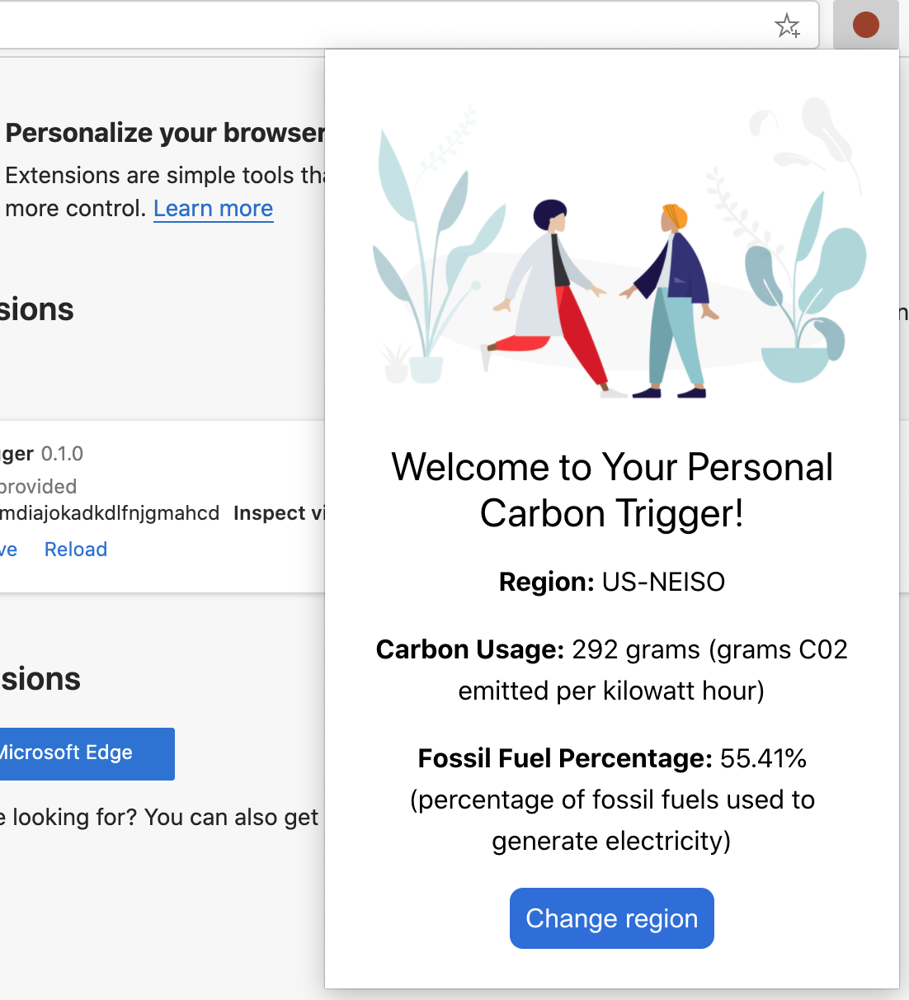

<!--
CO_OP_TRANSLATOR_METADATA:
{
  "original_hash": "2326d04e194a10aa760b51f5e5a1f61d",
  "translation_date": "2025-08-29T14:08:10+00:00",
  "source_file": "5-browser-extension/1-about-browsers/README.md",
  "language_code": "de"
}
-->
# Browser-Erweiterungsprojekt Teil 1: Alles über Browser


> Sketchnote von [Wassim Chegham](https://dev.to/wassimchegham/ever-wondered-what-happens-when-you-type-in-a-url-in-an-address-bar-in-a-browser-3dob)

## Quiz vor der Vorlesung

[Quiz vor der Vorlesung](https://ff-quizzes.netlify.app/web/quiz/23)

### Einführung

Browser-Erweiterungen fügen einem Browser zusätzliche Funktionen hinzu. Bevor du jedoch eine entwickelst, solltest du ein wenig darüber lernen, wie Browser ihre Arbeit erledigen.

### Über den Browser

In dieser Reihe von Lektionen lernst du, wie man eine Browser-Erweiterung entwickelt, die auf Chrome-, Firefox- und Edge-Browsern funktioniert. In diesem Teil wirst du entdecken, wie Browser arbeiten und die Elemente der Browser-Erweiterung vorbereiten.

Aber was genau ist ein Browser? Es ist eine Softwareanwendung, die es einem Endbenutzer ermöglicht, Inhalte von einem Server abzurufen und sie auf Webseiten anzuzeigen.

✅ Ein bisschen Geschichte: Der erste Browser hieß 'WorldWideWeb' und wurde 1990 von Sir Timothy Berners-Lee entwickelt.


> Einige frühe Browser, via [Karen McGrane](https://www.slideshare.net/KMcGrane/week-4-ixd-history-personal-computing)

Wenn ein Benutzer über eine URL-Adresse (Uniform Resource Locator) eine Verbindung zum Internet herstellt, normalerweise über das Hypertext Transfer Protocol mit einer `http`- oder `https`-Adresse, kommuniziert der Browser mit einem Webserver und ruft eine Webseite ab.

An diesem Punkt zeigt die Rendering-Engine des Browsers die Seite auf dem Gerät des Benutzers an, sei es ein Mobiltelefon, Desktop oder Laptop.

Browser haben auch die Fähigkeit, Inhalte zu zwischenspeichern, sodass sie nicht jedes Mal vom Server abgerufen werden müssen. Sie können die Historie der Browsing-Aktivitäten eines Benutzers aufzeichnen, 'Cookies' speichern, kleine Datenbits, die Informationen enthalten, um die Aktivitäten eines Benutzers zu speichern, und mehr.

Ein wirklich wichtiger Punkt, den man über Browser wissen sollte, ist, dass sie nicht alle gleich sind! Jeder Browser hat seine Stärken und Schwächen, und ein professioneller Webentwickler muss verstehen, wie man Webseiten so gestaltet, dass sie in verschiedenen Browsern gut funktionieren. Dazu gehört auch die Anpassung an kleine Viewports wie die eines Mobiltelefons sowie an Benutzer, die offline sind.

Eine wirklich nützliche Website, die du wahrscheinlich in deinem bevorzugten Browser als Lesezeichen speichern solltest, ist [caniuse.com](https://www.caniuse.com). Wenn du Webseiten entwickelst, ist es sehr hilfreich, die Listen unterstützter Technologien von caniuse zu verwenden, um deine Benutzer bestmöglich zu unterstützen.

✅ Wie kannst du herausfinden, welche Browser bei den Benutzern deiner Website am beliebtesten sind? Überprüfe deine Analysen – du kannst verschiedene Analysepakete als Teil deines Webentwicklungsprozesses installieren, und sie zeigen dir, welche Browser von den Benutzern am häufigsten verwendet werden.

## Browser-Erweiterungen

Warum solltest du eine Browser-Erweiterung entwickeln? Es ist eine praktische Ergänzung für deinen Browser, wenn du schnellen Zugriff auf Aufgaben benötigst, die du häufig wiederholst. Wenn du beispielsweise häufig Farben auf verschiedenen Webseiten überprüfen musst, könntest du eine Farbwähler-Browser-Erweiterung installieren. Wenn du Schwierigkeiten hast, dir Passwörter zu merken, könntest du eine Passwortverwaltungs-Browser-Erweiterung verwenden.

Browser-Erweiterungen machen auch Spaß bei der Entwicklung. Sie konzentrieren sich auf eine begrenzte Anzahl von Aufgaben, die sie gut ausführen.

✅ Was sind deine Lieblings-Browser-Erweiterungen? Welche Aufgaben erfüllen sie?

### Erweiterungen installieren

Bevor du mit der Entwicklung beginnst, wirf einen Blick auf den Prozess des Erstellens und Bereitstellens einer Browser-Erweiterung. Obwohl sich die Vorgehensweise bei jedem Browser ein wenig unterscheidet, ist der Prozess bei Chrome und Firefox ähnlich wie in diesem Beispiel für Edge:


> Hinweis: Stelle sicher, dass du den Entwicklermodus aktivierst und Erweiterungen aus anderen Stores zulässt.

Im Wesentlichen wird der Prozess folgendermaßen ablaufen:

- Erstelle deine Erweiterung mit `npm run build` 
- Navigiere im Browser zum Erweiterungsbereich über die Schaltfläche "Einstellungen und mehr" (das `...`-Symbol) oben rechts
- Wenn es sich um eine neue Installation handelt, wähle `load unpacked`, um eine neue Erweiterung aus ihrem Build-Ordner hochzuladen (in unserem Fall ist es `/dist`) 
- oder klicke auf `reload`, wenn du die bereits installierte Erweiterung neu laden möchtest

✅ Diese Anweisungen beziehen sich auf Erweiterungen, die du selbst erstellst; um Erweiterungen zu installieren, die im Browser-Erweiterungsstore des jeweiligen Browsers veröffentlicht wurden, solltest du zu diesen [Stores](https://microsoftedge.microsoft.com/addons/Microsoft-Edge-Extensions-Home) navigieren und die Erweiterung deiner Wahl installieren.

### Loslegen

Du wirst eine Browser-Erweiterung entwickeln, die den CO2-Fußabdruck deiner Region anzeigt, einschließlich des Energieverbrauchs und der Energiequelle deiner Region. Die Erweiterung wird ein Formular enthalten, das einen API-Schlüssel sammelt, um auf die API von CO2 Signal zugreifen zu können.

**Du benötigst:**

- [einen API-Schlüssel](https://www.co2signal.com/); gib deine E-Mail-Adresse in das Feld auf dieser Seite ein, und dir wird ein Schlüssel zugesandt
- den [Code für deine Region](http://api.electricitymap.org/v3/zones), der der [Electricity Map](https://www.electricitymap.org/map) entspricht (in Boston verwende ich beispielsweise 'US-NEISO').
- den [Starter-Code](../../../../5-browser-extension/start). Lade den `start`-Ordner herunter; du wirst den Code in diesem Ordner vervollständigen.
- [NPM](https://www.npmjs.com) - NPM ist ein Paketverwaltungstool; installiere es lokal, und die im `package.json`-Datei aufgeführten Pakete werden für deine Webressourcen installiert.

✅ Erfahre mehr über Paketverwaltung in diesem [exzellenten Lernmodul](https://docs.microsoft.com/learn/modules/create-nodejs-project-dependencies/?WT.mc_id=academic-77807-sagibbon)

Nimm dir einen Moment Zeit, um den Code zu durchstöbern:

dist
    -|manifest.json (Standardeinstellungen hier)
    -|index.html (HTML-Markup für das Frontend hier)
    -|background.js (Hintergrund-JS hier)
    -|main.js (kompiliertes JS)
src
    -|index.js (dein JS-Code kommt hier hin)

✅ Sobald du deinen API-Schlüssel und Regionscode zur Hand hast, speichere diese irgendwo in einer Notiz für die spätere Verwendung.

### HTML für die Erweiterung erstellen

Diese Erweiterung hat zwei Ansichten. Eine, um den API-Schlüssel und den Regionscode zu erfassen:



Und die zweite, um den CO2-Verbrauch der Region anzuzeigen:



Beginnen wir mit dem Erstellen des HTML für das Formular und dem Styling mit CSS.

Im `/dist`-Ordner wirst du ein Formular und einen Ergebnisbereich erstellen. Im `index.html`-Datei fügst du den abgegrenzten Formularbereich ein:

```HTML
<form class="form-data" autocomplete="on">
	<div>
		<h2>New? Add your Information</h2>
	</div>
	<div>
		<label for="region">Region Name</label>
		<input type="text" id="region" required class="region-name" />
	</div>
	<div>
		<label for="api">Your API Key from tmrow</label>
		<input type="text" id="api" required class="api-key" />
	</div>
	<button class="search-btn">Submit</button>
</form>	
```
Dies ist das Formular, in dem deine gespeicherten Informationen eingegeben und im lokalen Speicher gespeichert werden.

Erstelle als Nächstes den Ergebnisbereich; füge unter dem letzten Formular-Tag einige Divs hinzu:

```HTML
<div class="result">
	<div class="loading">loading...</div>
	<div class="errors"></div>
	<div class="data"></div>
	<div class="result-container">
		<p><strong>Region: </strong><span class="my-region"></span></p>
		<p><strong>Carbon Usage: </strong><span class="carbon-usage"></span></p>
		<p><strong>Fossil Fuel Percentage: </strong><span class="fossil-fuel"></span></p>
	</div>
	<button class="clear-btn">Change region</button>
</div>
```
An diesem Punkt kannst du einen Build versuchen. Stelle sicher, dass du die Paketabhängigkeiten dieser Erweiterung installierst:

```
npm install
```

Dieser Befehl verwendet npm, den Node Package Manager, um webpack für den Build-Prozess deiner Erweiterung zu installieren. Webpack ist ein Bundler, der die Code-Kompilierung übernimmt. Du kannst das Ergebnis dieses Prozesses sehen, indem du in `/dist/main.js` nachsiehst – du wirst sehen, dass der Code gebündelt wurde.

Für den Moment sollte die Erweiterung gebaut werden, und wenn du sie als Erweiterung in Edge bereitstellst, wirst du ein sauber angezeigtes Formular sehen.

Herzlichen Glückwunsch, du hast die ersten Schritte zur Entwicklung einer Browser-Erweiterung gemacht. In den folgenden Lektionen wirst du sie funktionaler und nützlicher machen.

---

## 🚀 Herausforderung

Schau dir einen Browser-Erweiterungsstore an und installiere eine Erweiterung in deinem Browser. Du kannst ihre Dateien auf interessante Weise untersuchen. Was entdeckst du?

## Quiz nach der Vorlesung

[Quiz nach der Vorlesung](https://ff-quizzes.netlify.app/web/quiz/24)

## Rückblick & Selbststudium

In dieser Lektion hast du ein wenig über die Geschichte des Webbrowsers gelernt; nutze diese Gelegenheit, um mehr darüber zu erfahren, wie die Erfinder des World Wide Web seine Nutzung envisioned haben, indem du mehr über seine Geschichte liest. Einige nützliche Seiten sind:

[Die Geschichte der Webbrowser](https://www.mozilla.org/firefox/browsers/browser-history/)

[Geschichte des Webs](https://webfoundation.org/about/vision/history-of-the-web/)

[Ein Interview mit Tim Berners-Lee](https://www.theguardian.com/technology/2019/mar/12/tim-berners-lee-on-30-years-of-the-web-if-we-dream-a-little-we-can-get-the-web-we-want)

## Aufgabe 

[Gestalte deine Erweiterung neu](assignment.md)

---

**Haftungsausschluss**:  
Dieses Dokument wurde mithilfe des KI-Übersetzungsdienstes [Co-op Translator](https://github.com/Azure/co-op-translator) übersetzt. Obwohl wir uns um Genauigkeit bemühen, weisen wir darauf hin, dass automatisierte Übersetzungen Fehler oder Ungenauigkeiten enthalten können. Das Originaldokument in seiner ursprünglichen Sprache sollte als maßgebliche Quelle betrachtet werden. Für kritische Informationen wird eine professionelle menschliche Übersetzung empfohlen. Wir übernehmen keine Haftung für Missverständnisse oder Fehlinterpretationen, die aus der Nutzung dieser Übersetzung entstehen.