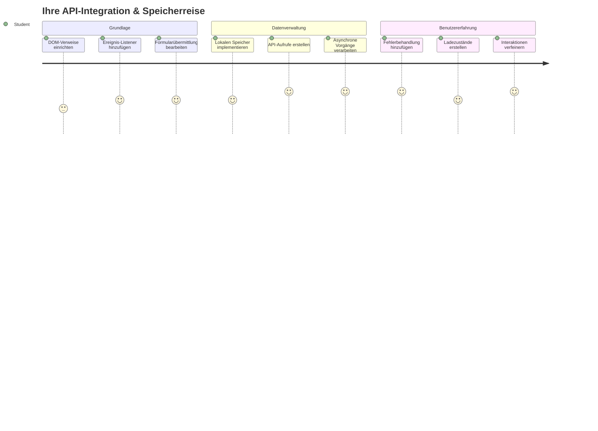
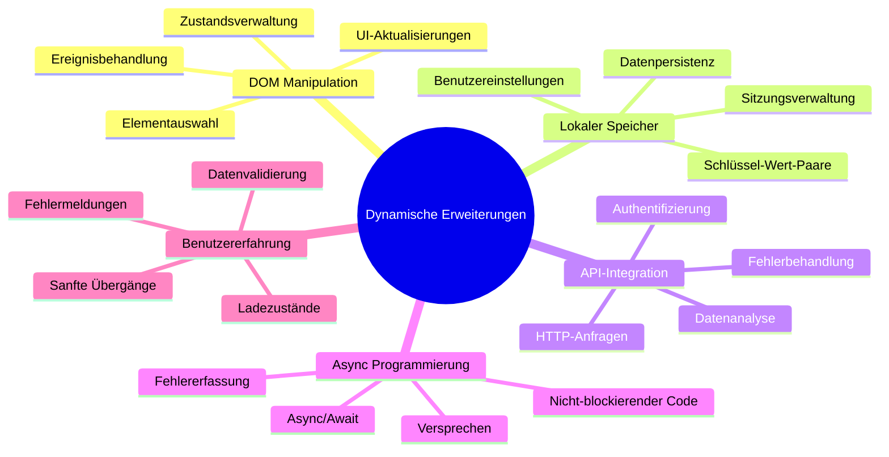
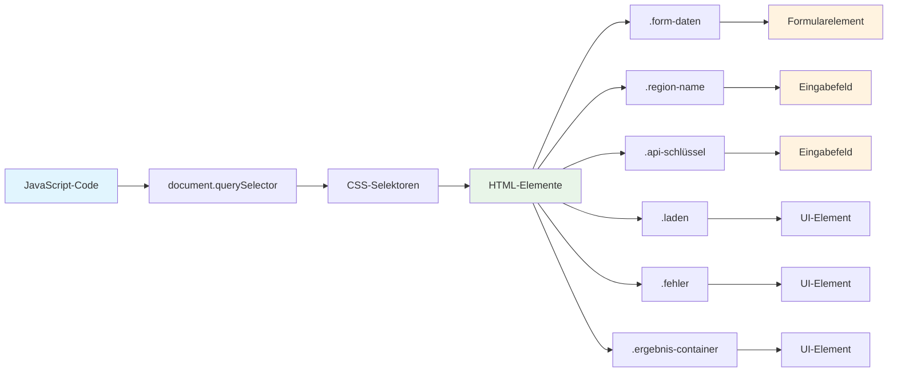
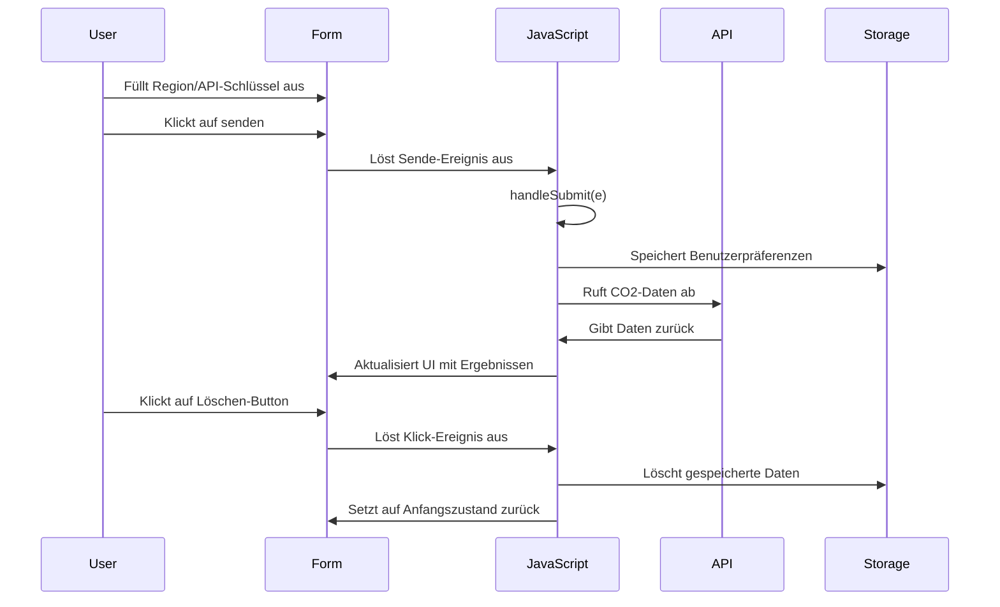
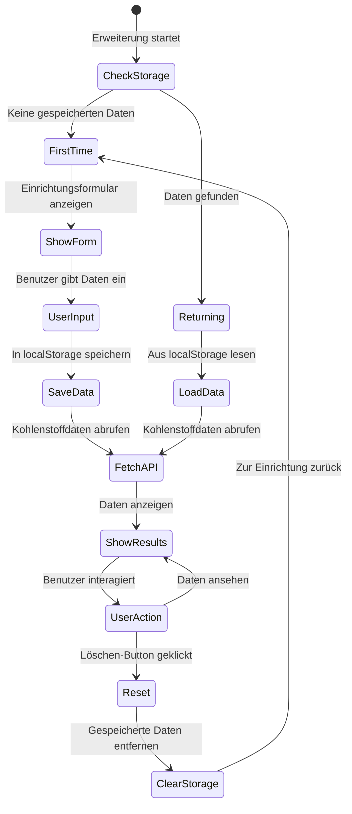
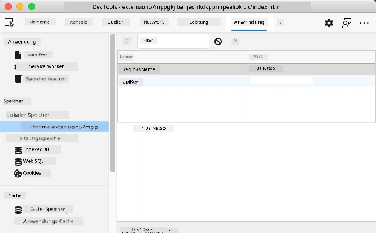
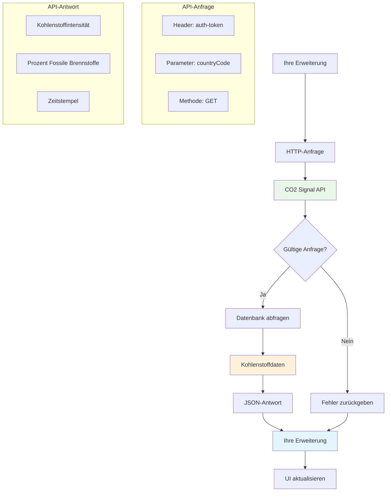
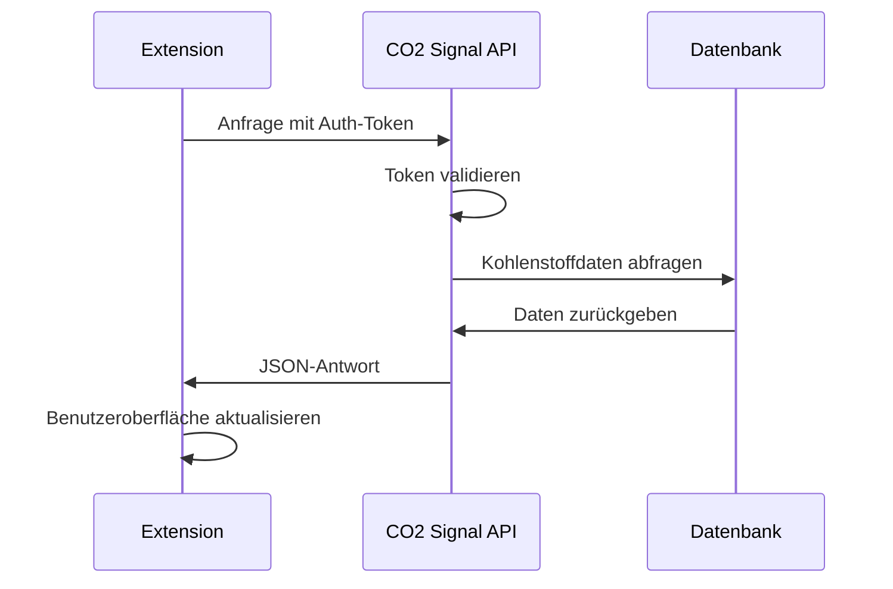
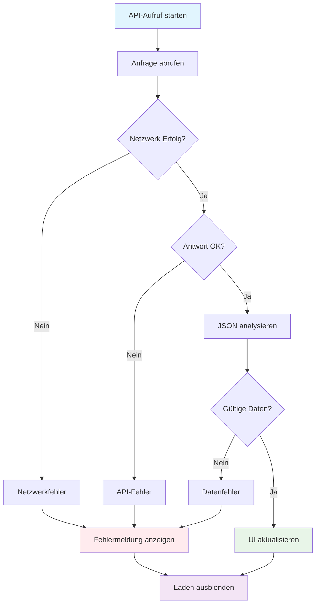
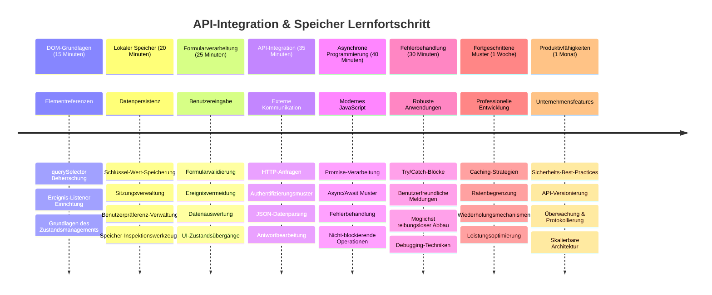

# Browser-Erweiterungsprojekt Teil 2: Eine API aufrufen, lokalen Speicher verwenden


## Quiz vor der Vorlesung

[Quiz vor der Vorlesung](https://ff-quizzes.netlify.app/web/quiz/25)

## Einführung

Erinnere dich an die Browser-Erweiterung, die du angefangen hast zu bauen? Im Moment hast du ein schön aussehendes Formular, aber es ist im Grunde statisch. Heute bringen wir es zum Leben, indem wir es mit echten Daten verbinden und ihm Gedächtnis verleihen.

Denk an die Apollo-Missionskontrollcomputer – sie zeigten nicht nur feste Informationen an. Sie kommunizierten ständig mit den Raumfahrzeugen, aktualisierten sich mit Telemetriedaten und erinnerten sich an kritische Missionsparameter. Genau dieses dynamische Verhalten bauen wir heute. Deine Erweiterung wird das Internet anzapfen, echte Umweltdaten abrufen und deine Einstellungen für das nächste Mal merken.

API-Integration klingt vielleicht komplex, aber es ist eigentlich nur, deinem Code beizubringen, wie er mit anderen Diensten kommuniziert. Ob du Wetterdaten, Social-Media-Feeds oder CO2-Fußabdruckinformationen abrufst, wie wir es heute tun werden – es geht immer darum, diese digitalen Verbindungen herzustellen. Wir werden auch untersuchen, wie Browser Informationen dauerhaft speichern können – ähnlich wie Bibliotheken früher Karteikarten verwendet haben, um Bücher zuzuordnen.

Am Ende dieser Lektion hast du eine Browser-Erweiterung, die echte Daten abruft, Benutzerpräferenzen speichert und eine reibungslose Benutzererfahrung bietet. Lass uns loslegen!


✅ Folge den nummerierten Segmenten in den entsprechenden Dateien, um zu wissen, wo du deinen Code platzieren musst

## Elemente zur Manipulation in der Erweiterung einrichten

Bevor dein JavaScript die Oberfläche manipulieren kann, braucht es Verweise auf bestimmte HTML-Elemente. Das ist wie ein Teleskop, das auf bestimmte Sterne gerichtet werden muss – bevor Galileo die Jupitermonde studieren konnte, musste er Jupiter selbst finden und fokussieren.

In deiner `index.js` Datei erstellen wir `const` Variablen, die Verweise auf jedes wichtige Formularelement erfassen. Dies ist vergleichbar damit, wie Wissenschaftler ihr Equipment beschriften – anstatt jedes Mal das ganze Labor zu durchkämmen, können sie direkt zugreifen, was sie benötigen.


```javascript
// Formularfelder
const form = document.querySelector('.form-data');
const region = document.querySelector('.region-name');
const apiKey = document.querySelector('.api-key');

// Ergebnisse
const errors = document.querySelector('.errors');
const loading = document.querySelector('.loading');
const results = document.querySelector('.result-container');
const usage = document.querySelector('.carbon-usage');
const fossilfuel = document.querySelector('.fossil-fuel');
const myregion = document.querySelector('.my-region');
const clearBtn = document.querySelector('.clear-btn');
```

**Das macht dieser Code:**
- **Erfasst** Formularelemente mit `document.querySelector()` und CSS-Klassenselektoren
- **Erstellt** Referenzen zu Eingabefeldern für den Regionsnamen und den API-Schlüssel
- **Stellt** Verbindungen zu Ergebnisausgabe-Elementen für Daten zum Kohlenstoffverbrauch her
- **Richtet** den Zugriff auf UI-Elemente wie Ladeanzeige und Fehlermeldungen ein
- **Speichert** jeden Elementverweis in einer `const` Variablen zur einfachen Wiederverwendung im Code

## Ereignis-Listener hinzufügen

Jetzt bringen wir deine Erweiterung dazu, auf Benutzeraktionen zu reagieren. Ereignis-Listener sind der Weg deines Codes, Benutzerinteraktionen zu überwachen. Denk an die Telefonistinnen in frühen Telefonzentralen – sie lauschten auf eingehende Anrufe und verbanden die richtigen Leitungen, wenn jemand eine Verbindung aufbauen wollte.


```javascript
form.addEventListener('submit', (e) => handleSubmit(e));
clearBtn.addEventListener('click', (e) => reset(e));
init();
```

**Verständnis dieser Konzepte:**
- **Fügt** dem Formular einen Submit-Listener hinzu, der ausgelöst wird, wenn Nutzer Enter drücken oder absenden
- **Verknüpft** einen Click-Listener mit dem Clear-Button zum Zurücksetzen des Formulars
- **Übergibt** das Ereignisobjekt `(e)` an Handler-Funktionen für zusätzliche Steuerung
- **Ruft** die Funktion `init()` sofort auf, um den Anfangszustand der Erweiterung einzurichten

✅ Beachte die Verwendung der Kurzschreibweise mit Pfeilfunktionen. Diese moderne JavaScript-Methode ist sauberer als klassische Funktionsausdrücke, aber beide funktionieren gleichermaßen gut!

### 🔄 **Pädagogischer Zwischencheck**
**Verständnis der Event-Verarbeitung**: Bevor wir zur Initialisierung übergehen, stelle sicher, dass du:
- ✅ Erklären kannst, wie `addEventListener` Benutzeraktionen mit JavaScript-Funktionen verbindet
- ✅ Verstehst, warum das Ereignisobjekt `(e)` an die Handler-Funktionen übergeben wird
- ✅ Den Unterschied zwischen `submit`- und `click`-Ereignissen erkennst
- ✅ Beschreiben kannst, wann die `init()`-Funktion läuft und warum

**Kurzer Selbsttest**: Was würde passieren, wenn du bei einem Formular-Submit `e.preventDefault()` vergisst?
*Antwort: Die Seite würde neu laden, alle JavaScript-Zustände gehen verloren und die Benutzererfahrung wird unterbrochen*

## Initialisierungs- und Reset-Funktionen bauen

Lass uns die Initialisierungslogik für deine Erweiterung erstellen. Die Funktion `init()` ist wie ein Navigationssystem eines Schiffes, das seine Instrumente prüft – sie bestimmt den aktuellen Zustand und passt die Oberfläche entsprechend an. Sie prüft, ob jemand deine Erweiterung schon benutzt hat und lädt die vorherigen Einstellungen.

Die Funktion `reset()` gibt den Nutzern einen Neustart – ähnlich wie Wissenschaftler ihre Instrumente zwischen Experimenten zurücksetzen, um saubere Daten zu gewährleisten.

```javascript
function init() {
	// Überprüfen, ob der Benutzer zuvor API-Anmeldedaten gespeichert hat
	const storedApiKey = localStorage.getItem('apiKey');
	const storedRegion = localStorage.getItem('regionName');

	// Erweiterungssymbol auf generisches Grün setzen (Platzhalter für zukünftige Lektion)
	// TODO: Symbolaktualisierung in der nächsten Lektion implementieren

	if (storedApiKey === null || storedRegion === null) {
		// Erstbenutzer: Setup-Formular anzeigen
		form.style.display = 'block';
		results.style.display = 'none';
		loading.style.display = 'none';
		clearBtn.style.display = 'none';
		errors.textContent = '';
	} else {
		// Rückkehrender Benutzer: gespeicherte Daten automatisch laden
		displayCarbonUsage(storedApiKey, storedRegion);
		results.style.display = 'none';
		form.style.display = 'none';
		clearBtn.style.display = 'block';
	}
}

function reset(e) {
	e.preventDefault();
	// Gespeicherte Region löschen, um dem Benutzer die Auswahl eines neuen Standorts zu ermöglichen
	localStorage.removeItem('regionName');
	// Initialisierungsprozess neu starten
	init();
}
```

**Das passiert hier im Detail:**
- **Lädt** gespeicherten API-Schlüssel und Region aus dem lokalen Speicher des Browsers
- **Prüft**, ob es ein erster Nutzer (keine gespeicherten Daten) oder ein Wiederkehrender ist
- **Zeigt** das Setup-Formular für neue Nutzer und versteckt andere Interface-Elemente
- **Lädt** gespeicherte Daten automatisch für Wiederkehrende und zeigt die Reset-Option
- **Verwaltet** den Zustand der Benutzeroberfläche basierend auf verfügbaren Daten

**Wichtige Konzepte zu Local Storage:**
- **Speichert** Daten zwischen Browser-Sitzungen (im Gegensatz zum Session Storage)
- **Verwendet** Schlüssel-Wert-Paare mit `getItem()` und `setItem()`
- **Gibt** `null` zurück, wenn keine Daten für einen Schlüssel existieren
- **Bietet** eine einfache Möglichkeit, Benutzerpräferenzen und Einstellungen zu merken

> 💡 **Verständnis für Browser-Speicher**: [LocalStorage](https://developer.mozilla.org/docs/Web/API/Window/localStorage) ist wie dauerhaftes Gedächtnis für deine Erweiterung. Denk an die alte Bibliothek von Alexandria, die Schriftrollen speicherte – Informationen blieben verfügbar, auch wenn Gelehrte gingen und zurückkehrten.
>
> **Wesentliche Merkmale:**
> - **Behält** Daten auch nach Schließen des Browsers
> - **Übersteht** Neustarts des Computers und Browserabstürze
> - **Bietet** umfangreichen Speicherplatz für Benutzerpräferenzen
> - **Ermöglicht** schnellen Zugriff ohne Netzwerklatenzen

> **Wichtiger Hinweis**: Deine Browser-Erweiterung hat einen eigenen isolierten lokalen Speicher, der von regulären Webseiten getrennt ist. Dies sorgt für Sicherheit und verhindert Konflikte mit anderen Websites.

Du kannst deine gespeicherten Daten sehen, indem du die Entwickler-Tools des Browsers öffnest (F12), zum Tab **Application** gehst und dort den Bereich **Local Storage** aufklappst.




> ⚠️ **Sicherheitsaspekt**: In produktiven Anwendungen birgt das Speichern von API-Schlüsseln im LocalStorage Sicherheitsrisiken, da JavaScript diese Daten auslesen kann. Für Lernzwecke ist dieser Ansatz in Ordnung, echte Anwendungen sollten sensible Zugangsdaten sicher serverseitig speichern.

## Formular-Submit verarbeiten

Jetzt behandeln wir, was passiert, wenn jemand dein Formular absendet. Standardmäßig laden Browser die Seite beim Absenden neu, aber wir fangen dieses Verhalten ab, um eine flüssigere Erfahrung zu schaffen.

Dieser Ansatz spiegelt wider, wie die Missionskontrolle die Kommunikation mit Raumfahrzeugen handhabt – statt das ganze System für jede Übertragung zurückzusetzen, halten sie den Betrieb aufrecht und verarbeiten neue Informationen.

Erstelle eine Funktion, die das Submit-Ereignis abfängt und die Benutzereingaben ausliest:

```javascript
function handleSubmit(e) {
	e.preventDefault();
	setUpUser(apiKey.value, region.value);
}
```

**Dabei haben wir:**
- **Verhindert**, dass das Standardverhalten des Formulars den Seitenreload auslöst
- **Extrahiert** die Benutzereingabewerte aus den Feldern für API-Schlüssel und Region
- **Übergibt** die Formulardaten an die Funktion `setUpUser()` zur weiteren Verarbeitung
- **Ermöglicht** durchgängig ein Single-Page-Application-Verhalten ohne Seiten-Neuladen

✅ Beachte, dass deine HTML-Formularfelder das Attribut `required` enthalten, sodass der Browser automatisch validiert, dass Benutzer sowohl den API-Schlüssel als auch die Region eingeben, bevor diese Funktion ausgeführt wird.

## Benutzereinstellungen speichern

Die Funktion `setUpUser` ist dafür verantwortlich, die Benutzerdaten zu speichern und den ersten API-Aufruf zu starten. So entsteht ein fließender Übergang vom Setup zur Ergebnisanzeige.

```javascript
function setUpUser(apiKey, regionName) {
	// Benutzeranmeldeinformationen für zukünftige Sitzungen speichern
	localStorage.setItem('apiKey', apiKey);
	localStorage.setItem('regionName', regionName);
	
	// Benutzeroberfläche aktualisieren, um den Ladezustand anzuzeigen
	loading.style.display = 'block';
	errors.textContent = '';
	clearBtn.style.display = 'block';
	
	// CO2-Nutzungsdaten mit den Anmeldeinformationen des Benutzers abrufen
	displayCarbonUsage(apiKey, regionName);
}
```

**Schritt für Schritt passiert hier:**
- **Speichert** den API-Schlüssel und Regionsnamen im lokalen Speicher für spätere Verwendung
- **Zeigt** eine Ladeanzeige, um Benutzer über das Datenabrufen zu informieren
- **Löscht** vorherige Fehlermeldungen aus der Anzeige
- **Macht** den Clear-Button sichtbar, damit Nutzer später zurücksetzen können
- **Startet** den API-Aufruf, um echte Daten zum Kohlenstoffverbrauch zu holen

Diese Funktion schafft ein nahtloses Benutzererlebnis, indem sie Datenpersistenz und UI-Updates in einer koordinierten Aktion kombiniert.

## Kohlenstoffverbrauchsdaten anzeigen

Jetzt verbinden wir deine Erweiterung mit externen Datenquellen über APIs. So wird deine Erweiterung von einem eigenständigen Tool zu etwas, das Echtzeitinformationen aus dem Internet abruft.

**APIs verstehen**

[APIs](https://www.webopedia.com/TERM/A/API.html) sind die Art und Weise, wie verschiedene Anwendungen miteinander kommunizieren. Stell sie dir vor wie das Telegrafensystem des 19. Jahrhunderts, das entfernte Städte verband – Operatoren schickten Anfragen zu entfernten Stationen und erhielten Antworten mit den gewünschten Informationen. Jedes Mal, wenn du Social Media checkst, eine Sprachassistenz fragst oder eine Liefer-App nutzt, ermöglichen APIs diese Datenaustausche.


**Wichtige Konzepte zu REST APIs:**
- **REST** steht für „Representational State Transfer“
- **Verwendet** Standard-HTTP-Methoden (GET, POST, PUT, DELETE) zur Dateninteraktion
- **Gibt** Daten in vorhersehbaren Formaten zurück, typischerweise JSON
- **Bietet** konsistente, URL-basierte Endpunkte für verschiedene Anfragearten

✅ Die [CO2 Signal API](https://www.co2signal.com/), die wir verwenden, liefert Echtzeitdaten zur Kohlenstoffintensität von Stromnetzen weltweit. So verstehen Nutzer die Umweltwirkung ihres Stromverbrauchs!

> 💡 **Verständnis asynchroner JavaScript-Programmierung**: Das [`async`-Schlüsselwort](https://developer.mozilla.org/docs/Web/JavaScript/Reference/Statements/async_function) ermöglicht deinem Code, mehrere Operationen gleichzeitig zu verarbeiten. Wenn du Daten von einem Server anforderst, soll deine Erweiterung nicht einfrieren – das wäre wie eine Flugverkehrskontrolle, die alle Vorgänge stoppt, bis ein Flugzeug antwortet.
>
> **Wichtige Vorteile:**
> - **Bewahrt** die Reaktionsfähigkeit der Erweiterung während des Datenladens
> - **Erlaubt** anderen Code, während Netzwerk-Anfragen weiterzulaufen
> - **Verbessert** die Lesbarkeit im Vergleich zu klassischen Callback-Mustern
> - **Ermöglicht** elegante Fehlerbehandlung bei Netzwerkproblemen

Hier ein kurzes Video zu `async`:

[](https://youtube.com/watch?v=YwmlRkrxvkk "Async und Await zum Verwalten von Promises")

> 🎥 Klicke auf das Bild oben für ein Video über async/await.

### 🔄 **Pädagogischer Zwischencheck**
**Verständnis asynchroner Programmierung**: Bevor wir in die API-Funktion einsteigen, vergewissere dich, dass du verstehst:
- ✅ Warum wir `async/await` verwenden, statt die ganze Erweiterung zu blockieren
- ✅ Wie `try/catch`-Blöcke Netzwerkfehler elegant abfangen
- ✅ Den Unterschied zwischen synchronen und asynchronen Operationen
- ✅ Warum API-Aufrufe scheitern können und wie man diese Fehler behandelt

**Alltagsbezug zu Async-Operationen**:
- **Essen bestellen**: Du wartest nicht neben der Küche – bekommst einen Beleg und erledigst andere Dinge
- **E-Mails senden**: Deine Mail-App friert beim Senden nicht ein – du kannst weiter neue Mails schreiben
- **Webseiten laden**: Bilder laden stufenweise, während du schon Text lesen kannst

**API-Authentifizierungsablauf**:

Erstelle die Funktion, um Kohlenstoffverbrauchsdaten abzurufen und anzuzeigen:

```javascript
// Moderner Fetch-API-Ansatz (keine externen Abhängigkeiten erforderlich)
async function displayCarbonUsage(apiKey, region) {
	try {
		// Kohlenstoffintensitätsdaten von der CO2 Signal API abrufen
		const response = await fetch('https://api.co2signal.com/v1/latest', {
			method: 'GET',
			headers: {
				'auth-token': apiKey,
				'Content-Type': 'application/json'
			},
			// Abfrageparameter für die spezifische Region hinzufügen
			...new URLSearchParams({ countryCode: region }) && {
				url: `https://api.co2signal.com/v1/latest?countryCode=${region}`
			}
		});

		// Überprüfen, ob die API-Anfrage erfolgreich war
		if (!response.ok) {
			throw new Error(`API request failed: ${response.status}`);
		}

		const data = await response.json();
		const carbonData = data.data;

		// Gerundeten Wert der Kohlenstoffintensität berechnen
		const carbonIntensity = Math.round(carbonData.carbonIntensity);

		// Benutzeroberfläche mit abgerufenen Daten aktualisieren
		loading.style.display = 'none';
		form.style.display = 'none';
		myregion.textContent = region.toUpperCase();
		usage.textContent = `${carbonIntensity} grams (grams CO₂ emitted per kilowatt hour)`;
		fossilfuel.textContent = `${carbonData.fossilFuelPercentage.toFixed(2)}% (percentage of fossil fuels used to generate electricity)`;
		results.style.display = 'block';

		// TODO: calculateColor(carbonIntensity) - in der nächsten Lektion implementieren

	} catch (error) {
		console.error('Error fetching carbon data:', error);
		
		// Benutzerfreundliche Fehlermeldung anzeigen
		loading.style.display = 'none';
		results.style.display = 'none';
		errors.textContent = 'Sorry, we couldn\'t fetch data for that region. Please check your API key and region code.';
	}
}
```

**Das passiert hier im Detail:**
- **Verwendet** die moderne `fetch()` API anstelle externer Bibliotheken wie Axios für sauberen, abhängigkeitfreien Code
- **Implementiert** robuste Fehlerprüfung mittels `response.ok`, um API-Fehler früh zu erkennen
- **Handhabt** asynchrone Abläufe mit `async/await` für bessere Lesbarkeit
- **Authentifiziert** sich bei der CO2 Signal API via `auth-token` Header
- **Parst** JSON-Antwortdaten und extrahiert Kohlenstoffintensitätsinformationen
- **Aktualisiert** mehrere UI-Elemente mit formatierten Umweltdaten
- **Zeigt** benutzerfreundliche Fehlermeldungen bei API-Ausfällen

**Wichtige moderne JavaScript-Konzepte in Aktion:**
- **Template-Literale** mit `${}` Syntax für saubere String-Formatierung
- **Fehlerbehandlung** mit try/catch-Blöcken für robuste Anwendungen
- **Async/await** Muster für elegante Netzwerk-Anfragen
- **Objektdestrukturierung** zum Extrahieren spezifischer Daten aus API-Antworten
- **Method Chaining** für mehrere DOM-Manipulationen in einer Kette

✅ Diese Funktion demonstriert zahlreiche zentrale Webentwicklungskompetenzen – Kommunikation mit externen Servern, Authentifizierung, Datenverarbeitung, UI-Updates und Fehler-Handling. Diese Fähigkeiten verwenden professionelle Entwickler täglich.


### 🔄 **Pädagogischer Zwischencheck**
**Gesamtverständnis des Systems**: Überprüfe dein Verständnis des kompletten Ablaufs:
- ✅ Wie DOM-Referenzen JavaScript ermöglichen, die Oberfläche zu steuern
- ✅ Warum Local Storage Persistenz zwischen Browser-Sitzungen schafft
- ✅ Wie async/await API-Aufrufe ermöglicht, ohne dass die Erweiterung einfriert
- ✅ Was passiert, wenn API-Aufrufe fehlschlagen, und wie Fehler behandelt werden
- ✅ Warum Benutzererfahrung Ladezustände und Fehlermeldungen einschließt

🎉 **Was du erreicht hast:** Du hast eine Browser-Erweiterung gebaut, die:
- **Verbindet** sich mit dem Internet und ruft echte Umweltdaten ab
- **Speichert** Benutzereinstellungen dauerhaft zwischen Sitzungen
- **Behandelt** Fehler elegant statt abstürzend
- **Bietet** eine reibungslose, professionelle Benutzererfahrung

Teste dein Ergebnis, indem du `npm run build` ausführst und deine Erweiterung im Browser aktualisierst. Du hast jetzt einen funktionierenden CO2-Fußabdruck-Tracker. Die nächste Lektion wird dynamische Icon-Funktionalität hinzufügen, um die Erweiterung abzurunden.

---

## GitHub Copilot Agent-Herausforderung 🚀

Verwende den Agent-Modus, um die folgende Herausforderung zu lösen:
**Beschreibung:** Verbessere die Browser-Erweiterung, indem du Fehlerbehandlungsverbesserungen und Funktionen zur Benutzererfahrung hinzufügst. Diese Aufgabe hilft dir, den Umgang mit APIs, lokalem Speicher und DOM-Manipulation unter Verwendung moderner JavaScript-Muster zu üben.

**Aufgabe:** Erstelle eine erweiterte Version der Funktion displayCarbonUsage, die Folgendes beinhaltet: 1) Einen Retry-Mechanismus für fehlgeschlagene API-Aufrufe mit exponentiellem Backoff, 2) Eingabevalidierung des Regionscodes vor dem API-Aufruf, 3) Eine Ladeanimation mit Fortschrittsindikatoren, 4) Zwischenspeicherung von API-Antworten im localStorage mit Ablaufzeitstempeln (Cache für 30 Minuten), und 5) Eine Funktion, um historische Daten aus vorangegangenen API-Aufrufen anzuzeigen. Füge außerdem ordnungsgemäße TypeScript-ähnliche JSDoc-Kommentare zum Dokumentieren aller Funktionsparameter und Rückgabewerte hinzu.

Erfahre mehr über den [Agent-Modus](https://code.visualstudio.com/blogs/2025/02/24/introducing-copilot-agent-mode) hier.

## 🚀 Herausforderung

Erweitere dein Verständnis für APIs, indem du die Fülle an browserbasierten APIs für die Webentwicklung erkundest. Wähle eine dieser Browser-APIs und erstelle eine kleine Demonstration:

- [Geolocation API](https://developer.mozilla.org/docs/Web/API/Geolocation_API) – Ermittle den aktuellen Standort des Nutzers
- [Notification API](https://developer.mozilla.org/docs/Web/API/Notifications_API) – Sende Desktop-Benachrichtigungen
- [HTML Drag and Drop API](https://developer.mozilla.org/docs/Web/API/HTML_Drag_and_Drop_API) – Erstelle interaktive Drag-Oberflächen
- [Web Storage API](https://developer.mozilla.org/docs/Web/API/Web_Storage_API) – Erweiterte Techniken zur lokalen Speicherung
- [Fetch API](https://developer.mozilla.org/docs/Web/API/Fetch_API) – Moderne Alternative zu XMLHttpRequest

**Forschungsfragen, die du bedenken solltest:**
- Welche realen Probleme löst diese API?
- Wie geht die API mit Fehlern und Grenzfällen um?
- Welche Sicherheitsaspekte müssen bei der Nutzung dieser API beachtet werden?
- Wie breit wird diese API von verschiedenen Browsern unterstützt?

Nach deiner Recherche identifiziere, welche Eigenschaften eine API entwicklerfreundlich und zuverlässig machen.

## Nach-der-Vorlesung-Quiz

[Nach-der-Vorlesung-Quiz](https://ff-quizzes.netlify.app/web/quiz/26)

## Rückblick & Selbststudium

Du hast in dieser Lektion über LocalStorage und APIs gelernt, beides sehr nützlich für professionelle Webentwickler. Kannst du dir vorstellen, wie diese beiden Dinge zusammenarbeiten? Überlege, wie du eine Webseite gestalten würdest, die Elemente speichert, die von einer API genutzt werden.

### ⚡ **Was du in den nächsten 5 Minuten tun kannst**
- [ ] Öffne den DevTools Application-Tab und erkunde localStorage auf irgendeiner Webseite
- [ ] Erstelle ein einfaches HTML-Formular und teste die Formularvalidierung im Browser
- [ ] Probiere aus, Daten über localStorage in der Browser-Konsole zu speichern und abzurufen
- [ ] Untersuche Formulardaten, die über den Network-Tab gesendet werden

### 🎯 **Was du in dieser Stunde erreichen kannst**
- [ ] Mache das Quiz nach der Lektion und verstehe Konzepte der Formularverarbeitung
- [ ] Baue ein Browser-Extension-Formular, das Nutzerpräferenzen speichert
- [ ] Implementiere clientseitige Formularvalidierung mit hilfreichen Fehlermeldungen
- [ ] Übe die Nutzung der chrome.storage-API für die dauerhafte Speicherung in Erweiterungen
- [ ] Erstelle eine Benutzeroberfläche, die auf gespeicherte Nutzereinstellungen reagiert

### 📅 **Dein wochenlanges Erweiterungsprojekt**
- [ ] Entwickle eine vollwertige Browser-Erweiterung mit Formularfunktionalität
- [ ] Beherrsche verschiedene Speicheroptionen: lokal, synchron und Sitzungsspeicher
- [ ] Implementiere erweiterte Formularfunktionen wie Autovervollständigung und Validierung
- [ ] Füge Import-/Export-Funktionalitäten für Nutzerdaten hinzu
- [ ] Teste deine Erweiterung gründlich in verschiedenen Browsern
- [ ] Optimiere die Benutzererfahrung und Fehlerbehandlung deiner Erweiterung

### 🌟 **Deine monatelange Web-API-Meisterschaft**
- [ ] Erstelle komplexe Anwendungen mithilfe verschiedenster browserbasierter Speicher-APIs
- [ ] Lerne Offline-First-Entwicklungsmuster kennen
- [ ] Trage zu Open-Source-Projekten bezüglich Datenpersistenz bei
- [ ] Meistere datenschutzorientierte Entwicklung und DSGVO-Konformität
- [ ] Erstelle wiederverwendbare Bibliotheken zur Formularverarbeitung und Datenverwaltung
- [ ] Teile Wissen über Web-APIs und Erweiterungsentwicklung

## 🎯 Dein Entwicklungszeitplan für Erweiterungen


### 🛠️ Zusammenfassung deiner Full-Stack-Entwicklungswerkzeuge

Nach Abschluss dieser Lektion verfügst du nun über:
- **DOM-Kenntnisse**: Präzise Zielgruppenansprache und Manipulation von Elementen
- **Speicherexpertise**: Persistentes Datenmanagement mit localStorage
- **API-Integration**: Echtzeit-Datenabruf und Authentifizierung
- **Asynchrone Programmierung**: Nicht-blockierende Abläufe mit modernem JavaScript
- **Fehlerbehandlung**: Robuste Anwendungen, die Fehler elegant behandeln
- **Benutzererfahrung**: Ladezustände, Validierung und flüssige Interaktionen
- **Moderne Muster**: fetch API, async/await und ES6+ Features

**Erworbene Fachkompetenzen**: Du hast Muster implementiert, die verwendet werden in:
- **Webanwendungen**: Single-Page-Apps mit externen Datenquellen
- **Mobiler Entwicklung**: API-gesteuerte Apps mit Offline-Funktionalitäten
- **Desktop-Software**: Electron-Apps mit persistentem Speicher
- **Unternehmenssystemen**: Authentifizierung, Caching und Fehlerbehandlung
- **Modernen Frameworks**: React/Vue/Angular Datamanagement-Muster

**Nächstes Level**: Du bist bereit, fortgeschrittene Themen wie Caching-Strategien, Echtzeit-WebSocket-Verbindungen oder komplexes State-Management zu erforschen!

## Aufgabe

[Adoptiere eine API](assignment.md)

---

<!-- CO-OP TRANSLATOR DISCLAIMER START -->
**Haftungsausschluss**:  
Dieses Dokument wurde mit dem KI-Übersetzungsdienst [Co-op Translator](https://github.com/Azure/co-op-translator) übersetzt. Obwohl wir auf Genauigkeit achten, können automatisierte Übersetzungen Fehler oder Ungenauigkeiten enthalten. Das Originaldokument in seiner ursprünglichen Sprache ist als maßgebliche Quelle zu betrachten. Für wichtige Informationen wird eine professionelle menschliche Übersetzung empfohlen. Wir übernehmen keine Haftung für Missverständnisse oder Fehlinterpretationen, die aus der Nutzung dieser Übersetzung entstehen.
<!-- CO-OP TRANSLATOR DISCLAIMER END -->