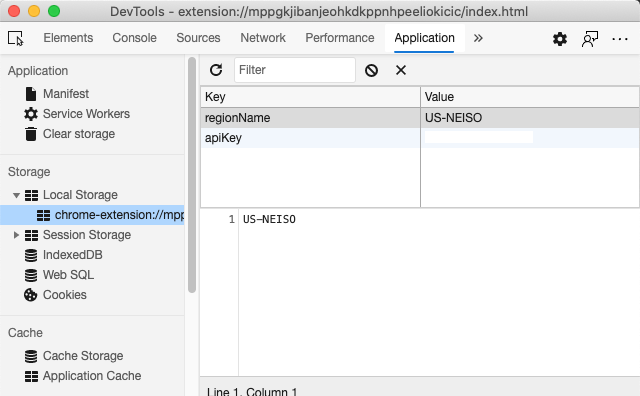

<!--
CO_OP_TRANSLATOR_METADATA:
{
  "original_hash": "a7587943d38d095de8613e1b508609f5",
  "translation_date": "2025-08-29T14:10:10+00:00",
  "source_file": "5-browser-extension/2-forms-browsers-local-storage/README.md",
  "language_code": "de"
}
-->
# Browser-Erweiterungsprojekt Teil 2: Eine API aufrufen, Local Storage verwenden

## Quiz vor der Lektion

[Quiz vor der Lektion](https://ff-quizzes.netlify.app/web/quiz/25)

### Einführung

In dieser Lektion wirst du eine API aufrufen, indem du das Formular deiner Browser-Erweiterung übermittelst und die Ergebnisse in der Erweiterung anzeigst. Außerdem lernst du, wie du Daten im lokalen Speicher deines Browsers für zukünftige Verwendungen speichern kannst.

✅ Folge den nummerierten Abschnitten in den entsprechenden Dateien, um zu wissen, wo du deinen Code platzieren musst.

### Elemente für die Erweiterung vorbereiten:

Bis zu diesem Punkt hast du das HTML für das Formular und das `<div>` für die Ergebnisse deiner Browser-Erweiterung erstellt. Ab jetzt wirst du in der Datei `/src/index.js` arbeiten und deine Erweiterung Schritt für Schritt aufbauen. Sieh dir die [vorherige Lektion](../1-about-browsers/README.md) an, um dein Projekt einzurichten und den Build-Prozess zu verstehen.

Beginne in deiner `index.js`-Datei damit, einige `const`-Variablen zu erstellen, die die Werte der verschiedenen Felder speichern:

```JavaScript
// form fields
const form = document.querySelector('.form-data');
const region = document.querySelector('.region-name');
const apiKey = document.querySelector('.api-key');

// results
const errors = document.querySelector('.errors');
const loading = document.querySelector('.loading');
const results = document.querySelector('.result-container');
const usage = document.querySelector('.carbon-usage');
const fossilfuel = document.querySelector('.fossil-fuel');
const myregion = document.querySelector('.my-region');
const clearBtn = document.querySelector('.clear-btn');
```

Alle diese Felder werden über ihre CSS-Klasse referenziert, wie du sie im HTML in der vorherigen Lektion eingerichtet hast.

### Event Listener hinzufügen

Als Nächstes füge Event Listener für das Formular und den Button zum Zurücksetzen hinzu, sodass etwas passiert, wenn ein Benutzer das Formular übermittelt oder den Button klickt. Füge außerdem den Aufruf zur Initialisierung der App am Ende der Datei hinzu:

```JavaScript
form.addEventListener('submit', (e) => handleSubmit(e));
clearBtn.addEventListener('click', (e) => reset(e));
init();
```

✅ Beachte die Kurzschreibweise, die verwendet wird, um auf ein Submit- oder Click-Event zu hören, und wie das Event an die Funktionen `handleSubmit` oder `reset` übergeben wird. Kannst du die äquivalente Langform dieser Kurzschreibweise schreiben? Welche bevorzugst du?

### Die Funktionen `init()` und `reset()` erstellen:

Jetzt wirst du die Funktion erstellen, die die Erweiterung initialisiert, genannt `init()`:

```JavaScript
function init() {
	//if anything is in localStorage, pick it up
	const storedApiKey = localStorage.getItem('apiKey');
	const storedRegion = localStorage.getItem('regionName');

	//set icon to be generic green
	//todo

	if (storedApiKey === null || storedRegion === null) {
		//if we don't have the keys, show the form
		form.style.display = 'block';
		results.style.display = 'none';
		loading.style.display = 'none';
		clearBtn.style.display = 'none';
		errors.textContent = '';
	} else {
        //if we have saved keys/regions in localStorage, show results when they load
        displayCarbonUsage(storedApiKey, storedRegion);
		results.style.display = 'none';
		form.style.display = 'none';
		clearBtn.style.display = 'block';
	}
};

function reset(e) {
	e.preventDefault();
	//clear local storage for region only
	localStorage.removeItem('regionName');
	init();
}

```

In dieser Funktion gibt es interessante Logik. Kannst du nachvollziehen, was passiert?

- Zwei `const`-Variablen werden eingerichtet, um zu prüfen, ob der Benutzer einen API-Schlüssel und einen Regionscode im lokalen Speicher gespeichert hat.
- Wenn einer dieser Werte `null` ist, wird das Formular angezeigt, indem sein Stil auf 'block' gesetzt wird.
- Die Bereiche für Ergebnisse, Ladeanzeige und den Button zum Zurücksetzen werden ausgeblendet, und jeglicher Fehlertext wird auf einen leeren String gesetzt.
- Wenn ein Schlüssel und eine Region vorhanden sind, wird eine Routine gestartet, um:
  - die API aufzurufen, um Daten zur CO2-Nutzung abzurufen,
  - den Bereich für Ergebnisse auszublenden,
  - das Formular auszublenden,
  - den Button zum Zurücksetzen anzuzeigen.

Bevor du weitermachst, ist es nützlich, ein sehr wichtiges Konzept zu lernen, das in Browsern verfügbar ist: [LocalStorage](https://developer.mozilla.org/docs/Web/API/Window/localStorage). LocalStorage ist eine nützliche Möglichkeit, Strings im Browser als `key-value`-Paar zu speichern. Diese Art von Webspeicher kann durch JavaScript manipuliert werden, um Daten im Browser zu verwalten. LocalStorage läuft nicht ab, während SessionStorage, eine andere Art von Webspeicher, gelöscht wird, wenn der Browser geschlossen wird. Die verschiedenen Speicherarten haben Vor- und Nachteile in ihrer Nutzung.

> Hinweis - Deine Browser-Erweiterung hat ihren eigenen lokalen Speicher; das Hauptbrowserfenster ist eine separate Instanz und verhält sich unabhängig.

Du setzt deinen API-Schlüssel auf einen String-Wert, und du kannst sehen, dass er in Edge gesetzt ist, indem du eine Webseite "inspizierst" (du kannst mit der rechten Maustaste auf einen Browser klicken, um zu inspizieren) und zum Tab "Applications" gehst, um den Speicher zu sehen.



✅ Überlege dir Situationen, in denen du keine Daten im LocalStorage speichern möchtest. Im Allgemeinen ist es eine schlechte Idee, API-Schlüssel im LocalStorage zu speichern! Kannst du nachvollziehen, warum? In unserem Fall, da unsere App rein zu Lernzwecken dient und nicht in einem App-Store veröffentlicht wird, verwenden wir diese Methode.

Beachte, dass du die Web-API verwendest, um LocalStorage zu manipulieren, entweder mit `getItem()`, `setItem()` oder `removeItem()`. Es wird von den meisten Browsern unterstützt.

Bevor du die Funktion `displayCarbonUsage()` erstellst, die in `init()` aufgerufen wird, lass uns die Funktionalität für die anfängliche Formularübermittlung erstellen.

### Formularübermittlung verarbeiten

Erstelle eine Funktion namens `handleSubmit`, die ein Event-Argument `(e)` akzeptiert. Stoppe die Weiterleitung des Events (in diesem Fall möchten wir verhindern, dass der Browser aktualisiert wird) und rufe eine neue Funktion `setUpUser` auf, indem du die Argumente `apiKey.value` und `region.value` übergibst. Auf diese Weise verwendest du die beiden Werte, die über das anfängliche Formular eingegeben werden, wenn die entsprechenden Felder ausgefüllt sind.

```JavaScript
function handleSubmit(e) {
	e.preventDefault();
	setUpUser(apiKey.value, region.value);
}
```

✅ Erinnere dich - das HTML, das du in der letzten Lektion eingerichtet hast, hat zwei Eingabefelder, deren `values` über die `const`-Variablen erfasst werden, die du am Anfang der Datei eingerichtet hast. Beide Felder sind `required`, sodass der Browser Benutzer daran hindert, Nullwerte einzugeben.

### Benutzer einrichten

Weiter geht es mit der Funktion `setUpUser`. Hier setzt du die Werte für `apiKey` und `regionName` im lokalen Speicher. Füge eine neue Funktion hinzu:

```JavaScript
function setUpUser(apiKey, regionName) {
	localStorage.setItem('apiKey', apiKey);
	localStorage.setItem('regionName', regionName);
	loading.style.display = 'block';
	errors.textContent = '';
	clearBtn.style.display = 'block';
	//make initial call
	displayCarbonUsage(apiKey, regionName);
}
```

Diese Funktion zeigt eine Ladeanzeige, während die API aufgerufen wird. An diesem Punkt hast du die wichtigste Funktion dieser Browser-Erweiterung erreicht!

### CO2-Nutzung anzeigen

Endlich ist es Zeit, die API abzufragen!

Bevor wir weitermachen, sollten wir über APIs sprechen. APIs, oder [Application Programming Interfaces](https://www.webopedia.com/TERM/A/API.html), sind ein kritisches Element im Werkzeugkasten eines Webentwicklers. Sie bieten standardisierte Möglichkeiten, wie Programme miteinander interagieren und Schnittstellen bereitstellen können. Zum Beispiel, wenn du eine Webseite erstellst, die eine Datenbank abfragen muss, könnte jemand eine API dafür erstellt haben. Während es viele Arten von APIs gibt, ist eine der beliebtesten eine [REST API](https://www.smashingmagazine.com/2018/01/understanding-using-rest-api/).

✅ Der Begriff 'REST' steht für 'Representational State Transfer' und verwendet unterschiedlich konfigurierte URLs, um Daten abzurufen. Recherchiere ein wenig über die verschiedenen Arten von APIs, die Entwicklern zur Verfügung stehen. Welches Format spricht dich an?

Es gibt wichtige Dinge, die du über diese Funktion beachten solltest. Zunächst fällt das [`async`-Schlüsselwort](https://developer.mozilla.org/docs/Web/JavaScript/Reference/Statements/async_function) auf. Funktionen so zu schreiben, dass sie asynchron ausgeführt werden, bedeutet, dass sie auf eine Aktion, wie das Abrufen von Daten, warten, bevor sie fortfahren.

Hier ist ein kurzes Video über `async`:

[](https://youtube.com/watch?v=YwmlRkrxvkk "Async und Await für die Verwaltung von Promises")

> 🎥 Klicke auf das Bild oben für ein Video über async/await.

Erstelle eine neue Funktion, um die CO2Signal-API abzufragen:

```JavaScript
import axios from '../node_modules/axios';

async function displayCarbonUsage(apiKey, region) {
	try {
		await axios
			.get('https://api.co2signal.com/v1/latest', {
				params: {
					countryCode: region,
				},
				headers: {
					'auth-token': apiKey,
				},
			})
			.then((response) => {
				let CO2 = Math.floor(response.data.data.carbonIntensity);

				//calculateColor(CO2);

				loading.style.display = 'none';
				form.style.display = 'none';
				myregion.textContent = region;
				usage.textContent =
					Math.round(response.data.data.carbonIntensity) + ' grams (grams C02 emitted per kilowatt hour)';
				fossilfuel.textContent =
					response.data.data.fossilFuelPercentage.toFixed(2) +
					'% (percentage of fossil fuels used to generate electricity)';
				results.style.display = 'block';
			});
	} catch (error) {
		console.log(error);
		loading.style.display = 'none';
		results.style.display = 'none';
		errors.textContent = 'Sorry, we have no data for the region you have requested.';
	}
}
```

Das ist eine große Funktion. Was passiert hier?

- Nach Best Practices verwendest du das `async`-Schlüsselwort, um diese Funktion asynchron zu gestalten. Die Funktion enthält einen `try/catch`-Block, da sie ein Promise zurückgibt, wenn die API Daten liefert. Da du keine Kontrolle über die Geschwindigkeit hast, mit der die API antwortet (sie könnte auch gar nicht antworten!), musst du diese Unsicherheit durch asynchrones Aufrufen handhaben.
- Du fragst die CO2Signal-API ab, um die Daten deiner Region zu erhalten, und verwendest deinen API-Schlüssel. Um diesen Schlüssel zu verwenden, musst du eine Art Authentifizierung in deinen Header-Parametern einfügen.
- Sobald die API antwortet, weist du verschiedene Elemente ihrer Antwortdaten den Teilen deines Bildschirms zu, die du eingerichtet hast, um diese Daten anzuzeigen.
- Wenn ein Fehler auftritt oder keine Ergebnisse vorliegen, zeigst du eine Fehlermeldung an.

✅ Asynchrone Programmiermuster sind ein weiteres sehr nützliches Werkzeug in deinem Werkzeugkasten. Lies [über die verschiedenen Möglichkeiten](https://developer.mozilla.org/docs/Web/JavaScript/Reference/Statements/async_function), wie du diese Art von Code konfigurieren kannst.

Herzlichen Glückwunsch! Wenn du deine Erweiterung baust (`npm run build`) und sie im Erweiterungsbereich aktualisierst, hast du eine funktionierende Erweiterung! Das einzige, was noch nicht funktioniert, ist das Icon, und das wirst du in der nächsten Lektion beheben.

---

## 🚀 Herausforderung

Wir haben in diesen Lektionen mehrere Arten von APIs besprochen. Wähle eine Web-API aus und recherchiere ausführlich, was sie bietet. Zum Beispiel kannst du dir APIs ansehen, die in Browsern verfügbar sind, wie die [HTML Drag and Drop API](https://developer.mozilla.org/docs/Web/API/HTML_Drag_and_Drop_API). Was macht deiner Meinung nach eine großartige API aus?

## Quiz nach der Lektion

[Quiz nach der Lektion](https://ff-quizzes.netlify.app/web/quiz/26)

## Wiederholung & Selbststudium

In dieser Lektion hast du über LocalStorage und APIs gelernt, beide sehr nützlich für professionelle Webentwickler. Kannst du darüber nachdenken, wie diese beiden Dinge zusammenarbeiten? Überlege dir, wie du eine Webseite gestalten würdest, die Elemente speichert, die von einer API verwendet werden sollen.

## Aufgabe

[Adoptiere eine API](assignment.md)

---

**Haftungsausschluss**:  
Dieses Dokument wurde mit dem KI-Übersetzungsdienst [Co-op Translator](https://github.com/Azure/co-op-translator) übersetzt. Obwohl wir uns um Genauigkeit bemühen, weisen wir darauf hin, dass automatisierte Übersetzungen Fehler oder Ungenauigkeiten enthalten können. Das Originaldokument in seiner ursprünglichen Sprache sollte als maßgebliche Quelle betrachtet werden. Für kritische Informationen wird eine professionelle menschliche Übersetzung empfohlen. Wir übernehmen keine Haftung für Missverständnisse oder Fehlinterpretationen, die sich aus der Nutzung dieser Übersetzung ergeben.