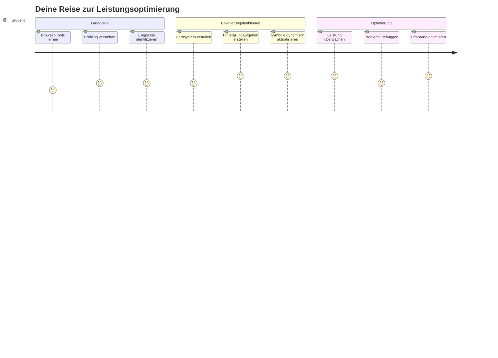
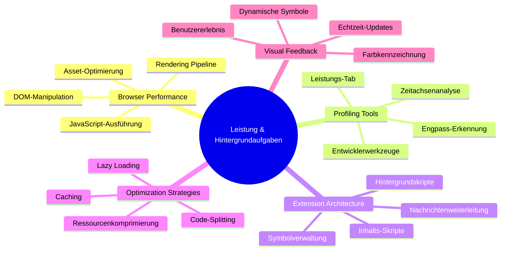
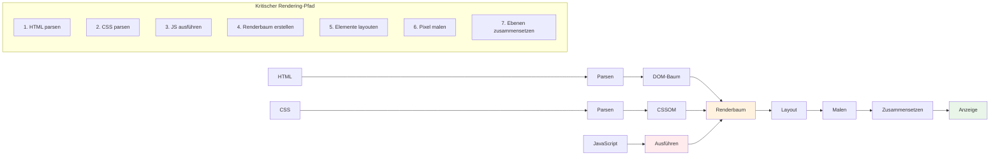
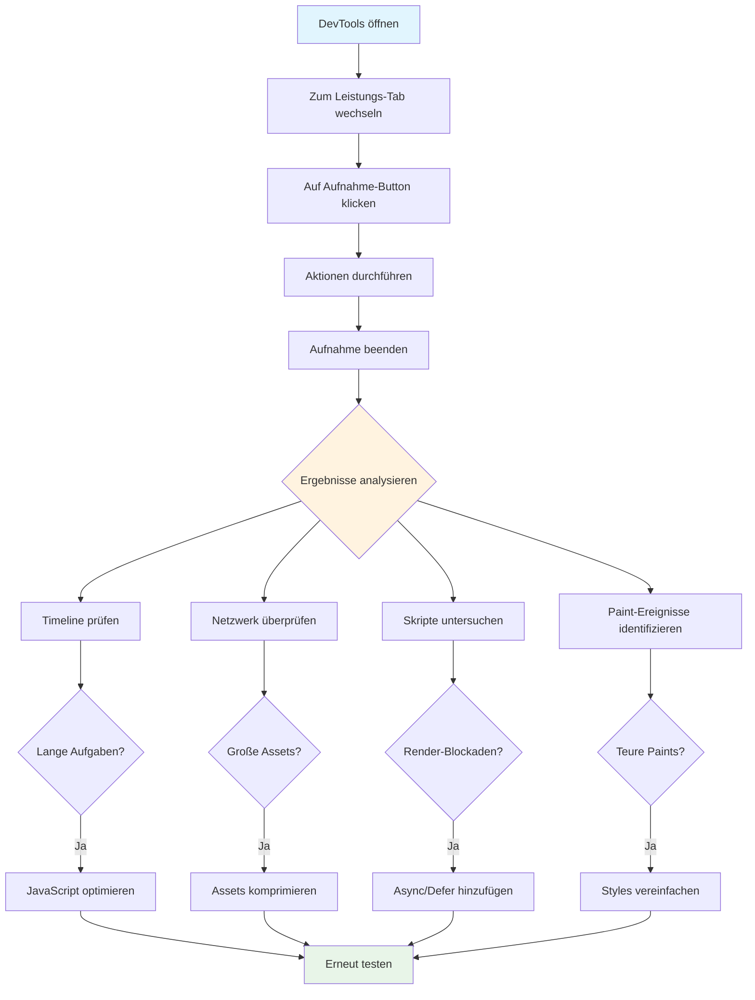
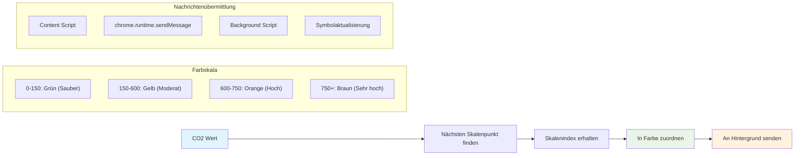
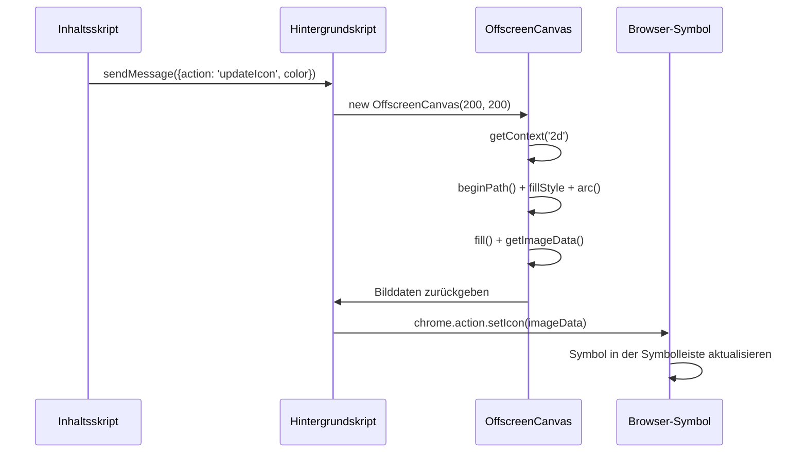
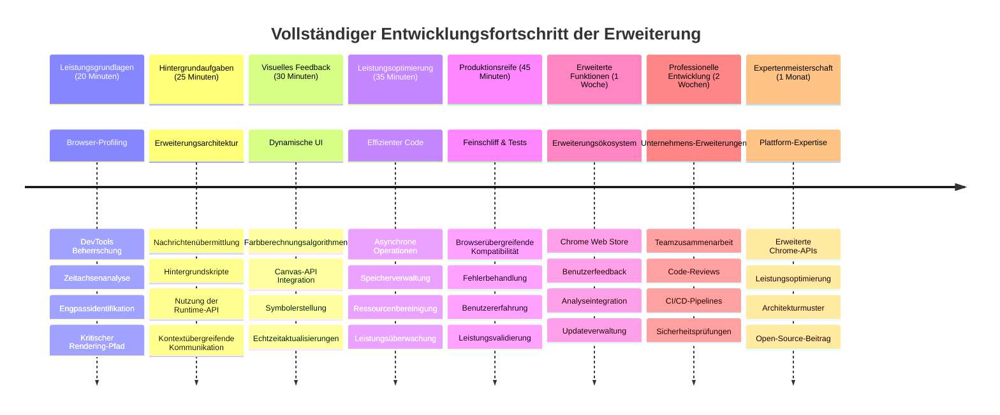

<!--
CO_OP_TRANSLATOR_METADATA:
{
  "original_hash": "b275fed2c6fc90d2b9b6661a3225faa2",
  "translation_date": "2026-01-06T08:53:44+00:00",
  "source_file": "5-browser-extension/3-background-tasks-and-performance/README.md",
  "language_code": "de"
}
-->
# Browser-Erweiterungsprojekt Teil 3: Lernen Sie Hintergrundaufgaben und Leistung kennen


Schon mal gefragt, warum sich manche Browser-Erweiterungen flott und reaktionsschnell anfühlen, während andere träge wirken? Das Geheimnis liegt in dem, was hinter den Kulissen passiert. Während Nutzer in der Benutzeroberfläche Ihrer Erweiterung klicken, verwaltet im Hintergrund eine ganze Welt an Prozessen still die Datenabfrage, Symbolaktualisierungen und Systemressourcen.

Dies ist unsere letzte Lektion in der Browser-Erweiterungsreihe, und wir bringen Ihren CO2-Fußabdruck-Tracker zum reibungslosen Laufen. Sie fügen dynamische Symbolupdates hinzu und lernen, Leistungsprobleme zu erkennen, bevor sie zu Problemen werden. Es ist wie das Feinabstimmen eines Rennwagens – kleine Optimierungen können einen großen Unterschied in der Performance machen.

Wenn wir fertig sind, haben Sie eine optimierte Erweiterung und verstehen die Leistungsprinzipien, die gute Web-Apps von großartigen unterscheiden. Lassen Sie uns in die Welt der Browser-Optimierung eintauchen.

## Pre-Lecture-Quiz

[Pre-lecture quiz](https://ff-quizzes.netlify.app/web/quiz/27)

### Einführung

In unseren vorherigen Lektionen haben Sie ein Formular erstellt, es mit einer API verbunden und sich mit asynchronem Datenabruf beschäftigt. Ihre Erweiterung nimmt gut Form an.

Jetzt müssen wir den letzten Schliff geben – wie zum Beispiel dafür sorgen, dass sich das Erweiterungssymbol farblich entsprechend der CO2-Daten ändert. Das erinnert mich daran, wie die NASA jedes System auf der Apollo-Raumsonde optimieren musste. Sie konnten sich keine verschwendeten Zyklen oder Speicher leisten, weil Leben von der Performance abhingen. Auch wenn unsere Browser-Erweiterung nicht ganz so kritisch ist, gelten dieselben Prinzipien – effizienter Code schafft bessere Nutzererlebnisse.


## Grundlagen der Web-Performance

Wenn Ihr Code effizient läuft, können Menschen den Unterschied tatsächlich *fühlen*. Sie kennen diesen Moment, wenn eine Seite sofort lädt oder eine Animation flüssig läuft? Das ist gute Performance in Aktion.

Performance dreht sich nicht nur um Geschwindigkeit – es geht darum, Web-Erlebnisse zu schaffen, die sich natürlich anfühlen statt klobig und frustrierend. In den frühen Tagen der Computertechnik hatte Grace Hopper bekanntlich eine Nanosekunde (ein etwa einen Fuß langes Drahtstück) auf ihrem Schreibtisch, um zu zeigen, wie weit das Licht in einer Milliardstelsekunde reist. So erklärte sie, warum jede Mikrosekunde im Computing zählt. Lassen Sie uns die Detektivwerkzeuge erkunden, die Ihnen helfen herauszufinden, was die Performance verlangsamt.

> „Website-Performance besteht aus zwei Dingen: wie schnell die Seite lädt und wie schnell der darauf befindliche Code läuft.“ -- [Zack Grossbart](https://www.smashingmagazine.com/2012/06/javascript-profiling-chrome-developer-tools/)

Das Thema, wie man Webseiten auf allen Geräten, für alle Nutzer und in allen Situationen rasend schnell macht, ist erwartungsgemäß umfangreich. Hier einige Punkte, die Sie beim Aufbau eines Standard-Webprojekts oder einer Browser-Erweiterung beachten sollten.

Der erste Schritt zur Optimierung Ihrer Seite ist zu verstehen, was unter der Haube tatsächlich passiert. Zum Glück bringt Ihr Browser mächtige Detektivwerkzeuge gleich mit.


Um die Entwicklertools in Edge zu öffnen, klicken Sie auf die drei Punkte oben rechts, gehen dann auf Weitere Tools > Entwicklertools. Oder verwenden Sie die Tastenkombination: `Ctrl` + `Shift` + `I` unter Windows oder `Option` + `Command` + `I` unter Mac. Wenn Sie dort sind, klicken Sie auf den Reiter Performance – hier führen Sie Ihre Untersuchung durch.

**Hier ist Ihr Performance-Detektiv-Werkzeugkasten:**
- **Öffnen** Sie die Entwicklertools (Sie nutzen diese ständig als Entwickler!)
- **Wechseln** Sie zum Performance-Tab – denken Sie daran wie an den Fitness-Tracker Ihrer Web-App
- **Starten** Sie die Aufnahme und beobachten Sie Ihre Seite in Aktion
- **Analysieren** Sie die Ergebnisse, um herauszufinden, was die Dinge verlangsamt

Probieren wir das aus. Öffnen Sie eine Webseite (Microsoft.com eignet sich gut dafür) und klicken Sie auf die Schaltfläche „Aufzeichnen“. Laden Sie nun die Seite neu und beobachten Sie, wie der Profiler alles erfasst, was passiert. Wenn Sie die Aufnahme stoppen, sehen Sie eine detaillierte Aufschlüsselung, wie der Browser die Seite „scriptet“, „rendert“ und „zeichnet“. Das erinnert mich daran, wie die Missionskontrolle bei einem Raketenstart jedes System überwacht – Sie erhalten Echtzeitdaten, was wann passiert.


✅ Die [Microsoft-Dokumentation](https://docs.microsoft.com/microsoft-edge/devtools-guide/performance/?WT.mc_id=academic-77807-sagibbon) bietet noch viele weitere Details, wenn Sie tiefer einsteigen möchten

> Profi-Tipp: Löschen Sie vor dem Testen den Browser-Cache, um zu sehen, wie Ihre Seite für Erstbesucher performt – das ist meistens ganz anders als bei wiederholten Besuchen!

Wählen Sie Elemente des Profilzeitstrahls aus, um in Ereignisse hineinzuzoomen, die während des Seitenladens passieren.

Erhalten Sie eine Momentaufnahme der Performance Ihrer Seite, indem Sie einen Abschnitt des Profilzeitstrahls auswählen und sich die Zusammenfassung anschauen:


Überprüfen Sie das Ereignisprotokoll, um zu sehen, ob ein Ereignis länger als 15 ms gedauert hat:


✅ Lernen Sie Ihren Profiler kennen! Öffnen Sie die Entwicklertools auf dieser Seite und prüfen Sie, ob es Engpässe gibt. Welches Asset lädt am langsamsten? Welches am schnellsten?


## Woran Sie beim Profiling achten sollten

Den Profiler zu starten ist nur der Anfang – die echte Kunst ist zu wissen, was diese farbigen Diagramme eigentlich aussagen. Keine Sorge, Sie werden lernen, sie zu lesen. Erfahrene Entwickler haben gelernt, Warnzeichen frühzeitig zu erkennen, bevor aus Problemen ausgewachsene Schwierigkeiten werden.

Lassen Sie uns über die üblichen Verdächtigen sprechen – die Performance-Störenfriede, die sich gerne in Webprojekte einschleichen. So wie Marie Curie sorgfältig die Strahlenwerte in ihrem Labor überwachen musste, müssen wir auf bestimmte Muster achten, die Ärger ankündigen. Sie früh zu erkennen erspart Ihnen (und Ihren Nutzern) viel Frust.

**Asset-Größen**: Webseiten sind im Laufe der Jahre „schwerer“ geworden, und ein großer Teil dieses Mehrgewichts stammt von Bildern. Es ist, als würden wir ständig mehr und mehr in unsere digitale Reisetasche stopfen.

✅ Schauen Sie sich das [Internet Archive](https://httparchive.org/reports/page-weight) an, um zu sehen, wie die Seitengrößen im Lauf der Zeit gewachsen sind – sehr aufschlussreich.

**So halten Sie Ihre Assets optimiert:**
- **Komprimieren** Sie die Bilder! Moderne Formate wie WebP können Dateigrößen deutlich reduzieren
- **Liefern** Sie die richtige Bildgröße für jedes Gerät – es braucht keine riesigen Desktop-Bilder auf dem Handy
- **Minimieren** Sie Ihre CSS- und JavaScript-Dateien – jedes Byte zählt
- **Nutzen** Sie Lazy Loading, damit Bilder nur geladen werden, wenn Nutzer wirklich scrollen

**DOM-Durchläufe**: Der Browser muss sein Dokument-Objektmodell basierend auf Ihrem Code aufbauen, daher ist es für eine gute Seiten-Performance sinnvoll, wenige Tags zu verwenden und nur das zu stylen, was nötig ist. Überflüssiges CSS, das nur auf einer Seite gebraucht wird, muss zum Beispiel nicht im Hauptstylesheet sein.

**Wichtige Strategien zur DOM-Optimierung:**
- **Minimiert** die Anzahl der HTML-Elemente und Verschachtelungstiefen
- **Entfernt** ungenutzte CSS-Regeln und konsolidiert Stylesheets effizient
- **Organisiert** CSS so, dass nur das geladen wird, was jede Seite braucht
- **Strukturiert** HTML semantisch für bessere Browser-Verarbeitung

**JavaScript**: Jeder JavaScript-Entwickler sollte auf 'render-blocking' Skripte achten, die geladen werden müssen, bevor der Rest des DOMs geparst und angezeigt werden kann. Ziehen Sie in Erwägung, Ihren Inline-Skripten das `defer`-Attribut zu geben (wie im Terrarium-Modul gemacht).

**Moderne JavaScript-Optimierungstechniken:**
- **Verwendet** `defer`, um Skripte nach dem DOM-Parsing zu laden
- **Implementiert** Code-Splitting, um nur notwendigen JavaScript-Code zu laden
- **Setzt** Lazy Loading für nicht-kritische Funktionen ein
- **Minimiert** die Nutzung schwerer Bibliotheken und Frameworks, wenn möglich

✅ Testen Sie einige Seiten auf einer [Site Speed Test Website](https://www.webpagetest.org/), um mehr über übliche Prüfungen zur Website-Leistung zu erfahren.

### 🔄 **Pädagogische Überprüfung**
**Performance-Verständnis**: Bevor Sie Erweiterungsfunktionen bauen, stellen Sie sicher, dass Sie:
- ✅ Den kritischen Rendering-Pfad von HTML zu Pixeln erklären können
- ✅ Übliche Performance-Engpässe in Webanwendungen erkennen
- ✅ Browser Entwicklertools zur Profilierung der Seitenleistung nutzen
- ✅ Verstehen, wie Asset-Größe und DOM-Komplexität Geschwindigkeit beeinflussen

**Schnell-Selbsttest**: Was passiert, wenn Sie render-blockierende JavaScript haben?
*Antwort: Der Browser muss das Skript herunterladen und ausführen, bevor er mit dem Parsen des HTML und dem Rendern der Seite weitermachen kann*

**Auswirkungen auf die reale Leistung**:
- **100 ms Verzögerung**: Nutzer bemerken die Verlangsamung
- **1 Sekunde Verzögerung**: Nutzer verlieren den Fokus
- **3+ Sekunden**: 40 % der Nutzer verlassen die Seite
- **Mobile Netzwerke**: Performance ist hier noch wichtiger

Jetzt, da Sie eine Vorstellung davon haben, wie der Browser die Assets rendert, die Sie ihm schicken, schauen wir uns die letzten Schritte an, die Ihre Erweiterung vervollständigen:

### Erstellen Sie eine Funktion zur Farbberechnung

Jetzt erstellen wir eine Funktion, die numerische Daten in sinnvolle Farben umwandelt. Denken Sie daran wie an eine Ampel – grün für saubere Energie, rot für hohe Kohlenstoffintensität.

Diese Funktion nimmt die CO2-Daten von unserer API und bestimmt, welche Farbe die Umweltauswirkung am besten repräsentiert. Das ist ähnlich, wie Wissenschaftler Farb-Codierungen in Heatmaps verwenden, um komplexe Datenmuster zu visualisieren – von Ozeantemperaturen bis Sternentstehung. Fügen wir das in `/src/index.js` direkt nach den `const`-Variablen ein, die wir zuvor definiert haben:


```javascript
function calculateColor(value) {
	// Definiere CO2-Intensitätsskala (Gramm pro kWh)
	const co2Scale = [0, 150, 600, 750, 800];
	// Entsprechende Farben von grün (sauber) bis dunkelbraun (hoher Kohlenstoffanteil)
	const colors = ['#2AA364', '#F5EB4D', '#9E4229', '#381D02', '#381D02'];

	// Finde den dem Eingabewert am nächsten liegenden Skalenwert
	const closestNum = co2Scale.sort((a, b) => {
		return Math.abs(a - value) - Math.abs(b - value);
	})[0];
	
	console.log(`${value} is closest to ${closestNum}`);
	
	// Finde den Index für die Farbzuordnung
	const num = (element) => element > closestNum;
	const scaleIndex = co2Scale.findIndex(num);

	const closestColor = colors[scaleIndex];
	console.log(scaleIndex, closestColor);

	// Sende Farbaktualisierungsnachricht an das Hintergrundskript
	chrome.runtime.sendMessage({ action: 'updateIcon', value: { color: closestColor } });
}
```

**Lassen Sie uns diese clevere kleine Funktion aufschlüsseln:**
- **Richtet ein** zwei Arrays ein – eins für CO2-Werte, eins für Farben (grün = sauber, braun = schmutzig!)
- **Findet** den nächstliegenden Wert zu unserem aktuellen CO2-Wert mit coolem Array-Sorting
- **Greift** die passende Farbe mit der Methode findIndex()
- **Sendet** eine Nachricht an das Hintergrundskript von Chrome mit der ausgewählten Farbe
- **Verwendet** Template Literals (diese Backticks) für saubere Zeichenkettenformatierung
- **Behält** durch konstante Deklarationen alles organisiert

Die `chrome.runtime` [API](https://developer.chrome.com/extensions/runtime) ist wie das Nervensystem Ihrer Erweiterung – sie steuert die gesamte Kommunikation und Aufgaben im Hintergrund:

> „Verwenden Sie die chrome.runtime API, um die Hintergrundseite abzurufen, Details über das Manifest zu erhalten und auf Ereignisse im Lebenszyklus der App oder Erweiterung zu hören und zu reagieren. Sie können diese API auch verwenden, um relative Pfade von URLs in voll qualifizierte URLs umzuwandeln.“

**Warum die Chrome Runtime API so praktisch ist:**
- **Ermöglicht** Kommunikation zwischen verschiedenen Teilen Ihrer Erweiterung
- **Bewältigt** Hintergrundaufgaben ohne die Benutzeroberfläche zu blockieren
- **Verwaltet** Lebenszyklusereignisse Ihrer Erweiterung
- **Erleichtert** den Nachrichtenaustausch zwischen Skripten enorm

✅ Wenn Sie diese Browser-Erweiterung für Edge entwickeln, überrascht es vielleicht, dass Sie eine Chrome-API nutzen. Neuere Edge-Versionen basieren auf der Chromium-Engine, daher können Sie diese Werkzeuge verwenden.


> **Profi-Tipp**: Wenn Sie eine Browser-Erweiterung profilieren möchten, starten Sie die Entwicklertools innerhalb der Erweiterung selbst, da sie eine eigene Browser-Instanz ist. So erhalten Sie Zugriff auf erweiterungsspezifische Performance-Metriken.

### Legen Sie eine Standard-Symbolfarbe fest

Bevor wir echte Daten abrufen, geben wir unserer Erweiterung einen Ausgangspunkt. Niemand sieht gern auf ein leeres oder kaputt aussehendes Symbol. Wir starten mit einem grünen Farbton, damit Nutzer wissen, dass die Erweiterung ab der Installation funktioniert.

Legen Sie in Ihrer `init()` Funktion das Standardgrün für das Symbol fest:

```javascript
chrome.runtime.sendMessage({
	action: 'updateIcon',
	value: {
		color: 'green',
	},
});
```

**Das erreicht diese Initialisierung:**
- **Setzt** einen neutralen grünen Farbton als Standardzustand
- **Gibt** sofortiges visuelles Feedback, wenn die Erweiterung geladen wird
- **Stellt** die Kommunikationsmuster mit dem Hintergrundskript her
- **Sorgt** dafür, dass Nutzer eine funktionierende Erweiterung sehen, bevor Daten geladen werden

### Rufen Sie die Funktion auf und führen Sie den Aufruf aus

Jetzt verbinden wir alles miteinander, sodass, wenn neue CO2-Daten eintreffen, Ihr Symbol automatisch mit der richtigen Farbe aktualisiert wird. Es ist wie das Verbinden des letzten Stromkreises in einem elektronischen Gerät – plötzlich funktionieren alle Komponenten als ein System.

Fügen Sie diese Zeile direkt nach dem Abruf der CO2-Daten von der API ein:

```javascript
// Nachdem die CO2-Daten von der API abgerufen wurden
// let CO2 = data.data[0].intensity.actual;
calculateColor(CO2);
```

**Diese Integration bewirkt:**
- **Verbindet** den API-Datenfluss mit dem visuellen Indikatorsystem
- **Löst** Symbolaktualisierungen automatisch aus, wenn neue Daten kommen
- **Sorgt** für Echtzeit-Visualisierung basierend auf der aktuellen Kohlenstoffintensität
- **Erhält** die Trennung von Datenabruf und Anzeige-Logik

Und schließlich fügen Sie in `/dist/background.js` den Listener für diese Hintergrundaktions-Aufrufe hinzu:

```javascript
// Auf Nachrichten vom Content-Skript hören
chrome.runtime.onMessage.addListener(function (msg, sender, sendResponse) {
	if (msg.action === 'updateIcon') {
		chrome.action.setIcon({ imageData: drawIcon(msg.value) });
	}
});

// Dynamisches Symbol mit Canvas-API zeichnen
// Übernommen von der Energy Lollipop-Erweiterung – nette Funktion!
function drawIcon(value) {
	// Erstelle eine Offscreen-Canvas für bessere Leistung
	const canvas = new OffscreenCanvas(200, 200);
	const context = canvas.getContext('2d');

	// Zeichne einen farbigen Kreis, der die CO2-Intensität darstellt
	context.beginPath();
	context.fillStyle = value.color;
	context.arc(100, 100, 50, 0, 2 * Math.PI);
	context.fill();

	// Gib die Bilddaten für das Browser-Symbol zurück
	return context.getImageData(50, 50, 100, 100);
}
```

**Das macht dieses Hintergrundskript:**
- **Hört** auf Nachrichten von Ihrem Hauptskript (wie ein Empfang, der Anrufe entgegennimmt)
- **Verarbeitet** die 'updateIcon'-Anfragen, um das Symbol in der Werkzeugleiste zu ändern
- **Erzeugt** neue Symbole dynamisch mit der Canvas API
- **Zeichnet** einen einfachen farbigen Kreis, der die aktuelle CO2-Intensität zeigt
- **Aktualisiert** die Browser-Werkzeugleiste mit dem frischen Symbol
- **Verwendet** OffscreenCanvas für eine flüssige Performance (keine UI-Blockade)

✅ Mehr über die Canvas API lernen Sie in den [Space Game Lektionen](../../6-space-game/2-drawing-to-canvas/README.md).


### 🔄 **Pädagogische Überprüfung**
**Volles Verständnis der Erweiterung**: Überprüfen Sie Ihr Verständnis des gesamten Systems:
- ✅ Wie funktioniert der Nachrichtenaustausch zwischen verschiedenen Erweiterungsskripten?
- ✅ Warum verwenden wir OffscreenCanvas statt regulärem Canvas für die Performance?
- ✅ Welche Rolle spielt die Chrome Runtime API in der Architektur von Erweiterungen?
- ✅ Wie bildet der Farb-Berechnungsalgorithmus Daten in visuelles Feedback ab?

**Performance-Überlegungen**: Ihre Erweiterung zeigt nun:
- **Effiziente Nachrichtenübermittlung**: Saubere Kommunikation zwischen Skript-Kontexten
- **Optimiertes Rendering**: OffscreenCanvas verhindert UI-Blockaden
- **Echtzeit-Updates**: Dynamische Icon-Änderungen basierend auf Live-Daten
- **Speichermanagement**: Korrekte Bereinigung und Ressourcenkontrolle

**Zeit, Ihre Erweiterung zu testen:**
- **Builden** Sie alles mit `npm run build`
- **Laden** Sie Ihre Erweiterung im Browser neu (bitte diesen Schritt nicht vergessen)
- **Öffnen** Sie Ihre Erweiterung und beobachten Sie, wie das Icon die Farbe ändert
- **Überprüfen** Sie, wie sie auf reale Kohlenstoffdaten aus aller Welt reagiert

Jetzt wissen Sie auf einen Blick, ob es eine gute Zeit für die Wäsche ist oder ob Sie auf sauberere Energie warten sollten. Sie haben gerade etwas wirklich Nützliches gebaut und dabei mehr über Browserleistung gelernt.

## GitHub Copilot Agent Challenge 🚀

Nutzen Sie den Agent-Modus, um die folgende Herausforderung zu meistern:

**Beschreibung:** Erweitern Sie die Leistungsüberwachungsfunktionen der Browsererweiterung, indem Sie eine Funktion hinzufügen, die Ladezeiten für verschiedene Komponenten der Erweiterung verfolgt und anzeigt.

**Aufgabe:** Erstellen Sie ein Performance-Monitoring-System für die Browsererweiterung, das die Zeit misst und protokolliert, die benötigt wird, um CO2-Daten aus der API abzurufen, Farben zu berechnen und das Symbol zu aktualisieren. Fügen Sie eine Funktion namens `performanceTracker` hinzu, die die Performance-API verwendet, um diese Vorgänge zu messen und die Ergebnisse mit Zeitstempeln und Dauerangaben in der Browserkonsole anzuzeigen.

Erfahren Sie mehr über den [Agent-Modus](https://code.visualstudio.com/blogs/2025/02/24/introducing-copilot-agent-mode).

## 🚀 Herausforderung

Hier eine interessante Detektivaufgabe: Wählen Sie einige Open-Source-Webseiten aus, die seit Jahren bestehen (denken Sie an Wikipedia, GitHub oder Stack Overflow), und untersuchen Sie deren Commithistorie. Können Sie erkennen, wo sie Leistungsverbesserungen vorgenommen haben? Welche Probleme traten immer wieder auf?

**Ihr Untersuchungsansatz:**
- **Suchen** Sie Commit-Nachrichten nach Begriffen wie „optimize“, „performance“ oder „faster“
- **Achten** Sie auf Muster – beheben sie immer wieder dieselben Arten von Problemen?
- **Identifizieren** Sie die häufigsten Ursache, die Webseiten verlangsamen
- **Teilen** Sie Ihre Erkenntnisse – andere Entwickler lernen von realen Beispielen

## Quiz nach der Lektion

[Post-Lecture Quiz](https://ff-quizzes.netlify.app/web/quiz/28)

## Rückblick & Selbststudium

Erwägen Sie, sich für einen [Performance-Newsletter](https://perf.email/) anzumelden.

Untersuchen Sie einige der Methoden, mit denen Browser die Web-Performance messen, indem Sie die Performance-Tabs in den Entwicklertools durchsehen. Finden Sie große Unterschiede?

### ⚡ **Was Sie in den nächsten 5 Minuten tun können**
- [ ] Öffnen Sie den Task-Manager des Browsers (Shift+Esc in Chrome), um die Ressourcennutzung der Erweiterung zu sehen
- [ ] Nutzen Sie den DevTools Performance-Tab, um die Leistung von Webseiten aufzuzeichnen und zu analysieren
- [ ] Überprüfen Sie die Erweiterungsseite des Browsers, um zu sehen, welche Erweiterungen die Startzeit beeinflussen
- [ ] Versuchen Sie, Erweiterungen vorübergehend zu deaktivieren, um Leistungsunterschiede zu erkennen

### 🎯 **Was Sie in dieser Stunde erreichen können**
- [ ] Machen Sie das Quiz nach der Lektion und vertiefen Sie Performance-Konzepte
- [ ] Implementieren Sie ein Hintergrundskript für Ihre Browsererweiterung
- [ ] Lernen Sie den Umgang mit browser.alarms für effiziente Hintergrundaufgaben
- [ ] Üben Sie Nachrichtenübermittlung zwischen Content-Skripten und Hintergrundskripten
- [ ] Messen und optimieren Sie die Ressourcennutzung Ihrer Erweiterung

### 📅 **Ihre Performance-Reise über eine Woche**
- [ ] Entwickeln Sie eine leistungsstarke Browsererweiterung mit Hintergrundfunktionalität
- [ ] Meistern Sie Service Worker und moderne Erweiterungsarchitektur
- [ ] Implementieren Sie effiziente Datensynchronisation und Caching-Strategien
- [ ] Lernen Sie erweiterte Debugging-Techniken für Erweiterungsperformance
- [ ] Optimieren Sie Ihre Erweiterung hinsichtlich Funktionalität und Ressourceneffizienz
- [ ] Erstellen Sie umfassende Tests für Performance-Szenarien der Erweiterung

### 🌟 **Ihr Meisterkurs zur Optimierung über einen Monat**
- [ ] Bauen Sie erstklassige Browsererweiterungen mit optimaler Performance
- [ ] Lernen Sie Web Workers, Service Workers und moderne Web-Performance
- [ ] Beteiligen Sie sich an Open-Source-Projekten zur Performance-Optimierung
- [ ] Beherrschen Sie Browser-Interna und erweiterte Debugging-Methoden
- [ ] Erstellen Sie Performance-Monitoring-Tools und Best-Practice-Leitfäden
- [ ] Werden Sie Performance-Experte, der Webanwendungen optimiert

## 🎯 Ihre Timeline zur Meisterung der Browsererweiterung


### 🛠️ Ihr vollständiges Werkzeugset zur Erweiterungsentwicklung

Nach Abschluss dieser Trilogie haben Sie gemeistert:
- **Browser-Architektur**: Tiefes Verständnis, wie Erweiterungen mit Browsersystemen interagieren
- **Performance-Analyse**: Fähigkeit, Engpässe mit Entwickler-Tools zu identifizieren und zu beheben
- **Asynchrone Programmierung**: Moderne JavaScript-Modelle für reaktionsfähige, nicht-blockierende Abläufe
- **API-Integration**: Externes Datentransfer mit Authentifizierung und Fehlerhandling
- **Visuelles Design**: Dynamische UI-Updates und Canvas-basierte Grafikgenerierung
- **Nachrichtenübermittlung**: Kommunikation zwischen Skripten in Erweiterungsarchitekturen
- **Benutzererlebnis**: Ladezustände, Fehlerbehandlung und intuitive Interaktionen
- **Produktions-Fähigkeiten**: Testen, Debuggen und Optimieren für den realen Einsatz

**Anwendungen in der Praxis**: Ihre Entwicklungsfähigkeiten sind direkt anwendbar auf:
- **Progressive Web Apps**: Ähnliche Architektur und Performance-Pattern
- **Electron Desktop Apps**: Plattformübergreifende Anwendungen mit Web-Technologien
- **Mobile Hybrid Apps**: Cordova/PhoneGap Entwicklungen mit Web APIs
- **Enterprise-Webanwendungen**: Komplexe Dashboards und Produktivitätstools
- **Chrome DevTools Extensions**: Fortgeschrittene Entwickler-Tools und Debugging
- **Web-API-Integration**: Anwendungen mit externer Service-Kommunikation

**Berufliche Wirkung**: Sie können jetzt:
- **Produktionsreife Erweiterungen** von Konzept bis Deployment bauen
- **Web-Performance optimieren** mit branchenüblichen Analysewerkzeugen
- **Skalierbare Systeme** mit sauberer Trennung der Zuständigkeiten entwerfen
- **Komplexe asynchrone Abläufe** und Kontext-übergreifende Kommunikation debuggen
- **Open-Source-Erweiterungsprojekte** und Browser-Standards mitgestalten

**Nächste Karriereschritte:**
- **Chrome Web Store Entwickler**: Erweiterungen für Millionen Nutzer veröffentlichen
- **Web Performance Engineer**: Spezialisierung auf Optimierung und User Experience
- **Browser-Plattformentwickler**: Beitrag zur Entwicklung von Browser-Engines
- **Erweiterungs-Framework-Entwickler**: Werkzeuge für andere Entwickler bauen
- **Developer Relations**: Wissen durch Lehre und Content Creation vermitteln

🌟 **Erfolg freigeschaltet**: Sie haben eine vollständige, funktionale Browsererweiterung erstellt, die professionelle Entwicklungspraktiken und moderne Webstandards demonstriert!

## Aufgabe

[Analyse einer Seite auf Performance](assignment.md)

---

<!-- CO-OP TRANSLATOR DISCLAIMER START -->
**Haftungsausschluss**:  
Dieses Dokument wurde mithilfe des KI-Übersetzungsdienstes [Co-op Translator](https://github.com/Azure/co-op-translator) übersetzt. Obwohl wir um Genauigkeit bemüht sind, können automatisierte Übersetzungen Fehler oder Ungenauigkeiten enthalten. Das Originaldokument in der ursprünglichen Sprache gilt als maßgebliche Quelle. Für wichtige Informationen empfehlen wir eine professionelle menschliche Übersetzung. Wir übernehmen keine Haftung für Missverständnisse oder Fehlinterpretationen, die aus der Nutzung dieser Übersetzung entstehen.
<!-- CO-OP TRANSLATOR DISCLAIMER END -->