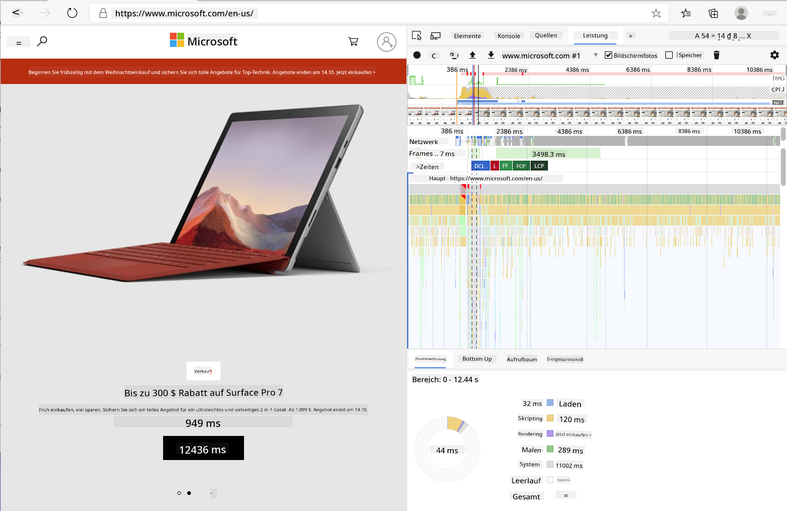
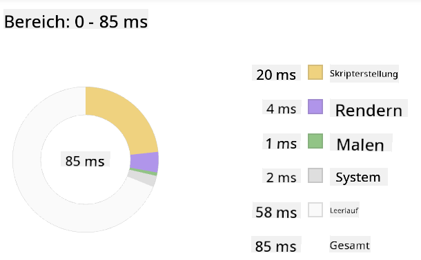
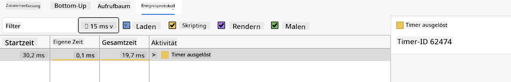

<!--
CO_OP_TRANSLATOR_METADATA:
{
  "original_hash": "49b58721a71cfda824e2f3e1f46908c6",
  "translation_date": "2025-08-29T14:09:19+00:00",
  "source_file": "5-browser-extension/3-background-tasks-and-performance/README.md",
  "language_code": "de"
}
-->
# Browser-Erweiterungsprojekt Teil 3: Hintergrundaufgaben und Leistung kennenlernen

## Quiz vor der Vorlesung

[Quiz vor der Vorlesung](https://ff-quizzes.netlify.app/web/quiz/27)

### Einführung

In den letzten beiden Lektionen dieses Moduls hast du gelernt, wie man ein Formular und einen Anzeigebereich für Daten erstellt, die von einer API abgerufen werden. Das ist eine sehr gängige Methode, um eine Webpräsenz zu erstellen. Du hast sogar gelernt, wie man Daten asynchron abruft. Deine Browser-Erweiterung ist fast fertig.

Es bleibt noch, einige Hintergrundaufgaben zu verwalten, einschließlich der Aktualisierung der Farbe des Erweiterungssymbols. Dies ist ein guter Zeitpunkt, um darüber zu sprechen, wie der Browser solche Aufgaben handhabt. Lass uns diese Browser-Aufgaben im Kontext der Leistung deiner Webressourcen betrachten, während du sie erstellst.

## Grundlagen der Web-Performance

> "Website-Performance dreht sich um zwei Dinge: wie schnell die Seite lädt und wie schnell der Code darauf ausgeführt wird." -- [Zack Grossbart](https://www.smashingmagazine.com/2012/06/javascript-profiling-chrome-developer-tools/)

Das Thema, wie man Websites auf allen Arten von Geräten, für alle Arten von Nutzern und in allen möglichen Situationen blitzschnell macht, ist erwartungsgemäß umfangreich. Hier sind einige Punkte, die du beachten solltest, wenn du entweder ein Standard-Webprojekt oder eine Browser-Erweiterung erstellst.

Das Erste, was du tun musst, um sicherzustellen, dass deine Website effizient läuft, ist, Daten über ihre Leistung zu sammeln. Der erste Ort, um dies zu tun, sind die Entwicklertools deines Webbrowsers. In Edge kannst du die Schaltfläche "Einstellungen und mehr" (das Drei-Punkte-Symbol oben rechts im Browser) auswählen, dann zu Weitere Tools > Entwicklertools navigieren und den Tab "Leistung" öffnen. Du kannst auch die Tastenkombination `Strg` + `Umschalt` + `I` unter Windows oder `Option` + `Befehl` + `I` auf einem Mac verwenden, um die Entwicklertools zu öffnen.

Der Tab "Leistung" enthält ein Profiling-Tool. Öffne eine Website (probiere zum Beispiel [https://www.microsoft.com](https://www.microsoft.com/?WT.mc_id=academic-77807-sagibbon)) und klicke auf die Schaltfläche "Aufzeichnen", dann aktualisiere die Seite. Beende die Aufzeichnung jederzeit, und du kannst die Routinen sehen, die generiert werden, um die Seite zu "skripten", "rendern" und "zeichnen":



✅ Besuche die [Microsoft-Dokumentation](https://docs.microsoft.com/microsoft-edge/devtools-guide/performance/?WT.mc_id=academic-77807-sagibbon) zum Leistungspanel in Edge.

> Tipp: Um eine genaue Messung der Startzeit deiner Website zu erhalten, leere den Cache deines Browsers.

Wähle Elemente der Profil-Zeitleiste aus, um Ereignisse zu vergrößern, die während des Ladens deiner Seite auftreten.

Erhalte eine Momentaufnahme der Leistung deiner Seite, indem du einen Teil der Profil-Zeitleiste auswählst und dir das Zusammenfassungsfenster ansiehst:



Überprüfe das Ereignisprotokoll, um zu sehen, ob ein Ereignis länger als 15 ms gedauert hat:



✅ Lerne deinen Profiler kennen! Öffne die Entwicklertools auf dieser Seite und überprüfe, ob es Engpässe gibt. Was ist die am langsamsten ladende Ressource? Die schnellste?

## Profiling-Checks

Im Allgemeinen gibt es einige "Problemzonen", auf die jeder Webentwickler achten sollte, wenn er eine Website erstellt, um böse Überraschungen beim Deployment in die Produktion zu vermeiden.

**Asset-Größen**: Das Web ist in den letzten Jahren "schwerer" und damit langsamer geworden. Ein Teil dieses Gewichts hängt mit der Verwendung von Bildern zusammen.

✅ Sieh dir das [Internetarchiv](https://httparchive.org/reports/page-weight) an, um einen historischen Überblick über das Seitengewicht und mehr zu erhalten.

Eine gute Praxis ist es, sicherzustellen, dass deine Bilder optimiert sind und in der richtigen Größe und Auflösung für deine Nutzer bereitgestellt werden.

**DOM-Traversierungen**: Der Browser muss sein Document Object Model basierend auf dem von dir geschriebenen Code erstellen. Daher ist es im Interesse einer guten Seitenleistung, die Tags minimal zu halten und nur das zu verwenden und zu stylen, was die Seite benötigt. In diesem Zusammenhang könnte überschüssiges CSS, das mit einer Seite verbunden ist, optimiert werden; Stile, die nur auf einer Seite verwendet werden müssen, müssen beispielsweise nicht im Haupt-Stylesheet enthalten sein.

**JavaScript**: Jeder JavaScript-Entwickler sollte auf "render-blockierende" Skripte achten, die geladen werden müssen, bevor der Rest des DOM durchlaufen und im Browser dargestellt werden kann. Erwäge die Verwendung von `defer` mit deinen Inline-Skripten (wie es im Terrarium-Modul gemacht wird).

✅ Probiere einige Websites auf einer [Website-Geschwindigkeitstest-Seite](https://www.webpagetest.org/) aus, um mehr über die gängigen Prüfungen zu erfahren, die durchgeführt werden, um die Leistung einer Website zu bestimmen.

Jetzt, da du eine Vorstellung davon hast, wie der Browser die von dir gesendeten Ressourcen rendert, lass uns die letzten Dinge betrachten, die du tun musst, um deine Erweiterung abzuschließen:

### Eine Funktion zur Farbberechnung erstellen

Arbeite in `/src/index.js` und füge nach der Reihe von `const`-Variablen, die du gesetzt hast, um Zugriff auf das DOM zu erhalten, eine Funktion namens `calculateColor()` hinzu:

```JavaScript
function calculateColor(value) {
	let co2Scale = [0, 150, 600, 750, 800];
	let colors = ['#2AA364', '#F5EB4D', '#9E4229', '#381D02', '#381D02'];

	let closestNum = co2Scale.sort((a, b) => {
		return Math.abs(a - value) - Math.abs(b - value);
	})[0];
	console.log(value + ' is closest to ' + closestNum);
	let num = (element) => element > closestNum;
	let scaleIndex = co2Scale.findIndex(num);

	let closestColor = colors[scaleIndex];
	console.log(scaleIndex, closestColor);

	chrome.runtime.sendMessage({ action: 'updateIcon', value: { color: closestColor } });
}
```

Was passiert hier? Du übergibst einen Wert (die Kohlenstoffintensität) aus dem API-Aufruf, den du in der letzten Lektion abgeschlossen hast, und berechnest dann, wie nah sein Wert am Index im Farben-Array liegt. Dann sendest du diesen nächstgelegenen Farbwert an den Chrome-Runtime.

Die chrome.runtime verfügt über [eine API](https://developer.chrome.com/extensions/runtime), die alle Arten von Hintergrundaufgaben handhabt, und deine Erweiterung nutzt diese:

> "Verwende die chrome.runtime-API, um die Hintergrundseite abzurufen, Details zum Manifest zurückzugeben und auf Ereignisse im Lebenszyklus der App oder Erweiterung zu hören und darauf zu reagieren. Du kannst diese API auch verwenden, um relative Pfade von URLs in vollständig qualifizierte URLs umzuwandeln."

✅ Wenn du diese Browser-Erweiterung für Edge entwickelst, könnte es dich überraschen, dass du eine Chrome-API verwendest. Die neueren Edge-Browser-Versionen laufen auf der Chromium-Browser-Engine, sodass du diese Tools nutzen kannst.

> Hinweis: Wenn du eine Browser-Erweiterung profilieren möchtest, starte die Entwicklertools direkt aus der Erweiterung heraus, da sie ihre eigene separate Browserinstanz ist.

### Eine Standard-Symbolfarbe festlegen

Setze nun in der `init()`-Funktion das Symbol zunächst auf ein generisches Grün, indem du erneut die `updateIcon`-Aktion von Chrome aufrufst:

```JavaScript
chrome.runtime.sendMessage({
	action: 'updateIcon',
		value: {
			color: 'green',
		},
});
```

### Die Funktion aufrufen und den Aufruf ausführen

Rufe als Nächstes die Funktion, die du gerade erstellt hast, auf, indem du sie dem Promise hinzufügst, das von der C02Signal-API zurückgegeben wird:

```JavaScript
//let CO2...
calculateColor(CO2);
```

Und schließlich füge in `/dist/background.js` den Listener für diese Hintergrundaktionsaufrufe hinzu:

```JavaScript
chrome.runtime.onMessage.addListener(function (msg, sender, sendResponse) {
	if (msg.action === 'updateIcon') {
		chrome.browserAction.setIcon({ imageData: drawIcon(msg.value) });
	}
});
//borrowed from energy lollipop extension, nice feature!
function drawIcon(value) {
	let canvas = document.createElement('canvas');
	let context = canvas.getContext('2d');

	context.beginPath();
	context.fillStyle = value.color;
	context.arc(100, 100, 50, 0, 2 * Math.PI);
	context.fill();

	return context.getImageData(50, 50, 100, 100);
}
```

In diesem Code fügst du einen Listener für alle Nachrichten hinzu, die an den Backend-Task-Manager gesendet werden. Wenn er 'updateIcon' genannt wird, wird der nächste Code ausgeführt, um ein Symbol der richtigen Farbe mithilfe der Canvas-API zu zeichnen.

✅ Du wirst mehr über die Canvas-API in den [Space Game-Lektionen](../../6-space-game/2-drawing-to-canvas/README.md) lernen.

Baue nun deine Erweiterung neu (`npm run build`), aktualisiere und starte deine Erweiterung und beobachte, wie sich die Farbe ändert. Ist es ein guter Zeitpunkt, um Besorgungen zu machen oder das Geschirr zu spülen? Jetzt weißt du es!

Herzlichen Glückwunsch, du hast eine nützliche Browser-Erweiterung erstellt und mehr darüber gelernt, wie der Browser funktioniert und wie man seine Leistung profiliert.

---

## 🚀 Herausforderung

Untersuche einige Open-Source-Websites, die es schon lange gibt, und versuche anhand ihrer GitHub-Historie herauszufinden, ob und wie sie im Laufe der Jahre für die Leistung optimiert wurden. Was ist der häufigste Schwachpunkt?

## Quiz nach der Vorlesung

[Quiz nach der Vorlesung](https://ff-quizzes.netlify.app/web/quiz/28)

## Rückblick & Selbststudium

Ziehe in Betracht, dich für einen [Performance-Newsletter](https://perf.email/) anzumelden.

Untersuche einige der Möglichkeiten, wie Browser die Web-Performance bewerten, indem du die Leistungstabs in ihren Webtools durchgehst. Findest du größere Unterschiede?

## Aufgabe

[Analysiere eine Website auf Leistung](assignment.md)

---

**Haftungsausschluss**:  
Dieses Dokument wurde mit dem KI-Übersetzungsdienst [Co-op Translator](https://github.com/Azure/co-op-translator) übersetzt. Obwohl wir uns um Genauigkeit bemühen, beachten Sie bitte, dass automatisierte Übersetzungen Fehler oder Ungenauigkeiten enthalten können. Das Originaldokument in seiner ursprünglichen Sprache sollte als maßgebliche Quelle betrachtet werden. Für kritische Informationen wird eine professionelle menschliche Übersetzung empfohlen. Wir übernehmen keine Haftung für Missverständnisse oder Fehlinterpretationen, die sich aus der Nutzung dieser Übersetzung ergeben.