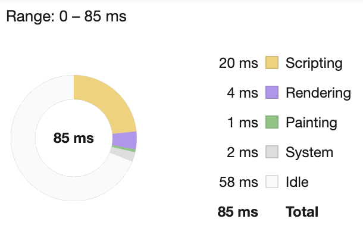
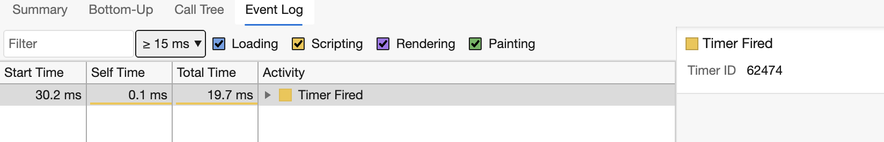

<!--
CO_OP_TRANSLATOR_METADATA:
{
  "original_hash": "b91cbf14240ee59411b96448b994ace1",
  "translation_date": "2025-10-03T12:13:45+00:00",
  "source_file": "5-browser-extension/3-background-tasks-and-performance/README.md",
  "language_code": "de"
}
-->
# Browser-Erweiterungsprojekt Teil 3: Lernen Sie mehr über Hintergrundaufgaben und Leistung

## Quiz vor der Vorlesung

[Quiz vor der Vorlesung](https://ff-quizzes.netlify.app/web/quiz/27)

### Einführung

In den letzten beiden Lektionen dieses Moduls haben Sie gelernt, wie man ein Formular und einen Anzeigebereich für Daten erstellt, die von einer API abgerufen werden. Dies ist eine sehr gängige Methode, um eine Webpräsenz zu erstellen. Sie haben sogar gelernt, wie man Daten asynchron abruft. Ihre Browser-Erweiterung ist fast fertig.

Es bleibt, einige Hintergrundaufgaben zu verwalten, einschließlich der Aktualisierung der Farbe des Erweiterungssymbols. Dies ist ein guter Zeitpunkt, um darüber zu sprechen, wie der Browser solche Aufgaben verwaltet. Lassen Sie uns über diese Browser-Aufgaben im Kontext der Leistung Ihrer Webressourcen nachdenken, während Sie sie erstellen.

## Grundlagen der Web-Leistung

> "Website-Leistung dreht sich um zwei Dinge: wie schnell die Seite lädt und wie schnell der Code darauf ausgeführt wird." -- [Zack Grossbart](https://www.smashingmagazine.com/2012/06/javascript-profiling-chrome-developer-tools/)

Das Thema, wie man Websites auf allen Arten von Geräten, für alle Arten von Benutzern und in allen möglichen Situationen blitzschnell macht, ist erwartungsgemäß umfangreich. Hier sind einige Punkte, die Sie beachten sollten, wenn Sie entweder ein Standard-Webprojekt oder eine Browser-Erweiterung erstellen.

Das Erste, was Sie tun müssen, um sicherzustellen, dass Ihre Website effizient läuft, ist, Daten über ihre Leistung zu sammeln. Der erste Ort, an dem Sie dies tun können, sind die Entwicklertools Ihres Webbrowsers. In Edge können Sie die Schaltfläche "Einstellungen und mehr" (das Drei-Punkte-Symbol oben rechts im Browser) auswählen, dann zu Weitere Tools > Entwicklertools navigieren und die Registerkarte Leistung öffnen. Sie können auch die Tastenkombinationen `Strg` + `Umschalt` + `I` unter Windows oder `Option` + `Befehl` + `I` auf Mac verwenden, um die Entwicklertools zu öffnen.

Die Registerkarte Leistung enthält ein Profiling-Tool. Öffnen Sie eine Website (versuchen Sie beispielsweise [https://www.microsoft.com](https://www.microsoft.com/?WT.mc_id=academic-77807-sagibbon)) und klicken Sie auf die Schaltfläche "Aufzeichnen", dann aktualisieren Sie die Website. Beenden Sie die Aufzeichnung jederzeit, und Sie können die Routinen sehen, die generiert werden, um die Website zu 'skripten', 'rendern' und 'malen':


✅ Besuchen Sie die [Microsoft-Dokumentation](https://docs.microsoft.com/microsoft-edge/devtools-guide/performance/?WT.mc_id=academic-77807-sagibbon) zur Leistungsübersicht in Edge.

> Tipp: Um eine genaue Messung der Startzeit Ihrer Website zu erhalten, leeren Sie den Cache Ihres Browsers.

Wählen Sie Elemente der Profil-Zeitleiste aus, um Ereignisse zu vergrößern, die während des Ladens Ihrer Seite auftreten.

Erhalten Sie eine Momentaufnahme der Leistung Ihrer Seite, indem Sie einen Teil der Profil-Zeitleiste auswählen und das Zusammenfassungsfenster betrachten:



Überprüfen Sie das Ereignisprotokoll, um zu sehen, ob ein Ereignis länger als 15 ms gedauert hat:



✅ Lernen Sie Ihren Profiler kennen! Öffnen Sie die Entwicklertools auf dieser Website und prüfen Sie, ob es Engpässe gibt. Was ist die am langsamsten ladende Ressource? Die schnellste?

## Profiling-Checks

Im Allgemeinen gibt es einige "Problemzonen", die jeder Webentwickler beim Erstellen einer Website im Auge behalten sollte, um unangenehme Überraschungen zu vermeiden, wenn es Zeit ist, sie in Produktion zu bringen.

**Asset-Größen**: Das Web ist in den letzten Jahren 'schwerer' und damit langsamer geworden. Ein Teil dieses Gewichts hat mit der Verwendung von Bildern zu tun.

✅ Schauen Sie sich das [Internet-Archiv](https://httparchive.org/reports/page-weight) für eine historische Ansicht des Seitengewichts und mehr an.

Eine gute Praxis ist sicherzustellen, dass Ihre Bilder optimiert sind und in der richtigen Größe und Auflösung für Ihre Benutzer bereitgestellt werden.

**DOM-Durchläufe**: Der Browser muss sein Document Object Model basierend auf dem von Ihnen geschriebenen Code erstellen, daher ist es im Interesse einer guten Seitenleistung, Ihre Tags minimal zu halten und nur das zu verwenden und zu stylen, was die Seite benötigt. In diesem Zusammenhang könnte überschüssiges CSS, das mit einer Seite verbunden ist, optimiert werden; Stile, die nur auf einer Seite verwendet werden müssen, müssen beispielsweise nicht im Hauptstilblatt enthalten sein.

**JavaScript**: Jeder JavaScript-Entwickler sollte auf 'render-blockierende' Skripte achten, die geladen werden müssen, bevor der Rest des DOM durchlaufen und im Browser dargestellt werden kann. Erwägen Sie die Verwendung von `defer` mit Ihren Inline-Skripten (wie im Terrarium-Modul).

✅ Probieren Sie einige Websites auf einer [Website-Geschwindigkeitstest-Seite](https://www.webpagetest.org/) aus, um mehr über die üblichen Checks zu erfahren, die durchgeführt werden, um die Leistung einer Website zu bestimmen.

Jetzt, da Sie eine Vorstellung davon haben, wie der Browser die von Ihnen gesendeten Ressourcen rendert, schauen wir uns die letzten Dinge an, die Sie tun müssen, um Ihre Erweiterung abzuschließen:

### Erstellen Sie eine Funktion zur Berechnung der Farbe

Arbeiten Sie in `/src/index.js` und fügen Sie eine Funktion namens `calculateColor()` nach der Reihe von `const`-Variablen hinzu, die Sie festgelegt haben, um Zugriff auf das DOM zu erhalten:

```JavaScript
function calculateColor(value) {
	let co2Scale = [0, 150, 600, 750, 800];
	let colors = ['#2AA364', '#F5EB4D', '#9E4229', '#381D02', '#381D02'];

	let closestNum = co2Scale.sort((a, b) => {
		return Math.abs(a - value) - Math.abs(b - value);
	})[0];
	console.log(value + ' is closest to ' + closestNum);
	let num = (element) => element > closestNum;
	let scaleIndex = co2Scale.findIndex(num);

	let closestColor = colors[scaleIndex];
	console.log(scaleIndex, closestColor);

	chrome.runtime.sendMessage({ action: 'updateIcon', value: { color: closestColor } });
}
```

Was passiert hier? Sie übergeben einen Wert (die Kohlenstoffintensität) aus dem API-Aufruf, den Sie in der letzten Lektion abgeschlossen haben, und berechnen dann, wie nah sein Wert am Index im Farben-Array liegt. Dann senden Sie diesen nächstgelegenen Farbwert an die Chrome-Laufzeit.

Die chrome.runtime hat [eine API](https://developer.chrome.com/extensions/runtime), die alle Arten von Hintergrundaufgaben verwaltet, und Ihre Erweiterung nutzt diese:

> "Verwenden Sie die chrome.runtime-API, um die Hintergrundseite abzurufen, Details zum Manifest zurückzugeben und auf Ereignisse im Lebenszyklus der App oder Erweiterung zu hören und darauf zu reagieren. Sie können diese API auch verwenden, um den relativen Pfad von URLs in vollständig qualifizierte URLs umzuwandeln."

✅ Wenn Sie diese Browser-Erweiterung für Edge entwickeln, könnte es Sie überraschen, dass Sie eine Chrome-API verwenden. Die neueren Edge-Browser-Versionen laufen auf der Chromium-Browser-Engine, sodass Sie diese Tools nutzen können.

> Hinweis: Wenn Sie eine Browser-Erweiterung profilieren möchten, starten Sie die Entwicklertools innerhalb der Erweiterung selbst, da sie eine eigene separate Browser-Instanz ist.

### Setzen Sie eine Standard-Symbolfarbe

Setzen Sie nun in der `init()`-Funktion das Symbol zunächst auf ein generisches Grün, indem Sie erneut die `updateIcon`-Aktion von Chrome aufrufen:

```JavaScript
chrome.runtime.sendMessage({
	action: 'updateIcon',
		value: {
			color: 'green',
		},
});
```
### Rufen Sie die Funktion auf, führen Sie den Aufruf aus

Rufen Sie als Nächstes die Funktion auf, die Sie gerade erstellt haben, indem Sie sie dem Promise hinzufügen, das von der C02Signal-API zurückgegeben wird:

```JavaScript
//let CO2...
calculateColor(CO2);
```

Und schließlich fügen Sie in `/dist/background.js` den Listener für diese Hintergrundaktionsaufrufe hinzu:

```JavaScript
chrome.runtime.onMessage.addListener(function (msg, sender, sendResponse) {
	if (msg.action === 'updateIcon') {
		chrome.action.setIcon({ imageData: drawIcon(msg.value) });
	}
});
//borrowed from energy lollipop extension, nice feature!
function drawIcon(value) {
	let canvas = new OffscreenCanvas(200, 200);
	let context = canvas.getContext('2d');

	context.beginPath();
	context.fillStyle = value.color;
	context.arc(100, 100, 50, 0, 2 * Math.PI);
	context.fill();

	return context.getImageData(50, 50, 100, 100);
}
```
In diesem Code fügen Sie einen Listener für alle Nachrichten hinzu, die an den Backend-Aufgabenmanager gesendet werden. Wenn er 'updateIcon' genannt wird, wird der nächste Code ausgeführt, um ein Symbol der richtigen Farbe mit der Canvas-API zu zeichnen.

✅ Sie werden mehr über die Canvas-API in den [Space Game-Lektionen](../../6-space-game/2-drawing-to-canvas/README.md) lernen.

Jetzt bauen Sie Ihre Erweiterung neu (`npm run build`), aktualisieren und starten Sie Ihre Erweiterung und beobachten Sie, wie sich die Farbe ändert. Ist es ein guter Zeitpunkt, um Besorgungen zu machen oder das Geschirr zu spülen? Jetzt wissen Sie es!

Herzlichen Glückwunsch, Sie haben eine nützliche Browser-Erweiterung erstellt und mehr darüber gelernt, wie der Browser funktioniert und wie man seine Leistung profiliert.

---

## 🚀 Herausforderung

Untersuchen Sie einige Open-Source-Websites, die es schon lange gibt, und versuchen Sie anhand ihrer GitHub-Historie herauszufinden, wie sie im Laufe der Jahre für die Leistung optimiert wurden, falls überhaupt. Was ist der häufigste Schmerzpunkt?

## Quiz nach der Vorlesung

[Quiz nach der Vorlesung](https://ff-quizzes.netlify.app/web/quiz/28)

## Überprüfung & Selbststudium

Erwägen Sie, sich für einen [Leistungs-Newsletter](https://perf.email/) anzumelden.

Untersuchen Sie einige der Möglichkeiten, wie Browser die Web-Leistung messen, indem Sie die Leistungsregisterkarten in ihren Webtools durchsehen. Finden Sie wesentliche Unterschiede?

## Aufgabe

[Analysieren Sie eine Website auf Leistung](assignment.md)

---

**Haftungsausschluss**:  
Dieses Dokument wurde mit dem KI-Übersetzungsdienst [Co-op Translator](https://github.com/Azure/co-op-translator) übersetzt. Obwohl wir uns um Genauigkeit bemühen, beachten Sie bitte, dass automatisierte Übersetzungen Fehler oder Ungenauigkeiten enthalten können. Das Originaldokument in seiner ursprünglichen Sprache sollte als maßgebliche Quelle betrachtet werden. Für kritische Informationen wird eine professionelle menschliche Übersetzung empfohlen. Wir übernehmen keine Haftung für Missverständnisse oder Fehlinterpretationen, die sich aus der Nutzung dieser Übersetzung ergeben.