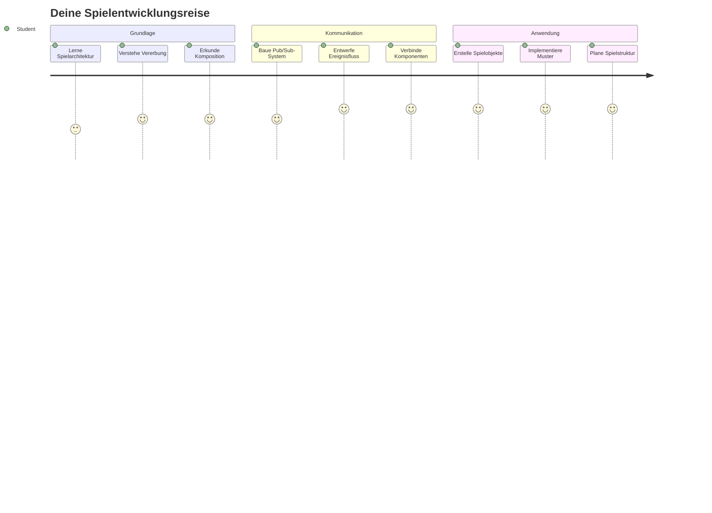
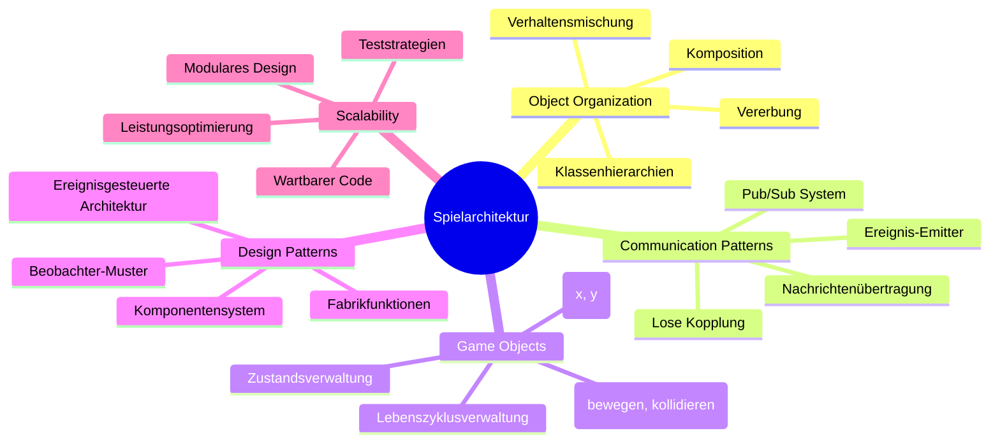
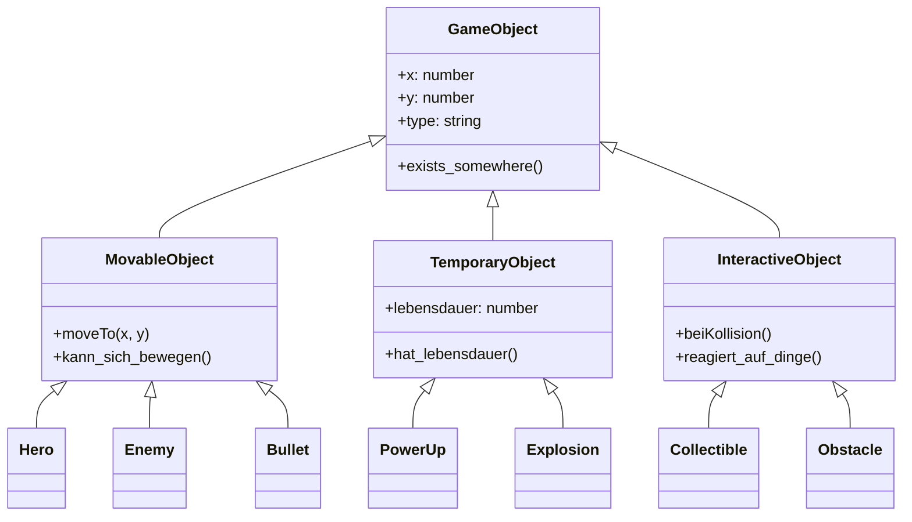
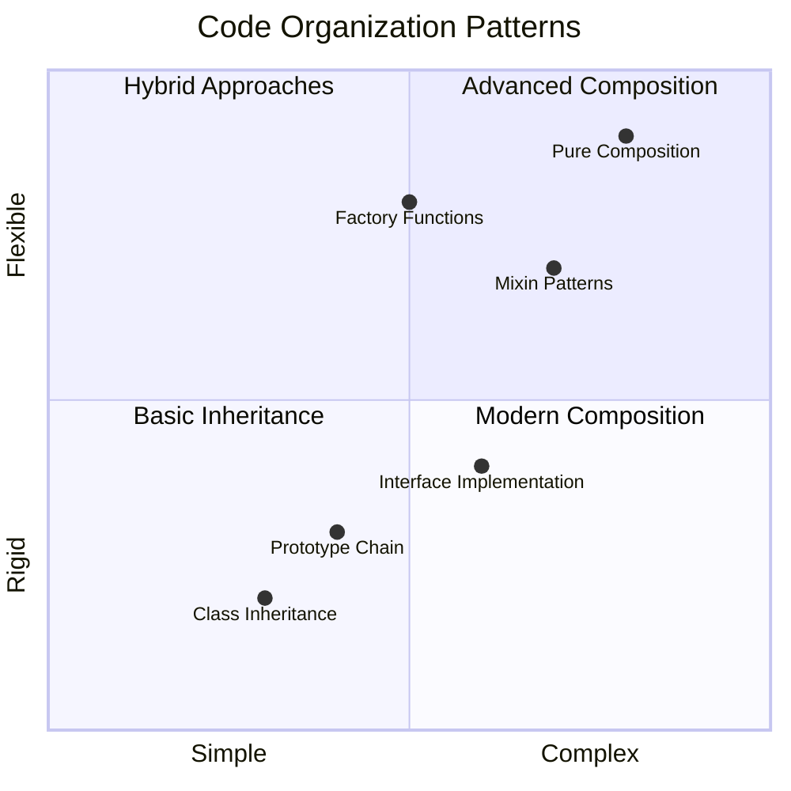
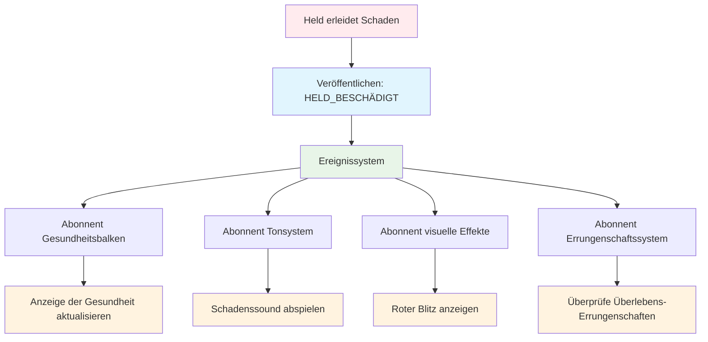
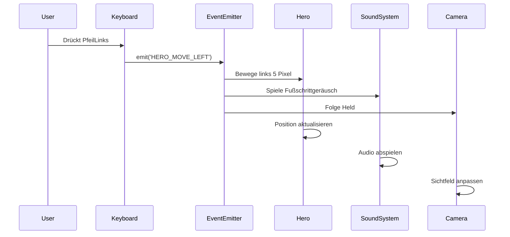
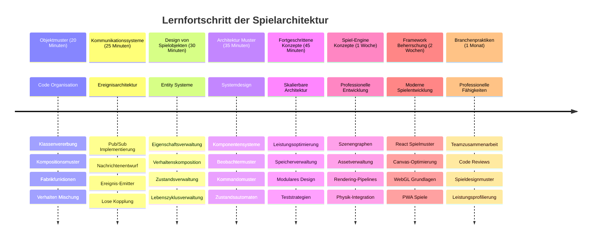

<!--
CO_OP_TRANSLATOR_METADATA:
{
  "original_hash": "a6332a7bb4d0be3bfd24199c83993777",
  "translation_date": "2026-01-06T08:46:43+00:00",
  "source_file": "6-space-game/1-introduction/README.md",
  "language_code": "de"
}
-->
# Baue ein Weltraumspiel Teil 1: Einführung




Genau wie die Missionskontrolle der NASA mehrere Systeme während eines Weltraumstarts koordiniert, werden wir ein Weltraumspiel entwickeln, das zeigt, wie verschiedene Teile eines Programms nahtlos zusammenarbeiten können. Während du etwas erschaffst, das du tatsächlich spielen kannst, lernst du wichtige Programmierkonzepte, die für jedes Softwareprojekt gelten.

Wir erkunden zwei grundlegende Ansätze zur Organisation von Code: Vererbung und Komposition. Diese sind nicht nur akademische Konzepte – es sind die gleichen Muster, die alles antreiben, von Videospielen bis hin zu Banksystemen. Wir implementieren außerdem ein Kommunikationssystem namens Pub/Sub, das wie die Kommunikationsnetzwerke in Raumfahrzeugen funktioniert und es verschiedenen Komponenten erlaubt, Informationen zu teilen, ohne Abhängigkeiten zu erzeugen.

Am Ende dieser Serie wirst du verstehen, wie man Anwendungen baut, die skalieren und sich weiterentwickeln können – egal ob du Spiele, Webanwendungen oder andere Softwaresysteme entwickelst.


## Quiz vor der Vorlesung

[Quiz vor der Vorlesung](https://ff-quizzes.netlify.app/web/quiz/29)

## Vererbung und Komposition in der Spieleentwicklung

Wenn Projekte komplexer werden, wird die Codeorganisation entscheidend. Was als einfaches Skript beginnt, kann ohne richtige Struktur schwer wartbar werden – genau wie bei den Apollo-Missionen, die eine sorgfältige Koordination von tausenden Komponenten erforderten.

Wir betrachten zwei grundlegende Ansätze zur Organisation von Code: Vererbung und Komposition. Jeder hat seine eigenen Vorteile, und das Verstehen beider hilft dir, den richtigen Ansatz für unterschiedliche Situationen zu wählen. Wir demonstrieren diese Konzepte über unser Weltraumspiel, in dem Helden, Feinde, Power-Ups und andere Objekte effizient interagieren müssen.

✅ Eines der berühmtesten Programmierbücher aller Zeiten handelt von [Design Patterns](https://en.wikipedia.org/wiki/Design_Patterns).

In jedem Spiel gibt es `Spielobjekte` – die interaktiven Elemente, die deine Spielwelt bevölkern. Helden, Feinde, Power-Ups und visuelle Effekte sind alles Spielobjekte. Jedes existiert an spezifischen Koordinaten auf dem Bildschirm mit `x`- und `y`-Werten, ähnlich dem Eintragen von Punkten auf einem Koordinatensystem.

Trotz ihrer visuellen Unterschiede teilen diese Objekte oft grundlegende Verhaltensweisen:

- **Sie existieren irgendwo** – Jedes Objekt hat x- und y-Koordinaten, damit das Spiel weiß, wo es gezeichnet wird
- **Viele können sich bewegen** – Helden rennen, Feinde jagen, Kugeln fliegen über den Bildschirm
- **Sie haben eine Lebensdauer** – Manche bleiben für immer, andere (wie Explosionen) erscheinen kurz und verschwinden
- **Sie reagieren auf Dinge** – Wenn Kollisionen passieren, werden Power-Ups eingesammelt, Gesundheitsanzeigen aktualisiert

✅ Denk an ein Spiel wie Pac-Man. Kannst du die vier oben genannten Objekttypen in diesem Spiel identifizieren?


### Verhalten durch Code ausdrücken

Jetzt, da du die gemeinsamen Verhaltensweisen von Spielobjekten verstanden hast, schauen wir uns an, wie man diese in JavaScript implementiert. Du kannst das Verhalten von Objekten durch Methoden ausdrücken, die entweder Klassen oder einzelnen Objekten zugeordnet sind, und es gibt verschiedene Ansätze zur Auswahl.

**Der klassenbasierte Ansatz**

Klassen und Vererbung bieten einen strukturierten Weg, Spielobjekte zu organisieren. Wie das von Carl Linnaeus entwickelte Klassifikationssystem startest du mit einer Basisklasse, die gemeinsame Eigenschaften enthält, und erstellst dann spezialisierte Klassen, die diese Grundlagen erben und spezifische Fähigkeiten hinzufügen.

✅ Vererbung ist ein wichtiges Konzept. Erfahre mehr im [MDN-Artikel über Vererbung](https://developer.mozilla.org/docs/Web/JavaScript/Inheritance_and_the_prototype_chain).

So kannst du Spielobjekte mit Klassen und Vererbung implementieren:

```javascript
// Schritt 1: Erstellen Sie die Basisklasse GameObject
class GameObject {
  constructor(x, y, type) {
    this.x = x;
    this.y = y;
    this.type = type;
  }
}
```

**Brechen wir das Schritt für Schritt herunter:**
- Wir erstellen eine grundlegende Vorlage, die jedes Spielobjekt nutzen kann
- Der Konstruktor speichert, wo sich das Objekt befindet (`x`, `y`) und welche Art es ist
- Das wird die Basis, auf der all deine Spielobjekte aufbauen

```javascript
// Schritt 2: Bewegungskapazität durch Vererbung hinzufügen
class Movable extends GameObject {
  constructor(x, y, type) {
    super(x, y, type); // Rufe den Konstruktor der Elternklasse auf
  }

  // Füge die Fähigkeit hinzu, sich zu einer neuen Position zu bewegen
  moveTo(x, y) {
    this.x = x;
    this.y = y;
  }
}
```

**Im obigen Beispiel haben wir:**
- Die Klasse GameObject erweitert, um Bewegungsfunktionen hinzuzufügen
- Den Eltern-Konstruktor mit `super()` aufgerufen, um vererbte Eigenschaften zu initialisieren
- Eine Methode `moveTo()` hinzugefügt, die die Position des Objekts aktualisiert

```javascript
// Schritt 3: Erstelle spezifische Spielobjekttypen
class Hero extends Movable {
  constructor(x, y) {
    super(x, y, 'Hero'); // Typ automatisch setzen
  }
}

class Tree extends GameObject {
  constructor(x, y) {
    super(x, y, 'Tree'); // Bäume benötigen keine Bewegung
  }
}

// Schritt 4: Verwenden Sie Ihre Spielobjekte
const hero = new Hero(0, 0);
hero.moveTo(5, 5); // Held kann sich bewegen!

const tree = new Tree(10, 15);
// tree.moveTo() würde einen Fehler verursachen - Bäume können sich nicht bewegen
```

**Verstehen dieser Konzepte:**
- **Erstellt** spezialisierte Objekttypen, die passende Verhaltensweisen erben
- **Zeigt**, wie Vererbung selektives Hinzufügen von Funktionen ermöglicht
- **Beweist**, dass Helden sich bewegen können, während Bäume stationär bleiben
- **Illustriert**, wie die Klassenhierarchie unpassende Aktionen verhindert

✅ Nimm dir ein paar Minuten, um einen Pac-Man-Helden (wie Inky, Pinky oder Blinky) in JavaScript neu zu entwerfen.

**Der Kompositionsansatz**

Komposition folgt einer modularen Designphilosophie, ähnlich wie Ingenieure Raumfahrzeuge mit austauschbaren Komponenten entwerfen. Anstatt von einer Elternklasse zu erben, kombinierst du spezifische Verhaltensweisen, um Objekte mit genau der Funktionalität zu schaffen, die sie brauchen. Dieser Ansatz bietet Flexibilität ohne starre hierarchische Zwänge.

```javascript
// Schritt 1: Erstellen Sie Basis-Verhaltensobjekte
const gameObject = {
  x: 0,
  y: 0,
  type: ''
};

const movable = {
  moveTo(x, y) {
    this.x = x;
    this.y = y;
  }
};
```

**Das macht dieser Code:**
- **Definiert** ein Basis-`gameObject` mit Positions- und Typ-Eigenschaften
- **Erstellt** ein separates `movable`-Verhaltensobjekt mit Bewegungsfunktionalität
- **Teilt** Aufgaben, indem Positionsdaten und Bewegungslogik unabhängig bleiben

```javascript
// Schritt 2: Objekte durch Kombinieren von Verhaltensweisen zusammensetzen
const movableObject = { ...gameObject, ...movable };

// Schritt 3: Fabrikfunktionen für verschiedene Objekttypen erstellen
function createHero(x, y) {
  return {
    ...movableObject,
    x,
    y,
    type: 'Hero'
  };
}

function createStatic(x, y, type) {
  return {
    ...gameObject,
    x,
    y,
    type
  };
}
```

**Im obigen Beispiel haben wir:**
- Basis-Eigenschaften mit Bewegungsverhalten durch Spread-Syntax kombiniert
- Fabrikfunktionen erstellt, die maßgeschneiderte Objekte zurückgeben
- Flexible Objekterstellung ohne starre Klassenhierarchien ermöglicht
- Objekten genau die Verhaltensweisen gegeben, die sie brauchen

```javascript
// Schritt 4: Erstellen und verwenden Sie Ihre zusammengesetzten Objekte
const hero = createHero(10, 10);
hero.moveTo(5, 5); // Funktioniert einwandfrei!

const tree = createStatic(0, 0, 'Tree');
// tree.moveTo() ist undefiniert - kein Bewegungsverhalten wurde zusammengesetzt
```

**Wichtige Punkte zum Merken:**
- Objekte werden durch Vermischung von Verhaltensweisen statt Vererbung zusammengesetzt
- Bietet mehr Flexibilität als starre Vererbungshierarchien
- Ermöglicht Objekten, genau die Funktionen zu haben, die sie benötigen
- Nutzt moderne JavaScript-Spread-Syntax für sauberes Objektkombinieren

```

**Which Pattern Should You Choose?**

**Which Pattern Should You Choose?**



> 💡 **Profi-Tipp**: Beide Muster haben ihren Platz in moderner JavaScript-Entwicklung. Klassen funktionieren gut für klar definierte Hierarchien, während Komposition glänzt, wenn maximale Flexibilität gefragt ist.
> 
**Hier erfährst du, wann du welchen Ansatz wählst:**
- **Wähle** Vererbung, wenn es klare „ist-ein“-Beziehungen gibt (ein Held *ist-ein* bewegliches Objekt)
- **Wähle** Komposition, wenn „hat-ein“-Beziehungen gebraucht werden (ein Held *hat* Bewegungsfähigkeiten)
- **Berücksichtige** die Präferenzen deines Teams und die Anforderungen des Projekts
- **Erinnere dich**, dass du beide Ansätze in einer Anwendung mischen kannst

### 🔄 **Pädagogisches Check-in**
**Verständnis der Objektorganisation**: Bevor wir zu Kommunikationsmustern kommen, vergewissere dich, dass du:
- ✅ den Unterschied zwischen Vererbung und Komposition erklären kannst
- ✅ weißt, wann Klassen oder Fabrikfunktionen zu verwenden sind
- ✅ verstehst, wie das Schlüsselwort `super()` in der Vererbung funktioniert
- ✅ die Vorteile beider Ansätze für die Spieleentwicklung erkennst

**Schnelltest**: Wie würdest du einen fliegenden Feind erstellen, der sich bewegen und fliegen kann?
- **Vererbungsansatz**: `class FlyingEnemy extends Movable`
- **Kompositionsansatz**: `{ ...movable, ...flyable, ...gameObject }`

**Praxisbezug**: Diese Muster tauchen überall auf:
- **React-Komponenten**: Props (Komposition) vs Klassenvererbung
- **Game Engines**: Entity-Component-Systeme verwenden Komposition
- **Mobile Apps**: UI-Frameworks nutzen oft Vererbungshierarchien

## Kommunikationsmuster: Das Pub/Sub-System

Wenn Anwendungen komplex werden, wird die Verwaltung der Kommunikation zwischen Komponenten herausfordernd. Das Publish-Subscribe-Muster (Pub/Sub) löst dieses Problem mit Prinzipien ähnlich der Radioübertragung – ein Sender kann mehrere Empfänger erreichen, ohne zu wissen, wer zuhört.

Stell dir vor, ein Held erleidet Schaden: Die Gesundheitsleiste aktualisiert sich, Soundeffekte erklingen, visuelles Feedback erscheint. Statt das Heldenobjekt direkt mit diesen Systemen zu koppeln, erlaubt Pub/Sub dem Helden, eine „Schaden erlitten“-Nachricht zu senden. Jedes System, das darauf reagieren muss, kann sich auf diese Nachrichtenart abonnieren und entsprechend reagieren.

✅ **Pub/Sub** steht für „publish-subscribe“ (veröffentlichen-abonnieren)


### Das Pub/Sub-Architektur verstehen

Das Pub/Sub-Muster hält verschiedene Teile deiner Anwendung locker gekoppelt, das heißt, sie können zusammenarbeiten, ohne direkt voneinander abhängig zu sein. Diese Trennung macht deinen Code wartbarer, testbarer und flexibler gegenüber Veränderungen.

**Die Hauptakteure im Pub/Sub:**
- **Nachrichten** – Einfache Textlabels wie `'PLAYER_SCORED'`, die beschreiben, was passiert ist (plus zusätzliche Infos)
- **Publisher** – Die Objekte, die „Etwas ist passiert!“ an alle Zuhörer ausrufen
- **Subscriber** – Die Objekte, die sagen „Das Ereignis interessiert mich“ und reagieren, wenn es eintritt
- **Event-System** – Der Vermittler, der sicherstellt, dass Nachrichten an die richtigen Zuhörer gelangen

### Ein Event-System bauen

Lass uns ein einfaches, aber mächtiges Event-System erstellen, das diese Konzepte demonstriert:

```javascript
// Schritt 1: Erstellen Sie die EventEmitter-Klasse
class EventEmitter {
  constructor() {
    this.listeners = {}; // Speichern Sie alle Ereignis-Listener
  }
  
  // Registrieren Sie einen Listener für einen bestimmten Nachrichtentyp
  on(message, listener) {
    if (!this.listeners[message]) {
      this.listeners[message] = [];
    }
    this.listeners[message].push(listener);
  }
  
  // Senden Sie eine Nachricht an alle registrierten Listener
  emit(message, payload = null) {
    if (this.listeners[message]) {
      this.listeners[message].forEach(listener => {
        listener(message, payload);
      });
    }
  }
}
```

**Aufgeschlüsselt was hier passiert:**
- **Erstellt** ein zentrales Event-Management-System mittels einfacher Klasse
- **Speichert** Listener in einem Objekt, organisiert nach Nachrichtentyp
- **Registriert** neue Listener mit der Methode `on()`
- **Sendet** Nachrichten an alle interessierten Listener mit `emit()`
- **Unterstützt** optionale Daten-Payloads zum Übergeben relevanter Informationen

### Alles zusammenführen: Ein praktisches Beispiel

Okay, sehen wir das in Aktion! Wir bauen ein einfaches Bewegungssystem, das zeigt, wie sauber und flexibel Pub/Sub sein kann:

```javascript
// Schritt 1: Definieren Sie Ihre Nachrichtentypen
const Messages = {
  HERO_MOVE_LEFT: 'HERO_MOVE_LEFT',
  HERO_MOVE_RIGHT: 'HERO_MOVE_RIGHT',
  ENEMY_SPOTTED: 'ENEMY_SPOTTED'
};

// Schritt 2: Erstellen Sie Ihr Ereignissystem und Ihre Spielobjekte
const eventEmitter = new EventEmitter();
const hero = createHero(0, 0);
```

**Das macht dieser Code:**
- **Definiert** ein Konstantenobjekt, um Tippfehler bei Nachrichtennamen zu vermeiden
- **Erstellt** eine Event-Emitter-Instanz zur Handhabung aller Kommunikation
- **Initialisiert** ein Heldenobjekt an der Startposition

```javascript
// Schritt 3: Ereignis-Listener (Abonnenten) einrichten
eventEmitter.on(Messages.HERO_MOVE_LEFT, () => {
  hero.moveTo(hero.x - 5, hero.y);
  console.log(`Hero moved to position: ${hero.x}, ${hero.y}`);
});

eventEmitter.on(Messages.HERO_MOVE_RIGHT, () => {
  hero.moveTo(hero.x + 5, hero.y);
  console.log(`Hero moved to position: ${hero.x}, ${hero.y}`);
});
```

**Im obigen Beispiel haben wir:**
- Event-Listener registriert, die auf Bewegungsnachrichten reagieren
- Die Position des Helden basierend auf der Bewegungsrichtung aktualisiert
- Konsolen-Logs hinzugefügt, um Positionsänderungen des Helden zu verfolgen
- Die Bewegungslogik von der Eingabe-Verarbeitung getrennt

```javascript
// Schritt 4: Tastatureingabe mit Ereignissen (Publishern) verbinden
window.addEventListener('keydown', (event) => {
  switch(event.key) {
    case 'ArrowLeft':
      eventEmitter.emit(Messages.HERO_MOVE_LEFT);
      break;
    case 'ArrowRight':
      eventEmitter.emit(Messages.HERO_MOVE_RIGHT);
      break;
  }
});
```

**Verstehen dieser Konzepte:**
- **Verbindet** Tastatureingaben mit Spielereignissen ohne enge Kopplung
- **Ermöglicht** dem Eingabesystem die indirekte Kommunikation mit Spielobjekten
- **Erlaubt** mehreren Systemen auf dieselben Tastaturereignisse zu reagieren
- **Macht** es einfach, Tastenbelegungen zu ändern oder neue Eingabemethoden hinzuzufügen


> 💡 **Profi-Tipp**: Das Schöne an diesem Muster ist die Flexibilität! Du kannst ganz einfach Soundeffekte, Bildschirmzittern oder Partikeleffekte hinzufügen, indem du einfach mehr Event-Listener hinzufügst – ohne den bestehenden Tastatur- oder Bewegungscode anzupassen.
> 
**Darum wirst du diesen Ansatz lieben:**
- Neue Features hinzufügen wird super einfach – höre einfach auf die interessierenden Ereignisse
- Mehrere Systeme können gleichzeitig auf dasselbe Ereignis reagieren, ohne sich gegenseitig zu stören
- Testen wird viel einfacher, weil jedes Teil unabhängig funktioniert
- Wenn etwas kaputtgeht, weißt du genau, wo du nachsehen musst

### Warum Pub/Sub gut skaliert

Das Pub/Sub-Muster bleibt simpel, wenn Anwendungen komplexer werden. Ob du dutzende Gegner, dynamische UI-Updates oder Soundsysteme verwaltest – das Muster bewältigt wachsende Skalierung ohne architektonische Änderungen. Neue Features integrieren sich in das bestehende Event-System, ohne etablierte Funktionalität zu beeinträchtigen.

> ⚠️ **Häufiger Fehler**: Erstelle nicht zu früh zu viele spezifische Nachrichtentypen. Starte mit höheren Kategorien und verfeinere sie, wenn die Anforderungen deines Spiels klarer werden.
> 
**Best Practices:**
- **Gruppiere** verwandte Nachrichten in sinnvolle Kategorien
- **Verwende** beschreibende Namen, die klar anzeigen, was passiert ist
- **Halte** Nachrichten-Payloads einfach und fokussiert
- **Dokumentiere** deine Nachrichtentypen für die Teamzusammenarbeit

### 🔄 **Pädagogisches Check-in**
**Verständnis der ereignisgesteuerten Architektur**: Überprüfe dein Verständnis des gesamten Systems:
- ✅ Wie verhindert das Pub/Sub-Muster eine enge Kopplung zwischen Komponenten?
- ✅ Warum ist es einfacher, neue Features mit ereignisgesteuerter Architektur hinzuzufügen?
- ✅ Welche Rolle spielt der EventEmitter im Kommunikationsfluss?
- ✅ Wie verhindern Nachrichten-Konstanten Bugs und verbessern die Wartbarkeit?

**Design-Herausforderung**: Wie würdest du diese Spielszenarien mit Pub/Sub handhaben?
1. **Feind stirbt**: Punkte aktualisieren, Sound abspielen, Power-Up spawnen, vom Bildschirm entfernen
2. **Level beendet**: Musik stoppen, UI zeigen, Fortschritt speichern, nächstes Level laden
3. **Power-Up eingesammelt**: Fähigkeiten verbessern, UI aktualisieren, Effekt abspielen, Timer starten

**Professioneller Bezug**: Dieses Muster taucht auf in:
- **Frontend-Frameworks**: React/Vue-Event-Systeme
- **Backend-Services**: Kommunikation in Microservices
- **Game Engines**: Unitys Event-System
- **Mobile Entwicklung**: iOS/Android Benachrichtigungssysteme

---

## GitHub Copilot Agent Challenge 🚀

Nutze den Agent-Modus, um die folgende Herausforderung zu lösen:

**Beschreibung:** Erstelle ein einfaches Spielobjektsystem, das sowohl Vererbung als auch das Pub/Sub-Muster verwendet. Du implementierst ein Grundspiel, in dem verschiedene Objekte über Events kommunizieren können, ohne direkt voneinander zu wissen.

**Aufgabe:** Erstelle ein JavaScript-Spielsystem mit folgenden Anforderungen: 1) Erstelle eine Basisklasse GameObject mit x, y Koordinaten und einer Typ-Eigenschaft. 2) Erstelle eine Hero-Klasse, die GameObject erweitert und sich bewegen kann. 3) Erstelle eine Enemy-Klasse, die GameObject erweitert und den Helden verfolgen kann. 4) Implementiere eine EventEmitter-Klasse für das Pub/Sub-Muster. 5) Richte Event-Listener ein, so dass wenn der Held sich bewegt, nahe Feinde ein 'HERO_MOVED' Event erhalten und ihre Position aktualisieren, um sich zum Helden zu bewegen. Füge console.log-Anweisungen hinzu, um die Kommunikation der Objekte zu zeigen.

Mehr über [Agent-Modus](https://code.visualstudio.com/blogs/2025/02/24/introducing-copilot-agent-mode) erfährst du hier.

## 🚀 Herausforderung
Betrachten Sie, wie das Pub-Sub-Muster die Spielearchitektur verbessern kann. Identifizieren Sie, welche Komponenten Ereignisse auslösen sollten und wie das System darauf reagieren sollte. Entwerfen Sie ein Spielkonzept und skizzieren Sie die Kommunikationsmuster zwischen den Komponenten.

## Post-Vorlesungs-Quiz

[Post-Vorlesungs-Quiz](https://ff-quizzes.netlify.app/web/quiz/30)

## Rückblick & Selbststudium

Erfahren Sie mehr über Pub/Sub, indem Sie [darüber lesen](https://docs.microsoft.com/azure/architecture/patterns/publisher-subscriber/?WT.mc_id=academic-77807-sagibbon).

### ⚡ **Was Sie in den nächsten 5 Minuten tun können**
- [ ] Öffnen Sie ein beliebiges HTML5-Spiel online und untersuchen Sie dessen Code mit DevTools
- [ ] Erstellen Sie ein einfaches HTML5-Canvas-Element und zeichnen Sie eine Grundform
- [ ] Versuchen Sie, `setInterval` zu verwenden, um eine einfache Animationsschleife zu erstellen
- [ ] Erkunden Sie die Canvas-API-Dokumentation und probieren Sie eine Zeichenmethode aus

### 🎯 **Was Sie in dieser Stunde erreichen können**
- [ ] Abschließen des Post-Lesson-Quiz und Verständnis von Spielentwicklungs-Konzepten
- [ ] Einrichten der Projektstruktur Ihres Spiels mit HTML-, CSS- und JavaScript-Dateien
- [ ] Erstellen einer einfachen Spielschleife, die kontinuierlich aktualisiert und rendert
- [ ] Zeichnen Ihrer ersten Spiel-Sprites auf dem Canvas
- [ ] Implementieren des grundlegenden Ladens von Assets wie Bildern und Sounds

### 📅 **Ihre einwöchige Spielentwicklung**
- [ ] Komplettieren Sie das ganze Weltraumspiel mit allen geplanten Features
- [ ] Fügen Sie ausgereifte Grafiken, Soundeffekte und flüssige Animationen hinzu
- [ ] Implementieren Sie Spielzustände (Startbildschirm, Gameplay, Spielende)
- [ ] Erstellen Sie ein Punktesystem und die Fortschrittsverfolgung der Spieler
- [ ] Machen Sie Ihr Spiel responsiv und zugänglich auf verschiedenen Geräten
- [ ] Teilen Sie Ihr Spiel online und sammeln Sie Feedback von Spielern

### 🌟 **Ihre einmonatige Spielentwicklung**
- [ ] Erstellen Sie mehrere Spiele, die verschiedene Genres und Mechaniken erforschen
- [ ] Lernen Sie ein Spielentwicklungs-Framework wie Phaser oder Three.js
- [ ] Tragen Sie zu Open-Source-Spielprojekten bei
- [ ] Meistern Sie fortgeschrittene Spielprogrammiermuster und Optimierung
- [ ] Erstellen Sie ein Portfolio, das Ihre Spielentwicklungsfähigkeiten zeigt
- [ ] Unterstützen Sie andere, die sich für Spielentwicklung und interaktive Medien interessieren

## 🎯 Ihr Zeitplan zur Meisterung der Spielentwicklung


### 🛠️ Zusammenfassung Ihres Toolkits für Spielearchitektur

Nach Abschluss dieser Lektion verfügen Sie nun über:
- **Design Pattern Mastery**: Verständnis der Vor- und Nachteile von Vererbung versus Komposition
- **Ereignisgesteuerte Architektur**: Pub/Sub-Implementierung für skalierbare Kommunikation
- **Objektorientiertes Design**: Klassenhierarchien und Verhaltenskomposition
- **Modernes JavaScript**: Factory-Funktionen, Spread-Syntax und ES6+ Muster
- **Skalierbare Architektur**: Prinzipien für lose Kopplung und modulare Gestaltung
- **Grundlagen der Spieleentwicklung**: Entity-Systeme und Komponentenmuster
- **Professionelle Muster**: Branchenübliche Ansätze zur Codeorganisation

**Anwendungen in der Praxis**: Diese Muster finden direkte Anwendung in:
- **Frontend-Frameworks**: React/Vue-Komponentenarchitektur und Zustandsverwaltung
- **Backend-Diensten**: Mikroservice-Kommunikation und ereignisgesteuerte Systeme
- **Mobiler Entwicklung**: iOS/Android-App-Architekturen und Benachrichtigungssysteme
- **Spiel-Engines**: Unity, Unreal und webbasierte Spieleentwicklung
- **Enterprise-Software**: Event Sourcing und verteilte Systemarchitektur
- **API-Design**: RESTful-Services und Echtzeit-Kommunikation

**Erworbene berufliche Kompetenzen**: Sie können nun:
- **Entwerfen** skalierbare Softwarearchitekturen mit bewährten Mustern
- **Implementieren** ereignisgesteuerte Systeme, die komplexe Interaktionen handhaben
- **Auswählen** geeigneter Strategien zur Codeorganisation für verschiedene Szenarien
- **Debuggen** und Warten von lose gekoppelten Systemen effektiv durchführen
- **Kommunizieren** technische Entscheidungen mit branchentauglicher Terminologie

**Nächste Stufe**: Sie sind bereit, diese Muster in einem echten Spiel umzusetzen, fortgeschrittene Themen der Spieleentwicklung zu erkunden oder diese Architekturkonzepte auf Webanwendungen anzuwenden!

🌟 **Erfolg freigeschaltet**: Sie haben grundlegende Softwarearchitektur-Muster gemeistert, die alles von einfachen Spielen bis zu komplexen Unternehmenssystemen antreiben!

## Aufgabe

[Modellieren Sie ein Spiel](assignment.md)

---

<!-- CO-OP TRANSLATOR DISCLAIMER START -->
**Haftungsausschluss**:  
Dieses Dokument wurde mithilfe des KI-Übersetzungsdienstes [Co-op Translator](https://github.com/Azure/co-op-translator) übersetzt. Obwohl wir uns um Genauigkeit bemühen, können automatisierte Übersetzungen Fehler oder Ungenauigkeiten enthalten. Das Originaldokument in seiner Originalsprache gilt als maßgebliche Quelle. Für wichtige Informationen wird eine professionelle menschliche Übersetzung empfohlen. Wir übernehmen keine Haftung für Missverständnisse oder Fehlinterpretationen, die aus der Nutzung dieser Übersetzung entstehen.
<!-- CO-OP TRANSLATOR DISCLAIMER END -->