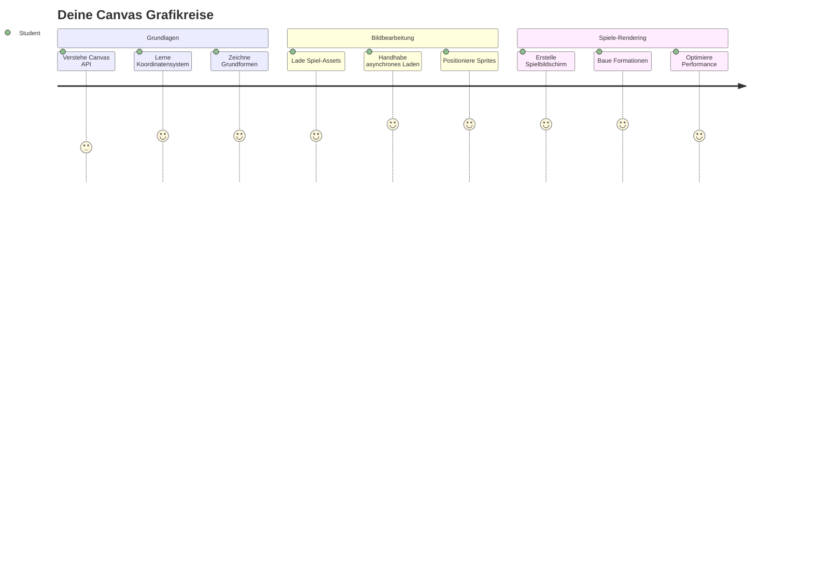
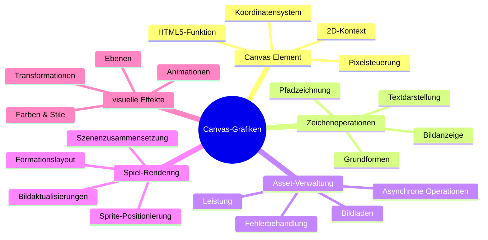
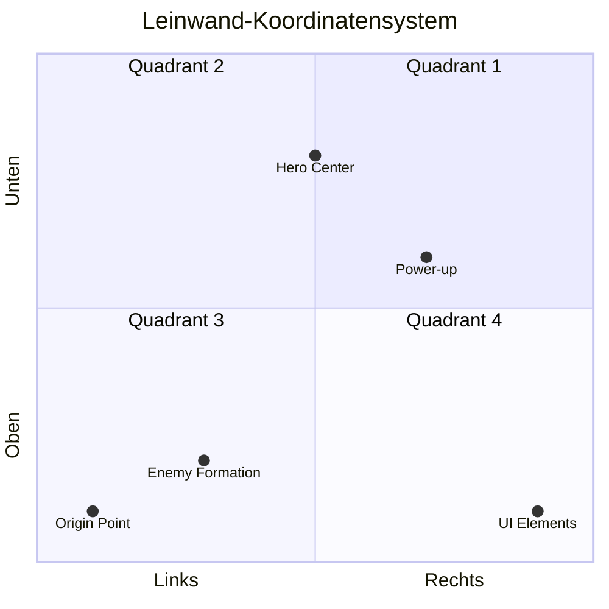
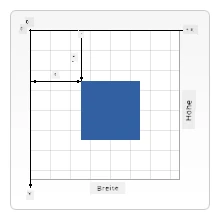
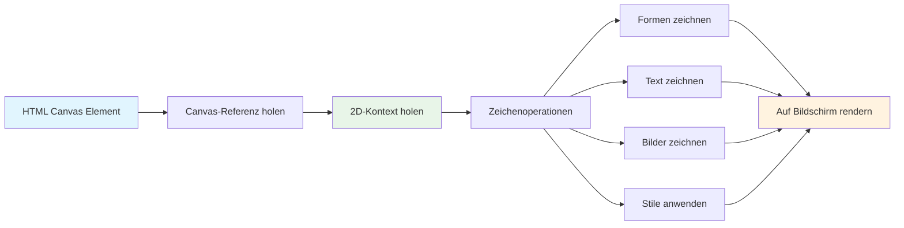
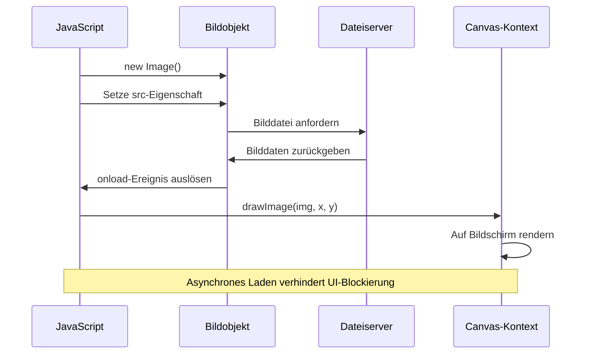
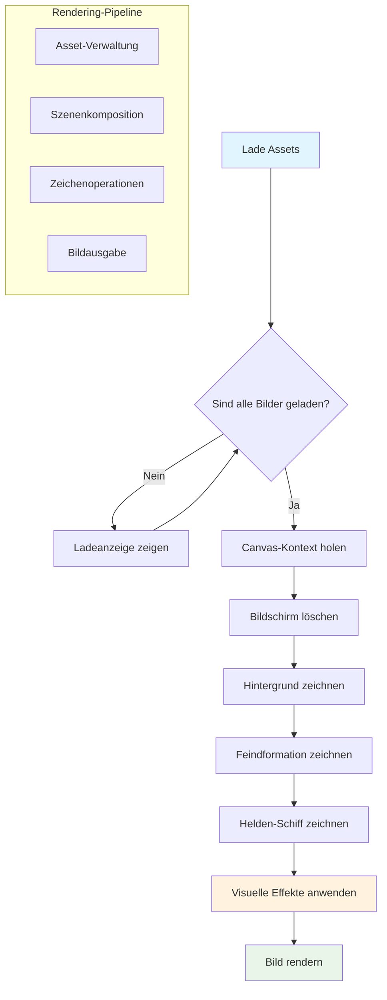
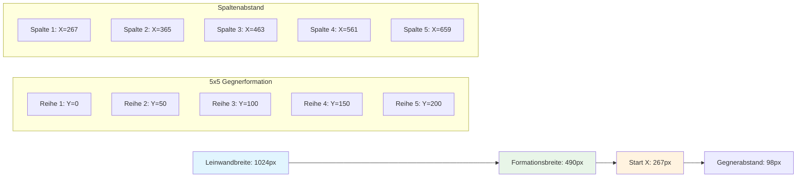
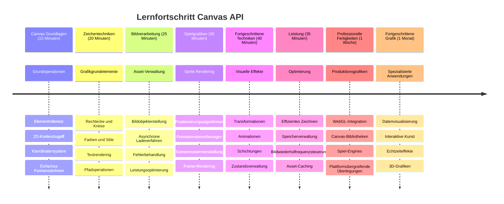

# Baue ein Space Game Teil 2: Held und Monster auf die Leinwand zeichnen


Die Canvas-API ist eine der mächtigsten Funktionen der Webentwicklung, um dynamische, interaktive Grafiken direkt im Browser zu erstellen. In dieser Lektion verwandeln wir das leere HTML-`<canvas>`-Element in eine Spielwelt voller Helden und Monster. Stell dir die Leinwand als dein digitales Zeichenbrett vor, auf dem Code sichtbar wird.

Wir bauen auf dem auf, was du in der vorherigen Lektion gelernt hast, und tauchen nun in die visuellen Aspekte ein. Du lernst, wie man Spiel-Sprites lädt und anzeigt, Elemente präzise positioniert und die visuelle Grundlage für dein Space Game schafft. Dies überbrückt die Lücke zwischen statischen Webseiten und dynamischen, interaktiven Erlebnissen.

Am Ende dieser Lektion hast du eine komplette Spielszenen mit deinem Heldenraumschiff korrekt positioniert und Feindformationen bereit für den Kampf. Du verstehst, wie moderne Spiele Grafiken in Browsern rendern und erwirbst Fähigkeiten, um deine eigenen interaktiven visuellen Erlebnisse zu schaffen. Lass uns die Canvas-Grafiken erkunden und dein Space Game zum Leben erwecken!


## Vorab-Quiz

[Vortrags-Quiz](https://ff-quizzes.netlify.app/web/quiz/31)

## Das Canvas

Was genau ist eigentlich dieses `<canvas>`-Element? Es ist HTML5s Lösung, um dynamische Grafiken und Animationen in Webbrowsern zu erstellen. Im Gegensatz zu regulären statischen Bildern oder Videos gibt dir das Canvas die Kontrolle auf Pixelebene über alles, was auf dem Bildschirm erscheint. Das macht es perfekt für Spiele, Datenvisualisierungen und interaktive Kunst. Denk daran als programmierbare Zeichenfläche, bei der JavaScript dein Pinsel ist.

Standardmäßig sieht ein Canvas-Element auf deiner Seite aus wie ein leeres, transparentes Rechteck. Aber genau darin steckt das Potenzial! Seine wahre Stärke entfaltet sich, wenn du mit JavaScript Formen zeichnest, Bilder lädst, Animationen erstellst und Dinge benutzerinteraktiv machst. Ähnlich wie frühe Computergrafik-Pioniere bei Bell Labs in den 1960ern, die jeden Pixel programmieren mussten, um die ersten digitalen Animationen zu erstellen.

✅ Lies [mehr über die Canvas API](https://developer.mozilla.org/docs/Web/API/Canvas_API) auf MDN.

Hier ist, wie es typischerweise als Teil des Seitenkörpers deklariert wird:

```html
<canvas id="myCanvas" width="200" height="100"></canvas>
```
  
**Das macht dieser Code:**  
- **Setzt** das `id`-Attribut, damit du dieses spezifische Canvas-Element in JavaScript referenzieren kannst  
- **Definiert** die `width` in Pixeln, um die horizontale Größe des Canvas zu steuern  
- **Legt fest** die `height` in Pixeln, um die vertikale Größe des Canvas zu bestimmen  

## Einfache Geometrie zeichnen

Jetzt, wo du weißt, was das Canvas-Element ist, schauen wir uns an, wie man tatsächlich darauf zeichnet! Das Canvas verwendet ein Koordinatensystem, das dir aus dem Matheunterricht vertraut sein könnte, aber es gibt einen wichtigen Unterschied, der speziell bei Computergrafiken gilt.

Das Canvas benutzt kartesische Koordinaten mit einer x-Achse (horizontal) und y-Achse (vertikal), um alles zu positionieren, was du zeichnest. Aber der entscheidende Unterschied ist: Anders als im Matheunterricht startet der Ursprungspunkt `(0,0)` an der oberen linken Ecke, wobei die x-Werte nach rechts und die y-Werte nach unten zunehmen. Diese Vorgehensweise stammt von frühen Computerbildschirmen, bei denen Elektronenstrahlen von oben nach unten gescannt haben – die obere linke Ecke ist so der natürliche Startpunkt.


  
> Bild von [MDN](https://developer.mozilla.org/docs/Web/API/Canvas_API/Tutorial/Drawing_shapes)

Um auf das Canvas-Element zu zeichnen, folgst du dem gleichen dreistufigen Prozess, der die Grundlage aller Canvas-Grafiken bildet. Nachdem du das ein paar Mal gemacht hast, geht es in Fleisch und Blut über:


1. **Hole eine Referenz** zu deinem Canvas-Element aus dem DOM (wie zu jedem anderen HTML-Element auch)  
2. **Hole den 2D-Rendering-Kontext** – der liefert alle Zeichenmethoden  
3. **Fang an zu zeichnen!** Verwende die eingebauten Methoden des Kontexts, um deine Grafiken zu erstellen  

So sieht das im Code aus:

```javascript
// Schritt 1: Das Canvas-Element abrufen
const canvas = document.getElementById("myCanvas");

// Schritt 2: Den 2D-Zeichenkontext abrufen
const ctx = canvas.getContext("2d");

// Schritt 3: Füllfarbe einstellen und ein Rechteck zeichnen
ctx.fillStyle = 'red';
ctx.fillRect(0, 0, 200, 200); // x, y, Breite, Höhe
```
  
**Schritt für Schritt erklärt:**  
- Wir **greifen** auf unser Canvas-Element über seine ID zu und speichern es in einer Variable  
- Wir **holen** den 2D-Rendering-Kontext – das ist unser Werkzeugkasten voller Zeichenmethoden  
- Wir **sagen** dem Canvas, dass wir mit der Farbe Rot füllen wollen, über die Eigenschaft `fillStyle`  
- Wir **zeichnen** ein Rechteck, das in der oberen linken Ecke (0,0) startet und 200 Pixel breit sowie hoch ist

✅ Die Canvas API konzentriert sich überwiegend auf 2D-Formen, aber du kannst auch 3D-Elemente auf einer Webseite zeichnen; dafür kannst du z. B. die [WebGL API](https://developer.mozilla.org/docs/Web/API/WebGL_API) verwenden.

Mit der Canvas API kannst du alle möglichen Dinge zeichnen wie:

- **Geometrische Formen**, wir haben gezeigt, wie man ein Rechteck zeichnet, aber es gibt viel mehr, was man zeichnen kann.  
- **Text**, du kannst Text mit jeder Schriftart und Farbe zeichnen.  
- **Bilder**, du kannst ein Bild basierend auf einem Bildasset wie z. B. .jpg oder .png zeichnen.

✅ Probiere es aus! Du weißt, wie man ein Rechteck zeichnet, kannst du auch einen Kreis auf die Seite zeichnen? Schau dir einige interessante Canvas-Zeichnungen auf CodePen an. Hier ist ein [besonders beeindruckendes Beispiel](https://codepen.io/dissimulate/pen/KrAwx).

### 🔄 **Pädagogisches Check-in**  
**Canvas-Grundlagen verstehen**: Bevor du zum Bildladen übergehst, stelle sicher, dass du:  
- ✅ Erklären kannst, wie sich das Canvas-Koordinatensystem von mathematischen Koordinaten unterscheidet  
- ✅ Den dreistufigen Prozess für Canvas-Zeichnungen verstehst  
- ✅ Erkennen kannst, was der 2D-Rendering-Kontext bereitstellt  
- ✅ Beschreiben kannst, wie fillStyle und fillRect zusammenarbeiten  

**Kurzer Selbsttest**: Wie würdest du einen blauen Kreis an Position (100, 50) mit Radius 25 zeichnen?  
```javascript
ctx.fillStyle = 'blue';
ctx.beginPath();
ctx.arc(100, 50, 25, 0, 2 * Math.PI);
ctx.fill();
```
  
**Canvas-Zeichenmethoden, die du jetzt kennst:**  
- **fillRect()**: Zeichnet gefüllte Rechtecke  
- **fillStyle**: Legt Farben und Muster fest  
- **beginPath()**: Startet neue Zeichenpfade  
- **arc()**: Erstellt Kreise und Kurven  

## Ein Bildasset laden und zeichnen

Das Zeichnen einfacher Formen ist hilfreich zum Einstieg, aber die meisten Spiele benötigen echte Bilder! Sprites, Hintergründe und Texturen sind das, was Spielen ihre visuelle Anziehungskraft verleiht. Bilder auf das Canvas zu laden und anzuzeigen funktioniert etwas anders als geometrische Formen zu zeichnen, ist aber einfach, sobald man den Prozess verstanden hat.

Wir müssen ein `Image`-Objekt erstellen, unsere Bilddatei laden (das passiert asynchron, also „im Hintergrund“) und es dann auf das Canvas zeichnen, sobald es bereit ist. Diese Methode sorgt dafür, dass deine Bilder korrekt angezeigt werden, ohne die Anwendung beim Laden zu blockieren.


### Einfaches Bildladen  

```javascript
const img = new Image();
img.src = 'path/to/my/image.png';
img.onload = () => {
  // Bild geladen und bereit zur Verwendung
  console.log('Image loaded successfully!');
};
```
  
**Das passiert in diesem Code:**  
- Wir **erstellen** ein neues Image-Objekt, um unser Sprite oder unsere Textur zu halten  
- Wir **sagen** ihm, welche Bilddatei geladen werden soll, indem wir den Quellenpfad setzen  
- Wir **hören** auf das Lade-Event, um genau zu wissen, wann das Bild bereit ist  

### Ein besserer Weg, Bilder zu laden

Hier ist eine robustere Methode zum Bildladen, die professionelle Entwickler häufig verwenden. Wir verpacken das Bildladen in eine auf Promises basierende Funktion – dieser Ansatz, der mit ES6 und JavaScript-Promises populär wurde, macht deinen Code organisierter und die Fehlerbehandlung elegant:

```javascript
function loadAsset(path) {
  return new Promise((resolve, reject) => {
    const img = new Image();
    img.src = path;
    img.onload = () => {
      resolve(img);
    };
    img.onerror = () => {
      reject(new Error(`Failed to load image: ${path}`));
    };
  });
}

// Moderne Verwendung mit async/await
async function initializeGame() {
  try {
    const heroImg = await loadAsset('hero.png');
    const monsterImg = await loadAsset('monster.png');
    // Bilder sind jetzt einsatzbereit
  } catch (error) {
    console.error('Failed to load game assets:', error);
  }
}
```
  
**Was wir hier gemacht haben:**  
- **Haben** die gesamte Bildlade-Logik in ein Promise verpackt, um sie besser zu handhaben  
- **Fehlerbehandlung** hinzugefügt, die tatsächlich meldet, wenn etwas schiefgeht  
- **Moderne async/await-Syntax** verwendet, weil sie viel klarer zu lesen ist  
- **try/catch-Blöcke** eingebaut, um Ladefehler elegant abzufangen  

Sobald deine Bilder geladen sind, ist das Zeichnen auf das Canvas eigentlich ganz unkompliziert:

```javascript
async function renderGameScreen() {
  try {
    // Spielassets laden
    const heroImg = await loadAsset('hero.png');
    const monsterImg = await loadAsset('monster.png');

    // Canvas und Kontext holen
    const canvas = document.getElementById("myCanvas");
    const ctx = canvas.getContext("2d");

    // Bilder an bestimmten Positionen zeichnen
    ctx.drawImage(heroImg, canvas.width / 2, canvas.height / 2);
    ctx.drawImage(monsterImg, 0, 0);
  } catch (error) {
    console.error('Failed to render game screen:', error);
  }
}
```
  
**Schritt für Schritt erklärt:**  
- Wir **laden** unser Helden- und Monsterbild im Hintergrund mit await  
- Wir **greifen** unser Canvas-Element und holen den 2D-Rendering-Kontext, den wir brauchen  
- Wir **positionieren** das Heldenbild genau in der Mitte mit etwas Koordinaten-Mathematik  
- Wir **setzen** das Monsterbild in die obere linke Ecke als Start der Feindformation  
- Wir **fangen** Fehler ab, die beim Laden oder Zeichnen auftreten könnten  


## Jetzt geht's ans Erstellen deines Spiels

Nun setzen wir alles zusammen, um die visuelle Grundlage deines Space Games zu schaffen. Du hast ein solides Verständnis der Canvas-Grundlagen und Bildlade-Techniken, in diesem praktischen Abschnitt wirst du eine komplette Spielszene mit richtig positionierten Sprites bauen.

### Was du bauen wirst

Du erstellst eine Webseite mit einem Canvas-Element. Es soll einen schwarzen Bildschirm `1024*768` darstellen. Wir haben dir zwei Bilder bereitgestellt:

- Helden-Raumschiff

   

- 5×5 Monster

   

### Empfohlene Schritte für den Entwicklungsstart

Finde die Starterdateien, die für dich im `your-work` Unterordner erstellt wurden. Deine Projektstruktur sollte enthalten:

```bash
your-work/
├── assets/
│   ├── enemyShip.png
│   └── player.png
├── index.html
├── app.js
└── package.json
```
  
**Das hast du vor dir:**  
- **Game-Sprites** liegen im `assets/`-Ordner, damit alles organisiert bleibt  
- **Deine Haupt-HTML-Datei** richtet das Canvas-Element ein und bereitet alles vor  
- **Eine JavaScript-Datei**, in der du deine Spiel-Rendering-Magie schreibst  
- **Eine package.json**, die einen Entwicklungsserver einrichtet, damit du lokal testen kannst  

Öffne diesen Ordner in Visual Studio Code, um mit der Entwicklung zu beginnen. Du brauchst eine lokale Entwicklungsumgebung mit Visual Studio Code, NPM und Node.js installiert. Wenn du `npm` noch nicht auf deinem Rechner eingerichtet hast, [hier steht, wie du es installierst](https://www.npmjs.com/get-npm).

Starte deinen Entwicklungsserver, indem du in den `your-work`-Ordner wechselst:

```bash
cd your-work
npm start
```
  
**Dieser Befehl macht ziemlich coole Sachen:**  
- **Startet** einen lokalen Server unter `http://localhost:5000`, damit du dein Spiel testen kannst  
- **Beliefert** alle deine Dateien korrekt, sodass dein Browser sie richtig laden kann  
- **Beobachtet** deine Dateien auf Änderungen, damit du flüssig entwickeln kannst  
- **Gibt dir** eine professionelle Entwicklungsumgebung zum Testen

> 💡 **Hinweis**: Dein Browser zeigt zunächst eine leere Seite – das ist normal! Wenn du Code hinzufügst, aktualisiere deinen Browser, um die Änderungen zu sehen. Diese iterative Entwicklungsmethode ähnelt der Herangehensweise der NASA beim Bau des Apollo-Navigationscomputers – jede Komponente wird einzeln getestet, bevor sie ins größere System integriert wird.

### Füge Code hinzu

Füge den erforderlichen Code in `your-work/app.js` ein, um folgende Aufgaben zu erfüllen:

1. **Zeichne ein Canvas mit schwarzem Hintergrund**  
   > 💡 **So funktioniert's**: Finde das TODO in `/app.js` und füge nur zwei Zeilen hinzu. Setze `ctx.fillStyle` auf Schwarz und verwende dann `ctx.fillRect()` beginnend bei (0,0) mit den Canvas-Dimensionen. Einfach!

2. **Lade Spieltexturen**  
   > 💡 **So funktioniert's**: Verwende `await loadAsset()`, um deine Spieler- und Feindbilder zu laden. Speichere sie in Variablen, damit du sie später benutzen kannst. Denk daran – sie erscheinen erst, wenn du sie tatsächlich zeichnest!

3. **Zeichne das Heldenraumschiff in der Mitte unten**  
   > 💡 **So funktioniert's**: Nutze `ctx.drawImage()`, um deinen Helden zu positionieren. Für die x-Koordinate versuche `canvas.width / 2 - 45`, um es zu zentrieren, und für y nutze `canvas.height - canvas.height / 4`, um es im unteren Bereich zu platzieren.

4. **Zeichne eine 5×5 Formation von Feindschiffen**  
   > 💡 **So funktioniert's**: Finde die Funktion `createEnemies` und richte eine verschachtelte Schleife ein. Du musst etwas Mathematik zur Abstand- und Positionsberechnung anwenden, aber keine Sorge – ich zeige dir genau, wie!

Zunächst definieren wir Konstanten zur richtigen Anordnung der Feindformation:

```javascript
const ENEMY_TOTAL = 5;
const ENEMY_SPACING = 98;
const FORMATION_WIDTH = ENEMY_TOTAL * ENEMY_SPACING;
const START_X = (canvas.width - FORMATION_WIDTH) / 2;
const STOP_X = START_X + FORMATION_WIDTH;
```
  
**Das bewirken diese Konstanten:**  
- Wir **setzen** 5 Gegner pro Reihe und Spalte (ein schönes 5×5 Raster)  
- Wir **definieren**, wie viel Abstand zwischen den Gegnern sein soll, damit sie nicht gedrängt aussehen  
- Wir **berechnen** die Gesamtlänge unserer Formation  
- Wir **ermitteln**, wo Start und Ende der Formation sind, damit sie zentriert wirkt  


Dann erstellen wir verschachtelte Schleifen, die die Feindformation zeichnen:

```javascript
for (let x = START_X; x < STOP_X; x += ENEMY_SPACING) {
  for (let y = 0; y < 50 * 5; y += 50) {
    ctx.drawImage(enemyImg, x, y);
  }
}
```
  
**Das macht diese verschachtelte Schleife:**  
- Die äußere Schleife **bewegt** sich von links nach rechts über unsere Formation  
- Die innere Schleife **geht** von oben nach unten, um ordentliche Reihen zu erstellen  
- Wir **zeichnen** jeden Feindsprite an den genau berechneten x,y-Koordinaten  
- Alles bleibt **gleichmäßig verteilt**, damit es professionell und organisiert aussieht  

### 🔄 **Pädagogisches Check-in**  
**Meisterschaft im Spiel-Rendering**: Prüfe dein Verständnis des gesamten Rendering-Systems:  
- ✅ Wie verhindert das asynchrone Laden von Bildern eine Blockierung der Benutzeroberfläche beim Spielstart?  
- ✅ Warum berechnen wir die Positionen der Feindformation mit Konstanten statt sie fest zu codieren?  
- ✅ Welche Rolle spielt der 2D-Rendering-Kontext bei Zeichenoperationen?  
- ✅ Wie erschaffen verschachtelte Schleifen organisierte Sprite-Formationen?  

**Performance-Überlegungen**: Dein Spiel demonstriert jetzt:  
- **Effizientes Laden von Assets**: Auf Promises basierendes Bildmanagement  
- **Organisiertes Rendering**: Strukturierte Zeichenoperationen  
- **Mathematische Positionierung**: Berechnete Sprite-Platzierung  
- **Fehlerbehandlung**: Elegantes Fehler-Management  

**Konzepte visueller Programmierung**: Du hast gelernt:
- **Koordinatensysteme**: Mathematische Konzepte auf Bildschirmpositionen übertragen  
- **Sprite-Verwaltung**: Laden und Anzeigen von Spielgrafiken  
- **Formationsalgorithmen**: Mathematische Muster für organisierte Anordnungen  
- **Asynchrone Operationen**: Modernes JavaScript für ein flüssiges Benutzererlebnis  

## Ergebnis

Das fertige Ergebnis sollte so aussehen:


## Lösung

Bitte versuchen Sie es zuerst selbst, aber wenn Sie stecken bleiben, werfen Sie einen Blick auf eine [Lösung](../../../../6-space-game/2-drawing-to-canvas/solution/app.js)

---

## GitHub Copilot Agent Challenge 🚀

Verwenden Sie den Agent-Modus, um die folgende Herausforderung zu meistern:

**Beschreibung:** Erweitern Sie Ihr Weltraumspiel-Canvas, indem Sie visuelle Effekte und interaktive Elemente mithilfe der erlernten Canvas API-Techniken hinzufügen.

**Aufgabe:** Erstellen Sie eine neue Datei namens `enhanced-canvas.html` mit einem Canvas, das animierte Sterne im Hintergrund, eine pulsierende Gesundheitsanzeige für das Heldenschiff und feindliche Schiffe zeigt, die sich langsam nach unten bewegen. Fügen Sie JavaScript-Code hinzu, der funkelnde Sterne an zufälligen Positionen und mit zufälliger Deckkraft zeichnet, eine Gesundheitsanzeige implementiert, die ihre Farbe je nach Gesundheitszustand ändert (grün > gelb > rot), und die feindlichen Schiffe animiert, damit sie mit unterschiedlichen Geschwindigkeiten nach unten über den Bildschirm ziehen.

Erfahren Sie mehr über den [Agent-Modus](https://code.visualstudio.com/blogs/2025/02/24/introducing-copilot-agent-mode).

## 🚀 Herausforderung

Sie haben gelernt, mit der 2D-orientierten Canvas API zu zeichnen; werfen Sie einen Blick auf die [WebGL API](https://developer.mozilla.org/docs/Web/API/WebGL_API) und versuchen Sie, ein 3D-Objekt zu zeichnen.

## Nach-Vorlesung Quiz

[Nach-Vorlesung Quiz](https://ff-quizzes.netlify.app/web/quiz/32)

## Rückblick & Selbststudium

Erfahren Sie mehr über die Canvas API, indem Sie [dazu lesen](https://developer.mozilla.org/docs/Web/API/Canvas_API).

### ⚡ **Was Sie in den nächsten 5 Minuten machen können**
- [ ] Öffnen Sie die Browser-Konsole und erstellen Sie ein Canvas-Element mit `document.createElement('canvas')`
- [ ] Versuchen Sie, ein Rechteck mit `fillRect()` auf einem Canvas-Kontext zu zeichnen
- [ ] Experimentieren Sie mit verschiedenen Farben über die Eigenschaft `fillStyle`
- [ ] Zeichnen Sie einen einfachen Kreis mit der `arc()`-Methode

### 🎯 **Was Sie in dieser Stunde erreichen können**
- [ ] Abschließen des Nach-Lektions-Quiz und Verständnis der Grundlagen von Canvas
- [ ] Erstellen einer Zeichenanwendung mit mehreren Formen und Farben auf Canvas
- [ ] Implementieren von Bildladen und Sprite-Darstellung für Ihr Spiel
- [ ] Erstellen einer einfachen Animation, die Objekte über das Canvas bewegt
- [ ] Üben von Canvas-Transformationen wie Skalierung, Rotation und Verschiebung

### 📅 **Ihre einwöchige Canvas-Reise**
- [ ] Abschließen des Weltraumspiels mit optimierten Grafiken und Sprite-Animationen
- [ ] Beherrschen fortgeschrittener Canvas-Techniken wie Farbverläufe, Muster und Komposition
- [ ] Erstellen interaktiver Visualisierungen mit Canvas für Datenpräsentation
- [ ] Lernen von Canvas-Optimierungstechniken für flüssige Performance
- [ ] Bauen einer Zeichen- oder Malanwendung mit verschiedenen Werkzeugen
- [ ] Erkunden kreativer Programmiermuster und generativer Kunst mit Canvas

### 🌟 **Ihr einmonatiger Grafik-Meisterkurs**
- [ ] Entwicklung komplexer visueller Anwendungen mit Canvas 2D und WebGL
- [ ] Lernen von Grafikprogrammierungskonzepten und Shader-Grundlagen
- [ ] Beitrag zu Open-Source-Grafikbibliotheken und Visualisierungstools
- [ ] Beherrschen der Performance-Optimierung für grafikintensive Anwendungen
- [ ] Erstellen von Lerninhalten über Canvas-Programmierung und Computergrafik
- [ ] Experte für Grafikprogrammierung werden, der anderen hilft, visuelle Erlebnisse zu kreieren

## 🎯 Ihr Zeitplan für Canvas-Grafik-Meisterschaft


### 🛠️ Zusammenfassung Ihres Canvas-Grafik-Werkzeugsatzes

Nach Abschluss dieser Lektion haben Sie jetzt:  
- **Canvas API Beherrschung**: Vollständiges Verständnis der 2D-Grafikprogrammierung  
- **Koordinatenmathematik**: Präzise Positionierungs- und Layoutalgorithmen  
- **Asset-Verwaltung**: Professionelles Laden von Bildern und Fehlerbehandlung  
- **Rendering-Pipeline**: Strukturierter Ansatz zur Szenenkomposition  
- **Spielgrafiken**: Sprite-Positionierung und Formationsberechnungen  
- **Asynchrones Programmieren**: Moderne JavaScript-Muster für flüssige Performance  
- **Visuelle Programmierung**: Mathematische Konzepte in Bildschirmgrafik übersetzen  

**Anwendungen in der Praxis**: Ihre Canvas-Kenntnisse finden direkte Anwendung in:  
- **Datenvisualisierung**: Diagramme, Grafiken und interaktive Dashboards  
- **Spielentwicklung**: 2D-Spiele, Simulationen und interaktive Erlebnisse  
- **Digitale Kunst**: Kreatives Programmieren und generative Kunstprojekte  
- **UI/UX Design**: Eigene Grafiken und interaktive Elemente  
- **Bildungssoftware**: Visuelle Lernhilfen und Simulationen  
- **Webanwendungen**: Dynamische Grafiken und Echtzeit-Visualisierungen  

**Berufliche Fertigkeiten**: Sie können nun  
- **Bauen** maßgeschneiderte Grafiklösungen ohne externe Bibliotheken  
- **Optimieren** Rendering-Leistung für ein flüssiges Nutzererlebnis  
- **Debuggen** komplexe visuelle Probleme mit Browser-Entwicklertools  
- **Entwerfen** skalierbare Grafiksysteme mit mathematischen Prinzipien  
- **Integrieren** Canvas-Grafiken in moderne Webanwendungs-Frameworks  

**Beherrschte Canvas API-Methoden**:  
- **Elementverwaltung**: getElementById, getContext  
- **Zeichenoperationen**: fillRect, drawImage, fillStyle  
- **Asset-Laden**: Image-Objekte, Promise-Pattern  
- **Mathematische Positionierung**: Koordinatenberechnungen, Formationsalgorithmen  

**Nächste Stufe:** Sie sind bereit, Animation, Benutzerinteraktion, Kollisions­erkennung hinzuzufügen oder WebGL für 3D-Grafik zu entdecken!

🌟 **Erfolg freigeschaltet:** Sie haben ein komplettes Spiel-Rendering-System mit grundlegenden Canvas API-Techniken gebaut!

## Aufgabe

[Spielen Sie mit der Canvas API](assignment.md)

---

<!-- CO-OP TRANSLATOR DISCLAIMER START -->
**Haftungsausschluss**:  
Dieses Dokument wurde mit dem KI-Übersetzungsdienst [Co-op Translator](https://github.com/Azure/co-op-translator) übersetzt. Obwohl wir uns um Genauigkeit bemühen, beachten Sie bitte, dass automatisierte Übersetzungen Fehler oder Ungenauigkeiten enthalten können. Das Originaldokument in seiner Ursprungssprache gilt als maßgebliche Quelle. Für wichtige Informationen wird eine professionelle menschliche Übersetzung empfohlen. Wir übernehmen keine Haftung für Missverständnisse oder Fehlinterpretationen, die aus der Nutzung dieser Übersetzung entstehen.
<!-- CO-OP TRANSLATOR DISCLAIMER END -->