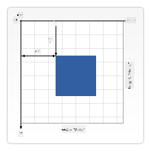

<!--
CO_OP_TRANSLATOR_METADATA:
{
  "original_hash": "056641280211e52fd0adb81b6058ec55",
  "translation_date": "2025-08-29T14:11:57+00:00",
  "source_file": "6-space-game/2-drawing-to-canvas/README.md",
  "language_code": "de"
}
-->
# Baue ein Weltraumspiel Teil 2: Zeichne Held und Monster auf die Leinwand

## Quiz vor der Vorlesung

[Quiz vor der Vorlesung](https://ff-quizzes.netlify.app/web/quiz/31)

## Die Leinwand

Die Leinwand ist ein HTML-Element, das standardmäßig keinen Inhalt hat; sie ist eine leere Fläche. Du musst sie durch Zeichnen darauf füllen.

✅ Lies [mehr über die Canvas API](https://developer.mozilla.org/docs/Web/API/Canvas_API) auf MDN.

So wird sie typischerweise als Teil des Seitenkörpers deklariert:

```html
<canvas id="myCanvas" width="200" height="100"></canvas>
```

Oben setzen wir die Attribute `id`, `width` und `height`.

- `id`: Setze dies, damit du eine Referenz erhalten kannst, wenn du mit der Leinwand interagieren möchtest.
- `width`: Dies ist die Breite des Elements.
- `height`: Dies ist die Höhe des Elements.

## Zeichnen einfacher Geometrie

Die Leinwand verwendet ein kartesisches Koordinatensystem, um Dinge zu zeichnen. Sie nutzt daher eine x-Achse und eine y-Achse, um auszudrücken, wo sich etwas befindet. Die Position `0,0` ist die obere linke Ecke, und die untere rechte Ecke entspricht der von dir festgelegten BREITE und HÖHE der Leinwand.

  
> Bild von [MDN](https://developer.mozilla.org/docs/Web/API/Canvas_API/Tutorial/Drawing_shapes)

Um auf das Leinwand-Element zu zeichnen, musst du die folgenden Schritte ausführen:

1. **Hole eine Referenz** zum Canvas-Element.
2. **Hole eine Referenz** zum Kontext-Element, das auf dem Canvas-Element sitzt.
3. **Führe eine Zeichenoperation** mit dem Kontext-Element aus.

Der Code für die oben genannten Schritte sieht normalerweise so aus:

```javascript
// draws a red rectangle
//1. get the canvas reference
canvas = document.getElementById("myCanvas");

//2. set the context to 2D to draw basic shapes
ctx = canvas.getContext("2d");

//3. fill it with the color red
ctx.fillStyle = 'red';

//4. and draw a rectangle with these parameters, setting location and size
ctx.fillRect(0,0, 200, 200) // x,y,width, height
```

✅ Die Canvas API konzentriert sich hauptsächlich auf 2D-Formen, aber du kannst auch 3D-Elemente auf einer Webseite zeichnen; dafür könntest du die [WebGL API](https://developer.mozilla.org/docs/Web/API/WebGL_API) verwenden.

Mit der Canvas API kannst du allerlei Dinge zeichnen, wie:

- **Geometrische Formen**: Wir haben bereits gezeigt, wie man ein Rechteck zeichnet, aber es gibt noch viel mehr, was du zeichnen kannst.
- **Text**: Du kannst Text mit beliebiger Schriftart und Farbe zeichnen.
- **Bilder**: Du kannst ein Bild basierend auf einer Bilddatei wie z. B. .jpg oder .png zeichnen.

✅ Probier es aus! Du weißt, wie man ein Rechteck zeichnet – kannst du einen Kreis auf die Seite zeichnen? Schau dir einige interessante Canvas-Zeichnungen auf CodePen an. Hier ist ein [besonders beeindruckendes Beispiel](https://codepen.io/dissimulate/pen/KrAwx).

## Bildressourcen laden und zeichnen

Du lädst eine Bildressource, indem du ein `Image`-Objekt erstellst und dessen `src`-Eigenschaft setzt. Dann hörst du auf das `load`-Event, um zu wissen, wann es bereit ist, verwendet zu werden. Der Code sieht so aus:

### Ressource laden

```javascript
const img = new Image();
img.src = 'path/to/my/image.png';
img.onload = () => {
  // image loaded and ready to be used
}
```

### Muster zum Laden von Ressourcen

Es wird empfohlen, das oben Genannte in eine Konstruktion wie diese einzubinden, damit es einfacher zu verwenden ist und du es nur dann manipulierst, wenn es vollständig geladen ist:

```javascript
function loadAsset(path) {
  return new Promise((resolve) => {
    const img = new Image();
    img.src = path;
    img.onload = () => {
      // image loaded and ready to be used
      resolve(img);
    }
  })
}

// use like so

async function run() {
  const heroImg = await loadAsset('hero.png')
  const monsterImg = await loadAsset('monster.png')
}

```

Um Spielressourcen auf einen Bildschirm zu zeichnen, würde dein Code so aussehen:

```javascript
async function run() {
  const heroImg = await loadAsset('hero.png')
  const monsterImg = await loadAsset('monster.png')

  canvas = document.getElementById("myCanvas");
  ctx = canvas.getContext("2d");
  ctx.drawImage(heroImg, canvas.width/2,canvas.height/2);
  ctx.drawImage(monsterImg, 0,0);
}
```

## Jetzt ist es Zeit, dein Spiel zu entwickeln

### Was du bauen sollst

Du wirst eine Webseite mit einem Canvas-Element erstellen. Es sollte einen schwarzen Bildschirm mit den Maßen `1024*768` anzeigen. Wir haben dir zwei Bilder bereitgestellt:

- Heldenschiff

   

- 5*5 Monster

   

### Empfohlene Schritte für den Entwicklungsstart

Finde die Dateien, die für dich im Unterordner `your-work` erstellt wurden. Sie sollten Folgendes enthalten:

```bash
-| assets
  -| enemyShip.png
  -| player.png
-| index.html
-| app.js
-| package.json
```

Öffne eine Kopie dieses Ordners in Visual Studio Code. Du solltest eine lokale Entwicklungsumgebung eingerichtet haben, vorzugsweise mit Visual Studio Code, NPM und Node installiert. Falls du `npm` nicht auf deinem Computer eingerichtet hast, [hier erfährst du, wie das geht](https://www.npmjs.com/get-npm).

Starte dein Projekt, indem du in den Ordner `your_work` navigierst:

```bash
cd your-work
npm start
```

Das obige startet einen HTTP-Server unter der Adresse `http://localhost:5000`. Öffne einen Browser und gib diese Adresse ein. Es ist momentan eine leere Seite, aber das wird sich ändern.

> Hinweis: Um Änderungen auf deinem Bildschirm zu sehen, aktualisiere deinen Browser.

### Code hinzufügen

Füge den benötigten Code zu `your-work/app.js` hinzu, um die folgenden Aufgaben zu lösen:

1. **Zeichne** eine Leinwand mit schwarzem Hintergrund  
   > Tipp: Füge zwei Zeilen unter dem entsprechenden TODO in `/app.js` hinzu, indem du das `ctx`-Element auf Schwarz setzt und die oberen/linken Koordinaten auf 0,0 sowie die Höhe und Breite auf die der Leinwand setzt.
2. **Lade** Texturen  
   > Tipp: Füge die Spieler- und Gegnerbilder mit `await loadTexture` hinzu und übergib den Bildpfad. Du wirst sie noch nicht auf dem Bildschirm sehen!
3. **Zeichne** den Helden in die Mitte des unteren Bildschirmbereichs  
   > Tipp: Verwende die `drawImage`-API, um heroImg auf den Bildschirm zu zeichnen, und setze `canvas.width / 2 - 45` und `canvas.height - canvas.height / 4)`.
4. **Zeichne** 5*5 Monster  
   > Tipp: Jetzt kannst du den Code zum Zeichnen der Gegner auf dem Bildschirm auskommentieren. Gehe anschließend zur Funktion `createEnemies` und baue sie aus.

   Zuerst, setze einige Konstanten:

    ```javascript
    const MONSTER_TOTAL = 5;
    const MONSTER_WIDTH = MONSTER_TOTAL * 98;
    const START_X = (canvas.width - MONSTER_WIDTH) / 2;
    const STOP_X = START_X + MONSTER_WIDTH;
    ```

    Dann erstelle eine Schleife, um das Array der Monster auf den Bildschirm zu zeichnen:

    ```javascript
    for (let x = START_X; x < STOP_X; x += 98) {
        for (let y = 0; y < 50 * 5; y += 50) {
          ctx.drawImage(enemyImg, x, y);
        }
      }
    ```

## Ergebnis

Das fertige Ergebnis sollte so aussehen:


## Lösung

Versuche zuerst, es selbst zu lösen, aber wenn du nicht weiterkommst, sieh dir eine [Lösung](../../../../6-space-game/2-drawing-to-canvas/solution/app.js) an.

---

## 🚀 Herausforderung

Du hast gelernt, mit der 2D-fokussierten Canvas API zu zeichnen; sieh dir die [WebGL API](https://developer.mozilla.org/docs/Web/API/WebGL_API) an und versuche, ein 3D-Objekt zu zeichnen.

## Quiz nach der Vorlesung

[Quiz nach der Vorlesung](https://ff-quizzes.netlify.app/web/quiz/32)

## Wiederholung & Selbststudium

Lerne mehr über die Canvas API, indem du [darüber liest](https://developer.mozilla.org/docs/Web/API/Canvas_API).

## Aufgabe

[Experimentiere mit der Canvas API](assignment.md)

---

**Haftungsausschluss**:  
Dieses Dokument wurde mit dem KI-Übersetzungsdienst [Co-op Translator](https://github.com/Azure/co-op-translator) übersetzt. Obwohl wir uns um Genauigkeit bemühen, weisen wir darauf hin, dass automatisierte Übersetzungen Fehler oder Ungenauigkeiten enthalten können. Das Originaldokument in seiner ursprünglichen Sprache sollte als maßgebliche Quelle betrachtet werden. Für kritische Informationen wird eine professionelle menschliche Übersetzung empfohlen. Wir übernehmen keine Haftung für Missverständnisse oder Fehlinterpretationen, die sich aus der Nutzung dieser Übersetzung ergeben.