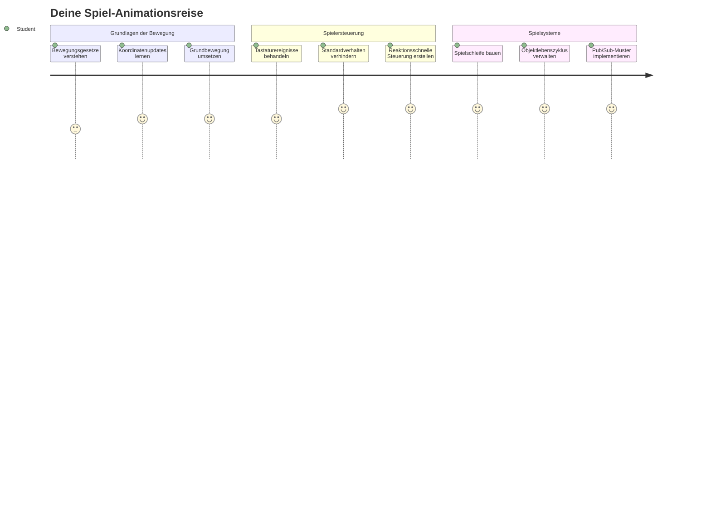
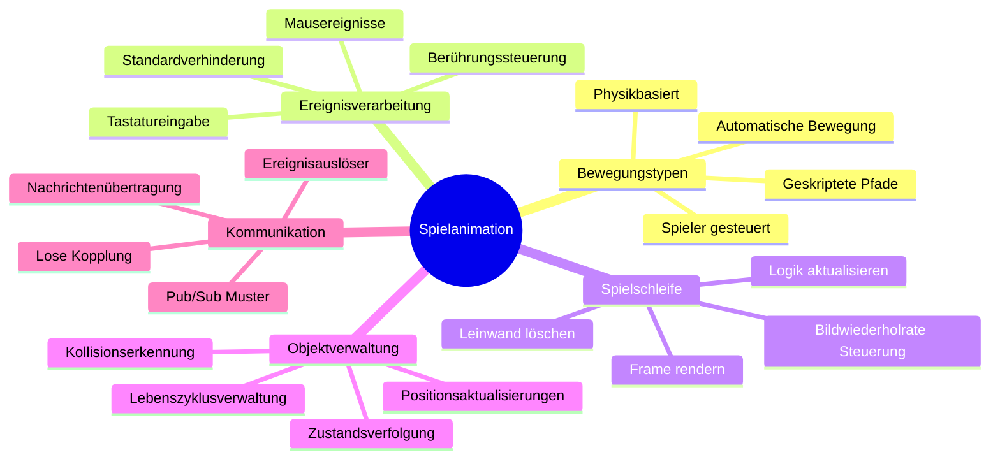
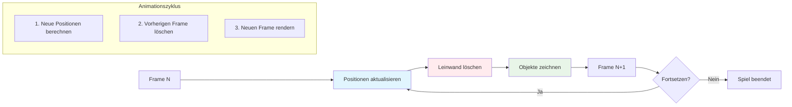
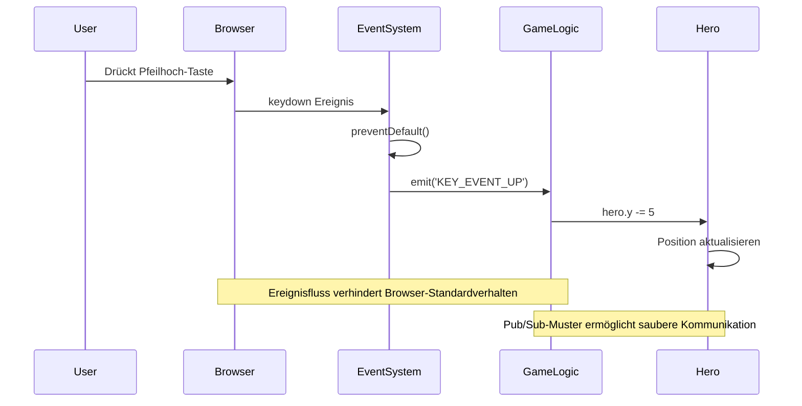
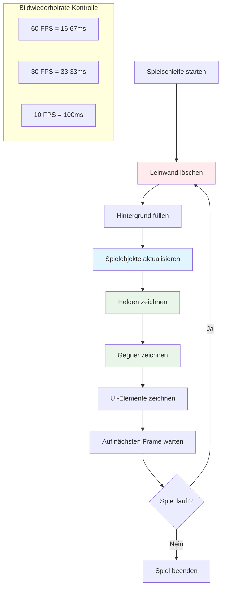
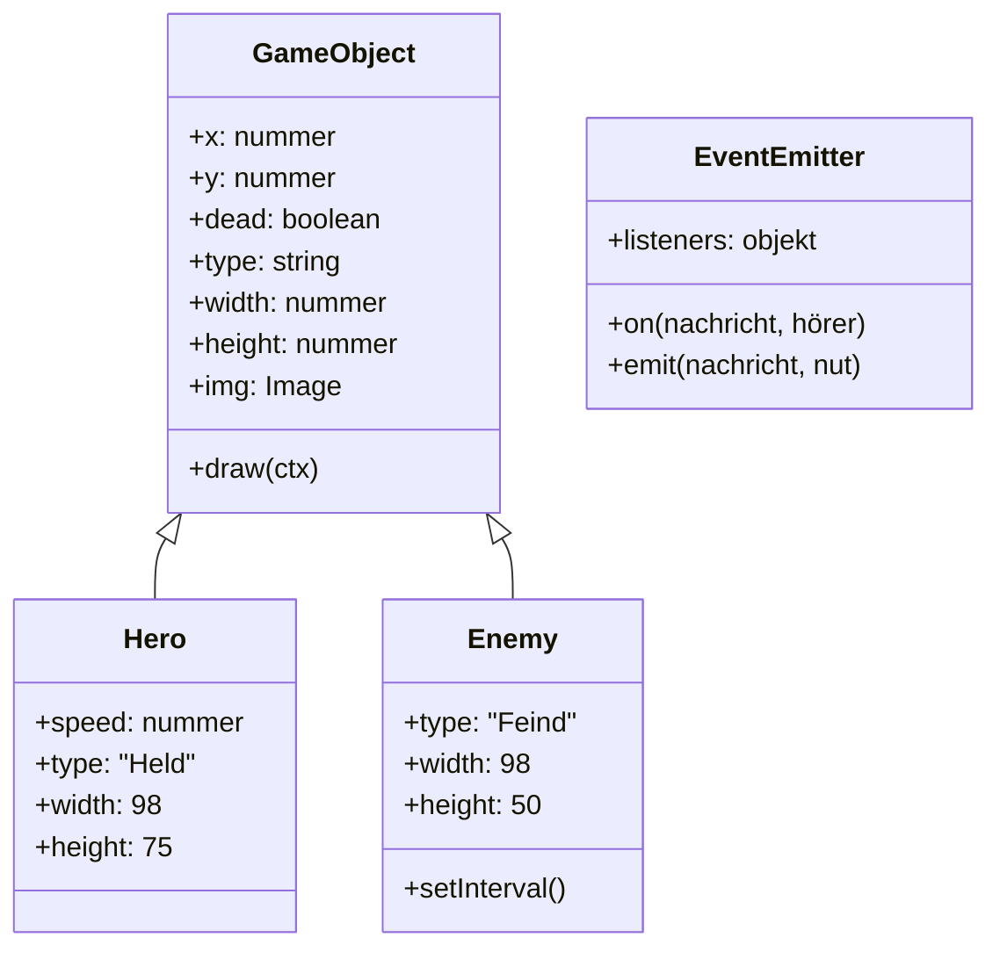
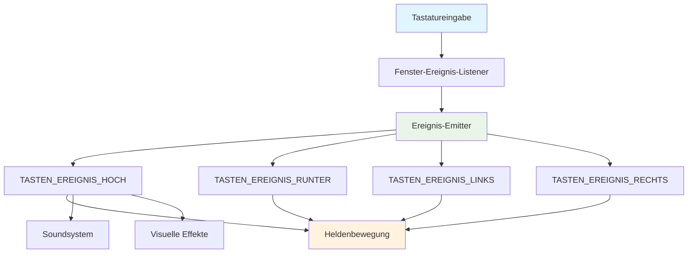
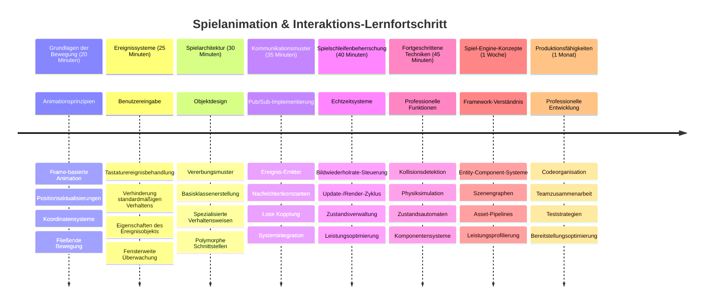

<!--
CO_OP_TRANSLATOR_METADATA:
{
  "original_hash": "8c55a2bd4bc0ebe4c88198fd563a9e09",
  "translation_date": "2026-01-06T08:48:59+00:00",
  "source_file": "6-space-game/3-moving-elements-around/README.md",
  "language_code": "de"
}
-->
# Baue ein Weltraumspiel Teil 3: Bewegung hinzufügen


Denke an deine Lieblingsspiele – was sie fesselnd macht, sind nicht nur hübsche Grafiken, sondern die Art, wie sich alles bewegt und auf deine Aktionen reagiert. Im Moment ist dein Weltraumspiel wie ein schönes Gemälde, aber wir werden Bewegung hinzufügen, die es zum Leben erweckt.

Als die Ingenieure der NASA den Steuerungscomputer für die Apollo-Missionen programmierten, standen sie vor einer ähnlichen Herausforderung: Wie bringt man ein Raumschiff dazu, auf Piloteneingaben zu reagieren und gleichzeitig automatisch Kurskorrekturen vorzunehmen? Die Prinzipien, die wir heute lernen, spiegeln genau diese Konzepte wider – die Steuerung der Bewegung durch den Spieler neben automatischen Systemverhalten.

In dieser Lektion lernst du, wie man Raumschiffe über den Bildschirm gleiten lässt, auf Spielerbefehle reagiert und fließende Bewegungsmuster erzeugt. Wir zerlegen alles in überschaubare Konzepte, die natürlich aufeinander aufbauen.

Am Ende können Spieler ihr Heldenschiff über den Bildschirm fliegen lassen, während feindliche Schiffe Patrouille fliegen. Noch wichtiger ist, dass du die Kernprinzipien verstehst, die Bewegungsmechanismen in Spielen antreiben.


## Vor der Vorlesung Quiz

[Vorlesungsquiz](https://ff-quizzes.netlify.app/web/quiz/33)

## Verständnis von Spielbewegung

Spiele erwachen zum Leben, wenn sich Dinge zu bewegen beginnen, und grundsätzlich gibt es zwei Arten, wie dies geschieht:

- **Spielergesteuerte Bewegung**: Wenn du eine Taste drückst oder mit der Maus klickst, bewegt sich etwas. Das ist die direkte Verbindung zwischen dir und deiner Spielwelt.
- **Automatische Bewegung**: Wenn das Spiel selbst entscheidet, Dinge zu bewegen – wie diese Feindschiffe, die den Bildschirm patrouillieren müssen, egal ob du etwas machst oder nicht.

Objekte auf einem Computerbildschirm zu bewegen ist einfacher, als du vielleicht denkst. Erinnere dich an die x- und y-Koordinaten aus dem Matheunterricht? Genau damit arbeiten wir. Als Galileo 1610 die Monde des Jupiter verfolgte, tat er im Wesentlichen dasselbe – Positionen über Zeit aufzeichnen, um Bewegungsmuster zu verstehen.

Dinge auf dem Bildschirm zu bewegen ist wie eine Daumenkino-Animation zu erstellen – du musst diese drei einfachen Schritte befolgen:


1. **Position aktualisieren** – Ändere, wo sich dein Objekt befinden soll (vielleicht 5 Pixel nach rechts bewegen)
2. **Alten Frame löschen** – Bildschirm löschen, damit du keine geisterhaften Spuren überall siehst
3. **Neuen Frame zeichnen** – Setze dein Objekt an die neue Stelle

Mach das schnell genug, und zack! Du hast flüssige Bewegung, die sich für Spieler natürlich anfühlt.

So könnte das im Code aussehen:

```javascript
// Setze den Standort des Helden
hero.x += 5;
// Lösche das Rechteck, das den Helden enthält
ctx.clearRect(0, 0, canvas.width, canvas.height);
// Zeichne den Spielfehintergrund und den Helden neu
ctx.fillRect(0, 0, canvas.width, canvas.height);
ctx.fillStyle = "black";
ctx.drawImage(heroImg, hero.x, hero.y);
```

**Das macht dieser Code:**
- **Aktualisiert** die x-Koordinate des Helden um 5 Pixel, um ihn horizontal zu bewegen
- **Löscht** den gesamten Canvas-Bereich, um den vorherigen Frame zu entfernen
- **Füllt** den Canvas mit schwarzem Hintergrund
- **Zeichnet** das Heldenbild an der neuen Position neu

✅ Kannst du dir einen Grund vorstellen, warum das mehrfache Neuzeichnen deines Helden viele Frames pro Sekunde Performancekosten verursachen könnte? Lies über [Alternativen zu diesem Muster](https://developer.mozilla.org/en-US/docs/Web/API/Canvas_API/Tutorial/Optimizing_canvas).

## Ereignisse von Tastatur behandeln

Hier verbinden wir die Eingabe des Spielers mit der Spielaktion. Wenn jemand die Leertaste drückt, um einen Laser abzufeuern, oder eine Pfeiltaste tippt, um einem Asteroiden auszuweichen, muss dein Spiel diese Eingabe erkennen und darauf reagieren.

Tastaturereignisse passieren auf Fensterebene, was bedeutet, dass dein gesamtes Browserfenster auf diese Tastendrücke hört. Mausklicks dagegen können an bestimmte Elemente gebunden sein (wie das Klicken auf einen Button). Für unser Weltraumspiel konzentrieren wir uns auf Tastatursteuerung, da dies den Spielern das klassische Arcade-Gefühl gibt.

Das erinnert mich daran, wie Telegrafisten im 19. Jahrhundert Morsecode in bedeutungsvolle Nachrichten umwandeln mussten – wir machen etwas Ähnliches, indem wir Tastendrücke in Spielbefehle übersetzen.

Um ein Ereignis zu behandeln, musst du die `addEventListener()` Methode des Fensters verwenden und ihr zwei Eingabeparameter geben. Der erste Parameter ist der Name des Ereignisses, zum Beispiel `keyup`. Der zweite Parameter ist die Funktion, die aufgerufen wird, wenn das Ereignis eintritt.

Hier ein Beispiel:

```javascript
window.addEventListener('keyup', (evt) => {
  // evt.key = Zeichenkettenrepräsentation der Taste
  if (evt.key === 'ArrowUp') {
    // mache etwas
  }
});
```

**Was hier passiert:**
- **Hört** auf Tastaturereignisse im gesamten Fenster
- **Erfasst** das Ereignisobjekt, das Informationen darüber enthält, welche Taste gedrückt wurde
- **Überprüft**, ob die gedrückte Taste einer bestimmten Taste entspricht (in diesem Fall die Pfeiltaste nach oben)
- **Führt** Code aus, wenn die Bedingung erfüllt ist

Für Tastenereignisse gibt es zwei Eigenschaften des Ereignisses, mit denen du sehen kannst, welche Taste gedrückt wurde:

- `key` - eine stringbasierte Darstellung der gedrückten Taste, zum Beispiel `'ArrowUp'`
- `keyCode` - eine numerische Darstellung, zum Beispiel `37`, entspricht `ArrowLeft`

✅ Das Manipulieren von Tastatureingaben ist auch jenseits der Spieleentwicklung nützlich. An welche anderen Anwendungen kannst du für diese Technik denken?


### Spezielle Tasten: eine Warnung!

Einige Tasten haben eingebaute Browser-Verhalten, die dein Spiel stören können. Pfeiltasten scrollen die Seite und die Leertaste springt nach unten – Verhalten, das du nicht willst, wenn jemand sein Raumschiff steuert.

Wir können diese Standardverhalten verhindern und unser Spiel die Eingabe stattdessen handhaben lassen. Das ist ähnlich wie frühe Programmierer Systemunterbrechungen überschreiben mussten, um benutzerdefinierte Verhaltensweisen zu schaffen – wir tun das hier auf Browser-Ebene. So geht's:

```javascript
const onKeyDown = function (e) {
  console.log(e.keyCode);
  switch (e.keyCode) {
    case 37:
    case 39:
    case 38:
    case 40: // Pfeiltasten
    case 32:
      e.preventDefault();
      break; // Leertaste
    default:
      break; // andere Tasten nicht blockieren
  }
};

window.addEventListener('keydown', onKeyDown);
```

**Das bewirkt dieser Präventionscode:**
- **Überprüft** auf bestimmte Tastencodes, die unerwünschtes Browserverhalten auslösen könnten
- **Verhindert** die Standardaktion des Browsers für Pfeiltasten und Leertaste
- **Erlaubt** anderen Tasten normales Funktionieren
- **Nutzt** `e.preventDefault()`, um das eingebaute Verhalten des Browsers zu stoppen

### 🔄 **Pädagogischer Check-in**
**Verständnis der Ereignisbehandlung**: Bevor wir zur automatischen Bewegung übergehen, stelle sicher, dass du
- ✅ den Unterschied zwischen `keydown` und `keyup` Ereignissen erklären kannst
- ✅ verstehst, warum wir Standardverhalten des Browsers verhindern
- ✅ beschreiben kannst, wie Event-Listener Nutzereingaben mit Spiel-Logik verbinden
- ✅ erkennen kannst, welche Tasten mit den Spielkontrollen kollidieren könnten

**Schnell-Selbsttest**: Was würde passieren, wenn du das Standardverhalten für Pfeiltasten nicht verhinderst?
*Antwort: Der Browser würde die Seite scrollen und die Spielbewegung stören*

**Architektur des Event-Systems**: Du verstehst jetzt:
- **Fensterweitergehendes Hören**: Ereignisse auf Browser-Ebene abfangen
- **Eigenschaften des Ereignisobjekts**: `key` Strings vs. `keyCode` Zahlen
- **Standardverhinderung**: Unerwünschtes Browserverhalten stoppen
- **Bedingte Logik**: Auf bestimmte Tastenkombinationen reagieren

## Spielinduzierte Bewegung

Sprechen wir jetzt über Objekte, die sich ohne Spieler-Eingabe bewegen. Denk an Feindschiffe, die über den Bildschirm gleiten, Kugeln, die in geraden Linien fliegen, oder Wolken, die im Hintergrund treiben. Diese autonome Bewegung lässt deine Spielwelt lebendig wirken, selbst wenn niemand die Steuerung benutzt.

Wir verwenden die eingebauten Timer von JavaScript, um Positionen in regelmäßigen Abständen zu aktualisieren. Dieses Konzept ähnelt Pendeluhren – ein regelmäßiger Mechanismus, der konsistente, zeitgesteuerte Aktionen auslöst. So einfach kann es sein:

```javascript
const id = setInterval(() => {
  // Bewege den Feind auf der y-Achse
  enemy.y += 10;
}, 100);
```

**Das macht dieser Bewegungs-Code:**
- **Erstellt** einen Timer, der alle 100 Millisekunden läuft
- **Aktualisiert** die y-Koordinate des Feindes jedes Mal um 10 Pixel
- **Speichert** die Intervall-ID, damit wir ihn später stoppen können
- **Bewegt** den Feind automatisch nach unten auf dem Bildschirm

## Die Spielschleife

Hier ist das Konzept, das alles zusammenhält – die Spielschleife. Wenn dein Spiel ein Film wäre, wäre die Spielschleife der Filmprojektor, der Frame um Frame so schnell zeigt, dass alles flüssig erscheint.

Jedes Spiel hat so eine Schleife, die im Hintergrund läuft. Es ist eine Funktion, die alle Spielobjekte aktualisiert, den Bildschirm neu zeichnet und diesen Prozess kontinuierlich wiederholt. So wird dein Held, alle Feinde, alle Laserstrahlen – der gesamte Spielzustand – verwaltet.

Dieses Konzept erinnert mich daran, wie frühe Filmzeichner wie Walt Disney Figuren Frame für Frame neu zeichnen mussten, um Bewegung vorzutäuschen. Wir tun das Gleiche, nur mit Code statt Bleistiften.

So könnte eine Spielschleife typischerweise aussehen, ausgedrückt im Code:


```javascript
const gameLoopId = setInterval(() => {
  function gameLoop() {
    ctx.clearRect(0, 0, canvas.width, canvas.height);
    ctx.fillStyle = "black";
    ctx.fillRect(0, 0, canvas.width, canvas.height);
    drawHero();
    drawEnemies();
    drawStaticObjects();
  }
  gameLoop();
}, 200);
```

**Verständnis der Spielschleifenstruktur:**
- **Löscht** den gesamten Canvas, um den vorherigen Frame zu entfernen
- **Füllt** den Hintergrund mit einer einfarbigen Farbe
- **Zeichnet** alle Spielobjekte an ihren aktuellen Positionen
- **Wiederholt** diesen Vorgang alle 200 Millisekunden, um fließende Animation zu erzeugen
- **Verwaltet** die Bildwiederholrate durch Steuerung der Intervallzeit

## Fortsetzung des Weltraumspiels

Jetzt fügen wir Bewegung zur statischen Szene hinzu, die du zuvor gebaut hast. Wir verwandeln sie von einem Screenshot in ein interaktives Erlebnis. Wir arbeiten Schritt für Schritt, damit jedes Teil auf dem vorherigen aufbaut.

Hole dir den Code aus der vorherigen Lektion (oder starte mit dem Code im Ordner [Teil II-Starter](../../../../6-space-game/3-moving-elements-around/your-work), wenn du ganz neu anfangen möchtest).

**Das bauen wir heute:**
- **Heldensteuerung**: Mit den Pfeiltasten steuerst du dein Raumschiff über den Bildschirm
- **Feindbewegung**: Die außerirdischen Schiffe beginnen ihren Vormarsch

Lasst uns mit der Umsetzung dieser Features beginnen.

## Empfohlene Schritte

Finde die Dateien, die dir im Unterordner `your-work` bereitgestellt wurden. Er sollte das Folgende enthalten:

```bash
-| assets
  -| enemyShip.png
  -| player.png
-| index.html
-| app.js
-| package.json
```

Starte dein Projekt im Ordner `your-work` mit diesem Befehl:

```bash
cd your-work
npm start
```

**Das bewirkt dieser Befehl:**
- **Navigiert** in dein Projektverzeichnis
- **Startet** einen HTTP-Server unter der Adresse `http://localhost:5000`
- **Serviert** deine Spieldateien, damit du sie im Browser testen kannst

Der obige Befehl startet einen HTTP-Server unter der Adresse `http://localhost:5000`. Öffne einen Browser und gib diese Adresse ein, im Moment sollte der Held und alle Feinde gezeigt werden; noch bewegt sich nichts!

### Code hinzufügen

1. **Füge dedizierte Objekte** für `hero`, `enemy` und `game object` hinzu, sie sollten `x`- und `y`-Eigenschaften besitzen. (Erinnere dich an den Abschnitt über [Vererbung oder Komposition](../README.md)).

   *TIPP* `game object` sollte das Objekt mit `x` und `y` sein und der Fähigkeit, sich selbst auf eine Leinwand zu zeichnen.

   > **Tipp**: Beginne damit, eine neue Klasse `GameObject` mit ihrem Konstruktor wie unten beschrieben hinzuzufügen und zeichne sie dann auf den Canvas:

    ```javascript
    class GameObject {
      constructor(x, y) {
        this.x = x;
        this.y = y;
        this.dead = false;
        this.type = "";
        this.width = 0;
        this.height = 0;
        this.img = undefined;
      }
    
      draw(ctx) {
        ctx.drawImage(this.img, this.x, this.y, this.width, this.height);
      }
    }
    ```

    **Das macht diese Basisklasse:**
    - **Definiert** gemeinsame Eigenschaften, die alle Spielobjekte teilen (Position, Größe, Bild)
    - **Enthält** eine `dead`-Flag, die verfolgt, ob das Objekt entfernt werden soll
    - **Bietet** eine `draw()` Methode, die das Objekt auf dem Canvas darstellt
    - **Setzt** Standardwerte für alle Eigenschaften, die von Kindklassen überschrieben werden können


    Erweitere jetzt diese `GameObject` Klasse, um `Hero` und `Enemy` zu erstellen:
    
    ```javascript
    class Hero extends GameObject {
      constructor(x, y) {
        super(x, y);
        this.width = 98;
        this.height = 75;
        this.type = "Hero";
        this.speed = 5;
      }
    }
    ```

    ```javascript
    class Enemy extends GameObject {
      constructor(x, y) {
        super(x, y);
        this.width = 98;
        this.height = 50;
        this.type = "Enemy";
        const id = setInterval(() => {
          if (this.y < canvas.height - this.height) {
            this.y += 5;
          } else {
            console.log('Stopped at', this.y);
            clearInterval(id);
          }
        }, 300);
      }
    }
    ```

    **Wichtige Konzepte in diesen Klassen:**
    - **Erbt** von `GameObject` durch das Schlüsselwort `extends`
    - **Ruft** den Eltern-Konstruktor mit `super(x, y)` auf
    - **Setzt** spezifische Abmessungen und Eigenschaften für jeden Objekttyp
    - **Implementiert** automatische Bewegung für Feinde unter Nutzung von `setInterval()`

2. **Füge Tastaturereignis-Handler hinzu**, die die Navigation über die Tasten steuern (Helden nach oben/unten/links/rechts bewegen)

   *DENKE DARAN* es ist ein kartesisches System, oben-links ist `0,0`. Füge auch den Code hinzu, der das *Standardverhalten stoppt.*

   > **Tipp**: Erstelle deine `onKeyDown` Funktion und hänge sie ans Fenster:

   ```javascript
   const onKeyDown = function (e) {
     console.log(e.keyCode);
     // Fügen Sie den Code aus der obigen Lektion hinzu, um das Standardverhalten zu stoppen
     switch (e.keyCode) {
       case 37:
       case 39:
       case 38:
       case 40: // Pfeiltasten
       case 32:
         e.preventDefault();
         break; // Leertaste
       default:
         break; // blockieren Sie keine anderen Tasten
     }
   };

   window.addEventListener("keydown", onKeyDown);
   ```
    
   **Das macht dieser Ereignis-Handler:**
   - **Hört** auf `keydown` Ereignisse im gesamten Fenster
   - **Protokolliert** die Tastencodes zur Unterstützung beim Debuggen
   - **Verhindert** das Standardverhalten des Browsers für Pfeiltasten und Leertaste
   - **Erlaubt** anderen Tasten die normale Funktion
   
   Schaue dir jetzt die Browser-Konsole an, um zu sehen, wie die Tastendrücke protokolliert werden.

3. **Implementiere** das [Pub-Sub-Pattern](../README.md), das deinen Code sauber hält, während du den weiteren Teilen folgst.

   Das Publish-Subscribe-Muster hilft, deinen Code zu organisieren, indem es Ereigniserkennung von Ereignisbehandlung trennt. So wird dein Code modularer und leichter wartbar.

   Für diesen letzten Schritt kannst du:

   1. **Einen Event Listener** am Fenster hinzufügen:

       ```javascript
       window.addEventListener("keyup", (evt) => {
         if (evt.key === "ArrowUp") {
           eventEmitter.emit(Messages.KEY_EVENT_UP);
         } else if (evt.key === "ArrowDown") {
           eventEmitter.emit(Messages.KEY_EVENT_DOWN);
         } else if (evt.key === "ArrowLeft") {
           eventEmitter.emit(Messages.KEY_EVENT_LEFT);
         } else if (evt.key === "ArrowRight") {
           eventEmitter.emit(Messages.KEY_EVENT_RIGHT);
         }
       });
       ```

   **Das macht dieses Event-System:**
   - **Erfasst** Tastatureingaben und wandelt sie in benutzerdefinierte Spielereignisse um
   - **Trennt** die Eingabeerkennung von der Spiellogik
   - **Ermöglicht** es, Steuerungen später leicht zu ändern, ohne den Spielcode zu beeinflussen
   - **Erlaubt** mehreren Systemen, auf dieselbe Eingabe zu reagieren


   2. **Erstelle eine EventEmitter-Klasse**, um Nachrichten zu veröffentlichen und zu abonnieren:

       ```javascript
       class EventEmitter {
         constructor() {
           this.listeners = {};
         }
       
         on(message, listener) {
           if (!this.listeners[message]) {
             this.listeners[message] = [];
           }
           this.listeners[message].push(listener);
         }
       
   3. **Füge Konstanten hinzu** und richte den EventEmitter ein:

       ```javascript
       const Messages = {
         KEY_EVENT_UP: "KEY_EVENT_UP",
         KEY_EVENT_DOWN: "KEY_EVENT_DOWN",
         KEY_EVENT_LEFT: "KEY_EVENT_LEFT",
         KEY_EVENT_RIGHT: "KEY_EVENT_RIGHT",
       };
       
       let heroImg, 
           enemyImg, 
           laserImg,
           canvas, ctx, 
           gameObjects = [], 
           hero, 
           eventEmitter = new EventEmitter();
       ```

   **Das steckt hinter der Einrichtung:**
   - **Definiert** Nachrichtenkonstanten, um Tippfehler zu vermeiden und Refaktorisieren zu erleichtern
   - **Deklariert** Variablen für Bilder, Canvas-Kontext und Spielstatus
   - **Erstellt** einen globalen Event-Emitter für das Pub-Sub-System
   - **Initialisiert** ein Array, um alle Spielobjekte zu speichern

   4. **Initialisiere das Spiel**

       ```javascript
       function initGame() {
         gameObjects = [];
         createEnemies();
         createHero();
       
         eventEmitter.on(Messages.KEY_EVENT_UP, () => {
           hero.y -= 5;
         });
       
         eventEmitter.on(Messages.KEY_EVENT_DOWN, () => {
           hero.y += 5;
         });
       
         eventEmitter.on(Messages.KEY_EVENT_LEFT, () => {
           hero.x -= 5;
         });
       
4. **Richte die Spielschleife ein**

   Refaktoriere die Funktion `window.onload`, um das Spiel zu initialisieren und eine Spielschleife in sinnvollem Intervall einzurichten. Du fügst auch einen Laserstrahl hinzu:

    ```javascript
    window.onload = async () => {
      canvas = document.getElementById("canvas");
      ctx = canvas.getContext("2d");
      heroImg = await loadTexture("assets/player.png");
      enemyImg = await loadTexture("assets/enemyShip.png");
      laserImg = await loadTexture("assets/laserRed.png");
    
      initGame();
      const gameLoopId = setInterval(() => {
        ctx.clearRect(0, 0, canvas.width, canvas.height);
        ctx.fillStyle = "black";
        ctx.fillRect(0, 0, canvas.width, canvas.height);
        drawGameObjects(ctx);
      }, 100);
    };
    ```

   **Verständnis der Spielinitialisierung:**
   - **Wartet** darauf, dass die Seite vollständig geladen ist, bevor sie startet
   - **Erfasst** das Canvas-Element und dessen 2D-Zeichnungskontext
   - **Lädt** alle Bildressourcen asynchron mit `await`
   - **Startet** die Spielschleife, die alle 100 ms läuft (10 FPS)
   - **Löscht** und zeichnet jeden Frame den gesamten Bildschirm neu

5. **Füge Code hinzu**, um die Gegner in festgelegten Intervallen zu bewegen

    Refaktoriere die Funktion `createEnemies()`, um die Gegner zu erstellen und sie in das neue gameObjects-Array einzufügen:

    ```javascript
    function createEnemies() {
      const MONSTER_TOTAL = 5;
      const MONSTER_WIDTH = MONSTER_TOTAL * 98;
      const START_X = (canvas.width - MONSTER_WIDTH) / 2;
      const STOP_X = START_X + MONSTER_WIDTH;
    
      for (let x = START_X; x < STOP_X; x += 98) {
        for (let y = 0; y < 50 * 5; y += 50) {
          const enemy = new Enemy(x, y);
          enemy.img = enemyImg;
          gameObjects.push(enemy);
        }
      }
    }
    ```

    **Was die Gegnererstellung macht:**
    - **Berechnet** Positionen, um Gegner mittig auf dem Bildschirm anzuordnen
    - **Erstellt** ein Raster von Gegnern mit verschachtelten Schleifen
    - **Weist** jedem Gegnerobjekt das Gegnerbild zu
    - **Fügt** jeden Gegner dem globalen Spielobjekte-Array hinzu
    
    und füge eine Funktion `createHero()` hinzu, die einen ähnlichen Prozess für den Helden durchführt.
    
    ```javascript
    function createHero() {
      hero = new Hero(
        canvas.width / 2 - 45,
        canvas.height - canvas.height / 4
      );
      hero.img = heroImg;
      gameObjects.push(hero);
    }
    ```

    **Was die Heldenerstellung macht:**
    - **Positioniert** den Helden unten in der Bildschirmmitte
    - **Weist** dem Heldenobjekt das Heldenbild zu
    - **Fügt** den Helden dem Spielobjekte-Array für die Darstellung hinzu

    und letztlich füge eine Funktion `drawGameObjects()` hinzu, die mit dem Zeichnen beginnt:

    ```javascript
    function drawGameObjects(ctx) {
      gameObjects.forEach(go => go.draw(ctx));
    }
    ```

    **Verständnis der Zeichenfunktion:**
    - **Durchläuft** alle Spielobjekte im Array
    - **Ruft** die `draw()`-Methode für jedes Objekt auf
    - **Übergibt** den Canvas-Kontext, damit die Objekte sich selbst zeichnen können

    ### 🔄 **Pädagogische Zwischenkontrolle**
    **Vollständiges Verständnis des Spiels**: Überprüfe dein Verständnis der gesamten Architektur:
    - ✅ Wie ermöglicht Vererbung, dass Held und Gegner gemeinsame Eigenschaften von GameObject teilen?
    - ✅ Warum macht das Pub/Sub-Muster deinen Code wartbarer?
    - ✅ Welche Rolle spielt die Spielschleife bei der Erzeugung flüssiger Animationen?
    - ✅ Wie verbinden Event Listener die Benutzereingabe mit dem Verhalten von Spielobjekten?

    **Systemintegration**: Dein Spiel demonstriert nun:
    - **Objektorientiertes Design**: Basisklassen mit spezialisierter Vererbung
    - **Ereignisgesteuerte Architektur**: Pub/Sub-Muster für lose Kopplung
    - **Animations-Framework**: Spielschleife mit konsistenten Frame-Updates
    - **Eingabeverarbeitung**: Tastaturevents mit Standardverhinderung
    - **Ressourcenmanagement**: Bildladen und Sprite-Darstellung

    **Professionelle Muster**: Du hast implementiert:
    - **Trennung der Verantwortlichkeiten**: Eingabe, Logik und Darstellung getrennt
    - **Polymorphie**: Alle Spielobjekte teilen gemeinsame Zeichen-Schnittstelle
    - **Nachrichtenweitergabe**: Saubere Kommunikation zwischen Komponenten
    - **Ressourcenmanagement**: Effiziente Handhabung von Sprites und Animationen

    Deine Gegner sollten jetzt anfangen, auf dein Heldenraumschiff zuzumarschieren!
      }
    }
    ```
    
    and add a `createHero()` function to do a similar process for the hero.
    
    ```javascript
    function createHero() {
      hero = new Hero(
        canvas.width / 2 - 45,
        canvas.height - canvas.height / 4
      );
      hero.img = heroImg;
      gameObjects.push(hero);
    }
    ```

    und letztlich füge eine Funktion `drawGameObjects()` hinzu, die mit dem Zeichnen beginnt:

    ```javascript
    function drawGameObjects(ctx) {
      gameObjects.forEach(go => go.draw(ctx));
    }
    ```

    Deine Gegner sollten jetzt anfangen, auf dein Heldenraumschiff zuzumarschieren!

---

## GitHub Copilot Agent Challenge 🚀

Hier ist eine Herausforderung, die deinen Spiel-Feinschliff verbessern wird: Grenzen und flüssige Steuerung hinzufügen. Aktuell kann dein Held vom Bildschirm fliegen, und die Bewegung wirkt ruckartig.

**Deine Mission:** Lass dein Raumschiff realistischer wirken, indem du Bildschirmgrenzen und flüssige Bewegung implementierst. Ähnlich wie die Flugsysteme der NASA verhindern, dass Raumfahrzeuge ihre sicheren Betriebsparameter überschreiten.

**Das sollst du bauen:** Erstelle ein System, das dein Heldenraumschiff auf dem Bildschirm hält, und lasse die Steuerung flüssiger wirken. Wenn Spieler eine Pfeiltaste gedrückt halten, sollte das Schiff kontinuierlich gleiten, anstatt in einzelnen Schritten zu springen. Erwäge eine visuelle Rückmeldung, wenn das Schiff den Bildschirmrand erreicht – vielleicht ein subtiler Effekt, der die Spielfeldgrenze anzeigt.

Mehr zum [Agent-Modus](https://code.visualstudio.com/blogs/2025/02/24/introducing-copilot-agent-mode) erfährst du hier.

## 🚀 Herausforderung

Code-Organisation wird mit wachsendem Projektumfang immer wichtiger. Vielleicht hast du bemerkt, dass deine Datei voll mit vermischten Funktionen, Variablen und Klassen ist. Das erinnert mich daran, wie die Ingenieure der Apollo-Mission den Code klar und wartbar strukturieren mussten, damit mehrere Teams gleichzeitig daran arbeiten können.

**Deine Mission:**
Denke wie ein Software-Architekt. Wie würdest du deinen Code organisieren, damit du (oder ein Kollege) ihn in sechs Monaten immer noch verstehst? Auch wenn jetzt alles in einer Datei bleibt, kannst du bessere Struktur schaffen:

- **Fasse verwandte Funktionen** zusammen mit klaren Kommentarüberschriften
- **Trenne Zuständigkeiten** – halte Spiel-Logik getrennt von Darstellung
- **Nutze konsistente Benennung** für Variablen und Funktionen
- **Erstelle Module** oder Namespaces, um verschiedene Spielbereiche zu ordnen
- **Füge Dokumentation** hinzu, die den Zweck jeder größeren Sektion erklärt

**Reflexionsfragen:**
- Welche Teile deines Codes sind am schwierigsten zu verstehen, wenn du zurückkommst?
- Wie könntest du deinen Code organisieren, damit es für andere leichter ist, beizutragen?
- Was würde passieren, wenn du neue Features wie Power-Ups oder verschiedene Gegnerarten hinzufügen wolltest?

## Nachvorlesungs-Quiz

[Nachvorlesungs-Quiz](https://ff-quizzes.netlify.app/web/quiz/34)

## Review & Selbststudium

Wir haben alles von Grund auf neu gebaut, was fantastisch zum Lernen ist, aber hier ein kleines Geheimnis – es gibt tolle JavaScript-Frameworks, die viel Arbeit für dich übernehmen. Sobald du dich mit den Grundlagen sicher fühlst, lohnt es sich, [zu erkunden, was es gibt](https://github.com/collections/javascript-game-engines).

Denk an Frameworks wie einen gut bestückten Werkzeugkasten, anstatt jedes Werkzeug von Hand zu fertigen. Sie lösen viele Herausforderungen der Code-Organisation, über die wir gesprochen haben, und bieten Features, die Wochen Bauzeit ersparen.

**Wert, erforscht zu werden:**
- Wie Spiel-Engines ihren Code organisieren – du wirst erstaunt sein, wie clever ihre Muster sind
- Performance-Tricks, um Canvas-Spiele butterweich laufen zu lassen  
- Moderne JavaScript-Features für saubereren und wartbareren Code
- Verschiedene Ansätze zur Verwaltung von Spielobjekten und deren Beziehungen

## 🎯 Deine Timeline zur Meisterschaft in Spielanimation


### 🛠️ Zusammenfassung deines Game-Entwicklungstoolkits

Nach dieser Lektion hast du jetzt gemeistert:
- **Animationsprinzipien**: Frame-basierte Bewegungen und sanfte Übergänge
- **Ereignisgesteuerte Programmierung**: Tastatureingabe mit korrekter Event-Verwaltung
- **Objektorientiertes Design**: Vererbungshierarchien und polymorphe Schnittstellen
- **Kommunikationsmuster**: Pub/Sub-Architektur für wartbaren Code
- **Spielschleifen-Architektur**: Echtzeit-Update- und Rendering-Zyklen
- **Eingabesysteme**: Benutzersteuerung mit Verhinderung von Standardverhalten
- **Ressourcenverwaltung**: Laden von Sprites und effiziente Rendering-Techniken

### ⚡ **Was du in den nächsten 5 Minuten tun kannst**
- [ ] Öffne die Browser-Konsole und probiere `addEventListener('keydown', console.log)`, um Tastaturevents zu sehen
- [ ] Erstelle ein einfaches Div-Element und bewege es mit den Pfeiltasten
- [ ] Experimentiere mit `setInterval`, um kontinuierliche Bewegung zu erzeugen
- [ ] Versuche, das Standardverhalten mit `event.preventDefault()` zu verhindern

### 🎯 **Was du in dieser Stunde erreichen kannst**
- [ ] Schließe das Nachvorlesungs-Quiz ab und verstehe ereignisgesteuerte Programmierung
- [ ] Baue das Heldenraumschiff mit vollständiger Tastatursteuerung
- [ ] Implementiere flüssige Bewegungsmuster für Gegner
- [ ] Füge Grenzen hinzu, um Spielobjekte am Verlassen des Bildschirms zu hindern
- [ ] Erstelle eine einfache Kollisionsabfrage zwischen Spielobjekten

### 📅 **Deine einwöchige Animation-Reise**
- [ ] Vollständiges Weltraumspiel mit geschliffener Bewegung und Interaktionen abschließen
- [ ] Erweiterte Bewegungsmuster wie Kurven, Beschleunigung und Physik hinzufügen
- [ ] Glatte Übergänge und Easing-Funktionen einbauen
- [ ] Partikeleffekte und visuelle Feedback-Systeme erstellen
- [ ] Spiel-Performance für flüssige 60fps optimieren
- [ ] Mobile Touch-Steuerung und responsives Design implementieren

### 🌟 **Deine einmonatige interaktive Entwicklung**
- [ ] Komplexe interaktive Anwendungen mit fortgeschrittenen Animationssystemen bauen
- [ ] Animationsbibliotheken wie GSAP lernen oder eigene Animations-Engine erstellen
- [ ] Zu Open-Source-Spiele- und Animationsprojekten beitragen
- [ ] Performance-Optimierung für grafikintensive Anwendungen meistern
- [ ] Bildungstools über Spielentwicklung und Animation erstellen
- [ ] Portfolio mit fortgeschrittenen interaktiven Programmierfähigkeiten aufbauen

**Anwendungen in der Praxis**: Deine Fähigkeiten für Spielanimationen kannst du direkt in diesen Bereichen einsetzen:
- **Interaktive Webanwendungen**: Dynamische Dashboards und Echtzeit-Interfaces
- **Datenvisualisierung**: Animierte Diagramme und interaktive Grafiken
- **Bildungssoftware**: Interaktive Simulationen und Lernhilfen
- **Mobile Entwicklung**: Touch-basierte Spiele und Gestensteuerung
- **Desktop-Anwendungen**: Electron-Apps mit flüssigen Animationen
- **Webanimationen**: CSS- und JavaScript-Animationsbibliotheken

**Gewonnene professionelle Fähigkeiten**: Du kannst jetzt:
- **Architekturen** für ereignisgetriebene Systeme gestalten, die mit Komplexität wachsen
- **Sanfte Animationen** mittels mathematischer Prinzipien implementieren
- **Komplexe Interaktionssysteme** mit Developer Tools debuggen
- **Spiel-Performance** für verschiedene Geräte und Browser optimieren
- **Wartbaren Code** mit bewährten Mustern entwerfen

**Beherrschte Konzepte der Spieleentwicklung**:
- **Frame-Rate-Management**: Verständnis von FPS und Timing-Steuerung
- **Eingabeverarbeitung**: Plattformübergreifende Tastatur- und Event-Systeme
- **Objektlebenszyklus**: Erstellungs-, Update- und Zerstörungsmuster
- **Status-Synchronisation**: Konsistenter Spielzustand über Frames hinweg
- **Ereignisarchitektur**: Entkoppelte Kommunikation zwischen Spielsystemen

**Nächste Stufe**: Du bist bereit für Kollisionsabfragen, Punktesysteme, Soundeffekte oder die Erforschung moderner Game-Frameworks wie Phaser oder Three.js!

🌟 **Erfolg freigeschaltet**: Du hast ein komplettes interaktives Spielsystem mit professioneller Architektur aufgebaut!

## Aufgabe

[Kommentiere deinen Code](assignment.md)

---

<!-- CO-OP TRANSLATOR DISCLAIMER START -->
**Haftungsausschluss**:  
Dieses Dokument wurde mit dem KI-Übersetzungsdienst [Co-op Translator](https://github.com/Azure/co-op-translator) übersetzt. Obwohl wir uns um Genauigkeit bemühen, beachten Sie bitte, dass automatische Übersetzungen Fehler oder Ungenauigkeiten enthalten können. Das Originaldokument in seiner Ausgangssprache gilt als maßgebliche Quelle. Für wichtige Informationen wird eine professionelle menschliche Übersetzung empfohlen. Wir übernehmen keine Haftung für Missverständnisse oder Fehlinterpretationen, die aus der Nutzung dieser Übersetzung entstehen.
<!-- CO-OP TRANSLATOR DISCLAIMER END -->