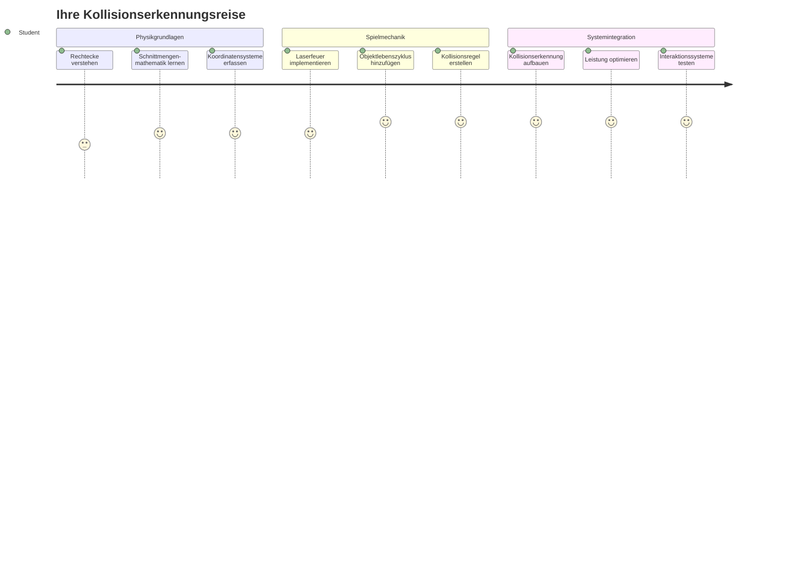
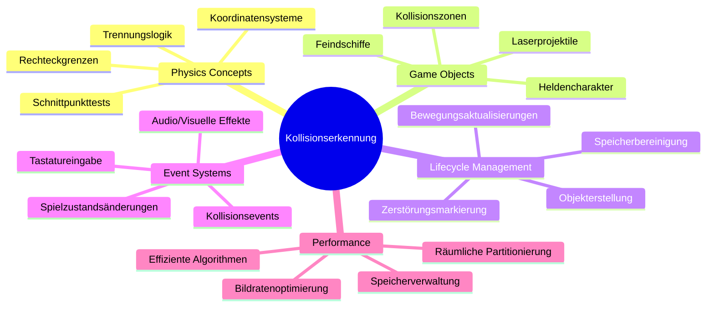
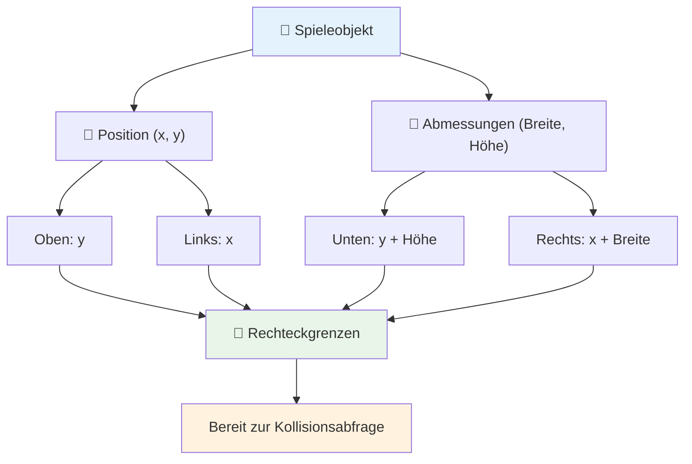
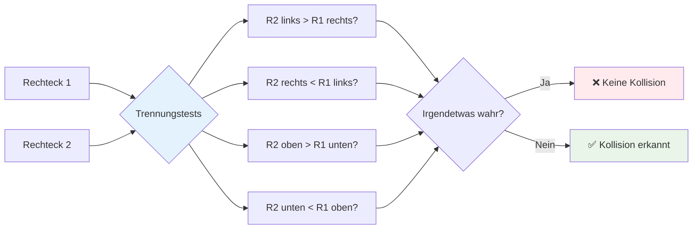
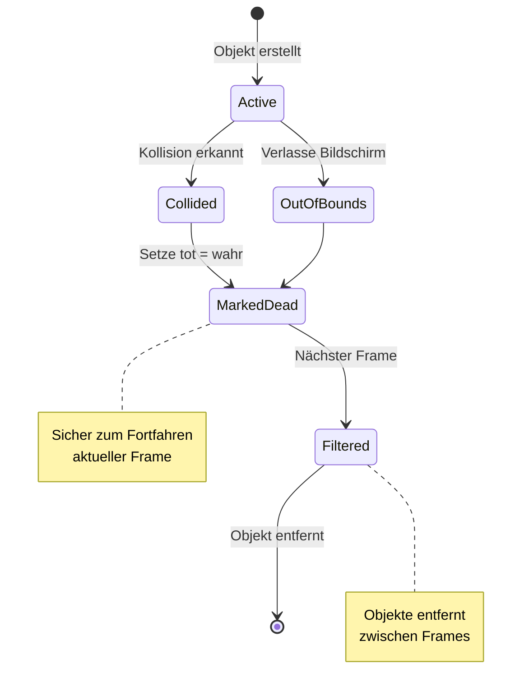
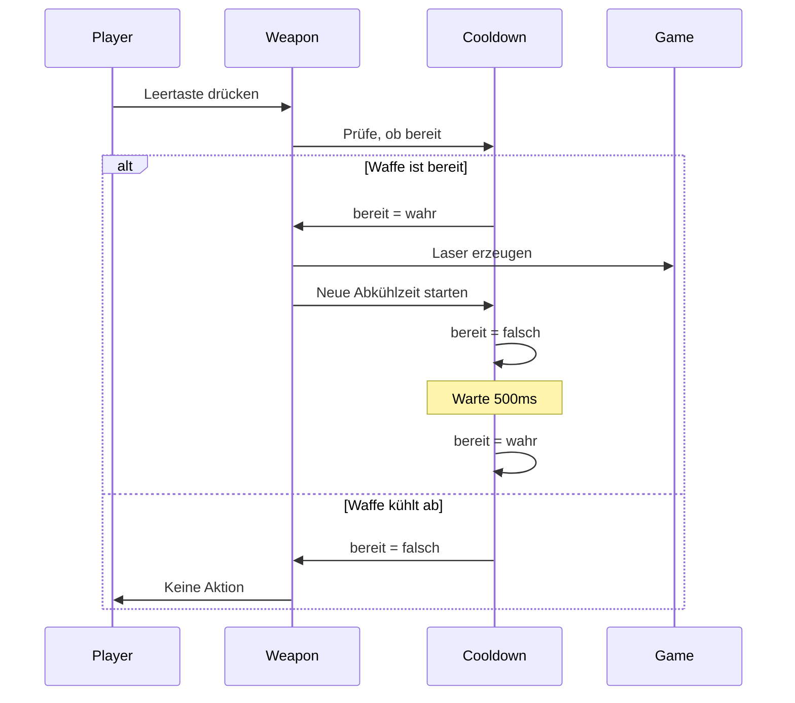
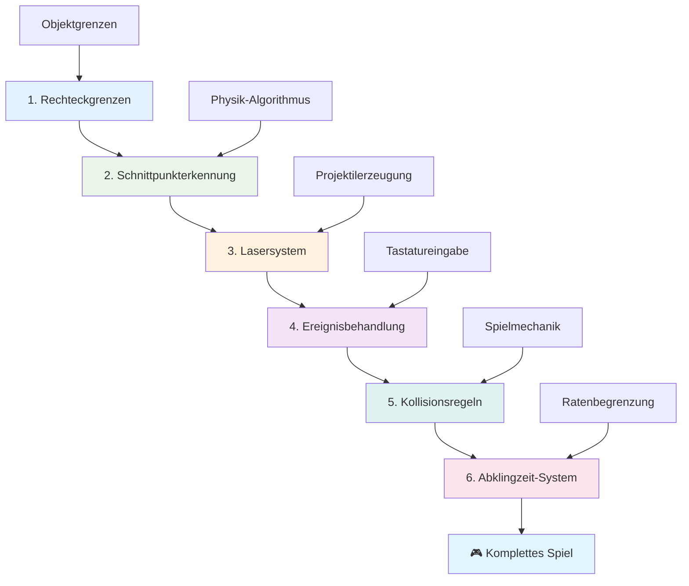
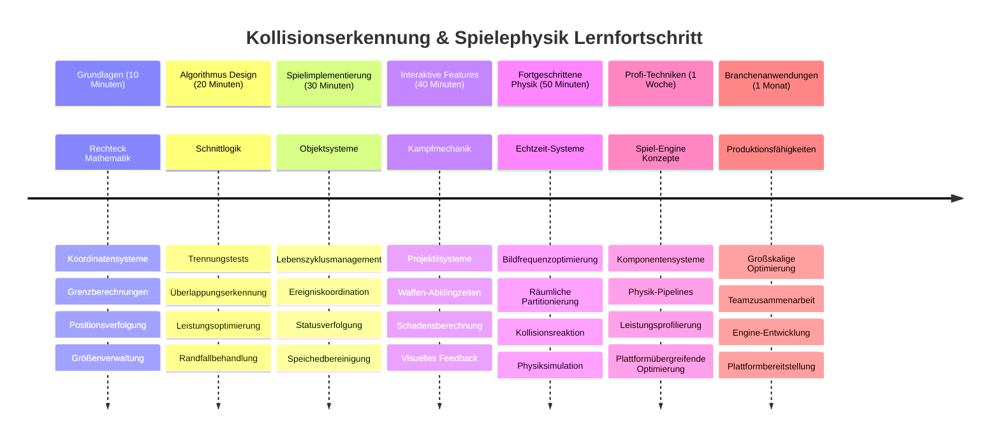

<!--
CO_OP_TRANSLATOR_METADATA:
{
  "original_hash": "039b4d8ce65f5edd82cf48d9c3e6728c",
  "translation_date": "2026-01-06T08:39:10+00:00",
  "source_file": "6-space-game/4-collision-detection/README.md",
  "language_code": "de"
}
-->
# Baue ein Weltraumspiel Teil 4: Hinzufügen eines Lasers und Erkennen von Kollisionen


## Quiz vor der Vorlesung

[Quiz vor der Vorlesung](https://ff-quizzes.netlify.app/web/quiz/35)

Denke an den Moment in Star Wars, als Lukes Protonentorpedos den Abgasport des Todessterns treffen. Diese präzise Kollisionsdetektion veränderte das Schicksal der Galaxie! In Spielen funktioniert die Kollisionsdetektion genauso – sie bestimmt, wann Objekte interagieren und was als Nächstes passiert.

In dieser Lektion fügst du deinem Weltraumspiel Laserwaffen hinzu und implementierst Kollisionsdetektion. So wie die Missionsplaner der NASA Flugbahnen von Raumfahrzeugen berechnen, um Trümmer zu vermeiden, lernst du zu erkennen, wann sich Spielobjekte kreuzen. Wir zerlegen das in überschaubare Schritte, die aufeinander aufbauen.

Am Ende hast du ein funktionierendes Kampfsystem, bei dem Laser Gegner zerstören und Kollisionen Spielereignisse auslösen. Dieselben Kollisionsprinzipien werden in allem von Physiksimulationen bis hin zu interaktiven Webschnittstellen verwendet.


✅ Recherchiere ein wenig zum allerersten jemals geschriebenen Computerspiel. Was war dessen Funktionalität?

## Kollisionsdetektion

Kollisionsdetektion funktioniert ähnlich wie die Näherungssensoren des Apollo-Landemoduls – sie überprüft ständig Entfernungen und löst Alarm aus, wenn Objekte zu nahe kommen. In Spielen bestimmt dieses System, wann Objekte interagieren und was danach passieren soll.

Der Ansatz, den wir verwenden, behandelt jedes Spielobjekt als Rechteck, ähnlich wie Flugsicherungssysteme vereinfachte geometrische Formen benutzen, um Flugzeuge zu verfolgen. Diese rechteckige Methode mag simpel erscheinen, ist aber rechnerisch effizient und funktioniert gut für die meisten Spielszenarien.

### Rechteckdarstellung

Jedes Spielobjekt benötigt Koordinatenbegrenzungen, ähnlich wie der Mars Pathfinder Rover seinen Standort auf der Marsoberfläche kartierte. So definieren wir diese Begrenzungskoordinaten:


```javascript
rectFromGameObject() {
  return {
    top: this.y,
    left: this.x,
    bottom: this.y + this.height,
    right: this.x + this.width
  }
}
```

**Lass uns das aufschlüsseln:**
- **Obere Kante**: Genau dort, wo dein Objekt vertikal beginnt (seine y-Position)
- **Linke Kante**: Wo es horizontal startet (seine x-Position)
- **Untere Kante**: Höhe zur y-Position addieren – so weißt du, wo es endet!
- **Rechte Kante**: Breite zur x-Position addieren – und du hast die vollständige Begrenzung

### Schnittmengen-Algorithmus

Das Erkennen von Rechtecküberschneidungen verwendet eine Logik ähnlich der, mit der das Hubble-Weltraumteleskop bestimmt, ob sich astronomische Objekte im Sichtfeld überlappen. Der Algorithmus prüft auf Separation:


```javascript
function intersectRect(r1, r2) {
  return !(r2.left > r1.right ||
    r2.right < r1.left ||
    r2.top > r1.bottom ||
    r2.bottom < r1.top);
}
```

**Der Separations-Test funktioniert wie Radarsysteme:**
- Befindet sich Rechteck 2 vollständig rechts von Rechteck 1?
- Befindet sich Rechteck 2 vollständig links von Rechteck 1?
- Befindet sich Rechteck 2 vollständig unterhalb von Rechteck 1?
- Befindet sich Rechteck 2 vollständig oberhalb von Rechteck 1?

Wenn keine dieser Bedingungen zutrifft, müssen sich die Rechtecke überlappen. Dieser Ansatz ähnelt der Methode von Radaroperators, um zu bestimmen, ob zwei Flugzeuge sicheren Abstand halten.

## Verwaltung des Objektlebenszyklus

Wenn ein Laser einen Gegner trifft, müssen beide Objekte aus dem Spiel entfernt werden. Das Löschen von Objekten mitten in einer Schleife kann jedoch Abstürze verursachen – eine Lektion, die schon im Apollo Guidance Computer hart gelernt wurde. Stattdessen verwenden wir einen „Markieren zur Löschung“-Ansatz, der Objekte sicher zwischen Frames entfernt.


So markieren wir etwas zum Entfernen:

```javascript
// Objekt zur Entfernung markieren
enemy.dead = true;
```

**Warum dieser Ansatz funktioniert:**
- Wir markieren das Objekt als „tot“, löschen es aber nicht sofort
- Dadurch kann der aktuelle Spiel-Frame sicher zu Ende ausgeführt werden
- Keine Abstürze durch Verwendung von bereits gelöschten Objekten!

Dann filtere die markierten Objekte vor dem nächsten Render-Zyklus heraus:

```javascript
gameObjects = gameObjects.filter(go => !go.dead);
```

**Was dieses Filtern bewirkt:**
- Erzeugt eine neue Liste nur mit „lebenden“ Objekten
- Wirft alle Objekte weg, die als tot markiert sind
- Hält dein Spiel flüssig am Laufen
- Verhindert Speicherüberlastung durch angesammelte zerstörte Objekte

## Implementierung der Laser-Mechanik

Laserprojektile in Spielen funktionieren nach dem gleichen Prinzip wie Photonentorpedos in Star Trek – diskrete Objekte, die sich in geraden Linien bewegen, bis sie etwas treffen. Jeder Tastendruck der Leertaste erzeugt ein neues Laserobjekt, das über den Bildschirm fliegt.

Um das umzusetzen, müssen wir einige verschiedene Komponenten koordinieren:

**Wichtige Komponenten zur Implementierung:**
- **Erstellen** von Laserobjekten, die an der Position des Helden erscheinen
- **Verarbeiten** von Tastatureingaben, um die Lasererzeugung auszulösen
- **Verwalten** von Laserbewegung und Lebenszyklus
- **Implementieren** einer visuellen Darstellung für die Laserprojektile

## Implementierung der Feuerrate-Steuerung

Unbegrenzte Feuerraten würden die Spiel-Engine überfordern und das Gameplay zu einfach machen. Auch reale Waffensysteme haben ähnliche Einschränkungen – selbst die Phaser des USS Enterprise benötigten Zeit zum Aufladen zwischen Schüssen.

Wir implementieren ein Abkühlungssystem, das schnelles Dauerfeuern verhindert und gleichzeitig reaktionsschnelle Steuerungen ermöglicht:


```javascript
class Cooldown {
  constructor(time) {
    this.cool = false;
    setTimeout(() => {
      this.cool = true;
    }, time);
  }
}

class Weapon {
  constructor() {
    this.cooldown = null;
  }
  
  fire() {
    if (!this.cooldown || this.cooldown.cool) {
      // Erstelle Laserprojektile
      this.cooldown = new Cooldown(500);
    } else {
      // Waffe kühlt noch ab
    }
  }
}
```

**Wie die Abkühlung funktioniert:**
- Wenn die Waffe erzeugt wird, startet sie „heiß“ (kann noch nicht feuern)
- Nach der Timeout-Periode wird sie „kühl“ (bereit zum Feuern)
- Vor dem Feuern prüfen wir: „Ist die Waffe kühl?“
- Das verhindert Spam-Klicken, während die Steuerung responsiv bleibt

✅ Siehe Lektion 1 der Weltraumspiel-Serie, um dich an Abkühlzeiten zu erinnern.

## Aufbau des Kollisionssystems

Du wirst deinen bestehenden Weltraumspielcode erweitern, um ein Kollisionsdetektionssystem zu erstellen. Wie das automatisierte Kollisionsvermeidungssystem der Internationalen Raumstation wird dein Spiel ständig die Positionen der Objekte überwachen und auf Schnittmengen reagieren.

Ausgehend vom Code deiner vorherigen Lektion fügst du Kollisionsdetektion mit spezifischen Regeln hinzu, die die Objektinteraktionen steuern.

> 💡 **Profi-Tipp**: Das Laser-Sprite ist bereits in deinem Asset-Ordner enthalten und im Code referenziert, bereit für die Implementierung.

### Kollisionregeln, die umgesetzt werden sollen

**Spielmechaniken, die hinzugefügt werden:**
1. **Laser trifft Gegner**: Das Gegnerobjekt wird zerstört, wenn es von einem Laser getroffen wird
2. **Laser trifft Bildschirmrand**: Laser wird entfernt, wenn er den oberen Bildschirmrand erreicht
3. **Kollision Gegner und Held**: Beide Objekte werden zerstört, wenn sie sich schneiden
4. **Gegner erreicht unteren Bildschirmrand**: Spielende-Bedingung, wenn Gegner den Bildschirmboden erreichen

### 🔄 **Pädagogischer Check-in**
**Grundlagen der Kollisionsdetektion**: Vor der Umsetzung stelle sicher, dass du verstehst:
- ✅ Wie Rechteckbegrenzungen Kollisionenzonen definieren
- ✅ Warum Separationsprüfungen effizienter sind als Berechnung von Schnittgrößen
- ✅ Die Bedeutung der Objektlebenszyklusverwaltung in Spielschleifen
- ✅ Wie ereignisgesteuerte Systeme Kollisionsreaktionen koordinieren

**Kurzer Selbsttest**: Was würde passieren, wenn du Objekte sofort löschen würdest, anstatt sie zu markieren?
*Antwort: Das Löschen mitten in der Schleife könnte Abstürze verursachen oder Objekte beim Iterieren überspringen*

**Physikalisches Verständnis**: Du verstehst jetzt:
- **Koordinatensysteme**: Wie Position und Dimensionen Begrenzungen erzeugen
- **Schnittlogik**: Mathematische Prinzipien hinter der Kollisionsdetektion
- **Performance-Optimierung**: Warum effiziente Algorithmen in Echtzeitsystemen wichtig sind
- **Speicherverwaltung**: Sichere Objektlebenszyklusmuster für Stabilität

## Einrichtung deiner Entwicklungsumgebung

Gute Neuigkeiten – wir haben bereits den Großteil der Grundlagen für dich vorbereitet! Alle deine Spielassets und die Grundstruktur warten im Unterordner `your-work`, bereit für dich, um die coolen Kollisionsfunktionen hinzuzufügen.

### Projektstruktur

```bash
-| assets
  -| enemyShip.png
  -| player.png
  -| laserRed.png
-| index.html
-| app.js
-| package.json
```

**Verständnis der Dateistruktur:**
- **Enthält** alle Sprite-Bilder, die für die Spielobjekte benötigt werden
- **Beinhaltet** das Haupt-HTML-Dokument und die JavaScript-Anwendungsdatei
- **Stellt** Paketkonfiguration für den lokalen Entwicklungsserver bereit

### Starten des Entwicklungsservers

Wechsle in deinen Projektordner und starte den lokalen Server:

```bash
cd your-work
npm start
```

**Diese Befehlsfolge:**
- **Wechselt** in das Arbeitsverzeichnis deines Projekts
- **Startet** einen lokalen HTTP-Server unter `http://localhost:5000`
- **Serviert** deine Spieldateien für Tests und Entwicklung
- **Ermöglicht** Live-Entwicklung mit automatischem Neuladen

Öffne deinen Browser und navigiere zu `http://localhost:5000`, um den aktuellen Spielstand mit gerendertem Helden und Gegnern zu sehen.

### Schritt-für-Schritt-Implementierung

Wie die systematische Vorgehensweise der NASA zur Programmierung der Voyager-Raumsonden, implementieren wir die Kollisionsdetektion methodisch und bauen jede Komponente Schritt für Schritt auf.


#### 1. Rechteck-Kollisionsgrenzen hinzufügen

Bringe zuerst deinen Spielobjekten bei, ihre Begrenzungen zu beschreiben. Füge diese Methode zu deiner `GameObject`-Klasse hinzu:

```javascript
rectFromGameObject() {
    return {
      top: this.y,
      left: this.x,
      bottom: this.y + this.height,
      right: this.x + this.width,
    };
  }
```

**Diese Methode bewirkt:**
- **Erstellt** ein Rechteckobjekt mit genauen Begrenzungskoordinaten
- **Berechnet** untere und rechte Kanten aus Position plus Dimensionen
- **Gibt zurück** ein Objekt, das bereit für Kollisionsalgorithmen ist
- **Bietet** eine standardisierte Schnittstelle für alle Spielobjekte

#### 2. Schnittmengen-Erkennung implementieren

Nun erstellen wir unseren Kollisionsdetektiv – eine Funktion, die erkennen kann, wann sich zwei Rechtecke überlappen:

```javascript
function intersectRect(r1, r2) {
  return !(
    r2.left > r1.right ||
    r2.right < r1.left ||
    r2.top > r1.bottom ||
    r2.bottom < r1.top
  );
}
```

**Dieser Algorithmus arbeitet so:**
- **Testet** vier Separationsbedingungen zwischen Rechtecken
- **Gibt `false` zurück**, wenn eine Separationsbedingung wahr ist
- **Signalisiert Kollision**, wenn keine Trennung besteht
- **Verwendet** Negationslogik für effiziente Schnittmengentests

#### 3. Laser-Feuersystem implementieren

Jetzt wird es spannend! Lass uns das Laserschusssystem einrichten.

##### Nachrichten-Konstanten

Zuerst definieren wir einige Nachrichtentypen, damit verschiedene Teile unseres Spiels miteinander kommunizieren können:

```javascript
KEY_EVENT_SPACE: "KEY_EVENT_SPACE",
COLLISION_ENEMY_LASER: "COLLISION_ENEMY_LASER",
COLLISION_ENEMY_HERO: "COLLISION_ENEMY_HERO",
```

**Diese Konstanten bieten:**
- **Standardisieren** Eventnamen in der gesamten Anwendung
- **Ermöglichen** konsistente Kommunikation der Spielsysteme
- **Verhindern** Tippfehler bei der Registrierung von Event-Handlern

##### Tastatureingabe-Verarbeitung

Füge die Erkennung der Leertaste zu deinem Tastatur-Event Listener hinzu:

```javascript
} else if(evt.keyCode === 32) {
  eventEmitter.emit(Messages.KEY_EVENT_SPACE);
}
```

**Dieser Eingabeverarbeiter:**
- **Erkennt** Leertastendrücke über keyCode 32
- **Sendet** eine standardisierte Eventnachricht
- **Ermöglicht** entkoppelte Feuerlogik

##### Event-Listener Einrichtung

Registriere das Feuerverhalten in deiner `initGame()`-Funktion:

```javascript
eventEmitter.on(Messages.KEY_EVENT_SPACE, () => {
 if (hero.canFire()) {
   hero.fire();
 }
});
```

**Dieser Event-Listener:**
- **Reagiert** auf Leertasten-Events
- **Prüft** den Status der Feuerabkühlung
- **Löst** Laser-Erzeugung aus, wenn freigegeben

Füge Kollisionsbehandlung für Laser-Gegner-Interaktionen hinzu:

```javascript
eventEmitter.on(Messages.COLLISION_ENEMY_LASER, (_, { first, second }) => {
  first.dead = true;
  second.dead = true;
});
```

**Dieser Kollisions-Handler:**
- **Empfängt** Kollisions-Eventdaten mit beiden Objekten
- **Markiert** beide Objekte zum Entfernen
- **Sorgt für** ordnungsgemäße Bereinigung nach Kollision

#### 4. Die Laser-Klasse erstellen

Implementiere ein Laserprojektile, das sich nach oben bewegt und seinen eigenen Lebenszyklus verwaltet:

```javascript
class Laser extends GameObject {
  constructor(x, y) {
    super(x, y);
    this.width = 9;
    this.height = 33;
    this.type = 'Laser';
    this.img = laserImg;
    
    let id = setInterval(() => {
      if (this.y > 0) {
        this.y -= 15;
      } else {
        this.dead = true;
        clearInterval(id);
      }
    }, 100);
  }
}
```

**Diese Klassenimplementierung:**
- **Erweitert** GameObject, um Grundfunktionalitäten zu erben
- **Setzt** angemessene Dimensionen für das Laser-Sprite
- **Erzeugt** automatische Aufwärtsbewegung mit `setInterval()`
- **Verarbeitet** Selbstzerstörung beim Erreichen des oberen Bildschirms
- **Verwaltet** eigene Animationszeitsteuerung und Aufräumarbeiten

#### 5. Kollisionsdetektionssystem implementieren

Erstelle eine umfassende Kollisionsdetektionsfunktion:

```javascript
function updateGameObjects() {
  const enemies = gameObjects.filter(go => go.type === 'Enemy');
  const lasers = gameObjects.filter(go => go.type === "Laser");
  
  // Teste Laser-Gegner-Kollisionen
  lasers.forEach((laser) => {
    enemies.forEach((enemy) => {
      if (intersectRect(laser.rectFromGameObject(), enemy.rectFromGameObject())) {
        eventEmitter.emit(Messages.COLLISION_ENEMY_LASER, {
          first: laser,
          second: enemy,
        });
      }
    });
  });

  // Entferne zerstörte Objekte
  gameObjects = gameObjects.filter(go => !go.dead);
}
```

**Dieses Kollisionssystem:**
- **Filtert** Spielobjekte nach Typ für effiziente Tests
- **Testet** jeden Laser gegen jeden Gegner auf Überschneidungen
- **Sendet** Kollisionsevents bei erkannten Schnittmengen
- **Bereinigt** zerstörte Objekte nach Kollisionsverarbeitung

> ⚠️ **Wichtig**: Füge `updateGameObjects()` deiner Hauptspiel-Schleife in `window.onload` hinzu, um Kollisionsdetektion zu aktivieren.

#### 6. Cooldown-System zur Hero-Klasse hinzufügen

Erweitere die Hero-Klasse mit Feuermöglichkeit und Geschwindigkeitsbegrenzung:

```javascript
class Hero extends GameObject {
  constructor(x, y) {
    super(x, y);
    this.width = 99;
    this.height = 75;
    this.type = "Hero";
    this.speed = { x: 0, y: 0 };
    this.cooldown = 0;
  }
  
  fire() {
    gameObjects.push(new Laser(this.x + 45, this.y - 10));
    this.cooldown = 500;

    let id = setInterval(() => {
      if (this.cooldown > 0) {
        this.cooldown -= 100;
      } else {
        clearInterval(id);
      }
    }, 200);
  }
  
  canFire() {
    return this.cooldown === 0;
  }
}
```

**Verständnis der erweiterten Hero-Klasse:**
- **Initialisiert** Cooldown-Timer mit null (bereit zu feuern)
- **Erzeugt** Laserobjekte, die oberhalb des Helden positioniert sind
- **Setzt** eine Cooldown-Periode zur Vermeidung schnellen Feuers
- **Verringert** Cooldown-Timer mittels intervallbasierter Updates
- **Bietet** die Überprüfung des Feuerstatus über die `canFire()`-Methode

### 🔄 **Pädagogischer Check-in**
**Vollständiges Systemverständnis**: Verifiziere dein Beherrschen des Kollisionssystems:
- ✅ Wie ermöglichen Rechtecksbegrenzungen effiziente Kollisionsdetektion?
- ✅ Warum ist die Verwaltung des Objektlebenszyklus entscheidend für Spielstabilität?
- ✅ Wie verhindert das Cooldown-System Performanceprobleme?
- ✅ Welche Rolle spielt die ereignisgesteuerte Architektur in der Kollisionsbehandlung?

**Systemintegration**: Deine Kollisionsdetektion demonstriert:
- **Mathematische Präzision**: Rechteck-Schnittmengen-Algorithmen
- **Performance-Optimierung**: Effiziente Muster für Kollisionsprüfungen
- **Speicherverwaltung**: Sicheres Erzeugen und Zerstören von Objekten
- **Ereigniskoordination**: Entkoppelte Systemkommunikation
- **Echtzeitverarbeitung**: Frame-basierte Updatezyklen

**Professionelle Muster**: Du hast implementiert:
- **Trennung von Anliegen**: Physik, Rendering und Input separiert
- **Objektorientiertes Design**: Vererbung und Polymorphismus
- **Zustandsverwaltung**: Objektlebenszyklus und Spielzustands-Tracking
- **Performance-Optimierung**: Effiziente Algorithmen für den Echtzeiteinsatz

### Teste deine Implementierung

Dein Weltraumspiel verfügt jetzt über vollständige Kollisionsdetektion und Kampftechnik. 🚀 Teste diese neuen Fähigkeiten:
- **Navigiere** mit den Pfeiltasten, um die Steuerung zu prüfen
- **Feuere Laser** mit der Leertaste – beachte, wie der Cooldown Spam verhindert
- **Beobachte Kollisionen**, wenn Laser Gegner treffen und diese entfernt werden
- **Überprüfe Aufräumarbeiten**, wenn zerstörte Objekte aus dem Spiel verschwinden

Du hast erfolgreich ein Kollisionsdetektionssystem mit den gleichen mathematischen Prinzipien implementiert, die auch Raumfahrtnavigation und Robotik steuern.

### ⚡ **Was du in den nächsten 5 Minuten tun kannst**
- [ ] Öffne die DevTools deines Browsers und setze Breakpoints in deiner Kollisionsdetektionsfunktion
- [ ] Ändere die Lasergeschwindigkeit oder Gegnerbewegung, um Kollisionsauswirkungen zu beobachten
- [ ] Experimentiere mit verschiedenen Cooldown-Werten, um Feuerraten zu testen
- [ ] Fügen Sie `console.log`-Anweisungen hinzu, um Kollisionser Ereignisse in Echtzeit zu verfolgen

### 🎯 **Was Sie in dieser Stunde erreichen können**
- [ ] Schließen Sie das Nachbereitungs-Quiz ab und verstehen Sie Kollisionserkennungsalgorithmen
- [ ] Fügen Sie visuelle Effekte wie Explosionen hinzu, wenn Kollisionen auftreten
- [ ] Implementieren Sie verschiedene Arten von Projektilen mit unterschiedlichen Eigenschaften
- [ ] Erstellen Sie Power-Ups, die die Fähigkeiten des Spielers vorübergehend verbessern
- [ ] Fügen Sie Soundeffekte hinzu, um Kollisionen befriedigender zu machen

### 📅 **Ihr wochenlanges Physikprogrammieren**
- [ ] Schließen Sie das vollständige Weltraumspiel mit ausgefeilten Kollisionssystemen ab
- [ ] Implementieren Sie fortgeschrittene Kollisionsformen über Rechtecke hinaus (Kreise, Polygone)
- [ ] Fügen Sie Partikelsysteme für realistische Explosionseffekte hinzu
- [ ] Erstellen Sie komplexes feindliches Verhalten mit Kollisionsvermeidung
- [ ] Optimieren Sie die Kollisionserkennung für eine bessere Leistung bei vielen Objekten
- [ ] Fügen Sie Physiksimulationen wie Impuls und realistische Bewegung hinzu

### 🌟 **Ihre monatelange Meisterschaft in Spielphysik**
- [ ] Bauen Sie Spiele mit fortgeschrittenen Physik-Engines und realistischen Simulationen
- [ ] Erlernen Sie 3D-Kollisionserkennung und Algorithmen zur räumlichen Partitionierung
- [ ] Tragen Sie zu Open-Source-Physikbibliotheken und Spiele-Engines bei
- [ ] Beherrschen Sie die Leistungsoptimierung für grafikintensive Anwendungen
- [ ] Erstellen Sie Lehrinhalte über Spielphysik und Kollisionserkennung
- [ ] Bauen Sie ein Portfolio auf, das fortgeschrittene Fähigkeiten im Physikprogrammieren zeigt

## 🎯 Ihr Zeitplan zur Meisterschaft der Kollisionserkennung


### 🛠️ Ihre Zusammenfassung des Game Physics Toolkits

Nach Abschluss dieser Lektion beherrschen Sie nun:
- **Kollisionsmathematik**: Rechteckschnittalgorithmen und Koordinatensysteme
- **Leistungsoptimierung**: Effiziente Kollisionserkennung für Echtzeitanwendungen
- **Objektlebenszyklus-Management**: Sichere Muster zur Erstellung, Aktualisierung und Zerstörung
- **Ereignisgesteuerte Architektur**: Entkoppelte Systeme für Kollisionsreaktionen
- **Integration in die Spielschleife**: Physik-Updates pro Frame und Render-Koordination
- **Eingabesysteme**: Reaktionsschnelle Steuerung mit Ratenbegrenzung und Feedback
- **Speicherverwaltung**: Effizientes Objekt-Pooling und Aufräumstrategien

**Anwendungen in der realen Welt**: Ihre Fähigkeiten in der Kollisionserkennung finden direkt Anwendung in:
- **Interaktiven Simulationen**: Wissenschaftliche Modellierung und Bildungswerkzeuge
- **Benutzeroberflächendesign**: Drag-and-Drop-Interaktionen und Touch-Erkennung
- **Datenvisualisierung**: Interaktive Diagramme und anklickbare Elemente
- **Mobile Entwicklung**: Erkennung von Touch-Gesten und Kollisionsbehandlung
- **Robotikprogrammierung**: Pfadplanung und Hindernisvermeidung
- **Computergrafik**: Raytracing und räumliche Algorithmen

**Erworbene professionelle Fähigkeiten**: Sie können nun:
- **Entwerfen** Sie effiziente Algorithmen für die Echtzeit-Kollisionserkennung
- **Implementieren** Sie Physiksysteme, die mit der Komplexität von Objekten skalieren
- **Debuggen** Sie komplexe Interaktionssysteme mit mathematischen Prinzipien
- **Optimieren** Sie die Leistung für verschiedene Hardware- und Browserfähigkeiten
- **Architektieren** Sie wartbare Spielsysteme unter Verwendung bewährter Designmuster

**Meisterung von Konzepten der Spieleentwicklung**:
- **Physiksimulation**: Echtzeit-Kollisionserkennung und -reaktion
- **Performance Engineering**: Optimierte Algorithmen für interaktive Anwendungen
- **Ereignissysteme**: Entkoppelte Kommunikation zwischen Spielkomponenten
- **Objektverwaltung**: Effiziente Lebenszyklusmuster für dynamische Inhalte
- **Eingabeverarbeitung**: Reaktive Steuerung mit angemessenem Feedback

**Nächste Stufe**: Sie sind bereit, fortgeschrittene Physik-Engines wie Matter.js zu erkunden, 3D-Kollisionserkennung zu implementieren oder komplexe Partikelsysteme zu erstellen!

🌟 **Errungenschaft freigeschaltet**: Sie haben ein vollständiges physikbasiertes Interaktionssystem mit professioneller Kollisionserkennung gebaut!

## GitHub Copilot Agent Challenge 🚀

Verwenden Sie den Agentenmodus, um die folgende Herausforderung zu lösen:

**Beschreibung:** Verbessern Sie das Kollisionssystem, indem Sie Power-Ups implementieren, die zufällig erscheinen und temporäre Fähigkeiten bieten, wenn sie vom Heldenraumschiff eingesammelt werden.

**Aufforderung:** Erstellen Sie eine PowerUp-Klasse, die GameObject erweitert, und implementieren Sie die Kollisionserkennung zwischen dem Helden und Power-Ups. Fügen Sie mindestens zwei Arten von Power-Ups hinzu: eines, das die Feuerrate erhöht (verringert die Abklingzeit), und ein anderes, das einen temporären Schild erzeugt. Implementieren Sie eine Spawn-Logik, die Power-Ups in zufälligen Intervallen und Positionen erzeugt.

---


## 🚀 Herausforderung

Fügen Sie eine Explosion hinzu! Schauen Sie sich die Spielressourcen im [Space Art Repo](../../../../6-space-game/solution/spaceArt/readme.txt) an und versuchen Sie, eine Explosion hinzuzufügen, wenn der Laser auf ein Alien trifft.

## Nachvorlesungs-Quiz

[Nachvorlesungs-Quiz](https://ff-quizzes.netlify.app/web/quiz/36)

## Rückblick & Selbststudium

Experimentieren Sie mit den Intervallen in Ihrem bisherigen Spiel. Was passiert, wenn Sie diese ändern? Lesen Sie mehr über [JavaScript-Timing-Events](https://www.freecodecamp.org/news/javascript-timing-events-settimeout-and-setinterval/).

## Aufgabe

[Erkunden Sie Kollisionen](assignment.md)

---

<!-- CO-OP TRANSLATOR DISCLAIMER START -->
**Haftungsausschluss**:  
Dieses Dokument wurde mit dem KI-Übersetzungsdienst [Co-op Translator](https://github.com/Azure/co-op-translator) übersetzt. Obwohl wir uns um Genauigkeit bemühen, beachten Sie bitte, dass automatisierte Übersetzungen Fehler oder Ungenauigkeiten enthalten können. Das Originaldokument in seiner Ursprungssprache gilt als maßgebliche Quelle. Für wichtige Informationen wird eine professionelle menschliche Übersetzung empfohlen. Wir übernehmen keine Haftung für Missverständnisse oder Fehlinterpretationen, die durch die Nutzung dieser Übersetzung entstehen.
<!-- CO-OP TRANSLATOR DISCLAIMER END -->