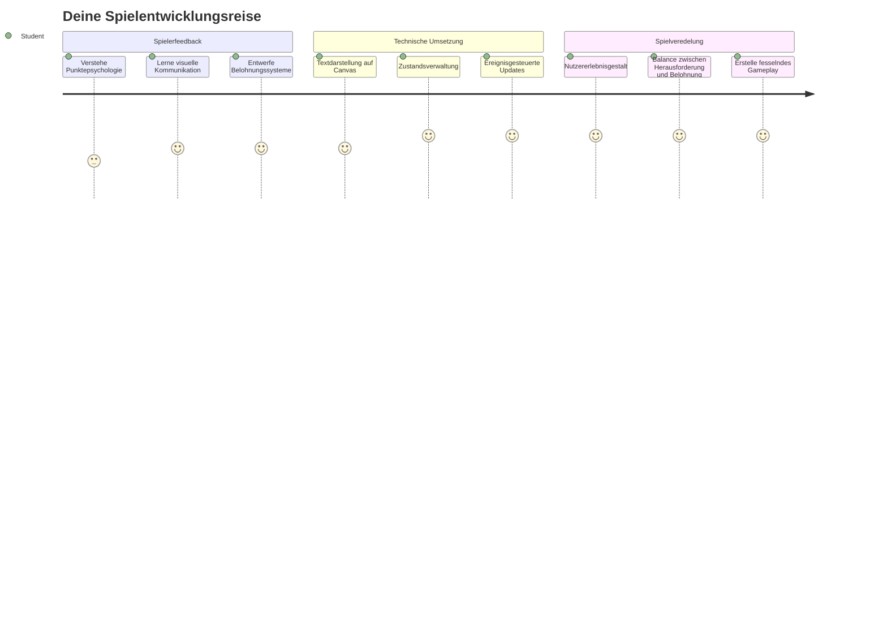
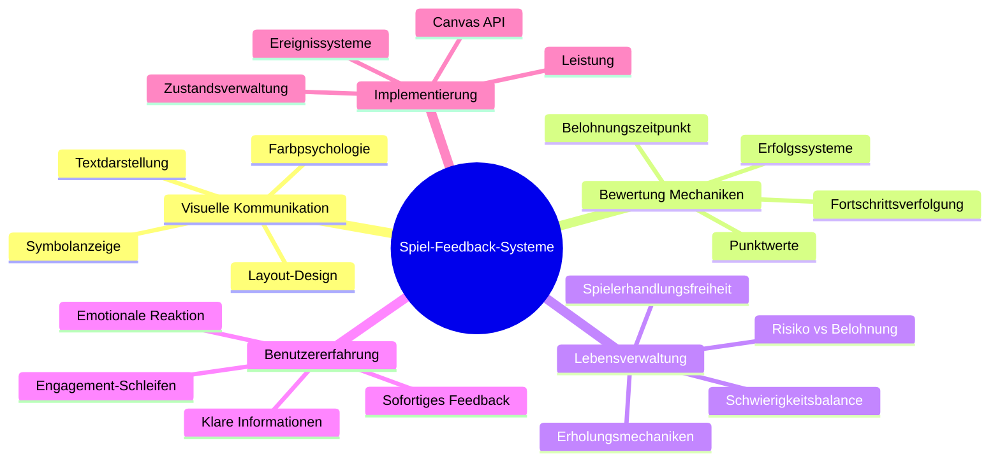
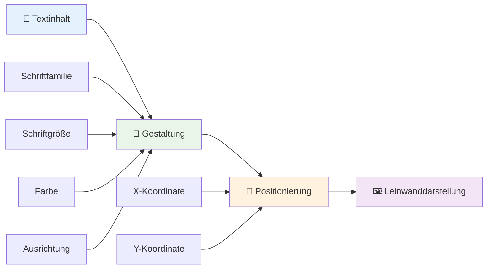
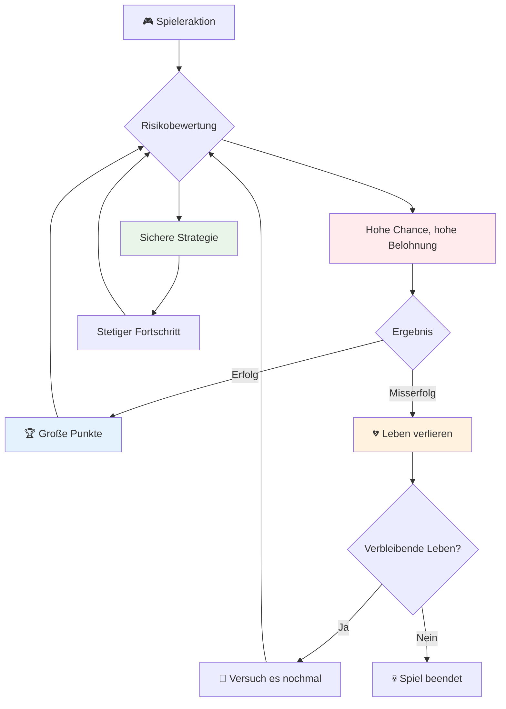
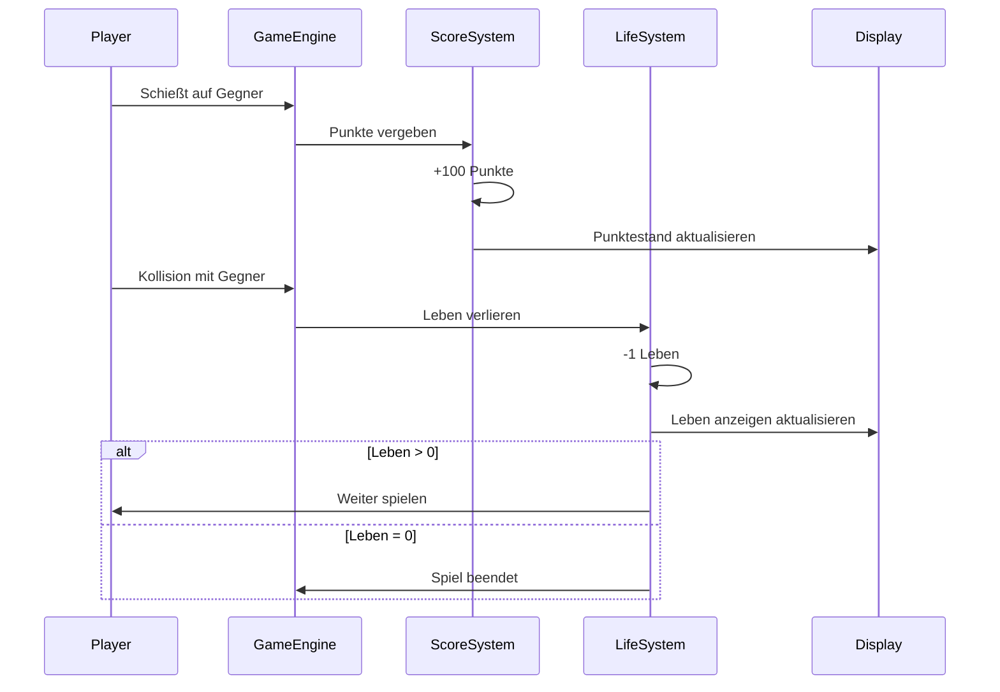
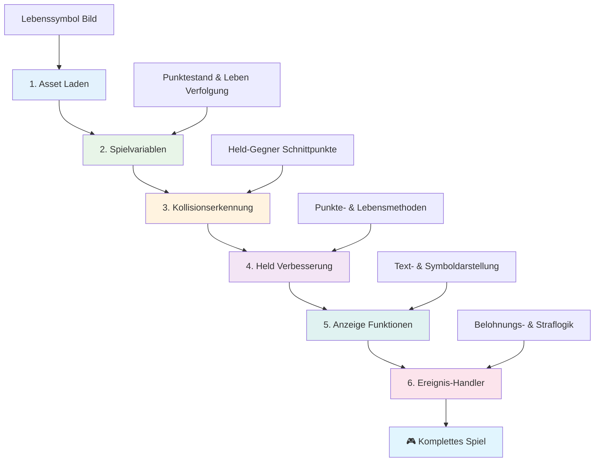
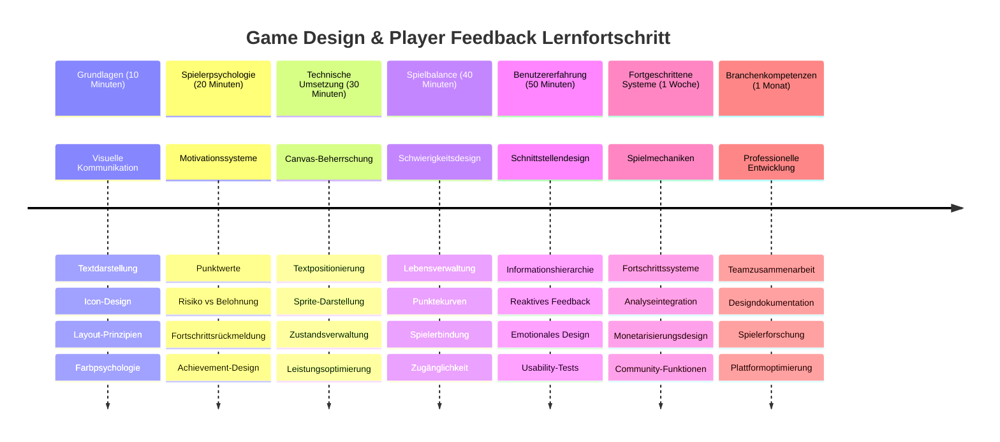

# Baue ein Weltraumspiel Teil 5: Punkte und Leben


## Quiz vor der Vorlesung

[Quiz vor der Vorlesung](https://ff-quizzes.netlify.app/web/quiz/37)

Bereit, dein Weltraumspiel wie ein echtes Spiel wirken zu lassen? Lass uns Punkte für das Spiel hinzufügen und Leben verwalten – die Kernmechaniken, die frühe Arcade-Spiele wie Space Invaders von simplen Demonstrationen zu fesselnder Unterhaltung machten. Hier wird dein Spiel wirklich spielbar.


## Text auf dem Bildschirm zeichnen – Die Stimme deines Spiels

Um deinen Punktestand anzuzeigen, müssen wir lernen, wie man Text auf dem Canvas rendert. Die Methode `fillText()` ist dein wichtigstes Werkzeug dafür – dieselbe Technik, die in klassischen Arcade-Spielen verwendet wurde, um Punkte und Statusinformationen anzuzeigen.


Du hast volle Kontrolle über das Erscheinungsbild des Textes:

```javascript
ctx.font = "30px Arial";
ctx.fillStyle = "red";
ctx.textAlign = "right";
ctx.fillText("show this on the screen", 0, 0);
```

✅ Tauche tiefer ein in [Text auf ein Canvas hinzufügen](https://developer.mozilla.org/docs/Web/API/Canvas_API/Tutorial/Drawing_text) – du wirst überrascht sein, wie kreativ du mit Schriftarten und Stil werden kannst!

## Leben – Mehr als nur eine Zahl

Im Spieldesign repräsentiert ein "Leben" die Fehlerquote des Spielers. Dieses Konzept stammt aus Flipperautomaten, bei denen du mit mehreren Bällen spielen konntest. In frühen Videospielen wie Asteroids gaben Leben den Spielern die Erlaubnis, Risiken einzugehen und aus Fehlern zu lernen.


Die visuelle Darstellung ist sehr wichtig – Schiffs-Icons anstelle von nur „Leben: 3“ zu zeigen, erzeugt sofortige visuelle Erkennung, ähnlich wie frühe Arcade-Automaten Ikonografie verwendeten, um sprachübergreifend zu kommunizieren.

## Aufbau des Belohnungssystems deines Spiels

Jetzt implementieren wir die Kern-Feedbacksysteme, die Spieler fesseln:


- **Punktesystem**: Jedes zerstörte feindliche Schiff bringt 100 Punkte (runde Zahlen sind für Spieler leichter mental zu berechnen). Die Punktzahl wird unten links angezeigt.
- **Lebenszähler**: Dein Held startet mit drei Leben – ein Standard, der von frühen Arcade-Spielen etabliert wurde, um Herausforderung mit Spielbarkeit auszubalancieren. Jede Kollision mit einem Feind kostet ein Leben. Die verbleibenden Leben zeigen wir unten rechts mit Schiffs-Icons an .

## Lass uns anfangen zu bauen!

Richte zuerst deinen Arbeitsbereich ein. Navigiere zu den Dateien in deinem `your-work`-Unterordner. Du solltest diese Dateien sehen:

```bash
-| assets
  -| enemyShip.png
  -| player.png
  -| laserRed.png
-| index.html
-| app.js
-| package.json
```

Um dein Spiel zu testen, starte den Entwicklungsserver aus dem `your_work`-Ordner:

```bash
cd your-work
npm start
```

Dies startet einen lokalen Server unter `http://localhost:5000`. Öffne diese Adresse im Browser, um dein Spiel zu sehen. Teste die Steuerung mit den Pfeiltasten und versuche, Feinde zu schießen, um alles zu überprüfen.


### Zeit zum Programmieren!

1. **Hole dir die benötigten visuellen Assets**. Kopiere das `life.png`-Asset aus dem Ordner `solution/assets/` in deinen `your-work`-Ordner. Füge dann das lifeImg zu deiner window.onload-Funktion hinzu:

    ```javascript
    lifeImg = await loadTexture("assets/life.png");
    ```

1. Vergiss nicht, `lifeImg` zu deiner Asset-Liste hinzuzufügen:

    ```javascript
    let heroImg,
    ...
    lifeImg,
    ...
    eventEmitter = new EventEmitter();
    ```
  
2. **Richte deine Spielvariablen ein**. Füge Code hinzu, um die Gesamtpunktzahl (anfangs 0) und verbleibende Leben (anfangs 3) zu verfolgen. Diese werden wir auf dem Bildschirm anzeigen, damit Spieler immer wissen, wo sie stehen.

3. **Implementiere die Kollisionsabfrage**. Erweitere deine Funktion `updateGameObjects()` so, dass erkannt wird, wenn Feinde mit deinem Helden kollidieren:

    ```javascript
    enemies.forEach(enemy => {
        const heroRect = hero.rectFromGameObject();
        if (intersectRect(heroRect, enemy.rectFromGameObject())) {
          eventEmitter.emit(Messages.COLLISION_ENEMY_HERO, { enemy });
        }
      })
    ```

4. **Füge Lebens- und Punkt-Tracking zu deinem Helden hinzu**.  
   1. **Initialisiere die Zähler**. Unter `this.cooldown = 0` in deiner `Hero`-Klasse, richte Leben und Punkte ein:

        ```javascript
        this.life = 3;
        this.points = 0;
        ```

   1. **Zeige diese Werte dem Spieler an**. Erstelle Funktionen, um diese Werte auf dem Bildschirm anzuzeigen:

        ```javascript
        function drawLife() {
          // TODO, 35, 27
          const START_POS = canvas.width - 180;
          for(let i=0; i < hero.life; i++ ) {
            ctx.drawImage(
              lifeImg, 
              START_POS + (45 * (i+1) ), 
              canvas.height - 37);
          }
        }
        
        function drawPoints() {
          ctx.font = "30px Arial";
          ctx.fillStyle = "red";
          ctx.textAlign = "left";
          drawText("Points: " + hero.points, 10, canvas.height-20);
        }
        
        function drawText(message, x, y) {
          ctx.fillText(message, x, y);
        }

        ```

   1. **Binde alles in deine Spielschleife ein**. Füge diese Funktionen zu deiner window.onload-Funktion direkt nach `updateGameObjects()` hinzu:

        ```javascript
        drawPoints();
        drawLife();
        ```

### 🔄 **Pädagogischer Check-in**
**Verständnis des Spieldesigns**: Bevor du Konsequenzen implementierst, stelle sicher, dass du folgendes verstehst:
- ✅ Wie visuelles Feedback den Spielstatus an Spieler kommuniziert
- ✅ Warum konsistente Platzierung von UI-Elementen die Benutzerfreundlichkeit verbessert
- ✅ Die Psychologie hinter Punktwerten und Lebensverwaltung
- ✅ Wie die Textdarstellung im Canvas sich von HTML-Text unterscheidet

**Kurzer Selbsttest**: Warum verwenden Arcade-Spiele typischerweise runde Zahlen für Punktwerte?
*Antwort: Runde Zahlen sind für Spieler leichter mental zu berechnen und erzeugen befriedigende psychologische Belohnungen*

**Prinzipien der Nutzererfahrung**: Du wendest jetzt an:
- **Visuelle Hierarchie**: Wichtige Informationen sind prominent positioniert
- **Sofortiges Feedback**: Echtzeit-Updates auf Spieleraktionen
- **Kognitive Belastung**: Einfache, klare Informationsdarstellung
- **Emotionales Design**: Icons und Farben, die eine Verbindung zum Spieler schaffen

1. **Implementiere Spielkonsequenzen und Belohnungen**. Nun fügen wir die Feedbacksysteme hinzu, die Spieleraktionen bedeutungsvoll machen:

   1. **Kollisionen kosten Leben**. Jedes Mal, wenn dein Held mit einem Feind zusammenstößt, verlierst du ein Leben.
   
      Füge diese Methode zu deiner `Hero`-Klasse hinzu:

        ```javascript
        decrementLife() {
          this.life--;
          if (this.life === 0) {
            this.dead = true;
          }
        }
        ```

   2. **Feinde zu schießen bringt Punkte**. Jeder erfolgreiche Treffer bringt 100 Punkte und sorgt für sofortiges positives Feedback bei genauem Schießen.

      Erweitere deine Hero-Klasse mit dieser Inkrement-Methode:
    
        ```javascript
          incrementPoints() {
            this.points += 100;
          }
        ```

        Verbinde nun diese Funktionen mit deinen Kollisionsereignissen:

        ```javascript
        eventEmitter.on(Messages.COLLISION_ENEMY_LASER, (_, { first, second }) => {
           first.dead = true;
           second.dead = true;
           hero.incrementPoints();
        })

        eventEmitter.on(Messages.COLLISION_ENEMY_HERO, (_, { enemy }) => {
           enemy.dead = true;
           hero.decrementLife();
        });
        ```

✅ Neugierig auf andere Spiele, die mit JavaScript und Canvas gebaut wurden? Erkunde sie – du wirst erstaunt sein, was alles möglich ist!

Nachdem du diese Funktionen implementiert hast, teste dein Spiel, um das komplette Feedbacksystem in Aktion zu sehen. Du solltest Lebens-Icons unten rechts, deinen Punktestand unten links sehen und beobachten, wie Kollisionen Leben reduzieren und erfolgreiche Treffer deine Punktzahl erhöhen.

Dein Spiel hat nun die essenziellen Mechaniken, die frühe Arcade-Spiele so fesselnd machten – klare Ziele, unmittelbares Feedback und bedeutungsvolle Konsequenzen für Spieleraktionen.

### 🔄 **Pädagogischer Check-in**
**Vollständiges Spieldesign-System**: Überprüfe dein Verständnis von Spieler-Feedback-Systemen:
- ✅ Wie schaffen Punktmechaniken Motivation und Engagement beim Spieler?
- ✅ Warum ist visuelle Konsistenz für das UI-Design wichtig?
- ✅ Wie balanciert das Leben-System Herausforderung und Spielerbindung?
- ✅ Welche Rolle spielt sofortiges Feedback für ein befriedigendes Gameplay?

**Systemintegration**: Dein Feedbacksystem demonstriert:
- **User Experience Design**: Klare visuelle Kommunikation und Informationshierarchie
- **Event-Driven Architektur**: Reaktive Updates bei Spieleraktionen
- **Statusverwaltung**: Verfolgen und Anzeigen dynamischer Spieldaten
- **Canvas-Meisterschaft**: Textdarstellung und Sprite-Positionierung
- **Spielpsychologie**: Verständnis von Spieler-Motivation und Engagement

**Professionelle Muster**: Du hast implementiert:
- **MVC-Architektur**: Trennung von Spiel-Logik, Daten und Präsentation
- **Observer Pattern**: Ereignisgesteuerte Updates für Spielzustandsänderungen
- **Komponentendesign**: Wiederverwendbare Funktionen für Darstellung und Logik
- **Performance-Optimierung**: Effizientes Rendern in Spielschleifen

### ⚡ **Was du in den nächsten 5 Minuten tun kannst**
- [ ] Experimentiere mit verschiedenen Schriftgrößen und Farben für die Punktemeldung
- [ ] Ändere die Punktwerte und beobachte, wie sich das Spielgefühl verändert
- [ ] Füge console.log-Aussagen hinzu, um zu verfolgen, wann Punkte und Leben sich ändern
- [ ] Teste Grenzfälle wie das Verlieren aller Leben oder erreichen hoher Punktzahlen

### 🎯 **Was du in dieser Stunde erreichen kannst**
- [ ] Abschließen des Quiz nach der Lektion und Verstehen der Spiel-Design-Psychologie
- [ ] Soundeffekte für Punkte und Leben hinzufügen
- [ ] Ein Highscore-System mit localStorage implementieren
- [ ] Unterschiedliche Punktwerte für verschiedene Gegnertypen erstellen
- [ ] Visuelle Effekte wie Bildschirmzittern bei Lebensverlust hinzufügen

### 📅 **Deine einwöchige Reise im Spieldesign**
- [ ] Das komplette Weltraumspiel mit ausgereiften Feedbacksystemen abschließen
- [ ] Fortschrittliche Punktmechaniken wie Combo-Multiplikatoren implementieren
- [ ] Erfolge und freischaltbare Inhalte hinzufügen
- [ ] Schwierigkeitseinstellungen und Balancierungssysteme erstellen
- [ ] Benutzeroberflächen für Menüs und Game-Over-Bildschirme gestalten
- [ ] Andere Spiele studieren, um Engagement-Mechanismen zu verstehen

### 🌟 **Deine einmonatige Meisterschaft in der Spieleentwicklung**
- [ ] Vollständige Spiele mit komplexen Fortschrittssystemen bauen
- [ ] Spieleranalytik und Verhaltensmessung lernen
- [ ] Zu Open-Source-Spielprojekten beitragen
- [ ] Fortgeschrittene Spieldesign-Pattern und Monetarisierung meistern
- [ ] Bildungsinhalte über Spieldesign und Nutzererfahrung erstellen
- [ ] Ein Portfolio mit Spieldesign- und Entwicklungs-Fähigkeiten aufbauen

## 🎯 Dein Zeitplan zur Spiele-Design-Meisterschaft


### 🛠️ Zusammenfassung deines Spieldesign-Toolkits

Nach Abschluss dieser Lektion hast du gemeistert:
- **Spielerpsychologie**: Verständnis von Motivation, Risiko/Belohnung und Engagement-Schleifen
- **Visuelle Kommunikation**: Effektives UI-Design mit Text, Icons und Layout
- **Feedbacksysteme**: Echtzeit-Reaktion auf Spieleraktionen und Spielereignisse
- **Statusverwaltung**: Effizientes Verfolgen und Anzeigen dynamischer Spieldaten
- **Canvas-Textdarstellung**: Professionelle Textanzeige mit Stil und Positionierung
- **Ereignisintegration**: Verknüpfung von Benutzeraktionen mit bedeutungsvollen Spielkonsequenzen
- **Spielbalance**: Gestaltung von Schwierigkeitskurven und Spielerfortschrittssystemen

**Praktische Anwendungen**: Deine Spieldesign-Fähigkeiten sind direkt anwendbar auf:
- **Benutzeroberflächendesign**: Erstellung ansprechender und intuitiver Interfaces
- **Produktentwicklung**: Verständnis von Nutzer-Motivation und Feedback-Schleifen
- **Bildungstechnologie**: Gamification und Lern-Engagement-Systeme
- **Datenvisualisierung**: Komplexe Informationen zugänglich und ansprechend machen
- **Mobile App Entwicklung**: Bindungsmechaniken und Nutzererfahrung
- **Marketing-Technologie**: Verständnis von Nutzerverhalten und Conversion-Optimierung

**Erworbene professionelle Fähigkeiten**: Du kannst jetzt:
- **Benutzererfahrungen** entwerfen, die motivieren und binden
- **Feedbacksysteme** implementieren, die Nutzerverhalten effektiv steuern
- **Herausforderung und Zugänglichkeit** in interaktiven Systemen balancieren
- **Visuelle Kommunikation** erstellen, die für unterschiedliche Nutzergruppen funktioniert
- **Nutzerverhalten analysieren** und Designverbesserungen iterieren

**Meisterung von Konzepten der Spielentwicklung**:
- **Spielermotivation**: Verstehen, was Engagement und Bindung antreibt
- **Visuelles Design**: Klare, attraktive und funktionale Interfaces erstellen
- **Systemintegration**: Verbindung mehrerer Spielsysteme zu einem stimmigen Erlebnis
- **Performance-Optimierung**: Effizientes Rendern und Statusverwaltung
- **Barrierefreiheit**: Gestaltung für unterschiedliche Fähigkeiten und Spielerbedürfnisse

**Nächstes Level**: Du bist bereit, fortgeschrittene Spieldesign-Pattern zu erforschen, Analysesysteme zu implementieren oder Monetarisierungs- und Spielerbindungsstrategien zu studieren!

🌟 **Erfolg freigeschaltet**: Du hast ein vollständiges Spieler-Feedback-System mit professionellen Spieldesign-Prinzipien gebaut!

---

## GitHub Copilot Agent Herausforderung 🚀

Nutze den Agent-Modus, um folgende Herausforderung zu meistern:

**Beschreibung:** Verbessere das Punktesystem des Weltraumspiels, indem du ein Highscore-Feature mit persistentem Speicher und Bonuspunkte-Mechaniken implementierst.

**Aufgabe:** Erstelle ein Highscore-System, das den besten Spielstand des Spielers in localStorage speichert. Füge Bonuspunkte für aufeinanderfolgende Feindabschüsse (Combo-System) hinzu und implementiere unterschiedliche Punktwerte für verschiedene Gegnertypen. Zeige eine visuelle Anzeige, wenn der Spieler einen neuen Highscore erreicht, und zeige den aktuellen Highscore auf dem Spielbildschirm an.


## 🚀 Herausforderung

Du hast jetzt ein funktionierendes Spiel mit Punkten und Leben. Überlege, welche zusätzlichen Funktionen das Spielerlebnis verbessern könnten.

## Quiz nach der Vorlesung

[Quiz nach der Vorlesung](https://ff-quizzes.netlify.app/web/quiz/38)

## Wiederholung & Selbststudium

Möchtest du mehr entdecken? Recherchiere verschiedene Ansätze zu Punktesystemen und Lebenssystemen in Spielen. Es gibt faszinierende Spiel-Engines wie [PlayFab](https://playfab.com), die Punkte, Ranglisten und Spielerfortschritt verwalten. Wie könnte die Integration von so etwas dein Spiel auf das nächste Level heben?

## Aufgabe

[Baue ein Punktespiel](assignment.md)

---

<!-- CO-OP TRANSLATOR DISCLAIMER START -->
**Haftungsausschluss**:  
Dieses Dokument wurde mithilfe des KI-Übersetzungsdienstes [Co-op Translator](https://github.com/Azure/co-op-translator) übersetzt. Obwohl wir uns um Genauigkeit bemühen, weisen wir darauf hin, dass automatisierte Übersetzungen Fehler oder Ungenauigkeiten enthalten können. Das Originaldokument in seiner ursprünglichen Sprache gilt als maßgebliche Quelle. Für wichtige Informationen wird eine professionelle menschliche Übersetzung empfohlen. Wir übernehmen keine Haftung für Missverständnisse oder Fehlinterpretationen, die aus der Nutzung dieser Übersetzung entstehen.
<!-- CO-OP TRANSLATOR DISCLAIMER END -->