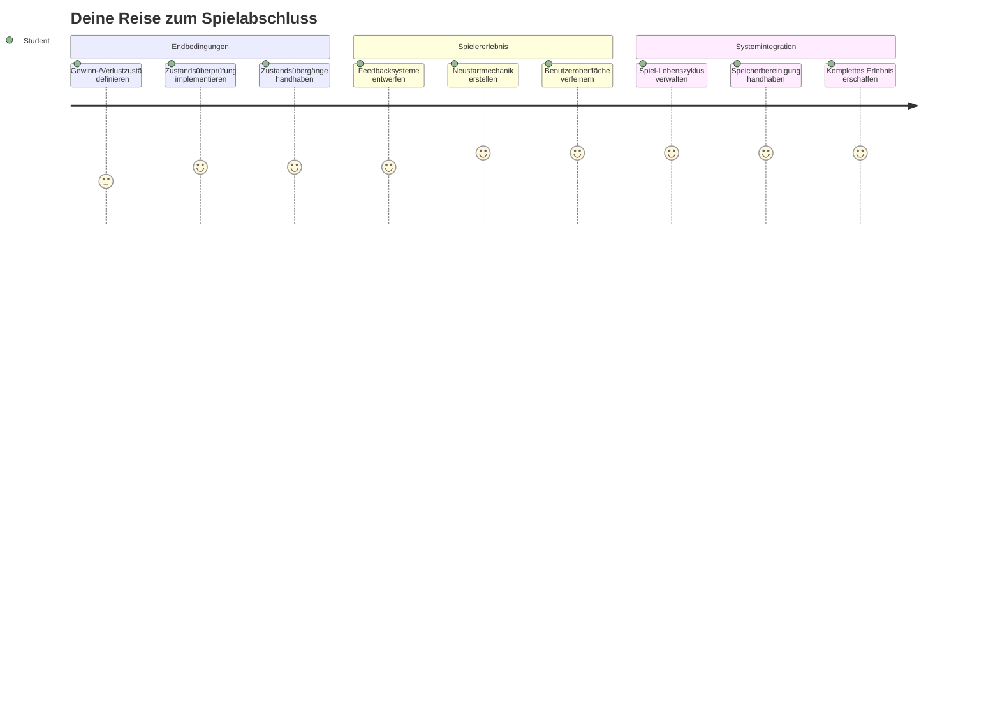
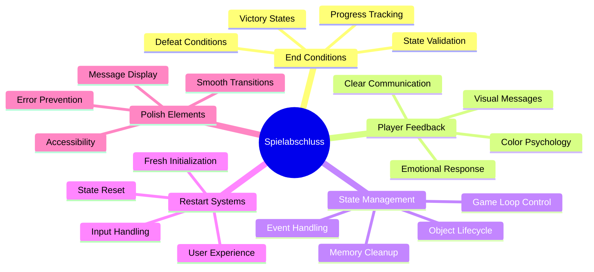
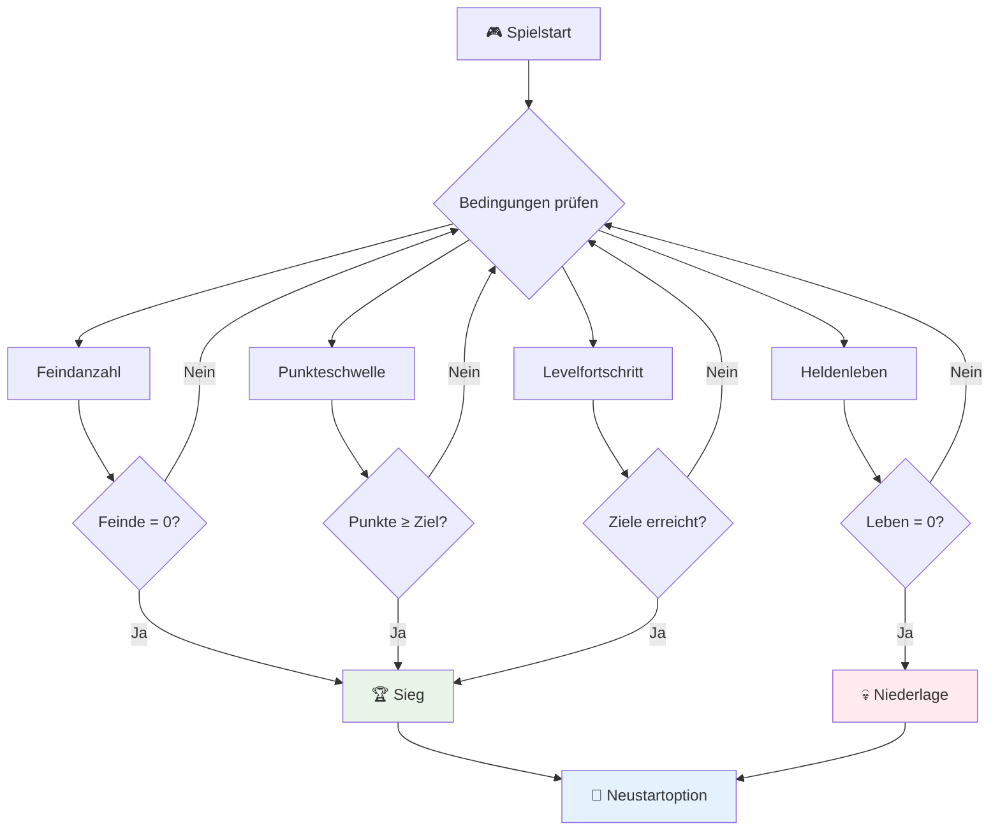
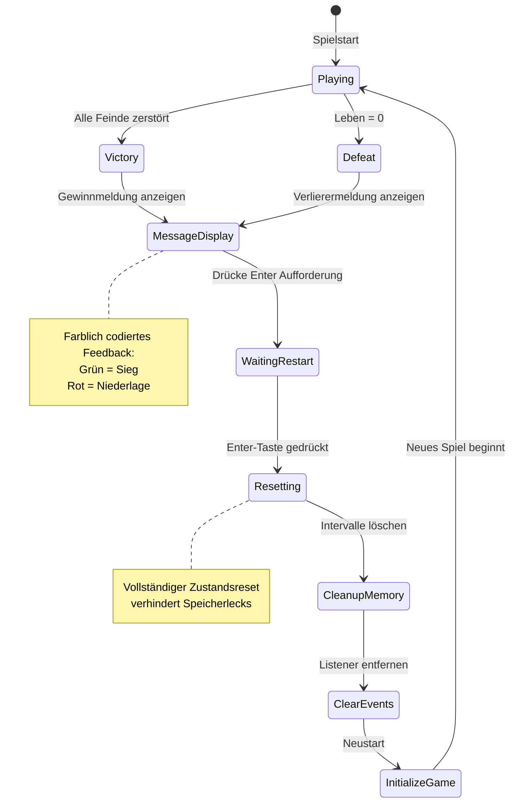
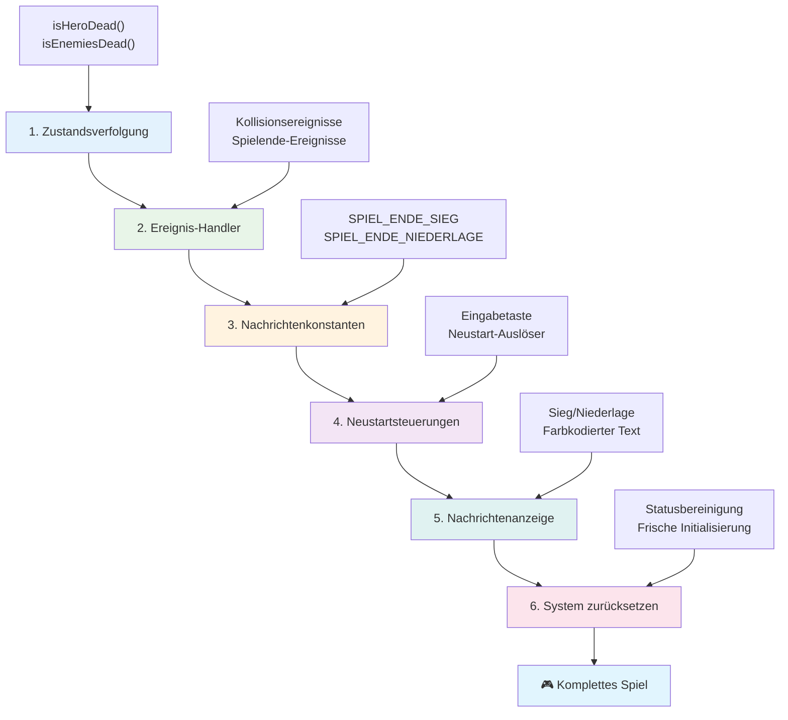
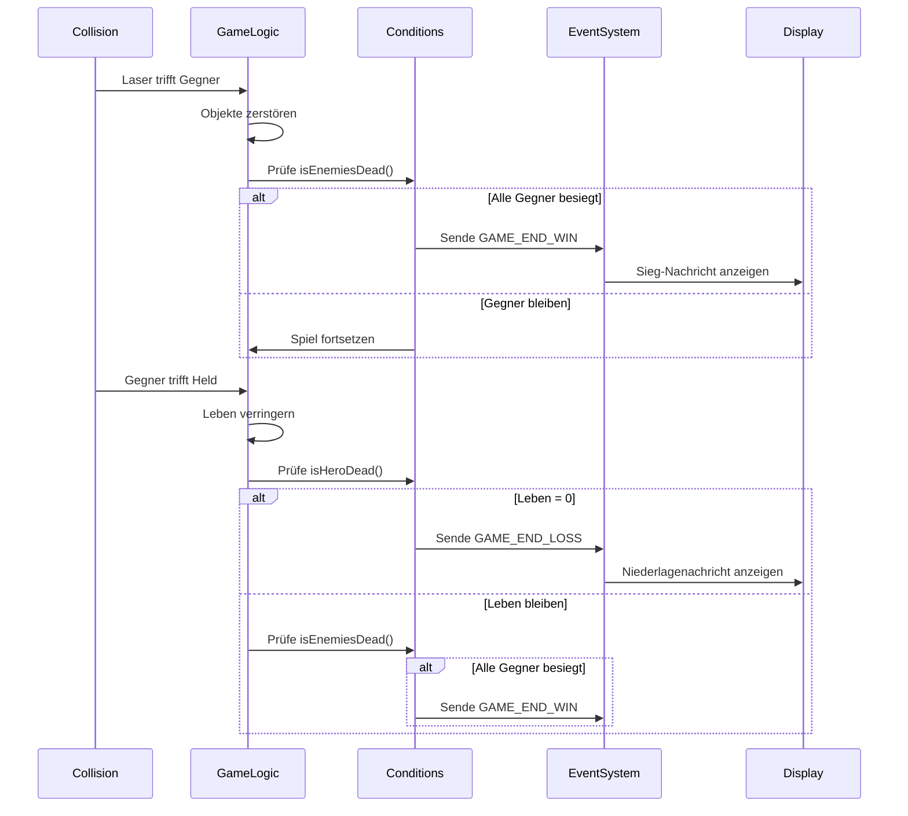
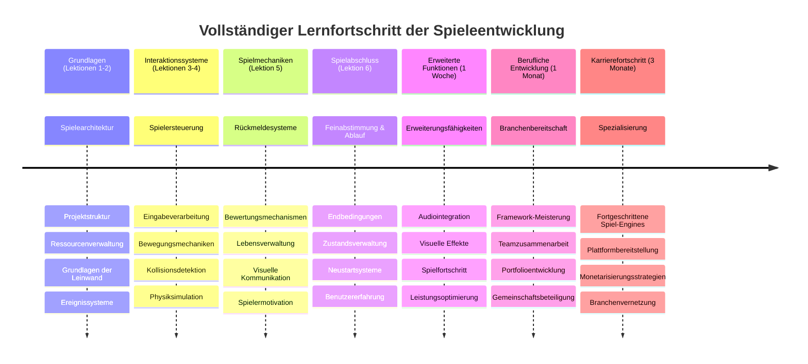

<!--
CO_OP_TRANSLATOR_METADATA:
{
  "original_hash": "a4b78043f4d64bf3ee24e0689b8b391d",
  "translation_date": "2026-01-06T08:43:15+00:00",
  "source_file": "6-space-game/6-end-condition/README.md",
  "language_code": "de"
}
-->
# Baue ein Weltraumspiel Teil 6: Ende und Neustart


Jedes großartige Spiel braucht klare Endbedingungen und einen reibungslosen Neustartmechanismus. Du hast ein beeindruckendes Weltraumspiel mit Bewegung, Kampf und Punktestand gebaut – jetzt ist es Zeit, die letzten Bausteine hinzuzufügen, die es komplett wirken lassen.

Dein Spiel läuft derzeit unendlich, wie die Voyager-Sonden, die die NASA 1977 gestartet hat – die auch Jahrzehnte später noch durch den Weltraum reisen. Für die Weltraumforschung ist das in Ordnung, aber Spiele brauchen definierte Endpunkte, um befriedigende Erlebnisse zu schaffen.

Heute implementieren wir richtige Gewinn-/Verlustbedingungen und ein Neustartsystem. Am Ende dieser Lektion hast du ein ausgereiftes Spiel, das Spieler abschließen und erneut spielen können – genau wie die klassischen Arcade-Spiele, die das Medium geprägt haben.


## Vorlesungsquiz

[Pre-lecture quiz](https://ff-quizzes.netlify.app/web/quiz/39)

## Verständnis der Spielendbedingungen

Wann sollte dein Spiel enden? Diese grundlegende Frage hat das Spieldesign seit der frühen Arcade-Ära geprägt. Pac-Man endet, wenn dich Geister fangen oder du alle Punkte gefressen hast, während Space Invaders endet, wenn Aliens den Boden erreichen oder du sie alle zerstörst.

Als Spielersteller definierst du die Sieg- und Verlustbedingungen. Für unser Weltraumspiel gibt es bewährte Ansätze, die fesselndes Gameplay schaffen:


- **`N` feindliche Schiffe wurden zerstört**: Es ist recht üblich, wenn du ein Spiel in verschiedene Levels unterteilst, dass du `N` feindliche Schiffe zerstören musst, um ein Level abzuschließen
- **Dein Schiff wurde zerstört**: Es gibt durchaus Spiele, in denen du verlierst, wenn dein Schiff zerstört wird. Ein anderer üblicher Ansatz ist das Konzept der Leben. Jedes Mal wenn dein Schiff zerstört wird, verlierst du ein Leben. Sind alle Leben verloren, verlierst du das Spiel.
- **Du hast `N` Punkte gesammelt**: Eine weitere übliche Endbedingung ist das Sammeln von Punkten. Wie du Punkte erhältst, bleibt dir überlassen, aber es ist üblich, Punkten verschiedene Aktivitäten zuzuordnen, wie das Zerstören eines feindlichen Schiffs oder das Einsammeln von Items, die fallen gelassen werden, wenn Gegner zerstört werden.
- **Ein Level abgeschlossen**: Dies kann mehrere Bedingungen beinhalten, wie z.B. `X` feindliche Schiffe zerstört, `Y` Punkte gesammelt oder dass ein bestimmtes Item eingesammelt wurde.

## Implementierung der Spielneustart-Funktionalität

Gute Spiele fördern Wiederspielbarkeit durch reibungslose Neustartmechanismen. Wenn Spieler ein Spiel beenden (oder verlieren), wollen sie oft sofort erneut versuchen – sei es, um ihren Score zu schlagen oder ihre Leistung zu verbessern.


Tetris macht das perfekt vor: Wenn deine Blöcke die Spitze erreichen, kannst du sofort ein neues Spiel starten, ohne dich durch komplexe Menüs zu quälen. Wir werden ein ähnliches Neustartsystem bauen, das den Spielzustand sauber zurücksetzt und Spieler schnell wieder ins Geschehen bringt.

✅ **Reflexion**: Denke über die Spiele nach, die du gespielt hast. Unter welchen Bedingungen enden sie, und wie wirst du zum Neustart aufgefordert? Was macht ein Neustarterlebnis reibungslos oder frustrierend?

## Was du bauen wirst

Du wirst die finalen Features implementieren, die dein Projekt in ein vollständiges Spielerlebnis verwandeln. Diese Elemente unterscheiden ausgereifte Spiele von einfachen Prototypen.

**Hier ist, was wir heute hinzufügen:**

1. **Gewinnbedingung**: Zerstöre alle Feinde und erlebe eine richtige Feier (du hast es dir verdient!)
2. **Verlustbedingung**: Gehe deine Leben aus und stelle dich mit einem Verlustbildschirm dem Ergebnis
3. **Neustartmechanismus**: Drücke Enter, um sofort wieder einzusteigen – denn ein Spiel ist nie genug
4. **Zustandsverwaltung**: Sauberer Neustart jedes Mal – keine übrig gebliebenen Feinde oder merkwürdigen Bugs vom letzten Spiel

## Los geht’s

Lass uns deine Entwicklungsumgebung vorbereiten. Du solltest alle deine Weltraumspiel-Dateien aus den vorherigen Lektionen bereit haben.

**Dein Projekt sollte ungefähr so aussehen:**

```bash
-| assets
  -| enemyShip.png
  -| player.png
  -| laserRed.png
  -| life.png
-| index.html
-| app.js
-| package.json
```

**Starte deinen Entwicklungsserver:**

```bash
cd your-work
npm start
```

**Dieser Befehl:**
- Startet einen lokalen Server unter `http://localhost:5000`
- Liefert deine Dateien korrekt aus
- Aktualisiert automatisch, wenn du Änderungen machst

Öffne `http://localhost:5000` in deinem Browser und überprüfe, ob dein Spiel läuft. Du solltest dich bewegen, schießen und mit Gegnern interagieren können. Wenn das bestätigt ist, können wir mit der Implementierung beginnen.

> 💡 **Profi-Tipp**: Um Warnungen in Visual Studio Code zu vermeiden, deklariere `gameLoopId` oben in deiner Datei als `let gameLoopId;` anstatt es innerhalb der `window.onload`-Funktion zu deklarieren. Das entspricht modernen Best Practices für die Variablendeklaration in JavaScript.


## Implementierungsschritte

### Schritt 1: Erstelle Funktionen zum Nachverfolgen von Endbedingungen

Wir brauchen Funktionen, die überwachen, wann das Spiel enden sollte. Wie Sensoren auf der Internationalen Raumstation, die ständig kritische Systeme überwachen, werden diese Funktionen dauerhaft den Spielzustand prüfen.

```javascript
function isHeroDead() {
  return hero.life <= 0;
}

function isEnemiesDead() {
  const enemies = gameObjects.filter((go) => go.type === "Enemy" && !go.dead);
  return enemies.length === 0;
}
```

**So läuft es hinter den Kulissen ab:**
- **Prüft**, ob unser Held keine Leben mehr hat (aua!)
- **Zählt**, wie viele Feinde noch leben und aktiv sind
- **Gibt** `true` zurück, wenn das Schlachtfeld feindfrei ist
- **Nutzt** einfache Wahrheitswertlogik für Übersichtlichkeit
- **Filtert** alle Spielobjekte, um die Überlebenden zu finden

### Schritt 2: Aktualisiere Ereignishandler für Endbedingungen

Jetzt verbinden wir diese Bedingungsprüfungen mit dem Ereignissystem des Spiels. Jedes Mal, wenn eine Kollision auftritt, bewertet das Spiel, ob dadurch eine Endbedingung ausgelöst wird. Dies schafft unmittelbares Feedback für kritische Ereignisse im Spiel.


```javascript
eventEmitter.on(Messages.COLLISION_ENEMY_LASER, (_, { first, second }) => {
    first.dead = true;
    second.dead = true;
    hero.incrementPoints();

    if (isEnemiesDead()) {
      eventEmitter.emit(Messages.GAME_END_WIN);
    }
});

eventEmitter.on(Messages.COLLISION_ENEMY_HERO, (_, { enemy }) => {
    enemy.dead = true;
    hero.decrementLife();
    if (isHeroDead())  {
      eventEmitter.emit(Messages.GAME_END_LOSS);
      return; // Verlust vor Sieg
    }
    if (isEnemiesDead()) {
      eventEmitter.emit(Messages.GAME_END_WIN);
    }
});

eventEmitter.on(Messages.GAME_END_WIN, () => {
    endGame(true);
});
  
eventEmitter.on(Messages.GAME_END_LOSS, () => {
  endGame(false);
});
```

**Was hier passiert:**
- **Laser trifft Gegner**: Beide verschwinden, du bekommst Punkte, und wir prüfen, ob du gewonnen hast
- **Gegner trifft dich**: Du verlierst ein Leben, und wir prüfen, ob du noch atmest
- **Cleverer Ablauf**: Wir prüfen zuerst Niederlage (niemand will gleichzeitig gewinnen und verlieren!)
- **Sofortige Reaktionen**: Sobald etwas Wichtiges passiert, weiß das Spiel Bescheid

### Schritt 3: Füge neue Nachrichten-Konstanten hinzu

Du musst deinem `Messages`-Konstantenobjekt neue Nachrichtentypen hinzufügen. Diese Konstanten helfen, Konsistenz zu wahren und Tippfehler in deinem Ereignissystem zu verhindern.

```javascript
GAME_END_LOSS: "GAME_END_LOSS",
GAME_END_WIN: "GAME_END_WIN",
```

**Oben haben wir:**
- **Konstanten** für Spielend-Ereignisse hinzugefügt, um Konsistenz zu gewährleisten
- **Beschreibende Namen** verwendet, die den Zweck klar angeben
- **Dem bestehenden Namensschema** für Nachrichtentypen gefolgt

### Schritt 4: Implementiere Neustartkontrollen

Jetzt fügst du Tastatursteuerungen hinzu, mit denen Spieler das Spiel neu starten können. Die Enter-Taste ist eine natürliche Wahl, da sie oft mit Bestätigungen und dem Start von Spielen assoziiert wird.

**Füge die Enter-Tastenerkennung zu deinem bestehenden keydown-Ereignislistener hinzu:**

```javascript
else if(evt.key === "Enter") {
   eventEmitter.emit(Messages.KEY_EVENT_ENTER);
}
```

**Füge die neue Nachrichtenkonstante hinzu:**

```javascript
KEY_EVENT_ENTER: "KEY_EVENT_ENTER",
```

**Was du wissen musst:**
- **Erweitert** dein bestehendes Tastatur-Event-Handling
- **Verwendet** die Enter-Taste als Neustart-Trigger für intuitive Bedienung
- **Löst** ein eigenes Ereignis aus, auf das andere Spielteile reagieren können
- **Bleibt** im gleichen Muster wie deine anderen Tastatursteuerungen

### Schritt 5: Erstelle das Nachrichtensystem

Dein Spiel muss Ergebnisse klar an die Spieler kommunizieren. Wir erstellen ein Nachrichtensystem, das Gewinn- und Verlustzustände mit farbigem Text anzeigt, ähnlich wie frühe Computer-Terminals, bei denen grün Erfolg und rot Fehler signalisierte.

**Erstelle die Funktion `displayMessage()`:**

```javascript
function displayMessage(message, color = "red") {
  ctx.font = "30px Arial";
  ctx.fillStyle = color;
  ctx.textAlign = "center";
  ctx.fillText(message, canvas.width / 2, canvas.height / 2);
}
```

**Schritt für Schritt passiert hier:**
- **Setzt** Schriftgröße und Schriftart für klaren, gut lesbaren Text
- **Wendet** einen Farbparameter an, mit "rot" als Standardfarbe für Warnungen
- **Zentriert** den Text horizontal und vertikal auf dem Canvas
- **Verwendet** moderne JavaScript-Standardparameter für flexible Farboptionen
- **Nutzt** den 2D-Canvas-Kontext für direkte Textrendering

**Erstelle die Funktion `endGame()`:**

```javascript
function endGame(win) {
  clearInterval(gameLoopId);

  // Legen Sie eine Verzögerung fest, um sicherzustellen, dass alle ausstehenden Renderings abgeschlossen sind
  setTimeout(() => {
    ctx.clearRect(0, 0, canvas.width, canvas.height);
    ctx.fillStyle = "black";
    ctx.fillRect(0, 0, canvas.width, canvas.height);
    if (win) {
      displayMessage(
        "Victory!!! Pew Pew... - Press [Enter] to start a new game Captain Pew Pew",
        "green"
      );
    } else {
      displayMessage(
        "You died !!! Press [Enter] to start a new game Captain Pew Pew"
      );
    }
  }, 200)  
}
```

**Diese Funktion macht:**
- **Friert** alles ein – keine bewegenden Schiffe oder Laser mehr
- **Macht** eine kleine Pause (200 ms), um das letzte Bild fertig zu zeichnen
- **Räumt** den Bildschirm leer und malt ihn schwarz für dramatischen Effekt
- **Zeigt** unterschiedliche Nachrichten für Gewinner und Verlierer an
- **Färbt** die Nachrichten – grün für gut, rot für... naja, nicht so gut
- **Sagt** den Spielern genau, wie sie wieder einsteigen können

### 🔄 **Pädagogischer Check-in**
**Spielzustandsverwaltung**: Bevor du die Reset-Funktion implementierst, stelle sicher, dass du verstehst:
- ✅ Wie Endbedingungen klare Gameplay-Ziele schaffen
- ✅ Warum visuelles Feedback für das Spielerverständnis essenziell ist
- ✅ Die Bedeutung ordentlicher Bereinigung, um Speicherlecks zu vermeiden
- ✅ Wie ereignisgesteuerte Architektur saubere Zustandsübergänge ermöglicht

**Kurzer Selbsttest**: Was würde passieren, wenn du beim Reset keine Event-Listener entfernst?
*Antwort: Speicherlecks und doppelte Event-Handler führen zu unvorhersehbarem Verhalten*

**Spiel-Design-Prinzipien**: Du implementierst jetzt:
- **Klare Ziele**: Spieler wissen genau, was Erfolg oder Misserfolg bedeutet
- **Sofortiges Feedback**: Änderungen im Spielzustand werden sofort kommuniziert
- **Benutzerkontrolle**: Spieler können neu starten, wenn sie wollen
- **Systemzuverlässigkeit**: Ordentliche Bereinigung verhindert Bugs und Performanceprobleme

### Schritt 6: Implementiere die Rücksetzfunktion

Das Rücksetzensystem muss den aktuellen Spielzustand komplett aufräumen und eine neue Spielsitzung starten. So bekommen die Spieler einen sauberen Start ohne Reste vom vorherigen Spiel.

**Erstelle die Funktion `resetGame()`:**

```javascript
function resetGame() {
  if (gameLoopId) {
    clearInterval(gameLoopId);
    eventEmitter.clear();
    initGame();
    gameLoopId = setInterval(() => {
      ctx.clearRect(0, 0, canvas.width, canvas.height);
      ctx.fillStyle = "black";
      ctx.fillRect(0, 0, canvas.width, canvas.height);
      drawPoints();
      drawLife();
      updateGameObjects();
      drawGameObjects(ctx);
    }, 100);
  }
}
```

**Lass uns jede Komponente verstehen:**
- **Prüft**, ob bereits eine Spielschleife läuft, bevor ein Reset erfolgt
- **Stoppt** die aktuelle Spielschleife, um alle Aktivitäten zu beenden
- **Entfernt** alle Event-Listener, um Speicherlecks zu verhindern
- **Initialisiert** den Spielzustand mit frischen Objekten und Variablen neu
- **Startet** eine neue Spielschleife mit allen notwendigen Spielfunktionen
- **Beibehält** den 100ms Intervall für konsistente Spielperformance

**Füge den Enter-Tastenevent-Handler in deine `initGame()`-Funktion ein:**

```javascript
eventEmitter.on(Messages.KEY_EVENT_ENTER, () => {
  resetGame();
});
```

**Füge die `clear()`-Methode zur EventEmitter-Klasse hinzu:**

```javascript
clear() {
  this.listeners = {};
}
```

**Wichtige Punkte:**
- **Verbindet** Druck der Enter-Taste mit der Reset-Spiel-Funktionalität
- **Registriert** diesen Event-Listener während der Spielinitialisierung
- **Bietet** eine saubere Methode, alle Event-Listener beim Reset zu entfernen
- **Verhindert** Speicherlecks durch das Löschen von Event-Handlern zwischen Spielen
- **Setzt** das `listeners`-Objekt auf leer für frische Initialisierung zurück

## Herzlichen Glückwunsch! 🎉

👽 💥 🚀 Du hast erfolgreich ein komplettes Spiel von Grund auf gebaut. Wie die Programmierer, die in den 1970er Jahren die ersten Videospiele erschaffen haben, hast du Zeilen von Code in ein interaktives Erlebnis mit ausgereiften Spielmechaniken und Nutzerfeedback verwandelt. 🚀 💥 👽

**Du hast erreicht:**
- **Komplette** Gewinn- und Verlustbedingungen mit Nutzerfeedback implementiert
- **Ein** nahtloses Neustartsystem für kontinuierliches Gameplay geschaffen
- **Klare** visuelle Kommunikation für Spielzustände gestaltet
- **Komplexe** Spielzustandsübergänge und Aufräumarbeiten verwaltet
- **Alle** Komponenten zu einem zusammenhängenden, spielbaren Spiel zusammengefügt

### 🔄 **Pädagogischer Check-in**
**Vollständiges Spielentwicklungssystem**: Feiere deine Beherrschung des gesamten Spielentwicklungszyklus:
- ✅ Wie schaffen Endbedingungen befriedigende Spielerlebnisse?
- ✅ Warum ist ordentliche Zustandsverwaltung für Spielstabilität wichtig?
- ✅ Wie verbessert visuelles Feedback das Spielerverständnis?
- ✅ Welche Rolle spielt das Neustartsystem für die Spielerbindung?

**Systemkompetenz**: Dein komplettes Spiel demonstriert:
- **Full-Stack-Spielentwicklung**: Von Grafik über Eingabe bis Zustandsverwaltung
- **Professionelle Architektur**: Ereignisgesteuerte Systeme mit ordentlicher Bereinigung
- **User Experience Design**: Klare Rückmeldungen und intuitive Steuerungen
- **Performance-Optimierung**: Effizientes Rendering und Speicherverwaltung
- **Politur und Vollständigkeit**: Alle Details, die ein Spiel fertig wirken lassen

**Branchentaugliche Fähigkeiten**: Du hast implementiert:
- **Spielschleifen-Architektur**: Echtzeitsysteme mit konsistenter Performance
- **Ereignisgesteuerte Programmierung**: Entkoppelte Systeme, die gut skalieren
- **Zustandsverwaltung**: Komplexe Datenverarbeitung und Lifecycle-Management
- **Benutzeroberflächendesign**: Klare Kommunikation und reaktive Steuerung
- **Testen und Debuggen**: Iterative Entwicklung und Problemlösung

### ⚡ **Was du in den nächsten 5 Minuten tun kannst**
- [ ] Spiele dein komplettes Spiel und teste alle Gewinn- und Verlustbedingungen
- [ ] Experimentiere mit unterschiedlichen Parametern für Endbedingungen
- [ ] Probiere console.log-Anweisungen, um Spielzustandsänderungen zu verfolgen
- [ ] Teile dein Spiel mit Freunden und sammle Feedback

### 🎯 **Was du in dieser Stunde erreichen kannst**
- [ ] Schließe das Quiz nach der Lektion ab und reflektiere deine Spielentwicklung
- [ ] Füge Audioeffekte für Sieg- und Niederlagenzustände hinzu
- [ ] Implementiere zusätzliche Endbedingungen wie Zeitlimits oder Bonusziele
- [ ] Erstelle verschiedene Schwierigkeitsgrade mit unterschiedlicher Gegneranzahl
- [ ] Verfeinere die visuelle Darstellung mit besseren Schriftarten und Farben

### 📅 **Deine einwöchige Meisterung der Spielentwicklung**
- [ ] Schließe das erweiterte Weltraumspiel mit mehreren Levels und Progression ab
- [ ] Füge fortgeschrittene Features wie Power-ups, verschiedene Gegnertypen und Spezialwaffen hinzu
- [ ] Erstelle ein Highscore-System mit persistentem Speicher
- [ ] Gestalte Benutzeroberflächen für Menüs, Einstellungen und Spieloptionen
- [ ] Optimiere die Performance für verschiedene Geräte und Browser
- [ ] Veröffentliche dein Spiel online und teile es mit der Community
### 🌟 **Deine einmonatige Karriere in der Spieleentwicklung**
- [ ] Baue mehrere vollständige Spiele und erkunde verschiedene Genres und Mechaniken
- [ ] Lerne fortgeschrittene Spiele-Entwicklungs-Frameworks wie Phaser oder Three.js
- [ ] Trage zu Open-Source-Spieleentwicklungsprojekten bei
- [ ] Studiere Prinzipien des Spieledesigns und der Spielerpsychologie
- [ ] Erstelle ein Portfolio, das deine Fähigkeiten in der Spieleentwicklung zeigt
- [ ] Vernetze dich mit der Spieleentwickler-Community und lerne kontinuierlich weiter

## 🎯 Dein kompletter Zeitplan zur Beherrschung der Spieleentwicklung


### 🛠️ Zusammenfassung deines vollständigen Spieleentwicklungs-Werkzeugsatzes

Nachdem du diese komplette Weltraumspiel-Serie abgeschlossen hast, beherrschst du nun:
- **Spielarchitektur**: Ereignisgesteuerte Systeme, Spielschleifen und Zustandsverwaltung
- **Grafikprogrammierung**: Canvas-API, Sprite-Rendering und visuelle Effekte
- **Eingabesysteme**: Tastatursteuerung, Kollisionsabfrage und reaktionsschnelle Steuerung
- **Spieldesign**: Spieler-Feedback, Fortschrittssysteme und Engagement-Mechaniken
- **Performance-Optimierung**: Effizientes Rendering, Speicherverwaltung und Framerate-Kontrolle
- **Benutzererfahrung**: Klare Kommunikation, intuitive Steuerung und Feinschliff-Details
- **Professionelle Muster**: Sauberer Code, Debugging-Techniken und Projektorganisation

**Praxisanwendungen**: Deine Fähigkeiten in der Spieleentwicklung lassen sich direkt anwenden auf:
- **Interaktive Webanwendungen**: Dynamische Benutzeroberflächen und Echtzeitsysteme
- **Datenvisualisierung**: Animierte Diagramme und interaktive Grafiken
- **Bildungstechnologie**: Gamification und motivierende Lernerlebnisse
- **Mobile Entwicklung**: Touch-basierte Interaktionen und Performance-Optimierung
- **Simulationssoftware**: Physik-Engines und Echtzeitmodellierung
- **Kreative Industrien**: Interaktive Kunst, Unterhaltung und digitale Erlebnisse

**Erworbene Berufskompetenzen**: Du kannst jetzt:
- **Architektur entwerfen** für komplexe interaktive Systeme von Grund auf
- **Debuggen** von Echtzeitanwendungen mittels systematischer Ansätze
- **Optimieren** der Performance für flüssige Benutzererlebnisse
- **Designen** ansprechender Benutzeroberflächen und Interaktionsmuster
- **Effektiv zusammenarbeiten** bei technischen Projekten mit sauberer Code-Organisation

**Beherrschte Konzepte der Spieleentwicklung**:
- **Echtzeitsysteme**: Spielschleifen, Frameratemanagement und Performance
- **Ereignisgesteuerte Architektur**: Entkoppelte Systeme und Nachrichtenübermittlung
- **Zustandsverwaltung**: Komplexe Datenverarbeitung und Lebenszyklusmanagement
- **Benutzeroberflächenprogrammierung**: Canvas-Grafiken und responsives Design
- **Theorie des Spieldesigns**: Spielerpsychologie und Engagement-Mechaniken

**Nächste Stufe**: Du bist bereit, fortgeschrittene Spiele-Frameworks, 3D-Grafik, Mehrspielersysteme zu erforschen oder in professionelle Rollen der Spieleentwicklung einzusteigen!

🌟 **Erfolg freigeschaltet**: Du hast eine komplette Spieleentwicklung durchlaufen und eine interaktive Erfahrung in professioneller Qualität von Grund auf gebaut!

**Willkommen in der Spieleentwickler-Community!** 🎮✨

## GitHub Copilot Agent Herausforderung 🚀

Nutze den Agent-Modus, um die folgende Herausforderung zu meistern:

**Beschreibung:** Verbessere das Weltraumspiel, indem du ein Level-Fortschrittssystem mit steigender Schwierigkeit und Bonusfunktionen implementierst.

**Aufgabe:** Erstelle ein mehrstufiges Weltraumspiel-System, bei dem jedes Level mehr feindliche Schiffe mit erhöhter Geschwindigkeit und Gesundheit hat. Füge einen Multiplikator für Punkte hinzu, der mit jedem Level steigt, und implementiere Power-Ups (wie Schnellfeuer oder Schild), die zufällig erscheinen, wenn Feinde zerstört werden. Baue einen Level-Abschlussbonus ein und zeige das aktuelle Level auf dem Bildschirm neben der bestehenden Punktzahl und den Leben an.

Mehr zum [Agent-Modus](https://code.visualstudio.com/blogs/2025/02/24/introducing-copilot-agent-mode) erfährst du hier.

## 🚀 Optionale Erweiterungs-Herausforderung

**Füge Audio zu deinem Spiel hinzu**: Verbessere dein Spielerlebnis durch Soundeffekte! Überlege, Audio hinzuzufügen für:

- **Laser-Schüsse** beim Abfeuern durch den Spieler
- **Zerstörung von Feinden** wenn Schiffe getroffen werden
- **Schadenseffekte** wenn der Spieler Treffer erhält
- **Siegesmusik** wenn das Spiel gewonnen wird
- **Niederlagengeräusch** wenn das Spiel verloren geht

**Beispiel für Audio-Implementierung:**

```javascript
// Audio-Objekte erstellen
const laserSound = new Audio('assets/laser.wav');
const explosionSound = new Audio('assets/explosion.wav');

// Töne während Spielereignissen abspielen
function playLaserSound() {
  laserSound.currentTime = 0; // Zum Anfang zurücksetzen
  laserSound.play();
}
```

**Was du wissen musst:**
- **Erstellt** Audio-Objekte für verschiedene Soundeffekte
- **Setzt** die `currentTime` zurück, um Schnellfeuer-Sounds zu ermöglichen
- **Berücksichtigt** Browser-Autoplay-Richtlinien durch Auslösen von Sounds bei Nutzeraktionen
- **Verwaltet** Lautstärke und Timing für ein besseres Spielerlebnis

> 💡 **Lernressource**: Erkunde diese [Audio-Sandbox](https://www.w3schools.com/jsref/tryit.asp?filename=tryjsref_audio_play), um mehr über die Audio-Implementierung in JavaScript-Spielen zu erfahren.

## Nachvorlesungs-Quiz

[Post-lecture quiz](https://ff-quizzes.netlify.app/web/quiz/40)

## Rückblick & Selbststudium

Deine Aufgabe ist es, ein neues Beispielspiel zu erstellen. Erkunde dazu einige interessante Spiele, um eine Idee zu bekommen, welches Spiel du bauen möchtest.

## Aufgabe

[Baue ein Beispielspiel](assignment.md)

---

<!-- CO-OP TRANSLATOR DISCLAIMER START -->
**Haftungsausschluss**:  
Dieses Dokument wurde mit dem KI-Übersetzungsdienst [Co-op Translator](https://github.com/Azure/co-op-translator) übersetzt. Obwohl wir uns um Genauigkeit bemühen, kann es bei automatischen Übersetzungen zu Fehlern oder Ungenauigkeiten kommen. Die Originalfassung des Dokuments in der Ursprungssprache ist als verbindliche Quelle anzusehen. Für wichtige Informationen wird eine professionelle menschliche Übersetzung empfohlen. Wir übernehmen keine Haftung für Missverständnisse oder Fehlinterpretationen, die aus der Verwendung dieser Übersetzung entstehen.
<!-- CO-OP TRANSLATOR DISCLAIMER END -->