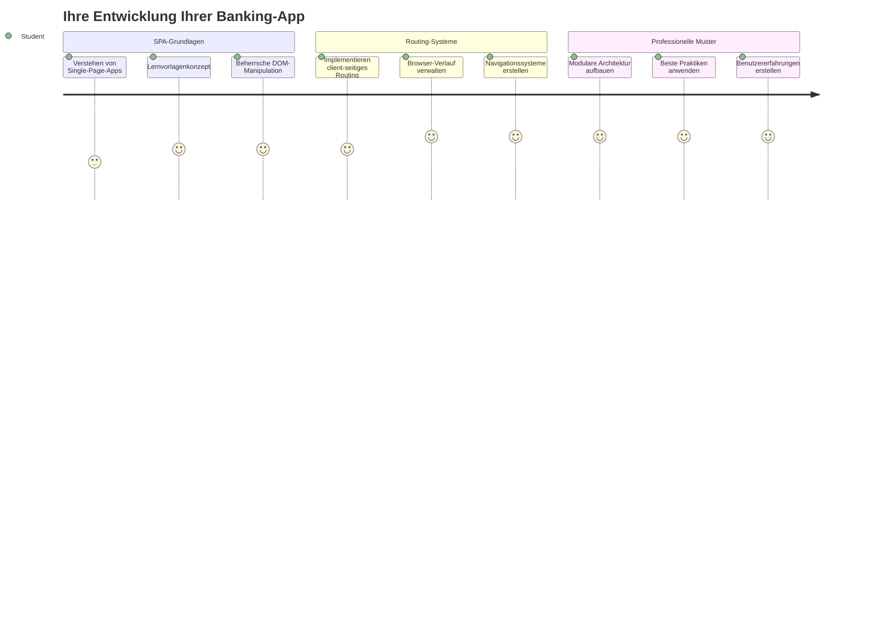
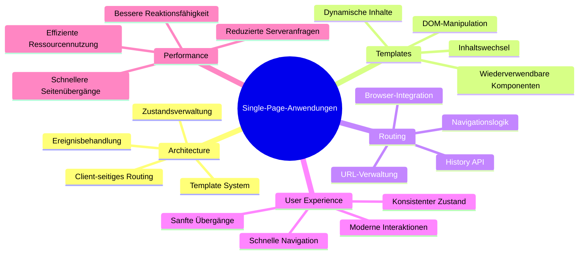
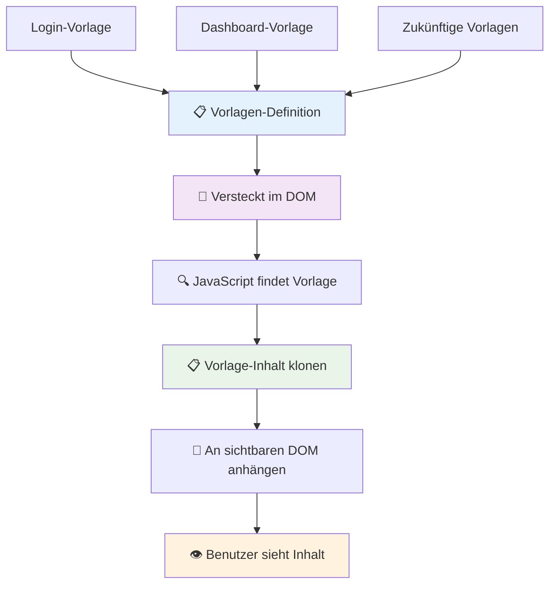
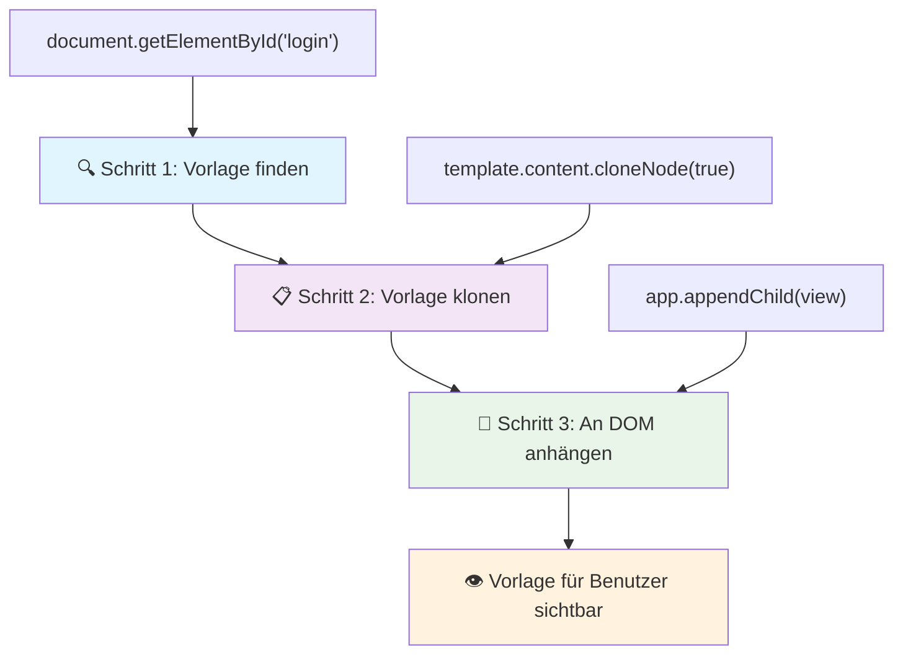
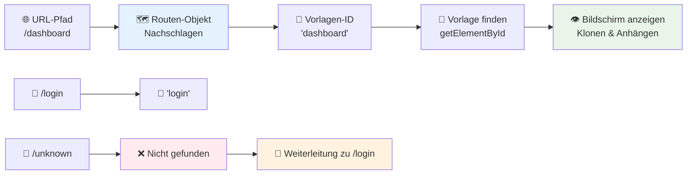
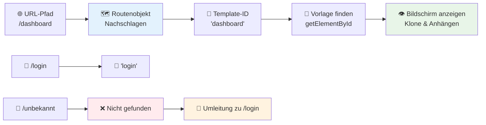
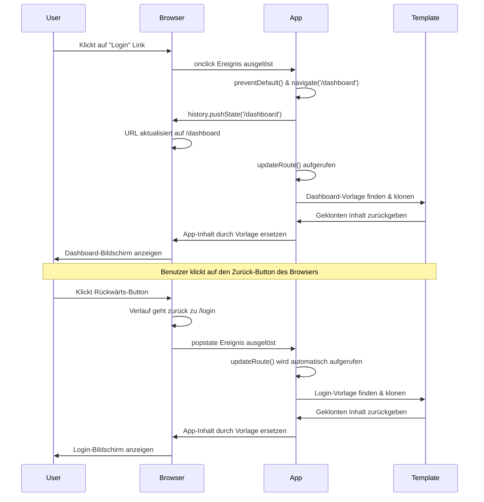
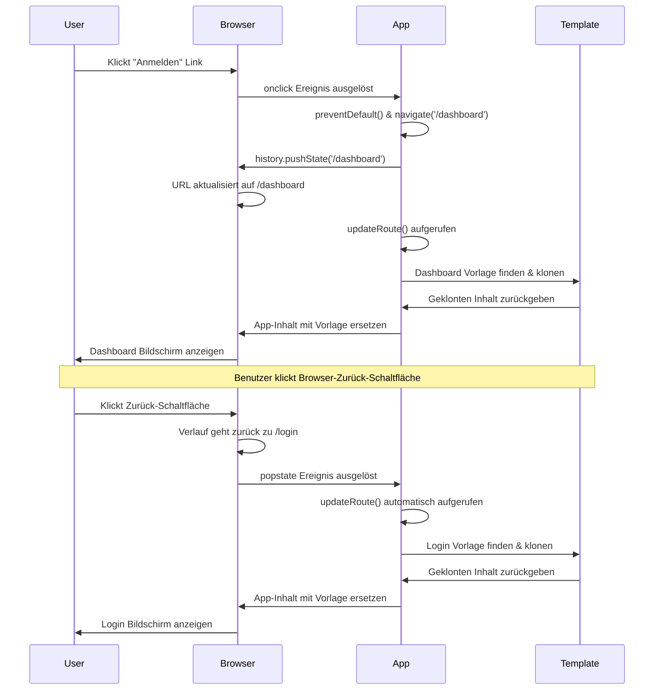
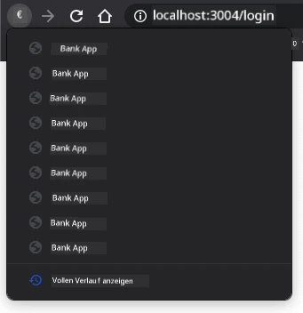
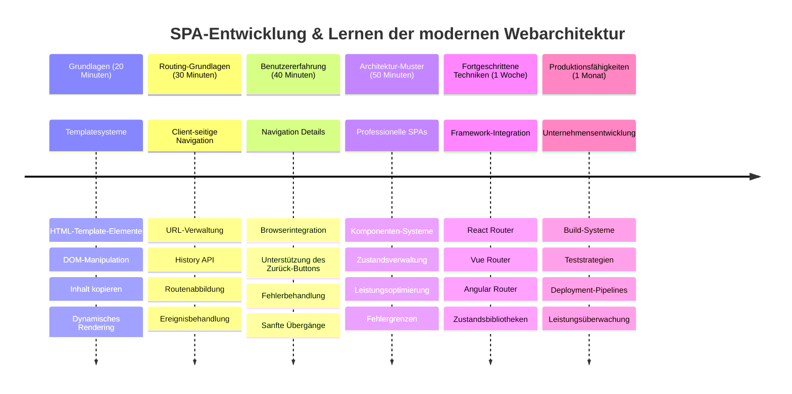

<!--
CO_OP_TRANSLATOR_METADATA:
{
  "original_hash": "351678bece18f07d9daa987a881fb062",
  "translation_date": "2026-01-06T09:01:31+00:00",
  "source_file": "7-bank-project/1-template-route/README.md",
  "language_code": "de"
}
-->
# Erstellen einer Banking-App Teil 1: HTML-Vorlagen und Routen in einer Webanwendung


Als der Apollo-11-Navigationscomputer 1969 zum Mond steuerte, musste er zwischen verschiedenen Programmen wechseln, ohne das gesamte System neu zu starten. Moderne Webanwendungen funktionieren ähnlich – sie ändern, was du siehst, ohne alles neu zu laden. Dies schafft die flüssige, reaktionsschnelle Erfahrung, die Nutzer heute erwarten.

Im Gegensatz zu traditionellen Websites, die ganze Seiten bei jeder Interaktion neu laden, aktualisieren moderne Web-Apps nur die Teile, die sich ändern müssen. Dieser Ansatz, ähnlich wie die Missionskontrolle zwischen verschiedenen Anzeigen wechselt und gleichzeitig die Kommunikation aufrechterhält, schafft die flüssige Benutzererfahrung, die wir erwarten.

Das macht den Unterschied so dramatisch:

| Traditionelle Multi-Page-Apps | Moderne Single-Page-Apps |
|-------------------------------|-------------------------|
| **Navigation** | Volles Neuladen der Seite bei jedem Bildschirm | Sofortiger Inhaltwechsel |
| **Leistung** | Langsamer durch vollständige HTML-Downloads | Schneller mit teilweisen Aktualisierungen |
| **Benutzererfahrung** | Ruckartige Seitenwechsel | Sanfte, app-ähnliche Übergänge |
| **Datenaustausch** | Schwieriger zwischen Seiten | Einfache Zustandsverwaltung |
| **Entwicklung** | Mehrere HTML-Dateien zur Pflege | Einzelnes HTML mit dynamischen Vorlagen |

**Evolution verstehen:**
- **Traditionelle Apps** benötigen Serveranfragen bei jeder Navigation
- **Moderne SPAs** laden einmal und aktualisieren Inhalte dynamisch mit JavaScript
- **Nutzer erwarten** jetzt sofortige, nahtlose Interaktionen
- **Leistungsverbesserungen** umfassen geringeren Bandbreitenbedarf und schnellere Reaktionen

In dieser Lektion bauen wir eine Banking-App mit mehreren Bildschirmen, die nahtlos zusammenfließen. So wie Wissenschaftler modulare Instrumente verwenden, die für verschiedene Experimente neu konfiguriert werden können, verwenden wir HTML-Vorlagen als wiederverwendbare Komponenten, die bei Bedarf angezeigt werden.

Du arbeitest mit HTML-Vorlagen (wiederverwendbare Blaupausen für verschiedene Bildschirme), JavaScript-Routing (das System, das zwischen Bildschirmen wechselt) und der History-API des Browsers (die die Zurück-Schaltfläche wie erwartet funktionieren lässt). Das sind die grundlegenden Techniken, die auch Frameworks wie React, Vue und Angular verwenden.

Am Ende hast du eine funktionierende Banking-App, die professionelle Single-Page-Application-Prinzipien demonstriert.


## Quiz vor der Vorlesung

[Quiz vor der Vorlesung](https://ff-quizzes.netlify.app/web/quiz/41)

### Was du brauchst

Wir benötigen einen lokalen Webserver, um unsere Banking-App zu testen – keine Sorge, das ist einfacher als es klingt! Falls du noch keinen hast, installiere einfach [Node.js](https://nodejs.org) und führe `npx lite-server` aus deinem Projektordner aus. Dieser praktische Befehl startet einen lokalen Server und öffnet deine App automatisch im Browser.

### Vorbereitung

Erstelle auf deinem Computer einen Ordner namens `bank` mit einer Datei namens `index.html` darin. Wir starten mit diesem HTML-[Boilerplate](https://de.wikipedia.org/wiki/Boilerplate_Code):

```html
<!DOCTYPE html>
<html lang="en">
  <head>
    <meta charset="UTF-8">
    <meta name="viewport" content="width=device-width, initial-scale=1.0">
    <title>Bank App</title>
  </head>
  <body>
    <!-- This is where you'll work -->
  </body>
</html>
```

**Das bietet dir dieses Boilerplate:**
- **Stellt** die HTML5-Dokumentstruktur mit korrekter DOCTYPE-Deklaration her
- **Konfiguriert** die Zeichencodierung auf UTF-8 für internationale Textunterstützung
- **Ermöglicht** responsives Design mit dem Viewport-Meta-Tag für mobile Kompatibilität
- **Setzt** einen aussagekräftigen Titel, der im Browser-Tab erscheint
- **Erstellt** eine saubere Body-Sektion, in der wir unsere Anwendung aufbauen

> 📁 **Projektstruktur-Vorschau**
> 
> **Am Ende dieser Lektion enthält dein Projekt:**
> ```
> bank/
> ├── index.html      <!-- Main HTML with templates -->
> ├── app.js          <!-- Routing and navigation logic -->
> └── style.css       <!-- (Optional for future lessons) -->
> ```
> 
> **Dateiverantwortlichkeiten:**
> - **index.html**: Enthält alle Vorlagen und stellt die App-Struktur bereit
> - **app.js**: Verwaltet Routing, Navigation und Vorlagenverwaltung
> - **Vorlagen**: Definieren die Benutzeroberfläche für Login, Dashboard und weitere Bildschirme

---

## HTML-Vorlagen

Vorlagen lösen ein grundlegendes Problem in der Webentwicklung. Als Gutenberg in den 1440er Jahren den Buchdruck mit beweglichen Lettern erfand, erkannte er, dass er anstelle ganzer Seiten wiederverwendbare Letternblöcke erstellen und nach Bedarf anordnen konnte. HTML-Vorlagen funktionieren nach demselben Prinzip – anstelle separater HTML-Dateien für jede Seite definierst du wiederverwendbare Strukturen, die bei Bedarf angezeigt werden.


Betrachte Vorlagen als Blaupausen für verschiedene Teile deiner App. So wie ein Architekt eine Blaupause erstellt und diese mehrmals nutzt, anstatt identische Räume neu zu zeichnen, erstellen wir Vorlagen einmal und instanziieren sie bei Bedarf. Der Browser hält diese Vorlagen verborgen, bis JavaScript sie aktiviert.

Wenn du mehrere Bildschirme für eine Webseite erstellen möchtest, wäre eine Möglichkeit, für jeden Bildschirm eine HTML-Datei anzulegen. Diese Lösung hat jedoch einige Nachteile:

- Du musst das gesamte HTML neu laden, wenn du den Bildschirm wechselst, was langsam sein kann.
- Es ist schwer, Daten zwischen den verschiedenen Bildschirmen zu teilen.

Eine andere Möglichkeit ist, nur eine HTML-Datei zu haben und mehrere [HTML-Vorlagen](https://developer.mozilla.org/docs/Web/HTML/Element/template) mit dem `<template>`-Element zu definieren. Eine Vorlage ist ein wiederverwendbarer HTML-Block, der vom Browser nicht angezeigt wird und zur Laufzeit mit JavaScript instanziert werden muss.

### Lass uns loslegen

Wir erstellen eine Banking-App mit zwei Hauptbildschirmen: einer Login-Seite und einem Dashboard. Fügen wir zuerst ein Platzhalter-Element zum HTML-Body hinzu – hier erscheinen später all unsere verschiedenen Bildschirme:

```html
<div id="app">Loading...</div>
```

**Verständnis dieses Platzhalters:**
- **Erstellt** einen Container mit der ID „app“, in dem alle Bildschirme angezeigt werden
- **Zeigt** eine Ladeanzeige, bis JavaScript den ersten Bildschirm initialisiert
- **Bietet** einen einzigen Mount-Punkt für unseren dynamischen Inhalt
- **Ermöglicht** einfaches Ansteuern aus JavaScript mit `document.getElementById()`

> 💡 **Profi-Tipp**: Da der Inhalt dieses Elements ersetzt wird, kannst du eine Ladeanzeige oder Meldung einfügen, die während des Ladens der App angezeigt wird.

Als nächstes fügen wir unterhalb eine HTML-Vorlage für die Login-Seite hinzu. Zunächst enthält sie nur einen Titel und eine Sektion mit einem Link, den wir für die Navigation verwenden:

```html
<template id="login">
  <h1>Bank App</h1>
  <section>
    <a href="/dashboard">Login</a>
  </section>
</template>
```

**Aufschlüsselung dieser Login-Vorlage:**
- **Definiert** eine Vorlage mit der eindeutigen Kennung „login“ für das Ansteuern per JavaScript
- **Enthält** eine Hauptüberschrift, die das Branding der App etabliert
- **Beinhaltet** ein semantisches `<section>`-Element zur Gruppierung verwandter Inhalte
- **Bietet** einen Navigationslink, der die Nutzer zum Dashboard führt

Dann fügen wir noch eine weitere HTML-Vorlage für die Dashboard-Seite hinzu. Diese Seite enthält unterschiedliche Abschnitte:

- Eine Kopfzeile mit Titel und Logout-Link
- Den aktuellen Kontostand
- Eine Liste von Transaktionen in einer Tabelle

```html
<template id="dashboard">
  <header>
    <h1>Bank App</h1>
    <a href="/login">Logout</a>
  </header>
  <section>
    Balance: 100$
  </section>
  <section>
    <h2>Transactions</h2>
    <table>
      <thead>
        <tr>
          <th>Date</th>
          <th>Object</th>
          <th>Amount</th>
        </tr>
      </thead>
      <tbody></tbody>
    </table>
  </section>
</template>
```

**Verständnis der einzelnen Bestandteile des Dashboards:**
- **Strukturiert** die Seite mit einem semantischen `<header>`-Element mit Navigation
- **Zeigt** den App-Titel konsistent auf allen Bildschirmen für Branding
- **Bietet** einen Logout-Link, der zurück zur Login-Seite navigiert
- **Zeigt** den aktuellen Kontostand in einem eigenen Abschnitt an
- **Organisiert** Transaktionsdaten in einer korrekt strukturierten HTML-Tabelle
- **Definiert** Tabellenüberschriften für Datum, Objekt und Betrag
- **Lässt** den Tabellenkörper leer für spätere dynamische Befüllung

> 💡 **Profi-Tipp**: Möchtest du eine HTML-Vorlage ansehen, kannst du die `<template>`- und `</template>`-Zeilen auskommentieren, indem du sie mit `<!-- -->` umschließt.

### 🔄 **Pädagogisches Check-in**
**Verständnis des Vorlagensystems**: Bevor du mit JavaScript beginnst, solltest du sicherstellen:
- ✅ Wie sich Vorlagen von normalen HTML-Elementen unterscheiden
- ✅ Warum Vorlagen verborgen bleiben, bis JavaScript sie aktiviert
- ✅ Die Bedeutung einer semantisch korrekten HTML-Struktur in Vorlagen
- ✅ Wie Vorlagen wiederverwendbare UI-Komponenten ermöglichen

**Schnelltest:** Was passiert, wenn du die `<template>`-Tags um dein HTML entfernst?  
*Antwort: Der Inhalt wird sofort sichtbar und verliert seine Vorlagenfunktion.*

**Architekturvorteile:** Vorlagen bieten:  
- **Wiederverwendbarkeit**: Eine Definition, mehrere Instanzen  
- **Leistung**: Kein überflüssiges HTML-Parsen  
- **Wartbarkeit**: Zentrale UI-Struktur  
- **Flexibilität**: Dynamischer Inhaltswechsel

✅ Warum denkst du, verwenden wir `id`-Attribute für die Vorlagen? Könnten wir stattdessen Klassen nutzen?

## Vorlagen mit JavaScript zum Leben erwecken

Jetzt müssen wir unsere Vorlagen funktionsfähig machen. So wie ein 3D-Drucker eine digitale Blaupause nimmt und ein physisches Objekt erstellt, nimmt JavaScript unsere versteckten Vorlagen und erzeugt sichtbare, interaktive Elemente, die Nutzer sehen und verwenden können.

Der Prozess folgt drei konsistenten Schritten, die die Grundlage moderner Webentwicklung bilden. Sobald du diesen Ablauf verstehst, wirst du ihn in vielen Frameworks und Bibliotheken wiedererkennen.

Wenn du deine aktuelle HTML-Datei im Browser öffnest, siehst du nur „Loading...“. Das liegt daran, dass wir noch JavaScript-Code hinzufügen müssen, der die HTML-Vorlagen instanziiert und anzeigt.

Eine Vorlage wird normalerweise in 3 Schritten instanziiert:

1. Das Template-Element im DOM abrufen, z. B. mit [`document.getElementById`](https://developer.mozilla.org/docs/Web/API/Document/getElementById).  
2. Das Template-Element klonen mit [`cloneNode`](https://developer.mozilla.org/docs/Web/API/Node/cloneNode).  
3. Das geklonte Element in den DOM einfügen, z. B. mit [`appendChild`](https://developer.mozilla.org/docs/Web/API/Node/appendChild).


**Visuelle Aufschlüsselung des Ablaufs:**
- **Schritt 1** findet die verborgene Vorlage in der DOM-Struktur
- **Schritt 2** erstellt eine Arbeitskopie, die sicher modifiziert werden kann
- **Schritt 3** fügt die Kopie in den sichtbaren Seitenbereich ein
- **Ergebnis** ist ein funktionaler Bildschirm, mit dem Nutzer interagieren können

✅ Warum müssen wir die Vorlage klonen, bevor wir sie in den DOM einfügen? Was denkst du, passiert, wenn wir diesen Schritt überspringen?

### Aufgabe

Erstelle eine neue Datei namens `app.js` in deinem Projektordner und binde diese Datei im `<head>`-Bereich deiner HTML-Datei ein:

```html
<script src="app.js" defer></script>
```

**Verständnis dieses Skriptimports:**
- **Verknüpft** die JavaScript-Datei mit unserem HTML-Dokument
- **Verwendet** das `defer`-Attribut, um sicherzustellen, dass das Skript nach dem Parsen des HTML ausgeführt wird
- **Ermöglicht** Zugriff auf alle DOM-Elemente, die vor Skriptausführung vollständig geladen sind
- **Folgt** modernen Best Practices für Ladezeiten und Performance

Jetzt erstellen wir in `app.js` eine neue Funktion `updateRoute`:

```js
function updateRoute(templateId) {
  const template = document.getElementById(templateId);
  const view = template.content.cloneNode(true);
  const app = document.getElementById('app');
  app.innerHTML = '';
  app.appendChild(view);
}
```

**Schritt für Schritt passiert hier:**
- **Findet** das Template-Element anhand seiner eindeutigen ID
- **Erstellt** eine tiefgehende Kopie des Vorlageninhalts mit `cloneNode(true)`
- **Findet** den App-Container, in dem der Inhalt angezeigt wird
- **Leert** den vorhandenen Inhalt des App-Containers
- **Fügt** die geklonte Vorlage in den sichtbaren DOM-Bereich ein

Rufe diese Funktion nun mit einer der Vorlagen auf und sieh dir das Ergebnis an.

```js
updateRoute('login');
```

**Was dieser Funktionsaufruf bewirkt:**
- **Aktiviert** die Login-Vorlage, indem die ID übergeben wird
- **Demonstriert**, wie man zwischen verschiedenen App-Bildschirmen programmatisch wechselt
- **Zeigt** den Login-Bildschirm anstelle der Anzeige „Loading...“

✅ Wozu dient dieser Code `app.innerHTML = '';`? Was passiert ohne ihn?

## Routen erstellen

Routing bedeutet im Wesentlichen, URLs mit dem richtigen Inhalt zu verbinden. Stell dir vor, wie frühe Telefonistinnen mit einem Vermittlungspult Anrufe weiterleiteten – sie nahmen eine eingehende Anfrage und leiteten sie an das richtige Ziel weiter. Web-Routing funktioniert ähnlich, es nimmt eine URL-Anfrage und entscheidet, welcher Inhalt angezeigt wird.


Traditionell lief das so ab, dass Webserver für verschiedene URLs unterschiedliche HTML-Dateien lieferten. Da wir eine Single-Page-App bauen, müssen wir dieses Routing selbst mit JavaScript übernehmen. Dieser Ansatz gibt uns mehr Kontrolle über Nutzererfahrung und Performance.


**So funktioniert der Routing-Ablauf:**
- **URL-Änderungen** lösen eine Suche in unserer Routen-Konfiguration aus
- **Gültige Routen** verknüpfen mit spezifischen Vorlagen-IDs zur Anzeige
- **Ungültige Routen** lösen eine Fallback-Logik aus, um Fehlerzustände zu vermeiden
- **Vorlagenanzeige** folgt dem dreistufigen Prozess, den wir zuvor gelernt haben

In einer Web-App nennen wir *Routing* die Absicht, **URLs** auf bestimmte Bildschirme abzubilden, die angezeigt werden sollen. Auf Webseiten mit mehreren HTML-Dateien passiert das automatisch, da die Dateipfade in der URL widergespiegelt werden. Beispielhaft mit diesen Dateien im Projektordner:

```
mywebsite/index.html
mywebsite/login.html
mywebsite/admin/index.html
```

Wenn du einen Webserver mit `mywebsite` als Root einrichtest, sieht die URL-Zuordnung so aus:

```
https://site.com            --> mywebsite/index.html
https://site.com/login.html --> mywebsite/login.html
https://site.com/admin/     --> mywebsite/admin/index.html
```

Da wir jedoch eine einzelne HTML-Datei mit allen Bildschirmen verwenden, hilft uns dieses Standardverhalten nicht weiter. Wir müssen die Zuordnung manuell erstellen und mit JavaScript den angezeigten Inhalt aktualisieren.

### Aufgabe

Wir verwenden ein einfaches Objekt, um eine [Zuordnung](https://de.wikipedia.org/wiki/Assoziatives_Array) zwischen URL-Pfaden und unseren Vorlagen zu implementieren. Füge dieses Objekt am Anfang deiner `app.js` ein.

```js
const routes = {
  '/login': { templateId: 'login' },
  '/dashboard': { templateId: 'dashboard' },
};
```

**Verständnis der Routen-Konfiguration:**
- **Definiert** eine Zuordnung zwischen URL-Pfaden und Vorlagen-IDs
- **Verwendet** Objektsyntax, bei der Schlüssel URL-Pfade und Werte Vorlageninformationen sind
- **Ermöglicht** einfache Abfrage, welche Vorlage für eine URL angezeigt werden soll
- **Bietet** eine skalierbare Struktur zum Hinzufügen weiterer Routen in der Zukunft
Nun modifizieren wir die Funktion `updateRoute` ein wenig. Statt die `templateId` direkt als Argument zu übergeben, wollen wir sie zunächst aus der aktuellen URL auslesen und dann unsere Map verwenden, um den entsprechenden Template-ID-Wert zu erhalten. Wir können [`window.location.pathname`](https://developer.mozilla.org/docs/Web/API/Location/pathname) verwenden, um nur den Pfadteil aus der URL zu bekommen.

```js
function updateRoute() {
  const path = window.location.pathname;
  const route = routes[path];

  const template = document.getElementById(route.templateId);
  const view = template.content.cloneNode(true);
  const app = document.getElementById('app');
  app.innerHTML = '';
  app.appendChild(view);
}
```

**Aufschlüsselung dessen, was hier passiert:**
- **Extrahiert** den aktuellen Pfad aus der URL des Browsers mit `window.location.pathname`
- **Sucht** die entsprechende Routen-Konfiguration in unserem Routes-Objekt
- **Ruft ab** die Template-ID aus der Routen-Konfiguration
- **Folgt** dem gleichen Template-Render-Prozess wie zuvor
- **Erstellt** ein dynamisches System, das auf URL-Änderungen reagiert

Hier haben wir die deklarierten Routen der entsprechenden Vorlage zugeordnet. Du kannst ausprobieren, dass es richtig funktioniert, indem du die URL manuell in deinem Browser änderst.

✅ Was passiert, wenn du einen unbekannten Pfad in die URL eingibst? Wie könnten wir das lösen?

## Navigation hinzufügen

Mit der Routensteuerung brauchen Benutzer eine Möglichkeit, durch die App zu navigieren. Traditionelle Webseiten laden beim Klicken auf Links ganze Seiten neu, aber wir wollen sowohl die URL als auch den Inhalt ändern, ohne die Seite neu zu laden. Das erzeugt ein flüssigeres Erlebnis, ähnlich wie Desktop-Anwendungen zwischen verschiedenen Ansichten wechseln.

Wir müssen zwei Dinge koordinieren: die URL im Browser aktualisieren, damit Benutzer Seiten mit Lesezeichen versehen und Links teilen können, und den passenden Inhalt anzeigen. Richtig umgesetzt, entsteht so die nahtlose Navigation, die moderne Anwendungen bieten.


### 🔄 **Pädagogischer Check-in**
**Single-Page-Application-Architektur**: Verifiziere dein Verständnis des Gesamtsystems:
- ✅ Wie unterscheidet sich Client-seitiges Routing vom traditionellen serverseitigen Routing?
- ✅ Warum ist die History-API für eine korrekte SPA-Navigation unverzichtbar?
- ✅ Wie ermöglichen Templates dynamische Inhalte ohne Seiten-Neuladen?
- ✅ Welche Rolle spielt Event-Handling beim Abfangen der Navigation?

**Systemintegration**: Deine SPA zeigt:
- **Template-Verwaltung**: Wiederverwendbare UI-Komponenten mit dynamischem Inhalt
- **Client-seitiges Routing**: URL-Verwaltung ohne Serveranfragen
- **Ereignisgesteuerte Architektur**: Reaktionsfähige Navigation und Benutzerinteraktion
- **Browser-Integration**: Korrekte Unterstützung von History- und Zurück/Vorwärts-Tasten
- **Performance-Optimierung**: Schnelle Übergänge und verringerte Serverlast

**Professionelle Muster**: Du hast implementiert:
- **Modell-View-Trennung**: Templates getrennt von der Anwendungslogik
- **Zustandsverwaltung**: URL-Zustand synchronisiert mit angezeigten Inhalten
- **Progressive Enhancement**: JavaScript erweitert grundlegende HTML-Funktionalität
- **Benutzererlebnis**: Fließende, app-ähnliche Navigation ohne Seiten-Neuladen

> � **Architektur-Insight**: Komponenten des Navigationssystems
>
> **Was du baust:**
> - **🔄 URL-Verwaltung**: Aktualisiert die Adressleiste ohne Seiten-Neuladen
> - **📋 Template-System**: Tauscht Inhalte dynamisch basierend auf der aktuellen Route  
> - **📚 History-Integration**: Erhält Funktionalität der Vor-/Zurück-Buttons im Browser
> - **🛡️ Fehlerbehandlung**: Elegante Fallbacks bei ungültigen oder fehlenden Routen
>
> **Wie die Komponenten zusammenarbeiten:**
> - **Hört** auf Navigationsereignisse (Klicks, History-Änderungen)
> - **Aktualisiert** die URL mit der History-API
> - **Rendert** das passende Template für die neue Route
> - **Ermöglicht** durchgängig ein nahtloses Benutzererlebnis

Der nächste Schritt für unsere App ist, die Möglichkeit hinzuzufügen, zwischen Seiten zu navigieren, ohne die URL manuell ändern zu müssen. Das bedeutet zwei Dinge:

  1. Aktualisierung der aktuellen URL
  2. Aktualisierung des angezeigten Templates basierend auf der neuen URL

Den zweiten Teil haben wir bereits mit der Funktion `updateRoute` abgedeckt, also müssen wir herausfinden, wie wir die aktuelle URL aktualisieren.

Wir müssen JavaScript verwenden und genauer gesagt [`history.pushState`](https://developer.mozilla.org/docs/Web/API/History/pushState), mit dem man die URL ändern und einen neuen Eintrag im Browser-Verlauf erzeugen kann, ohne das HTML neu zu laden.

> ⚠️ **Wichtiger Hinweis**: Während das HTML-Ankerelement [`<a href>`](https://developer.mozilla.org/docs/Web/HTML/Element/a) allein verwendet werden kann, um Hyperlinks zu verschiedenen URLs zu erzeugen, führt es standardmäßig zu einem Neu-Laden der Seite. Dieses Verhalten muss beim Handling des Routings mit eigenem JavaScript durch Aufruf von `preventDefault()` im Klick-Event verhindert werden.

### Aufgabe

Erstellen wir eine neue Funktion, mit der wir in unserer App navigieren können:

```js
function navigate(path) {
  window.history.pushState({}, path, path);
  updateRoute();
}
```

**Was diese Navigationsfunktion macht:**
- **Aktualisiert** die URL des Browsers mit dem neuen Pfad per `history.pushState`
- **Fügt** einen neuen Eintrag in den Browser-Verlauf hinzu, damit Vor-/Zurück-Schaltflächen funktionieren
- **Löst** die Funktion `updateRoute()` aus, um das passende Template anzuzeigen
- **Ermöglicht** das SPA-Erlebnis ohne Seiten-Neuladen

Diese Methode aktualisiert zuerst die aktuelle URL anhand des übergebenen Pfads, dann wird das Template aktualisiert. Die Eigenschaft `window.location.origin` liefert die URL-Root zurück, mit der wir aus einem Pfad eine vollständige URL rekonstruieren können.

Da wir jetzt diese Funktion haben, kümmern wir uns um das Problem, wenn ein Pfad keiner definierten Route entspricht. Wir modifizieren `updateRoute` und fügen eine Fallback-Route hinzu, falls kein Treffer gefunden wird.

```js
function updateRoute() {
  const path = window.location.pathname;
  const route = routes[path];

  if (!route) {
    return navigate('/login');
  }

  const template = document.getElementById(route.templateId);
  const view = template.content.cloneNode(true);
  const app = document.getElementById('app');
  app.innerHTML = '';
  app.appendChild(view);
}
```

**Wichtige Punkte, die man sich merken sollte:**
- **Prüft**, ob eine Route für den aktuellen Pfad existiert
- **Leitet um** auf die Login-Seite, wenn eine ungültige Route aufgerufen wird
- **Bietet** einen Fallback-Mechanismus, der kaputte Navigation verhindert
- **Sorgt dafür**, dass Benutzer immer einen gültigen Bildschirm sehen, selbst bei falschen URLs

Wenn keine Route gefunden wird, leiten wir jetzt zur `login`-Seite weiter.

Nun erstellen wir eine Funktion, um die URL beim Klicken eines Links zu ermitteln und das normale Linkverhalten des Browsers zu verhindern:

```js
function onLinkClick(event) {
  event.preventDefault();
  navigate(event.target.href);
}
```

**Aufschlüsselung dieses Klick-Handlers:**
- **Verhindert** mit `preventDefault()` das Standardverhalten des Browsers bei Links
- **Liest aus** die Ziel-URL aus dem geklickten Link-Element aus
- **Ruft auf** unsere benutzerdefinierte Navigate-Funktion auf, statt die Seite neu zu laden
- **Ermöglicht** das flüssige SPA-Erlebnis ohne Seiten-Neuladen

```html
<a href="/dashboard" onclick="onLinkClick(event)">Login</a>
...
<a href="/login" onclick="onLinkClick(event)">Logout</a>
```

**Was diese onclick-Zuweisung bewirkt:**
- **Verbindet** jeden Link mit unserem individuellen Navigationssystem
- **Übergibt** das Klick-Event an unsere Funktion `onLinkClick` zur Verarbeitung
- **Ermöglicht** eine flüssige Navigation ohne Seiten-Neuladen
- **Erhält** die korrekte URL-Struktur, die Benutzer als Lesezeichen speichern oder teilen können

Das [`onclick`](https://developer.mozilla.org/docs/Web/API/GlobalEventHandlers/onclick)-Attribut bindet das Klick-Ereignis an JavaScript-Code, hier den Aufruf von `navigate()`.

Versuche auf diese Links zu klicken, du solltest nun zwischen den verschiedenen Screens deiner App navigieren können.

✅ Die Methode `history.pushState` ist Teil des HTML5-Standards und in [allen modernen Browsern](https://caniuse.com/?search=pushState) implementiert. Wenn du eine Web-App für ältere Browser baust, gibt es einen Trick als Ersatz: Mit einem [Hash (`#`)](https://de.wikipedia.org/wiki/Fragmentkennung) vor dem Pfad kannst du Routing bauen, das mit normalen Anker-Navigationen funktioniert und die Seite nicht neu lädt – ursprünglich zur Erstellung interner Links auf einer Seite gedacht.

## Die Vorwärts- und Zurück-Tasten zum Laufen bringen

Die Vorwärts- und Zurück-Schaltflächen sind fundamental für das Web-Browsing, so wie NASA Missions-Kontrolleure vorherige Systemzustände während Raumfahrtmissionen überprüfen können. Benutzer erwarten, dass diese Buttons funktionieren. Wenn nicht, bricht das das erwartete Browser-Erlebnis.

Unsere Single-Page-App braucht dazu eine zusätzliche Konfiguration. Der Browser verwaltet einen Verlaufs-Stack (den wir mit `history.pushState` füllen), aber wenn Nutzer durch diesen Verlauf navigieren, muss unsere App darauf reagieren und den angezeigten Inhalt anpassen.


**Wichtige Interaktionspunkte:**
- **Benutzeraktionen** lösen Navigation über Klicks oder Browser-Buttons aus
- **App fängt** Link-Klicks ab, um Seiten-Neuladen zu verhindern
- **History-API** verwaltet URL-Änderungen und den Browser-Verlaufs-Stack
- **Templates** liefern die Inhaltsstruktur für jeden Screen
- **Event-Listener** sorgen dafür, dass die App auf alle Navigationsarten reagiert

Der Aufruf von `history.pushState` erzeugt neue Einträge im Browser-Verlauf. Du kannst das überprüfen, indem du den *Zurück-Button* im Browser gedrückt hältst – es wird so etwas angezeigt wie:



Wenn du mehrmals auf den Zurück-Button klickst, siehst du, dass sich die aktuelle URL ändert und der Verlauf aktualisiert wird, aber immer das gleiche Template bleibt angezeigt.

Das liegt daran, dass die Anwendung nicht weiß, dass sie bei jeder Änderung des Verlaufs `updateRoute()` aufrufen muss. Wenn du in die [`history.pushState`-Dokumentation](https://developer.mozilla.org/docs/Web/API/History/pushState) schaust, siehst du, dass beim Zustandswechsel – also Wechsel zu einer anderen URL – das Event [`popstate`](https://developer.mozilla.org/docs/Web/API/Window/popstate_event) ausgelöst wird. Dieses Event werden wir verwenden, um das Problem zu lösen.

### Aufgabe

Um sicherzustellen, dass das angezeigte Template aktualisiert wird, wenn sich die Browser-Historie ändert, fügen wir eine neue Funktion hinzu, die `updateRoute()` aufruft. Das machen wir am Ende unserer `app.js` Datei:

```js
window.onpopstate = () => updateRoute();
updateRoute();
```

**Verständnis dieser History-Integration:**
- **Hört** auf `popstate`-Events, die ausgelöst werden, wenn Nutzer mit Browser-Buttons navigieren
- **Verwendet** eine Arrow-Funktion für prägnante Event-Handler-Syntax
- **Ruft** automatisch `updateRoute()` auf, wenn sich der History-Status ändert
- **Initialisiert** die App, indem `updateRoute()` beim ersten Laden der Seite aufgerufen wird
- **Stellt sicher**, dass immer das korrekte Template angezeigt wird, egal wie Nutzer navigieren

> 💡 **Profi-Tipp**: Hier haben wir eine [Arrow-Funktion](https://developer.mozilla.org/docs/Web/JavaScript/Reference/Functions/Arrow_functions) als `popstate`-Event-Handler verwendet, da sie kompakt ist. Eine normale Funktion würde genauso funktionieren.

Hier ein Auffrischungsvideo zu Arrow-Funktionen:

[](https://youtube.com/watch?v=OP6eEbOj2sc "Arrow Functions")

> 🎥 Klicke auf das Bild oben für ein Video zu Arrow-Funktionen.

Versuche jetzt, die Vorwärts- und Zurück-Buttons deines Browsers zu benutzen und prüfe, ob die angezeigte Route diesmal korrekt aktualisiert wird.

### ⚡ **Was Du in den nächsten 5 Minuten tun kannst**
- [ ] Teste die Navigation deiner Banking-App mit den Browser-Vor-/Zurück-Buttons
- [ ] Tippe manuell unterschiedliche URLs in die Adressleiste ein und teste das Routing
- [ ] Öffne die DevTools deines Browsers und untersuche, wie Templates in den DOM geklont werden
- [ ] Experimentiere mit `console.log`-Statements, um den Routing-Fluss zu verfolgen

### 🎯 **Was Du in dieser Stunde erreichen kannst**
- [ ] Beende das Post-Lesson-Quiz und verstehe SPA-Architektur-Konzepte
- [ ] Füge CSS-Styling hinzu, um die Templates der Banking-App professionell zu gestalten
- [ ] Implementiere die 404-Fehlerseite mit entsprechender Fehlerbehandlung
- [ ] Erstelle die Credits-Seite mit zusätzlicher Routing-Funktionalität
- [ ] Füge Ladezustände und Übergänge beim Template-Wechsel hinzu

### 📅 **Deine einwöchige SPA-Entwicklungsreise**
- [ ] Fertigstellung der kompletten Banking-App mit Formularen, Datenverwaltung und Persistenz
- [ ] Erweiterte Routing-Features wie Route-Parameter und verschachtelte Routen hinzufügen
- [ ] Implementierung von Navigations-Schutz und authentifizierungsbasiertem Routing
- [ ] Erstellung wiederverwendbarer Template-Komponenten und einer Komponentenbibliothek
- [ ] Hinzufügen von Animationen und Übergängen für ein flüssigeres Nutzererlebnis
- [ ] Deployment deiner SPA auf einer Hosting-Plattform mit korrekter Routing-Konfiguration

### 🌟 **Deine einmonatige Frontend-Architektur-Meisterschaft**
- [ ] Bau komplexer SPAs mit modernen Frameworks wie React, Vue oder Angular
- [ ] Erlerne fortgeschrittene State-Management-Pattern und Bibliotheken
- [ ] Meistere Build-Tools und Entwicklungs-Workflows für SPA-Entwicklung
- [ ] Implementiere Progressive Web App Features und Offline-Funktionalität
- [ ] Studiere Performance-Optimierungstechniken für großangelegte SPAs
- [ ] Trage zu Open-Source SPA-Projekten bei und teile dein Wissen

## 🎯 Dein Single-Page-Application-Meisterungs-Zeitplan


### 🛠️ Deine SPA-Entwickler-Toolbox Zusammenfassung

Nach Abschluss dieser Lektion beherrschst du nun:
- **Template-Architektur**: Wiederverwendbare HTML-Komponenten mit dynamischer Inhaltserstellung
- **Client-seitiges Routing**: URL-Management und Navigation ohne Seiten-Neuladen
- **Browser-Integration**: Verwendung der History-API und Unterstützung von Vor-/Zurück-Buttons
- **Ereignisgesteuerte Systeme**: Navigationssteuerung und Verwaltung von Benutzerinteraktionen
- **DOM-Manipulation**: Template-Klonen, Inhaltstausch und Elementverwaltung
- **Fehlerbehandlung**: Elegante Fallbacks bei ungültigen Routen und fehlendem Inhalt
- **Performance-Muster**: Effizientes Laden und Rendern von Inhalten

**Anwendungen aus der Praxis**: Deine SPA-Entwicklungsfähigkeiten sind direkt anwendbar auf:
- **Moderne Webanwendungen**: Entwicklung mit React, Vue, Angular und anderen Frameworks
- **Progressive Web Apps**: Offline-fähige Apps mit App-ähnlichem Erlebnis
- **Enterprise Dashboards**: Komplexe Business-Applikationen mit mehreren Ansichten
- **E-Commerce-Plattformen**: Produktkataloge, Warenkorb und Checkout-Flows
- **Content Management**: Dynamische Erstellung und Bearbeitung von Inhalten
- **Mobile Entwicklung**: Hybride Apps mit Webtechnologien

**Erworbene professionelle Fähigkeiten**: Du kannst nun:
- **Architektion** von Single-Page-Anwendungen mit klarer Trennung der Verantwortlichkeiten  
- **Implementierung** von clientseitigen Routing-Systemen, die mit der Komplexität der Anwendung skalieren  
- **Debugging** komplexer Navigationsabläufe mit Browser-Entwicklertools  
- **Optimierung** der Anwendungsleistung durch effizientes Template-Management  
- **Gestaltung** von Benutzererlebnissen, die sich natív und responsiv anfühlen  

**Beherrschte Frontend-Entwicklungskonzepte**:  
- **Komponentenarchitektur**: Wiederverwendbare UI-Muster und Templatesysteme  
- **Zustandssynchronisation**: URL-Zustandsverwaltung und Browserverlauf  
- **Ereignisgesteuerte Programmierung**: Nutzerinteraktionsverarbeitung und Navigation  
- **Performance-Optimierung**: Effiziente DOM-Manipulation und Inhaltsladung  
- **User Experience Design**: Sanfte Übergänge und intuitive Navigation  

**Nächste Stufe**: Du bist bereit, moderne Frontend-Frameworks, fortgeschrittene Zustandsverwaltung zu erkunden oder komplexe Unternehmensanwendungen zu bauen!  

🌟 **Erfolg freigeschaltet**: Du hast ein professionelles Fundament für Single-Page-Anwendungen mit modernen Web-Architekturmustern geschaffen!  

---

## GitHub Copilot Agent Challenge 🚀

Nutze den Agent-Modus, um die folgende Herausforderung abzuschließen:  

**Beschreibung:** Verbessere die Banking-App, indem du Fehlerbehandlung und eine 404-Seitentemplate für ungültige Routen implementierst, um die Benutzererfahrung beim Navigieren zu nicht existierenden Seiten zu verbessern.  

**Aufgabe:** Erstelle ein neues HTML-Template mit der ID "not-found", das eine benutzerfreundliche 404-Fehlerseite mit Styling anzeigt. Ändere dann die JavaScript-Routing-Logik so ab, dass dieses Template angezeigt wird, wenn Nutzer auf ungültige URLs navigieren, und füge eine "Go Home"-Schaltfläche hinzu, die zurück zur Login-Seite navigiert.  

Erfahre mehr über den [Agent-Modus](https://code.visualstudio.com/blogs/2025/02/24/introducing-copilot-agent-mode).  

## 🚀 Challenge  

Füge ein neues Template und eine Route für eine dritte Seite hinzu, die die Credits dieser App anzeigt.  

**Ziele der Challenge:**  
- **Erstelle** ein neues HTML-Template mit passender Inhaltsstruktur  
- **Füge** die neue Route zu deinem Routen-Konfigurationsobjekt hinzu  
- **Integriere** Navigationslinks zur und von der Credits-Seite  
- **Teste** dass alle Navigationen korrekt mit der Browserhistorie funktionieren  

## Post-Lecture Quiz  

[Post-Lecture Quiz](https://ff-quizzes.netlify.app/web/quiz/42)  

## Rückblick & Selbststudium  

Routing ist einer der überraschend schwierigen Teile der Webentwicklung, besonders da das Web sich von Seiten-Reload-Verhalten hin zu Single-Page-Application-Seiten-Reloads bewegt. Lies etwas darüber, [wie der Azure Static Web App Service](https://docs.microsoft.com/azure/static-web-apps/routes/?WT.mc_id=academic-77807-sagibbon) Routing handhabt. Kannst du erklären, warum einige der in diesem Dokument beschriebenen Entscheidungen notwendig sind?  

**Zusätzliche Lernressourcen:**  
- **Erkunde**, wie populäre Frameworks wie React Router und Vue Router clientseitiges Routing implementieren  
- **Untersuche** die Unterschiede zwischen Hash-basiertem Routing und History API Routing  
- **Lerne** über Server-side Rendering (SSR) und wie es Routing-Strategien beeinflusst  
- **Erforsche** wie Progressive Web Apps (PWAs) Routing und Navigation handhaben  

## Aufgabe  

[Verbessere das Routing](assignment.md)

---

<!-- CO-OP TRANSLATOR DISCLAIMER START -->
**Haftungsausschluss**:  
Dieses Dokument wurde mit dem KI-Übersetzungsdienst [Co-op Translator](https://github.com/Azure/co-op-translator) übersetzt. Obwohl wir um Genauigkeit bemüht sind, beachten Sie bitte, dass automatisierte Übersetzungen Fehler oder Ungenauigkeiten enthalten können. Das Originaldokument in seiner Ursprungssprache ist als maßgebliche Quelle zu betrachten. Für wichtige Informationen wird eine professionelle menschliche Übersetzung empfohlen. Wir übernehmen keine Haftung für Missverständnisse oder Fehlinterpretationen, die aus der Nutzung dieser Übersetzung entstehen.
<!-- CO-OP TRANSLATOR DISCLAIMER END -->