# Baue eine Banking-App Teil 2: Erstelle ein Login- und Registrierungsformular

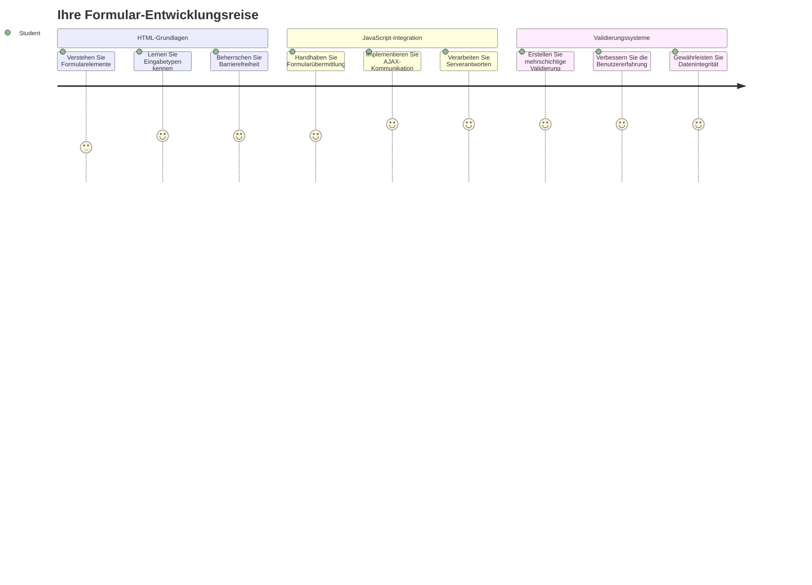
## Quiz vor der Vorlesung

[Quiz vor der Vorlesung](https://ff-quizzes.netlify.app/web/quiz/43)

Hast du schon mal online ein Formular ausgefüllt und hast dann eine Fehlermeldung zu deinem E-Mail-Format bekommen? Oder hast du nach dem Klicken auf „Absenden“ alle deine Informationen verloren? Wir alle kennen diese frustrierenden Erfahrungen.

Formulare sind die Brücke zwischen deinen Nutzern und der Funktionalität deiner Anwendung. Wie die sorgfältigen Protokolle, die Fluglotsen verwenden, um Flugzeuge sicher zu ihren Zielen zu lotsen, geben gut gestaltete Formulare klares Feedback und verhindern teure Fehler. Schlechte Formulare hingegen vertreiben Nutzer schneller als eine Fehlkommunikation auf einem vollen Flughafen.

In dieser Lektion verwandeln wir deine statische Banking-App in eine interaktive Anwendung. Du lernst, Formulare zu bauen, die Nutzereingaben validieren, mit Servern kommunizieren und hilfreiches Feedback geben. Stell es dir vor wie die Steuerungsoberfläche, die es Nutzern ermöglicht, die Funktionen deiner Anwendung zu navigieren.

Am Ende hast du ein komplettes Login- und Registrierungssystem mit Validierung, das Nutzer eher zum Erfolg als zur Frustration führt.

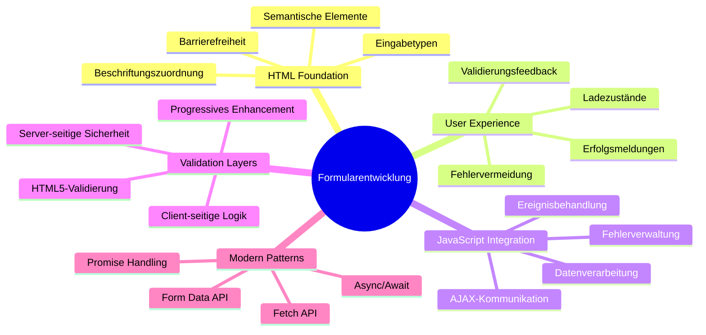
## Voraussetzungen

Bevor wir mit dem Erstellen von Formularen beginnen, lass uns sicherstellen, dass alles korrekt eingerichtet ist. Diese Lektion baut direkt auf der vorherigen auf, also falls du vorausgesprungen bist, solltest du erst zurückgehen und die Grundlagen zum Laufen bringen.

### Erforderliche Einrichtung

| Komponente | Status | Beschreibung |
|-----------|--------|-------------|
| [HTML-Vorlagen](../1-template-route/README.md) | ✅ Erforderlich | Deine grundlegende Banking-App-Struktur |
| [Node.js](https://nodejs.org) | ✅ Erforderlich | JavaScript-Laufzeit für den Server |
| [Bank API Server](../api/README.md) | ✅ Erforderlich | Backend-Dienst zur Datenspeicherung |

> 💡 **Entwicklungstipp**: Du wirst zwei separate Server gleichzeitig laufen lassen – einen für deine Frontend-Banking-App und einen anderen für die Backend-API. Dieses Setup spiegelt reale Entwicklung wider, bei der Frontend- und Backend-Dienste unabhängig voneinander arbeiten.

### Server-Konfiguration

**Deine Entwicklungsumgebung wird enthalten:**
- **Frontend-Server**: Liefert deine Banking-App aus (typischerweise Port `3000`)
- **Backend-API-Server**: Verarbeitet Datenablage und Abfragen (Port `5000`)
- **Beide Server** können gleichzeitig ohne Konflikte laufen

**Teste deine API-Verbindung:**
```bash
curl http://localhost:5000/api
# Erwartete Antwort: "Bank API v1.0.0"
```

**Wenn du die API-Version als Antwort siehst, bist du bereit weiterzumachen!**

---

## Verständnis von HTML-Formularen und Steuerelementen

HTML-Formulare sind wie Nutzer mit deiner Webanwendung kommunizieren. Stell sie dir wie das Telegrafensystem vor, das im 19. Jahrhundert entfernte Orte verband – es ist das Kommunikationsprotokoll zwischen Nutzerabsicht und Anwendungsreaktion. Wenn sie durchdacht gestaltet sind, erkennen sie Fehler, leiten die Eingabeformatierung und geben hilfreiche Vorschläge.

Moderne Formulare sind deutlich ausgefeilter als einfache Texteingabefelder. HTML5 hat spezialisierte Eingabetypen eingeführt, die automatisch E-Mail-Validierung, Zahlenformatierung und Datumsauswahl übernehmen. Diese Verbesserungen kommen sowohl der Barrierefreiheit als auch der mobilen Nutzung zugute.

### Wesentliche Formularelemente

**Bausteine, die jedes Formular braucht:**

```html
<!-- Basic form structure -->
<form id="userForm" method="POST">
  <label for="username">Username</label>
  <input id="username" name="username" type="text" required>
  
  <button type="submit">Submit</button>
</form>
```

**Das macht der Code:**
- **Erstellt** einen Formularcontainer mit einer eindeutigen Kennung
- **Legt** die HTTP-Methode für das Senden der Daten fest
- **Verknüpft** Beschriftungen (Labels) mit Eingabefeldern für Barrierefreiheit
- **Definiert** einen Absende-Button zur Formularverarbeitung

### Moderne Eingabetypen und Attribute

| Eingabetyp | Zweck | Beispiel |
|------------|---------|-------------|
| `text` | Allgemeine Texteingabe | `<input type="text" name="username">` |
| `email` | E-Mail-Validierung | `<input type="email" name="email">` |
| `password` | Verdeckte Texteingabe | `<input type="password" name="password">` |
| `number` | Numerische Eingabe | `<input type="number" name="balance" min="0">` |
| `tel` | Telefonnummern | `<input type="tel" name="phone">` |

> 💡 **Vorteil moderner HTML5-Formulare**: Das Verwenden spezifischer Eingabetypen bietet automatische Validierung, passende mobile Tastaturen und bessere Barrierefreiheit ohne zusätzliches JavaScript!

### Button-Typen und Verhalten

```html
<!-- Different button behaviors -->
<button type="submit">Save Data</button>     <!-- Submits the form -->
<button type="reset">Clear Form</button>    <!-- Resets all fields -->
<button type="button">Custom Action</button> <!-- No default behavior -->
```

**Das bewirkt jeder Button-Typ:**
- **Absende-Buttons**: Lösen das Abschicken des Formulars aus und senden Daten an den angegebenen Endpunkt
- **Zurücksetz-Buttons**: Setzen alle Formularfelder in ihren Anfangszustand zurück
- **Normale Buttons**: Haben kein Standardverhalten und benötigen JavaScript zur Funktionalität

> ⚠️ **Wichtiger Hinweis**: Das `<input>`-Element ist selbstschließend und benötigt keinen Schließ-Tag. Best Practice ist das Schreiben von `<input>` ohne Schrägstrich.

### Aufbau deines Login-Formulars

Jetzt erstellen wir ein praktisches Login-Formular, das moderne HTML-Formularpraktiken zeigt. Wir beginnen mit einer Basisstruktur und verbessern diese schrittweise mit Barrierefreiheitsmerkmalen und Validierung.

```html
<template id="login">
  <h1>Bank App</h1>
  <section>
    <h2>Login</h2>
    <form id="loginForm" novalidate>
      <div class="form-group">
        <label for="username">Username</label>
        <input id="username" name="user" type="text" required 
               autocomplete="username" placeholder="Enter your username">
      </div>
      <button type="submit">Login</button>
    </form>
  </section>
</template>
```

**Was hier passiert:**
- **Strukturiert** das Formular mit semantischen HTML5-Elementen
- **Gruppiert** zusammengehörende Elemente in `div`-Containern mit aussagekräftigen Klassen
- **Verknüpft** Labels über `for` und `id` mit Eingabefeldern
- **Integriert** moderne Attribute wie `autocomplete` und `placeholder` für bessere Nutzererfahrung
- **Fügt** `novalidate` hinzu, um Validierung mit JavaScript statt Browser-Voreinstellungen durchzuführen

### Die Kraft richtiger Labels

**Warum Labels wichtig für moderne Webentwicklung sind:**

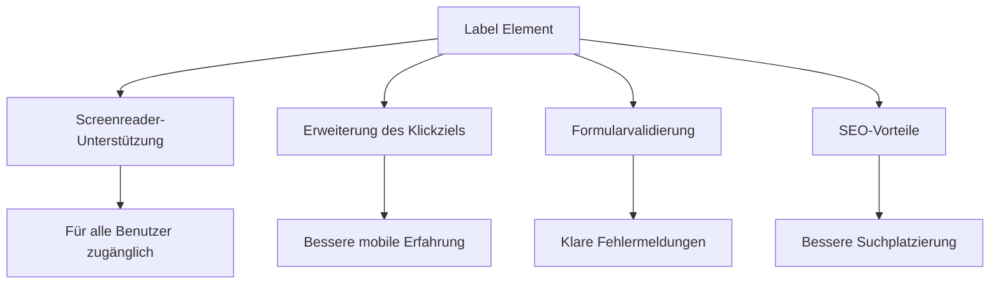
**Was korrekte Labels bewirken:**
- **Ermöglichen** Screenreadern, Formularfelder klar anzukündigen
- **Vergrößern** die klickbare Fläche (Klicken auf das Label fokussiert das Eingabefeld)
- **Verbessern** die mobile Bedienbarkeit mit größeren Touchzielen
- **Unterstützen** Formularvalidierung mit aussagekräftigen Fehlermeldungen
- **Steigern** SEO durch semantische Bedeutung der Formularelemente

> 🎯 **Barrierefreiheitsziel**: Jedes Formulareingabefeld sollte ein zugehöriges Label haben. Diese einfache Praxis macht deine Formulare für alle nutzbar, auch für Menschen mit Behinderungen, und verbessert die Nutzererfahrung für alle.

### Erstellung des Registrierungsformulars

Das Registrierungsformular benötigt detailliertere Informationen, um ein vollständiges Benutzerkonto zu erstellen. Lass es uns mit modernen HTML5-Funktionen und verbesserter Barrierefreiheit aufbauen.

```html
<hr/>
<h2>Register</h2>
<form id="registerForm" novalidate>
  <div class="form-group">
    <label for="user">Username</label>
    <input id="user" name="user" type="text" required 
           autocomplete="username" placeholder="Choose a username">
  </div>
  
  <div class="form-group">
    <label for="currency">Currency</label>
    <input id="currency" name="currency" type="text" value="$" 
           required maxlength="3" placeholder="USD, EUR, etc.">
  </div>
  
  <div class="form-group">
    <label for="description">Account Description</label>
    <input id="description" name="description" type="text" 
           maxlength="100" placeholder="Personal savings, checking, etc.">
  </div>
  
  <div class="form-group">
    <label for="balance">Starting Balance</label>
    <input id="balance" name="balance" type="number" value="0" 
           min="0" step="0.01" placeholder="0.00">
  </div>
  
  <button type="submit">Create Account</button>
</form>
```

**Worum es hier geht:**
- **Organisiert** jedes Feld in Container-Divs zur besseren Gestaltung und Layout
- **Fügt** passende `autocomplete`-Attribute für Browser-Autofill-Unterstützung hinzu
- **Enthält** hilfreiche Platzhaltertexte zur Nutzeranleitung
- **Setzt** sinnvolle Standardwerte mit dem `value`-Attribut
- **Wendet** Validierungsattribute wie `required`, `maxlength` und `min` an
- **Verwendet** `type="number"` für das Guthabenfeld mit Dezimalunterstützung

### Eingabetypen und Verhalten erkunden

**Moderne Eingabetypen bieten erweiterte Funktionen:**

| Merkmal | Vorteil | Beispiel |
|---------|---------|----------|
| `type="number"` | Numerische Tastatur auf Mobilgeräten | Einfachere Eintragung des Guthabens |
| `step="0.01"` | Dezimalstellenkontrolle | Ermöglicht Cents bei Währungen |
| `autocomplete` | Browser-Autofill | Schnellere Formularausfüllung |
| `placeholder` | Kontextuelle Hinweise | Leitet Nutzererwartungen |

> 🎯 **Barrierefreiheits-Herausforderung**: Versuche, die Formulare nur mit der Tastatur zu bedienen! Benutze `Tab`, um zwischen Feldern zu wechseln, `Leertaste` zum Auswählen von Checkboxen und `Enter`, um abzusenden. Diese Erfahrung hilft dir zu verstehen, wie Screenreader-Nutzer deine Formulare bedienen.

### 🔄 **Pädagogisches Check-in**
**Grundlagenverständnis für Formulare**: Bevor du JavaScript implementierst, solltest du folgendes verstehen:
- ✅ Wie semantisches HTML zugängliche Formularstrukturen erzeugt
- ✅ Warum Eingabetypen für mobile Tastaturen und Validierung wichtig sind
- ✅ Die Beziehung zwischen Labels und Formularsteuerelementen
- ✅ Wie Formulareigenschaften das Standardverhalten des Browsers beeinflussen

**Schnell-Selbsttest**: Was passiert, wenn du ein Formular ohne JavaScript absendest?
*Antwort: Der Browser führt die Standardübergabe aus, meistens mit Weiterleitung zur Action-URL*

**Vorteile von HTML5-Formularen**: Moderne Formulare bieten:
- **Eingebaute Validierung**: Automatische Prüfung von E-Mail- und Zahlenformaten
- **Mobile Optimierung**: Passende Tastaturen für unterschiedliche Eingabetypen
- **Barrierefreiheit**: Unterstützung von Screenreadern und Tastaturnavigation
- **Progressive Verbesserung**: Funktioniert auch ohne JavaScript

## Verständnis von Formularübertragungsmethoden

Wenn jemand dein Formular ausfüllt und auf Absenden klickt, müssen diese Daten wohin – meist auf einen Server, der sie speichern kann. Es gibt verschiedene Wege, wie das passiert, und die Wahl des richtigen spart dir später Kopfschmerzen.

Schauen wir, was passiert, wenn jemand den Absende-Button klickt.

### Standardverhalten von Formularen

Schauen wir uns an, was bei der einfachen Formularübergabe passiert:

**Teste deine aktuellen Formulare:**
1. Klicke den *Registrieren*-Button in deinem Formular
2. Beobachte die Veränderungen in der Adresszeile deines Browsers
3. Sieh, wie die Seite neu lädt und Daten in der URL erscheinen


### Vergleich der HTTP-Methoden

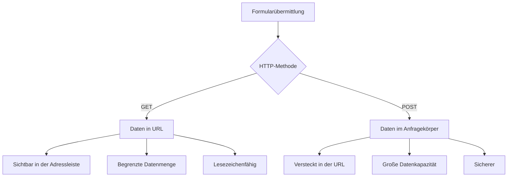
**Verstehen der Unterschiede:**

| Methode | Anwendungsfall | Datenort | Sicherheitsniveau | Größenlimit |
|--------|----------|---------------|----------------|-------------|
| `GET` | Suchanfragen, Filter | URL-Parameter | Niedrig (sichtbar) | ~2000 Zeichen |
| `POST` | Benutzerkonten, sensible Daten | Anfrage-Körper | Höher (versteckt) | Kein praktisches Limit |

**Grundlegende Unterschiede:**
- **GET**: Hängt Formulardaten als Query-Parameter an die URL an (geeignet für Suchvorgänge)
- **POST**: Sendet Daten im Anfrage-Körper (wichtig für sensible Infos)
- **GET-Einschränkungen**: Größenlimit, sichtbare Daten, Browser-Verlauf speichert Daten
- **POST-Vorteile**: Große Datenmengen, Datenschutz, unterstützt Datei-Uploads

> 💡 **Best Practice**: Verwende `GET` für Suchformulare und Filter (Datenabfrage), `POST` für Benutzerregistrierung, Login und Datenerstellung.

### Formularübertragung konfigurieren

Konfigurieren wir dein Registrierungsformular, um mit der Backend-API sicher per POST zu kommunizieren:

```html
<form id="registerForm" action="//localhost:5000/api/accounts" 
      method="POST" novalidate>
```

**Das bewirkt diese Konfiguration:**
- **Leitet** das Abschicken des Formulars an deinen API-Endpunkt weiter
- **Verwendet** die POST-Methode für sichere Datenübertragung
- **Enthält** `novalidate`, um Validierung per JavaScript zu realisieren

### Test der Formularübertragung

**So testest du dein Formular:**
1. **Fülle** das Registrierungsformular mit deinen Daten aus
2. **Klicke** den Button „Konto erstellen“
3. **Beobachte** die Antwort des Servers in deinem Browser

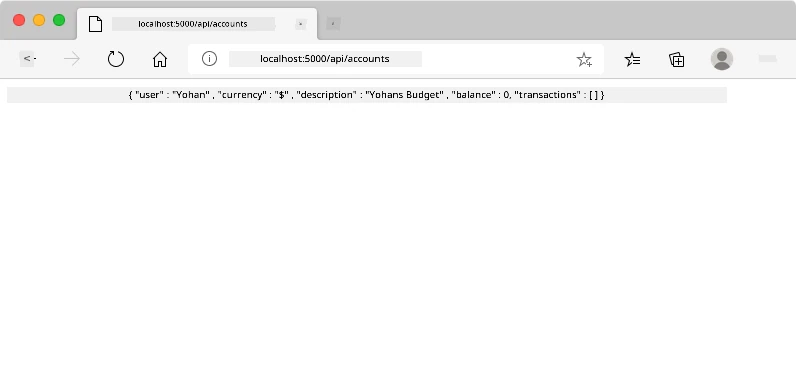

**Das solltest du sehen:**
- **Browser leitet** zur API-Endpunkt-URL weiter
- **JSON-Antwort** mit den neu erstellten Kontodaten
- **Server-Bestätigung**, dass das Konto erfolgreich angelegt wurde

> 🧪 **Experimentierzeit**: Versuche, dich mit demselben Benutzernamen erneut zu registrieren. Welche Antwort bekommst du? Das hilft dir zu verstehen, wie der Server mit doppelten Daten und Fehlerfällen umgeht.

### Verständnis von JSON-Antworten

**Wenn der Server dein Formular erfolgreich verarbeitet hat:**
```json
{
  "user": "john_doe",
  "currency": "$",
  "description": "Personal savings",
  "balance": 100,
  "id": "unique_account_id"
}
```

**Diese Antwort bestätigt:**
- **Legt** ein neues Konto mit deinen Daten an
- **Vergibt** eine eindeutige Kennung für weitere Referenzen
- **Gibt** alle Kontoinformationen zur Überprüfung zurück
- **Zeigt** erfolgreiche Speicherung in der Datenbank an

## Moderne Formularbehandlung mit JavaScript

Traditionelle Formularübertragungen verursachen das vollständige Neuladen der Seite, ähnlich wie frühe Weltraummissionen komplette Systemneustarts bei Kurskorrekturen benötigten. Dieses Vorgehen unterbricht die Nutzererfahrung und verliert den Anwendungszustand.

JavaScript-Formularbehandlung funktioniert wie moderne Raumfahrtsysteme mit kontinuierlicher Steuerung – es nimmt Echtzeit-Anpassungen ohne Verlust des Navigationskontexts vor. Wir können Formularübertragungen abfangen, unmittelbares Feedback geben, Fehler elegant behandeln und die Oberfläche anhand von Serverantworten aktualisieren, während der Nutzer in der Anwendung bleibt.

### Warum Seiten-Neuladen vermeiden?

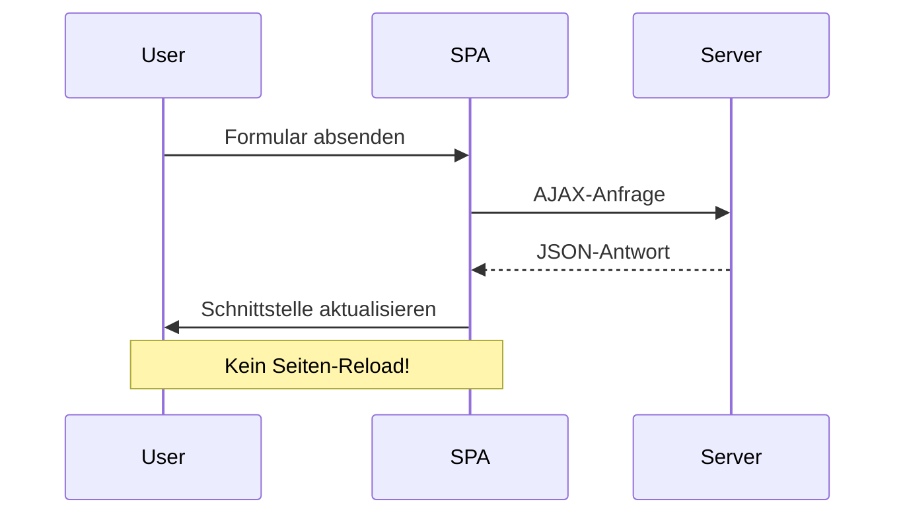
**Vorteile der JavaScript-Formularbehandlung:**
- **Erhält** Anwendungszustand und Nutzerkontext
- **Bietet** sofortiges Feedback und Ladeindikatoren
- **Ermöglicht** dynamische Fehlerbehandlung und Validierung
- **Schafft** flüssige, app-ähnliche Nutzererlebnisse
- **Erlaubt** bedingte Logik basierend auf Serverantworten

### Übergang von tradierten zu modernen Formularen

**Herausforderungen traditioneller Methode:**
- **Leitet** Nutzer aus der Anwendung weg
- **Verliert** aktuellen Anwendungszustand und Kontext
- **Erfordert** komplettes Neuladen für einfache Aktionen
- **Bietet** begrenzte Kontrolle über Nutzerfeedback

**Vorteile moderner JavaScript-Methode:**
- **Hält** Nutzer in deiner Anwendung
- **Erhält** alle Zustände und Daten
- **Ermöglicht** Echtzeit-Validierung und Feedback
- **Unterstützt** progressive Verbesserung und Barrierefreiheit

### JavaScript Formularbehandlung implementieren

Ersetzen wir die traditionelle Formularübergabe durch modernes JavaScript-Event-Handling:

```html
<!-- Remove the action attribute and add event handling -->
<form id="registerForm" method="POST" novalidate>
```

**Füge die Registrierungslogik der Datei `app.js` hinzu:**

```javascript
// Moderne ereignisgesteuerte Formularverarbeitung
function register() {
  const registerForm = document.getElementById('registerForm');
  const formData = new FormData(registerForm);
  const data = Object.fromEntries(formData);
  const jsonData = JSON.stringify(data);
  
  console.log('Form data prepared:', data);
}

// Ereignislistener beim Laden der Seite anhängen
document.addEventListener('DOMContentLoaded', () => {
  const registerForm = document.getElementById('registerForm');
  registerForm.addEventListener('submit', (event) => {
    event.preventDefault(); // Standardmäßige Formularübermittlung verhindern
    register();
  });
});
```

**Was hier passiert:**
- **Verhindert** die Standardformularübergabe mit `event.preventDefault()`
- **Holt** das Formular-Element mittels moderner DOM-Auswahl
- **Extrahiert** Formulardaten mit der mächtigen `FormData`-API
- **Konvertiert** FormData in ein einfaches Objekt mit `Object.fromEntries()`
- **Serialisiert** die Daten in JSON-Format für die Serverkommunikation
- **Protokolliert** die verarbeiteten Daten zu Debugging und Prüfung

### Verständnis der FormData-API

**Die FormData-API ermöglicht mächtige Formularverarbeitung:**
```javascript
// Beispiel dafür, was FormData erfasst
const formData = new FormData(registerForm);

// FormData erfasst automatisch:
// {
//   "user": "john_doe",
//   "currency": "$",
//   "description": "Privates Konto",
//   "balance": "100"
// }
```

**Vorteile der FormData-API:**
- **Umfassende Sammlung**: Erfasst alle Formularelemente einschließlich Text, Dateien und komplexen Eingaben
- **Typbewusstsein**: Verarbeitet verschiedene Eingabetypen automatisch ohne benutzerdefinierten Code
- **Effizienz**: Erspart manuelle Feldsammlung durch einzigen API-Aufruf
- **Anpassungsfähigkeit**: Funktionalität bleibt erhalten, wenn sich die Formularstruktur ändert

### Erstellen der Server-Kommunikationsfunktion

Jetzt bauen wir eine robuste Funktion, um mit deinem API-Server unter Verwendung moderner JavaScript-Muster zu kommunizieren:

```javascript
async function createAccount(account) {
  try {
    const response = await fetch('//localhost:5000/api/accounts', {
      method: 'POST',
      headers: { 
        'Content-Type': 'application/json',
        'Accept': 'application/json'
      },
      body: account
    });
    
    // Überprüfen, ob die Antwort erfolgreich war
    if (!response.ok) {
      throw new Error(`HTTP error! status: ${response.status}`);
    }
    
    return await response.json();
  } catch (error) {
    console.error('Account creation failed:', error);
    return { error: error.message || 'Network error occurred' };
  }
}
```

**Verständnis asynchrones JavaScript:**

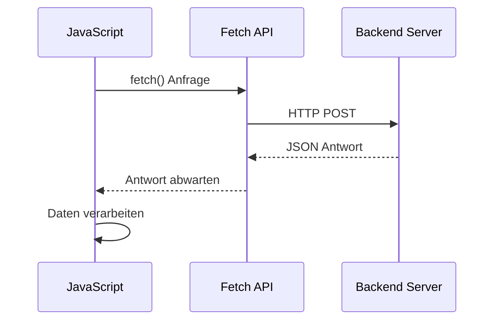
**Was diese moderne Implementierung erreicht:**
- **Verwendet** `async/await` für gut lesbaren asynchronen Code
- **Beinhaltet** eine ordnungsgemäße Fehlerbehandlung mit try/catch-Blöcken
- **Prüft** den Antwortstatus vor der Verarbeitung der Daten
- **Setzt** passende Header für die JSON-Kommunikation
- **Bietet** detaillierte Fehlermeldungen zur Fehlerbehebung
- **Gibt zurück** konsistente Datenstruktur für Erfolgs- und Fehlerfälle

### Die Kraft der modernen Fetch API

**Vorteile der Fetch API gegenüber älteren Methoden:**

| Funktion | Vorteil | Implementierung |
|---------|---------|----------------|
| Promise-basiert | Sauberer asynchroner Code | `await fetch()` |
| Anfrageanpassung | Volle HTTP-Kontrolle | Header, Methoden, Body |
| Antwortverarbeitung | Flexible Datenparsing | `.json()`, `.text()`, `.blob()` |
| Fehlerbehandlung | Umfassendes Fehlerfangen | Try/catch-Blöcke |

> 🎥 **Mehr erfahren**: [Async/Await Tutorial](https://youtube.com/watch?v=YwmlRkrxvkk) – Verständnis asynchroner JavaScript-Muster für moderne Webentwicklung.

**Schlüsselkonzepte für Serverkommunikation:**
- **Async-Funktionen** erlauben Pausieren der Ausführung, um auf Serverantworten zu warten
- **Await-Schlüsselwort** lässt asynchronen Code wie synchronen Code lesen
- **Fetch API** bietet moderne, Promise-basierte HTTP-Anfragen
- **Fehlerbehandlung** sorgt dafür, dass deine App bei Netzwerkproblemen elegant reagiert

### Ergänzung der Registrierungsfunktion

Fassen wir alles in einer vollständigen, produktionsreifen Registrierungsfunktion zusammen:

```javascript
async function register() {
  const registerForm = document.getElementById('registerForm');
  const submitButton = registerForm.querySelector('button[type="submit"]');
  
  try {
    // Ladevorgang anzeigen
    submitButton.disabled = true;
    submitButton.textContent = 'Creating Account...';
    
    // Formulardaten verarbeiten
    const formData = new FormData(registerForm);
    const jsonData = JSON.stringify(Object.fromEntries(formData));
    
    // An den Server senden
    const result = await createAccount(jsonData);
    
    if (result.error) {
      console.error('Registration failed:', result.error);
      alert(`Registration failed: ${result.error}`);
      return;
    }
    
    console.log('Account created successfully!', result);
    alert(`Welcome, ${result.user}! Your account has been created.`);
    
    // Formular nach erfolgreicher Registrierung zurücksetzen
    registerForm.reset();
    
  } catch (error) {
    console.error('Unexpected error:', error);
    alert('An unexpected error occurred. Please try again.');
  } finally {
    // Schaltflächenzustand wiederherstellen
    submitButton.disabled = false;
    submitButton.textContent = 'Create Account';
  }
}
```

**Diese erweiterte Implementierung beinhaltet:**
- **Bietet** visuelles Feedback während der Formularübermittlung
- **Deaktiviert** den Absende-Button, um doppelte Einsendungen zu verhindern
- **Behandelt** erwartete und unerwartete Fehler elegant
- **Zeigt** benutzerfreundliche Erfolg- und Fehlermeldungen an
- **Setzt** das Formular nach erfolgreicher Registrierung zurück
- **Stellt** den UI-Zustand unabhängig vom Ergebnis wieder her

### Testen deiner Implementierung

**Öffne die Entwickler-Tools deines Browsers und teste die Registrierung:**

1. **Öffne** die Browser-Konsole (F12 → Konsole-Tab)
2. **Fülle** das Registrierungsformular aus
3. **Klicke** auf "Account erstellen"
4. **Beobachte** die Konsolenmeldungen und das Nutzerfeedback

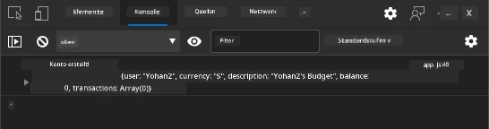

**Das solltest du sehen:**
- **Ladezustand** erscheint auf dem Absende-Button
- **Konsolenlogs** zeigen detaillierte Prozessinformationen
- **Erfolgsmeldung** erscheint bei erfolgreicher Kontoerstellung
- **Formular wird zurückgesetzt** nach erfolgreicher Einsendung

> 🔒 **Sicherheits-Hinweis**: Zurzeit werden Daten über HTTP übertragen, was für den Produktiveinsatz nicht sicher ist. In echten Anwendungen immer HTTPS nutzen, um die Datenübertragung zu verschlüsseln. Erfahre mehr über [HTTPS-Sicherheit](https://de.wikipedia.org/wiki/HTTPS) und warum es für den Schutz von Benutzerdaten entscheidend ist.

### 🔄 **Pädagogische Kontrolle**
**Moderne JavaScript-Integration**: Überprüfe dein Verständnis zur asynchronen Formularverarbeitung:
- ✅ Wie ändert `event.preventDefault()` das Standardverhalten des Formulars?
- ✅ Warum ist die FormData-API effizienter als die manuelle Feldsammlung?
- ✅ Wie verbessern async/await-Muster die Lesbarkeit des Codes?
- ✅ Welche Rolle spielt die Fehlerbehandlung für die Nutzererfahrung?

**Systemarchitektur**: Deine Formularverarbeitung zeigt:
- **Event-gesteuerte Programmierung**: Formulare reagieren auf Benutzeraktionen ohne Seiten-Neuladen
- **Asynchrone Kommunikation**: Serveranfragen blockieren die Benutzeroberfläche nicht
- **Fehlerbehandlung**: Elegante Behandlung bei Netzwerkfehlern
- **Zustandsmanagement**: UI-Aktualisierungen spiegeln Serverantworten korrekt wider
- **Progressive Verbesserung**: Basisfunktionalität funktioniert, JavaScript erweitert sie

**Professionelle Muster**: Du hast umgesetzt:
- **Single Responsibility**: Funktionen haben klare, fokussierte Aufgaben
- **Fehlergrenzen**: Try/catch-Blöcke verhindern App-Abstürze
- **Nutzer-Feedback**: Ladezustände sowie Erfolg-/Fehlermeldungen
- **Datenumwandlung**: FormData zu JSON für Serverkommunikation

## Umfassende Formularvalidierung

Formularvalidierung verhindert die frustrierende Erfahrung, Fehler erst nach dem Absenden zu entdecken. Wie die mehrfach redundanten Systeme auf der Internationalen Raumstation verwendet gute Validierung mehrere Sicherheitsschichten.

Der optimale Ansatz kombiniert Browser-eigene Validierung für sofortiges Feedback, JavaScript-Validierung für verbesserte Nutzererfahrung sowie serverseitige Validierung für Sicherheit und Datenintegrität. Diese Redundanz sichert sowohl Nutzerzufriedenheit als auch Systemschutz.

### Verständnis von Validierungsschichten

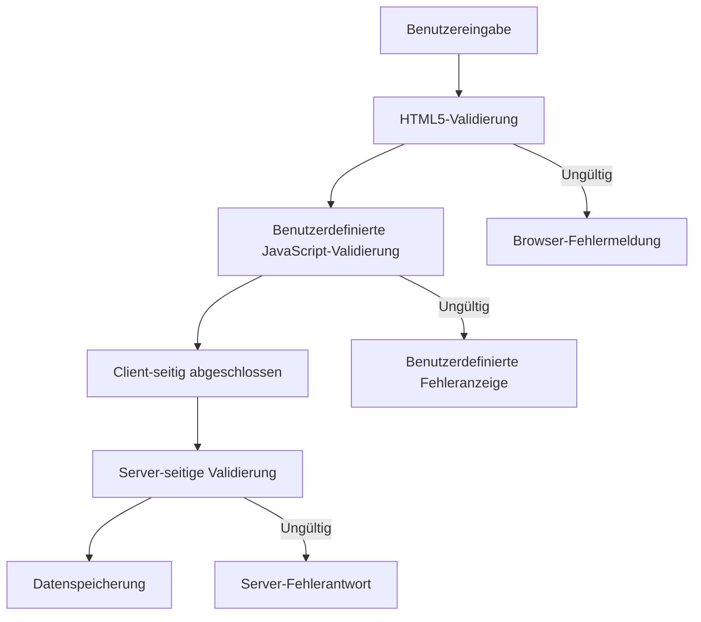
**Mehrschichtige Validierungsstrategie:**
- **HTML5-Validierung**: Sofortige browserbasierte Prüfungen
- **JavaScript-Validierung**: Eigene Logik und Nutzererlebnis
- **Servervalidierung**: Letzte Sicherheits- und Datenintegritätsprüfungen
- **Progressive Verbesserung**: Funktioniert auch, wenn JavaScript deaktiviert ist

### HTML5-Validierungsattribute

**Moderne Validierungswerkzeuge zur Verfügung:**

| Attribut | Zweck | Beispielanwendung | Browser-Verhalten |
|-----------|---------|---------------|------------------|
| `required` | Pflichtfelder | `<input required>` | Verhindert Leerabsendung |
| `minlength`/`maxlength` | Textlängenbegrenzungen | `<input maxlength="20">` | Erzwingt Zeichenbegrenzungen |
| `min`/`max` | Numerische Bereiche | `<input min="0" max="1000">` | Validiert Zahlenbereiche |
| `pattern` | Eigene Regex-Regeln | `<input pattern="[A-Za-z]+">` | Passt bestimmte Formate an |
| `type` | Datentypvalidierung | `<input type="email">` | Formatspezifische Prüfung |

### CSS-Validierungs-Styling

**Erzeuge visuelles Feedback zu Validierungszuständen:**

```css
/* Valid input styling */
input:valid {
  border-color: #28a745;
  background-color: #f8fff9;
}

/* Invalid input styling */
input:invalid {
  border-color: #dc3545;
  background-color: #fff5f5;
}

/* Focus states for better accessibility */
input:focus:valid {
  box-shadow: 0 0 0 0.2rem rgba(40, 167, 69, 0.25);
}

input:focus:invalid {
  box-shadow: 0 0 0 0.2rem rgba(220, 53, 69, 0.25);
}
```

**Was diese visuellen Hinweise bewirken:**
- **Grüne Rahmen**: Signalisieren erfolgreiche Validierung, wie grüne Lichter in der Missionskontrolle
- **Rote Rahmen**: Signalisieren Validierungsfehler, die Aufmerksamkeit erfordern
- **Fokus-Hervorhebungen**: Bieten klare visuelle Hinweise zum aktuellen Eingabefeld
- **Konsistentes Styling**: Schafft vorhersehbare Interface-Muster für Nutzer

> 💡 **Profi-Tipp**: Nutze die CSS-Pseudoklassen `:valid` und `:invalid`, um sofortiges visuelles Feedback beim Tippen zu geben und so eine reaktionsschnelle und hilfreiche Oberfläche zu schaffen.

### Implementierung umfassender Validierung

Verbessern wir dein Registrierungsformular mit robuster Validierung, die hervorragende Nutzererfahrung und Datenqualität liefert:

```html
<form id="registerForm" method="POST" novalidate>
  <div class="form-group">
    <label for="user">Username <span class="required">*</span></label>
    <input id="user" name="user" type="text" required 
           minlength="3" maxlength="20" 
           pattern="[a-zA-Z0-9_]+" 
           autocomplete="username"
           title="Username must be 3-20 characters, letters, numbers, and underscores only">
    <small class="form-text">Choose a unique username (3-20 characters)</small>
  </div>
  
  <div class="form-group">
    <label for="currency">Currency <span class="required">*</span></label>
    <input id="currency" name="currency" type="text" required 
           value="$" maxlength="3" 
           pattern="[A-Z$€£¥₹]+" 
           title="Enter a valid currency symbol or code">
    <small class="form-text">Currency symbol (e.g., $, €, £)</small>
  </div>
  
  <div class="form-group">
    <label for="description">Account Description</label>
    <input id="description" name="description" type="text" 
           maxlength="100" 
           placeholder="Personal savings, checking, etc.">
    <small class="form-text">Optional description (up to 100 characters)</small>
  </div>
  
  <div class="form-group">
    <label for="balance">Starting Balance</label>
    <input id="balance" name="balance" type="number" 
           value="0" min="0" step="0.01" 
           title="Enter a positive number for your starting balance">
    <small class="form-text">Initial account balance (minimum $0.00)</small>
  </div>
  
  <button type="submit">Create Account</button>
</form>
```

**Verständnis der erweiterten Validierung:**
- **Kombiniert** Pflichtfeld-Indikatoren mit hilfreichen Beschreibungen
- **Beinhaltet** `pattern`-Attribute für Formatvalidierung
- **Bietet** `title`-Attribute für Barrierefreiheit und Tooltipps
- **Fügt** Hilfstexte zur Benutzereingabe hinzu
- **Verwendet** semantische HTML-Struktur für bessere Zugänglichkeit

### Erweiterte Validierungsregeln

**Was jede Validierungsregel bewirkt:**

| Feld | Validierungsregeln | Nutzer profitieren von |
|-------|------------------|--------------|
| Benutzername | `required`, `minlength="3"`, `maxlength="20"`, `pattern="[a-zA-Z0-9_]+"` | Gültige, eindeutige Bezeichner |
| Währung | `required`, `maxlength="3"`, `pattern="[A-Z$€£¥₹]+"` | Akzeptiert gängige Währungssymbole |
| Guthaben | `min="0"`, `step="0.01"`, `type="number"` | Verhindert negative Guthaben |
| Beschreibung | `maxlength="100"` | Angemessene Längenbegrenzung |

### Validierungsverhalten testen

**Teste diese Validierungsszenarien:**
1. **Absenden** mit leeren Pflichtfeldern
2. **Benutze** Benutzernamen mit weniger als 3 Zeichen
3. **Probiere** Sonderzeichen im Benutzername-Feld
4. **Gib** eine negative Guthaben-Summe ein

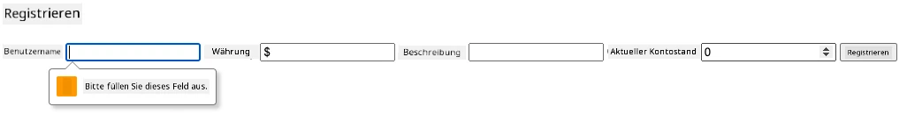

**Das wirst du beobachten:**
- **Browser zeigt** native Validierungsnachrichten an
- **Styling ändert sich** basierend auf `:valid` und `:invalid` Zuständen
- **Formularabsendung wird verhindert**, bis alle Validierungen bestehen
- **Fokus springt automatisch** zum ersten ungültigen Feld

### Client-seitige vs. Server-seitige Validierung

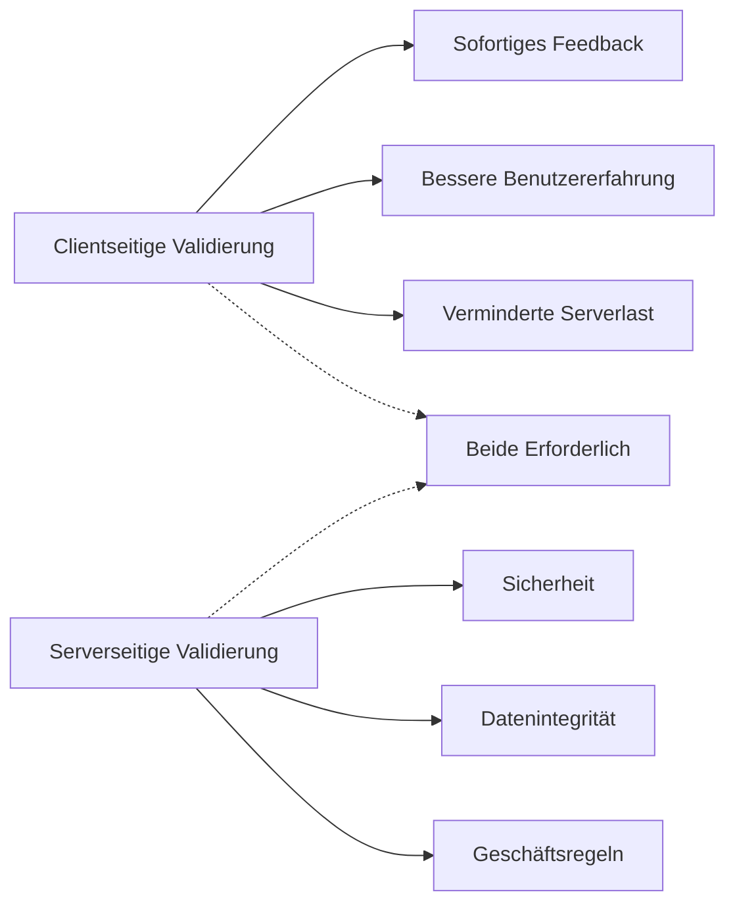
**Warum du beide Schichten brauchst:**
- **Client-seitige Validierung**: Sofortiges Feedback und verbesserte Nutzererfahrung
- **Server-seitige Validierung**: Gewährleistet Sicherheit und verarbeitet komplexe Geschäftsregeln
- **Kombinierter Ansatz**: Schafft robuste, nutzerfreundliche und sichere Anwendungen
- **Progressive Verbesserung**: Funktioniert auch ohne JavaScript

> 🛡️ **Sicherheits-Erinnerung**: Vertrau niemals nur auf client-seitige Validierung! Bösartige Nutzer können Client-Checks umgehen, daher ist server-seitige Validierung essentiell für Sicherheit und Datenintegrität.

### ⚡ **Was du in den nächsten 5 Minuten machen kannst**
- [ ] Teste dein Formular mit ungültigen Daten, um Validierungsnachrichten zu sehen
- [ ] Versuche, das Formular mit deaktiviertem JavaScript abzusenden, um HTML5-Validierung zu erleben
- [ ] Öffne die DevTools und untersuche die an den Server gesendeten Formulardaten
- [ ] Experimentiere mit verschiedenen Eingabetypen, um mobile Tastaturänderungen zu beobachten

### 🎯 **Was du in dieser Stunde erreichen kannst**
- [ ] Beende das Post-Lektion-Quiz und verstehe die Formulare-Verarbeitungskonzepte
- [ ] Implementiere die umfassende Validierungsaufgabe mit Echtzeit-Feedback
- [ ] Füge CSS-Styling hinzu, um professionelle Formulare zu gestalten
- [ ] Erstelle Fehlerbehandlung für doppelte Benutzernamen und Serverfehler
- [ ] Füge Passwort-Bestätigungsfelder mit passender Validierung hinzu

### 📅 **Deine einwöchige Formular-Meister-Reise**
- [ ] Schließe die vollständige Banking-App mit erweiterten Formularfunktionen ab
- [ ] Implementiere Datei-Upload für Profilbilder oder Dokumente
- [ ] Füge Mehrschritt-Formulare mit Fortschrittsanzeigen und Zustandsmanagement hinzu
- [ ] Erstelle dynamische Formulare, die sich basierend auf Benutzer-Auswahlen anpassen
- [ ] Realisiere Formular-Autosave und Wiederherstellung für bessere Nutzererfahrung
- [ ] Ergänze erweiterte Validierung wie E-Mail-Verifikation und Telefonnummernformatierung

### 🌟 **Deine einmonatige Frontend-Entwicklungs-Meisterschaft**
- [ ] Baue komplexe Formularanwendungen mit bedingter Logik und Workflows
- [ ] Lerne Formular-Bibliotheken und Frameworks für schnelle Entwicklung kennen
- [ ] Meistere Barrierefreiheitsrichtlinien und inklusive Designprinzipien
- [ ] Implementiere Internationalisierung und Lokalisierung für globale Formulare
- [ ] Erstelle wiederverwendbare Formular-Komponentenbibliotheken und Designsysteme
- [ ] Trage zu Open-Source-Formularprojekten bei und teile Best Practices

## 🎯 Dein Zeitplan zur Formular-Entwicklungsmeisterschaft

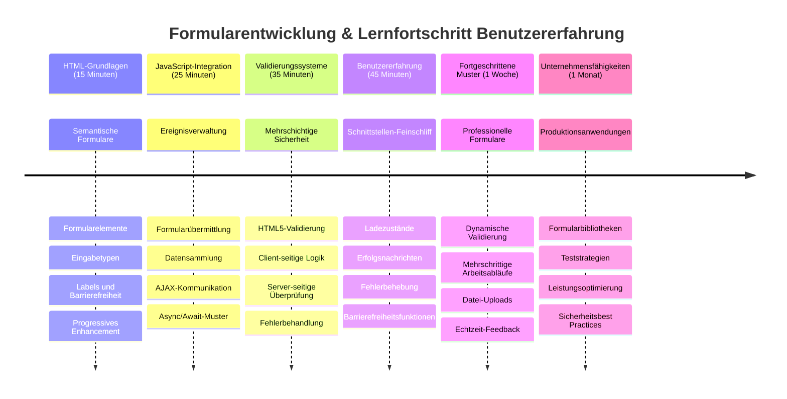
### 🛠️ Deine Zusammenfassung des Formular-Entwicklungstools

Nach Abschluss dieser Lektion hast du folgendes gemeistert:
- **HTML5-Formulare**: Semantische Struktur, Eingabetypen und Barrierefreiheitsmerkmale
- **JavaScript-Formularverarbeitung**: Ereignisverwaltung, Datensammlung und AJAX-Kommunikation
- **Validierungs-Architektur**: Mehrschichtige Validierung für Sicherheit und Nutzererlebnis
- **Asynchrone Programmierung**: Moderne Fetch API und async/await-Muster
- **Fehlermanagement**: Umfassende Fehlerbehandlung und Nutzerfeedback-Systeme
- **Nutzererlebnis-Design**: Ladezustände, Erfolgsmeldungen und Fehlerwiederherstellung
- **Progressive Verbesserung**: Formulare, die in allen Browsern und Umgebungen funktionieren

**Echte Anwendungen**: Deine Formulare-Entwicklungsfähigkeiten sind direkt anwendbar auf:
- **E-Commerce-Anwendungen**: Checkout-Prozesse, Konto-Registrierung und Zahlungsformulare
- **Enterprise-Software**: Dateneingabesysteme, Reporting-Oberflächen und Workflow-Anwendungen
- **Content-Management**: Veröffentlichungsplattformen, nutzergenerierte Inhalte und Admin-Oberflächen
- **Finanz-Anwendungen**: Banking-Interfaces, Investment-Plattformen und Transaktionssysteme
- **Gesundheitssysteme**: Patientenportale, Terminplanung und medizinische Formularen
- **Bildungsplattformen**: Kursregistrierung, Assessment-Tools und Lernmanagement

**Erworbene professionelle Fähigkeiten**: Du kannst nun:
- **Barrierefreie Formulare** entwerfen, die für alle Nutzer einschließlich Menschen mit Behinderungen funktionieren
- **Sichere Formularvalidierung** implementieren, die Datenkorruption und Sicherheitslücken verhindert
- **Responsives UI** schaffen, das klares Feedback und Anleitung bietet
- **Komplexe Formularinteraktionen debuggen** mit Browser-Entwicklerwerkzeugen und Netzwerkanalyse
- **Formularleistung optimieren** durch effiziente Datenbearbeitung und Validierungsstrategien

**Geübte Frontend-Entwicklungskonzepte**:
- **Ereignisgesteuerte Architektur**: Nutzerinteraktionsverwaltung und Reaktionssysteme
- **Asynchrone Programmierung**: Nicht-blockierende Serverkommunikation und Fehlerbehandlung
- **Datenvalidierung**: Client- und Server-seitige Sicherheits- und Integritätsprüfungen
- **Nutzererlebnis-Design**: Intuitive Oberflächen, die Nutzer zum Erfolg führen
- **Barrierefreiheits-Engineering**: Inklusives Design für vielfältige Nutzerbedürfnisse

**Nächste Stufe**: Du bist bereit, fortgeschrittene Formularbibliotheken zu erforschen, komplexe Validierungsregeln umzusetzen oder Enterprise-Datensammelsysteme zu bauen!

🌟 **Erfolg freigeschaltet**: Du hast ein vollständiges Formularverarbeitungssystem mit professioneller Validierung, Fehlerbehandlung und Nutzererlebnis-Mustern gebaut!

---


---

## GitHub Copilot Agent Challenge 🚀

Verwende den Agent-Modus, um die folgende Herausforderung zu meistern:

**Beschreibung:** Erweitere das Registrierungsformular mit umfassender client-seitiger Validierung und Benutzer-Feedback. Diese Herausforderung hilft dir, Formularvalidierung, Fehlerbehandlung und Verbesserung der Nutzererfahrung mit interaktivem Feedback zu üben.
**Eingabeaufforderung:** Erstellen Sie ein vollständiges Formularvalidierungssystem für das Registrierungsformular, das Folgendes umfasst: 1) Echtzeit-Validierungsfeedback für jedes Feld, während der Benutzer tippt, 2) Benutzerdefinierte Validierungsnachrichten, die unter jedem Eingabefeld angezeigt werden, 3) Ein Passwortbestätigungsfeld mit Übereinstimmungsvalidierung, 4) Visuelle Indikatoren (wie grüne Häkchen für gültige Felder und rote Warnungen für ungültige), 5) Einen Absenden-Button, der nur aktiviert wird, wenn alle Validierungen bestanden sind. Verwenden Sie HTML5-Validierungsattribute, CSS zum Stylen der Validierungszustände und JavaScript für das interaktive Verhalten.

Erfahren Sie mehr über den [Agent-Modus](https://code.visualstudio.com/blogs/2025/02/24/introducing-copilot-agent-mode) hier.

## 🚀 Herausforderung

Zeigen Sie eine Fehlermeldung im HTML an, wenn der Benutzer bereits existiert.

Hier ist ein Beispiel, wie die finale Anmeldeseite nach ein wenig Styling aussehen kann:

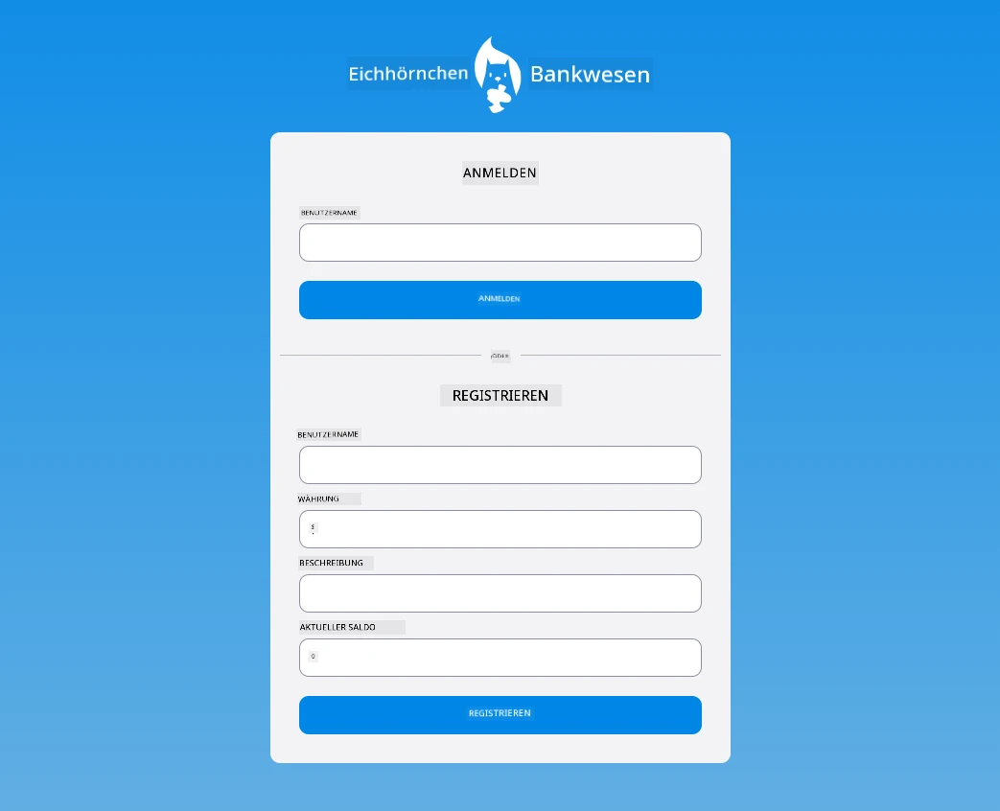

## Post-Vorlesungs-Quiz

[Post-Vorlesungs-Quiz](https://ff-quizzes.netlify.app/web/quiz/44)

## Rückblick & Selbststudium

Entwickler sind bei ihren Formular-Erstellungsbemühungen besonders in Bezug auf Validierungsstrategien sehr kreativ geworden. Erfahren Sie mehr über verschiedene Formularabläufe, indem Sie durch [CodePen](https://codepen.com) stöbern; können Sie einige interessante und inspirierende Formulare finden?

## Aufgabe

[Gestalten Sie Ihre Bank-App](assignment.md)

---

<!-- CO-OP TRANSLATOR DISCLAIMER START -->
**Haftungsausschluss**:  
Dieses Dokument wurde mit dem KI-Übersetzungsdienst [Co-op Translator](https://github.com/Azure/co-op-translator) übersetzt. Obwohl wir auf Genauigkeit achten, können automatisierte Übersetzungen Fehler oder Ungenauigkeiten enthalten. Das Originaldokument in seiner ursprünglichen Sprache ist als maßgebliche Quelle zu betrachten. Für wichtige Informationen wird eine professionelle menschliche Übersetzung empfohlen. Wir übernehmen keine Haftung für Missverständnisse oder Fehlinterpretationen, die durch die Verwendung dieser Übersetzung entstehen.
<!-- CO-OP TRANSLATOR DISCLAIMER END -->