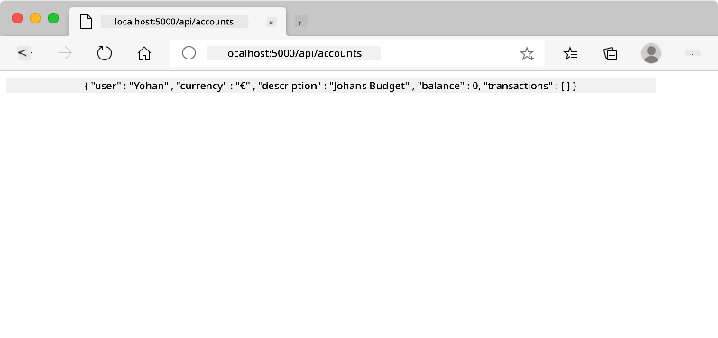
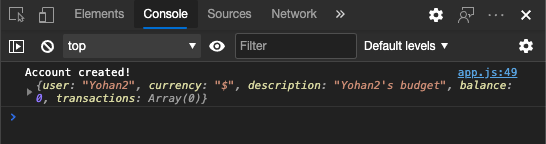
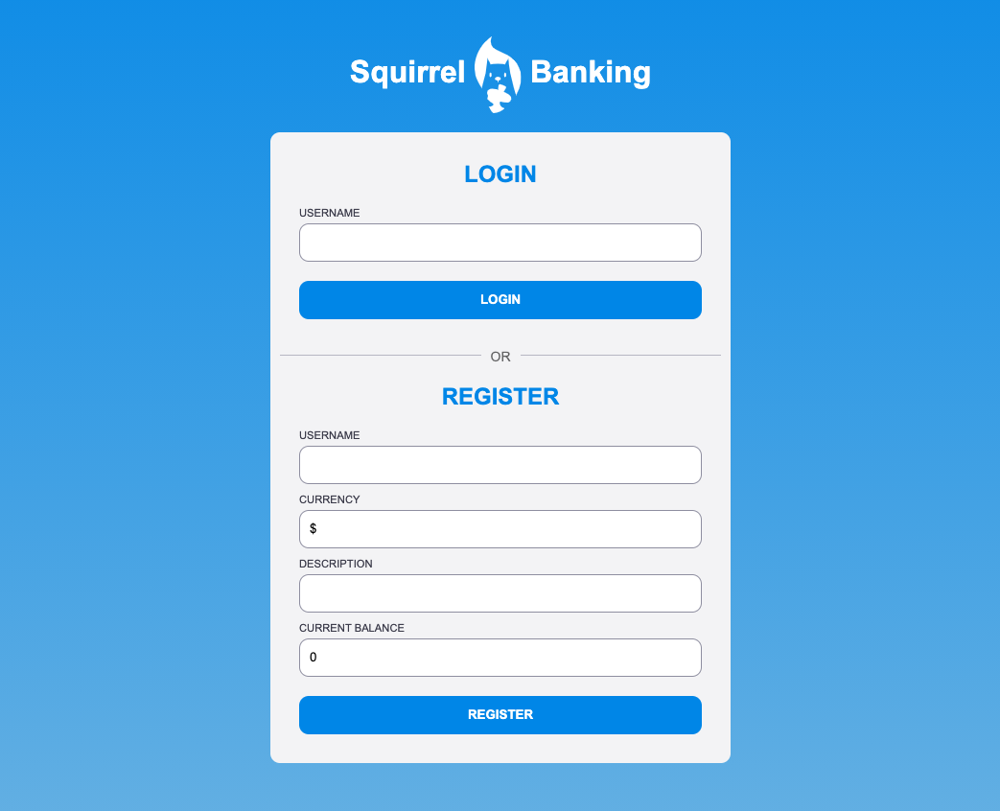

<!--
CO_OP_TRANSLATOR_METADATA:
{
  "original_hash": "8baca047d77a5f43fa4099c0578afa42",
  "translation_date": "2025-08-29T14:06:01+00:00",
  "source_file": "7-bank-project/2-forms/README.md",
  "language_code": "de"
}
-->
# Erstellen einer Banking-App Teil 2: Login- und Registrierungsformular erstellen

## Quiz vor der Vorlesung

[Quiz vor der Vorlesung](https://ff-quizzes.netlify.app/web/quiz/43)

### Einführung

In fast allen modernen Web-Apps können Sie ein Konto erstellen, um Ihren eigenen privaten Bereich zu haben. Da mehrere Benutzer gleichzeitig auf eine Web-App zugreifen können, benötigen Sie einen Mechanismus, um die persönlichen Daten jedes Benutzers separat zu speichern und auszuwählen, welche Informationen angezeigt werden sollen. Wir werden nicht behandeln, wie [Benutzeridentitäten sicher verwaltet](https://en.wikipedia.org/wiki/Authentication) werden, da dies ein umfangreiches Thema für sich ist, aber wir stellen sicher, dass jeder Benutzer in unserer App ein (oder mehrere) Bankkonten erstellen kann.

In diesem Teil verwenden wir HTML-Formulare, um Login und Registrierung zu unserer Web-App hinzuzufügen. Wir werden sehen, wie man die Daten programmgesteuert an eine Server-API sendet und schließlich grundlegende Validierungsregeln für Benutzereingaben definiert.

### Voraussetzungen

Sie müssen den Abschnitt [HTML-Vorlagen und Routing](../1-template-route/README.md) der Web-App für diese Lektion abgeschlossen haben. Außerdem müssen Sie [Node.js](https://nodejs.org) installieren und [die Server-API](../api/README.md) lokal ausführen, damit Sie Daten zum Erstellen von Konten senden können.

**Wichtiger Hinweis**  
Sie werden zwei Terminals gleichzeitig ausführen, wie unten aufgeführt:  
1. Für die Haupt-Banking-App, die wir in der Lektion [HTML-Vorlagen und Routing](../1-template-route/README.md) erstellt haben  
2. Für die [Bank-App-Server-API](../api/README.md), die wir gerade oben eingerichtet haben  

Beide Server müssen laufen, um den Rest der Lektion zu verfolgen. Sie hören auf verschiedenen Ports (Port `3000` und Port `5000`), sodass alles einwandfrei funktionieren sollte.

Sie können testen, ob der Server ordnungsgemäß läuft, indem Sie diesen Befehl in einem Terminal ausführen:

```sh
curl http://localhost:5000/api
# -> should return "Bank API v1.0.0" as a result
```

---

## Formular und Steuerelemente

Das `<form>`-Element kapselt einen Abschnitt eines HTML-Dokuments, in dem der Benutzer Daten mit interaktiven Steuerelementen eingeben und senden kann. Es gibt alle möglichen Benutzeroberflächen-Steuerelemente (UI), die in einem Formular verwendet werden können, wobei die häufigsten die `<input>`- und `<button>`-Elemente sind.

Es gibt viele verschiedene [Typen](https://developer.mozilla.org/docs/Web/HTML/Element/input) von `<input>`. Um beispielsweise ein Feld zu erstellen, in das der Benutzer seinen Benutzernamen eingeben kann, können Sie Folgendes verwenden:

```html
<input id="username" name="username" type="text">
```

Das `name`-Attribut wird als Eigenschaftsname verwendet, wenn die Formulardaten gesendet werden. Das `id`-Attribut wird verwendet, um ein `<label>` mit dem Formular-Steuerelement zu verknüpfen.

> Schauen Sie sich die gesamte Liste der [`<input>`-Typen](https://developer.mozilla.org/docs/Web/HTML/Element/input) und [anderen Formular-Steuerelemente](https://developer.mozilla.org/docs/Learn/Forms/Other_form_controls) an, um eine Vorstellung von allen nativen UI-Elementen zu bekommen, die Sie beim Erstellen Ihrer Benutzeroberfläche verwenden können.

✅ Beachten Sie, dass `<input>` ein [leeres Element](https://developer.mozilla.org/docs/Glossary/Empty_element) ist, bei dem Sie *keinen* passenden Schließtag hinzufügen sollten. Sie können jedoch die selbstschließende `<input/>`-Notation verwenden, dies ist jedoch nicht erforderlich.

Das `<button>`-Element innerhalb eines Formulars ist etwas Besonderes. Wenn Sie sein `type`-Attribut nicht angeben, sendet es die Formulardaten automatisch an den Server, wenn es gedrückt wird. Hier sind die möglichen `type`-Werte:

- `submit`: Standardmäßig innerhalb eines `<form>` löst der Button die Formular-Sendeaktion aus.
- `reset`: Der Button setzt alle Formular-Steuerelemente auf ihre ursprünglichen Werte zurück.
- `button`: Weist keine Standardaktion zu, wenn der Button gedrückt wird. Sie können ihm dann benutzerdefinierte Aktionen mithilfe von JavaScript zuweisen.

### Aufgabe

Beginnen wir damit, ein Formular zur `login`-Vorlage hinzuzufügen. Wir benötigen ein Feld für den *Benutzernamen* und einen *Login*-Button.

```html
<template id="login">
  <h1>Bank App</h1>
  <section>
    <h2>Login</h2>
    <form id="loginForm">
      <label for="username">Username</label>
      <input id="username" name="user" type="text">
      <button>Login</button>
    </form>
  </section>
</template>
```

Wenn Sie genauer hinschauen, können Sie sehen, dass wir hier auch ein `<label>`-Element hinzugefügt haben. `<label>`-Elemente werden verwendet, um UI-Steuerelementen wie unserem Benutzernamenfeld einen Namen zu geben. Labels sind wichtig für die Lesbarkeit Ihrer Formulare, bieten aber auch zusätzliche Vorteile:

- Durch die Verknüpfung eines Labels mit einem Formular-Steuerelement hilft es Benutzern, die unterstützende Technologien (wie einen Screenreader) verwenden, zu verstehen, welche Daten sie bereitstellen sollen.
- Sie können auf das Label klicken, um direkt den Fokus auf das zugehörige Eingabefeld zu setzen, was die Bedienung auf Touchscreen-Geräten erleichtert.

> [Barrierefreiheit](https://developer.mozilla.org/docs/Learn/Accessibility/What_is_accessibility) im Web ist ein sehr wichtiges Thema, das oft übersehen wird. Dank [semantischer HTML-Elemente](https://developer.mozilla.org/docs/Learn/Accessibility/HTML) ist es nicht schwierig, barrierefreie Inhalte zu erstellen, wenn Sie sie richtig verwenden. Sie können [mehr über Barrierefreiheit lesen](https://developer.mozilla.org/docs/Web/Accessibility), um häufige Fehler zu vermeiden und ein verantwortungsbewusster Entwickler zu werden.

Nun fügen wir ein zweites Formular für die Registrierung direkt unter dem vorherigen hinzu:

```html
<hr/>
<h2>Register</h2>
<form id="registerForm">
  <label for="user">Username</label>
  <input id="user" name="user" type="text">
  <label for="currency">Currency</label>
  <input id="currency" name="currency" type="text" value="$">
  <label for="description">Description</label>
  <input id="description" name="description" type="text">
  <label for="balance">Current balance</label>
  <input id="balance" name="balance" type="number" value="0">
  <button>Register</button>
</form>
```

Mit dem `value`-Attribut können wir einen Standardwert für eine bestimmte Eingabe definieren. Beachten Sie auch, dass das Eingabefeld für `balance` den Typ `number` hat. Sieht es anders aus als die anderen Eingaben? Versuchen Sie, damit zu interagieren.

✅ Können Sie die Formulare nur mit der Tastatur navigieren und bedienen? Wie würden Sie das tun?

## Daten an den Server senden

Jetzt, da wir eine funktionale Benutzeroberfläche haben, ist der nächste Schritt, die Daten an unseren Server zu senden. Machen wir einen kurzen Test mit unserem aktuellen Code: Was passiert, wenn Sie auf den *Login*- oder *Register*-Button klicken?

Haben Sie die Änderung im URL-Bereich Ihres Browsers bemerkt?


Die Standardaktion für ein `<form>` ist, das Formular an die aktuelle Server-URL mit der [GET-Methode](https://www.w3.org/Protocols/rfc2616/rfc2616-sec9.html#sec9.3) zu senden, wobei die Formulardaten direkt an die URL angehängt werden. Diese Methode hat jedoch einige Nachteile:

- Die gesendeten Daten sind in der Größe begrenzt (etwa 2000 Zeichen).
- Die Daten sind direkt in der URL sichtbar (nicht ideal für Passwörter).
- Sie funktioniert nicht mit Datei-Uploads.

Deshalb können Sie die [POST-Methode](https://www.w3.org/Protocols/rfc2616/rfc2616-sec9.html#sec9.5) verwenden, die die Formulardaten im Body der HTTP-Anfrage an den Server sendet, ohne die vorherigen Einschränkungen.

> Obwohl POST die am häufigsten verwendete Methode zum Senden von Daten ist, [gibt es in einigen spezifischen Szenarien](https://www.w3.org/2001/tag/doc/whenToUseGet.html) Fälle, in denen es vorzuziehen ist, die GET-Methode zu verwenden, beispielsweise bei der Implementierung eines Suchfelds.

### Aufgabe

Fügen Sie dem Registrierungsformular die Eigenschaften `action` und `method` hinzu:

```html
<form id="registerForm" action="//localhost:5000/api/accounts" method="POST">
```

Versuchen Sie nun, ein neues Konto mit Ihrem Namen zu registrieren. Nach dem Klick auf den *Register*-Button sollten Sie etwas wie das Folgende sehen:



Wenn alles gut läuft, sollte der Server Ihre Anfrage mit einer [JSON](https://www.json.org/json-en.html)-Antwort beantworten, die die erstellten Kontodaten enthält.

✅ Versuchen Sie erneut, sich mit demselben Namen zu registrieren. Was passiert?

## Daten senden, ohne die Seite neu zu laden

Wie Sie wahrscheinlich bemerkt haben, gibt es ein kleines Problem mit dem Ansatz, den wir gerade verwendet haben: Beim Absenden des Formulars verlassen wir unsere App und der Browser leitet zur Server-URL weiter. Wir versuchen, alle Seiten-Neuladevorgänge mit unserer Web-App zu vermeiden, da wir eine [Single-Page-Anwendung (SPA)](https://en.wikipedia.org/wiki/Single-page_application) erstellen.

Um die Formulardaten an den Server zu senden, ohne ein Seiten-Neuladen zu erzwingen, müssen wir JavaScript-Code verwenden. Anstatt eine URL in die `action`-Eigenschaft eines `<form>`-Elements zu setzen, können Sie beliebigen JavaScript-Code mit dem Präfix `javascript:` verwenden, um eine benutzerdefinierte Aktion auszuführen. Dies bedeutet auch, dass Sie einige Aufgaben implementieren müssen, die zuvor automatisch vom Browser ausgeführt wurden:

- Die Formulardaten abrufen
- Die Formulardaten in ein geeignetes Format konvertieren und codieren
- Die HTTP-Anfrage erstellen und an den Server senden

### Aufgabe

Ersetzen Sie die `action` des Registrierungsformulars durch:

```html
<form id="registerForm" action="javascript:register()">
```

Öffnen Sie `app.js` und fügen Sie eine neue Funktion namens `register` hinzu:

```js
function register() {
  const registerForm = document.getElementById('registerForm');
  const formData = new FormData(registerForm);
  const data = Object.fromEntries(formData);
  const jsonData = JSON.stringify(data);
}
```

Hier rufen wir das Formular-Element mit `getElementById()` ab und verwenden den [`FormData`](https://developer.mozilla.org/docs/Web/API/FormData)-Helfer, um die Werte aus den Formular-Steuerelementen als Satz von Schlüssel/Wert-Paaren zu extrahieren. Dann konvertieren wir die Daten in ein reguläres Objekt mit [`Object.fromEntries()`](https://developer.mozilla.org/docs/Web/JavaScript/Reference/Global_Objects/Object/fromEntries) und serialisieren die Daten schließlich in [JSON](https://www.json.org/json-en.html), ein Format, das häufig für den Datenaustausch im Web verwendet wird.

Die Daten sind jetzt bereit, an den Server gesendet zu werden. Erstellen Sie eine neue Funktion namens `createAccount`:

```js
async function createAccount(account) {
  try {
    const response = await fetch('//localhost:5000/api/accounts', {
      method: 'POST',
      headers: { 'Content-Type': 'application/json' },
      body: account
    });
    return await response.json();
  } catch (error) {
    return { error: error.message || 'Unknown error' };
  }
}
```

Was macht diese Funktion? Beachten Sie zuerst das `async`-Schlüsselwort hier. Dies bedeutet, dass die Funktion Code enthält, der [**asynchron**](https://developer.mozilla.org/docs/Web/JavaScript/Reference/Statements/async_function) ausgeführt wird. In Kombination mit dem `await`-Schlüsselwort ermöglicht es, auf die Ausführung asynchronen Codes zu warten – wie hier auf die Serverantwort – bevor fortgefahren wird.

Hier ist ein kurzes Video über die Verwendung von `async/await`:

[](https://youtube.com/watch?v=YwmlRkrxvkk "Async und Await für die Verwaltung von Promises")

> 🎥 Klicken Sie auf das Bild oben für ein Video über async/await.

Wir verwenden die `fetch()`-API, um JSON-Daten an den Server zu senden. Diese Methode benötigt 2 Parameter:

- Die URL des Servers, daher setzen wir hier wieder `//localhost:5000/api/accounts`.
- Die Einstellungen der Anfrage. Hier setzen wir die Methode auf `POST` und stellen den `body` für die Anfrage bereit. Da wir JSON-Daten an den Server senden, müssen wir auch den `Content-Type`-Header auf `application/json` setzen, damit der Server weiß, wie er den Inhalt interpretieren soll.

Da der Server auf die Anfrage mit JSON antwortet, können wir `await response.json()` verwenden, um den JSON-Inhalt zu analysieren und das resultierende Objekt zurückzugeben. Beachten Sie, dass diese Methode asynchron ist, daher verwenden wir hier das `await`-Schlüsselwort, bevor wir zurückkehren, um sicherzustellen, dass alle Fehler während der Analyse ebenfalls abgefangen werden.

Fügen Sie nun etwas Code zur `register`-Funktion hinzu, um `createAccount()` aufzurufen:

```js
const result = await createAccount(jsonData);
```

Da wir hier das `await`-Schlüsselwort verwenden, müssen wir das `async`-Schlüsselwort vor der `register`-Funktion hinzufügen:

```js
async function register() {
```

Fügen wir schließlich einige Logs hinzu, um das Ergebnis zu überprüfen. Die endgültige Funktion sollte wie folgt aussehen:

```js
async function register() {
  const registerForm = document.getElementById('registerForm');
  const formData = new FormData(registerForm);
  const jsonData = JSON.stringify(Object.fromEntries(formData));
  const result = await createAccount(jsonData);

  if (result.error) {
    return console.log('An error occurred:', result.error);
  }

  console.log('Account created!', result);
}
```

Das war ein bisschen lang, aber wir haben es geschafft! Wenn Sie die [Entwicklertools Ihres Browsers](https://developer.mozilla.org/docs/Learn/Common_questions/What_are_browser_developer_tools) öffnen und versuchen, ein neues Konto zu registrieren, sollten Sie keine Änderung auf der Webseite sehen, aber eine Nachricht wird in der Konsole angezeigt, die bestätigt, dass alles funktioniert.



✅ Denken Sie, dass die Daten sicher an den Server gesendet werden? Was wäre, wenn jemand die Anfrage abfangen könnte? Sie können über [HTTPS](https://en.wikipedia.org/wiki/HTTPS) lesen, um mehr über sichere Datenkommunikation zu erfahren.

## Datenvalidierung

Wenn Sie versuchen, ein neues Konto zu registrieren, ohne zuerst einen Benutzernamen festzulegen, können Sie sehen, dass der Server einen Fehler mit dem Statuscode [400 (Bad Request)](https://developer.mozilla.org/docs/Web/HTTP/Status/400#:~:text=The%20HyperText%20Transfer%20Protocol%20(HTTP,%2C%20or%20deceptive%20request%20routing).) zurückgibt.

Bevor Daten an einen Server gesendet werden, ist es eine gute Praxis, [die Formulardaten](https://developer.mozilla.org/docs/Learn/Forms/Form_validation) vorher zu validieren, wenn möglich, um sicherzustellen, dass Sie eine gültige Anfrage senden. HTML5-Formular-Steuerelemente bieten integrierte Validierung mithilfe verschiedener Attribute:

- `required`: Das Feld muss ausgefüllt werden, sonst kann das Formular nicht gesendet werden.
- `minlength` und `maxlength`: Definiert die minimale und maximale Anzahl von Zeichen in Textfeldern.
- `min` und `max`: Definiert den minimalen und maximalen Wert eines numerischen Feldes.
- `type`: Definiert die Art der erwarteten Daten, wie `number`, `email`, `file` oder [andere integrierte Typen](https://developer.mozilla.org/docs/Web/HTML/Element/input). Dieses Attribut kann auch die visuelle Darstellung des Formular-Steuerelements ändern.
- `pattern`: Ermöglicht die Definition eines [Regulären Ausdrucks](https://developer.mozilla.org/docs/Web/JavaScript/Guide/Regular_Expressions), um zu testen, ob die eingegebenen Daten gültig sind oder nicht.
> Tipp: Sie können das Erscheinungsbild Ihrer Formularelemente anpassen, je nachdem, ob sie gültig oder ungültig sind, indem Sie die CSS-Pseudoklassen `:valid` und `:invalid` verwenden.
### Aufgabe

Es gibt zwei Pflichtfelder, um ein gültiges neues Konto zu erstellen: den Benutzernamen und die Währung. Die anderen Felder sind optional. Aktualisiere das HTML-Formular, indem du sowohl das `required`-Attribut als auch einen Hinweis im Feldlabel hinzufügst, damit:

```html
<label for="user">Username (required)</label>
<input id="user" name="user" type="text" required>
...
<label for="currency">Currency (required)</label>
<input id="currency" name="currency" type="text" value="$" required>
```

Obwohl diese spezielle Serverimplementierung keine spezifischen Begrenzungen für die maximale Länge der Felder erzwingt, ist es immer eine gute Praxis, vernünftige Grenzen für jede Benutzereingabe zu definieren.

Füge ein `maxlength`-Attribut zu den Textfeldern hinzu:

```html
<input id="user" name="user" type="text" maxlength="20" required>
...
<input id="currency" name="currency" type="text" value="$" maxlength="5" required>
...
<input id="description" name="description" type="text" maxlength="100">
```

Wenn du jetzt auf den *Registrieren*-Button klickst und ein Feld nicht den von uns definierten Validierungsregeln entspricht, solltest du etwas wie das Folgende sehen:


Eine solche Validierung, die *vor* dem Senden von Daten an den Server durchgeführt wird, wird als **Client-seitige** Validierung bezeichnet. Beachte jedoch, dass es nicht immer möglich ist, alle Prüfungen ohne das Senden der Daten durchzuführen. Zum Beispiel können wir hier nicht überprüfen, ob bereits ein Konto mit demselben Benutzernamen existiert, ohne eine Anfrage an den Server zu senden. Zusätzliche Validierungen, die auf dem Server durchgeführt werden, werden als **Server-seitige** Validierung bezeichnet.

In der Regel müssen beide Implementierungen vorhanden sein. Während die Client-seitige Validierung die Benutzererfahrung verbessert, indem sie dem Nutzer sofortiges Feedback gibt, ist die Server-seitige Validierung entscheidend, um sicherzustellen, dass die Benutzerdaten, die du verarbeitest, korrekt und sicher sind.

---

## 🚀 Herausforderung

Zeige eine Fehlermeldung im HTML an, wenn der Benutzer bereits existiert.

Hier ist ein Beispiel, wie die endgültige Login-Seite nach etwas Styling aussehen könnte:



## Quiz nach der Vorlesung

[Quiz nach der Vorlesung](https://ff-quizzes.netlify.app/web/quiz/44)

## Rückblick & Selbststudium

Entwickler sind sehr kreativ geworden, wenn es um ihre Bemühungen beim Erstellen von Formularen geht, insbesondere in Bezug auf Validierungsstrategien. Informiere dich über verschiedene Formularabläufe, indem du [CodePen](https://codepen.com) durchstöberst. Kannst du interessante und inspirierende Formulare finden?

## Aufgabe

[Style deine Bank-App](assignment.md)

---

**Haftungsausschluss**:  
Dieses Dokument wurde mit dem KI-Übersetzungsdienst [Co-op Translator](https://github.com/Azure/co-op-translator) übersetzt. Obwohl wir uns um Genauigkeit bemühen, beachten Sie bitte, dass automatisierte Übersetzungen Fehler oder Ungenauigkeiten enthalten können. Das Originaldokument in seiner ursprünglichen Sprache sollte als maßgebliche Quelle betrachtet werden. Für kritische Informationen wird eine professionelle menschliche Übersetzung empfohlen. Wir übernehmen keine Haftung für Missverständnisse oder Fehlinterpretationen, die sich aus der Nutzung dieser Übersetzung ergeben.