<!--
CO_OP_TRANSLATOR_METADATA:
{
  "original_hash": "86ee5069f27ea3151389d8687c95fac9",
  "translation_date": "2026-01-06T09:04:07+00:00",
  "source_file": "7-bank-project/3-data/README.md",
  "language_code": "de"
}
-->
# Erstellen Sie eine Banking-App Teil 3: Methoden zum Abrufen und Verwenden von Daten

Denken Sie an den Computer der Enterprise in Star Trek – wenn Captain Picard nach dem Status des Schiffs fragt, erscheinen die Informationen sofort, ohne dass die gesamte Benutzeroberfläche herunterfährt und sich neu aufbaut. Dieser nahtlose Informationsfluss ist genau das, was wir hier mit dynamischem Datenabruf aufbauen.

Im Moment ist Ihre Banking-App wie eine gedruckte Zeitung – informativ, aber statisch. Wir werden sie in etwas verwandeln, das eher wie die Missionskontrolle bei der NASA ist, wo Daten kontinuierlich fließen und sich in Echtzeit aktualisieren, ohne den Arbeitsablauf des Nutzers zu unterbrechen.

Sie lernen, wie Sie asynchron mit Servern kommunizieren, Daten verarbeiten, die zu unterschiedlichen Zeiten eintreffen, und rohe Informationen in etwas Bedeutungsvolles für Ihre Nutzer verwandeln. Das ist der Unterschied zwischen einer Demo und produktionsbereiter Software.

## ⚡ Was Sie in den nächsten 5 Minuten tun können

**Schnellstart-Pfad für beschäftigte Entwickler**

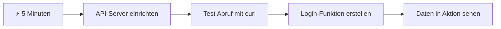
- **Minute 1-2**: Starten Sie Ihren API-Server (`cd api && npm start`) und testen Sie die Verbindung
- **Minute 3**: Erstellen Sie eine grundlegende `getAccount()`-Funktion mit fetch
- **Minute 4**: Verbinden Sie das Login-Formular mit `action="javascript:login()"`
- **Minute 5**: Testen Sie das Login und beobachten Sie, wie Kontodaten in der Konsole erscheinen

**Schnelltest-Befehle**:
```bash
# Überprüfen, ob die API läuft
curl http://localhost:5000/api

# Testen des Abrufs von Kontodaten
curl http://localhost:5000/api/accounts/test
```

**Warum das wichtig ist**: In 5 Minuten erleben Sie die Magie des asynchronen Datenabrufs, der jede moderne Webanwendung antreibt. Das ist die Grundlage, die Apps reaktionsschnell und lebendig wirken lässt.

## 🗺️ Ihre Lernreise durch datengetriebene Webanwendungen

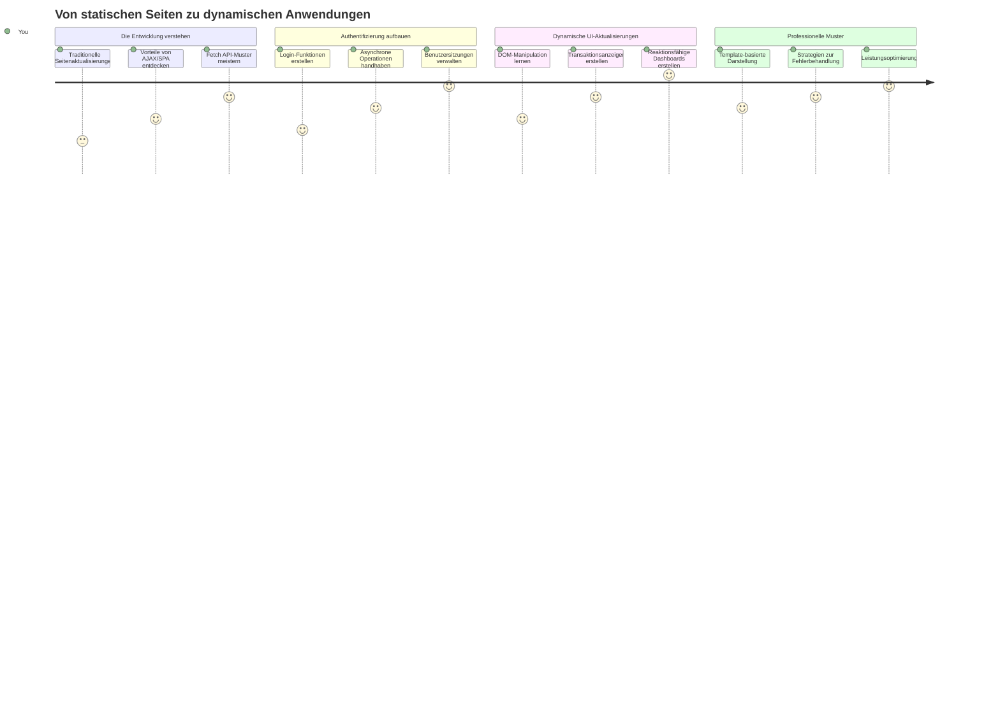
**Ihr Lernziel**: Am Ende dieser Lektion verstehen Sie, wie moderne Webanwendungen Daten dynamisch abrufen, verarbeiten und anzeigen, um die nahtlosen Benutzererlebnisse zu schaffen, die wir von professionellen Anwendungen erwarten.

## Vorbereitendes Quiz

[Vorbereitendes Quiz](https://ff-quizzes.netlify.app/web/quiz/45)

### Voraussetzungen

Bevor Sie mit dem Datenabruf beginnen, stellen Sie sicher, dass Sie diese Komponenten bereithalten:

- **Vorherige Lektion**: Schließen Sie das [Login- und Registrierungsformular](../2-forms/README.md) ab – darauf bauen wir auf
- **Lokaler Server**: Installieren Sie [Node.js](https://nodejs.org) und [starten Sie den Server-API](../api/README.md) zur Bereitstellung von Kontodaten
- **API-Verbindung**: Testen Sie Ihre Serververbindung mit diesem Befehl:

```bash
curl http://localhost:5000/api
# Erwartete Antwort: "Bank API v1.0.0"
```

Dieser Schnelltest stellt sicher, dass alle Komponenten richtig kommunizieren:
- Verifiziert, dass Node.js auf Ihrem System korrekt läuft
- Bestätigt, dass Ihr API-Server aktiv und antwortfähig ist
- Validiert, dass Ihre App den Server erreichen kann (wie Funkkontakt vor einer Mission prüfen)

## 🧠 Überblick über das Datenmanagement-Ökosystem

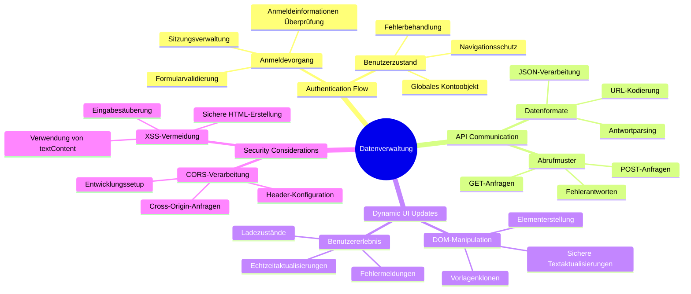
**Grundprinzip**: Moderne Webanwendungen sind Datenorchestrierungssysteme – sie koordinieren zwischen Benutzeroberflächen, Server-APIs und dem Sicherheitsmodell des Browsers, um nahtlose, reaktionsschnelle Erlebnisse zu schaffen.

---

## Verständnis des Datenabrufs in modernen Web-Apps

Die Art und Weise, wie Webanwendungen Daten verarbeiten, hat sich in den letzten zwei Jahrzehnten dramatisch entwickelt. Dieses Verständnis hilft Ihnen zu schätzen, warum moderne Techniken wie AJAX und die Fetch API so mächtig sind und warum sie zu unverzichtbaren Werkzeugen für Webentwickler geworden sind.

Lassen Sie uns erkunden, wie traditionelle Webseiten funktionierten im Vergleich zu den dynamischen, reaktionsschnellen Anwendungen, die wir heute bauen.

### Traditionelle Mehrseitenanwendungen (MPA)

In den frühen Tagen des Webs war jeder Klick wie das Umschalten auf einem alten Fernseher – der Bildschirm wurde leer, dann wurde der neue Inhalt langsam geladen. Dies war die Realität bei frühen Webanwendungen, bei denen jede Interaktion bedeutete, die gesamte Seite komplett neu aufzubauen.

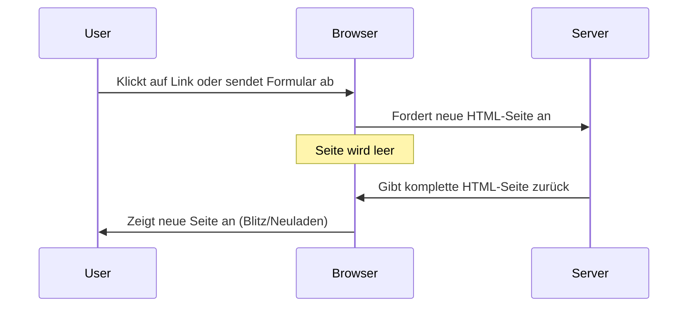
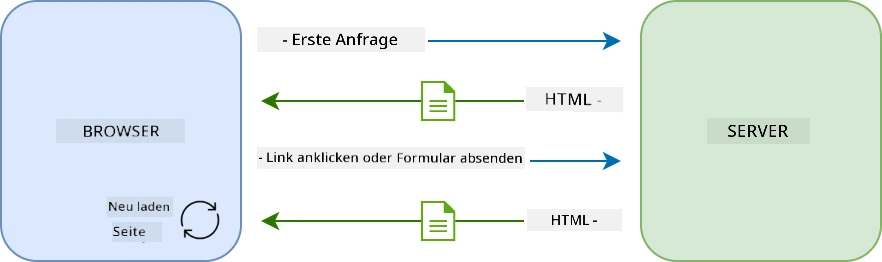

**Warum sich dieser Ansatz schwerfällig anfühlte:**
- Jeder Klick bedeutete, die gesamte Seite neu zu laden
- Nutzer wurden mitten im Gedankenfluss durch diese lästigen Seitenflashes unterbrochen
- Ihre Internetverbindung arbeitete übermäßig, da dieselben Kopf- und Fußzeilen immer wieder heruntergeladen wurden
- Apps fühlten sich eher an wie das Durchklicken in einem Aktenschrank als wie Software

### Moderne Single-Page-Anwendungen (SPA)

AJAX (Asynchronous JavaScript and XML) hat dieses Paradigma komplett verändert. Wie das modulare Design der Internationalen Raumstation, bei dem Astronauten einzelne Komponenten austauschen können, ohne die ganze Struktur neu zu bauen, erlaubt AJAX uns, spezifische Teile einer Webseite zu aktualisieren, ohne alles neu zu laden. Obwohl der Name XML erwähnt, verwenden wir heute meist JSON, aber das Grundprinzip bleibt: Nur das aktualisieren, was sich ändert.

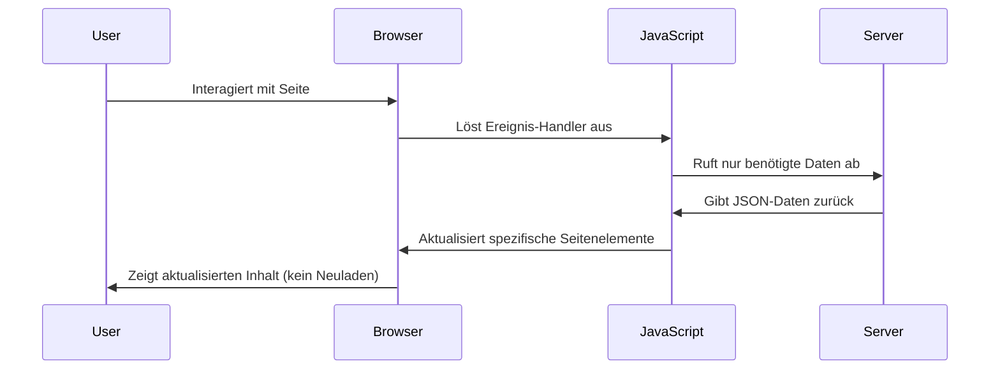
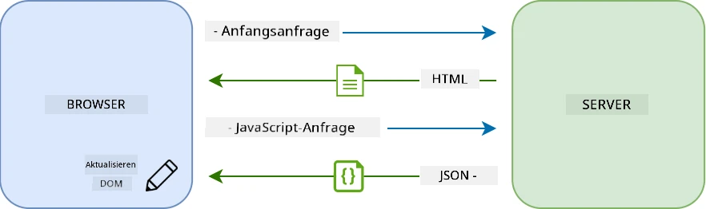

**Warum SPAs sich so viel besser anfühlen:**
- Nur die tatsächlich geänderten Bereiche werden aktualisiert (clever, oder?)
- Keine ruckartigen Unterbrechungen mehr – Ihre Nutzer bleiben im Flow
- Weniger Daten werden übertragen, was schnellere Ladezeiten bedeutet
- Alles wirkt flink und reaktionsschnell, wie die Apps auf Ihrem Smartphone

### Die Entwicklung zur modernen Fetch API

Moderne Browser bieten die [`Fetch` API](https://developer.mozilla.org/docs/Web/API/Fetch_API), die den älteren [`XMLHttpRequest`](https://developer.mozilla.org/docs/Web/API/XMLHttpRequest/Using_XMLHttpRequest) ersetzt. Wie der Unterschied zwischen Telegrafbedienung und E-Mail-Nutzung verwendet die Fetch API Promises für saubereren asynchronen Code und verarbeitet JSON auf natürliche Weise.

| Merkmal | XMLHttpRequest | Fetch API |
|---------|----------------|-----------|
| **Syntax** | Komplex, callback-basiert | Sauber, promise-basiert |
| **JSON-Verarbeitung** | Manuelle Verarbeitung erforderlich | Eingebaute `.json()`-Methode |
| **Fehlerbehandlung** | Begrenzte Fehlerinformationen | Umfangreiche Fehlerdetails |
| **Moderne Unterstützung** | Kompatibilität mit alten Browsern | ES6+ Promises und async/await |

> 💡 **Browser-Kompatibilität**: Gute Nachrichten – die Fetch API funktioniert in allen modernen Browsern! Wenn Sie an bestimmten Versionen interessiert sind, bietet [caniuse.com](https://caniuse.com/fetch) die vollständige Kompatibilitätsübersicht.
> 
**Das Fazit:**
- Funktioniert hervorragend in Chrome, Firefox, Safari und Edge (ganz einfach überall dort, wo Ihre Nutzer sind)
- Nur Internet Explorer benötigt spezielle Unterstützung (und ehrlich gesagt, es ist Zeit, IE loszulassen)
- Bereitet Sie bestens auf die eleganten async/await-Patterns vor, die wir später verwenden werden

### Implementierung von Nutzer-Login und Datenabruf

Nun implementieren wir das Login-System, das Ihre Banking-App von einer statischen Anzeige zu einer funktionalen Anwendung macht. Wie bei den Authentifizierungsprotokollen in sicheren Militäranlagen verifizieren wir Nutzeranmeldeinformationen und gewähren dann Zugriff auf die spezifischen Daten.

Wir bauen dies schrittweise auf, beginnend mit der Basisauthentifizierung und dann der Ergänzung um Datenabruffunktionen.

#### Schritt 1: Erstellen der Login-Funktionsbasis

Öffnen Sie Ihre `app.js` und fügen Sie eine neue `login`-Funktion hinzu. Diese verarbeitet den Nutzer-Authentifizierungsprozess:

```javascript
async function login() {
  const loginForm = document.getElementById('loginForm');
  const user = loginForm.user.value;
}
```

**So funktioniert das im Detail:**
- Das `async` Schlüsselwort sagt JavaScript „hey, diese Funktion könnte auf Dinge warten müssen“
- Wir greifen auf unser Formular der Seite zu (nichts Besonderes, einfach per ID)
- Dann holen wir raus, was der Nutzer als Benutzernamen eingegeben hat
- Ein cooler Trick: Sie können auf jedes Formularelement durch dessen `name`-Attribut zugreifen – keine extra getElementById-Aufrufe nötig!

> 💡 **Formularzugriffsmuster**: Jede Formulareingabe kann über ihren Namen (festgelegt im HTML mit dem `name`-Attribut) als Eigenschaft des Formular-Elements angesprochen werden. Das sorgt für sauberen, lesbaren Code beim Abrufen der Formulardaten.

#### Schritt 2: Erstellen der Konto-Datenabruf-Funktion

Als Nächstes erstellen wir eine dedizierte Funktion, um Kontodaten vom Server abzurufen. Dieses Muster ist ähnlich wie bei Ihrer Registrierungsfunktion, konzentriert sich aber auf das Abrufen von Daten:

```javascript
async function getAccount(user) {
  try {
    const response = await fetch('//localhost:5000/api/accounts/' + encodeURIComponent(user));
    return await response.json();
  } catch (error) {
    return { error: error.message || 'Unknown error' };
  }
}
```

**Was dieser Code leistet:**
- **Verwendet** die moderne `fetch` API für asynchronen Datenabruf
- **Erstellt** eine GET-Anfrage-URL mit dem Benutzernamen als Parameter
- **Setzt** `encodeURIComponent()` ein, um Sonderzeichen in URLs sicher zu handhaben
- **Konvertiert** die Antwort in JSON-Format für einfache Datenverarbeitung
- **Behandelt** Fehler elegant, indem ein Fehlerobjekt zurückgegeben wird, anstatt abzustürzen

> ⚠️ **Sicherheitshinweis**: Die Funktion `encodeURIComponent()` behandelt Sonderzeichen in URLs. Wie bei Kodierungssystemen in der Marine sorgt sie dafür, dass Ihre Nachricht genau so ankommt, wie vorgesehen, und verhindert, dass Zeichen wie "#" oder "&" fehlinterpretiert werden.
> 
**Warum das wichtig ist:**
- Verhindert, dass Sonderzeichen URLs zerstören
- Schützt vor URL-Manipulationsangriffen
- Stellt sicher, dass Ihr Server die vorgesehenen Daten erhält
- Folgt sicheren Programmierpraktiken

#### Verständnis von HTTP GET-Anfragen

Hier etwas, was Sie vielleicht überrascht: Wenn Sie `fetch` ohne zusätzliche Optionen verwenden, erzeugt es automatisch eine [`GET`](https://developer.mozilla.org/docs/Web/HTTP/Methods/GET)-Anfrage. Das passt perfekt zu unserem Zweck – wir fragen den Server „hey, kann ich die Kontodaten dieses Nutzers sehen?“

Stellen Sie sich GET-Anfragen vor wie eine höfliche Bibliotheksanfrage, ein Buch auszuleihen – Sie bitten darum, etwas zu sehen, das bereits existiert. POST-Anfragen (wie bei der Registrierung) sind eher wie das Einreichen eines neuen Buches, das in die Sammlung aufgenommen werden soll.

| GET-Anfrage | POST-Anfrage |
|-------------|--------------|
| **Zweck** | Vorhandene Daten abrufen | Neue Daten an den Server senden |
| **Parameter** | In URL-Pfad/Abfragezeichenfolge | Im Anfragetext (Body) |
| **Caching** | Kann von Browsern zwischengespeichert werden | Meist nicht zwischengespeichert |
| **Sicherheit** | Sichtbar in URL/Logs | Versteckt im Anfragetext |

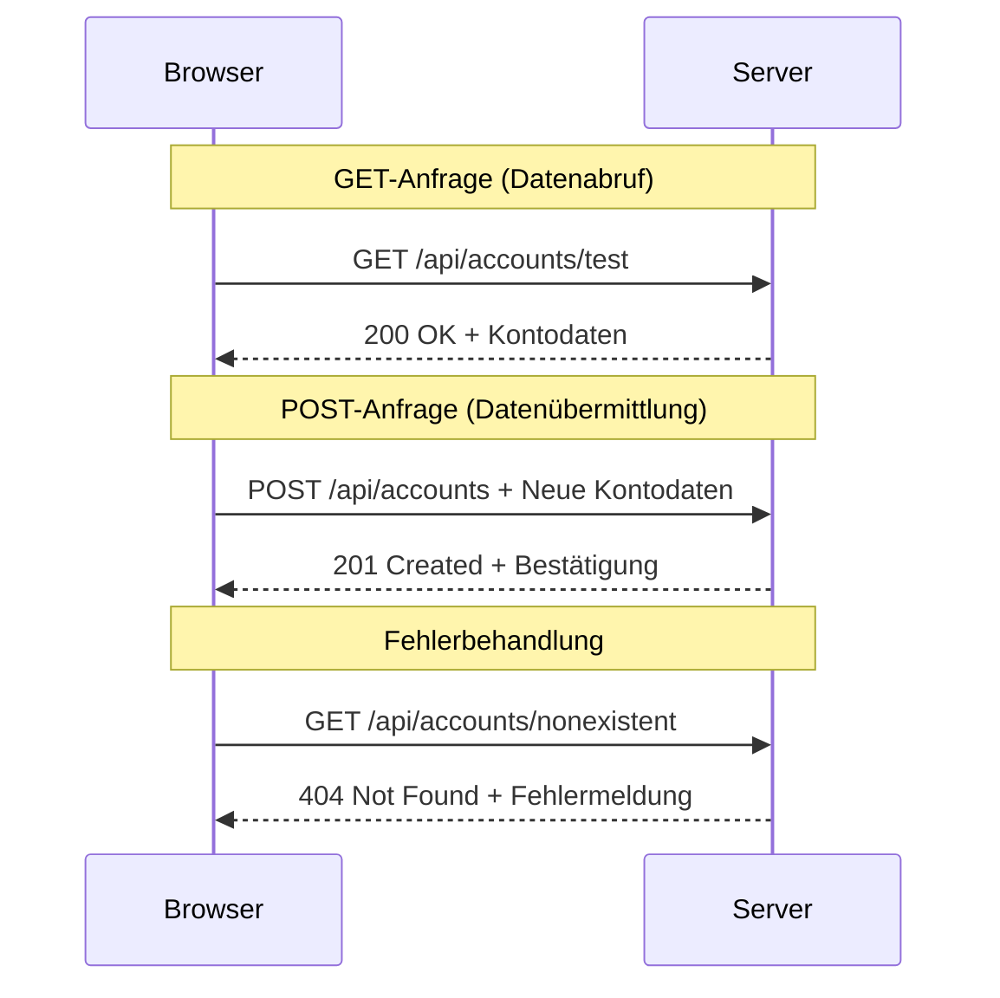
#### Schritt 3: Alles zusammenführen

Jetzt zum befriedigenden Teil – wir verbinden Ihre Kontodaten-Abruf-Funktion mit dem Login-Prozess. Hier fügt sich alles zusammen:

```javascript
async function login() {
  const loginForm = document.getElementById('loginForm');
  const user = loginForm.user.value;
  const data = await getAccount(user);

  if (data.error) {
    return console.log('loginError', data.error);
  }

  account = data;
  navigate('/dashboard');
}
```

Diese Funktion folgt einer klaren Abfolge:
- Den Benutzernamen aus dem Formulareingabefeld extrahieren
- Kontodaten vom Server für den Nutzer anfordern
- Etwaige Fehler während des Prozesses behandeln
- Kontodaten speichern und nach erfolgreichem Login zum Dashboard navigieren

> 🎯 **Async/Await-Muster**: Da `getAccount` asynchron ist, verwenden wir das `await`-Schlüsselwort, um die Ausführung zu pausieren, bis der Server antwortet. Das verhindert, dass der Code mit undefinierten Daten weiterläuft.

#### Schritt 4: Einen Speicherort für Ihre Daten schaffen

Ihre App benötigt einen Ort, um die Kontoinformationen zu speichern, sobald sie geladen sind. Stellen Sie sich das wie das Kurzzeitgedächtnis Ihrer App vor – ein Platz, um die aktuellen Nutzerdaten griffbereit zu halten. Fügen Sie folgende Zeile ganz oben in Ihre `app.js` ein:

```javascript
// Dies enthält die Kontodaten des aktuellen Benutzers
let account = null;
```

**Warum wir das brauchen:**
- Macht Kontodaten überall in der App zugänglich
- Startet mit `null`, was bedeutet: „niemand ist eingeloggt“
- Wird aktualisiert, wenn jemand erfolgreich anmeldet oder sich registriert
- Dient als einzige wahre Datenquelle – keine Verwirrung darüber, wer gerade eingeloggt ist

#### Schritt 5: Formular verbinden

Nun verbinden wir Ihre nagelneue Login-Funktion mit Ihrem HTML-Formular. Aktualisieren Sie das Formular-Tag so:

```html
<form id="loginForm" action="javascript:login()">
  <!-- Your existing form inputs -->
</form>
```

**Was diese kleine Änderung bewirkt:**
- Verhindert, dass das Formular seine Standardaktion „Seite neu laden“ ausführt
- Ruft stattdessen Ihre benutzerdefinierte JavaScript-Funktion auf
- Hält alles flüssig und spa-ähnlich
- Gibt Ihnen die volle Kontrolle darüber, was beim Klick auf „Login“ passiert

#### Schritt 6: Registrierungsfunktion erweitern

Zur Konsistenz aktualisieren Sie Ihre `register`-Funktion ebenfalls, sodass sie Kontodaten speichert und zum Dashboard navigiert:

```javascript
// Fügen Sie diese Zeilen am Ende Ihrer Registrierungsfunktion hinzu
account = result;
navigate('/dashboard');
```

**Diese Verbesserung bietet:**
- **Nahtlosen** Übergang von der Registrierung zum Dashboard
- **Konsistentes** Nutzererlebnis bei Login und Registrierung
- **Sofortigen** Zugriff auf Kontodaten nach erfolgreicher Registrierung

#### Testen Sie Ihre Implementierung

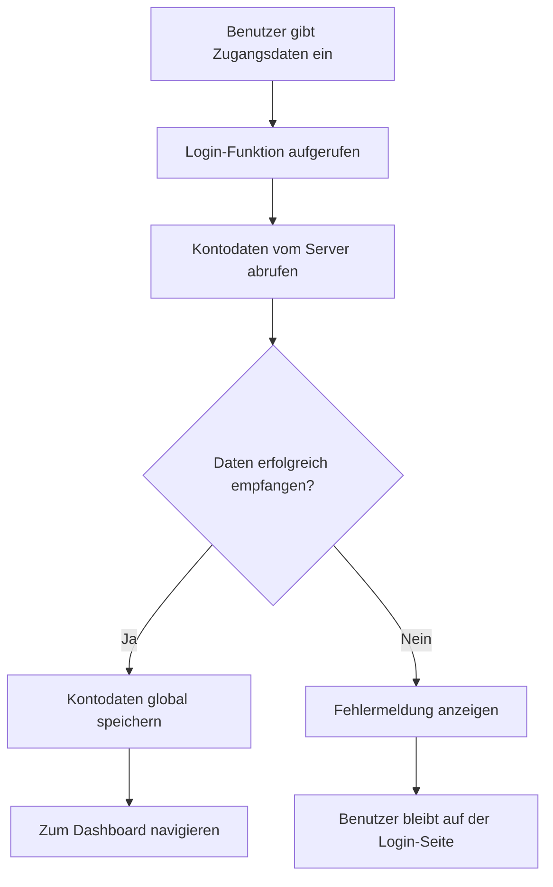
**Zeit für den Praxistest:**
1. Legen Sie ein neues Konto an, um sicherzugehen, dass alles funktioniert
2. Versuchen Sie, sich mit diesen Daten einzuloggen
3. Werfen Sie einen Blick in die Browser-Konsole (F12), wenn etwas komisch erscheint
4. Überprüfen Sie, ob Sie nach erfolgreichem Login auf dem Dashboard landen

Wenn etwas nicht funktioniert, keine Panik! Die meisten Probleme sind einfache Fehler wie Tippfehler oder vergessen, den API-Server zu starten.

#### Ein kurzes Wort zur Cross-Origin-Magie

Vielleicht fragen Sie sich: „Wie kommuniziert meine Web-App mit diesem API-Server, wenn sie auf unterschiedlichen Ports laufen?“ Gute Frage! Das ist etwas, worauf jeder Webentwickler früher oder später stößt.

> 🔒 **Cross-Origin-Sicherheit**: Browser erzwingen eine „Same-Origin-Policy“, um unautorisierte Kommunikation zwischen verschiedenen Domains zu verhindern. Wie ein Kontrollpunkt im Pentagon prüfen sie, ob die Kommunikation erlaubt ist, bevor Daten übertragen werden.
> 
**In unserem Setup:**
- Läuft Ihre Web-App auf `localhost:3000` (Entwicklungsserver)
- Läuft Ihr API-Server auf `localhost:5000` (Backend-Server)
- Der API-Server enthält [CORS-Header](https://developer.mozilla.org/docs/Web/HTTP/CORS), die explizit die Kommunikation mit Ihrer Web-App erlauben

Diese Konfiguration entspricht der realen Entwicklung, bei der Frontend- und Backend-Anwendungen meist auf getrennten Servern laufen.

> 📚 **Mehr erfahren**: Tauchen Sie tiefer in APIs und Datenabruf ein mit diesem umfassenden [Microsoft Learn-Modul zu APIs](https://docs.microsoft.com/learn/modules/use-apis-discover-museum-art/?WT.mc_id=academic-77807-sagibbon).

## Ihre Daten durch HTML zum Leben erwecken

Jetzt machen wir die abgerufenen Daten für Nutzer über DOM-Manipulation sichtbar. Wie im analogen Fotolabor entwickeln wir unsichtbare Daten zu etwas, das Nutzer sehen und mit dem sie interagieren können.
DOM-Manipulation ist die Technik, die statische Webseiten in dynamische Anwendungen verwandelt, die ihre Inhalte basierend auf Benutzerinteraktionen und Serverantworten aktualisieren.

### Die richtige Werkzeugwahl für den Job

Wenn es darum geht, dein HTML mit JavaScript zu aktualisieren, hast du mehrere Optionen. Denk an diese wie verschiedene Werkzeuge in einem Werkzeugkasten – jedes perfekt für bestimmte Aufgaben:

| Methode | Wofür sie großartig ist | Wann man sie benutzt | Sicherheitsstufe |
|--------|-------------------------|---------------------|------------------|
| `textContent` | Sichere Anzeige von Benutzerdaten | Immer wenn du Text anzeigen willst | ✅ Felsenfest |
| `createElement()` + `append()` | Aufbau komplexer Layouts | Neue Abschnitte/Listen erstellen | ✅ Bombensicher |
| `innerHTML` | Setzen von HTML-Inhalten | ⚠️ Versuche, diese Methode zu vermeiden | ❌ Risikohaft |

#### Der sichere Weg, Text anzuzeigen: textContent

Die [`textContent`](https://developer.mozilla.org/docs/Web/API/Node/textContent)-Eigenschaft ist dein bester Freund, wenn es darum geht, Benutzerdaten anzuzeigen. Es ist, als hättest du einen Türsteher für deine Webseite – nichts Gefährliches kommt durch:

```javascript
// Der sichere, zuverlässige Weg, Text zu aktualisieren
const balanceElement = document.getElementById('balance');
balanceElement.textContent = account.balance;
```

**Vorteile von textContent:**
- Behandelt alles als reinen Text (verhindert die Ausführung von Skripten)
- Löscht automatisch vorhandenen Inhalt
- Effizient für einfache Textupdates
- Bietet integrierten Schutz gegen bösartigen Inhalt

#### Dynamische HTML-Elemente erstellen

Für komplexere Inhalte kombiniere [`document.createElement()`](https://developer.mozilla.org/docs/Web/API/Document/createElement) mit der [`append()`](https://developer.mozilla.org/docs/Web/API/ParentNode/append)-Methode:

```javascript
// Sicherer Weg, um neue Elemente zu erstellen
const transactionItem = document.createElement('div');
transactionItem.className = 'transaction-item';
transactionItem.textContent = `${transaction.date}: ${transaction.description}`;
container.append(transactionItem);
```

**So funktioniert dieser Ansatz:**
- **Erstellt** DOM-Elemente programmgesteuert neu
- **Behält** volle Kontrolle über Elementattribute und Inhalte
- **Ermöglicht** komplexe, verschachtelte Elementstrukturen
- **Bewahrt** die Sicherheit, indem Struktur von Inhalt getrennt wird

> ⚠️ **Sicherheitsbedenken**: Obwohl [`innerHTML`](https://developer.mozilla.org/docs/Web/API/Element/innerHTML) in vielen Tutorials auftaucht, kann es eingebettete Skripte ausführen. Wie die Sicherheitsprotokolle am CERN, die unbefugte Codeausführung verhindern, bieten `textContent` und `createElement` sicherere Alternativen.
> 
**Risiken von innerHTML:**
- Führt jegliche `<script>`-Tags in Benutzerdaten aus
- Anfällig für Code-Injection-Angriffe
- Erzeugt mögliche Sicherheitslücken
- Die sichereren Alternativen bieten die gleiche Funktionalität

### Fehler benutzerfreundlich machen

Derzeit erscheinen Login-Fehler nur in der Browser-Konsole, die für Benutzer unsichtbar ist. Wie der Unterschied zwischen den internen Diagnosen eines Piloten und dem Passagierinformationssystem müssen wir wichtige Informationen über den passenden Kanal kommunizieren.

Sichtbare Fehlermeldungen geben den Benutzern sofortiges Feedback darüber, was schiefgelaufen ist und wie sie vorgehen sollten.

#### Schritt 1: Einen Platz für Fehlermeldungen hinzufügen

Zuerst geben wir den Fehlermeldungen einen Platz in deinem HTML. Füge dies direkt vor deinem Login-Button hinzu, damit die Benutzer es natürlich sehen:

```html
<!-- This is where error messages will appear -->
<div id="loginError" role="alert"></div>
<button>Login</button>
```

**Was hier passiert:**
- Wir erstellen einen leeren Container, der unsichtbar bleibt, bis er gebraucht wird
- Er ist dort positioniert, wo Benutzer nach dem Klicken auf "Login" natürlich hinschauen
- Das `role="alert"` ist ein netter Bonus für Screenreader – es signalisiert unterstützenden Technologien „Achtung, wichtig!“
- Die eindeutige `id` gibt unserem JavaScript ein leicht zu findendes Ziel

#### Schritt 2: Eine praktische Helferfunktion erstellen

Lass uns eine kleine Hilfsfunktion schreiben, die den Text eines beliebigen Elements aktualisiert. Eine dieser "einmal schreiben, überall nutzen" Funktionen, die dir Zeit spart:

```javascript
function updateElement(id, text) {
  const element = document.getElementById(id);
  element.textContent = text;
}
```

**Vorteile der Funktion:**
- Einfache Schnittstelle, die nur eine Element-ID und Textinhalt benötigt
- Sucht und aktualisiert DOM-Elemente sicher
- Wiederverwendbares Muster, das Code-Duplizierung verringert
- Sorgt für einheitliches Update-Verhalten in der Anwendung

#### Schritt 3: Fehler dort anzeigen, wo Benutzer sie sehen können

Jetzt ersetzen wir die versteckte Konsolenmeldung durch eine Nachricht, die Benutzer tatsächlich sehen. Aktualisiere deine Login-Funktion:

```javascript
// Anstatt nur in der Konsole zu protokollieren, zeigen Sie dem Benutzer, was falsch ist
if (data.error) {
  return updateElement('loginError', data.error);
}
```

**Diese kleine Änderung bewirkt viel:**
- Fehlermeldungen erscheinen genau dort, wo Benutzer hinschauen
- Keine mysteriösen, stillen Fehler mehr
- Benutzer erhalten sofortiges, umsetzbares Feedback
- Deine App wirkt professionell und durchdacht

Wenn du jetzt mit einem ungültigen Konto testest, siehst du eine hilfreiche Fehlermeldung direkt auf der Seite!


#### Schritt 4: Zugänglichkeit und Inklusion fördern

Etwas Cooles an dem `role="alert"`, das wir eben hinzugefügt haben – es ist nicht nur Dekoration! Dieses kleine Attribut erstellt eine sogenannte [Live Region](https://developer.mozilla.org/docs/Web/Accessibility/ARIA/ARIA_Live_Regions), die Änderungen sofort für Screenreader ansagt:

```html
<div id="loginError" role="alert"></div>
```

**Warum das wichtig ist:**
- Screenreader-Benutzer hören die Fehlermeldung sofort nach ihrem Erscheinen
- Alle erhalten dieselbe wichtige Information, egal wie sie navigieren
- Ein einfacher Weg, damit deine App für mehr Menschen funktioniert
- Zeigt, dass dir inklusive Erlebnisse wichtig sind

Solche kleinen Details trennen gute Entwickler von großartigen!

### 🎯 Pädagogische Zwischenfrage: Authentifizierungsmuster

**Pause und Reflexion**: Du hast gerade einen kompletten Authentifizierungsablauf implementiert. Dies ist ein grundlegendes Muster in der Webentwicklung.

**Kurze Selbstbewertung**:
- Kannst du erklären, warum wir für API-Aufrufe async/await verwenden?
- Was passiert, wenn wir die Funktion `encodeURIComponent()` vergessen?
- Wie verbessert unsere Fehlerbehandlung die Benutzererfahrung?

**Verbindung zur Praxis**: Die Muster, die du hier gelernt hast (asynchrone Datenabfrage, Fehlerbehandlung, Benutzerfeedback), werden in jeder großen Webanwendung verwendet, von sozialen Netzwerken bis zu E-Commerce-Seiten. Du entwickelst Produktionsfähigkeiten!

**Herausforderungsfrage**: Wie könntest du dieses Authentifizierungssystem ändern, damit mehrere Benutzerrollen (Kunde, Administrator, Kassierer) unterstützt werden? Denke über Datenstruktur und UI-Änderungen nach.

#### Schritt 5: Dasselbe Muster für die Registrierung anwenden

Für Konsistenz implementiere eine identische Fehlerbehandlung in deinem Registrierungsformular:

1. **Füge** ein Fehleranzeigeelement zu deinem Registrierungs-HTML hinzu:
```html
<div id="registerError" role="alert"></div>
```

2. **Aktualisiere** deine Registrierung-Funktion, um das gleiche Fehleranzeigen-Muster zu nutzen:
```javascript
if (data.error) {
  return updateElement('registerError', data.error);
}
```

**Vorteile einer einheitlichen Fehlerbehandlung:**
- **Bietet** eine konsistente Benutzererfahrung in allen Formularen
- **Verringert** die kognitive Belastung durch vertraute Muster
- **Vereinfacht** Wartung durch wiederverwendbaren Code
- **Stellt sicher**, dass die Zugänglichkeitsstandards in der gesamten App eingehalten werden

## Erstellung deines dynamischen Dashboards

Jetzt verwandeln wir dein statisches Dashboard in eine dynamische Oberfläche, die echte Kontodaten anzeigt. Wie der Unterschied zwischen einem gedruckten Flugplan und den Live-Abflugtafeln am Flughafen wechseln wir von statischen Infos zu Echtzeit-aktualisierten Anzeigen.

Mit den DOM-Manipulations-Techniken, die du gelernt hast, erstellen wir ein Dashboard, das sich automatisch mit den aktuellen Kontoinformationen aktualisiert.

### Deine Daten kennenlernen

Bevor wir mit dem Bauen beginnen, werfen wir einen Blick darauf, welche Daten dein Server zurückschickt. Wenn sich jemand erfolgreich anmeldet, erhältst du diesen Schatz an Informationen:

```json
{
  "user": "test",
  "currency": "$",
  "description": "Test account",
  "balance": 75,
  "transactions": [
    { "id": "1", "date": "2020-10-01", "object": "Pocket money", "amount": 50 },
    { "id": "2", "date": "2020-10-03", "object": "Book", "amount": -10 },
    { "id": "3", "date": "2020-10-04", "object": "Sandwich", "amount": -5 }
  ]
}
```

**Diese Datenstruktur liefert:**
- **`user`**: Perfekt zur Personalisierung des Erlebnisses ("Willkommen zurück, Sarah!")
- **`currency`**: Damit Beträge korrekt angezeigt werden
- **`description`**: Ein freundlicher Name für das Konto
- **`balance`**: Der wichtige aktuelle Kontostand
- **`transactions`**: Die komplette Transaktionshistorie mit allen Details

Alles, was du brauchst, um ein professionelles Banking-Dashboard zu bauen!

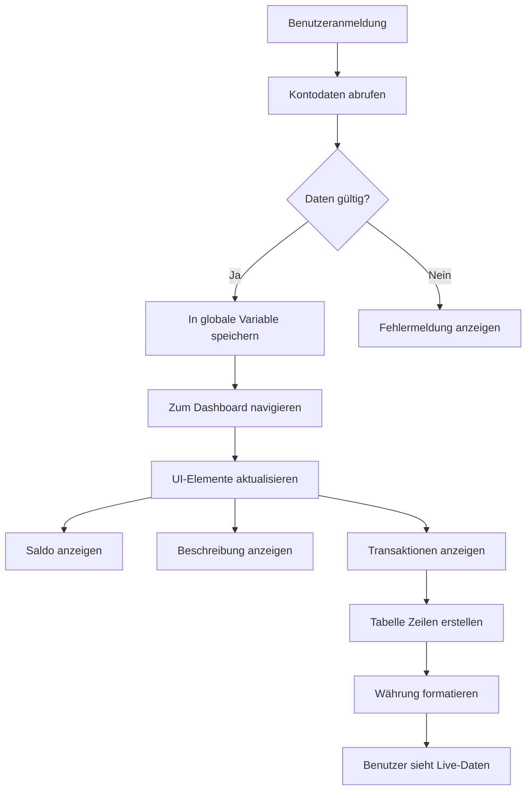
> 💡 **Profi-Tipp**: Möchtest du dein Dashboard sofort in Aktion sehen? Verwende den Benutzernamen `test` beim Einloggen – dieses Konto ist mit Beispieldaten vorinstalliert, damit du ohne vorherige Transaktion alles in Aktion sehen kannst.
> 
**Warum das Testkonto praktisch ist:**
- Hat realistische Beispieldaten vorab geladen
- Perfekt, um zu sehen, wie Transaktionen dargestellt werden
- Ideal zum Testen deiner Dashboard-Funktionalität
- Spart dir das manuelle Erstellen von Dummy-Daten

### Erstellung der Dashboard-Anzeigeelemente

Bauen wir deine Dashboard-Oberfläche Schritt für Schritt auf, angefangen mit der Kontenübersicht und später mit komplexeren Features wie Transaktionslisten.

#### Schritt 1: Aktualisiere deine HTML-Struktur

Zuerst ersetzt du den statischen "Saldo"-Bereich durch dynamische Platzhalter-Elemente, die dein JavaScript befüllen kann:

```html
<section>
  Balance: <span id="balance"></span><span id="currency"></span>
</section>
```

Füge anschließend einen Bereich für die Kontobeschreibung hinzu. Da dies als Titel für den Dashboard-Inhalt dient, verwende semantisches HTML:

```html
<h2 id="description"></h2>
```

**Verständnis der HTML-Struktur:**
- **Verwendet** separate `<span>`-Elemente für Saldo und Währung, um individuelle Kontrolle zu ermöglichen
- **Vergibt** eindeutige IDs für jedes Element, die JavaScript anvisieren kann
- **Nutzt** semantisches HTML durch `<h2>` für die Kontobeschreibung
- **Schafft** eine logische Hierarchie für Screenreader und SEO

> ✅ **Zugänglichkeits-Tipp**: Die Kontobeschreibung fungiert als Titel des Dashboard-Inhalts, daher ist sie semantisch als Überschrift ausgezeichnet. Erfahre mehr darüber, wie [Überschriftenstruktur](https://www.nomensa.com/blog/2017/how-structure-headings-web-accessibility) die Zugänglichkeit verbessert. Kannst du weitere Elemente auf deiner Seite finden, die von Überschriften profitieren könnten?

#### Schritt 2: Erstelle die Dashboard-Aktualisierungsfunktion

Erstelle nun eine Funktion, die dein Dashboard mit echten Kontodaten befüllt:

```javascript
function updateDashboard() {
  if (!account) {
    return navigate('/login');
  }

  updateElement('description', account.description);
  updateElement('balance', account.balance.toFixed(2));
  updateElement('currency', account.currency);
}
```

**Schritt für Schritt erklärt macht diese Funktion:**
- **Prüft**, ob Kontodaten vorhanden sind, bevor sie fortfährt
- **Leitet** nicht authentifizierte Benutzer zurück zur Login-Seite
- **Aktualisiert** die Kontobeschreibung mit der wiederverwendbaren `updateElement`-Funktion
- **Formatiert** den Saldo so, dass immer zwei Nachkommastellen angezeigt werden
- **Zeigt** das passende Währungssymbol an

> 💰 **Geldformatierung**: Die Methode [`toFixed(2)`](https://developer.mozilla.org/docs/Web/JavaScript/Reference/Global_Objects/Number/toFixed) ist ein echter Retter! Sie stellt sicher, dass dein Saldo immer wie echtes Geld aussieht – "75.00" statt nur "75". Deine Benutzer werden geschätztes, vertrautes Währungsformat sehen.

#### Schritt 3: Sicherstellen, dass dein Dashboard aktualisiert wird

Damit dein Dashboard bei jedem Besuch mit aktuellen Daten lädt, müssen wir es in dein Navigationssystem einbinden. Wenn du die [Aufgabe aus Lektion 1](../1-template-route/assignment.md) abgeschlossen hast, kommt dir das bekannt vor. Wenn nicht, keine Sorge – das brauchst du:

Füge dies ans Ende deiner `updateRoute()`-Funktion hinzu:

```javascript
if (typeof route.init === 'function') {
  route.init();
}
```

Dann aktualisiere deine Routen, um die Dashboard-Initialisierung einzubinden:

```javascript
const routes = {
  '/login': { templateId: 'login' },
  '/dashboard': { templateId: 'dashboard', init: updateDashboard }
};
```

**Was diese clevere Einrichtung macht:**
- Prüft, ob eine Route speziellen Initialisierungscode hat
- Führt diesen Code automatisch aus, wenn die Route geladen wird
- Sorgt dafür, dass dein Dashboard immer frische, aktuelle Daten zeigt
- Hält deine Routing-Logik sauber und organisiert

#### Dashboard testen

Teste nach der Implementierung diese Punkte:

1. **Melde dich** mit einem Testkonto an
2. **Vergewissere dich**, dass du zum Dashboard weitergeleitet wirst
3. **Prüfe**, ob Kontobeschreibung, Saldo und Währung korrekt angezeigt werden
4. **Melde dich ab und wieder an**, um sicherzustellen, dass die Daten richtig aktualisiert werden

Dein Dashboard sollte jetzt dynamische Kontoinformationen anzeigen, die auf den angemeldeten Benutzer zugeschnitten sind!

## Intelligente Transaktionslisten mit Templates erstellen

Anstatt HTML für jede Transaktion manuell zu erstellen, verwenden wir Templates, um automatisch einheitliches Format zu erzeugen. Wie standardisierte Bauteile in der Raumfahrtfertigung sorgen Templates dafür, dass jede Transaktionszeile der gleichen Struktur und Darstellung folgt.

Diese Technik skaliert effizient von wenigen bis zu tausenden Transaktionen und garantiert konstante Performance und Layoutqualität.

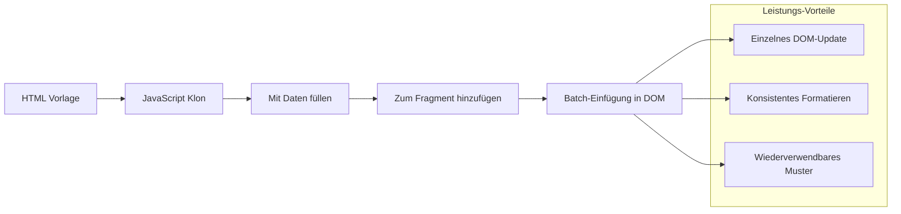
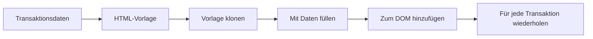
### Schritt 1: Erstelle das Transaktions-Template

Füge zuerst ein wiederverwendbares Template für Transaktionszeilen innerhalb des `<body>` deiner HTML-Datei hinzu:

```html
<template id="transaction">
  <tr>
    <td></td>
    <td></td>
    <td></td>
  </tr>
</template>
```

**Verständnis von HTML-Templates:**
- **Definiert** die Struktur für eine einzelne Tabellenzeile
- **Bleibt** unsichtbar, bis es geklont und mit JavaScript befüllt wird
- **Beinhaltet** drei Zellen für Datum, Beschreibung und Betrag
- **Bietet** ein wiederverwendbares Muster für konsistente Formatierung

### Schritt 2: Bereite deine Tabelle für dynamische Inhalte vor

Füge als Nächstes eine `id` zu deinem Tabellenkörper hinzu, damit JavaScript ihn leicht ansprechen kann:

```html
<tbody id="transactions"></tbody>
```

**Was das bewirkt:**
- **Schafft** ein klares Ziel für das Einfügen von Transaktionszeilen
- **Trennt** die Tabellenstruktur von dynamischen Inhalten
- **Ermöglicht** einfaches Leeren und Wiederbefüllen der Transaktionsdaten

### Schritt 3: Erstelle die Transaktionszeilen-Fabrikfunktion

Erstelle jetzt eine Funktion, die Transaktionsdaten in HTML-Elemente umwandelt:

```javascript
function createTransactionRow(transaction) {
  const template = document.getElementById('transaction');
  const transactionRow = template.content.cloneNode(true);
  const tr = transactionRow.querySelector('tr');
  tr.children[0].textContent = transaction.date;
  tr.children[1].textContent = transaction.object;
  tr.children[2].textContent = transaction.amount.toFixed(2);
  return transactionRow;
}
```

**Aufgeschlüsselt macht diese Fabrikfunktion:**
- **Findet** das Template-Element anhand seiner ID
- **Klont** den Template-Inhalt für sichere Manipulation
- **Wählt** die Tabellenzeile innerhalb des Klons aus
- **Befüllt** jede Zelle mit Transaktionsdaten
- **Formatiert** den Betrag mit korrekten Dezimalstellen
- **Gibt** die fertige Zeile zur Einfügung zurück

### Schritt 4: Effizient mehrere Transaktionszeilen generieren

Füge diesen Code zu deiner `updateDashboard()`-Funktion hinzu, um alle Transaktionen anzuzeigen:

```javascript
const transactionsRows = document.createDocumentFragment();
for (const transaction of account.transactions) {
  const transactionRow = createTransactionRow(transaction);
  transactionsRows.appendChild(transactionRow);
}
updateElement('transactions', transactionsRows);
```

**Warum dieser effiziente Ansatz sinnvoll ist:**
- **Erstellt** ein Dokumentfragment, um DOM-Operationen zu bündeln
- **Iteriert** durch alle Transaktionen im Kontodatensatz
- **Generiert** für jede Transaktion eine Zeile mittels der Fabrikfunktion
- **Sammelt** alle Zeilen im Fragment, bevor sie dem DOM hinzugefügt werden
- **Führt** eine einzelne DOM-Aktualisierung statt vieler Einzel-Insertions durch
> ⚡ **Leistungsoptimierung**: [`document.createDocumentFragment()`](https://developer.mozilla.org/docs/Web/API/Document/createDocumentFragment) funktioniert wie der Montageprozess bei Boeing – Komponenten werden außerhalb der Hauptlinie vorbereitet und dann als komplette Einheit eingebaut. Dieser Batch-Ansatz minimiert DOM-Neuberechnungen, indem eine einzige Einfügung statt mehrerer einzelner Operationen durchgeführt wird.

### Schritt 5: Verbesserung der Update-Funktion für gemischte Inhalte

Ihre `updateElement()`-Funktion verarbeitet derzeit nur Textinhalte. Aktualisieren Sie sie so, dass sie sowohl mit Text als auch mit DOM-Knoten funktioniert:

```javascript
function updateElement(id, textOrNode) {
  const element = document.getElementById(id);
  element.textContent = ''; // Removes all children
  element.append(textOrNode);
}
```

**Wichtige Verbesserungen in diesem Update:**
- **Löscht** vorhandenen Inhalt, bevor neuer Inhalt hinzugefügt wird
- **Akzeptiert** entweder Textstrings oder DOM-Knoten als Parameter
- **Verwendet** die [`append()`](https://developer.mozilla.org/docs/Web/API/ParentNode/append)-Methode für mehr Flexibilität
- **Erhält** die Abwärtskompatibilität mit der bisherigen, textbasierten Nutzung

### Machen Sie eine Probefahrt mit Ihrem Dashboard

Der Moment der Wahrheit ist gekommen! Sehen wir uns Ihr dynamisches Dashboard in Aktion an:

1. Melden Sie sich mit dem `test`-Konto an (es enthält Beispieldaten)
2. Navigieren Sie zu Ihrem Dashboard
3. Überprüfen Sie, ob die Transaktionszeilen mit korrekter Formatierung angezeigt werden
4. Stellen Sie sicher, dass Daten, Beschreibungen und Beträge korrekt dargestellt sind

Wenn alles funktioniert, sollten Sie eine voll funktionsfähige Transaktionsliste auf Ihrem Dashboard sehen! 🎉

**Was Sie erreicht haben:**
- Ein Dashboard gebaut, das mit jeder Datenmenge skaliert
- Wiederverwendbare Templates für eine konsistente Formatierung erstellt
- Effiziente DOM-Manipulationsmethoden implementiert
- Funktionen entwickelt, die mit Produktions-Banking-Apps vergleichbar sind

Sie haben erfolgreich eine statische Webseite in eine dynamische Webanwendung verwandelt.

### 🎯 Pädagogischer Check-in: Dynamische Inhaltserzeugung

**Architekturverständnis**: Sie haben eine ausgefeilte Daten-zu-UI-Pipeline implementiert, die Muster aus Frameworks wie React, Vue und Angular nachahmt.

**Meisterung der Kernkonzepte**:
- **Template-basierte Darstellung**: Erstellen wiederverwendbarer UI-Komponenten
- **Document Fragments**: Optimierung der DOM-Performance
- **Sichere DOM-Manipulation**: Vermeidung von Sicherheitslücken
- **Datenumwandlung**: Umwandlung von Serverdaten in Benutzeroberflächen

**Branchenbezug**: Diese Techniken bilden die Grundlage moderner Frontend-Frameworks. Reacts Virtual DOM, Vues Templatesystem und Angulars Komponentenarchitektur basieren alle auf diesen Kernkonzepten.

**Reflexionsfrage**: Wie würden Sie dieses System erweitern, um Echtzeit-Updates zu verarbeiten (z. B. neue Transaktionen, die automatisch erscheinen)? Denken Sie an WebSockets oder Server-Sent Events.

---

## 📈 Ihr Zeitstrahl zur Datenmanagement-Meisterschaft

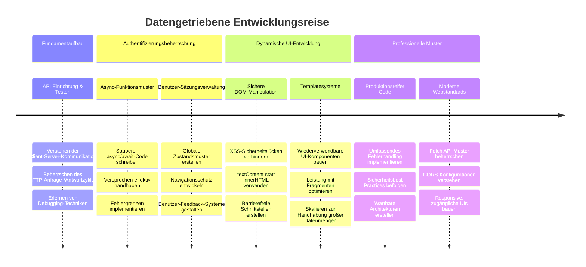
**🎓 Meilenstein zur Abschlussreife**: Sie haben erfolgreich eine vollständige datengetriebene Webanwendung mit modernen JavaScript-Mustern gebaut. Diese Fähigkeiten lassen sich direkt auf Frameworks wie React, Vue oder Angular übertragen.

**🔄 Nächste Fähigkeitsstufe**:
- Bereit, Frontend-Frameworks zu erkunden, die auf diesen Konzepten aufbauen
- Vorbereitet, Echtzeitfunktionen mit WebSockets zu implementieren
- Ausgestattet, Progressive Web Apps mit Offline-Funktionalität zu erstellen
- Fundament gelegt für das Lernen fortgeschrittener State-Management-Muster

## GitHub Copilot Agent Challenge 🚀

Verwenden Sie den Agent-Modus, um die folgende Herausforderung zu meistern:

**Beschreibung:** Erweitern Sie die Banking-App durch Implementierung einer Such- und Filterfunktion für Transaktionen, mit der Benutzer bestimmte Transaktionen nach Datumsbereich, Betrag oder Beschreibung finden können.

**Eingabeaufforderung:** Erstellen Sie eine Suchfunktion für die Banking-App, die umfasst: 1) Ein Suchformular mit Eingabefeldern für Datumsbereich (von/bis), Mindest-/Höchstbetrag und Schlüsselwörter der Transaktionsbeschreibung, 2) Eine `filterTransactions()`-Funktion, die das account.transactions-Array basierend auf den Suchkriterien filtert, 3) Aktualisieren Sie die `updateDashboard()`-Funktion, um gefilterte Ergebnisse anzuzeigen, und 4) Fügen Sie eine Schaltfläche „Filter zurücksetzen“ hinzu, um die Ansicht zu reinigen. Verwenden Sie moderne JavaScript-Array-Methoden wie `filter()` und behandeln Sie Randfälle bei leeren Suchkriterien.

Erfahren Sie mehr über den [Agent-Modus](https://code.visualstudio.com/blogs/2025/02/24/introducing-copilot-agent-mode).

## 🚀 Herausforderung

Bereit, Ihre Banking-App auf die nächste Stufe zu heben? Machen wir sie so schön und benutzerfreundlich, dass man sie wirklich gerne nutzen möchte. Hier ein paar Ideen zur Inspiration:

**Machen Sie sie schön**: Fügen Sie CSS-Styling hinzu, um Ihr funktionales Dashboard visuell ansprechend zu gestalten. Denken Sie an klare Linien, gutes Layout und vielleicht sogar subtile Animationen.

**Machen Sie es responsiv**: Versuchen Sie, [Media Queries](https://developer.mozilla.org/docs/Web/CSS/Media_Queries) zu verwenden, um ein [responsives Design](https://developer.mozilla.org/docs/Web/Progressive_web_apps/Responsive/responsive_design_building_blocks) zu erstellen, das auf Telefonen, Tablets und Desktops gut funktioniert. Ihre Nutzer werden es Ihnen danken!

**Fügen Sie etwas Flair hinzu**: Erwägen Sie die Farbkennzeichnung von Transaktionen (grün für Einnahmen, rot für Ausgaben), das Hinzufügen von Symbolen oder Hover-Effekten, die die Benutzeroberfläche interaktiv wirken lassen.

So könnte ein ausgefeiltes Dashboard aussehen:

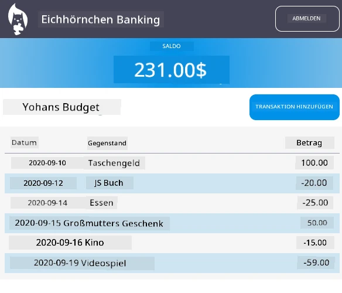

Fühlen Sie sich nicht gezwungen, es exakt nachzumachen – nutzen Sie es als Inspiration und machen Sie es zu Ihrem eigenen!

## Quiz nach der Vorlesung

[Quiz nach der Vorlesung](https://ff-quizzes.netlify.app/web/quiz/46)

## Aufgabe

[Refactoren und Kommentieren Ihres Codes](assignment.md)

---

<!-- CO-OP TRANSLATOR DISCLAIMER START -->
**Haftungsausschluss**:  
Dieses Dokument wurde mithilfe des KI-Übersetzungsdienstes [Co-op Translator](https://github.com/Azure/co-op-translator) übersetzt. Obwohl wir uns um Genauigkeit bemühen, kann es bei automatischen Übersetzungen zu Fehlern oder Ungenauigkeiten kommen. Das Originaldokument in der Originalsprache sollte als maßgebliche Quelle betrachtet werden. Für entscheidende Informationen wird eine professionelle menschliche Übersetzung empfohlen. Wir übernehmen keine Haftung für Missverständnisse oder Fehlinterpretationen, die durch die Nutzung dieser Übersetzung entstehen.
<!-- CO-OP TRANSLATOR DISCLAIMER END -->